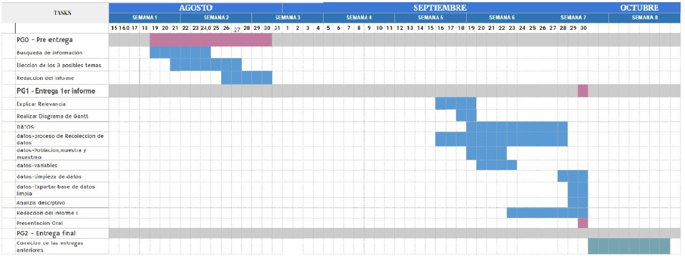

<center>

# **PG1**

{width="432"} <br> <br> <br>

<br> <br> <br> <br> <br> <br> <br> <br>

#### 2022

<br>

======================================================================================================================= <br>

<br> \newpage

# **Informe**

</center>

<br>


## <b style = color:#1C5F9E>Introducción</B>

+ ####   **Relevancia: **
Es importante tener en cuenta los problemas y necesidades que tienen los estudiantes en el campus, ya que son ellos quienes pueden percibir los pro y contras de la institución en la que transcurren la mayor parte de sus días. De esta forma, se podría mejorar y optimizar el campus para que los estudiantes puedan seguir avanzando en sus estudios de forma más eficiente.
<br>
+ #### **Factibilidad: **
Si es factible, dado que la muestra se dará de un subgrupo de alumnos de utec, no habrá dificultad al momento de recolectar los datos requeridos.

**Preguntas de interés**

1. ¿Es el estudio de interés para la audiencia?
    - Si, porque mediante este estudio podemos darnos cuenta sobre las necesidades de la comunidad de UTEC,mejorando así la parte de la infraestructura y la comodidad de todos los miembros.
  
2. ¿Qué información se desea aportar al final del estudio?
    - Datos sobre lo que los miembros de la comunidad de UTEC consideran que necesitan para su convivencia plenamente y comodidad necesaria.
  
3. ¿Es posible llegar a la información que se propone de manera específica y concreta?
    - Si, es posible mediante encuestas, ya que se trabajará directamente con el alumnado.


<br>

+ #### **Planificación: **
{width="1000"}

<br>
<br>

## <b style = color:#1C5F9E>Datos</B>

###   **Recolección de datos**
El proceso de recolección de datos se llevó a cabo por medio de una encuesta, para lo cual fue elaborado un cuestionario en google forms. Las encuestas fueron llenadas por dos medios: mediante grupos de chat (WhatsApp y Telegram) asociados a estudiantes de UTEC, y mediante encuestas en persona pasando el código QR de la misma.

<br>

###   **Población, muestra y muestreo**
***Población de estudio*** → La población del estudio se encuentra conformada por los estudiantes de pregrado de UTEC matriculados en el periodo 2022-2.

***Unidad muestral*** → Alumnos de UTEC

***Tamaño efectivo de la muestra*** → 205 estudiantes.
La muestra es considerada representativa debido a que el muestreo fue por conveniencia de los alumnos de utec ya que hemos elegido horarios a entrevistar en las cuales tuvimos tiempo necesario y la probabilidad de que cierto estudiante UTEC fuera encuestado no era equitativa. Además de encontrarse una gran variedad en las variables: edad, ciclo y carrera.

Nuestro poyecto de investigación tiene un muestreo por conveniencia dado que el número de las observaciones


<br>


###   **Variables**
#### **Descripción**
- `Correo`: Correo institucional del encuestado.

- `Apellidos`: Apellidos del encuestado.

- `Nombres`: Nombres del encuestado.	

- `Fecha` Fecha de nacimiento del encuestado.	

- `Edad`:	Edad del encuestado cumplidos.

- `Código`: Código estudiantil del encuestado.

- `Ciclo`:	Ciclo en el que se encuentra el encuestado.

- `Carrera`: Carrera que estudia el encuestado.

- `AmbienteOcupado`: Ambiente mencionado que el encuestado considera que se encuentra más ocupado.

- `ImplementarSala` : Ambientes de estudio que el encuestado prefiere que implementen.

- `DificultadEncontrarEspacio`: Nivel de dificultad que presenta un estudiante al momento de buscar un espacio libre en UTEC.

- `AscensorLleno`: Frecuencia en la que el estudiante encuentra el ascensor lleno al momento de usarlo.

- `TiempoEsperaAscensor`: Tiempo aproximado (en minutos) que un estudiante espera antes de abordar el ascensor.

- `ComprarAlmuerzo`: Afirma o niega si el estudiante adquiere el menú UTEC.	

- `TiempoMenu`: Tiempo total aproximado (en minutos) que demora el estudiante en adquirir su menú (incluyendo la formación en la fila).	

- `TiempoComer`: Tiempo aproximado (en minutos) que el estudiante emplea para consumir en la cafetería UTEC (horario almuerzo).

- `FilaBaño`: Frecuencia en la que se encuentran filas en los baños UTEC.

- `AfectaFila`: Posibles situaciones que pasa el estudiante debido a estas demoras.

- `ImplementarServicios`: Servicios que prefiere el estudiante que implementaran en UTEC.

- `EspacioDeportivo`:Afirma o siega si desea un espacio deportivo en UTEC.

- `Deportes`: Deporte que el estudiante prefiere que se implemente.

- `Comentario`: Comentario breve acerca del la maqueta del nuevo campus UTEC.

<br>


#### **Tipos y restricciones**
| Nombre | Tipo | Restricción |
|:-------:|:------:|:-----------:|
| Edad | Numérica discreta| Número entero positivo |
| TiempoEsperaAscensor | Numérica continua | Número racional positivo |
| TiempoEsperaMenu | Numérica continua | Número racional positivo |
| TiempoConsumo | Numérica continua | Número racional positivo |
| Dificultad encontrar espacio | Categórica nominal | Casi Siempre, Siempre, A veces, No uso, Poco  |
| Ascensor lleno | Categórica nominal | A veces, Casi siempre, Siempre, Casi nunca, Nunca |
| AmbienteOcupado | Categórica nominal | Bancas al aire libre, Biblioteca, Mesas de comedor, Salas de estudio |
| Carrera | Categórica nominal | Civil, Ambiental, Industrial, A&N Digitales, ComputerScience, Mecatrónica, Eléctronica, Bioingeniería, Química, Mecánica de la Energía, DataScience |
| Comprar Almuerzo | Categórica nominal | Sí, No|
| Fila del baño | Categórica nominal | A veces, Nunca, Siempre, Casi siempre |
| Afecta | Categórica nominal | No logro realizar actividades académicas en la universidad, Llego tarde a mis horarios, La demora consume mi horas libres,No afecta en mi tiempo, No demora mucho |
| Implementar Sala | Categórica nominal | Bancas al aire libre, Biblioteca, Mesas de comedor, Salas de estudio |
|Implementar Servicio| Categórica nominal |Ascensores, Baños individuales, Comedores, Cafeterías;Dispensadores de agua, Máquinas expendedoras, Salas de profesores, Comedor de docentes|
| Espacio deportivo | Categórica nominal |Sí, No|
| Deportes | Categórica nominal | Canchas (futbol, básquet, vóley), Pista para correr, Gimnasio;Sala de baile, No en necesario implementar, Piscina (Natación)

<br>
<br> \newpage

###   **Limpieza de base de datos**
+ Se cargan las librerías necesarias
```{r}
library(readr)
library(dplyr)
library(stringr)
library(ggplot2)
```
+ Se lee el archivo y se eliminan las columnas que no son muy relevantes para el estudio: '¿Es estudiante UTEC?' , 'Marca temporal'
    
```{r}
DataFrame <- read_csv("NUEVO_CAMPUS.csv")
DataFrame <- DataFrame[,!(names(DataFrame) %in% '¿Es estudiante UTEC?') & !(names(DataFrame) %in%'Marca temporal')]
```

+ Cargamos los nombres de las variables

```{r}
names(DataFrame)
```
Y a partir de ello se cambian los nombres de las variables para una mejor comprensión de datos
```{r}
DataFrame %>% rename(Correo='Nombre de usuario',
                     Fecha=`Fecha de nacimiento:`,
                     Codigo =`Código de alumno:`,Ciclo=`Ciclo:`,
                     Nombres =`Nombres:`,Apellidos=`Apellidos:`,
                     Carrera=`Carrera:`,
                     AmbienteOcupado= '¿Qué ambientes de estudio observas que son los más ocupados por los estudiantes UTEC?',
                     ImplementarSala= '¿Cuál de los anteriores espacios te gustaría que implementaran en el nuevo campus?',
                     DificultadEncontrarEspacio='¿Se te dificulta encontrar algún espacio para estudiar?',
                     AscensorLleno= '¿Qué tan seguido notas que el ascensor viene lleno?',
                     TiempoEsperaAscensor='¿Cuánto tiempo aproximadamente esperas el ascensor?',
                     ComprarAlmuerzo= '¿Compras almuerzo en la universidad?', 
                     TiempoMenu= '¿Cuánto tiempo aproximadamente demoras en reclamar tu menú?', 
                     FilaBaño='¿Realizas fila para el uso del baño?', 
                     AfectaFila= '¿De qué manera afecta el tiempo empleado para alguna de la actividades anteriores en tu día? (uso de ascensores, comedor, baños)',ImplementarServicios= '¿Cuál de los espacios te gustaría que implementaran?', 
                     EspacioDeportivo='¿Te gustaría que implementaran espacios para hacer deporte en el nuevo campus?',
                     Deportes='¿Qué espacios deportivos te gustarían que hubieran en el nuevo campus?',
                     Comentario ='¡MODELO PROPUESTO DEL NUEVO CAMPUS!  ¿Algún comentario que desees añadir?', EstadíaU='¿Te quedas todo el día en la U?') -> DataFrameOFC
```
+ Ordenaremos los datos de manera alfabética en relación a sus apellidos y por ende intercambiamos las posiciones de las columnas `Nombres` y `Apellidos`
```{r}
DataFrameOFC %>% rename(Nombres =`Apellidos`,Apellidos=`Nombres`)-> DataFrameOFC
```
```{r}
temp=DataFrameOFC$Apellidos
DataFrameOFC$Apellidos=DataFrameOFC$Nombres
DataFrameOFC$Nombres=temp
```
Ordenando alfabéticamente en relación a la variable `Apellidos`:
```{r}
DataFrameOFC<- DataFrameOFC[order(DataFrameOFC$Apellidos),]
```

+ Observar el tipo de variable que es cada una según R

```{r}
str(DataFrameOFC)
```
+ Se observa que la única variable correctamente definida por R es `Edad` (numérica), las demás son categóricas, entonces se cambian a su tipo correspondiente:
```{r}
numCol <- c("Edad") #Seleccionando las col Numéricas
FactCol <- names(DataFrameOFC)[!names(DataFrameOFC) %in% numCol]
#DataFrameOFC[FactCol] <- lapply(DataFrameOFC[FactCol], FUN = factor)
for (i in FactCol) {
  as.character(i)}
```
```{r}
str(DataFrameOFC) #Comprobar el cambio de tipo
```


**BÚSQUEDA DE DATOS ATÍPICOS EN LAS VARIABLES NUMÉRICAS**
Mediante el uso de `boxplot` se puede analizar algunos datos atípicos que puedan estar presentes.
```{r}
par(mfrow=c(2,2))
boxplot(DataFrameOFC$TiempoEsperaAscensor,main ="Tiempo de espera ascensor", ylab="Minutos",method = "jitter",pch = 19, col = rgb(0,0.5,0.5,0.2),border = "blue")
boxplot(DataFrameOFC$TiempoMenu, main="Tiempo de espera del menú",ylab="Minutos",method = "jitter",pch = 19, col = rgb(1,0,0,0.2),border = "red")
boxplot(DataFrameOFC$TiempoMenu,main ="Tiempo de consumo del menú",ylab="Minutos",method = "jitter",pch = 19, col = rgb(0.5,1,0,0.3),border = "lawngreen")
boxplot(DataFrameOFC$Ciclo, main="Ciclo en que se encuentra",ylab="Ciclo",method = "jitter",pch = 19, col = "lightgoldenrodyellow",border = "yellow")
```
### Modificaciones en variables:
  - Buscamos las variables:
```{r}
names(DataFrameOFC)
```

<br>


#### **Variable Carrera**
  - Se realiza un cambio en los nombres de los valores para evitar que sean demasiado largos pero siguen expresando lo mismo
```{r}
substr(DataFrameOFC$Carrera[1:nrow(DataFrameOFC)], 1, 10) ->temp
for (i in 1:nrow(DataFrameOFC)) {
  if(temp[i]=="Ingeniería"| temp[i]=="Ingenieria"){DataFrameOFC$Carrera[i] <- substring(DataFrameOFC$Carrera[i],first = 11)}
  else if(DataFrameOFC$Carrera[i]=="Ciencia de la Computación"){DataFrameOFC$Carrera[i]<- "ComputerScience"}
  else if(DataFrameOFC$Carrera[i]=="Ciencia de Datos"){DataFrameOFC$Carrera[i]<- "DataScience"}
  else if(DataFrameOFC$Carrera[i]=="Administración & Negocios Digitales"){DataFrameOFC$Carrera[i]<- "A&N Digitales"}}
```

<br>

#### **Variable AmbienteOcupado**
  - Debido a la selección múltiple realizada por los encuestados, para definir la frecuencia de cada valor que puede tomar se hace un llamado a todas las veces en la que el enunciado es nombrado
```{r}
Bancas<- c(grep("Bancas", DataFrameOFC$AmbienteOcupado))
Mesas<- c(grep("Mesas", DataFrameOFC$AmbienteOcupado))
Biblioteca<- c(grep("Biblioteca", DataFrameOFC$AmbienteOcupado))
Salas<- c(grep("Salas", DataFrameOFC$AmbienteOcupado))

#CFRECUENCIAS:
CantBancas <-length(Bancas)

CantMesas <-length(Mesas)
CantBiblioteca <-length(Biblioteca)
CantSalas <-length(Salas)
```
Las variables creadas: CantBancas, CantMesas, CantBiblioteca y CantSalas, devuelven la frecuencia de cada valor que toma la variable.
 
<br>

#### **Variable ImplementarSala**
```{r}
MasBancas<- c(grep("Bancas", DataFrameOFC$ImplementarSala))
MasMesas<- c(grep("Comedor", DataFrameOFC$ImplementarSala))
MasBiblioteca<- c(grep("Biblioteca", DataFrameOFC$ImplementarSala))
MasSalas<- c(grep("Salas", DataFrameOFC$ImplementarSala))
NoMas <- c(grep("No", DataFrameOFC$ImplementarSala))

#CFRECUENCIAS:
AnadirBancas <-length(MasBancas)
AnadirMesas <-length(MasMesas)
AnadirBiblioteca <-length(MasBiblioteca)
AnadirSalas <-length(MasSalas)
NoAnadir <- length(NoMas)
```

<br>

#### **Variable DificultadEncontrarEspacio**
```{r}
for (i in 1:nrow(DataFrameOFC)) {
  if(DataFrameOFC$DificultadEncontrarEspacio[i]=="A veces, debo ir a buscar en otro lugar luego de que en mi primera opción no haya encontrado espacio."){DataFrameOFC$DificultadEncontrarEspacio[i] <- "A veces"}
  else if(DataFrameOFC$DificultadEncontrarEspacio[i]=="Casi siempre, tengo que recorrer media universidad para encontrar un espacio."){DataFrameOFC$DificultadEncontrarEspacio[i] <- "Casi Siempre"}
  else if(DataFrameOFC$DificultadEncontrarEspacio[i]=="No ocupo ningún espacio de estudio."){DataFrameOFC$DificultadEncontrarEspacio[i] <- "No uso"}
  else if(DataFrameOFC$DificultadEncontrarEspacio[i]=="Poco, siempre que voy al lugar deseado encuentro lugar."){DataFrameOFC$DificultadEncontrarEspacio[i] <- "Poco"}
  else if(DataFrameOFC$DificultadEncontrarEspacio[i]=="Siempre, no encuentro lugar a pesar de buscar por cualquier lado y pierdo más tiempo buscando que estudiando."){DataFrameOFC$DificultadEncontrarEspacio[i] <- "Siempre"}
}
```

<br>

#### **Variable ImplementarServicios**
```{r}
MasAscensores<- c(grep("Ascensores", DataFrameOFC$ImplementarServicios))
MasBañoscompartidos<- c(grep("compartidos", DataFrameOFC$ImplementarServicios))
MasBañosIndividuales<- c(grep("individuales", DataFrameOFC$ImplementarServicios))
MasComedores<- c(grep("Comedores", DataFrameOFC$ImplementarServicios))
MasCafeterías <- c(grep("Cafeterías", DataFrameOFC$ImplementarServicios))
MasAgua<- c(grep("Dispensadores", DataFrameOFC$ImplementarServicios))
MasMaquinas<- c(grep("Máquinas", DataFrameOFC$ImplementarServicios))
MasSalasProfe<- c(grep("Salas", DataFrameOFC$ImplementarServicios))
MasComeProfe<- c(grep("docentes", DataFrameOFC$ImplementarServicios))

#CFRECUENCIAS:
Ascensores<- length(MasAscensores)
Bañoscompartidos<- length(MasBañoscompartidos)
BañosIndividuales<- length(MasBañosIndividuales)
Comedores<- length(MasComedores)
Cafeterías <-length(MasCafeterías)
Agua<- length(MasAgua)
Maquinas<- length(MasMaquinas)
SalasProfe<- length(MasSalasProfe)
ComeProfe<- length(MasComeProfe)

```

<br>

#### **Variable Deportes**
```{r}
AnadirCancha<- c(grep("Canchas", DataFrameOFC$Deportes))
AnadirCorrer<- c(grep("Pista", DataFrameOFC$Deportes))
AnadirGimnasio<- c(grep("Gimnasio", DataFrameOFC$Deportes))
AnadirBaile<- c(grep("Sala", DataFrameOFC$Deportes))
AnadirPiscina <- c(grep("Piscina", DataFrameOFC$Deportes))
AnadirNadaDep<- c(grep("No", DataFrameOFC$Deportes))

Cancha<-length(AnadirCancha)
Correr<- length(AnadirCorrer)
Gimnasio<- length(AnadirGimnasio)
Baile<- length(AnadirBaile)
Piscina <- length(AnadirPiscina)
NadaDep<-length(AnadirNadaDep)

```

<br>

#### **Variable Comentarios**
```{r}
sum(is.na(DataFrameOFC$Comentario))
write_csv(DataFrameOFC,"NUEVOCAMPUS.csv")
```

<br>

\newpage

## <b style = color:#1C5F9E>Análisis Descriptivo</B>
#### **DESCRIPTORES DE DATOS**
  **Tamaño de la muestra**
  
  - ¿Cuántas observaciones hay?
```{r}
cat('Hay',nrow(DataFrameOFC),'observaciones.')
```
  
  - ¿Cuántas observaciones completas?
```{r}
cat('Hay',sum(complete.cases(DataFrameOFC)),'observaciones completas.')
```
  - ¿Cuántas observaciones incompletas?
```{r}
cat('Hay',sum(!complete.cases(DataFrameOFC)),'observaciones incompletas.')
```
  **Número de variables**
  - ¿Cuántas variables hay?
```{r}
cat('Hay',ncol(DataFrameOFC),'variables.')
```
  - ¿De qué tipo?
```{r}
cat('Hay',length(select_if(DataFrameOFC,is.numeric)),'variables numéricas y',length(select_if(DataFrameOFC,is.character)),'categóricas.')
```
  - ¿Cuantos datos faltantes?
```{r}
cat('Hay',sum(is.na(DataFrameOFC)),'datos faltantes en total.')
```
  
<br>

#### **DESCRIPTORES NUMÉRICOS Y GRÁFICOS**

##### **A) UNIVARIADO**
#### Variables numéricas
**Tiempo de espera:**

- **Ascensor**
```{r}
summary(DataFrameOFC$TiempoEsperaAscensor)
cat('Coeficiente de variación:',round (sd(DataFrameOFC$TiempoEsperaAscensor, na.rm = T)/mean(DataFrameOFC$TiempoEsperaAscensor, na.rm = T),2))
ModaAscEsp <-c(names(which.max(table(DataFrameOFC$TiempoEsperaAscensor))),max(table(DataFrameOFC$TiempoEsperaAscensor)))
cat('\nModa:',ModaAscEsp[1],' minutos con',ModaAscEsp[2],'menciones.\n')
```
- **Compra de menú**
```{r}
summary(DataFrameOFC$TiempoMenu[DataFrameOFC$TiempoMenu!=0])
cat('Coeficiente de variación:',round (sd(DataFrameOFC$TiempoMenu[DataFrameOFC$TiempoMenu!=0], na.rm = T)/mean(DataFrameOFC$TiempoMenu[DataFrameOFC$TiempoMenu!=0], na.rm = T),2))
ModaEspAl <-c(names(which.max(table(DataFrameOFC$TiempoMenu[DataFrameOFC$TiempoMenu!=0]))),max(table(DataFrameOFC$TiempoMenu[DataFrameOFC$TiempoMenu!=0])))
cat('\nModa:',ModaEspAl[1],'minutos con',ModaEspAl[2],'menciones.\n')
```
- **Consumo de menú**
```{r}
summary(DataFrameOFC$TiempoComer[DataFrameOFC$TiempoComer!=0])
cat('Coeficiente de variación:',round (sd(DataFrameOFC$TiempoComer[DataFrameOFC$TiempoComer!=0], na.rm = T)/mean(DataFrameOFC$TiempoComer, na.rm = T),2))
```
+ **GRÁFICAS**
Mediante las siguientes gráficas se facilita la visualización de los descriptores numéricos de cada variable evaluada anteriormente, tomando en cuenta que las líneas verticales rojas representan la mediana, las líneas azules la media y las lineas amarillas la moda.

```{r}
mean(DataFrameOFC$TiempoEsperaAscensor[DataFrameOFC$TiempoEsperaAscensor!=0])
```

```{r}
par(mfrow=c(1,3))

par(bg = "gray87") 
hist(DataFrameOFC$TiempoEsperaAscensor[DataFrameOFC$TiempoEsperaAscensor!=0],breaks = 8,main = "\nTiempo de espera\nascensor",cex.main=1.5,ylab = "Frecuencia", xlab = "Intervalos de tiempo\n(minutos)", col = "mintcream")
abline(v=median(DataFrameOFC$TiempoEsperaAscensor[DataFrameOFC$TiempoEsperaAscensor!=0]), col="red")
abline(v=mean(DataFrameOFC$TiempoEsperaAscensor[DataFrameOFC$TiempoEsperaAscensor!=0]), col="darkblue")
abline(v=names(which.max(table(DataFrameOFC$TiempoEsperaAscensor[DataFrameOFC$TiempoEsperaAscensor!=0]))), col="peru")


hist(DataFrameOFC$TiempoMenu[DataFrameOFC$TiempoMenu!=0],cex.main=1.5,breaks = 10,main = "\nTiempo de espera\nmenú",cex.main=1.5,ylab = "Frecuencia",xlab="Intervalos de tiempo\n(minutos)",col = "oldlace")
tm<-DataFrameOFC$TiempoMenu[DataFrameOFC$TiempoMenu!=0]
abline(v=median(DataFrameOFC$TiempoMenu[DataFrameOFC$TiempoMenu!=0]), col="red")
abline(v=mean(tm), col="darkblue")
abline(v=as.numeric(names(which.max(table(tm)))), col="peru")

hist(DataFrameOFC$TiempoComer[DataFrameOFC$TiempoComer!=0],breaks = 8,main = "\nTiempo de consumo\nmenú",cex.main=1.5,ylab = "Frecuencia",xlab = "Intervalos de tiempo\n(minutos)",col = "beige")
m<-DataFrameOFC$TiempoComer[DataFrameOFC$TiempoComer!=0]
abline(v=median(m), col="red")
abline(v=mean(m), col="darkblue")
abline(v=as.numeric(names(which.max(table(m)))), col="peru")


```
- Gráfica `TiempoEsperaAscensor`: Es un histogramas cuyos intervalos tienen una longitud de 5 y como se puede observar, la linea de la media y la mediana están casi en la misma posición (valor de la mediana = 5.976 minutos, valor de la media = 6 minutos).

- Gráfica `TiempoMenú`: Es un histogramas cuyos intervalos tienen una longitud de 2 y como se puede observar, la linea de la media está ligeramenta separada a la izquierda de la mediana (valor de la mediana = 9 minutos, valor de la media = 10.71 minutos).

- Gráfica `TiempoConsumo`: Es un histogramas cuyos intervalos tienen una longitud de 5 y como se puede observar, la linea de la media está ligeramenta separada a la izquierda de la mediana (valor de la mediana = 27 minutos, valor de la media = 23.91 minutos).


- La distribución también puede ser determinada mediante el coeficiente de sesgo:
$$\mbox{Sesgo}= \frac{\sum(x_i - \overline{x})^3\cdot f_i}{s^3}$$
La distribución de los datos es:
1) Asimétrica positiva o a la derecha (o positivamente sesgada): Sesgo>0.
2) Asimétrica negativa o a la izquierda (o netativamente sesgada): Sesgo<0.
3) Simétrica: Sesgo=0.

<br>

#### Variables categóricas
- **Ambientes Ocupados*
```{r}
cat('AMBIENTE OCUPADO: \nSalas de estudio -> ',CantSalas,'\n')
cat('Implementar Espacio de estudio: Salas de estudio -> ',AnadirSalas,'\n')
```

<br>

- **Implementar Servicio**
```{r}
cat('IMPLEMENTAR SERVICIO: \nAscensores -> 133 \n')
  cat('Espacio deportivo: Sí -> 162')
cat('\nDeportes: Cancha -> ',Cancha,'')
```

<br>

- **Dificultad de encontrar espacio**
```{r}
table(DataFrameOFC$DificultadEncontrarEspacio)
ModaEnc <-c(names(which.max(table(DataFrameOFC$DificultadEncontrarEspacio))),max(table(DataFrameOFC$DificultadEncontrarEspacio)))
cat('\nModa:" ',ModaEnc[1],'" con',ModaEnc[2],'menciones.')
```

<br>

- **Frecuencia del ascensor lleno**
```{r}
table(DataFrameOFC$AscensorLleno)
ModaAscLl <-c(names(which.max(table(DataFrameOFC$AscensorLleno))),max(table(DataFrameOFC$AscensorLleno)))
cat('\nAscensor lleno: "',ModaAscLl[1],'" con',ModaAscLl[2],'menciones.')
```

<br>

- **Compra menú en UTEC**
```{r}
table(DataFrameOFC$ComprarAlmuerzo)
ModaCompAl <-c(names(which.max(table(DataFrameOFC$ComprarAlmuerzo))),max(table(DataFrameOFC$ComprarAlmuerzo)))
cat('\nModa:',ModaCompAl[1],'minutos con',ModaCompAl[2],'menciones.')
```

<br>

- **Encuentra fila al baño**
```{r}
table(DataFrameOFC$FilaBaño)
ModaFilBa <-c(names(which.max(table(DataFrameOFC$FilaBaño))),max(table(DataFrameOFC$FilaBaño)))
cat('\nModa: "',ModaFilBa[1],'" con',ModaFilBa[2],'meciones.')
```
<br>

- **Impacto de las demoras**
```{r}
ModaAfectFil <-c(names(which.max(table(DataFrameOFC$AfectaFila))),max(table(DataFrameOFC$AfectaFila)))
cat('\nModa: "',ModaAfectFil[1],'" con',ModaAfectFil[2],'menciones.\n')
```

<br>

+ **GRÁFICAS**
A través de las siguientes gráficas, se facilita la visualización de los descriptores geográficos correspondientes: Moda, de cada variable evaludada anteriormente.

<br>

```{r}
#DATOS OBTENIDOS DE: table(DataFrameOFC$AfectaFila)

names_<-c("No logro realizar actividades académicas","Llego tarde a mis horarios","Consume mi horas libres","No hay demora","No me afecta")
numerosss<-c(50,95,60,1,1)

datos <- data.frame(Consecuencia=names_, Frecuencia=numerosss)
ggplot() + 
 geom_bar(data=datos,aes(x=Consecuencia, y=Frecuencia,fill=NULL),stat='identity', position='dodge',fill="darkred")+
    ggtitle("Impacto de la demora en la rutina del estudiante UTEC")+  theme(plot.title = element_text(hjust = 2.5))+
 coord_flip()
```
```{r}

par(mfrow=c(2,1))
par(bg = "gray95") 
barplot(table(DataFrameOFC$FilaBaño), main = "Fila en el baño",xlab = "Estudiantes",ylab = "Frecuencia",col = "blueviolet")


barplot(table(DataFrameOFC$ComprarAlmuerzo), main = "Compra almuerzo UTEC",xlab = "Estudiantes",ylab = "Afirmación o negación",col = "springgreen4")

```
```{r}
par(mfrow=c(2,1))
par(bg = "gray95") 
barplot(table(DataFrameOFC$AscensorLleno), main = "Frecuancia del ascensor lleno",ylab = "Estudiantes",xlab = "Frecuencia",col = "lightblue4")

barplot(table(DataFrameOFC$DificultadEncontrarEspacio), main = "Dificultad de encontrar espacio",ylab = "Estudiantes",xlab = "Frecuencia",col = "orangered3")

```

<br>

##### **B) Bivariado**

- Relación entre el tiempo de espera del menú y el tiempo que almuerza el estudiante
```{r}
par(bg = "gray95") 
plot(DataFrameOFC$TiempoMenu, DataFrameOFC$TiempoComer,pch =20, col=rgb(0,0,1,0.2),xlim = c(3,25.5),main = "Relación entre el tiempo de espera del menú\ny el tiempo que almuerza el estudiante",xlab = "Tiempo de espera del menú (minutos)", ylab = "Tiempo que almuerza (minutos)")

grid(nx = NA,
     ny = NULL,
     lty = 2, col = "gray", lwd = 2)

```

Como se puede observar en el gráfico, la fuerza de correlación entre la variable TiempoEspera y TiempoMenú son fuertes negativas. Esto quiere decir que ambas están siendo inversamente proporcional a la otra, es decir, mayor `TiempoEstudio` y `Tiempo que alduerza`. A partir del gráfico se puede concluir que cada vez que a un estudiante le demora en recibir su menú, este debe apresurarse al comer.


<br>

- Tiempo de espera del ascensor vs estado del ascensor
```{r}

barplot(table(DataFrameOFC$AscensorLleno,DataFrameOFC$TiempoEsperaAscensor),xlab = "Tiempo de espera del ascensor (minutos)",ylab = "Frecuencia",main = "Tiempo de espera del ascensor vs estado del ascensor",col = c("plum4", "plum3","plum2","pink","mistyrose"))
legend('right',legend=rownames(table(DataFrameOFC$AscensorLleno,DataFrameOFC$TiempoEsperaAscensor)), bty='n', title = "Ascensor lleno", fill = c("lightpink", "lightpink1","lightpink2","lightpink3","lightpink4"))

grid(nx = NA,
     ny = NULL,
     lty = 1, col = "gray", lwd = 1)

```

<br>

- Preferencia vs frecuencia en la que se encuentra sin espacio
```{r}

names_2<-c(rep('Salas de estudio',5),rep('Biblioteca',5),rep('Mesas de comedor',5),rep('Bancas de estudio',5),rep('No añadir',5))

Frecuencia2<-c(sum(c(DataFrameOFC$DificultadEncontrarEspacio[MasSalas]=="Casi Siempre")),sum(c(DataFrameOFC$DificultadEncontrarEspacio[MasSalas]=="Siempre")),sum(c(DataFrameOFC$DificultadEncontrarEspacio[MasSalas]=="A veces")),sum(c(DataFrameOFC$DificultadEncontrarEspacio[MasSalas]=="No uso")),sum(c(DataFrameOFC$DificultadEncontrarEspacio[MasSalas]=="Poco")),sum(c(DataFrameOFC$DificultadEncontrarEspacio[MasBiblioteca]=="Casi Siempre")),sum(c(DataFrameOFC$DificultadEncontrarEspacio[MasBiblioteca]=="Siempre")),sum(c(DataFrameOFC$DificultadEncontrarEspacio[MasBiblioteca]=="A veces")),sum(c(DataFrameOFC$DificultadEncontrarEspacio[MasBiblioteca]=="No uso")),sum(c(DataFrameOFC$DificultadEncontrarEspacio[MasBiblioteca]=="Poco")),sum(c(DataFrameOFC$DificultadEncontrarEspacio[MasMesas]=="Casi Siempre")),sum(c(DataFrameOFC$DificultadEncontrarEspacio[MasMesas]=="Siempre")),sum(c(DataFrameOFC$DificultadEncontrarEspacio[MasMesas]=="A veces")),sum(c(DataFrameOFC$DificultadEncontrarEspacio[MasMesas]=="No uso")),sum(c(DataFrameOFC$DificultadEncontrarEspacio[MasMesas]=="Poco")),sum(c(DataFrameOFC$DificultadEncontrarEspacio[MasBancas]=="Casi Siempre")),sum(c(DataFrameOFC$DificultadEncontrarEspacio[MasBancas]=="Siempre")),sum(c(DataFrameOFC$DificultadEncontrarEspacio[MasBancas]=="A veces")),sum(c(DataFrameOFC$DificultadEncontrarEspacio[MasBancas]=="No uso")),sum(c(DataFrameOFC$DificultadEncontrarEspacio[MasBancas]=="Poco")),sum(c(DataFrameOFC$DificultadEncontrarEspacio[NoAnadir]=="Casi Siempre")),sum(c(DataFrameOFC$DificultadEncontrarEspacio[NoAnadir]=="Siempre")),sum(c(DataFrameOFC$DificultadEncontrarEspacio[NoAnadir]=="A veces")),sum(c(DataFrameOFC$DificultadEncontrarEspacio[NoAnadir]=="No uso")),sum(c(DataFrameOFC$DificultadEncontrarEspacio[NoAnadir]=="Poco")))

CasiSiempre<-c("Casi Siempre","Siempre","A veces","No uso","Poco","Casi Siempre","Siempre","A veces","No uso","Poco","Casi Siempre","Siempre","A veces","No uso","Poco","Casi Siempre","Siempre","A veces","No uso","Poco","Casi Siempre","Siempre","A veces","No uso","Poco")
```
```{r}
datos <- data.frame(nombre=names_2,Frecuencia=CasiSiempre, valor=Frecuencia2
                    )

ggplot() + 
 geom_bar(data=datos,aes(x=nombre, y=valor,fill=Frecuencia), stat='identity', position='dodge') +xlab("Implementar")+ylab("Preferencia")+ggtitle("Preferencia de la sala que desean añadir\ncon relación a las veces en que la encuentran ocupada")+theme(plot.title = element_text(hjust = 0.5))+
 coord_flip()
```

<br>

\newpage

## <b style = color:#1C5F9E>Analisis probabilístico</B>

### **VARIABLES ALEATORIAS**
```{r}
par(mfrow=c(2,3))
par(bg = "gray98") 


hist(DataFrameOFC$TiempoEsperaAscensor[DataFrameOFC$TiempoEsperaAscensor!=0],breaks = 8,main = "Tiempo de espera\nascensor",ylab = "Frecuencia", xlab = "Intervalos de tiempo\n(minutos)", col = "mintcream")
grid(nx = NA,
     ny = NULL,
     lty = 1, col = "gray", lwd = 1)

hist(DataFrameOFC$TiempoMenu[DataFrameOFC$TiempoMenu!=0],breaks = 10,main = "Tiempo de espera\nmenú",ylab = "Frecuencia",xlab="Intervalos de tiempo\n(minutos)",col = "oldlace")
grid(nx = NA,
     ny = NULL,
     lty = 1, col = "gray", lwd = 1)

hist(DataFrameOFC$TiempoComer[DataFrameOFC$TiempoComer!=0],breaks = 8,main = "Tiempo de consumo\nmenú",ylab = "Frecuencia",xlab = "Intervalos de tiempo\n(minutos)",col = "beige")
grid(nx = NA,
     ny = NULL,
     lty = 1, col = "gray", lwd = 1)

plot(table(DataFrameOFC$AscensorLleno),ylab = "Frecuencia",main="Frecuencia del ascensor lleno",col="seagreen")
grid(nx = NA,
     ny = NULL,
     lty = 1, col = "gray", lwd = 1)

plot(table(DataFrameOFC$DificultadEncontrarEspacio),ylab = "Frecuencia",main="Frecuencia de encontrar\nlugar lleno",col="red4")
grid(nx = NA,
     ny = NULL,
     lty = 1, col = "gray", lwd = 1)

plot(table(DataFrameOFC$FilaBaño),ylab = "Frecuencia",main="Frecuencia de fila en el baño",col="khaki3")
grid(nx = NA,
     ny = NULL,
     lty = 1, col = "gray", lwd = 1)
```

<br>

### **Variable: `TiempoEsperaAscensor`**
```{r}
summary(DataFrameOFC$TiempoEsperaAscensor[DataFrameOFC$TiempoEsperaAscensor!=0])
cat('Desviación estándar:',round(sd(DataFrameOFC$TiempoEsperaAscensor[DataFrameOFC$TiempoEsperaAscensor!=0], na.rm = TRUE),2))
```
```{r}
listaAsc<-DataFrameOFC$TiempoEsperaAscensor[DataFrameOFC$TiempoEsperaAscensor!=0&DataFrameOFC$TiempoEsperaAscensor<=11 ]

mediaAsc<-mean(listaAsc,na.rm = T)
mediaAsc

desvAcs<-sd(listaAsc,na.rm=TRUE)
desvAcs

medianaAsc<- median(listaAsc,na.rm=TRUE)
medianaAsc
```
```{r}
nuevaMediaAsc <- 5.95
nuevaDesvAsc <- 2.2

hist(listaAsc,breaks=10, freq=FALSE, main="Histograma de tiempo de espera en el ascensor", xlab="Tiempo (minutos)",ylab="Densidad", col="lavender",xlim = c(0,11),ylim = c(0,0.25))
abline(v=medianaAsc, col="red")
abline(v=nuevaMediaAsc, col="blue")
abline(v=as.numeric(names(which.max(table(m)))), col="yellow")


lines(density(listaAsc, na.rm=TRUE),col="red",lwd=3)


curve(dnorm(x, nuevaMediaAsc,nuevaDesvAsc), lwd = 2, col = "blue", add = T)
legend("topright", c("Curva observada", "Curva teórica (Normal)"),
       lty = 1, lwd = 2, col = c("red", "blue"), bty = "n",
       cex = 0.8)
```

Se observa semejanza entre la curva observada y la curva teórica.
```{r}
nuevaMediaAsc
medianaAsc
table(DataFrameOFC$TiempoEsperaAscensor) #MODA
```
El valor de la media y la mendiana tienen una diferencia de aproximadamente 0.347, se puede considerar como simétrica.
<br>
Se denominará un comportamiento de distribución normal con parámetros:
$$μ=5.9~,~σ=2.3$$

$$P ∼ Nor(5.9,2.3)$$

Luego de identificar el comportamiento que posee esta variable, podemos hallar algunas probabilidades que ayudarán en el análisis del estudio:

<br>

Se elige una observación al azar para corroborar que los ascensores sean suficientes y faciliten la llegada al piso correspondiente,
**¿cuál es la probabilidad que la observación elegida sea de un estudiante que espera menor o igual a s min?**

  - Nos piden hallar:
  
$$P(X≤s)$$
Despuès de haber realizado un estudio enfocado en mejorar el nuevo campus de la UTEC, se trabajo con el anàlisis de distintas variables aleatorias. Considerando a la aleatoria que expresa el tiempo que un estudiante espera para poder tomar el ascensor, se dice que èsta variable se distribuye de manera normal, con paràmetros μ=5.9,σ=2.3. Determinar, cuàl es la probabilidad de que un estudiante tenga que esperar màs de 5 minutos para poder ir al piso que desea. 

```{r}
p_esperarmas5 <- pnorm(5, mean=5.9, sd=2.3, lower.tail=FALSE)

cat('La probabilidad de que un estudiante tenga que esperar màs de 5 minutos para poder ir al piso que desea es',round(p_esperarmas5,2),'.\n')
```


```{r}
par(mfrow = c(1, 2))
densidadASc<- density(listaAsc)
plot(densidadASc, lwd = 2, col = "red",
     main = "Variación de curvas", ylim=c(0,0.17),ylab="Densidad")
curve(dnorm(x,nuevaMediaAsc,nuevaDesvAsc), lwd = 2, col = "blue", add = T)
polygon(densidadASc, col = rgb(1, 0, 0, alpha = 0.2))


plot(densidadASc, lwd = 2, col = "white",
     main = "Probabilidad de X de una\nmuestra de 205", ylim=c(0,0.17),ylab="Densidad")
curve(dnorm(x, nuevaMediaAsc,nuevaDesvAsc), lwd = 2, col = "blue", add = T)
   
```


### *Variable: `TiempoComer`*

```{r}
summary(DataFrameOFC$TiempoComer)
cat('Desviación estándar:',round(sd(DataFrameOFC$TiempoComer, na.rm = TRUE),2))
```

```{r}
mediacom<-mean(DataFrameOFC$TiempoComer[DataFrameOFC$TiempoComer!=0],na.rm = T)
mediacom

descom<-sd(DataFrameOFC$TiempoComer[DataFrameOFC$TiempoComer!=0],na.rm=TRUE)
descom

medianacom <- median(DataFrameOFC$TiempoComer[DataFrameOFC$TiempoComer!=0],na.rm=TRUE)
medianacom
```

```{r}
hist(DataFrameOFC$TiempoComer[DataFrameOFC$TiempoComer!=0],breaks=20, freq=FALSE, main="Histograma de tiempo de consumo", xlab="Tiempo (minutos)",ylab="Densidad", col="lavender",ylim = c(0,0.09))


lines(density(DataFrameOFC$TiempoComer[DataFrameOFC$TiempoComer!=0], na.rm=TRUE),col="red",lwd=3)
```
Se observa que entre el intervalo 15-20 empieza un decaimiento y luego vuelve a aumentar la curva, hay que hallar que sucede y si es significativo la muestra entre el intervalo 4-5:

<br>

Mediantes varias comprobaciones, se comprueba que la variable `EstadíaU`se encuentra distribuido y toma el valor de "Sí" en la parte derecha del diagrama y "No" en la parte izquierda:
```{r}
boxplot(DataFrameOFC$TiempoComer[DataFrameOFC$TiempoComer!=0] ~DataFrameOFC$EstadíaU[DataFrameOFC$TiempoComer!=0], col= c("bisque4","burlywood1"),main="Relacion entre variable TiempoComer y EstadíaU",xlab="Día completo",ylab="Tiempo (minutos)") 
abline(h = max(DataFrameOFC$TiempoComer[DataFrameOFC$EstadíaU=="No"]))
```
Se trazó una línea que representa el valor máximo que toma la variable `TiempoEsperaAscensor` lo cual indica que a partir de valores mayores a este, la variable `Día completo` tomará otro valos. Se pueden realizar dos distribuciones a partir de ello: Uno para los que tengan el valor "No" y otro con el valor "Sí" en la variable `EstadíaU`.

<br>

### *Variable: `EstadíaU` - "No"*

En esta ocasión primero nos estamos limitando a aquellos que no suelen pasar la mayoría de su tiempo en la universidad.


```{r}
listaComN<- DataFrameOFC$TiempoComer[DataFrameOFC$TiempoComer!=0 & DataFrameOFC$EstadíaU=="No"]
summary(listaComN)
```

```{r}
mediaCom_N<-mean(listaComN,na.rm = T)
mediaCom_N

desvCom_N<-sd(listaComN,na.rm=TRUE)
desvCom_N

medianaCom_N<- median(listaComN,na.rm=TRUE)
medianaCom_N
```

```{r}
nuevaMediaComN <- 10
nuevaDesvComN <- 5

hist(listaComN,breaks=6, freq=FALSE, main="Histograma de tiempo de alimentación (No frecuentes a estar en UTEC)", xlab="Tiempo (minutos)",ylab="Densidad", col="lavender",xlim = c(4,16),ylim = c(0,0.15))
abline(v=medianaCom_N, col="red")
abline(v=mediaCom_N, col="blue")


lines(density(listaComN, na.rm=TRUE),col="red",lwd=3)

curve(dnorm(x, nuevaMediaComN,nuevaDesvComN ), lwd = 2, col = "blue", add = T)
legend("topright", c("Curva observada", "Curva teórica (Normal)"),
       lty = 1, lwd = 2, col = c("red", "blue"), bty = "n",
       cex = 0.8)
```


Se observa semejanza entre la curva observada y la curva teórica.
```{r}
table(listaComN) #MODA
summary(listaComN)
```
El valor de la media y la mendiana tienen una diferencia de aproximadamente 0.46, se puede considerar como simétrica.
<br>
Se denominará un comportamiento de distribución uniforme en (a,b) donde:
$$a=5~,~b=15$$
Y se denota de la siguiente manera:
$$X ∼ U(5,15)$$
$$E[X]=\frac{a+b}{2}~~~~,~~~~Var[X]=\frac{(b-a)^2}{12}$$

```{r}
a<- 3
b<- 17
par(mfrow = c(1, 2))
densidadComN<- density(listaComN)
plot(densidadComN, lwd = 2, col = "red",
     main = "Variación de curvas", ylim=c(0,0.1),ylab="Densidad")
curve(dunif(x,a,b), lwd = 2, col = "blue", add = T)
polygon(densidadComN, col = rgb(1, 0, 0, alpha = 0.2))


plot(densidadComN, lwd = 2, col = "white",
     main = "Probabilidad de X de una\nmuestra de 205", ylim=c(0,0.17),ylab="Densidad")
curve(dunif(x, a,b), lwd = 2, col = "blue", add = T)

```

Luego de identificar el comportamiento que posee esta variable, podemos hallar algunas probabilidades que ayudarán en el análisis del estudio.


**EJEMPLO:**
Luego de haber recogido la data de un estudio orientado a las mejoras para el nuevo campus de la UTEC, se obtuvieron distintas variables aleatorias, una en particular es la que mide el tiempo en  minutos que un estudiante emplea para consumir en la cafeterìa, limitado únicamente a la estadía de un estudiante en la universidad, se dice que su comportamiento sigue una distribución uniforme dentro del intervalo 0 a 15 minutos. Se desea saber, ¿Cuàl es la probabilidad de que un estudiante emplee a lo mucho 8 minutos en la cafeterìa consumiendo algùn aperitivo?

<br>

Como sabemos que X sigue una distribuciòn uniforme, entonces la probabilidad de que ocurra tal evento es 

$$\mathbb{P}\left ( X\leqslant x \right )= F(\frac{x-a}{b-a})$$

<br>

### *Variable: `EstadíaU` - "Sí"*

En esta ocasión primero nos estamos limitando a aquellos que sí suelen pasar la mayoría de su tiempo en la universidad.


```{r}
listaComS<- DataFrameOFC$TiempoComer[DataFrameOFC$TiempoComer!=0 & DataFrameOFC$EstadíaU=="Sí"]
summary(listaComS)
cat('Desviación estándar:',round(sd(listaComS, na.rm = TRUE),2))
```

```{r}
mediaCom_S<-mean(listaComS,na.rm = TRUE)
mediaCom_S

desvCom_S<-sd(listaComS,na.rm=TRUE)
desvCom_S

medianaCom_S<- median(listaComS,na.rm=TRUE)
medianaCom_S
```

```{r}
nuevaMediaComS <- 27.6
nuevaDesvComS <- 4.24

hist(listaComS,breaks=5, freq=FALSE, main="Histograma de tiempo de alimentación\n(Sí son frecuentes el estar en UTEC)", xlab="Tiempo (minutos)",ylab="Densidad", col="lavender",xlim = c(15,40),ylim = c(0,0.11))
abline(v=medianaCom_S, col="red")
abline(v=mediaCom_S, col="blue")


lines(density(listaComS, na.rm=TRUE),col="red",lwd=3)

curve(dnorm(x, nuevaMediaComS,nuevaDesvComS ), lwd = 2, col = "blue", add = T)
legend("topright", c("Curva observada", "Curva teórica (Normal)"),
       lty = 1, lwd = 2, col = c("red", "blue"), bty = "n",
       cex = 0.8)
```
$$P(X≤s)$$

```{r}


par(mfrow = c(1, 2))
densidadCom_S<- density(listaComS)
plot(densidadASc, lwd = 2, col = "red",
     main = "Variación de curvas", ylim=c(0,0.17),ylab="Densidad")
curve(dnorm(x,nuevaMediaAsc,nuevaDesvAsc), lwd = 2, col = "blue", add = T)
polygon(densidadASc, col = rgb(1, 0, 0, alpha = 0.2))


plot(densidadCom_S, lwd = 2, col = "white",
     main = "Probabilidad de X de una\nmuestra de 205", ylim = c(0,0.11),ylab="Densidad")
curve(dnorm(x, nuevaMediaComS,nuevaDesvComS), lwd = 2, col = "blue", add = T)
   
```
**PROBLEMA:**
¿Cuàl es la probabilidad de que un estudiante que sì se queda mucho en la universidad emplee màs de 6 minutos en la cafeterìa consumiendo algùn aperitivo?

<br>

Como sabemos que X sigue una distribuciòn uniforme, entonces la probabilidad de que ocurra tal evento es 

<br>

$$\mathbb{P}\left ( X\geq x \right )= 1- F(\frac{x-a}{b-a})$$ 
Nuestro valor de $$x=8$$

<br>

$$a=0$$
y $$b=15$$

<br>

Entonces la probabilidad de que suceda dicho evento es:
<br>
$$1-F\left ( \frac{6-0}{15-0} \right )= 0.6 $$
Interpretaciòn:

<br>

La probabilidad de que un estudiante que dijo que sì se queda todo el dìa en la universidad, emplee màs de 6  minutos en la cafeterìa consumiendo algùn aperitivo es de 0.60
<br>

require(rriskDistributions)
x<-(DFN_soloLosQueCompraron6$Promedio)
View(x)
fit.cont(x)
<br>

### *Variable: `TiempoMenú`*

```{r}
listaMen<- DataFrameOFC$TiempoMenu[DataFrameOFC$TiempoMenu!=0]
table(listaMen)

summary(listaMen)
cat('Desviación estándar:',round(sd(listaMen, na.rm = TRUE),2))
```

```{r}
mediaMen<-mean(listaMen,na.rm = T)
mediaMen

desvMen<-sd(listaMen,na.rm=TRUE)
desvMen

medianaMen<-median(listaMen,na.rm=TRUE)
medianaMen
```


```{r}
NuevaMediaMen<-7.6
NuevaDesvMen<-4.1

hist(DataFrameOFC$TiempoMenu[DataFrameOFC$TiempoMenu!=0],breaks=10, freq=FALSE, main="Histograma de tiempo Menu", xlab="Tiempo (minutos)",ylab="Densidad", col="lavender",ylim = c(0.00,0.14), xlim = c(1,26))
abline(v=medianaMen, col="red")
abline(v=NuevaMediaMen, col="blue")
#abline(v=as.numeric(names(which.max(table(listaMen)))), col="yellow")


lines(density(DataFrameOFC$TiempoMenu[DataFrameOFC$TiempoMenu!=0], na.rm=TRUE),col="red",lwd=3)

curve(dnorm(x,NuevaMediaMen, NuevaDesvMen), lwd = 2, col = "blue", add = T)
legend("topright", c("Curva observada", "Curva teórica (normal)"),
       lty = 1, lwd = 2, col = c("red", "blue"), bty = "n",cex=0.8)


```

Se puede observar que las lineas se encuentran inclinadas hacia la izquierda, además la media y la mediana no se encuentran en posiciones similares, por ende no puede ser considerada simétrica (mediana - media = 9 - 7.6 = 2.4). Se le consideraría una distribución F (Fisher–Snedecor):

$$F=\frac{(N1)*(S1)^2/(N1-1)*(σ1)^2}{(N2)*(S2)^2/(N1-1)*(σ2)^2}$$
```{r}
par(mfrow = c(1, 2))
densidadMenu<- density(listaMen)
plot(densidadMenu, lwd = 2, col = "red",
     main = "Variación de curvas", ylim=c(0,0.1),ylab="Densidad")
curve(dnorm(x,7.5,NuevaDesvMen), lwd = 2, col = "blue", add = T)
polygon(densidadMenu, col = rgb(1, 0, 0, alpha = 0.2))


plot(densidadMenu, lwd = 2, col = "white",
     main = "Probabilidad de X de una\nmuestra de 205", ylim = c(0,0.1),ylab="Densidad")
curve(dnorm(x, NuevaMediaMen,NuevaDesvMen), lwd = 2, col = "blue", add = T)
```


