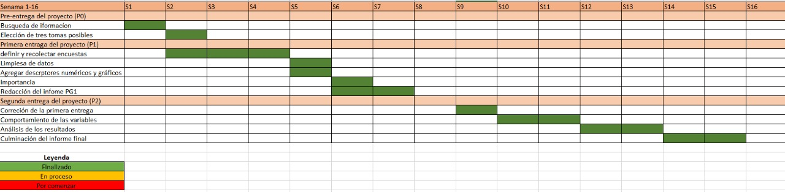

<style type="text/css">
   body{
    font-family: "Helvetica", sans-serif;
    font-size: 16px;
   }
   strong {
    color: #00022e;
   }
   h1, h2 {
    color: #00022e;
   }
  </style>
  <center>
  


# Introducción

## Relevancia    
Ahora que hemos vuelto a la presencialidad , es de gran  importancia conocer cuales son las medidas de bioseguridad que los estudiantes de la UTEC siguen manteniendo dentro de las instalaciones de la universidad, cuales se están dejando de practicar paulatinamente y cuales ya no se realizan, teniendo en cuenta que algunas ya son opcionales según decreto supremo N° 108-2022-PCM, así que la decisión de garantizar un ambiente estudiantil seguro es responsabilidad de todos .

**Objetivo general:**

Identificar las medidas de bioseguridad que los estudiantes de la UTEC practican, mediante un análisis estadístico para medir la frecuencia en que lo realizan

**Objetivos específicos :**

-Realizar una estimación de cuantas medidas de bioseguridad siguen practicando los estudiantes de la UTEC.

-Conocer el grado de seguridad de de los estudiantes respecto a la prevención del COVID-19 en los espacios dentro de la universidad.

-Utilizar descriptores estadísticos para determinar de manera precisa la relación entre variables.


## Planificación

```{r}
library(readr)
library(dplyr)
library(ggplot2)
library(ggthemes)
library(modeest)

```

{width=80%}
# Datos

## Recolección de datos 

Para la realización de este trabajo estadístico recolectamos nuestros datos mediante una encuesta creada en Google Forms, el cual contaba con preguntas puntuales relacionadas a las variables, además la mayoría fueron con opciones para evitar que se ingresen datos erróneos o atípicos y se realizara más rápido.

Para tener un mayor alcance cada uno de los integrantes de este grupo salimos a encuestar en puntos concurridos  de la universidad y compartimos nuestro link por grupos masivos de Whatsapp y Telegram en la que se encontraban estudiantes de la UTEC, además par dar un incentivo decidimos realizar un sorteo dirigido a todos los que llenaran la encuesta.

## Población, Muestra, Muestreo
**Población:**

Nuestra población de estudio fueron los estudiantes de pregrado de la Universidad de Ingeniería y Tecnología (UTEC) de todas las carreras y ciclos.

**Muestra:**

El tamaño de nuestra muestra fue de 211 observaciones

**Muestreo:**

El tipo de muestreo que realizamos para este estudio es ***muestreo aleatorio simple***, se determinó esto porque cada alumno de UTEC que pertenece a nuestra muestra tiene la misma probabilidad de ser seleccionado. Debemos recalcar que a pesar de los esfuerzos consideramos que nuestra muestra **no es representativa**, pero nos acercamos a ella.

##  Variables

+---------------------------------+--------------------+-------------------------------+
|VARIABLE                         | tipo               |restricción                    |
|                                 |                    |                               |
+---------------------------------+--------------------+-------------------------------+
|Ciclo                            | categórica-ordinal |Solo se puede escoger  un ciclo|
|                                 |                    |del 1 al 10.                   |
+---------------------------------+--------------------+-------------------------------+
|Carrera                          |categórica-nominal  |Solo se puede elegir una de las|
|                                 |                    |12 opciones.                   |
+---------------------------------+--------------------+-------------------------------+
|Edad                             |numérica-discreta   |entero no negativo mayor o     |
|                                 |                    |igual a 15                     |
+---------------------------------+--------------------+-------------------------------+
|Medidas                          |categórica-nominal  |No hubo restricciones          |
|                                 |                    |                               |
+---------------------------------+--------------------+-------------------------------+
|Alcohol                          |categórica-nominal  |Escoger la frecuencia de uso   |
|                                 |                    |entre 1 y 3.                   |
+---------------------------------+--------------------+-------------------------------+
|Lavado                           |numérica-discreta   |Números enteros y positivos.   |
|                                 |                    |                               |
+---------------------------------+--------------------+-------------------------------+
|Mascarilla                       |numérica -discreta  |Escoger la frecuencia de uso   |
|                                 |                    |entre 1 y 7.                   |
+---------------------------------+--------------------+-------------------------------+
|Dispensadores                    |numérica-discreta   |Escoger entre 0,1,2 o          |
|                                 |                    |más de dos veces.              |
+---------------------------------+--------------------+-------------------------------+
|Quitarte                         |categórica-nominal  |Frecuencia entre 1 y 3.        |
|                                 |                    |                               |
+---------------------------------+--------------------+-------------------------------+
|Dosis                            | numérica-discreta  |Número entero entre el 0 y 4.  |
|                                 |                    |                               |
+---------------------------------+--------------------+-------------------------------+
|Contagio                         | categórica-nominal |Escoger solo entre si, no y    |
|                                 |                    |no lo  sé.                     |
+---------------------------------+--------------------+-------------------------------+
|Num_Covid                        | numérica-discreta  |Valores entre 0 y 3.           |
|                                 |                    |                               |
+---------------------------------+--------------------+-------------------------------+
|Aula_ventilada                   |categórica-nominal  |Valores entre si, no y         |
|                                 |                    |a veces.                       |
+---------------------------------+--------------------+-------------------------------+
|Num_medidas                      |numérica-discreta   |Valores entre 1 a 3 y          |
|                                 |                    |más de tres.                   |
+---------------------------------+--------------------+-------------------------------+
|Riesgo                           |categórica-nominal  |Escoger valores entre          |
|                                 |                    |si y no.                       |
+---------------------------------+--------------------+-------------------------------+
|Espacios                         |categórica-nominal  |Entre, ascensor,cubículo       |
|                                 |                    |aula sin ventilación,comedor.  |
+---------------------------------+--------------------+-------------------------------+

## Limpieza de datos

Una vez instalada la librería `readr` y la librería `dplyr`, lo que haremos es llamar a las librerías usando las funciones.

```{r}
library(readr)
library(dplyr)
```
Cargamos librerías adicionales
```{r}
library(stringr)
library(ggplot2)
library(stringr)
library (FinCal)
library (hexbin)
```

Ahora que las librerías estén llamadas, estás nos ayudaran a poder leer nuestra tabla de datos, a esta tabla que será leída la llamaremos DB ---> que significará datos bioseguridad

```{r}
DB <- read_csv(file = "Medidas.csv")
```
Una vez incorporada la tabla y asignada al Rstudio dentro de nuestra variable, la llamamos, para un mejor panorama también usaremos `head` y `tail` para poder observar las 6 y ultimas filas de nuestra tabla.
```{r}
DB
```
```{r}
head(DB)#Está función nos ayudará para visualizar las 6 primeras filas
tail(DB)#Está función nos ayudará para visualizar las 6 ultimas filas
```
Usaremos `ncol` que sirve para ver el numero de variables (columnas) y `nrow` para conocer las observaciones(la cantidad de filas)
```{r}
ncol(DB)
```
```{r}
nrow(DB)
```
Observamos que la cantidad de **variables** es 19 de los cuales tendremos que revisar si todas son significativas para nuestro estudio estadístico, de lo contrario tendremos que eliminarlas. Por otro lado tenemos 211 observaciones.

Usando `names` conoceremos dichas variables, Ahora que tenemos nuestras variables a la vista, existen variables que no son son relevantes para nuestro estudio estadístico, entonces las eliminaremos, por ejemplo: `Marca temporal` , `Dirección de correo electrónico` y `Nombres y apellidos`.
```{r}
names(DB)
```
Para poder descartar las variables mencionadas anteriormente usaremos `selec` y procedemos a escoger el rango de variables descartadas en este caso por ser contiguas, estás serán almacenadas en otra variable llamada **DA**.
```{r}
select(DB,-1:-3)->DA
DA
```

Observamos que tenemos 16 variables significativas para el estudio estadístico, pero con los nombres de estás no tan manejables. Ahora lo que haremos es renombrarlas, por ejemplo `¿En qué ciclo te encuentras actualmente?` podemos cambiarlo a `Ciclo`.

**Renombramos** las variables para facilitar el uso de estas mediante `rename`, estás nuevas variables serán guardadas en **DDHS** .

VARIABLES:

 - Ciclo = '¿En qué ciclo te encuentras actualmente?'
 
 - Medidas='¿Qué medidas bioseguridad usas para evitar contagiarte de Covid - 19 dentro de UTEC?', Alcohol='¿Llevas alcohol en gel al salir?
', 
 - Lavado='Cantidad de veces que se lava las manos al día (Ej: 4)', 
 
 - Mascarilla='¿Con qué frecuencia sueles desechar tu mascarilla a la semana?', Dispensadores='Cantidad de veces al día que utiliza   - los dispensadores de alcohol en gel ubicado en los distintos espacios de la UTEC', 
 - Quitarte='¿Sueles quitarte la mascarilla dentro del campus? Recuerda que ahora es opcional.', Dosis= '¿Cuántas dosis de la vacuna contra el Covid-19 tienes?\nhttps://carnetvacunacion.minsa.gob.pe/#/auth (Mediante este link puedes acceder a tu carnet de vacunación)\n', 
Contagiado='¿Te has contagiado de COVID-19 anteriormente?', 
Num_covid='¿Cuántas veces has tenido Covid-19? (Comprobado mediante prueba)', 
Ventilada='Durante tus clases presenciales ¿Suelen tener el aula ventilada?', Num_medidas='¿Cuántas medidas de bioseguridad encontraste en la universidad (UTEC) ?', Riesgo='¿Consideras que dentro de la universidad hay espacios de riesgo de contagio?', Espacios='¿Qué espacios consideras que son propensos a contagios?' )->DDHS

```{r}
rename(DA,Ciclo = '¿En qué ciclo te encuentras actualmente?', Medidas='¿Qué medidas bioseguridad usas para evitar contagiarte de Covid - 19 dentro de UTEC?', Alcohol='¿Llevas alcohol en gel al salir?
', Lavado='Cantidad de veces que se lava las manos al día (Ej: 4)', Mascarilla='¿Con qué frecuencia sueles desechar tu mascarilla a la semana?', Dispensadores='Cantidad de veces al día que utiliza los dispensadores de alcohol en gel ubicado en los distintos espacios de la UTEC', Quitarte='¿Sueles quitarte la mascarilla dentro del campus? Recuerda que ahora es opcional.', Dosis= '¿Cuántas dosis de la vacuna contra el Covid-19 tienes?\nhttps://carnetvacunacion.minsa.gob.pe/#/auth (Mediante este link puedes acceder a tu carnet de vacunación)\n', Contagiado='¿Te has contagiado de COVID-19 anteriormente?', Num_covid='¿Cuántas veces has tenido Covid-19? (Comprobado mediante prueba)', Ventilada='Durante tus clases presenciales ¿Suelen tener el aula ventilada?', Num_medidas='¿Cuántas medidas de bioseguridad encontraste en la universidad (UTEC) ?', Riesgo='¿Consideras que dentro de la universidad hay espacios de riesgo de contagio?', Espacios='¿Qué espacios consideras que son propensos a contagios?',Tiempo='¿Que tiempo demoras lavandote las manos?' )->DDHS

DDHS
```
### DataFrame(implementacion y descarte de variables)

Una vez llamamos a nuestra nueva y actualizada data frame (DDHS) se aprecia el cambio de variables correctamente.

Para categorizar  nuestras variables nos podemos apoyar mediante funciones de **R** como `str`, luego a `spec`, incluso con líneas de código.

```{r}
str(DDHS)
```
```{r}
unique(DDHS$Num_medidas)
unique(DDHS$Alcohol)
unique(DDHS$Quitarte)
```

```{r}
spec(DDHS)
```


```{r}
tipos =  DDHS%>% sapply(class) %>% as.data.frame() %>% rename(tipo = 1)
tipos
```
Seleccionamos las columnas tipo factor .Un factor es una variable categórica con número finito de valores o niveles
```{r}
numeCol <- c("Edad", "Lavado", "Mascarilla", "Dispensadores", "Dosis", "Num_covid", "Num_medidas","Tiempo")
facCol <- names(DDHS)[!names(DDHS) %in% numeCol]
DDHS[facCol] <- lapply(DDHS[facCol],FUN =factor)
str(DDHS)
```
```{r}
numéricas <- length(select_if(DDHS, is.numeric)) #cantidad de variables numéricas (length mide la cantidad de un vector)
numéricas
```
```{r}
categóricas <-length(DDHS)-numéricas
categóricas
```

Ahora que nuestras variables están categorizadas y renombradas buscaremos si existen datos faltantes en nuestro data frame(*DDHS*), esto mediante  `sum` y `is.na`.
```{r}
sum(is.na(DDHS))
```

```{r}
summary(DDHS)
```

Observamos que tenemos **81** datos faltantes

Ahora si queremos saber la cantidad de datos incompletos y completos lo podemos hacer mediante `complete.cases` y su respectiva negación.

```{r}
datos_c <- sum(complete.cases(DDHS))
datos_i <- sum(!complete.cases(DDHS))
datos_c
datos_i
```
### Ciclo

```{r}
table(DDHS$Ciclo)
```
Como podemos apreciar los ciclos están desordenados, no existen datos atípicos ni tampoco datos faltantes. Solo necesitaríamos el orden.

```{r}
table(factor(DDHS$Ciclo, levels = c("Primer ciclo", "Segundo ciclo", "Tercer ciclo", "Cuarto ciclo", "Quinto ciclo", "Sexto ciclo", "Séptimo ciclo", "Octavo ciclo", "Noveno ciclo", "Décimo ciclo"), ordered = TRUE))

```
Ya tenemos ordenado nuestros ciclos.

### Carrera

```{r}
table(DDHS$Carrera)
```
En nuestra encuesta existía la opción de marcar tu carrera, por ende no existe respuestas propensas al mal formato o diferentes caracteres. 


### Edad

```{r}
table(DDHS$Edad)
```
Si  queremos revisar la existencia de datos faltantes...
```{r}
sum(is.na(DDHS$Edad))
```
Tenemos 0 datos faltantes y con edades que corresponden de cierta manera o no se prestan como **Datos Atípicos**, esta explicación se va a ver de mejor manera en el Diagrama de Caja y bigotes en el próximo slide.


### Alcohol

Como tenemos valores numerarios que representan frecuencia de uso de alcohol en gel, sería conveniente describirla de mejor manera literalmente.

```{r}
table(DDHS$Alcohol)
```
Esta limpieza es **AGRESIVA**.

Veamos una limpieza menos agresiva 

Revisen las funciones `grep` y `gsub`.

```{r}
? gsub

```


```{r}
? grep
```


```{r}
DDHS$Alcohol <- gsub(1, "Nunca", DDHS$Alcohol) 
DDHS$Alcohol <- gsub(2, "A veces", DDHS$Alcohol) 
DDHS$Alcohol <- gsub(3, "Siempre", DDHS$Alcohol) 
```
```{r}
DDHS$Alcohol
```
Ahora ya están correctamente descritas.


### Lavado

```{r}
table(DDHS$Lavado)
```
De la tabla de datos se observa que existen datos donde personas se lavan la mano con frecuencias fuera de lo común, podríamos considerar que a partir de 20 veces al día se vuelve fuera de lo común, pero ¿existirá en sí personas que se laven la mano hasta 58 veces por día?, la respuesta de cierta manera tiene algo de veracidad, pues poniéndonos en el peor caso es que exista personas con **TOC** (Trastorno obsesivo Compulsivo), pues este tipo de personas se lavan la mano hasta más de 100 veces al día. 

### Mascarilla - ¿Con qué frecuencia sueles desechar tu mascarilla a la semana?

```{r}
table(DDHS$Mascarilla)
```
La base de datos para la variable `Mascarilla` se encuentra conforme y no encontramos nada fuera de la realidad.


###  Dispensadores - Cantidad de veces al día que utiliza - los dispensadores de alcohol en gel ubicado en los distintos espacios de la UTEC
```{r}
table(DDHS$Dispensadores)
```
Los datos brindados por parte de los encuestados **no** se prestan para posibles malas interpretaciones, luego en el análisis descriptivo observaremos que en el diagrama de cajas las edades no están tan dispersas.


### Quitarte - ¿Sueles quitarte la mascarilla dentro del campus? Recuerda que ahora es opcional

```{r}
table(DDHS$Quitarte)
```
Observamos que existen valores numéricos, lo cual no es cierto pues estás son categóricas dado que representan intensidad, entonceslo que haremos es darle un formato literal para su mejor interpretación gráfico un próximo gráfico. 

```{r}
DDHS$Quitarte <- gsub(1, "Nunca", DDHS$Quitarte) 
DDHS$Quitarte <- gsub(2, "A veces", DDHS$Quitarte) 
DDHS$Quitarte <- gsub(3, "Siempre", DDHS$Quitarte) 
```


```{r}
DDHS$Quitarte
```


### Dosis - ¿Cuántas dosis de la vacuna contra el Covid-19 tienes?

```{r}
table(DDHS$Dosis)
```
Los datos obtenidos son los mostrados, existen personas (1 persona) que aún no se ha vacunado, posiblemente porque no cree en las vacunas o que su cuerpo tenga algún tipo de rechazo hacia ellas, luego como máximo tenemos 4 vacunas que también está dentro del rango común y establecido por EsSalud.

Entonces estos datos que mencionan que se vacunaron 0, 1 y 2 veces a la fecha las consideraremos por el argumento mencionado anteriormente, Si bien la Universidad UTEC puso como restricción  que se volvería a la presencialidad siempre y cuando el alumno presente su carné de vacunación con 3 dosis, creemos que estás fueron justificadas.


### Contagiado - ¿Te has contagiado de COVID-19 anteriormente?

```{r}
table(DDHS$Contagiado)
```


### Num_covid - ¿Cuántas veces has tenido Covid-19? (Comprobado mediante prueba)

```{r}
table(DDHS$Num_covid)
```

### Ventilada - Durante tus clases presenciales ¿Suelen tener el aula ventilada?

```{r}
unique(DDHS$Ventilada)
```
Se observa que existe un **NA** entonces no la optaremos.


### Num_medidas - ¿Cuántas medidas de bioseguridad encontraste en la universidad (UTEC) ?

```{r}
table(DDHS$Num_medidas)
```


### Riesgo - ¿Consideras que dentro de la universidad hay espacios de riesgo de contagio?

```{r}
table(DDHS$Riesgo)
```

### Espacios - ¿Qué espacios consideras que son propensos a contagios?

```{r}
unique(DDHS$Espacios)
```


# Análisis  Descriptivo

## Descriptores Gráficos y Numéricos para una variable 
**Categóricas**
 
 **ciclo:**
 
 Esta variable nos permitirá conocer si el nivel del ciclo influye en la responsabilidad de cuidado.
 
```{r}
table(factor(DDHS$Ciclo, levels = c("Primer ciclo", "Segundo ciclo", "Tercer ciclo", "Cuarto ciclo", "Quinto ciclo", "Sexto ciclo", "Séptimo ciclo", "Octavo ciclo", "Noveno ciclo", "Décimo ciclo"), ordered = TRUE))

```

```{r}
ggplot(DDHS) +
  aes(x = reorder(Ciclo, Ciclo, function(x)+length(x))) +
  geom_bar(fill = "light blue") +
  labs(
    x = "Ciclos",
    y = "Frecuencia",
    title = "VARIABLE CICLO"
  ) +
  coord_flip() +
  theme_gray() +
  theme(
    plot.title = element_text(size = 15L,
    face = "bold.italic",
    hjust = 0.5),
    axis.title.y = element_text(size = 13L,
    face = "bold.italic"),
    axis.title.x = element_text(size = 13L,
    face = "bold.italic")
  )
```

 Observamos que no hay ninguna anomalía con respecto a la variable de ciclo , solo que se encuentran menos encuestados en las de ciclo mayores y más encuestados en el ciclo 3.


**Carrera**

```{r}
ggplot(DDHS) +
  aes(x = reorder(Carrera, Carrera, function(x)+length(x))) +
  geom_bar(fill = "green") +
  labs(
    x = "Carreras",
    y = "Frecuencia",
    title = "VARIABLE CARRERA"
  ) +
  coord_flip() +
  theme_gray() +
  theme(
    plot.title = element_text(size = 15L,
    face = "bold.italic",
    hjust = 0.5),
    axis.title.y = element_text(size = 13L,
    face = "bold.italic"),
    axis.title.x = element_text(size = 13L,
    face = "bold.italic")
  )
```
```{r}
table(DDHS$Carrera)
```

Este gráfico de barras invertido nos muestra un resumen de la cantidad de alumnos por carrera en orden decreciente a fin de diferenciarlas, esta data fue corroborada por las oficinas de UTEC el cual dijeron que por ejemplo hay mayor cantidad de alumnos en Ingeniería Industrial e Ingeniería Civil.

MODA:
Se aprecia que la carrera de Ingeniería Industrial es la que más se repite.

**Alcohol**

Esta variable nos permitirá conocer si suelen llevar alcohol en gel los estudiantes de UTEC.

```{r}
ggplot(DDHS) +
  aes(x = reorder(Alcohol,Alcohol, function(x)-length(x))) +
  geom_bar(fill = "blue") +
  labs(
    x = "Llevar alcohol en gel al salir",
    y = "Frecuencia",
    title = "VARIABLE ALCOHOL"
  ) +
  theme_gray() +
  theme(
    plot.title = element_text(size = 15L,
    face = "bold.italic",
    hjust = 0.5),
    axis.title.y = element_text(size = 13L,
    face = "bold.italic"),
    axis.title.x = element_text(size = 13L,
    face = "bold.italic")
  )
```
```{r}
table(DDHS$Alcohol)
```

De esta gráfica podemos interpretar que la mayoría solo lleva a veces el alcohol en gel, y la minoría siempre lo realiza, es decir están dejando de practicar esta medida paulatinamente
MODA:
Se observa que el dato que más se repite es la respuesta "A veces"


**Quitarte mascarilla**
Como sabemos a partir del 28 de agosto el gobierno oficializó el uso opcional de mascarillas para los estudiantes en las aulas, según lo establece el decreto supremo n° 108-2022-PCM, así que  esta variable nos permitirá conocer si los Utecsinos  ya están dejando paulatinamente esta medida, o si algunos a pesar de que sea opcional si desean seguir utilizando como una medida de prevención no solo del COVID-19 sino  de otras enfermedades.   


```{r}
ggplot(DDHS) +
  aes(x = reorder(Quitarte,Quitarte, function(x)-length(x))) +
  geom_bar(fill = "red") +
  labs(
    x = "Sueles quitarte la mascarilla dentro de la universidad",
    y = "Frecuencia",
    title = "VARIABLE QUITARTE_MASCARILLA"
  ) +
  theme_gray() +
  theme(
    plot.title = element_text(size = 15L,
    face = "bold.italic",
    hjust = 0.5),
    axis.title.y = element_text(size = 13L,
    face = "bold.italic"),
    axis.title.x = element_text(size = 13L,
    face = "bold.italic")
  )
```


**Contagiado**

Esta variable nos permitirá mapear la cantidad de Utecinos que se han contagiado 

```{r}
ggplot(DDHS) +
  aes(x = Contagiado) +
  geom_bar(fill = "light blue") +
  labs(
    x = "Contagiado - ¿Te has contagiado de COVID-19 anteriormente?",
    y = "Frecuencia",
    title = "VARIABLE CONTAGIADO"
  ) +
  theme_gray() +
  theme(
    plot.title = element_text(size = 15L,
    face = "bold.italic",
    hjust = 0.5),
    axis.title.y = element_text(size = 13L,
    face = "bold.italic"),
    axis.title.x = element_text(size = 13L,
    face = "bold.italic")
  )
  
```

```{r}
table(DDHS$Contagiado)
```

Este gráfico nos muestra la comparación de respuestas brindadas por parte de los alumnos UTEC acerca si ya han tenido Covid anteriormente,  103 personas respondieron que sí, 61  que no tuvieron COVID-19 y 47 que no sabían, entonces podemos deducir que la moda es la respuesta "sí".


***Variables Numéricas***

 **Edad:**
 
Esta variable se utilizó para verificar que se está cumpliendo y llegando con el público objetivo, para analizarlo se realizó una tabla de esa variable


```{r}
boxplot(DDHS$Edad
        , main = "Edades registradas"
        , xlab = "Edad (años)"
        , horizontal = TRUE
        )
```


 Mediante el diagrama de cajas observamos que el 50 % de los encuestados se encuentran en un rango de 18 a 20 años , hay 3 entre 23 y 26 que si bien son algo alejado de nuestra RIC , no se considera atípico ya que es una edad normal para estar cursando el pregrado.
 
```{r}
#Descriptores de ubicación 
round(mean(DDHS$Edad),2)
mfv(DDHS$Edad)
median(mean(DDHS$Edad))
max(DDHS$Edad)
```
Ahora si consideramos con datos atípicos:

```{r}
round(mean(DDHS$Edad[!DDHS$Edad%in% boxplot.stats(DDHS$Edad)$out],na.rm=T),2)

```


**Dosis**

Esta variable se utilizó para poder saber la cantidad de veces que la persona se vacunó. 
```{r}
ggplot(DDHS) +
  aes(x = "", y = as.numeric(Dosis)) +
  geom_boxplot(fill = "light blue") +
  labs(y = "Dosis", title = "¿Cuántas dosis de la vacuna contra el Covid-19 tienes?") +
  coord_flip() +
  theme_gray() +
  theme(
    plot.title = element_text(size = 15L,
    face = "bold.italic",
    hjust = 0.5),
    axis.title.y = element_text(size = 13L,
    face = "bold.italic")
  )


```
De la gráfica de caja se aprecia que en la gráfica de cajas y bigotes debido a que son 5 datos entonces solo tiene una mediana y según el gráfico es el numero **3**, 

```{r}
round(mean(DDHS$Dosis),2)
mfv(DDHS$Dosis)
median(DDHS$Dosis)
```
Ahora si consideramos con datos atípicos:

```{r}
round(mean(DDHS$Dosis[!DDHS$Dosis%in% boxplot.stats(DDHS$Dosis)$out],na.rm=T),2)

```


**Lavado**


```{r}
boxplot(DDHS$Lavado
        , main = "Variable Lavado"
        , xlab = "Cantidad de veces que se lava las manos al día"
        , horizontal = TRUE
        )
```


```{r}
library(modeest)
hist(DDHS$Lavado, xlab="Lavado - Cantidad de veces que se lava las manos al día (Ej: 4)", main="HISTOGRAMA DE LAVADO", breaks=15, col="light blue")
abline(v=mean(DDHS$Lavado),col="red")
abline(v=mfv(DDHS$Lavado),col="green")
abline(v=median(DDHS$Lavado),col="blue")
legend("topright", c("Promedio", "Moda","Mediana"), col=c("red", "green", "blue"), lty=1:1, lwd=5)

```
```{r}
round(mean(DDHS$Lavado),2)
mfv(DDHS$Lavado)
median(DDHS$Lavado)
```
Ahora si consideramos con datos atípicos:

```{r}
round(mean(DDHS$Lavado[!DDHS$Lavado%in% boxplot.stats(DDHS$Lavado)$out],na.rm=T),2)

```


La mayoría de personas se lavan 5 veces al día, 


**Mascarilla**


```{r}
boxplot(DDHS$Mascarilla
        , main = "Variable Mascarilla"
        , xlab = "¿Con qué frecuencia sueles desechar tu mascarilla a la semana?"
        , horizontal = TRUE
        )
```

```{r}
hist(DDHS$Mascarilla, xlab="Mascarilla", main="HISTOGRAMA DE MASCARILLA", breaks=15, col="light blue")
abline(v=mean(DDHS$Mascarilla),col="red")
abline(v=mfv(DDHS$Mascarilla),col="green")
abline(v=median(DDHS$Mascarilla),col="blue")
legend("topright", c("Promedio", "Moda","Mediana"), col=c("red", "green", "blue"), lty=1:1, lwd=5)
```
```{r}
round(mean(DDHS$Mascarilla),2)
mfv(DDHS$Mascarilla)
median(DDHS$Mascarilla)
```
Ahora si consideramos con datos atípicos:

```{r}
round(mean(DDHS$Mascarilla[!DDHS$Mascarilla%in% boxplot.stats(DDHS$Mascarilla)$out],na.rm=T),2)

```


**Dispensadores**

```{r}
hist(DDHS$Dispensadores, xlab="Dispensadores", main="HISTOGRAMA DE EDAD",breaks=15,col="light blue")
abline(v=mean(DDHS$Dispensadores),col="red")
abline(v=mfv(DDHS$Dispensadores),col="green")
abline(v=median(DDHS$Dispensadores),col="blue")
legend("topright",c("Promedio","Moda","Mediana"),col=c("red","green","blue"),lty=1:1,lwd = 5)
```
```{r}
boxplot(DDHS$Dispensadores
        , main = "Variable Dispensadores"
        , xlab = "Cantidad de veces al día que utiliza los dispensadores de alcohol en gel ubicado en los distintos espacios de la UTEC"
        , horizontal = TRUE
        )
table(DDHS$Dispensadores)
```


```{r}
round(mean(DDHS$Dispensadores),2)
mfv(DDHS$Dispensadores)
median(DDHS$Dispensadores)
```
Ahora si consideramos con datos atípicos:

```{r}
round(mean(DDHS$Dispensadores[!DDHS$Dispensadores%in% boxplot.stats(DDHS$Dispensadores)$out],na.rm=T),2)

```


**Num_covid**
Boxplot
```{r}
boxplot(DDHS$Num_covid)
table(DDHS$Num_covid)
```

```{r}
hist(DDHS$Num_covid, xlab="Numero de veces que se han contagiado de Covid-19 certificado con prueba", main="HISTOGRAMA DE N° DE VECES QUE SE HAN CONTAGIADO DE COVID-19",breaks=15,col="light blue")
abline(v=mean(DDHS$Num_covid),col="red")
abline(v=mfv(DDHS$Num_covid),col="green")
abline(v=median(DDHS$Num_covid),col="blue")
legend("topright",c("Promedio","Moda","Mediana"),col=c("red","green","blue"),lty=1:1,lwd = 5)
```
```{r}
round(mean(DDHS$Num_covid),2)
mfv(DDHS$Num_covid)
median(DDHS$Num_covid)
```
Ahora si consideramos con datos atípicos:

```{r}
round(mean(DDHS$Num_covid[!DDHS$Num_covid%in% boxplot.stats(DDHS$Num_covid)$out],na.rm=T),2)

```


**Num_medidas**
Boxplot
```{r}
boxplot(DDHS$Num_medidas)
table(DDHS$Num_medidas)
```


```{r}
hist(DDHS$Num_medidas, xlab="Num_medidas - ¿Cuántas medidas de bioseguridad encontraste en la universidad (UTEC) ?", main=" N° medidas de bioseguridad encontraste en la universidad (UTEC)",breaks=15,col="light blue")
abline(v=mean(DDHS$Num_medidas),col="red")
abline(v=mfv(DDHS$Num_medidas),col="green")
abline(v=median(DDHS$Num_medidas),col="blue")
legend("topright",c("Promedio","Moda","Mediana"),col=c("red","green","blue"),lty=1:1,lwd = 5)
```
```{r}
round(mean(DDHS$Num_medidas),2)
mfv(DDHS$Num_medidas)
median(DDHS$Num_medidas)
```
Ahora si consideramos con datos atípicos:

```{r}
round(mean(DDHS$Num_medidas[!DDHS$Num_medidas%in% boxplot.stats(DDHS$Num_medidas)$out],na.rm=T),2)

```
## Descriptores Gráficos y Numéricos para dos variables

### Numerica-Categórica

**Quitarte vs Dosis**

```{r}
mosaicplot(DDHS$Quitarte~DDHS$Dosis, xlab = "Quitarse la mascarilla", ylab = "Dosis", main = "GRAFICA DE RELACION SISTEMA VS SATISFACCIÓN", col = "light blue")
```
Esta gráfica llamada mosaico nos ayuda a relacionar variables categóricas y numéricas, por ejemplo observamos que los que tienen 3 dosis suelen quitarse la mascarilla con más frecuencia.

**Num_medidas vs Riesgo **

```{r}
mosaicplot(DDHS$Num_medidas~DDHS$Riesgo, xlab = "Número de medidas que practica", ylab = "Espacios de riesgo en la UTEC", main = "GRAFICA DE RELACION RIESGO CON NÚMEROS DE MEDIDAS QUE PRÁCTICA", col = "light blue")
with(DDHS, boxplot(Num_medidas ~ Riesgo))
```

Los Alumnos de UTEC que refirieron que "Sí" consideran que hay espacio de contagio dentro de la universidad son los que practican entre 2 o 3 medidas de prevención, lo que significa que les preocupa mantener un ambiente seguro estudiantil.


### Numérica-Numérica

**Edad Vs Dosis**

```{r}
plot(DDHS$Edad, DDHS$Dosis)
# Línea de regresión

model1 <-lm(DDHS$Dosis~ DDHS$Edad)
abline(model1,col="red" , lwd=2)

# Correlación de Pearson
text(paste("Correlación:", round(cor(DDHS$Edad, DDHS$Dosis), 2)), x = 18, y = 2.5)

```

```{r}
smoothScatter(DDHS$Dosis~ DDHS$Edad)
abline(model1, col="red", lwd=2)
```
```{r}
summary(model1)
```
Se aprecia una linea en nuestro gráfico, esta se forma por los siguientes parámetros por ejemplo el intercepto, el termino independiente, es así que nosotros podemos estimar un aproximado, en este caso nuestra correlación es débil pues es un valor cercano a cero.
```{r}
plot(DDHS$Lavado, DDHS$Tiempo)
# Línea de regresión

model2 <-lm(DDHS$Tiempo~ DDHS$Lavado)
abline(model2,col="red" , lwd=2)

# Correlación de Pearson
text(paste("Correlación:", round(cor(DDHS$Lavado, DDHS$Tiempo), 2)), x = 18, y = 2.5)

```

```{r}
smoothScatter(DDHS$Tiempo~ DDHS$Lavado)
abline(model2, col="red", lwd=2)
```
```{r}
summary(model1)
```
En nuestro gráfico se aprecia una correlación *FUERTE POSITIVA*, esto nos sirve para poder estimar los valores de Tiempo que depende de lavado, pues tenemos parámetros de nuestra linea como el intercepto y termino independiente.


#Variable Aleatoria

##Bernoulli

Usaremos la variable "Riesgo" la cual refiere si los estudiantes de la Utec, consideran que hay o no espacios de  de contagio dentro del campus.


Definimos la variable aleatoria X:
Entonces:
$$\mathbb{X}\sim\mathsf{Ber}(p)$$
```{r}

bernoulli <- gsub("Sí",1, DDHS$Riesgo) 
bernoulli2<- gsub("No",0, bernoulli) 
s<-sum(as.numeric(bernoulli2))
n<-nrow(DDHS)
probabilidad=(s/n)
table(bernoulli2)
```


Éxito:
$$(\mathbb{X}=1)si \hspace{0.1cm}el\hspace{0.1cm}alumno\hspace{0.1cm}considera\hspace{0.1cm}espacios\hspace{0.1cm}de\hspace{0.1cm}riesgos$$
Fracaso
$$(\mathbb{X}=0)si \hspace{0.1cm}el\hspace{0.1cm}alumno\hspace{0.1cm}no\hspace{0.1cm}considera\hspace{0.1cm}espacios\hspace{0.1cm}de\hspace{0.1cm}riesgos$$

¿Cuál es la probabilidad que los alumnos encuestados consideren que existe espacios de riesgo dentro de la UTEC?

```{r}
probabilidad
```
¿Cuál es la probabilidad que los alumnos encuestados consideren que no existen  expacios de riesgo dentro de la utec?

```{r}
1-probabilidad
```


##Binomial
Si conocemos la probabilidad del número de éxitos en una secuencia *n* ensayos de Bernoulli con una probabilidad *p* fija entre sí. Decidimos aplicar esta función para la variable *Riesgo* del cual ya tenemos su bernoulli.


Parámetros:
$$\mathbb{Y}\sim\mathsf{Bin}(p,n)$$

$$\quad \begin{align} &n = Tamaño \hspace{0.1cm}de\hspace{0.1cm} la \hspace{0.1cm}muestra=211 \\& p = Probabilidad\hspace{0.1cm} de \hspace{0.1cm}exito=0.62\qquad\end{align}$$
$$Rango(\mathbb{Y})={0,1,2,\ldots , 211}$$


Ejemplo1:
En una Encuesta a una muestra de 211 estudiantes de la UTEC, respecto  si consideran que existe espacios de riesgo, existe una probabilidad de que el 37.9% delos estudiantes consideren que no. ¿Cuál es el porcentaje de probabilidad de que 131 de los encuestados seleccionados al azar señalen que sí?

```{r}
sí <- 1-0.379

probabilidad <-dbinom(131,211,sí)
probabilidad
porcentaje<-probabilidad*100
porcentaje
```
Función de probabilidad:
```{r}

plot(dbinom(1:132, size = 132, prob =0.62 ), type = "h", lwd = 2,
     main = "Función de probabilidad binomial",
     ylab = "P(X = x)", xlab = "Número de éxitos")


```
Ejemplo 2:
De la misma muestra  cual es la probabilidad que menos de 150 estudiantes mencionen que si existen espacios de riesgo si la probabilidad de éxito por ensayo es 0.62


```{r}
#No debe incluir el 150
pbinom(149,211,0.62)

```

Como la distribución binomial es discreta, la probabilidad acumulada lo calculamos como la suma de las correspodientes probabilidades de la función de probabilidad


```{r}
plot(0:149,pbinom(0:149,149,0.62),xlab="0:150",ylab="Probabilidad",col="68",pch="O")
```


##Normal

Nuestra Variable *Tiempo* sigue una distribución Normal , ya que la gráfica de distribución es una campana de Gauss simétrica.

Gráfica de lA  distribución Normal:
```{r}
P <-DDHS$Tiempo[!is.na(DDHS$Tiempo) & DDHS$Tiempo!= 0]
#des
  Mu <- mean(P)
Sigma <- sd(P)
Xs <- seq(min(P) - 5, max(P) + 5, 0.1)
Ys <- dnorm(Xs, mean=Mu, sd=Sigma) #Función de Densidad
hist(P, prob=TRUE, ylim=c(0,0.15), xlim=c(min(P) - 5, max(P) + 5),breaks=seq(0,30,3), ylab="Densidad",xlab="Tiempo de lavado de manos", main=paste("Comparación de aproximación normal con histograma de P"), col="cyan")
lines(Xs, Ys, type="l", col="green", lwd=2)#Gráfico de densidad de la normal
abline(v=mean(DDHS$Tiempo),col="red")#Linea de media
lines(density(DDHS$Tiempo), col="Black",lwd=3)#Linea de densidad

```
Parámetros:
$$X\sim\mathsf{Nor}(\mu, \sigma)$$
$$\mu= Media=16.1$$
$$\sigma= Desviación\hspace{0.1cm} estándar=6.77$$
```{r}
round(mean(DDHS$Tiempo),2)
median(DDHS$Tiempo)
round(sd(DDHS$Tiempo),2)
```


*Tamaño de la Muestra*

Hallamos el tamaño de la muestra con una precisión de 0.7513
$$\mathbb{P}\left(\left|\overline{X}_n-\mu\right|\leq0.7513\right)\geq 0.2487$$

```{r}
sd <-sd(DDHS$Tiempo)
nivel<-0.2487
z <- qnorm((1-nivel) / 2, lower.tail = FALSE)

n1 <- (((sd)*qnorm(nivel))/z)^2
n1
```
La muestra que cumple esta condición es 211, justamente el tamaño de muestra de nuestro estudio.

*Intervalo de confianza*

Si encuestamos a 211 estudiantes de la UTEC tenemos una media muestral de 16,1 y una 
desviación estándar poblacional conocida de 6,77. 
1 ¿Cuál es el intervalo de confianza con una precisión de 0.7513?
 $$ {a/2}=0.3169$$

 $$ Z_{a/2}=Z_{0.05/2}=0.31$$


```{r}
sigma <-round(sd(DDHS$Tiempo),2)
n <-211
xbarra <- mean(DDHS$Tiempo)

izq <- xbarra - z*sigma/sqrt(n)

der <- xbarra + z*sigma/sqrt(n)

P <-DDHS$Tiempo[!is.na(DDHS$Tiempo) & DDHS$Tiempo!= 0]
 Mu <- mean(P)
Sigma <- sd(P)

Ys <- dnorm(Xs, mean=Mu, sd=Sigma) #Función de Densidad
plot(Xs, Ys, type="l", col="green", lwd=2)
abline(v=c(izq,der), lty = 2, col = "red")
abline(h = 0, col = "gray")
abline(v=mean(DDHS$Tiempo),col="Blue")#Linea de media
```

```{r}
izq
der
```

$$15.96<u<16.25$$


El tiempo de lavado de manos de los 211 alumnos UTEC tiene una distribución normal con una media de 16.23 segundos y una desviación estándar de 16.73 segundos. Halle la probabilidad de que el tiempo de lavado de un alumno requiera más de 15 segundos

```{r}
pnorm(15,16.23,16.73)

```
Se sabe que X es una distribución normal de media igual a 16.23 y desviación estándar igual a 16.73, entonces calcule la media y desviación estándar para Z=(X-1)/2

Por propiedad sabemos que:
$$Si\ \ \ X\sim\mathsf{Nor}(\mu, \sigma){  \ \ } entonces {\ \ }{\displaystyle aX+b\sim N(a\mu +b,a^{2}\sigma ^{2})}. $$

$$X\sim\mathsf{Nor}(1/2\mu\ -1/2, \ a^2\sigma^2)$$

$$X\sim\mathsf{Nor}(1/2\ (16.23)\ -1/2, \ (1/2)^2\ (16.76)^2)$$
$$Media\ = \mathsf{}(1/2(16.23))\ =\ 8.12 $$
$$Desviación \ \ estándar\ = \mathsf{}((1/2)^2(16.23)^2)\ =\ 65.85 $$


##Poisson

Distribución 
```{r}
P <-DDHS$Lavado[!is.na(DDHS$Lavado) & DDHS$Lavado!= 0]
#des
  Mu <- mean(P)
Sigma <- sd(P)
Xs <- seq(min(P) - 5, max(P) + 5, 0.1)
Ys <- dpois(Xs, Mu)
hist(P, prob=TRUE, ylim=c(0, 0.25), xlim=c(min(P) - 5, max(P) + 5),breaks = seq(0,15,1), ylab="Densidad", main=paste("Comparación de aproximación Poisson con histograma de P"), col="cyan")
lines(Xs, Ys, col="green", lwd=2)
lines(density(DDHS$Lavado), col="Black",lwd=3)
```

Parámetros:

$$X\sim\mathsf{poisson}(λ)$$

donde *λ* es:
$$λ=Probabilidad \hspace{0.1cm}de \hspace{0.1cm}exito$$
```{r}
landa=round((mean(DDHS$Lavado)),)
landa
```
$$Rango(\mathbb{X})={0,1,2,3,4,5,6,7,8,9}$$


Se sabe que en la encuesta respecto a la cantidad de veces que se lavan las manos por día, el promedio es 6, ¿Cuál es la probabilidad que se laven 5 veces las manos por 1 día?

$$dpois=(xo,λ)$$
```{r}
dpois(5,6)
```


¿Cuál es la probabilidad que se laven las manos hasta 4 veces por día? 
```{r}
ppois(4,6)
```


#Conclusión

El presente trabajo fue un proyecto en el que plasmamos nuestros conocimientos es estadística y probabilidades
Cuando analizamos las variables de número de medidas aplicadas y los espacios de riesgo, los Alumnos de UTEC que refirieron que "Sí" consideran que hay espacio de contagio dentro de la universidad son los que practican entre 2 o 3 medidas de prevención, lo que significa que les preocupa mantener un ambiente seguro estudiantil.

También concluimos que los alumnos que poseen 3 dosis, suelen quitarse la mascarilla con más frecuencia.


