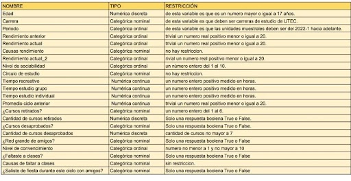

```{r setup, include=FALSE}
knitr::opts_chunk$set(echo = TRUE)
library(shiny)
```

# **Relaciones sociales y su impacto en el rendimiento académico**


## Introduccion 


<div style="text-align: justify">

La interacción con otras personas que nos rodean puede beneficiarnos o producir efectos negativos, debido a que puede involucrar apoyo emocional y confianza entre las personas.

### Valor

Identificar y analizar la convivencia de los estudiantes de la Universidad de Ingenieria y Tecnologia (UTEC).

### Importancia

Para comprender mejor porque queremos abordar este estudio nos planteamos la siguiente pregunta.

*¿Porque queremos comprender las consecuencias de las relaciones sociales en la universidad?*

  1.  Determinar las consecuencias negativas y positivas de la convivencia de nuestro centro de estudios para mapear argumentos que esclarescan situaciones triviales de convivencia de nuestro dìa a dìa.

  2.  Verificar el grado de relacion del impacto del rendimiento academico de los estudiantes con las relaciones sociales del dia a dia.

##### Ideonidad

El presente proyecto es idoneo porque el retorno a la presencialidad implico un inicio de aumento de situaciones de sociabilidad que se habia dejado de lado.

### Objetivo general

Alcanzar una comprensión más profunda de que tan influyente pueden llegar a ser las relaciones sociales en la universidad y si esta tiene una relación directa con el rendimiento académico de los estudiantes.

### Objetivo específicos

  1.- Analizar que variables se relacionan de mejor manera y más directamente al rendimiento académico de los estudiantes.
  2.- Analizar si las variables relacionadas nos arroja un buen resultado.

### Preguntas Iniciales

*1.- La mayoria de los estudiantes que son mas sociables tendran un menor rendimiento academico.*
  
*2.- ¿Es cierto que los estudiantes menos sociables tienen mayor promedio?.*

*3.- Es suficiente el tiempo de estudio grupal para un buen rendimiento.*

## **Planficacion**

```{r ,echo=FALSE}
library(ggplot2)
PG2<- data.frame(actividades = c("1.Búsqueda del tema", "2.Lluvia de ideas","3.Proyecto P0","4.Analizar el feedback","5.Escoger el tema relevante","6. Realizar las encuestas para el proyecto","7.Recolección de data presencial","8.Analisis y limpieza de data recolectada","9.Informe PG1"," 10.Corrección de las observaciones","11.Análisis probabilístico","12.Bibliografía","13.Presentación de la PG2"), 
start = c(2, 2, 3, 4, 5, 6, 7, 7, 9, 11, 12, 12, 14),
end = c(3, 3, 4, 5, 6, 8, 8, 8, 10, 13, 13, 13, 15)
)
ggplot(PG2, aes(x=start, xend=end, y=actividades, yend=actividades)) +
  theme_bw()+
  geom_segment(size=8) +
  labs(title='Planificación PG2', x='Tiempo (Semanas)', y='Actividades') +
  scale_colour_manual(values = c('#F4E217', '#F117F4','#663399','#F43E17', '#7FF417'))
```


```{r, echo=FALSE}
library("plotly")
require(reshape2)
require(ggplot2)
```

## **Datos**

### Recolección de datos

<div style="text-align: justify">

La recolección de datos fue algo tediosa. Nuestro método de recolección fue ofrecer una inscripción a un sorteo de 100 soles, con la finalidad que solo las personas que rellenaron nuestra encuesta participaran en dicho sorteo, también hemos hecho la recolección mediante un trueque de encuestas. ¿Qué vendría a ser un trueque de encuestas? Prácticamente, nos acercabamos a grupos de chicos para ofrecerles rellenar su encuesta, a cambio que rellenen la nuestra. Así fue como llegamos a la cantidad de 200 respuestas. Realizamos de esta manera la recoleciion de datos por que fue a los estudiantes que estaban a nuestro alcance con informacion mas accesible.

### Población, muestra y muestreo

<div style="text-align: justify">

Nuestra población han sido todos los estudiantes de UTEC (sin importar en el ciclo que se encuentren). Nuestra muestra es 207 personas encuestadas de las cuales 5 personas son los integrantes del proyecto. El tipo de muestreo que se aplicó fue el muestreo por conveniencia, dicho tipo de muestreo nos ha facilitado, ya que pocas personas querían responder nuestra encuesta, generalmente desean algo a cambio. La representatividad de nuestra muestra se garantiza porque anlizamos a los estudiantes de UTEC.

### Variables

{withd=2000 height=500}

### Limpieza de datos


```{r, echo=FALSE}

library(readr)
DF<- read_csv('EstudioDeLasRelacionesSociales.csv')
DP <- DF

```
#### Eliminamos las columnas innecesarias que son Marca temporal y direccion de correo electronico.

```{r}
#Eliminamos las columnas innecesarias
DP$'Marca temporal' <- NULL
DP$'Dirección de correo electrónico' <- NULL
```

#### Renombramos variables
```{r}

colnames(DP)[1]<-'Edad'
colnames(DP)[3]<-'Carrera'
colnames(DP)[4]<-'Periodo'
colnames(DP)[5]<-'Rendimiento Anterior'
colnames(DP)[6]<-'Rendimiento Actual'
colnames(DP)[7]<-'Causas Rendimiento'
colnames(DP)[8]<-'¿Solías salir con amigos?'
colnames(DP)[9]<-'Nivel sociabilidad'
colnames(DP)[10]<-'Circulo de Estudio'
colnames(DP)[11]<-'Tiempo Recreativo'
colnames(DP)[12]<-'Tiempo Estudio Grupo'
colnames(DP)[13]<-'Tiempo Estudio Individual'
colnames(DP)[14]<-'Promedio Ciclo Anterior'
colnames(DP)[15]<-'¿Cursos Retirados?'
colnames(DP)[16]<-'Cantidad Cursos Retirados'
colnames(DP)[17]<-'¿Cursos Desaprobados?'
colnames(DP)[18]<-'Cantidad Cursos Desaprobados'
colnames(DP)[19]<-'¿Red Grande De Amigos?'
colnames(DP)[20]<-'Nivel de convencimiento'
colnames(DP)[21]<-'¿Faltaste A Clases?'
colnames(DP)[22]<-'Causas Faltar a Clases'
colnames(DP)[23]<-'¿Saliste de fiesta durante este ciclo con amigos?'
```

#### Corregimos errores
  1.- Cambiamos los  20 a null y cambiamos a valores correctos.
```{r}

#Solo hubieron dos errores en el 20 asi que los volvi null y los cambie a los valores correctos
DP$Edad <- as.numeric(DP$Edad)

DP$Edad[which(is.na(DP$Edad))]<-20

```
  2.- Convertimos los segundos a horas

```{r}
#Convirtiendo los segundos a horas
#Solo ejecutar una vez
ConvertirHoras <- function(arr){
  arr <- as.double(arr)
  return(round(arr/3600,2))
}

DP$`Tiempo Recreativo` <- ConvertirHoras(DP$`Tiempo Recreativo`)
DP$`Tiempo Estudio Grupo` <- ConvertirHoras(DP$`Tiempo Estudio Grupo`)
DP$`Tiempo Estudio Individual` <- ConvertirHoras(DP$`Tiempo Estudio Individual`)
```

  3.- Corregimos los valores de la columna saliste de fiesta durante este ciclo con tus amigos y pPromedio de ciclo anterior de mala redaccion.
  
```{r}
arr <-DP$`¿Saliste de fiesta durante este ciclo con amigos?`
DP$`¿Saliste de fiesta durante este ciclo con amigos?`[which(arr %in% c('Avceces','Aveces'))] <- 'Si'
DP$`Promedio Ciclo Anterior`[which(DP$`Promedio Ciclo Anterior` %in% c('Prefiero no decirlo','no responde','	
Prefiero no decirlo'))] <- 'NR'
```


### Base de datos limpia

Nuestra base de datos esta limpia porque eliminamos columnas innecesarias para el estudio, verbigracia marca temporal y correo electronico. Ademàs, quitamos errores de redaccion en algunas respuestas que perjudicarian el analisis del estudio. NO squedamos con valores nulos en algunos casos donde la respuesta sea opcional.

## *Descriptores numericos y análisis descriptivo*

### Funciones utiles

```{r}
library(dplyr)
CV <- function(x, na.rm=FALSE) {
  return (sd(x, na.rm=na.rm) / mean(x, na.rm=na.rm))
}

R <- function(x) {
  return (round(x, digits=2))
}

Describir <- function(x) {
  return (c("Min"=min(x, na.rm=TRUE),"Max"=max(x, na.rm=TRUE),"Media"=mean(x, na.rm=TRUE), "Mediana"=median(x, na.rm=TRUE), "Desviación Estándar"=sd(x, na.rm=TRUE), "Coeficiente de Variación"=CV(x, na.rm=TRUE), "Rango Intercuartil"=IQR(x, na.rm=TRUE)) %>% R)
}
```

### Muestra

De los encuestados que tuvimos podemos especificar que tuvimos mayor cantidad de encuestados con 18 años, el intervalo de edad en las encuestas son desde los 17 años hasta los 29 años, con un promedio de 19 años. Adicionalmente la moda de encuestados son los de sexo maculino.


| Variable  |   Tipo            | Minimo  | Maximo  | Mean  | Moda  | Median |
|-----------|-------------------|---------|---------|-------|-------|--------|
|   Edad    |  numerica Discreta |  17      |   29  |   19   | 18    |  19    |


```{r, echo=FALSE}
library(ggplot2)
attach(DP)

edad <- table(DP$Edad)

sexo <- table(DP$Sexo)

barplot(edad,xlab="Edad",ylab="Frecuencias",main="Cantidad de personas segun edad",col=c("green","blue","red","orange","skyblue","black","brown","purple","violet","pink","gray"),ylim = c(0,80))


barplot(sexo,xlab="sexo",ylab="Frecuencias",main="Cantidad de personas segun sexo",col=c("red","blue"),ylim=c(0,140))
abline(h=118, col=c("brown"), lwd=4)
abline(h=88, col = c("green"),lwd=4)

boxplot(Edad, horizontal = T,col="darkgreen",xlab="EDAD")
abline(v=mean(Edad),col=c("blue"),lwd=2,lty=2:3)
abline(v=median(Edad),col=c("yellow"),lwd=2,lty=2:3)
```
```{r, echo=FALSE}
library(modeest)
summary(Edad)
mfv(Edad)
mfv(Sexo)
```
### Correlacion entre variables numéricas
```{r}
library(corrplot)

DFCORR <- DP %>% select("Edad","Rendimiento Anterior","Rendimiento Actual","Nivel sociabilidad","Tiempo Recreativo","Tiempo Estudio Grupo","Tiempo Estudio Individual","Cantidad Cursos Retirados","Cantidad Cursos Desaprobados","Nivel de convencimiento")

corrplot(cor(DFCORR, use = "complete.obs"), tl.cex = 0.6, tl.srt = 45, tl.col = "black")
```


###  Análisis de nivel de sociabilidad

```{r}
hist.default(DP$"Nivel sociabilidad", xlab="Nivel de sociabilidad", ylab="Frecuencia relativa", probability = TRUE, main="Nivel de sociabilidad", col="lightblue")
abline(v=c(mean(DP$"Nivel sociabilidad", na.rm=TRUE)), col=c("red"), lwd=c(2))
legend("topright", legend=c("Media"), col=c("red"), lwd=2)
```
```{r}
Describir(DP$"Nivel sociabilidad")
```

Analizando el nivel de sociabilidad logramos notar que en general los estudiantes se consideran ni tan
sociables, ni tan antisociales.

Hasta podemos considerar que no importa si eres hombre o mujer para tener ese nivel de sociablidad, pero para estar seguros es necesario analizar su relacion. Para ello usaremos un grafico de mosaico

```{r}
mosaicplot(table(Sexo=DP$"Sexo", Nivel_de_sociabilidad =DP$"Nivel sociabilidad"), main="Sexo y nivel de sociabilidad", col="lightyellow")
```
Ahora si podemos decir con seguridad que en promedio los alumnos de la UTEC consideran tener un nivel de sociablidad moderado independientemente de ser varones o mujeres.

### Análisis de nivel de convencimiento
```{r}
hist.default(DP$"Nivel de convencimiento", xlab="Horas dedicadas", ylab="Frecuencia relativa", probability = TRUE, main="Nivel de convencimiento", col="lightblue")
abline(v=c(mean(DP$"Nivel de convencimiento", na.rm=TRUE)), col=c("red"), lwd=c(2))
legend("topright", legend=c("Media"), col=c("red"), lwd=2)
```
Ahora si notamos que hay una tendencia a un alto nivel de convencimiento. Lo que no sabemos es si esto es tanto para hombre como para mujeres por lo cual haremos uso de la misma tecnica del análisis anterior.

```{r}
Describir(DP$"Nivel de convencimiento")
```

En este caso si hay una clara diferencia, al parecer las mujeres en general tienden a creer que tienen un nivel de convencimiento mayor al de los varones. Segun evidencia anecdotica, la razon de esto puede deberse a que en general los hombres tienden a querer agradarle a todas las mujeres por naturaleza.

### Analisis de nivel de convencimiento y nivel de sociabilidad

Esta relación nos resulta interesante porque en el gráfico anterior notamos que su nivel de correlación es alto con respecto a las demás variables.

```{r}
plot(DP$"Nivel sociabilidad", DP$"Nivel de convencimiento", xlab="Nivel de sociabilidad", ylab="Nivel de convencimiento", main="Relación entre horas de estudio y horas de juego", col= rgb(0,0,0,0.3))
abline(lm( DP$"Nivel sociabilidad" ~ DP$"Nivel de convencimiento" ), col="red", lwd=2)
```
```{r}
cor.test(DP$`Nivel de convencimiento`,DP$`Nivel sociabilidad`) 
summary(lm(DP$`Nivel de convencimiento`~DP$`Nivel sociabilidad`,data = DP)) 
```


La regresion lineal entre las variables de estudio Rendimiento actual y nivel de sociabilidad son formadas por la siguiente expresion: $$ Y=3.42+1.09x $$ La correlacion es positiva fuerte, pero nos ayuda a verificar que las personas que son mas sociables consideran que tienen un buen nivel de convencimiento. 

### Rendimiento actual segun edad
```{r}
boxplot(DP$`Rendimiento Actual`~DP$Edad,xlab="Edad",ylab="Rendimiento(1 a 10)",horizontal = F,col = "orange",border = "blue")
abline(h=mean(DP$`Rendimiento Actual`),col=c("darkgreen"),lwd=3,lt=3:4)
```

El rendimiento actualmente de los estudiantes en los intervalos de edad de 17 a 21 años se encuentra en 7, es decir que son una mayor cantidad de estudiantes que consideran que su rendimiento es el adecuado para la universidad y que muy pocos consideran su nivel actual como malo.
Apartir de esta informacion entendemos que los estudiantes por tener un nivel adecuado deberian de tener notas aprobatorias. 

  1.- ¿cuantos estudiantes que tienen un rendimiento adecuado son altamente sociables?

```{r}
Taux <- table(DP$`Nivel sociabilidad`,DP$`Rendimiento Actual`)
Taux
```
Sumamos las filas que son mayores o iguales 3 y mayores o iguales a 7.
```{r}
sum(rowSums(Taux[c(3:5),c(7:10)]))
```
Son 106 estudiantes que tienen un rendimiento adecuado y son sociables.

Debido a esto se nos ocurrio una pregunta que sera respondida posteriormente.


*2.- ¿Cual es la probabilidad de que la mitad de estudiantes con rendimiento actual adecuado y sea sociable, desapruebe al menos un curso?*

### Rendimiento actual y nivel de sociabilidad

```{r}
ggplot(DP,aes(DP$`Rendimiento Actual`,DP$`Nivel sociabilidad`))+ geom_point(colour='darkred')+geom_smooth()+labs(
  title= "Nivel sociabilidad-Rendimiento actual",
  x="Rendimiento actual ",
  y="Nivel de sociabilidad",
)

plot(DP$`Nivel sociabilidad`~ DP$`Rendimiento Actual`,xlab="rendimiento actual",ylab="nivel de sociabilidad",col=c("darkblue"))+
abline(h=round(mean(DP$`Nivel sociabilidad`)),v=round(mean(DP$`Rendimiento Actual`)),lm(DP$`Nivel sociabilidad`~DP$`Rendimiento Actual`,data=DP),lwd=4,col=c("red","pink","green"))
legend(x="bottomright",legend = c("R.L","N.S","R.A"),fill=c("red","pink","green"),title = "lines")

```
En la grafica observamos que el rendimiento actual de los estudiantes es en su mayoria de bueno a muy bueno y que tambien son sociables y que el avance de los datos incrementarse desde el rendimiento actual en 5 hasta 10.

### Rendimiento anterior y nivel de sociabilidad

```{r}
ggplot(DP,aes(DP$`Rendimiento Anterior`,DP$`Nivel sociabilidad`))+ geom_point(colour='darkred')+geom_smooth()+labs(
  title= "Rendimiento anterior-Nivel sociabilidad",
  x="Rendimiento anterior ",
  y="Nivel de sociabilidad",
)

plot(DP$`Nivel sociabilidad`~ DP$`Rendimiento Anterior`,xlab="rendimiento anterior",ylab="nivel de sociabilidad",col=c("darkblue"))+
abline(h=round(mean(DP$`Nivel sociabilidad`)),v=round(mean(DP$`Rendimiento Anterior`)),lm(DP$`Nivel sociabilidad`~DP$`Rendimiento Anterior`,data=DP),lwd=4,col=c("red","pink","green"))
legend(x="bottomright",legend = c("R.L","N.S","R.A"),fill=c("red","pink","green"),title = "lines")
```


```{r}
cor.test(DP$`Rendimiento Actual`,DP$`Nivel sociabilidad`)
cor.test(DP$`Rendimiento Anterior`,DP$`Nivel sociabilidad`)
summary(lm(DP$`Rendimiento Actual`~DP$`Nivel sociabilidad`,data = DP))
summary(lm(DP$`Rendimiento Anterior`~DP$`Nivel sociabilidad`,data=DP))

```
La regresion lineal entre las variables de estudio Rendimiento actual y nivel de sociabilidad
son formadas por la siguiente expresion: 
$$Y=5.65+0.35x$$
La correlacion es positiva debil, pero nos ayuda a verificar que las personas que son mas socibles consideran que tienen un buen rendimiento academico actualmente.

Mientras que el anterior año las variables de estudio Rendimiento anterior y nivel de sociaboilidad son formada por la siguiente expresion:
$$ Y = 6.13+0.17x$$
La correlacion nos da nuevamente positiva debil, pero nos ayuda a entender como son las variables de estudio nivel de sociabilidad y rendimiento anterior.

#### Promedio

1.- 45 estudiantes que tienen un promedio del anterior ciclo que son sociables y tienen un promedio entre 11 y 13 
  
  
2.- 19 estudiantes que tienen un promedio del ciclo anterior entre 11-13 y son sociables, ademas que se consideran con un buen rendimiento dicho ciclo.
```{r}
table_aux2 <- table(DP$`Nivel sociabilidad`,DP$`Promedio Ciclo Anterior`)

sum(table_aux2[c(3:5)])

table_aux3 <- table(DP$`Nivel sociabilidad`,DP$`Promedio Ciclo Anterior`,DP$`Rendimiento Anterior`)
sum(table_aux3[c(3:5),c(1:1),c(7:10)])

```
Total de estudiantes sociables y dichos promedio.

```{r}
table_aux2[c(3:5),c(1:4)]
rowSums(table_aux2[c(3:5),c(1:4)])
table_aux2[c(3:5),c(2:5)]
rowSums(table_aux2[c(3:5),c(2:5)])
sum(rowSums(table_aux2[c(3:5),c(2:5)]))
```
### Tiempo de estudio
El tiempo de estudio en los jovenes estudiantes es un factor importante en su rendimiento academico, segun expertos el tiempo de estudio que deberiamos dedicar son entre 4 y 6 horas de estudio diarias. Nuestro estudio tambien recopilo informacion del tiempo de estudio individual entre los estudiantes tanto individual y grupal, ademàs planeamos analizar dichas variables con nivel de sociabilidad.

#### Individual
El tiempo de estudio individual de los estudiantes es con mayor frecuencia son 2 horas y la cantidad promedio de estudio es 4,33 horas, que seria lo correcto segun dicho estudio anterior.

```{r}
hist(DP$`Tiempo Estudio Individual`,main="Estudio individual",xlab="Tiempo de estudio Individual",ylab="Frecuencia",col = "green")
grid(nx = NA, ny = NULL, lty = 2, col = "red", lwd = 2)
abline(v=mean(DP$`Tiempo Estudio Individual`),col=c("blue"),lwd=2,lty=2:3)
abline(v=median(DP$`Tiempo Estudio Individual`),col=c("yellow"),lwd=2,lty=2:3)
legend(x = "topright", legend = c("mean", "median"), fill = c("blue", "yellow"),
       title = "Leyenda")
summary(DP$`Tiempo Estudio Individual`)
mfv(DP$`Tiempo Estudio Individual`)
```
No obstante que sucede con el tiempo de estudio individual y el nivel de sociabilidad de los estudiantes.
Preguntas que nos plantean esta situacion son las siguientes:
  
  *1.- ¿Cuantas personas estan en el promedio de estudio es decir de 4 a 6 horas de tiempo de estudio individual de los estudiantes sociables, regularmente sociables y muy sociables?*

```{r}
taux <- table(DP$`Nivel sociabilidad`,DP$`Tiempo Estudio Individual`)
taux[c(3:5),c(10:16)]
sum(rowSums(taux[c(3:5),c(10:16)]))
```
Son 60 estudiantes que estan dentro de los parametros de la pregunta.

#### Grafico de estudio individual y nivel de sociabilidad
```{r}
boxplot(DP$`Tiempo Estudio Individual` ~ DP$`Nivel sociabilidad`,col=c("brown","green","yellow","skyblue","violet"),xlab="Sociable(1 al 5)",ylab="Estudio Individual")

```

#### Grafico de estudio grupal y nivel de sociabilidad

Por otro lado notamos un aumento considerable en el tiempo de estudio grupal de los estudiantes sociables.
```{r}
boxplot(DP$`Tiempo Estudio Grupo` ~ DP$`Nivel sociabilidad`,col=c("brown","green","yellow","skyblue","violet"),xlab="Sociable(1 al 5)",ylab="Estudio Grupal")
```
  *2.-¿Cuanto personas dedican su tiempo a estudiar en grupo y son sociables, mayor o igual a 4 horas?*
  
```{r}
taux <- table(DP$`Nivel sociabilidad`,DP$`Tiempo Estudio Grupo`)
taux[c(3:5),c(13:19)]
sum(rowSums(taux[c(3:5),c(13:19)]))
```
Son 23 estudiantes que le dedican un tiempo de estudio grupal mayor a 4 que son regularmente sociables, sociables y muy sociables.

#### Faltar a clases

Nos vimos con la necesidad de investigar sobre los estudiantes que faltan a clases y son sociables

```{r}
TD4 <-table (DP$`¿Faltaste A Clases?`,DP$`Nivel sociabilidad`)
barplot(TD4, main="Sociales-ausencia", col = c("brown","gray"))
legend(x = "topright", legend = c("No", "Yes"), fill =  c("brown","gray"),
       title = "Leyenda")
```
```{r}
TD4
sum(TD4[c(2),c(3:5)])
```
Como podemos presenciar los estudiantes que faltaron a clases en su mayoria fueron los que son regularmente sociables, sociables y muy sociables, de ellos son en total 124 estudiantes que faltaron a clases que son considerados sociables.

## *Analisis Probabilistico*


### MODELO BINOMIAL

*2.- ¿Cual es la probabilidad de que la mitad de estudiantes con rendimiento actual adecuado y sea sociable, desapruebe al menos un curso?*

Justificacion:
ELegimos el modelo de una binomial porque la variable que estamos estudiando es discreta Y el problema plantea que encontremos la cantidad de estudiantes que desaprueban un curso y poseemos la cantidad total de esas personas, adicionalmente podemos calcular la probabilida de ocurra dicho evento.
Todos tienen la misma probabilidad de que ocurra el evento.
$$\mathbb{X}\sim\mathsf{Bin}(n,p)\\n=53\\p=0.41$$

La esperanza es:
$$ E(\mathbb{X})=21.73$$
La varianza es:

$$ Var(\mathbb{X})=12.82$$

Probabilidad de desaprobar un curso en la universidad se basa en contar la cantidad de estudiantes que desaprobaron al menos un curso y dividir en total de estudiantes.
$$ \frac{\text{numero de casos posibles}}{\text{casos totales}} $$
```{r}
summary(DP$`Cantidad Cursos Desaprobados`)
sum(with(DP,DP$`Cantidad Cursos Desaprobados`>=1))/length(DP$`Cantidad Cursos Desaprobados`)

```
La probabilidad de que un estudiante desapruebe al menos un curso es de 0.41, sin embargo necesitamos descubrir sobre aquellos estudiantes que tienen un rendimiento actual adecuado y sean sociables, desaprueben al menos un curso.

Son 106 estudiantes que son un rendimiento actual adecuado y son sociables, mientras que la probabilidad de que un estudiante desapruebe al menos un curso es 0.41

Con una modelo binomial podemos hallar la probabilidad ya que poseemos el tamaño, la probabilidad y el numero de estudiantes que desaprueben el curso.
```{r}
dbinom(53,106,0.41)

```

```{r}
barplot(dbinom(1:53,106,0.41),col=c("skyblue"),lwd=2, main="BINOMIAL")
x <- seq(1,53,by = 1)
lines(x,dbinom(x,106,0.41),col="red")
barplot(pbinom(1:53,106,0.41),col=c("skyblue"),lwd=2, main="BINOMIAL")
dbinom(1:53,106,0.41)
```

Esto nos indica que la probabilidad de que un estudiante tenga una nota desaprobatoria y sea de sociable, con un rendimiento academico adecuado aumenta conforme nos acercamos al valor central de los datos.

### MODELO HIPERGEOMETRICO

Justificacion:

Usamos el modelo hipergeometrico porque tomamos muestras y realizamos experimentos repetitivamente en este caso queremos seleccionar a un grupo de estudiantes que no son retornados al experimento inicial, es decir muestreos sin remplazo.

Se tiene una muestra de 206 encuestados. Para considerar a un estudiante sociable o muy sociable tiene que estar dentro del intervalo de 4 a 5, si se toma una muestra de 32 encuestados, calcular cual es la probabilidad de que todos sean muy sociables. Tengamos en cuenta que hay 84 estudiantes consideradas muy sociables debido a que se encuentran en el intervalo de a 5 .

```{r}
table(DP$`Nivel sociabilidad`)
x = 32
M = 206-84
N = 206
n = 32

plot(dhyper(x, 200:M, N-M, n),col = "green",xlab = "Nivel de sociabilidad ",ylab = "Probabilidad Hipergeométrica",main = "MODELO HIPERGEOMÉTRICO - SOCIABILIDAD ENCUESTADOS")

```


### MODELO POISSON

TIEMPO DE ESTUDIO INDIVIDUAL

Justificacion:

Debido a que estamos investigando una razon o tasa de variables Y(Tiempo de estudio individual/por dia) tienen una explicacion en el tipo de variables x ( numero de estudiantes)
ya que los estudiantes tienen un efecto en la variable Y dada en dicah tasa.

```{r}
table(DP$`Tiempo Estudio Individual`)

plot(-10:20,dpois(-10:20,3.6923), col="red")
lines(0:20,dpois(0:20,3.6923),col="blue")
abline(v=4,col="green")

```

¿Cual es la probabilidad de que 4 estudiantes lleguen a estudiar mas de 6 horas al día individualmente?, sabiendo que el promedio de estudiantes que estudian mas de 6 horas al día es de 3.6923

landa(L):
```{r}
L = 48/13
L
```
x = 4, L = 3.6923
```{r}
round(dpois(4,3.6923),2)
```
- La probabilidad de que 4 alumnos estudien mas horas al día individualmente es de 0.19 que es igual al 19%.

TIEMPO DE ESTUDIO GRUPAL
```{r}
table(DP$`Tiempo Estudio Grupo`)
```

¿Cual es la probabilidad de que 4 estudiantes lleguen a estudiar mas de 6 horas al día de forma grupal?, sabiendo que el promedio de estudiantes que estudian mas de 6 horas al día de manera grupal es de 1.6667

landa(L):
```{r}
L = 5/3
L
```
x = 4 , L = 1.6667
```{r}
round(dpois(4,1.6667),2)
```
- La probabilidad de que 4 alumnos estudien de manera grupal mas de 6 horas es del 0.06 que equivale a un 6%.


De esto podemos concluir que los estudiantes mayormente prefieren estudiar de manera individual,ya que la probabilidad de la preferencia de estudiar de manera individual es del 19%, que es mayor al 6% de aquellos que prefieren estudiar de manera grupal.

### Modelo Geometrico

¿Cual es la probabilidad que despues del 24 estudiante tenga un rendimient bueno?


Justificacion:

Utilizamos dgeom porque analizamos la cantidad de estudiantes despues del 24 estudiante apruebe un curso un numero de intentos necesarios.

```{r}
plot(dgeom(1:25,0.59),col="skyblue",ylab="probabilidad",xlab="horas")
lines(1:25,dgeom(1:25,0.59),col="red")
abline(v=6,col="green")
arrows(6,0,15,0.1)
```
## Cierre y conclusiones

1.- Sobre nuestras preguntas iniciales los estudiantes mas sociables son los que tienen un menor rendimiento, llegamos al resultado de que es un grupo menor que cumple con dichas caracteristicas, pero que no todos los estudiantes sociables son los que tienen un buen rendimiento, dehecho son una mmayor cantidad de estudiantes lo que son sociables y tienen un promedio mayor de 14 son 126 estudiantes de una muestra de 206 estudiantes.

2.- Sobre la pregunta de si es cierto que los estudiantes menos sociables tienen mayor promedio es falso. De hecho, los resultados demuetsran que los estudiantes con mayor promedio son los sociable.

3.- Sobre si es suficiente el tiempo de estudio en grupo para tener un buen rendimiento es falso, los estudiantes que estudian en grupo, son los que tambien estudian mas horas individualmente, lo que hace logico el buen rendimeinto que tienen.

4.- Los estudiantes que son sociables son los que tienen un mayor rendimiento, sin embargo son tambien un grupo reducido de ellos que son los mas propensos  a disminuir su rendimiento.

5.- Del total de encuestados solamente 60 personas estudian dentro del intervalo de horas adecuado.

6.- La probabilidad de que un estudiante desapruebe un curso es del 41 % aproximadamente.

7.- Que un estudiante sociable y con un rendimiento adecuado actualmente desapruebe es del 1%.


```{css,echo=FALSE}
p{
color: gray;
}
h1{
color:blue;
text-decoration: underline blue;
text-align: center;
}

img{
  display: block;
  margin-left: auto;
  margin-right: auto;
  width: 70%;
}
```


