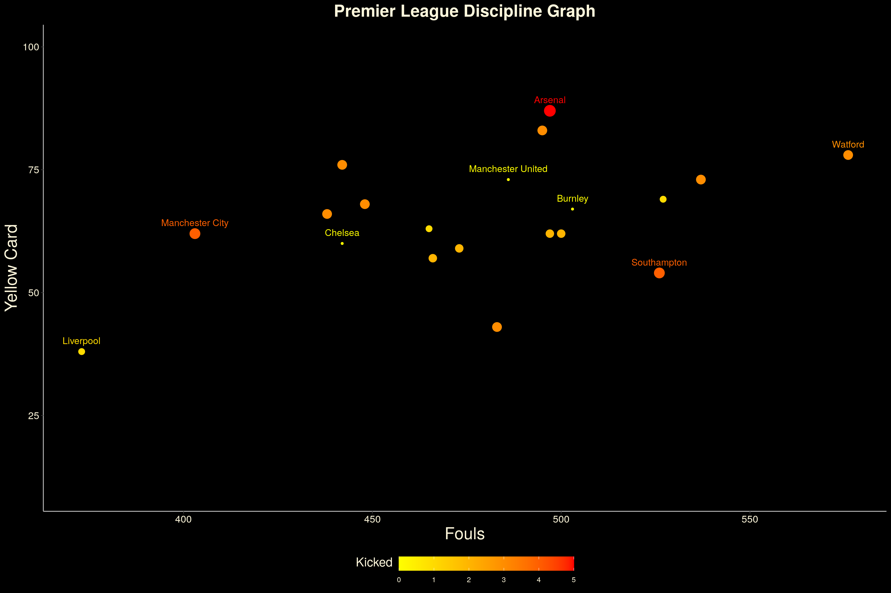
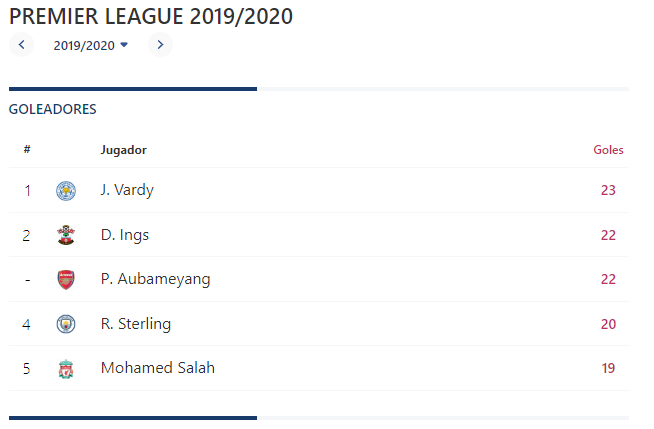

# *Rendimiento del Liverpool Football Club para la obtención del campeonato de la Premier League de la temporada 19/20*

## 1. Introducción 

### 1.1 Relevancia

El fútbol es un deporte que posee como base un capital humano del que depende para conseguir los objetivos planteados para el final de la temporada. El jugador profesional de fútbol debe mantener un rendimiento constante a lo largo de la temporada que le permita competir un puesto en el campo (punto de vista individual), y que le permita ayudar al equipo a alcanzar las metas propuestas para fin de temporada. La relevancia de este proyecto es encontrar parámetros que nos ayuden a identificar el rendimiento de los jugadores de un equipo de fútbol para la obtención de un campeonato de alta competitividad. En este caso particular observaremos el rendimiento de los jugadores del Liverpool FC durante la temporada 19/20.   

```{r}
library(dplyr)
library(ggplot2)
```


## 2. Datos

### 2.1 Recolección de datos

Los datos se obtuvieron a través de la página [kaggle](https://www.kaggle.com/), que es una página de datos, considerada una de las más grandes del mundo. Es por eso que existe confianza, también, en los datos proporcionados por esta página. El análisis descriptivo de las observaciones que obtenemos de la data proporcionada, por la página mencionada anteriormente, nos permitirá medir y encontrar respuestas ante nuestras dudas.

### 2.2 Población, muestra y muestreo

#### Población

Jugadores de fútbol del Liverpool FC de la temporada 19/20.

#### Muestra

Jugadores del Liverpool FC de la temporada 19/20, según el parámetro a analizar.

#### Muestreo

Muestreo aleatorio simple. 

### 2.3 Variables

Analizaremos las siguientes variables.

| **N°** |   **Variable**  | **Tipo de variable** |
|:------:|:---------------:|:--------------------:|
|    1   | Jugadores       |       Categórica     |
|    2   | Edad            |        Numérica      |
|    3   | Goles           |        Numérica      |
|    4   | Faltas cometidas|        Numérica      |
|    5   | Disparos al arco|        Numérica      |
|    6   | T. Amarillas    |        Numérica      |
|    7   | T. Rojas        |        Numérica      |
|    8   | Duelos Aéreos   |        Numérica      |
|    9   | D.A. Ganados    |        Numérica      |
|   10   | D.A. Perdidos   |        Numérica      |


### 2.4 Limpieza de base de datos

Respecto a la limpieza de datos, solo necesitamos cambiar de nombre a las variables que usaríamos de los distintos csv's (base de datos) que utilizamos.

Primero cargamos las bases de datos y las librerías. AD es la base de datos de acciones defensivas, SH es la base de datos de acciones de ataque y MSC es la base de datos de las miseláneas de la temporada del club.

```{r}
AD <- read.csv('defensive_action.csv')
SH <- read.csv('shooting.csv')
MSC <- read.csv('miscellaneous.csv')
library(dplyr)
library(ggplot2)
```


```{r}
AD %>% rename (Jugador = Player, 
               País = Nation,
               Edad = Age,
               PJ = X90s,
               Entradas = Tkl,
               EG = TklW,
               ED = Def.3rd,
               EM = Mid.3rd,
               EA = Att.3rd,
               PT = Press,
               PD = Def.3rd.1,
               PM = Mid.3rd.1,
               PA = Att.3rd.1,
               )-> AD

MSC %>% rename (Jugador = Player,
                País = Nation,
                Edad = Age,
                PJ = X90s,
                TA = CrdY,
                TR = CrdR,
                X2TA = X2CrdY,
                FC = Fls,
                FR = Fld,
                Fdj = Off,
                Pases= Crs,
                Itrcp= Int,
                EG = TklW,
                PA= PKwon,
                PF= PKcon,
                Autogol= OG,
                PR= Recov,
                AG= Won,
                AP= Lost,
                AGP= Won.) -> MSC
```

## 3. Análisis descriptivo

### 3.1 Edades

```{r}
boxplot(MSC$Edad, horizontal = TRUE)
```
```{r}
summary(AD$Edad)
```

Del gráfico se observa que existe un valor extremo, el cual sería del jugador que tiene una edad de 16 años. Esto nos permite entender que en equipos de la élite del fútbol, como lo es el Liverpool, se reclutan jóvenes promesas y se busca mantener un promedio de edad que equilibre entre jugadores experimentados y jugadores jóvenes. La mediana de la edad es de 26.5.

```{r}
plot(x = MSC$Edad, y = MSC$PJ)
```
El trabajo del director técnico de fútbol es encontrar un sistema de juego que permita el óptimo funcionamiento del equipo en la cancha. Parte de este trabajo, es colocar a los mejores jugadores en el campo y a partir de ellos empezar a gestionar una estructura que permita su funcionamiento. En la tabla podemos observar las edades vs los partidos jugados. Observamos que los jugadores que poseen una edad entre los 25 y 30 años han mantenido un nivel constante a lo largo de la temporada.

### 3.2 Acciones defensivas

Primero analizaremos la intensidad con la que marcaron durante la temporada.
+ Nombramos a FC como la cantidad de faltas cometidas, la calculamos a través de la diferencia entre entradas cometidas y entradas ganadas. Esto debido a que las entradas son los quites o intentos de quites de balón realizados y las entradas ganadas son los quites limpios realizados.

```{r}
FC<-AD$Entradas-AD$EG 
```

Extraemos las tarjetas amarillas y rojas de la base de datos de miscelanea y la unimos, junto con faltas cometidas (FC) a la base de datos de acciones defensivas.

```{r}
TA<-MSC$TA
TR<-MSC$TR
TAR<-MSC$X2TA
```
```{r}
AD<-cbind(AD,TA,TR,TAR)
```
```{r}
AD<-cbind(AD,FC)
```

Ahora obtendremos el nivel de marca de los jugadores. La intensidad la mediremos según las sanciones recibidas por el jugador y la cantidad de faltas que cometió.

```{r}
NM<-AD %>% 
  select(Jugador, FC, TA, TR, TAR) %>% 
  group_by(Jugador) %>% 
  summarise_at(vars(FC, TA:TAR), funs(sum)) %>% 
  arrange(FC) %>% 
  mutate(intensidad = TR+TAR) 

NM2 <- NM %>%  
  arrange(intensidad) %>% 
  filter(Jugador %in% c("Virgil van Dijk", "Trent Alexander-Arnold", "Georginio Wijnaldum", "Andrew Robertson", "Fabinho", "Joe Gomez", "Alisson"))

ggplot(NM, aes(x = FC, TA, color = intensidad, size = intensidad))+
  geom_point()+
  geom_text(NM2, mapping = aes(FC, TA, label = Jugador), size = 4, vjust = -1.1)+
  guides(size="none")+
  scale_color_gradient(high = "red", "low" = "yellow")+
  theme_classic()+
  theme(
    # Background
    plot.background = element_rect(fill = "black", color = "black"),
    panel.background = element_rect(fill = "black"),
    legend.background = element_rect(fill = "black"),
    # Position
    legend.position = "bottom",
    legend.key.width=unit(1.5,"cm"),
    # Text
    axis.title = element_text(color = "cornsilk", size = 20),
    axis.text = element_text(color = "cornsilk", size = 12),
    legend.text = element_text(color = "cornsilk"),
     legend.title = element_text(color = "cornsilk",vjust = 0.95, size = 15),
    # Line
    axis.line = element_line(color = "gray"),
    # Title
    plot.title = element_text(hjust = .5, color = "cornsilk", size = 20, face = "bold")
  )+
  ylim(0,10)+
  labs(y = "Sanción", color = "intensidad", title = "Nivel de marcaje")
```

El nivel de intensidad de marca del equipo durante la temporada nos muestra una intensidad no tan alta. Solo tuvieron una expulsión, que fue recibida por el arquero (esto se puede explicar por disintos contextos). Medimos la intensidad de marcaje según las tarjetas recibidas (amarillas y rojas). A menos faltas y más sanciones, mayor el nivel marca, así observamos que Joe Gomez (defensor central) posee una gran intensidad de marca.
De este modo, si lo analizamos según esta imagen  podemos observar que el Liverpool fue el equipo que menos faltas realizó en comparación con los demás equipo de la premier league durante la temporada 19/20.

### 3.3 Acciones de ataque

Los goles son el componente principal en un partido de fútbol, se gana con goles. Mediremos el nivel de eficacia en los goles que obtuvo el equipo durante la temporada 19/20.

```{r}

x1 <-SH$SoT
y1 <- SH$Gls
label1 <- SH$Player
  
sampledata <- data.frame(x1, y1, label1)
  
ggplot(sampledata, aes(x=x1, y=y1)) +
geom_point() +
geom_text(
    label=label1,
    nudge_x=0.45, nudge_y=0.1,
    check_overlap=T
) +
  theme(
  plot.title = element_text(hjust = .5, color = "black", size = 20, face = "bold")
  ) +
  labs(y = "Goles",x = "Disparos al arco", title = "Eficacia en ataque")
```

Podemos observar de la gráfica, que los jugadores con más eficacia frente al arco son los delanteros del equipo. Mohamed Salah, Roberto Firmino y Sadio Mané son los jugadores de gran eficacia; sin embargo, de entre ellos tres, Sadio Mané posee mayor eficacia al necesitar menos disparos al arco para hacer más goles.
Si observamos la siguiente imagen  

podemos notar que el goleador del Liverpool de la temporada 19/20 aparece en el puesto 5. Podemos deducir que es importante tener goleadores en el equipo; sin embargo, tener al más goleador de la liga no te asegura la obtención del campeonato.

### 3.4 Juego aéreo

Observaremos el nivel del juego aéreo de los jugadores en la temporada 19/20. Los balones aéreos son importantes en la medida en que los equipos lo necesiten según su estilo de juego. Disputar un balón divido aéreo puede significar muchas cosas en el trámite de un partido, desde una acción defensiva hasta un ataque en pelota parada (tiros libres, córners, etc.).

```{r}
x1 <-MSC$AG + MSC$AP
y1 <- MSC$AG
label1 <- MSC$Jugador
  
sampledata <- data.frame(x1, y1, label1)
  
ggplot(sampledata, aes(x=x1, y=y1)) +
geom_point() +
geom_text(
    label=label1,
    nudge_x=0.45, nudge_y=0.1,
    check_overlap=T
) +
  theme(
  plot.title = element_text(hjust = .5, color = "black", size = 20, face = "bold")
  ) +
  labs(y = "Duelos aéreos ganados",x = "Duelos aéreos totales", title = "Nivel de juego aéreo")

```

El resultado guarda coherencia con la posición de los jugadores. Son los defensas quienes se encuentran siempre en constante lucha aérea del balón. Observamos que es Virgil Van Dijk el jugador que más disputo el balón aéreo y que ganó en la gran mayoría de ellas. Seguido a él, está Joe Gomez, ambos forman la pareja de defensores centrales del equipo. Así el equipo posee jugadores en defensa con gran capacidad en el juego aéreo.

## Conclusiones

- Los jugadores del Liverpool FC presentaron un gran rendimiento según su posición. Logramos medir la intensidad de marca y la eficacia con el gol que poseen los jugadores. En el fútbol se dice que: "buenos delanteros te ganan partidos, pero una buena defensa te gana campeonatos". 
- Al comparar la delantera del Liverpool respecto a los goleadores del campeonato entendimos que no es necesario un jugador que marque muchos goles durante la temporada, pero si es importante un jugador que tenga un buen nivel de eficacia. En el caso del Liverpool, tanto Salah como Mané son jugadores que poseen este elevado nivel de eficacia. 
- Si observamos el análisis defensivo, entenderemos que el nivel de presión que realizó el Liverpool en esa temporada fue muy resaltante pues la presión originaba pérdidas de balón por parte del rival y esto lo lograba el Liverpool sin cometer muchas faltas como pudimos observar la comparación en el nivel de marcaje respecto a los otros equipos de la liga.
- Finalmente, concluimos que en realidad una delantera eficaz y una defensa sólida te permitirá conseguir objetivos. 

## Análisis probabilistico

Haremos tablas cruzadas de la variable Jugadores y los duelos aéreos (dividido en duelos ganados(AG) y duelos perdidos(AP)) y encontraremos la probabilidad de ganar duelos aéreos según la posición de cada jugador. En este caso, al tratarse de variables numéricas, tuvimos que formar una data frame en Excel para luego leerla en R. Esto en base a la información proporcionada por nuestra base de datos.

```{r}
DA<-read.csv('DA.csv')
DA
```

Creamos la tabla cruzada Jugador vs Duelos aereos

```{r}
tab1<-table(DA$Jugador,DA$Duelos.Aereos)
tab1
```

```{r}
pt1<-prop.table(tab1)
pt1
```

-Probabilidad de que Virgil van Dijk gane un duelo aéreo

```{r}
p1<-pt1["Virgil van Dijk","AG"]
p1
```
-Probabilidad de que Joe Gomez gane un duelo aéreo

```{r}
p2<-pt1["Joe Gomez","AG"]
p2
```
-Probabilidad de que Joe Gomez pierda un duelo aéreo

```{r}
p3<-pt1["Joe Gomez","AP"]
p3
```
-Probabilidad de que Virgil van Dijk pierda un duelo aéreo

```{r}
p4<-pt1["Virgil van Dijk","AP"]
p4
```
Como podemos observar, al momento de analizar las probabilidades de ganar o perder duelos aéreos por parte de los defensores centrales del equipo, se logra observar, en ambos casos, que tanto Virgil van Dijk y Joe Gomez presentan mayor probabilidad de ganar un duelo aéreo que de perderlo. Es así que se resalta la importancia de tener defensas centrales con gran nivel de duelo aéreo.

En este caso, hallaremos la probabilidad de que los delanteros anoten un gol. El análisis se obtendrá dividiendo los goles hechos por los jugadores entre los remates a portería. Obtenemos:

```{r}
PRA<-SH$Gls/SH$SoT
PRA
```
Según la tabla de SH (data frame de acciones en ataque), el componente [7] es Sadio Mané y el componente [6] es Mohamed Salah. 

```{r}
round(PRA[6],2) 
PRA[7]
```
Observamos que Sadio Mané posee mayor probabilidad de anotar que Mohamed Salah; sin embargo, Mohamed Salah resultó el goleador del equipo durante la temporada.

¿Cual es la probabilidad de que al elegir un jugador al azar este sea menor de 21 años?
Basándonos en la regla de Laplace el cociente del número de resultados favorables entre el número de resultados posibles es la probabilidad del suceso

```{r}
tabla.JE <- table(MSC$Jugador, MSC$Edad)
tabla.JE
Jugadores.Edad<-colSums(tabla.JE)
Jugadores.Edad
Rfavorables<-4
Rtotales<-24
Probabilidad1<-4/24
Probabilidad1
```

Como bien se sabe la Premier League se juega en Inglaterra, y Inglaterra es un país que destaca en cuanto a futbol hablamos y donde provienen muchas estrellas en crecimiento las cuales tienen un desempeño formidable, así que es un factor a tomar en cuenta al analizar el éxito del Liverpool si tiene jugadores de dicha nacionalidad, entonces ¿Cual es la probabilidad de que al elegir un jugador al azar del Liverpool este sea de Inglaterra?

```{r}
tabla.JP <- table(MSC$Jugador, MSC$País)
tabla.JP
Jugadores.Nacionalidad <- colSums(tabla.JP)
Jugadores.Nacionalidad
Rfavorables1<-8
Rtotales1<-24
Probabilidad2<-8/24
Probabilidad2
```

Como sabemos Brasil es el país que más mundiales ha ganado y el país del cual provienen muchas estrellas y talentos que suelen destacar en Europa, para analizar el éxito del Liverpool es un factor a considerar, entonces ¿Cual es la probabilidad de que al elegir un jugador del Liverpool al azar este sea de Brasil?

```{r}
tabla.JP1 <- table(MSC$Jugador, MSC$País)
tabla.JP1
Jugadores.Nacionalidad1 <- colSums(tabla.JP1)
Jugadores.Nacionalidad1
Rfavorables2<-3
Rtotales2<-24
Probabilidad3<-3/24
Probabilidad3
```

Para analizar el éxito que obtuvo el Liverpool también es necesario enfocarse en errores poco comunes como los autogoles en una liga de alto nivel, entonces ¿Que probabilidad hay de que un jugador del Liverpool anote un autogol?

```{r}
tabla.JA <- table(MSC$Jugador, MSC$Autogol)
tabla.JA
Jugadores.Autogol <- colSums(tabla.JA)
Jugadores.Autogol
Rfavorables3<-1
Rtotales3<-24
Probabilidad4<-1/24
Probabilidad4
```

## Modelos de probabilidades

### Distribución Normal

Para la distribución normal asumiremos que los partidos jugados se distribuye de manera normal, el promedio lo asignaremos el valor de Mu(17.42), y la desviación estandar(13.13704) le asignaremos el valor de Sigma. Cabe decir que la prueba de Shapiro–Wilk se usa para contrastar la normalidad de un conjunto de datos, pero en este caso solo asumiremos.

```{r}
summary(MSC$PJ)
mu<-mean(MSC$PJ)
sig<-sd(MSC$PJ)
plot(dnorm(0:38,mu,sig),type = "h",xlab="X",ylab="P(X=x)",main="Probabilidad N(17.42,13.13704)")
```

¿Cual es la probabilidad de que un jugador juegue menos de 9 partidos?

```{r}
N<-pnorm(9,mu,sig)
N 
```

¿Cual es la probabilidad de que un jugador tenga entre 12 y 20 partidos jugados?

```{r}
N1<-pnorm(20,mu,sig)-pnorm(12,mu,sig)
N1
```

###Distribución Binomial

Para este caso indentificamos a la variable Goals, ya que, solo se puede dar posibles resultados, o es gol, o no es gol. Siendo el éxito osea, que sea gol nuestra variable aleatoria y que no sea gol lo tomaremos como fracaso(q).

```{r}
x<- 1:20
plot(dbinom(x, size = 10, prob = 0.5), type = "h", lwd = 1.5,col = rgb(1,0,0, 0.7),
     main = "Función de probabilidad binomial",
     ylab = "P(X = x)", xlab = "Número de éxitos")
```

¿Cuanta es la probabilidad de que de 10 intentos, 2 sean goles?

```{r}
pbin<-dbinom(2,10,0.5)
pbin
```

¿Cuanta es la probabilidad de que de 3 intentos, 3 sean goles?

```{r}
pbin1<-dbinom(3,3,0.5)
pbin1
```
