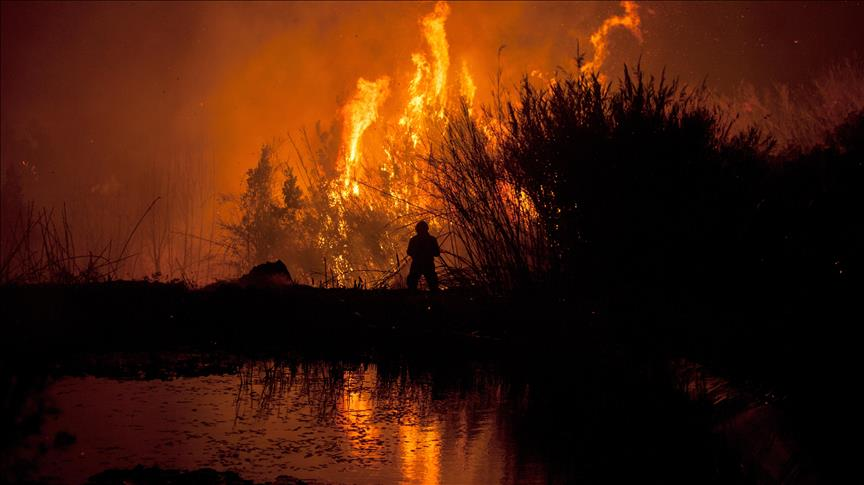
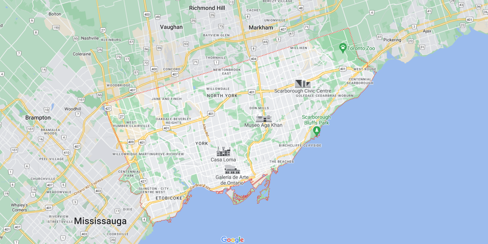

---
title: " S5 - Presentación"
output:
  html_document:
    toc: yes
    df_print: paged
  html_notebook:
    toc: yes
    toc_float:
      collapsed: no
      smooth_scroll: no
    number_sections: yes
    theme: yeti
---  

# Proyecto de Estadística y Probabilidad I

# Tema: Incidente de incedios en toronto desde el 2011- 2019



# Introducción:

## Relevancia:

El objetivo del estudio es rescatar la relevancia del servicio de Bomberos en Toronto, Ontario, Canadá;  Toronto Fire Services el cual es actualmente el departamento de bomberos municipal más grande de Canadá quienes brindan protección contra incendios, servicios de rescate técnico, respuesta a materiales peligrosos y asistencia médica de emergencia de primeros auxilios haciendo evidencia de data que ejemplifica su gran labor de los mismos, además establecer la pérdida estimada en dólares, latitud y longitud, fecha y hora exactas de los incidentes.

## Planificación:

Para la planificación y repartición de actividades individuales o grupales para este entregable se presenta el siguiente diagrama de Grantt:

```{r, echo=FALSE, results='hide'}
#Library installation and loading

#List libraries
Library_list <- c("readr", "dplyr", "ggplot2", "tidyverse", "foreign", "stats", "stringr", "rgl")
library(plotrix)
#Package manager
suppressMessages(if (!require("pacman")){
    install.packages("pacman")
})
#Install and load wrapper
p_load(Library_list, character.only = TRUE)
```

```{r,echo=FALSE,warning=FALSE,cache=FALSE,message=FALSE}
gantt_test <- read_csv("Gantt_P1.csv", show_col_types = FALSE)
gantt <- read_delim("Gantt_P1.csv", 
    delim = ";", escape_double = FALSE, trim_ws = TRUE, show_col_types = FALSE)
gantt = head(gantt, n=54)


Integrantes <- unique(gantt$Integrante)
Actividades <- unique(gantt$Actividad)
gantt <- gather(gantt, "Estado", "Fecha", 4:5) %>% mutate(Fecha = as.Date(Fecha, "%d/%m/%y"), Integrante = factor(Integrante, Integrantes[length(Integrantes):1]), Actividad = factor(Actividad, Actividades))


ggplot(gantt, aes(Fecha, Integrante, color = Actividad, group = Item)) +
  geom_line(size =3) +
  labs(x = "fechas", y = NULL, title = "Gantt entrega #1")
```

# Datos:

## Proceso de recolección de datos:

En primer lugar, se realizó una búsqueda del posible tema a tratar en el proyecto, a partir de ello optamos por buscar una base de datos, sin embargo, algunas de la posibles propuestas elegidas no tenían la suficiente información para poder ser trabajada, además poseían temas y comunes o conocidos, por está razón se realizó una investigación más profunda para de esta manera encontrar una base de datos completa, a través de las plataformas del Instituto Nacional de Estadística e Informática, Ministerio de Trabajo, Kaggle Y Plataforma de datos abiertos. Por otra parte, elegimos trabajar con base de datos nuestro proyecto debido a que la información que se necesita ya está realizada, por lo que nos facilita los datos brindados a diferencia de una encuesta que demanda mayor tiempo en buscar personas que participen en la investigación. Finalmente, elegimos el tema Incidente de incendios en Toronto desde el 2011 al 2019 encontrada en la plataforma web Kaggle [Kaggle: Your Machine Learning and Data Science Community](https://www.kaggle.com/datasets/reihanenamdari/fire-incidents) , donde podemos encontrar la comunidad Data Science más grande del mundo, con información confiable, verídica y verificada.

## Población, muestra y muestreo:

1. Población:
Todos los incidentes de incendios que ocurrieron desde el 2011 hasta el 2019 según lo definido por el Servicio de Bomberos de Toronto que se encarga de la protección contra incendios, servicios de rescate técnico, respuestas a materiales peligrosos y asistencia médica de emergencia de primeros auxilios en Toronto, Ontario, Canadá.

2. Unidad muestral:
Cada incidente de incendio en Toronto entre los años 2011 hasta el 2019 registrado por Servicio de Bomberos de Toronto.

3. Muestra:
A lo largo de los 9 años ocurrieron 11215 incidentes de incendios en Toronto,
Ontario, Canadá registrado por el Servicio de Bomberos de Toronto.

4. Muestreo:
Muestreo no probabilístico ya que depende de situaciones difíciles de controlar como un
incendio en este caso y sería del tipo muestreo por juicio ya que hay bomberos que son los
expertos en determinar los elementos de la población para la muestra.

## Variables:

| *Variable* |*Descripción*  |*Tipo*|
|:--------------:|:-----------:|:------:|
|Area_de_Origen  | Código y descripción del área de origen del fuego |*Categórica nominal*|
|Impacto_Empresarial |Código y descripción de los negocios perjudicados  |*Categórica nominal*|
|Victimas_Civiles    |Víctimas civiles observadas en el lugar    |*Numérica discreta*|
|Personas_Rescatadas  |Número de personas rescatadas    |*Numérica discreta*|
|Perdida_en_dolares    |Pérdida estimada en dólares       |*Numérica continua*|
|Personas_desplazadas   |Número estimado de personas desplazadas           |*Numérica discreta*|
|Tiempo_llegada_bomberos   |Marca de tiempo del agente que se aplicó por primera vez o decisión de diferir          | *Numérica continua*|
|Extension_del_fuego|Extensión del código y descripción del fuego|*Categórica nominal*|
|Impacto |Impacto del sistema de alarma contra incendios en el código de evacuación y descripción           | *Categórica nominal*|
|Operacion_del_Sistema |Sistema de alarma contra incendios Código de funcionamiento y descripción         |*Categórica nominal*|
|Tiempo_fuego_bajo_Control   |Marca de tiempo del fuego bajo control            | *Numérica continua*|
|Fuente_de_Ignicion  |Código fuente de encendido y descripción               |*Categórica nominal*|
| Area_del_incidente | Área total donde ocurrió el incendio|*Numérica continua*|
|Tiempo_Ultima_unidad_bomberos  |Marca de tiempo de la última unidad que llega al incidente            |*Numérica continua*|
|Latitud                |Latitud de la intersección mayor o menor más cercana en el barrio del incidente              | *Numérica continua*|
|Longitud                 |Longitud de la intersección mayor o menor más cercana en el barrio del incidente                 |*Numérica continua*|
|Material_Causante | Material que provocó el incendio | *Categórica nominal*|
|Metodo_Fuego_Control  | Método que se utilizó para controlar el fuego| *Categórico nominal* |
|Causa_Posible  |Posible código de causa y descripción del incendio|*Categórica nominal*            |Uso_Area_del_Incidente | Descripción del uso del inmueble que tuvo la incidencia| *Categórica nominal*|
|Causa_Falla_Alarma| Las causas porque fallo la alarma de incendios |*Categórico nominal*|
|Tipo_de_Alarma |    Alarma de humo en el origen del incendio tipo de alarme código y descripción |*Categorica nominal*|
|Estado_Incendio_Llegada| El estado del incendio cuando los bomberos llegaron al incidente| *Categórico nominal*|
|Tiempo_de_Alarma| Marca de tiempo de cuando TFS fue notificado del incidente|*Numérica continua*|
|Hora_Llegada_Bomberos| Hora en que el Servicio de Bomberos de Toronto llegaron al incidente con un marca de tiempo de año, mes, día, hora, minuto y segundo| *Numérica continua*|

## Limpieza de datos:

Para la limpieza de datos se siguieron los siguientes pasos:
```{r,echo=FALSE, warning=FALSE, cache=FALSE, message=FALSE}
library(readr)
library(plyr)
library(dplyr)
library(ggplot2)
library(tidyr)
library(readxl)
library("scales")
```

1. Se hizo la lectura de la data en formato csv.
```{r,echo=FALSE,warning=FALSE,cache=FALSE,message=FALSE}
DI <- read_xlsx("incendios_EN1.xlsx")
DI
```

2. Se seleccionaron todas las variables con la función **_select_** a excepción de las columnas que se agregaron para trabajar con algunas variables de tiempo, que más adelante serán utilizadas en el análisis probabilístico.

```{r, echo=FALSE}
DIR<-select(DI,Área_de_origen,Impacto_de_negocios,Víctimas_civiles,Recuento_de_personas_rescatadas,Pérdida_en_dólares_estimada,Número_estimado_de_personas_desplazadas,Tiempo_llegada_bomberos,Extensión_del_fuego,Impacto_Alarma,Operación_del_sistema_de_alarma_de_incendios,Presencia_del_sistema_de_alarma_de_incendios,Tiempo_de_fuego_bajo_control,Fuente_de_ignición,Área_de_la_estación_del_incidente,Tiempo_Ultima_unidad_bomberos,Latitud,Longitud,Material_Primero_Encendido,Metodo_Fuego_Control ,Causa_posible,Uso_de_la_propiedad,
Alarma_de_humo_en_incendio,Tipo_Alarma,Estado_de_incendio_a_la_llegada,TFS_Alarma_Tiempo,
TFS_Llegada_Hora)
```

3. Comprobamos que todas las filas estén completas con la función siguiente función:
```{r}
sum(!complete.cases(DIR))

```


4. Como último paso comprobamos que el tipo de variable sea el correcto para cada columna con la función **_glimpse_**.
```{r, echo=FALSE}
glimpse(DIR)
```

**Nota:** No se encontraron datos vacíos, por lo que podemos decir con certeza que nuestra base de datos está limpia y lista para trabajar con ella.

# Análisis Descriptivo

Ahora haremos el análisis descriptivo usando algunas variables las cuáles consideramos cómo las más relevantes.

## 1. Número de victimas civiles.

```{r, echo=FALSE}
#Dispersión de puntos
summary(DIR$Víctimas_civiles)
```
Varianza:
```{r,echo=FALSE}
var(DIR$Víctimas_civiles,na.rm=T)  # varianza
```
Desviación estándar:
```{r, echo=FALSE}
sd(DIR$Víctimas_civiles,na.rm=T)   # desviación estandar
```

```{r,echo=FALSE}
boxplot(DIR$Víctimas_civiles,xlab= "Victimas civiles", ylab ="Frecuencia Absoluta",col = "red ",main ="Cantidad de victimas civiles del 2011- 2019",  horizontal = TRUE)
```

**Interpretación:**
Por medio del gráfico podemos apreciar que en la mayoría de casos la cantidad de víctimas civiles del 2011 al 2018, fue cero, sin embargo, hubo una minoría donde si hubieron víctimas civiles y la cantidad máxima que existió fue de 15 víctimas. Asimismo, podemos observar la presencia de datos atípicos.


## 2. Perdida en dolares vs Área afectada
```{r}
summary(DIR$Pérdida_en_dólares_estimada)     #Resumen de datos
var(DIR$Pérdida_en_dólares_estimada,na.rm=T)  # varianza
sd(DIR$Pérdida_en_dólares_estimada,na.rm=T)   # desviación estandar
```
```{r,echo=FALSE}
boxplot(DIR$Pérdida_en_dólares_estimada, col="blue",ylim=c(0,200000),ylab="Perdida en dolares",  horizontal = TRUE
)
```
```{r}
cor.test(DIR$Pérdida_en_dólares_estimada,DIR$Área_de_la_estación_del_incidente)
modelamiento <- lm(DIR$Pérdida_en_dólares_estimada ~ DIR$Área_de_la_estación_del_incidente)
summary(modelamiento)
```

**Interpretación:**
Hay un gran sesgo hacia la derecha porque la mediana es menor que la media. Así mismo hay una gran cantidad de datos atípicos.
La correlación entre la perdida en dolares y el área afectada por incendios nos indica que el "p-value" es mayor al nivel de significancia (0.05) por lo tanto estas dos variable sno aportan significativamente.

## 3. Material Causante del Incendio

**DIAGRAMA DE DOTCHART**

```{r, echo=FALSE,warning=FALSE,cache=FALSE, message=FALSE}
material<-table(DIR$Material_Primero_Encendido, useNA = "always") 
dot_mat<-dotchart(material, labels=row.names(material),
         cex=0.4, xlab="Frecuencia absoluta ", ylab = "Materiales ", main= "Materiales causantes de incendios")


```
**Interpretación:**
Al observar los gráficos nos podemos dar cuenta que el material que causo el mayor número veces un incendio es el  aceite de cocina con 1450 veces, los residuos de basura ocupan el segundo lugar con  1276 numero de veces y por ultimo que 1144 materiales no pudieron ser identificados de acuerdo a el Servicio de Bomberos de Toronto.

## 4. Presencia de la alarma contra incendios.
```{r}
table(DIR$Presencia_del_sistema_de_alarma_de_incendios, useNA = "always")
```

```{r}
frecPresencia_Sitema_alarma_contra_incendios<-c(6216,1794,1942,1262)
frecPresencia_Sitema_alarma_contra_incendios
```

**DIAGRAMA CIRCULAR**
```{r, echo=FALSE}
library(plotrix)
etiquetas <- paste0(frecPresencia_Sitema_alarma_contra_incendios, " = ", round(100 *frecPresencia_Sitema_alarma_contra_incendios/sum(frecPresencia_Sitema_alarma_contra_incendios), 2), "%")
pie(frecPresencia_Sitema_alarma_contra_incendios, labels = etiquetas)
legend("topleft", legend = c("presente","no presente","no aplicable","indeterminado") , fill =  c("white", "lightblue", "lightpink", "lightcyan"))
title("Variable presencia del sistema de alarma contra incendios")
```
**Interpretación:**
De acuerdo a la gráfica se puede observar que en la gran mayoría de casos de incendios el sistema de alarma si se encuentra presente. Mientras que los casos en los que no se encuentra  presente el sistema de alarmas son menores al igual que en el caso que no es aplicable e indeterminado.

## 5. Tipo de Alarma y Operación del Sistema de Alarmas

En esta gráfica con 2 variables se mostrará el tipo de alarma con el que se contaba en cada incidente y si esta estaba operando o no.
Se creo un DataFrame con estas dos variables.
```{r}
tabTipodealarmayOperacion<-table(DIR$Tipo_Alarma ,DIR$Operación_del_sistema_de_alarma_de_incendios)
```

**Mosaico**

```{r, echo=FALSE}
tabTipodealarmayOperacion<-table(DIR$Tipo_Alarma ,DIR$Operación_del_sistema_de_alarma_de_incendios)
mosaicplot(tabTipodealarmayOperacion,main="Tipo de alarma contra incendios vs Operación" ,border = "chocolate", 
           off = 100,col=c("light green","yellow","lightblue","lightpink", "white"))
```
**Interpretación:**
De acuerdo a la gráfica podemos decir que el sistema de alarma contra incendios en un alto porcentaje fue operado exitosamente con el tipo de alarma cableado e intercocentado, tambien se observa que tiene mayor números de casos en la operación del sistema de alarma de incendios No aplicable de acuerdo a lo registrado son en los tipos de alarma de pilas y de el de no aplicado. Y en todos los sistemas de alarma contra incendios operados el menor registro de casos es con el tipo de alarma analámbrica.

## 6. Método para el control del fuego.
```{r}
table(DIR$Metodo_Fuego_Control, useNA = "always")
```

```{r}
frecMetodo_Fuego_Control<-c(257,480,7069,2796,612)
frecMetodo_Fuego_Control
```
```{r, echo=FALSE}

etiquetas <- paste0(frecMetodo_Fuego_Control, " = ", round(100 *frecMetodo_Fuego_Control/sum(frecMetodo_Fuego_Control), 2), "%")
pie(frecMetodo_Fuego_Control, labels = etiquetas)
legend("topright", legend = c("sin clasificar","extinguido por sistema automático","extinguido por los bomberos","extinguido por el ocupante", "fuego autoextinguido" ),fill =  c("white", "lightblue","lightpink", "lightcyan"), cex = 0.7)
title("Gráfico circular de la variable método de control de fuego")

```


**Interpretación:**
Al observar el gráfico, podemos ver los diferentes métodos que se usó para controlar el fuego por ejemplo el número mayor de casos de 7069 fue extinto por los bomberos de Toronto, siguiente a ello 2796 casos fueron extintos por el ocupante es decir; por los mismos afectados, 612 casos el fuego se autoextinguió, 480 casos se extinguió por medio de sistemas contra incendios y finalmente 257 casos se desconoce.

## 7. Estado del Incendio a la llegada de los bomberos Diagrama de barras
```{r, echo=FALSE}
DIRC<-DIR
```

```{r, echo=FALSE}
 DIRC$Estado_de_incendio_a_la_llegada <- str_trim(DIRC$Estado_de_incendio_a_la_llegada,side = "both") 

table(DIRC$Estado_de_incendio_a_la_llegada)
```

```{r, echo=FALSE}
DIRC$Estado_de_incendio_a_la_llegada <- str_to_upper(DIRC$Estado_de_incendio_a_la_llegada,locale = "es") 
table(DIRC$Estado_de_incendio_a_la_llegada) 
```

```{r, echo=FALSE}

DIRC<-mutate(DIRC,Estado=case_when(Estado_de_incendio_a_la_llegada== 'COMPLETAMENTE INVOLUCRADO (ESTRUCTURA TOTAL, VEHÍCULO, PROPAGACIÓN DE FUEGO AL AIRE LIBRE)' ~ 'A',Estado_de_incendio_a_la_llegada=='DESCLASIFICADO'~'B',Estado_de_incendio_a_la_llegada=='EXPOSICIÓN INVOLUCRADA'~'C',Estado_de_incendio_a_la_llegada=='FUEGO EXTINGUIDO ANTES DE LA LLEGADA.'~'D', Estado_de_incendio_a_la_llegada== 'INCENDIO EN EL QUE SOLO SE VE HUMO, INCLUIDO EL VEHÍCULO, INCENDIOS AL AIRE LIBRE'~'E',Estado_de_incendio_a_la_llegada=='INCENDIO SIN EVIDENCIA DESDE LA CALLE'~'F',Estado_de_incendio_a_la_llegada=='LLAMAS QUE SE VEN DESDE UN ÁREA GRANDE (MÁS DE UN PISO, ÁREA GRANDE AL AIRE LIBRE)'~'G',Estado_de_incendio_a_la_llegada=='LLAMAS QUE SE VEN DESDE UN ÁREA PEQUEÑA (UN PISO O MENOS, PARTE DE UN VEHÍCULO, AL AIRE LIBRE)'~'H'))
```

```{r, echo=FALSE}
table(DIRC$Estado)                        
```

```{r, echo=FALSE}
tabEstado_Incendio_Llegada<-table(DIRC$Estado) 
barp<- barplot( tabEstado_Incendio_Llegada,main="Gráfico de barras del Estado del Incendio cuando llegaron bomberos",col=c("white", "yellow", "red", "lightpink", "purple", "light blue", "light green", "orange"),xlab = "Estado del incendio", ylab = "Frecuencia absoluta",ylim=c(-300,6200) )
text(barp,  tabEstado_Incendio_Llegada + 0.5, labels =  tabEstado_Incendio_Llegada)
grid(nx = NA, ny = NULL, lwd = 1, lty = 1, col = "grey")

legend("topleft", legend = c("(A)Completamente involucrado ", "(B)Desclasificado", "(C)Exposición involucrada ", "(D)Fuego extinguido antes de la llegada", "(E)Incendio en el que solo se ve humo", "(F)Incendio sin evidencia desde la calle", "(G)Llamas que se ven desde un área grande", "(H)Llamas que se ven desde un área pequeña"),
       fill =  c("white", "yellow", "red", "lightpink", "purple", "light blue", "light green", "orange"),cex = 0.6)
```

**Interpretación:**
En la gráfica podemos observar que al momento de llegar los bomberos 238 de casos son Completamente involucrados con la propagación del fuego, 147 casos son desclasisficados, 35 casos la exposión fue involucrada, 3589 casos el fuego fue extinguido antes de la llegada de los bomberos, 2628 casos reportados incendios sin evidencia desde la calle, 2888 casos las llamas del fuego se extendierón en áreas grandes, 1415 casos las llamas del fuego se ve en una área pequeña.

## 8. Latitud y Longitud
```{r, echo=FALSE}
plot(DIR$Latitud~DIR$Longitud,xlab="Longitud", ylab="Latitud")
```


**Interpretación:**

Toronto es la capital de Ontario, es una gran ciudad y pues gran parte de su territorio está ocupado por zonas comerciales y urbanas, llena de edificios y casas. Se podría decir a partir de los datos recolectados de causas posibles del incendio que fueron en su mayoría fuentes eléctricas las que causaron estos incendios, así cómo también la falta de mantenimientos en equipos eléctricos.
Al ser una ciudad con gran población y la vez gran número de viviendas y edificios es lógico que esta sea una de las principales causas. Tambien podemos ver gracias a los datos recolectados en materiales que empezaron con el incendio, que el aceite de cocina, la grasa y la basura fueron los principales materiales primeros en incendiarse, por lo que podemos hablar de que hubieron más incendios que comenzaron en cocinas. Así podemos ver un patrón, el cuál es que la gran mayoría de los incendios al ocurrir en la capital tienden a ser más propensos a suceder en las viviendas y edificios, pues no hay indicios lo suficientemente fuertes que nos indiquen que hubieron incendios en zonas verdes cómo bosques o parques.

Cómo se puede ver en la siguiente imagen:




# TENDENCIAS

Logramos encontrar las más importantes  tendencias relacionadas a nuestro tema del servicio de Bomberos en Toronto, por medio de la representación de gráficas que nos facilitan la comprensión de nuestra problemática que nos ayudará a obtener mayor información en nuestro proyecto y a mostrar la problemática.
Con respecto a la cantidad de víctimas civiles el promedio hallado fue de 0.1125, lo cual nos da entender que es una minoría las personas afectadas durante el 2011 al 2019, además, la medida en la que los datos están en torno a la media es de 0.208 (varianza), mientras que la dispersión de la distribución de datos es de 0,456 (desviación estándar) para este caso. En segundo lugar, el promedio de la pérdida en dólares relacionada con el área afectada es de 42944,0 dólares y su dispersión de distribución de datos es de 533936,7. Esto nos da a entender que el cambio ha sido drástico con respecto a otros años.
 Por otro lado, los materiales causantes del incendio fueron distintos, sin embargo, el aceite de cocina fue el que más casos ocasionó el fuego. Asimismo, la mayor cantidad de una variable presente en en el sistema alarma contra incendios fue de 6216, la de no presente fue de 1794, mientras que la de no aplicable e indeterminado fue 1942 y 1262 respectivamente. Por último, el método de control de fuego más usado fue el extinguido por los mismos bomberos que brindan servicio con 7069 casos, luego por los ocupantes con 2796 casos, por último tenemos una pequeña cantidad de casos que el incendio fue apagado por un sistema automático y auto extinguido. Por lo tanto, nos da a entender la relevancia y gran labor que realiza este servicio de bomberos porque en la mayoría de sucesos dados intervino la compañía para brindar la ayuda necesaria.


# Análisis probabilístico.

## 1. Perdida en dolares estimada

Para esta variable buscaremos hacer un histograma, una linea de densidad y una curva teórica para determinar que modelo probabilístico sigue.
Lo primero es ver si la variable necesita limpieza de datos atípicos. Para eso haremos un boxplot.
```{r,fig.align='center'}
boxplot(DIR$Pérdida_en_dólares_estimada)

```

Al ver esto podemos hacer una limpieza de los datos atípicos para una mejor resultado de nuestra gráfica.
```{r,fig.align='center'}
PerdDOLR<-DIR$Pérdida_en_dólares_estimada[DIR$Pérdida_en_dólares_estimada<1300]
boxplot(PerdDOLR)
```

Una vez limpio ahora si procedemos a hacer un histograma, una linea de densidad y una curva teórica para determinar que modelo probabilístico sigue.
```{r}
hist(PerdDOLR, breaks = 10,freq = F, col = "gray",main="Perdida en dolares")
lines(density(PerdDOLR, na.rm=T), col="red", lwd=2)
#curve(d....(x, mean(PerdDOLR, na.rm = T),sd(PerdDOLR, na.rm=T)), lwd= 2, col="blue",add=T)
summary(PerdDOLR)
```
**Interpretación:**
En este caso no podemos plantearnos problemas de probabilidad con esta variable debido a que no cumple con ningún modelo probabilístico.

## 2. Tiempo de demora en llegar de los bomberos

Es el tiempo que tardan los bomberos en llegar a la zona del incidente desde que suena la alarma.
Para ver una mejor gráfica se limpió la variable para trabajar sin datos atípicos.
Hacemos boxplot de la variable y evaluamos:
```{r, fig.align='center'}
boxplot(DI$Demora_Bomeros_Dec)
```
Vemos que hay muchos datos atípicos, si los sacamos de nuestra variable no afectaría significativamente ya que son 705 de 11214 datos que tenemos, así que procedemos a limpiar la variable.
```{r, echo=FALSE}

#limitamos y consideramos valores menores al valor menor de los datos atipicos.
limitando<-DI$Demora_Bomeros_Dec[DI$Demora_Bomeros_Dec < 0.3]
#boxplot(limitando)
#repetimos hasta no tener datos atípicos
limitef<-DI$Demora_Bomeros_Dec[DI$Demora_Bomeros_Dec < 0.28]
boxplot(limitef)

```

Una vez limpia la variable de datos atípicos graficamos un histograma, su curva de densidad y una curva normal teórica.

```{r,echo=FALSE, fig.align='center'}
hist(limitef, breaks = 50,freq = F, col = "gray", main="Demora de los bomberos en llegar al inciente", xlab="Tiempo", ylab="Densidad")
lines(density(limitef, na.rm=T), col="red", lwd=2)
curve(dnorm(x, mean(limitef, na.rm = T),sd(limitef, na.rm=T)), lwd= 2, col="blue",add=T)
legend(x = "topright", legend = c("Curva de densidad", "Normal teórica"), fill = c("red", "blue"), title = "Leyenda")

```

Vemos que la media es de 0.14326 horas, es decir 8.6 minutos en promedio.
```{r}
summary(limitef)
```
Según las normas establecidas por la NFPA (National Fire Protection Association) quien es la fuente de códigos y normas que gobiernan la industria de protección contra incendios y seguridad humana, la *primera unidad de bomberos* debe llegar en los primeros 4 minutos recién sonada su alarma. Pues según lo hallado podemos decir que en Canadá Toronto, el promedio de llegada de los bomberos está por encima de los estándares mundiales.

### La probabilidad de que la primera unidad de bomberos llegue en los primeros 4 minutos.(X<=0.07)

Calculamos la desviación estándar y la media.
```{r}
desv=sd(limitef)
media=mean(limitef)
```
Ahora calculamos lo que buscamos.
```{r}
#4 min = 0.07
pnorm(0.07,media,desv)
```
De lo anterior podemos concluir que Canada tiene un promedio de respuesta ante emergencias mayor a lo establecido por las entidades mundiales. Y la probabilidad en que sea menor al promedio mundial es muy baja.

## 3. Tiempo que demoran los bomberos en apagar un incendio

Esta variable es resultado de trabajar con otras variables de tiempo, en este caso usamos las variables: "Tiempo_de_fuego_bajo_control" y "Tiempo_llegada_bomberos", las restamos y la llamamos "Tiempo_Apagar_Decimal" pues los datos estarán representados en números decimales.

Solo nos interesa trabajar con los incidentes que fueron apagados por el departamento de bomberos de Toronto, por lo tanto filtramos usando la variable "Metodo_Fuego_Control" solo para "Extinguido por el departamento de bomberos". Tambien filtramos los NA.
```{r}
TiempoApagarBomb <- filter(DI,Metodo_Fuego_Control=="Extinguido por el departamento de bomberos")
TiempoApagarBomb <- filter(TiempoApagarBomb, !is.na(Tiempo_Apagar_Decimal))
```

Una vez filtrado hacemos un boxplot para determinar si es necesario hacer una limpieza de los datos atípicos.
```{r}
boxplot(TiempoApagarBomb$Tiempo_Apagar_Decimal)
```

Es necesario limpiar para apreciar una mejor gráfica. 
```{r, echo=FALSE, fig.align='center'}
Menora5 = TiempoApagarBomb$Tiempo_Apagar_Decimal[TiempoApagarBomb$Tiempo_Apagar_Decimal<5]
Menora1 = Menora5[Menora5<1]
Menora0.4 = Menora5[Menora5<0.4]
Menora0.3 = Menora5[Menora5<0.3]
Menora0.25 = Menora5[Menora5<0.25]
Menora0.2 = Menora5[Menora5<0.2]
Menora0.18 = Menora5[Menora5<0.18]
boxplot(Menora0.18)
```

Una vez limpia nuestra variable podemos hacer un histograma, una línea de densidad y una curva teórica del tipo de modelo que es.
```{r, fig.align='center'}
hist(Menora0.18, breaks = 50,probability = TRUE,freq = F, col = "gray", main = "Histograma del Tiempo para apagar un incendio",xlab = "Tiempo menor a 0.18", ylab = "Densidad")
legend(x = "topright", legend = c("Curva de densidad", "Exponencial teórica"), fill = c("red", "blue"), title = "Leyenda")

lines(density(Menora0.18, na.rm=T), col = "red", lwd = 2)
curve(dexp(x, rate=1/mean(Menora0.18)), lwd= 2, col="blue",add=T)

```
```{r}
mean(Menora0.18)
```

La media es de 0.05065 horas, es decir 3 minutos en promedio es lo que se tardan los bomberos en apagar un incendio.

Un incendio puede volverse mortal pasados los primeros 2 minutos del incidente, transcurrido ese tiempo es recomendado que sea controlado por profesionales. Por lo visto anteriormente el promedio de llegada de los bomberos es de 4 minutos.

### La probabilidad de que se apague entre los primeros 3 minutos.
```{r}
media<-mean(Menora0.18)
pexp(0.05065,1/media)
```
De lo anterior podemos concluir que un poco más del 60% de probabilidad de que los incendios sean apagados por el departamento de bomberos de Toronto en menos de 3 minutos, lo cuál es bueno sin embargo sigue siendo un cifra baja para tratarse de la seguridad.


## 4. Área del incidente. Distribución Binomial.

Cantidad de los datos que se encuentran disponibles
```{r}
DatosTotales <-sum(!is.na(DI$`Área_del_incidente`))
DatosTotales
```
**Éxito** --> Área afectada menor o igual a 25 metros cuadrados
**Fracaso** --> Área afectada mayor a 25 metros cuadrados

```{r  eval=TRUE, echo=FALSE, message=FALSE,warning=FALSE}
M<-filter(DI,DI$`Área_del_incidente`<=25)
N<-filter(DI,DI$`Área_del_incidente`>25)
```
**Probabilidad de éxito**
```{r}
nrow(M)/DatosTotales
```
**Probabilidad de fracaso**
```{r}
nrow(N)/DatosTotales
```

La probabilidad de que el 50% de las áreas donde ocurrió el incidente sea menor o igual a 25 m^2:
```{r}
dbinom(5591,11181,0.67)
```
Interpretación: El resultado de la probabilidad es casi nula, lo que significa que la posibilidad de que la mitad del total de áreas sean menor o igual es poco probable.

La probabilidad de que el 50% de las áreas donde ocurrió el incidente sea mayor a 25 m^2:

```{r}
dbinom(5591,11181,0.33)
```
Interpretación: Nuestra probabilidad como en el anterior es muy baja, lo que quiere decir que tampoco habrá mucha posibilidad de que suceda este hecho.


## 5. Impacto de negocios. Distribución geométrica.

Escogemos la variable `Impacto_de_negocios`, la cual nos describe si hubo algún daño en el negocio afectado y se subdivide en 7 categorías: Sin interrupción del negocio, Puede reanudar operaciones dentro de una semana, No puede reanudar operaciones, Puede reanudar operaciones dentro de una semana, Puede reanudar operaciones dentro de un año, No aplica (no es un negocio) e Indeterminado.

```{r}
round(prop.table(table(DIR$`Impacto_de_negocios`)),2)
```
Ahora confirmamos que las probabilidades sumen 1:
```{r}
sum((prop.table(table(DIR$`Impacto_de_negocios`))))
```
Tenemos que la categoria **Sin interrupción del negocio** que tiene una probabilidad de 0.4 en la muestra. ¿Cuál es la probabilidad de que el noveno **Área de origen** seleccionado sea el primero en poseer la clasificación **Sin interrupción del negocio**?

```{r}
x<-9
p<-0.4 
round(dgeom(x,p),4)
```
Interpretación: La probabilidad hallada es baja, lo que quiere decir que existe baja certeza de que el noveno Área de origen encontrado posea una clasificación  de : "sin interrupción del negocio".

Ahora, escogemos otra categoría que será **Puede reanudar operaciones dentro de una semana**, pero esta vez con un valor menor a la anterior y es 0.06. ¿Cuál es la probabilidad de que en la vigésima **Área de origen** seleccionado sea el primero en poseer la clasificación **Puede reanudar operaciones dentro de una semana**?.

```{r}
x<-20
p<-0.06 
round(dgeom(x,p),4)
```

Interpretación: La probabilidad hallada es significativa o reducida, esto ocurre debido a la mínima probabilidad de encontrar un área que pueda reanudar operaciones dentro de una semana luego de haber sucedido el hecho.

La categoría **No aplica (es un negocio)** tiene una probabilidad de 0.46 en la muestra. ¿Cual es la probabilidad de el primer área encontrada sea **No aplica (es un negocio)**, que la segunda a la primera selección **No aplica (es un negocio)**, y así sucesivamente hasta lograr calcular la probabilidad de que el decimoquinto sea la primera **No aplica (es un negocio)**?

```{r}
x<-c(0:14)
p<-0.46 
round(dgeom(x,p),4)
```
Estos resultados serán mejor visualizados en un gráfico de barras:
```{r}
x<-c(0:14)
p<-0.46 
barplot(dgeom(x,p),ylab="Probabilidad",xlab="Cantidad de éxitos del 0 al 15",col="cadetblue",names.arg = c(0:14),main=" Gráfico con categoría: No aplica (es un negocio)",cex.names = 0.5,las=1)
```
Interpretación: Observamos que la probabilidad va disminuyendo con respecto aumentan las selecciones, la probabilidad más alta es de 0.46 y a partir de este empieza a disminuir. Entonces, es más probable encontrar esta cantidad de éxitos debido a que esta es la proporción que se muestra en la gráfica representada.

La categoría **No puede reanudar operaciones** tiene una probabilidad de 0.01. Entonces, ¿cuál es la probabilidad de que el primer área **No puede reanudar operaciones**, que la segunda área a la primera selección **No puede reanudar operaciones**, y así sucesivamente hasta hallar que la centésima a la primera selección **No puede reanudar operaciones**? 
```{r}
x<-c(0:49)
p<-0.01 
round(dgeom(x,p),4)
```
Lo representamos mediante un gráfico de barras:
```{r}
x<-c(0:49)
p<-0.01
barplot(dgeom(x,p),ylab="Probabilidad",xlab="Cantidad de éxitos del 0 al 49",col="cadetblue",names.arg = c(0:49),main="Gráfico con categoria: No puede reanudar operaciones",cex.names = 0.5,las=1)
```
Interpretación: Observamos que la probabilidad también va disminuyendo con respecto aumentan las selecciones, la probabilidad más alta es de 0.01 y a partir de este empieza a disminuir. Entonces, es más probable encontrar esta cantidad de éxitos, lo que significa que nuestra posibilidad es muy baja debido a qué esta categoría es muy escasa en nuestros datos recopilados.


# Conclusiones

Respecto a las variables que influyeron en el problema a investigar y analizar, se puede concluir que el material causante de incendio con mayor concurrencia es el aceite de cocina con más de 1400 incidentes, entre otros.
Mientras ocurrían los incendios la alarma contraincendios de las respectivas casas jamás sonaron para una moderada cantidad de casos, apesar de que contaban con una alarma el 55.43% de hogares, es decir, más de la mitad de alarmas estaban presentes. 
El porcentaje restante que se mantenía en operación era del tipo cableado. Otro dato interesante que pudimos extraer es que evidentemente la gran mayoría de casos de control de fuego, especificamente el 63,04%,  fue hecho por los bomberos; sin embargo, otra buena cantidad de control fue hecha automaticamente por el sistema del hogar.
Asimismo, cuando los bomberos en Toronto suelen llegar al incendio el fuego suele estar extingido antes de la llegada, 3568 casos específicamente. Y un dato aún más interesante es que cuando llegan no se ve evidencia de incendio en la calle , esto ocurrió en 2000 casos, probablemente porque el fuego se irrdaia desde zonas muy internas al hogar como lo es la cocina. 

Estos resultados nos inducen a mencionar que apesar que las familias cuenten con un sistema antialarma no asegura que estén en buen estado y correcta operación, por lo que se sugiere siempre hacer mantenimiento y revisar su funcionamiento. No sin antes, prevenir antes de lamentar, muchos de los casos ocurren en la cocina de la casa, con materiales domésticos que facilmente con un poco más de cuidado se evitarían. Incitamos como grupo a ser más cautelos para evitar grandes desastres que bien podrían ser evitados. Por otro lado, respecto a la ubicación de dichos incendios se puede evidenciar que en su mayoria ocurre en viviendas y edificios, pues, apesar de que Canadá contiene gran cantidad de parques ,zonas turísticas, bosques, estas no se les considera zonas vulnerables, más si los hogares.
El tiempo de demora en llegar los bomberos es en promedio 8.6 minutos, siendo este un alto indice de que algo estan haciendo mal, ya que el promedio crucial para que se eviten grandes desastres debido al fuego es de 4minutos, y este último es el estándar mundial. Por otro lado, el tiempo que demoran en apagar el incendio es en promedio 3minutos, claramente esto depende de la intensidad de fuego, sin embargo el incendio puede convertirse en mortal cuando se sobrepasa de 2minutos. 


# Trabajo en equipo

La experiencia grupal fue enriquecedora. Desde el principio del trabajo nos repartimos tareas y tuvimos una buena comunicación. Todos los integrantes aportaron de tal forma que se logró el resultado esperado en la PG1 y esta última entrega, PG2.  Hubieron percanses y problemas en el transcurso, sin embargo, eso no nos hizo dividirnos como equipo, más aun lo contrario, supimos superar los obstáculos y negaciones que se nos presentaron. Aprendimos a organizar nuestro tiempo y ser respetuosos con el tiempo de los demás. A investigar para obtener mejores resultados y un desarrollo amplio. En conclusión, el secreto está en hacer pequeños esfuerzos para obtener resultados esperados. Afrontando desafíos de la mejor manera, y en el proceso también pasandola bien, hicimos una buena amistad, y nos sirve de experiencia el trabajo presentado.

# Referencias

- Magazine, L. (2020, April 20). El incendio que arrasó el viejo Toronto y aceleró la modernización de la ciudad. Lattin Magazine. [https://lattin.ca/2020/04/20/el-incendio-que-arraso-el-viejo-toronto-y-acelero-la-modernizacion-de-la-ciudad/]

- Homepage. (n.d.). City of Toronto Open Data Portal. [https://open.toronto.ca/]

- Namdari, R. (2022, 18 agosto). Fire Incidents. Kaggle. [https://www.kaggle.com/datasets/reihanenamdari/fire-incidents]

- ISCI. (2019, 23 diciembre). Disminuimos en 40% el tiempo de llegada del primer carro de bomberos a una emergencia. [https://isci.cl/historias_de_impacto/disminuimos-en-mas-de-2-minutos-los-tiempos-de-llegada-del-primer-coche-bomba-a-una-emergencia/]

- Que es la NFPA - National Fire Protection Association - Seccion Latinoamericana y conozca el NFPA Journal Latinoamericano. (s. f.). [http://www.forodeseguridad.com/instit/intl/nfpa.htm]