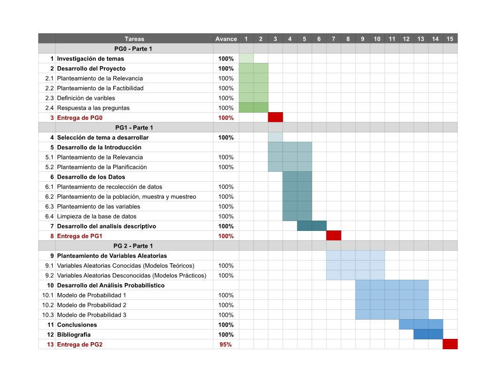

# 1. Introducción 

## 1.1. Relevancia

El cáncer de mama es una enfermedad que afecta a la glándula mamaria originada por el crecimiento descontrolado de células anormales. En el mundo, esta enfermedad  es una de las principales causas de muerte en mujeres por lo que conocer más sobre este tema permitiría detectar y tratar más temprano, generando de este modo tasas de supervivencia. 


## 1.2. Planificación

Diagrama de Gantt 
<center>{height=height, width=480px}</center><br>

---

# 2. Datos

## 2.1. Proceso de recolección de datos

* Para recolectar los datos decidimos que la mejor opción sería buscar datasets públicos en internet.
* Los datos fueron recolectados de la plataforma web kaggle, esta información está actualizada hasta noviembre de 2017. 
* Las condiciones de la recolección fueron buscar datasets de información relevante, completa y organizada.

## 2.2. Población, muestra y muestreo

* Población: Personas que estaban registradas en el programa de Vigilancia, Epidemiología y Resultados Finales (SEER) del Instituto Nacional del Cáncer (NCI) en los Estados Unidos con información actualizada hasta noviembre de 2017. 
* Unidad muestral: Persona de género femenino
* Tipo de muestreo: Probabilístico aleatorio simple

## 2.3. Variables

|           Variable           |                Descripción             |        Tipo de variable   | Restriciones |
|:----------------------------:|:-----------------------------:|:-----------------------------:|:---------------------:|
|     Edad        | Edad (en años) del paciente en el momento del diagnóstico de cáncer | Numérica discreta | Número entero positivo
|    Raza      | Raza de la persona |  categórica nominal | 3 posibles valores (White, Black, Other)
| Estado civil | Estado civil del paciente en el momento del diagnóstico | Categórica nominal | 4 posibles valores (Married, Divorced, Single, Widowed, Separated)
| Estado T | Etapa del tumor primario basado en el tamaño y su propagación a la piel o a la pared torácica debajo del seno   | Categórica ordinal | 4 posibles valores (T1, T2, T3, T4)
|  Estado N     | Etapa del tumor basada en información sobre metástasis en los ganglios linfáticos | Categórica ordinal | 3 posibles valores (N1, N2, N3)
| 6ta etapa    | Etapa del tumor según el tamaño, los ganglios linfáticos, la metástasis a distancia, y otra información clínica | Categórica ordinal | 5 posibles valores (IIA, IIIA, IIIC, IIB, IIIB)
| Diferenciación  | Diferencia entre las células cancerosas y las células sanas normales |   Categórica ordinal      | 4 posibles valores (Poorly differentiated, Moderately differentiated, Well differentiated, Undifferentiated)   
|  Grado | Clasificación del tumor basada en el nivel de diferenciación de las células cancerosas | Categórica ordinal | 4 posibles valores (3, 2, 1, 4)
|   Propagación | Extensión de la enfermedad | Categórica nominal | 2 posibles valores (Regional, Distant)
|  Tamaño tumor (mm)       | Tamaño del tumor en milímetros | Numérica continua | Número real positivo
|  Estado estrógeno      | Estado del receptor hormonal estrógeno | Categórica nominal  | 2 posibles valores (Positive, Negative)
|  Estado progesterona |  Estado del receptor hormonal progesterona | Categórica nominal | 2 posibles valores (Positive, Negative)
|  Nodos regionales examinados  | Número de ganglios linfáticos regionales que fueron extirpados y examinados por un patólogo | Numérica discreta | Número entero positivo
|  Nodos regionales positivos | Número de ganglios linfáticos regionales examinados por un patólogo que contenían metástasis | Numérica discreta  | Número entero positivo
| Esperanza vida (meses) | Esperanza de vida en meses ocasionada por la enfermedad  |  Numérica discreta |  Número entero positivo
|  Estado  | Estado de vida de la persona | Categórica nominal | 2 posibles valores (Alive, Dead)

## 2.4. Limpieza de base de datos


```{r echo=TRUE, warning=FALSE, cache=FALSE, message=FALSE}
# Cargamos las librerías necesarias
library(readr)
library(plyr)
library(dplyr)
library(ggplot2)
library(stringr)
```

```{r echo=TRUE, eval=TRUE, warning=FALSE, cache=FALSE, message=FALSE}
# Lectura del archivo `Breast_Cancer.csv`
BD <- read_csv("Breast_Cancer.csv")
```

```{r echo=TRUE}
# Dimensión de la base de datos
dimBD <- dim(BD)
dimBD
```

```{r echo=TRUE}
# Cantidad de casos completos
ccBD <- sum(complete.cases(BD)) 
ccBD
```

```{r echo=TRUE}
# Cantidad de datos NULL
sumBD <-sum(is.na(BD))
sumBD
```

```{r echo=TRUE, eval=TRUE,warning=FALSE, cache=FALSE, message=FALSE}
# Tipo de dato de cada de las variable
glimpse(BD)
```

```{r echo=TRUE, eval=TRUE,warning=FALSE, cache=FALSE, message=FALSE}
# Nombres de las variables
names(BD)
```

Como todos los datos están completos, no es necesario hacer la limpieza.
Solo renombramos las variables.

```{r eval=TRUE, echo=TRUE}
# Renombramiento de las variables
BD_R <- rename(BD, Edad = Age,Raza=Race,`Estado civil`=`Marital Status`,
Diferenciación=differentiate,`Estado estrógeno`=`Estrogen Status`,
`Estado progesterona`=`Progesterone Status`,`Estado T`=`T Stage`,
`Esperanza vida (meses)`=`Survival Months`,Estado=`Status`,
`Tamaño tumor (mm)`=`Tumor Size`,`Estado N`=`N Stage`,Grado=Grade,
Propagación=`A Stage`,`6ta etapa`=`6th Stage`,
`Nodos regionales examinados`=`Regional Node Examined`,
`Nodos regionales positivos`=`Reginol Node Positive`)
```

```{r eval=TRUE, echo=TRUE}
#Renombramiento de los datos de la variables Grado y Estado T
BM <- mutate(BD_R, Grado = case_when(Grado == "1" ~ 1, 
                                     Grado == "2" ~ 2,
                                     Grado == "3" ~ 3 ,
                                     Grado == 'anaplastic; Grade IV' ~ 4))

BDFX <- mutate(BM, `Estado T` = case_when(`Estado T` == "T1" ~ 1, 
                                          `Estado T` == "T2" ~ 2, 
                                          `Estado T` == "T3" ~ 3,
                                          `Estado T` == "T4" ~ 4))

```

```{r echo=TRUE}
# Información sobre la base de datos
summary(BDFX)
```

---

# 3. Análisis Descriptivo


## 3.1. Edad de mujeres que tienen cáncer
**Posición**
```{r eval=TRUE, echo=TRUE}
summary(BDFX$Edad)
table(BDFX$Edad)
```
Se observa que la edad de las pacientes encuestadas se encuentra entre 30 a 69 años, la media es 53.97 y la mediana es 54, esto indica que la mitad de los encuestados no supera esta edad. Además, la moda según la tabla es 49, lo que indica mayor recurrencia de pacientes con esa edad.

**Dispersión**
```{r}
#Rango
max(BDFX$Edad)-min(BDFX$Edad, na.rm = TRUE)
```

La edad de las pacientes encuestadas está entre los 30 años como mínimo y 69  años como máximo, por lo tanto el rango absoluto es 39.

```{r}
#Varianza
var(BDFX$Edad, na.rm = TRUE)

#Desviación estandar
sd(BDFX$Edad, na.rm = TRUE)

#Coeficiente de variación
sd(BDFX$Edad, na.rm = TRUE)/mean(BDFX$Edad, na.rm = TRUE)
```

El valor de la desviación estándar para esta variable es 8.96, entonces la variabilidad de las edades es moderado.
Su coeficiente de variación es 0.17, existe mayor homogeneidad en los datos y tenemos una muestra compacta, este supera por poco el 15% lo que indica que el promedio en este caso no sea representativo del conjunto de datos, esto en consecuencia de los valores extremos.

```{r}
hist(BDFX$Edad, col="skyblue", ylim=c(0,300), breaks = 15, main="Edad", xlab = "Edades", 
     ylab = "Frecuencia")
```

El histograma muestra asimetría en la dispersión de los datos, ya que la mayor cantidad de mujeres encuestadas con cáncer de mama tienen más de 45 años.

## 3.2. Análisis de la variable Grado

```{r}
barplot(table(BDFX$Grado), xlab="Grado", ylab="Frecuencia", main="Gráfico de barras de Grado", 
        col = "skyblue")
```

En el gráfico de barras se puede ver que la mayor cantidad de personas estan en el grado 2, siendo esta la moda, mientras que el menor es el grado 4.

## 3.3. Relación de las variables Categórica - Categórica (Grado vs Estado)

```{r echo=TRUE, eval=FALSE, warning=FALSE, cache=FALSE, message=FALSE}
# Instalamos las librerías necesarias
if (require("poltrix")) install.packages("poltrix")
if (require("Rtools")) install.packages("Rtools")
```

```{r echo=TRUE, warning=FALSE, cache=FALSE, message=FALSE}
# Cargamos la librería
library(plotrix)
```

```{r}
#Análisis de observaciones de  grado 1-Estado
A<-filter(BDFX, Grado=="1")
table(A$Estado)
frec<-table(A$Estado)
pie3D(frec, labels=frec, col= c("lightblue", "black"), main="Estado de las pacientes con Grado 1
      ")
legend("topleft", legend = c("Vivo", "Muerto"),
       fill =  c("lightblue", "black"))

#Análisis de observaciones de  grado 2_Estado
A<-filter(BDFX, Grado=="2")
table(A$Estado)
frec<-table(A$Estado)
pie3D(frec, labels=frec, col= c("lightblue", "black"), main="Estado de las pacientes con Grado 2")
legend("topleft", legend = c("Vivo", "Muerto"),
       fill =  c("lightblue", "black"))

#Análisis de observaciones de  grado 3_Estado
G<-filter(BDFX, Grado=="3")
table(G$Estado)
frec<-table(G$Estado)
pie3D(frec, labels=frec, col= c("lightblue", "black"), main="Estado de las pacientes con Grado 3")
legend("topleft", legend = c("Vivo", "Muerto"),
       fill =  c("lightblue", "black"))

#Análisis de observaciones de  grado 4_Estado
C<-filter(BDFX, Grado=="4")
table(C$Estado)
frec<-table(C$Estado)
pie3D(frec, labels=frec, col= c("lightblue","black"), main="Estado de las pacientes con Grado 4")
legend("topleft", legend = c("Vivo", "Muerto"),
       fill =  c("lightblue", "black"))
```

A partir de las gráficas podemos observar que los pacientes de grado 4 han muerto en mayor proporción que los que presentan menor grado en la enfermedad, ya que el 47.37% de estos ha fallecido antes de que termine el estudio. Por otro lado, hay una menor cantidad de mujeres que murieron antes de culminar el estudio estando en el grado 1, ya que solo el 7.18% de estos murió. En segundo lugar está el grado 2, el porcentaje de fallecidos se incrementa hasta 12.9%  y en tercero el grado 3, con un 23.67% de fallecidos. Por último, según el análisis podemos concluir que mientras menor sea el grado en el que se encuentre el paciente, menor será la posibilidad de que este fallezca.

## 3.4. Relación de variables Categórica - numérica (Estado T y Esperanza de vida)

```{r}
#Análisis de la variable estado T, para obtener la moda
barplot(table(BDFX$`Estado T`), main="Gráfico de barras de Estado T", ylab= "Frecuencia", 
        xlab = "Estado T" , col = "skyblue")
```

Del gráfico de barras se puede observar que la moda es el estado T2, el menos recurrente es el estado T3

```{r}
#Análisis de la variable numérica esperanza de vida
summary(BDFX$`Esperanza vida (meses)`)
hist(BDFX$`Esperanza vida (meses)`,breaks = 18, col = "sienna1", 
     main="Histograma de Esperanza de vida", ylab="frecuencia",
     xlab ="Esperanza de vida (meses)")
```


En este histograma se observa que los datos están sesgados a la izquierda ya que la mayor densidad de los datos son mayores a la mediana. 

## 3.5. Relacion de las variables Edad y Grado

```{r}
boxplot(BDFX$`Esperanza vida (meses)`~BDFX$`Estado T`, ylab="Esperanza de vida", 
        xlab="Estado T", main="Diagrama de caja y bigote por estado", col="green")
```

En esta gráfica se observa que en los primeros tres diagramas de caja y bigotes la media de la esperanza de vida en meses va disminuyendo, excepto para el estado 4 en donde vuelve a aumentar ligeramente la media. Sin embargo, se concluye del diagrama que la mayor parte de las personas que se encuentran en este último estado tienen una esperanza de vida menor al promedio.

## 3.6. Relación de variables categórica - categórica (Estado N y Grado)

```{r}
estadon_grado<-(table(BDFX$`Estado N`, BDFX$Grado))
mosaicplot(estadon_grado, xlab="Estado N", ylab="Grado", main="Grado v.s Estado N", 
           color = c("white", "skyblue", "yellow","grey" ))  #leyenda de colores
```

Conclusiones a partir de la gráfica

- Las pacientes del N1, N2 y N3 en mayor medida se encuentran en el grado 2.

- De acuerdo a la proporción de la cantidad de pacientes por estado N, el N3 tiene mayor cantidad de pacientes en el grado N4 y menor cantidad en el grado 1 que los demás, aun así la mayor densidad de pacientes en este Estado N se encuentra entre los grado 2 y 3.

## 3.7. Relación numérica - numérica (Tamaño v.s Edad)

```{r tamaño y Edad}

colores<- c("red", "green", "blue", "orange")

plot(y = BDFX$`Tamaño tumor (mm)`, x =BDFX$Edad, main="Tamaño v.s Edad", 
     ylab = "Tamaño (mm)", 
     xlab = "Edad", col="blue")
```

En la gráfica de dispersión presentada se puede observar que la mayor densidad de datos está en menos de 60 mm de tamaño del tumor, a partir de esta medida los datos se ven mas dispersos para todas las edades, es decir que hay menos pacientes que tienen tumores con un tamaño mayor a 60 mm aproximadamente.

## 3.8. Agregando una variable categórica a la gráfica (Estado T)

```{r tamaño Edad EstadoT}
plot(y = BDFX$`Tamaño tumor (mm)`, x =BDFX$Edad, col=colores[BDFX$`Estado T`], 
     main="Tamaño v.s Edad", ylab = "Tamaño tumor (mm)", xlab = "Edad")
legend("topright", legend = c("T1", "T2", "T3", "T4"), fill=colores, title = "Estado T")

table(BDFX$`Estado T`)
```

De la gráfica se concluye que los tumores de menor medida los tienen personas que se encuentran en el estado T1 con un tamaño de tumor menor o igual a los 20 mm, mientras que las personas que se encuentran en el estado T2 presentan tumores que varían en el intervalo de 20 mm a 50 mm aproximadamente. Asismismo, las personas que se encuentran en el estado T3 presentan mayor variación con repecto al tamaño del tumor y lo mismo sucede con las personas que se encuentran en el estado T4. De hecho, la mayor cantidad de personas que están en estos dos últimos estados presentan tumores de mayor medida (entre 50 mm a 140 mm).

---


# 4. Análisis probabilístico

## 4.1. Edad de los pacientes

### Distribución Binomial

Se desea calcular las siguientes probabilidades en una muestra de 500 personas escogidas al azar del total de la población.


- Probabilidad de que al menos 360 personas de la muestra tengan una edad mayor al primer cuartil:

Primero es necesario definir el éxito, el cual es escoger al azar una persona con una edad mayor al primer cuartil.

Definimos la variable aleatoria X: cantidad de personas con una edad mayor al primer cuartil en una muestra de 500 personas.

Evidentemente esta variable sigue un modelo de distribución Binomial ya que se requiere obtener una cantidad de $k$ éxitos en $n$ intentos. 

Entonces la variable aleatoria $X$ se denotada por:
$X \backsim Binom(n, p)$

```{r}
summary(BDFX$Edad)
n_personas <- nrow(filter(BDFX))

mayores_1c <- nrow(filter(BDFX, Edad > summary(BDFX$Edad)[2]))
p <- mayores_1c/n_personas
mayores_1c

pbinom(359, 500, p, lower.tail = FALSE)
```
De la misma forma:

- Probailidad de que al menos 261 personas con edad mayor al segundo cuartil:
```{r}
mayores_2c <- nrow(filter(BDFX, Edad > summary(BDFX$Edad)[3]))
p <- mayores_2c/n_personas
pbinom(260, 500, p, lower.tail = FALSE)
```

- Probabilidad de que al menos 121 personas tengan una edad mayor al tercer cuartil:
```{r}
mayores_3c <- nrow(filter(BDFX, Edad > summary(BDFX$Edad)[5]))
p <- mayores_3c/n_personas
pbinom(120, 500, p, lower.tail = FALSE)
```

- Probabilidad de que la edad de las personas sea menor a la moda:
```{r}
# Obtenemos la moda
sort(table(BDFX$Edad), decreasing = T)[1]
mayores_3c <- nrow(filter(BDFX, Edad < 46))
p <- mayores_3c/n_personas
pbinom(120, 500, p, lower.tail = FALSE)
```


## 4.2. Estado de propagación del tumor (Estado N)

### Distribución Hipergeométrica

Si se escoge a 200 personas al azar del total de la población, ¿cuál es la probabilidad de que al menos 170 
personas se encuentren en el primer o segundo estado de la propagación del tumor?

*Respuesta*

Se define la variable aleatoria $X$ como la cantidad de personas de la muestra que se encuentran en el primer o segundo estado de la propagación del tumor. Además se sabe que la variable discreta `Estado N` contiene dicha información.

Evidentemente la variable aleatoria discreta $X$ sigue un modelo de distribución hipergometrico ya que desea calcular la probabilidad de que en una muestra haya ciertas personas que cumplan cierta condición.

Entonces la variable aleatoria $X$ se denotada por:
$X \backsim HiperGeo(N, M, n)$

Por lo cual se puede calcular dicha probabilidad de la siguiente forma

```{R}
# Frecuencias absolutas en la variable Estado N
table(BDFX$`Estado T`)

N <- length(BDFX$`Estado T`) # Tamaño de la población

# Cantidad de personas de la población que se encuentran en el primer o segundo estado 
# de propagación del tumor
M <- nrow(filter(BDFX, `Estado T` == "1" | `Estado T` == "2" )) 

n <- 200 # Tamaño de la muestra
x <- 169   

# Como se requiere calcular la probabilidad de que al menos 170 personas...
phyper(x, M, N - M, n, lower.tail = FALSE)
```

*Gráfica*

```{r}
plot(0:n, dhyper(0:n, M, N - M, n), 
     main = 'Función de masa de probabilidad',
     type = 'p',
     xlab = 'Rango de X',
     ylab = 'Probabilidad',
     col = 3)
abline(v = 170, col = 2, lwd = 2)
grid()

# La sumatoria de probabilidades desde la linea roja a la derecha debería ser 0.424169
sum(dhyper(170:n, M, N - M, n))

plot(0:n, phyper(0:n, M, N - M, n), 
     main = 'Función de distribución Acumulada',
     type = 'p',
     xlab = 'Rango de X',
     ylab = 'Probabilidad Acumulada',
     col = 3)
text(x = 70, y = 0.6, label="1 - phyper(169, 3389, 4024 - 3389, 200) = 0.424169")
points(169, phyper(169, M, N - M, n), col = 4, lwd = 2)
grid()

# La resta: 1 - phyper(169, 3389, 4024 - 3389, 200) debería ser 0.424169
1 - phyper(169, 3389, 4024 - 3389, 200)
```

## 4.3.Esperanza de vida
### Distribución normal   

```{r probabilidad normal}

hist(BD$`Survival Months`,prob=T,breaks = 20,freq = F,main = "Esperanza de vida",
     col="pink",xlab = "Meses de vida")
lines(density(BD$`Survival Months`),lwd=2,col="red")
curve( dnorm(x,mean(BD$`Survival Months`) ,sd(BD$`Survival Months`)),lwd=2,
       col="green",add = T)
legend("topleft", c("Curva observada", "Curva teórica"), lty=1, lwd=2, 
       col=c("red","green"), bty="n", cex=0.8)
```   

Del gráfico anterior podemos deducir que el modelo más cercano o similar es a la distribución normal, además se puede notar que es sesgada a la izquierda.   
Para el modelo de distribución normal: $X \backsim N(μ,σ^2)$
Donde:   
μ= media       
σ^2= varianza
```{r halla los valores}
summary(BD$`Survival Months`)
media=sum(BD$`Survival Months`)/length(BD$`Survival Months`)
media
desviacion_estandar=sqrt(var(BD$`Survival Months`))
desviacion_estandar
```
Mediana=73 meses, media=71.3 meses

### Eventos   
¿Qué cantidad de mujeres se espera que tengan mas de 48 meses de esperanza de vida al elegir al azar 1500 mujeres?

```{r}
#Primero hallamos la probabilidad sea mayor a 48 meses
#pnorm(X,media,desviacion_estandar,lower.tail=F)

p<-pnorm(48,media,desviacion_estandar,lower.tail = F)
p
```
La probabilidad de obtener una esperanza de vida mayor a 48 meses 84.53%, este porcentaje nos indica que una mujer pueda tener un alta probabilidad que tenga 48 meses de vida o 4 años.
```{r }
#Después se halla la cantidad de mujeres en total
mujeres<-1500*p
mujeres
```
*Respuesta:*
La cantidad de mujeres que tienen una esperanza de vida mayor a 60 meses es 1034 de las 1500 mujeres elegidas al azar.

---

# 5. Conclusiones

A través del estudio estadístico y probabilístico se logró comprender y visualizar las variables que intervienen en la condición de los pacientes con cáncer de mama. Gráficos como el histograma mostraron que la mayor cantidad de mujeres encuestadas con cáncer de mama tienen más de 45 años. También se pudo observar que los pacientes de grado 4 han muerto en mayor proporción que los que presentan menor grado en la enfermedad. Asimismo, se pudo observar que el estado T del paciente esta relacionando con el tamaño del tumor, a excepción del Estado T4, ya que los tumores más pequeños están en un estado T1 y los más grandes en T3, mientras que los pacientes que presentan estado T4, el tamaño de su tumor está disperso entre (10 mm y 140 mm).

---

# 6. Bibliografía

- Breast Cancer. (2022, 8 agosto). Kaggle. https://www.kaggle.com/datasets/reihanenamdari/breast-cancer

- Estadificación del cáncer. (s.f.). https://www.cancer.org/es/tratamiento/como-comprender-su-diagnostico/estadificaciondelcancer.html

---