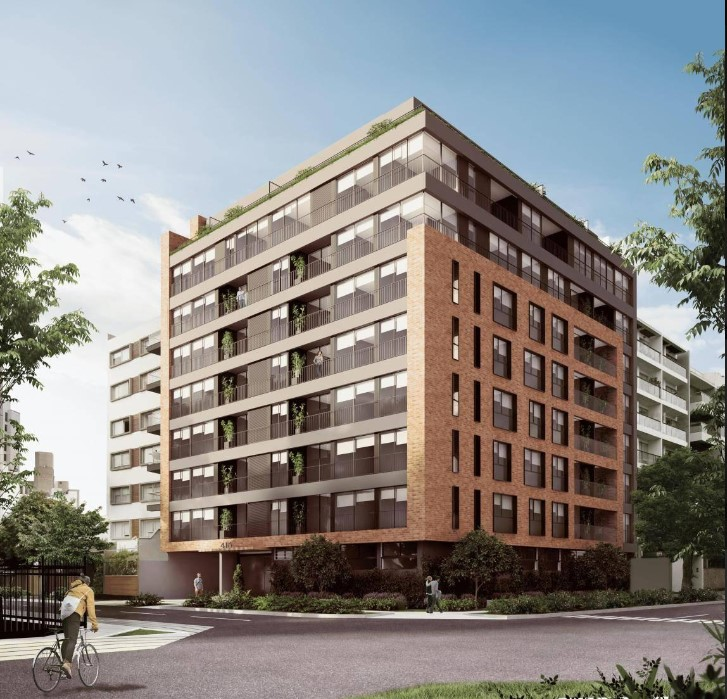
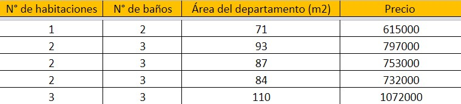

<center>
**UTEC - UNIVERSIDAD DE INGENIERÍA Y TECNOLOGÍA**


**Estadística y Probabilidades**

**Perfil de oferta inmobiliaria en 10 distritos de Lima**

**Laboratorio 9**

**Grupo 3**

**Profesora:** Jessica Cleofe Muñoz Grados de Flores <br><br>

|  **Integrantes:**                       | **Código**   |
|:----------------------------------------|:------------:|
| José de Miguel de María Pastor Revilla  | 202210249    |
| Andrea Carolina Pinedo Saenz            | 202110270    |
| Helen Jhadira Santillan Socla           | 202120530    |
| Mabel Cris Farfan Tipo                  | 202120213    |

</center>

# Librerías

```{r}
library(readr)
library(readxl)
library(dplyr)
library(ggplot2)
library(tidyverse)
library(DescTools)
library(readr)
library(moments)
library(ggthemes)
library(paletteer)
library(VennDiagram)
library(reshape2)
library(fastGraph)
library(EnvStats)
```

# Introducción

## Justificación

La oferta de departamentos en venta en Lima viene tomando un espacio cada vez más amplio dentro del sector inmobiliario, y, según ASEI, **se ha incrementado en 57% en distritos** como San Isidro y Barranco.  Dicha operación en oferta supone el **79,7% del total disponible** de acuerdo con el análisis del portal de compra y alquiler *Properati (2022)*. De tal manera, es de sumo interés conocer y analizar el perfil de oferta inmobiliaria sobre la venta de departamentos en el último año en algunos distritos de Lima Metropolitana, como lo son Miraflores, San Isidro, Lince, San Borja, Barranco, Chorrillos, Breña, San Miguel, Magdalena del Mar y Santiago de Surco.
Objetivos

## Objetivos

### Objetivo general
Analizar y comparar estadística y probabilísticamente el perfil de venta inmobiliaria de departamentos en el último año en diez distritos de Lima Metropolitana: Miraflores, San Isidro, Lince, San Borja, Barranco, Chorrillos, Breña, San Miguel, Magdalena del Mar y Santiago de Surco.

### Objetivos específicos

<ul>
<li>Evaluar la distribución de precios de los departamentos en los diez distritos seleccionados</li>
<li>Comparar la tendencia de espacios que ofrecen las inmobiliarias</li>
<li>Determinar el precio promedio según la condición de los departamentos ofrecidos por distrito</li>
<li>Analizar las variaciones de los precios en relación al área de los departamentos por distrito</li>
<li>Comparar el precio de los departamentos por distrito según su número de habitaciones</li>
<li>Conocer la frecuencia y promedio del número de habitaciones por departamento</li>
<li>Hallar la probabilidad de encontrar un departamento con 1 habitación dado que pertenece a cada distrito</li>
<li>Conocer el valor esperado del número de áreas comunes por departamento</li>
<li>Encontrar la probabilidad de departamentos con un precio mayor 800000 con la función normal logarítmica</li>
<li>Encontrar la probabilidad escoger 10 departamentos con 2 habitaciones en Magdalena del Mar</li>
</ul>

## Planificación

```{r}
library(tidyverse)
library(readxl)
BD <- read_excel("GANTT.xlsx")
BD <- BD %>% 
  mutate(start = as.Date(start), end = as.Date(end))

BD_tidy <- BD %>% 
  gather(key=date_type, value=date, -task, -owner)
ggplot() +
  geom_line(data=BD_tidy, mapping=aes(x=fct_rev(fct_inorder(task)), y=date, color=owner), size=5) +
  geom_hline(yintercept=as.Date("2022-11-25"), colour="black", linetype="dashed") +
  coord_flip() +
  scale_y_date(date_breaks = "5 day") +
  labs(title="Distribución de las actividades",
       x = "Tarea",
       y = "Fecha",
       colour = "Entrega") +
  theme_bw() +
  theme(axis.text.x = element_text(angle = 90),
        panel.grid.minor = element_line(colour="white", size=0.5),
        legend.position="right",
        plot.title = element_text(hjust = 0.5))
```


# Descripción del Proyecto

## Proceso de recolección de datos

La recolección de datos consistió de un proceso de **minucioso** de búsqueda de las características de 500 departamentos en páginas de venta de inmuebles.

### Población

En primer lugar, decidimos apropiado limitar la búsqueda en zonas consideradas más significativos por los autores, así se seleccionaron los siguientes distritos:

<ul><li>Miraflores</li><li>San Isidro</li><li>Chorrillos</li><li>Santiago de Surco</li><li>Magdalena del Mar</li><li>Barranco</li><li>San Borja</li><li>Lince</li><li>Breña</li><li>San Miguel</li></ul>

### Fuente de información

Para la recolección de información se utilizaron **páginas de venta de inmuebles** como [urbania](https://urbania.pe/), [adondevivir](https://www.adondevivir.com/), [nexo inmobiliario](https://nexoinmobiliario.pe/).


Sin embargo, fue necesario expandir nuestra búsqueda porque los motores de búsquedas no siempre describían las variables que nosotros esperábamos, por ejemplo, en un gran número de edificios no incluían el *número de pisos* o los *espacios de recreación*. Para resolver esto, tuvimos que consultar los panfletos y páginas web de cada edificio, incluso, tuvimos que recurrir a **llamar a las mismas inmobiliarias**.

### ¿Cómo recolectamos la información?

<h4>Recolección de una muestra</h4>

Para realizar una muestra representativa seleccionamos 5 departamentos por cada edificio. No obstante, no todos los edificios el mismo número de lotes disponibles, y dentro de un edificio los lotes no tenían el mismo número de habitaciones, por lo que no podíamos simplemente combinarlo. Para solucionar este problema decidimos representar los lotes disponibles como conjuntos de 5 elementos. 

Por ejemplo: En el edificio *Francia y Roma 420* de la inmobiliaria *ACTUAL* hay **3 unidades de 1 dormitorio, 10 de 2 dormitorios y 4 unidades de 3 dormitorios**. 



El primer paso es determinar el porcentaje que representa cada categoría del total:


<ul><li>Con 1 dormitorio: 17.65%</li><li>Con 2 dormitorios: 58.82%</li><li>Con 3 dormitorios: 23.53%</li></ul>

Luego se hallaba qué número representan las categorías si solo hubieran 5 unidades, esto se realiza multiplicando el porcentaje por 5:

<ul><li>Con 1 dormitorio: 0.88 unidades</li><li>Con 2 dormitorios: 2.94 unidades</li><li>Con 3 dormitorios: 1.17 unidades</li></ul>

Evidentemente, no pueden haber 0.88 departamentos con 1 dormitorio, por lo tanto, el paso final fue redondear todo al entero más cercano.

<ul><li>Con 1 dormitorio: 1 unidad</li><li>Con 2 dormitorios: 3 unidades</li><li>Con 3 dormitorios: 1 unidad</li></ul>
Posteriormente a ello se iniciaba con la recolección de las variables en cada caso:




## Población, muestra y muestreo

la población de nuestra investigación son **todos los departamentos en venta por inmobiliaria de los distritos Miraflores, San Isidro, Chorrillos, Santiago de Surco, Magdalena del Mar,  Barranco, San Borja, Lince, Breña y San Miguel**. La muestra consiste de 500 departamentos 
Variables

## Variables

**<u>Variables cuantitativas:</u>**

<ul>
<li>**“N° de pisos del edificio”**: Está medido en cantidad de pisos de un determinado edificio. Es una variable numérica discreta.
**Restricción:** No puede ser negativo ya que toman valores enteros.</li>

<li>**“N° de unidades**: Está medido en cantidad de números de departamentos por edificios. Es una variable numérica discreta.
**Restricción:** No puede ser negativo ya que toman valores enteros.</li>

<li>**N° de habitaciones**: Está medido en cantidad de habitaciones por departamento puede variar de 1, 2, 3 o hasta 4 habitaciones por departamento. Es una variable numérica discreta.
**Restricción:** No puede ser negativo ya que toman valores enteros.</li>

<li>**N° de baños**: Está medido en el número de baños por departamento puede variar dependiendo al número de habitaciones. Es una variable numérica discreta.
**Restricción:** No puede ser negativo ya que toman valores enteros.</li>

<li>**Área del departamento (m2)**: Está medido en área del departamento varía según la cantidad de habitaciones ya que es proporcional. Es una variable numérica discreta.
**Restricción:** No puede ser negativo.</li>

<li>**Precio**: Es una variable numérica discreta que está medida en soles. Va a depender de la cantidad de habitaciones.
**Restricción:** No puede ser negativo.</li>

<li>**Fecha de visita de la página web**: Esta variable categórica discreta representa la visita de la página web de las inmobiliarias está en el orden de *”Día, Mes y Año”* </li>
</ul>

**<u>Variables Categóricas:</u>**
	
<ul>
<li>**Condición del departamento**: Es una variable ternaria porque solo puede tomar los siguientes valores de *“En Planos”*, *“En Construcción”* o *“Entrega Inmediata”*, representa la condición del departamento.</li>

<li>**Sala de reuniones o eventos**: Es una variable binaria porque solo puede tomar los valores de ‘si’ o ‘no’, representa si es que la unidad muestral sala de reuniones o eventos.</li>

<li>**Gimnasio**: Es una variable binaria porque solo puede tomar los valores de ‘si’ o ‘no’, representa si es que la unidad muestral Gimnasio.</li>

<li>**Zona de parrillas**: Es una variable binaria porque solo puede tomar los valores de ‘si’ o ‘no’, representa si es que la unidad muestral zona de parrillas.</li>

<li>**Juegos infantiles**: Es una variable binaria porque solo puede tomar los valores de ‘si’ o ‘no’, representa si es que la unidad muestral juegos infantiles.</li>

<li>**Piscina**: Es una variable binaria porque solo puede tomar los valores de ‘si’ o ‘no’, representa si es que la unidad muestral piscina.</li>
</ul>


## Descriptores estadísticos

### Distribución del precio de los departamentos

En primer lugar, llamamos a la base de datos:
```{r}
BD <- read_csv("Depa.csv")
```

```{r}
hist(BD$Precio,breaks=30,col="yellow",main="Gráfica 1. Distribución del precio de los departamentos",ylab="Frecuencia",xlab="Precio del departamento (soles)")
abline(v=median(BD$Precio),col="red",lwd=2) 
abline(v=mean(BD$Precio),col="blue",lwd=2) 
legend(200,0.012,legend=c("Mediana","Media"),lwd=2,col=c("red","blue"))
```

Se muestra un **histograma** de la *distribución del precio de los departamentos (soles)*, la línea roja representa la mediana, mientras que la azul la media de los precios. Este diagrama muestra una distribución **asimétrica positiva** de los precios de los departamentos porque la media es mayor que la mediana. Esto indica que la mayoría de los departamentos tiene un **precio menor que la media**.

Este punto se puede ver evidenciado en el coeficiente de asimetría de la variable:


```{r}
skewness(BD$Precio)
```
El coeficiente de asimetría es mucho mayor que 0.05 por lo tanto, se reafirma que la distribución está fuertemente sesgada a la derecha.

### Distribución de los precios de los departamentos por distrito

```{r}
boxplot(BD$Precio~BD$Distrito,las=3,cex.axis=0.5,xlab="Distrito",ylab="Precio del departamento (soles)",main="Gráfica 2. Distribución de los precios de los departamentos por distrito", col="salmon")
```

El gráfico es un **boxplot indexado** del *precio de los departamentos en soles en función del distrito*. A simple vista, los distritos con **mayor variabilidad** son <u>Miraflores</u>, <u>San Borja</u>,<u> San Isidro</u> y <u>Santiago de Surco</u>. Por el otro lado, los distritos con menor variabilidad son <u>Breña</u>, <u>Chorrillos</u>, <u>Lince</u> y <u>San Miguel</u>. La mayoría de distritos presenta una distribución asimétrica positiva porque la mediana está más cerca al cuartil 1 que al cuartil 3.

Esto se ve respaldado por la desviación estándar de los distritos, donde San isidro tiene el mayor valor.
```{r}
which.max(tapply(BD$Precio,BD$Distrito,sd))
```

### Frecuencia de los servicios ofrecidos por edificio
```{r}
table(BD$`Sala de reuniones o eventos (Si/No)`)
table(BD$`Gimnasio (Si/No)`)
table(BD$`Juegos infantiles (Si/No)`)
table(BD$`Piscina (Si/No)`)

A <- matrix(
  c(220,220,175,100, 280,280,325,400),
  nrow=2,
  ncol=4,
  byrow=TRUE,
)

rownames(A) <- c("Si","No")
colnames(A) <- c("Sala de Reuniones","Gimnasio","Juegos Infantiles","Piscina")
print(A)

barplot(A,
main = "Gráfica 3. Condiciones ofrecidas por departamento",
xlab = "Condición",
col = c("lightblue","darkblue"),
beside=TRUE
)
legend("topleft",
c("Si","No"),
fill = c("lightblue","darkblue")
)
```

Este gráfico de barras representa la distribución de los servicios ofrecidos (Sala de Reuniones, Gimnasio, Juegos Infantiles, Piscina) por la muestra de departamentos. Se puede apreciar que las salas de reuniones y los gimnasios tienen la misma distribución. Por su parte, la mayoría de departamentos no cuenta con acceso a una piscina.

### Precio promedio de los departamentos por condición

```{r}
tapply(BD$Precio,BD$`Condición del departamento`,mean)

B <- matrix(
  c(691281.4,582319.0,589263.8),
  nrow=1,
  ncol=3,
  byrow=TRUE
)

colnames(B) <- c("En Construcción", "En Planos", "Entrega Inmediata")
rownames(B) <- c("Precio Promedio")

barplot(B,
main="Gráfica 4. Precio promedio de los departamentos por condición",
xlab="Condición del departamento",
ylab="Precio promedio",
border="red",
col="salmon",
density=30
)
```

### Distribución del precio de los departamentos con 1 habitación por distrito
```{r}
BD1 <- BD
BD1$`N° de habitaciones` <- as.character(BD1$`N° de habitaciones`)
BD1$Distrito <- as.factor(BD1$Distrito)

uh <- filter(BD1,BD1$`N° de habitaciones`=="1")

boxplot(uh$Precio~uh$Distrito, col=rainbow(10), frame = T, horizontal = T,las=1,cex.axis=0.7,ylab="",xlab="Precio (soles)",main="Gráfico 5. Precios de los departamentos con una sola habitación por distrito")
legend("topright", c("Barranco","Breña","Chorrillos","Lince","Magdalena","Miraflores","San Borja","San Isidro","San Miguel","Surco"), border="black", fill = rainbow(10),cex=0.5)
```
El gráfico boxplot indica la distribución de los precios de los departamentos de 1 habitación por distrito. El Distrito que tiene una mayor variabilidad y también tiene los valores máximos es Miraflores. Los distritos con menor variabilidad y menores precios son Breña, Chorrillos y San Miguel. Se aprecia que la tendencia de la variabilidad y el precio de los departamentos es directa.


### Distribución del precio de los departamentos con 2 habitaciones por distrito
```{r}
dh<- filter(BD1,BD1$`N° de habitaciones`=="2")

boxplot(dh$Precio~dh$Distrito, col=rainbow(10), frame = T, horizontal = T,las=1,cex.axis=0.7,ylab="",xlab="Precio (soles)",main="Gráfico 6. Precios de los departamentos con dos habitaciones por distrito")
legend("topright", c("Barranco","Breña","Chorrillos","Lince","Magdalena","Miraflores","San Borja","San Isidro","San Miguel","Surco"), border="black", fill = rainbow(10),cex=0.5)
```
El gráfico boxplot indica la distribución de los precios de los departamentos de 2 habitaciones por distrito. El Distrito que tiene una mayor variabilidad y precios más altos es San Isidro. Los distritos con menor variabilidad es Breña y Chorrillos.
Distribución del precio de los departamentos con 3 habitaciones por distrito
```{r}
th<- filter(BD1,BD1$`N° de habitaciones`=="3")

boxplot(th$Precio~th$Distrito, col=rainbow(10), frame = T, horizontal = T,las=1,cex.axis=0.7,ylab="",xlab="Precio (soles)",main="Gráfico 7. Precios de los departamentos de tres habitaciones por distrito")
legend("topright", c("Barranco","Breña","Chorrillos","Lince","Magdalena","Miraflores","San Borja","San Isidro","San Miguel","Surco"), border="black", fill = rainbow(10),cex=0.5)
```
El gráfico boxplot indica la distribución de los precios de los departamentos de 3 habitaciones por distrito. El Distrito que tiene una mayor variabilidad y precios más altos es nuevamente San Isidro. Los distritos con menor variabilidad es Breña y Chorrillos.


### Comparación de áreas promedio de los departamentos
```{r}
mean(BD$`Área del departamento (m2)`)
```

En general, se observa que el área promedio ofrecido por las inmobiliarias por departamento dentro de los distritos seleccionados es 81.788m^2.

```{r}
tapply(BD$`N° de habitaciones`, BD$Distrito,mean)
```

Siendo más específicos, distinguimos el área promedio de departamentos por cada uno de los distritos seleccionados. Por ejemplo, en el caso del distrito del distrito de San Borja el promedio de número de habitaciones vendría a ser 2.56.

### Área de departamento que se tienden a ofertar en mayor frecuencia en cada distrito

```{r}
Mode(BD$`Área del departamento (m2)`)
```

Se observa que el valor más frecuente de área de departamento es 60m^2 dentro del total de los distritos seleccionados, con una frecuencia de 17 veces.

```{r}
tapply(BD$`Área del departamento (m2)`, BD$Distrito,Mode)
```

### Comparación del número de habitaciones por departamento que es ofrecido con mayor frecuencia en cada distrito

```{r}
Mode(BD$`N° de habitaciones`)
```
El valor más frecuente es 3 y se repite 215 veces.

Ahora por cada departamento:
```{r}
tapply(BD$`N° de habitaciones`, BD$Distrito,Mode)
```
Por ejemplo, en el distrito de Barranco, el valor más frecuente es 1 y se repite 25 veces.


### Distinguir los departamentos con mayor y menor número de habitaciones y conocer los distritos en donde se encuentran
## Distinguir los departamentos con mayor y menor número de habitaciones y conocer en cuáles de los distritos investigados se encuentran

```{r}
table(BD$`N° de habitaciones`,BD$Distrito)
```
Los departamentos con mayor número de habitaciones, es decir 4 dormitorios por departamento, se encuentran ubicados en San Miguel en dos de los departamentos indagados. Mientras que en el distrito de Barranco se encuentra el menor número de habitaciones, el cual vendría a ser 1, con un total de 25 departamentos.


###  Relación entre el área del departamento y el precio de los departamentos

```{r}
lm(BD$Precio~BD$`Área del departamento (m2)`)
```


```{r}
plot(BD$`Área del departamento (m2)`,BD$Precio,pch=4,xlab="Area en m2",ylab="precio (soles)",main="Gráfico 8.  Area vs. precio")
abline(-85492,8776,col="red")
```

La relación entre el área del departamento (m2) y el precio de cada departamento tiene una relación positiva con un valor de R-cuadrado de 0.76 aproximadamente, lo que indica una relación fuerte con el modelo matemático. Esto nos indica que a medida que aumenta **el área de un departamento, su precio también se incrementa**


## Número de Habitaciones respecto al área del departamento

```{r}
plot(BD$`N° de habitaciones`, BD$`Área del departamento (m2)`, xlab = "Nº de habitaciones", ylab = "Área del departamento en m2", main="Gráfico 9. Distribución de áreas por número de habitaciones")
```


### Frecuencias del número de habitaciones en los distritos seleccionados

```{r}
Frecuencias<-table(cut(BD$`N° de habitaciones`,breaks=seq(from=0,to=5,by=1)))
Frecuencias
```

Un gráfico (muy parecido al histograma) que puede servir es:

```{r}
plot(Frecuencias,las=3,
     xlab="Numero de Habitaciones",ylab="Frecuencia", las=3.9, cex.axis=0.5,main="Gráfico 10. Histograma de clases")
```
Se observa que el número de habitaciones por departamento más frecuente es 3 en el intervalo de 2 a 3 con una frecuencia mayor a 200. Asimismo se determina que los departamentos con una habitación tienen una frecuencia casi nula.


# ANÁLISIS PROBABILÍSTICO

### Análisis del acceso a vivienda

Según un análisis realizado por la Asociación Peruana de Empresas de Inteligencia de Mercados (APEIM), en un informe publicado en 2021, los ingresos de la población de lima metropolitana se dividen de la siguiente manera:
<ul><li>**Escala A:** 12,576 PEN</li><li>**Escala B:** 6,245 PEN</li><li>**Escala C:** 3,066 PEN</li><li>**Escala D:** 1,912</li><li>**Escala E:** 1,381</li></ul>
En términos hipotecarios, se recomienda que el pago de la deuda ocupe el 30% del sueldo mensual. Bajo estos términos Si consideramos un plazo de pago de 25 años y una TCEA del 14% [Fuente](https://tinyurl.com/3c2924ks), el costo máximo (C) que una persona puede acceder en función de sus ingresos (I) está dado por:
$$C=I\times 12\times 25 0.3\times (1-TCEA)$$
Entonces por escala socioeconómica, el monto máximo que puede acceder una persona se resumen en:
<ul><li>**Escala A:** 973,382 PEN</li><li>**Escala B:** 483,363 PEN</li><li>**Escala C:** 237308 PEN</li><li>**Escala D:** 147,989 PEN</li><li>**Escala E:** 106,889 PEN</li></ul>

Bajo estos cálculos, se puede encontrar la probabilidad de hallar un departamento entre los distritos estudiados que cuente con un precio adecuado para cada escala.

**Escala A**
```{r}
A <- ecdf(BD$Precio)(973382)
```

**Escala B**
```{r}
B <- ecdf(BD$Precio)(483363)
```

**Escala C**
```{r}
C <- ecdf(BD$Precio)(237308)
```

**Escala D**
```{r}
D <- ecdf(BD$Precio)(147989)
```

**Escala E**
```{r}
E <- ecdf(BD$Precio)(106889)
```

A continuación se muestra una tabla que resume los resultados:

| **Escalas (A-B)** | **Salario (PEN)** | **Probabilidad (%)** |
|-------------------|-------------------|----------------------|
|         A         |       12,576      |        83.77%        |
|         B         |       6,245       |        48.50%        |
|         C         |       3,066       |         2.40%        |
|         D         |       1,912       |         0.60%        |
|         E         |       1,381       |         0.60%        |

Los datos resultan razonables, ya que a medida que aumenta el poder adquisitivo también se incrementa el número de viviendas disponibles. Sin embargo, llama la atención que para las 3 últimas escala: C, D y E, es prácticamente imposible vivir en cualquiera de los 10 distritos porque solamente 2.40%, 0.60% y 0.60% de los departamentos cumplen las condiciones. Estas cifras muestran la segregación socioeconómica de la sociedad debido a los altos precios de vivienda.

Además, se han realizado gráficos de densidad y de distribución para poder apreciar los resultados:
```{r}
vertDf <- data.frame(years=c(973.382,483.363,237.308,147.989,106.889),labels=c("A","B","C","D","E"))
```

```{r}
BD <- read.csv("Depa.csv")
BD$Precio <- as.numeric(BD$Precio)
BD$Precio <- as.numeric(BD$Precio)
BD$Precio=round(BD$Precio/1000,2)

p <- ggplot(BD, aes(x=Precio))+geom_density(size=0.8,fill="grey95")
p+
  labs(title="Gráfico 11. Función de densidad del precio de los departamentos",x ="Precio (miles de soles)", y = "Densidad")+
  
  geom_vline(aes(xintercept=years,color=labels),data=vertDf,size=0.8,linetype="solid") + 
  scale_color_manual("Escala Socioeconómica",values=paletteer_d("ggsci::default_locuszoom")) +
  
  ylim(0,0.0020)+
  scale_x_continuous(expand = c(0, 0),breaks=c(0,500,1000,1500,2000,2500,3000))+
  
  theme_bw()+
  
  theme(plot.title = element_text(hjust = 0.5))+
  theme(legend.position = "bottom")

BD <- read.csv("Depa.csv")
BD$Precio <- as.numeric(BD$Precio)
```

El área del gráfico detrás de cada barra, representa la probabilidad de hallar un departamento que cumpla las condiciones respectivas.

```{r}
BD <- read.csv("Depa.csv")
BD$Precio <- as.numeric(BD$Precio)
BD$Precio=round(BD$Precio/1000,2)

p <- ggplot(BD, aes(x=Precio)) + stat_ecdf(size=0.8) #Función de distribución experimental
p + 
  
  labs(title="Gráfico 12. ECDF del Precio de los Departamentos",x ="Precio (miles de soles)", y = "Cuantil")+
  
  geom_vline(aes(xintercept=years,color=labels),data=vertDf,size=0.8) + 
  scale_color_manual("Escala Socioeconómica",values=paletteer_d("ggsci::default_locuszoom")) +
  
  scale_x_continuous(expand = c(0, 0),breaks=c(0,500,1000,1500,2000,2500,3000))+
  scale_y_continuous(expand = c(0, 0))+
  theme_bw()+
  theme(plot.title = element_text(hjust = 0.5))+
  theme(legend.position = "bottom")
  
BD <- read.csv("Depa.csv")
BD$Precio <- as.numeric(BD$Precio)
```

En el gráfico de distribución la probabilidad está dada por la intersección entre el gráfico y cada una de las barras del perfil socioeconómico.

### Departamento para familia escala B

Según un estudio de la EAE Business School el promedio de hijos por familia en Perú oscila alrededor de los 2.1 hijos por hogar y se espera que siga bajando [según el diario Gestión](https://gestion.pe/economia/familia-peruana-pasara-5-2-1-hijos-mujer-2030-estudio-259093-noticia/).

Frente a ello, realizamos la siguiente pregunta ¿Cuál es la probabilidad de que una familia de escala socioeconómica B con 2 hijos, encuentre un departamento que tenga por lo menos 2 áreas comunes y 3 habitaciones?

Primero modificamos la base de datos para **unificar** las áreas comunes:

```{r}
BD <- read.csv("Depa.csv")
View(BD)
```

```{r}
BD %>% mutate(Sala.de.reuniones.o.eventos..Si.No. = 
        ifelse(Sala.de.reuniones.o.eventos..Si.No. == "Si", 1,
        ifelse(Sala.de.reuniones.o.eventos..Si.No. == "No", 0, Sala.de.reuniones.o.eventos..Si.No.
        ))) -> BD

BD %>% mutate(Gimnasio..Si.No. = 
        ifelse(Gimnasio..Si.No. == "Si", 1,
        ifelse(Gimnasio..Si.No. == "No", 0, Gimnasio..Si.No.
        ))) -> BD

BD %>% mutate(Zona.de.parrillas..Si.No. = 
        ifelse(Zona.de.parrillas..Si.No. == "Si", 1,
        ifelse(Zona.de.parrillas..Si.No. == "No", 0, Zona.de.parrillas..Si.No.
        ))) -> BD

BD %>% mutate(Juegos.infantiles..Si.No. = 
        ifelse(Juegos.infantiles..Si.No. == "Si", 1,
        ifelse(Juegos.infantiles..Si.No. == "No", 0, Juegos.infantiles..Si.No.
        ))) -> BD

BD %>% mutate(Piscina..Si.No. = 
        ifelse(Piscina..Si.No. == "Si", 1,
        ifelse(Piscina..Si.No. == "No", 0, Piscina..Si.No.
        ))) -> BD

BD$Sala.de.reuniones.o.eventos..Si.No.=as.numeric(BD$Sala.de.reuniones.o.eventos..Si.No.)
BD$Gimnasio..Si.No.=as.numeric(BD$Gimnasio..Si.No.)
BD$Zona.de.parrillas..Si.No.=as.numeric(BD$Zona.de.parrillas..Si.No.)
BD$Juegos.infantiles..Si.No.=as.numeric(BD$Juegos.infantiles..Si.No.)
BD$Piscina..Si.No.=as.numeric(BD$Piscina..Si.No.)

BD$AreasC <- BD$Sala.de.reuniones.o.eventos..Si.No.+BD$Gimnasio..Si.No.+BD$Zona.de.parrillas..Si.No.+BD$Juegos.infantiles..Si.No.+BD$Piscina..Si.No.

```

Luego filtramos los valores según las condiciones que establecimos previamente: el departamento debe estar al alcance de ingresos de la clase socioeconómica B (en función a los cálculos que realizamos en la sección anterior), debe tener por lo menos 2 áreas comunes y debe contar con 3 habitaciones.

```{r}
BD$N..de.habitaciones <- as.numeric(BD$N..de.habitaciones)
area1 <- nrow(filter(BD,BD$N..de.habitaciones==3))
area2 <- nrow(filter(BD,BD$AreasC>=2))
area3 <- nrow(filter(BD,BD$Precio<=483363))

n12 <- nrow(filter(BD,BD$N..de.habitaciones==3,BD$AreasC>=2))
n13 <- nrow(filter(BD,BD$N..de.habitaciones==3,BD$Precio<=483363))
n23 <- nrow(filter(BD,BD$AreasC>=2,BD$Precio<=483363))
n123 <- nrow(filter(BD,BD$AreasC>=2,BD$Precio<=483363,BD$N..de.habitaciones==3))
```

Finalmente solo hallamos la probabilidad con la fórmula: $$P(X)=\frac{n° casos objetivo}{n° total de casos}$$

```{r}
P=n123/nrow(BD)
P
```

Después de realizar los cálculos, se obtiene que la probabilidad de encontrar un departamento con dichos requerimientos es de 11.6%.

También realizamos un diagrama de Venn para visualizar mejor la información:

```{r}

grid.newpage()
draw.triple.venn(area1=area1,
                 area2 = area2,
                 area3 = area3,
                 n12 = n12,
                 n13 = n13,
                 n23 = n23,
                 n123 = n123,
                 category=c("3 habitaciones","Más de 2 A.C","Menor 483363 PEN"),
                 fill=c("red","yellow","slateblue"))
```

### Probabilidad de encontrar un área mayor que 60 pero menor que 120
```{r}
Adens <- density(BD$Área.del.departamento..m2.)
ecdf(BD$Área.del.departamento..m2.)(120)-ecdf(BD$Área.del.departamento..m2.)(60)
integrate(approxfun(Adens),lower=60,upper=120)$value
```

Estos resultados nos indican que la probabilidad de hallar un departamento con un área mayor que 60 pero menor que 120 $m^2$ es de 54.1%. Esto se realiza con una aproximación de la función densidad y con la función de probabilidad de la gráfica  

También se realizó las gráficas de distribución experimental y densidad del área de los departamentos:

```{r}
plot(Adens,main="Gráfico 14. Función de densidad del área de los departamentos",ylab="Densidad",xlab="Área (m^2)") 
abline(v=60)
abline(v=120)
```

```{r}
plot(ecdf(BD$Área.del.departamento..m2.),main="Gráfico 15. Función de distribución del área de los departamentos",ylab="Cuantil",xlab="Área (m^2)")
abline(v=60)
abline(v=120)
```

### Probabilidad de que un departamento esté disponible para cada escala dado que pertenezca a un distrito

```{r}
BD <- read.csv("Depa.csv")
```

```{r}
mir <- subset(BD,Distrito=="Miraflores")
sani <- subset(BD,Distrito=="San Isidro")
sur <- subset(BD,Distrito=="Santiago De Surco")
mag <- subset(BD,Distrito=="Magdalena del Mar")
cho <- subset(BD,Distrito=="Chorrillos")
bar <- subset(BD,Distrito=="Barranco")
bor <- subset(BD,Distrito=="San Borja")
lin <- subset(BD,Distrito=="Lince")
bre <- subset(BD,Distrito=="Breña")
mig <- subset(BD,Distrito=="San Miguel")

precio <- c(973382,483363,237308,147989,106889)
```

Probabilidad condicional
```{r}
x=mir
pmir <- c(nrow(filter(x,x$Precio<=973382))/50,
       nrow(filter(x,x$Precio<=483363))/50,
       nrow(filter(x,x$Precio<=237308))/50,
       nrow(filter(x,x$Precio<=147989))/50,
       nrow(filter(x,x$Precio<=106889))/50)
```


```{r}
x=sani
psani <- c(nrow(filter(x,x$Precio<=973382))/50,
       nrow(filter(x,x$Precio<=483363))/50,
       nrow(filter(x,x$Precio<=237308))/50,
       nrow(filter(x,x$Precio<=147989))/50,
       nrow(filter(x,x$Precio<=106889))/50)
```

```{r}
x=sur
psur <- c(nrow(filter(x,x$Precio<=973382))/50,
       nrow(filter(x,x$Precio<=483363))/50,
       nrow(filter(x,x$Precio<=237308))/50,
       nrow(filter(x,x$Precio<=147989))/50,
       nrow(filter(x,x$Precio<=106889))/50)
```

```{r}
x=mag
pmag <- c(nrow(filter(x,x$Precio<=973382))/50,
       nrow(filter(x,x$Precio<=483363))/50,
       nrow(filter(x,x$Precio<=237308))/50,
       nrow(filter(x,x$Precio<=147989))/50,
       nrow(filter(x,x$Precio<=106889))/50)
```

```{r}
x=cho
pcho <- c(nrow(filter(x,x$Precio<=973382))/50,
       nrow(filter(x,x$Precio<=483363))/50,
       nrow(filter(x,x$Precio<=237308))/50,
       nrow(filter(x,x$Precio<=147989))/50,
       nrow(filter(x,x$Precio<=106889))/50)
```

```{r}
x=bar
pbar <- c(nrow(filter(x,x$Precio<=973382))/50,
       nrow(filter(x,x$Precio<=483363))/50,
       nrow(filter(x,x$Precio<=237308))/50,
       nrow(filter(x,x$Precio<=147989))/50,
       nrow(filter(x,x$Precio<=106889))/50)
```

```{r}
x=bor
pbor <- c(nrow(filter(x,x$Precio<=973382))/50,
       nrow(filter(x,x$Precio<=483363))/50,
       nrow(filter(x,x$Precio<=237308))/50,
       nrow(filter(x,x$Precio<=147989))/50,
       nrow(filter(x,x$Precio<=106889))/50)
```

```{r}
x=lin
plin <- c(nrow(filter(x,x$Precio<=973382))/50,
       nrow(filter(x,x$Precio<=483363))/50,
       nrow(filter(x,x$Precio<=237308))/50,
       nrow(filter(x,x$Precio<=147989))/50,
       nrow(filter(x,x$Precio<=106889))/50)
```

```{r}
x=bre
pbre <- c(nrow(filter(x,x$Precio<=973382))/50,
       nrow(filter(x,x$Precio<=483363))/50,
       nrow(filter(x,x$Precio<=237308))/50,
       nrow(filter(x,x$Precio<=147989))/50,
       nrow(filter(x,x$Precio<=106889))/50)
```

```{r}
x=mig
pmig <- c(nrow(filter(x,x$Precio<=973382))/50,
       nrow(filter(x,x$Precio<=483363))/50,
       nrow(filter(x,x$Precio<=237308))/50,
       nrow(filter(x,x$Precio<=147989))/50,
       nrow(filter(x,x$Precio<=106889))/50)
```

```{r}
probc <- c(pmir,psani,psur,pmag,pcho,pbar,pbor,plin,pbre,pmig)
data <- matrix(probc, ncol = 10, nrow=5)
colnames(data) <- c("MIR","SAN.I","SUR","MAG","CHO","BAR","S.BOR","LIN","BRE","S.MIG")
rownames(data) <- LETTERS[1:5]

data
```

En este diagrama se puede ver la **probabilidad condicional** de encontrar un departamento que cumpla con los precios requeridos para cada **escala socioeconómica**:

```{r}
data_long <- as.data.frame(data)
data_long$subgroup <- rownames(data_long)
data_long <- melt(data_long, id.vars = "subgroup")
data_long   
```

```{r}
ggplot(data_long, aes(x = variable, y = value, fill = subgroup, label = value)) +
  labs(title="Probabilidad condicional por distrito en función de la escala socioeconómica",x ="Distritos", y = "Probabilidad condicional")+
  geom_bar(stat = "identity")+
  geom_text(size = 3, position = position_stack(vjust = 0.5))+
  scale_fill_manual(values=paletteer_d("RColorBrewer::Pastel1"))+
  theme_bw()
```

En el gráfico se puede apreciar que los sectores socio económicos de escala A y B son los únicos que tienen tienen una probabilidad relativamente grande ($P> 0.1$) de encontrar un departamento que se ajuste a su nivel económico. 

En efecto, la escala A puede acceder a todos o casi todos los departamentos en los distritos de Surco ($P_A=0.78$), Magdalena del Mar ($P_A=0.96$), Chorrillos ($P_A=1$), Lince ($P_A=1$), Breña ($P_A=1$) y San Miguel ($P_A=1$), seguido por la escala B que tiene menor probabilidad de encontrar un departamento ajustado a sus necesidades.

Los distritos de **Miraflores**, **San Isidro** y **San Borja** se saltan dicha tendencia porque la escala socioecónomica A a penas supera la probabilidad de 0.58,  lo que demuestra que se necesita una proclividad de dichos distritos a tener una probabilidad de encontrar precios más altos.

Por último, la gráfica demuestra la segregación socioeconómica urbana. Al respecto, se aprecia de que los sectores de la escala C para abajo tienen una probabilidad casi nula de encontrar un departamento en todos los distritos. 

### Probabilidad de que un departamento pertenezca un distrito dado que tenga 1 habitación: Demostración del teorema de Bayes 

A gran parte de nuestra generación resulta importante tener un espacio donde realizar ejercicio dentro del edificio, sobre todo si es un gimnasio. En efecto, un estudio realizado por Pawlowicz y Szafranko (2017) encontró que las personas jóvenes valoraban tener un gimnasio cerca o incluso dentro del lugar de residencia.

Bajo dicha tendencia nosotros decidimos calcular la probabilidad de que una habitación tenga 1, 2, 3 o 4 pisos dado que el edificio tiene un gimnasio. Para ello utilizamos el teorema de Bayes y el análisis experimental, esto nos permitirá ver de manera experimental la validez de dicho postulado.   

$$G=\mbox{El departamento tiene gimnasio} \\ U=\mbox{El departamento tiene una habitación} \\ P(U/G)=\frac{P(G/U)P(U)}{P(G/U)P(U)+P(G/U^c)P(U^c)}$$

```{r}
U=filter(BD,BD$N..de.habitaciones==1)
Uc=filter(BD,BD$N..de.habitaciones!=1)
GdU=filter(U,U$Gimnasio..Si.No.=="Si")
GdUc=filter(Uc,Uc$Gimnasio..Si.No.=="Si")

P_U=nrow(U)/nrow(BD)
P_Uc=nrow(Uc)/nrow(BD)
P_GdU=nrow(GdU)/nrow(U)
P_GdUc=nrow(GdUc)/nrow(Uc)

P_UdG=(P_GdU*P_U)/(P_GdU*P_U+P_GdUc*P_Uc)
P_UdG
```

```{r}
D=filter(BD,BD$N..de.habitaciones==2)
Dc=filter(BD,BD$N..de.habitaciones!=2)
GdD=filter(D,D$Gimnasio..Si.No.=="Si")
GdDc=filter(Dc,Dc$Gimnasio..Si.No.=="Si")

P_D=nrow(D)/nrow(BD)
P_Dc=nrow(Dc)/nrow(BD)
P_GdD=nrow(GdD)/nrow(D)
P_GdDc=nrow(GdDc)/nrow(Dc)

P_DdG=(P_GdD*P_D)/(P_GdD*P_D+P_GdDc*P_Dc)
P_DdG
```

```{r}
t=filter(BD,BD$N..de.habitaciones==3)
tc=filter(BD,BD$N..de.habitaciones!=3)
Gdt=filter(t,t$Gimnasio..Si.No.=="Si")
Gdtc=filter(tc,tc$Gimnasio..Si.No.=="Si")

P_t=nrow(t)/nrow(BD)
P_tc=nrow(tc)/nrow(BD)
P_Gdt=nrow(Gdt)/nrow(t)
P_Gdtc=nrow(Gdtc)/nrow(tc)

P_tdG=(P_Gdt*P_t)/(P_Gdt*P_t+P_Gdtc*P_tc)
P_tdG
```

```{r}
C=filter(BD,BD$N..de.habitaciones==4)
Cc=filter(BD,BD$N..de.habitaciones!=4)
GdC=filter(C,C$Gimnasio..Si.No.=="Si")
GdCc=filter(Cc,Cc$Gimnasio..Si.No.=="Si")

P_C=nrow(C)/nrow(BD)
P_Cc=nrow(Cc)/nrow(BD)
P_GdC=nrow(GdC)/nrow(C)
P_GdCc=nrow(GdCc)/nrow(Cc)

P_CdG=(P_GdC*P_C)/(P_GdC*P_C+P_GdCc*P_Cc)
P_CdG
```

```{r}
P_UdG
P_DdG
P_tdG
P_CdG

G=filter(BD,BD$Gimnasio..Si.No.=="Si")
P_UdG.=nrow(filter(G,G$N..de.habitaciones==1))/nrow(G)
P_DdG.=nrow(filter(G,G$N..de.habitaciones==2))/nrow(G)
P_tdG.=nrow(filter(G,G$N..de.habitaciones==3))/nrow(G)
P_CdG.=nrow(filter(G,G$N..de.habitaciones==4))/nrow(G)

P_UdG.
P_DdG.
P_tdG.
P_CdG.
```

```{r}
a <- c(P_UdG, P_DdG, P_tdG, P_CdG)
b <- c(1,2,3,4)
PG_bayes <- data.frame(a,b)
```

```{r}
a <- c(P_UdG., P_DdG., P_tdG., P_CdG.)
b <- c(1,2,3,4)
PG_exp <- data.frame(a,b)
```

```{r}
plot(PG_bayes$b, PG_bayes$a, type = "b", pch = 15, main="Gráfico 17. Probabilidad condicional dado que haya gimnasio",ylab="Probabilidad condicional",xlab="Número de habitaciones")                       # Change type of symbol
lines(PG_exp$b, PG_exp$a, type = "b", col = "red", pch = 16)


legend("topleft",                                       # Add legend to plot
       legend = c("Teor. Bayes", "Análisis Exp"),
       col = c("black", "red"),
       pch = c(16, 15))
```

Como se puede ver tanto la probabilidad hallada con el teorema de Bayes y con el análisis experimental tienen valores idénticos. Además, podemos ver que la probabilidad posee una pendiente positiva hasta llegar a las 3 habitaciones  por apartamento, ya que se reduce significativamente en los departamentos de 4 habitaciones. 
Estos resultados son coherentes ya que el número de unidades con dichas cantidades de habitaciones siguen una tendencia similar:
<ul><li>**1 habitación:** 116 unidades</li><li>**2 habitaciones::** 164 unidades</li><li>**3 habitaciones:** 215 unidades</li><li>**24 habitaciones:** 5 unidades</li></ul>
Normalmente uno esperaría que los apartamentos con 4 habitaciones deberían tener un mayor número de servicios porque suelen tener un costo más elevado. No obstante, también debemos tomar en cuenta que también es mucho menos probable encontrar una unidad con dicho número de cuartos porque son más escasos.  Estos factores combinados muestran que la probabilidad suele ser contraintuitiva.
Distribución de probabilidad de la cantidad de áreas comunes ofrecidas por las inmobiliarias


### ¿Qué tan probable es que un departamento dentro del estudio cuente con el número máximo de  áreas comunes?

De acuerdo a nuestra base de datos, el máximo de áreas comunes ofrecidas por las inmobiliarias en el estudio es de 5 espacios de recreación, dentro de los cuales se encuentran: Sala de reuniones o eventos, Gimnasio, Zona de parrillas, Juegos infantiles y Piscina. Si bien hay departamentos que cuentan con todas las áreas comunes,  se ha evidenciado que el número de áreas comunes que se repite con mayor frecuencia es de 0, con un total de 166 departamentos de 500 los cuales no cuentan con ninguna de estas áreas comunes según la información recolectada.

```{r}
BDA <- read_xlsx("BDA.xlsx")
```

```{r}
Mode(BDA$`Nº de áreas comunes`)
```

Nota: Para determinar la frecuencia de área comunes ofrecidas por departamento se modificó en primer lugar la base de datos, donde se agregó una variable adicional llamada “Nº de áreas comunes” la cual determinaba la cantidad de espacios de recreación según la información recolectada previamente  en las variables “Sala de reuniones o eventos”, “Gimnasio”, “Zona de parrillas”, “Juegos infantiles” y “Piscina” en un intervalo de 0:5. Para ello, se recodificó  de la siguiente manera:

Tabla de los valores recodificados de la variable “Nº de áreas comunes”
| **Recodificado**  | **Nº de áreas comunes** |
|-------------------|---------------------|
|     Todas         |            5        |
|     Casi todas    |            4        |
|     Intermedio    |            3        |
|     Pocas         |            2        |
|     Muy pocas     |            1        |
|     Ninguna       |            0        |

Recodificación por áreas comunes:
```{r}
BDA$`Nº de áreas comunes` <- as.factor(BDA$`Nº de áreas comunes`)
```

```{r}
BDA$`Nº de áreas comunes`=factor(BDA$`Nº de áreas comunes`, levels = levels(BDA$`Nº de áreas comunes`),labels = c("Ninguna","Casi ninguna","Muy pocas","Pocas","Casi todas","Todas"),ordered = F)
```

```{r}
str(BDA$`Nº de áreas comunes`)
```

```{r}
table(BDA$`Nº de áreas comunes`)
```

Departamentos que cuentan con el número máximo de áreas comunes:
```{r}
AreasComunes=subset(BDA, `Nº de áreas comunes`=="Todas")
```
Nota: Para ello se creó un subconjunto de la base de datos que representan los departamentos que únicamente cuentan con 5 áreas comunes. Estos representan 35 de 500 departamentos, con una probabilidad entonces de 35/500.

Finalmente, la probabilidad de que un departamento dentro del estudio cuente con el número máximo de  áreas comunes es:

x= probabilidad de que un departamento cuente con 5/5 áreas comunes
x tiene  P(p=35/500)
P(X=35)
```{r}
pbinom(35, 500, 35/500)
```
Ciertamente se consultó información en la web sobre las cantidades de áreas comunes por departamentos en Lima mas no obtuvimos estudios oficiales recientes sobre dicho tema, es por ello que la probabilidad fue aplicada de nuestra muestra mas no representa la población en general. En conclusión, la probabilidad de que un departamento dentro del estudio cuente con el número máximo de  áreas comunes es de 0.545.

### Probabilidad de encontrar al menos 3 áreas comunes por departamento

Para determinar la frecuencia de área comunes ofrecidas por departamento se modificó en primer lugar la base de datos, donde se agregó una variable adicional llamada “Nº de áreas comunes” la cual determinaba la cantidad de espacios de recreación según la información recolectada previamente  en las variables “Sala de reuniones o eventos”, “Gimnasio”, “Zona de parrillas”, “Juegos infantiles” y “Piscina".  Es por ello que se hace uso de la base de datos actualizada con la nueva variable “Nº de Áreas comunes” denominada ahora “BDB”.

Entonces, la probabilidad de que el Nº de áreas comunes sea mayor igual a 3, es decir que se encuentre entre el intervalo desde 3 hasta 6, puede ser calculada hallando el área bajo la curva de densidad de la variable x, en este caso, el Nº de áreas comunes.

Curva de densidad:
```{r}
class(BDA$`Nº de áreas comunes`)
BDA$`Nº de áreas comunes` <- as.numeric(BDA$`Nº de áreas comunes`)
```

```{r}
density(BDA$`Nº de áreas comunes`)
plot(density(BDA$`Nº de áreas comunes`),main="Gráfica nº. Curva de densidad del Nº de Áreas comunes por departamento",ylab="Densidad",xlab="Nº de Áreas comunes")

legend("topright", legend = c("Límite inferior", "Límite superior"),col = c("blue", "red"),lty = c(1, 1))
abline(v=3,col="blue")
abline(v=6,col="red")
```
A continuación se puede observar la función de densidad del Nº de áreas comunes y su gráfica con los respectivos límites: superior e inferior representadas por las líneas roja y azul respectivamente. Gracias a la gráfica de densidad es posible hallar su área bajo la curva que matemáticamente vendría ser la integral de la variable en cuestión:

```{r}
integrate(approxfun(density(BDA$`Nº de áreas comunes`)),lower=3,upper=6)$value
```

Al integrar la función densidad del la variable "Nº de áreas comunes" se obtiene la probabilidad deseada, por lo que, finalmente, la probabilidad de encontrar un departamento con al menos 3 áreas comunes es 0.4668252.


### Probabilidad de encontrar un precio de un departamento que sea menor que la media pero mayor que la mediana
Para encontrar los valores de la mediana y la media de la variable precio, lo primero que hacemos es recurrir al resumen de la variable:

```{r}
summary(BD$Precio)
```
Lo cual nos indica que la mediana y la media toman los valores de 492399 y  632272 respectivamente.

$ P(492399 < x < 632272 ) = integrate f(x) dx $
```{r}
density(BDA$Precio)
plot(density(BDA$Precio),main="Gráfica nº. Curva de densidad del precio por departamento",ylab="Densidad",xlab="Precio de los departamentos")
abline(v=492399,col="blue")
abline(v=632272,col="red")
legend("topright", legend = c("Mediana: Límite inferior", "Media: Límite superior"),col = c("blue", "red"),lty = c(1, 1))
```
A continuación, obtenemos la curva de densidad para de esa manera poder hallar el área bajo la curva el cual nos indicará finalmente la probabilidad de que el precio se encuentre entre el intervalo desde 492399 hasta 632272.

```{r}
integrate(approxfun(density(BDA$Precio)),lower=492399,upper=632272)$value
```

Finalmente, la probabilidad de encontrar un departamento con el precio menor a la media pero mayor que la mediana es de 0.1707976.


### Probabilidad de encontrar un precio de un departamento que sea menor que la media pero mayor que la mediana
Para encontrar los valores de la mediana y la media de la variable precio, lo primero que hacemos es recurrir al resumen de la variable:

```{r}
summary(BD$Precio)
```
Lo cual nos indica que la mediana y la media toman los valores de 492399 y  632272 respectivamente.

A continuación, obtenemos la curva de densidad para de esa manera poder hallar el área bajo la curva el cual nos indicará finalmente la probabilidad de que el precio se encuentre entre el intervalo desde 492399 hasta 632272.


$ P(492399 < x < 632272 ) = integrate f(x) dx $


```{r}
density(BDA$Precio)
plot(density(BDA$Precio),main="Gráfica 19. Función de densidad del precio de los departamentos",ylab="Densidad",xlab="Precio de los departamentos")
abline(v=492399,col="blue")
abline(v=632272,col="red")
```

```{r}
integrate(approxfun(density(BDA$Precio)),lower=492399,upper=632272)$value
```

Finalmente, la probabilidad de encontrar un departamento con el precio menor a la media pero mayor que la mediana es de 0.1707976.


### Probabilidad de encontrar al menos 3 áreas comunes por departamento

Para determinar la frecuencia de área comunes ofrecidas por departamento se modificó en primer lugar la base de datos, donde se agregó una variable adicional llamada “Nº de áreas comunes” la cual determinaba la cantidad de espacios de recreación según la información recolectada previamente  en las variables “Sala de reuniones o eventos”, “Gimnasio”, “Zona de parrillas”, “Juegos infantiles” y “Piscina” en un intervalo de 0:5.  Es por ello que se hace uso de la base de datos actualizada con la nueva variable “Nº de Áreas comunes” denominada ahora “BDB”.

En primer lugar, la probabilidad de que el Nº de áreas comunes sea mayor igual a 6, es decir que se encuentre entre el intervalo desde 3 hasta 5, puede ser calculada hallando el área bajo la curva de densidad de la variable x, en este caso, el Nº de áreas comunes. De tal manera, se halla a continuación la función de densidad del Nº de áreas comunes y su gráfica con los respectivos límites: superior e inferior, para luego hallar el área bajo la curva que matemáticamente vendría ser la integral de la variable en cuestión. 

Curva de densidad

```{r}
class(BDA$`Nº de áreas comunes`)
BDA$`Nº de áreas comunes` <- as.numeric(BDA$`Nº de áreas comunes`)
```

```{r}
density(BDA$`Nº de áreas comunes`)
plot(density(BDA$`Nº de áreas comunes`),main="Gráfica 20. Función de densidad del áreas común por departamento",ylab="Densidad",xlab="Nº de Áreas comunes")
abline(v=3,col="blue")
abline(v=5,col="red")
```

```{r}
integrate(approxfun(density(BDA$`Nº de áreas comunes`)),lower=3,upper=5)$value
```

Finalmente, la probabilidad de encontrar un departamento con al menos 3 áreas comunes es 0.3119637.


### Probabilidad de encontrar departamentos con menos de 3  áreas comunes e identificación del distrito que cuenta con menor frecuencia del número de áreas comunes ofrecidas por departamento

```{r}
density(BDA$`Nº de áreas comunes`)
plot(density(BDA$`Nº de áreas comunes`),main="Gráfica 21. Función de densidad del área común por departamento",ylab="Densidad",xlab="Nº de Áreas comunes")
abline(v=0,col="blue")
abline(v=3,col="red")
```

```{r}
integrate(approxfun(density(BDA$`Nº de áreas comunes`)),lower=0,upper=3)$value
```

Finalmente, la probabilidad de encontrar un departamento con al menos 3 áreas comunes es 0.4839594.


### Probabilidad de encontrar 5 departamentos de entrega inmediata en el distrito de Miraflores

Según información del diario Gestión, 

Además, indicó que en la actualidad existen alrededor de 359 proyectos activos, teniendo a 336 en Lima y 23 en provincia. Dentro de ellos, el 37% se encuentra en proceso de construcción, el 30% en planos y el 33% para entrega inmediata (Gestión, 2018).

De  acuerdo nuestra base de datos, los porcentajes del estado de los departamentos investigados son
 
```{r}
EI = filter(BD, 'Distrito' == "Miraflores" & 'Condición del departamento' == "Entrega Inmediata")
EP = filter(BD, 'Distrito' == "Miraflores" & 'Condición del departamento' == "En Planos")
EC = summary(BD, 'Distrito' == "Miraflores" & 'Condición del departamento' == "En Construcción")
```

Encontramos que los departamentos en condición de entrega inmediata en  Miraflores cuenta con la menor frecuencia, por lo tanto van a representar la población de éxito.

Tabla resumen:

|**Condición del departamento**| **Cantidad de departamentos**| **Porcentaje**| 
|----------------------------  |----------------------------- | ------------- |
|     Entrega Inmediata        |            10                |       20%     |
|     En Planos                |            20                |       40%     |
|     En Construcción"         |            20                |       40%     |
|     Total                    |            50                |      100%     |


Entrega inmediata representa el 20% del total de la cantidad de departamentos dentro del Distrito de Miraflores. Por ello, nuestro éxito tendrá una probabilidad de 0.2 y nuestro fracaso = 0.8.

La distribución de probabilidad empleada a continuación está dada por
$P(X=5)$
dbinom(exito, tamaño, probabilidad de éxito)

```{r}
dbinom(5, 10, 0.2)
```

Gráficamente podemos visualizarlo de la siguiente manera:

```{r}
plot(dbinom(c(0:5),10,0.2), main = "Gráfico 22. D. binom. del número de departamentos en entrega inmediata",  xlab = "Números de departamentos",  ylab = "Probabilidad") 
```


### Calcular la probabilidad de que se escoja 10 departamentos que tengan 3 habitaciones en el Distrito de Magdalena del Mar.
De acuerdo a la base de datos 50 departamentos de Magdalena del Mar, donde 7 departamentos tienen una habitación, 19 departamentos tienen 2 habitaciones y 24 departamentos tienen 3 habitaciones, si la probabilidad que el departamento tenga 3 habitaciones es de 0.48.

Calcular la probabilidad de que se escoja 10 departamentos que tengan 3 habitaciones en el Distrito de Magdalena del Sur.

Éxito = 0.48
Fracaso = 0.38 + 0.14 = 0.52

$P(X=20)$

dbinom(exito, tamaño, probabilidad de éxito)

```{r}
BD$N..de.habitaciones
```


```{r}
filter(BD, Distrito == "Magdalena del Mar", N..de.habitaciones == 1)
filter(BD, Distrito == "Magdalena del Mar", N..de.habitaciones == 2)
filter(BD, Distrito == "Magdalena del Mar", N..de.habitaciones == 3)
filter(BD, Distrito == "Magdalena del Mar", N..de.habitaciones == 4)
filter(BD, Distrito == "Magdalena del Mar", N..de.habitaciones == 5)
```

```{r}
dbinom(10, 24, 0.48)
```


```{r}
plot(dbinom(c(0:10),24,0.48), main = "Gráfico 23. Probabilidad de elejir 10 departamentos con 3 habitaciones", xlab = "Habitaciones", ylab = "Probabilidad") 
```

### Calcular la probabilidad de que se escoja 10 departamentos que tengan 2 habitaciones en el Distrito de Magdalena del Mar.

De acuerdo a la base de datos 50 departamentos de Magdalena del Mar, donde 7 departamentos tienen una habitación, 19 departamentos tienen 2 habitaciones y 24 departamentos tienen 2 habitaciones, si la probabilidad que el departamento tenga 2 habitaciones es de 0.38.

Calcular la probabilidad de que se escoja 10 departamentos que tengan 2 habitaciones en el Distrito de Magdalena del Sur.

Éxito = 0.38
Fracaso = 0.48 + 0.14 = 0.62

$P(X=10)$

dbinom(extito, tamaño, probabilidad de exito)

```{r}
dbinom(10, 19, 0.38)
```

```{r}
plot(dbinom(c(0:10),19,0.38), main = "Gráfico 24. Probabilidad de elegir 10 departamentos con 2 habitaciones", xlab = "Habitaciones", ylab = "Probabilidad") 
```


### Calcular la probabilidad de que se escoja 5 departamentos que tengan 1 habitación en el Distrito de Magdalena del Mar.
De acuerdo a la base de datos 50 departamentos de Magdalena del Mar, donde 7 departamentos tienen una habitación, 19 departamentos tienen 2 habitaciones y 24 departamentos tienen 1 habitación, si la probabilidad que el departamento tenga 2 habitaciones es de 0.14.

Calcular la probabilidad de que se escoja 5 departamentos que tengan 1 habitación en el Distrito de Magdalena del Mar.

Éxito = 0.14
Fracaso = 0.48 + 0.38 = 0.86

$P(X=5)$

dbinom(éxito, tamaño, probabilidad de éxito)

```{r}
dbinom(5, 7, 0.14)
```


```{r}
plot(dbinom(c(0:5),7,0.14), main = "Gráfico 25. Probabilidad de elejir 5 departamentos con una habitacion", xlab = "Habitaciones", ylab = "Probabilidad") 
```


### El precio media de los departamentos de los distritos de Lima Metropolitana, es de 632272.2, con un desviación estándar de 420584.3; si su precio está distribuido normalmente, ¿qué porcentaje de departamentos tienen un precio de 600000 y 750000?

$P(600000\leq x \leq 750000)$

```{r}
p <- pnorm(750000, mean = 632272.2 ,sd = 420584.3) - pnorm(600000, mean =  632272.2, sd = 420584.3)
p

PorcentajeDepa = p * 100
round(PorcentajeDepa, digits = 2)
```
```{r}
shapiro.test(BD$Precio)
```

```{r}
plot(density(BD$Precio))
summary(BD$Precio)
a <- subset(BD,364500<Precio,Precio<752250)
plot(density(a$Precio))
boxplot(BD$Precio)
boxplot(a$Precio)
```


```{r}
normal_area <- function(mean = 632272.2, sd = 420584.3, lb, ub, acolor = "lightgray",...) {
    x <- seq(mean - 3 * sd, mean + 3 * sd, length = 10000) 
    
    if (missing(lb)) {
       lb <- min(x)
    }
    if (missing(ub)) {
        ub <- max(x)
    }

    x2 <- seq(lb, ub, length = 100)    
    plot(x, dnorm(x, mean, sd), type = "n", ylab = "")
   
    y <- dnorm(x2, mean, sd)
    polygon(c(lb, x2, ub), c(0, y, 0), col = acolor)
    lines(x, dnorm(x, mean, sd), type = "l", ...)
}

normal_area(mean = 632272.2, sd = 420584.3, lb = 600000, ub = 750000, lwd =2, acolor = "pink", xlab = "Precio", ylab="Densidad")
```


# Conclusiones

En definitiva, el perfil de oferta inmobiliaria de venta de departamentos abarca un amplio espacio dentro del sector inmobiliario. Se pudo determinar, en base a los resultados obtenidos en el análisis estadístico realizado en el presente trabajo, el precio promedio de los departamentos de las inmobiliarias trabajadas es de S/. 632272 soles. Finalmente, se pudo obtener la información requerida en los objetivos específicos y lo detallamos en los análisis descriptivos. (falta añadir probs)

# Referencias Bibliográficas

Academia.edu. (s. f.). Recuperado 30 de septiembre de 2022, de https://www.academia.edu/download/54847464/_EBOOK__Probabilidad_y_estadistica_para. . ._Walpole_9na.pdf

Lr, E. (2022, 21 septiembre). Precio promedio de departamentos bajaron hasta en S/ 100.000 en Lima Top. La República Perú. Recuperado 30 de septiembre de 2022, de https://larepublica.pe/economia/2022/09/20/asei-precio-promedio-en-venta-de-departamentos-bajaron-hasta-en-s-100000-en-lima-top/

Urbania. (s. f.). Urbania. https://urbania.pe/

AdondeVivir. (s. f.). AdondeVivir. https://www.adondevivir.com/

Nexo Inmobiliario. (s. f.). Nexo Inmobiliario. https://nexoinmobiliario.pe/

Pawłowicz, J. A., & Szafranko, E. (2017, August). The impact of preferences of inhabitants of settlements for developers activities. In IOP Conference Series: Materials Science and Engineering (Vol. 227, No. 1, p. 012092). IOP Publishing.


