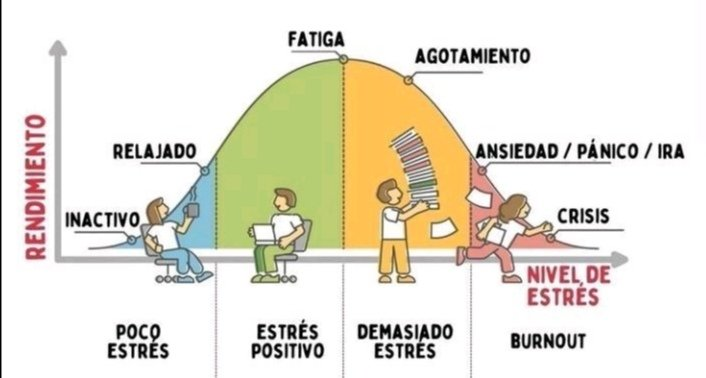

---
output:
  html_document:
    toc: yes
    df_print: paged
  html_notebook:
    toc: yes
    toc_float:
      collapsed: no
      smooth_scroll: yes
    number_sections: yes
---

{width='500px'}


# <b style = 'color : black;'><FONT FACE="roman">Introduccion</FONT></b>

## Antecedentes

Palacio y Martinez determinaron la relación entre el Rendimiento Académico (RA) con la salud mental en los estudiantes universitarios de la Simón Bolívar. Asimismo, los resultados principales indican que el RA se correlaciona negativamente con el estado de ansiedad. Además, se encontraron promedios académicos significativamente más altos en los estudiantes que no han perdido semestre alguno y que cursan todas las asignaturas proyectadas para el mismo semestre. Con el resto de variables de estudio, no se encontraron diferencias significativas. (Palacio & Martínez, 2007: pág. 113).

Morales, Silva & Vasquez, por otra parte, encontraron que la  salud  mental  influenciada  por  el  Covid impacta negativamente  a  nivel  del  rendimiento académico en los estudiantes. Por la que se concluye que debe darse un mayor apoyo por parte de sus padres, docentes y autoridades universitarias, para disminuir el impacto en la salud y el rendimiento académico de los jóvenes universitarios.(Morales, Silva y Vasquez, 2021: pág.119).

## Relevancia
Es fundamental el estudio de la salud mental porque se puede obtener alguna relación entre el rendimiento académico y su estado mental del alumno de UTEC. De este modo, describir los tipos de trastornos depresivos como la ansiedad, la depresión y el estrés que padecen los estudiantes y perjudica su desarrollo académico. Todo ello, para poder abordar este tema de forma específica y ayudar a aquellos estudiantes que sufren de dicha depresión clínica.

## Planificación


*Abrir librerías:*
```{r}
library(readr)
library("DescTools")
library(car)
library(dplyr)
library(remotes)
library(readr)
library(ggplot2)
library(knitr)
library(kableExtra)

```


# <b style = 'color : black;'><FONT FACE="roman">Datos</FONT></b>

## Proceso de recolección de datos
Los datos se obtuvieron mediante una encuesta realizada por el grupo y aprobada por la profesora acorde a los objetivos propuestos inicialmente.

Consideramos importante restringir varias respuestas de la encuesta para que la información obtenida sea la adecuada, lo cual se expone en la tabla **variables**. Al iniciar el recojo de información, se lanzó la encuesta que fue compartida entre los contactos cercanos de cada integrante del grupo. Además, se mejoró la encuesta con base en la retroalimentación recibida por los encuestados en aspectos como:  
Si bien es cierto que al inicio del lanzamiento de la encuesta, no obtuvimos más de la mitad de observaciones requeridas, se usó la estrategia de abordar a los alumnos presencialmente (ya que, hasta ese momento, solo se compartía de forma virtual) y darles a cada uno un incentivo (chupetín) al terminar. De esta forma, en solo 2 días obtuvimos el 75% de las observaciones requeridas; asimismo, se optó por superar el límite establecido para obtener resultados más precisos.

## Población, muestra y muestreo
La población de estudio es la comunidad de UTEC y la unidad muestral serán los estudiantes matriculados en el 2022-02. Asimismo, luego de recolectar todas las observaciones, el tamaño de la muestra es de 251 estudiantes. El tipo de muestreo es aleatorio simple (MAS) ,ya que nuestra muestra será escogida al azar. Del mismo modo, la representatividad consta de estudiantes de diferentes ciclos de UTEC lo que nos permitirá realizar un análisis más general

<center>

{width='500px'}

</center>


## Variables
A continuación, se expone en una tabla las principales características y todo lo relevante respecto a las variables recolectadas mediante la encuesta.


```{r, echo=FALSE}
library(knitr)
library(kableExtra)
```


```{r,echo=FALSE}
library(readr)
VR <- read_delim("VariablesRepo.csv", delim = ";", 
    escape_double = FALSE, trim_ws = TRUE)
View(VR)
```


```{r,echo=FALSE}
require(knitr)
kable_styling(kable(head(VR,17),
                    booktabs = TRUE,
                    caption = "Tabla 1: Variables. Elaboración propia.",
                    digits = 3, 
                    label = TRUE,
                    row.names = FALSE, align = "l"),
              latex_options = c("striped", "condensed"),
              position = "center",
              full_width = FALSE) %>%
  row_spec(0, bold = T, color = "white", background = "brown") %>%
  column_spec(1, bold = T, color = "orange")
```

# <b style = 'color : black;'><FONT FACE="roman">Limpieza de datos</FONT></b>

Para limpiar nuestra base de datos, utilizamos:
- Se optó por *eliminar* los datos de prueba, es decir, las observaciones que se rellenaron para probarla efectividad de la encuesta.
- Se optó por *contactar a las personas que rellenaron de forma repetida la encuesta* para verificar con qué datos nos quedábamos finalmente (el reconocimiento se hizo mediante los correos).
- La base de datos original contenía 56 variables, se optó por recodificar y crear variables adicionales que representen a todas las variables que pertenecían a Cuestionario 1, Cuestionario 2, Cuestionario 3 y Cuestionario 4. La base de datos final contiene _ variables.


**Código para importar datos**

## Importacion el dataset
```{r}
library(readxl)
D <- read_excel("D.xlsx")
View(D)
```

*Cambiar el nombre al archivo*

```{r}
DF <- D
```


*Revisar la data*

Con `ncol`, `nrow` y `dim` podemos tener las dimensiones de la base de datos (filas y columnas)
```{r}
ncol(DF) # leer el número de columnas / variables
nrow(DF) # leer la cantidad de filas / obervaciones
dim(DF) # Devuelve las dimensiones de la base de datos
```

```{r}
summary(DF) # Resumen del tipo de variable de la base de datos
```


*Quitar variables inservibles -> No necesitamos el correo ni la hora de llenado*
```{r}
DF %>% select(-'Timestamp') -> DF
DF %>% select(-'Email Address') -> DF
```


*Usaremos el comando colnames para cambiar el nombre de las columnas*
```{r}
colnames(DF)[1] ="Edad"
colnames(DF)[2] ="Distrito"
colnames(DF)[3] ="Carrera"
colnames(DF)[4] ="Ciclo"
colnames(DF)[5] ="Sexo"
colnames(DF)[6] ="Ocupacion"
colnames(DF)[7] ="Cantidad_de_cursos"
colnames(DF)[8] ="Horas_de_sueño"
colnames(DF)[9] ="Promedio_ponderado"
colnames(DF)[10] ="Horas_de_estudio"
colnames(DF)[11] ="C_P"
colnames(DF)[12] ="C1_P1"
colnames(DF)[13] ="C1_P2"
colnames(DF)[14] ="C1_P3"
colnames(DF)[15] ="C1_P4"
colnames(DF)[16] ="C1_P5"
colnames(DF)[17] ="C1_P6"
colnames(DF)[18] ="C1_P7"
colnames(DF)[19] ="C2_P1"
colnames(DF)[20] ="C2_P2"
colnames(DF)[21] ="C2_P3"
colnames(DF)[22] ="C2_P4"
colnames(DF)[23] ="C2_P5"
colnames(DF)[24] ="C2_P6"
colnames(DF)[25] ="C2_P7"
colnames(DF)[26] ="C2_P8"
colnames(DF)[27] ="C2_P9"
colnames(DF)[28] ="C2_P10"
colnames(DF)[29] ="C2_P11"
colnames(DF)[30] ="C2_P12"
colnames(DF)[31] ="C2_P13"
colnames(DF)[32] ="C2_P14"
colnames(DF)[33] ="C2_P15"
colnames(DF)[34] ="C2_P16"
colnames(DF)[35] ="C2_P17"
colnames(DF)[36] ="C2_P18"
colnames(DF)[37] ="C2_P19"
colnames(DF)[38] ="C2_P20"
colnames(DF)[39] ="Nivel_propio_de_estres"
colnames(DF)[40] ="C3_P1"
colnames(DF)[41] ="C3_P2"
colnames(DF)[42] ="C3_P3"
colnames(DF)[43] ="C3_P4"
colnames(DF)[44] ="C3_P5"
colnames(DF)[45] ="C3_P6"
colnames(DF)[46] ="C3_P7"
colnames(DF)[47] ="C4_P1"
colnames(DF)[48] ="C4_P2"
colnames(DF)[49] ="C4_P3"
colnames(DF)[50] ="C4_P4"
colnames(DF)[51] ="C4_P5"
colnames(DF)[52] ="C4_P6"
colnames(DF)[53] ="C4_P7"
colnames(DF)[54] ="C4_P8"

```


## Datos completos e incompletos
```{r}
sum(is.na(DF)) #is.na() -> este comando detecta los datos incompletos; sum -> sumar
#Sumar la cantidad de datos incompletos
sum(!is.na(DF)) #!is.na() -> es la negación de is.na, es decir, indica los datos completos. 
```

*Eliminar datos de encuesta anterior*

```{r}
DF <- DF[-c(1, 2, 3), ]
```

```{r}
sum(is.na(DF)) #is.na() -> este comando detecta los datos incompletos; sum -> sumar
 
```


## Estandarizando las variables 

De una cualitativa a una cuantitativa:
```{r}
unique(DF$C1_P1) #Permite conocer todas las formas que han respondido para la variable periodo
```

```{r}
DF %>% mutate(C1_P1=
       ifelse(C1_P1 == "(N) Nunca" , "0",
       ifelse(C1_P1 == "(S) Siempre" , "5",
       ifelse(C1_P1 == "(AV) Algunas veces" , "3",
       ifelse(C1_P1 == "(CN) Casi Nunca" , "2",
       ifelse(C1_P1 == "(CS) Casi siempre" , "4",
       ifelse(C1_P1 == "(RV) Rara Vez" , "1", C1_P1)))))))->DF
```


```{r}
DF %>% mutate(C1_P2=
       ifelse(C1_P2 == "(N) Nunca" , "0",
       ifelse(C1_P2 == "(S) Siempre" , "5",
       ifelse(C1_P2 == "(AV) Algunas veces" , "3",
       ifelse(C1_P2 == "(CN) Casi Nunca" , "2",
       ifelse(C1_P2 == "(CS) Casi siempre" , "4",
       ifelse(C1_P2 == "(RV) Rara Vez" , "1", C1_P2)))))))->DF
```


```{r}
DF %>% mutate(C1_P3=
       ifelse(C1_P3 == "(N) Nunca" , "0",
       ifelse(C1_P3 == "(S) Siempre" , "5",
       ifelse(C1_P3 == "(AV) Algunas veces" , "3",
       ifelse(C1_P3 == "(CN) Casi Nunca" , "2",
       ifelse(C1_P3 == "(CS) Casi siempre" , "4",
       ifelse(C1_P3 == "(RV) Rara Vez" , "1", C1_P3)))))))->DF
```


```{r}
DF %>% mutate(C1_P4=
       ifelse(C1_P4 == "(N) Nunca" , "0",
       ifelse(C1_P4 == "(S) Siempre" , "5",
       ifelse(C1_P4 == "(AV) Algunas veces" , "3",
       ifelse(C1_P4 == "(CN) Casi Nunca" , "2",
       ifelse(C1_P4 == "(CS) Casi siempre" , "4",
       ifelse(C1_P4 == "(RV) Rara Vez" , "1", C1_P4)))))))->DF
```


```{r}
DF %>% mutate(C1_P5=
       ifelse(C1_P5 == "(N) Nunca" , "0",
       ifelse(C1_P5 == "(S) Siempre" , "5",
       ifelse(C1_P5 == "(AV) Algunas veces" , "3",
       ifelse(C1_P5 == "(CN) Casi Nunca" , "2",
       ifelse(C1_P5 == "(CS) Casi siempre" , "4",
       ifelse(C1_P5 == "(RV) Rara Vez" , "1", C1_P5)))))))->DF
```


```{r}
DF %>% mutate(C1_P6=
       ifelse(C1_P6 == "(N) Nunca" , "0",
       ifelse(C1_P6 == "(S) Siempre" , "5",
       ifelse(C1_P6 == "(AV) Algunas veces" , "3",
       ifelse(C1_P6 == "(CN) Casi Nunca" , "2",
       ifelse(C1_P6 == "(CS) Casi siempre" , "4",
       ifelse(C1_P6 == "(RV) Rara Vez" , "1", C1_P6)))))))->DF
```


```{r}
DF %>% mutate(C1_P7=
       ifelse(C1_P7 == "(N) Nunca" , "0",
       ifelse(C1_P7 == "(S) Siempre" , "5",
       ifelse(C1_P7 == "(AV) Algunas veces" , "3",
       ifelse(C1_P7 == "(CN) Casi Nunca" , "2",
       ifelse(C1_P7 == "(CS) Casi siempre" , "4",
       ifelse(C1_P7 == "(RV) Rara Vez" , "1", C1_P7)))))))->DF
```


```{r}
unique(DF$C_P) #Permite conocer todas las formas que han respondido para la variable periodo
```

```{r}
DF %>% mutate(C2_P1=
       ifelse(C2_P1 == "Si" , "5", C_P))->DF
```

```{r}
DF %>% mutate(C2_P1=
       ifelse(C2_P1 == "Muy poco (1-2 días)" , "2",
       ifelse(C2_P1 == "Casi nunca / Nunca (menos de 1 día)" , "1",
       ifelse(C2_P1 == "Casi siempre/ Siempre (5-7 días)" , "4",
       ifelse(C2_P1 == "Algunas veces / Poco (3-4días)" , "3", C2_P1)))))->DF
```

```{r}
DF %>% mutate(C2_P2=
       ifelse(C2_P2 == "Muy poco (1-2 días)" , "2",
       ifelse(C2_P2 == "Casi nunca / Nunca (menos de 1 día)" , "1",
       ifelse(C2_P2 == "Casi siempre/ Siempre (5-7 días)" , "4",
       ifelse(C2_P2 == "Algunas veces / Poco (3-4días)" , "3", C2_P2)))))->DF
```


```{r}
DF %>% mutate(C2_P3=
      ifelse(C2_P3 == "Muy poco (1-2 días)" , "2",
       ifelse(C2_P3 == "Casi nunca / Nunca (menos de 1 día)" , "1",
       ifelse(C2_P3 == "Casi siempre/ Siempre (5-7 días)" , "4",
       ifelse(C2_P3 == "Algunas veces / Poco (3-4días)" , "3", C2_P3)))))->DF
```


```{r}
DF %>% mutate(C2_P4=
      ifelse(C2_P4 == "Muy poco (1-2 días)" , "2",
       ifelse(C2_P4 == "Casi nunca / Nunca (menos de 1 día)" , "1",
       ifelse(C2_P4 == "Casi siempre/ Siempre (5-7 días)" , "4",
       ifelse(C2_P4 == "Algunas veces / Poco (3-4días)" , "3", C2_P4)))))->DF
```


```{r}
DF %>% mutate(C2_P5=
      ifelse(C2_P5 == "Muy poco (1-2 días)" , "2",
       ifelse(C2_P5 == "Casi nunca / Nunca (menos de 1 día)" , "1",
       ifelse(C2_P5 == "Casi siempre/ Siempre (5-7 días)" , "4",
       ifelse(C2_P5 == "Algunas veces / Poco (3-4días)" , "3", C2_P5)))))->DF
```


```{r}
DF %>% mutate(C2_P6=
      ifelse(C2_P6 == "Muy poco (1-2 días)" , "2",
       ifelse(C2_P6 == "Casi nunca / Nunca (menos de 1 día)" , "1",
       ifelse(C2_P6 == "Casi siempre/ Siempre (5-7 días)" , "4",
       ifelse(C2_P6 == "Algunas veces / Poco (3-4días)" , "3", C2_P6)))))->DF
```


```{r}
DF %>% mutate(C2_P7=
      ifelse(C2_P7 == "Muy poco (1-2 días)" , "2",
       ifelse(C2_P7 == "Casi nunca / Nunca (menos de 1 día)" , "1",
       ifelse(C2_P7 == "Casi siempre/ Siempre (5-7 días)" , "4",
       ifelse(C2_P7 == "Algunas veces / Poco (3-4días)" , "3", C2_P7)))))->DF
```


```{r}
DF %>% mutate(C2_P8=
      ifelse(C2_P8 == "Muy poco (1-2 días)" , "2",
       ifelse(C2_P8 == "Casi nunca / Nunca (menos de 1 día)" , "1",
       ifelse(C2_P8 == "Casi siempre/ Siempre (5-7 días)" , "4",
       ifelse(C2_P8 == "Algunas veces / Poco (3-4días)" , "3", C2_P8)))))->DF
```


```{r}
DF %>% mutate(C2_P9=
      ifelse(C2_P9 == "Muy poco (1-2 días)" , "2",
       ifelse(C2_P9 == "Casi nunca / Nunca (menos de 1 día)" , "1",
       ifelse(C2_P9 == "Casi siempre/ Siempre (5-7 días)" , "4",
       ifelse(C2_P9 == "Algunas veces / Poco (3-4días)" , "3", C2_P9)))))->DF
```


```{r}
DF %>% mutate(C2_P10=
      ifelse(C2_P10 == "Muy poco (1-2 días)" , "2",
       ifelse(C2_P10 == "Casi nunca / Nunca (menos de 1 día)" , "1",
       ifelse(C2_P10 == "Casi siempre/ Siempre (5-7 días)" , "4",
       ifelse(C2_P10 == "Algunas veces / Poco (3-4días)" , "3", C2_P10)))))->DF
```


```{r}
DF %>% mutate(C2_P11=
      ifelse(C2_P11 == "Muy poco (1-2 días)" , "2",
       ifelse(C2_P11 == "Casi nunca / Nunca (menos de 1 día)" , "1",
       ifelse(C2_P11 == "Casi siempre/ Siempre (5-7 días)" , "4",
       ifelse(C2_P11 == "Algunas veces / Poco (3-4días)" , "3", C2_P11)))))->DF
```


```{r}
DF %>% mutate(C2_P12=
      ifelse(C2_P12 == "Muy poco (1-2 días)" , "2",
       ifelse(C2_P12 == "Casi nunca / Nunca (menos de 1 día)" , "1",
       ifelse(C2_P12 == "Casi siempre/ Siempre (5-7 días)" , "4",
       ifelse(C2_P12 == "Algunas veces / Poco (3-4días)" , "3", C2_P12)))))->DF
```


```{r}
DF %>% mutate(C2_P13=
      ifelse(C2_P13 == "Muy poco (1-2 días)" , "2",
       ifelse(C2_P13 == "Casi nunca / Nunca (menos de 1 día)" , "1",
       ifelse(C2_P13 == "Casi siempre/ Siempre (5-7 días)" , "4",
       ifelse(C2_P13 == "Algunas veces / Poco (3-4días)" , "3", C2_P13)))))->DF
```


```{r}
DF %>% mutate(C2_P14=
      ifelse(C2_P14 == "Muy poco (1-2 días)" , "2",
       ifelse(C2_P14 == "Casi nunca / Nunca (menos de 1 día)" , "1",
       ifelse(C2_P14 == "Casi siempre/ Siempre (5-7 días)" , "4",
       ifelse(C2_P14 == "Algunas veces / Poco (3-4días)" , "3", C2_P14)))))->DF

```


```{r}
DF %>% mutate(C2_P15=
      ifelse(C2_P15 == "Muy poco (1-2 días)" , "2",
       ifelse(C2_P15 == "Casi nunca / Nunca (menos de 1 día)" , "1",
       ifelse(C2_P15 == "Casi siempre/ Siempre (5-7 días)" , "4",
       ifelse(C2_P15 == "Algunas veces / Poco (3-4días)" , "3", C2_P15)))))->DF
```


```{r}
DF %>% mutate(C2_P16=
      ifelse(C2_P16 == "Muy poco (1-2 días)" , "2",
       ifelse(C2_P16 == "Casi nunca / Nunca (menos de 1 día)" , "1",
       ifelse(C2_P16 == "Casi siempre/ Siempre (5-7 días)" , "4",
       ifelse(C2_P16 == "Algunas veces / Poco (3-4días)" , "3", C2_P16)))))->DF

```

```{r}
DF %>% mutate(C2_P17=
      ifelse(C2_P17 == "Muy poco (1-2 días)" , "2",
       ifelse(C2_P17 == "Casi nunca / Nunca (menos de 1 día)" , "1",
       ifelse(C2_P17 == "Casi siempre/ Siempre (5-7 días)" , "4",
       ifelse(C2_P17 == "Algunas veces / Poco (3-4días)" , "3", C2_P17)))))->DF
```

```{r}
DF %>% mutate(C2_P18=
      ifelse(C2_P18 == "Muy poco (1-2 días)" , "2",
       ifelse(C2_P18 == "Casi nunca / Nunca (menos de 1 día)" , "1",
       ifelse(C2_P18 == "Casi siempre/ Siempre (5-7 días)" , "4",
       ifelse(C2_P18 == "Algunas veces / Poco (3-4días)" , "3", C2_P18)))))->DF
```

```{r}
DF %>% mutate(C2_P19=
      ifelse(C2_P19 == "Muy poco (1-2 días)" , "2",
       ifelse(C2_P19 == "Casi nunca / Nunca (menos de 1 día)" , "1",
       ifelse(C2_P19 == "Casi siempre/ Siempre (5-7 días)" , "4",
       ifelse(C2_P19 == "Algunas veces / Poco (3-4días)" , "3", C2_P19)))))->DF
```


```{r}
DF %>% mutate(C2_P20=
      ifelse(C2_P20 == "Muy poco (1-2 días)" , "2",
       ifelse(C2_P20 == "Casi nunca / Nunca (menos de 1 día)" , "1",
       ifelse(C2_P20 == "Casi siempre/ Siempre (5-7 días)" , "4",
       ifelse(C2_P20 == "Algunas veces / Poco (3-4días)" , "3", C2_P20)))))->DF
```


*Convertir la variable cuantitativa en una cualitativa*
```{r}
DF %>% mutate(Sexo=
       ifelse(Sexo == "1" , "Masculino",
       ifelse(Sexo == "0" , "Femenino", Sexo)))-> DF
```


*Corregir la variable Promedio ponderado*
Ya tenemos los datos todos completo con numeros, pero aun no lo esta reconociendo como tal, entonces agregaremos la función as.numeric y ya podremos encontrar los indicadores de resumen de la variable.

```{r}
DF$Promedio_ponderado= as.numeric(DF$Promedio_ponderado)
```


*Corregir la Horas de estudio a la semana*
```{r}
DF %>% mutate(
  Horas_de_estudio = ifelse(Horas_de_estudio <= 10, 7*Horas_de_estudio, Horas_de_estudio)
) -> DF
range(DF$Horas_de_estudio, na.rm=TRUE)
```
```{r}
DF %>% mutate(
  Horas_de_sueño = ifelse(Horas_de_sueño < 3, 2*Horas_de_sueño, Horas_de_sueño)
) -> DF
range(DF$Horas_de_sueño, na.rm=TRUE)
```

*Corregir la datos del test*
```{r}
DF$Horas_de_estudio=as.integer(DF$Horas_de_estudio)
DF$C1_P1=as.numeric(DF$C1_P1)
DF$C1_P2=as.numeric(DF$C1_P2)
DF$C1_P3=as.numeric(DF$C1_P3)
DF$C1_P4=as.numeric(DF$C1_P4)
DF$C1_P5=as.numeric(DF$C1_P5)
DF$C1_P6=as.numeric(DF$C1_P6)
DF$C1_P7=as.numeric(DF$C1_P7)

DF$C2_P1=as.numeric(DF$C2_P1)
DF$C_P=as.numeric(DF$C_P)
DF$C2_P2=as.numeric(DF$C2_P2)
DF$C2_P3=as.numeric(DF$C2_P3)
DF$C2_P4=as.numeric(DF$C2_P4)
DF$C2_P5=as.numeric(DF$C2_P5)
DF$C2_P6=as.numeric(DF$C2_P6)
DF$C2_P7=as.numeric(DF$C2_P7)
DF$C2_P8=as.numeric(DF$C2_P8)
DF$C2_P9=as.numeric(DF$C2_P9)
DF$C2_P10=as.numeric(DF$C2_P10)
DF$C2_P11=as.numeric(DF$C2_P11)
DF$C2_P12=as.numeric(DF$C2_P12)
DF$C2_P13=as.numeric(DF$C2_P13)
DF$C2_P14=as.numeric(DF$C2_P14)
DF$C2_P15=as.numeric(DF$C2_P15)
DF$C2_P16=as.numeric(DF$C2_P16)
DF$C2_P17=as.numeric(DF$C2_P17)
DF$C2_P18=as.numeric(DF$C2_P18)
DF$C2_P19=as.numeric(DF$C2_P19)
DF$C2_P20=as.numeric(DF$C2_P20)

```


*Armado de las tres filas del cuestionario, C1, C2, C3 Y C4.*
```{r}
C1<- transmute(DF, C1 = C1_P1+C1_P2+ C1_P3+ C1_P4+ C1_P4+ C1_P5+ C1_P6+ C1_P7)
```


```{r}
C2<- transmute(DF, C02 = C_P+C2_P1+C2_P2+ C2_P3+ C2_P4+ C2_P5+ C2_P6+ C2_P7+C2_P8+C2_P9+C2_P10+C2_P11+C2_P12+C2_P13+C2_P14+C2_P15+C2_P16+C2_P17+C2_P18+C2_P19+C2_P20)
```

```{r}
C3<- transmute(DF, C3 = C3_P1+C3_P2+ C3_P3+ C3_P4+ C3_P5+ C3_P6+ C3_P7)
```

```{r}
C4<- transmute(DF, C4 = C4_P1+C4_P2+ C4_P3+ C4_P4)
```

*Promedio del nivel de estrés que presenta el estudiante*

```{r}
C_total<- transmute(DF, C_total= C1+C2+C3+C4)
```

```{r}
Nivel_de_estres_clinico <- transmute(DF, C_total= C_total)
```

## Tabla de los niveles de estrés

```{r}
NiveInt <- read_delim("NivelesdeestresINTERVALO.csv", 
    delim = ";", escape_double = FALSE, trim_ws = TRUE)
View(NiveInt)
```

```{r, echo=FALSE}
require(knitr)
kable_styling(kable(head(NiveInt,4),
                    booktabs = TRUE,
                    caption = "Tabla 2: Tipos de niveles de estrés.",
                    digits = 3, 
                    label = TRUE,
                    row.names = FALSE, align = "l"),
              latex_options = c("striped", "condensed"),
              position = "center",
              full_width = FALSE) %>%
  row_spec(0, bold = T, color = "white", background = "black") %>%
  column_spec(1, bold = T, color = "green")
```
{width='500px'}

# <b style = 'color : black;'><FONT FACE="roman">Análisis descriptivo</FONT></b>

