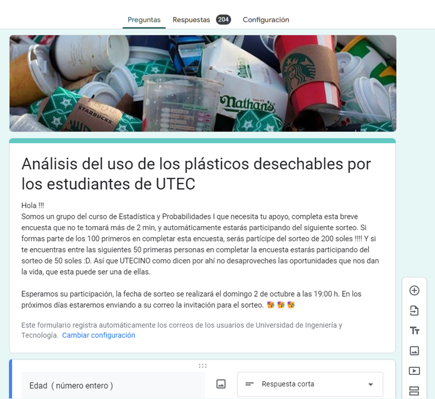

## TÍTULO

**Análisis del uso de los envases desechables por los estudiantes de UTEC**

## INTRODUCCIÓN

##### **Relevancia**

*El excesivo uso del plástico a través de los años a provocado un medio ambiente muy vulnerable a la presencia de este en material en la mayoría de superficies en el planeta, las cuales representan el soporte de vida para diferentes tipos de vida. Esta situación afecta a la calidad de vida de varias especies, incluida al del ser humano, debido a que el plástico invade y perjudica el espacio de desarrollo, y que por tal razón se le considera al plástico como un tipo de contaminación.         Por ello, el análisis ayudará a proponer o ejecutar mejores soluciones al uso que los estudiantes le dan a los envases descartables, que son los plásticos que se utilizan con mayor frecuencia en la actualidad. Además, permitirá concientizar a la comunidad de UTEC respecto al uso responsable del plástico en su vida diaria. Actualmente utilizamos plástico para envolver la comida, para llevar y guardar la lonchera, para llevar los alimentos del supermercado, etc. El plástico es parte de nuestra vida cotidiana; casi no podemos imaginarnos una vida sin plástico. Sin embargo, podríamos usar mucho menos plástico sin que ello cambie de manera sustancial en nuestra vida.*

## DATOS

##### **Recolección de datos**

*La obtención de datos se realizó mediante una encuesta en la plataforma Google Forms, fue más fácil obtener de esta manera las respuestas de los encuestados y guardarlos en una base de datos Excel llamado "Consumo de plástico en UTEC" que mas adelante lo usaremos para las entregas del proyecto.*

<center>{width="100%"}<center>

##### **Población, muestra y muestreo**

-   **Población:**
    -   *La población de estudio son todos los estudiantes de la Universidad de Ingeniería y Tecnología (UTEC).*
-   **Muestra:**
    -   *La muestra para este estudio está compuesta por los 200 estudiantes elegidos de UTEC.*
-   **Unidad muestral:**
    -   *Cada estudiante de UTEC, que consume en su vida diaria los diferentes tipos de envases desechables.*
-   **Muestreo:**
    -   *Se utilizó el muestreo no probabilístico por conveniencia. Porque la selección de muestra se basa en la proximidad y disponibilidad del investigador, debido a que se tiene una población demasiado grande a evaluar, siendo la técnica con mayor factibilidad proporcionando una rápida obtención de resultados.*

##### **Variables**

-   **Variables de DataFrame de los Estudiantes UTEC**

+-------------------------------------------------------------------------------------------+----------------------------------------+-----------------------+---------------------------------------------------------------------------------------+
| Pregunta de la Variable                                                                   | Variable                               | Tipo de Variable      | Restricciones                                                                         |
+:==========================================================================================+:=======================================+:======================+:======================================================================================+
| ¿Cuál es tu edad?                                                                         | Edad                                   | Cuantitativa discreta | Entero positivo                                                                       |
+-------------------------------------------------------------------------------------------+----------------------------------------+-----------------------+---------------------------------------------------------------------------------------+
| ¿Cuál es tu sexo?                                                                         | Sexo                                   | Cualitativa nominal   | Letras en mayúscula:                                                                  |
|                                                                                           |                                        |                       |                                                                                       |
|                                                                                           |                                        |                       | M=Masculino                                                                           |
|                                                                                           |                                        |                       |                                                                                       |
|                                                                                           |                                        |                       | F=Femenino                                                                            |
+-------------------------------------------------------------------------------------------+----------------------------------------+-----------------------+---------------------------------------------------------------------------------------+
| ¿En que ciclo estás?                                                                      | Ciclo                                  | Cualitativa ordinal   | Entero positivo                                                                       |
+-------------------------------------------------------------------------------------------+----------------------------------------+-----------------------+---------------------------------------------------------------------------------------+
| ¿Cuál es tu carrera?                                                                      | Carrera                                | Cualitativa nominal   | El nombre de su carrera                                                               |
+-------------------------------------------------------------------------------------------+----------------------------------------+-----------------------+---------------------------------------------------------------------------------------+
| ¿Con qué regularidad prácticas el hábito del reciclaje?                                   | Practica de Reciclaje                  | Cualitativa ordinal   | En una escala del 1-5, que tan frecuente realiza esta actividad                       |
+-------------------------------------------------------------------------------------------+----------------------------------------+-----------------------+---------------------------------------------------------------------------------------+
| ¿Que tan importante es usar correctamente los diferentes tipos de tachos?                 | Importancia del uso correcto de tachos | Cualitativa ordinal   | 1-5 -\> Muy importante - Poco importante                                              |
+-------------------------------------------------------------------------------------------+----------------------------------------+-----------------------+---------------------------------------------------------------------------------------+
| ¿Qué tanto recomienda el uso de plásticos biodegradables?                                 | Uso de Plasticos Biodegradable         | Cualitativa ordinal   | En una escala del 1-5, que tan frecuente recomienda este uso                          |
+-------------------------------------------------------------------------------------------+----------------------------------------+-----------------------+---------------------------------------------------------------------------------------+
| ¿Cuántas bebidas embotelladas consume al día? (1-5)                                       | Consumo de Bebidas                     | Cuantitativa ordinal  | Entero positivo                                                                       |
+-------------------------------------------------------------------------------------------+----------------------------------------+-----------------------+---------------------------------------------------------------------------------------+
| ¿Qué tipo de productos desechables utilizas con más frecuencia al mes?                    | Tipo de envase desechable              | Cualitativa nominal   | Nombre del tipo de envase desechable.                                                 |
+-------------------------------------------------------------------------------------------+----------------------------------------+-----------------------+---------------------------------------------------------------------------------------+
| Dela pregunta anterior Cuántos de estos envases utilizas                                  | Numero de envases desechables          | Cuantitativa discreta | Entero positivo                                                                       |
+-------------------------------------------------------------------------------------------+----------------------------------------+-----------------------+---------------------------------------------------------------------------------------+
| ¿Con qué regularidad prácticas el hábito del reciclaje?                                   | Frecuencia de Reciclaje                | Cualitativa ordinal   | En una escala del 1-5, que tan frecuente recomienda este uso                          |
+-------------------------------------------------------------------------------------------+----------------------------------------+-----------------------+---------------------------------------------------------------------------------------+
| ¿Cuánto es el monto(soles) de lo que gastas en estos productos?                           | Monto(Soles)                           | Cuantitativa continua | Decimal positivo                                                                      |
+-------------------------------------------------------------------------------------------+----------------------------------------+-----------------------+---------------------------------------------------------------------------------------+
| ¿Cuál sería el impacto en tu vida si dejarás de consumir estos productos?                 | Impacto                                | Cualitativa ordinal   | En una escala del 1-5, califique si el impacto en su vida sería muy bueno a muy malo. |
+-------------------------------------------------------------------------------------------+----------------------------------------+-----------------------+---------------------------------------------------------------------------------------+
| ¿Cuales son los envases que usas para transportar alimentos?                              | Envase de alimentos                    | Cualitativa nominal   | Nombres de los envases que usas para llevar alimentos.                                |
+-------------------------------------------------------------------------------------------+----------------------------------------+-----------------------+---------------------------------------------------------------------------------------+
| ¿Número de envases que usas para transportar alimentos?                                   | N° de envases de alimentos             | Cuantitativa discreta | Número de envases que usas para llevar alimentos.                                     |
+-------------------------------------------------------------------------------------------+----------------------------------------+-----------------------+---------------------------------------------------------------------------------------+
| En la Universidad, ¿Cuántos contenedores de reciclaje de plástico has visto en cada piso? | N° de tachos recícladores.             | Cuantitativa discreta | Número de tachos recícladores por piso en la universidad.                             |
+-------------------------------------------------------------------------------------------+----------------------------------------+-----------------------+---------------------------------------------------------------------------------------+

################################################################################################################################# 

+-----------------------------+-----------------------+--------------------------------------------+
| Variable                    | Tipo de Variable      | Restricciones                              |
+:============================+:======================+:===========================================+
| Edad                        | Cuantitativa discreta | Entero positivo                            |
+-----------------------------+-----------------------+--------------------------------------------+
| Sexo                        | Cualitativa nominal   | M ó F                                      |
+-----------------------------+-----------------------+--------------------------------------------+
| Ciclo                       | Cualitativa ordinal   | Entero positivo                            |
+-----------------------------+-----------------------+--------------------------------------------+
| Carrera                     | Cualitativa nominal   | Nombre de carrera                          |
+-----------------------------+-----------------------+--------------------------------------------+
| Practica_Reciclaje          | Cualitativa ordinal   | Si ó No                                    |
+-----------------------------+-----------------------+--------------------------------------------+
| Importancia_Uso_Tachos      | Cualitativa ordinal   | 1-5 -\> Muy importante - Poco importante   |
+-----------------------------+-----------------------+--------------------------------------------+
| Uso_Plasticos_Biodegradable | Cualitativa ordinal   | 1-5 -\> Muy Recomendado - Poco Recomendado |
+-----------------------------+-----------------------+--------------------------------------------+
| Consumo_Bebidas             | Cuantitativa ordinal  | Entero positivo                            |
+-----------------------------+-----------------------+--------------------------------------------+
| Tipo_envase_desechable      | Cualitativa nominal   | Nombre del tipo de envase desechable.      |
+-----------------------------+-----------------------+--------------------------------------------+
| N°\_envases_desechables     | Cuantitativa discreta | Entero positivo                            |
+-----------------------------+-----------------------+--------------------------------------------+
| Frecuencia_Reciclaje        | Cualitativa ordinal   | 1-5 -\> Muy Frecuente - Poco Frecuente     |
+-----------------------------+-----------------------+--------------------------------------------+
| Monto(Soles)                | Cuantitativa continua | Decimal positivo                           |
+-----------------------------+-----------------------+--------------------------------------------+
| Impacto                     | Cualitativa ordinal   | 1-5 -\> Muy bueno - Muy malo               |
+-----------------------------+-----------------------+--------------------------------------------+
| Envase_alimentos            | Cualitativa nominal   | Nombre del envase                          |
+-----------------------------+-----------------------+--------------------------------------------+
| N°envases_alimentos         | Cuantitativa discreta | Entero positivo                            |
+-----------------------------+-----------------------+--------------------------------------------+
| N°tachos_recícladores.      | Cuantitativa discreta | Entero positivo                            |
+-----------------------------+-----------------------+--------------------------------------------+

-   **Obtención de datos de los Estudiantes UTEC**

-   **Obtención de datos de Consumo de plástico en UTEC**

##### **Limpieza de base de datos**

```{r}
library(readr)
library(plyr)
library(dplyr)
library(ggplot2)
library(tidyr)
library(stringr)
```

Llamando a la base de datos

```{r}
read.csv("DATOS CONSUMO PLASTICO.csv")
```

Cambiamos nombre:

```{r}
DP<-read.csv("DATOS CONSUMO PLASTICO.csv")
DP
```

Tipo de variable:

```{r}
glimpse(DP) #Tipos de variable
```

Cambiando el tipo de variable:

```{r}
DPC<-read_csv("DATOS CONSUMO PLASTICO.csv",col_types = "cnccccnncncnnccnccnn")
```

```{r}
#Verificamos los nuevos tipos de variable
glimpse(DPC)
```

```{r}
#Eliminando variables que no serviran(Marca temporal,y correo)
DPC1<-DPC[,-20]
DPC1<-DPC1[,-18]
DPC1<-DPC1[,-1]
```

```{r}
DPC1
```

Nombres de las variables:

```{r}
names(DPC1)
```

Renombrando las variables:

```{r}
NC <- rename(DPC1, Edad=`Edad  ( número entero )`,Sexo=`Género`,Ciclo=`Ciclo (1-10)`,Practica_Reciclaje=`¿Practica usted el hábito del reciclaje?`,`Consumo_Bebidas`=`¿Cuántas bebidas embotelladas consume al día?  (1 -5)`,`Tipo_envase_desechable`=`¿Qué tipo de productos desechables utilizas con más frecuencia al mes?`,`N_envases_desechables`=`De la pregunta anterior, ¿Cuántos de estos productos utilizas? (escribir un numero entero)`,`Frecuencia_Reciclaje`=`¿Con qué regularidad prácticas el hábito del reciclaje?`,`Importancia_Uso_Tachos`=`¿Que tan importante es usar correctamente los diferentes tipos de tachos?`,`Monto_Soles(S/)`=`¿Cuánto es el monto aproximado (en soles) de lo que gastas en estos productos de consumo de plástico al día? (escribir un numero entero)`,`Impacto`=`¿Cuál sería el impacto en tu vida si dejarás de consumir estos productos?`,`Envase_alimentos`=`¿Qué envases utilizas para transportar alimentos?`,`N_envases_alimentos`=`De la pregunta anterior,  ¿Cuál es la cantidad de envases que usas por semana?`,`Importancia del reciclaje`=`¿Por qué es necesario el hábito del reciclaje? (Opcional)`,`N_tachos_recícladores`=`En la universidad, ¿Cuántos contenedores de reciclaje de plástico ha visto en cada piso?...19`, Uso_Plasticos_Biodegradable="¿Qué tanto recomienda el uso de plásticos biodegradables? (1 -5)" )
```


Verificando los nuevos nombres de las variables:

```{r}
names(NC)
```

```{r}
NC<-select(NC, Edad:N_envases_alimentos, N_tachos_recícladores)
NC
```

```{r}
NC<-mutate(NC,Uso_Plasticos_Biodegradable=case_when(Uso_Plasticos_Biodegradable == 1 ~'No Recomendado',Uso_Plasticos_Biodegradable == 2 ~ 'Poco Recomendado', Uso_Plasticos_Biodegradable==3~'Regular',Uso_Plasticos_Biodegradable==4~'Recomendado',Uso_Plasticos_Biodegradable==5~'Muy Recomendado'))

NC
```

### Comando `unique`: (para saber todos los nombres o respuestas diferentes que hay en una columna)

```{r}
unique(NC$Sexo)
table(NC$Sexo)
```

```{r}
#Eliminando espacios:
NC$Sexo <- str_trim(NC$Sexo,side = "both") 
table(NC$Sexo)
```

```{r}
table(NC$Edad)
```

```{r}
#Modificando dato( 19.99)
NC[51,1]<-20
table(NC$Edad)
```

```{r}
table(NC$Ciclo) #Correcto
```

```{r}
table(NC$Carrera)#Correcto
```

```{r}
table(NC$Tipo_envase_desechable) 
```

Separaremos:

```{r}
Plasticos<-separate(NC, `Tipo_envase_desechable`, c("Botellas plásticas", "Bolsas plásticas", "Pajillas plásticas", "Platos descartables", "Vasos descartables", "Otros"), sep = ",")
```

```{r}
#Creando subgrupo:
select(Plasticos,`Botellas plásticas`:`Otros`)
```

```{r}
names(NC)
```

```{r}
table(NC$N_envases_desechables)
NC[51,9]=NA
```

```{r}
table(NC$`Monto_Soles(S/)`)
```

```{r}

#Eliminando datos erroneos:
NC[51,12]=NA
NC[157,12]=NA
NC[161,12]=NA
NC[123,12]=NA
NC[172,12]=NA
table(NC$`Monto_Soles(S/)`) #Verificando las variables
```

```{r}
table(NC$`N_envases_alimentos`)
```

```{r}
#Eliminando datos erroneos:
NC[51,15]=NA
table(NC$N_envases_alimentos)
```

```{r}
table(NC$"N_tachos_recícladores") #Datos correctos
```

```{r}
#Eliminando observaciones:
Dataframe <- NC[-c(201,202,203),]
```

```{r}
Dataframe
```

```{r}
library(openxlsx)
```

```{r}
DtaN <- NC
```

```{r}
#write.xlsx(DtaN,"DtaN.xlsx", asTable = TRUE)
```

```{r}
#table(DATOS_CORREGIDOS$Uso_Plasticos_Biodegradable)                            # no cuenta los NA
table(Dataframe$Uso_Plasticos_Biodegradable, useNA = "always")          # si cuenta los NA

```
## ANALISIS DESCRIPTIVO

```{r}
library(plotrix)
```

```{r}
Varones<-filter(Dataframe, Sexo=="Masculino")
Varonesyrecicla<-table(Varones$Practica_Reciclaje,Varones$Sexo )
Varonesyrecicla
pie3D(Varonesyrecicla,labels=Varonesyrecicla,main="Grafica de Varones vs Recicla", col= c("blue", "red"))
legend("topleft", legend = c("Recicla", "No recicla"),
       fill =  c("red", "blue"))
```
##### OBSERVACIONES:  

- Con el gráfico circular (Varones vs Reciclan) interpretamos que la mayor parte de los hombres(70.27%) practican el hábito de reciclaje y una cierta parte aún no tienen este hábito de reciclaje.  

```{r}
Mujeres<-filter(Dataframe, Sexo=="Femenino")
Mujeresyrecicla<-table(Mujeres$Practica_Reciclaje,Mujeres$Sexo )
Mujeresyrecicla
pie3D(Mujeresyrecicla,labels=Mujeresyrecicla,main="Grafica de Mujeres vs Reciclan", col= c("blue", "red"))
legend("topleft", legend = c("Recicla", "No recicla"),
       fill =  c("red", "blue"))
```
##### OBSERVACIONES:  
- Con el gráfico circular (Mujeres vs Reciclan) interpretamos que la mayor parte de las mujeres(74.15%) practican el hábito de reciclaje y una cierta parte aún no tienen este hábito de reciclaje.  

```{r}
library(plotly)
sex=c("Masculino","Femenino")
Sirecicla=c(78,66)
Norecicla=c(33,23)
SexovsRecicla=data.frame(sex,Sirecicla,Norecicla)
SexovsRecicla
plot_ly( Dataframe , x=sex , y=Sirecicla , name="Si recicla" , type='bar' )%>%
   add_trace( y=Norecicla , name=" No recicla" )
```
  

```{r}
tabHab<-table(Dataframe$Frecuencia_Reciclaje) 
barp <-barplot( tabHab,main="Gráfico de barras del Habito de reciclaje",col=c("blue", "yellow", "red","Green"),xlab = "Habito de reciclaje", ylab = "Varones y Mujeres",ylim=c(0,100) )
text(barp, tabHab + 0.5, labels = tabHab)
grid(nx = NA, ny = NULL, lwd = 1, lty = 1, col = "grey")
```
```{r}
table(Dataframe$Frecuencia_Reciclaje)
```


##### OBSERVACIONES:  

- Entre varones y mujeres del total de los encuestados en UTEC solo 84 consideran que **A veces** practican el hábito del reciclaje, 9 consideran **Nunca**, 8**Regularmente** y 20 **Siempre* .

```{r}
Varonesyhabitos<-table(Varones$Frecuencia_Reciclaje,Varones$Sexo )
Varonesyhabitos
Varones<-filter(Dataframe, Sexo=="Masculino")
pie3D(Varonesyhabitos,labels=Varonesyhabitos,main="Grafica de Varones vs Frecuencia_Reciclaje", col= c("blue", "yellow","red","green"))
legend("topleft", legend = c("Nunca", "A veces", "Regularmente","Siempre"),
       fill =  c("blue", "yellow","red","green"))
```

##### OBSERVACIONES:  

- En varones solo 47 afirman que **A veces** practican el hábito del reciclaje, 7 afirman que **Nunca**, 43 **Regularmente** y 14 **Siempre* .
 
```{r}
Mujeresyhabitos<-table(Mujeres$Frecuencia_Reciclaje,Mujeres$Sexo )
Mujeresyhabitos
Mujeres<-filter(Dataframe, Sexo=="Femenino")
pie3D(Mujeresyhabitos,labels=Mujeresyhabitos,main="Grafica de Mujeres vs Frecuencia_Reciclaje", col= c("blue", "yellow","red","green"))
legend("topleft", legend = c("A veces", "Nunca", "Regularmente","Siempre"),
       fill =  c("blue", "yellow","red","green"))
```
##### OBSERVACIONES:  

- En mujeres solo 37 afirman que **A veces** practican el hábito del reciclaje, 2 afirman que **Nunca**, 44 **Regularmente** y 6 **Siempre* .

```{r}
summary(Dataframe$Edad)
```

```{r}
table(Dataframe$Impacto)
frec<-c(78,11,111)
frec
pie3D(frec, labels=frec, col= c( "blue", "red", "green"))
legend("topleft", legend = c( "Bueno", "Malo", "Regular"),
       fill =  c("blue", "red", "green"))
title("Impacto si dejamos de usar plásticos")
```
##### OBSERVACIONES:  
- Solo 78 estudiantes consideran que es **bueno** si dejaríamos de usar los plásticos, 111 consideran que **Regular** y 11 consideran que es **Malo**. 
```{r}
ggplot(data=Dataframe) + 
  geom_point(aes(Importancia_Uso_Tachos, Carrera), , colour = "blue", fill = "gold" )
```
##### OBSERVACIONES:  

La clasificación de los residuos es  un criterio muy importante, lo cual puede observarse en el gráfico, en donde se han relacionado las variables carrera e importancia del uso de tachos. La mayoría de carreras considera importante el uso correcto de los tachos, destacando la carrera de ingeniería química al obtener 5 en su totalidad de respuestas. Porque gracias a esto, los diferentes materiales pueden ser transportados  en mayor cantidad a los diferentes procesos de reciclaje.


```{r}
ggplot(data=Dataframe, aes(factor(Edad), fill = factor(Frecuencia_Reciclaje))) + 
  geom_bar(position = "stack") + labs(x ="Edad") + scale_fill_brewer(palette = "Blues", na.value="steelblue") + theme_dark()
```
##### OBSERVACIONES:  

Para este gráfico hemos relacionado las variables edad y frecuencia de reciclaje.
Donde se puede observar que en el rango  de edad de los estudiantes que consideran que reciclan con mayor frecuencia va desde los 17 a 20 años, en comparación con los demás. Con base en esto, se puede apreciar que los estudiantes en ese rango de edad se preocupan y consideran de suma importancia los temas relacionados con la problemática medioambiental.

```{r}
library(plotly)
Carreras=c("Administración y Negocios Digitales","Bioingeniería","Ciencia de Datos","Ciencia de la Computación","Ing. Ambiental","Ing. Civil","Ing. de la Energia","Ing. Electrónica","Ing. Industrial","Ing. Mecánica)","Ing. Mecátrónica","Ing. Química")
Si=c(1,11,2,11,16,24,7,12 ,34 ,5,17, 4)
No=c(1,4 ,1,3,4,10,1,7,11,2,6,6)
CarreravsRecicla=data.frame(Carreras,Si,No)

plot_ly( CarreravsRecicla , x=Carreras , y=Si , name="Si recicla" , type='bar' )%>%
   add_trace( y=No , name=" No recicla" )

```
##### OBSERVACIONES:  

- Con este gráfico de barras agrupados, notamos que gran parte de nuestras encuestas, fueron respondidas por estudiantes de la carrera de Ingeniería Industrial.  

Porcentaje de las carreras que practican el hábito de reciclaje:  


- Administración y Negocios Digitales ->50%  

- Bioingeniería->73.33%  

- Ciencia de Datos->66.66%  

- Ciencia de la Computación->78.57%  

- Ingeniería Ambiental->80%  

- Ingeniería Civil->70.58%  

- Ingeniería de la Energía->87.5%  

- Ingeniería Electrónica->63.15%  

- Ingeniería Industrial->75.55%  

- Ingeniería Mecánica->71.42%  

- Ingeniería Mecatrónica->73.91%  

- Ingeniería Química->40%  


Notamos que los estudiantes de la carrera de Ingeniería de Energía practican más los hábitos de reciclaje (87.5%) y los estudiantes de la carrera de Ingeniería Química practican menos los hábitos de reciclaje (40%).

- Podemos observar que todos los estudiantes de UTEC de las diferentes carreras la mayoría optan por reciclar, y sobre todo en la carrera de Ing. Industrial ya que presenta mayor índice de **reciclaje** 


```{r}
frec<-c(104, 4, 8,57,28)
frec
pie(frec, labels=frec, col= c("orange", "blue", "yellow", "green","pink"))
legend("topleft", legend = c("Muy Recomendado", "No Recomendado", "Poco Recomendado", "Recomendado", "Regular "),
       fill =  c("orange", "blue", "yellow","green", "pink"))
title("Diagrama gráfico circular de la variable Uso_Plasticos_Biodegradable")
```
##### OBSERVACIONES:  

- Este gráfico simplemente nos da una representación gráfica de como están distribuidas con respecto a si recomendarían el uso de plásticos biodegradables.


```{r}
tabsexoyciclo<-table(Dataframe$Sexo ,Dataframe$Consumo_Bebidas)
tabsexoyciclo
barplot(tabsexoyciclo,main="Sexo y Consumo_Bebidas",col=c("red","green"))
legend(x="topright",legend=c("Femenino","Masculino"),fill = c("red","green"),title="leyenda")
```
##### OBSERVACIONES:  

- La finalidad de esta relación es determinar que cantidad de personas consumen cierta cantidad de bebidas diariamente y también saber si de estás personas hay una proporción o no.

```{r}
tabsexoyciclo<-table(Dataframe$Uso_Plasticos_Biodegradable ,Dataframe$Consumo_Bebidas)
tabsexoyciclo
barplot(tabsexoyciclo,main="Uso_Plasticos_Biodegradable y Consumo_Bebidas",col=c("orange", "blue", "yellow","green", "pink"))
legend(x="topright",legend=c("Muy Recomendado", "No Recomendado", "Poco Recomendado", "Recomendado", "Regular "),fill = c("orange", "blue", "yellow","green", "pink"),title="leyenda")
```


```{r}
boxplot(NC$`Monto_Soles(S/)`, col="yellow", horizontal = TRUE , xlab ="Gasto en productos desechables (s/.)")
stripchart(NC$`Monto_Soles(S/)`, method = "jitter", pch = 19, add = TRUE, col = "green")
```
##### OBSERVACIONES:   
Interpretaciones de descriptores numéricos:  

- El máximo gasto que realizan los alumnos de UTEC en productos desechables es de 6.5 soles  

- El rango entre el mínimo y el máximo gasto de los estudiantes de UTEC en desechables es de 4.5 soles  

- El mínimo gasto en envases desechables es de 0 soles  

- El gasto medio que realiza la población es de 5 soles  

- El gasto promedio que los estudiantes de UTEC al consumo de plásticos desechables es de 6,9 soles  

- Los puntos extremos, discordantes, detectados en el gráficos son menores e iguales a 100 soles.  

Diagrama de cajas de Dinero que gasta en productos de plásticos(S/) Vs Sexo  


```{r}
boxplot(formula=NC$`Monto_Soles(S/)`~NC$Sexo, horizontal = TRUE, data=NC,col="yellow",xlab ="Sexo", ylab ="Gasto en productos desechables (s/.)")
stripchart(NC$`Monto_Soles(S/)`~NC$Sexo, method = "jitter", pch = 19, add = TRUE, col = "green")
```
##### OBSERVACIONES:  

- Los varones son el sexo que tienen un rango de máximo y mínimo más amplio a comparación de las mujeres, respecto al gasto diario de productos de plástico desechables.  

- El sexo femenino presenta más cercanía con sus puntos discordantes a comparación de los varones, donde el punto extremo más alejado es de 100 soles.  

- El rango intercuartílico del sexo masculino es mayor a comparación de las mujeres.  

- La mediana del género femenino se encuentra muy al centro del diagrama de caja respectivo a su sexo, y el género masculino más alejado a su centro.  


#### COSTO vs NÚMERO DE ENVASES DESECHABLES  

```{r}

nuevo<-select(Dataframe,N_envases_desechables,`Monto_Soles(S/)`)
nuevo<-na.omit(nuevo)
nuevo<-filter(nuevo,N_envases_desechables<14)


b<-aggregate(x= nuevo$`Monto_Soles(S/)`,by = list(nuevo$N_envases_desechables),FUN = mean)  

datosregr<- data.frame("N_envases"=b$Group.1,"Monto"=b$x)
datosregr
plot(datosregr$N_envases,datosregr$Monto)

#####
resultados<-lm(datosregr$Monto~datosregr$N_envases,data=datosregr)
resultados


#Tabla con errores:

tabconerrores<-data.frame("N_envases"=datosregr$N_envases,"Monto"=datosregr$Monto,"Y-estimado"=2.8932 +0.8238*datosregr$N_envases,"e"=datosregr$Monto-(2.8932+0.8238*datosregr$N_envases))
tabconerrores


#Grafica:

plot(datosregr$N_envases,datosregr$Monto,xlab="Número de envases desechables",ylab="Costo")
abline(resultados, col="red")


#la ecuación de la recta de regresión es Y=2.8932+0.8238*(Numero de envases)


```

Verificando:

```{r}
##coeficiente de correlación y covarianza:
cor(datosregr$N_envases,datosregr$Monto)
cov(datosregr$N_envases,datosregr$Monto)
```

interpretación:
 Como r=0.668497 > 0 significa que El modelo de regresión lineal es bueno y además la relación es directa.
 
 cov>0
 -La covarianza es mayor que 0, por lo tanto hay una tendencia ascendente, es decir, cuando el numero de envases desechables aumenta, la variable monto también aumenta
```{r}

CV1<-(sd(datosregr$N_envases)/mean(datosregr$N_envases))*100   # coeficiente de variación.
CV1
CV2<-(sd(datosregr$Monto)/mean(datosregr$Monto))*100   # coeficiente de variación.
CV2
```
Los coeficientes de variación CV1 y CV2 son grandes, por lo tanto, los datos son heterogenos
 


 


##### COSTO vs NÚMERO DE ENVASES DE ALIMENTOS  


```{r}
Monto_envases<-select(Dataframe,N_envases_alimentos,`Monto_Soles(S/)`)
Monto_envases<-na.omit(Monto_envases)
Monto_envases<-filter(Monto_envases,N_envases_alimentos<30)

#plot(Monto_envases$N_envases_alimentos,Monto_envases$`Monto_Soles(S/)`)

e<-aggregate(x= Monto_envases$`Monto_Soles(S/)`,by = list(Monto_envases$N_envases_alimentos),FUN = mean)  


ME<-data.frame("N_envases_alimentos"=e$Group.1,"Monto"=e$x)
ME


Monto_envases2<-data.frame("N_envases_alimentos"=e$Group.1,"Monto"=e$x)

plot(Monto_envases2$N_envases_alimentos,Monto_envases2$Monto)

####
res3<-lm(Monto_envases2$Monto~Monto_envases2$N_envases_alimentos,data=Monto_envases2)
res3

#TABLA CON ERRORRES

tab3<-data.frame("Número de envases de alimentos"=Monto_envases2$N_envases_alimentos,"Monto"=Monto_envases2$Monto,"Y-estimado"=5.5767 +0.4057*Monto_envases2$N_envases_alimentos,"e"=Monto_envases2$Monto-(5.5767+0.4057*Monto_envases2$N_envases_alimentos))
tab3

#Grafica:

plot(tab3$Número.de.envases.de.alimentos,tab3$Monto,xlab="Número de envases de alimentos",ylab="Costo")
abline(res3, col="red")


#la ecuación de la recta de regresión es Y=5.5767 +0.4057*(N°tachos_recícladores)
```

Verificando:

```{r}
##coeficiente de correlación y covarianza
cor(tab3$Número.de.envases.de.alimentos,tab3$Monto)
cov(tab3$Número.de.envases.de.alimentos,tab3$Monto)
```

interpretación:
 Como r=0.6462844 >0 significa que El modelo de regresión lineal es bueno y además la relación es directa.
 
 cov>0
 -La covarianza es mayor que 0, por lo tanto hay una tendencia ascendente, es decir, cuando el numero de envases de alimentos aumenta, la variable monto también aumenta.
 
```{r}

CV1<-(sd(tab3$Número.de.envases.de.alimentos)/mean(tab3$Número.de.envases.de.alimentos))*100   # coeficiente de variación.
CV1
CV2<-(sd(tab3$Monto)/mean(tab3$Monto))*100   # coeficiente de variación.
CV2
```
Los coeficientes de variación CV1 y CV2 son grandes, por lo tanto, los datos son heterogenos
 
##### COSTO vs NÚMERO DE TACHOS RECICLADORES  


```{r}
Monto_tachos<-select(Dataframe,N_tachos_recícladores,`Monto_Soles(S/)`)
Monto_tachos<-na.omit(Monto_tachos)
#plot(Monto_tachos$N_tachos_recícladores,Monto_tachos$`Monto_Soles(S/)`)

f<-aggregate(x= Monto_tachos$`Monto_Soles(S/)`,by = list(Monto_tachos$N_tachos_recícladores),FUN = mean)  

MT<-data.frame("N_tachos_recícladores"=f$Group.1,"Monto"=f$x)
MT

Monto_tachos2<-data.frame("N_tachos_recícladores"=f$Group.1,"Monto"=f$x)

plot(Monto_tachos2$N_tachos_recícladores,Monto_tachos2$Monto)

####
res4<-lm(Monto_tachos2$Monto~Monto_tachos2$N_tachos_recícladores,data=Monto_tachos2)
res4

#TABLA CON ERRORRES

tab4<-data.frame("Numero de tachos recícladores"=Monto_tachos2$N_tachos_recícladores,"Monto"=Monto_tachos2$Monto,"Y-estimado"=9.196 -1.020*Monto_tachos2$N_tachos_recícladores,"e"=Monto_tachos2$Monto-(9.196-1.020*Monto_tachos2$N_tachos_recícladores))
tab4

#Grafica:

plot(tab4$Numero.de.tachos.recícladores,tab4$Monto,xlab="Numero de tachos recícladores",ylab="Costo")
abline(res4, col="red")


#la ecuación de la recta de regresión es Y=5.5767 +0.4057*(N°tachos_recícladores)
```

Verificando:

```{r}
##coeficiente de correlación y covarianza
cor(tab4$Numero.de.tachos.recícladores,tab4$Monto)
cov(tab4$Numero.de.tachos.recícladores,tab4$Monto)
```


interpretación:
 Como r=-0.7892802 <0 significa que El modelo de regresión lineal es es bueno y con una pendiente negativa
 
 cov<0
 -La covarianza es menor que 0, por lo tanto hay una tendencia descendente,es decir, cuando el numero de tachos aumenta, el monto disminuye.
```{r}

CV1<-(sd(tab4$Numero.de.tachos.recícladores)/mean(tab4$Numero.de.tachos.recícladores))*100   # coeficiente de variación.
CV1
CV2<-(sd(tab4$Monto)/mean(tab4$Monto))*100   # coeficiente de variación.
CV2
```
Los coeficientes de variación CV1 y CV2 son grandes, por lo tanto, los datos son heterogeneos


# PROBABILIDADES  

### MODELOS PROBABILISTICOS DISCRETOS

```{r}
#Hallando El numero de personas que reciclan:

SiRecicla<-filter(Dataframe,Practica_Reciclaje=="SI")
SiRecicla<-na.omit(SiRecicla)
Recicla=nrow(SiRecicla)
Recicla
```


```{r}
#Hallando el numero de personas que reciclan en el tercer ciclo:
ciclo3<-filter(Dataframe,Ciclo==3,Practica_Reciclaje=="SI")
ciclo3<-na.omit(ciclo3)
nrow(ciclo3)
tercer_ciclo=66
```


### Primera pregunta:


Hubieron 134 estudiantes de la Utec que practican el habito de reciclaje, de las cuales 66 pertenecen al 3er ciclo, si tomamos como muestra 100 casos sin remplazo.


¿Cual es la probabilidad de que entre todos los estudiantes que recilan, más de la mitad de los casos pertenezcan al  3er ciclo?

```{r}
N=134
r=66
n=100
phyper(49,r, N-r, n, lower.tail = FALSE)
```

Adicionalmente: 
x casos de la muestra que sean de tercer ciclo (Función de probabilidad):

```{r}
X=c(n:0)
plot(main="Función de probabilidad de la distribución hipergeométrica",phyper(X,r,N-r,n),ylim =c(0,1))
```

### Explicacion:

Para comenzar, la variable se modela en una distribucion hipergeometrica debido a lo siguiente:
- La población es finita (N elementos)
- Se puededn agrupar en exito o fracaso
- Hay r exitos, como tambien (N-r) fracasos

Notamos que en una muestra de 100 personas, es una certeza que se va encontrar una probabilidad de 1 en el intervalo de [0,35]. Todo esto quiere decir que, en una muestra de 100 personas, es una certeza que se van a encontrar 35 estudiantes de tercer ciclo que si practiquen los habitos de reciclaje.


### Análisis probabilístico


Ahora realizaremos el análisis de nuestras variables relevantes en términos de las probabilidades de los distintos eventos que estas representan.

# Análisis de Sexo y Tipo_envase_desechable

TABLA DE DATOS 
```{r}
DATOS_TIPO_ENVASES<-data.frame(Sexo = c("Masculino", "Femenino"), Botellas_Plasticas = c(72,55), Bolsas_Plasticas = c(93,77), Pajillas_Plasticas = c(6,7), Vasos_Descartables = c(14,15), Platos_Descartables = c(12,11), Otros = c(8,8))
DATOS_TIPO_ENVASES  
```

**¿Cuál es la probabilidad de que los alumnos no usen el tipo de envase "botellas plásticas"?**

Para encontrar esta probabilidad debemos usar la probabilidad del complemento.Es decir que primero debemos hallar la probabilidad de que si usen botellas plásticas y este resultado se le restaría a la probabilidad total que es uno.
Nos guiamos de la tabla y observamos que del total de personas 72 son del sexo masculino y 55 son del sexo femenino y además usan botellas plásticas.Sumando ambos datos tenemos un total de 127 alumnos que usan botellas plásticas de 201 alumnos en total. 
La probabilidad sería:
     
    P(Usen)   =   128/201  = 0.63682 -> 63.682%
    P(No Usen)=1 - 128/201 = 0.36318 -> 36.318%

La probabilidad de que los alumnos no usen botellas pláticas es de 36.318%.


**¿Cuál es la probabilidad de que los alumnos usen el tipo de envase "botellas plásticas" y "bolsas plásticas"?**

Para encontrar esta probabilidad debemos usar la probabilidad de multiplicación.Es decir que debemos multiplicar la probabilidad de que usen botellas plásticas con la probabilidad de que usen bolsas plásticas.
Nos guiamos de la tabla y observamos que del total de personas 72 son del sexo masculino y 55 son del sexo femenino y además usan botellas plásticas.Sumando ambos datos tenemos un total de 127 alumnos que usan botellas plásticas de 201 alumnos en total.También observamos que del total de personas 93 son del sexo masculino y 77 son del sexo femenino y además usan bolsas plásticas.Sumando ambos datos tenemos un total de 170 alumnos que usan botellas plásticas de 201 alumnos en total.
La probabilidad sería:
     
    P(Usen Botellas plasticas) =   128/201  = 0.63682 -> 63.682%
    P(Usen Bolsas plásticas)   =   170/201  = 0.84577 -> 84.577%
    P(Total) = (128/201)*(170/201) = 0.53860 -> 53.86%

La probabilidad de que los alumnos usen botellas pláticas y bolsas plásticas es de 53.86%.


# Análisis de Sexo y Envase_alimentos

TABLA DE DATOS 
```{r}
DATOS_ENVASES_ALIMENTOS<-data.frame(Sexo = c("Masculino", "Femenino"), Envase_plástico = c(57,46), Envase_hermético = c(48,41), Envase_ecológico = c(14,16), Envase_desechable = c(26,15), Otros = c(18,14))
DATOS_ENVASES_ALIMENTOS  
```


**Sabemos que 103 de 201 alumnos usan envase plástico, eso nos daría una probabilidad de 51.24%. Ahora queremos volver a encuestar a los mismos alumnos hasta encontrar 10 personas que usen envase plástico. ¿Cuál es la probabilidad de realizar exactamente 15 encuestas?**

Para resolver la pregunta debemos identificar que es una variable aleatoria discreta de distribución binomial negativa o pascal. Para lo cual nuestra variable aleatoria sería:

    X: Número de entrevistas hasta obtener k exitos.
    
La probabilidad sería:
     
    P(X=x0) -> dnbinom(x0,k,p)
    Donde los datos son:
    x0 = 15
    k  = 10
    p  = 51.24%
    
Por lo tanto la probabilidad de que x0=15 esta dada por:
```{r}
dnbinom(15,10,0.5124)
```

La probabilidad de realizar 15 encuestas hasta encontrar 10 alumnos que usen envases plásticos es de 3.416%.


**Sabemos que 89 alumnos que usan envase hermético, 48 varones y 41 mujeres. Supongamos que escogemos 10 alumnos sin reposición, y toda las selecciones son igualmente probables.¿Cuál es la probabilidad de que 2 de los 10 alumnos sean mujeres?**

Para resolver la pregunta debemos identificar que es una variable aleatoria discreta de distribución hipergeométrica. Y por lo tanto nuestra variable aleatoria sería:

    X: Número de éxitos en la muestra
    
La probabilidad sería:
     
    P(X=x0) -> dhyper(x0,m,n,k)
    Donde los datos son:
    x0 = 2
    m: Número de exitos en la población => 41
    n: Número de fracasos en la población => 48
    k: La muestra => 10
    
Por lo tanto la probabilidad de que x0=2 esta dada por:
```{r}
dhyper(2,41,48,10)
```    

La probabilidad de que 2 de los 10 alumnos seleccionados sean mujeres es de 6.085%


# Distribución Binomial Negativa

```{r}
#Hallando El numero de personas que reciclan:

SiRecicla<-filter(Dataframe,Practica_Reciclaje=="SI")
SiRecicla<-na.omit(SiRecicla)
Recicla=nrow(SiRecicla)
Recicla
```

Hubieron 200 estudiantes encuestados, de los cuales 134 practican el habito de reciclaje.

1 ¿Cuál es la probabilidad que de 100 encuestados todos reciclen?

Resultados:
```{r}
p <- 134/200
r <- 100

dnbinom(100-r,r, p)
```

2 ¿Cuál es la probabilidad de que por lo menos en 150 encuestados 100 practiquen habitos de reciclaje?

```{r}
r<- 100
pnbinom(150-r,r,p)
``` 
3) Realize la grafica de probabilidades(Función de probabilidad)
```{r}
r<-100
X=c(r:200)
plot(main="Función de probabilidad de la distribución binomial negativa",X, pnbinom(c(0:100), r, p),ylim =c(0,1))
```
## Interpretación:

Para comenzar, la variable se modela en una distribucion hipergeometrica debido a lo siguiente:

-El experimento tiene n ensayos idénticos; solo tenemos como resultado éxito o fracaso (recicla o no recicla)
-La probabilidad de éxito es constante en todos los ensayos


En la pregunta 1:
obtuvimos que casi es imposible que todos los estudiantes encuestados practiquen el habito de reciclaje

En la pregunta 2:
Notamos que de 150 personas, hay  57,26 % de probabilidad que 100 de ellos, practiquen habitos de reciclaje.

En la pregunta 3:
A partir de la funcion de probabilidad de la distribución binomial negativa, podemos identificar como va variando la probabilidad de que 100 estudiantes practiquen habitos de reciclaje en funcion a la cantidad de encuestados.

  
# Modelo Geométrico

## VARIABLE: Probabilidad de que el alumno consuma una menor cantidad de bebidas de envase desechable. 

### DEFINICIÓN DEL PROBLEMA

Se quiere conocer la cantidad de alumnos que consumen en bebidas diarias de envases desechables. Esto permitiría conocer y mejorar los hábitos de recilaje en la vida de los estudiantes.


Para esto, usaremos la variable **Consumo_Bebidas** recolectada en la encuesta.

```{r echo=FALSE}

z <- Dataframe$Consumo_Bebidas
hist(z, breaks=4.4, main="Consumo de bebidas al día", ylab="Probabilidad", xlab="bebidas", col = "lightblue")
axis(1) 
par(new = TRUE)
boxplot(z, horizontal = TRUE, axes = FALSE,
        lwd = 2, col = rgb(0, 0, 0, alpha = 0.2))
```

Esta variable es discreta y nos indica cuanto es el consumo de bebidas que utiliza al día cada estudiante.
De este modo, permitirá definir un experimento bernoulli de exito - fracaso, en donde:

- Exito: Consume menos de 4 bebidas de envase desechable al día.
- Fracaso: consume 4 o más bebidas de envase desechable al día.

Para continuar, calcularemos la probabilidad de que se de éxito en la muestra:

```{r}
p <- round(length(which(z<4))/length(z),2)
p
```

Por lo tanto, pasamos a definir la variable aleatoria.

#### DEFINICIÓN DE LA VARIABLE

- Número de estudiantes que se deben de conocer hasta encontrar a uno que consuma menos bebidas al día.

Esta se comporta por definicion como una variable discreta GEOMETRICA, con parámetros:

- p: 0.97


De esta variable podemos extraer un dato reelevante, la esperanza, la cual seria 1/p
```{r}
1/p
```


#### CASOS DE USO

A)¿Cuál es la probabilidad de que el cuarto alumno con el que se hable sea el primero en consumir menos de 4 bebidas de envase desechable al día?

```{r echo=FALSE}
dgeom(3, p)
```
- La probabilidad de que se experimenten 3 «fallas» antes del primer éxito es 2.619e-05.


B)¿Cuál es la probabilidad de que se tenga que hablar con más de 5 alumnos para encontrar a alguien que consuma menos de 4 bebidas de envase desechable al día?

```{r echo=FALSE}
pgeom(5, p)

```
- La probabilidad de que se tenga que hablar con más de 5 alumnos para encontrar a alguien que consuma menos de 4 bebidas de envase desechable al día es 1.


c)¿Cuál es la probabilidad que al simular 7 escenarios de cuántos «fracasos» se experimentará hasta que encuentre a algun alumno que consuma menos de 4 bebidas de envases desechables al día?


```{r echo=FALSE}
rgeom (7, p)

```
- Simulación 1, se experimentó cero fracasos al momento de encontrar a alguien que consuma menos de 4 bebidas al día.
- Simulación 2, se experimentó cero fracasos al momento de encontrar a alguien que consuma menos de 4 bebidas al día.
- Simulación 3, se experimentó una falla antes de encontrar a alguien que consuma menos de 4 bebidas al día.
- Simulación 5, se experimentó dos fallas antes de encontrar a alguien que consuma menos de 4 bebidas al día.


## JUSTIFICACIÓN DEL PROBLEMA  

Esto permitirá fomentar las prácticas del reciclaje de la universidad hacia los estudiantes de UTEC y a un género en específico.  

# CASO 1  

# BINOMIAL  

En una encuesta se pregunta a 200 estudiantes de UTEC su hábito de reciclaje. Las respuestas obtenidas fueron de 89 mujeres y 111 varones. Donde la cantidad de mujeres que practican el reciclaje fue de 66 y de varones 78. 
Mediante este experimento aleatorio realizado 200 veces, se desea saber:  


```{r}
Dataframe
Reciclaje<-	table(Dataframe$'Practica_Reciclaje')
Reciclaje
Reciclaje<-	table(Dataframe$Sexo)
Reciclaje
```
El esperado de estudiantes que practiquen el reciclaje  
Variable aleatoria:  

X = # número de estudiantes que practiquen el reciclaje, en las 200 encuestas  

P(éxito) = p   |   P(fracaso) = q
144/200 = 0.72 |   56/200 = 0.28
----------------------------------
p(X=x) = 144/200 = 0.72  
Hay 200 encuestas personales ===> n = 200  
E(X) = n.p  

```{r}
n <- 200
p <- 0.72
q <- 0.28
E<- n*p
E
```

Varianza del número de estudiantes que practican el reciclaje  

V(X) = n.p.q  

```{r}
V<- n*p*q
V
```

¿Cúal es la probabilidad de que al menos 150 estudiantes reciclen?  


Número de éxitos:  

Variable: X = # de estudiantes que reciclan, en las 200 encuestas  

p(X=x) = 144/200 = 0.72  

Se desea: P(X<=150)  

==> Binomial con n=200  

```{r}
pbinom(150,200,0.72,lower.tail = TRUE)
```

**¿Cúal es la probabilidad de que 50 estudiantes de UTEC de género femenino reciclen?**  

```{r}
#Número de alumnos de sexo femenino de UTEC que practiquen el reciclaje
Mujeres<-filter(Dataframe,Practica_Reciclaje=="SI" & Sexo=="Femenino")
RM<-table(Mujeres$'Practica_Reciclaje', Mujeres$Sexo)
RM
```
Número de éxitos:  

Variable: X= # de estudiantes de género femenino que reciclan, en las 200 encuestas  

p(X=x) = 66/200 = 0.33  

Se desea: P(X=50)  

==> Binomial con n=200   

```{r}
dbinom(50,200,0.33)
```
**¿Cúal es la probabilidad de que 50 estudiantes de UTEC de género masculino reciclen?**  

```{r}
#Número de alumnos de sexo masculino de UTEC que practiquen el reciclaje
Varones<-filter(Dataframe,Practica_Reciclaje=="SI" & Sexo=="Masculino")
RV<-table(Varones$'Practica_Reciclaje', Varones$Sexo)
RV
```
Número de éxitos:  

Variable: X= # de estudiantes de género femenino que reciclan, en las 200 encuestas  

p(X=x) = 78/200 = 0.39  

Se desea: P(X<=50)  

==> Binomial con n=200  

```{r}
dbinom(50,200,0.165)
```

## CASO 2  

En una encuesta se pregunta a 200 estudiantes de UTEC su hábito de reciclaje y de la importancia que le dan a los tachos recicladores del 1 al 5.  

**¿Cúal es la probabilidad de que más de 100 estudiantes que consideren el uso de tachos con un puntaje de 5 reciclen?**  

```{r}
TACHOS<-filter(Dataframe,Practica_Reciclaje=="SI" & Importancia_Uso_Tachos=="5")
RV<-table(TACHOS$'Practica_Reciclaje', TACHOS$'Importancia_Uso_Tachos')
RV
```

X = # número de estudiantes que consideran el uso de tachos con un puntaje de 5 reciclen, en las 200 encuestas  

P(éxito) = p   |   P(fracaso) = q
112/200 = 0.56 |   88/200 = 0.44
----------------------------------
p(X=x) = 112/200 = 0.56  

Hay 200 encuestas personales ===> n = 200  

**El esperado de estudiantes que consideran el uso de tachos con un puntaje de 5 reciclen**  

E(X) = n.p  

```{r}
n <- 200
p <- 0.56
E<- n*p
E
```
==> Binomial con n=200 y p(X=x) = 112/200 = 0,56  

Se desea: P(X>100)  

```{r}
pbinom(100,200,0.56,lower.tail = FALSE)
```
# CASO 3  

# MODELO PASCAL  

VARIABLE ALEATORIA:  

En una encuesta se pregunta a 200 estudiantes de UTEC su practica del reciclaje y el número de envases desechables que usa en una semana.  

Mediante este experimento aleatorio realizado 200 veces, se desea conocer:  

**El número de estudiantes a encuestar hasta obtener que 50 estudiantes practiquen el reciclaje utilizando menos de 5 envases desechables**  

```{r}
Menores<-filter(Dataframe, N_envases_desechables < 5 & Practica_Reciclaje=="SI")
Practica<-table(Menores$'Practica_Reciclaje',Menores$'N_envases_desechables')
Practica
#94
```
X = # de estudiantes a encuestar hasta obtener que 80 estudiantes practiquen el reciclaje utilizando menos de 5 envases desechables  

k=80  

P(éxito) = p   |   P(fracaso) = q
94/200 = 0.47  |   106/200 = 0.53
----------------------------------
p(X=x) = 94/200 = 0.47  

Hay 200 encuestas personales ===> n = 200  

==> Binomial negativa o Pascal (k=80, p=0.47)  

se desea:    P(x=200)  
 
Y= # de estudiantes a encuestar hasta obtener que 80 estudiantes practiquen el reciclaje utilizando mayor o igual de 5 envases desechables  

==> Binomial negativa: k=80, p=0.47  

Se desea:  P(X=200)=P(Y=120)  

```{r}
dnbinom(120,80,0.47)
```
**El esperado de estudiantes a encuestar hasta obtener que 50 estudiantes practiquen el reciclaje utilizando menos de 5 envases desechables**  

E(X)=k/p  

```{r}
k<-80
p<-0.47
E<-k/p
E
```


