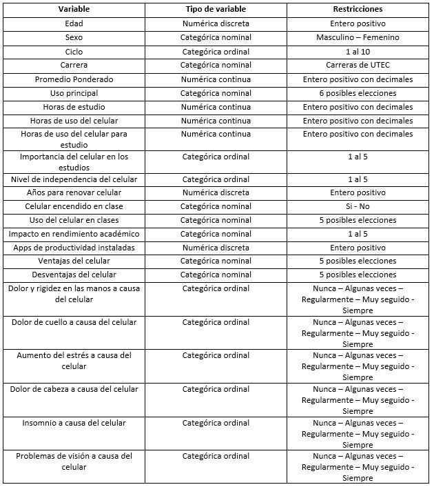

```{r setup, include=FALSE}
knitr::opts_chunk$set(echo = FALSE)
```

```{r Base de datos y librerias importadas, include=FALSE}
library(readr)
library(plyr)
library(dplyr)
library(stringr)
DF <- read_delim("BD.csv", ";", escape_double = FALSE, 
    trim_ws = TRUE)

```

```{r Configuraciones, include=FALSE}
DF$`Marca temporal`<-NULL
DF$`Dirección de correo electrónico`<-NULL
BDC <- rename(DF, Edad="¿Cuál es su edad? (En años)", Sexo="¿Cuál es su sexo?", Ciclo="¿En qué ciclo académico se encuentra?", Carrera="¿Qué carrera estudia?", "Promedio Ponderado"="¿Cuál es su promedio ponderado?  (Con decimales)", "Edad primer celular"="¿A qué edad obtuvo su primer celular?", "Marca Celular"="¿Qué marca de celular usa actualmente?", "Uso principal"="¿Cuál es el principal uso que le da a su celular?", "Horas de estudio"="¿Cuántas horas al día las dedica para realizar actividades académicas? (Sin considerar las horas de clases) (En horas)","Horas de uso del celular"="¿Cuántas horas al día usa su celular? (En horas)","Horas de uso del celular para estudio"="¿Cuánto tiempo utiliza el celular para sus actividades académicas? (En horas)","Importancia del celular en los estudios"="¿Qué tan importante es su celular en los estudios?","Característica más importante al comprar un celular"="¿Qué característica tiene en cuenta al momento de comprar un celular?","Nivel de independencia del celular"="¿Qué tan independiente del celular se considera?","Años para renovar celular"="¿Cada cuánto tiempo renueva su celular? (En años)","Celular encendido en clase"="¿Mantiene su celular encendido en horas clases?", "Uso del celular en clases"="¿Qué hace con su celular durante las clases?", "Impacto en rendimiento académico"="¿Cuál considera que es el impacto que tiene el celular en su rendimiento académico?", "Apps de productividad instaladas"="¿Cuántas Apps de productividad tiene instaladas en su celular?","Ventajas del celular"="¿Cuál considera que son las ventajas de usar el celular para las diferentes actividades académicas?","Desventajas del celular"="¿Cuál considera que son las desventajas de usar el celular para las diferentes actividades académicas?", "Dolor y rigidez en las manos a causa del celular"="¿Alguna vez a presentado los siguientes malestares a causa de un excesivo uso del celular? [Dolor y rigidez en las manos]","Dolor de cuello a causa del celular"="¿Alguna vez a presentado los siguientes malestares a causa de un excesivo uso del celular? [Dolor de cuello]","Aumento del estrés a causa del celular"="¿Alguna vez a presentado los siguientes malestares a causa de un excesivo uso del celular? [Aumento del estrés]", "Dolor de cabeza a causa del celular"="¿Alguna vez a presentado los siguientes malestares a causa de un excesivo uso del celular? [Dolor de cabeza]", "Insomnio a causa del celular"="¿Alguna vez a presentado los siguientes malestares a causa de un excesivo uso del celular? [Insomnio]", "Problemas de visión a causa del celular"="¿Alguna vez a presentado los siguientes malestares a causa de un excesivo uso del celular? [Problemas de visión]")
head(BDC)
BDCC<-BDC
```

# <u>**Tema:**</u>
<h3><center>**Importancia de los teléfonos móviles en la vida académica de los estudiantes de UTEC**</center></h3>

# <u>**Introducción:**</u>
La vida universitaria significa, para muchos, un gran cambio en su desarrollo académico debido a la apertura de libertades. De este modo, los alumnos son capaces de utilizar sus celulares durantes las clases y hacer lo que crean conveniente siempre y cuando no disturba el órden de la clase. Asimismo, los alumnos escogen sus celulares de acuerdo a sus necesidades y preferencias.

Es así, que es interesante de analizar los diversos efectos que el uso de teléfonos móviles puede tener dentro del desarrollo académico de los estudiantes de UTEC.

## **Relevancia:**
Este estudio nos permitirá reunir información que nos permita analizar el uso que los estudiantes le están dando al celular para desarrollar sus actividades académicas. Nos permitirá ver si este dispositivo ha tenido gran impacto en su rendimiento académico, si este ha sido positivo o negativo, y cual es el uso que le dan principalmente.

**¿Es el estudio de interés para la audiencia?**

Consideramos que sí, puesto que el celular es un dispositivo que usamos todos los días y a cada momento, el cual se ha vuelto sumamente importante debido a las múltiples actividades que podemos realizar con él y la facilidad con la que podemos hacerlo. Este estudio nos permitirá reflexionar sobre ello y ver cómo está impactando en nuestra vida académica

**¿Qué información se desea aportar al final del estudio?**

La información que buscamos aportar es el impacto que tienen los celulares, principalmente, en el rendimiento académico y vida universitaria de los estudiantes.

**¿Es posible llegar a la información que se propone de manera específica y concreta?**

Si es posible, ya que al aplicar la encuesta directamente a los estudiantes, la información que recopilemos será aún más real y verídica, pues será “de primera mano”. Además se tendrá en cuenta el número adecuado de la muestra para que los resultados que se obtengan sean aún mejor y las investigación sea más eficiente.

# <u>**Datos:**</u>

## **Proceso de recolección de datos:**
  + La recopilación de datos se realizó mediante una encuesta digital, con preguntas cerradas y abiertas, variables cualitativas y cuantitativas, preguntas cortas. 
  
  + Los medios digitales facilitan la rápida obtención de los datos, así como respuestas más precisas, mejor análisis y resultados en menor tiempo. 
  
  + Determinamos  que la encuesta tenia que ser de forma anónima, para estudiantes de distintos ciclos, carreras y edades, las preguntas cerradas (opción múltiple) y abiertas y que todas las preguntas son obligatorias responderlas.  
  
  + Optamos por compartir la encuesta primeramente por plataformas digitales como grupos y amigos de Whatsapp, Telegram y por medio de correo electrónico. Después se optó por compartir la encuesta de manera presencial. Es así, que para llamar la atención se entregó una pequeña recompensa a cada persona que respondía la encuesta.  


## **Población, muestra y muestreo:**
* **Población**
  
  Todos los estudiantes de la Universidad UTEC. 
  
* **Muestra**  
  
  204 estudiantes del total de los estudiantes de la Universidad UTEC.  

* **Muestreo**  

  Probabilístico: Aleatorio simple.


## **Variables:**
Se presenta la tabla con la descripción de las variables:
<center></center>

## **Limpieza de base de datos:**

Se cambiaron el nombre de las variables para un mejor manejo.
En un principio se encontraban así:

```{r}
names(DF)
```
Y se corrigió a lo siguiente:
```{r}
names(BDC)
```

Eliminamos las columnas que no se usarán:
```{r, echo=TRUE}
BDCC$`Edad primer celular`<-NULL
BDCC$`Marca Celular`<-NULL
BDCC$`Característica más importante al comprar un celular`<-NULL
BDCC$`Marca temporal`<-NULL
BDCC$`Dirección de correo electrónico`<-NULL
```

Finalmente corregimos Tipos de variables:
```{r, echo=TRUE}
library(stringi)
library(stringr)
BDCC$Edad<-as.numeric(BDCC$Edad)
BDCC$Ciclo<-as.numeric(BDCC$Ciclo)
BDCC$`Importancia del celular en los estudios`<-as.numeric(BDCC$`Importancia del celular en los estudios`)
BDCC$`Nivel de independencia del celular`<-as.numeric(BDCC$`Nivel de independencia del celular`)
BDCC$`Impacto en rendimiento académico`<-as.numeric(BDCC$`Impacto en rendimiento académico`)
BDCC$`Apps de productividad instaladas`<-as.numeric(BDCC$`Apps de productividad instaladas`)
```


# <u>**Análisis descriptivo:**</u>


## **Dimensión de la base de datos (original):**

Filas: 204
```{r}
nrow(BDCC)
```
Número de variables: 24
```{r}
ncol(BDCC)
```

Número de datos faltantes (NA's): 0

Número de datos completos: 4896

```{r}
sum(is.na(BDCC))
sum(!is.na(BDCC))
```

Casos completos: 204

Casos incompletos: 0

```{r}
sum(complete.cases(BDCC))
sum(!complete.cases(BDCC))
```

## <u>**Análisis de las variables:**</u>

## **Edad vs Sexo:**

```{r, echo=TRUE}
#Obtenemos los indicadores numéricos para nuestra variable numérica "Edad"

#Indicadores de las edades totales
summary(BDCC$Edad)

#Indicadores de las edades del género femenino
summary(BDCC$Edad[BDCC$Sexo=="Femenino"])

#Indicadores de las edades del género masculino
summary(BDCC$Edad[BDCC$Sexo=="Masculino"])
```


```{r, echo=TRUE}
#Creamos el diagrama de cajas

boxplot(formula=BDCC$Edad~BDCC$Sexo, data=BDCC,col="lightblue", horizontal= T, xlab="Edad", ylab="Sexo")
title("Diagrama de cajas Edad vs Sexo")
```

**ANÁLISIS: **

Al analizar el diagrama de cajas podemos observar que la gran mayoría de la población encuestada tiene entre 18 y 20 años, aunque, si bien encontramos algunos valores extremos, estos no están tan alejados de los demás datos, por lo cual no tiene gran influencia ene el resultado total. Complementando ello, al analizar los indicadores numéricos vemos que los valores, tanto para el género femenino como masculino, con bastante similares. De lo que podemos observar, la población femenina tiene en promedio 19,28 años, mientras que la población masculina, 19.6 años; lo cual es bastante similar al promedio de la edad del grupo total, que viene a ser 19,5. Ademas de ello, encontramos que ambos grupos coinciden en los valores de primer y tercer cuartil, siendo 18 y 20 respectivamente.


```{r, echo=TRUE}
#Obtenemos los descriptores de dispersión para nuestra variable numérica "Edad" 
Rmin = 16
Rmax = 28
Rangototal = Rmax - Rmin 
Rangototal #Rango total

var(BDCC$Edad,na.rm=T)  #Varianza

sd(BDCC$Edad,na.rm=T)   #Desviación estándar

CV<-(sd(BDCC$Edad,na.rm=T)/mean(BDCC$Edad,na.rm=T))*100   #Coeficiente de variación.
CV

```

**ANÁLISIS:**
DE los datos obtenidos podemos concluir:
Los datos tienen un rango total de 12, por lo cual, estos si presentan dispersión.
La varianza del promedio ponderado es 3,473
La desviación estándar es 1,864.  
El coeficiente de variación es 9,559 %. 
Recordamos que mientras mas bajos sean los resultados obtenidos, existirá menos dispersión. En este caso los valores no son tan pequeños, por lo cual no podemos decir que la dispersión es baja, sin embargo, esta tampoco en muy alta. Es decir, si existe dispersión en los datos de la varieble "Edad" pero esta dispersión es exagerada.


## **Ciclo vs Carrera:**

```{r, echo=TRUE}
#Obtenemos los indicadores numéricos para nuestra variable numérica "Ciclo"

#Indicadores del ciclo en general
summary(BDCC$Ciclo)

#Indicadores de ciclo en la carrera de Administración y negocios digitales
summary(BDCC$Ciclo[BDCC$Carrera=="Administración y Negocios Digitales"])

#Indicadores de ciclo en la carrera de Bioingeniería
summary(BDCC$Ciclo[BDCC$Carrera=="Bioingeniería"])

#Indicadores de ciclo en la carrera de Ciencia de la computación
summary(BDCC$Ciclo[BDCC$Carrera=="Ciencia de la Computación"])

#Indicadores de ciclo en la carrera de Ingeniería ambiental
summary(BDCC$Ciclo[BDCC$Carrera=="Ing. Ambiental"])

#Indicadores de ciclo en la carrera de Ingeniería civil
summary(BDCC$Ciclo[BDCC$Carrera=="Ing. Civil"])

#Indicadores de ciclo en la carrera de Ingeniería de la energía
summary(BDCC$Ciclo[BDCC$Carrera=="Ing. de la Energía"])

#Indicadores de ciclo en la carrera de Ingeniería electrónica
summary(BDCC$Ciclo[BDCC$Carrera=="Ing. Electrónica"])

#Indicadores de ciclo en la carrera de Ingeniería industrial
summary(BDCC$Ciclo[BDCC$Carrera=="Ing. Industrial"])

#Indicadores de ciclo en la carrera de Ingeniería mecánica
summary(BDCC$Ciclo[BDCC$Carrera=="Ing. Mecánica"])

#Indicadores de ciclo en la carrera de Ingeniería mecatrónica
summary(BDCC$Ciclo[BDCC$Carrera=="Ing. Mecatrónica"])

#Indicadores de ciclo en la carrera de Ingeniería química
summary(BDCC$Ciclo[BDCC$Carrera=="Ing. Química"])
```


```{r, echo=TRUE}
#Creamos el diagrama de cajas

boxplot(formula=BDCC$Ciclo~BDCC$Carrera, data=BDCC,col="lightblue", horizontal= F, xlab="Carrera", ylab="Ciclo",las=2)
title("Diagrama de cajas Ciclo vs Carrera")
```

**ANÁLISIS:**

Al observar la gráfico podemos concluir que nuestra muestra ha sido variada, ya que los estudiantes encuestados pertenecen a diferentes carreras, sin embargo, de ello también podemos destacar que la carrera de Ingeniería ambiental es la que menos estudiantes encuestados a tenido, seguida de Administración y negocios digitales. Por otro lado, al analizar los indicadores numéricos vemos que las medias se encuentran en un de 3 a 5, lo cual significa, que los encuestados, en promedio se encuentran entre tercer y quinto ciclo. Sin embargo, viendo los máximos y mínimos vemos que en la encuesta participaron estudiantes de todos los ciclos.


## **Promedio Ponderado:**

```{r, echo=TRUE}
#Obtenemos los indicadores numéricos para nuestra variable numérica "Promedio ponderado"

summary(BDCC$`Promedio Ponderado`)

```

```{r, echo=TRUE}
#Creamos el histograma

hist(BDCC$`Promedio Ponderado`, xlab = "Promedio ponderado", ylab = "Frecuencia absoluta", col ="lightblue" , main="Histograma de la variable Promedio ponderado",  )

```


**ANÁLISIS:**

Al analizar el gráfico de barras vemos que los promedios ponderados se encuentran en un rango de 10 a 20, lo cual es lógico, ya que, un alumno que tenga un promedio menor no podría continuar en la universidad. Además de ello, también podemos concluir que la mayoría tiene un promedio cercano a 14 y 15, y una minoría tiene como promedio más de 17. Por otro lado, teniendo en cuenta los indicadores numéricos, podemos confirmar la información que obtuvimos de la gráfica, pues vemos que nuestra media si esta está entre 14 y 15, siendo 14,46. Asimismo, al analizar los cuantiles vemos que estos también son próximos a la mediana, pero no al extremo 20, lo cual quiere decir que no hay mucha frecuencia en promedios cercanos a 20.


```{r, echo=TRUE}
#Obtenemos los descriptores de dispersión para nuestra variable numérica "Promedio ponderado" 
Rmin = 10
Rmax = 20
Rangototal = Rmax - Rmin 
Rangototal #Rango total

var(BDCC$`Promedio Ponderado`,na.rm=T)  #Varianza

sd(BDCC$`Promedio Ponderado`,na.rm=T)   #Desviación estándar

CV<-(sd(BDCC$`Promedio Ponderado`,na.rm=T)/mean(BDCC$`Promedio Ponderado`,na.rm=T))*100   #Coeficiente de variación.
CV

```

**ANÁLISIS:**
DE los datos obtenidos podemos concluir:
Los datos tienen un rango total de 10, por lo cual, estos presentan cierta dispersión.
La varianza del promedio ponderado es 2,918
La desviación estándar es 1,708.  
El coeficiente de variación es 11.736 %. 
Recordamos que mientras mas bajos sean los resultados obtenidos, existirá menos dispersión. En este caso los valores no son tan pequeños, por lo cual no podemos decir que la dispersión es baja, sin embargo, esta tampoco en muy alta. Si existe dispersión pero no es exagerada.


## **Nivel de independencia del celular**

```{r, include=FALSE}
#Creamos una tabla para almacenar las frecuencias
tablaindependencia <- table(BDCC$`Nivel de independencia del celular`)
tablaindependencia

#creamos un vector con las frecuencias
frec <- c(7,44,81,50,22)
```

```{r}
#Creamos el diagrama circular
pie(frec, labels=frec, col= c("white", "lightblue", "lightyellow", "lightgreen", "pink"), main="Diagrama circular sobre la variable nivel de independencia del celular")
legend("topright", legend = c("1 (Dependiente)", "2", "3", "4", "5 (Independiente)"),
       fill =  c("white", "lightblue", "lightyellow", "lightgreen", "pink"))
```

**ANÁLISIS:** 

Al analizar nuestro gráfico circular vemos que una parte considerable de los encuestados no se consideran ni dependientes ni independientes de sus celulares (se encuentran al medio), sin embargo al observar el resto de respuesta, vemos que las respuestas son así similares en frecuencia, así como hay un importante grupo que si se considera dependiente, hay otro que se considera independiente. Por lo tanto, no podemos afirmar una tendencia sin conocer los valores exactos en cuanto a la proporción total.


## **Celular encendido en clase:**

```{r, include=FALSE}
#Transformamos la variable a factor
factorcelularencendido <- factor(BDCC$`Celular encendido en clase`)
factorcelularencendido
```
```{r}
#Creamos el gráfico de barras
plot(x = factorcelularencendido, main = "Gráfico de barras para la variable celular encendido en clase",
     xlab = "Opciones", ylab = "Frecuencia absoluta", 
     col = c("lightblue"))
```


**ANÁLISIS:** 

Del gráfico podemos concluir que la gran mayoría de estudiantes si mantienen encendidos sus celulares durante las clases. Y esta cantidad (150 aprox.) es casi el triple de la cantidad de estudiantes que apaga sus celulares (50 aprox.) durante las clases.

## **Apps de productividad instaladas:**

```{r, echo=TRUE}
#Obtenemos los indicadores numéricos para nuestra variable numérica "Apps de productividad"

summary(BDCC$`Apps de productividad instaladas`)

```


```{r, include=FALSE}
#Transformamos la variable a factor
factorapps <- factor(BDCC$`Apps de productividad instaladas`)
factorapps
```

```{r}
#Creamos el gráfico de barras
plot(x = factorapps, main = "Gráfico de barras para la variable apps de productividad",
     xlab = "Número de apps", ylab = "Frecuencia absoluta", 
     col = c("lightblue"))
```

**ANÁLISIS:** 

Si nos centramos en el gráfico vemos que la gran mayoría posee entre 2 y 4 aplicaciones de productividad, sin embargo, hay estudiantes que poseen hasta 25 aplicaciones de productividad, siendo un valor lejano a donde se concentra la mayoría, por ende podemos hablar que existe un sesgo a la izquierda. Esto mismo lo vemos reflejado en los indicadores numéricos, donde la media es de 3,38 y los cuartiles de 3 y 4.

```{r, echo=TRUE}
#Obtenemos los descriptores de dispersión para nuestra variable numérica "Apps de productividad instaladas" 
Rmin = 0
Rmax = 25
Rangototal = Rmax - Rmin 
Rangototal #Rango total

var(BDCC$`Apps de productividad instaladas`,na.rm=T)  #Varianza

sd(BDCC$`Apps de productividad instaladas`,na.rm=T)   #Desviación estándar

CV<-(sd(BDCC$`Apps de productividad instaladas`,na.rm=T)/mean(BDCC$`Apps de productividad instaladas`,na.rm=T))*100  #Coeficiente de variación.
CV

```

**ANÁLISIS:**
DE los datos obtenidos podemos concluir:
Los datos tienen un rango total de 25, por lo cual, estos si presentan mucha dispersión.
La varianza del promedio ponderado es 7,528
La desviación estándar es 2,744.  
El coeficiente de variación es 81,118 %. 
Recordamos que mientras mas bajos sean los resultados obtenidos, existirá menos dispersión. En este caso los valores obtenidos por los descriptores son demasiado altos, lo cual nos refleja que existe mucha dispersión en los datos.


## **Dolor y rigidez en las manos a causa del celular:**

```{r, include=FALSE}
#Transformamos la variable a factor
factordolormanos <- factor(BDCC$`Dolor y rigidez en las manos a causa del celular`)
factordolormanos
```
```{r}
#Creamos el gráfico de barras
plot(x = factordolormanos, main = "Gráfico de barras para la variable dolor y rigidez en las manos",
     xlab = "Frecuencia de la afección", ylab = "Frecuencia absoluta", 
     col = c("lightblue"))
```

**ANÁLISIS:**

En cuanto a este gráfico podemos concluir que la mayoría de encuestados casi no ha sufrido de dolor o rigidez en las manos por un excesivo uso de celular, ya que la mayor proporción de estudiantes marcó nunca o algunas veces en cuento a la frecuencia de padecer este malestar.

## **Dolor de cuello a causa del celular:**

```{r, include=FALSE}
#Transformamos la variable a factor
factordolorcuello <- factor(BDCC$`Dolor de cuello a causa del celular`)
factordolorcuello
```
```{r}
#Creamos el gráfico de barras
plot(x = factordolorcuello, main = "Gráfico de barras para la variable dolor de cuello",
     xlab = "Frecuencia de la afección", ylab = "Frecuencia absoluta", 
     col = c("lightblue"))
```

**ANÁLISIS:** 

En este gráfico, volvemos a observar que la mayoría no ha sufrido frecuentemente de este malestar, pues las opciones predominantes son nunca y algunas veces.

## **Aumento del estrés a causa del celular:**

```{r, include=FALSE}
#Transformamos la variable a factor
factorestres <- factor(BDCC$`Aumento del estrés a causa del celular`)
factorestres
```
```{r}
#Creamos el gráfico de barras
plot(x = factorestres, main = "Gráfico de barras para la variable aumento de estrés",
     xlab = "Frecuencia de la afección", ylab = "Frecuencia absoluta", 
     col = c("lightblue"))
```


**ANÁLISIS:**

En este gráfico, nuevamente volvemos a observar que los estudiantes casi nunca padecen de este problema, lo cual nos puede ir dando una idea de que el uso que les dan a los celulares no son tan excesivos como para afectar su salud.

## **Dolor de cabeza a causa del celular:**

```{r}
Ca= table(BDCC$`Dolor de cabeza a causa del celular`)
cf= barplot( Ca,main="Gráfico de barras de dolor de cabeza",col=c("lightblue", "lightblue"),xlab = "Dolor de cabeza", ylab = "Frecuencia absoluta",ylim=c(-10,120) )
text(cf, Ca + 4, labels = Ca)

grid(nx = NA, ny = NULL, lwd = 0,5, lty = 1, col = "grey")
```

## **Insomnio a causa del celular:**

```{r}
Im= table(BDCC$`Insomnio a causa del celular`)
dd= barplot(Im,main="Gráfico de barras de Insomnio",col=c("lightblue", "lightblue"),xlab = "Insomnio", ylab = "Frecuencia absoluta",ylim=c(-10,120) )
text(dd, Im + 4, labels = Im)
grid(nx = NA, ny = NULL, lwd = 0,5, lty = 1, col = "grey")
```

## **Problemas de visión a causa de celular:**

```{r}
VI= table(BDCC$`Problemas de visión a causa del celular`)
vv= barplot(VI,main="Gráfico de barras de problemas de visión",col=c("lightblue", "lightblue"),xlab = "Problemas de visión", ylab = "Frecuencia absoluta",ylim=c(-10,120) )
text(vv, VI + 4, labels = VI)
grid(nx = NA, ny = NULL, lwd = 0,5, lty = 1, col = "grey")
```

## **Horas de estudio:**

```{r, include=FALSE}
filter(BDCC, `Horas de estudio`< 0 |`Horas de estudio`> 20)

HR<-filter(BDCC,`Horas de estudio`>= 1 & `Horas de estudio`<=10)
#HRC = table(HR$`Horas de estudio`)
```

```{r}
#Obtenemos los indicadores numéricos para nuestra variable numérica "Horas de estudio"

summary(HR$`Horas de estudio`)
```

```{r}
#Creamos el histograma

hi<-hist(HR$`Horas de estudio`, xlab = "Horas", ylab = "frecuencia absoluta", col =c("lightblue", "lightblue","lightblue", "lightblue"), border= "black" , main="Histograma de Horas de Estudio", breaks=6  )
text(hi$mids,hi$counts,labels=hi$counts, adj=c(0.1, -0.1), cex=.6)
```

**ANÁLISIS:**
En el gráfico podemos observar que gran parte de los encuestados respondieron que dedican de 2 a 4 horas para estudiar, lo cual coincide con la media que es 4,007 (4 aproximando). Por otro lado vemos que la mayoría se encuentra en un rango de 0 a 6 horas y una minoría en el rango de 6 a 10 horas; analizando esta situación, podríamos concluir que existe cierto sesgo a la izquierda. De igual forma si analizamos por cuantiles, tan solo el 25% dedican de 0 hasta 3 horas, pero el 75% dedican de 0 hasta 5 horas, reforzando la observación de que la gran mayoría se encuentra en la parte izquierda (menores valores) del gráfico..


```{r, echo=TRUE}
#Obtenemos los descriptores de dispersión para nuestra variable numérica "Horas de estudio" 
Rmin = 1
Rmax = 10
Rangototal = Rmax - Rmin 
Rangototal #Rango total

var(BDCC$`Horas de estudio`,na.rm=T)  #Varianza

sd(BDCC$`Horas de estudio`,na.rm=T)   #Desviación estándar

CV<-(sd(BDCC$`Horas de estudio`,na.rm=T)/mean(BDCC$`Horas de estudio`,na.rm=T))*100   #Coeficiente de variación.
CV

```

**ANÁLISIS:**
DE los datos obtenidos podemos concluir:
Los datos tienen un rango total de 9.
La varianza del promedio ponderado es 26,86
La desviación estándar es 5,183.  
El coeficiente de variación es 109.131 %. 
Recordamos que mientras mas bajos sean los resultados obtenidos, existirá menos dispersión. Para este caso nos centraremos en el coeficiente de variación, que ha superado el 100%. Como bservamos este es un valor demasiado alto, entonces podemos decir que los datos no solo presentan alta dispersión, sino también, son muy heterogéneos.


## **Impacto en rendimiento académico:**

```{r, echo=TRUE}
#Obtenemos los indicadores numéricos para nuestra variable "Impacto en el rendimiento académico"

summary(BDCC$`Impacto en rendimiento académico`)

r=c(table(BDCC$`Impacto en rendimiento académico`))
```

```{r}
#Creamos el diagrama circula

pie(r, labels=r, col= c("white", "light blue", "light yellow", "light green", "pink"))
legend("topleft", legend = c("Muy negativo", "Algo negativo", "Neutral", "Algo positivo","Muy positivo"),
       fill =  c("white", "light blue", "light yellow", "light green", "pink"))

title("Impacto en el rendimiento académico")
```

**ANÁLISIS:**

De acuerdo al gráfico, podemos mencionar que casi la mitad de los encuestados considera que los celulares tienen un impacto neutral en el rendimiento académico, es decir, que no es positivo ni negativo. Sin embargo, otra considerable cantidad de encuestados considera que el impacto que tiene los celulares es positivo o muy positivo; siendo una minoría la que considera que estos tienen un impacto negativo.


## **Horas del uso del celular vs Uso principal:**


```{r}
#Creamos el diagrama de cajas

boxplot(BDCC$`Horas de uso del celular` ~ BDCC$`Uso principal`, data=BDCC,col="light blue", horizontal= TRUE, xlab="HORAS",las=1)
title("Diagrama Horas de uso del celular vs Principal uso")
```

**ANÁLISIS:**

Según el gráfico observamos que nuestros encuestados , le dedican mayor horas a jugar que hacer otras actividades más productivas como estudiar o buscar información referente a las noticias. Observamos también que existen ciertos valores extremos, lo cual nos podría indicar que hay una ligera dispersión en los datos, siendo tareas el dato con menor dispersión ya que no presenta valores extremos.


## **Celular encendido en clase:**

```{r}
pie(table(BDCC$`Celular encendido en clase`),labels=table(BDCC$`Celular encendido en clase`))
legend ("topleft", legend = c("Encendido", "Apagado"),
       fill =  c("white", "lightblue"))
title("Diagrama circular de celulares encendidos y apagados")
```

**ANÁLISIS:**

Básicamente, a partir del gráfico llegamos a concluir que la gran mayoría de los encuestados si mantienen prendidos sus celulares durante las clases.


## **Uso principal del celular:**

```{r}
#Cargamos librerias y organizamos los datos

library(tidyr)
library(plyr)
library(dplyr)
table(BDCC$`Uso principal`)
```

```{r}
#Creamos el gráfico de barras

barplot(table(BDCC$`Uso principal`),xlab="Uso principal",ylab="Frecuencia",main="Uso principal del celular",col="lightblue")
```

**ANÁLISIS:**

Analizando el gráfico obtenido podemos ver que el principal uso que los encuestados le dan a sus celulares es para comunicarse y para lo que menos lo usan es para hacer las tareas. 


## **Ventajas del celular:**

```{r}
#Organizamos los datos

table(BDCC$`Ventajas del celular`)
```

```{r}
#Creamos el gráfico de barras

barplot(table(BDCC$`Ventajas del celular`),xlab="Ventaja Principal",ylab="Frecuencia",main="Ventajas del celular",col="lightblue")
```

**ANÁLISIS:**

Del gráfico obtenido, observamos que la mayor ventaja de los celulares, que encontraron los encuestados, fue para interactuar con amigos y organizar grupos de trabajo. 


## **Desventajas del celular:**

```{r}
#Organizamos los datos

table(BDCC$`Desventajas del celular`)
```

```{r}
#Creamos el gráfico de barras

barplot(table(BDCC$`Desventajas del celular`),xlab="Desventaja Principal",ylab="Frecuencia",main="Desventajas del celular",col="lightblue")
```

**ANÁLISIS:**

Al observar el gráfico vemos que las frecuencias son similares para ciertas observaciones referente a las desventajas de usar celulares, sin embargo la que posee mayor frecuencia fue que este dispositivo llega a ser una distrcción durante las clases. 


## **Uso del celular en clases:**

```{r}
#Organizamos los datos

table(BDCC$`Uso del celular en clases`)
```

```{r}
#Creamos el gráfico de barras

 barplot(table(BDCC$`Uso del celular en clases`),
        col = 1:dim(table(BDCC$`Uso del celular en clases`)),       # para establecer el número de diferentes colores                                       (=diferentes valores)
        space = 0,                    # no espacio entre las barras
        horiz = F,                    # orientación de las barras
        density = 500 ,                # trama de las barras (se puede modificar el ángulo con                                     el argumento angle)
        ylim = c(0,160)
        )
title("Uso del celular durante las clases")
```


## <u>**Relación entre variables:**</u>

Para esta investigación analizaremos la relación que existe entre las variables:
- "Horas de estudio" y "Promedio ponderado"
- "Horas de uso del celular para estudio" y "Promedio ponderado"

**Horas de estudio y Promedio ponderado**

```{r}
#Hallamos la relación entre las variables
cov(BDCC$`Horas de estudio`,BDCC$`Promedio Ponderado`)  #"Covarianza"

cor(BDCC$`Horas de estudio`,BDCC$`Promedio Ponderado`)  #"Coeficiente de correlación

```

**ANÁLISIS:**

Como obtuvimos que la covarianza tiene un valor positivo, podemos decir que hay una tendencia ascendente entre ambas variables, esto quiere decir, que si una variable aumenta la otra también lo hace. En cuanto al coeficiente de relación, si bien tenemos un valor positivo de 0,15, este es más cercano a 0 que a 1, lo cual nos indica que la relación lineal entre las variables no es tan buena.


**Regresión lineal:**

Fórmula modelo lineal:
   y = B0 + B1.X
   
   B0 = termino independiente o intercepto (con eje x)
   
   B1 = coeficiente (de x) o pendiente

```{r}
#Planteo mi comando para obtener los datos de mi ecuación

rl <- lm(BDCC$`Promedio Ponderado`~BDCC$`Horas de estudio`, data=BDCC)
rl
```

Ecuación: Y = 14,31886 + 0,04983*X

```{r}
Promedio <- 14.31886 + 0.04983*(BDCC$`Horas de estudio`)
Promedio
```

Una vez planteada la ecuación, podemos obtener los valores estimados que le corresponderían a cada estudiante de acuerdo a la cantidad de horas que dedica a estudiar.

Sin embargo para comprobar si el modelo es bueno, hallemos la covarianza y coeficiente de correlación:

```{r, echo=TRUE}
#Hallamos la relación entre las variables con los valores estimados

cov(BDCC$`Horas de estudio`,Promedio)  #"Covarianza"

cor(BDCC$`Horas de estudio`,Promedio)  #"Coeficiente de correlación"
```

Al observar los valores obtenidos podemos concluir que nuestro modelo de regresión lineal si es bueno. Por un lado tenemos que la covarianza es positiva, lo cual nos indica una tendencia ascendente en la que si una variable aumenta la otra también lo hace. Y por otro lado, obtuvimos que le coeficiente de  correlación es 1, lo que quiere decir que la relación es perfecta y ascendente.


**Horas de uso del celular para estudio y Promedio ponderado**

```{r, echo=TRUE}
#Hallamos la relación entre las variables

cov(BDCC$`Horas de uso del celular para estudio`,BDCC$`Promedio Ponderado`)  #Covarianza

cor(BDCC$`Horas de uso del celular para estudio`,BDCC$`Promedio Ponderado`)  #Coeficiente de correlación

```

**ANÁLISIS:**

Al observar los valores obtenidos vemos que la tendencia entre variables es ascendente y proporcional, debido a que el valor obtenido en la covarianza es positivo. Sin embargo, vemos también que el valor del coeficiente de correlación es demasiado pequeño y muy cercano a 0, en este caso es 0.04 (aproximado), por lo que concluimos que la relación entre estas dos variables no es buena.


**Regresión lineal:**

Fórmula modelo lineal:
   y = B0 + B1.X
   
   B0 = termino independiente o intercepto (con eje x)
   B1 = coeficiente (de x) o pendiente

```{r}
#Planteo mi comando para obtener los datos de mi ecuación

rl <- lm(BDCC$`Promedio Ponderado`~BDCC$`Horas de uso del celular para estudio`, data=BDCC)
rl
```

Ecuación: Y = 14,529816 + 0,006135*X

```{r}
Promedio <- 14.529816 + 0.006135*(BDCC$`Horas de uso del celular para estudio`)
Promedio
```

Una vez planteada la ecuación, podemos obtener los valores estimados que le corresponderían a cada estudiante de acuerdo a la cantidad de horas que usa el celular para estudiar.

Sin embargo para comprobar si el modelo es bueno, hallemos nuevamente la covarianza y coeficiente de correlación:

```{r, echo=TRUE}
#Hallamos la relación entre las variables con los valores estimados

cov(BDCC$`Horas de uso del celular para estudio`,Promedio)  #"Covarianza"

cor(BDCC$`Horas de uso del celular para estudio`,Promedio)  #"Coeficiente de correlación
```

Al observar los valores obtenidos podemos concluir que nuestro modelo de regresión lineal, en este caso, no es bueno. Por un lado tenemos que la covarianza si bien es positiva, lo cual nos indica una tendencia ascendente en la que si una variable aumenta la otra también lo hace; obtuvimos que el coeficiente de correlación es 0,0719 (un valor cercano a 0), ello nos indica que la relación lineal entre las variables no es buena.


# <u>**Análisis probabilístico**</u>


```{r, include=FALSE}
BDC <-BDCC
```


```{r, include=FALSE}
names(BDC)
```


## **Distribución Binomial**  

```{r, include=FALSE}
round(table(BDC$`Uso principal`)/nrow(BDC)*100,digits=2)
```
  
  
Se sabe que el 54.41 % de los encuestados respondieron que usan principalmente el celular para comunicarse, por lo tanto consideremos que se elije al azar a 30 estudiantes, tomando como *éxito* cuando el estudiante responde que si usa el celular principalmente para comunicarse.  
   
Por lo que se utiliza el **modelo binomial**.  
   
$\mathbb{X}∼\mathbb{Bin(x,n,p)}$   
  
*Donde:*   
$X$: número de estudiantes que respondieron que sí usan el celular principalmente para comunicarse.  
$n$: número de muestras tomada (30 estudiantes).   
$p$: probabilidad de *éxito* que la persona seleccionada responda que si usa el celular principalmente para comunicarse.   
  
* a) ¿Cuál es la probabilidad de que exactamente 8 estudiantes respondan que si usan el celular principalmente para comunicarse?   
       
      $X$= Número de estudiantes que afirman usar principalmente el celular para comunicarse.     
      Parámetros:  
      $n$=30    
      $p$= 0.5441       
      Se pide: $P(x=8)$          
      
```{r,echo=TRUE}
    dbinom(8,30,0.5441)
```
   
   
* b) ¿Cuál es la probabilidad de que por lo menos que 15 estudiantes respondan que si usan el celular principalmente para comunicarse?  

      $Y$= Número de estudiantes que afirman usar principalmente el celular para comunicarse.     
      Parámetros:   
      $n$= 30   
      $p$=0.5441   
      Se pide= $P(Y>= 15)$  
      
```{r, echo=TRUE}
    pbinom(14,30,0.5441,lower.tail=F)

```
  
  
* c) ¿Cuál es la probabilidad de que a lo más 10 estudiantes respondan que si usan el celular principalmente para comunicarse ?   

      $Z$= Número de estudiantes que afirman usar principalmente el celular para comunicarse.     
      Parámetros: 
      $n$=30   
      $p$=0.5441    
      Se pide: $P(Z<=10)$   
      
      
```{r,echo=TRUE}
      pbinom(10,30,0.5441)
```
 
* d) ¿Qué se espera tener de la encuesta?   
     $E(\mathbb{X})=np$  
     $E(X)$= 0.5441* 30 = 16.323  $=>$ la encuesta espera tener un aproximado de 16 estudiantes que respondan que si usan el celular principalmente para comunicarse.   
        
  
  
```{r, echo=TRUE}
round(table(BDC$`Problemas de visión a causa del celular`)/nrow(BDC)*100,digits=2)
```  

#### **GRÁFICA DE UN MODELO BINOMIAL**    
Se sabe que del total de la población encuestada, el 20.59 % afirma que presenta "regularmente problemas en la visión a causa del uso del celular". Si se toma una muestra de 80 estudiantes de la población, ¿cuál es la probabilidad de que 6 estudiantes presenten tales malestares?    

  
```{r}
n= 80
x= 6
p= 0.2059
plot(dbinom(x,0:n, p), col= "red2", xlab= "Número de estudiantes (n)", ylab= "Probabilidad  P(X=x0)", main="MODELO BINOMIAL- PROBLEMAS DE VISIÓN (Regularmente)")
```
   
  
## **Distribución Uniforme:**  
  
Los expertos señalan que la duración de un teléfono celular es entre 3 y 6 años, por lo que se considera que dentro de este rango es recomendable renovar un nuevo equipo de celular. Se plantea el **Modelo Uniforme.**  

$\mathbb{X∼U[a,b]}$   
  
*Donde:*  
$X$: renovación recomendable entre 3 y 6 años del celular.  
$a$: mínimo valor (años)  
$b$: máximo valor (años)  

* Se sabe que que la gran mayoría de los estudiantes encuestados renuevan su celular entre 1 y 7 años. ¿Cuál es la probabilidad de que los estudiantes renueven un celular dentro del rango recomendado?   
  
#### **Función de densidad:**
 
$\begin{equation*} \mathbb{f(x)} = \left\{ \begin{array}{rl} \frac{1}{b-a} & a\leq x \leq b\\ 0 & \text{en otros casos} \end{array} \right. \end{equation*}$  

Reemplazando tenemos:  
   
$\mathbb{X∼U[1,7]}$   
   
     
$\begin{equation*} \mathbb{f(x)} = \left\{ \begin{array}{rl} \frac{1}{6} & 1\leq x \leq 7\\ 0 & \text{en otros casos} \end{array} \right. \end{equation*}$   

  

#### **Hallando la probabilidad:**    
* Primera forma usando, la fórmula:  
  
  $\mathbb{P}(\mathbb{c}\leq x\leq d)=\mathbb{P}(\mathbb{c}< x<d )= \frac{d-c}{b-a}$   
  Reemplazando: $\frac{6-3}{7-1}= \frac{1}{2}$    
     
* Segunda forma, usando Rstudio:  
  Se pide hallar la probabilidad de: P(3<=X<=6)
```{r, echo=TRUE}
punif(6,1,7)-punif(3,1,7)
```
Se concluye que tanto la primera y la segunda forma utilizada, el resultado de probabilidad es igual, por lo tanto existe una probabilidad de 0.5 que es equivalente a decir que el 50 % de los estudiantes renuevan su celular dentro del rango de tiempo en años establecido por los expertos.   
  

## **Modelos Probabilísticos Discretos:**

### **Problema 1:**

**Variable:** Horas de estudio

Consideremos que queremos elegir 100 estudiantes al azar, considerando
todo los estudiantes de la UTEC. Planteamos como caso de éxito el hecho
de que estudien entre 3 y 5 horas, ya que estas son un número de horas
de sueño apropiadas, podemos plantear un Modelo Uniforme Continuo
𝑼(2,6).

a)  ¿Calcule la probabilidad de que un alumno de la UTEC, estudie entre
    3 y 5 horas?

$X$ ->Estudiantes que estudian entre 3 y 5 horas.

```{r, echo=TRUE}
punif(5,2,6)-punif(3,2,6)
```

La probabilidad de que un estudiante de la UTEC es de 0.5 (50%).

b)  Si en un salón hay 30 alumnos ¿cuál es la probabilidad de tener 5
    alumnos que estudien mínimo de 3 horas? Usando Uniforme [2,6]

$Y$ -> Numero de alumnos que estudien como mínimo 3 horas

$n = 30$

$P(X>=1)$

```{r, echo=TRUE}
punif(3,2,6)

dbinom(5,30,0.25)

```


La probabilidad de que 5 alumnos estudien mínimo 3 horas es de 0.1047.

## **Modelos Probabilísticos Continuos:**

### **Problema 1:**

La cantidad de horas de estudio, de un alumno de la UTEC es una variable
aleatoria con distribución normal siendo su media 4.74902 y su
desviación estándar igual a 5.18264 Podemos plantear un Modelo Uniforme
Continuo

Calculamos la media de las horas de estudio
```{r, echo=TRUE}
ABC <-mean(BDCC$'Horas de estudio')
ABC
```

La media es igual a 4.74902.

Calculamos la desviación estándar:
```{r, echo=TRUE}
(var(BDCC$'Horas de estudio'))^0.5
```


La desviación estándar es igual 5.15264.

a)  ¿Calcule la probabilidad de que un alumno de la UTEC, estudie mas de
    6 horas?

$X$ -> Cantidad de horas de estudio

P(mu=4.74902)  

P(sigma=5.18264)

```{r, echo=TRUE}
pnorm(6,4.74902,5.18264)
```


La probabilidad de estudiar mas de 6 horas es de 0.5953693.

b)   ¿Cual es la hora mínima para estar al 25% de los estudiantes que mas
hora estudian? P(X>M)

```{r, echo=TRUE}
qnorm(0.25,4.74902,5.18264, lower.tail= FALSE)
```


El 25% de los alumnos estudian mínimo 8 horas.

### **Problema 2:**

El promedio de las notas del curso de Estadística y probabilidades es de
14.55549, de 204 estudiantes de la UTEC. Podemos plantear un Modelo
Exponencial

a.  ¿Cuál es la probabilidad de que los estudiantes aprueben el examen,
    si se sabe que que la nota para aprobar es de 10.5?

$X$ ->Promedio del curso de Estadística y probabilidades

\[ P(x <= 10.5) \]  Beta = 14.55549

```{r, echo=TRUE}
pexp(10.5,1/14.55549)
```


La probabilidad de que los estudiantes que aprueben el curso de
estadística y probabilidades es de 0.5139177


## **Modelos de Variable Continua "Normal"**

Este es el modelo más importante entre todas las continuas

Es así, que generaremos casos, a base de este modelo:  

**Buscamos la variable a estudias, este caso seria el "promedio":**

```{r, echo=TRUE}
#desviación típica
a<-sd(BDCC$`Promedio Ponderado`)
b<-mean(BDCC$`Promedio Ponderado`)
```

La justificacion del uso de este modelo se da proque la cantidad de muestras supera los 30 y, por ende, se puede modelar los casos con una normal 


### **Pregunta 1:**

¿Cuál es la probabilidad de que un estudiante apruebe con más de 17 de nota?

```{r}
probabilidadnormal1<-pnorm(17,b,a,F)
```

Realizamos una función para graficar:

```{r, echo=TRUE}
normal_area <- function(mean = 0, sd = 1, lb, ub, acolor = "lightgray", ...) {
    x <- seq(mean - 3 * sd, mean + 3 * sd, length = 100) 
    
    if (missing(lb)) {
       lb <- min(x)
    }
    if (missing(ub)) {
        ub <- max(x)
    }

    x2 <- seq(lb, ub, length = 100)    
    plot(x, dnorm(x, mean, sd), type = "n", ylab = "")
   
    y <- dnorm(x2, mean, sd)
    polygon(c(lb, x2, ub), c(0, y, 0), col = acolor)
    lines(x, dnorm(x, mean, sd), type = "l", ...)
}
```

y la graficamos:

```{r, echo=TRUE}
probabilidadnormal1*100
normal_area(mean = b, sd = a, lb = 17, acolor = rgb(0, 0, 1, alpha = 0.5))
text(18, 0.01, "7.62%")
```

### **Pregunta 2:**

¿Cuál es la probabilidad que tengan nota entre 10 a 15?

```{r, echo=TRUE}
probabilidadnormal1<-pnorm(15, b, a) - pnorm(10, b, a)
probabilidadnormal1*100
#lo graficamos
#normal_area(mean = b, sd = a, lb = 10,ub=15, acolor = rgb(0, 0, 1, alpha = 0.5))
normal_area(mean = b, sd = a, lb = 10, ub = 15, acolor = rgb(0, 0, 1, alpha = 0.5))
text(12, 0.01, "59.88%")
```
La probabilidad es la integral de la normal y, por ende como se ve en el gráfico, su probabilidad es de 59.88%.


Entonces, podemos realizar el gráfico genérico de la normal con nuestros datos:

```{r, echo=TRUE}
mu <- a
sigma <- b

# Grid para una distribución normal no estándar
x <- seq(-3, 3, length = 100) * sigma + mu

# Función de densidad
f <- dnorm(x, mu, sigma)

plot(x, f, type = "l", lwd = 2, col = "blue", ylab = "", xlab = "Weight")
abline(v = mu) # Línea vertical en la media

```

## **Modelos de Variables Aleatorias:**


### **Probabilidad Condicional:**

  a.  Calcular la probabilidad de que un alumno tenga un promedio menor a 14 si su uso principal del celular es para jugar.

Primero, realizamos un filtrado de los datos que queremos evaluar y hallamos sus respectivas probabilidades:

```{r, echo=TRUE}

Prom <-filter(BDCC, BDCC$`Promedio Ponderado`< 14)

Prom <- nrow(Prom)/nrow(BDCC)

probUso <- filter(BDCC, BDCC$`Uso principal` == "Para jugar")
probUso <- nrow(probUso)/nrow(BDCC) 

P1 <- Prom
P2 <- probUso

```

Es así, que tenemos a $P1$ y $P2$ que representarán a $A$ y $B$ respectivamente en la siguiente fórmula:

<center>$P(A|B)=P(A∩B)/P(B)$</center>

Entonces, procedemos a hallar el resultado:

```{r,echo=TRUE}
Rpta<- round((P1*P2)/P2, digits = 2)

Rpta
```
