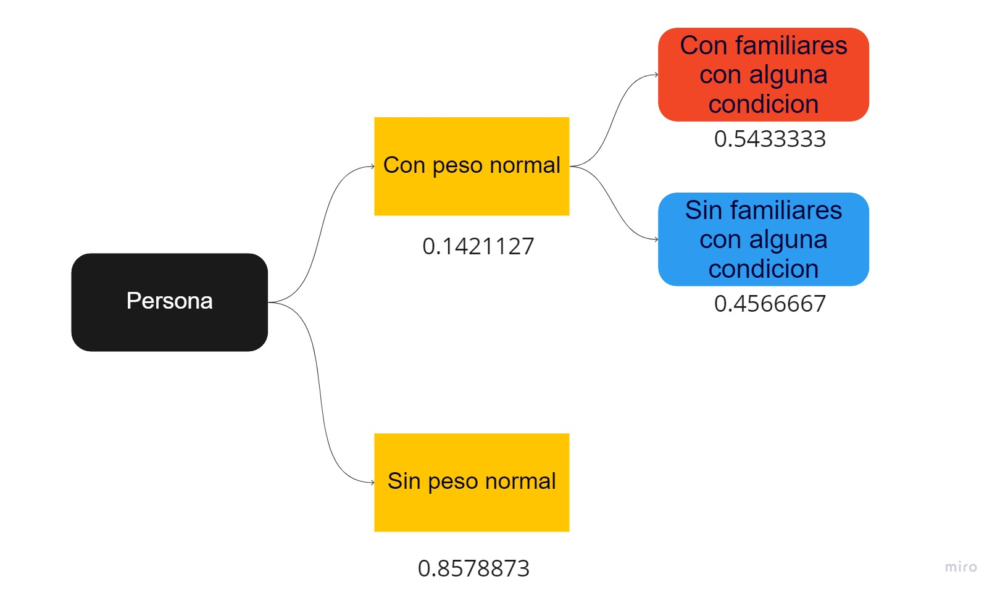

```{r, echo=FALSE, message=FALSE, warning=FALSE, include=FALSE}
options("install.lock"=FALSE)
if(!require("readr")){install.packages("readr")}
if(!require("dplyr")){install.packages("dplyr")}
if(!require("stringr")){install.packages("stringr")}
if(!require("stringi")){install.packages("stringi")}
if(!require("raster")){install.packages("raster")}
if(!require("DescTools")){install.packages("DescTools")}
if(!require("gmodels")){install.packages("gmodels")}
if(!require("tidyverse")){install.packages("tidyverse")}
if(!require("RColorBrewer")){install.packages("RColorBrewer")}
if(!require("plotrix")){install.packages("plotrix")}
if(!require("cowplot")){install.packages("cowplot")}
if(!require("vioplot")){install.packages("vioplot")}
if(!require("modeest")){install.packages("modeest")}
if(!require("rriskDistributions")){install.packages("rriskDistributions")}

```

# Introducción

## Relevancia

La obesidad es una enfermedad cada vez más común alrededor del mundo,
pues la existencia de mayores actividades de ocio y fácil acceso a
comida alta en calorías generan un incremento en las personas que la
poseen. Las causas pueden ser tanto familiares como de hábitos de vida.

Nuestro proyecto tiene como finalidad estudiar mediante la estadística
cuáles factores generan o no la obesidad y cómo estos se relacionan
entre sí. Además, el trabajo ofrece datos de gran relevancia para
personas interesadas en conocer si son o no propensas a poseer esta
enfermedad.

Es de gran importancia determinar las principales causas de la obesidad
debido a que es una enfermedad que ha incrementando su frecuencia en el
mundo generando muchos casos de fallecimiento en los últimos años.

## Objetivos

### Objetivo principal:

Identificar los patrones y factores que tienden a provocar la obesidad
mediante el análisis de las costumbres, familia, hábitos físicos y
alimenticios.

### Objetivos secundarios:

-   Establecer relaciones entre las variables para observar una serie de
    dichos hábitos que tienen las personas.

-   Verificar cuánto influye el tener familiares con antecedentes de
    obesidad con poseerla.

-   Verificar qué características causan más comúnmente la obesidad.

-   Predecir el comportamiento de ciertas variables respecto a otras.

# Datos

```{r, message=FALSE}
DF <- read_csv("ObesityDataSet.csv")
DF_ori <- read_csv("ObesityDataSet.csv")
```

## Recolección de datos

La base de datos elegida fue encontrada en Kaggle (plataforma web
especializada en reunir bases de datos muy interesantes de forma
confiable, ademas de ser muy conocida en el mundo en el ámbito
estadístico). Esta es una base de datos recopilado de residente de los
países México, Perú y Colombia con respecto a su estilo de vida. Esta
base de datos presenta 19 variables, es de tipo CSV.

Fecha de la recolección: Agosto, 2019

[Fuente de la base de
datos](https://www.kaggle.com/datasets/mandysia/obesity-dataset-cleaned-and-data-sinthetic?resource=download&select=ObesityDataSet_cleaned_and_data_sinthetic.csv)

[Fuente del
estudio](https://www.sciencedirect.com/science/article/pii/S2352340919306985#tbl1)

Repositorio: [Kaggle](https://www.kaggle.com/)

Base de datos: El archivo se encuentra como **"ObesityDataSet.csv"**.

```{r}
head(DF_ori)
```

## Población, muestra y muestreo

-   Población: Son personas pertenecientes a Perú, México o Colombia,
    con edades entre los 14 hasta 61 años, que poseen tanto obesidad
    debido a sus hábitos alimenticios malos y también aquellas personas
    que poseen hábitos alimenticios más saludables o por así llamarlo
    "normales".

-   Unidad muestral:

    -   La muestra del estudio de la base de datos son las personas que
        poseen un patrón de comportamiento hacia sus hábitos
        alimenticios, características en actividades, etc.

    -   El tamaño de la muestra es de 18 variables, como son el ID,
        gender, age, etc. que nos permitirá clasificar para facilitarnos
        nuestro estudio y con 2111 encuestados.

-   Tipo de muestreo: El tipo de muestreo en la base de datos es
    probabilístico por conglomerados ya que se agrupan segmentos de
    población de distintos países en cantidades de mayor magnitud que se
    podrán estudiar de manera aleatoria, también dividirse en el
    segmento mencionado anteriormente.

## Variables

Dimensión de la base de datos

```{r}
dim(DF_ori)
```

Información de la base de datos

```{r}
summary(DF_ori)
```

Datos y observaciones faltantes

```{r}
sum(is.na(DF_ori))
```

```{r}
sum(complete.cases(DF_ori))
sum(!complete.cases(DF_ori))
```

```{r}
colnames(DF_ori)
```

La presente base de datos presentas 2111 observaciones completas y 19
variables, inicialmente teniendo 6 variable cuantitativas y 13 variables
cualitativas y en Inglés; para posteriormente cambiar de idioma a
nuestra base de datos. Las variables:

-   **id (num):** Número único que identifica a cada observación.
-   **Gender (chr)**: Género que puede ser "male" o "female".
-   **Age (num):** Edad de la persona.
-   **Height (num):** Altura medida en metros.
-   **Weight (num):** Peso medido en kilogramos.
-   **family_history_with_overweigth (chr):** "yes" si tiene familiares
    con sobrepeso y "no" en caso contrario.
-   **FAVC (chr):** "yes" si frecuentemente consume comida alta en
    calorías y "no" en caso contrario.
-   **FCVC (chr):** Frecuencia de consumo de vegetales: "Never",
    "Sometimes" y "Always".
-   **NCP (num):** Cantidad de comidas al día. Va desde 1 hasta 4.
-   **CAEC (chr):** Consumo de alimentos entre comidas. Puede ser "No",
    "Sometimes", "Frequently", "Always".
-   **SMOKE (chr):** "yes" si se fuma y "no" en caso contrario.
-   **CH2O (chr):** Cantidad de agua consumida al día. Hay tres
    opciones: "Less than a litter", "between 1 and 2 l", "more than 2
    l".
-   **SCC (chr):** Consumo de calorías controlado. "yes" en caso sí y
    "no" en caso no.
-   **FAF (num):** Frecuencia de actividad física. Valores posibles:
    "0", "1-2", "2-4", "4-5".
-   **TUE (chr):** Tiempo en horas usando dispositivos electrónicos.
    Valores posibles: "0 to 2", "3 to 5", "\>5"
-   **CALC (chr):** Consumo de alcohol. Puede ser "no", "sometimes",
    "frequently" y "always".
-   **MTRANS (chr):** Transporte usado con más frecuencia. "automobile",
    "motorbike", "bike", "public_transportation", "walking".
-   **NObeyesdad:** Tipo de obesidad. Puede ser "insufficient_weight",
    "normal_weight", "overweight_level_i", "overweight_level_ii",
    "obesity_type_i", "obesity_type_ii" y "obesity_type_iii".
-   **BMI (num):** Índice de masa corporal.

## Limpieza de base de datos

### Traducción de las variables o datos.

*Variables*

```{r}
DF <- rename(DF, Id = 'id', Genero = 'Gender', Edad = 'Age', Altura = 'Height', Peso = 'Weight', Familiares = 'family_history_with_overweight', Calorias = 'FAVC', Vegetales = 'FCVC', Comidas = 'NCP', Entre_comida = 'CAEC', Fuma = 'SMOKE', Agua = 'CH2O', Control_Calo = 'SCC', Actividad = 'FAF', Tiempo = 'TUE', Alcohol = 'CALC', Transporte = 'MTRANS', Tipo = 'NObeyesdad', Indice = 'BMI' )
```

```{r}
names(DF)
```

*Datos* Re codificación de la variable Género.

```{r}
DF %>% mutate(Genero = 
                 ifelse(Genero == "female", "Femenino",
                 ifelse(Genero == "male", "Masculino", Genero
                  ))) -> DF
```

Re codificación de la variable Familiares.

```{r}
DF %>% mutate(Familiares = 
                 ifelse(Familiares == "yes", "Si",
                 ifelse(Familiares == "no", "No", Familiares
                  ))) -> DF
```

Re codificación de la variable Calorías.

```{r}
DF %>% mutate(Calorias = 
                 ifelse(Calorias == "yes", "Si",
                 ifelse(Calorias == "no", "No", Calorias
                  ))) -> DF
```

Re codificación de la variable Fuma.

```{r}
DF %>% mutate(Fuma = 
                 ifelse(Fuma == "yes", "Si",
                 ifelse(Fuma == "no", "No", Fuma
                  ))) -> DF
```

Re codificación de la variable Control de Calorías.

```{r}
DF %>% mutate(Control_Calo = 
                 ifelse(Control_Calo == "yes", "Si",
                 ifelse(Control_Calo == "no", "No", Control_Calo
                  ))) -> DF
```

Re codificación de la variable Vegetales. Valores únicos de la variable
Vegetales.

```{r}
unique(DF$Vegetales)
```

```{r}
DF %>% mutate(Vegetales = 
                 ifelse(Vegetales == "sometimes", "Algunas veces",
                 ifelse(Vegetales == "always", "Siempre", 
                 ifelse(Vegetales == "never", "Nunca", Vegetales
                  )))) -> DF
```

Re codificación de la variable Entre Comida. Valores únicos de la
variable Entre Comida.

```{r}
unique(DF$Entre_comida)
```

```{r}
DF %>% mutate(Entre_comida = 
                 ifelse(Entre_comida == "sometimes", "Algunas veces",
                 ifelse(Entre_comida == "frequently", "Frecuentemente", 
                 ifelse(Entre_comida == "always", "Siempre", 
                 ifelse(Entre_comida == "no", "No", Entre_comida
                  ))))) -> DF
```

Re codificación de la variable Agua. Valores únicos de la variable Agua.

```{r}
unique(DF$Agua)
```

```{r}
DF %>% mutate(Agua = 
                 ifelse(Agua == "between 1 and 2 l", "Entre 1 y 2 l",
                 ifelse(Agua == "more than 2 l", "Mas de 2 l", 
                 ifelse(Agua == "less than a liter", "Menos de 1l", Agua
                  )))) -> DF
```

Re codificación de la variable Actividad. Valores únicos de la variable
Actividad.

```{r}
unique(DF$Actividad)
```

```{r}
DF %>% mutate(Actividad = 
                 ifelse(Actividad == "4 to 5", "4 a 5",
                 ifelse(Actividad == "2 to 4", "2 a 4", 
                 ifelse(Actividad == "1 to 2", "1 a 2", Actividad
                  )))) -> DF
```

Re codificación de la variable Tiempo. Valores únicos de la variable
Tiempo.

```{r}
unique(DF$Tiempo)
```

```{r}
DF %>% mutate(Tiempo = 
                 ifelse(Tiempo == "3 to 5", "3 a 5",
                 ifelse(Tiempo == "0 to 2", "0 a 2", Tiempo
                  ))) -> DF
```

Re codificación de la variable Alcohol. Valores únicos de la variable
Alcohol.

```{r}
unique(DF$Alcohol)
```

```{r}
DF %>% mutate(Alcohol = 
                 ifelse(Alcohol == "sometimes", "Algunas veces",
                 ifelse(Alcohol == "frequently", "Frecuentemente",
                 ifelse(Alcohol == "always", "Siempre",
                 ifelse(Alcohol == "no", "No",Alcohol
                  ))))) -> DF
```

Re codificación de la variable Transporte. Valores únicos de la variable
Transporte.

```{r}
unique(DF$Transporte)
```

```{r}
DF %>% mutate(Transporte = 
                 ifelse(Transporte == "public_transportation", "Transporte publico",
                 ifelse(Transporte == "walking", "Caminata",
                 ifelse(Transporte == "automobile", "Automovil",
                 ifelse(Transporte == "motorbike", "Motocicleta",
                 ifelse(Transporte == "bike", "Bicicleta",Transporte
                  )))))) -> DF
```

Re codificación de la variable Tipo. Valores únicos de la variable Tipo.

```{r}
unique(DF$Tipo)
```

```{r}
DF %>% mutate(Tipo = 
                 ifelse(Tipo == "normal_weight", "Peso normal",
                 ifelse(Tipo == "overweight_level_i", "Sobrepeso 1",
                 ifelse(Tipo == "overweight_level_ii", "Sobrepeso 2",
                 ifelse(Tipo == "obesity_type_i", "Obesidad 1",
                 ifelse(Tipo == "obesity_type_ii", "Obesidad 2",
                 ifelse(Tipo == "obesity_type_iii", "Obesidad 3",
                 ifelse(Tipo == "insufficient_weight", "Peso insuficiente", Tipo
                  )))))))) -> DF
```

# Análisis descriptivo

## Re categorización de los valores en la variable Indice

De acuerdo a la Organización Mundial de la Salud (OMS), el indice de
masa corporal de clasifica de la siguiente manera:


Por lo que nosotros verificamos la categorización presente en la base de
datos previamente para utilizarlos con descriptores gráficos.

```{r}
tipos <- (unique(DF$Tipo))
tipos <- c(tipos)
#tipos
```

```{r}
for (i in tipos) {
  tip <- filter(DF,Tipo == i) 
  rango <- range(tip$Indice)
  print(i)
  print(rango)
  print("")
}
```

Después de observar los resultados, nos damos cuenta que esta variable
(columna) no esta bien clasificada, por lo que re categorizaremos la
variable "Tipo".

```{r}
DF %>% mutate(Tipo = 
                 ifelse(Indice < 18.5, "Peso insuficiente",
                 ifelse(Indice >= 18.5 & Indice < 25, "Peso normal",
                 ifelse(Indice >= 25 & Indice < 30, "Sobrepeso",
                 ifelse(Indice >= 30 & Indice < 35, "Obesidad 1",
                 ifelse(Indice >= 35 & Indice < 40, "Obesidad 2",
                 ifelse(Indice >= 40 , "Obesidad 3",Tipo
                  ))))))) -> DF
```

```{r}
tipos <- (unique(DF$Tipo))
tipos <- c(tipos)
```

```{r}
for (i in tipos) {
  tip <- filter(DF,Tipo == i) 
  mediana <- round(median(tip$Indice),2)
  rango <- round(range(tip$Indice),3)
  print(i)
  print(mediana)
  print(rango)
  print("")
}
```

Ahora si se encuentra actualizada los datos de la variable "Tipo", y se
encuentran distribuidas de las siguiente manera, en la base de datos.

\*\* Tabla sobre descripción de las categorías de la variable Tipo -
Tabla 1\*\*

| Categoría         | Limite inferior | Limite superior | Mediana |
|-------------------|-----------------|-----------------|---------|
| Peso insuficiente | 12.999          | 18.496          | 17.54   |
| Peso normal       | 18.519          | 24.951          | 22.23   |
| Sobrepeso         | 25.00           | 29.987          | 26.99   |
| Obesidad I        | 30.015          | 34.948          | 32.26   |
| Obesidad II       | 35.00           | 39.94           | 36.87   |
| Obesidad III      | 40.01           | 50.81           | 42.77   |

Cambio de tipo de la variable Tipo.

```{r}
DF$Tipo <- factor(DF$Tipo)
```

## Relación entre las variables Tiempo usando dispositivos electrónicos con Actividad física

**Tabla sobre el tiempo sobre la actividad de los individuos Tabla 2**

```{r}
CrossTable(DF$Tiempo,DF$Actividad, prop.r=F,prop.c=F, prop.t=F, prop.chisq=F)
```

```{r}
graficobase<- ggplot(data = DF,mapping = aes(x=Actividad,fill=Tiempo))
graficobase+geom_bar(position = "stack",stat="count")+ggtitle("Actividad y tiempo",subtitle = "Gráfico 2")
```

En el gráfico 2 realizamos un gráfico de barras de frecuencias para
verificar cuanta actividad física realiza una persona según el numero de
horas que pasa utilizando aparatos electrónicos

```{r}
graficobase2<- ggplot(data = DF,mapping = aes(x=Tiempo,fill=Actividad))
graficobase2+geom_bar(position = "stack",stat="count")+ggtitle("Tiempo y Actividad",subtitle = "Gráfico 3")
```

```{r}
ggplot(DF, aes(x = Actividad, y = Indice)) +
  geom_violin() + 
  stat_summary(fun = "median",
               geom = "point",
               color = "red")+ggtitle("Indice y Actividad Fisica",subtitle = "Gráfico 4")
```

Como vemos en el gráfico 4 las personas hay mayor frecuencia de personas
que tienen el indice elevado y no realizan actividad física. Ademas
observamos que no hay mucha frecuencia de personas que tienen el indice
elevado y realizan de 4 a 5 horas de actividad. Esto podría concluir que
la actividad física si influye en el indice de masa

## Gráficos respecto a la variable "Familiares" la cual nos indica si la persona tiene familiares con sobrepeso.

```{r}
va_j <- DF %>% count(Familiares)

pct <- round(va_j$n/sum(va_j$n)*100)
etiquetas <- paste(va_j$Familiares, pct)
etiquetas <- paste(etiquetas, "%",sep="")
```

```{r}
pie(va_j$n, labels = etiquetas, col = brewer.pal(4,"PuBu") ,main = "Familiares con obesidad",sub="Gráfico 5")

legend("topright", etiquetas, cex = 0.8,  fill = brewer.pal(4,"PuBu"))
```

Después de analizar el gráfico podemos ver que un 82% aproximado de
nuestros individuos tiene familiares con sobrepeso, lo que presenta 1726
individuos de nuestro total.

## Gráficos respecto al tipo de obesidad y el índice de masa corporal de los individuos de nuestra base de datos.

Conversión de la variable Tipo para un mejor manejo de datos en la
gráfica.

```{r}
DF$Tipo <- as.character(DF$Tipo)
```

```{r}
vioplot(DF$Indice ~ DF$Tipo,col= 7:length(levels(DF$Tipo)), xlab = "Tipos de situación", ylab = "Índice de masa corporal" , main = "Tipos de situaciones respecto al valor del IMC", sub = "Gráfico 6")

legend("topright", fill= 7:length(levels(DF$Tipo)), legend = c("Obesidad 1", "Obesidad 2", "Obesidad 3", "Peso insuficiente", "Peso normal","Sobrepeso"), cex = 0.8 )
#stripchart(DF_modi$Indice ~ DF_modi$Tipo, col= 3:8, vertical = TRUE, method = "jitter", pch = 19, add = TRUE)
```

Con este gráfica podemos ver la distribución de los datos respecto al
tipo de obesidad y al índice de masa corporal (IMC), acompañada también
de la mediana de cada categoría o tipo de situación respecto al peso y
por ultimo el intervalo intercuantil, respecto al análisis podemos ver
que la categoría de Obesidad 3 y Peso insuficiente presentan mas datos
atípicos frente a las demás categorías que presentan una densidad mas
uniforme respecto a estos dos.

Además, nos permite concluir que el tipo de peso que posea una persona
está directamente relacionado con cuál sea su IMC. Por ello, una clara
causa de la obesidad es la falta de cuidada de una persona hacia este
índice.

**Tabla de 3 variables, sobre el tipo de condición, el género y si posee
algún familiar con una condición igual o mayor al sobrepeso de los
individuos Tabla 4**

```{r}
table(DF$Tipo,DF$Familiares,DF$Genero)
```

En la tabla se ponen en función 3 variables, "Genero", "Familiares" y
"Tipo", como resultado podemos persivir que gran parte de las personas
con índice de Masa Corporal superior a la categoría de Peso normal
presenta familiares con sobrepeso por lo que podemos decir que tienen
relación, la influencia de la familia en el Indice de Masa Corporal de
los individuos, siendo las mujeres con Obesidad 3 las que representan
esta relación.

## Gráficos respecto a la variable Cantidad de comidas al día y Control de Calorías

```{r}
c<-table(DF$Comidas)
c
```

```{r}
SiObeso <- DF %>% transmute(Comidas,Tipo)
SiObeso %>% mutate(Tipo = 
                 ifelse(Tipo == "Sobrepeso 1", "Sobrepeso",
                 ifelse(Tipo == "Sobrepeso 2", "Sobrepeso",
                 ifelse(Tipo == "Obesidad 1", "Obesidad",
                 ifelse(Tipo == "Obesidad 2", "Obesidad",
                 ifelse(Tipo == "Obesidad 3", "Obesidad",
                 ifelse(Tipo == "Peso insuficiente", "Peso normal",Tipo
                  ))))))) -> SiObeso
```

```{r}
graficobase3<- ggplot(data = SiObeso,mapping = aes(x=Comidas,fill=Tipo))
graficobase3+geom_bar(position = "stack",stat="count")+ggtitle("Comidas al día y Tipo de obesidad",subtitle = "7")
```

En el gráfico 7, podemos notar que la relación entre el número de veces
que comen los encuestados al día no presenta mucha información sobre si
estos presentan casos de obesidad, sobrepeso o peso normal. Incluso se
podría pensar que las personas que comen 4 veces al día presentan
mayores casos de obesidad, sin embargo, son las que menos porcentaje de
obesidad presentan.

Además podemos notar que la relación entre el número de veces que comen
los encuestados al día no presenta mucha información sobre si estos
presentan casos de obesidad, sobrepeso o peso normal. Incluso se podría
pensar que las personas que comen 4 veces al día presentan mayores casos
de obesidad, sin embargo, son las que menos porcentaje de obesidad
presentan. Por otro lado, los nutricionistas recomiendan al menos 5
comidas al dia
(<https://www.infosalus.com/nutricion/noticia-recomienda-hacer-ingestas-comida-dia-no-20190119131818.html>)
que serian el desayuno, media mañana, almuerzo, media tarde y la cena,
tampoco podemos deducir que están comiendo mal ya que las personas
pueden estar consumiendo comidas saludables en el lapso del día.

```{r}
c2<-table(DF$Control_Calo)
c2
```

```{r}
SiObeso2 <- DF %>% transmute(Control_Calo,Tipo)
SiObeso2 %>% mutate(Tipo = 
                 ifelse(Tipo == "Sobrepeso 1", "Sobrepeso",
                 ifelse(Tipo == "Sobrepeso 2", "Sobrepeso",
                 ifelse(Tipo == "Obesidad 1", "Obesidad",
                 ifelse(Tipo == "Obesidad 2", "Obesidad",
                 ifelse(Tipo == "Obesidad 3", "Obesidad",
                 ifelse(Tipo == "Peso insuficiente", "Peso normal",Tipo
                  ))))))) -> SiObeso2

```

```{r}
graficobase3<- ggplot(data = SiObeso2,mapping = aes(x=Tipo,fill=Control_Calo))
graficobase3+geom_bar(position = "stack")+ggtitle("Control de calorías y obesidad",subtitle = "Gráfico 8")
```

Se observa en el gráfico 8 que la mayoría de personas no controlan el
consumo de sus calorías. En particular, casi el 100% de las personas con
obesidad no controlan sus calorías. Si bien es un dato relevante, no se
puede afirmar que es un factor importante para determinar si una persona
que no controla sus calorías puede ser una persona obesa.

## Gráficos respecto a la altura y el peso de los individuos

```{r}
plot(DF$Altura~DF$Peso,col="skyblue", main = "Peso vs Altura", sub = "Gráfico 9", xlab = "Peso", ylab = "Altura")
```

En la gráfica altura vs peso observamos que hay algunas personas que son
muy altas, por ese motivo tienden a pesar un poco más que los demás pero
también vemos que hay personas que podrían tener obesidad ya que para
cada altura se tiene un peso saludable para prevenir enfermedades además
de la misma obesidad.

## Gráficos respecto al consumo de alcohol e IMC

Contador por tipo de valor en la variable sobre el consumo de Alcohol

```{r}
DF %>% count(Alcohol)
```

```{r}
DF %>% ggplot(aes(as.numeric(Indice)))+
geom_histogram(data = subset(DF,Alcohol=="No"),fill="red", colour= "black")+labs(x="Indice",y="No", title = "IMC de las personas con categoría sobre el cosumo de Alcohol", subtitle = "Gráfico 10")
```

```{r}
DF %>% ggplot(aes(as.numeric(Indice)))+  
geom_histogram(data = subset(DF,Alcohol=="Algunas veces"),fill="blue", colour= "black")+labs(x="Indice",y="Algunas veces", title = "IMC de las personas con categoría sobre el cosumo de  Alcohol", subtitle = "Gráfico 11")
```

```{r}
DF %>% ggplot(aes(as.numeric(Indice)))+  
geom_histogram(data = subset(DF,Alcohol=="Frecuentemente"),fill="green", colour= "black")+labs(x="Indice",y="Frecuentemente", title = "IMC de las personas con categoría sobre el cosumo de  Alcohol", subtitle = "Gráfico 12")
```

A partir de las gráficas de alcohol vs índice de masa corporal podemos
concluir que mientras la persona consuma más alcohol, aumenta su índice
de masa corporal, esto se debe a que nuestro organismo absorbe el
alcohol, el cual posee un alto contenido calórico, el cual te hace subir
de peso por ende la masa corporal sube. además de que no presenta
nutrientes y/o proteínas, ademas en la gráfica de consumo de alcohol se
entiende que las personas que tienen a consumir alcohol con mayor
frecuencia tienden a subir más de peso ya que el alcohol contiene un
alto contenido calórico, además se sabe que puede contener la misma
cantidad de calorías en una comida pero este no posee ni los nutrientes
y proteinas.

## Tipos de obesidad

```{r}
DF$Clasi_grupo <- DF$Tipo
```

```{r}
DF %>% mutate(Clasi_grupo = 
                 ifelse(Tipo == "Obesidad 1", "Obesidad",
                 ifelse(Tipo == "Obesidad 2", "Obesidad",
                 ifelse(Tipo == "Obesidad 3", "Obesidad",Clasi_grupo
                  )))) -> DF
```

```{r}
md <- modal(DF$Clasi_grupo)
```

```{r, echo=FALSE}
sprintf(fmt = "La moda es el tipo %s", md)
```

```{r}
DF$Clasi_grupo <- factor(DF$Clasi_grupo)
```

```{r, echo=FALSE}
plot(x = DF$Clasi_grupo, main = "Gráfica de tipos de peso", xlab = "Nivel de peso", ylab="Cantidad", col = c("brown3", "aquamarine4", "aquamarine1", "darkgoldenrod4"), sub = "Gráfica 13")
```

A partir de la moda se reconoce que el tipo de obesidad más común es el
sobrepeso. Esto supone que la mayoría de personas residentes en Perú,
México y Colombia, con edades entre 14 y 61 años son más *propensos* en
cierta medida a poseer obesidad.

La gráfica previa reivindica la información obtenida de la moda de que
la mayoría de encuestados tienen obesidad. Asimismo, hallamos que no es
muy común que los encuestados posean un peso ideal o insuficiente. En
cambio, la gran mayoría de ellos tienen sobrepeso, es decir, están a un
paso antes de tener obesidad.

## Distribución de Tipo de obesidad por género

**Tabla sobre el tipo de condición sobre el género de los individuos
Tabla 5**

```{r}
table(DF$Clasi_grupo, DF$Genero)
```

```{r}
mosaicplot(x = table(DF$Clasi_grupo, DF$Genero), main = "Tipo de peso por género", xlab = "Tipo de peso", ylab = "Género", col = c("pink", "lightblue"), sub = "Gráfico 14")
```

Tanto la tabla de doble entrada como la gráfica de mosaico nos muestra
cómo se distribuye cada género en los distintos tipos de obesidad.

Observamos que el tipo de peso más común en la base de datos tanto en
hombres como en mujeres es la obesidad. Esto nos da un signo claro de
que el género no es un relevante para reconocer si alguien es propenso a
poseer obesidad si pertenece Perú, México y Colombia, y tiene edades de
entre 14 y 61 años.

## Regresión Lineal respecto al Peso y Peso estimado en relación al IMC

```{r}
plot(DF$Indice,DF$Peso,pch=".",xlab="Indice (kg/m^2)",ylab="Peso (kg)",main="Indice vs. peso", sub = "Gráfico 15 ")
```

Si queremos verificar que los valores de indice y peso han sido
calculados correctamente lo primero que hacemos es verificar si existe
una relación directa. La gráfica nos muestra que existe una relación
directa, para confirmarlo procederemos a obtener el múltiple
*r-squared*.

```{r}
summary(lm(DF$Peso~DF$Indice))
```

Como resultado de esta acción, tenemos $y= -4.18 + 3.06x$ y el
coeficiente de determinación es 0.87.\
Luego de confirmar que el coeficiente es mayor a 65 y que la gráfica
muestra una relación directa se procederá a realizar una regresión
lineal.

```{r}
PesoEstimado=DF$Indice*DF$Altura*DF$Altura
```

Para poder obtener el peso estimado hacemos uso de la fórmula del indice
$kg /m^2$

```{r}
smoothScatter(DF$Peso, PesoEstimado,xlab="Peso real (kg)",ylab="Peso estimado (kg)",main="Comparación entre el peso real y el peso estimado", sub = "Gráfico 16")
abline(0,1,col="red")
```

Finalmente concluimos que los datos del peso si han sido tomados
correctamente si tenemos en cuenta los valores de indice mostrados.

------------------------------------------------------------------------

# Análisis Probabilístico

## Objetivos

Para esta partes nos planteamos las siguientes incógnitas, con la base
de datos obtenida:

1.  ¿Qué tan probable es que una persona presente X condición de salud
    dada las características?

2.  ¿Que probabilidad es que un menor de edad presente sobrepeso?

3.  ¿Que tan probables es que una persona X presenta peso normal,
    respecto a sus familiares con antecedentes?

4.  ¿Qué tan probable es que una persona X mejore su condición respecto
    a su estilo de vida?

### 1. ¿Qué tan probable es que una persona presente X condición de salud dada las características?

Para seguir con el análisis probabilistico, creamos una nueva variable
"Clasi_edad" para agrupar a los individuos respecto a su edad y poder
hacer una mejor manejo de cada grupo, teniendo como parámetros, *Menor
de edad hasta los 17 años*, *Adulto desde los 18 hasta los 59 años*, y
*Adulto Mayor desde los 60 años*.

```{r}
DF$Clasi_edad <- 0
```

```{r}
DF %>% mutate(Clasi_edad = 
                 ifelse(Edad < 18, "Menor de edad",
                 ifelse(Edad >= 18 & Edad < 60, "Adulto",
                 ifelse(Edad >= 60, "Adulto mayor",Clasi_edad
                  )))) -> DF
```

**Tabla sobre la cantidad de personas agrupadas por su edad Tabla 6**

```{r}
table(DF$Clasi_edad)
```

Como resultado de la tabla X, podemos ver la cantidad de personas por
cada categoría teniendo la clasificación "Adulto" mas resaltante del
estudio por Genero de las personas.

#### Creación del Árbol de Bayes 1

**Tabla de doble entrada sobre el género y la clasificación por edad
Tabla 7**

```{r}
table(DF$Genero,DF$Clasi_edad)
```

**Tabla de doble entrada sobre el género y la clasificación por el peso
del individuo Tabla 8**

```{r}
table(DF$Genero,DF$Clasi_grupo)
```

**Tabla de triple entrada sobre el género, la clasificación por el peso
y por la edad del individuo Tabla 9**

```{r}
table(DF$Genero,DF$Clasi_grupo,DF$Clasi_edad)#
```

#### Calculo de las probabilidades

Masculino

Peso normal

```{r}
# menor de edad
round(10/146,7)
# adulto
round(136/146,7)
#adulto mayor
round(0/146,7)
```

Sobrepeso

```{r}
# menor de edad
round(5/330,7)
# adulto
round(325/330,7)
#adulto mayor
round(0/330,7)
```

Obesidad

```{r}
# menor de edad
round(4/492,7)
# adulto
round(488/492,7)
#adulto mayor
round(0/492,7)
```

Femenino

Peso insuficiente

```{r}
# menor de edad
round(11/171,7)
# adulto
round(160/171,7)
#adulto mayor
round(0/171,7)
```

Peso normal

```{r}
# menor de edad
round(19/154,7)
# adulto
round(134/154,7)
#adulto mayor
round(1/154,7)
```

Sobrepeso

```{r}
# menor de edad
round(12/236,7)
# adulto
round(224/236,7)
#adulto mayor
round(0/236,7)
```

Obesidad

```{r}
# menor de edad
round(3/482,7)
# adulto
round(479/482,7)
#adulto mayor
round(0/482,7)
```

 Finalmente tenemos nuestro árbol de Bayes para el
primer objetivo.

### 2. ¿Que probabilidad es que un menor de edad presente sobrepeso?

Para este objetivo hacemos uso del árbol del inciso anterior, en este
caso tenemos los siguientes resultados:

Para los menores de edad varones

```{r}
round((0.505921 * 0.308989 * 0.0151515) * 100,2)
```

Para las menores de edad mujeres

```{r}
round((0.494079 * 0.22627 * 0.0508475) * 100,2)
```

### 3. ¿Que tan probables es que una persona presente peso normal, respecto a sus familiares con antecedentes?

#### Creación del Árbol de Bayes 2

**Tabla de la cantidad de personas por clasificación de su peso Tabla
10**

```{r}
table(DF$Clasi_grupo)
```

**Tabla de doble entrada de la cantidad de personas por clasificación de
su peso y su poseen familiares con alguna condición Tabla 11**

```{r}
table(DF$Clasi_grupo,DF$Familiares)
```

 Finalmente tenemos nuestro árbol de Bayes para el
segundo objetivo, por lo que realizamos la multiplicación:

```{r}
objt3 <- (0.1421127 * 0.5433333) * 100
round(objt3,3)
```

Por lo que el resultado sería de 7,721% de encontrar una persona con
*Peso normal*, teniendo en cuenta que sus familiares poseen alguna
condición.

### 4. ¿Qué tan probable es que una persona X mejore su condición respecto a su estilo de vida?

Para este objetivos comenzamos a tomar en cuenta los valores de la base
de datos para poder realizar la probabilidad correcta, en función con
los datos obtenidos.

Valores únicos

```{r}
unique(DF$Familiares)
unique(DF$Control_Calo)
unique(DF$Vegetales)
unique(DF$Fuma)
unique(DF$Agua)
unique(DF$Actividad)
unique(DF$Alcohol)
unique(DF$Clasi_edad)
unique(DF$Clasi_grupo)

```

Creamos una nueva variable para obtener un puntaje respecto a mejorar
sus condición y en caso de presentar un *Peso normal* medir la
probabilidad que mantenga ese peso, esto lo realizaremos con la
siguiente tabla de puntuación.

**Tabla respecto al puntaje por cada valor para el calculo de la
probabilidad de mejorar o mantener su condición Tabla 12**

| Variable            | Valor 1               | Valor 2           | Valor 3      |
|------------------|-------------------|------------------|------------------|
| Familiares          | No / 1                |                   |              |
| Control de Calorías | Si / 1                |                   |              |
| Vegetales           | Algunas veces / 1     | Siempre / 2       |              |
| Fuma                | No / 1                |                   |              |
| Agua                | Entre 1 a 2L / 1      | Mas de 2L / 2     |              |
| Actividad Física    | 1 a 2 / 1             | 2 a 4 / 2         | 4 a 5 / 3    |
| Alcohol             | No / 1                | Algunas Veces / 1 |              |
| Clasificación Edad  | Menor de edad / 2     | Adulto / 1        |              |
| Grupo               | Peso insuficiente / 2 | Sobrepeso / 2     | Obesidad / 1 |

```{r}
DF$Mejora <- 0
```

Respecto a la familia

```{r}
DF %>% mutate(Mejora = 
                 ifelse(Familiares == "No",Mejora +1,Mejora
                  )) -> DF
```

Respecto a Control de calorías

```{r}
DF %>% mutate(Mejora = 
                 ifelse(Control_Calo == "Si",Mejora+1,Mejora
                  )) -> DF
```

Respecto a Vegetales

```{r}
DF %>% mutate(Mejora = 
                 ifelse(Vegetales == "Algunas veces",Mejora+1,
                 ifelse(Vegetales == "Siempre",Mejora+2,Mejora
                  ))) -> DF
```

Respecto a Fumar

```{r}
DF %>% mutate(Mejora = 
                 ifelse(Fuma == "No",Mejora+1,Mejora
                  )) -> DF
```

Respecto a Agua

```{r}
DF %>% mutate(Mejora =
                 ifelse(Agua == "Entre 1 y 2 l",Mejora+1,
                 ifelse(Agua == "Mas de 2 l",Mejora+2,Mejora
                  ))) -> DF
   
```

Respecto a Actividad Física

```{r}
DF %>% mutate(Mejora =
                 ifelse(Actividad == "1 a 2",Mejora+1,
                 ifelse(Actividad == "2 a 4",Mejora+2,
                 ifelse(Actividad == "4 a 5",Mejora+3,Mejora
                  )))) -> DF
```

Respecto a Alcohol

```{r}
DF %>% mutate(Mejora =
                 ifelse(Alcohol == "No",Mejora+1,
                 ifelse(Alcohol == "Algunas veces",Mejora+1,Mejora
                  ))) -> DF
   
```

Respecto a la clasificacion de edad

```{r}
DF %>% mutate(Mejora =
                 ifelse(Clasi_edad == "Menor de edad",Mejora+2,
                 ifelse(Clasi_edad == "Aldulto",Mejora+1,Mejora
                  ))) -> DF
   
```

Respecto al grupo

```{r}
DF %>% mutate(Mejora = 
                 ifelse(Clasi_grupo == "Peso insuficiente",Mejora+2,
                 ifelse(Clasi_grupo == "Sobrepeso",Mejora+2,
                 ifelse(Clasi_grupo == "Obesidad", Mejora+1,Mejora
                  )))) -> DF
```

```{r}
range(DF$Mejora)
```

Ahora procedemos a pasarlo en valores porcentuales.

```{r}
DF$Prop_Mejora <- DF$Mejora * (1/15)
```

```{r}
range(DF$Prop_Mejora)
```

Como podemos observar, el puntaje obtenido de todos los 2111 individuos
va desde 2 hasta 14, lo que ninguno posee un 0% o 100% de mejorar o
mantener su condición, en caso de los que tienen *Peso normal*.

## Modelos de distribución

### Variables Continuas

#### Variable Altura

```{r}
hist(DF$Altura, prob = TRUE, main = "Histograma respecto a la Altura", sub = "Gráfico 17", xlab = "Altura en metros", ylab="Densidad")
lines(density(DF$Altura),col="red",lwd=2)
```

```{r}
shapiro.test(DF$Altura)
```

```{r}
LillieTest(DF$Altura)
```

```{r}
library(modeest)
```

```{r}
mean(DF$Altura)
median(DF$Altura)
mfv(DF$Altura)
```

Luego de sacar la moda mediana y media de esta variable notamos que
aunque se asemejen en valor estas no son iguales entonces una de las
condiciones para que se acepte que es una distribución normal se
incumple.

Asimismo vemos de estas dos pruebas de normalidad ambos p_value son
menores a nuestro alfa que por defecto es 0.05 por lo tanto descartamos
que en este caso exista una distribución normal

#### Variable Peso

```{r}
hist(DF$Peso, prob = TRUE, main = "Histograma respecto al Peso", sub = "Gráfico 18", xlab = "Peso en Kilogramos", ylab="Densidad")
lines(density(DF$Peso),col="red",lwd=2)
```

Hacemos uso de una nueva librería que nos ayudará identificando y
descartando los modelos de distribución llamada "rriskDistributions",
por medio de , en caso que algún modelo se paresca a nuestros datos nos
saldría "not rejected" y en caso contrario "rejected".

```{r}
library("rriskDistributions")
```

```{r}
resPeso <- fit.cont(DF$Peso)
```

Para la variable Peso se rechazan todos los modelos, por lo que podemos
decir que no se parece a ningún modelo.

#### Variable Indice

```{r}
hist(DF$Indice, prob = TRUE, main = "Histograma respecto al Indice", sub = "Gráfico 19", xlab = "Indice", ylab="Densidad")
lines(density(DF$Indice),col="red",lwd=2)
```

```{r}
res <- fit.cont(DF$Indice)
```

Para la variable Indice se rechazan todos los modelos, por lo que
podemos decir que no se parece a ningún modelo.

#### Variable Mejora

```{r}
hist(DF$Mejora, prob = TRUE,main = "Histograma respecto a la variable Mejora", sub = "Gráfico 20", xlab = "Puntuación", ylab="Densidad")
lines(density(DF$Mejora),col="red",lwd=2)
```

```{r}
res <- fit.cont(DF$Mejora)
```

Para la variable Mejora se rechazan todos los modelos, por lo que
podemos decir que no se parece a ningún modelo.

#### Variable Prop_Mejora

```{r}
hist(DF$Prop_Mejora, prob = TRUE,main = "Histograma respecto a la probabilidad de Mejorar o mantener su peso", sub = "Gráfico 21", xlab = "Probabilidad", ylab="Densidad")
lines(density(DF$Prop_Mejora),col="red",lwd=2)
```

```{r}
res <- fit.cont(DF$Prop_Mejora)
```

Para la variable Prop_Mejora se rechazan todos los modelos, por lo que
podemos decir que no se parece a ningún modelo.

### Variables Discretas

#### Variable Comidas

```{r}
barplot(table(DF$Comidas),main = "Gráfico de barras respecto a la variable Comidas", sub = "Gráfico 22", xlab = "Cantidad de comidas al día", ylab="Valor")
```

Dado el gráfico simplemente podemos decir que la distribución o modelo
presente no tiene semejanza con algún modelo existente, por lo que
podemos decir que la variable "Comidas" no tiene un modelo en
especifico.

#### Variable Edad

```{r}
barplot(table(DF$Edad),main = "Gráfico de barras respecto a la variable Edad", sub = "Gráfico 23", xlab = "Edad en años", ylab="Valor")
```

En este caso para la variable "Edad" se diría que presenta un ligero
comportamiento de una distribución binomial negativa en rasgos
generales, pero en realidad no presenta dicho comportamiento.

## Conclusiones

-   Los resultados del primer objetivos son los siguientes mostrados:

**Tabla sobre los resultados del primer objetivo Tabla 13**

| Género    | Clasificación respecto al IMC | Clasificación respecto a la edad | Valor  |
|--------------|-----------------------|-------------------------|----------|
| Masculino | Peso insuficiente             | Menor de edad                    | 0.0127 |
| Masculino | Peso insuficiente             | Adulto                           | 0.0345 |
| Masculino | Peso normal                   | Menor de edad                    | 0.0047 |
| Masculino | Peso normal                   | Adulto                           | 0.0644 |
| Masculino | Sobrepeso                     | Menor de edad                    | 0.0024 |
| Masculino | Sobrepeso                     | Adulto                           | 0.1539 |
| Masculino | Obesidad                      | Menor de edad                    | 0.0019 |
| Masculino | Obesidad                      | Adulto                           | 0.2312 |
| Femenino  | Peso insuficiente             | Menor de edad                    | 0.0052 |
| Femenino  | Peso insuficiente             | Adulto                           | 0.0758 |
| Femenino  | Peso normal                   | Menor de edad                    | 0.0090 |
| Femenino  | Peso normal                   | Adulto                           | 0.0635 |
| Femenino  | Peso normal                   | Adulto Mayor                     | 0.0005 |
| Femenino  | Sobrepeso                     | Menor de edad                    | 0.0057 |
| Femenino  | Sobrepeso                     | Adulto mayor                     | 0.1061 |
| Femenino  | Obesidad                      | Menor de edad                    | 0.0014 |
| Femenino  | Obesidad                      | Adulto                           | 0.2269 |

-   Siendo la probabilidad mas alta de una persona de género masculino
    con obesidad y adulta con 0.2312, y la probabilidad mas baja una
    persona de género femenino con peso normal y adulta mayor con
    0.0005.

-   Respecto al segundo objetivo, tenemos que un menor de edad varón,
    presenta 0.24 de probabilidad frente a un 0.57, por parte de las
    mujeres, de probabilidad de presentar sobrepeso.

-   Respecto a la probabilidad de mejora, tenemos valores desde 0.13
    hasta 0.93 de mejorar su condición actual, o en caso de tener "Peso
    normal" sería de mantener este estado, lo que podemos traducir que
    todos los 2111 individuos de la base de datos, pueden mantener o
    mejorar su condición física, teniendo al menos un 0.13 o 13% de
    probabilidad., acorde a los datos proporcionados por ellos mismo en
    la base de datos.

-   Podemos decir que nuestras variables cuantitativas no presentan
    modelos específicos, si no que poseen un comportamiento no
    relacionado con ningún modelo.
