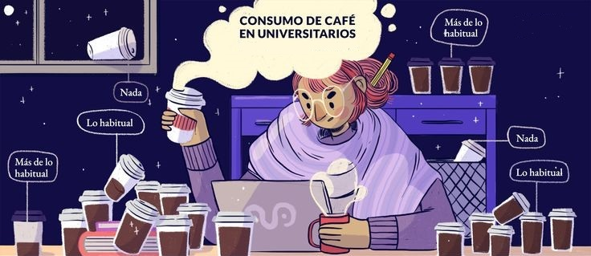

<div style="text-align: center">


# **Estudio de los factores y patrones en el consumo de café en los estudiantes de UTEC**



<div/>

<div style="text-align: justify">


## **I. INTRODUCCIÓN**

### **Relevancia**

Una de las bebidas más populares, no necesariamente saludables, es el café. En el Perú, esta bebida es de mayor ingesta en la población, pues los jóvenes y adultos representan mayor parte del público objetivo. Tanto para los estudiantes en UTEC como para cualquier empresa o cadena orientada al procesamiento y venta de café en espacios públicos y privados, el tema que se propone puede ser llamativo y capaz de generar una perspectiva en ellos de acuerdo a las diversas interpretaciones que se le puede dar. Esto debido a que abarca información relevante a partir de una recolección significativa de datos de nuestra población objetivo, y que en base a eso, se puede llegar a conocer y entender los factores a los que depende el consumo del café.

### **Interés para la audiencia**

El país está muy familiarizado con el café, y como consumidores frecuentes nos parece oportuno descubrir y exponer los factores que determinan las tendencias, variables y el grado de consumo por diferentes motivos como: mejorar el promedio académico, realizar mayor actividad durante el día, hacer ejercicio, socializar, etc.

### **Objetivos Generales**

-   Explorar los datos y variables del perfil de cada elemento de la muestra que influyen o se relacionan con los factores y características del consumo de café.\
-   Lograr entender de mejor manera el consumo de café en Lima, especialmente el cómo se desarrolla en un espacio universitario.
-   Analizar el perfil del individuo promedio de la muestra.


## **II. DATOS**

### **Recolección de datos**

**Pasos durante el proceso:**

##### **1. Establecer el método de recolección de datos**

Para llegar a obtener la información que se propone de manera específica y concreta, se optó por el uso del cuestionario (encuesta), esto debido a que resulta ser un sistema sencillo, rápido, económico y de fácil acceso hacia los de estudiantes en UTEC.

##### **2. Elegir el medio y vía para la recopilación**

Se decidió hacerlo de forma online, para ser difundido a través del correo electrónico institucional de la universidad UTEC y redes sociales utilizadas en el ámbito académico.

##### **3. Definir el número mínimo de observaciones**

Se propuso recolectar una cantidad mínima de 200 observaciones para el estudio a realizar.

##### **4. Definir el número de variables a utilizar**

Se planteó llegar a una cantidad considerable de variables cuantitativas y cualitativas, siendo 28 variables en total.

##### **5. Ejecutar el plan de recolección**

La recolección se hizo a través de un enlace, utilizando estrategias vistosas (sorteo de cuentas en plataformas de entretenimiento) hacia nuestra público objetivo con el fin de que culminen con la encuesta satisfactoriamente.

##### **6. Condiciones para realizar la encuesta**

La condición establecida para elaborar la encuesta es la limitación de la demografía con un mínimo de 200 personas encuestadas.

### **Población, Muestra y Muestreo**

-   **Población**: Estudiantes de UTEC.

-   **Muestra**: 200 estudiantes encuestados aproximadamente.

-   **Muestreo**: Probabilístico (Muestreo Aleatorio Simple)

Se toma en cuenta los siguientes criterios para tener la veracidad de su representatividad:

    -  El tamaño de la muestra. 
    -  El grado de homogeneidad que presenta la población.
    -  Los criterios de selección de las unidades que componen la muestra.

### **Variables**

+-----------------------------------------------------------------------------+--------------+--------------+-----------------------------------------------------------------------------------------+
| Variable                                                                    | Tipo         | Clase        | Restricciones                                                                           |
+=============================================================================+:=============+:=============+:========================================================================================+
| Ciclo actual (1 al 10)                                                      | Categórica   | Ordinales    | Igual o mayor que 1 y menor o igual que 10.                                             |
+-----------------------------------------------------------------------------+--------------+--------------+-----------------------------------------------------------------------------------------+
| Periodo de ingreso                                                          | Categórica   | Ordinales    | No se puede realizar operaciones aritméticas, solo se puede seleccionar opciones dadas. |
+-----------------------------------------------------------------------------+--------------+--------------+-----------------------------------------------------------------------------------------+
| Escala de pago (A-E)                                                        | Categórica   | Ordinales    | No se puede realizar operaciones aritméticas, solo puede seleccionar opciones dadas.    |
+-----------------------------------------------------------------------------+--------------+--------------+-----------------------------------------------------------------------------------------+
| Horas de estudio al día                                                     | Categórica   | Ordinales    | No se puede usar descriptores de posición, número positivo entre 1 y 20.                |
+-----------------------------------------------------------------------------+--------------+--------------+-----------------------------------------------------------------------------------------+
| Hora de consumo (AM/PM)                                                     | Categórica   | Ordinales    | No se puede usar descriptores de posición, solo puede seleccionar opciones dadas        |
+-----------------------------------------------------------------------------+--------------+--------------+-----------------------------------------------------------------------------------------+
| Frecuencia de compra semanalmente                                           | Categórica   | Ordinales    | No se puede usar descriptores de posición, solo puede seleccionar opciones dadas.       |
+-----------------------------------------------------------------------------+--------------+--------------+-----------------------------------------------------------------------------------------+
| Género (M/F/Otro)                                                           | Categórica   | Nominales    | No se puede usar descriptores de posición, solo se puede marcar las opciones dadas.     |
+-----------------------------------------------------------------------------+--------------+--------------+-----------------------------------------------------------------------------------------+
| Carrera                                                                     | Categórica   | Nominales    | No se puede ordenar, solo se puede seleccionar opciones dadas.                          |
+-----------------------------------------------------------------------------+--------------+--------------+-----------------------------------------------------------------------------------------+
| Tipo de café consumido (Americano, Espresso, Cappuccino, Mocaccino, etc...) | Categórica   | Nominales    | No se puede ordenar, solo puede seleccionar opciones dadas.                             |
+-----------------------------------------------------------------------------+--------------+--------------+-----------------------------------------------------------------------------------------+
| Origen de café (nacional, importado)                                        | Categórica   | Nominales    | No se puede ordenar, solo puede seleccionar opciones dadas.                             |
+-----------------------------------------------------------------------------+--------------+--------------+-----------------------------------------------------------------------------------------+
| Marca de café (Nescafé, Kirma, Altomayo, etc...)                            | Categórica   | Nominales    | No se puede ordenar, solo puede seleccionar opciones dadas.                             |
+-----------------------------------------------------------------------------+--------------+--------------+-----------------------------------------------------------------------------------------+
| Razón del consumo (sabor, precio, costumbre, temperatura, etc...)           | Categórica   | Nominales    | No se puede ordenar, solo puede seleccionar opciones dadas.                             |
+-----------------------------------------------------------------------------+--------------+--------------+-----------------------------------------------------------------------------------------+
| Temperatura (frío, caliente, etc...)                                        | Categórica   | Nominales    | No se puede ordenar, solo puede seleccionar opciones dadas                              |
+-----------------------------------------------------------------------------+--------------+--------------+-----------------------------------------------------------------------------------------+
| Preparación de café (café hecho, café casero, etc...)                       | Categórica   | Nominales    | No se puede ordenar, solo puede seleccionar opciones dadas.                             |
+-----------------------------------------------------------------------------+--------------+--------------+-----------------------------------------------------------------------------------------+
| Acompañamiento del café (solo café, acompañado)                             | Categórica   | Nominales    | No se puede ordenar, solo puede seleccionar opciones dadas.                             |
+-----------------------------------------------------------------------------+--------------+--------------+-----------------------------------------------------------------------------------------+
| Acompañamiento con alguien (Sí, No)                                         | Categórica   | Nominales    | No se puede ordenar, solo puede seleccionar opciones dadas                              |
+-----------------------------------------------------------------------------+--------------+--------------+-----------------------------------------------------------------------------------------+
| Lugar de consumo (cafeterías, tiendas, universidad)                         | Categórica   | Nominales    | No se puede ordenar, solo puede seleccionar opciones dadas.                             |
+-----------------------------------------------------------------------------+--------------+--------------+-----------------------------------------------------------------------------------------+
| Consumo de café (Sí, No)                                                    | Categórica   | Nominales    | No se puede usar descriptores de posición, solo puede seleccionar opciones dadas.       |
+-----------------------------------------------------------------------------+--------------+--------------+-----------------------------------------------------------------------------------------+
| Estatura (cm)                                                               | Cuantitativa | Continuas    | Solo acepta números enteros entre 100 y 220.                                            |
+-----------------------------------------------------------------------------+--------------+--------------+-----------------------------------------------------------------------------------------+
| Peso (kg)                                                                   | Cuantitativa | Continuas    | Solo acepta números enteros entre 30 y 25.                                              |
+-----------------------------------------------------------------------------+--------------+--------------+-----------------------------------------------------------------------------------------+
| Cantidad de dinero gastado en la compra de café semanalmente (en S/.)       | Cuantitativa | Continuas    | Solo acepta números enteros entre 1 y 400.                                              |
+-----------------------------------------------------------------------------+--------------+--------------+-----------------------------------------------------------------------------------------+
| Edad                                                                        | Cuantitativa | Discretas    | Número entero positivo - entre 16 y 60                                                  |
+-----------------------------------------------------------------------------+--------------+--------------+-----------------------------------------------------------------------------------------+
| Cantidad de azúcar agregada (cucharadas)                                    | Cuantitativa | Discretas    | Solo acepta números enteros entre 0 y 10.                                               |
+-----------------------------------------------------------------------------+--------------+--------------+-----------------------------------------------------------------------------------------+
| Cantidad de café agregado (cucharadas)                                      | Cuantitativa | Discretas    | Solo puede seleccionar opciones dadas.                                                  |
+-----------------------------------------------------------------------------+--------------+--------------+-----------------------------------------------------------------------------------------+
| Número de créditos matriculados                                             | Cuantitativa | Discretas    | Número entero positivo menor que 26.                                                    |
+-----------------------------------------------------------------------------+--------------+--------------+-----------------------------------------------------------------------------------------+
| Número de cursos matriculados                                               | Cuantitativa | Discretas    | Número entero positivo entre 1 y 10.                                                    |
+-----------------------------------------------------------------------------+--------------+--------------+-----------------------------------------------------------------------------------------+
| Frecuencia de consumo (días)                                                | Cuantitativa | Discretas    | Solo puede seleccionar opciones dadas.                                                  |
+-----------------------------------------------------------------------------+--------------+--------------+-----------------------------------------------------------------------------------------+
| Cantidad de café consumido semanalmente (vasos)                             | Cuantitativa | Discretas    | Solo puede seleccionar opciones dadas                                                   |
+-----------------------------------------------------------------------------+--------------+--------------+-----------------------------------------------------------------------------------------+

### **Limpieza de base de datos**

-   Cargamos las librerías

```{r}
library(readr)

library(dplyr)

library(ggplot2)

library(modeest)
```

-   Hacemos uso del archivo csv "Encuesta - Respuestas de formulario 1.csv"

```{r}
DF <- read_csv(file = "Encuesta - Respuestas de formulario 1.csv")
```

-   Se eliminarán  variables con el uso de `NULL` esto debido a que no son de utilidad. Por consiguiente se reemplazaran los espacios vacíos con `NA`,

```{r}
DF$`Si su respuesta fue no. ¿Cuál es el motivo por el que no consume café?`  <- NULL 

DF$`Marca temporal`  <- NULL 
DF$`Nombres completo:`  <- NULL 
DF$`Apellidos completo:`  <- NULL 
DF$`Código de estudiante:`  <- NULL 
DF$`¡Felicidades por haber llegado al final de la encuesta! 
¿Te gusta el anime tanto como a nosotros? Una de las temporadas de anime más grandes hasta la fecha está a punto de estrenarse. ¡La temporada de otoño de 2022 de Crunchyroll te espera con algunas de las adaptaciones de anime más esperadas hasta la fecha como Chainsaw Man, My Hero Academia y mucho más!
¿Quieres adquirir una cuenta de Netflix o HBO MAX gratis por 1 mes? Estas cuentas son una de las principales plataformas para ver contenido entretenido, son muy populares y  ofrecen contenido de primer nivel con sus series como Cobra Kai, Dahmer, Euphoria, Friends y mucho más.
Es tu día de suerte porque estamos sorteando estas cuentas gratis por 1 mes!!! Si deseas participar DÉJANOS TU CORREO ELECTRÓNICO INSTITUCIONAL, el sorteo se realizará el día 9 de Octubre, los ganadores se anunciarán a través de Gmail (correo electrónico). ¡Suerte!`  <- NULL 
DF$...39  <- NULL 
DF$...40  <- NULL 
DF$...41  <- NULL 
DF$...42  <- NULL 
DF$`¿Con qué frecuencia compra usted el café? [Mensualmente]`  <- NULL 
DF$`¿Con qué frecuencia compra usted el café semanalmentre? [Fila 1]` <- NULL
DF$`¿A que tipo de sorteo le gustaría participar?`  <- NULL 
DF$`Dirección de correo electrónico`  <- NULL 
DF$`¿Con qué frecuencia compra usted el café? [Semanalmente]` <- NULL
DF
```

-   Se le acortará el nombre a las variables que se utilizarán, con el uso de `rename`.

```{r}
DF %>% rename(Sexo = `Sexo:`
              , `Estatura (cm)` = `Estatura (cm):`
              , `Peso (kg)` = `Peso (Kg):`
              , Carrera = `Por favor indícanos, ¿A qué carrera perteneces?`
              , Periodo = `Por favor indícanos, ¿En qué periodo ingresó a la UTEC?`
              , Ciclo = `Por favor indícanos, ¿En que ciclo se encuentra actualmente?:`
              , Escala = `Por favor indíquenos. ¿A qué escala de pago pertenece?`
              , Cursos = `Por favor indícanos, ¿En cuántos cursos se encuentra matriculado actualmente?`
              , Créditos = `Por favor indícanos, ¿En cuántos créditos lleva actualmente?`
              , `Horas estudio` = `Por favor indícanos, ¿La cantidad de horas que estudias durante un día?`
              , `Consume café` = `¿Usted consume café?`
              , `Frecuencia de consumo` = `¿Cuántos días a la semana consumes café?`
              , `Vasos de café` = `¿Cuánto vasos de café tomas al día?`
              , `Tipo café procesado` = `¿Qué tipo de café procesado consumes?`
              , `Origen café` = `¿Cuál es el origen del café que acostumbra a consumir?`
              , Marca  = `¿Qué marca de café consume?`
              , `Horario de consumo` = `¿A qué horas suele tomar café?`
              , `Lugar de consumo` = `¿Cuál es el lugar donde consume café habitualmente?`
              , `Tipo café de consumo` = `¿Qué tipo(s) de café le gusta consumir ?`
              , `Cucharada de café` = `¿Cuántas cucharaditas de café utiliza para cada taza?`
              , `Cucharada de azúcar` = `¿Cuántas cucharaditas de azúcar le pone al café?`
              , `Monto` = `¿Cuánto dinero gasta en comprar café semanalmente? (soles)`
              , `Frecuencia de compra` = `¿Con qué frecuencia compra usted el café semanalmente? (tomar y/o preparar)`
              , `Temperatura` = `¿Cuál es la temperatura favorita que deseas en tu café?`
              , `Acompañamiento de alguien`= `¿Disfrutas el café acompañado con alguién?`
              , `Acompaña con algo` = `¿Cuándo consumes café lo acompañas con galletas, postres u otros?`
              , `Preparación de café`  = `¿La preparación de su café quién lo realiza?`
              , `Razon de consumo`= `Si su respuesta fue sí. ¿Cuál es el motivo por el que consume café?`
              ,  Edad = `Edad:`) -> DF

DF
```

Total de Observaciones:

-   Casos completos

```{r}
sum(complete.cases(DF))
```

-   Casos incompletos

```{r}
sum(!complete.cases(DF))
```

-   Total de Variables:

```{r}
ncol(DF)
```

-   Total de observaciones:

```{r}
nrow(DF)
```

## **III. Análisis descriptivo**

### **Univariado**

-   Edad

```{r}
prom <- round(mean(DF$Edad),digits= 2)
med <- round(median(DF$Edad),digits= 2)
moda1 <- function(x) {return(as.numeric(names(which.max(table(x)))))}
moda <- moda1(DF$Edad)
hist(DF$Edad,breaks = 40, col= "lightyellow" , main = "Histograma de Edades",xlab= "Edades", ylab= "Frecuencia" )
abline(v = prom,col= "red", lwd=3)
abline(v = med, col = "blue", lwd=2, lty = 2)
abline(v = moda,col= "yellow", lwd=1,lty = 3)
legend("topright",bty= "n", legend = c("media","mediana","moda"),col = c("red", "blue","yellow"),lwd =3, lty= 1:3) 
```

El promedio de las edades de los alumnos es de:

```{r}
media <- round(mean(DF$Edad , na.rm = TRUE) , digits = 2)
media
```

La mediana de las edades de los alumnos es de:

```{r}
mediana <- median(DF$Edad)
mediana
```

La moda de las edades de los estudiantes es de:

```{r}
mode <- function(x) {return(as.numeric(names(which.max(table(x)))))}
mode(DF$Edad)
```

El rango de las edades están entre 16 y 25 años, , el primer cuartil es de 19 años, es decir que el 25% de los encuestados tiene una edad menor o igual a 19, el segundo cuartil es de 20 años, esto representa que el 50% de los encuestados tiene una edad menor o igual a 20 años, el tercer cuartil es de 21 años esto representa que el 75% de los encuestados tiene una edad menor o igual a 21 años.

```{r}
summary(DF$Edad, na.rm=TRUE) 
```
En promedio, la edad de los individuos encuestados el valor de 16 años como mínimo y 25  años como máximo, resultando 9 como rango absoluto.Rango absoluto:
```{r}
max(DF$Edad)-min(DF$Edad, na.rm = TRUE)
```

La varianza para esta variable es de 3, que está muy por abajo de la media que es de 19.97,  esto se interpreta como que la dispersión de los datos es menor.
```{r}
round(var(DF$Edad, na.rm = TRUE)) 
```

El valor de la desviación estándar para esta variable es de:
```{r}
round(sd(DF$Edad, na.rm = TRUE),digits=2)
``` 

Presenta un coeficiente de variación de:
```{r}
cv <-(sd(DF$Edad, na.rm = TRUE)/mean(DF$Edad, na.rm = TRUE))
round(cv,2)
```


-   Peso

```{r}
prom <- round(mean(DF$`Peso (kg)`),digits= 2)
med <- round(median(DF$`Peso (kg)`),digits= 2)
moda1 <- function(x) {return(as.numeric(names(which.max(table(x)))))}
moda <- moda1(DF$`Peso (kg)`)
hist(DF$`Peso (kg)`,breaks = 40, col= "lightcyan" , main = "Histograma de Pesos (Kg)",xlab= "Peso (Kg)", ylab= "Frecuencia" )
abline(v = prom,col= "red", lwd=2)
abline(v = med, col = "blue", lwd=2, lty = 2)
abline(v = moda,col= "green", lwd=2)
legend("topright",bty= "n", legend = c("media","mediana","moda"),col = c("red", "blue","green"),lwd =3, lty= 1:3) 
```

El promedio del peso de los alumnos es :

```{r}
media <- round(mean(DF$`Peso (kg)` , na.rm = TRUE) , digits = 2)
media
```

La mediana del peso de los alumnos es :

```{r}
mediana <- median(DF$`Peso (kg)`)
mediana
```

La moda del peso de los estudiantes es :

```{r}
mode <- function(x) {return(as.numeric(names(which.max(table(x)))))}
mode(DF$`Peso (kg)`)
```

El rango del peso está entre 40.00 y 108.00 kilos, el primer cuartil es 58.00 kilos, es decir que el 25% de los encuestados tiene un peso menor o igual a 58.00, el segundo cuartil es de 62.00 kilos, esto representa que el 50% de los encuestados tiene un peso menor o igual a 62.00, el tercer cuartil es de 69.00 kilos esto representa que el 75% de los encuestados tiene un peso menor o igual a 69.00.

```{r}
summary(DF$`Peso (kg)`, na.rm=TRUE) 
```

En promedio, el peso de los individuos encuestados el valor de 40kg como mínimo y 108kg como máximo, resultando 68 como rango absoluto.

```{r}
max(DF$`Peso (kg)`)-min(DF$`Peso (kg)`, na.rm = TRUE) 
```

Varianza para esta variable es de 85, que está muy por encima de la media que es de 63.85,  esto se interpreta como que la dispersión de los datos es mayor.

```{r}
round(var(DF$`Peso (kg)`, na.rm = TRUE)) 
```

El valor de la desviación estándar para esta variable es de:
```{r}
round(sd(DF$`Peso (kg)`, na.rm = TRUE),digits=2)
``` 

Presenta un coeficiente de variación de:
```{r}
cv <-(sd(DF$`Peso (kg)`, na.rm = TRUE)/mean(DF$`Peso (kg)`, na.rm = TRUE))
round(cv,2)
```


-   Estatura

```{r}
mode <- function(x) {return(as.numeric(names(which.max(table(x)))))}
media <- mean(DF$`Estatura (cm)`)
Sort <- sort(DF$`Estatura (cm)`)
mediana <- median(Sort)
moda <- mode(DF$`Estatura (cm)`)

titulo <- "Estatura (cm)"
subtitulo <- paste("Media =",round(media,2), " Mediana =",mediana, " Moda =",moda)

ggplot(data = DF, mapping = aes(x=`Estatura (cm)`)) + geom_histogram(bins=100) + ggtitle(titulo, subtitle = subtitulo) + xlab('Estatura') + ylab('Frecuencia') + geom_vline(aes(xintercept = media, color = "media"),linetype = "dashed",size = 1)  +geom_vline(aes(xintercept = mediana, color = "mediana"),linetype = "dashed",size = 1) + geom_vline(aes(xintercept = moda, color = "moda"),linetype = "dashed",size = 1) 
```

El promedio de la estatura de los alumnos es :

```{r}
media <- round(mean(DF$`Estatura (cm)` , na.rm = TRUE) , digits = 2)
media
```

La mediana de la estatura de los alumnos es :

```{r}
mediana <- median(DF$`Estatura (cm)`)
mediana
```

La moda de la estatura de los estudiantes es :

```{r}
mode <- function(x) {return(as.numeric(names(which.max(table(x)))))}
mode(DF$`Estatura (cm)`)
```

El rango de la estatura está entre 145.0 y 199.0 cm, el primer cuartil es 164.0 cm es decir que el 25% de los encuestados tiene una estatura menor o igual a 164.0, el segundo cuartil es de 168.0 cm, esto representa que el 50% de los encuestados tiene una estatura menor o igual a 168.0, el tercer cuartil es de 175.0 cm esto representa que el 75% de los encuestados tiene una estatura menor o igual a 175.0.

```{r}
summary(DF$`Estatura (cm)`, na.rm=TRUE) 
```


La varianza para esta variable es de 85, que está muy por encima de la media que es de 63.85,  esto se interpreta como que la dispersión de los datos es mayor.

```{r}
round(var(DF$`Estatura (cm)`, na.rm = TRUE)) 
```

El valor de la desviación estándar para esta variable es de:
```{r}
round(sd(DF$`Estatura (cm)`, na.rm = TRUE),digits=2)
``` 

Presenta un coeficiente de variación de:
```{r}
cv <-(sd(DF$`Estatura (cm)`, na.rm = TRUE)/mean(DF$`Estatura (cm)`, na.rm = TRUE))
round(cv,2)
```

-   Género (M/F)

```{r}
ggplot(DF, aes(x = Sexo)) + geom_bar(width = 0.9,  fill="lightpink") + scale_x_discrete("Sexo") +  scale_y_continuous("Frecuencia") + labs(title = "Género de los Estudiantes") + theme_bw(base_size = 15)
```

La sexo más encuestado fue el :

```{r}
mfv(DF$Sexo, na_rm=TRUE)     
```

-   Número de cursos matriculados

```{r}
med <- round(median(DF$Cursos),digits= 2)
moda1 <- function(x) {return(as.numeric(names(which.max(table(x)))))}
moda <- moda1(DF$Cursos)

hist(DF$Cursos ,breaks = 40, col= "lightblue" , main = "Histograma de Cursos Matriculados",xlab= "Cursos", ylab= "Frecuencia")
abline(v = med, col = "blue", lwd=3, lty = 2)
abline(v = moda,col= "green", lwd=2, lty = 1)
legend("topright",bty= "n", legend = c("mediana","moda"),col = c("red", "blue"),lwd =3, lty= 1:3)
```

La mediana de los Cursos Matriculados por estudiante es de :

```{r}
mediana <- median(DF$Cursos)
mediana
```

La moda de los Cursos Matriculados por estudiante es de :

```{r}
mode <- function(x) {return(as.numeric(names(which.max(table(x)))))}
mode(DF$Cursos)
```

El rango de de los Cursos Matriculados por estudiante esta entre 3.0 y 8.0, el primer cuartil es 5.0 es decir que el 25% de los encuestados lleva entre 5.0 o menos cursos matriculados, el segundo cuartil es de 6.0, esto representa que el 50% de los encuestados lleva entre 6.0 o menos cursos matriculados, el tercer cuartil es de 6.0 esto representa que el 75% de los encuestados lleva entre 6.0 o menos cursos matriculados.

```{r}
summary(DF$Cursos, na.rm=TRUE) 
```

-   Número de créditos

```{r}
med <- round(median(DF$Créditos),digits= 2)
moda1 <- function(x) {return(as.numeric(names(which.max(table(x)))))}
moda <- moda1(DF$Créditos)

hist(DF$Créditos ,breaks = 40, col= "yellow" , main = "Histograma de Créditos por estudiante",xlab= "Créditos", ylab= "Frecuencia")
abline(v = med, col = "blue", lwd=3, lty = 2)
abline(v = moda,col= "green", lwd=2, lty = 1)
legend("topright",bty= "n", legend = c("mediana","moda"),col = c("red", "blue"),lwd =2, lty= 1:2)
```

La mediana de los créditos por estudiante es de :

```{r}
mediana <- median(DF$Créditos)
mediana
```

La moda de los créditos por estudiante es de :

```{r}
mode <- function(x) {return(as.numeric(names(which.max(table(x)))))}
mode(DF$Créditos)
```

El rango de de los créditos por estudiante esta entre 8.0 y 26.0, el primer cuartil es 18.0 es decir que el 25% de los encuestados lleva entre 18.0 o menos créditos, el segundo cuartil es de 21.0, esto representa que el 50% de los encuestados lleva entre 21.0 o menos créditos, el tercer cuartil es de 21.0 esto representa que el 75% de los encuestados lleva entre 21.0 o menos créditos.

```{r}
summary(DF$Créditos, na.rm=TRUE) 
```

-   Periodo de ingreso

```{r}
ggplot(DF, aes(x = Periodo)) +
  geom_bar(width = 0.4,  fill=rgb(0.1,1,0.5,0.7)) +
  scale_x_discrete("Periodo de ingreso") +  
  scale_y_continuous("Cantidad de alumnos") +
  labs(title = "Periodo de Ingreso de los estudiantes")
```

El periodo de ingreso con más estudiantes encuestados fue en el:

```{r}
mfv(DF$Periodo, na_rm=TRUE)     

```

-   Ciclo actual (1 al 10)

```{r}
med <- round(median(DF$Ciclo),digits= 2)
moda1 <- function(x) {return(as.numeric(names(which.max(table(x)))))}
moda <- moda1(DF$Ciclo)
hist(DF$Ciclo ,breaks = 10, col= "yellow" , main = "Histograma de Ciclos",xlab= "Ciclo", ylab= "Frecuencia")
abline(v = med, col = "blue", lwd=3, lty = 2)
abline(v = moda,col= "green", lwd=2, lty = 1)
legend("topright",bty= "n", legend = c("mediana","moda"),col = c("red", "blue"),lwd =3, lty= 1:3)
```

La mediana del ciclo que llevan los estudiantes es de :

```{r}
mediana <- median(DF$Ciclo)
mediana
```

La moda del ciclo que llevan los estudiantes es de :

```{r}
mode <- function(x) {return(as.numeric(names(which.max(table(x)))))}
mode(DF$Ciclo)
```

El rango de de los ciclos por estudiante esta entre 1.0 y 10.0, el primer cuartil es 3.0 es decir que el 25% de los encuestados esta entre el ciclo 3.0 o menor a este, el segundo cuartil es de 4.0, esto representa que el 50% de los encuestados esta entre el ciclo 4.0 o menor a este, el tercer cuartil es de 6.0 esto representa que el 75% de los encuestados esta entre el ciclo 3.0 o menor a este.

```{r}
summary(DF$Ciclo, na.rm=TRUE) 
```

-   Carrera

```{r}
ggplot(DF, aes(x=DF$Carrera))+ geom_bar(aes(fill=DF$Carrera))+ggtitle("Carreras universitarias en la UTEC")+labs(x="Carreras", y="Cantidad de alumnos")+ theme(legend.position = "none")+scale_y_continuous(minor_breaks = seq(0, 150, 1), breaks = c(1,15,30,45,60,75,90)) +coord_flip()
```

La carrera con más estudiantes es :

```{r}
mfv(DF$Carrera, na_rm=TRUE)     

```

-   Consumo de café (Sí, No)

```{r}
ggplot(DF, aes(x = `Consume café`)) +
  geom_bar(width = 0.9,  fill="red") +
  scale_x_discrete("Consume café") +  
  scale_y_continuous("Cantidad de alumnos") +
  labs(title = "Consumo de café")
```

Con el gráfico mostrado se puede concluir que la mayor parte de los estudiantes encuestados si consumen Café :

```{r}
mfv(DF$`Consume café`, na_rm=TRUE)     
```

*Análisis de casos respecto a los estudiantes que si consumen café*

```{r}
DF1<- na.omit(DF)
DF1
```

-  Tipo de café procesado

```{r}
ggplot(DF1, aes(x =`Tipo café procesado`)) +
  geom_bar(width = 0.9,  fill="grey") +
  scale_x_discrete("Tipo de café procesado") +  
  scale_y_continuous("Cantidad de alumnos") +
  labs(title = "Tipo de café procesado consumido")
```

El café más consumido en casa es el:
```{r}
mfv(DF1$`Tipo café procesado`, na_rm=TRUE)     
```

-  Origen de café consumido

```{r}
ggplot(DF1, aes(x =`Origen café`)) +
  geom_bar(width = 0.9,  fill="lightcyan") +
  scale_x_discrete("Origen de café consumido") +  
  scale_y_continuous("Cantidad de alumnos") +
  labs(title = "Origen de café consumido")
```
El origen del café más consumido en casa es el:
```{r}
mfv(DF1$`Origen café`, na_rm=TRUE)     
```


-  Marca de café (Nescafé, Kirma, Altomayo, etc...)

```{r}
ggplot(DF1, aes(x=`Marca`))+ geom_bar(aes(fill=`Marca`))+ggtitle("Cantidad de vasos consumidos")+labs(x="Vasos consumidos al día", y="Cantidad de alumnos")+ theme(legend.position = "none")+scale_y_continuous(minor_breaks = seq(0, 150, 1), breaks = c(1,15,30,45,60,75,90)) +coord_flip()
```
El café mas comprado es el:

```{r}
mfv(DF1$Marca, na_rm=TRUE)     
```

-   Cantidad de café consumido al día (vasos)

```{r}

ggplot(DF1, aes(x=`Vasos de café`))+ geom_bar(aes(fill=`Vasos de café`))+ggtitle("Cantidad de vasos consumidos")+labs(x="Vasos consumidos al día", y="Cantidad de alumnos")+ theme(legend.position = "none")+scale_y_continuous(minor_breaks = seq(0, 150, 1), breaks = c(1,15,30,45,60,75,90)) +coord_flip()
```
La mayoría de los estudiantes consume 2 vasos de café al día:

```{r}
mfv(DF1$`Vasos de café`, na_rm=TRUE) 
```

-   Cantidad de dinero gastado en la compra de café semanalmente (en S/.)

```{r}
hist(DF1$Monto, main = "Gráfico de barras del dinero gastado en la compra del café", xlab = "Monto (soles)" , ylab = "Frecuencia" , col = "green")
```

El promedio del monto gastado a la semana es de :

```{r}
media <- round(mean(DF1$Monto , na.rm = TRUE) , digits = 2)
media
```

Presenta una mediana de:

```{r}
mediana <- median(DF1$Monto)
mediana
```

La moda es de:

```{r}
mode <- function(x) {return(as.numeric(names(which.max(table(x)))))}
mode(DF1$Monto)
```

El rango del monto está entre 1.0 y 40.0 soles, el primer cuartil es 16.0 soles es decir que el 25% de los encuestados gasta un monto menor o igual a 16.0, el segundo cuartil es de 20.0 soles, esto representa que el 50% de los encuestados gasta un monto menor o igual a 20.0, el tercer cuartil es de 25.0 soles esto representa que el 75% de los encuestados gasta un monto menor o igual a 25.0.

```{r}
summary(DF1$Monto, na.rm=TRUE) 
```


En promedio, el monto que gastan los individuos encuestados el valor de 1sol como mínimo y 40 soles como máximo, resultando 39 como rango absoluto.
```{r}
max(DF1$Monto)-min(DF1$Monto, na.rm = TRUE)
```

Varianza para esta variable es de 55, que está muy por encima de la media que es de 19.77,  esto se interpreta como que la dispersión de los datos es mayor.

```{r}
round(var(DF1$Monto, na.rm = TRUE))
```

En promedio, el valor de la desviación estándar para esta variable es 7.44
```{r}
round(sd(DF1$Monto, na.rm = TRUE),digits=2)
```

El coeficiente de variación es de:
```{r}
cv <-(sd(DF1$Monto, na.rm = TRUE)/mean(DF1$Monto, na.rm = TRUE))# Coeficiente de variación
round(cv,2)

```

-   Cantidad de azúcar agregada (cucharadas)

```{r}
barplot(sort(table(DF1$`Cucharada de azúcar`, useNA = "always"), decreasing = TRUE), main = "Gráfico de barras de cantidad de cucharaditas de azúcar agregada", xlab = "Cucharaditas de azúcar" , ylab = "Frecuencia" , col = "cyan")
```
La mayoría de los estudiantes al prepararse café tiende a echarse 4 cucharaditas de azúcar:

```{r}
mfv(DF1$`Cucharada de azúcar`, na_rm=TRUE) 
```

-   Cantidad de café agregado (cucharadas)

```{r}
barplot(sort(table(DF1$`Cucharada de café`, useNA = "always"), decreasing = TRUE), main = "Gráfico de barras de cantidad de cucharaditas de café agregado por taza", xlab = "Cucharadas de café" , ylab = "Frecuencia" , col = "orange")
```
La mayoría de los estudiantes al prepararse café tiende a echarse 3 cucharaditas de café :

```{r}
mfv(DF1$`Cucharada de café`, na_rm=TRUE) 
```

-   Horario de estudio

```{r}
barplot(sort(table(DF1$`Horas estudio`, useNA = "always"), decreasing = TRUE), main = "Representación grafica de las horas estudio", xlab = "Horas estudio" , ylab = "Frecuencia" , col = "black")
```
La mayoría de los estudiantes estudia 6 horas:

```{r}
mfv(DF1$`Horas estudio`, na_rm=TRUE) 
```
-  Horario de consumo

```{r}
ggplot(DF1, aes(x=`Horario de consumo`))+ geom_bar(aes(fill=`Horario de consumo`))+ggtitle("Horario de consumo")+labs(x="Horario de consumo", y="Cantidad de alumnos")+ theme(legend.position = "none")+scale_y_continuous(minor_breaks = seq(0, 150, 1), breaks = c(1,15,30,45,60,75,90)) +coord_flip()
```


Con el gráfico mostrado se puede concluir que la mayor parte de los estudiantes encuestados prefiere consumir café de:

```{r}
mfv(DF1$`Horario de consumo`, na_rm=TRUE)     
```

-  Lugar de consumo

```{r}
ggplot(DF1, aes(x=`Lugar de consumo`))+ geom_bar(aes(fill="cyan"))+ggtitle("Lugar de consumo")+labs(x="Lugar de consumo", y="Cantidad de alumnos")+ theme(legend.position = "none")+scale_y_continuous(minor_breaks = seq(0, 150, 1), breaks = c(1,10,20,30,40,50,60,70)) +coord_flip()
```

Con el gráfico mostrado se puede concluir que la mayor parte de los estudiantes encuestados prefiere consumir en:

```{r}
mfv(DF1$`Lugar de consumo`, na_rm=TRUE)     
```


-  Tipo de café consumido

```{r}
ggplot(DF1, aes(x=`Tipo café de consumo`))+ geom_bar(aes(fill=`Tipo café de consumo`))+ggtitle("Tipo de café consumido")+labs(x="Tipo", y="Frecuencia")+ theme(legend.position = "none")+scale_y_continuous(minor_breaks = seq(0, 150, 1), breaks = c(1,15,30,45,60,75,90)) +coord_flip()
```


Con el gráfico mostrado se puede concluir que la mayor parte de los estudiantes encuestados consumen el café:

```{r}
mfv(DF1$`Tipo café de consumo`, na_rm=TRUE)     
```

- Razón de consumo

```{r}
ggplot(DF1, aes(x=`Razon de consumo`))+ geom_bar(aes(fill="cyan"))+ggtitle("Razón de consumo")+labs(x="Razón", y="Frecuencia")+ theme(legend.position = "none")+scale_y_continuous(minor_breaks = seq(0, 150, 1), breaks = c(1,15,30,45,60,75,90)) +coord_flip()
```
Con el gráfico mostrado se puede concluir que la mayor parte de los estudiantesconsumen el café debido a que les ayuda en la concentración:

```{r}
mfv(DF1$`Razon de consumo`, na_rm=TRUE)     
```


### **Bivariado**


```{r}
boxplot(DF$Edad~ DF$Sexo , ylab = "Edad", xlab = "Sexo", col =colorRampPalette(c('red','blue'))(5),main="Edad vs Sexo")
legend(x = "topright", legend = c("Femenino","Masculino"), fill =colorRampPalette(c('red','blue'))(5), 
       title = "Leyenda")
```

```{r}
ggplot(DF,aes(x =`Sexo`, fill = `Consume café`), stat="identity") + 
  geom_bar() + theme_classic() + labs(y = "Cantidad de Alumnos", x = "Género", fill = "Consumo de café") 
```

```{r}
plot(DF$Créditos,DF$Cursos,main = "Relación entre los Cursos vs Créditos", xlab= "Créditos", ylab= "Cursos", col= "red",pch=25)
modelo <- lm(DF$Cursos ~ DF$Créditos)
abline(modelo, col = "blue", lwd = 2)
```

```{r}
boxplot(DF1$Monto~DF1$`Vasos de café`,main="CANTIDAD DE VASOS CONSUMIDOS VS GASTO",xlab="Vasos",ylab="Gasto semanal", col="yellow")
```

```{r}
    mosaicplot(DF1$`Razon de consumo`~DF1$Sexo, col = c("red", "blue"), main = "Género vs Razón de consumo", ylab = "Género", xlab = "Razón de consumo")
```


```{r}
plot(DF1$`Frecuencia de consumo`,DF1$Cursos,main = "Relación entre los Cursos vs Frecuencia de consumo (Días ~ Semana)", xlab= "Días", ylab= "Cursos", col= "green",pch=20)
modelo <- lm(DF1$Cursos ~ DF1$`Frecuencia de consumo`)
abline(modelo, col = "black", lwd = 3)
```


```{r}
plot(DF1$`Cucharada de azúcar`,DF1$`Cucharada de café`,main = "Cucharaditas de azúcar vs cucharaditas de de café (Por vaso)", xlab= "Cucharaditas de azúcar", ylab= "Cucharaditas de café", col= "cyan",pch=15)
modelo <- lm(DF1$`Cucharada de café` ~ DF1$`Cucharada de azúcar`)
abline(modelo, col = "black", lwd = 3)
```


```{r}
A<-table(DF1$`Tipo café de consumo`,DF1$`Cucharada de azúcar`)
A<-A[1:7,]
barplot(A,main="Gráfico de azúcar agregada por tipo de café",ylab="Frecuencia",xlab="Azúcar agregada en cucharaditas",col=c("#DA4545","#DA7245","#DAAD45","#DAD545","#ADDA45","#63DA45"),legend=rownames(A),args.legend=list(title="Tipo de café",x= 52,ncol=2, cex=0.80),beside=TRUE)
```
```{r}
P <- table(DF1$`Tipo café de consumo`)
P
```

```{r}
M<-table(DF1$Escala,DF1$Monto)
M<-M[1:5,]
barplot(M,main="Gasto semanal de café por escala de pago",ylab="Frecuencia",xlab="Gasto semanal de café",col=c("#DA4545","#DA7245","#DAAD45","#DAD545","#ADDA45"),legend=rownames(M),args.legend=list(title="Escala de pago",x= 70, y =30,ncol=2, cex=0.70),beside=TRUE)
```

```{r}
P <- table(DF1$Escala)
P
```


## **III. Análisis Probabilístico**


### **Tablas Cruzadas**

**Género según la carrera a la que pertenecen**

```{r}
T1<-table(DF$Carrera,DF$Sexo)
T1
```
Hallamos la proporción de probabilidades.
```{r}
prop.T1<-round(prop.table(T1),2)
prop.T1
```
**Ejercicios de probabilidad**

Probabilidad de que un estudiante sea Mujer y estudie Ingeniería Industrial

```{r}
p1<-prop.T1["Ing. Industrial","Femenino"]
p1
```
Probabilidad de que un estudiante sea Hombre y estudie Ciencias de la Computación
```{r}
p2<-prop.T1["Ciencias de la Computación","Masculino"]
p2
```

**Género según su consumo de café**

```{r}
T2<-table(DF$`Consume café`,DF$Sexo)
T2
```
Hallamos la proporción de probabilidades.
```{r}
prop.T2<-round(prop.table(T2),2)
prop.T2
```

**Ejercicios de probabilidad**
Probabilidad de que no le guste el café ni sea Mujer

```{r}
p3<-1-prop.T2["No","Femenino"]
p3
```

Probabilidad de que sea hombre y les guste el café

```{r}
p4<-prop.T2["Sí","Masculino"]
p4
```

*Gasto para café según escala de pago*
```{r}
T3<-table(DF1$Escala,DF1$Monto)
T3
```

Hallamos la proporción de probabilidades.
```{r}
prop.T3<-round(prop.table(T3),2)
prop.T3
```

 
*ejercicios de probabilidad*
La probabilidad de ser escala A y gastar 25 soles
```{r}
p5<-prop.T3["Escala A","25"]
p5
```

Probabilidad de ser Escala E y gastar 25 y 30 soles.
```{r}
p6<-prop.T3["Escala E","25"]+prop.T3["Escala E","30"]
p6
```

*Vasos consumidos por cantidad de horas de estudio*
```{r}
T4<-table(DF1$`Horas estudio`,DF1$`Vasos de café`)
T4
```
Hallamos la proporción de probabilidades.
```{r}
prop.T4<-round(prop.table(T4),2)
prop.T4
```
*ejercicios*
 
Probabilidad de consumir 1 vaso de café si estudio 7 horas al día.
```{r}
p7<-prop.T4["7","1"]
p7
```

Probabilidad de consumir más de 1 taza de café si estudio 3 horas al día
```{r}
p6<-prop.T4["3","2"]+prop.T4["3","3"]+prop.T4["3","4"]+prop.T4["3","4"]+prop.T4["3","6"]+prop.T4["3","7"]
p6
```

### **MODELOS PROBABILISTICOS**

#### **MODELO HYPERGEOMÉTRICO**

Se tiene una población de 278 estudiantes encuestados, se sabe que 55 de ellos consumen café en la universidad. Se escoge una muestra aleatoria de 15 estudiantes encuestados y sin reemplazo. ¿Cuál es la probabilidad de que 5 de ellos consuman café en la universidad? 

```{r}
T6<-table(DF$`Lugar de consumo`)
T6
```
Hallamos la proporción de probabilidades.
```{r}
prop.T6<-round(prop.table(T6),2)
prop.T6
```

Utilizamos la distribución hypergeométrica.

```{r}
exito <- 55
fracaso <- 278 - 55 
muestra <- 15
k <- 5
dhyper(k, exito, fracaso, muestra)
```

```{r}
plot(dhyper(5, 0:55, 278 - 55, 15),col = "red",xlab = "X",ylab = "P (X=x)",main = "MODELO HIPERGEOMÉTRICO")
```


#### **DISTRIBUCIÓN BINOMIAL NEGATIVA**

Se realiza un estudio sobré el consumo de café en los estudiantes de la UTEC, se sabe que el 53% de la población son mujeres. Si se escoge una muestra aleatoriamente. ¿Cual es la probabilidad de que en la veinteava encuesta se escoja por séptima vez la respuesta de una mujer?


```{r}
TBN<-table(DF$Sexo)
TBN
```
Hallamos la proporción de probabilidades.
```{r}
prop.TBN<-round(prop.table(TBN),2)
prop.TBN
```
Utilizamos la distribución binomial negativa

x = 20 tercer intento  
r = 7 segunda mujer  
p = 0.53 % de exito

```{r}
dnbinom(20-7,7,0.53)
```

```{r}
plot(dnbinom(0:20-7,7,0.53),col = "Blue",xlab="X",ylab="Probalidad Binomial Negativa ",main = "MODELO BINOMIAL")
```

#### **DISTRIBUCIÓN BINOMIAL**

Se sabe que en la población de encuestados existe la probabilidad de un 26/201 de personas que pertenecen a la escala E y consumen café Americano, si de 26 encuestados tomamos a 1 persona ¿calcular la probabilidad de que esa persona pertenezca a la escala E y consuma café Americano?


```{r}
TB<-table(DF1$`Tipo café de consumo`,DF1$Escala)
TB
```

Hallamos la proporción de probabilidades.
```{r}
prop.TB<-round(prop.table(TB),2)
prop.TB
```

```{r}
prop.TB["Americano","Escala E"]
```

Utilizamos la distribución binomial.

```{r}
n=1
k=26
p=26/201
dbinom(1,26,26/201)
```


```{r}
n=1
k=26
p=26/201
plot(dbinom(n,0:k,p),col = "green",xlab = "X",ylab = "Probabilidad Binomial" ,main = "MODELO BINOMIAL")
```


## **IV. Bibliografía**

Llaneza, F. M. G., Cernuda, C. P., Rodríguez, A. A. I., Trujillo, F. S., & Morales, M. P. (2014). Comportamiento y factores determinantes del consumo adictivo en estudiantes de medicina: nicaragüenses, cubanos y guatemaltecos. Revista del Hospital Psiquiátrico de La Habana, 11(S1).

Park, K. (2010). A Study of College Students’ Actual Conditions of Using Coffee Shops and Choice Attributes. The korean journal of food and nutrition.

Pineda-Rodríguez, A. A. (2011). Percepción sobre el consumo de sustâncias psicoactivas por estudiantes de medicina de La provincia de Ica, Perú 2010. Revista médica panacea, 1(2).

Zaragoza Martí, A., Norte, A., Fernández-Sáez, J., Hurtado Sánchez, J. A., & Ortiz-Moncada, R. (2013). Tipo de bebidas consumidas por los estudiantes universitarios.
