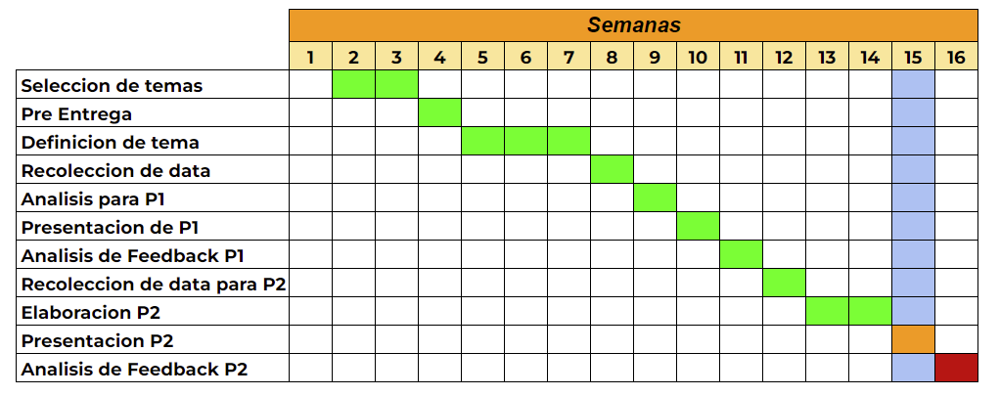

```{r, include=FALSE}
packages <- c(
    "dplyr",
    "readr",
    "tidyverse",
    "corrplot",
    "modeest",
    "ggplot2",
    "car",
    "fitdistrplus"
)

missing.packages = packages[!(packages %in% rownames(installed.packages()))]

if (length(missing.packages) > 0) {
    install.packages(missing.packages)
}
lapply(packages, library, character.only = TRUE)

```

# Introducción

## Relevancia

El alcohol es una sustancia dañina para los estudiantes tanto en el aspecto de salud, como psicológico y de inteligencia. Esto se debe a que el alcohol daña las células cerebrales. Por ende, se busca encontrar tendencias entre variables de la vida académica y social de los alumnos y su consumo de alcohol. Asimismo, se busca ver qué relación tiene el consumo de alcohol con las notas finales de los alumnos.


## Planificación

El proyecto se planificó en base al sílabo y a las indicaciones en clase.



# Datos

## Proceso de recolección de datos

```{r}
DFA <- read_csv("student-mat.csv")
DFB <- read_csv("student-por.csv")
DF2=merge(DFA,DFB,by=c("school","sex","age","address","famsize","Pstatus","Medu","Fedu","Mjob","Fjob","reason","nursery","internet"))
```

Se utilizaron esas variables para fusionar las dos tablas de datos ya que esas son las que distinguen a cada alumno.

Las bases de datos se obtuvieron a través de *kaggle* ([Link a la base de datos](https://www.kaggle.com/datasets/uciml/student-alcohol-consumption?datasetId=251&sortBy=dateRun&tab=collaboration&select=student-mat.csv)). Ésta es una página web en la que se publican bases de datos y se obtuvo de allí ya que ahí se pueden encontrar muchas bases de datos de diferentes temas y las bases de datos grandes tienden a tener más de 200 observaciones.

La estrategia que emplearon los autores de la base de datos fue encuestar a 2 escuelas secundarias públicas de Portugal y recolectaron la data de los alumnos que consumían alcohol y sus notas.

## Población

La población de estudio son estudiantes de secundaria que están cursando matemática y portugués y que consumen alcohol.

## Unidad Muestra

Estudiantes de la escuela portuguesa de matemáticas y ciencias.

## Muestreo

Según la base de datos, se hizo un muestreo aleatorio por conveniencia entre los estudiantes del colegio.

## Tamaño de la muestra

La muestra tendrá un tamaño de 382 observaciones.

```{r}
nrow(DF2)
```

## Variables

### Variables de los datos de estudiantes en el consumo de alcohol

+----------------------------+--------------------+---------------------------------------------------------------------------------------------------------------+
| Variable                   | Tipo               | Restricción                                                                                                   |
+:==========================:+:==================:+:=============================================================================================================:+
| género                     | Categórica nominal | Dos valores, "F" de *female* y "M" de *male*                                                                  |
+----------------------------+--------------------+---------------------------------------------------------------------------------------------------------------+
| edad                       | Numérica discreta  | Entero positivo entre 15 y 22                                                                                 |
+----------------------------+--------------------+---------------------------------------------------------------------------------------------------------------+
| tiempo_viaje_hacia_escuela | Categórica ordinal | Entero positivo entre 1 y 4                                                                                   |
|                            |                    |                                                                                                               |
|                            |                    | 1: menor a 15 minutos, 2: entre 15 a 30 minutos, 3: entre 30 a 60 minutos, 4: más de 1 hora.                  |
+----------------------------+--------------------+---------------------------------------------------------------------------------------------------------------+
| tiempo_estudio_m           | Categórica ordinal | Entero positivo entre 1 y 4 1 - menor que 2 horas, 2 - 2 to 5 horas, 3 - 5 a 10 horas, o 4 - mayor a 10 horas |
+----------------------------+--------------------+---------------------------------------------------------------------------------------------------------------+
| reprobraciones_m           | Numérica discreta  | Entero positivo entre 1 y 4                                                                                   |
+----------------------------+--------------------+---------------------------------------------------------------------------------------------------------------+
| relacion_familiar          | Categórica ordinal | Entero positivo entre 1 y 5 1 - muy malo y 5 - excelente                                                      |
+----------------------------+--------------------+---------------------------------------------------------------------------------------------------------------+
| tiempo_libre               | Categórica ordinal | Entero positivo entre 1 y 5 1 - muy poco y 5 - bastante                                                       |
+----------------------------+--------------------+---------------------------------------------------------------------------------------------------------------+
| faltas_m                   | Categórica ordinal | Entero positivo entre 0 y 93                                                                                  |
+----------------------------+--------------------+---------------------------------------------------------------------------------------------------------------+
| consumo_dia_semana         | Categórica ordinal | Entero positivo entre 1 y 5                                                                                   |
|                            |                    |                                                                                                               |
|                            |                    | 1 - muy bajo y 5 - muy alto                                                                                   |
+----------------------------+--------------------+---------------------------------------------------------------------------------------------------------------+
| consumo_fin_semana         | Categórica ordinal | Entero positivo entre 1 y 5                                                                                   |
|                            |                    |                                                                                                               |
|                            |                    | 1 - muy bajo y 5 - muy alto                                                                                   |
+----------------------------+--------------------+---------------------------------------------------------------------------------------------------------------+
| consumo_total              | Categórica ordinal | Entero positivo entre 1 y 5. Toma el valor del mayor de los 2 consumos que ocurren en la semana               |
|                            |                    |                                                                                                               |
|                            |                    | 1 - muy bajo y 5 - muy alto                                                                                   |
+----------------------------+--------------------+---------------------------------------------------------------------------------------------------------------+
| nota1_m                    | Numérica discreta  | Entero positivo entre 0 y 20                                                                                  |
+----------------------------+--------------------+---------------------------------------------------------------------------------------------------------------+
| nota2_m                    | Numérica discreta  | Entero positivo entre 0 y 20                                                                                  |
+----------------------------+--------------------+---------------------------------------------------------------------------------------------------------------+
| nota_final_m               | Numérica discreta  | Entero positivo entre 0 y 20                                                                                  |
+----------------------------+--------------------+---------------------------------------------------------------------------------------------------------------+
| tiempo_estudio_p           | Categórica ordinal | Entero positivo entre 1 y 4 1 - menor que 2 horas, 2 - 2 to 5 horas, 3 - 5 a 10 horas, o 4 - mayor a 10 horas |
+----------------------------+--------------------+---------------------------------------------------------------------------------------------------------------+
| reprobaciones_p            | Numérica discreta  | Entero positivo entre 1 y 4                                                                                   |
+----------------------------+--------------------+---------------------------------------------------------------------------------------------------------------+
| faltas_p                   | Categórica ordinal | Entero positivo entre 0 y 93                                                                                  |
+----------------------------+--------------------+---------------------------------------------------------------------------------------------------------------+
| nota1_p                    | Numérica discreta  | Entero positivo entre 0 y 20                                                                                  |
+----------------------------+--------------------+---------------------------------------------------------------------------------------------------------------+
| nota2_p                    | Numérica discreta  | Entero positivo entre 0 y 20                                                                                  |
+----------------------------+--------------------+---------------------------------------------------------------------------------------------------------------+
| nota_final_p               | Numérica discreta  | Entero positivo entre 0 y 20                                                                                  |
+----------------------------+--------------------+---------------------------------------------------------------------------------------------------------------+
| Pstatus                    | Categórica nominal | `T` significa que los padres viven juntos y `A` separados                                                     |
+----------------------------+--------------------+---------------------------------------------------------------------------------------------------------------+

## Limpieza de base de datos

### Limpiando las variables del ***Data Frame 1***.

```{r}
names(DF2)
```

Las variables que terminan en `.x` pertenecen a la tabla de datos que contiene información acerca del curso de matemática. Las variables que terminan en `.y` son los datos que pertenecen a la tabla de datos del curso de portugués.

```{r}
DF1 <- dplyr::select(DF2, "sex", "age","traveltime.x", "studytime.x","failures.x","famrel.x", "freetime.x","absences.x", "Dalc.x", "Walc.x", "G1.x", "G2.x", "G3.x", "studytime.y","failures.y", "absences.y", "G1.y", "G2.y", "G3.y")
```

Cabe destacar que no se seleccionaron algunas variables que terminan en `.y` que sí se seleccionaron cuando terminaban en `.x` ya que sus valores no dependen del curso y son dependientes únicamente del alumno por lo que solo se deben de contar una vez por alumno.

Cambiando el nombre de las variables para que sean más comprensibles.

```{r}
DF1 %>% rename(
   "genero" = "sex",
   "edad"="age",
   "tiempo_viaje_hacia_escuela" = "traveltime.x",
   "tiempo_estudio_m" = "studytime.x",
   "reprobaciones_m" = "failures.x",
   "relacion_familiar" = "famrel.x",
   "tiempo_libre" = "freetime.x",
   "faltas_m" = "absences.x",
   "consumo_dia_semana" = "Dalc.x",
   "consumo_fin_semana" = "Walc.x",
   "nota1_m" = "G1.x",
   "nota2_m" = "G2.x",
   "nota_final_m" = "G3.x",
   "tiempo_estudio_p" = "studytime.y",
   "reprobaciones_p" = "failures.y",
   "faltas_p" = "absences.y",
   "nota1_p" = "G1.y",
   "nota2_p" = "G2.y",
   "nota_final_p" = "G3.y"
) -> DF1
```

Cabe destacar que las variables que terminen con `_m` son las variables relacionadas al curso de matemática y las que terminen con `_p` son relacionadas al curso de portugués.

```{r}
DF1$consumo_total= pmax(DF1$consumo_dia_semana,DF1$consumo_fin_semana)
```

Se agrega la variable `consumo_total` la cual toma el mayor de los dos consumos que ocurren durante la semana.

```{r}
names(DF1)
```

```{r}
str(DF1)
```

### Busqueda de NAs en las variables

Como parte de la limpieza de datos vamos a encontrar NAs en las variables de importancia en nuestro proyecto.

```{r}
unique(DF1$genero)
sum(DF1[is.na(DF1$genero),])
```

Parece que no hay ningún error en la variable `genero`.

```{r}
unique(DF1$edad)
sum(DF1[is.na(DF1$edad),])
```

Parece que no hay ningún error en la variable `edad`.

```{r}
unique(DF1$tiempo_viaje_hacia_escuela)
sum(DF1[is.na(DF1$tiempo_viaje_hacia_escuela),])
```

Parece que no hay ningún error en la variable `tiempo_viaje_hacia_escuela`.

```{r}
unique(DF1$tiempo_estudio_m)
sum(DF1[is.na(DF1$tiempo_estudio_m),])

unique(DF1$tiempo_estudio_p)
sum(DF1[is.na(DF1$tiempo_estudio_p),])
```

Parece que no hay ningún error en las variables `tiempo_estudio_m` y `tiempo_estudio_p`.

```{r}
unique(DF1$reprobaciones_m)
sum(DF1[is.na(DF1$reprobaciones_m),])

unique(DF1$reprobaciones_p)
sum(DF1[is.na(DF1$reprobaciones_p),])
```

Parece que no hay ningún error en las variables `reprobaciones_m` y `reprobaciones_p`.

```{r}
unique(DF1$relacion_familiar)
sum(DF1[is.na(DF1$relacion_familiar),])
```

Parece que no hay ningún error en la variable `relacion_familiar`.

```{r}
unique(DF1$tiempo_libre)
sum(DF1[is.na(DF1$tiempo_libre),])
```

Parece que no hay ningún error en la variable `tiempo_libre`.

```{r}
unique(DF1$faltas_m)
sum(DF1[is.na(DF1$faltas_m),])

unique(DF1$faltas_p)
sum(DF1[is.na(DF1$faltas_p),])
```

Parece que no hay ningún error en las variables `faltas_m` y `faltas_p`.

```{r}
unique(DF1$consumo_dia_semana)
sum(DF1[is.na(DF1$consumo_dia_semana),])
```

Parece que no hay ningún error en la variable `consumo_dia_laborables`.

```{r}
unique(DF1$consumo_fin_semana)
sum(DF1[is.na(DF1$consumo_fin_semana),])
```

Parece que no hay ningún error en la variable `consumo_fin_semana`.

```{r}
unique(DF1$nota1_m)
sum(DF1[is.na(DF1$nota1_m),])

unique(DF1$nota1_p)
sum(DF1[is.na(DF1$nota1_p),])
```

Parece que no hay ningún error en las variables `nota1_m` y `nota1_p`.

```{r}
unique(DF1$nota2_m)
sum(DF1[is.na(DF1$nota2_m),])

unique(DF1$nota2_p)
sum(DF1[is.na(DF1$nota2_p),])
```

Parece que no hay ningún error en las variables `nota2_m` y `nota2_p`.

```{r}
unique(DF1$nota_final_m)
sum(DF1[is.na(DF1$nota_final_m),])

unique(DF1$nota_final_p)
sum(DF1[is.na(DF1$nota_final_p),])
```

Parece que no hay ningún error en las variables `nota_final_m` y `nota_final_p`.

```{r}
sum(is.na(DF1))
```

Parece que no hay ningún Na en el *Data Frame 1* . Procederemos con el análisis descriptivo de el Data Frame.

# Análisis Descriptivo

```{r}
table(DF1$genero)
```

No hay una gran diferencia entre la cantidad de mujeres y de hombres. En la base de datos hay **198** Mujeres y **184** hombres.

Como primer paso para describir las relaciones entre variables vamos a identificar las correlaciones entre variables.

```{r}
DF_sin_genero <- DF1 %>% dplyr::select(-1)
```

```{r}
correlaciones = cor(DF_sin_genero)
corrplot(correlaciones,tl.cex=0.7,title="Matriz de Correlaciones",tl.col="Black",col=colorRampPalette(c("blue","lightblue","red"))(255))
```

Se observa que hay una correlación positiva fuerte entre el tiempo que estudian matemática y el tiempo que estudian portugués. Esto puede significar que puede haber una relación entre el tiempo que los estudiantes estudian matemática y portugués.

También hay una correlación positiva relativamente fuerte entre el consumo de alcohol en día de semana con el consumo de alcohol en fin de semana.

Asimismo, se observa que hay una correlación positiva relativamente fuerte entre las notas obtenidas por los alumnos en ambos cursos. Existe una relación lineal entre las notas de ambos cursos.

En el caso de las faltas en los cursos de matemáticas y portugués, tienen una correlación medianamente fuerte.

De igual manera, la cantidad de reprobaciones en el curso tiene una correlación negativa relativamente fuerte con la nota de los alumnos.

Destaca el hecho de que el consumo de alcohol, sea en día de semana o fin de semana, no tiene una correlación fuerte con las notas de matemática.

## Notas de Portugués

Ahora analizaremos a la variable nota final en el curso de portugués en función a lo respondido en la variable consumo durante el día de semana.

Las variables consumo durante día de semana, fin de semana y total, están en la escala Likert. Donde:

-   1 -\> Poco consumo de alcohol.

-   5 -\> Alto consumo de alcohol.

A partir de ahora, se considerará a las notas que sean mayores a cero debido a que no se sabe la razón por la que el alumno tiene una nota de cero y porque deseamos ver si las relaciones se vuelven más claras al remover las notas de 0.

```{r}
par(mfrow=c(1,2))
boxplot(DF1$nota_final_p[DF1$nota_final_p > 0]~DF1$consumo_dia_semana[DF1$nota_final_p > 0], names=c("1", "2", "3", "4", "5"), col="green", xlab="Consumo durante dia de semana", ylab="Nota final de portugues", varwidth = TRUE)
boxplot(DF1$nota_final_p[DF1$nota_final_p > 0]~DF1$consumo_fin_semana[DF1$nota_final_p > 0], names=c("1", "2", "3", "4", "5"), col="green", xlab="Consumo durante fin de semana", ylab="Nota final de portugues",varwidth=TRUE)
```

En el eje X de los boxplots podemos ver el consumo de alcohol de los estudiantes durante el día de semana donde 1 es muy bajo y 5 es muy alto. En el eje Y tenemos la nota de los estudiantes en el curso de Portugués. La anchura de las cajas esta en función de la cantidad de estudiantes que contestaron.

Como podemos ver en las gráficas,hay una clara tendencia de que la mediana decrece conforme la cantidad de alcohol consumido aumenta. Esto implica que un estudiante que consume bastante alcohol tiende a sacar una nota más baja comparado a uno que consume menos alcohol. Esta tendencia se aprecia mejor en la gráfica de la izquierda. De igual manera, podemos observar que el tercer cuartil se encuentra en una nota más alta cuando el consumo es menor por lo que los estudiantes que consumen menos alcohol tienden a tener una nota más alta. Por ejemplo, se puede observar en la gráfica de la izquierda que una nota de 17, aproximadamente, es un dato atípico para el boxplot del medio, mientras que esta dentro del rango intercuartil para el boxplot de más a la izquierda.

Igualmente, se observa que a medida que la cantidad de alcohol consumido aumenta, la cantidad de personas disminuye. Esto se puede observar en la anchura de los boxplots. Se observa que la anchura de los boxplots, para el consumo durante día de semana, disminuye significativamente a medida que aumenta el consumo, esto significa que hay pocos estudiantes que consumen mucho alcohol durante los días de semana. Por otro lado, la anchura de los boxplots del consumo durante el fin de semana disminuye, pero de manera más sutil. Esto significa que los estudiantes, que tomaban poco durante día de semana, ahora toman más durante el fin de semana.

```{r echo=FALSE}
DF1[DF1$nota_final_p>0,] %>% group_by(consumo_dia_semana) %>% summarize(n=n())
```

```{r echo=FALSE}
DF1[DF1$nota_final_p > 0,] %>% group_by(consumo_dia_semana) %>% summarise_at(vars(nota_final_p),list(name=mean))
```

Nota final de Portugués vs Consumo durante día de semana

+---------------+-------------------------+---------------+
| Consumo       | Numero de observaciones | Media         |
+:=============:+:=======================:+:=============:+
| 1             | 266                     | 13.0451       |
+---------------+-------------------------+---------------+
| 2             | 72                      | 12.2222       |
+---------------+-------------------------+---------------+
| 3             | 24                      | 11.2917       |
+---------------+-------------------------+---------------+
| 4             | 6                       | 10.0000       |
+---------------+-------------------------+---------------+
| 5             | 9                       | 11.1111       |
+---------------+-------------------------+---------------+

```{r echo=FALSE}
DF1[DF1$nota_final_p>0,] %>% group_by(consumo_fin_semana) %>% summarize(n=n())
```

```{r echo=FALSE}
DF1[DF1$nota_final_p > 0,] %>% group_by(consumo_fin_semana) %>% summarise_at(vars(nota_final_p),list(name=mean))
```

Nota final de Portugués vs Consumo durante fin de semana

+---------------+-------------------------+---------------+
| Consumo       | Numero de observaciones | Media         |
+:=============:+:=======================:+:=============:+
| 1             | 146                     | 13.1027       |
+---------------+-------------------------+---------------+
| 2             | 84                      | 12.8691       |
+---------------+-------------------------+---------------+
| 3             | 73                      | 12.8630       |
+---------------+-------------------------+---------------+
| 4             | 48                      | 11.5000       |
+---------------+-------------------------+---------------+
| 5             | 26                      | 11.3846       |
+---------------+-------------------------+---------------+

```{r}
boxplot(DF1$nota_final_p[DF1$nota_final_p > 0]~DF1$consumo_total[DF1$nota_final_p > 0], names=c("1", "2", "3", "4", "5"), col="green", xlab="Consumo total", ylab="Nota final de portugues", varwidth = TRUE)
```

Nuevamente podemos observar que la media disminuye a medida que aumenta el consumo. Se observa que la gráfica de *Consumo total vs Nota final de Portugués* se asemeja mucho a la de *Consumo durante fin de semana vs Nota final de Portugués*. Esto se puede explicar si es que vemos la tendencia de consumo. Es decir, ver si hay una tendencia a consumir más durante el día de semana o durante el fin de semana.

```{r echo=FALSE}
DF1[DF1$nota_final_p>0,] %>% group_by(consumo_total) %>% summarize(n=n())
```

```{r echo=FALSE}
DF1[DF1$nota_final_p>0,] %>% group_by(consumo_total) %>% summarise_at(vars(nota_final_p),list(name=mean))
```

Nota final de Portugués vs Consumo total

+---------------+-------------------------+---------------+
| Consumo       | Numero de observaciones | Media         |
+:=============:+:=======================:+:=============:+
| 1             | 144                     | 13.1319       |
+---------------+-------------------------+---------------+
| 2             | 85                      | 12.8706       |
+---------------+-------------------------+---------------+
| 3             | 74                      | 12.8108       |
+---------------+-------------------------+---------------+
| 4             | 48                      | 11.5000       |
+---------------+-------------------------+---------------+
| 5             | 26                      | 11.3846       |
+---------------+-------------------------+---------------+

## Notas de Matemática

```{r}
par(mfrow=c(1,2))
boxplot(DF1$nota_final_m[DF1$nota_final_m>0]~DF1$consumo_dia_semana[DF1$nota_final_m>0], names=c("1", "2", "3", "4", "5"), col="yellow", xlab="Consumo durante dia de semana", ylab="Nota final de matemática", varwidth=TRUE)
boxplot(DF1$nota_final_m[DF1$nota_final_m>0]~DF1$consumo_fin_semana[DF1$nota_final_m>0], names=c("1", "2", "3", "4", "5"), col="yellow", xlab="Consumo durante fin de semana", ylab="Nota final de matemática", varwidth=TRUE)
```

En el eje X de los boxplots podemos ver el consumo de alcohol de los estudiantes durante el día de semana donde 1 es muy bajo y 5 es muy alto. En el eje Y tenemos la nota de los estudiantes en el curso de Portugués. La anchura de las cajas esta en función de la cantidad de estudiantes que contestaron. Nuevamente se observa que a medida que aumenta el consumo de alcohol, los boxplots se hacen más angostos debido a que hay una menor cantidad de estudiantes. En la gráfica de consumo durante día de semana la cantidad de estudiantes disminuye sustancialmente a medida que la cantidad de consumo aumenta, sin embargo, en la gráfica de consumo durante fin de semana hay una distribución más equitativa de la cantidad de alumnos entre las diferentes categorías de consumo de alcohol.

En el caso de la gráfica de la izquierda, no se observa una tendencia clara entre la mediana y el consumo de alcohol. Sin embargo, en la gráfica de la derecha se puede observar que la mediana decrece a medida que aumenta el consumo de alcohol. Esto se debe a que en la gráfica de la izquierda, los grupos que tienden a consumir bastante tienen pocas observaciones por lo que su variación es grande. Sin embargo, en la gráfica de la derecha los grupos son más equitativos en la cantidad de observaciones por lo que ahí sí se puede observar la tendencia de que las notas tienden a disminuir a medida que aumenta el consumo de alcohol.

```{r echo=FALSE}
DF1[DF1$nota_final_m>0,] %>% group_by(consumo_dia_semana) %>% summarize(n=n())
```

```{r echo=FALSE}
DF1[DF1$nota_final_m>0,] %>% group_by(consumo_dia_semana) %>% summarise_at(vars(nota_final_m),list(name=mean))
```

Nota final de matemática vs Consumo durante día de semana

+---------------+-------------------------+---------------+
| Consumo       | Numero de observaciones | Media         |
+:=============:+:=======================:+:=============:+
| 1             | 241                     | 11.8838       |
+---------------+-------------------------+---------------+
| 2             | 62                      | 10.8226       |
+---------------+-------------------------+---------------+
| 3             | 23                      | 11.1739       |
+---------------+-------------------------+---------------+
| 4             | 8                       | 10.0000       |
+---------------+-------------------------+---------------+
| 5             | 9                       | 10.6667       |
+---------------+-------------------------+---------------+

```{r echo=FALSE}
DF1[DF1$nota_final_m>0,] %>% group_by(consumo_fin_semana) %>% summarize(n=n())
```

```{r echo=FALSE}
DF1[DF1$nota_final_m>0,] %>% group_by(consumo_fin_semana) %>% summarise_at(vars(nota_final_m),list(name=mean))
```

Nota final de matemática vs Consumo durante fin de semana

+---------------+-------------------------+---------------+
| Consumo       | Numero de observaciones | Media         |
+:=============:+:=======================:+:=============:+
| 1             | 126                     | 12.2222       |
+---------------+-------------------------+---------------+
| 2             | 73                      | 11.8082       |
+---------------+-------------------------+---------------+
| 3             | 73                      | 11.2055       |
+---------------+-------------------------+---------------+
| 4             | 46                      | 10.2826       |
+---------------+-------------------------+---------------+
| 5             | 25                      | 11.0000       |
+---------------+-------------------------+---------------+

```{r}
boxplot(DF1$nota_final_m[DF1$nota_final_m>0]~DF1$consumo_total[DF1$nota_final_m>0]
        , names=c("1", "2", "3", "4", "5")
        , col="yellow", xlab="Consumo total", ylab="Nota final de matemática",varwidth=TRUE)
```

En consumo total vemos que esta en la escala liker, se le pregunto a los estudiantes que tanto toman los fines de semana y los días de semana . En la variable Y están las notas en el curso de matemática. Como podemos ver, las medianas decrecen un poco, sin embargo necesitaríamos pruebas estadísticas para verificar esto.

En el nuevo boxplot se puede observar una disminución de la media de notas del curso de matemáticas mientras mayor es el consumo total de alcohol por cada grupo de clase; ese decir, el alcohol afecta directamente a las notas cada grupo, sin embargo este cambio no es igual en cada persona porque se puede observar que algunas notas se llegan a mantenerse (los extremos de las cajas, siendo las personas que poco les influye el alcohol). Entonces, el análisis puede llegar a ser un poco ambiguo (desde un punto de vista específico), pero se mantiene la tendencia bajista de la nota en cada grupo, mientras consume más cantidad de alcohol (esto se observa cuando se le da un enfoque a la media).

```{r}
DF1[DF1$nota_final_m>0,] %>% group_by(consumo_total) %>% summarize(n=n())
```

```{r}
DF1[DF1$nota_final_m>0,] %>% group_by(consumo_total) %>% summarise_at(vars(nota_final_m),list(name=mean))
```

Nota final de matemática vs Consumo total

+---------------+-------------------------+---------------+
| Consumo       | Numero de observaciones | Media         |
+:=============:+:=======================:+:=============:+
| 1             | 126                     | 12.2222       |
+---------------+-------------------------+---------------+
| 2             | 71                      | 11.8169       |
+---------------+-------------------------+---------------+
| 3             | 73                      | 11.3014       |
+---------------+-------------------------+---------------+
| 4             | 48                      | 10.1875       |
+---------------+-------------------------+---------------+
| 5             | 25                      | 11.0000       |
+---------------+-------------------------+---------------+

```{r}
smoothScatter(DF1$consumo_dia_semana, DF1$consumo_fin_semana,xlab="Consumo durante dia de semana",ylab="Consumo durante fin de semana")
```

Se observa que hay una tendencia clara de que la cantidad de estudiantes disminuye a medida que la cantidad de alcohol consumida aumenta. Asimismo, las personas que consumen mucho durante el fin de semana también consuman bastante durante los días de semana. De igual manera, las personas que consumen poco durante el fin de semana también consumen poco durante el día de semana. Por otro lado, se observa que la mayoría de los estudiantes tienden a consumir menos durante día de semana y consumen igual o más durante el fin de semana. Esto implica que la variable `consumo_total` sea prácticamente igual a la variable `consumo_fin_semana` y esa es la razón por la que las gráficas de estas dos variables sean muy similares.

```{r}
smoothScatter(DF1$nota_final_m[DF1$nota_final_m>0 & DF1$nota_final_p>0],DF1$nota_final_p[DF1$nota_final_m>0 & DF1$nota_final_p>0], xlab = "Nota final de Matemática",ylab="Nota final de Portugués")
abline(lm(DF1$nota_final_p ~ DF1$nota_final_m), col = "red", lwd = 3)
```

En esta gráfica se intenta buscar una relación entre dos cursos, matemática y portugués. Es aquí donde se observa un incremento lineal en cuanto a las notas de ambos cursos; es decir, si a un grupo de estudiantes les va bien en el curso de matemática lo más probable es que le vaya bien en el curso de portugués. Asimismo, los puntos son atenuados por ciertas zonas (aumenta el tono oscuro cuando se repiten ciertos puntos), donde se aprecia mayor frecuencia de notas.

```{r}
lm(DF1$nota_final_p[DF1$nota_final_m>0 & DF1$nota_final_p>0] ~ DF1$nota_final_m[DF1$nota_final_m>0 & DF1$nota_final_p>0])->r1
summary(r1)
```

Acá vemos el Coeficiente de determinación R\^2 que es de un 32 %. Si bien es bajo, podemos decir que la nota puede ser una combinación de variables y que una sola, como en este caso lo es la nota final de matemáticas, pueda representar el 32 % de la ecuación de regresión, entonces decimos que es significativa. La nota de matemática se puede usar como factor para predecir la nota de Portugués. Un estudiante aplicado en matemática también lo sera en portugués.

```{r}
cor(DF1$nota_final_m[DF1$nota_final_m>0 & DF1$nota_final_p>0],DF1$nota_final_p[DF1$nota_final_m>0 & DF1$nota_final_p>0])
```

Usando correlación podemos ver que existe una correlación relativamente fuerte entre las variables nota de matemática y nota de portugués.

```{r}
par(mfrow=c(1,3))
mosaicplot(table(DF1$genero,DF1$consumo_dia_semana),main="Sexo vs. Consumo en día de semana")
mosaicplot(table(DF1$genero,DF1$consumo_fin_semana),main="Sexo vs. Consumo en fin de semana")
mosaicplot(table(DF1$genero,DF1$consumo_total),main="Sexo vs. Consumo total")
```

En ambos géneros hay una clara tendencia de que la cantidad de personas que hay en cada bloque disminuye conforme aumenta la cantidad de alcohol que toman. No parece haber una relación entre la cantidad consumida de alcohol en día de semana por parte de las mujeres con el de los hombres. Por otro lado, la cantidad de alcohol que toman los hombres parece ser mayor ya que los bloques inferiores son más grandes para los hombres.

En el caso del consumo de alcohol durante el fin de semana, se observa que las mujeres tienen una tendencia muy parecida a comparación de su consumo de alcohol durante día de semana ya que a medida que aumenta el consumo de alcohol, los bloques disminuyen en tamaño. No obstante, se observa que los bloques donde hay un mayor consumo de alcohol son más grandes durante el fin de semana por lo que las mujeres tienden a consumir más alcohol durante el fin de semana. Por otro lado, se observa que los hombres tienen una distribución más uniforme en este caso a comparación de su consumo de alcohol durante los días de semana. Esto implica que la cantidad de alcohol consumida por los hombres aumenta durante los fines de semana. Asimismo,tampoco parece haber una relación entre los hombres y mujeres en relación a la cantidad consumida de alcohol durante los fines de semana.

Se observa que la gráfica de consumo total es prácticamente idéntica a la del consumo durante el fin de semana y esto se debe a que la variable `consumo_total` toma el mayor de los dos consumos y los estudiantes tienden a tomar más durante el fin de semana. Esto también lo observamos en las gráficas superiores.

# Análisis probabilístico

Según la OMS, uno de los posibles factores que desencadenan el consumo de alcohol en adolescentes son los problemas en el seno familiar. Problemas en casa y el crecimiento en familias disfuncionales pueden causar que el adolescente se refugie en hábitos dañinos como el uso excesivo de alcohol.

En la base de datos existe una variable interesante, Pstatus nos dice si los estudiantes conviven con sus dos padres o solo con uno.

-   **T -\> Padres viven juntos**

-   **A -\> Padres viven separados**

Entendemos que no siempre puede ser el caso de que los padres vivan separados por problemas, sin embargo creemos que es un buen comienzo para este análisis probabilístico.

```{r}

VivenT <- filter(DFB,DFB$Pstatus == "T")
VivenA <- filter(DFB,DFB$Pstatus == "A")

```

## Probabilidad empírica discreta

Ahora nos preguntaremos como se distribuye la Variable Estado de Cohabitación de padres.

Usaremos un histograma para ver como se distribuye

```{r echo=FALSE}
ggplot(DFB) +
  aes(x = Pstatus) +
  geom_bar(fill = "#112446") +
  labs(
    x = "Estado",
    y = "Cantidad",
    title = "Estado de Cohabitación de los padres"
  ) +
  ggthemes::theme_calc() +
  theme(
    plot.title = element_text(size = 24L,
    face = "bold",
    hjust = 0.5)
  )
```

Usaremos probabilidad empírica para tener una idea de la probabilidad.

```{r}
VivenT <- filter(DFB,DFB$Pstatus == "T")
VivenA <- filter(DFB,DFB$Pstatus == "A")
(ProbEstadoT <-nrow(VivenT)/nrow(DFB))
(ProbEstadoA <- nrow(VivenA)/nrow(DFB))
```

La probabilidad de que un estudiante, elegido al azar, viva con los dos padres es de **88%** y que viva con solo un padre es de **12%.**

## Ausencias

Esta variable nos habla de la cantidad de ausencias durante el año escolar, la variable es numérica discreta que va de 0 hasta 93. Previamente fue definida como la variable `faltas.`

Veremos la densidad de la variable.

```{r}
hist(DFB$absences, main="Histograma de días de clase ausentes.")

```

La variable habla de una cantidad de eventos durante un intervalo de tiempos.Ademas, podemos decir que una falta influye en la siguiente falta a clases Según teoría se asemeja a lo que la distribución Poisson.

Como sabemos los parámetros de la Distribución Poisson solo es lambda y para estimar este parámetro usaremos la función fitdist de la librería fitdistplus

```{r}
fitdist(DFB$absences, distr = "pois")
```

La librería nos da el parámetro Lambda de **3.66.** Con este dato podemos realizarnos preguntas acerca de las ausencias de los estudiantes en el estudio.

Si escogemos un estudiante al azar, ¿Cuál es la probabilidad de que este falto mas de 3 veces en el año?

```{r}
ppois(3,3.66,lower.tail = FALSE)
```

Ahora veremos si un estudiante que toma mas alcohol que el promedio falta mas a clases.

La variable Alcohol en fin de semana es una variable que esta en la escala Likert (1 mas bajo - 5 muy alto)

Definiremos el promedio como el punto de inflexión para determinar si un estudiante consume alcohol en mayor medida o menor medida. Dependiendo si esta por debajo del promedio o por encima.

```{r}
(promedioA <- mean(DFB$Walc))
```

```{r}

promedioAlcoholicos <- filter(DFB, DFB$Walc > promedioA)
fitdist(promedioAlcoholicos$absences, distr = "pois")
```

Es interesante ver que los estudiantes que toman mas alcohol semanalmente tienen un Lambda mayor, es decir, en promedio faltan mas a clase.

Ahora nos preguntaremos si la probabilidad de que un estudiante que toma mas alcohol que el promedio faltó mas de 3 veces al año .

```{r}

ppois(3,4.3968,lower.tail = FALSE)
```

Efectivamente vemos que **la probabilidad de que un estudiante faltó mas de 3 veces** en estudiantes que toman alcohol en menor medida es menor a la de los estudiantes que toman alcohol en mayor medida.

-   **Toman poco alcohol -\> 36%**

-   **Toman mas alcohol que el promedio -\> 64%**

## Notas

Ahora analizaremos las notas de los estudiantes. La base de datos cuenta con 3 variables; G1, G2 y G3.

Cada G simboliza un periodo académico. Ahora sacaremos un promedio de estas 3 notas para tener un indicador de notas en total del año académico

```{r}
NotasCompletas <- mutate(DFB,NotasFinal = (DFB$G1 + DFB$G2 + DFB$G3)/3)
Notas <- NotasCompletas$NotasFinal
NotasSinOutliers <- Notas[!Notas %in% boxplot.stats(Notas)$out]
```

```{r}
hist(NotasSinOutliers, main = "Histograma de Notas",xlab = "Promedio de Notas")
```

Como podemos observar, las notas parecen asemejarse a una distribución normal. La variable es numérica continua y podemos modelarla como normal. Usaremos la función qqPlot de la librería car para verificar si existe normalidad en los datos. Esto se verifica si la mayoría de puntos caen dentro del rango azul.

```{r}
qqPlot(NotasSinOutliers)
```

Al ultimo podemos apreciar una ligera discordancia entre la variable normal generada y nuestra variable. Esto es debido a que existe una cantidad de estudiantes que obtienen 20 de promedio y esto hace que, en la ultima cola de la distribución, los datos no hagan un buen "Fit".

Ahora descubriremos los parámetros para caracterizar la variable.

Usaremos la función fitdistplus para obtener los parámetros de la distribución.

```{r}
fitdist(NotasSinOutliers,"norm")
```

Ahora podemos caracterizar la variable como Variable aleatoria distribuida normalmente con parámetros media : **11.77** y Desviación estándar **2.5.**

Ahora nos haremos preguntas acerca de las notas y la relación con el consumo de alcohol.

La nota aprobatoria en esta escuela es 11. La primera pregunta que nos podemos hacer es si es mas probable para un estudiante que ingiere mas alcohol que su promedio este entre el rango de aprobación.

¿Cual es la probabilidad de que un estudiante, al azar, que ingiera mas alcohol que el promedio tenga notas dentro del rango aprobatorio?

Probabilidad de que un estudiante que ingiera menos alcohol que el promedio tenga promedio aprobatorio.

```{r}
promedioNoAlcoholicos <- filter(NotasCompletas, NotasCompletas$Walc < promedioA & NotasCompletas$Dalc < promedioA)
promedioAlcoholicos <- filter(NotasCompletas, NotasCompletas$Walc > promedioA & NotasCompletas$Dalc < promedioA)

```

Caracterizar los parametros de la variable aleatoria que define a los estudiantes que toman menos alcohol que el promedio.

```{r}
fitdist(promedioNoAlcoholicos$NotasFinal,"norm")
```

Estudiantes que no toman mucho alcohol -\> Promedio = 12 ; Desviación estándar = 2.7

Caracterizar a la variable aleatoria :Notas de los estudiantes que toman menos alcohol que el promedio

```{r}
fitdist(promedioAlcoholicos$NotasFinal,"norm")
```

Estudiantes que Si toman mucho alcohol -\> Promedio = 12.36 ; Desviación estándar = 2.8.

Probabilidad de que NO alcohólico saque de 11 a 20

```{r}
 pnorm(11,12,2.7,lower.tail = FALSE) 
```

Probabilidad de que alcohólico saque de 11 a 20

```{r}
pnorm(11,11.06,2.8,lower.tail = FALSE) 
```

Como podemos observar, la probabilidad de que un estudiante que consume mas alcohol que el promedio es mayor por casi 10% (64% vs 50%).

Para comprobar si existe una diferencia significativa tendríamos que realizar una prueba de hipótesis. Si existe una diferencia significativa entre los dos grupos de estudiantes.

# Conclusiones

En el estudio hemos analizado principalmente cuatro variables que son las notas , el consumo de alcohol , los ausentismos y si los adolescentes encuestados vivían con sus padres o no, ya que estas genuinamente nos brindan más información sobre lo que nosotros queremos que se evidencie en nuestro proyecto. Los estudiantes dedican el mismo tiempo de estudio a cada curso. Además, los alumnos no mejoran su rendimiento académico en el curso aunque lo lleven una o más veces. Asimismo, hay una relación entre las notas de matemática y portugués ya que su correlación es relativamente fuerte. De igual manera, el consumo de alcohol genera que las notas de los estudiantes empeore debido a que cuando consumen más alcohol, su nota tiende a ser peor. No parece haber una relación en el consumo de alcohol entre las mujeres y los hombres ya sea durante el fin de semana, día de semana o consumo total. Asimismo, los hombres tienden a consumir más alcohol que las mujeres. De igual manera, la tendencia de los estudiantes es de incrementar su consumo de alcohol durante los fines de semana. Además los estudiantes que toman mas alcohol semanalmente , en promedio faltan mas a clase, y agregar que las notas parecían asemejarse a una distribución normal,pero existe una cantidad de estudiantes que obtienen 20 de promedio y esto hace que, no podamos comparar los resultados entre las distribuciones analizadas mediante una calificación.
