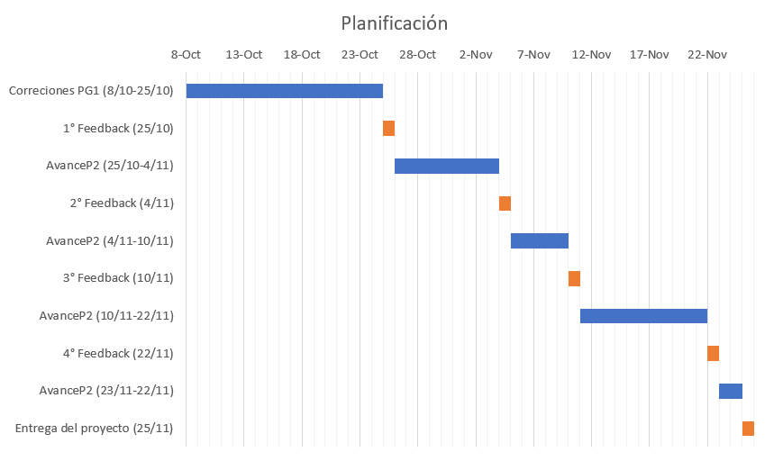

```{r Base de datos y librerías importadas, include=FALSE}
#install.packages("vioplot")
library(dplyr)
library(ggplot2)
library(modeest)
library("vioplot")
DF <- read.csv("Valoración de áreas verdes urbanas.csv", encoding="UTF-8")
```

# **Introducción**

Las áreas verdes urbanas son espacios de recreación y convivencia que ayudan en la disminución de gases de efecto invernadero en la atmósfera, la modificación o estabilidad de microclimas, la calidad del aire a través de la cobertura vegetal. Actualmente, las grandes ciudades como Lima se ven afectadas por la falta de estas áreas y la mala conservación de las existentes. 

La valoración económica ambiental es una herramienta que nos permite asignar valores monetarios a los bienes y servicios proporcionados por los recursos naturales que son aprovechados por el hombre (Ministerio del Ambiente, 2015). En otras palabras, refleja la importancia que tienen los servicios ecosistémicos para la población. Gracias a esta herramienta, la toma de decisiones con respecto al cuidado sostenible del medio ambiente y a la conservación de recursos naturales se facilita.


## Relevancia:

Las áreas verdes urbanas se ven cada vez más afectadas por la acción humana, sin embargo, aún siendo un tema tan presente en nuestra sociedad, se habla poco de él, por esto, a través del presente proyecto queremos averiguar si la comunidad estudiantil de UTEC es consciente del valor que estos ambientes tienen.

## Objetivos de estudio

- Observar la valoración que le dan los estudiantes de UTEC a las áreas verdes urbanas en términos monetarios y ambientales.
- Buscar si existe alguna relación entre la valoración-género y comparar con otros estudios.
- Encontrar qué carreras en UTEC son las que más valoran las áreas verdes.
- Analizar de manera general y buscar la relación que puede haber entre la valoración y las diversas variables obtenidas en el estudio.
- Encontrar cuál sería el perfil de un estudiante ideal que valora más y el que valora menos las áreas verdes.
- Analizar el tiempo que demora una persona en llevar al parque más cercano desde su vivienda y comparar con las recomendaciones de la Organización mundial de la Salud para evaluar que tan urgente es promover la creación de áreas verdes en Lima.
- Hallar las probabilidades de valoración ambiental por carrera.
- Plantear escenarios imaginarios de apoyo en actividades medioambientales (voluntariados) para evaluar qué tanto apoyo hay por parte de los alumnos a este tipo de actividades.

## Planificación:

Este diagrama de Gantt muestra las actividades realizadas desde la entrega de la PG1
```{r, echo=FALSE, fig.align='center', out.width="80%"}

```

# **Datos**

## Recolección de datos

Para la recolección de datos primero se investigó la cantidad de alumnos matriculados en el semestre 2022-2 por carrera. Una vez obtenida esta información, se sacó la proporción de cantidad de encuestados por carrera en base a 200 muestras como mínimo. Esto se realizó para asegurar que la muestra sea representativa; sin embargo, esta cifra solo se usó como referencia, por lo que al final se obtuvieron más muestras para algunas carreras. Una vez concluido este proceso, se procedió a compartir la encuesta por los diferentes grupos de cada carrera, ofreciendo un incentivo que animará a los alumnos a completarla. Después de unos días de haber compartido la encuesta, se observó que las muestras eran pocas y por los plazos de entrega ya se debía empezar a trabajar la base de datos, razón por la cual se aceleró el proceso de recolección encuestando de manera personal a los alumnos durante los días que quedaban. Para la recolección de datos de manera personal no se tuvo una consideración con respecto al lugar donde se buscaría alumnos, por lo que se encuestó por todos los pisos de la universidad; sin embargo, se frecuentó más el piso 1 y 6 debido a que suele haber una mayor concentración de alumnos ahí. Finalmente, todos los integrantes encuestamos de manera individual o en parejas, dependiendo de la disponibilidad de los integrantes. 

Un punto a considerar es que, como se mencionó al inicio, se excedieron las 200 muestras debido a que solo se contabilizaba la cantidad de encuestados por carrera al final del día. Debido a esto, cuando se conseguía la cantidad de muestras para una carrera durante el día, algunos compañeros siguieron completando la encuesta de forma virtual (lo que compartimos por los grupos de Whatsapp o Telegram) sin saber que ya no era necesario. 

## Población, muestra y muestreo

Población: 3692 estudiantes de pregrado de UTEC matriculados en el semestre 2022-2.

Muestra: 232 estudiantes de pregrado de UTEC matriculados en el semestre 2022-2. 

Unidad muestral: Alumno de pregrado de UTEC matriculado en el semestre 2022-2. 

Muestreo: Por conveniencia, se considera este tipo de muestreo debido a que encuestamos alumnos en base a nuestra disponibilidad y las consideraciones que tomamos sobre la concentración de alumnos en ciertos pisos. También por la elección de algunos encuestados por parte de nosotros (amigos o compañeros cercanos).


## Variables

Variables      | Descripción                                                   | Tipo
-------------- | --------------------------------------------------------------------------------------------------------------- | -----
Edad            | Edad actual de un alumno de UTEC (en años)                             | Cuantitativa discreta
Género          | Género con el que un alumno de UTEC se identifica, donde el 53% de los encuestados son hombres.     | Cualitativa nominal
Carrera         | Carrera de pregrado que estudia un alumno de UTEC, donde el 17% de los encuestados son de la carrera de ingeniería industrial. | Cualitativa nominal
Ciclo           | Ciclo actual en el que se encuentra el alumno, donde el 31% de los encuestados son de tercer ciclo.| Cualitativa jerárquica
Procedencia     | Lugar de nacimiento o lugar donde un alumno de UTEC se crió, donde el 56% de los encuestados son de Lima.|Cualitativa nominal
Distrito      | Distrito donde vive actualmente, donde el 17% de los encuestados actualmente viven en Barranco.            | Cualitativa nominal
Tiempo_Lima     | Tiempo que el estudiante lleva viviendo en Lima.                | Cuantitativa continua
Tiempo          | Tiempo que se tarda un alumno de UTEC en llegar al parque más cercano a su localidad (en minutos)   | Cuantitativa continua
Tiempo_encuesta | Tiempo que invertirían en rellenar otra encuesta sobre el tema.   |      Cuantitativa continua
Parques         | Cantidad de parques aledaños a su vivienda.  |   Cuantitativa discreta
Calificación_1  | Calificación de los parques aledaños a su lugar de residencia. Donde el 33% de los encuestados dieron una valoración media.|  Cualitativa jerárquica
Calificación_2  | Calificación de los parques cercanos a la universidad, donde el 39% de los encuestados dieron una valoración entre media y alta.|  Cualitativa jerárquica
Valoración      | Importancia que le da el estudiante a las áreas verdes, donde el 49% de los encuestados dieron la valoración más alta.|Cualitativa jerárquica
Dinero          | Cantidad de dinero que un estudiante de UTEC estaría dispuesto a pagar para la conservación de un parque mensualmente. | Cuantitativa discreta


## Limpieza de datos

En la encuesta realizada usamos preguntas con alternativas y especificamos los tipos de respuesta que debían colocar para evitar errores. En este caso, tenemos dos observaciones iniciales que se realizaron de prueba, es por esto que eliminaremos las dos primeras observaciones.

Contamos con una pregunta donde deben ingresar el tiempo que viven en Lima, para este caso nosotros dimos una opción para llenar años, en caso lleven más de un año en Lima, y otra para meses, en caso lleven menos de un año en Lima. En esta pregunta hubo algunas personas que ingresaron una respuesta correspondiente a meses mayor a doce. Según verificamos, estos datos son erróneos ya que ya habían llenado la respuesta en la opción de años, es por esto que estas respuestas las reemplazamos por ceros. Una vez realizado este proceso se sumó los años y meses (meses que no superaron el número 12) correspondientes a la pregunta, evitamos manipular las respuestas de las personas que ingresaron años y meses, ya que puede que hayan ingresado el tiempo que llevan en Lima con una precisión de meses.

Finalmente, analizamos los datos atípicos. Hubo dos variables que presentaban datos atípicos. La primera, fue la variable de edad, la cual poseía un dato que no era lógico, pues solo íbamos a considerar a estudiantes de UTEC de edad mayor o igual a 15 años. En este caso, el dato era 10 años y en la variable de años en Lima puso 20 años. Debido a que no confiamos en las respuestas que dio el encuestado, decidimos eliminar esta observación. La segunda, fue la variable de dinero que invertirían mensualmente para la conservación de un área verde urbana. En esta variable, el rango iba de 0 a 200 soles; sin embargo, solo habían dos observaciones con el dato de 150 soles y una de 200 soles, todos los demás iban de 0 a 100 soles. Luego de revisarlo bien, nos dimos cuenta, a través de la variable de distrito de residencia, que los que completaron la encuesta residen actualmente en Miraflores, Santiago de Surco y Barranco. Por ello no los descartamos, ya que, según la Asociación Peruana de Empresas de Inteligencia de Mercados (2021), estos distritos tienen zonas con gran porcentaje considerado como nivel socioeconómico alto y probablemente para ellos es posible invertir esa cantidad de dinero mensual.

```{r Eliminación y ordenamiento de variables}
# Para eliminar las primera columna
DF <- DF[,!names(DF) %in% c("X")]
library(dplyr)
#Cambiamos el nombre a las variables de la base de datos
rename(DF, Edad='Edad.actual..En.años.',Genero = 'Género.con.el.que.se.identifica',  Carrera = 'Carrera.que.estudia', Ciclo = 'Ciclo.actual.de.estudios', Procedencia = 'Departamento.donde.pasó.la.mayor.parte.de.su.vida', Distrito = 'Distrito.donde.vives.actualmente', Tiempo_Lima = 'Tiempo.que.llevas.viviendo.en.Lima..en.años....Si.llevas.viviendo.menos.de.un.año..rellena.esta.pregunta.con.0.e.ingresa.el.tiempo.en.la.siguiente.pregunta.', Tiempo = 'Tiempo.en.llegar.a.pie.al.parque.más.cercano.al.lugar.donde.vives..en.minutos..Ejemplo..9', Tiempo_encuesta = 'X.Cuánto.tiempo.estarías.dispuesto.a.invertir.en.completar.encuestas.sobre.este.tema..valoración.ambiental...En.minutos', Parques = 'X.Cuántos.parques.aledaños..en.un.radio.de.1km..hay.por.tu.casa.', Calificacion_1 = 'Calificación.del.parque.más.cercano.a.tu.vivienda..Donde.1.es.muy.malo.y.5.es.muy.bueno.', Calificacion_2 = 'Calificación.del.parque.más.cercano.a.tu.universidad..Donde.1.es.muy.malo.y.5.es.muy.bueno.',X='Tiempo.que.llevas.viviendo.en.Lima..solo.si.tu.respuesta.en.la.pregunta.anterior.fue.0..en.meses...Si.respondiste.la.pregunta.anterior.con.un.número.distinto.a.0..rellena.esta.pregunta.con.0.', Valoracion = 'Cuánto.valoras.las.áreas.verdes..Donde.1.es.nada.y.5.es.bastante.', Dinero = 'X.Estarías.dispuesto.a.donar.dinero.para.la.conservación.de.las.áreas.verdes..Si.tu.respuesta.es.sí..ingresa.la.cantidad.que.estarías.dispuesto.a.donar.mensualmente..si.es.no.ingresa.0...En.soles.') ->DF
```

```{r Eliminación de observaciones y datos}
# Los dos primeras observaciones fueron de prueba, por lo cual las eliminamos
DF[(-1:-2),]->DF

#Para obtener los valores de meses mayores a 12 y reemplazar con 0 
which(12<(DF$X))
DF[28,8]=0
DF[38,8]=0
DF[80,8]=0
DF[89,8]=0
DF[106,8]=0
DF[135,8]=0
DF[136,8]=0

#Para eliminar la observación de edad<15
which(15>(DF$Edad))
DF[-106,]->DF

# Para sumar los años y meses
DF$Tiempo_Lima = round((DF$X/12)+DF$Tiempo_Lima,2)

#Eliminar la variable de meses
DF <- DF[,!names(DF) %in% c("X")]

```

## Análisis exploratorio

**Casos completos / incompletos**

```{r}
sum(!complete.cases(DF)) #Casos incompletos
```

### Variables

**Variable ciclo actual**

Debido a que gran parte de los alumnos que llevan el curso de Estadística y Probabilidades I llevan el curso en tercer ciclo, se espera que la mayoría de personas que completen la encuesta sean de dicho ciclo, ya que los formularios fueron más compartidos a través del chat de Telegram del curso. A través del cálculo de la moda se puede ver que la predicción es correcta. Del mismo modo, a través del gráfico de barras, se aprecia que se tienen más encuestados de primeros ciclos que de últimos ciclos.

```{r}
mfv(DF$Ciclo)

barplot(table(DF$Ciclo),main="Gráfico de barras de la variable ciclo",col="#AEF359",xlab = "Ciclo actual",ylab = "Cantidad de alumnos")
```

**Variable edad**

A pesar de que para estudiar en la universidad no hay límite de edad, en este caso se tomó en cuenta que, dado que la mayor cantidad de estudiantes encuestados son de los primeros ciclos, lo esperado es que la mayoría de estudiantes tengan menos de 20 años aproximadamente. A través del siguiente gráfico de barras se puede apreciar la moda y el rango de edad de los que participaron en nuestra encuesta. Por otro lado, el boxplot muestra que la mitad de los encuestados tienen entre 18 y 20 años. Y ambas gráficas muestran que el rango de edad se encuentra entre 16 y 30 años.

```{r}
hist(x = DF$Edad, main = "Histograma de edad", xlab = "Edad", ylab = "Cantidad de alumnos",col = '#AEF359')
boxplot(DF$Edad,horizontal=T,main = "Boxplot de edad",col='#AEF359', xlab = "Años")
```

**Variable tiempo en Lima**

Para esta variable, no se tenían muchas predicciones así que se procedió a realizar un histograma simple para ver el comportamiento de la misma. En el histograma se puede observar que hay dos picos pertenecientes a los grupos de 0 a 5 y de 15 a 20 años. El pico de 15 a 20 años se debe a que gran parte de los encuestados han vivido toda su vida en Lima y, como se identificó en la variable edad, la mayoría tienen entre 16 y 20 años. Mientras que el pico de 0 a 5 años se trataría de alumnos que han vivido la mayor parte de su vida en otras regiones de los cuales en gran parte serían alumnos becados y, como se identificó en la variable ciclo, gran parte de los encuestados son de tercer ciclo o menos (llevan menos de 5 años en Lima).

```{r}
hist(x = DF$Tiempo_Lima, main = "Histograma de tiempo en Lima", xlab = "Años", ylab = "Frecuencia",col = '#AEF359')
```

**Variable parques aledaños**

Para esta variable analizaremos primero su gráfico boxplot para ver cuál es el rango y en qué datos oscila la mitad de las respuestas para dicha variable. Antes de presentar el gráfico, se filtró un dato atípico que indicaba que un alumno tenía 20 parques aledaños a su vivienda para que así el gráfico se aprecie de mejor manera. Con la variable filtrada se puede observar que el histograma tiene un sesgo a la derecha donde la mayoría de los encuestados tienen de 0 a 2 parques aledaños a su vivienda.

```{r}
z<-filter(DF,DF$Parques<20)
hist(x = z$Parques, main = "Histograma de parques", xlab = "Número de parques", ylab = "Frecuencia",col = '#AEF359')
boxplot(z$Parques,horizontal=T,main = "Boxplot de parques",col='#AEF359', xlab = "Número de parques")
```

**Variable valoración**

Se graficó ya que necesitamos tener una idea de la cantidad de personas que valoraron las áreas verdes urbanas por número de valoración (1-5). En el diagrama de barras se puede observar que tiene un sesgo a la izquierda, esta tendencia de los datos tiene sentido debido a que dada la situación actual del planeta con respecto al calentamiento global las personas tienden a valorar más las áreas verdes.

```{r}
barplot(table(DF$Valoracion),main="Diagrama de barras de la valoración",col="#AEF359",xlab = "Valoración",ylab = "Alumnos")
```

**Variable tiempo de encuesta**

La variable “Tiempo_encuesta” es importante debido a que consideramos que las personas que nos brindan una parte de su tiempo para este tema, es porque tienen interés en el mismo. Puesto que en este caso nosotros pedimos que respondan nuestra encuesta a cambio de la posibilidad de ganar un premio. Si se les pidiera que nos dieran su tiempo de manera voluntaria, algunos posiblemente se hubieran negado. 

- El tiempo que usarían la mayoría de las personas para responder encuestas de este tipo. Utilizando el dato de la moda del tiempo de encuesta, las personas nos darían 5 minutos de su tiempo y podríamos adecuar futuras encuestas a justamente ese tiempo.

```{r}
mfv(DF$Tiempo_encuesta)
```

- La cantidad promedio que los encuestados darían su tiempo (en minutos) para responder este tipo de encuestas. Este resultado comparado con la moda nos confirma que un tiempo óptimo para que las personas estén dispuestas a completar nuestras encuestas puede estar en un rango de 5 a 10 minutos exagerando.

```{r}
mean(DF$Tiempo_encuesta)
```

- Diferencia entre el tiempo en minutos que darían las personas para responder una encuesta de este tipo. Con este dato sabremos cuánto es lo mínimo y lo máximo de tiempo que las personas invertirían para responder encuestas de este tipo. Vemos que la diferencia de respuestas es muy amplia , así que tomaremos el mayor tiempo que darían como un caso específico.
```{r}
range(DF$Tiempo_encuesta)
max(DF$Tiempo_encuesta)-min(DF$Tiempo_encuesta)
```

Observamos que lo más normal es que presten entre 0 y 10 minutos. Por lo que podemos suponer que el tiempo normal que para saber que hay un cierto interés sería cerca de los 5 minutos , pues esta también es la moda del tiempo.

```{r}
hist(x = DF$Tiempo_encuesta, main = "Histograma de tiempo de encuesta", 
     xlab = "Tiempo de encuesta", ylab = "Cantidad de personas",
     col = '#AEF359')

b<-filter(DF,DF$Tiempo_encuesta<11)
hist(x = b$Tiempo_encuesta, main = "Histograma de tiempo de encuesta", 
     xlab = "Tiempo de encuesta", ylab = "Cantidad de personas",
     col = '#AEF359')
```

**Relación de valoración y donación**

- En esta relación se buscó una relación entre la valoración y el dinero que están dispuestos a donar, para esto se separarán en tres tipos, valoración baja (1 y 2), valoración neutral (3) y valoración alta (4 y 5). Luego de observar las medias de las tablas filtradas se logra observar una tendencia clara ya que el grupo de valoración alta obtuvo el mayor valor, seguido de la valoración neutra y por último la valoración baja.

```{r}
DS <- filter(DF , DF$Valoracion == "4" | DF$Valoracion == "5")
mean(DS$Dinero)
SS <- filter(DF,DF$Valoracion == "3" )
mean(SS$Dinero)
CS <- filter(DF , DF$Valoracion == "1" | DF$Valoracion == "2")
mean(CS$Dinero)
```

# **Análisis descriptivo**

**Tiempo de encuesta - Valoración**

Para este gráfico se pensó que existía una relación entre el tiempo que una persona invertiría en llenar la encuesta y la valoración que le da a las áreas verdes. Si una persona invierte más tiempo en la encuesta, podría considerarse que el tema es importante para la persona y que tiene una alta valoración por las áreas verdes. Luego de observar el gráfico se puede apreciar que no existe una tendencia clara con respecto a los diferentes niveles de valoración, sin embargo, para la valoración 5 se pudo apreciar que los encuestados consideran que invertirían una mayor cantidad de tiempo en llenar la encuesta.

```{r}
a<-filter(DF,DF$Tiempo_encuesta<25)
boxplot(a$Tiempo_encuesta ~ a$Valoracion, col = '#AEF359',main = "Valoración por tiempo de encuesta" , xlab="Tiempo de encuesta" , ylab = "Valoración")
```

**Parques aledaños - Valoración**

Consideramos que es importante debido a que planteamos dos ideas. En la primera, mientras el alumno cuente con más parques cerca al lugar donde vive, más valorará las áreas verdes. Esta hipótesis está respaldada por Pinto (2016), quién menciona que mientras un individuo tenga más cerca o frecuente más un área verde, su percepción o valoración sobre la misma será mayor. En cambio, en la segunda hipótesis, mientras el alumno cuente con más parques cerca al lugar donde vive, valorará menos las áreas verdes debido a que no es nada nuevo para él y ya está acostumbrado. Observando el gráfico no se logra ver una tendencia clara para estas dos variables.


```{r}
parques_filtrados <- filter(DF,DF$Parques != 20)
boxplot(parques_filtrados$Parques ~ parques_filtrados$Valoracion, col = '#AEF359',main = "Valoración por parques aledaños" , xlab="Parques" , ylab = "Valoración")
```

Sin embargo, si realizamos un análisis de estas dos variables pero filtrando la información por carrera, se puede apreciar que en carreras como Ingeniería de la Energía se cumple que mientras más parques tenga el alumno cerca a donde vive, mayor será su valoración de áreas verdes. Por otro lado, en carreras como Ciencia de Datos ocurre lo contrario: mientras tengan menos parques cerca a sus viviendas, menor será su valoración de áreas verdes.


```{r}
ds <- filter(DF, DF$Carrera == "Ciencia de datos")
vioplot(ds$Parques ~ ds$Valoracion,col="#AEF359" , main = "Ciencia de datos" , xlab = "Parques" , ylab = "Valoración")

ing_energia <- filter(DF, DF$Carrera == "Ingeniería de la energía")
vioplot(ing_energia$Parques ~ ing_energia$Valoracion,col="#AEF359" , main = "Ingeniería de la energía" , xlab ="Parques" , ylab = "Valoración")
```

**Edad y valoración**

Para este gráfico se pensó que existía una relación entre la edad y valoración, las personas tienden a valorar más las áreas verdes a medida que pasa el tiempo, por la importancia de estas para el medio ambiente, reflexión a la que uno llega a medida que va creciendo como estudiante y persona. Después de observar el gráfico no se logra ver una tendencia clara con respecto a las dos variables, esto se podría deber a que el rango de edades de los encuestados no es muy grande, por el mismo hecho que el estudio se realiza para los alumnos de una universidad.

```{r}
c<-filter(DF,DF$Edad<26)
boxplot(c$Edad ~ c$Valoracion, col = '#AEF359',main = "Valoración por edades")
```

Sin embargo, si filtramos la data para Ingeniería de la Energía, se puede observar que sí se cumple que a mayor edad, mayor valoración.

```{r}
boxplot(ing_energia$Edad ~ ing_energia$Valoracion, col = '#AEF359',main = "Valoración por edad")
```

**Género y Valoración**

Según estudios realizados suele darse el caso que las mujeres tienden a valorar más las áreas verdes debido a diversos factores como históricos, sociales y el entorno de crecimiento (Pinto, 2016). Por lo mencionado anteriormente con este gráfico se buscó una relación entre el género y la valoración. Luego de observar el gráfico se puede ver que hay una pequeña diferencia entre la valoración por género, donde las mujeres presentan ligeramente en mayor proporción una valoración máxima. El resultado del gráfico no es del todo certero, debido a que en la toma de datos no se busco una representatividad por género.

```{r}
c<-filter(DF,DF$Genero!="Otro")
table(c$Genero,c$Valoracion)->c
mosaicplot(c,color=c("#7FFF00","#7FFF00","#76EE00","#66CD00","#458B00"),main="Valoración por género")
```

**Carrera - Valoración**

Con este gráfico pretendemos analizar cuáles son las carreras que valoran más las áreas verdes. También buscamos visualizar que las personas que tengan más valoración, serían también las que estén en carreras en cuyas mallas curriculares cuenten con cursos de ciencias ambientales. Por el contrario, las personas que están en carreras que involucren una visión más tecnológica y computacional, no valoran tanto las áreas verdes. Para este caso, la variable valoración medirá lo mismo, pero no del mismo modo. A diferencia de antes que era cualitativa-jerárquica, ahora la tomaremos como numérica-discreta, pues promediamos los valores para saber cual es la media de la valoración que tiene cada carrera.

```{r, warning=F}
CVV <- filter(DF , DF$Carrera == "Bioingenieria" | DF$Carrera == "Administración y negocios digitales" |DF$Carrera == "Ciencia de datos" |DF$Carrera == "Ingeniería Industrial" |DF$Carrera == "Ingeniería de la energía" |DF$Carrera == "Ingeniería civil" |DF$Carrera == "Ingeniería quimica" |DF$Carrera == "Ingeniería electrónica" |DF$Carrera == "Ingeniería mecánica" |DF$Carrera == "Ingeniería ambiental" |DF$Carrera == "Ciencias de la computación" |DF$Carrera == "Ingeniería mecatrónica")
CVV %>% group_by(Carrera) %>% summarise(Valoracion=round(mean(Valoracion),2)) -> CVV
CVV <- CVV[with(CVV , order(CVV$Valoracion)),]
CVV$Carrera <- as.factor(CVV$Carrera)

Grafico = CVV %>% ggplot(., aes(x=Valoracion , y=reorder(CVV$Carrera, (Valoracion)))) + geom_col(fill='#AEF359') 

Grafico_2 = Grafico + labs(x="Valoración(promedio)" , y = "Carrera")

Grafico_2
```

**Carrera-Tiempo de encuesta**

En este gráfico veremos que tanto tiempo de encuesta en promedio dan las personas divididas por las carreras que estudian. Notamos que la carrera que menos tiempo da en promedio es Ing. Electrónica. Esto va de la mano con que también es la carrera que menos valoración tiene hacia las áreas verdes. Por otro lado , era de esperarse que la carrera de Ing. Ambiental es la que más de su tiempo ofrece.

```{r, warning=F}
CVTe <- filter(DF , DF$Carrera == "Bioingenieria" | DF$Carrera == "Administración y negocios digitales" |DF$Carrera == "Ciencia de datos" |DF$Carrera == "Ingeniería Industrial" |DF$Carrera == "Ingeniería de la energía" |DF$Carrera == "Ingeniería civil" |DF$Carrera == "Ingeniería quimica" |DF$Carrera == "Ingeniería electrónica" |DF$Carrera == "Ingeniería mecánica" |DF$Carrera == "Ingeniería ambiental" |DF$Carrera == "Ciencias de la computación" |DF$Carrera == "Ingeniería mecatrónica")

CVTe %>% group_by(Carrera) %>% summarise(Tiempo_encuesta=round(mean(Tiempo_encuesta),2)) -> CVTe
CVTe <- CVTe[with(CVTe , order(CVTe$Tiempo_encuesta)),]
CVTe$Carrera <- as.factor(CVTe$Carrera)

Grafico = CVTe %>% ggplot(., aes(x=Tiempo_encuesta , y=reorder(CVV$Carrera, (Tiempo_encuesta)))) + geom_col(fill='#AEF359') 

Grafico_2 = Grafico + labs(x = "Tiempo de encuesta(promedio)" , y = "Carrera" )

Grafico_2
```


# **Análisis probabilístico**

## Análisis de eventos

- Probabilidad de que la donación de dinero más alta para la conservación de las áreas verdes, sea de un alumno que estudie la carrera de Ingeniería Ambiental.  → Hipótesis: Los estudiantes de la carrera de Ingeniería ambiental tienden a estar más dispuestos a donar una cantidad elevada de dinero para la conservación de las áreas verdes, puesto que tienen mucho más interés y compromiso para cuidar el medio ambiente en general.(Publimetro.pe, 06/082019, p,1)
```{r}
table(DF$Carrera)
DF%>%filter(Dinero==max(Dinero))%>%select(Carrera,Dinero)
round((15/233),2)
```

- Probabilidad de que el tiempo de encuesta más largo sea de un estudiante que estudie la carrera de Ingeniería ambiental, Bioingeniería o Ingeniería Civil. → Hipótesis: Los estudiantes de estás tres carreras tienen un perfil profesional estrechamente ligado al cuidado del medio ambiente y, por ende tienden a tener mucho más interés en temas relacionados a la protección de nuestro ámbito ambiental que las demás carreras.Esta hipótesis fue planteada gracias a la información de los blog de carreras que brinda la página oficial de UTEC para dar a conocer el perfil del estudiante de cada profesión (UTEC, 2022, p.1). 

```{r}
table(DF$Carrera)
DF%>%filter(Tiempo_encuesta==max(Tiempo_encuesta))%>%select(Carrera,Tiempo_encuesta)
round(((15/233)+(21/233)+(29/233)),2)
```

- Probabilidad de que los distritos de Barranco, Miraflores y San Isidro tengan una calificación 1 (puntaje que los estudiantes le dan a los parque aledaños a su hogar) máxima. → Hipótesis: Los parques que se ubican en los distritos de Barranco, Miraflores y San Isidro tienen una mayor promedio de valoración por los estudiantes de UTEC, puesto que en dichos distritos las áreas verdes tienen mucho más cuidado y protección. (Tripadvisor, 2022, p.1). 
```{r}
table(DF$Calificacion_1)
table(DF$Carrera)
round(((39/60)*(9/60)*(6/60)),2)
```

## Análisis de modelos discretos

**Modelo binomial para carreras**

En nuestro estudio se considera una valoración alta a las valoraciones mayores a 3. En ese sentido, se hallará la probabilidad de que alumnos valoren en más de 3 las áreas verdes, pero con respecto a la carrera. Esto se puede realizar a través de modelos binomiales.

Como se puede observar, se nota un cambio bastante notable entre cada carrera, ya que los resultados están ligados con la valoración en 4 y 5 que los alumnos les dieron a las áreas verdes y la cantidad total de alumnos matriculados en el semestre 2022-2. Por ejemplo, en la primera gráfica, que es de la carrera de Administración y Negocios Digitales, se muestra que hay más probabilidades de que entre 20 y 45 alumnos califiquen en más de 3 las áreas verdes considerando que los matriculados suman 84 alumnos. En cambio, en la carrera de Ingeniería Civil hay más probabilidades de que entre 290 y 350 alumnos aproximadamente califiquen en 4 o 5 las áreas verdes, teniendo en cuenta que la cantidad de alumnos matriculados de esta carrera es 542.

Para poder plantear estos modelos binomiales se necesitarán los siguiente datos:

Tabla de valoraciones por carrera:
```{r}
round(table(DF$Carrera, DF$Valoracion)/rowSums(table(DF$Carrera,DF$Valoracion))*100,2)
```

Cantidad de estudiantes matriculados en 2022-2:
- Administración y negocios digitales: 84
- Bioingeniería: 359
- Ciencia de datos: 49
- Ciencia de la computación: 496
- Ingeniería Ambiental: 227
- Ingeniería Civil: 542
- Ingeniería Electrónica: 204
- Ingeniería Industrial: 604
- Ingeniería Mecatrónica: 545
- Ingeniería Mecánica: 283
- Ingeniería Química: 183
- Ingeniería Energía: 116

Los gráficos estan en orden por carreras.

```{r}
carrera <- c(84, 359, 49, 496, 227, 542, 116, 204, 604, 283, 545, 183)
prob_4_5 <- c(0.4, 0.8095, 0.5454, 0.862, 1, 0.5862, 0.80, 0.3846, 0.80, 0.875, 0.7242, 0.7)
nombres <- c("# de alumnos de Administración y negocios digitales", "# de alumnos de Bioingeniería", "# de alumnos de Ciencia de Datos", "# de alumnos de Ciencia de la Computación", "# de alumnos de Ingeniería Ambiental", "# de alumnos de Ingeniería Civil", "# de alumnos de Ingeniería Electrónica", "# de alumnos de Ingeniería Industrial", "# de alumnos de Ingeniería Mecatrónica", "# de alumnos de Ingeniería Mecánica", "# de alumnos de Ingeniería Química", "# de alumnos de Ingeniería de la Energía")

for(i in 1:12){
 a <- carrera[i]
 b <- round(0.16*a+0.001,0) #16 %
 c <- prob_4_5[i]
 d <- nombres[i]
 
 p <- data.frame(Número_Estudiantes=c(0:a), Probabilidad=dbinom(c(0:a), a, c)) %>% ggplot(., aes(Número_Estudiantes, Probabilidad)) + geom_point() + geom_segment(aes(x=Número_Estudiantes, xend=Número_Estudiantes, y=0, yend=Probabilidad)) + theme_minimal() + xlab(d)
plot(p)
}

```

**Modelo binomial y geométrico para tiempo**

Según la Organización Mundial de la Salud y el European Common Indicator de la Unión Europea, recomiendan que en una ciudad sostenible los habitantes no deben vivir a más de 15 minutos de un parque (Gadea, 2021). Dada esta información se plantea un modelo binomial negativo para calcular la probabilidad de tener que encuestar alumnos hasta encontrar a uno que viva a más de 15 minutos de un parque,  analizaremos el modelo como un indicador de la sostenibilidad de Lima (tomando en cuenta que el resultado no será del todo correcto por la falta de representatividad para distritos)

```{r}
parque_15<-filter(DF,DF$Tiempo>=15) 
sum(table(parque_15$Tiempo))
x=0:232
my_color=ifelse(x<=48,"#AEF359","#66CD00")

plot(pnbinom(x,1,37/232),type = "h", lwd = 1,col=my_color,
     main = "Función de probabilidad binomial negativa",
     ylab = "P(X = x)", xlab = "Número de pruebas")
```

De igual manera se realizó el modelo geométrico para el mismo caso, donde los gráficos deben ser iguales (solo para el caso de éxitos igual a 1), este gráfico solo se realizó para visualizar la similitud entre los modelos.

```{r}
plot(pgeom(x,37/232 ),type = "h", lwd = 1,col=my_color,
     main = "Función de probabilidad geométrica",
     ylab = "P(X = x)", xlab = "Número de pruebas antes del primer éxito")
```
En ambos gráficos se realizó un sombreado para valores de x<=58 y x>58 que representa la cuarta parte de los encuestados, considerando que después de realizar aproximadamente 30 pruebas ya se obtiene el éxito para cualquiera número de pruebas siguiente y dado que se llegó al éxito antes de siquiera realizar un número de pruebas igual a 58, podríamos asumir este resultado como un indicador de poca sostenibilidad de la ciudad de Lima ya que es muy fácil encontrar a una persona que viva a 15 o mas minutos del área verde más cercano.

**Modelos Binomial para valoración de la carrear de electrónica**

En nuestro estudio consideramos como valoración alta las valoraciones 4 y 5. En ese sentido, 

La Universidad de Ingeniería y Tecnología está buscando estudiantes que puedan hacer un voluntariado, el cual consiste en realizar un mantenimiento general de las áreas verdes que tiene la universidad. Participar en este voluntariado es opcional para alumnos regulares. Sin embargo, los alumnos que hayan maltratado las áreas verdes dentro de la universidad deberán ser parte de este servicio estudiantil obligatoriamente, el cual será su proceso disciplinario. 


Se sabe que aproximadamente el 10.73 % de los estudiantes encuestados pusieron una valoración menor a 3. Calcule la probabilidad de que en una muestra de 25 estudiantes se encuentren a 5 estudiantes de la carrera de ingeniería electrónica que tengan una valoración menor a 3.

Datos: 
- El 10.73 % de los estudiantes tiene una valoración menor a 3.
- En total hay 25 estudiantes con una valoración menor a 3. 
- Existen exactamente 5 estudiantes de la carrera de Ingeniería Electrónica que pusieron una valoración menor a 3.

Argumento: La universidad se ha propuesto fomentar la valoración de las áreas verdes en estudiantes que pertenecen a la carrera de Ingeniería Electrónica, ya que los resultados estadísticos con las variables carrera y valoración a las áreas verdes nos muestra que los estudiantes de esta carrera profesional tiene el menor promedio de valoración en comparación con las demás carreras existentes en la universidad.

```{r}
CS <- filter(DF , DF$Valoracion == "1" | DF$Valoracion == "2")
table(DF$Carrera)
round(dbinom(5,25,0.1073),2)

x <- 0:25
plot(dbinom(x, size = 25 , prob = 0.1073), type = "h", lwd = 2,
     main = "Función de probabilidad binomial",
     ylab = "P(X = x)", xlab = "Número de éxitos")
```

## Análisis de modelo continuo

Es sabido que los espacios verdes aportan beneficios sobre la salud. Bajo esta premisa, un grupo de investigadores de la Escuela de Medicina de la Universidad de Exeter, en Reino Unido y la Universidad de Uppsala, en Suecia, empezaron a visitar un parque con cierta frecuencia y duración. Al principio no se encontraron beneficios significativos para la salud o el bienestar, sin embargo, una vez que los participantes alcanzaron un promedio de 2 horas semanales, empezaron a ver cambios significativos en el bienestar social y emocional de los participantes (Salud Digital, s/f, p.1).
Si se sabe que en promedio las personas (estudiantes, niños, adultos, etc.) tienen que ir 2 horas semanales a las áreas verdes para mantenerse en un buen estado emocional y social. ¿Cual es la probabilidad de que los estudiantes encuestados pasen entre 0.5 a 1.5 horas a las semana en las áreas verdes?
- El problema planteado tiene una forma exponencial, ya que involucra variables de tiempo media e intervalos de tiempo. 
- La probabilidad acumulada es mayor a 0 y menor a 1. 
- La constante que acompaña a "X" en el exponente es la inversa de la constante que acompaña e (número de Euler).

```{r}
round(pexp(1.5-0.5,1/2),2)
```
```{r}
exp_area <- function(rate = 1, lb, ub, acolor = "lightgray", ...) {
    x <- seq(0, 12/rate, 0.01) 
    
    if (missing(lb)) {
       lb <- min(x)
    }
    if (missing(ub)) {
        ub <- max(x)
    }

    x2 <- seq(lb, ub, length = 100)    
    plot(x, dexp(x, rate = rate), type = "n", xlab = "Horas semanales", ylab = "Probabilidad")
   
    y <- dexp(x2, rate = rate)
    polygon(c(lb, x2, ub), c(0, y, 0), col = acolor)
    lines(x, dexp(x, rate = rate), type = "l", ...)
}
exp_area(rate = 0.39, lb = 0.5 , ub = 2, acolor = "#AEF359")
text(1, 0.075, "39%", srt = 90, col = "black", cex = 1.2)
```

La gráfica de distribución exponencial  nos muestra la probabilidad de que los estudiantes encuestados pasen de 0.5 a 1.5 horas semanales en las áreas verdes. Dicha gráfica tiene como eje "x" a las horas semanales que los estudiantes pasan en las áreas verdes y en el eje "y" se puede apreciar la probabilidad de que pasen de 0.5 a 1.5 horas a la semana en los espacios verdes.

# **Conclusiones**

- Se logró ver una pequeña tendencia las mujeres valoran más que los hombres, esto fue corroborado con las fuentes consultadas.
- En la gráfica valoración - carrera se observa que la carrera que más valora las áreas verdes es Ingeniería Ambiental. Esto tiene sentido ya que en la carrera se ven temas relacionados con el medio ambiente desde el primer ciclo, esto desarrolla en los alumnos una valoración mayor hacia los temas ambientales.
- La gráfica valoración - alumnos muestra que la mayoría de los alumnos valora las áreas verdes con 5, debido a que hay más alumnos de las carreras que valoran con 5.
- El perfil de estudiante que valora menos sería un alumno de ingeniería electrónica y el que valora más sería un alumno de ingeniería ambiental.
- Se comparó los datos de la encuesta sobre el parque más cercano a la vivienda en Lima del estudiante y lo que señala la Organización mundial de la Salud como adecuado acerca de la proximidad de las áreas verdes a las viviendas se concluyó que Lima no es una ciudad sostenible.
- Se hallaron las probabilidades de valoración ambiental por carrera y se halló que todos los alumnos de Ingeniería ambiental valoraron con 5 
- Se plantearon escenarios imaginarios para ver el compromiso de los estudiantes con el medio ambiente y se concluyó que el dinero, la valoración tienen bastante relación.
- A partir del análisis exploratorio de las variables se pudo comprobar que la valoración a las áreas verdes y la profesión que estudian los estudiantes encuestados tienen una relación muy estrecha.

# **Referencias bibliográficas**

Asociación Peruana de Empresas de Inteligencia de Mercados. (2021). *Niveles socioeconómicos 2021*. Asociación Peruana de Empresas de Inteligencia de Mercados. Recuperado de: http://apeim.com.pe/wp-content/uploads/2021/10/niveles-socioecono%CC%81micos-apeim-v2-2021.pdf 

Gadea, T. (2021). *La OMS nunca recomendó cuántos espacios verdes debe tener una ciudad, cuánto importa la cantidad y calidad de estos en Buenos Aires* . Chequeado. Recuperado de: https://chequeado.com/el-explicador/la-oms-nunca-recomendo-cuantos-espacios-verdes-debe-tener-una-ciudad-cuanto-importa-la-cantidad-y-calidad-de-estos-en-buenos-aires/ 

Ministerio del Ambiente. (2015). *Manual de valoración económica del patrimonio natural*. Ministerio del Ambiente. Recuperado de: https://www.minam.gob.pe/patrimonio-natural/wp-content/uploads/sites/6/2013/09/MANUAL-VALORACI%C3%93N-14-10-15-OK.pdf 

RPP. (2020). *Áreas verdes: Lima tiene un déficit de 56 millones de metros cuadrados*. RPP. Recuperado de: https://rpp.pe/peru/actualidad/areas-verdes-lima-tiene-un-deficit-de-56-millones-de-metros-cuadrados-noticia-1242505?ref=rpp 

SALUD DIGITAL. (2022). *¿Cuánto tiempo  se recomienda pasar al aire libre?*. Recuperado de: https://www.clikisalud.net/cuanto-tiempo-pasar-al-aire-libre/ 

Pinto, E. (2016). *Análisis de la Percepción Ambiental y Valoración Económica de las Áreas Verdes Urbanas de Uso Público en tres distritos de Lima Metropolitana*. Recuperado de: http://repositorio.lamolina.edu.pe/handle/20.500.12996/3122 


