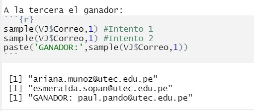

```{r,include=FALSE}
library(knitr)
library(readr)
library(dplyr)
library(stringr)
library(ggplot2)
library(ggthemes)
```

# [Relevancia]{style="color:darkblue"}:

-   **¿Es el estudio de interés para la audiencia?**\
    El tema de estudio es de interés para la audiencia porque los videojuegos fueron y son un método de salida contra el aburrimiento, hecho que se demostró con mayor énfasis durante la pandemia del COVID-19. Por otra parte, esta actividad recreativa puede ser realizado en solitario o compañía, sin olvidar que se puede realizar desde la comodidad de tu hogar. Ahora que los videojuegos han ganado más popularidad, hay que tener en cuenta que al ser una fuente de entretenimiento, la distracción con as responsabilidades es latente, por lo que la autoeficacia académica se puede ver afectada. 

-   **¿Cuáles son los objetivos del estudio?**.\

-   Objetivo General:\
    Determinar el impacto del tiempo dedicado a los videojuegos sobre la autoeficacia académica.

-   Objetivos específicos:\
    1.- Analizar y comparar las horas dedicadas a los videojuegos con las horas dedicadas al estudio.\
    2.- Estimar si influye el ciclo académico de los estudiantes en el tiempo empleado en los videojuegos, además relacionar con las horas de estudio.\
    3.- Descubrir las tendencias de la autoeficacia académica con las variables obtenidas.\
    
# [Datos]{style="color:darkblue"}:

## [Proceso de recolección de datos]{style="color:darkblue"}:

Se elaboró una [Encuesta](https://forms.gle/N2NmzPUkTj8GkqeUA) en la que se recolectaron los datos requeridos para lograr los objetivos, para ello se compartió primero la encuesta mediante el enlace directo y el QR de la encuesta. Las encuestas fueron difundidas por medios digitales y en persona con los encuestados dentro del campus. Se usaron incentivos como caramelos y la participación de un sorteo de 60 soles al completar la encuesta para mayor recepción, consiguiendo así 200 encuestados.   
El ganador del sorteo es:    
{width=35%}

## [Población, muestra y muestreo]{style="color:darkblue"}

### Población

Todos los estudiantes de pre grado de la Universidad "UTEC" que estén cursando el semestre 2022-2

### Muestra

El tamaño de la muestra es de 200 alumnos, lo que sugiere que es una muestra representativa, que permitirá trabajar y lograr el análisis de estos datos.

### Muestreo

Muestreo Aleatorio Simple

## [Variables de Estudio]{style="color:darkblue"}

### 1) Numéricas (4)

#### Discreta (2)

| Variable | \*\*Definición                   |
|:---------|:---------------------------------|
| Edad     | Edad del encuestado              |
| Codigo   | Código del estudiante encuestado |

#### Continua (2)

| Variable      | \*\*Definición                                    |
|:--------------|:--------------------------------------------------|
| HorasJugadas | Horas dedicadas a jugar vídeo juegos semanalmente |
| HorasEstudio | Horas dedicadas al estudio semanalmente           |

### 2) Categóricas (6)

#### Ordinal (2)

| Variable | \*\*Definición              |
|:---------|:----------------------------|
| Ciclo| Ciclo actual del encuestado |
| Afectación | Qué tanto impactan los videojuegos |    

#### Nominal (4)

| Variable  | \*\*Definición               |
|:----------|:-----------------------------|
| Nombres   | Nombres de los encuestados   |
| Apellidos | Apellidos de los encuestados |
| Sexo      | Sexo de los encuestados      |
| Carrera   | Carrera de los encuestados   |

# [Limpieza de datos de Videojuegos.csv]{style="color:darkblue"}:

Para la obtención de datos, se realizó una encuesta a los alumnos de UTEC. Esto se encuentra guardado en "Videojuegos.csv"

```{r}
#Para mayor facilidad cambiamos el nombre
VJ <- read.csv("Videojuegos.csv")
```

[**¿Con cuántas observaciones y variables contamos?**]{style="color: red"}

```{r}
paste('El número de observaciones es:',nrow(VJ)) 
paste('El número de variables es:',ncol(VJ)) 
```

El número de observaciones con el que se cuenta actualmente es de 200, mientras que se tiene un total de 16 variables, por lo que existe un total de 3200 datos.

[**¿Es adecuado cambiar los nombres de las variables?**]{style="color: red"}

```{r}
names(VJ)
```

Es conveniente cambiar las nombres de las variables para facilitar el manejo de los datos, dado que los nombres actuales presentan '.' los cuales no son convenientes, por otra parte otros son extensos.

Reemplazamos los nombres de la variables, para ello haremos uso de ['colnames']{style="color:blue"}

```{r}
colnames(VJ)[1:16] <- c("Fecha","Correo","Nombres","Apellidos","Sexo","Edad","Codigo","Ciclo","Carrera","Plataforma","VideojuegoM","JuegaVideoJuegos","HorasJugadas","HorasEstudio","JuegaCon","Afectacion")
```

[**¿Todas las variables son de utilidad?**]{style="color: red"}

Al observar, se tiene que alrededor de 5 variables no son de utilidad, siendo estos *Fecha*, *Correo*, *Nombres*, *Apellidos* y *Codigo*, por lo que se recomienda eliminarlo de la data frame.

```{r}
Col_elimidas <- names(VJ) %in% c("Fecha","Correo", "Nombres", "Apellidos", "Codigo")
VJ1 <- VJ [,!Col_elimidas]
```

## [Limpieza de la variable *Sexo*]{style="color:darkblue"}:

```{r}
count(VJ1,Sexo)
```

Se obtiene que hay un total de 116 hombres, 80 mujeres, y 4 personas que evitan comentar su sexo. Pero identifiquemos que fila son aquellas personas.

Para ello, se usara *grep*

```{r}
grep("fiero", VJ1$Sexo)

```

Por lo tanto, estos datos se encuentran en las filas 5, 124, 169 y 183.

Con esto se da por concluida la limpieza de la variable sexo.

## [Limpieza de la variable *Edad*]{style="color:darkblue"}:

```{r}
# cuantas NA presenta la variable
sum(is.na(VJ1$Edad))
```

Es muy conveniente no presentar datos vacíos, por lo que significa que la variable es completa.

```{r}
count(VJ1,Edad)
```

De acuerdo a la tabla, se tiene que la edad mínima de los encuestados es 16, mientras que la máxima es 25. Además la tabla nos brinda otro dato más, la moda.

## [Limpieza de la variable *Ciclo*]{style="color:darkblue"}:

```{r}
sum(is.na(VJ1$Ciclo))
```

Otra variable que no presenta datos faltantes.

```{r}
count(VJ1,Ciclo)
```

## [Limpieza de la variable *Carrera*]{style="color:darkblue"}:

```{r}
sum(is.na(VJ1$Carrera))
```

```{r}
count(VJ1,Carrera)
```

De la tabla, se tiene que el mayor número de encuestados pertenecen a la carrera de Bioingeniería.

## [Limpieza de la variable *Plataforma*]{style="color:darkblue"}:

```{r}
sum(is.na(VJ1$Plataforma))
```

```{r}
count(VJ1,Plataforma)
```

A comparación de las variables anteriores, esta sí necesita una limpieza dado que, tanto *Candy crush* como *Ludo* no son plataformas de juego, por el contrario son pertenecientes a la variable *VideojuegoM.* Se tiene que ubicar dichos datos y cambiarlos de valores, en este caso a un NA. También hay respuestas que si bien están relacionadas a las plataformas, no son las respuestas deseadas, por lo que se cambia a NA o corrige el texto. Para ello, se empleará el comando *grep*.

```{r}
VJ1[grep("Candy crush",VJ1$Plataforma),]$Plataforma <- NA
VJ1[grep("Ludo",VJ1$Plataforma),]$Plataforma <- NA
VJ1[grep("laptop",VJ1$Plataforma),]$Plataforma <- NA
VJ1[grep("Laptop",VJ1$Plataforma),]$Plataforma <- NA
VJ1[grep("Todos pes gil",VJ1$Plataforma),]$Plataforma <- NA
VJ1[grep("Todos",VJ1$Plataforma),]$Plataforma <- NA
VJ1[grep("No juego ",VJ1$Plataforma),]$Plataforma <- "Ninguno (no juego)"
VJ1[grep("No juego",VJ1$Plataforma),]$Plataforma <- "Ninguno (no juego)"
```

Por lo tanto ahora debemos de tener 6 NA.

## [Limpieza de la variable *VideojuegoM*]{style="color:darkblue"}:

```{r}
sum(is.na(VJ1$VideojuegoM))
```

```{r}
count(VJ1,VideojuegoM)
```

En esta ocasión se observa diferentes maneras de escribir un juego, por lo que se necesita ordenar y agrupar los juegos. Así que nuevamente se empleará el comando *grep*.

```{r}
#El juego Free Fire
VJ1[grep("Free fire",VJ1$VideojuegoM),]$VideojuegoM <- 'Free Fire'
VJ1[grep("Free fair",VJ1$VideojuegoM),]$VideojuegoM <- 'Free Fire'
VJ1[grep("Free Fire xd",VJ1$VideojuegoM),]$VideojuegoM <- 'Free Fire'

#El juego Call of Duty
VJ1[grep("Call of Duty",VJ1$VideojuegoM),]$VideojuegoM <- 'Call of Duty'
VJ1[grep("Cod",VJ1$VideojuegoM),]$VideojuegoM <- 'Call of Duty'

#El juego Brawl Stars
VJ1[grep("Brawl",VJ1$VideojuegoM),]$VideojuegoM <- 'Brawl Stars'

#El juego de Candy Crush
VJ1[grep("Candy",VJ1$VideojuegoM),]$VideojuegoM <- 'Candy Crush'

#El juego Clash Royale
VJ1[grep("oyal",VJ1$VideojuegoM),]$VideojuegoM <- 'Clash Royale'

# Personas que no juegan
VJ1[grep("o juego",VJ1$VideojuegoM),]$VideojuegoM <- 'No juego'
VJ1[grep("0",VJ1$VideojuegoM),]$VideojuegoM <- 'No juego'

# El juego de Fall Guys
VJ1[grep("Fall",VJ1$VideojuegoM),]$VideojuegoM <- 'Fall Guys'

# El juego de FIFA
VJ1[grep("FIFA",VJ1$VideojuegoM),]$VideojuegoM <- 'FIFA'

# El juego de Fornite
#VJ1[grep("ornite",VJ1$VideojuegoM),]$VideojuegoM <- 'Fornite'

#El juego de Grand Theft Auto V
VJ1[grep("GTA",VJ1$VideojuegoM),]$VideojuegoM <- 'Grand Theft Auto V'

# EL juego de League og Legends
VJ1[grep("eague",VJ1$VideojuegoM),]$VideojuegoM <- 'League of Legends'
VJ1[grep("LOL",VJ1$VideojuegoM),]$VideojuegoM <- 'League of Legends'
VJ1[grep("LoL",VJ1$VideojuegoM),]$VideojuegoM <- 'League of Legends'

#El juego de Mobile Legends
VJ1[grep("obile",VJ1$VideojuegoM),]$VideojuegoM <- 'Mobile Legends'

#El juego de Pro Evolution Soccer
VJ1[grep("Pes",VJ1$VideojuegoM),]$VideojuegoM <- 'Pro Evolution Soccer'
VJ1[grep("PES",VJ1$VideojuegoM),]$VideojuegoM <- 'Pro Evolution Soccer'

#El juego de VALORANT
VJ1[grep("Valora",VJ1$VideojuegoM),]$VideojuegoM <- 'VALORANT'

#El juego de WolfTeam
VJ1[grep("Wolf",VJ1$VideojuegoM),]$VideojuegoM <- 'WolfTeam'

# JUegos de Mario
VJ1[grep("Mario",VJ1$VideojuegoM),]$VideojuegoM <- 'Juegos de Mario'
VJ1[grep("MARIO",VJ1$VideojuegoM),]$VideojuegoM <- 'Juegos de Mario'

#Juegos de Left 4 Dead 2
VJ1[grep("Left 4",VJ1$VideojuegoM),]$VideojuegoM <- 'Left 4 Dead 2'

#Juegos otros
VJ1[grep("Spider",VJ1$VideojuegoM),]$VideojuegoM <- 'Otros'
```

Ahora, con los datos limpios:

```{r}
count(VJ1,VideojuegoM)
```

## [Limpieza de la variables JuegasVideojuegos]{style="color:darkblue"}:

```{r}
sum(is.na(VJ1$JuegaVideoJuegos))
```
```{r}
count(VJ1,JuegaVideoJuegos)
```


## [Limpieza de la variable *HorasJugadas*]{style="color:darkblue"}:

```{r}
sum(is.na(VJ1$HorasJugadas))
```

```{r}
count(VJ1,HorasJugadas)
```

```{r}
#Juegan 1 hora
VJ1[grep("1h",VJ1$HorasJugadas),]$HorasJugadas <- "1"
VJ1[grep("1p",VJ1$HorasJugadas),]$HorasJugadas <- "1"
#Juegan 1.5 hora
VJ1[grep("1 hora",VJ1$HorasJugadas),]$HorasJugadas <- "1.5"
#Juegan 2.5 horra
VJ1[grep("2-Mar",VJ1$HorasJugadas),]$HorasJugadas <- "2.5"
#Juegan 2 hora
VJ1[grep("2h",VJ1$HorasJugadas),]$HorasJugadas <- "1"
```

Con los datos ya limpios, optamos por pasarlos a valores numéricos dado que nos facilitaba limpiarlo cuando se encontraban en valores categóricos. Para ello, usaremos *as.numeric*.

```{r}
VJ1$HorasJugadas <- as.numeric(VJ1$HorasJugadas) 
#comprobemos
if(class(VJ1$HorasJugadas) == "numeric"){
count(VJ1,HorasJugadas)}else{print("No es numeric")}
```

##[Limpieza de la variable *HorasEstudio*]{style="color:darkblue"}:

```{r}
sum(is.na(VJ1$HorasEstudio))
```

```{r}
count(VJ1,HorasEstudio)
```

```{r}

VJ1[grep("15+",VJ1$HorasEstudio),]$HorasEstudio <- "15"
VJ1[grep("5 o",VJ1$HorasEstudio),]$HorasEstudio <- "5.5"
VJ1[grep("7h",VJ1$HorasEstudio),]$HorasEstudio <- "7"

```

Con los datos limpios tenemos:

```{r}
VJ1$HorasEstudio <- as.numeric(VJ1$HorasEstudio) 
#comprobemos
if(class(VJ1$HorasEstudio) == "numeric"){
count(VJ1,HorasEstudio)}else{print("No es numeric")}
```

## [Limpieza de la variable *JuegaCon*]{style="color:darkblue"}:

```{r}
sum(is.na(VJ1$JuegaCon))
```

```{r}
count(VJ1,JuegaCon)
```

Esta variable no necesita ser limpiado

## [Limpieza de la variable *Afectacion*]{style="color:darkblue"}:

```{r}
sum(is.na(VJ1$Afectacion))
```

```{r}
count(VJ1,Afectacion)
```

Esta variable tampoco necesita ser limpiada.

De esta manera se da por finalizada la limpieza de datos de VJ.

# [**Análisis Descriptivo**]{style="color:darkblue"}:

## [Sexo]{style="color:darkblue"}:

Veamos la distribución de los sexos de los encuestados mendiante un gráfico de barras:

```{r}
barplot(table(VJ1$Sexo), xlab="Sexo", ylab="Frecuencia relativa",main="Sexo de los estudiantes",col=c("deepskyblue1","deeppink1","coral") )
```

```{r, include=FALSE}
#Número total de Hombres encuestados:
nhombres <- 0
for (i in 1:nrow(VJ1)){
  if (VJ1[i,1] == "Hombre"){nhombres = nhombres+1}
}

#Número total de mujeres encuestadas:
nmujeres <- 0
for (j in 1:nrow(VJ1)){
  if (VJ1[j,1] == "Mujer"){nmujeres = nmujeres+1}
}

#Número total de personas encuestadas que no compartieron su sexo:
nunknow <-0
for (k in 1:nrow(VJ1)){
  if (VJ1[k,1] == "Prefiero no decirlo"){nunknow = nunknow+1}
}
```

Hay un total de `r nhombres` hombres, `r nmujeres` mujeres y solamente `r nunknow` personas no han compartido su sexo. A pesar de usar un Muestreo Aleatorio Simple, la cantidad de hombres y mujeres es similar, por lo que existe una buena representatividad en cuanto a esta variable.

## [Horas Jugadas a la Semana]{style="color:darkblue"}:

Para ello, primero es necesario analizar y saber que tan dispersas están las horas jugadas. Para ello utilizamos el coeficiente de variación: Dividiendo la *desviación estándar* entre la *media aritmética*. $$
COV = \frac{\sqrt{\frac{1}{n}\sum_{i=1}^n (x_i - \mu)^2}}{\bar X}
$$

```{r}
cov <- round(sd(VJ1$HorasJugadas,na.rm=TRUE)/mean(VJ1$HorasJugadas),2)
mediana_horas_jugadas <- quantile(VJ1$HorasJugadas,na.rm=TRUE,type = 3,probs = 0.5)
```

Se calcula un coeficiente de variación de `r cov`, valor que supera el límite permitido de 0.3, lo que indica una alta dispersión de los datos, de este modo, se utilizará la Mediana, como medida de tendencia central en esta relación. Se calcula que los estudiantes de UTEC aproximadamente juegan `r mediana_horas_jugadas` horas a la semana. Así mismo, el gráfico de caja y bigotes para esta variable permite visualizar que hay datos "atípicos", que se alejan mucho.

```{r}
boxplot(VJ1$HorasJugadas,xlab="Horas semanales dedicadas",main="Boxplot de las horas semanales dedicadas de a los videojuegos", horizontal = TRUE)
```

```{r}
#Calcular la mediana de las horas jugadas por ambos sexos:
man_play <- c()
woman_play <- c()
unk_play <- c()

# PARA HOMBRES
for (a in 1:nrow(VJ1)){
  if (VJ1[a,1] == "Hombre"){man_play[a]<-VJ1[a,7]}
}
# PARA MUJERES
for (b in 1:nrow(VJ1)){
  if (VJ1[b,1] == "Mujer"){woman_play[b]<-VJ1[b,7]}
}
# PARA DESCONOCIDO
for (c in 1:nrow(VJ1)){
  if (VJ1[c,1] == "Prefiero no decirlo"){unk_play[c]<-VJ1[c,7]}
}
```

Así mismo, aislando a cada sexo: A la semana en promedio, los hombres juegan `r quantile(man_play,na.rm=TRUE,type = 3,probs = 0.5)` horas y las mujeres juegan `r quantile(woman_play,na.rm=TRUE,type = 3,probs = 0.5)` hora. Tiempos muy razonables, teniendo en cuenta las actividades académicas de la vida universitaria.

## [Plataformas]{style="color:darkblue"}:
Analizamos las preferencias de los estudiantes de UTEC sobre las plataformas en los que juegan videojuegos.
```{r}
options(scipen=10000)
par(mar=c(7,12,2,4))
bp<-barplot(table(VJ1$Plataform),main = "Plataformas de videojuegos",col=palette("Set2"),horiz=T,las=2,border=F)
text(0,bp, round(table(VJ1$Plataform), 0.9),cex=0.8,pos=4, col="#25283d")
title(ylab=substitute(paste(italic("Plataformas"))), line=9.5, cex.lab=1.2)
title(xlab=substitute(paste(italic("Cantidad"))), line=4.5, cex.lab=1.2)
```


Se puede notar una clara mayor preferencia por jugar videojuegos en una PC, indicando también que los estudiantes de la UTEC juegan más en la comodidad de su hogar.

## [Videojuegos preferidos]{style="color:darkblue"}:
Analizamos las preferencias de los estudiantes de UTEC sobre los títulos de videojuegos que más juegan.
```{r}
sort(table(VJ1$VideojuegoM),decreasing = T)
```

Los 3 juegos más jugados por los estudiantes de UTEC son League of Legends, Dota 2 y Valorant; estos juegos son jugados exclusivamente en una PC, por lo que se relaciona con la variable de Plataformas y confirma la preferencia por jugar en una PC.

## [Horas de Estudio y Horas Jugadas]{style="color:darkblue"}:

Se espera que para una mayor tiempo de estudios, las horas que se juegan videojuegos sean menores, es decir, se espera una relación inversa. Para ello, se utilizará un gráfico de dispersión:

```{r}
smoothScatter(x=VJ1$HorasEstudio, y=VJ1$HorasJugadas,xlab = "Horas de Estudio",ylab = "Horas de Juego",main="Horas semanales para estudiar vs horas semanales para videojuegos ")
abline(lm(VJ1$HorasEstudio~VJ1$HorasJugadas),col="red",lwd=2)
cor_lineal <- round(cor(VJ1$HorasEstudio,VJ1$HorasJugadas),2)
text(paste("Correlación Lineal:",cor_lineal),x=50,y=80)
```

El programa presenta la recta de ajuste óptimo con pendiente negativa, como se había previsto, sin embargo, esto no quiere decir nada. El valor de la correlación lineal entre estas dos variables es extremadamente baja, con un valor de `r cor_lineal`. Esto puede deberse a varios factores como formas de y ritmos de aprendizaje, esfuerzo académico, tiempo libre. etc.

## [Edad y Horas de estudio]{style="color:darkblue"}:

Así mismo, se analizará para la Edad y las Horas de Estudio mediante el gráfico de dispersión suavizado:

```{r}
smoothScatter(x=VJ1$Edad, y=VJ1$HorasEstudio,xlab = "Edad",ylab = "Horas de Estudio",main="Gráfico de dispersión suavizado de edad vs horas semanales para estudiar")
abline(lm(VJ1$Edad~VJ1$HorasEstudio),col="red",lwd=2)
cor_lineal2 <- round(cor(VJ1$Edad,VJ1$HorasEstudio),2)
text(paste("Correlación Lineal:",cor_lineal2),x=21,y=80)
```

Nuevamente los datos no sugieren una tendencia lineal marcada y la correlación de estas variables es de `r cor_lineal2`, valor muy bajo. Se esperaba que para una mayor edad, mayor sentido de responsabilidad y también una mayor carga académica, las horas de estudio sean mayores.

## [Afectación]{style="color:darkblue"}:

Esta variable nos dice exactamente cuan fuerte ha sido el impacto negativo del tiempo dedicado a los videojuegos en sus estudio o rendimiento académico. Mediante el gráfico se observa que en una escala del 0 al 5, donde 0 significa que "No me afectó" y 5 "Afectó demasiado", la mayor frecuencia se encuentra en el nivel 2, que corresponde a un afectación "Moderada".

```{r}
barplot(table(VJ1$Afectacion),xlab = "Escala de impacto de los videojuegos en los estudios", ylab = "Frecuencia",main="Autopercepción del impacto de los videojuegos a los estudios",col=palette("Set2"))
```

La media aritmética corresponde a un `r round(mean(VJ1$Afectacion, na.rm=TRUE))`, lo que corrobora lo dicho anteriormente. Esto quiere decir que en general, el impacto negativo de los videojuegos en los estudios de los alumnos de UTEC es "Moderado-Bajo", lo que indica que los UTECSINOS están enfocados en el estudio, en sus actividades académicas y saben regular sus tiempos de entretenimiento.

# [**Análisis Probabilístico**]{style="color:darkblue"}:
Haciendo uso de las variables de importancia para nuestro estudio, realizaremos el análisis de las probabilidades de los diferentes eventos que estas pueden representar.  

## [**Análisis de Plataforma con Horas de videojuego**]{style="color:darkblue"}:
Calculemos algunas probabilidades relevantes de la relación entre estas variables.

### **¿Cuál es la probabilidad de que un estudiante de UTEC supere la media de horas semanales dedicada a los videojuegos desde las plataformas más jugadas?**
Tras el análisis descriptivo de la variable Plataformas, sabemos que los estudiantes de UTEC prefieren jugar desde una PC, un Celular o un PlayStation. Se busca saber si hay una tendencia de las plataformas más preferidas de videojuegos con la probabilidad de superar la media de horas semanales dedicadas a los videojuegos en general.

#### **Desde una PC**
```{r}
MediaHJ_General<-mean(VJ1$HorasJugadas,na.rm=T)
PC<-filter(VJ1,Plataforma=="PC")
T_PC<-table(VJ1$HorasJugadas[VJ1$Plataforma=="PC"])
HV<-barplot(T_PC,main = "Horas semanales dedicadas a los videojuegos desde PC",col=palette("Set2"),horiz=F,border=F,xlab="Horas dedicadas",ylab="Frecuencia relativa")

```


Conociendo que la media de Horas semanales dedicadas a los videojuegos en general es `r quantile(MediaHJ_General,na.rm=TRUE,type = 3,probs = 0.5)`, a primera vista en la gráfica se puede apreciar una mayor frecuencia de horas dedicadas a los videojuegos desde PC menor a la media general.

```{r}
SupALaMedia_PC<-nrow(filter(PC,HorasJugadas>MediaHJ_General))
Total<-nrow(PC)
Prob_PC_SupALaMedia<-SupALaMedia_PC/Total
Prob_PC_SupALaMedia
```

La probabilidad de que un estudiante de UTEC, que juega desde una PC, supere le media general de horas dedicadas a videojuegos es de 35.71% aproximadamente.


Si de 100 encuestados, se toman 20 personas ¿Cuál será la probabilidad de que al jugar en PC superen la hora media semanal?

```{r}
n=20
k=100
plot(dbinom(n,0:k,Prob_PC_SupALaMedia),col = "cadetblue3",xlab = "Encuestados",ylab = "Probabilidad Binomial" ,main = "Modelo Binomial - Horas semanales dedicadas a videojuegos en PC")
```


#### **Desde un celular**
```{r}
MediaHJ_General<-mean(VJ1$HorasJugadas,na.rm=T)
Cel<-filter(VJ1,Plataforma=="Celular")
T_Cel<-table(VJ1$HorasJugadas[VJ1$Plataforma=="Celular"])
HV<-barplot(T_Cel,main = "Horas semanales dedicadas a los videojuegos desde Celular",col=palette("Set2"),horiz=F,border=F,xlab="Horas dedicadas",ylab="Frecuencia relativa")
```


Conociendo que la media de Horas semanales dedicadas a los videojuegos en general es `r quantile(MediaHJ_General,na.rm=TRUE,type = 3,probs = 0.5)`, a primera vista en la gráfica se puede apreciar una mucha mayor frecuencia de horas dedicadas a los videojuegos desde celular menor a la media general.

```{r}
SupALaMedia_Cel<-nrow(filter(Cel,HorasJugadas>MediaHJ_General))
Total<-nrow(Cel)
Prob_Cel_SupALaMedia<-SupALaMedia_Cel/Total
Prob_Cel_SupALaMedia
```

La probabilidad de que un estudiante de UTEC, que juega desde un Celular, supere le media general de horas dedicadas a videojuegos es de 12.5%


Si de 50 encuestados, se toman 8 personas ¿Cuál será la probabilidad de que al jugar en un celular superen la hora media semanal?

```{r}
n=8
k=50
plot(dbinom(n,0:k,Prob_Cel_SupALaMedia),col = "cadetblue3",xlab = "Encuestados",ylab = "Probabilidad Binomial" ,main = "Modelo Binomial - Horas semanales dedicadas a videojuegos en celular")
```


#### **Desde un PlayStation**
```{r}
MediaHJ_General<-mean(VJ1$HorasJugadas,na.rm=T)
PS<-filter(VJ1,Plataforma=="PlayStation")
T_PS<-table(VJ1$HorasJugadas[VJ1$Plataforma=="PlayStation"])
HV<-barplot(T_PS,main = "Horas semanales dedicadas a los videojuegos desde PlayStation",col=palette("Set2"),horiz=F,border=F,xlab="Horas dedicadas",ylab="Frecuencia relativa")
```


Conociendo que la media de Horas semanales dedicadas a los videojuegos en general es `r quantile(MediaHJ_General,na.rm=TRUE,type = 3,probs = 0.5)`, a primera vista en la gráfica se puede apreciar una mucha mayor frecuencia de horas dedicadas a los videojuegos desde celular menor a la media general.

```{r}
SupALaMedia_PS<-nrow(filter(PS,HorasJugadas>MediaHJ_General))
Total<-nrow(PS)
Prob_PS_SupALaMedia<-SupALaMedia_PS/Total
Prob_PS_SupALaMedia
```

La probabilidad de que un estudiante de UTEC, que juega desde un PlayStation, supere le media general de horas dedicadas a videojuegos es de 22.2% 


Si de 60 encuestados, se toman 10 personas ¿Cuál será la probabilidad de que al jugar en PC superen la hora media semanal?

```{r}
n=10
k=60
plot(dbinom(n,0:k,Prob_PS_SupALaMedia),col = "cadetblue3",xlab = "Encuestados",ylab = "Probabilidad Binomial" ,main = "Modelo Binomial - Horas semanales dedicadas a videojuegos en PS")
```


Como se esperaba, la PC, la plataforma de videojuegos más preferida por los estudiantes de UTEC, es la que tiene más probabilidades de el estudiante de UTEC pase más tiempo jugando, esto puede ser debido a que los títulos de videojuegos más populares se encuentran disponibles en PC. Además la PC es una herramienta muy solicitada y usada por universitarios, por lo que la mayoría posee una. Esto hace que el acceso a los videojuegos esté a un solo clic, posiblemente afectando a la autoeficacia académica si no se tiene una correcta planificación. 


## [**Análisis de Horas de estudio con Horas de videojuegos**]{style="color:darkblue"}:
Analizaremos las tendencias en el que se relacionan las horas dedicadas a estudiar con las horas dedicadas a los videojuegos.

### **¿Cuál es la probabilidad que al elegir un alumno al azar, este tenga horas de estudio debajo de 8?**
Para ello, es conveniente usar un modelo de distribución normal:

```{r}
prom_HorasEstudio <- mean(VJ1$HorasEstudio,na.rm=TRUE)
desvEsta_HorasEstudio <- sd(VJ1$HorasEstudio, na.rm=TRUE)
prob_HorasEstudio <- pnorm(8,prom_HorasEstudio , desvEsta_HorasEstudio)

```
**La Distribución normal: P(x <= 8) = 0.396949197428305**
```{r}
xnorm <- VJ1$HorasEstudio
ynorm <- dnorm(xnorm,prom_HorasEstudio,desvEsta_HorasEstudio)
plot(xnorm,ynorm, xlab = "Horas de Estudio",ylab = "Probabilidad")
```

### **¿Cuál es la probabilidad que al elegir un alumno al azar, este tenga horas de juego mayor a 8?**
```{r}
prom_HorasJuego <- mean(VJ1$HorasJugadas,na.rm=TRUE)
desvEsta_HorasJuego <- sd(VJ1$HorasJugadas, na.rm=TRUE)
prob_HorasDeJuego <- 1 - pnorm(8, prom_HorasJuego, desvEsta_HorasJuego)
```
**La Distribución normal: P(x > 8) = 0.315810897389357**
```{r}
xnorm2 <- VJ1$HorasJugadas
ynorm2 <- dnorm(xnorm2,prom_HorasJuego,desvEsta_HorasJuego)
plot(xnorm2,ynorm2, xlab = "Horas de Juego",ylab = "Probabilidad")

```


Ello quiere decir que en UTEC, la probabilidad que un alumno estudie mas de 8 horas a la semana es de `r 1- prob_HorasEstudio` y que la probabilidad de que un alumno juegue 8 horas a la semana es de `r prob_HorasDeJuego`. Por lo tanto es mas probable que los alumnos en UTEC pasen mas horas estudiando, que más horas jugando a videojuegos.

### **¿Cuál es la probabilidad de que un alumno que tenga horas de estudio debajo de la media y tenga horas de videojuegos mayor que la media?**
Si se comprueba una alta probabilidad, se podría demostrar que los videojuegos afectan a la planificación a la hora de estudiar.

```{r}
MediaHJ_General<-mean(VJ1$HorasJugadas,na.rm=T)
MediaE_General<-mean(VJ1$HorasEstudio,na.rm=T)

JMEM<-nrow(filter(VJ1,HorasEstudio<MediaE_General,HorasJugadas>MediaHJ_General))
Total<-nrow(VJ1)
Prob_JMEM<-JMEM/Total
Prob_JMEM
```

La probabilidad de que un estudiante de UTEC juegue más videojuegos que la media y a la vez estudie menos que la media es de 12.44% aprox. Si bien no es un porcentaje muy alto, es suficiente como para tomar en cuenta la problemática de planificación que afectan a los estudios.  


```{r}
VJ1[VJ1=="si"]<-"1"
VJ1[VJ1=="no"]<-"0"

VJ1[VJ1=="Mujer"]<-"2"
VJ1[VJ1=="Hombre"]<-"3"
VJ1[VJ1=="Prefiero no decirlo"]<-"7"

VJ1$JuegaVideoJuegos<-as.numeric(VJ1$JuegaVideoJuegos)
VJ1$Sexo<-as.numeric(VJ1$Sexo)
```

## [Análisis utilizando la probabilidad condicional]{style="color:darkblue"}:

A continuación se procede a realizar el análisis utilizando los conceptos de Probabilidad condicional aprendidos en clase, esto con el objetivo de encontrar relaciones entre distintas variables. Cabe resaltar que se utilizará la siguiente fórmula: 

<center>$\mathbb{P}(A|B)=\frac{\mathbb{P}(A \cap B)}{\mathbb{P}(B)}$</center>

-------------------------------


### **Si un estudiante estudia más de 30 horas semanales, ¿cuál es la probabilidad que juegue más horas que el promedio?**

```{r}
N<-VJ1$HorasJugadas
H<-VJ1$HorasEstudio
n<-nrow(VJ1)

MediaN<-mean(VJ1$HorasJugadas)


(sum((N>MediaN)&(H>30))/n)/(sum(H>30)/n)
```
La probabilidad de que un estudiante que estudia más de 30 horas semanales juegue más horas que el promedio es de 12.5%

--------------------------------------------------------------------------------

### **Si un estudiante tiene 20 años o menos ¿Cuál es la probabilidad de que juegue más horas que el promedio?**

```{r}
N<-VJ1$HorasJugadas
H<-VJ1$Edad
n<-nrow(VJ1)

MediaN<-mean(VJ1$HorasJugadas)


(sum((N>MediaN)&(H<=20))/n)/(sum(H<=20)/n)
```
La probabilidad de que un estudiante juegue más horas que el promedio semanales, si tiene 20 años o menos es de 18,71%

--------------------------------

### **Si un estudiante tiene más 20 años ¿Cuál es la probabilidad de que juegue más horas que el promedio?**

```{r}
N<-VJ1$HorasJugadas
H<-VJ1$Edad
n<-nrow(VJ1)

MediaN<-mean(VJ1$HorasJugadas)


(sum((N>MediaN)&(H>20))/n)/(sum(H>20)/n)
```
La probabilidad de que un estudiante juegue más horas que el promedio semanales, si tiene más de 20 años es de 33,33%

---------------------------------

### **¿Cuál es la probabilidad que un estudiante tenga un puntaje mayor o igual a 3 en la variable de "Afectacion", dado que sea mujer?**

```{r}
N<-VJ1$Afectacion  #Variable de Cuanto creen que los videojuegos afectan a sus estudios.
H<-VJ1$Sexo
n<-nrow(VJ1)

(sum((N>=3)&(H==2))/n)/(sum(H==2)/n)
```
El porcentaje de que una mujer tenga un puntaje mayor o igual a 3 en la variable de "Afectacion" es de 33,75% 

--------------------------------------

### **¿Cuál es la probabilidad que un estudiante tenga un puntaje mayor o igual a 3 en la variable de "Afectacion", dado que sea hombre?**

```{r}
N<-VJ1$Afectacion  #Variable de Cuanto creen que los videojuegos afectan a sus estudios.
H<-VJ1$Sexo
n<-nrow(VJ1)

(sum((N>=3)&(H==3))/n)/(sum(H==3)/n)
```
El porcentaje de que un hombre tenga un puntaje mayor o igual a 3 en la variable de "Afectacion" es de 45,30%

----------------------------

### **Si un estudiante es hombre ¿Cual es la probabilidad de que juegue más horas que el promedio semanal?**
```{r}
N<-VJ1$HorasJugadas
H<-VJ1$Sexo
n<-nrow(VJ1)

MediaN<-mean(VJ1$HorasJugadas)


(sum((N>MediaN)&(H==3))/n)/(sum(H==3)/n)
```
La probabilidad de que un estudiante juegue más horas que el promedio si es hombre, es del 27,35%

------------------------

### **Si un estudiante es mujer ¿Cual es la probabilidad de que juegue más horas que el promedio semanal?**
```{r}
N<-VJ1$HorasJugadas
H<-VJ1$Sexo
n<-nrow(VJ1)

MediaN<-mean(VJ1$HorasJugadas)


(sum((N>MediaN)&(H==2))/n)/(sum(H==2)/n)
```
La probabilidad de que un estudiante juegue más horas que el promedio si es mujer, es del 11,25%

----------------------------

### **Si un estudiante es hombre ¿Cual es la probabilidad de que estudie más horas que el promedio semanal?**
```{r}
N<-VJ1$HorasEstudio
H<-VJ1$Sexo
n<-nrow(VJ1)

MediaN<-mean(VJ1$HorasEstudio)

(sum((N>MediaN)&(H==3))/n)/(sum(H==3)/n)
```
La probabilidad de que un estudiante estudie más horas que el promedio si es hombre, es del 23,08%

------------------------------

### **Si un estudiante es mujer ¿Cual es la probabilidad de que estudie más horas que el promedio semanal?**
```{r}
N<-VJ1$HorasEstudio
H<-VJ1$Sexo
n<-nrow(VJ1)

MediaN<-mean(VJ1$HorasEstudio)


(sum((N>MediaN)&(H==2))/n)/(sum(H==2)/n)
```
La probabilidad de que un estudiante estudie más horas que el promedio si es mujer, es del 36,25%

-----------------

Gracias al análisis previamente mostrado, se determinó que:

- Hay mayor probabilidad que los hombres jueguen más horas que el promedio de horas semanal, a comparación de las mujeres.

- Hay mayor probabilidad que las mujeres estudien más horas que el promedio de horas semanal, a comparación de los hombres.

- La probabilidad de que un estudiante hombre crea que jugar afecta a los estudios en un nivel mayor o igual a 3, es mayor a la probabilidad en el caso de las mujeres.

Gracias a esto concluimos que mientras más horas un estudiante juegue videojuegos, menos horas estudiará. Y a la vez será conciente que esto afecta a sus estudios. Además es más probable que los hombres sigan esta tendencia.


Por último concluimos que los alumnos mayores a 20 años dedican más horas a jugar videojuegos.

## [**Conclusiones**]{style="color:darkblue"}:

-La PC es la plataforma de videojuegos más preferida por los estudiantes, ya que es la que tiene más probabilidades de que se pase más tiempo jugando. Además la PC es una herramienta muy solicitada y usada por universitarios lo que hace que sea más accesible afectando la eficacia académica si no se tiene una correcta planificación.

-La probabilidad que un alumno estudie mas de 8 horas a la semana es de 60,69% y que la probabilidad de que un alumno juegue 8 horas a la semana es de 32,09%. Por lo tanto es más probable que los alumnos en UTEC pasen más horas estudiando, que  jugando a videojuegos.

-Concluimos que mientras más horas un estudiante juegue videojuegos, menos horas estudiará. Y a la vez será consciente que esto afecta a sus estudios. Además, es más probable que los hombres sigan esta tendencia.
Por último concluimos que los alumnos mayores a 20 años dedican más horas a jugar videojuegos.

## [**Bibliografía**]{style="color:darkblue"}:
Chacón Cuberos, R., Zurita Ortega, F., Martínez Martínez, A., Castro Sánchez, M., Espejo Garcés, T., & Pinel Martínez, C. (2017). Relación entre factores académicos y consumo de videojuegos en universitarios: un modelo de regresión. Pixel-Bit. Recuperado de: [Link](https://redined.educacion.gob.es/xmlui/bitstream/handle/11162/135606/Relación.pdf?sequence=1&isAllowed=y)
