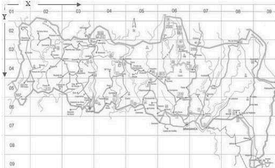
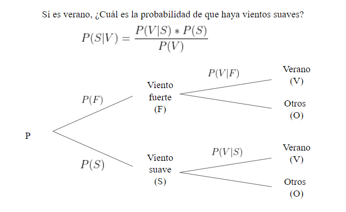

```{r, echo=FALSE, warning=FALSE, include=FALSE}

library(latex2exp)
library(readr)
library(dplyr)
library(ggplot2)
library(ggthemes)
```


# Introducción

El parque Montesinho es uno de los 12 parques naturales más grandes de Portugal. Es un buen lugar para realizar turismo, pero las malas épocas climáticas lo pueden malograr. Ahora, uno de los problemas que se tiene al visitar este lugar, es el de no haber mucha información sobre los eventos climáticos que pueden malograr nuestra experiencia de visitar el parque natural. Es por eso que la información que deseamos aportar mediante este informe, es el de poder brindar un mayor conocimiento sobre la situación climatología del parque.

- Relevancia

Mediante este informe deseamos aportar mas información sobre el clima, así como también, mejorar la experiencia de los visitantes. Debido a que actualmente hay poca información sobre esta.

- Planificación


```{r setup, include=FALSE}
knitr::opts_chunk$set(echo = TRUE)
```


```{r echo=FALSE,  fig.align='center', out.width='100%', warning=FALSE}
data <- data.frame(name = c('Búsqueda de información', 'Elección de tres temas', 'Primera entrega', 'Adición de descriptores numéricos','Adición de descriptores gráficos','Plantenado preguntas para el informe','Segunda entrega','Haciendo correciones','Adición variables aleatorias','Adición de análisis descriptivo','Pruebas de probabilidades','Tendencias y predicciones','Ultimos ajustes','Presentacion final'), 
start = c(0, 0, 0,2,2,3,3,6,6,6,6,8,8,8),
end = c(1, 2, 5, 4,5,6,8,8,8,10,12,14,15,16),
shift_type = c('completado','completado','completado','completado','completado','completado','completado','completado','completado','completado','completado','completado','completado','completado')
)

ggplot(data, aes(x=start, xend=end, y=name, yend=name, color=shift_type)) +
  theme_bw()+
  geom_segment(size=6) + 
  labs(title='Diagrama de Gantt', x='Semana', y='')+
  scale_colour_manual(values = c('orange'))

```


```{r, echo=FALSE, warning=FALSE, include=FALSE}

DF <- read_csv("forestfires.csv")

#Variable sequía
DF <- mutate(DF, drought = NA)
DF$drought[DF$DC<=1000]<- "extreme"
DF$drought[DF$DC<=600]<- "high"
DF$drought[DF$DC<=400]<- "medium"
DF$drought[DF$DC<=200]<- "low"

#Variable Temporada
DF <- mutate(DF, season = NA)
DF$season[DF$month %in% c("dec","jan","feb")]<- "winter"
DF$season[DF$month %in% c("mar","apr","may")]<- "spring"
DF$season[DF$month %in% c("jun","jul","aug")]<- "summer"
DF$season[DF$month %in% c("sep","oct","nov")]<- "fall"

#Variable Incendio
DF <- mutate(DF, fire = NA)
DF$fire[DF$area<=1091]<- "large"
DF$fire[DF$area<=6.57]<- "median"
DF$fire[DF$area<=0.52]<- "small"

```

---

# Objetivos

- Objetivo principal

Brindar un mayor conocimiento sobre el clima y las estaciones en el parque Montesinho.

- Objetivos secundarios

Advertir sobre algunos problemas que pueden surgir en el parque como sequías, incendios o vientos fuertes.

Establecer las mejores temporadas con temperaturas, vientos y humedad favorables para tener una mejor experiencia.

---

# Datos

### Recolección de datos

El método de recolección de datos usado en este estudio fue **estratificado**, donde cada estrato representa un sector del parque natural de Montesinho en un mapa de 9x9 para recolectar de forma aleatoria información en cada uno de los estratos. La base de datos fue recolectada desde enero de 2000 hasta diciembre de 2003 por Cortez, Paulo & Morais, A..

{width=width height=height}

### Población Muestra y Muestreo

- **Población**: Elementos del climáticos, antes de un incendio forestal entre enero de 2000 y diciembre de 2003.
- **Muestra**: La muestra contiene 16 variables y 517 observaciones.
- **Muestreo**: El tipo de muestreo aplicado en el estudio es estratificado.

```{r, echo=TRUE}
rowDF <- nrow(DF)
colDF <- ncol(DF)

cat('Hay', colDF,'variables y', rowDF, 'observaciones', 'en el conjunto de datos')
```

### Variables

Numérica continua:

* **`FFMC`**: Humedad de los combustibles fino (Hojas secas, ramas pequeñas, etc.).
* **`DMC`**: Índice que marca la humedad de la tierra en la superficie.
* **`DC`**: Índice que marca la humedad de la tierra bajo la superficie.
* **`ISI`**: Índice que marca la tasa esperada de la propagación de fuego.
* **`Temp`**: Temperatura en grados Celsius.
* **`HR`**: humedad relativa en %: 0 a 100.
* **`Viento`**: velocidad del viento en km/h: 0,40 a 9,40.
* **`Lluvia`**: lluvia exterior en mm/m2 : 0,0 a 6,4.
* **`Área`**: el área quemada del bosque (en ha): 0,00 a 1090,84.

Categórica nominal:

* **`X`**: Coordenada espacial del eje x dentro del mapa del parque Montesinho: 1 a 9 (figura 1)
* **`Y`**: Coordenada espacial del eje y dentro del mapa del parque Montesinho: 2 a 9 (figura 1)

Categórica ordinal:

* **`Mes`**: Mes del año: "ene" a "dic".
* **`Día`**: Día de la semana: "lun" a "dom".
* **`sequía`**: Nivel de sequía en el suelo según el sistema KBDI/DC.
* **`Temporada`**: Estaciones del año: "primavera", "verano", "otoño" e "invierno".
* **`Incendio`**: Nivel del área quemada: "pequeño","mediano","grande".

Tabla de rangos para las variables **`Incendio`** y **`sequía`**.

| **rango `KBDI/DC`** | **nivel de sequía**  | **descripción**          |
|:--------------------|:---------------------|:-------------------------|
| 0    - 200          | bajo                 |Elevada humedad del suelo |
| 200  - 400          | moderado             |Poca humedad del suelo    |
| 400  - 600          | alto                 |Suelos muy secos          |
| 600  - 800          | extremo              |Sequías extremas          |

| **rango de `área`** | **nivel de Incendio**| **descripción**          |
|:--------------------|:---------------------|:-------------------------|
| 0   - 0.52          | bajo                 |Área menor al segundo cuartil|
| 0.52 - 6.57         | medio                |Área entre al segundo y tercer cuartil|
| 6.57 - 1091         | grande               |Área mayor al tercer cuartil|

### Limpieza de base de datos

En esta parte analizaremos todos los datos del data-frame, para esta parte analizaremos si cuentan valores atípicos o faltantes. Primero analizaremos si todas nuestras observaciones están completas. Segundo, analizaremos cada uno de los datos.
```{r, echo=TRUE}
datosFaltantes <- sum(is.na(DF))

cat('Hay',datosFaltantes,'datos faltantes')
```
Las `517` observaciones del data frame están completas, por lo que no existen datos faltantes.

- Numérica continua

Analizaremos algunos datos atípicos de las variables mediante el uso de boxplot y comprobaremos si realmente son datos atípicos.
```{r, echo=FALSE, warning=FALSE}
# tres filas, columnas
par(mfrow = c(3, 1))

# Los siguientes gráficos se combinarán

boxplot(DF$FFMC, main = "FFMC", horizontal = TRUE)
boxplot(DF$DMC, main = "DMC", horizontal = TRUE)
boxplot(DF$DC, main = "DC", horizontal = TRUE)

boxplot(DF$ISI, main = "ISI", horizontal = TRUE)
boxplot(DF$temp, main = "temp", horizontal = TRUE)
boxplot(DF$RH, main = "RH", horizontal = TRUE)

boxplot(DF$wind, main = "viento", horizontal = TRUE)
boxplot(DF$rain, main = "lluvia", horizontal = TRUE)
boxplot(DF$area, main = "área", horizontal = TRUE)

# Volvemos al estado original
par(mfrow = c(1, 1))
```

Como podemos observar las variables FFMC, ISI, lluvia y área; contienen datos atípicos, pero estos se encuentran dentro de los rangos establecidos en el documento, por lo que son reales. 

- Categórica nominal

Variables: **`X`** e **`Y`**

```{r, echo=TRUE}
maxX <- max(DF$X)
minX <- min(DF$X)
maxY <- max(DF$Y)
minY <- min(DF$Y)

cat('El valor máximo para la variable "X" es',maxX, 'y el valor mínimo es',minX,'. Para la variable "Y" los valores máximo y mínimo son',maxY,'y',minY)
```
Las variables se encuentran dentro de los rangos establecidos, por lo que no hay problemas en estas 2 variables.


- Categórica ordinal

Variables: **`Día`** y **`Mes`**

```{r, echo=TRUE}
valoresUnicosMes <- unique(DF$month)
valoresUnicosDia <- unique(DF$day)

cat('Hay',length(valoresUnicosMes),'meses y',length(valoresUnicosDia), 'días registrados en la base de datos')
```

```{r, echo=FALSE}
cat('El conjunto de datos en la variable mes es: "',valoresUnicosMes, '" y el conjunto de datos en la variable día es: "',valoresUnicosDia, '"')
```
Variable: **`sequía`**
```{r, echo=TRUE}
valoresUnicosSequia <- unique(DF$drought)

cat('Hay ',length(valoresUnicosSequia), 'niveles de sequía, los cuales son: "',valoresUnicosSequia, '"')
```
Variable: **`Temporada`**
```{r, echo=TRUE}
valoresUnicosTemporada <- unique(DF$season)

cat('Hay ',length(valoresUnicosTemporada), 'estaciones en el año, los cuales son: "',valoresUnicosTemporada, '"')
```

Variable: **`Incendio`**
```{r, echo=TRUE}
valoresUnicosIncendio <- unique(DF$fire)

cat('Hay ',length(valoresUnicosIncendio), 'niveles de incendio, los cuales son: "',valoresUnicosIncendio, '"')
```
Las variables ordinales presentan valores y niveles establecidos, por lo que están completos.

---

# Análisis descriptivo

En este apartado se realizo un análisis de los diversos descriptores gráficos y numéricos para nuestras variables de interés. 

### Temperatura (Temp)

```{r}
# Una fila, dos columnas
par(mfrow = c(1, 2))
minTemp   <- round(min(DF$temp),1)    #Temperatura mínima Output:2.2
maxTemp   <- round(max(DF$temp),1)    #Temperatura máxima Output:33.3
meanTemp  <- round(mean(DF$temp),1)   #media              Output:18.9
medianTemp<- round(median(DF$temp),1) #mediana            Output:19.3
sdTemp    <- round(sd(DF$temp),1)     #desviación típica  Output:5.8

cat('La temperatura mínima y máxima registrada es', minTemp,'y',maxTemp,'. La media, mediana y desvición estándar son', meanTemp, ',',medianTemp,'y', sdTemp)
```
```{r, echo=FALSE, warning=FALSE}
hist(DF$temp,col="lightgray",main="Distribución de la temperatura C",ylab="densidad",xlab="temperatura (C)",prob=TRUE)
abline(v=median(DF$temp),col="red",lwd=2)
abline(v=mean(DF$temp),col="blue",lwd=2) 
legend(28,0.04,legend=c("Mediana","Media"),lwd=2,col=c("red","blue")) 
```
- **análisis:** En este gráfico observamos que a mediana > media, por lo que la gráfica presenta un ligero sesgo hacia la izquierda. Y la temperatura media es 18.9. Con esto podemos darnos una idea de como es la temperatura el el parque natural Montesinho.

### Humedad del ambiente % (RH)
```{r, echo=TRUE}
minRH   <- round(min(DF$RH),1)    #RH mínima          Output:15
maxRH   <- round(max(DF$RH),1)    #RH máxima          Output:100
meanRH  <- round(mean(DF$RH),1)   #media              Output:44.3
medianRH<- round(median(DF$RH),1) #mediana            Output:42
sdRH    <- round(sd(DF$RH),1)     #desviación típica  Output:16.3

cat('La humedad relativa del ambiente mínima y máxima registrada es', minRH,'y',maxRH,'. La media, mediana y desvición estándar son', meanRH, ',',medianRH,'y', sdRH)
```
```{r, echo=FALSE, warning=FALSE}
hist(DF$RH,col="lightgray",main="Distribución de la Humedad %",ylab="densidad",xlab="Humedad (%)",prob=TRUE)
abline(v=median(DF$RH),col="red",lwd=2) 
abline(v=mean(DF$RH),col="blue",lwd=2) 
legend(80,0.015,legend=c("Mediana","Media"),lwd=2,col=c("red","blue")) 
```
- **análisis:**
Esta gráfica presenta un sesgo a la derecha, y la media de la variable humedad nos indica la humedad media durante el año.

### Viento (km/h)
```{r, echo=TRUE}
minWind   <-round(min(DF$wind),1)    #viento (km/h) mínima Output:0.4
maxWind   <-round(max(DF$wind),1)    #viento (km/h) máxima Output:9.4
meanWind  <-round(mean(DF$wind),1)   #media                Output:4
medianWind<-round(median(DF$wind),1) #mediana              Output:4
sdWind    <-round(sd(DF$wind),1)     #desviación típica    Output:1.8
cat('La velocidad del viento en km/h mínima y máxima registrada es', minWind,'y',maxWind,'. La media, mediana y desvición estándar son', meanWind, ',',medianWind,'y', sdWind)
```
```{r, echo=FALSE, warning=FALSE}
hist(DF$wind,col="lightgray",main="Distribución del viento (km/h)",ylab="densidad",xlab="viento (km/h)",prob=TRUE)
abline(v=median(DF$wind),col="red",lwd=2) 
abline(v=mean(DF$wind),col="blue",lwd=2) 
legend(4,1,legend=c("Mediana","Media"),lwd=2,col=c("red","blue")) 
```
- **análisis:**
La gráfica es completamente simétrica, porque la mediana y la media son iguales. por otro lado, nos muestran que la media es 4 km/h. Estas velocidades de vientos nos son para nada fuertes, mas bien son brizas.

### Temporada
```{r, echo=FALSE, warning=FALSE}
barplot(table(DF$season))
```
- **análisis:**
La mayoría de los incendios ocurridos en el parque natural Montesinho ocurren en verano.

### Sequía
```{r, echo=FALSE, warning=FALSE}
barplot(table(DF$drought))
```
- **análisis:**
La moda de esta variable, nos indica que la mayor parte del tiempo estaba seco.

### Incendios
```{r, echo=FALSE, warning=FALSE}
barplot(table(DF$fire))
```
- **análisis:**
La mayoría de los incendios ocurridos en el parque natural Montesinho son pequeños.

---

# Interacciones entre Variables

En esta parte mostraremos las diversas interacciones como pueden ser los **patrones y tendencias** de algunas variables.

### Cuantitativa vs Cuantitativa
```{r, echo=FALSE, warning=FALSE}
par(mfrow = c(2, 2))

plot(DF$RH,DF$temp,main="RH (%) vs Temperatura (C)",ylab="temperatura (C)",xlab="RH/Humedad ambiente (%)") 
plot(DF$RH,DF$FFMC,main="RH (%) vs FFMC(FWI)",ylab="FFMC (FWI)",xlab="RH/Humedad ambiente (%)")
plot(DF$DC,DF$DMC,main="DC (%) vs DMC(FWI)",ylab="DMC/Humedad en la superficie",xlab="DC/Humedad bajo la superficie") 
plot(DF$DMC,DF$temp,main="DMC (FWI) vs FFMC (FWI)",ylab="temperatura (C)",xlab="DMC/Humedad en la superficie")

par(mfrow = c(1, 1))
```

- **RH/humedad ambiente (%) vs Temperatura (C):** Esta relación se puede deber a que cuando aumenta la temperatura, el aire se vuelve mas seco y por ende hay menos partículas de agua suspendidas en el aire.
- **RH/humedad ambiente (%) vs FFMC (FWI):** El FFMC en palabras simples es la materia que esta seca(hojas, ramas, pasto, etc.) y que puede actuar como combustible. Ahora, si el ambiente esta húmedo, también lo estará el resto de elementos dentro de el.
- **DC/humedad bajo la superficie vs DMC/Humedad en la superficie:** La humedad de las capas del suelo y la humedad de la superficie comparten prácticamente el mismo espacio, por lo que también deberían tener una humedad igual.
- **DMC/Humedad en la superficie vs temperatura (C):** Puede deberse a que la humedad de las capas mas bajas empieza a subir por la temperatura.

### Cualitativa vs Cuantitativa

```{r, echo=FALSE, warning=FALSE}
boxplot(DF$temp ~ DF$season, main="Temporada vs Temperatura (C)",ylab="temperatura (C)",xlab="Temporada (Estaciones del año)")
```

- **Estación vs Temperatura (C):** La temporada con mayor temperatura es en verano, como se puede ver los gráficos de boxplot, por otro lado, la temporada con menor temperatura es invierno.

```{r, echo=FALSE, warning=FALSE}
boxplot(DF$wind ~ DF$season, main="Temporada vs Viento (km/h)",ylab="viento (km/h)",xlab="Temporada (Estaciones del año)")
```

- **Estación vs Viento (km/h):** Las temporadas con mayor viento son primavera e invierno, mientras que en verano y otoño los vientos son menores.

```{r, echo=FALSE, warning=FALSE}
boxplot(DF$RH ~ DF$season, main="Temporada vs Humedad %",ylab="Humedad %",xlab="Temporada (Estaciones del año)")
```

- **Temporada vs Humedad %:** La temporada con mayor humedad presente en el ambiente es invierno.

### Cualitativa vs Cualitativa

```{r, echo=FALSE, warning=FALSE}
mosaicplot(table(DF$season, DF$fire), main="Temporada vs Incendio",ylab="Incendio",xlab="Temporada (Estaciones del año)")
```

- **Temperada vs Incendio:** Podemos ver que en verano y otoño hay una mayor cantidad de incendios, pero en verano hay una mayor cantidad de incendios pequeños.

---

# Análisis probabilístico

### Probabilidad 1: Riesgo de incendios

Durante las vacaciones de invierno ("dec", "ene" y "feb") y verano ("jun","jul" y "aug") el parque Montesinho recibe un mayor flujo de visitantes. Pero también sabemos que en el parque se reportan incendios a lo largo del año, pero la mayoría son pequeños y representan un peligro. 

- ¿Cuál sería la probabilidad de que no haya un incendio pequeño, dado que sea invierno?

$$
P = 1 - P(pequeño \big| invierno)
$$

- ¿Cuál sería la probabilidad de que no haya un incendio pequeño, dado que sea verano?

$$
P = 1 - P(pequeño \big| verano)
$$

- tabla de frecuencias de reportes de incendios por temporada (estaciones del año)
```{r, echo=FALSE, warning=FALSE}
table(DF$season, DF$fire)
```

$P = 1 - P(A \big| B) = 1 - \frac{número~de~elementos~de~A\cap B}{número~de~elementos~de~B}$

```{r}
#Probabilidad condicional
prob1_invierno <- 1 - 12/(13+6+12) #probabilidad de que no haya un incendio pequeño en invierno
prob1_verano   <- 1 - 115/(115+70+48) #probabilidad de que no haya un incendio pequeño en verano
cat(' probabilidad de que un incendio en invierno no sea pequeño es:', round(prob1_invierno,2),'\n','probabilidad de que un incendio en verano no sea pequeño es:',round(prob1_verano,2))
```


### Probabilidad 2: Mejor temperatura

La temperatura ambiente ideal para una persona se encuentra entre los 21 C° y 26 C° según (HernanzLa, 2013). Por lo que, ¿Cuál sería la probabilidad de ir en cualquier momento al parque y encontrarse con la temperatura ideal?

$P = (temperatura~ideal)$

$P(A)=\frac{número~de~elementos~de~A}{n}$

```{r}
#Probabilidad uniforme discreta
temperaturaIdeal <- filter(DF, temp <= 26 & temp >= 21)
prob2 <- nrow(temperaturaIdeal)/nrow(DF)
nprob2 <- 1-prob2
cat('La probabilidad de ecnotrar la temperatura ideal es', round(prob2,2),'. Por otro lado, la probabilidad de encontrarse con una temperatura no ideal es', round(nprob2,2))
```

### Probabilidad 3: Vientos suaves en verano

Verano es la mejor época para visitar, por las buenas temperaturas que presenta el parque durante esta temporada. Por lo que si es verano, ¿Cuál es la probabilidad de que haya vientos suaves?

{width=width height=height}

eventos:
$$
A=\{es~verano\}\\   
B=\{hay~vientos~suaves\}
$$

$P(A \big| B) = \frac{P(A)*P(B \big| A)}{P(B)}$

```{r}
#Bayes
vientoFuerte  <- filter(DF, wind>=4)  #Vientos fuertes (F) -
vientoFuerte_V<- filter(vientoFuerte, season == "summer") #VF -
vientoFuerte_O<- filter(vientoFuerte, season != "summer") #OF

vientoSuave   <- filter(DF, wind<4)   #Vientos suaves  (S) -
vientoSuave_V <- filter(vientoSuave, season == "summer")  #VS -
vientoSuave_O <- filter(vientoSuave, season != "summer")  #OS

pS <- nrow(vientoSuave)/nrow(DF)
pVS<- nrow(vientoSuave_V)/nrow(vientoSuave)
pV <- (nrow(vientoFuerte)/nrow(DF)) * (nrow(vientoFuerte_V)/nrow(vientoFuerte)) + 
      (nrow(vientoSuave)/nrow(DF)) * (nrow(vientoSuave_V)/nrow(vientoSuave))

pSV <- pS * pVS / pV #Teorema de bayes pA*pBA/pB

cat('La probabilidad de que haya vientos suaves en verano es:', round(pSV,2))


```

---

# Variables Aleatorias

```{r, echo=FALSE, warning=FALSE, include=FALSE}
#función para graficar la normal y su prob
normal_area <- function(mean = 0, sd = 1, lb, ub, nameX ="X", nameY="Y", nameH="H", acolor = "lightgray", ...) {
    x <- seq(mean - 3 * sd, mean + 3 * sd, length = 100) 
    
    if (missing(lb)) {
       lb <- min(x)
    }
    if (missing(ub)) {
        ub <- max(x)
    }

    x2 <- seq(lb, ub, length = 100)    
    plot(x, dnorm(x, mean, sd), type = "n", xlab = nameX, ylab = nameY, main = nameH)
   
    y <- dnorm(x2, mean, sd)
    polygon(c(lb, x2, ub), c(0, y, 0), col = acolor)
    lines(x, dnorm(x, mean, sd),lwd=2, col = acolor, type = "l", ...)
}

#función para graficar la exponencial y su prob
exp_area <- function(rate = 1, lb, ub, nameX ="X", nameY="Y", nameH="H", acolor = "lightgray", ...) {
    x <- seq(0, 12/rate, 0.01) 
    
    if (missing(lb)) {
       lb <- min(x)
    }
    if (missing(ub)) {
        ub <- max(x)
    }

    x2 <- seq(lb, ub, length = 100)    
    plot(x, dexp(x, rate = rate), type = "n",xlim = c(0, 100), xlab = nameX, ylab = nameY, main = nameH)
   
    y <- dexp(x2, rate = rate)
    polygon(c(lb, x2, ub), c(0, y, 0), col = acolor)
    lines(x, dexp(x, rate = rate), type = "l", ...)
}
```

### Variable Viento: Distribucion normal

Las personas prefieren realizar un viaje calmado y sin problemas, por lo que, el factor del viento es un problema a considerar, ya que fuertes vientos (>4 km/h), pueden malograr la experiencia de visitar este lugar. ¿Cuál es la probabilidad de que haya vientos suaves en el parque Montesinho?
$$
P=(X\leq4~km/h)
$$

Podemos observar en la gráfica que la variable viento sigue una distribución normal, ya que la media y mediana son prácticamente iguales.
```{r}
me    <- median(DF$wind) #mediana 
mu    <- mean(DF$wind)   #media
sigma <- sd(DF$wind)     #desviación estándar
cat('mediana:', round(me,2), 'media:',round(mu,2), 'desviación estándar:', round(sigma,2))
```


```{r, echo=FALSE, warning=FALSE}
par(mfrow = c(1, 2))

#gráfica 1
hist(DF$wind,main="Distribución del viento (km/h)",ylab="densidad",xlab="viento (km/h)",prob=TRUE)
x <- seq(-3, 3, length = 100) * sigma + mu
lines(x, dnorm(x, mu, sigma), col = "red", lwd = 2)

#gráfica 2
normal_area(mean = mu, sd = sigma, ub = 4, nameX = "viento (Km/h)",nameY = "densidad",nameH = TeX('$P=(X < 4km/h)$'), acolor = rgb(1, 0, 0, alpha = 0.5))
text(1.5, 0.03, "0.5")

par(mfrow = c(1, 1))
```

```{r}
pViento <- round(pnorm(4, mean = mu, sd = sigma),2)
cat('La probabilidad de que haya vientos menores a 4km/h es:', pViento)
```
### Variable temperatura: Distribucion normal

Temperaturas por arriba de los 27 C° empiezan a ser un poco molesta y la sensación de calor empieza a incrementar, por lo que visitar el parque natural no sería buena idea. ¿Cuál es la probabilidad de encontrarse con una temperatura por encima de los 27 C°?

$$
P=(X\geq27C°)
$$
La gráfica sigue una distribución normal, ya que la media y la mediana son aproximadamente iguales.

```{r}
me    <- median(DF$temp) #mediana 
mu    <- mean(DF$temp)   #media
sigma <- sd(DF$temp)     #desviación estándar
cat('mediana:', round(me,2), 'media:',round(mu,2), 'desviación estándar:', round(sigma,2))
```

```{r, echo=FALSE, warning=FALSE}
par(mfrow = c(1, 2))

#gráfica 1
hist(DF$temp,main="Distribución de la Temperatura (C)",ylab="densidad",xlab="Temperatura (C)",prob=TRUE)
x <- seq(-3, 3, length = 100) * sigma + mu
lines(x, dnorm(x, mu, sigma), col = "red", lwd = 2)

#gráfica 2
normal_area(mean = mu, sd = sigma, lb = 27, nameX = "Temperatura (C)",nameY = "densidad",nameH = TeX('$P=(X > 27C)$'), acolor = rgb(1, 0, 0, alpha = 0.5))
text(30, 0.005, "0.08")

par(mfrow = c(1, 1))
```
```{r}
pTemperatura <- round(pnorm(27, mean = mu, sd = sigma, lower.tail=F),2)
cat('La probabilidad de que haya vientos menores a 3km/h es:', pTemperatura)
```

### Variable Área: exponencial

En el parque natural Montesinho ocurren muchos incendios forestales, siendo esto un gran peligro para los visitantes, pero la mayoría pueden ser controlados. Según Varela (2015) los incendios controlados en promedio son de 36 ha. ¿Cuál es la probabilidad de que un incendio no sea controlado?

$$
P=(X\geq35 ~ ha)
$$

```{r}
mu <- mean(DF$temp)   #media
lambda <- 1/mu
cat('media:', round(mu,2), 'lambda:',round(lambda,2))
```


```{r, echo=FALSE, warning=FALSE}
par(mfrow = c(1, 2))

x <- seq(0, 100, 0.1)

hist(DF$area,col="lightgray",main="Distribución Área quemada (en ha)",ylab="densidad",xlab="Área quemada (en ha)",prob=TRUE,xlim = c(0, 100),ylim = c(0, 0.05), breaks = 150)
lines(x, dexp(x, rate = lambda), col = "red", lty = 1, lwd = 3)

exp_area(rate =lambda, lb = 36, acolor = rgb(1, 0, 0, alpha = 0.5), nameX = "Área quemada (en ha)",nameY = "densidad",nameH = TeX('$P=(X > 35~ha)$'))
arrows(60, 0.02, 60, 0.006, length = 0.1, lwd = 2)
text(60, 0.025, "13.53%", cex = 1.2)

par(mfrow = c(1, 1))
```

```{r}

pTemperatura <- round(pexp(36, rate = lambda, lower.tail=F),2)
cat('La probabilidad de que el incendio no sea controlado es:', pTemperatura)

```

---

# Bibliografia

Hernanz, E. (2013, junio 15). Cuál es la temperatura ideal para vivir. ABC.es. https://www.abc.es/sociedad/20130615/abci-temperatura-ideal-vivir-201306141909.html

Maffei, C., & Menenti, M. (2019). Predicting forest fires burned area and rate of spread from pre-fire multispectral satellite measurements. ISPRS Journal of Photogrammetry and Remote Sensing: Official Publication of the International Society for Photogrammetry and Remote Sensing (ISPRS), 158, 263–278. https://doi.org/10.1016/j.isprsjprs.2019.10.013

Sánchez, D. S. (2021, mayo 30). FWI (Fire Weather Index). Método de valoración del riesgo de inicio de un Incendio Forestal. Linkedin.com. https://www.linkedin.com/pulse/fwi-fire-weather-index-m%C3%A9todo-de-valoraci%C3%B3n-del-un-samper-s%C3%A1nchez/?originalSubdomain=es

Varela. (2015). Fire Weather Index (FWI) classification for fire danger assessment applied in Greece. Tethys Journal of Weather and Climate of the Western Mediterranean. https://tethys.cat/sites/default/files/pdf/articles/tethys2018_03.pdf


