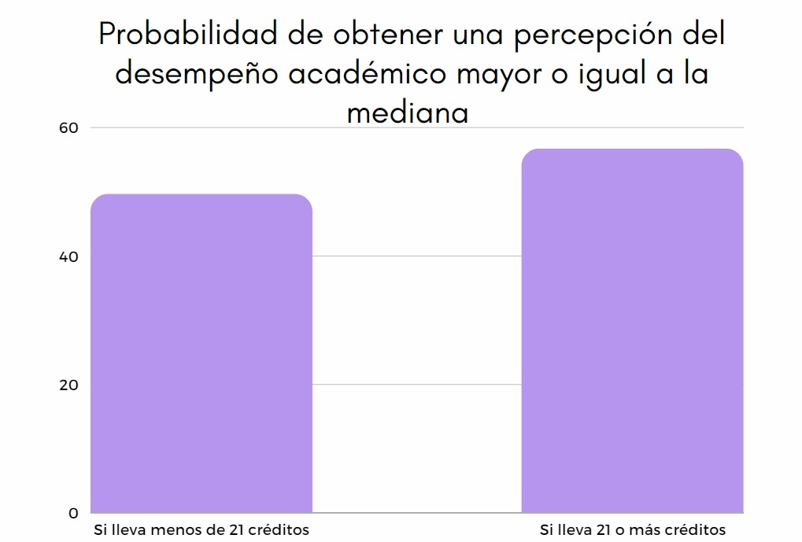
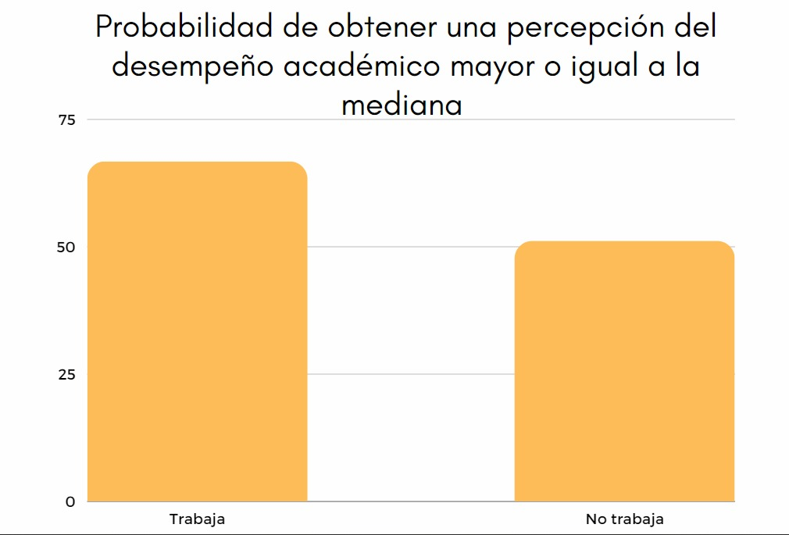
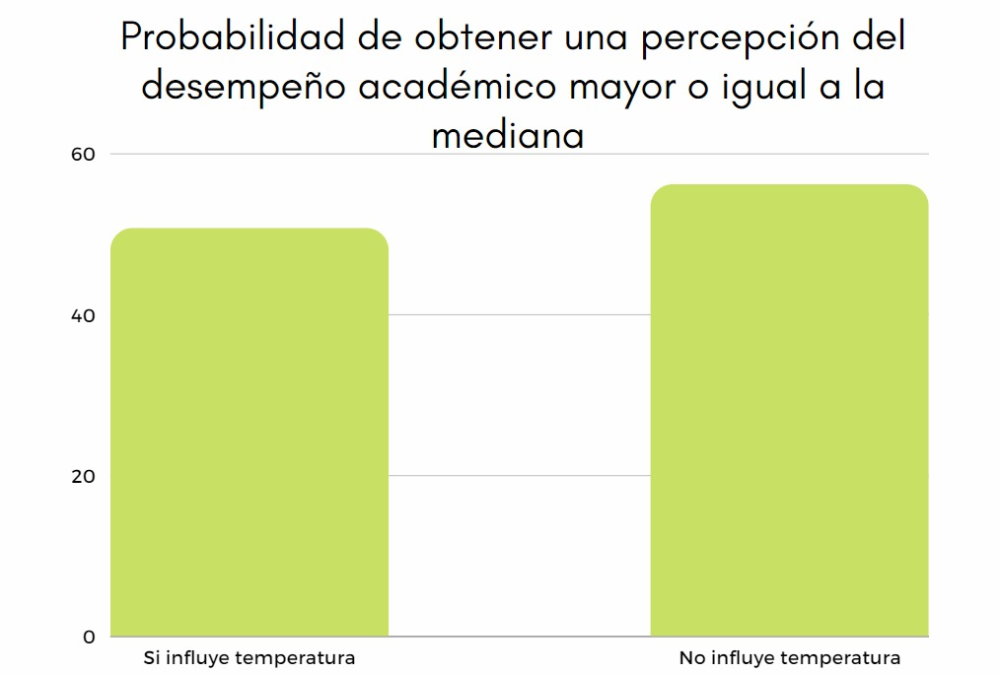
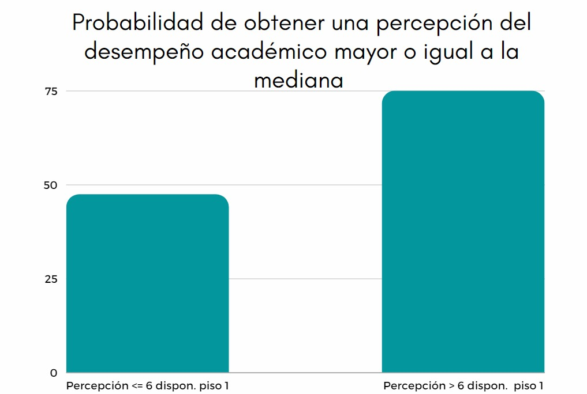

<center>{width="300px"}</center>
------------------------------------------------------------------------

# [**Introducción**]{style="color:deepskyblue"}

## Importancia y Justificación

El desempeño académico de un estudiante universitario puede verse afectado por un conjunto de factores en su entorno, el presente estudio se enfoca en la identificación y análisis del impacto de estos factores sobre su desempeño académico, generando información que será útil para la toma de decisiones que contribuyan a mejorar este desempeño.

## Relevancia

Una función importante de la universidad es velar por el bienestar de los estudiantes en relación con su desempeñó académico, el presente estudio puede complementar la información existente en la universidad y mejorar la comprensión de los factores del entorno del estudiante de UTEC que influencian en su rendimiento académico y tomar las medidas pertinentes.

## Objetivo

### Objetivo general

Analizar los factores asociados al rendimiento académico de los estudiantes de UTEC en el periodo 2022-2 durante la modalidad presencial.

### Objetivos específicos

- Identificar los factores del entorno del estudiante de la UTEC con potencial influencia sobre su desempeño académico.
- Analizar la percepción que tienen los estudiantes de la UTEC de la influencia de los factores de su entorno sobre su desempeño académico.
- Analizar la importancia relativa de los factores sobre el desempeño académico de los estudiantes de UTEC.
- Identificar oportunidades de mejora para contribuir al bienestar de estudiante de la UTEC.


## Planificación

Mediante un diagrama de Gantt representaremos las actividades de elaboración de nuestro proyecto, respetando las fechas de entrega durante el ciclo.

```{r Librerias, echo=FALSE, message=FALSE}

if (! require (ggplot2)) {install.packages ('ggplot2')}
library(ggplot2)

```

# [**Datos**]{style="color:deepskyblue"}

## Recolección de datos

La recolección de datos se efectuó a través de un **muestro aleatorio simple** empleando como instrumento la **encuesta** realizada de manera electrónica mediante el sistema **Google forms**. Se consideraron **36 variables** dirigidas **exclusivamente a estudiantes de la UTEC**, las preguntas fueron diseñadas de modo que sean de fácil comprensión y respuesta por parte de los encuestados, así mismo, se implementaron mecanismos de control de calidad para minimizar errores en las respuestas. La encuesta se difundió a través de redes sociales y mediante mosquitos con código QR distribuidos directamente a los estudiantes de UTEC. Como estrategia para lograr una mayor participación se sorteó un premio entre los encuestados.

## Población, muestra y muestreo

### Población

Todos los estudiantes de pregrado en UTEC que estén cursando actualmente el semestre 2022-2.

### Muestra

El tamaño de la muestra es de 213 encuestados, número que supera al mínimo establecido.

### Muestreo

Muestreo aleatorio simple

## Variables

### 1) Numéricas (6)

| **Variable**       | **Definición**                              |
|:-------------------|:--------------------------------------------|
| Edad               | Edad                                        |
| Creditos           | Cantidad de créditos del ciclo actual       |
| tiempo_llegar      | Tiempo promedio en llegar a UTEC            |
| Horas_dormir       | Horas diarias de sueño                      |
| Horas_estudiar_dia | Horas de estudios diario                    |
| Gasto_mensual      | Gasto mensual aproximado por asistir a UTEC |

### 2) Categóricas (30)

#### Ordinal (17)

| **Variable**          | **Definición**                                                           |
|:-----------------|:-----------------------------------------------------|
| Ciclo                 | Ciclo actual                                                             |
| Seguridad_dis         | Percepción de la seguridad                                               |
| Hora_mas_temprana     | Hora de inicio de la clase más temprana                                  |
| Hora_mas_tarde        | Hora a la que termina la clase más tarde                                 |
| Como_va_academic      | Percepción del desempeño académico                                       |
| Disp_piso_1           | Percepción de disponibilidad de espacio en la sala de estudio del piso 1 |
| Disp_ascensores       | Percepción de disponibilidad de ascensores                               |
| Calidad_almuerzos     | Percepción de calidad de almuerzos del comedor                           |
| Precio_almuerzos      | Percepción de precios de almuerzos del comedor                           |
| Disp_locker           | Percepción de disponibilidad de casilleros                               |
| Disp_cubiculos        | Percepción de disponibilidad de cubículos                                |
| Disp_libros           | Percepción de disponibilidad de libros en la biblioteca                  |
| Disp_compu_biblio     | Percepción de disponibilidad de computadoras                             |
| Disp_material         | Percepción de disponibilidad de material de estudio                      |
| Temp_utec             | Percepción de temperatura dentro de la universidad                       |
| Nivel_estres          | Percepción del nivel de estrés                                           |
| Satisfaccion_act_utec | Percepción de la frecuencia de actividades realizadas por la universidad |

#### Nominal (13)

| **Variable**                 | **Definición**                                                                               |
|:-----------------|:----------------------------------------------------|
| Nombres                      | Nombres                                                                                      |
| Apellidos                    | Apellidos                                                                                    |
| Sexo                         | Sexo                                                                                         |
| Carrera                      | Carrera                                                                                      |
| Distrito                     | Distrito de residencia                                                                       |
| Tipos_transporte             | Tipos de transportes usados para llegar a la universidad                                     |
| Cambio_tecnica_estudio       | Cambio de técnicas de estudio debido a la presencialidad                                     |
| temp_influye                 | Consideración del encuestado sobre la influencia de la temperatura en el bienestar académico |
| Tip_vivienda                 | Tipo de vivienda                                                                             |
| Trabaja                      | Indica si el encuestado trabaja o no                                                         |
| Aspecto_estres               | Aspecto que genera mayor estrés                                                              |
| Preferencia_mod              | Preferencia de modalidad                                                                     |
| Cumplimiento de indicaciones | Cumplimiento de indicaciones                                                                 |

## Limpieza de base de datos

### Consideraciones

-   **Las consideraciones para eliminar observaciones fueron:**

    -   Información irrelevante para el estudio.
    -   Información por números de NA.
    -   Falta de claridad de la información.

\n

-   **Las consideraciones para el tratamiento de variables fueron:**

    -   Dificultad para la identificación de variables con nombres largos.
    -   Incoherencia entre lo que interpreta R y la base de datos actual.

### Procedimiento de limpieza

Comenzaremos realizando la lectura de la base de datos.

```{r,echo=TRUE,message=TRUE,include=FALSE}
library(readr)
library(tidyr)
library(dplyr)
library(modeest)
library(tidyverse)
library(knitr)
library(fitdistrplus)
library(MASS)
library(survival)
library(gapminder) # datos
DatosG7 <- read.csv("Estudio_grupo7.csv")
```

Lo primero que realizaremos será una recategorización de dos variables, debido a que al importarlas a R automáticamente genero un gran cambio en ciertos datos, por lo que para evitar esto cambiaremos estas variables de tipo **Double** a **Character**.

```{r,echo=TRUE}
DatosG7 <- read_csv("Estudio_grupo7.csv", 
    col_types = cols(`¿A qué hora inicia la clase más temprana que tienes en toda la semana?` = col_character(), 
        `¿A qué hora termina la clase más tarde que tienes en toda la semana?` = col_character()))
#Esta parte del código la logramos obtener del propio R a la hora de importarla 
```

Luego de ello, podemos observar que en nuestra base de datos se encuentran columnas que no serán de utilidad, como lo son la marca temporal, la dirección de correo electrónico y la confirmación de realización de cuestionario. Por el cual para solucionar este problema eliminaremos aquellas columnas.

```{r}
DatosG7 <- DatosG7[,c(3:37)]#Se eliminarán las variables de la 1,2 y 38 .
DatosG7 <- DatosG7[complete.cases(DatosG7),]
```

Ya generada la base de datos DatosG7, continuaremos con la modificación de variables:

```{r}
colnames(DatosG7)<-c("Nombres",
           "Apellidos",
           "Edad",
           "Sexo",
           "Carrera",
           "Ciclo",
           "Creditos",
           "Distrito",
           "Tipos_transporte",
           "seguridad_dis",
           "tiempo_llegar",
           "Hora_mas_temprana",
           "Hora_mas_tarde",
           "Cambio_tecnica_estudio",
           "Horas_dormir",
           "Horas_estudiar_dia",
           "como_va_academic",
           "Disp_piso_1",
           "Disp_ascensores",
           "Calidad_almuerzos",
           "Precio_almuerzos",
           "Disp_cubiculos",
           "Disp_locker",
           "Disp_libros",
           "Disp_compu_biblio",
           "Disp_material",
           "Temp_utec",
           "temp_influye",
           "Tip_vivienda",
           "Gasto_mensual",
           "Trabaja",
           "Nivel_estres",
           "Aspecto_estres",
           "Preferencia_mod",
           "Satisfaccion_act_utec")
colnames(DatosG7)
```

Para continuar, solucionaremos ciertos problemas con el tipo de variable.

Transformaremos a las variables **Hora_mas_temprana** y **Hora_mas_tarde** a variables de tipo **numérico**:

```{r}
#Considerar que el comando gsub nos ayudará a extraer los números de la variable character
DatosG7$Hora_mas_temprana <- as.numeric(gsub(".*?([0-9]+).*", "\\1", DatosG7$Hora_mas_temprana)) 
DatosG7$Hora_mas_tarde <- as.numeric(gsub(".*?([0-9]+).*", "\\1", DatosG7$Hora_mas_tarde)) 
```


Transformaremos a la variable **Horas_dormir** a una variable de tipo **numérico**:

```{r}
DatosG7$Horas_dormir <- as.numeric(gsub(".*?([0-9]+).*", "\\1", DatosG7$Horas_dormir)) 
```

Entonces obtendríamos que la base de datos **DatosG7**:

```{r}
head(DatosG7)
```

Realizaremos la verificación de la cantidad de las observaciones para comprobar que nuestra cantidad de observaciones no haya sido afectada, y se encuentre dentro del rango superior a 200.

```{r}
nrow(DatosG7)
```

Comprobamos si hay datos faltantes:

```{r}
sum(is.na(DatosG7))
```

Como podemos observar, nuestra base de datos no presenta ninguna observación faltante, ya que al realizar la encuesta tratamos de usar en su gran mayoría alternativa de elección para facilitar el trabajo al encuestado.


# [**Análisis descriptivo**]{style="color:deepskyblue"}

## Descriptores numéricos

Para la realización de los descriptores numéricos consideramos tomar las variables más relevantes que tendrán un gran impacto sobre nuestra investigación.

**Cantidad créditos:** Hallamos la moda
```{r,echo=FALSE}
mfv(DatosG7$Creditos)
```
A una cantidad de créditos considerables afecta más el cambio de modalidad 2022-2 y el estilo de estudio, entonces observamos las modas son 20 y 21 de un máximo de 26 créditos, esto refleja que los alumnos llevan una cantidad considerable de créditos por lo que la presión es mayor.

**Percepción de seguridad del distrito:** Hallamos la moda y la mediana

```{r,echo=FALSE}
mfv(DatosG7$seguridad_dis)
median(DatosG7$seguridad_dis)
```
A una percepción menos segura del distrito, el efecto de las clases presenciales influirá de **manera negativa** en la salud mental de los estudiantes y este si afecta directamente al desempeño académico. Aquí observamos que en la moda salen 2 valores, 7 y 8, por lo que las muchas personas está a gusto con la seguridad en su zona. Sin embargo, pese a esto la mediana sale 6 por lo que podemos decir que hay varias personas que también ven que hay poca seguridad en los lugares donde viven, entonces en conclusión la seguridad en general está en un punto intermedio.

**Tiempo de llegada a la universidad:** Hallamos la moda y la mediana

```{r,echo=FALSE}
mfv(DatosG7$tiempo_llegar)
median(DatosG7$tiempo_llegar)
```
A mayor tiempo de llegada a la universidad, menor disponibilidad de horas para estudiar. Aquí se puede observar lo mismo que en anterior caso, entonces muchas personas tienen que levantarse temprano para poder llegar a la universidad, pese a esta también llegan muy tarde a su casa, por lo que su descanso se ve reducido.

**Hora de inicio de la clase más temprana:** Hallamos la moda y la mediana

```{r,echo=FALSE}
mfv(DatosG7$Hora_mas_temprana)
median(DatosG7$Hora_mas_temprana)
```
A más temprana la clase, menor tiempo de dormir y menor rendimiento durante el día.

**Hora de finalización de la clase más tarde:** Hallamos la moda y mediana

```{r,echo=FALSE}
mfv(DatosG7$Hora_mas_tarde)
median(DatosG7$Hora_mas_tarde)
```

A más tarde la clase, menos hora de sueño, y mayor riesgo de ser víctima de algún hecho delictivo.
Estos factores se intensifican si el estudiante vive lejos, y tiene una percepción baja de seguridad de su distrito en el que reside.

**Variación de la técnica de estudio:** Hallamos la moda

```{r,echo=FALSE}
mfv(DatosG7$Cambio_tecnica_estudio)
```
Esto indica que muchas personas se tuvieron que adaptar a la nueva presencialidad, por lo que sus hábitos o costumbres se van a remodelar y esto es un proceso de adaptación, a lo que muchos se les dificulta.

**Tiempo de dormir en horas:** Hallamos la moda y mediana

```{r,echo=FALSE}
mfv(DatosG7$Horas_dormir)
median(DatosG7$Horas_dormir)
```
A menor tiempo de dormir, menor rendimiento en el día y menor concentración en las clases. 

**Horas de estudio fuera de clase:** Hallamos la moda, promedio y mediana

```{r,echo=FALSE}
mfv(DatosG7$Horas_estudiar_dia)
round(mean(DatosG7$Horas_dormir),2)
median(DatosG7$Horas_dormir)
```

A mayor horas de estudio, mayor será su desempeño académico. Sin embargo, esto se ve afectado por el tiempo de llegada de la universidad y la disponibilidad de espacios de estudio.

**Percepción de como le va académicamente:** Hallamos la moda y mediana

```{r,echo=FALSE}
mfv(DatosG7$como_va_academic)
median(DatosG7$como_va_academic)
```

Con este dato conoceremos el cómo el estudiante considera que le va académicamente. Podemos observar que muchas estudiantes están con una percepción positiva de sus cursos, por lo que esto indica que se está adaptando bien a la nueva modalidad.

**Disponibilidad** Hallamos las modas

```{r,echo=FALSE}
mfv(DatosG7$Disp_piso_1)
mfv(DatosG7$Disp_ascensores)
mfv(DatosG7$Disp_locker)
mfv(DatosG7$Disp_cubiculos)
mfv(DatosG7$Disp_libros)
mfv(DatosG7$Disp_compu_biblio)
mfv(DatosG7$Disp_material)
```

A menor disponibilidad de los medios ofrecidos por la universidad, menor será el adecuado aprovechamiento de estudio.Observamos que la mayoría de los servicios no se utilizan o que la calificación es muy mala, esto es un punto importante que debería tomar en cuenta la UTEC.

**Consideración de la influencia de la temperatura en el bienestar académico:** Hallamos la moda

```{r,echo=FALSE}
mfv(DatosG7$temp_influye)
```
Muchos estudiantes están de acuerdo con que la temperatura afecta a su rendimiento académico.

**Gasto mensual:** Hallamos la moda, promedio y mediana

```{r,echo=FALSE}
mfv(DatosG7$Gasto_mensual)
round(mean(DatosG7$Gasto_mensual),2)
median(DatosG7$Gasto_mensual)
```
Gasto mensual debido al cambio de modalidad.Podemos observar en los 3 descriptores numéricos son un termino intermedio, donde los estudiantes no se deben preocupar muchos por sus gastos pero tampoco los dejan de lado. 

**Nivel de estrés:** Hallamos la moda

```{r,echo=FALSE}
mfv(DatosG7$Nivel_estres)
```
A mayor nivel de estrés, menos eficiencia académica.

**Preferencia de modalidad:** Hallamos la moda

```{r,echo=FALSE}
mfv(DatosG7$Preferencia_mod)
```
La tendencia de preferencia de modalidad de estudio, entonces muchas personas se han sentido a gusto con la virtualidad, pero también disfrutan de la presencialidad, por lo que se podría decir que su rendimiento académico está equilibrado.

## Descriptores gráficos

#### **Gráfico de barras 1**
Mediante este gráfico lograremos conocer la cantidad de estudiantes que cursan ciertos créditos en el ciclo cursado actualmente.

```{r,echo=FALSE}
barplot(table(DatosG7$Creditos), col = "green2", main = "Créditos de los estudiantes de UTEC",cex.main = 1 ,space = 0.3, ylim = c(0,40),cex.names = 1, cex.axis = 0.8,xlab = "Créditos",ylab = "Cantidad de alumnos") 
```

#### **Gráfico de barras 2**
Mediante este gráfico lograremos conocer la cantidad de estudiantes que consideran que la temperatura influye en su rendimiento académico, esta representación nos ayuda a identificar uno de los factores negativos del cambio de modalidad.

```{r,echo=FALSE}
barplot(table(DatosG7$temp_influye), col = "navy", main = "Influencia de la temperatura",cex.main = 1 ,space = 0.3, ylim = c(0,180),cex.names = 1, cex.axis = 0.8,xlab = "Influencia de la temperatura",ylab = "Cantidad de alumnos") 
```


#### **Gráfico de barras 3**
Mediante esta gráfica lograremos conocer sobre la gran variedad de horas de estudio que tienen los estudiantes de UTEC y el cómo esto influye en su rendimiento académico.

```{r,echo=FALSE}
barplot(table(DatosG7$Horas_estudiar_dia), col = "skyblue", main = "Cantidad de horas de estudio al día",cex.main = 1 ,space = 0.3, ylim = c(0,55),cex.names = 1, cex.axis = 0.8,xlab = "Horas de estudio",ylab = "Cantidad de alumnos") 
```

La mayoría de estudiantes estudia una cantidad relativa de horas, por lo que su desempeño en los estudios va a ser relativo.

#### **Gráfico de dispersión 1** 

Mediante este gráfico lograremos identificar la clase más temprana de estudiante universitario en relación con las horas diarias de dormir.

```{r,echo=FALSE}
plot(DatosG7$Horas_dormir ~DatosG7$Hora_mas_temprana, col="maroon4",main="Horas de dormir x La hora de clase más temprana",xlab="Hora de la clase más temprana",ylab="Horas de dormir")
```

El gráfico nos indica que no hay relación entre las horas de dormir y la clase más temprana.

#### **Diagrama de dispersión 2** 

Mediante este gráfico lograremos identificar el nivel de estrés del estudiante universitario en relación con la hora de clase más tarde que tiene en el día.

```{r,echo=FALSE}
plot(DatosG7$Nivel_estres~DatosG7$Hora_mas_tarde, col="green3",main="Nivel de estrés x La hora de clase mas tarde",xlab="Hora de la clase mas tarde",ylab="Nivel de estrés")
```

#### **Gráfico de caja 1** 

Mediante esta gráfica lograremos identificar el cómo influye el tiempo de llegada a la universidad con respecto al nivel de estrés del estudiante universitario.

```{r,echo=FALSE}

boxplot(DatosG7$Nivel_estres ~ DatosG7$tiempo_llegar, varwidth = TRUE, col = c("skyblue2","navy","blue","maroon","skyblue","skyblue4","green2","navy","maroon4"), main = "Nivel de estrés x Tiempo de llegada",cex.main = 1 ,space = 0.3, ylim = c(0,10),cex.names = 1, cex.axis = 0.8,xlab = "Tiempo de llegada",ylab = "Nivel de estrés")
```

#### **Mosaico 1**

Mediante esta gráfica lograremos conocer como la percepción de seguridad es un factor para la preferencia de modalidad, debido a que si la zona en donde viven no es segura, se inclinarán a preferir una modalidad híbrida.

```{r,echo=FALSE}

mosaicplot(DatosG7$Preferencia_mod ~ DatosG7$seguridad_dis,
           col=2:5,
           main="Gráfico de mosaico",
           xlab="Cambio técnica estudio",
           ylab="Preferencia modalidad",
           cex.axis=.5,
           las=1)
```


#### **Diagrama de caja 2** 

Mediante esta gráfica lograremos observar la relación entre los gastos mensuales entre estudiantes que trabajan y los que no, en relación con la nueva modalidad presencial actual.

```{r,echo=FALSE}
boxplot(DatosG7$Gasto_mensual ~ DatosG7$Trabaja, varwidth = TRUE, col = "skyblue", main = "Gasto mensual x Trabaja",cex.main = 1 ,space = 0.3, ylim = c(0,2200),cex.names = 1, cex.axis = 0.8,xlab = "Trabaja",ylab = "Gasto mensual")

```

#### **Diagrama de caja 3** 
Mediante este gráfico lograremos conocer la relación que existe entre la cantidad de créditos cursados por estudiantes que trabajan, y estudiantes que no.

```{r,echo=FALSE}
boxplot(DatosG7$Creditos ~ DatosG7$Trabaja, varwidth = TRUE, col = "skyblue4", main = "Creditos x Trabaja",cex.main = 1 ,space = 0.3, ylim = c(10,25),cex.names = 1, cex.axis = 0.8,xlab = "Trabaja",ylab = "Creditos")
```

#### **Mosaico 2**
Mediante este gráfico lograremos conocer el cómo la influencia de la temperatura es un factor que lograría generar estrés junto a la presencialidad.

```{r,echo=FALSE}
mosaicplot(DatosG7$temp_influye~DatosG7$Aspecto_estres,
           col=2:5,
           main="Gráfico de mosaico",
           xlab="Influencia de la temperatura",
           ylab="Aspecto que le generan estres",
           cex.axis=.5,
           las=1)
```

#### **Mosaico 3**
Mediante este gráfico lograremos identificar la preferencia de modalidad de los estudiantes en relación con el cambio de estudio, esto con el fin de poder recopilar información de como estos factores afectarían a su rendimiento académico.

```{r,echo=FALSE}
mosaicplot(DatosG7$Cambio_tecnica_estudio ~ DatosG7$Preferencia_mod,
           col=2:5,
           main="Gráfico de mosaico",
           xlab="Cambio técnica estudio",
           ylab="Preferencia modalidad",
           cex.axis=.5,
           las=1)
```


#### **Diagrama de caja 4** 
Mediante este gráfico lograremos conocer la relación que existe entre la la percepción del nivel de estrés por el tiempo de llegar a la universidad en horas.

```{r,echo=FALSE}
boxplot(DatosG7$Nivel_estres ~DatosG7$tiempo_llegar,main="Percepción de nivel de estrés x tiempo en llegar a universidad", xlab = "Tiempo en llegar a la universidad", ylab = "Percepción de nivel de estrés", col=c("orange"),varwidth=TRUE)
```


#### **Mosaico 4**
Mediante este gráfico lograremos identificar la percepción de los estudiantes de UTEC acerca de su desempeño académico por la preferencia de la modalidad, esto con el fin de poder recopilar información de como estos factores afectarían a su rendimiento académico.
```{r,echo=FALSE}
mosaicplot(DatosG7$como_va_academic ~ DatosG7$Preferencia_mod,
           col=2:5,
           main="Gráfico de mosaico",
           xlab="Percepción del rendimiento académico",
           ylab="Preferencia modalidad",
           cex.axis=.5,
           las=1)
```


#### **Mosaico 5**
Mediante este gráfico lograremos identificar si el estudiante cambió o no sus técnicas de estudios por su percepción de como es su despeño académico hasta la fecha, esto con el fin de poder recopilar información de como estos factores afectarían a su rendimiento académico.

```{r,echo=FALSE}
mosaicplot(DatosG7$Cambio_tecnica_estudio~ DatosG7$como_va_academic,
           col=2:5,
           main="Gráfico de mosaico",
           xlab="Cambios en técnicas de estudio",
           ylab="Percepción de rendimiento académico",
           cex.axis=.5,
           las=1)
```


# [**Análisis probabilístico**]{style="color:deepskyblue"}

Ahora realizaremos el análisis de nuestras variables más importantes en términos de las probabilidades de los distintos eventos que estas logran representar.


## Análisis de la variable `Horas_dormir ` y `Nivel_estres `

#### [**¿Cuál es la probabilidad de obtener una calificación de nivel estrés superior al nivel 6 dado que un estudiante durmió menos que 6 horas?**]{style="color:Sienna"}

**Variable aleatoria N:** Número de estudiantes con una calificación de estrés 

```{r}
N<-DatosG7$Nivel_estres
H<-DatosG7$Horas_dormir
n<-nrow(DatosG7)

ValN<-6 #Nivel_estres -> 6
ValH<-6 #Horas_dormir -> 6
```

La fórmula de probabilidad condicional es:<br>

<center>$$\mathbb{P}(A|B)=\frac{\mathbb{P}(A \cap B)}{\mathbb{P}(B)}$$</center><br>

La equivalencia de la pregunta es:<br>

<center>$$\mathbb{P}(N>6|H<6)=\frac{\mathbb{P}(N>6\cap H<6)}{\mathbb{P}(H<6)}$$</center><br>

Mediante ello determinamos la probabilidad:

```{r}
(sum((N>ValN)&(H<ValH))/n)/(sum(H<ValH)/n)
# 73.25581%
```
Por lo tanto, podemos decir que el estudiante que durmió menos que 6 horas tiene aproximadamente 73.26% de probabilidad de tener una calificación de nivel de estrés mayor al nivel 6.
 
#### [**¿Cuál es la probabilidad de que un estudiante de UTEC duerma más de 5 horas al día?**]{style="color:Sienna"}

Sea:
$$X∼Exp(λ)$$<br>
Donde X representa a la variable `Horas_dormir`, podemos decir que:
 $$E(X) = \frac {1}{\lambda}$$<br>
 
Comprobamos que sea una variable exponencial:

```{r}
p<-(DatosG7$Horas_dormir>5)/nrow(DatosG7)
Lambda<- 1/(1/mean(DatosG7$Horas_dormir))

Tabla<-data.frame(prop.table(table(DatosG7$Horas_dormir)))
Tabla$Var1<-as.numeric(Tabla$Var1)

#Generamos vectores
val1<-Tabla$Var1
val2<-Tabla$Freq
result<-sum(val1*val2)
result
Lambda

```

Con este resultado podemos concluir que el valor obtenido mediante la fórmula de esperanza es aproximado al valor de Lambda donde esta representa la probabilidad, por el cual podemos decir que la variable si cumple con ser exponencial.

Mediante la siguiente gráfica se denotará la gráfica de la variable exponencial:

```{r}
hist(table(DatosG7$Horas_dormir))
```
```{r}
mean(DatosG7$Horas_dormir)
```


```{r}
Lambda<- (mean(DatosG7$Horas_dormir))

x <- seq(0, Lambda, 0.1)

plot(x, dexp(x, Lambda), type = "l",
     ylab = "F(x)", lwd = 1, col = "red",main="Gráfica de la variable exponencial")
```

```{r}
round(pexp(5, rate=Lambda, lower.tail=FALSE),2)
# 42%
```

Según el modelo obtenemos que la probabilidad es menos del 50%.

#### [**¿Cuál es la probabilidad de que un estudiante de UTEC duerma más de 8 horas al día?**]{style="color:Sienna"}

```{r}
round(pexp(8, rate=Lambda, lower.tail=FALSE),2)
```
Como se puede esperar, existe una probabilidad 25% que un estudiante de UTEC duerma más de 8 horas al día, según el modelo planteada.

Se puede comprobar estas suposiciones con un gráfico de Cullen y Frey que nos muestra como se ajusta nuestro modelo.

```{r}
descdist(DatosG7$Horas_dormir, boot = 10)
```
El gráfico muestra la relación más próxima de la columna de datos, la cual señala que la distribución de los datos experimentales siguen la distribución exponencial, una Weibull o una gamma, puesto que el conjunto de datos se encuentran cerca a las formas que indican dichas distribuciones.


#### [**¿Cuál es la probabilidad de obtener una calificación de nivel estrés superior al nivel 6 dado que un estudiante durmió más o igual que 7 horas?**]{style="color:Sienna"}

```{r}
ValH2<-7
round((sum((N>ValN)&(H>=ValH2))/n)/(sum(H>=ValH2)/n),2)
# 46 %
```

Mediante los resultados y análisis realizados podemos mencionar un estudiante que durmió más o igual a 7 horas tenga una probabilidad de 54% de tener una calificación de estrés superior al nivel 6, concluyendo que a pesar de dormir más o menos, la probabilidad de tener una calificación de estrés superior es igual al 46% de toda la muestra.


## Análisis de la variable `Preferencia_mod `

**Evento:** Los estudiantes de UTEC tienen preferencias respecto a las modalidades en la que se brindan las clases tanto virtuales, híbridas y presenciales.


#### [**De los encuestados (213) ¿Cuál es la probabilidad que 10 prefieran la modalidad presencial?**]{style="color:Sienna"}


**Variable aleatoria:**

+ $\mathbb{X}$: Número de alumnos que prefieren la modalidad presencial 

+ $\mathbb{P}$: Probabilidad de que los alumnos prefieran la modalidad presencial


**Usamos el modelo binomial:**

<center>$\mathbb{X}\sim \mathsf{Bin}(213,p)$</center><br>

```{r}
p<-sum(DatosG7$Preferencia_mod=="Presencialidad") /nrow(DatosG7)
p
```

```{r}
dbinom(10,213,0.23)
```

Observamos que existe una probabilidad menor a 0.001% que 10 de los 213 encuestados prefieran la modalidad presencial. 

Para analizar mejor la distribución de esta probabilidad observemos la siguiente gráfica: 
```{r}
barplot(dbinom(0:213,size=213,prob=0.23),names.arg=c(0:213))
```

### **Así mismo para la modalidad:**

#### [**"Híbrida"**]{style="color:Sienna"}

**Variable aleatoria:**

+ $\mathbb{X}$: Número de alumnos que prefieren la modalidad híbrida 

+ $\mathbb{P}$: La probabilidad de que los alumnos prefieran la modalidad híbrida


**Usamos el modelo binomial:** 

<center>$\mathbb{X}\sim \mathsf{Bin}(213,p)$</center><br>

```{r}
p<-sum(DatosG7$Preferencia_mod=="Hibrido") /nrow(DatosG7)
p
```

```{r}
dbinom(10,213,0.62)
```

Observamos que existe una probabilidad menor a 0.001% que 10 de los 213 encuestados prefieran la modalidad híbrida.

Para analizar mejor la distribución de esta probabilidad observemos la siguiente gráfica:

```{r}
barplot(dbinom(0:213,size=213,prob=0.62),names.arg=c(0:213))

```

#### [**"Virtual"**]{style="color:Sienna"}

**Variable aleatoria:**

+ $\mathbb{X}$: Número de alumnos que prefieren la modalidad virtual  
+ $\mathbb{P}$: La probabilidad de que los alumnos prefieran la modalidad virtual

**Usamos el modelo binomial:** 

<center>$\mathbb{X}\sim \mathsf{Bin}(213,p)$</center><br>

```{r}
p<-sum(DatosG7$Preferencia_mod=="Virtualidad")/nrow(DatosG7)
p
```

```{r}
dbinom(10,213,0.15)
```

Observamos que existe una probabilidad menor a 0.001% que 10 de los 213 encuestados prefieran la modalidad virtual. 

Para analizar mejor la distribución de esta probabilidad observemos la siguiente gráfica: 
```{r}
barplot(dbinom(0:213,size=213,prob=0.15),names.arg=c(0:213))

```

Entonces, es mucho mas probable que los alumnos prefieran las modalidad híbrida que la demás modalidades, mientras que la diferencia entre la modalidad presencial y la virtual, son casi mínimas.


## Análisis de `Seguridad_dis`, `Hora_mas_temprana` y `Hora_mas_tarde`

**Notas:** 

+ **"Tarde"** es las horas entre 12 pm y 11:59 pm.
+ Seguridad percibida -> 0 es muy malo y 10 es muy bueno. 

#### [¿Cuál es la probabilidad de que un estudiante tenga una percepción de nivel de seguridad mayor o igual a 5 en la hora de la clase más temprana en la mañana?]{style="color:Sienna"}

La probabilidad de que un estudiante tenga una percepción de nivel de seguridad mayor o igual a 5 en la hora de la clase más temprana en la mañana lo vamos a definir como **$P_{\mathbb{sm}}$**.

Seleccionamos la hora de la clase más temprana en la mañana y lo asignamos a la variable `Horatemprana`:
 
```{r}
Horatemprana <- min(unique(DatosG7$Hora_mas_temprana))
Horatemprana 
```

En la variable `Alumnossieteam` se encuentran los alumnos que tienen clases a las 7 de la mañana:
```{r}
# Percepción de la seguridad de los estudiante que tienen clases a las 7 de la mañana
Alumnossieteam <- DatosG7%>%filter(DatosG7$Hora_mas_temprana==7)
```

Utilizamos la siguiente fórmula de probabilidad condicional:

<br>$$
\begin{aligned}
Sean~~A:&~Percepción~de~seguridad~mayor~o~igual~a~5\\
B:&~Total~de~alumnos~que~asisten~a~las~7~am\\
\\Entonces~~&P_{\mathbb{sm}}(A\big|B)=\frac{P(A~\cap B)}{B}\\
\\Donde~~&P(A~\cap B)={\text{Casos a favor}}\\
\\Conclusión~~&P_{\mathbb{sm}}(A\big|B)=\frac{P(A~\cap B)}{B}=\frac{\text{Casos a favor}}{\text{Casos totales}}\\
\end{aligned}
$$<br>

Los casos a favor lo asignamos a la variable `Casosfavor`:

```{r}
# SMmayoracinco contiene a los estudiante que tienen clases a las 7 de la mañana, la percepción es mayor o igual a 5
SMmayoracinco <- Alumnossieteam%>%filter(Alumnossieteam$seguridad_dis>=5)
Casosfavor <- nrow(SMmayoracinco)
Casosfavor  
```

Los casos totales lo asignamos a la variable `CasosTotalesM`: 

```{r}
CasosTotalesM <- nrow(Alumnossieteam)
CasosTotalesM
```
Intercambiamos los valores:

<br>$$P_{\mathbb{sm}}(A\big|B)=\frac{96}{136}=0.71=71\%$$<br>

Obtenemos que es de 71% la probabilidad de que un estudiante tenga una percepción de nivel de seguridad mayor o igual a 5 en la hora de la clase más temprana en la mañana.

#### [¿Cuál es la probabilidad de que un estudiante tenga una percepción de nivel de seguridad igual menor a 5 en la hora de la clase más tarde en la tarde o noche?]{style="color:Sienna"}

A la probabilidad de que un estudiante tenga una percepción de nivel de seguridad menor a 5 en la hora de la clase más tarde en la tarde o noche lo vamos a definir como **$P_{\mathbb{stm}}$**.

Seleccionamos la hora de la clase más tarde en la tarde o noche y lo asignamos a la variable `Horatarde`.
 
```{r}
Horatarde <- min(unique(DatosG7$Hora_mas_tarde))
Horatarde
```

En la variable `Alumnosdiezpm` se encuentran los alumnos que tienen clases a las 22 de la noche.
```{r}
# Percepción de la seguridad de los estudiante que tienen clases a las 22 de la noche
Alumnosdiezpm <- DatosG7%>%filter(DatosG7$Hora_mas_tarde==22)
```

Utilizamos la siguiente fórmula de probabilidad:

<br>$$
\begin{aligned}
Sean~~A:&~Percepción~de~seguridad~menor~a~5\\
B:&~Total~de~alumnos~que~asisten~a~las~22~pm\\
\\Entonces~~&P_{\mathbb{stm}}(A\big|B)=\frac{P(A~\cap B)}{B}\\
\\Donde~~&P(A~\cap B)={\text{Casos a favor}}\\
\\Conclusión~~&P_{\mathbb{stm}}(A\big|B)=\frac{P(A~\cap B)}{B}=\frac{\text{Casos a favor}}{\text{Casos totales}}\\
\end{aligned}
$$<br>

Los casos a favor lo asignamos a la variable `Casosfavor`:

```{r}
# SNigualacero contiene a los estudiante que tienen clases a las 22 de la noche, la percepción menor a 5
SNigualacero <- Alumnosdiezpm%>%filter(Alumnosdiezpm$seguridad_dis<=5)
Casosfavor <- nrow(SNigualacero)
Casosfavor
```

Los casos totales lo asignamos a la variable `CasosTotalesM`: 

```{r}
CasosTotalesN <- nrow(Alumnosdiezpm)
CasosTotalesN
```

Intercambiamos los valores:

<br>$$P_{\mathbb{stm}}(A\big|B)=\frac{40}{75}=0.53=53\%$$<br>

Obtenemos que es de 53% probabilidad de que un estudiante tenga una percepción de nivel de seguridad menor a 5 en la hora de la clase más tarde en la tarde.


## Análisis de la moda de la variable `Creditos` y `Horas_estudiar_dia`

#### [**¿Cuál es la probabilidad que un estudiante lleve entre 20 y 21 créditos (moda), y estudie más de 3 horas al día?**]{style="color:Sienna"}

Almacenamos los datos de la variable `Creditos` en la variable C:
```{r}
C<-DatosG7$Creditos
```
Almacenamos la variable `Horas_estudiar_dia` en la variable H:
```{r}
H<-DatosG7$Horas_estudiar_dia
```
Hallamos la cantidad de personas que estudiantes entre **"3 a 4 horas diarias a más"**:
```{r}
MH<-sum(DatosG7$ Horas_estudiar_dia=="3 horas a 4 horas")+sum(DatosG7$ Horas_estudiar_dia=="4 horas a 5 horas")+sum(DatosG7$ Horas_estudiar_dia=="5 horas a 6 horas")+sum(DatosG7$ Horas_estudiar_dia=="6 horas a 7 horas")+sum(DatosG7$ Horas_estudiar_dia=="7 horas a 8 horas")+sum(DatosG7$ Horas_estudiar_dia=="8 horas a 9 horas")+sum(DatosG7$ Horas_estudiar_dia=="9 horas a 10 horas")+sum(DatosG7$ Horas_estudiar_dia=="10 horas a 11 horas")+sum(DatosG7$ Horas_estudiar_dia=="11 horas a 12 horas")+sum(DatosG7$ Horas_estudiar_dia=="12 horas a 13 horas")
MH
```
Hallamos la moda de la variable `Credito`:
```{r}
moda_Creditos<-mfv(DatosG7$Creditos)
moda_Creditos
```
Hallamos la cantidad de personas que tienen la moda de la variable `Credito`:
```{r}
MC<-sum(DatosG7$Creditos==moda_Creditos[1] | DatosG7$Creditos==moda_Creditos[2])
MC
```

Considerando que la fórmula de probabilidad:

<br>$$P(A∩B) = P(A)*(B)$$<br>
Aplicamos dicha fórmula:
```{r}
P_credito=MC/213
P_horas=MH/213
P_Total=P_credito*P_horas
P_Total  
# 22.11201%
```
## Análisis de la probabilidad de la variable `tiempo_llegar` con respecto al `Gasto_mensual`

#### [**¿Cuál es la probabilidad que un alumno demore entre 1 a 2 horas en llegar a la universidad y gaste la moda del gasto mensual?**]{style="color:Sienna"}

Almacenamos los datos de tiempo de llegada en la variable `tiempo`:
```{r}
tiempo<-DatosG7$tiempo_llegar
```
Almacenamos en la variable `Mtiempo` la cantidad de personas que tienen un tiempo de llegar a la universidad de **"1hora a 2 horas"**:
```{r}
Mtiempo<-sum(DatosG7$tiempo_llegar=="1 hora a 2 horas" )
Mtiempo
```
Hallamos la probabilidad de las personas almacenadas en la variable `Mtiempo` respecto al total de encuestados:
```{r}
P_tiempo<-Mtiempo/213
P_tiempo
```
Hallamos la moda de la variable `Gato_mensual` y lo llamamos moda_dinero:
```{r}
Moda_dinero<-mfv(DatosG7$Gasto_mensual)
Moda_dinero
```
Hallamos la probabilidad de las personas que tienen la `Moda_dinero` respecto al total:
```{r}
P_D<-sum(DatosG7$Gasto_mensual==Moda_dinero)/213
P_D
```
Considerando que la fórmula de probabilidad:

<br>$$P(A∩B) =  P(A)*(B)$$<br>

```{r}
Probabilidad<-P_D*P_tiempo
Probabilidad 
# 2.997642%
```


## Análisis de la variable `como_va_academic`

En esta sección, analizaremos a la variable **"Percepción del desempeño académico"**. Así sacaremos conclusiones usando los conceptos de probabilidad aprendidos en clase, a la vez que analizamos su relación con otras variables.


```{r, echo=FALSE}
DatosG7[DatosG7=="No utilizo"]<-"11"

DatosG7$Disp_cubiculos<-as.numeric(DatosG7$Disp_cubiculos)

DatosG7$Disp_material<-as.numeric(DatosG7$Disp_material)

DatosG7[DatosG7=="Sí"]<-"Si"
DatosG7[DatosG7=="Si"]<-"1"
DatosG7[DatosG7=="No"]<-"2"

DatosG7$temp_influye<-as.numeric(DatosG7$temp_influye)
DatosG7$Trabaja<-as.numeric(DatosG7$Trabaja)

```

### 1) Respecto a la variable `Créditos`

#### [**¿Cuál es la probabilidad de obtener una percepción del desempeño académico mayor o igual 7 si un estudiante lleva 21 o más créditos?**]{style="color:Sienna"}


```{r}
N<-DatosG7$como_va_academic
H<-DatosG7$Creditos
n<-nrow(DatosG7)

MedianN<-median(DatosG7$como_va_academic) #Mediana igual a 7
```


```{r}
(sum((N>=MedianN)&(H>=21))/n)/(sum(H>=21)/n)
# 56.66667%
```


#### [**¿Cuál es la probabilidad de obtener una percepción del desempeño académico superior o igual a 7 si un estudiante lleva menos de 21 créditos?**]{style="color:Sienna"}

```{r}
N<-DatosG7$como_va_academic
H<-DatosG7$Creditos
n<-nrow(DatosG7)

MedianN<-median(DatosG7$como_va_academic) #Mediana igual a 7
```


```{r}
(sum((N>=MedianN)&(H<21))/n)/(sum(H<21)/n)
# 49.5935%
```
Notamos que la probabilidad dada la primera condición es de 56.67%. Mientras que la probabilidad dada la segunda es de 49.59%. Es decir, es más probable que alguien que lleva 21 créditos o más tenga una buena percepción de su desempeño, a comparación de alguien que lleva menos créditos. Lo que nos lleva a la conclusión que la percepción del desempeño académico no mejora si lleva menos créditos.


 {width='700px'}

### 2) Respecto a la variable `Trabaja`

#### [**¿Cuál es la probabilidad de obtener una percepción del desempeño académico superior o igual a 7 si un estudiante no trabaja?**]{style="color:Sienna"}


```{r}
N<-DatosG7$como_va_academic
H<-DatosG7$Trabaja
n<-nrow(DatosG7)

MedianN<-median(DatosG7$como_va_academic) #Mediana igual a 7
```

```{r}
(sum((N>=MedianN)&(H==2 ))/n)/(sum(H==2)/n)
# 51.04167%
```


#### [**¿Cuál es la probabilidad de obtener una percepción del desempeño académico superior o igual a 7 si un estudiante trabaja?**]{style="color:Sienna"}

```{r}
N<-DatosG7$como_va_academic
H<-DatosG7$Trabaja
n<-nrow(DatosG7)

MedianN<-median(DatosG7$como_va_academic) #Mediana igual a 7
```

```{r}
(sum((N>=MedianN)&(H==1))/n)/(sum(H==1)/n)
# 66.66667%
```

Notamos que la probabilidad dada la primera condición es de 51.04%. Mientras que la probabilidad dada la segunda es de 66.67%. Es decir, es más probable que alguien que trabaja tenga una buena percepción de su desempeño, a comparación de alguien que no trabaja. Lo que nos lleva a la conclusión que el mejoramiento de la percepción del desempeño académico no depende si el estudiante trabaja o no.

{width='700px'}

### 3) Respecto a la variable `temp_influye`


#### [**¿Cuál es la probabilidad de obtener una percepción del desempeño académico superior o igual a 7 si un estudiante cree que la temperatura influye en su bienestar académico?**]{style="color:Sienna"}


```{r}
N<-DatosG7$como_va_academic
H<-DatosG7$temp_influye
n<-nrow(DatosG7)

MedianN<-median(DatosG7$como_va_academic) #Mediana igual a 7
```

```{r}
(sum((N>=MedianN)&(H==1 ))/n)/(sum(H==1)/n)
# 50.71429%
```

#### [**¿Cuál es la probabilidad de obtener una percepción del desempeño académico superior o igual a 7 dado que un estudiante no cree que la temperatura influye en su bienestar académico?**]{style="color:Sienna"}

```{r}
N<-DatosG7$como_va_academic
H<-DatosG7$temp_influye
n<-nrow(DatosG7)

MedianN<-median(DatosG7$como_va_academic) #Mediana igual a 7
```

```{r}
(sum((N>=MedianN)&(H==2))/n)/(sum(H==2)/n)
# 56.16438%
```

Notamos que la probabilidad dada la primera condición es de 50.71%. Mientras que la probabilidad dada la segunda es de 56.16%. Es decir, es más probable que alguien que cree que la temperatura no influye en su bienestar académico tenga una buena percepción de su desempeño, a comparación de alguien que sí cree que influye. Lo que nos lleva a la conclusión que la percepción del desempeño académico va a depender si al estudiante le afecta o no la temperatura dentro de la universidad.

{width='700px'}


### 4) Respecto a la variable `Disp_piso_1` 

#### [**¿Cuál es la probabilidad de obtener una percepción del desempeño académico superior o igual a 7 si un estudiante tiene una percepción mayor a 6 respecto a la disponibilidad de la sala de estudios del piso 1?**]{style="color:Sienna"}

```{r}
N<-DatosG7$como_va_academic
H<-DatosG7$Disp_piso_1
n<-nrow(DatosG7)

MedianN<-median(DatosG7$como_va_academic) #Mediana igual a 7
```

```{r}
(sum((N>=MedianN)&(H>6))/n)/(sum(H>6)/n)
# 75%
```

#### [**¿Cuál es la probabilidad de obtener una percepción del desempeño académico inferior o igual a 7 si un estudiante tiene una percepción menor a 6 respecto a la disponibilidad de la sala de estudios del piso 1?**]{style="color:Sienna"}

```{r}
N<-DatosG7$como_va_academic
H<-DatosG7$Disp_piso_1
n<-nrow(DatosG7)

MedianN<-median(DatosG7$como_va_academic) #Mediana igual a 7
```

```{r}
(sum((N>=MedianN)&(H<=6))/n)/(sum(H<=6)/n)
# 47.39884%
```
Notamos que la probabilidad dada la primera condición es de 75%. Mientras que la probabilidad dada la segunda es de 47.4%. Es decir, es más probable que alguien que tenga una percepción mayor a 6 respecto a la disponibilidad del piso 1, tenga una buena percepción de su desempeño, a comparación de alguien con una percepción menor de disponibilidad. Lo que nos lleva a la conclusión que la percepción del desempeño académico se verá afectada positivamente si el estudiante se siente satisfecho con la disponibilidad de del piso 1.

{width='700px'}


# [**Conclusión**]{style="color:deepskyblue"}

## **Con respecto a los objetivos, se puede observar lo siguiente:**

+ El regresar a las clases presenciales a nivel nacional tuvo efecto en el estilo de vida de las personas, y los alumnos de la universidad de ingeniería no fueron la excepción, de hecho, se evidencia que factores como la temperatura, número de créditos, tiempo de viaje, gasto mensual han influido en su rendimiento académico este ciclo 2022-2. Por lo tanto, prefieren la modalidad híbrida para poder tener mayor libertad y control de su tiempo. 

+ Se pudo realizar análisis con respecto a la percepción de los estudiantes y su entorno gracias a los datos obtenidos.

+ Se observa que la importancia de estos factores sobre el desempeño académico es regular, en otras palabras, no gran influencia, pero tampoco significa que no influye en nada sobre el desempeño académico.

+ **A partir de todos los factores mencionados, se pueden ver problemas, pero que pueden solucionarse, por ejemplo:**
    + En el caso de la temperatura, al ver el impacto, se podría implementar un sistema de calefacción para días frío, con el objetivo de que el estudiante tenga un entorno más cómodo para estudiar.
    + En el caso de los estudiantes que viven lejos, la universidad puede implementar una sistema de transporte solo para estudiantes de UTEC, con el objetivo que los alumnos se sientan más seguros y así puedan mejorar en su desempeño académico.


## **Además encontramos puntos interesantes que caben mencionar:**

+ Se observó que la mayoría los alumnos de UTEC tienen un nivel elevado de estrés cuando duermen menos de 6 horas, pese a esto, más de la mitad de alumnos duermen menos de 5 horas al día.

+ Muchos piensan que la mayoría prefiere la modalidad virtual, pese a esto, se observa que la mayoría prefiere la modalidad híbrida.

+ Se puede confirmar que la percepción de la seguridad es mejor en la mañana que en la noche, debido a que los alumnos se sienten más seguros a las 7 am que a las 10 pm.

+ Se observa que muchos alumnos de UTEC, pese a tener 20 o 21 créditos, lo cual requiere una cantidad considerable de horas de estudio, estudian menos de 3 horas al día.

+ Se observa que es muy poco probable que los estudiantes gasten o dediquen una buena cantidad de dinero en el transporte.


## Trabajo en grupo

La experiencia de trabajo como equipo durante la segunda entrega fue muy enriquecedora y fortaleció nuestro trabajo colaborativo, en esta segunda parte afrontamos desafíos como disponibilidad de tiempo debido a la precisión de las últimas semanas de clases, lo resolvimos repartiendo bien nuestras tareas, el secreto está en hacer pequeños esfuerzos y separar espacios en nuestra agenda para las reuniones donde analizamos y designamos tareas.


