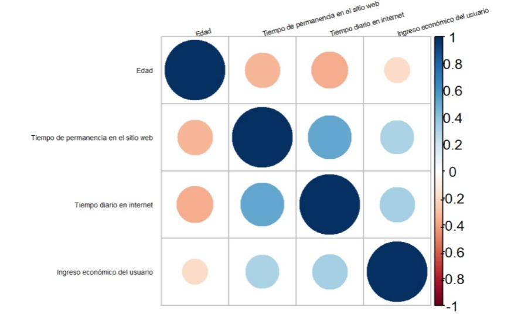
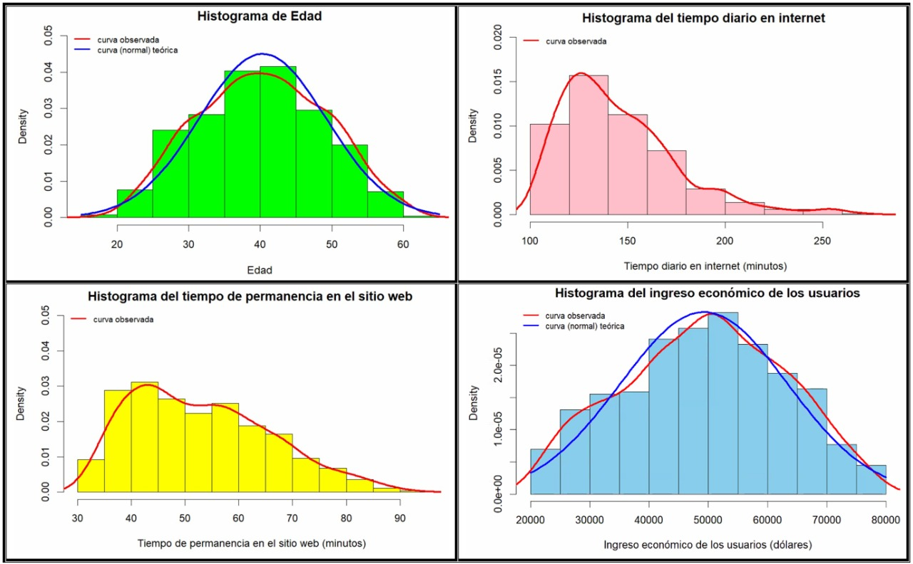

-***CARGANDO TODAS LAS LIBRERÍAS A UTILIZAR***
```{r}
library(readr)
library(modeest)
library(ggplot2)
library(dplyr)
library(plyr)
library(stringr)
library(plotrix)
library(corrplot)
library(fitdistrplus)
```

# **Título:** "El Phishing, la delincuencia acorde a la modernidad"


<center>

</center> 

# <span style="color:blue"> **1. INTRODUCCIÓN**. </span>

## **1.1. RELEVANCIA**
La importancia de este proyecto gira en torno a analizar e identificar la tendencia de la vulnerabilidad de los usuarios frente a los fraudes cibernéticos, conocido como Phishing, a través de publicaciones falsas o engañosas que se les llega a presentar durante su estadía en el internet. Asimismo, de comprender y percibir la contextualización detallada en la aparición de este tipo de publicidades en los dispositivos electrónicos de los cibernautas involucrados, mediante el estudio de las variables cualitativas y cuantitativas registradas en la base de datos con respecto al tema publicada en la web.


##  **1.2. MARCO TEÓRICO**
El Phishing es aquel delito que consiste en engañar a las personas para que compartan su información confidencial como claves y/o números de tarjetas de créditos. Pues, Phishing proviene del inglés fishing, la cual denota la acción de "pescar" haciendo referencia a la captación de victimas. Este método representa una de las formas más accesibles de lograr un ciberataque en la actualidad, y al mismo tiempo, la más eficaz y peligrosa, puesto que a diferencia de otros tipos de amenazas cibernéticas, el phishing no requiere de conocimientos muy sofisticados para su aplicación. Esta puede ser evidenciada a través de falsos correos electrónicos  o publicidades engañosas donde se le dice al incauto cibernauta que ha sido acreedor de un premio y que para recibirlo esta en la obligación de rellenar una "encuesta"[1]. 

<center>

</center> 

## **1.3. OBJETIVOS**

### ***1.3.1. Objetivo general:***
- Analizar el comportamiento de la vulnerabilidad de los cibernautas ante la presencia de Phishing a través de publicaciones falsas durante su estadía en el ciberespacio en base a las variables registradas en el año 2016.


### ***1.3.2. Objetivos específicos:***
- Conocer la contextualización detallada de los cibernautas incautos que han dado clic en este tipo de anuncios.
- Emplear descriptores estadísticos con la finalidad de determinar de manera precisa y concisa la relación existente entre las variables.
- Relacionar las diferencias en los comportamientos de las variables para cada observación presentada. 


## **2.1. RECOLECCIÓN DE DATOS**

En definitiva ,estos datos se obtuvieron por medio de una data ubicada en kaggle elaborada por el experto en conjunto de datos,Gabriel Santello, denominada originalmente como  [Advertisement - Click on Ad dataset
](https://www.kaggle.com/datase ts/gabrielsantello/advertisement-click-on-ad )[2],esta plataforma web engloba la comunidad más grande del mundo donde incluye una gran cantidad de miembros, países y publicaciones, de esta manera nos facilita acceder a diversos datos que son publicados por la comunidad, es por eso que para nuestro trabajo ya nos permite descargar la data de forma directa y en el  formato '.csv', ante esto los datos se encuentran en condiciones aceptables para así trabajar en el software Rstudio; la condición que tuvimos al querer recolectar datos era que mínimo se llegue a obtener 200 observaciones , en nuestro caso gracias a la data se pudo conseguir un total de 1000 datos que efectivamente cumple con lo planteado inicialmente.

## **2.2 POBLACIÓN**

Todos los usuarios de internet a nivel mundial que hayan sido vulnerables a las publicidades falsas durante su estadía en el ciberespacio.

## **2.3 MUESTRA**

Los 1000 usuarios de internet escogidos a nivel mundial que  hayan sido vulnerables a las publicidades falsas durante su estadía en el ciberespacio ,durante el año 2016.

### **2.3.1 UNIDAD MUESTRAL**

Cada usuario de internet escogido que  haya sido vulnerado a la publicidad falsa durante su estadía en el ciberespacio ,durante el año 2016.

## **2.4 MUESTREO**

Muestreo probabilístico:

- Muestreo por conglomerado, pues primero se identificó una característica en común la cual es que le haya aparecido un anuncio publicitario falso al usuario de Internet independientemente del lugar de procedencia, después una vez definido este conglomerado se seleccionó al azar 1000 personas para analizarlas de acuerdo al propósito de estudio.

##  **2.5 VARIABLES**

### ***2.5.1 Variables categóricas*** 
- **Categórica Nominal:**
  - ***Título del anuncio:*** Recibe únicamente caracteres, esta variable nos permite conocer la temática de la página en la cual estaba navegando el usuario al momento de la aparición de la publicidad engañosa. Adicionalmente, con esta variable podemos buscar conocer si la linea temática de cada página visitada por el cibernauta esta de una u otra manera relacionada con la aparición de una publicidad engañosa.   
  - ***Sexcor:*** Acepta los caracteres F y M (femenino y masculino).  
  - ***País:***  Recibe únicamente caracteres,Esta variable nos permite conocer el país de procedencia de cada usuario registrado en la base de datos.  
  - ***Click_anuncio:***  No recibe números, solo los siguientes caracteres (SI)y (NO),Esta variable nos permite conocer si el cibernauta al momento en que se le apareció el anuncio este hizo click o no en el, por lo cual sus datos estuvieron vulnerados.  
  
- **Categórica ordinal:** 
  - ***Fecha exacta en que apareció el anuncio:***  No acepta números negativos; registra únicamente el año 2016,Este descriptor nos permite determinar la fecha precisa del día en el que los usuarios registrados llegaron a observar que se les apareció la publicidad engañosa en sus dispositivos. Asimismo, en esta variable puede ser analizada su compartimiento con el propósito de conocer el día en el que se frecuentó para varios cibernautas.  
  - ***Tiempo en que apareció el anuncio:*** No acepta valores negativos,Es una variable categórica ordinal , ya que existe un orden determinado puesto que va desde hora minuto y segundo menor hasta hora minuto y segundo mayor.  
  
### ***2.5.2 Variables Numéricas***
- **Numérica discreta:**  
  - ***Edad:***  Esta variable nos permitirá conocer el rango de edades de la muestra analizada y determinar a los cibernautas involucrados con la aparición de las publicidades engañosas. 
  - ***Tiempo diario pasado en el sitio web:***  Esta variable nos permite conocer los minutos que el usuario permaneció en la página web donde le salió el anuncio falso, podríamos relacionar ello con nuestra variable “click” ya que se podría observar si existe una tendencia de si a mayor tiempo permaneció en la pagina web fue un “impulso” a que haya hecho el clicK en el anuncio falso.  
  - ***Tiempo diario en internet:*** Esta variable nos permite conocer el tiempo diario en minutos en la que el usuario hace disposición del uso del internet de manera general.
  - ***Ingresos del área:*** Esta variable nos permite conocer el ingreso económico con respecto a cada usuario.  

 
### **ESQUEMA GENERAL**

| VARIABLE| TIPO |RESTRICCIÓN |
|:-----------:|:---------------:|:----------|
| Tiempo diario pasado en el sitio web | Numérica discreta | Se expresa en unidades de minutos, debe ser mayor que 0, toma valores decimales y enteros.|
| Edad | Numérica discreta | Toma valores enteros no negativos  mayores que 18 y menores que 70.|
| Ingresos del área geográfica del usuario | Numérica discreta |Toma valores decimales positivos mayores que 0.|
| Tiempo diario en internet | Numérica discreta | No acepta números menores que 0.|
| Título del anuncio | Categórica nominal| Recibe únicamente caracteres.|
| Ciudad | Categórica nominal | Recibe únicamente caracteres.|
| Sexo | Categórica nominal | Acepta los caracteres F y M (femenino y masculino).|
| País | Categórica nominal | Recibe únicamente caracteres.|
|Fecha en que apareció el anuncio|Categórica Ordinal|No acepta número negativos; registra únicamente el año 2016|
|Tiempo en que apareció el anuncio | Categórico Ordinal | No acepta valores negativos |
|Click_anuncio| Categórica Nominal | No recibe números, solo los siguientes caracteres (SI)y (NO)|

## **2.6 LIMPIEZA DE DATOS**

- ***LEEMOS LA BASE DE DATOS***

```{r}
read.csv("TEMA_ANUNCIOS.csv")

```
- ***CAMBIO DE NOMBRE A LA BASE DE DATOS***

```{r}
Proyecto<-read.csv("TEMA_ANUNCIOS.csv")
```

- ***VERIFICAR EL TIPO De VARIABLE -> (CORREGIR DE SER EL CASO)***

Usamos la librería `dplyr`

```{r}
glimpse(Proyecto)
```
**ANÁLISIS** : Podemos observar que algunas variables que asume rstudio no corresponden con su tipo adecuado.


- ***CORREGIR TIPO DE VARIABLE***

Para ello usamos el comando `read_csv` y el argumento `col_types` como se muestra a continuación:

```{r}
Proyecto<-read_csv("TEMA_ANUNCIOS.csv",col_types = "nnnnccccccc")
glimpse(Proyecto)
```

**Ahora rstudio trabajará con las variables corregidas**

- ***CAMBIO DE NOMBRE EN VARIABLES***

Para que sea más entendible la tabulación de nuestros datos optamos por cambiar el nombre de las variables para una mejor identificación.

```{r}
names(Proyecto)=c("Tiempo de permanencia en el sitio web","Edad","Ingreso económico del usuario","Tiempo diario en internet","Título de la página web","Ciudad","Sexo","País","Fecha en la que apareció el anuncio","Hora exacta en que apareció el anuncio","Click_anuncio")

names(Proyecto)
```

- ***MODIFICAMOS LA SINTAXIS DE LAS RESPUESTAS***

Algunas variables como lo son :Sexo y Click_anuncio presentan datos registrados en base a 0 y 1. En el caso de la variable sexo 0 significa Femenino(F) y 1 Masculino(M); y en el caso de la variable click_anuncio el 0 representa personas a las cuales se le apareció el anuncio falso y lo omitieron dando click al cerrado de ventana y 1 representa a las personas incautas a las cuales se les apareció el anuncio falso y dieron click en dicho anuncio.

Para ello con mutate generamos una nueva columna la cual se guardará al final de la base datos que contiene las respuestas corregidas.

```{r Conversión del Sexo de 0 y 1 a F y M}
Proyecto<-mutate(Proyecto,Sexcor=case_when(Sexo == '0' ~ 'F',Sexo=='1'~'M'))
Proyecto

```
```{r Conversión del Click del anuncio de 0 y 1 a No y Si}
Proyecto<-mutate(Proyecto,Se_ingreso_al_anuncio_falso=case_when(Click_anuncio == '0' ~ 'No',Click_anuncio =='1'~'Si'))
Proyecto
```

- ***ELIMINAR COLUMNAS INNECESARIAS***

Se puede observar que una vez corregidas la variables sexo y click_anuncio las anteriores variables quedan obsoletas por lo cual buscaremos eliminarlas.

Además nos vimos en la obligación de eliminar la variable ciudad pues notamos que se registraron datos erróneos que estaban fuera de contexto.Una variable relacionada a esta, fue la de ingresos del área geográfica del usuario; por ende al eliminar Ciudad está sería irrelevante por ello optamos en eliminarla.

```{r}
Proyecto$Sexo <- NULL
Proyecto$Click_anuncio <- NULL
Proyecto$Ciudad <- NULL
Proyecto
```
Podemos apreciar que ahora se registran 10 columnas en la base de datos actualizada.

- ***VERIFICAR SI HAY DATOS FALTANTES***
Análisis : No hay datos faltantes en la base de datos

```{r}
sum(is.na(Proyecto))      # suma y cuenta la Cantidad de datos faltantes (NA) 
sum(!is.na(Proyecto))     # suma y cuenta la Cantidad de datos completos (no son NA)
```

- ***UTILIZANDO EL COMANDO FILTER PARA UNA MEJOR LIMPIEZA DE DATOS***

-SELECCIONANDO SOLO A LAS OBSERVACIONES QUE SÍ DIERON CLICK EN EL ANUNCIO

```{r}
Si_Click<-filter(Proyecto,Se_ingreso_al_anuncio_falso %in% c("Si"))
Si_Click
```
- Seleccionando solo a las observaciones que dieron click en el anuncio y son de países sudamericanos.

```{r}
Si_ClickPais<-filter(Proyecto,Se_ingreso_al_anuncio_falso %in% c("Si"),País %in% c("Argentina","Brasil","Chile","colombia","Uruguay","Bolivia","Guyana","Paraguay","Perú","Surinam","Venezuela","Ecuador" ))
```

- Seleccionando títulos de las personas que dieron click en el anuncio
```{r}
Si_ClickTitulo<-filter(Si_ClickPais,`Título de la página web` %in% c("Colaboración tangible polarizada","Codificación integrada de recursos humanos","Lealtad del cliente organizada basada en el contexto","Hardware de rango completo en fase", "Capacidad impulsada por la demanda rediseñada","Actitud robusta habilitada para la web"))

```

- Seleccionando a personas que les apareció el anuncio falso en los países sudamericanos.
```{r}
ClickPais<-filter(Proyecto,País %in% c("Argentina","Brasil","Chile","colombia","Uruguay","Bolivia","Guyana","Paraguay","Perú","Surinam","Venezuela","Ecuador" ))
```

- Al realizar un boxplot nos encontramos que habían datos atípicos en la variable ingreso económico del usuario, se corrigió ello filtrando estos datos.

```{r}
Ingreso_economicocorr<-filter(Proyecto,`Ingreso económico del usuario`>=20000)
Ingreso_economicosiclick<-filter(Ingreso_economicocorr,Se_ingreso_al_anuncio_falso %in% c("Si"))
Ingreso_economicosiclick
```

Finalmente, con las modificaciones realizadas logramos corregir nuestra base de datos original para poder realizar el estudio de una manera más precisa y evitando de esa manera el margen de error.


# <span style="color:blue"> **3. ANÁLISIS DESCRIPTIVO** </span>

Procedemos a realizar el análisis descriptivo de las variables presentes en la base de datos limpia.
Con name invocamos a las variables con las cuales se trabajará:

```{r}
names(Proyecto)
```

## **3.1 DESCRIPTORES NUMÉRICOS:**

### _**3.1.1 Tiempo de permanencia en el sitio web**_
-Variable Numérica - Discreta

##### Descriptores de posición
* Media, mediana y cuartiles

```{r}
summary(Proyecto$`Tiempo de permanencia en el sitio web`)
```
- El mínimo Tiempo de permanencia en el sitio web es de 33 minutos. 
- El máximo Tiempo de permanencia en el sitio web es de 91 minutos.
- El promedio es 65 minutos. 
-Q1 ==> El máximo Tiempo de permanencia en el sitio web del 25% del menor Tiempo de permanencia en el sitio web  es de 51 minutos.  
-Q2 ==> El máximo Tiempo de permanencia en el sitio web del 50% del menor Tiempo de permanencia en el sitio web  es de 68 minutos. 
-Q3 ==> El máximo Tiempo de permanencia en el sitio web del 75% del menor Tiempo de permanencia en el sitio web  es de 79 minutos.

* Moda 
```{r}
table(Proyecto$`Tiempo de permanencia en el sitio web`)
mfv(Proyecto$`Tiempo de permanencia en el sitio web`,na_rm=TRUE)
```
##### Descriptores de dispersión  
* Rango

```{r}
max(Proyecto$`Tiempo de permanencia en el sitio web`)
min(Proyecto$`Tiempo de permanencia en el sitio web`)
Rango1 = (max(Proyecto$`Tiempo de permanencia en el sitio web`) - min(Proyecto$`Tiempo de permanencia en el sitio web`))
Rango1
```
* Rango intercuartil  
```{r}
IQR(Proyecto$`Tiempo de permanencia en el sitio web`)
```
* Varianza    
```{r}
var(Proyecto$`Tiempo de permanencia en el sitio web`)
```
* Desviación estándar   
```{r}
sd(Proyecto$`Tiempo de permanencia en el sitio web`)
```
* Coeficiente de variación
```{r}
sd(Proyecto$`Tiempo de permanencia en el sitio web`)/mean(Proyecto$`Tiempo de permanencia en el sitio web`)
```
- El coeficiente de variación es de 0.24 -> 24%.

##### _Análisis_

Se puede apreciar que el mínimo tiempo que los usuarios pasaron en el sitio web donde les aparece el anuncio es de 33 minutos y el máximo es de 91 minutos. Además, en la moda identificamos que la tendencia del tiempo pasado por los usuarios en las páginas web es de 80 minutos. Asimismo el coeficiente de variación es menor al 30%, esto nos indica que el conjunto de datos es "Homogéneo", por lo tanto la media es representativa.

### _**3.1.2 Edad del usuario**
-Variable Numérica - Discreta

##### Descriptores de posición
* Media, mediana y cuartiles

```{r}
summary(Proyecto$Edad)
```
- La edad máxima de la muestra es de 61 años
- La edad mínima de la muestra es 19 años.
- El promedio de la edad de la muestra es 36.009 años.
-Q1 ==> La edad máxima del 25% de las menores edades  es de 29.  
-Q2 ==> La edad máxima del 50% de las menores edades es 35.  
-Q3 ==> La edad máxima del 75% de las  menores edades es 42.

```{r}
table(Proyecto$Edad)
mfv(Proyecto$Edad,na_rm=TRUE)
```
- La moda de la edad de la muestra es 31 años.

##### Descriptores de dispersión  
* Rango
```{r}
max(Proyecto$Edad) 
min(Proyecto$Edad)
Rango1 = (max(Proyecto$Edad) - min(Proyecto$Edad))
Rango1
```

* Rango intercuartil  
```{r}
IQR(Proyecto$Edad)
```
* Varianza    
```{r}
var(Proyecto$Edad)
```
* Desviación estándar   
```{r}
sd(Proyecto$Edad)
```
* Coeficiente de variación
```{r}
sd(Proyecto$Edad)/mean(Proyecto$Edad)
```
- El coeficiente de variación es de 0.24 -> 24%.

##### _Análisis_

Se puede apreciar que la edad mínima de los usuarios de la muestra es de 19 años y la máxima de 61 años; además la moda es de 31 años lo cuál significa que aquellos usuarios a los cuales se le apareció el anuncio independientemente de si lo abrieron o no en su mayoría corresponden a esta edad. Asimismo el coeficiente de variación es menor al 30%, esto nos indica que el conjunto de datos es "Homogéneo", por lo tanto la media es representativa.

### **3.1.3 Ingreso económico del usuario**

-Variable Numérica - Discreta

##### Descriptores de posición
* Media, mediana y cuartiles

```{r}
summary(Proyecto$`Ingreso económico del usuario`)
```
- El máximo Ingreso económico del usuario es de 79 485$.
- El mínimo Ingreso económico del usuario es de 13 997$.
- El promedio del Ingreso económico del usuario es de 55 000$
-Q1 ==> El máximo Ingreso económico del usuario del 25% del menor Ingreso económico del usuario es de 47 032$.  
-Q2 ==> El máximo Ingreso económico del usuario del 50% del menor Ingreso económico del usuario es de 57 013$.    
-Q3 ==> El máximo Ingreso económico del usuario del 75% del menor Ingreso económico del usuario es de 65 471$

* Moda 

```{r}
mfv(Proyecto$`Ingreso económico del usuario`,na_rm=TRUE)
```
- Hay 7 ingresos económicos del usuario que se repiten a lo mucho 2 veces.

##### Descriptores de dispersión  
* Rango
```{r}
max(Proyecto$`Ingreso económico del usuario`)
min(Proyecto$`Ingreso económico del usuario`)
Rango1 = (max(Proyecto$`Ingreso económico del usuario`) - min(Proyecto$`Ingreso económico del usuario`))
Rango1
```
* Rango intercuartil  
```{r}
IQR(Proyecto$`Ingreso económico del usuario`)
```
* Varianza    
```{r}
var(Proyecto$`Ingreso económico del usuario`)
```
* Desviación estándar   
```{r}
sd(Proyecto$`Ingreso económico del usuario`)
```
* Coeficiente de variación
```{r}
sd(Proyecto$`Ingreso económico del usuario`)/mean(Proyecto$`Ingreso económico del usuario`)
```
- El coeficiente de variación es de 0.24 -> 24%.

##### _Análisis_

Se puede apreciar que el mínimo Ingreso económico del usuario es de 13 997 dólares y el máximo es de 79 485 dólares;además se apreció una tendencia, en la cual se presentaron como la moda a 7 resultados que se repiten dos veces. Asimismo el coeficiente de variación es menor al 30%, esto nos indica que el conjunto de datos es "Homogéneo", por lo tanto la media es representativa.

### **3.1.4 Tiempo diario en Internet**
-Variable Numérica - Discreta
##### Descriptores de posición
* Media, mediana y cuartiles

```{r}
summary(Proyecto$`Tiempo diario en internet`)
```
- El máximo tiempo diario en Internet del usuario es 270 minutos.
- El mínimo tiempo diario en Internet del usuario es 105 minutos.
- El promedio del tiempo diario en Internet del usuario es 180 minutos.
-Q1 ==> El máximo tiempo diario en Internet del usuario del 25% del menor tiempo diario en Internet del usuario es de 139 minutos.  
-Q2 ==> El máximo tiempo diario en Internet del usuario del 50% del menor tiempo diario en Internet del usuario es de 183 minutos.    
-Q3 ==> El máximo tiempo diario en Internet del usuario del 75% del menor tiempo diario en Internet del usuario es de 219 minutos.

* Moda 

```{r}
table(Proyecto$`Tiempo diario en internet`)
mfv(Proyecto$`Tiempo diario en internet`,na_rm=TRUE)
```
- La tendencia identificada fue de 231 minutos de tiempo diario en Internet. 

##### Descriptores de dispersión  
* Rango
```{r}
max(Proyecto$`Tiempo diario en internet`)
min(Proyecto$`Tiempo diario en internet`)
Rango1 = (max(Proyecto$`Tiempo diario en internet`) - min(Proyecto$`Tiempo diario en internet`))
Rango1
```
* Rango intercuartil  
```{r}
IQR(Proyecto$`Tiempo diario en internet`)
```
* Varianza    
```{r}
var(Proyecto$`Tiempo diario en internet`)
```
* Desviación estándar   
```{r}
sd(Proyecto$`Tiempo diario en internet`)
```
* Coeficiente de variación
```{r}
sd(Proyecto$`Tiempo diario en internet`)/mean(Proyecto$`Tiempo diario en internet`)
```
- El coeficiente de variación es de 0.24 -> 24%.

##### _Análisis_

Se puede apreciar que el mínimo tiempo diario que los usuarios pasan en Internet es de 105 minutos y el máximo es de 270 minutos. Además, se identificó que la tendencia del tiempo diario por los usuarios en Internet fueron de 231 minutos. Asimismo el coeficiente de variación es menor al 30%, esto nos indica que el conjunto de datos es "Homogéneo", por lo tanto la media es representativa.


## **3.2 DESCRIPTORES GRÁFICOS:**

### **3.2.1 Tiempo de permanencia en el sitio web**

#### ***Propósito:***
- La importancia de esta variable como parte de nuestro proyecto estadístico radica en comprender el tiempo de permanencia en minutos de cada cibernauta participante del estudio durante su estadía en una página web, la cual será relacionada de manera general para determinar la frecuencia de esta.

```{r}
hist(x=Proyecto$`Tiempo de permanencia en el sitio web`,labels=TRUE,ylim=c(0,400),
     xlab = "MINUTOS", ylab = "Frecuencia", col = "pink", main = "Tiempo de permanencia en el sitio web")
legend(x="topright",legend=c("Media","Mediana"),fill=c("red","blue"),title="Leyenda" )
abline(v=mean(Proyecto$`Tiempo de permanencia en el sitio web`),col="red")
abline(v=median(Proyecto$`Tiempo de permanencia en el sitio web`),col="blue")
```

#### ***Interpretación:***
- De la gráfica se logra inferir que el promedio general de todas las observaciones en cuanto a la variable se ve representada a través de la media con un tiempo de 65 minutos, el cual da a entender que es la tendencia de todos los usuarios. Asimismo, que el intervalo oscila entre los 33 a 91 minutos, siendo el mínimo y el máximo de tiempo de permanencia en el sitio web respectivamente. 
- Se ve un ligero sesgo hacia la izquierda, pues la frecuencia de usuarios que permanecen entre 76 a 80 minutos resulta siendo mayor a comparación de las demás cantidades de tiempo. 
- La mediana resulta siendo 68 minutos de tiempo de permanencia en el sitio web.

### **3.2.2 Edad**

#### ***Propósito:***
- La importancia de esta variable como parte de nuestro proyecto estadístico radica en entender la edad en años de los cibernautas participantes del estudio, la cual será relacionada de manera general para determinar la frecuencia de esta.

```{r}
Edad <- ggplot(Proyecto, aes(Edad))
Edad <- Edad + geom_histogram(binwidth = 3.5, col='red', fill='grey', alpha=0.6)
Edad + geom_histogram(binwidth=3.5, aes(fill=..count..), col='black')
```

#### ***Interpretación:***
- De la gráfica se logra inferir que el promedio general de todas las observaciones en cuanto a la variable se ve representada a través de la media con una edad de 36 años, el cual da a entender que es la tendencia de todos los usuarios. Asimismo, que el intervalo oscila entre los 19 hasta los 61 años, siendo el mínimo y el máximo de edad respectivamente.
- Se ve un ligero sesgo hacia la derecha, pues la frecuencia de usuarios que presentan entre 30 a 34 años aproximadamente es mayor a comparación de las demás edades.
- La mediana resulta siendo 35 años de edad.

### **3.2.3 Ingreso económico del usuario**

#### ***Propósito:***
- La importancia de esta variable como parte de nuestro proyecto estadístico radica en conocer el ingreso económico de cada cibernauta participante del estudio en dólares, la cual será relacionada de manera general para determinar la frecuencia de esta.

```{r}
boxplot(Ingreso_economicocorr$`Ingreso económico del usuario`, col="yellow", horizontal=T)
```

#### ***Interpretación:***
- De la gráfica se logra asumir que el promedio general de todas las observaciones en cuanto a la variable se ve representada a través de la media con 55000 dólares, el cual da a entender que es la tendencia de todos los usuarios. Asimismo, que el intervalo oscila entre los 13997 hasta 79485 dólares, siendo el mínimo y el máximo de ingreso económico del usuario respectivamente.
- Se denota un sesgo hacia la izquierda, pues la frecuencia de usuarios que presentan como ingreso económico 55000 dólares,la cual además es la mediana, resulta siendo la predominante en relación a los demás ingresos.

### **3.2.4 Tiempo diario en Internet**
#### ***Propósito:***
- La importancia de esta variable como parte de nuestro proyecto estadístico radica en conocer el tiempo proporcionado por cada cibernauta participante del estudio en minutos durante un día completo, la cual será relacionada de manera general para determinar la frecuencia de esta.

```{r}
plot(Proyecto$`Tiempo diario en internet`, xlab="Usuarios registrados",ylab="Tiempo diario (minutos)", col="red",main="TIEMPO DIARIO EN EL SITIO WEB POR USUARIO"
)
```

#### ***Interpretación:***
- De la gráfica se logra deducir que el tiempo diario de cada usuario varía extensamente, pues de todos los resultados en general resultan siendo pocos las reiteraciones para el mismo tiempo, por lo que nuestra gráfica llega a verse representada de forma dispersada de acuerdo a las observaciones obtenidas.

### **3.2.5 Fecha en la que apareció el anuncio**

#### ***Propósito:***
- La importancia de esta variable como parte de nuestro proyecto estadístico radica en conocer la fecha en la que le apareció el anuncio a cada cibernauta participante del estudio siendo representada en día, mes y año, la cual se intentará relacionar de manera general para determinar si existe frecuencia en esta.

### **3.2.6 Se_ingreso_al_anuncio_falso**

#### ***Propósito:***
- La importancia de esta variable como parte de nuestro proyecto estadístico radica en conocer si el cibernauta ha ingresado o no al anuncio falso cuando este se le apareció durante su estadía en el sitio web. Asimismo, es considerada la variable más importante de todas en el estudio, ya que sus valores constituirán saber el porcentaje de personas que cayeron en el anuncio falso y las que no. 


```{r}
mfv(Proyecto$Se_ingreso_al_anuncio_falso, na_rm=TRUE) 
```
```{r}
tabClick<-table(Proyecto$Se_ingreso_al_anuncio_falso) 
barp<- barplot( tabClick,main="¿Se ingreso al anuncio falso?",col=c("skyblue","red"),xlab = "USUARIOS QUE INGRESARON", ylab = "Cantidad de usuarios",ylim=c(0,1000) )
text(barp, tabClick + 0.5, labels = tabClick)
grid(nx = NA, ny = NULL, lwd = 1, lty = 1, col = "grey")
```

#### ***Interpretación:***
- De la gráfica se asume que existe una cantidad equitativa entre las personas que si dieron click y las que no al momento de la aparición del anuncio falso en relación a las 1000 observaciones totales de la data.

### **3.2.7 Sexo**

#### ***Propósito:***
- La importancia de esta variable como parte de nuestro proyecto estadístico radica en comprender el sexo de cada cibernauta participante del estudio, la cual será relacionada de manera general para determinar la frecuencia de esta.

```{r}

frec<-c(519,481)

# Y ahora si ya se puede hacer el gráfico circular

pie3D(frec , labels=frec, col= c("pink", "lightblue"))
legend("topleft", legend = c("Femenino", "Masculino"),
       fill = c("pink", "lightblue"))
title("Gráfico circular de la variable Sexo")
```

#### ***Interpretación:***
- De la gráfica se logra asumir que existe una ligera predominancia del sexo femenino a comparación del sexo masculino.

### **3.2.8 País**

#### ***Propósito:***
- La importancia de esta variable como parte de nuestro proyecto estadístico gira en torno a conocer los países de donde proviene cada cibernauta participante del estudio, la cual será relacionada de manera general para determinar la frecuencia de esta. En principio, esta variable abarca a todos los países a nivel mundial; sin embargo, para un mejor análisis de datos decidimos trabajar la variable, pero limitándola a solo considerar a los países sudamericanos. 

```{r}
ggplot(data=ClickPais)+
  geom_count(aes(Se_ingreso_al_anuncio_falso, País),colour = "blue", fill = "blue")
```

#### ***Interpretación:***
Para los sudamericamos se puede observar que el país menos vulnerable fue Bolivia por otro lado el más vulnerable fue Perú.

### **3.2.9 Título de la pagina web **

#### ***Propósito:***
- La importancia de esta variable como parte de nuestro proyecto estadístico radica a conocer las líneas temáticas en las que navegan cada cibernauta participante del estudio, la cual será relacionada de manera general para así poderla clasificarla por grupos y presentar frecuencias entre ellas. Al ser una variable categorica con distintos titulos de pagina web obtamos por filtrar solo a los que dieron click en el anuncio de los paises sudamericos para una mejor representación de la variable.
```{r}
ggplot(data=Si_ClickTitulo) + 
  geom_point(aes(País,`Título de la página web`))
```
#### ***Interpretación:***

Al ser una variable categórica optamos por filtrar solo a los que dieron click en el anuncio de algunos países sudamericanos y podemos observar que ningún título se repite .

### Resumen de correlación entre nuestras variables numéricas:
```{r}
library(corrplot)
library(dplyr)
#PROYECTOCORR <- Proyecto %>% select(Edad,`Tiempo de permanencia en el sitio web`,`Tiempo diario en internet`,`Ingreso económico del usuario`)
#corrplot(cor(PROYECTOCORR, use = "complete.obs"), tl.cex = 0.4, tl.srt = 15, tl.col = "black")
```

<center>

</center> 


## **3.3 Patrones:**
Para determinar los patrones optamos por analizar a los usuarios que si dieron click en el anuncio para obtener las relaciones importantes entre las variables que influyeron para que el usuario fuera vulnerado.

### **3.3.1 RELACIONANDO LA VARIABLE SEXO CON LOS USUARIOS QUE SI  DIERON CLICK EN EL ANUNCIO **

```{r}
ggplot(Si_Click, aes(factor(Se_ingreso_al_anuncio_falso), fill=Sexcor)) + geom_bar(position = "dodge")
```

#### ***Análisis:***

Se estableció una tendencia donde las mujeres tienden a ser víctimas de phishing en mayor proporción que los hombres.

### **3.3.2 RELACIONANDO LA VARIABLE EDAD CON LOS USUARIOS QUE INGRESARON AL ANUNCIO **

```{r}
boxplot(Si_Click$Edad~Si_Click$Se_ingreso_al_anuncio_falso, xlab = "Se_ingreso_al_anuncio_falso", ylab = "Edad",col = c("deeppink", "blue1", "grey"))
```

#### ***Análisis:***

Se puede apreciar entorno a la variable edad y se dio click en el anuncio, que hay una tendencia entorno a los usuarios de entre 35 a 45 años a ser víctimas de phishing.


### **3.3.3 RELACIONANDO LAS VARIABLES TIEMPO DIARIO EN INTERNET Y TIEMPO DE PERMANENCIA EN EL SITIO WEB DE LOS USUARIOS QUE DIERON CLICK AL ANUNCIO** 

```{r}
smoothScatter(Si_Click$`Tiempo diario en internet`, Si_Click$`Tiempo de permanencia en el sitio web`, xlab ="Tiempo diario en internet", ylab = "Tiempo en el sitio web")
modelo1 <- lm(Si_Click$`Tiempo diario en internet` ~ Si_Click$`Tiempo de permanencia en el sitio web`)
abline(modelo1, col = "red", lwd = 1)
```
**CORRELACIÓN** 

```{r}
cor(Si_Click$`Tiempo de permanencia en el sitio web`,Si_Click$`Tiempo diario en internet`,use="pairwise.complete")
```

#### ***Análisis:***

De la gráfica se puede apreciar que el tiempo que permanecieron los usuarios en el sitio web donde se les apareció el anuncio falso no presentan una relación directa con el tiempo diario que pasan en Internet. Se pudo comprobar que la correlación fue negativa entre estas dos variables. 


### **3.3.4 RELACIONANDO LAS VARIABLES TIEMPO DIARIO EN INTERNET Y SE INGRESO AL ANUNCIO FALSO**

```{r}
ggplot(data=Si_Click)+
  geom_count(aes(`Tiempo diario en internet`,Se_ingreso_al_anuncio_falso ),colour = "pink", fill = "blue")

```

#### ***Análisis:***

De esta gráfica se podría decir que las personas que pasan un menor tiempo diario en Internet en relación a los demás usuarios fueron las que dieron click en el anuncio que se les apareció. Mientras aumentaba el tiempo diario que pasaban en internet disminuía la cantidad de personas que dieron click en el anuncio falso. 

### **3.3.5 RELACIONANDO LAS VARIABLES TIEMPO DE PERMANENCIA EN EL SITIO WEB Y SE INGRESO AL ANUNCIO FALSO DE LAS PERSONAS QUE DIERON CLICK EN EL ANUNCIO FALSO**

```{r}
boxplot(Si_Click$`Tiempo de permanencia en el sitio web`~Si_Click$Se_ingreso_al_anuncio_falso, xlab = "Se_ingreso_al_anuncio_falso", ylab = "Tiempo",col = c("yellow", "blue1", "grey"))
```

#### ***Análisis:***

Del diagrama de caja se puede observar que las personas que pasan de entre 43 a 61 minutos en la página web tienden a dar click en los anuncios falsos que se les aparece.

# <span style="color:blue"> **4.VARIABLES ALEATORIAS **. </span>


Trabajaremos en base a las personas que dieron click en el anuncio que se les apareció en el ciberespacio dado que nuestro proyecto gira en torno a analizar las tendencia de las personas que fueron victimas del phishing.Por lo tanto nuestra data quedaría con un total de 500 observaciones.
Realizaremos histogramas para cada variable numérica que presentamos en nuestra base de datos con la finalizar de analizar a que modelo de distribución se acoplan.

```{r}
hist(Si_Click$Edad,breaks=10, freq=FALSE, main="Histograma de Edad", xlab="Edad",ylab = "Density", col="green",ylim=c(0,0.05))
lines(density(Si_Click$Edad, na.rm=TRUE),col="red",lwd=3)
curve(dnorm(x, mean(Si_Click$Edad,na.rm=TRUE), sd(Si_Click$Edad,na.rm=TRUE)), lwd = 3, col = "blue", add = T)
legend("topleft", c("curva observada", "curva (normal) teórica"),
       lty = 1, lwd = 2, col = c("red", "blue"), bty = "n",
       cex = 0.8)


hist(Si_Click$`Tiempo diario en internet`,breaks=10, freq=FALSE, main="Histograma del tiempo diario en internet ", xlab="Tiempo diario en internet (minutos)",ylab = "Density", col="pink",ylim=c(0,0.02))
lines(density(Si_Click$`Tiempo diario en internet`, na.rm=TRUE),col="red",lwd=3)
legend("topleft", c("curva observada"),
       lty = 1, lwd = 2, col = c("red", "blue"), bty = "n",
       cex = 0.8)


hist(Si_Click$`Tiempo de permanencia en el sitio web`,breaks=10, freq=FALSE, main="Histograma del tiempo de permanencia en el sitio web ", xlab="Tiempo de permanencia en el sitio web (minutos)",ylab = "Density", col="yellow",ylim=c(0,0.05))
lines(density(Si_Click$`Tiempo de permanencia en el sitio web`, na.rm=TRUE),col="red",lwd=3)
#curve(dnorm(x, mean(Si_Click$`Tiempo de permanencia en el sitio web`,na.rm=TRUE), sd(Si_Click$`Tiempo de permanencia en el sitio web`,na.rm=TRUE)), lwd = 3, col = "blue", add = T)
legend("topleft", c("curva observada"),
       lty = 1, lwd = 2, col = c("red", "blue"), bty = "n",
       cex = 0.8)

hist(Ingreso_economicosiclick$`Ingreso económico del usuario`,breaks=10, freq=FALSE, main="Histograma del ingreso económico de los usuarios", xlab="Ingreso económico de los usuarios (dólares)",ylab = "Density", col="sky blue")
lines(density(Ingreso_economicosiclick$`Ingreso económico del usuario`, na.rm=TRUE),col="red",lwd=3)
curve(dnorm(x, mean(Ingreso_economicosiclick$`Ingreso económico del usuario`,na.rm=TRUE), sd(Si_Click$`Ingreso económico del usuario`,na.rm=TRUE)), lwd = 3, col = "blue", add = T)
legend("topleft", c("curva observada", "curva (normal) teórica"),
       lty = 1, lwd = 2, col = c("red", "blue"), bty = "n",
       cex = 0.8)


```

<center>


<center>


# <span style="color:blue"> **4.1.1 MODELO NORMAL - EDAD DE LOS USUARIOS**  </span>

Justificación:
Los valores de la media,la mediana y la moda deben coincidir.

## Descriptores numéricos 

```{r}
Descrip<-function(X){
  return(list('Media  '=round(mean(X,na.rm = TRUE ),2), 'Mediana   '=round(median(X, na.rm = TRUE),2), 'Moda    '=as.numeric(names(which(table(X)==max(table(X)))))))}
```

```{r}
mapply(Descrip, list('Edad  '=Si_Click$Edad))
```

```{r}

hist(Si_Click$Edad,breaks=10, freq=FALSE, main="Histograma de Edad", xlab="Edad",ylab = "Density", col="green",ylim=c(0,0.05))
lines(density(Si_Click$Edad, na.rm=TRUE),col="red",lwd=3)
curve(dnorm(x, mean(Si_Click$Edad,na.rm=TRUE), sd(Si_Click$Edad,na.rm=TRUE)), lwd = 3, col = "blue", add = T)
legend("topleft", c("curva observada", "curva (normal) teórica"),
       lty = 1, lwd = 2, col = c("red", "blue"), bty = "n",
       cex = 0.8)
```
## Descriptores numéricos:

```{r}
summary(Si_Click$Edad)
```
* Rango

```{r}
max(Si_Click$Edad)
min(Si_Click$Edad)
Rango1 = (max(Si_Click$Edad) - min(Si_Click$Edad))
Rango1
```
* Rango intercuartil  
```{r}
IQR(Si_Click$Edad)
```
Desviación estandar
```{r}
round(sd(Si_Click$Edad , na.rm = TRUE),digits=2)               #DESVIACIÓN ESTANDAR
```
Varianza
```{r}
round(sd(Si_Click$Edad , na.rm = TRUE)^2,digits=2)
```

Coeficiente de variación.

```{r}
cv <-(sd(Si_Click$Edad, na.rm = TRUE)/mean(Si_Click$Edad, na.rm = TRUE))# Coeficiente de variación
round(cv,digits = 2)
```
**Análisis de la variable Edad**

-El valor del coeficiente de variación es de 0.22  por lo que existe  homogeneidad en los datos.
-El valor de la desviación estándar es 8.86.
-Los valores de la media, moda y mediana son aproximadamente similares, por lo cual la variable se distribuye de manera casi simétrica y asumimos el modelo de distribución normal.

### **4.1.2 MODELO BINOMIAL - SEXO DE LOS USUARIOS** 
El variable sexo se trabajo como una variable discreta (#número de personas que son del sexo femenino o masculino) de distribución binomial puesto que cumple con las características de este tipo de distribución donde solamente hay dos posibles resultados F (Femenino) y M (Masculino) por lo cual se obtienen 2 modas.

```{r}
table(Si_Click$Sexcor)
ggplot(Si_Click, aes(factor(Se_ingreso_al_anuncio_falso), fill=Sexcor)) + geom_bar(position = "dodge")
```


### **4.1.3 MODELO  NORMAL - INGRESO ECONÓMICO DEL ÁREA DEL USUARIO**

Justificación:
Los valores de la media,la mediana y la moda deben coincidir.

```{r}
Descrip<-function(X){
  return(list('Media  '=round(mean(X,na.rm = TRUE ),2), 'Mediana   '=round(median(X, na.rm = TRUE),2), 'Moda    '=as.numeric(names(which(table(X)==max(table(X)))))))}
```

```{r}
mapply(Descrip, list('Ingreso económico del usuario '=Ingreso_economicosiclick$`Ingreso económico del usuario`))
```

```{r}
hist(Ingreso_economicosiclick$`Ingreso económico del usuario`,breaks=10, freq=FALSE, main="Histograma del ingreso económico de los usuarios", xlab="Ingreso económico de los usuarios (dólares)",ylab = "Density", col="sky blue",ylim=c(0,0.00003))
lines(density(Ingreso_economicosiclick$`Ingreso económico del usuario`, na.rm=TRUE),col="red",lwd=3)
curve(dnorm(x, mean(Ingreso_economicosiclick$`Ingreso económico del usuario`,na.rm=TRUE), sd(Ingreso_economicosiclick$`Ingreso económico del usuario`,na.rm=TRUE)), lwd = 3, col = "blue", add = T)
legend("topleft", c("curva observada", "curva (normal) teórica"),
       lty = 1, lwd = 2, col = c("red", "blue"), bty = "n",
       cex = 0.8)
```

## Descriptores numéricos:

```{r}
summary(Ingreso_economicosiclick$`Ingreso económico del usuario`)
```
* Rango

```{r}
max(Ingreso_economicosiclick$`Ingreso económico del usuario`)
min(Ingreso_economicosiclick$`Ingreso económico del usuario`)
Rango1 = (max(Ingreso_economicosiclick$`Ingreso económico del usuario`) - min(Ingreso_economicosiclick$`Ingreso económico del usuario`))
Rango1
```
* Rango intercuartil  
```{r}
IQR(Ingreso_economicosiclick$`Ingreso económico del usuario`)
```
Varianza
```{r}
round(sd(Ingreso_economicosiclick$`Ingreso económico del usuario`  , na.rm = TRUE)^2,digits=2)
```
Desviación estandar
```{r}
round(sd(Ingreso_economicosiclick$`Ingreso económico del usuario` , na.rm = TRUE),digits=2)               
```
Coeficiente de variación
```{r}
cv <-(sd(Ingreso_economicosiclick$`Ingreso económico del usuario`, na.rm = TRUE)/mean(Ingreso_economicosiclick$`Ingreso económico del usuario`, na.rm = TRUE))# Coeficiente de variación
round(cv,digits = 2)
```
**Análisis de la variable Ingreso económico**

-El valor del coeficiente de variación es de 0.27  por lo que existe  homogeneidad en los datos.
-El valor de la desviación estándar es 13500.77.
-Los valores de la media y mediana son aproximadamente similares,por otro lado la moda difiere ligeramente de estos, por la gráfica de distribución observamos que esta variable se distribuye de manera casi simétrica por lo cual se asume el modelo de distribución normal.


### **4.1.4 MODELO POISSON - TIEMPO DIARIO EN INTERNET**

Justificación: Por teoría sabemos que el modelo de distribución de poisson encuentra la probabilidad de que ocurra un determinado numero de eventos durante un periodo de tiempo definido por lo cual encaja convenientemente con la variable a trabajar. 

```{r}
hist(Si_Click$`Tiempo diario en internet`,breaks=10, freq=FALSE, main="Histograma del tiempo diario en internet ", xlab="Tiempo diario en internet (minutos)",ylab = "Density", col="pink",ylim=c(0,0.02))
lines(density(Si_Click$`Tiempo diario en internet`, na.rm=TRUE),col="red",lwd=3)
legend("topleft", c("curva observada"),
       lty = 1, lwd = 2, col = c("red", "blue"), bty = "n",
       cex = 0.8)
```

## Descriptores numéricos

```{r}
summary(Si_Click$`Tiempo diario en internet`)
```
*Moda
```{r}
mfv(Si_Click$`Tiempo diario en internet`)
```
*Rango

```{r}
max(Si_Click$`Tiempo diario en internet`)
min(Si_Click$`Tiempo diario en internet`)
Rango1 = (max(Si_Click$`Tiempo diario en internet`) - min(Si_Click$`Tiempo diario en internet`))
Rango1
```
* Rango intercuartil  
```{r}
IQR(Si_Click$`Tiempo diario en internet`)
```
*Varianza 
```{r}
sd(Si_Click$`Tiempo diario en internet`)^2
```


* Desviación estandar
```{r}
round(sd(Si_Click$`Tiempo diario en internet` , na.rm = TRUE),digits=2)             
```
Coeficiente de variación
```{r}
cv <-(sd(Si_Click$`Tiempo diario en internet`, na.rm = TRUE)/mean(Si_Click$`Tiempo diario en internet`, na.rm = TRUE))# Coeficiente de variación
round(cv,digits = 2)
```
**Análisis de la variable Tiempo diario en Internet**

-El valor del coeficiente de variación es de 0.21  por lo que existe  homogeneidad en los datos.
-El valor de la desviación estándar es 30.04.
-Al trabajar una variable que esta expresada en función del tiempo (minutos), se nos hizo conveniente adaptarlo al modelo de distribución de Poisson, pues de esta manera podemos determinar diversos casos probabilisticos en función de la variable.

# <span style="color:blue"> **5.ANÁLISIS PROBABILÍSTICO **. </span>

### **5.1 MODELO DE DISTRIBUCIÓN NORMAL - EDAD DE LOS USUARIOS**

Ahora analizaremos la variable en base a la  distribución normal, para ello, en R utilizaremos la función pnorm(x, media, desv_est).

- Estimaremos la probabilidad de que al escoger un usuario al azar que ha dado click en el anuncio falso este tenga de 45 a más años.

$X∼N(μ,σ)$ y determinamos $P(X>=45)$
De los descriptores numéricos analizados previamente obtenemos:
$μ=40.33$
$σ=8.86$

```{r}
#DISTRIBUCIÓN DE LA PROBABILIDAD:
μ <- mean(Si_Click$Edad)
σ <- sd(Si_Click$Edad)

x2 <- c(45, seq(45,61,length=100),61)
y2 <- c(0, dnorm(seq(45,61,length=100), mean = μ, sd = σ), 0)

curve(dnorm(x, mean = μ, sd = σ), from=0, to=80, ylab="",xlab = "",lwd = 1.75, main="Edad de los usuarios")
polygon(x2, y2, col = "green", border = "red", lwd = 3)
text(x = 50, y = 0.01, 'P(x > 45)' ,cex = 0.9)
```

```{r}
round(pnorm(45, mean = μ, sd = σ, lower.tail = FALSE), 2)
```
Podemos observar que la probabilidad de que los usuarios que ingresaron al anuncio falso tenga más de 45años es de 0.3.

- Ahora estimaremos la probabilidad de que al escoger un usuario al azar que ha dado click en el anuncio falso este tenga igual o menos de 35 años.
$X∼N(μ,σ)$ y determinamos $P(X=<35)$
De los descriptores numéricos analizados previamente obtenemos:
$μ=40.33$
$σ=8.86$

```{r}
#DISTRIBUCIÓN DE LA PROBABILIDAD:
μ <- mean(Si_Click$Edad)
σ <- sd(Si_Click$Edad)

x2 <- c(19, seq(19,35,length=100),35)
y2 <- c(0, dnorm(seq(19,35,length=100), mean = μ, sd = σ), 0)

curve(dnorm(x, mean = μ, sd = σ), from=0, to=80, ylab="",xlab = "",lwd = 1.75, main="Edad de los usuarios")
polygon(x2, y2, col = "green", border = "red", lwd = 3)
text(x = 30, y = 0.01, 'P(x < 35)' ,cex = 0.9)
```


```{r}
round(pnorm(35, mean = μ, sd = σ), 2)
```
Podemos observar que la probabilidad de que los usuarios que ingresaron al anuncio falso tenga menos de 35años es de 0.27.

- Ahora estimaremos la probabilidad de que al escoger un usuario al azar que ha dado click en el anuncio falso este tenga entre 35 a 45 años.

$X∼N(μ,σ)$ y determinamos $P(X=[35:45])$
De los descriptores numéricos analizados previamente obtenemos:
$μ=40.33$
$σ=8.86$

```{r}
#DISTRIBUCIÓN DE LA PROBABILIDAD:
μ <- mean(Si_Click$Edad)
σ <- sd(Si_Click$Edad)

x2 <- c(35, seq(35,45,length=100),45)
y2 <- c(0, dnorm(seq(35,45,length=100), mean = μ, sd = σ), 0)

curve(dnorm(x, mean = μ, sd = σ), from=0, to=80, ylab="",xlab = "",lwd = 1.75, main="Edad de los usuarios")
polygon(x2, y2, col = "green", border = "red", lwd = 3)
text(x = 40, y = 0.01, 'P(X=[35:45])' ,cex = 0.6)

```

```{r}
round(pnorm(45, mean = μ, sd = σ), 2)-round(pnorm(35, mean = μ, sd = σ), 2)
```
Podemos observar que la probabilidad de que los usuarios que ingresaron al anuncio falso tenga entre 35 y 45 años es de 0.43.

### **5.2 MODELO DE DISTRIBUCIÓN BINOMIAL - SEXO DE LOS USUARIOS** 

Ahora analizaremos la variable en base a la  distribución binomial, para ello, en R utilizaremos la función pbinom(x, n, p) y dbinom(x, n, p).

Para este estudio definimos:

De la muestra de usuarios que dieron click al anuncio falso , seleccionamos al azar a 30 usuarios, Planteamos para este caso como éxito que los usuarios seleccionados sean mujeres puesto que de acuerdo a nuestra muestra hay más mujeres que dieron click al anuncio.

Éxito => El usuario que ingreso al anuncio es hombre(M)
Fracaso=> El usuario que ingreso al anuncio es mujer(F)

La probabilidad de que un usuario sea mujer, para nuestro caso es de 269/500, equivalente a 0.538 .

```{r echo=FALSE}
table(Si_Click$Sexcor)
table(Si_Click$Sexcor)/nrow(Si_Click)
```
Entonces para el Modelo Binomial :

X -> número de usuarios que ingresaron al anuncio y son mujeres.

n -> número de muestras (30 usuarios)

p -> probabilidad de que la persona seleccionada sea mujer.(0.538)

**Ejemplo:** Determinar la probabilidad de que HASTA 17 de los usuarios elegidos sean mujeres.

```{r}
round(pbinom(17,30,0.538),3)
```
```{r}
plot(pbinom(0:17,30,0.538),col = "blue",xlab = "NÚMERO DE USUARIOS",ylab = "Probabilidad Binomial" ,main = "MODELO BINOMIAL - SEXO DE LOS USUARIOS")
```

0.689 es la probabilidad de que al seleccionar 30 usuarios al azar, se obtengan que hasta 17 de estos usuarios son mujeres, donde la probabilidad de éxito es de 0.538.

**Ejemplo:** Determinar la probabilidad de 20 usuarios sean mujeres.

```{r}
round(dbinom(20,30,0.538),3)
```
```{r}
plot(dbinom(0:20,30,0.538),col = "blue",xlab = "NÚMERO DE USUARIOS",ylab = "Probabilidad Binomial" ,main = "MODELO BINOMIAL - SEXO DE LOS USUARIOS")
```
0.055 es la probabilidad de que al seleccionar 30 usuarios al azar, se obtengan que 20 de estos usuarios son mujeres, donde la probabilidad de éxito es de 0.538.

### **5.3 MODELO DE DISTRIBUCIÓN NORMAL- INGRESO ECONÓMICO DEL USUARIO**
Ahora analizaremos la variable en base a la  distribución normal, para ello, en R utilizaremos la función pnorm(x, media, desv_est).

- Estimaremos la probabilidad de que al escoger un usuario al azar que ha dado click en el anuncio falso el ingreso económico anual de dicho usuario sea mayor a $40000.

$X∼N(μ,σ)$ y determinamos $P(X>=40)$
De los descriptores numéricos analizados previamente obtenemos:
$μ=49262$
$σ=13500.77$

```{r}
#DISTRIBUCIÓN DE LA PROBABILIDAD:
μ <- mean(Ingreso_economicosiclick$`Ingreso económico del usuario`)
σ <- sd(Ingreso_economicosiclick$`Ingreso económico del usuario`)

x2 <- c(40000, seq(40000,78521,length=100),78521)
y2 <- c(0, dnorm(seq(40000,78521,length=100), mean = μ, sd = σ), 0)

curve(dnorm(x, mean = μ, sd = σ), from=0, to=90000, ylab="",xlab = "",lwd = 1.75, main="Edad de los usuarios")
polygon(x2, y2, col = "sky blue", border = "red", lwd = 3)
text(x = 60000, y = 0.000003, 'P(x > 40000)' ,cex = 1)
```

```{r}
round(pnorm(40000,mean = μ,sd = σ,lower.tail = F),2)
```
Podemos observar que la probabilidad de que los usuarios que ingresaron al anuncio tengan un ingreso anual mayor a $40000 es de 0.75.

- Estimaremos la probabilidad de que al escoger un usuario al azar que ha dado click en el anuncio falso el ingreso económico anual de dicho usuario sea menor a $30000

$X∼N(μ,σ)$ y determinamos $P(X>=30000)$
De los descriptores numéricos analizados previamente obtenemos:
$μ=49262$
$σ=13500.77$
```{r}
#DISTRIBUCIÓN DE LA PROBABILIDAD:
μ <- mean(Ingreso_economicosiclick$`Ingreso económico del usuario`)
σ <- sd(Ingreso_economicosiclick$`Ingreso económico del usuario`)

x2 <- c(20593, seq(20593,30000,length=100),30000)
y2 <- c(0, dnorm(seq(20593,30000,length=100), mean = μ, sd = σ), 0)

curve(dnorm(x, mean = μ, sd = σ), from=0, to=90000, ylab="",xlab = "",lwd = 1.75, main="Edad de los usuarios")
polygon(x2, y2, col = "sky blue", border = "red", lwd = 3)
text(x = 11000, y = 0.000004, 'P(x > 30000)' ,cex = 1)
```

```{r}
round(pnorm(30000,mean = μ,sd = σ),2)
```
Podemos observar que la probabilidad de que los usuarios que ingresaron al anuncio tengan un ingreso anual menor a $30000 es de 0.08.

- Estimaremos la probabilidad de que al escoger un usuario al azar que ha dado click en el anuncio falso el ingreso económico anual de dicho usuario este entre 30000 y 40000 $.

$X∼N(μ,σ)$ y determinamos $P(X>=[30000:40000])$
De los descriptores numéricos analizados previamente obtenemos:
$μ=49262$
$σ=13500.77$
```{r}
#DISTRIBUCIÓN DE LA PROBABILIDAD:
μ <- mean(Ingreso_economicosiclick$`Ingreso económico del usuario`)
σ <- sd(Ingreso_economicosiclick$`Ingreso económico del usuario`)

x2 <- c(30000, seq(30000,40000,length=100),40000)
y2 <- c(0, dnorm(seq(30000,40000,length=100), mean = μ, sd = σ), 0)

curve(dnorm(x, mean = μ, sd = σ), from=0, to=90000, ylab="",xlab = "",lwd = 1.75, main="Edad de los usuarios")
polygon(x2, y2, col = "sky blue", border = "red", lwd = 3)
text(x = 12000, y = 0.000008, 'P(x =[30000:40000])' ,cex = 1)
```

```{r}
round(pnorm(40000,mean = μ,sd = σ)-(pnorm(30000,mean = μ,sd = σ)),2)
```
Podemos observar que la probabilidad de que los usuarios que ingresaron al anuncio tengan un ingreso anual entre 30000 y 40000$ es de 0.17.

### **5.4 MODELO DE DISTRIBUCIÓN POISSON - TIEMPO DIARIO EN INTERNET**

Para este problema elegimos la variable tiempo diario en Internet(minutos) que pasan los usuarios que dieron click en el anuncio.

Con table observamos el tiempo diario en Internet(minutos) que pasan los usuarios que dieron click en el anuncio.

```{r}
table(Si_Click$`Tiempo diario en internet`)
```

**Establecemos un caso:**

- Se sabe que 11 usuarios que dieron click en el anuncio pasan en promedio 2 horas diarias(120minutos)en el ciberespacio estos siguen una distribución Poisson. ¿Cuál es la probabilidad de que 30 usuarios lleguen a pasar 4 horas(240 minutos en el espacio) al día en Internet? 

```{r}
Tiempo125<-filter(Si_Click,`Tiempo diario en internet`==120)
nrow(Tiempo125)
mean(Tiempo125$`Tiempo diario en internet`)/60
```
- "k" = 30
- "λ": 11 x 4 = 44
$Poisson(k,λ)$

```{r}
dpois(30,44)
```
```{r}
plot(dpois(0:30,44),col = "blue",xlab = "TIEMPO(MINUTOS)",ylab = "Probabilidad de Poisson" ,main = "MODELO POISSON - TIEMPO DIARIO EN INTERNET")
```
La probabilidad de que 30 usuarios lleguen a pasar 4 horas al día en el internet es de 0.0059 => 0.59%.

**Caso 2**
- Se sabe que 35 usuarios que dieron click en el anuncio falso pasan en promedio 1.792381 horas al día en el Internet, este sigue una distribución de Poisson. ¿Cuál es la probabilidad de que hasta 50 usuarios lleguen a pasar 6 horas al día en internet?

```{r}
Tiempode110<-filter(Si_Click,`Tiempo diario en internet`<=110)
nrow(Tiempode110)
mean(Tiempode110$`Tiempo diario en internet`)/60

```
- "k" = 50
- "λ": 35 x 1.792381= 62.733335
$Poisson(k,λ)$
```{r}
round(ppois(50,62.733335),3)
```
```{r}
plot(ppois(0:50,62.733335),col = "blue",xlab = "TIEMPO(MINUTOS)",ylab = "Probabilidad de Poisson" ,main = "MODELO POISSON - TIEMPO DIARIO EN INTERNET")
```

La probabilidad de que hasta 50 usuarios lleguen a pasar 6 horas al día en el internet es de 0.057 => 5.7%.


# <span style="color:blue"> **6.CONCLUSIONES **. </span>


Tras el desarrollo del proyecto se ha conseguido recaudar diversos aprendizajes, los cuales nos han resultado de mucha ayuda para poder consolidar nuestro estudio acerca de la vulnerabilidad de este peligro cibernético a los usuarios durante su permanencia en los sitios webs. Asimismo, se ha logrado identificar las siguientes conclusiones:

- En cuanto a las relaciones, principalmente se tuvo como objetivo enfocarse en analizar a aquella población cibernauta que sí había dado click a estos anuncios falsos. Por lo que, se determinó una mayor predominancia del sexo femenino, cuya tendencia de moda en la edad resultaba siendo entre 40 a 45 años. Asimismo, se veía una influencia en cuanto al tiempo diario en internet y al tiempo de permanencia en el sitio web en el que permanecía el usuario.

- Adicionalmente, pudimos lograr identificar los análisis probabilísticos de las variables proporcionadas por la base de datos. Donde nuestro propósito consistía en buscar el modelo adecuado al comportamiento de cada variable, llegando a obtener así para la Edad de los usuarios, Sexo de los usuarios, Ingreso económico del área de los usuarios y el Tiempo diario en internet, planteandolos  estos a un Modelo Normal, Binomial, Normal y Distribución Poisson, respectivamente.


# <span style="color:blue"> **7.BIBLIOGRAFÍA **. </span>
* [1] Rodriguez, F. (s.f.). NUEVOS DELITOS INFORMÁTICOS: PHISING, PHARMING, HACKING Y CRACKING. Recuperado el 20 de noviembre del 2022. https://web.icam.es/bucket/Faustino%20Gud%C3%ADn%20-%20Nuevos%20delitos%20inform%C3%A1ticos.pdf
* [2] Santello, G. (s.f.). Advertisement - Click on Ad dataset. Recuperado el 5 de noviembre del 2022. https://www.kaggle.com/datasets/gabrielsantello/advertisement-click-on-ad?datasetId=2311024

# <span style="color:blue"> **INTEGRANTES DEL GRUPO**. </span>

+------------------------------------------+---------------+---------------------------------+---------------------------+
| **NOMBRE Y APELLIDOS**                   | **CÓDIGO**    | **CARRERA**                     |  **PORCENTAJE**           |
+==========================================+===============+=================================+===========================+
| Gonzales Leyva, Saul Edgar               | **202120241** | Ingeniería ambiental            | **100%**                  |
+------------------------------------------+---------------+---------------------------------+---------------------------+
| Jayo Gastelú, Diana                      | **202120305** | Ingeniería ambiental            | **100%**                  |
+------------------------------------------+---------------+---------------------------------+---------------------------+
| Quezada Murillo, Lina Mery               | **202010510** | Ingeniería química              | **100%**                  |
+------------------------------------------+---------------+---------------------------------+---------------------------+
| Villanueva Perea, Diego José             | **201810707** | Ciencias de la computación      | **100%**                  |
+------------------------------------------+---------------+---------------------------------+---------------------------+
| Castrejon Jimenez, Rosa Milagros         | **202120141** | Ingeniería industrial           | **100%**                  |
+------------------------------------------+---------------+---------------------------------+---------------------------+

