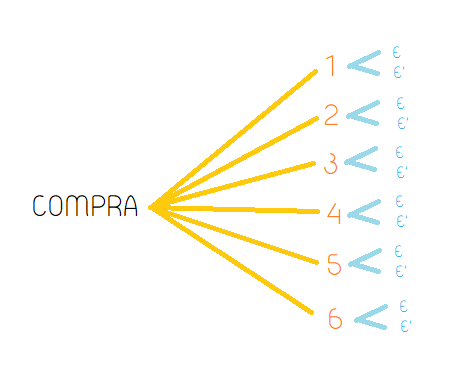

```{r,include=FALSE}
#LIBRERÍAS
library(readr)
library(plyr)
library(dplyr)
library(stringr)
library(ggplot2)
library(ggthemes)
library(RColorBrewer)
library(scales)
library(FinCal)
knitr::opts_chunk$set(echo = TRUE)
```

## Relevancia  
El análisis de la base de datos permitirá conocer la orientación de los gastos diarios en el hogar, ya que se recopila información de los bienes y servicios adquiridos por los hogares en el 2019 y 2020. La base es relevante, puesto que contiene información detallada para obtener un correcto análisis sobre el consumidor.

## Población, muestra y muestreo

+ *Población de estudio*: Hogares a nivel nacional de las principales ciudades de Perú. (Instituto Nacional de Estadística e Informática, 2022).  
+ *Unidad muestral*: Personas de 14 y más años de edad que sean miembros del hogar que respondieron la encuesta.
+ *Muestreo*: Muestreo deliberado, este fue realizado por personal capacitado del INEI (Instituto Nacional de Estadística e Informática) en un periodo de siete días. Se buscó información de los gastos diarios, mensuales y trimestrales en las familias. Los resultados permitirían obtener una canasta familiar que posteriormente ayudaría a medir el IPC (Índice de Precios al Consumidor) a nivel nacional.
+ *Representatividad*: Se considera representativa a la muestra pues está compuesta por 41 358 viviendas seleccionadas en todo el país, ubicadas en el área urbana y rural. Descartamos el sesgo pues no se encuestó a personas que residían en viviendas colectivas, es decir, hospitales, hoteles, asilos, cárceles, etc.

## Variables a estudiar
| Variable | Tipo  | Restricciones
|--|--|--|
| anio     |   Cualitativa ordinal  | Numero entero 2019 o 2020  |
| mes     | Cualitativa ordinal  | Numero entero desde 1 hasta 12  |
| estrato | Cualitativa ordinal  | Estrato al que pertenece el hogar encuestado|
| mAdquisición  | Cualitativa nominal | Modo de adquisición del producto |
| cInternet  | Cualitativa nominal | Número entero positivo, 0 o 1 |
| cApp      | Cualitativa nominal | Número entero positivo 0 o 1  |
| App  | Cualitativa nominal | Nombre del aplicativo móvil |
| cLugar  | Cualitativa nominal | Nombre del lugar donde realizó la compra | 
| nombre | Cualitativa nominal  | Nombre del producto |
| marca  | Cualitativa nominal  | Nombre de la marca del producto |
| precio  | Cuantitativa discreta | Número positivo con dos cifras decimales |
| cantidad_ent| Cuantitativa discreta | Número positivo entero |
| medida  | Cualitativa nominal | Unidad de medida del producto |

## Limpieza de Datos  

Cargamos el archivo, hacemos un primer filtro y seleccionamos las variables mas relevantes
```{r}
DF <- read.csv2("ENAPREF_CAP_401_404.csv",sep=",") # Cargamos la base de datos
DF2 <- filter(DF, P400_ID == "401")                # Seleccionamos la categoría de consumo de bienes y servicios
DF3 <- select(DF2, ANIO, MES, ESTRATO, P400_A, P400_B1_ENT,
P400_B1_DEC, P400_B2, P400_C, P400_E, P400_E_1, P400_E_2,
P400_F_3, P400_F, P400_CONVERSION)                # Seleccionamos las variables que usaremos

"Variables del estudio"
colnames(DF3)
```

Luego se renombran las variables para facilitar su manipulación.
```{r}
DF4 <- rename(DF3, ANIO = `ANIO`, MES = `MES`, ESTRATO = `ESTRATO`,
NOMBRE = `P400_A`, CANTIDAD_ENT = `P400_B1_ENT`,
CANTIDAD_DEC = `P400_B1_DEC`,MEDIDA = `P400_B2`,MARCA = `P400_C`,
M_ADQUISICIÓN = `P400_E`,C_INTERNET = `P400_E_1`, C_APP = `P400_E_2`,
APP = `P400_F_3`, LUGAR = `P400_F`,PRECIO = `P400_CONVERSION`)

"Variables renombradas"
colnames(DF4)

```

Buscamos la cantidad de variables con datos faltantes o incompletos(N.A)
```{r, echo=FALSE}
sapply(DF4, function(x) sum(is.na(x)))
```
Se eliminan los datos incompletos


```{r}
DF5 <- na.omit(DF4)
```

Luego se usa un filtro para seleccionar solo las observaciones que son de un producto con marca
```{r}
DF6 <- filter(DF5, !(MARCA %in% c("SIN MARCA - SM", "NO CORRESPONDE", "NO PRECISA - NO ESPECIFICA")))
```

Creamos un nuevo csv con los datos limpios
```{r}
write.csv(DF6,"ENAPREF_versionnueva.csv", row.names = FALSE)
```

finalmente cambiamos el tipo de las variables

```{r, echo=FALSE}
"Tipo de las variables por defecto"
# glimpse(DF6)
BDC<-read_csv("ENAPREF_versionnueva.csv",col_types = "ccncnnccnnnccn")

"Tipo corregido de las variables"
glimpse(BDC)
```


```{r, echo=FALSE}
DF8 <- BDC
```


## Análisis de las Variables

### ANIO
Primero se corroborará que el lapso de tiempo en que se dio esta encuesta es correcto, seguido de la cantidad de data que se tiene de cada mes

```{r, echo=FALSE}
table(as.numeric(as.character(DF8$ANIO)))
```

Inicialmente podemos decir que se tiene más data registrada del año 2019 que el año 2020.

### MES 
Sobre los meses, se verá las compras realizadas por mes en los distintos años.

```{r, echo=FALSE}
table(DF8$MES, as.numeric(as.character(DF8$ANIO)))
```

Se observa que para el año 2020, la data recolectada abarca los meses de Enero y Febrero, mientras que en 2019, la data recolectada parte del mes de Junio del 2019. Además, se descarta la posibilidad de mezclar data del mismo mes de distintos años.

Se hará un pequeño refactor de los meses, para poder visualizarlos con mayor comodidad en gráficas.
```{r}
Mes_ <- factor(DF8$MES, levels = c(1,2,3,4,5,6,7,8,9,10,11,12),labels = c("Enero", "Febrero", "Marzo", "Abril", "Mayo", "Junio", "Julio", "Agosto", "Setiembre", "Octubre", "Noviembre", "Diciembre"))
table(Mes_)
```
Sin embargo, al obdervar que tenemos meses de los que no se tienen datos como tal, se reducirá este arreglo exceptuando los 0s.
```{r}
Mes <- factor(DF8$MES, levels = c(1,2,6,7,8,9,10,11,12),labels = c("Enero", "Febrero", "Junio", "Julio", "Agosto", "Setiembre", "Octubre", "Noviembre", "Diciembre"))
table(Mes)
```


### ESTRATO 

Sobre la variable Estrato, se tiene el siguiente resumen:
```{r, echo=FALSE}
summary(DF8$ESTRATO)
```

E identificamos las siguientes categorías:
```{r, echo=FALSE}
table(DF8$ESTRATO)
```

Cuyos números tienen una definición, la cual se reemplazará de la siguiente forma:

```{r}
Estrato_ <- factor(DF8$ESTRATO, levels = c(0,1,2,3,4,5,6),labels = c("No definido", "Estrato Alto", "Estrato Medio Alto", "Estrato Medio", "Estrato Medio Bajo", "Estrato Bajo", "Rural"))
table(Estrato_)
```
Observamos que el Estrato de identificador 0, no cuenta con datos, pues todos los Estratos se pudieron determinar correctamente luego de la limpieza de datos. Por lo tanto, se removerá esta observación del arreglo.  

```{r}
Estrato <- factor(DF8$ESTRATO, levels = c(1,2,3,4,5,6),labels = c("Estrato Alto", "Estrato Medio Alto", "Estrato Medio", "Estrato Medio Bajo", "Estrato Bajo", "Rural"))
table(Estrato)
```

Una vez definidos los nombres en la data limpia, se procederá a evaluar esta información en relación con otras variables para un mejor análisis.

```{r, echo=FALSE}
# rgb(0.8,0.8,0,0.5)
# rgb(0.8,0.1,0.1,0.6)
options(scipen=10000)
freq <- table(Estrato)

par(mar=c(7,12,2,4))
# Uniform color
bp<-barplot(height=freq, 
        main="Gráfico de las frecuencias de Estrato", 
        col="#91F9E5",
        xlim=c(0,120000),
        horiz = T,
        las=2,
        border = F
        )
text(0,bp, round(freq, 0.9),cex=0.8,pos=4, col="#25283d") 
title(ylab=substitute(paste(italic("Estratos"))), line=9.5, cex.lab=1.2)
title(xlab=substitute(paste(italic("Frecuencia"))), line=4.5, cex.lab=1.2)
``` 
  
*Interpretación:*  La mayor cantidad de hogares encuestados pertenecen a la categoría de estrato bajo, mientras que la menor cantidad pertenece al estrato rural.  


Igualmente se muestra la compra que se realizó por Estrato a lo largo de los meses de los que se tiene data recolectada.

```{r, echo=FALSE}
# rgb(0.8,0.8,0,0.5)
# rgb(0.8,0.1,0.1,0.6)
options(scipen=10000)

freq2 <- table(Mes,Estrato)

freq4 <- as.data.frame.matrix(freq2)
# freq4
par(mar=c(3,3,3,2))
Ests <- c("No definido", "Estrato Alto", "Estrato Medio Alto", "Estrato Medio", "Estrato Medio Bajo", "Estrato Bajo", "Rural")
Mess <- c("Enero-2020", "Febrero-2020", "Marzo-2019", "Abril-2019", "Mayo-2019", "Junio-2019", "Julio-2019", "Agosto-2019", "Setiembre-2019", "Octubre-2019", "Noviembre-2019", "Diciembre-2019")

ms <- mosaicplot(freq4, main = "Estratos Mes Mosaic Plot",
           sub = "Compras por mes según estrato",
           xlab = substitute(paste(italic("Meses"))),
           ylab = substitute(paste(italic("Estrato"))),
           color =  c("#bdc6ca","#6e92fa","#67a1f4","#71adea","#85b8df","#a0c0d3"),
           border = F,
           las = 1
           )

```
  
*Interpretación:*  Se puede observar que tanto el Estrato Alto como el Estrato Rural, tuvieron menos compras a lo largo de los meses, en comparación con los demás estratos Intermedios.


### MARCA - ( *"Marca de los productos"* ) y NOMBRE - (*"Nombre de los productos"*)
Primero se mostrará los resúmenes de ambas variables:

```{r, echo=FALSE}
DF8 <- BDC
"Variable MARCA"
summary(DF8$MARCA)
```

```{r, echo=FALSE}
"Variable NOMBRE"
summary(DF8$NOMBRE)
```

```{r}
marks <- names(table(DF8$MARCA))
```
Además la Base de Datos con la que se trabaja tiene `r length(marks)` cantidad de marcas:


Ahora se procederá a determinar el top 10 de marcas más vendidas:

```{r, echo=FALSE}
# Marcas más vendidas
owo <- as.data.frame(table(DF8$MARCA))
top <- owo[order(owo$Freq,decreasing = T),]
top <- top[1:10,]
top
```

Luego, una vez se tienen las marcas más vendidas, se puede determinar los nombres de los productos más vendidos en cada marca:

+ **Marca 1: GLORIA**
```{r, echo=FALSE}
mark1 <-as.data.frame(table(DF8$NOMBRE[str_detect(DF8$MARCA, "GLORIA")]))
mark1[mark1==0] <- NA
mark1_c <-mark1[complete.cases(mark1),]

prod1 <- as.data.frame(mark1_c)
prod1 <- prod1[order(prod1$Freq,decreasing = T),]
prod1 <- prod1[1:10,]
prod1
```

+ **Marca 2: TRES OSITOS**
```{r, echo=FALSE}
mark2 <-as.data.frame(table(DF8$NOMBRE[str_detect(DF8$MARCA, "TRES OSITOS")]))
mark2[mark2==0] <- NA
mark2_c <-mark2[complete.cases(mark2),]

prod2 <- as.data.frame(mark2_c)
prod2 <- prod2[order(prod2$Freq,decreasing = T),]
prod2 <- prod2[1:10,]
prod2
```
+ **Marca 3: SIBARITA**
```{r, echo=FALSE}
mark3 <-as.data.frame(table(DF8$NOMBRE[str_detect(DF8$MARCA, "SIBARITA")]))
mark3[mark3==0] <- NA
mark3_c <-mark3[complete.cases(mark3),]

prod3 <- as.data.frame(mark3_c)
prod3 <- prod3[order(prod3$Freq,decreasing = T),]
prod3 <- prod3[1:10,]
prod3
```

+ **Marca 4: AJINOMOTO**
```{r, echo=FALSE}
mark4 <-as.data.frame(table(DF8$NOMBRE[str_detect(DF8$MARCA, "AJINOMOTO")]))
mark4[mark4==0] <- NA
mark4_c <-mark4[complete.cases(mark4),]

prod4 <- as.data.frame(mark4_c)
prod4 <- prod4[order(prod4$Freq,decreasing = T),]
prod4 <- prod4[1:10,]
prod4
```

+ **Marca 5: ANITA**
```{r, echo=FALSE}
mark5 <-as.data.frame(table(DF8$NOMBRE[str_detect(DF8$MARCA, "ANITA")]))
mark5[mark5==0] <- NA
mark5_c <-mark5[complete.cases(mark5),]

prod5 <- as.data.frame(mark5_c)
prod5 <- prod5[order(prod5$Freq,decreasing = T),]
prod5 <- prod5[1:10,]
prod5
```
+ **Marca 6: INCA KOLA**
```{r, echo=FALSE}
mark6 <-as.data.frame(table(DF8$NOMBRE[str_detect(DF8$MARCA, "INCA KOLA")]))
mark6[mark6==0] <- NA
mark6_c <-mark6[complete.cases(mark6),]

prod6 <- as.data.frame(mark6_c)
prod6 <- prod4[order(prod6$Freq,decreasing = T),]
prod6 <- prod4[1:10,]
prod6
```
+ **Marca 7: CIELO**
```{r, echo=FALSE}
mark7 <-as.data.frame(table(DF8$NOMBRE[str_detect(DF8$MARCA, "CIELO")]))
mark7[mark7==0] <- NA
mark7_c <-mark7[complete.cases(mark7),]

prod7 <- as.data.frame(mark7_c)
prod7 <- prod7[order(prod7$Freq,decreasing = T),]
prod7 <- prod7[1:10,]
prod7
```

+ **Marca 8: SAN FERNANDO**
```{r, echo=FALSE}
mark8 <-as.data.frame(table(DF8$NOMBRE[str_detect(DF8$MARCA,"SAN FERNANDO")]))
mark8[mark8==0] <- NA
mark8_c <-mark8[complete.cases(mark8),]

prod8 <- as.data.frame(mark8_c)
prod8 <- prod8[order(prod8$Freq,decreasing = T),]
prod8 <- prod8[1:10,]
prod8
```

+ **Marca 9: TROME  (issue)**
```{r}
mark9 <-as.data.frame(table(DF8$NOMBRE[str_detect(DF8$MARCA, "TROME")]))
mark9[mark9==0] <- NA
mark9_c <-mark9[complete.cases(mark9),]

prod9 <- as.data.frame(mark9_c)
prod9 <- prod9[order(prod9$Freq,decreasing = T),]
prod9 <- prod9[1:10,]
prod9

```
Algo curioso que se pudo notar en la marca TROME, fue que los productos que se muestran no son de un mismo tipo, por lo que se infiere que TROME es nombre de diferentes tipos de producto, por ejemplo, productos de limpieza, periódicos y hasta se encontró una marca de dulces llamada 'trome'.

Entonces, la cifra obtenida para la marca TROME involucra distintos tipos de producto, por lo que su cifra de frecuencia no sería veraz. Entonces se diferenciarán los productos para ver las cantidades correspondientes a cada marca.

```{r}
colnames(prod9)[1] ="PRODUCT"

ptn = '^PERI.*?' 
ptn2 = '^DIARIO.*?'

indexes <- grep(ptn, prod9$PRODUCT)
indexes <- append(indexes, grep(ptn2, prod9$PRODUCT))

prod9[indexes,]
prod10 <- prod9[indexes,]

prod11 <- setdiff(prod9, prod10)
prod11

```

Dado que la cifra que corresponde a TROME involucra 2 marcas, estaría erróneamente puesto en el top, entonces se procederá a ignorar dicha marca, y se tomaría las siguiente en el top para analizar.

```{r}
owo_ <- as.data.frame(table(DF8$MARCA))
top_ <- owo_[order(owo_$Freq,decreasing = T),]
top_ <- top_[1:11,]

new_top <- top_ %>%  filter(!row_number() %in% c(9))
new_top
```

Entonces la marca 9 ahora sería la marca LAVAGGI, así que se procederá con su análisis.  

+ **Marca 9: LAVAGGI**
```{r}
mark10 <-as.data.frame(table(DF8$NOMBRE[str_detect(DF8$MARCA, "LAVAGGI")]))
mark10[mark10==0] <- NA
mark10_c <-mark10[complete.cases(mark10),]

prod10 <- as.data.frame(mark10_c)
prod10 <- prod10[order(prod10$Freq,decreasing = T),]
prod10 <- prod10[1:10,]
prod10
```

Y ahora, la marca 10 es DON VITTORIO

+ **Marca 10: DON VITTORIO**
```{r}
mark10_1 <-as.data.frame(table(DF8$NOMBRE[str_detect(DF8$MARCA, "DON VITTORIO")]))
mark10_1[mark10_1==0] <- NA
mark10_1c <-mark10_1[complete.cases(mark10_1),]

prod10_1 <- as.data.frame(mark10_1c)
prod10_1 <- prod10_1[order(prod10_1$Freq,decreasing = T),]
prod10_1 <- prod10_1[1:10,]
prod10_1
```


### Variable Compras por Internet

¿Las personas compraron por Internet en el periodo mostrado?

```{r}
  table(DF8$C_INTERNET)
# 0 significa que las personas no compraron por Internet
# 1 significa que las personas compraron por Internet
```
```{r echo=FALSE}
C_INTERNET_2 <- factor(DF8$C_INTERNET , levels = c(0,1),labels = c("Compro por Internet","No Compro por Internet"))
```

```{r echo=FALSE} 
barint <-barplot(table(C_INTERNET_2, DF8$ANIO),                       
        main="Frecuencia de compras por internet",           
        xlab="Año",                  
        ylab="Frecuencia relativa",
        ylim = c(0, 370000),
        col = brewer.pal(n=3,name="Paired"),
        border = palette("Paired"),
        cex.names = 0.7
        )
grid(nx = NA, ny = NULL, lwd = 1, lty = 1, col = "grey")
legend("topright", legend = c("No compró por internet", "Compró por internet"), fill=brewer.pal(n=3,name="Paired"))
```
  
*Interpretación:*  
- Al analizar la variable podemos notar que las personas no han comprado por Internet mucho en el periodo analizado
- Se puede decir que casi el 99% de  personas no compro por Internet. En 2019 hubo mayor cantidad de compras, no obstante, la mayoría no fueron por internet.


### Análisis del año y compras por internet

```{r, echo=FALSE}

mosaicplot((DF8$ANIO ~ C_INTERNET_2), col = c("lightgreen", "red"), main="RELACION DE COMPRAS POR INTERNET CON EL TIEMPO" ,ylab="COMPRAS POR INTERNET", xlab="AÑO")

```
  
*Interpretación:* Podemos ver que en el año 2020 la gente empezó a compraron más por Internet con respecto al año anterior. Esto se podría deber por la pandemia.

### Variable Precio

Hallamos que el producto mas vendido es la leche evaporada y la avena
```{r, echo=FALSE}
marca <- DF8
aux5 <- table(marca$NOMBRE)

e_4 <- max(aux5)  # Leche evaporada
which(aux5 == e_4)
aux6 <- aux5[-4864] 
e_5 <- max(aux6)
which(aux6 == e_5) # AVENA ENVASADA
aux7 = aux6[-847]
e_6 <- max(aux7)
which(aux7 == e_6)

```

### Precio vs Marca (producto más vendido) 
Se hace un primer filtro del producto más vendido 

```{r}
## TOMAMOS ESTAS MEDIDAS YAQUE SON LAS QUE TIENEN MAYOR NUMERO DE DATOS CON RESPECTO A LAS OTRAS MEDIDAS

# LATA GRANDE
LER3 <- filter(DF8, NOMBRE== "LECHE EVAPORADA", CANTIDAD_ENT== 1, MEDIDA== "LATA GRANDE" )
table(LER3$MARCA)
LER3$PRECIO<-as.numeric(LER3$PRECIO)

# LATA CHICA
LERX <- filter(DF8, NOMBRE== "LECHE EVAPORADA", CANTIDAD_ENT== 1, MEDIDA== "LATA CHICA" )
table(LERX$MARCA)
LERX$PRECIO<-as.numeric(LERX$PRECIO)
```

Filtramos por marcas
```{r}
# LATA GRANDE 
LER4 <-  mutate(LER3, marca = case_when(MARCA %in% c("TOTTUS", "ORQUIDEA", "MILKITO", "MIKELA", "BELLA HOLANDESA", "OGLIO", "SOYA", "NESTLE", "PRADERA") ~ "OTROS", MARCA == "GLORIA" ~ "GLORIA", MARCA =="IDEAL" ~ "IDEAL",  MARCA == "NAN" ~ "NAN", MARCA == "LAIVE" ~ "LAIVE",MARCA == "SOY VIDA"  ~ "SOY VIDA") )
table(LER4$marca)
# LATA CHICA
LER4X <-  mutate(LERX, marca = case_when(MARCA %in% c("TOTTUS", "ORQUIDEA", "MILKITO", "MIKELA", "BELLA HOLANDESA", "OGLIO", "SOYA", "NESTLE", "PRADERA") ~ "OTROS", MARCA == "GLORIA" ~ "GLORIA", MARCA =="IDEAL" ~ "IDEAL",  MARCA == "NAN" ~ "NAN", MARCA == "LAIVE" ~ "LAIVE",MARCA == "SOY VIDA"  ~ "SOY VIDA") )
table(LER4X$marca)
```
*DESCRIPTORES DE POSICIÓN Y DESCRIPTORES DE DISPERSIÓN DE LA LATA GRANDE*  

```{r}
#Descriptores de Posición
summary(LER4$PRECIO)
#Descriptores de Dispersión
#Varianza
var(LER4$PRECIO)
#Desviación estándar
sd(LER4$PRECIO)
#Coeficiente de variación
coefficient.variation(sd=sd(LER4$PRECIO), avg = mean(LER4$PRECIO))
#Promedio
mean(LER4$PRECIO, na.rm = TRUE)
```
```{r}

boxplot(LER4$PRECIO ~ LER4$marca, col = c("red", "blue", "green"), main = "Relación entre el precio y la marca (LATA GRANDE) ",xlab ="Marcas" ,ylab="Precio de la leche evaporada" )

```
*DESCRIPTORES DE POSICIÓN Y DESCRIPTORES DE DISPERSIÓN DE LA LATA CHICA*  

```{r}
#Descriptores de Posición
summary(LER4X$PRECIO)
#Descriptores de Dispersión
#Varianza
var(LER4X$PRECIO)
#Desviación estándar
sd(LER4X$PRECIO)
#Coeficiente de variación
coefficient.variation(sd=sd(LER4X$PRECIO), avg = mean(LER4X$PRECIO))
#Promedio
mean(LER4X$PRECIO, na.rm = TRUE)
```
```{r}
boxplot(LER4X$PRECIO ~ LER4X$marca, col = c("red", "blue", "green"), main = "Relación entre el precio y la marca (LATA CHICA) ",xlab ="Marcas" ,ylab="Precio de la leche evaporada" )
```


### COMPRAS POR APLICACIÓN (**C_Aplicacion**) 
¿El usuario utilizó una aplicación para la compra?
¿Cuál es el índice de compra por aplicativo móvil?

Se procede a analizar las compras realizadas por aplicativo móvil entre los años 2019 y 2020
```{r}
table(DF8$C_APP,DF8$ANIO)
# 0 significa que las personas no compraron por Internet
# 1 significa que las personas compraron por Internet
```
Asimismo, se procede a realizar un gráfico que permita visualizar las comparaciones.

```{r}
barcapp <-barplot(table(DF8$C_APP,DF8$ANIO),                       
        main="Compras por aplicativo móvil",           
        xlab="Año",                  
        ylab="Frecuencia",
        ylim = c(0, 280000),
        col = palette("Paired"),
        border = palette("Paired"),
        cex.names = 0.7
        )
grid(nx = NA, ny = NULL, lwd = 1, lty = 1, col = "grey")
legend("topright", legend = c("No compró por app", "Sí compró por app"), fill=palette("Paired"))
```

*Interpretación*: De acuerdo a la información suministrada, se ha logrado obtener una comparación entre el número de personas que compraron por aplicativo entre los años 2019 y 2020. De la gráfica se observa que en el año 2019, la muestra realizó mayor número de compras, sin embargo, la mayoría de estas no fueron por internet, teniendo una frecuencia bastante baja de compras por aplicación.  


### EL APLICATIVO MOVIL UTILIZADO: VARIABLE **APP**
De las compras por aplicativo móvil, ¿En cuál se han realizado más compras?

Ejecutando el siguiente código, se pueden observar diferentes errores
```{r}
data_app <- table(DF4$APP)
data_app
```

Estos errores se eliminarán con el comando *mutate()* 
```{r}
DF4C <- DF4
DF4C <- mutate(DF4C,app_cor = case_when(APP==' '~'NINGUNA', APP %in% c('CINE PLANET', 'LINIO', 'DRINK APP', 'EASY')~'OTROS', APP=='BEAT'~'BEAT', APP=='CABIFY'~'CABIFY',APP=='GLOVO'~'GLOVO',  APP=='MISMO LUGAR DE COMPRA'~'MISMO LUGAR', APP=='RAPPI'~'RAPPI', APP %in% c('UBER','UBER EATS') ~'UBER'))
```

Asimismo, se eliminarán las observaciones que no utilicen alguna aplicación, ya que se pretende analizar la sección de la muestra que sí utiliza
```{r}
DF4CC <- DF4C[DF4C$app_cor!='NINGUNA', ]
appcorr <- table(DF4CC$app_cor)
appcorr
```

Con ello resuelto, se procede a hacer el gráfico de barras
```{r}
library(RColorBrewer)
color <- brewer.pal(n=7, "Set2")
bar <-barplot(appcorr,                       
        main="Aplicaciones más utilizadas",           
        xlab="Aplicaciones",                  
        ylab="Frecuencias",
        ylim = c(0, 200),
        col = color,
        border = color,
        cex.names = 0.7
        )
text(bar, appcorr + 1, labels = appcorr)
grid(nx = NA, ny = NULL, lwd = 1, lty = 1, col = "grey")
```

Donde:
OTROS: comprende los aplicativos CINEPLANET, DRINK APP, EASY y LINIO.
*Interpretación:* De esta forma, se puede observar que los resultados son bastante distantes, donde la aplicación más utilizada en las compras de los hogares ha sido Beat y en segundo lugar Uber.


### Análisis de la variable LUGAR
¿En qué lugares compraron más los hogares?
Al ejecutar la función `table()` y `barplot()` podemos darnos cuneta que es difícil de visualizar cuáles fueron los lugares más frecuentados.
```{r}
lugar <- DF8
aux <- table(lugar$LUGAR) # Por la cantidad de datos es difícil visualizar cuales fueron los lugares más frecuentados
# barplot(table(lugar$LUGAR)) Si intentamos graficar, además de que sale un error por el texto, podemos notar que hay 3 picos máximos
```

Analizaremos esos 3 máximos que se visualizan en la gráfica. Para ello, extraemos los lugares con mayor frecuencia.
```{r}
e_0 <- max(aux)  # BODEGA AL POR MENOR
which(aux == 171670)
aux2 <- aux[-18] 
e_1 <- max(aux2)
which(aux2 == 69060) # MERCADO - PUESTO DE MERCADO POR MENOR
aux3 = aux2[-64]
e_2 <- max(aux3)
which(aux3 == 54146) # TIENDA - VENTA DE ABARROTES AL POR MENOR
aux4 = aux3[-95]
e_3 <- max(aux4)
which(aux3 == 9993)  # Valor relativamente muy bajo 
lugar_4 <-  mutate(lugar, lugar_compra = case_when(LUGAR == "BODEGA AL POR MENOR" ~ "BODEGA", LUGAR == "MERCADO - PUESTO DE MERCADO POR MENOR" ~ "MERCADO", LUGAR == "TIENDA - VENTA DE ABARROTES AL POR MENOR" ~ "TIENDA ABARROTES", (LUGAR !="BODEGA AL POR MENOR" & LUGAR !=  "MERCADO - PUESTO DE MERCADO POR MENOR" & LUGAR != "TIENDA - VENTA DE ABARROTES AL POR MENOR") ~ "OTRO") )
```

Finalmente, tabulamos y graficamos.
```{r}
table(lugar_4$lugar_compra) # Sabemos que el total de observaciones es 365 037, y que no hay NA
```

```{r}
proporciones <- round(100 * c(171670, 69060, 70161, 54146)/365037)
etiquetas <- paste0(proporciones, "%")
pie(table(lugar_4$lugar_compra), col = brewer.pal(n=7, "Set2"), main = "Frecuencia a determinados lugares para comprar", labels = etiquetas)
legend("topright", legend = c("BODEGA", "MERCADO", "OTROS", "TIENDA ABARROTES") , fill = brewer.pal(n=7, "Set2"), cex = 0.8)
```
  
*Interpretación:* Podemos concluir que la mayoría de los hogares compran en las bodegas, representando el 47%. Y en menor medida, en tiendas de abarrotes o mercados, que representan el 15% y 19%, respectivamente. Este resultado se encuentra dentro de lo esperado; debido que, lo más habitual es que compremos la mayor cantidad de productos en las bodegas cercanas.

### ANÁLISIS DE LAS VARIABLES Lugar Y Estrato
¿Existen diferencias sustanciales entre dónde compran principalmete los hogares por el estrato?
```{r}
Estrato <- factor(lugar_4$ESTRATO, levels = c(1,2,3,4,5,6),labels = c( "Alto", "M_Alto", "Medio", "M_Bajo", "Bajo", "Rural"))
mosaicplot(table(lugar_4$lugar_compra, Estrato), main="MOSAICO DE ESTRATO VS LUGAR DE COMPRA", cex.axis = 0.6, color = brewer.pal(n=7, "Set2"))
```
  
*Interpretación:* Lo más resaltante del gráfico es que el estrato alto es el que menos compra en bodegas, mercados y tiendas de abarrotes. Mientras que los hogares pertenecientes al estrato bajo suelen comprar más en las bodegas. Además la cantidad de hogares pertenecientes al estrato rural es muy baja a comparación del total de hogares.  


###  Correlaciones
*Primera Correlación entre las variables PRECIO y ESTRATO* para  el producto de LECHE EVAPORADA en LATA GRANDE.
```{r echo=FALSE}
CN_LG1 <- filter(DF8, NOMBRE== "LECHE EVAPORADA", MEDIDA== "LATA GRANDE" )
```

```{r echo=FALSE}
plot (CN_LG1$ESTRATO, CN_LG1$PRECIO, main = "GRÁFICA PRECIO (LATA GRANDE) VS ESTRATO", xlab = "Estrato", ylab = "Precio de latas grandes de leche evaporada" )
```
Parece que si existe correlación, veamos el valor de la correlación con 
`cor.test`:

```{r}
cor.test(CN_LG1$ESTRATO, CN_LG1$PRECIO)
```

La correlación es -0.06, esto quiere decir que es una correlación negativa debil.

*Interpretación de la  primera correlación :* Al analizar estas dos variables de precio y estrato en un producto determinado como es la leche evaporada en tamaño grande podemos ver que el estrato social no estaría relacionado con el nivel de consumo de un producto.

*Segunda Correlación entre las variables PRECIO y ESTRATO* para el producto de LECHE EVAPORADA en LATA CHICA.
```{r}
CN_LG2<- filter(DF8, NOMBRE== "LECHE EVAPORADA", MEDIDA== "LATA CHICA" )
```

```{r}
plot (CN_LG2$ESTRATO, CN_LG2$PRECIO, main = "GRÁFICA PRECIO (LATA CHICA) VS ESTRATO", xlab = "Estrato", ylab = "Precio de latas chicas de leche evaporada" )
```
Parece que si existe correlación, veamos el valor de la correlación con 
`cor.test`:

```{r}
cor.test(CN_LG2$ESTRATO, CN_LG2$PRECIO)
```

La correlación es 0.01, esto quiere decir que es una correlación casi nula.

*Interpretación de la segunda correlación :* Al analizar estas dos variables de precio y estrato en un producto determinado como es la leche evaporada en tamaño chico podemos concluir que el estrato social no estaría relacionado con el nivel de consumo de un producto pero podemos indicar que el estrato social estaría relacionado con el tamaño o medida de un producto.


## Análisis probabilistico

### DISTRIBUCIÓN DE POISSON - VARIABLE `CANTIDAD` Y `MES`  

```{r echo=FALSE}
# Primero seleccionamos las observaciones que correspondan al producto de leche evaporada.
lecheMuestra <- filter(DF8, NOMBRE == "LECHE EVAPORADA")

# Corregimos la variable CANTIDAD_ENT.  
baseData2 <- lecheMuestra
baseData2$MEDIDA[baseData2$MEDIDA %in% c("BOTELLA MEDIANA","LATA GRANDE","BOLSA","PAQUETE CHICO",
                                         "SOBRE CHICO","LATA CHICA","SOBRE","BOLSA CHICA", "SACHET", 
                                         "BOTELLA", "PAQUETE")] <- "UNIDAD"

baseData2$CANTIDAD_ENT[baseData2$CANTIDAD_ENT>50] <- 1 # Se cambian los valores altos
baseData2 <- baseData2[baseData2$CANTIDAD_ENT>0,]
baseData3 <- baseData2[baseData2$MEDIDA=="UNIDAD",] # Seleccionamos las observaciones que hayan adquirido unidades de este producto

baseData4 <- select(baseData3, ANIO,MES,ESTRATO,NOMBRE,CANTIDAD_ENT,PRECIO,MARCA,LUGAR)

```
*Problema*  
El INEI identificó que en promedio los hogares adquieren *2737.444* latas de **leche evaporada** al mes.  
a) ¿Cuál es la probabilidad de que los hogares adquieran más de 4500 latas de leche evaporada en los próximos dos meses?  
b) ¿Cuál es la probabilidad de que los hogares compren menos de 8000 latas de leche evaporada en los próximos 3 meses?  
*Variable aleatoria*  
*Y*: Cantidad de latas de leche evaporada que adquieren los hogares.  

*Procedimiento*  
Para el inciso *a)*  
Determinamos $\lambda$ sabiendo que adquieren *2737.444* latas de **leche evaporada** al mes, entonce en 2 meses se espera que adquieran $\lambda = 5474.888 latas$.   
```{r}
ppois(4500,lambda = 5474.888,F)
```

Para el inciso *b)*  
Determinamos $\lambda$ sabiendo que adquieren *2737.444* latas de **leche evaporada** al mes, entonce en 3 meses se espera que adquieran $\lambda = 8212.332 latas$.  
```{r}
ppois(8000,8212.332, T)
```

*Respuesta*  
a) La probabilidad de que los hogares compren más de  4500 latas de leche evaporada en los próximos dos meses es de 1. En otras palabras, es seguro que los hogares adquirirán más de 4500 latas en los próximos 2 meses. Sólo si es que la tendencia de compra se mantiene.  
b) La probabilidad de que los hogares compren menos de 8000 latas de leche evaporada en los próximos 3 meses es de 0.009491932.  

*Justificación*  
Se usó la distribución de Poisson porque podíamos determinar un promedio en un determinado tiempo para luego poder determinar probabilidades en base a este cálculo.  


### PROBABILIDAD CONDICIONAL - TEOREMA DE BAYES

*Problema*
De la información extraída, se conoce que la muestra seleccionada se divide en 6 estratos, además, al momento de compra de un producto, se registra que optan por 4 opciones (bodega, mercado, tienda de abarrotes y otro). En esta oportunidad, se busca analizar las situaciones en las que una persona compra o no en una bodega.  
a) ¿Cuál es la probabilidad de que una persona compre en una bodega?  
b) Si la persona compró un producto en una bodega, ¿cuál es la probabilidad de que pertenezca al estrato medio bajo (4)?  
c) Un miembro de familia decide no comprar en una bodega, ¿cuál es la probabilidad de que la persona pertenezca al estrato medio alto (2)?  

*Procedimiento*  
El problema se puede describir visualmente de la siguiente manera:

Donde, los números representan los 6 estratos, E representa el éxito de una situación determinada y E' el caso contrario. En este problema, el éxito se ve determinado por el caso en que la persona compre en una bodega.

En primer lugar, se hallan las probabilidades de que una persona pertenezca a cada estrato, para lo cual se recurre al uso de la variable *ESTRATO*. La cantidad de personas pertenecientes a cada uno de los diferentes estratos se divide entre el total de observaciones.
```{r}
probe1 <- nrow(filter(DF8,ESTRATO==1))/nrow(DF8)
probe2 <- nrow(filter(DF8,ESTRATO==2))/nrow(DF8)
probe3 <- nrow(filter(DF8,ESTRATO==3))/nrow(DF8)
probe4 <- nrow(filter(DF8,ESTRATO==4))/nrow(DF8)
probe5 <- nrow(filter(DF8,ESTRATO==5))/nrow(DF8)
probe6 <- nrow(filter(DF8,ESTRATO==6))/nrow(DF8)
```

Luego, haciendo uso de la tabla cruzada de lugar de compra y estrato, se determina la probabilidad de lugar de compra de acuerdo al estrato
```{r}
# Tabla lugar de compra vs estrato
table(lugar_4$lugar_compra, lugar_4$ESTRATO)
# Tomando los datos de bodega para hallar su probabilidad de acuerdo a cada estrato
prob1exito <- 9657/nrow(filter(DF8,ESTRATO==1))
prob2exito <- 23020/nrow(filter(DF8,ESTRATO==2))
prob3exito <- 34237/nrow(filter(DF8,ESTRATO==3))
prob4exito <- 40009/nrow(filter(DF8,ESTRATO==4))
prob5exito <- 58251/nrow(filter(DF8,ESTRATO==5))
prob6exito <- 6496/nrow(filter(DF8,ESTRATO==6))
```
a) Para esta pregunta, se toma como apoyo el diagrama de árbol. El resultado de esta pregunta es la sumatoria de la probabilidad de pertenecer a cada estrato multiplicado por la probabilidad de éxito dentro de este. 
```{r}
prob_bodega <- probe1*prob1exito+probe2*prob2exito+probe3*prob3exito+probe4*prob4exito+probe5*prob5exito+probe6*prob6exito
# Respuesta:
round(prob_bodega,2)
```
b) Para ello, se utiliza la fórmula de probabilidad condicional, donde $P(A|D)=P(A∩D)/P(D)$
Así, se tiene que A es la ocurrencia de que la persona pertenezca al estrato medio bajo (4) y D es el éxito (compra en bodega) que se puede extraer del resultado de la pregunta anterior.
```{r}
prob_est4 <- (probe4*prob4exito)/prob_bodega
# Respuesta:
round(prob_est4,2)
```

c) La probabilidad de que la persona no compre en una bodega, se representa como:
```{r}
prob_no_bodega <- 1-prob_bodega
# Respuesta:
```

Al igual que el problema anterior, se utiliza la fórmula de probabilidad condicional, donde A es la ocurrencia de que la persona pertenezca al estrato medio alto (2) y D es la ocurrencia de que la persona no vaya a una bodega
```{r}
prob_est2 <- (probe2*prob2exito)/prob_no_bodega
round(prob_est2,2)
```
*Respuestas* 
a) La probabilidad de que una persona compre en una bodega es *0.47*.  
b) La probabilidad que pertenezca al estrato medio bajo sabiendo que compró en una bodega es *0.23*.  
c) La probabilidad de que la persona pertenezca al estrato medio alto teniendo en cuenta que no compró en una bodega es *0.12*.  


### DISTRIBUCIÓN EXPONENCIAL - VARIABLE `PRECIO`
*Problema*  
Se sabe que los precios de los productos de la marca **Tres Ositos** siguen una distribución exponencial y en promedio los productos cuestan **1.478353 soles**.  
a) ¿Cuál es la probabilidad de que un producto de la marca Tres Ositos adquirido por un hogar cueste más de 2 soles?  
b) ¿Cuál es la probabilidad de que  el precio de un producto de la marca Tres Ositos adquirido por un hogar se encuentre entre 1 a 2 soles?  

*Variable aleatoria*  
Variable aleatoria: *X*: Precio de los productos de la marca **Tres Ositos** que adquirieron los hogares. 
Sabemos que $\beta = 1.478353$ entonces para RStudio $X ~ Exp(\lambda = \frac{1}{1.478353})$  

*Procedimiento*  
Ya contamos con el $\beta$ así que calculamos directamente la probabilidad.  
Para el inciso *a)*
```{r}
pexp(2,1/1.478353,lower.tail = F)
```
Para el inciso *b)*
```{r}
pexp(2, 1/1.478353, T) - pexp(1,1/1.478353, T)
```

*Respuesta*  
a) La probabilidad de que el precio de un producto de la marca **Tres Ositos** sea mayor a 2 soles es de 0.2585007  
b) La probabilidad de que el precio de un producto de la marca **Tres Ositos** se encuentre entre 1 y 2 soles es de 0.4545418  

*Justificación*
+ Se usó la variable PRECIO ya que, los precios de los productos que maneja una marca en el mercado pueden variar dependiendo de dónde se adquieran, del producto en sí, su presentación, su tamaño, etc. Entonces, consideraremos que este precio varía de forma aleatoria, y a pesar de ser discreta por la cantidad finita de posibles valores que puede tomar, al ser esta elevada se optó por considerar la variable como continua. 
+ Para determinar el modelo se procedió a realizar la gráfica de los precios en productos de la marca **Tres Ositos**. La gráfica realizada fue un histograma del cual se graficó por encima la curva de densidad y se pudo determinar  que el tipo de distribución que mejor se acoplaba a la gráfica sería la distribución exponencial.
```{r}
# Esperado de la variable: mean(DF8[DF8$MARCA == "TRES OSITOS",]$PRECIO, na.rm = T) = 1.478353
A=DF8[DF8$MARCA == "TRES OSITOS",]$PRECIO
hist(A, breaks = 50, col = "gray", freq=F, xlim=c(0,15), main = "HISTOGRAMA DEL PRECIO PARA LA MARCA TRES OSITOS")
 lines(density(A, na.rm=T), col="red",lwd=1)
curve(dexp(x,1/mean(A, na.rm = T)), lwd= 2, col="blue",add=T)
```


### DISTRIBUCIÓN NORMAL - VARIABLE `PRECIO`
```{r echo=FALSE}
Z = DF8[DF8$NOMBRE == "ACEITE VEGETAL ENVASADO",]$PRECIO
muZ <- mean(Z, na.rm = T)
sigmaZ <- sd(Z,na.rm = T)/sqrt(60)

```

*Problema*  
Se determinó que en promedio el aceite vegetal que adquieren los hogares cuesta 6.355511 soles, con una desviación de 5.154066. Si se encuesta a 60 de estos hogares sobre el precio del aceite que compraron, ¿cuál es la probabilidad de que el promedio muestral se encuentre entre 6 y 9 soles?  
*Variable aleatoria*  
$Z$: Precio del aceite vegetal adquirido por los hogares encuestados.  
*Procedimiento*  
Como $\bar{Z} ~ N(\mu = 6.355511,\sigma = 5.154066)$ determinamos $P(6<Z<9)$.    
```{r}
pnorm(9,muZ, sigmaZ) - pnorm(6,muZ,sigmaZ)
```

*Respuesta*  
La probabilidad de que el promedio muestral de los precios de aceite se encuentre entre 6 y 9 es de 0.223551.  

*Justificación*  
Si bien no sabemos la distribución del precio del aceite, por el teorema del límite central podemos considerar que el promedio muestral tiene una distribución normal con $\bar{Z} \sim N(\mu_Z = \mu,\sigma_Z = \frac{\sigma}{\sqrt{60}})$ porque el tamaño de la muestra es mayor a 30.  Y la representación gráfica del caso propuesto sería la siguiente:  
```{r echo=FALSE}
x2 <- c(6, seq(6,9,length=100), 9)
y2 <- c(0, dnorm(seq(6,9,length=100), mean = muZ, sd = sigmaZ), 0)
curve(dnorm(x, mean = muZ, sd = sigmaZ), from=0, to=10, ylab = "Probabilidad", xlab = "Precio", col = "blue")
polygon(x2, y2, col = "#FFCCCC", border = "red", lwd = 3)
text(x = 7, y = 0.06, 'P(6 < x <= 9)' ,cex = 0.9)
```


## Conclusiones

Durante el desarrollo del proyecto logramos comprender mejor el funcionamiento del programa, ademas de mejorar nuestra capacidad de trabajar en equipo, pero hemos notados ciertos problemas, en primer lugar tuvimos problemas al momento de encontrar un tema, incluso después de encontrar uno que era aceptable, al momento de darle un análisis mas a fondo nos dimos cuenta que no teníamos toda la información que requeríamos, específicamente con ciertas variables de las cuales la información que brindaba era escasa y en algunos casos nula.
Para haber evitado esto debidos de buscar información mas precisa del tema, o simplemente haber buscado otro tema con mayor relevancia de la cual sea mas sencillo encontrar buena información.

Del análisis realizado, respecto al análisis descriptivo, se pueden tomar como principales observaciones las siguientes:
-	Del total de hogares encuestados, la mayoría pertenece a la categoría de estrato bajo, mientras que la menor cantidad pertenece al estrato rural.
-	Se logró obtener un ranking de las marcas más compradas por las familias, en las que resaltan Gloria, Tres Ositos y Sibarita, donde para el caso de Gloria, el producto más vendido es la leche evaporada, en el caso de Tres Ositos, viene a ser la avena envasada y finalmente, para la marca Sibarita, resalta como producto el comino molido envasado. 
-	Respecto al lugar de compra de los productos, se puede concluir que la mayoría de los hogares compran en las bodegas, representando el 47%. Y en menor medida, en tiendas de abarrotes o mercados. Este resultado se encuentra dentro de lo esperado; debido que, lo más habitual es que compremos la mayor cantidad de productos en las bodegas cercanas.
-	De una relación de estrato y lugar de compra, el estrato alto es el que menos compra en bodegas, mercados y tiendas de abarrotes, mientras que los hogares pertenecientes al estrato bajo suelen comprar más en las bodegas.  
Respecto al análisis probabilistico, se lograron emplear diferentes distribuciones como son la exponencial, para el caso de la variable precio; la distribución de Poisson para el caso de la relación entre la variable cantidad y mes; y finalmente, la distribución normal para la variable precio. Asimismo, se realizó una aplicación del teorema de Bayes y probabilidad condicional para la base de datos analizada, relacionando para ello la variable estrato y lugar.


## Referencias
Instituto Nacional de Estadística e Informática [INEI] (2022). Encuesta Nacional de Presupuestos Familiares 2019 - 2020 (ENAPREF) [Conjunto de datos].  CAPÍTULO 400: Gastos diarios del hogar. URL: [https://www.inei.gob.pe/media/difusion/apps/#p=10](https://www.inei.gob.pe/media/difusion/apps/#p=10)


