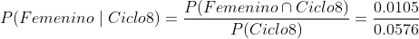
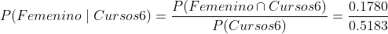
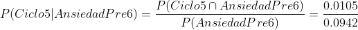
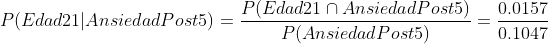
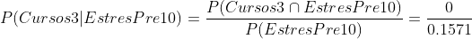
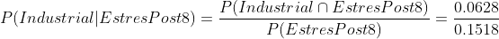

```{r}

library("pacman")
p_load(readr, dplyr, corrplot, ggplot2, tidyr, lubridate, scales, multimode, stringr,ggmosaic,car,DescTools, gt,ggthemes)
```

# Introducción

<h3>Niveles de ansiedad y estrés de los alumnos UTEC en distintas épocas
del ciclo.</h3>

## Relevancia y Antecedentes

**Relevancia**

A lo largo de la vida de una persona, esta se ha de enfrentar a
distintas situaciones de gran dificultad. En este sentido, algunos
indicadores y/o síntomas, tanto físicos cómo mentales, nos permiten
conocer su estado de salud. Uno de los casos más comunes son los altos
niveles de estrés y ansiedad que puede presentar una persona, tanto
junto cómo por separado, ocasionando un déficit en cualquier tipo de
rendimiento en su vida. Es así que es de gran relevancia tener un sondeo
constante de estos niveles para poder tener un mejor desempeño y salud.

**Antecedente**

El primer motivo para realizar nuestro proyecto es saber cuántos alumnos
del ciclo actual 2022-2 sufren con estres y/o ansiedad en diversas
fechas a lo largo del ciclo presente. Se justifica la elección de este
antecedente debido a la gran recurrencia a decir las frases, "Que estrés
me da la universidad", "Estoy demasiado ansioso por este examen" en los
alumnos. Entonces decidimos hacer el proyecto a base de eso, sabiendo
que el espacio de estudio es muy diverso y de gran extensión.

## *Objetivos del estudio*

**Objetivo 1**

Al finalizar este estudio esperamos determinar el nivel de estrés y
ansiedad en estudiantes de utec. En base a este informe estudiado
esperamos poder sugerir ayudas como los couseling en la misma
universidad,o datos sobre psicólogos para poder manejar mejor este tema
e ideas de motivación hacia los estudiantes,ya que esta situación de por
sí ya es bastante complicada.

**Objetivo 2**

Al terminar el proyecto luego de trabajar con los datos obtenidos
mediante una encuesta podemos determinar la cantidad de alumnos que
sufre de ansiedad y estrés en una determinada fecha y poder explicarla
mediante diveresos datos estadísticos.

**Objetivo 3**

Con la ayuda de la herramienta probabilistica, diferenciar el grado de
estrés y ansiedad que sufren los alumnos, y si es más intenso en ciclos
inferiores o superiores, si dependen del género o está influenciado por
los espacios de estudio alrededor de la universidad.

# Datos

## Proceso de recoleccion de datos

Los datos de la recolección fueron llenados el día 21 de setiembre,
completando el mínimo de encuestas posibles(200). Mediante una
separación por parte de los integrantes del grupo en los diversos pisos
de la universidad fuimos encuestando a grupos de personas dandole un
incentivo para que rellenen la encuesta en su totalidad.

**Previsualización de lo que fue forms**


## Poblacion, muestra y muestreo

-   **Población de estudio:** Alumnos matriculado en la universidad
    utec, del ciclo 2022-2.

-   **Unidad muestral:** Encuesta completada por un alumno mediante un
    código Qr que un encuestador le proporcionó.

-   **Muestreo:** Muestreo por conveniencia, nos basamos en
    sujetos(alumnos) disponibles que estaban distrayendose, terminando
    de comer, conversando o caminando por el campus.Al momento de
    encuestarlos siempre haciamos la pregunta de "¿Estás ocupado?, ¿te
    puedo pedir un favor?. Al estar dentro del campus, nosotros elegimos
    quienes serán nuestros sujetos de prueba y nos acercamos a ellos
    para poder encuestarlos. Al final del recorrido contamos con un
    total de 226 observaciones que recogimos mediante el forms hecho.

## Variables

| Variable            |   Tipo de variable   | Descripción  |
|:------------|:-----------:|:----------------------------------------------|
| `ciclo`             |  Categórica Nominal  | Toma valores del número de ciclo presente(colocando solo números): {1,2,3,4,5,6,7,8,9,10}. Representa él ciclo en el que se encuentra.                                                                                                                                                                                                                                                                             |
| `edad`              |  Numérica Discreta   | Toma valores del intervalo [16, 40]. Representa la edad de cada estudiante                                                                                                                                                                                                                                                                                                                                         |
| `carrera`           |  Categórica nominal  | Toma valores de las carreras que se encuentran en la universidad(colocando sus nombres): {Bioingeniería,Ingeniería industrial,Ingeniería Mecánica,Ingeniería Química,Ciencia de la Computación,Ingeniería Ambiental,Ingeniería Civil,Ingeniería de la Energía,Ingeniería Electrónica,Ingeniería Mecatrónica,Administración & Negocios Digitales,Ciencia de Datos }. Representa la carrera que el estudiante lleva. |
| `genero`            |  Categórica nominal  | Toma valores lógicos `Masculino` o `Femenino`. Representa el género del estudiante                                                                                                                                                                                                                                                                                                                                 |
| `cursos`            |  Numérica Discreta   | Toma valores en el intervalo [2, 8]. Representa el número de cursos que lleva el estudiante                                                                                                                                                                                                                                                                                                                        |
| `anxiety_before_ex` | Categórica ordinaria | Define el nivel de ansiedad del estudiante antes del periodo de evaluaciones(en una horquilla del 1 al 10)                                                                                                                                                                                                                                                                                                         |
| `anxiety_after_ex`  | Numérica Discreta | Define el nivel de ansiedad del estudiante después del periodo de evaluaciones(en una horquilla del 1 al 10)                                                                                                                                                                                                                                                                                                       |
| `cause_ansiedad_U`  |  Categórica nominal  | Toma valores los posibles factores que causen ansiedad: {Demasiadas personas,Que no respeten tu espacio personal,Mucho ruido,Mal funcionamiento de los servicios (ascensores, reconocimiento facial),No tener espacio para estudiar,Mucha ventilación}                                                                                                                                                             |
| `help_ansiedad`     |  Categórica nominal  | Toma valores lógicos `si` o `no`. Representa si el estudiante ha pedido alguna ayuda sobre este tema .                                                                                                                                                                                                                                                                                                             |
| `stress_before_ex`  | Numérica Discreta | Define el nivel de estrés del estudiante antes del periodo de evaluaciones(en una horquilla del 1 al 10)                                                                                                                                                                                                                                                                                                           |
| `stress_after_ex`   | Numérica Discreta | Define el nivel de estrés del estudiante después del periodo de evaluaciones(en una horquilla del 1 al 10).                                                                                                                                                                                                                                                                                                        |
| `cause_estres_U`    |  Categórica ordinal  | Toma valores de escala de frecuencia en que se presentan los síntomas de estrés (tomando solo las palabras clave de frecuencia en que se presenta este síntoma): {Nunca,Casi nunca,De vez en cuando,A menudo,Muy a menudo}. Representa la frecuencia de la presencia de este síntoma de estrés                                                                                                                     |
| `help_estres`       |  Categórica nominal  | Toma valores lógicos `si` o `no`. Representa si el estudiante ha pedido alguna ayuda sobre este tema .|
| `tiempo_de_estudio`       |  Numérica Continua  | Variable aleatoria que representa el tiempo que emplean los alumnos de utec para estudiar la día. .|


## Limpieza de datos

### Politica de manejo de datos faltantes

Respecto a los datos faltantes o datos is.na, no hubo algunos. La
explicación es que mediante una configuración en el formulario hicimos
que TODAS las preguntas sean obligatorias y no podías pasar página si no
completabas alguna.

### Política de resolución de errores

Hubo un solo caso de resolución de error, un encuestado puso un su edad
como número decimal "16.5", en este caso se aproximó a 17 y quedó como
si nada hubiera pasado. Como anteriormente mencionado, no hubo datos
faltantes, NA's o datos no enteros ya que en el mismo forms se
especificaba la manera de llenado y saltaba un error si te querías pasar
de listo. Por ejemplo en la edad nos fijamos previamente el intervalo de
edad normal de un estudiante sería desde los 15 hasta los 30 años, por
lo que solo aceptaba valores entre esos dos.

```{r}
DP5<- read_csv("Niveles de estres y ansiedad.csv")
```

1.  Importamos la data y cambiamos el nombre a las variables para que
    sean mas accesibles.

```{r}
DP5 <- rename(DP5,Ciclo= 'Ciclo cursante', Carrera= '¿Qué carrera estudias?' , Genero= 'Género' , Cursos= '¿Cuántos cursos lleva?' ,tiempo="¿Cuanto tiempo en horas estudia al día?", anxiety_before_ex= 'Cuál considera que ha sido su nivel de ansiedad, en promedio, antes de rendir cualquier evaluación' , anxiety_after_ex= 'Cuál considera que ha sido su nivel de ansiedad, en promedio, después de rendir cualquier evaluación' , time_mayor_anxiety= '¿Cuáles han sido sus épocas de mayor ansiedad?' , ESF_angustia= 'Escala de síntomas físicos [Sensación de angustia o aprensión]' , ESF_intranquilidad= 'Escala de síntomas físicos [Dificultad para estar quieto, intranquilidad]' , ESF_palpitaciones='Escala de síntomas físicos [Aumento de frecuencia cardiaca (palpitaciones) sin enfermedad conocida que lo justifique]', ESF_fatiga='Escala de síntomas físicos [Fatiga, especialmente importante al final del día]', ESF_sueño_alterado= 'Escala de síntomas físicos [Alteraciones en el sueño; tardas en quedarte dormido, te despiertas varias veces o despiertas antes de lo previsto]',  ESF_tension_muscular= 'Escala de síntomas físicos [Sensación de tensión muscular que puede ir acompañada de dolor en determinadas partes de tu cuerpo (cuello, espalda, cabeza, etcétera)]', ESC_dificil_concentracion='Escala de síntomas cognitivos [Dificultad para concentrarte]' , ESC_bloqueo_mental= 'Escala de síntomas cognitivos [Sensación de bloqueo mental]' , ESC_acontencimientos_negativos= 'Escala de síntomas cognitivos [Anticipación de acontecimientos negativos. Catastrofismo]', ESC_falta_memoria= 'Escala de síntomas cognitivos [Falta de memoria (dificultad para recordar cosas)]' , ESC_pensamientos_desagradables= 'Escala de síntomas cognitivos [Pensamientos o imágenes desagradables]', ESC_dificultad_decisiones= 'Escala de síntomas cognitivos [Dificultad para tomar decisiones (por ejemplo “das vueltas a la cabeza” sin llegar a decidirte)]', ESCCA_comer_beber= 'Escala de síntomas comportamentales para combatir la ansiedad [Fumas, comes o bebes para calmar tu ansiedad]' ,  ESCCA_escapar= 'Escala de síntomas comportamentales para combatir la ansiedad [Evitas o escapas de determinadas situaciones]',  ESCCA_movimientos_repetitivos='Escala de síntomas comportamentales para combatir la ansiedad [Haces movimientos repetitivos (tocarte el pelo, temblor de piernas)]' , ESCCA_moverse_mucho= 'Escala de síntomas comportamentales para combatir la ansiedad [Te mueves más de lo habitual]' , ESCCA_movimientos_torpe='Escala de síntomas comportamentales para combatir la ansiedad [Movimientos torpes (por ejemplo se te caen las cosas)]' , ESCCA_llanto= 'Escala de síntomas comportamentales para combatir la ansiedad [Llanto para aliviar tu malestar]',cause_ansiedad_U='¿Algo dentro de la universidad te cause demasiada ansiedad?', help_ansiedad='Ha buscado algún tipo de ayuda sobre cómo tratar la ansiedad')
```

```{r}
DP5<-rename(DP5,stress_before_ex='Cuál considera que ha sido su nivel de estrés, en promedio, antes de rendir cualquier evaluación',stress_after_ex='Cuál considera que ha sido su nivel de estrés, en promedio, después de rendir cualquier evaluación',time_mayor_stress='Cuáles han sido sus épocas de mayor estrés',ESFCE_cansancio='Escala de síntomas físicos y cognitivos  [Te sientes cansado/a]',ESFCE_relajarse='Escala de síntomas físicos y cognitivos  [Se te hace difícil relajarte o sentirte tranquilo/a]',ESFCE_dificultad_tomar_decisiones='Escala de síntomas físicos y cognitivos  [Se te hace difícil tomar decisiones]',ESFCE_pensar_claridad='Escala de síntomas físicos y cognitivos  [Tienes problemas para pensar con claridad]',ESFCE_pensar_problemas='Escala de síntomas físicos y cognitivos  [Piensas en tus problemas una y otra vez durante el día]',ESFCE_comer_demasiado='Escala de síntomas físicos y cognitivos  [Comes demasiado o muy poco]',ESFCE__dificultad_sueño='Escala de síntomas físicos y cognitivos  [Dificultad para conciliar el sueño]',ESFCE_dolor_cuerpo='Escala de síntomas físicos y cognitivos  [Dolor de espalda,cuello u otro dolor relacionado con la tensión]',ESFCE_caefeina_nicotina='Escala de síntomas físicos y cognitivos  [Uso más seguido de cafeína o nicotina de lo habitual]',ESFCE_tics_nervous='Escala de síntomas físicos y cognitivos  [Tics nerviosos]',ESFCE_dolor_estomacal='Escala de síntomas físicos y cognitivos  [Malestar estomacal]',ESFCE_irritacion='Escala de síntomas físicos y cognitivos  [Irritación con facilidad]',ESFCE_cambios_humor='Escala de síntomas físicos y cognitivos  [Cambios de humor y sensibilidad]',ESFCE_dificultad_concentrarse='Escala de síntomas físicos y cognitivos  [Dificultad al concentrarse]',ESFCE_alcohol_droga='Escala de síntomas físicos y cognitivos  [Uso de alcohol o drogas para afrontar problemas]',ESFCE_disminuye_desempeño_U='Escala de síntomas físicos y cognitivos  [Tu desempeño ha disminuido y presentas problemas para completar tus tareas]',ESFCE_sudar_palpitar='Escala de síntomas físicos y cognitivos  [Tendencias a sudar o palpitaciones]',ESFCE_levantarse_tarde='Escala de síntomas físicos y cognitivos  [Tentaciones fuertes de no levantarse por la mañana]',FS_no_afrontar_actividades='Evalúe con que frecuencia siente cada uno de los siguientes síntomas [¿Con qué frecuencia ha sentido que no podía afrontar todas las cosas que tenía que hacer?]',FS_todo_controlado='Evalúe con que frecuencia siente cada uno de los siguientes síntomas [¿Con qué frecuencia se ha sentido al control de todo?]',FS_enfadado_fueradecontrol='Evalúe con que frecuencia siente cada uno de los siguientes síntomas [¿Con qué frecuencia ha estado enfadado porque las cosas que le han ocurrido estaban fuera de su control?]',FS_controlar_tiempo='Evalúe con que frecuencia siente cada uno de los siguientes síntomas [¿Con qué frecuencia ha podido controlar la forma de pasar el tiempo?]',FS_dificultades_acumulan='Evalúe con que frecuencia siente cada uno de los siguientes síntomas [¿Con qué frecuencia ha sentido que las dificultades se acumulan tanto que no puede superarlas?]',FS_afectado_imprevistos='Evalúe con que frecuencia siente cada uno de los siguientes síntomas [¿Con qué frecuencia ha estado afectado por algo que ha ocurrido inesperadamente?]',FS_manejar_problemas_vida='Evalúe con que frecuencia siente cada uno de los siguientes síntomas [¿Con qué frecuencia ha manejado con éxito los pequeños problemas irritantes de la vida?]',FS_afrontar_cambios_vida='Evalúe con que frecuencia siente cada uno de los siguientes síntomas [¿Con qué frecuencia ha sentido que ha afrontado efectivamente los cambios importantes que han estado ocurriendo en su vida?]',cause_estres_U='¿Algo dentro de la universidad que te cause estrés?',help_estres='Ha buscado algún tipo de ayuda sobre cómo tratar el estrés')
```

2.  Pareciera haber datos atípicos en el boxplot, por ello usamos unique
    para ver a detalle todas las posibles respuestas que llenaron los
    encuestados.

```{r}
unique(DP5$Edad)
```

3.  Reemplazamos uno de los datos por uno más válido El dato 16.5 no es
    valido para la variable Edad, por ello tendremos que reemplazarlo
    por el dato más obvio.

```{r}
DP5$Edad=str_replace(DP5$Edad,"16.5","17")
```

4.  Comprobamos el cambio

```{r}
unique(DP5$Edad)
```

5.  Eliminamos variables inservibles:

```{r}
DP5 %>% select(-1)->DP5
```

```{r}
write_csv(DP5, "DataLimpia.csv")
```

Dataframes

```{r}
DL<- read_csv("DataLimpia.csv")
DD<-DL[complete.cases(DL),]
```

# Análisis de Datos 

Mediante el análisis de datos podemos hallar descriptores para un uso próximo en nuestro informe y dar validez a nuestras afirmaciones.

## Descriptores de Posición, Descriptores de Dispersión y Descriptores Numéricos.

**Descriptores de posición:** informan sobre la ubicación de los datos.

1.  Promedio: los datos están alrededor del promedio, el promedio es el
    centro de masa de los datos.•Mediana: al menos la mitad de los datos
    son mayores o iguales a la mediana menores o iguales a la mediana.
    La mediana, en general, no es única.

2.  Cuantil q %: al menos el q % de los datos es menor o igual al
    cuantil q %, al menos el (1-q) % de los datos es mayor o igual que
    el cuantil q %. El cuantil q %, en general no es único. La mediana
    es el cuantil 50 % o el segundo cuartil.

3.  Mínimo: el valor del menor dato. Corresponde al cuantil 0 %.

4.  Máximo: el valor del mayor dato. Corresponde al cuantil 100 %.

5.  Moda: el o los datos que más se repiten.

**Descriptores de dispersión:** informan sobre el nivel de variación de
los datos.

1.  Rango: diferencia entre el máximo y el mínimo, representa el máximo
    observado de variación de los datos. Rango grande, dispersión alta,
    rango pequeño, dispersión baja.

2.  Varianza: promedio de los cuadrados de la diferencia el dato y el
    promedio. Poblacional o muestral.

3.  Desviación estándar: raíz cuadrada de la varianza. Poblacional o
    muestral.

4.  Rango intercuartil: diferencia entre el tercer y el primer cuartil.

### Analisis de la variable Edad

Justificación:

-   Se utilizó la variable Edad ya que esta variable define el número de
    ciclo presente del estudiante y está en el intervalo del 1 al 10.

**Edad promedio**

```{r}
mean(DL$Edad)
```

**Mediana de edad**

```{r}
median(DL$Edad)
```

**Edad más recogida o más frecuente (moda)**

```{r}
Mode(DL$Edad)
```

**Desviacion estandar**

```{r}
sd(DL$Edad)
```

**Cauntil q%**

```{r}
quantile(DL$Edad,0.1)
quantile(DL$Edad,0.9)
```

**Rango intercuartil de la variable edad**

```{r}
IQR(DL$Edad)
```

**Varianza de la varaible edad**

```{r}
var(DL$Edad)
```

### Análisis variable Cursos(cantidad de cursos)

Justificación:

-   Se utilizó la variable Cursos ya que esta representa el número de
    cursos que lleva el estudiante y toma valores en el intervalo de 2 a
    8.

**Mediana de cantidad de cursos llevado**

```{r}
median(DL$Cursos)
```

**Cantidad de cursos más frecuente (moda)**

```{r}
Mode(DL$Cursos)
```

**Rango intercuartil**
```{r}
IQR(DL$Cursos)
```


**Desviacion estandar**

```{r}
sd(DL$Cursos)
```

**Varianza**

```{r}
var(DL$Cursos)
```

### Análisis variable anxiety_before_ex

Justificación:

-   Se utilizó la variable anxiety_before_ex ya que esta variable define
    el nivel de ansiedad del estudiante antes de tener una evaluación y
    toma valores en una horquilla del 1 al 10.

**Promedio de nivel de ansiedad de los alumnos antes de exámenes**

```{r}
mean(DL$anxiety_before_ex)
```

**Mediana de nivel de ansiedad antes de exámenes**

```{r}
median(DL$anxiety_before_ex)
```

**Cauntil q%**

```{r}
quantile(DL$anxiety_before_ex,0.1)
quantile(DL$anxiety_before_ex,0.9)
```

**Rango intercuartil de la variable anxiety_before_ex**

```{r}
IQR(DL$anxiety_before_ex)
```

**Desviación estandar**

```{r}
sd(DL$anxiety_before_ex)
```

**Varianza**

```{r}
var(DL$anxiety_before_ex)
```

### Análisis variable anxiety_after_ex

Justificación:

-   Se utilizó la variable anxiety_after_ex ya que esta variable
    representa el nivel de ansiedad del estudiante después de tener una
    evaluación y toma valores en una horquilla del 1 al 10.

**Promedio de nivel de ansiedad de los alumnos después de exámenes**

```{r}
mean(DL$anxiety_after_ex)
```

**Mediana de nivel de ansiedad después de exámenes**

```{r}
median(DL$anxiety_after_ex)
```

**Cauntil q%**

```{r}
quantile(DL$anxiety_after_ex,0.1)
quantile(DL$anxiety_after_ex,0.9)
```

**Rango intercuartil de la variable anxiety_after_ex**

```{r}
IQR(DL$anxiety_after_ex)
```

**Desviación estandar**

```{r}
sd(DL$anxiety_after_ex)
```

**Varianza**

```{r}
var(DL$anxiety_after_ex)
```

### Análisis variable stress_before_ex

Justificación:

-   Se utilizó la variable stress_before_ex ya que esta variable define
    el nivel de estrés del estudiante antes de tener una evaluación y
    toma valores en un intervalo del 1 al 10.

**Promedio de nivel de estrés de los alumnos antes de exámenes**

```{r}
mean(DL$stress_before_ex)
```

**Mediana de nivel de estrés antes de exámenes**

```{r}
median(DL$stress_before_ex)
```

**Cauntil q%**

```{r}
quantile(DL$stress_before_ex,0.1)
quantile(DL$stress_before_ex,0.9)
```

**Rango intercuartil de la variable stress_before_ex:**

```{r}
IQR(DL$stress_before_ex)
```

**Desviación estandar**

```{r}
sd(DL$stress_before_ex)
```

**Varianza**

```{r}
var(DL$stress_before_ex)
```

### Análisis variable stress_after_ex

Justificación:

-   Se utilizó la variable stress_after_ex ya que esta variable define
    el nivel de estrés del estudiante después de tener una evaluación y
    toma valores en un intervalo del 1 al 10.

**Promedio de nivel de estrés de los alumnos después de exámenes**

```{r}
mean(DL$stress_after_ex)
```

**Mediana de nivel de estrés después de exámenes**

```{r}
median(DL$stress_after_ex)
```

**Cauntil q%**

```{r}
quantile(DL$stress_after_ex,0.1)
quantile(DL$stress_after_ex,0.9)
```

**Rango intercuartil de la variable stress_after_ex**

```{r}
IQR(DL$stress_after_ex)
```

**Desviación estandar**

```{r}
sd(DL$stress_after_ex)
```

**Varianza**

```{r}
var(DL$stress_after_ex)
```

### Correlación y covarianza entre la variables estres antes del examen y el número de cursos llevados:

```{r}
cor(DL$stress_before_ex,DL$Cursos)
```

```{r}
cov(DL$stress_before_ex,DL$Cursos)
```

### Correlación y covarianza entre la variables estres después del examen y el número de cursos llevados:

```{r}
cor(DL$stress_after_ex,DL$Cursos)
```

```{r}
cov(DL$stress_after_ex,DL$Cursos)
```

## Tablas y Descriptores Gráficos de interacción:

Utilizando algunos valores de la parte de "Analisis de datos" como el
promedio, la mediana y la moda podemos realizar algunos gráficos y a
partir de estos concluir con unos comentarios lo que significa cada uno.

### Tablas Simples:

```{r}
DL %>% group_by(Cursos) %>% summarise("frecuencia absoluta"=n())
```

Tabla 1: La mayoría de los alumnos llevan 6 cursos.

```{r}
DL %>% group_by(Edad) %>% summarise("frecuencia absoluta"=n())
```

Tabla 2: Según la tabla, la mayoría de los alumnos tienen 18 años.

### Tablas Dobles

```{r}
tabla1<-select(DL,3,12)
table(tabla1)
```

Tabla 3: En la anterior tabla de datos se puede observar que los alumnos
de Ingeniería Civil e Ingeniería Mecatrónica y se fatigan en algunas
ocasiones son ambos 17. Por otro lado se puede deducir de esta tabla que
hay más alumnos que se fatigan solo en algunas ocasiones.

```{r}
tabla2<-select(DL,5,40)
table(tabla2)
```

Tabla 4:De la anterior tabla cruzada se puede resaltar que 27 alumnos
que llevan 6 cursos en este periodo académico aveces consumen cafeína o
nicotina más de lo habitual.

### Tablas desagregadas:

```{r}
tabla4<-select(DL,4,26,28)
table(tabla4)

```

Tabla 5: De lo anterior, se menciona que aquellos que sí buscan ayuda
para atender su ansiedad son menos propensos a combatir la ansiedad con
el llanto.

```{r}
tabla6<-select(DL,2,34,4)
tabla6

```

Tabla 6: Los hombres que tienen entre 17 y 20 años aveces son más
proclives a no saber tomar decisiones al ser victimas del estrés, a
comparación de las mujeres.


# Análisis Descriptivo

Utilizando los valores de la parte de análisis de datos, podemos armar
gráficos mediante librerias pre instaladas para visualizar en caso halla
una variabilidad o una relación entre variables.

## Análisis en base a la variable edad

```{r}
summary(DD$Edad)
```

```{r}
ggplot(DD, aes(x=Edad)) + 
  geom_histogram(binwidth=1, color="black", fill="gray") +
  geom_vline(aes(xintercept=median(Edad), color = "Mediana"), lwd=1) +
  geom_vline(aes(xintercept=mean(Edad), color = "Media"), lwd=1) + 
  geom_vline(aes(xintercept=Mode(Edad), color = "Moda"), lwd=1) +
  labs(title="Gráfico 1: Distribución de edades de los alumnos de UTEC",x="Edad",y="Frecuencia") +
  scale_color_manual(name = " ", values = c(Mediana="red", Media ="blue", Moda ="yellow")) + 
  theme_light() + 
  geom_label(aes(x=mean(Edad), y=34, label=round(mean(Edad),digits=3)), fill="white", size=3, col="blue") +
  geom_label(aes(x=median(Edad), y=30, label=round(median(Edad),digits=3)), fill="white", size=3, col="red") + geom_label(aes(x=Mode(Edad), y=32, label=round(Mode(Edad),digits=3)), fill="white", size=3, col="yellow")
```

Podemos entender del siguiente gráfico 1 que hay una moda pronunciada de
18 años respecto a las demás edades. Es un histograma sesgado a la
derecha, tiene una cola pronuncia hacia la derecha y una moda menor a la
media y mediana respectivamente.

```{r}
ggplot(DD,aes(x=" ",y=Edad)) + 
  geom_boxplot(color="black", fill="gray") + 
  geom_hline(aes(yintercept=mean(Edad), color = "Media"), lwd=0.75) +
  scale_color_manual(name = " ", values = c(Media ="red")) +
  labs(title="Gráfico 2: Edades de los alumnos de UTEC",x="",y="Edad") +
  theme_light() + coord_flip() +
  geom_label(aes(x=1, y=mean(Edad), label=round(mean(Edad),digits=3)), fill="white", size=3, col="red")
```

En este boxplot podemos visualizar una concentración de las edades entre
18 y 20 años en conjunto con una mediana de 19 años. Y más de un dato
atipico, aproximadamente 2 afuera del rango.

```{r}
ggplot(DD,aes(x=Genero,y=Edad, fill=Genero)) + 
  geom_boxplot() + 
  scale_fill_manual(values=c("#EF5350", "#5C6BC0")) + 
  labs(title="Gráfico 3: Distribución de edades por género",x="Género",y="Edad", fill="Género") +
  theme_light()
```

Con la ayuda del summary podemos ver la distribución de edades
desagregada por la variable género. El rango intercuartilico están entre
las edades de 18 a 20 ya que ahí se concentra la mayoría de datos
recogidos.

```{r}
table(DD$Edad,DD$Genero)
```

```{r}
ggplot(DD) + 
  geom_mosaic(aes(x=product(Genero, Edad), fill=Genero, size = 1), color="black") + 
  scale_fill_manual(values=c("#EF5350", "#5C6BC0")) + 
  labs(title="Gráfico 4: Proporción de edades por género",x="Edad",y="Género", fill="Género") +
  theme_light() +
  theme(axis.text.x=element_text(size=5))
```

En este gráfico de mosaico podemos observar que los datos obtenidos
mayormente son del género masculino que del femenino, y también podemos
ver que la mayoría tiene 18 años.

## Análisis de la variable carreras


```{r}
ggplot(DD,aes(x=Carrera, fill=Carrera)) + 
  geom_bar(color="black") + 
  scale_fill_manual(values=c("#EF5350", "#EC407A", "#AB47BC", "#7E57C2", "#5C6BC0", "#42A5F5", "#29B6F6", "#26C6DA", "#26A69A", "#66BB6A", "#9CCC65", "#D4E157")) + 
  labs(title="Gráfico 5: Distribución de carreras",x="Carrera",y="Edad") +
  theme_light() + coord_flip()
```

En este gráfico podemos ver la gran cantidad de encuestados
pertenecientes a ingeniería industrial e ingeniería civil, siendo estos
dos con más cantidad de alumnos. Y las que tienen menos son las carreras
de ingeniería electrónica, ciencia de datos y energía.

```{r}
ggplot(DD) + 
  geom_mosaic(aes(x=product(Genero, Carrera), fill=Genero, size = 1), color="black") + 
  scale_fill_manual(values=c("#EF5350", "#5C6BC0")) + 
  labs(title="Gráfico 6: Proporción de género por carreras",x="Carreras",y="Género", fill="Género") +
  theme_light() + coord_flip() +
  theme(axis.text.y=element_text(size=7.5))
```

Como se pudo observar en un gráfico anterior de mosaico, los datos
obtenidos son mayormente de hombres,aquí podemos ver a más detalle que
los datos más obtenidos son de la carrera de Ing. Industrial e Ing.
Civil. Además, la carrera que tienen más alumnado del género femenino es
Ing. Química, como también las carreras que tienen menor alumnado del
género femenino es Ing. Electrónica y la carrera de Ciencia de datos.

## Análisis de la variable Cursos

```{r}
summary(DD$Cursos)
```

```{r}
ggplot(DD, aes(x=Cursos)) + 
  geom_histogram(binwidth=1, color="black", fill="gray") +
  geom_vline(aes(xintercept=median(Cursos), color = "Mediana"), lwd=1) +
  geom_vline(aes(xintercept=mean(Cursos), color = "Media"), lwd=1) + 
  geom_vline(aes(xintercept=Mode(Cursos), color = "Moda"), lwd=1) +
  labs(title="Gráfico 7: Distribución de la catidad de cursos de los alumnos de UTEC",x="Cursos",y="Frecuencia",color="Legend") +
  scale_color_manual(name = " ", values = c(Mediana="red", Media ="blue", Moda ="yellow")) + 
  theme_light() + 
  geom_label(aes(x=mean(Cursos), y=37, label=round(mean(Cursos),digits=3)), fill="white", size=3, col="blue") + geom_label(aes(x=median(Cursos), y=30, label=round(median(Cursos),digits=3)), fill="white", size=3, col="red") + 
  geom_label(aes(x=Mode(Cursos), y=44, label=round(Mode(Cursos),digits=3)), fill="white", size=3, col="yellow")
```

En este histograma podemos analizar que la mediana y moda coinciden. Es
un histograma sesgado a la derecha,también observamos que la mayoría de
alumnos lleva entre 5 a 6 cursos normalmente.

```{r}
ggplot(DD,aes(x=" ",y=Cursos)) + 
  geom_boxplot(color="black", fill="gray") + 
  geom_hline(aes(yintercept=mean(Cursos), color = "Media"), lwd=0.75) +
  scale_color_manual(name = " ", values = c(Media ="red")) +
  labs(title="Gráfico 8: Catidad de cursos de los alumnos de UTEC",x="",y="Cursos") +
  theme_light() + coord_flip() +
  geom_label(aes(x=1, y=mean(Cursos), label=round(mean(Cursos),digits=3)), fill="white", size=3, col="red")
```

En este boxplot podemos observar una concentración de las cantidades de
cursos entre 5 y 6 cursos en conjunto con una media de 5.8. Y más de un
dato atipico, aproximadamente 2 afuera del rango.

## Análisis de la variable Ansiedad

### Análisis respecto a la variable Anxiety_before_ex

La ansiedad antes de exámenes está siempre ya que tienes que rendir una
prueba importante o una exposición importante que vale gran parte de tu
nota final. Por eso algunos alumnos tienden a ansiarse demasiado antes
de rendir dicha prueba.

#### Gráficos de la variable

```{r}
summary(DD$anxiety_before_ex)
```

```{r}
ggplot(DD, aes(x=anxiety_before_ex)) + 
  geom_histogram(binwidth=1, color="black", fill="gray") +
  geom_vline(aes(xintercept=median(anxiety_before_ex), color = "Mediana"), lwd=1) +
  geom_vline(aes(xintercept=mean(anxiety_before_ex), color = "Media"), lwd=1) + 
  geom_vline(aes(xintercept=Mode(anxiety_before_ex), color = "Moda"), lwd=1) +
  labs(title="Gráfico 9: Distribución de niveles de ansiedad antes de exámenes",x="Niveles",y="Frecuencia",color="Legend") +
  scale_color_manual(name = " ", values = c(Mediana="red", Media ="blue", Moda ="yellow")) + 
  theme_light() + 
  geom_label(aes(x=mean(anxiety_before_ex), y=30, label=round(mean(anxiety_before_ex),digits=3)), fill="white", size=3, col="blue") +
  geom_label(aes(x=median(anxiety_before_ex), y=30, label=round(median(anxiety_before_ex),digits=3)), fill="white", size=3, col="red") + 
  geom_label(aes(x=Mode(anxiety_before_ex), y=34, label=round(Mode(anxiety_before_ex),digits=3)), fill="white", size=3, col="yellow")
```

Para entender mejor los gráficos. Los niveles 6, 7, 8, 9, 10 son
referidos a gran cantidad de ansiedad dentro de la mente de los alumnos,
y de 5 para abajo son niveles controlados de ansiedad. Podemos decir que
en este histograma la cantidad de alumnos tiene un clara moda siendo 7.
Y una mediana y media de 8 y 7.3.

```{r}
ggplot(DD,aes(x=" ",y=anxiety_before_ex)) + 
  geom_boxplot(color="black", fill="gray") + 
  geom_hline(aes(yintercept=mean(anxiety_before_ex), color = "Media"), lwd=0.75) +
  scale_color_manual(name = " ", values = c(Media ="red")) +
  labs(title="Gráfico 10: Niveles de ansidad antes de exámenes",x="",y="Niveles") +
  theme_light() + coord_flip() +
  geom_label(aes(x=1, y=mean(anxiety_before_ex), label=round(mean(anxiety_before_ex),digits=3)), fill="white", size=3, col="red")
```

Mediante este boxplot podemos tener otra vista de los grandes niveles
que tienen los alumnos antes de dar un examen. Teniendo una media de
7.3. Y una moda mayor a esta con un valor de 8

```{r}
ggplot(DD,aes(x=Carrera,y=anxiety_before_ex, fill=Carrera)) + 
  geom_boxplot() + 
  scale_fill_manual(values=c("#EF5350", "#EC407A", "#AB47BC", "#7E57C2", "#5C6BC0", "#42A5F5", "#29B6F6", "#26C6DA", "#26A69A", "#66BB6A", "#9CCC65", "#D4E157")) + 
  labs(title="Gráfico 11: Niveles de ansidad antes de exámenes por carreras",x="Carreras",y="Niveles") +
  theme_light() + 
  theme(axis.text.x=element_blank())
```

En este caso podemos visualizar la cantidad de ansiedad pero desagragada
por carreras y vemos en donde se concentra una mayor y una menor
ansiedad.

```{r}
ggplot(DD,aes(x=Cursos,y=anxiety_before_ex, fill=factor(Cursos), group=interaction(Cursos))) + 
  geom_boxplot() + 
  scale_fill_manual(values=c("#FF7043", "#FFA726", "#FFCA28", "#FFEE58", "#D4E157", "#9CCC65")) + 
  labs(title="Gráfico 12: Niveles de ansidad antes de exámenes por cantidad cursos",x="Cursos",y="Niveles", fill="Cursos") +
  theme_light()
```

Se puede observar que las distribuciones de las escalas de ansiedad son
muy parecidas. Si se intenta hacer un diagrama de dispersión, el
resultado no es muy claro, debido a la superposición de puntos.

```{r}
ggplot(DD,aes(x=Cursos,y=anxiety_before_ex)) + 
  geom_point(shape=1) + 
  labs(title="Gráfico 13: Cursos vs. Ansiedad",x="Cantidad de Cursos",y="Ansiedad antes de exámenes") +
  theme_light()
```

Se puede observar que hay al menos un estudiante cuya cantidad de cursos
es 3, esto debido a la superposición de puntos.

```{r}
ggplot(DD) + aes(x=Cursos, y=anxiety_before_ex) + scale_x_log10() + scale_y_log10() + 
  stat_density2d(geom="tile", aes(fill=..density..^0.25, alpha=1), contour=FALSE) + 
  geom_point(size=0.5) +
  stat_density2d(geom="tile", aes(fill=..density..^0.25,     alpha=ifelse(..density..^0.25<0.4,0,1)), contour=FALSE) + 
  scale_fill_gradientn(colours = colorRampPalette(c("white", blues9))(256)) +
  labs(title="Gráfico 14: Cursos vs. Ansiedad",x="Cantidad de Cursos",y="Ansiedad antes de exámenes") +
  theme_light() + theme(legend.position = "none")
```

A comparación del gráfico anterior, se puede observar mejor qué puntos
se superponen. Este gráfico desenfatiza las observaciones individuales,
trabajando con colores más oscuros o más claros para los casos donde
haya más o menos observaciones respectivamente.

#### Regresión Lineal Anxiety_before_ex respecto a Cantidad de cursos

```{r}
Mod1 = lm(DD$anxiety_before_ex~DD$Cursos)
summary(Mod1)
```

De dónde podemos obetener la siguiente ecuación: Ansiedad Pre =
7.81751 - 0.09055 \* Cursos No obstante nuestro R\^2 es de 0.001658
cuando lo ideal es que sea de 0.6 o más, por lo tanto este modelo no es
nada confiable

```{r}
AnsiedadPre1 <- 7.81751 - 0.09055 * DD$Cursos
```

```{r}
ggplot(DD,aes(x=anxiety_before_ex,y=AnsiedadPre1)) + 
  geom_point(shape=1) + 
  labs(title="Gráfico 15: Comparación entre Ansiedad real y Ansiedad estimada",x="Ansiedad real",y="Ansiedad estimada") +
  theme_light() + 
  geom_abline(intercept=0, slope=1, col="red")
```

Como podemos observar en el gráfico, hay una pendiente positiva en el
comportamiento de la variable "Ansiedad estimada" respecto a la variable
"Ansiedad real",al analizar esta regresión, se puede entender como: que
a medida que el número que dispone la escala de "ansiedad real" aumenta,
el puntaje de la escala de "ansiedad estimada" también va a aumentar.

### Análisis Anxiety_after_ex

Por otro lado las ansiedad después de exámenes nos dice que podría ser
un nivel menor comparada al antes, ya que ya rendiste tu prueba y puedes
estar más tranquilo.

#### Gráficos de la variable

```{r}
summary(DD$anxiety_after_ex)
```

```{r}
ggplot(DD, aes(x=anxiety_after_ex)) + 
  geom_histogram(binwidth=1, color="black", fill="gray") +
  geom_vline(aes(xintercept=median(anxiety_after_ex), color = "Mediana"), lwd=1) +
  geom_vline(aes(xintercept=mean(anxiety_after_ex), color = "Media"), lwd=1) + 
  geom_vline(aes(xintercept=Mode(anxiety_after_ex), color = "Moda"), lwd=1) +
  labs(title="Gráfico 16: Distribución de niveles de ansiedad depués de exámenes",x="Niveles",y="Frecuencia",color="Legend") +
  scale_color_manual(name = " ", values = c(Mediana="red", Media ="blue", Moda ="yellow")) + 
  theme_light() + 
  geom_label(aes(x=mean(anxiety_after_ex), y=28, label=round(mean(anxiety_after_ex),digits=3)), fill="white", size=3, col="blue") +
  geom_label(aes(x=median(anxiety_after_ex), y=26, label=round(median(anxiety_after_ex),digits=3)), fill="white", size=3, col="red") + 
  geom_label(aes(x=Mode(anxiety_after_ex), y=28, label=round(Mode(anxiety_after_ex),digits=3)), fill="white", size=3, col="yellow")
```

A continuación observamos un histograma de niveles en el intervalo de 2
a 10, donde la mediana es 6 y la media un 6.2, es un histograma con un
sesgo a la izquierda, podemos comentar que el nivel de ansiedad
mayormente es un 6 es decir, la mayoría de alumnos sienten que su nivel
de ansiedad es alto después de rendir algún examen

```{r}
ggplot(DD,aes(x=" ",y=anxiety_after_ex)) + 
  geom_boxplot(color="black", fill="gray") + 
  geom_hline(aes(yintercept=mean(anxiety_after_ex), color = "Media"), lwd=0.75) +
  scale_color_manual(name = " ", values = c(Media ="red")) +
  labs(title="Gráfico 17: Niveles de ansidad después de exámenes",x="",y="Niveles") +
  theme_light() + coord_flip() +
  geom_label(aes(x=1, y=mean(anxiety_after_ex), label=round(mean(anxiety_after_ex),digits=3)), fill="white", size=3, col="red")
```

En este gráfico de cajas y bigotes observamos que la mediana es 6 y su
media es 6.2 como lo mencionamos en el gráfico anterior podemos observar
que el nivel de ansiedad mayormente es alto (6) y que seguido de ello
los niveles más ingresados por los encuestados son del nivel 4 al 8,
interpretando podría ser un bajo,intermedio,alto).

```{r}
ggplot(DD,aes(x=Carrera,y=anxiety_after_ex, fill=Carrera)) + 
  geom_boxplot() + 
  scale_fill_manual(values=c("#EF5350", "#EC407A", "#AB47BC", "#7E57C2", "#5C6BC0", "#42A5F5", "#29B6F6", "#26C6DA", "#26A69A", "#66BB6A", "#9CCC65", "#D4E157")) + 
  labs(title="Gráfico 18: Niveles de ansidad después de exámenes por carreras",x="Carreras",y="Niveles") +
  theme_light() + 
  theme(axis.text.x=element_blank())
```

Aquí podemos visualizar con mucha claridad la distribución de niveles de
ansiedad después de realizar una prueba desagregada por carrera, vemos
que los que padecen con más intensidad la ansiedad son los alumnos de
Administración y Negocios digitales ya que llega a un nivel de 9
(bastante alto).

```{r}
ggplot(DD,aes(x=Cursos,y=anxiety_after_ex, fill=factor(Cursos), group=interaction(Cursos))) + 
  geom_boxplot() + 
  scale_fill_manual(values=c("#FF7043", "#FFA726", "#FFCA28", "#FFEE58", "#D4E157", "#9CCC65")) + 
  labs(title="Gráfico 19: Niveles de ansidad después de exámenes por cantidad cursos",x="Cursos",y="Niveles", fill="Cursos") +
  theme_light()
```

Mediante esta gráfico podemos visualizar que las distribuciones de las
escalas de ansiedad son bastante parecidas,excepto de los que llevan 3
cursos. Si se intenta hacer un diagrama de dispersión, el resultado no
es muy claro, debido a la superposición de puntos.

```{r}
ggplot(DD,aes(x=Cursos,y=anxiety_after_ex)) + 
  geom_point(shape=1) + 
  labs(title="Gráfico 20: Cursos vs. Ansiedad",x="Cantidad de Cursos",y="Ansiedad después de exámenes") +
  theme_light()
```

Como se puede observar en la superposición de puntos los alumnos al
llevar 3 cursos no tienen mucha ansiedad después de dar una prueba, pero
al llevar entre 4 a 8 cursos comienza a subir los niveles de ansiedad.

```{r}
ggplot(DD) + aes(x=Cursos, y=anxiety_after_ex) + scale_x_log10() + scale_y_log10() + 
  stat_density2d(geom="tile", aes(fill=..density..^0.25, alpha=1), contour=FALSE) + 
  geom_point(size=0.5) +
  stat_density2d(geom="tile", aes(fill=..density..^0.25,     alpha=ifelse(..density..^0.25<0.4,0,1)), contour=FALSE) + 
  scale_fill_gradientn(colours = colorRampPalette(c("white", blues9))(256)) +
  labs(title="Gráfico 21: Cursos vs. Ansiedad",x="Cantidad de Cursos",y="Ansiedad después de exámenes") +
  theme_light() + theme(legend.position = "none")
```

A comparación del gráfico anterior, se puede observar mejor qué puntos
se superponen. Este gráfico desenfatiza las observaciones individuales,
trabajando con colores más oscuros o más claros para los casos donde
haya más o menos observaciones.

#### Regresión Lineal Anxiety_after_ex respecto a Cursos

```{r}
Mod2 = lm(DD$anxiety_after_ex~DD$Cursos)
summary(Mod2)
```

De dónde podemos obetener la siguiente ecuación: Ansiedad Post =
5.84528 + 0.07012 \* Cursos No obstante nuestro R\^2 es de 0.0006322
cuando lo ideal es que sea de 0.6 o más, por lo tanto este modelo no es
nada confiable

```{r}
AnsiedadPost1 <- 5.84528 + 0.07012 * DD$Cursos
```

```{r}
ggplot(DD,aes(x=anxiety_after_ex,y=AnsiedadPost1)) + 
  geom_point(shape=1) + 
  labs(title="Gráfico 22: Comparación entre Ansiedad real y Ansiedad estimada",x="Ansiedad real",y="Ansiedad estimada") +
  theme_light() + 
  geom_abline(intercept=0, slope=1, col="red")
```

Como se puede observar en la gráfica la línea roja es el modelo de la
ansiedad estimada

### Correlación entre variable anxiety_before_ex y anxiety_after_ex

```{r}
ggplot(DD,aes(x=anxiety_before_ex,y=anxiety_after_ex, fill=factor(anxiety_before_ex), group=interaction(anxiety_before_ex))) + 
  geom_boxplot() + 
  labs(title="Gráfico 23: Distribución de Ansiedad Pre por Ansiedad Post",x="Ansiedad Pre",y="Ansiedad Post", fill="Niveles") +
  theme_light()
```

Al comparar las dos variables antes y después de exámenes podemos
visualizar al menos un dato atípico por parte de ansiedad pre y la
mayoría de respuestas recibidas están entre el rango de 2 a 10. Y
respecto a la ansiedad post exámenes cubre todos los niveles desde el 1
al 10. Según eso podemos concluir que la ansiedad está más enfocada en
los estudiantes antes de dar un examen y luego de darlo la ansiedad que
estaba concentrada en un nivel alto se disipa por todos los niveles.
Esto se ve comprobado por la disminución de la moda. Moda de la variable
anxiety_before_ex : 8 moda de la variable anxiety_after_ex: 6

```{r}
ggplot(DD) + aes(x=anxiety_before_ex, y=anxiety_after_ex) + scale_x_log10() + scale_y_log10() + 
  stat_density2d(geom="tile", aes(fill=..density..^0.25, alpha=1), contour=FALSE) + 
  geom_point(size=0.5) +
  stat_density2d(geom="tile", aes(fill=..density..^0.25,     alpha=ifelse(..density..^0.25<0.4,0,1)), contour=FALSE) + 
  scale_fill_gradientn(colours = colorRampPalette(c("white", blues9))(256)) +
  labs(title="Gráfico 24: Ansiedad Pre vs. Ansiedad Post",x="Ansiedad Pre",y="Ansiedad Post") +
  theme_light() + theme(legend.position = "none")
```

Aquí se puede observar mejor qué puntos se superponen. Este gráfico
desenfatiza las observaciones individuales, trabajando con colores más
oscuros o más claros para los casos donde haya más o menos observaciones
respectivamente. (observación)

#### Regresión lineal de ambas variables(0.16)

```{r}
Mod15 = lm(DD$anxiety_before_ex~DD$anxiety_after_ex)
summary(Mod15)
```

De dónde podemos obetener la siguiente ecuación: Ansiedad Pre =
5.26918 + 0.32377 \* AnsiedadPost No obstante nuestro R\^2 es de 0.1604
cuando lo ideal es que sea de 0.6 o mayor.

```{r}
AnsiedadPre2 <- 5.26918 + 0.32377 * DD$anxiety_after_ex
```

```{r}
ggplot(DD,aes(x=anxiety_before_ex,y=AnsiedadPre2)) + 
  geom_point(shape=1) + 
  labs(title="Gráfico 25: Comparación entre Ansiedad Pre y Ansiedad Post",x="Ansiedad Post",y="Ansiedad Pre") + theme_light() + 
  geom_abline(intercept=0, slope=1, col="red")
```

Aquí, podemos analizar lo siguiente, hay una pendiente positiva en el
comportamiento de la variable "Ansiedad Pre" respecto a la variable
"Ansiedad Post",al analizar esta regresión, se puede entender como: que
a medida que el número que dispone la escala de "Ansiedad Post" aumenta,
el puntaje de la escala de "Ansiedad Pre" también va a aumentar.

## Análisis de la variable Estrés

### Análisis Stress_before

#### Gráficos de la variable

```{r}
summary(DD$stress_before_ex)
```

```{r}
ggplot(DD, aes(x=stress_before_ex)) + 
  geom_histogram(binwidth=1, color="black", fill="gray") +
  geom_vline(aes(xintercept=median(stress_before_ex), color = "Mediana"), lwd=1) +
  geom_vline(aes(xintercept=mean(stress_before_ex), color = "Media"), lwd=1) + 
  geom_vline(aes(xintercept=Mode(stress_before_ex), color = "Moda"), lwd=1) +
  labs(title="Gráfico 26: Distribución de niveles de estrés antes de exámenes",x="Niveles",y="Frecuencia",color="Legend") +
  scale_color_manual(name = " ", values = c(Mediana="red", Media ="blue", Moda ="yellow")) + 
  theme_light() + 
  geom_label(aes(x=mean(stress_before_ex), y=30, label=round(mean(stress_before_ex),digits=3)), fill="white", size=3, col="blue") +
  geom_label(aes(x=median(stress_before_ex), y=30, label=round(median(stress_before_ex),digits=3)), fill="white", size=3, col="red") + 
  geom_label(aes(x=Mode(stress_before_ex), y=33, label=round(Mode(stress_before_ex),digits=3)), fill="white", size=3, col="yellow")
```

A continuación observamos un histograma de niveles de estrés antes de
rendir exámenes en el intervalo de 2 a 10, donde la mediana es 8 y la
media un 7.2, es un histograma con un sesgo a la izquierda, y podemos
comentar que el nivel de estrés mayormente es entre 7 a 8 es decir, la
mayoría de alumnos sienten que su nivel de estrés es bastante alto antes
de rendir algún examen.

```{r}
ggplot(DD,aes(x=" ",y=stress_before_ex)) + 
  geom_boxplot(color="black", fill="gray") + 
  geom_hline(aes(yintercept=mean(stress_before_ex), color = "Media"), lwd=0.75) +
  scale_color_manual(name = " ", values = c(Media ="red")) +
  labs(title="Gráfico 27: Niveles de estrés antes de exámenes",x="",y="Niveles") +
  theme_light() + coord_flip() +
  geom_label(aes(x=1, y=mean(stress_before_ex), label=round(mean(stress_before_ex),digits=3)), fill="white", size=3, col="red")
```

En este gráfico de cajas y bigotes observamos que la mediana es 8 y su
media es 7.5 como lo mencionamos en el gráfico anterior podemos observar
que el nivel de estrés antes de rendir un exámen mayormente es bastante
alto (entre 7 a 8) y que seguido de ello los niveles más ingresados por
los encuestados son del nivel 6 al 9, interpretando esto podría ser un
alto, bastante alto).

```{r}
ggplot(DD,aes(x=Carrera,y=stress_before_ex, fill=Carrera)) + 
  geom_boxplot() + 
  scale_fill_manual(values=c("#EF5350", "#EC407A", "#AB47BC", "#7E57C2", "#5C6BC0", "#42A5F5", "#29B6F6", "#26C6DA", "#26A69A", "#66BB6A", "#9CCC65", "#D4E157")) + 
  labs(title="Gráfico 28: Niveles de estrés antes de exámenes por carreras",x="Carreras",y="Niveles") +
  theme_light() + 
  theme(axis.text.x=element_blank())
```

Del gráfico podemos apreciar cómo los niveles de estrés antes de
exámenes son muy paracidos ente sí, con excepción de carreras cómo
Ciencia de Datos, Ingeniería Ambiental e Ingeniería de la Energía

```{r}
ggplot(DD,aes(x=Cursos,y=stress_before_ex, fill=factor(Cursos), group=interaction(Cursos))) + 
  geom_boxplot() + 
  scale_fill_manual(values=c("#FF7043", "#FFA726", "#FFCA28", "#FFEE58", "#D4E157", "#9CCC65")) + 
  labs(title="Gráfico 29: Niveles de estrés antes de exámenes por cantidad cursos",x="Cursos",y="Niveles", fill="Cursos") +
  #stat_boxplot(geom = "errorbar", width=0.1875) + 
  theme_light()
```

En este gráfico podemos analizar lo siguiente: alumnos que llevan 3,5 y
6 cursos su nivel de estrés antes de dar un examen es de 7.3 (alto), los
alumnos que llevan 4 cursos sienten un nivel de este a 8.7 (bastante
alto) y los que llevan 8 cursos sienten estrés a un nivel de 6 (poco
alto).También observamos que hay 3 datos atípicos.

```{r}
ggplot(DD,aes(x=Cursos,y=stress_before_ex)) + 
  geom_point(shape=1) + 
  labs(title="Gráfico 30: Cursos vs. Estrés",x="Cantidad de Cursos",y="Estrés antes de exámenes") +
  theme_light()
```

Aquí,como se puede observar en la superposición de puntos los alumnos al
llevar 3 cursos no tienen mucho estrés antes de dar algún examen, pero
al llevar entre 4 a 8 cursos comienza a subir los niveles de estrés,
pero los que llegan a un nivel muy alto son aquellos alumnos que llevan
entre 4 a 7 cursos.

```{r}
ggplot(DD) + aes(x=Cursos, y=stress_before_ex) + scale_x_log10() + scale_y_log10() + 
  stat_density2d(geom="tile", aes(fill=..density..^0.25, alpha=1), contour=FALSE) + 
  geom_point(size=0.5) +
  stat_density2d(geom="tile", aes(fill=..density..^0.25,     alpha=ifelse(..density..^0.25<0.4,0,1)), contour=FALSE) + 
  scale_fill_gradientn(colours = colorRampPalette(c("white", blues9))(256)) +
  labs(title="Gráfico 31: Cursos vs. Estrés",x="Cantidad de Cursos",y="Estrés antes de exámenes") +
  theme_light() + theme(legend.position = "none")
```

Podemos observar que la superposición de los puntos se ve reflejada en
la intensidad del color en el gráfico. Donde mientrás más oscuro es el
color, más puntos superpuestos se encontraban.

#### Regresión Lineal stress_before_ex respecto a cantidad de cursos

```{r}
Mod9 = lm(DD$stress_before_ex~DD$Cursos)
summary(Mod9)
```

De dónde podemos obetener la siguiente ecuación: Estrés Pre = 8.9637 -
0.2912 \* Cursos No obstante nuestro R\^2 es de 0.001658 cuando lo ideal
es que sea de 0.6 o mayor.

```{r}
EstresPre1 <- 8.9637 - 0.2912 * DD$Cursos
```

```{r}
ggplot(DD,aes(x=stress_before_ex,y=EstresPre1)) + 
  geom_point(shape=1) + 
  labs(title="Gráfico 32: Comparación entre Estrés real y Estrés estimada",x="Estrés real",y="Estrés estimado") +
  theme_light() + 
  geom_abline(intercept=0, slope=1, col="red")
```

Como podemos observar en el gráfico, hay una pendiente positiva en el
comportamiento de la variable "Estrés estimado" respecto a la variable
"Estrés real",al analizar esta regresión, se puede entender como: que a
medida que el número que dispone la escala de "Estrés real" aumenta, el
puntaje de la escala de "Estrés estimado" también aumentará.

### Análisis stress_after_ex

#### Gráficos de la variable

```{r}
summary(DD$stress_after_ex)
```

```{r}
ggplot(DD, aes(x=stress_after_ex)) + 
  geom_histogram(binwidth=1, color="black", fill="gray") +
  geom_vline(aes(xintercept=median(stress_after_ex), color = "Mediana"), lwd=1) +
  geom_vline(aes(xintercept=mean(stress_after_ex), color = "Media"), lwd=1) + 
  geom_vline(aes(xintercept=Mode(stress_after_ex), color = "Moda"), lwd=1) +
  labs(title="Gráfico 33: Distribución de niveles de estrés depués de exámenes",x="Niveles",y="Frecuencia",color="Legend") +
  scale_color_manual(name = " ", values = c(Mediana="red", Media ="blue", Moda= "yellow")) + 
  theme_light() + 
  geom_label(aes(x=mean(stress_after_ex), y=28, label=round(mean(stress_after_ex),digits=3)), fill="white", size=3, col="blue") +
  geom_label(aes(x=median(stress_after_ex), y=26, label=round(median(stress_after_ex),digits=3)), fill="white", size=3, col="red") + 
  geom_label(aes(x=Mode(stress_after_ex), y=27, label=round(Mode(stress_after_ex),digits=3)), fill="white", size=3, col="yellow")
```

Observamos a continuación un histograma de niveles de después de rendir
exámenes en el intervalo de 2 a 10, donde la mediana es 6 y la media un
6 también, es un histograma con un sesgo a la izquierda, y podemos
comentar que el nivel de estrés mayormente es entre 7 a 8 es decir, la
mayoría de alumnos sienten que su nivel de estrés es bastante alto
después de rendir algún examen

```{r}
ggplot(DD,aes(x=" ",y=stress_after_ex)) + 
  geom_boxplot(color="black", fill="gray") + 
  geom_hline(aes(yintercept=mean(stress_after_ex), color = "Media"), lwd=0.75) +
  scale_color_manual(name = " ", values = c(Media ="red")) +
  labs(title="Gráfico 34: Niveles de estrés después de exámenes",x="",y="Niveles") +
  theme_light() + coord_flip() +
  geom_label(aes(x=1, y=mean(stress_after_ex), label=round(mean(stress_after_ex),digits=3)), fill="white", size=3, col="red")
```

En este gráfico de cajas y bigotes observamos que la mediana es 6 y su
media es un 6 también, como lo mencionamos en el gráfico anterior
podemos observar que el nivel de estrés después de rendir un exámen
mayormente es bastante alto (entre 7 a 8) y que seguido de ello los
niveles más ingresados por los encuestados son del nivel 4 al 8,
interpretando esto podría ser un bajo,intermedio,alto y bastante alto).

```{r}
ggplot(DD,aes(x=Carrera,y=stress_after_ex, fill=Carrera)) + 
  geom_boxplot() + 
  scale_fill_manual(values=c("#EF5350", "#EC407A", "#AB47BC", "#7E57C2", "#5C6BC0", "#42A5F5", "#29B6F6", "#26C6DA", "#26A69A", "#66BB6A", "#9CCC65", "#D4E157")) + 
  labs(title="Gráfico 35: Niveles de estrés después de exámenes por carreras",x="Carreras",y="Niveles") +
  theme_light() + 
  theme(axis.text.x=element_blank())
```

Del gráfico podemos observar cómo los niveles de estrés por carrera son
similares, con excepción de carreras cómo Administración y Negocios
Digitales

```{r}
ggplot(DD,aes(x=Cursos,y=stress_after_ex, fill=factor(Cursos), group=interaction(Cursos))) + 
  geom_boxplot() + 
  scale_fill_manual(values=c("#FF7043", "#FFA726", "#FFCA28", "#FFEE58", "#D4E157", "#9CCC65")) + 
  labs(title="Gráfico 36: Niveles de estrés después de exámenes por cantidad cursos",x="Cursos",y="Niveles", fill="Cursos") +
  theme_light()
```

En este gráfico se puede observar que los alumnos que llevan 3 cursos
mayormente sienten un nivel 7 de estrés luego de dar una prueba, es
decir alto, mientras que los que llevan 4 y 6 cursos la mayoría llega a
un nivel 6 aproximadamente, y los alumnos que llevan 5 y 7 cursos son
quienes mayormente sienten este nivel de estrés alto 7.3,y los que
llevan 8 cursos vemos que la mayoría de alumnos tienen un nivel 6 de
estrés.

```{r}
ggplot(DD,aes(x=Cursos,y=stress_after_ex)) + 
  geom_point(shape=1) + 
  labs(title="Gráfico 37: Cursos vs. Estrés",x="Cantidad de Cursos",y="Estrés después de exámenes") +
  theme_light()
```

Como podemos visualizar en la superposición de puntos los alumnos al
llevar 3 cursos no tienen mucho estrés después de dar algún examen, pero
al llevar entre 4 a 8 cursos comienza a subir los niveles de estrés,
pero los que llegan a un nivel muy alto son aquellos alumnos que llevan
entre 4 a 7 cursos.

```{r}
ggplot(DD) + aes(x=Cursos, y=stress_after_ex) + scale_x_log10() + scale_y_log10() + 
  stat_density2d(geom="tile", aes(fill=..density..^0.25, alpha=1), contour=FALSE) + 
  geom_point(size=0.5) +
  stat_density2d(geom="tile", aes(fill=..density..^0.25,     alpha=ifelse(..density..^0.25<0.4,0,1)), contour=FALSE) + 
  scale_fill_gradientn(colours = colorRampPalette(c("white", blues9))(256)) +
  labs(title="Gráfico 38: Cursos vs. Estrés",x="Cantidad de Cursos",y="Estrés después de exámenes") +
  theme_light() + theme(legend.position = "none")
```

Podemos observar que la superposición de los puntos se ve reflejada en
la intensidad del color en el gráfico. Donde mientrás más oscuro es el
color, más puntos superpuestos se encontraban.

#### Regresión Lineal Stress_after_ex respecto a la cantidad de cursos

```{r}
Mod10 = lm(DD$stress_after_ex~DD$Cursos)
summary(Mod10)
```

De dónde podemos obetener la siguiente ecuación: Estrés Post = 6.47021 -
0.07849 \* Cursos No obstante nuestro R\^2 es de 0.0007604 cuando lo
ideal es que sea de 0.6 o más, por lo tanto este modelo no es nada
confiable

```{r}
EstresPost1 <- 6.47021 - 0.07849 * DD$Cursos
```

```{r}
ggplot(DD,aes(x=stress_after_ex,y=EstresPost1)) + 
  geom_point(shape=1) + 
  labs(title="Gráfico 39: Comparación entre Estrés real y Estrés estimado",x="Estrés real",y="Estrés estimado") +
  theme_light() + 
  geom_abline(intercept=0, slope=1, col="red")
```

En este gráfico podemos observar lo siguiente, hay una pendiente
positiva en el comportamiento de la variable "Estrés estimado" respecto
a la variable "Estrés real",al analizar esta regresión, se puede
entender como: que a medida que el número que dispone la escala de
"Estrés real" aumenta, el puntaje de la escala de "Estrés estimado"
también va a aumentar.

### Correlación entre variable stress_before_ex y stress_after_ex

```{r}
ggplot(DD,aes(x=stress_before_ex,y=stress_after_ex)) + 
  geom_point(shape=1) + 
  labs(title="Gráfico 40: Estrés pre vs Estrés post",x="Estrés pre ex",y="Estrés post ex") +
  theme_light()
```

```{r}
ggplot(DD) + aes(x=stress_before_ex, y=stress_after_ex) + scale_x_log10() + scale_y_log10() + 
  stat_density2d(geom="tile", aes(fill=..density..^0.25, alpha=1), contour=FALSE) + 
  geom_point(size=0.5) +
  stat_density2d(geom="tile", aes(fill=..density..^0.25,     alpha=ifelse(..density..^0.25<0.4,0,1)), contour=FALSE) + 
  scale_fill_gradientn(colours = colorRampPalette(c("white", blues9))(256)) +
  labs(title="Gráfico 41: Estrés Pre vs. Estrés Post",x="Estrés Pre",y="Estrés Post") +
  theme_light() + theme(legend.position = "none")
```

Utilizando el gráfico 40 y 41 podemos deducir que hay una correlación en
un nivel de estrés 9 y 10 en alumnos antes de dar una evaluación y
después de darla.

#### Regresión lineal de ambas variables(0.26)

```{r}
Mod17 = lm(DD$stress_before_ex~DD$stress_after_ex)
summary(Mod17)
```

De dónde podemos obetener la siguiente ecuación: Estres Pre = 4.78459 +
0.41440 \* EstresPost No obstante nuestro R\^2 es de 0.2621 cuando lo
ideal es que sea de 0.6 o mayor.

```{r}
EstresPre2 <- 4.78459 + 0.41440 * DD$stress_after_ex
```

```{r}
ggplot(DD,aes(x=stress_before_ex,y=EstresPre2)) + 
  geom_point(shape=1) + 
  labs(title="Gráfico 42: Comparación entre Estrés Pre y Estrés Post",x="Estrés Post",y="Estrés Pre") + theme_light() + 
  geom_abline(intercept=0, slope=1, col="red")
```

Como podemos observar en el siguiente gráfico, hay una pendiente
sumamente positiva en el comportamiento de la variable "Estrés Pre
estimado" respecto a la variable "Estrés Pre real",al analizar esta
regresión, se puede entender como: que a medida que el número que
dispone la escala de "Estrés Pre real" aumenta, el puntaje de la escala
de "Estrés Pre estimado" también va a aumentar.


# Probabilidades

Las probabilidades están en todo nuestro entorno y por su puesto en nuestro proyecto no podría faltar. Mediante el análisis de las siguientes variables y la gráficación de estas en modelos probabilisticos conocidos y no conocidos podremos hallar una relación válida y afirmar mediante ejemplos nuestras hipótesis.

## Variables aleatorias


| Variable            |   Tipo de variable   | Descripción  |
|:------------|:-----------:|:----------------------------------------------|
| `ciclo`             |  Variable Aleatoria Discreta  | Una variable aleatoria es discreta si puede tomar un número finito o infinito numerable de posibles valores,en este caso, toma valores finitos del número de ciclo presente(colocando solo números): {1,2,3,4,5,6,7,8,9,10}. Representa él ciclo en el que se encuentra.  |
| `edad`              |  Variable Aleatoria Discreta   | En este caso se toma posibles valores finitos del intervalo [16, 40]. Representa la edad de cada estudiante. |
| `cursos`            |  Variable Aleatoria Discreta   | Aquí se toma posibles valores finitos en el intervalo [2, 8]. Representa el número de cursos que lleva el estudiante. |
| `anxiety_before_ex` | Variable Aleatoria Discreta | Define el nivel de ansiedad del estudiante antes del periodo de evaluaciones(en una horquilla del 1 al 10)|
| `anxiety_after_ex`  | Variable Aleatoria Discreta | Esta variable define el nivel de ansiedad del estudiante antes del periodo de evaluaciones, se toma valores posibles finitos en una horquilla del 1 al 10.|
| `stress_before_ex`  | Variable Aleatoria Discreta | Aquí la variable define el nivel de estrés del estudiante antes del periodo de evaluaciones, se toma valores posibles finitos en una horquilla del 1 al 10|
| `stress_after_ex`   | Variable Aleatoria Discreta | Aquí la variable representa el nivel de estrés del estudiante después del periodo de evaluaciones, se toma valores posibles finitos en una horquilla del 1 al 10.|
| `tiempo_de_estudio`       |  Variable Aleatoria Continua  | Variable aleatoria que representa el tiempo que emplean los alumnos de utec para estudiar la día. .|


## Análisis variable aleatoria Ciclo - 

+ Se utilizó la variable Ciclo ya que esta variable representa al ciclo que está llevando el estudiante y toma posibles valores finitos desde el 1 hasta el 10.


```{r}
round(table(DD$Ciclo),4)
```
```{r}
DDCiclo <- data.frame(Nivel = c(1, 2, 3, 4, 5, 6, 7, 8, 9),
                      fi = c(13, 41, 58, 41, 13, 9, 3, 11, 2),       
                      hi = round(c(13, 41, 58, 41, 13, 9, 3, 11, 2)/191, 4), 
                      Ex = round(c(13, 41, 58, 41, 13, 9, 3, 11, 2)/191, 4) * 
                        c(1, 2, 3, 4, 5, 6, 7, 8, 9))
```

```{r}
gt(DDCiclo) %>%
#head(DDCiclo) %>%
#  gt() %>%
  tab_header(
    title = "Tabla 1: Función Probabilística", 
    subtitle = "Variable Ciclo") %>%
  tab_style(
    style = list(
      cell_fill(color = "#A5D6A7")),
    locations = cells_body(
      #columns = vars(V1, V2), # not needed if coloring all columns
      rows = 3)
  ) %>%
  tab_style(
    style = list(
      cell_fill(color = "#FFAB91")),
    locations = cells_body(
      #columns = vars(V1, V2), # not needed if coloring all columns
      rows = 9)
  )
```
**Gráfico de densidad**

```{r}
ggplot(DD, aes(x=Ciclo)) + 
  geom_histogram(aes(y = ..density..),binwidth=1, color="black", fill="gray") +
    labs(title="Gráfico 43: Curva de densidad del ciclo cursante de los alumnos de UTEC",x="Ciclo",y="Frecuencia") +
  theme_light() + 
  stat_function(fun = dnorm, args = list(mean = mean(DD$Ciclo), sd = sd(DD$Ciclo)), lwd=1, aes(colour = "Curva Teórica")) +
  geom_density(lwd=1, aes(color = "Curva Real")) +# 
  scale_colour_manual("Curvas", values = c("red", "blue"))
```

**Observación y análisis:**

Como podemos observar, este gráfico no se asemeja a ninguna distribución conocida. Por teoría, esta no se aproxima ya que la variable tiene que ser equiprobable, en nuestro caso nuestra variable Ciclo no es equiprobable. Además, mientras que lo más probable es que un alumno esté en 3 ciclo, lo menos problable es que esté en 9 ciclo.

**Ejemplo**

**Caso probabilístico**
  
Para poder aplicar lo planteado anteriormente y entender mejor respecto a la variable ciclo, vamos a plantear un ejemplo de caso probabilístico:

De los 191 alumnos de UTEC encuestados totalmente, se logró registar el ciclo actual que cursan los alumnos encuestados de UTEC. De ello, ¿Cuál es la la probabilidad de que un alumno esté cursando el octavo ciclo en el periodo 2022-2 y que el alumno en cuestión sea mujer?

Para esto haremos uso de la tabla anterior, para poder visualizar mejor la información.

```{r}
gt(DDCiclo) %>%
#head(DDAnsiedadPost) %>%
#  gt() %>%
tab_header(
    title = "Tabla 2: Función Probabilística", 
    subtitle = "Variable Ciclo") %>%
  tab_style(
    style = list(
      cell_fill(color = "#9FA8DA")),
    locations = cells_body(
      #columns = vars(V1, V2), # not needed if coloring all columns
      rows = 8)
  )
```

Para poder realizar este caso, realizareos una tabla de ciclo desagregada por género.

```{r}
round(table(DD$Ciclo, DD$Genero), 4)
```

Seguidamente....

```{r}
DDCicloGenero <- data.frame(Ciclo = c(1, 2, 3, 4, 5, 6, 7, 8,9),
                             Femenino = c(8, 9, 28, 14, 2, 1, 0, 2, 0),
                             Masculino = c(5, 32, 30, 27, 11, 8, 3, 9, 2), 
                             Femenino1 = round(c(8, 9, 28, 14, 2, 1, 0, 2, 0)/191, 4),
                             Masculino1 = round(c(5, 32, 30, 27, 11, 8, 3, 9, 2)/191, 4))
```

```{r}
gt(DDCicloGenero) %>%
  cols_hide(columns = c(Femenino, Masculino)) %>%
  tab_header(
    title = "Tabla 3: Función Probabilística", 
    subtitle = "Variable Ciclo desagregada por Género") %>%
  tab_spanner(
    label = "fi",
    columns = c("Femenino", "Masculino")) %>%
  tab_spanner(
    label = "hi", 
    columns = c("Femenino1", "Masculino1")) %>%
  cols_label(
    Femenino1 = "Femenino", 
    Masculino1 = "Masculino") %>%
  tab_style(
    style = list(
      cell_fill(color = "#9FA8DA")),
    locations = cells_body(
      #columns = vars(V1, V2), # not needed if coloring all columns
      rows = 8)
  ) %>%
  tab_style(
    style = list(
      cell_fill(color = "#FFCDD2")),
    locations = cells_body(
      columns = 4) # n4t needed if coloring all columns
      #rows = 4)
  ) %>%
  tab_style(
    style = list(
      cell_fill(color = "#CE93D8")),
    locations = cells_body(
      columns = 4, # not needed if coloring all columns
      rows = 8)
  ) 
```

Con la ayuda de los axiomas probabilísticos, podemos encontrar la probabilidad que se nos pide anteriormente.


```{r}
round((0.0105/0.0576), 4)
```

Finalmente, nos queda decir que la probabilidad de que un estudiante de UTEC esté cursando el quinto ciclo y sea mujer, es de 18.23%.


## Análisis variable aleatoria Cursos - 

**Gráfica de densidad**

```{r}
round((table(DD$Cursos)), 4)
```

```{r}
DDCursos <- data.frame(Cursos = c(3, 4, 5, 6, 7, 8),
                       fi = c(1, 16, 43, 99, 26, 6),
                       hi = round(c(1, 16, 43, 99, 26, 6)/191, 4), 
                       Ex = round(c(1, 16, 43, 99, 26, 6)/191, 4) * c(3, 4, 5, 6, 7, 8))
```

```{r}
head(DDCursos) %>%
  gt() %>%
  #cols_hide(columns = c(Ciclo, Edad, Carrera, Genero)) %>%
  tab_header(
    title = "Tabla 4: Función Probabilística", 
    subtitle = "Variable Cursos") %>%
  tab_style(
    style = list(
      cell_fill(color = "#A5D6A7")),
    locations = cells_body(
      #columns = vars(V1, V2), # not needed if coloring all columns
      rows = 4)
  ) %>%
  tab_style(
    style = list(
      cell_fill(color = "#FFAB91")),
    locations = cells_body(
      #columns = vars(V1, V2), # not needed if coloring all columns
      rows = 1)
  )
```

```{r}
ggplot(DD, aes(x=Cursos)) + 
  geom_histogram(aes(y = ..density..),binwidth=1, color="black", fill="gray") +
  labs(title="Gráfico 44: Curva de densidad de cursos de los alumnos de UTEC",x="Cantidad de cursos",y="Frecuencia") +
  theme_light() + 
  geom_density(lwd=1, colour="red")
```

**Observación y Análisis**

En función a la tabla 1 para la cantidad de cursos que llevan los
alumnos de UTEC, lo más probable es que un alumno esté llevando 6
cursos, ya que la probabilidad es de 0.51. Por otro lado, lo menos
probable es que un alumno esté llevando 3 cursos, ya que la probabilidad
es de 0.0052.

**Caso probabilístico** Para poder aplicar lo planteado anteriormente
respecto a la variable cursos, se va plantear un caso probabilístico:

De 191 alumnos de UTEC encuestados, se registraron , entre otras cosas,
la cantidad de cursos que llevan para poder encontrar la probabilidad de
que un alumno esté llevando 6 cursos en el periodo 2020-2 y el alumno en
cuestión sea mujer.

Para esto haremos uso de la tabla anterior, para poder visualizar mejor
la información.

```{r}
head(DDCursos) %>%
  gt() %>%
  #cols_hide(columns = c(Ciclo, Edad, Carrera, Genero)) %>%
  tab_header(
    title = "Tabla 5: Función Probabilística", 
    subtitle = "Variable Cursos") %>%
  tab_style(
    style = list(
      cell_fill(color = "#9FA8DA")),
    locations = cells_body(
      #columns = vars(V1, V2), # not needed if coloring all columns
      rows = 4)
  )
```

Además, se realizará un tabla de cursos desagregada por género.

```{r}
round((table(DD$Cursos, DD$Genero)/nrow(DD)), 4)
```

```{r}
DDCursosGenero <- data.frame(Cursos = c(3, 4, 5, 6, 7, 8),
                             Femenino = c(0, 5, 17, 34, 8, 0),
                             Masculino = c(1, 11, 26, 65, 18, 6), 
                             Femenino1 = round(c(0, 5, 17, 34, 8, 0)/191, 4),
                             Masculino1 = round(c(1, 11, 26, 65, 18, 6)/191, 4))
```

```{r}
head(DDCursosGenero) %>%
  gt() %>%
  cols_hide(columns = c(Femenino, Masculino)) %>%
  tab_header(
    title = "Tabla 6: Función Probabilística", 
    subtitle = "Variable Cursos desagregada por Género") %>%
  tab_spanner(
    label = "fi",
    columns = c("Femenino", "Masculino")) %>%
  tab_spanner(
    label = "hi", 
    columns = c("Femenino1", "Masculino1")) %>%
  cols_label(
    Femenino1 = "Femenino", 
    Masculino1 = "Masculino") %>%
  tab_style(
    style = list(
      cell_fill(color = "#9FA8DA")),
    locations = cells_body(
      #columns = vars(V1, V2), # not needed if coloring all columns
      rows = 4)
  ) %>%
  tab_style(
    style = list(
      cell_fill(color = "#FFCDD2")),
    locations = cells_body(
      columns = 4) # n4t needed if coloring all columns
      #rows = 4)
  ) %>%
  tab_style(
    style = list(
      cell_fill(color = "#CE93D8")),
    locations = cells_body(
      columns = 4, # not needed if coloring all columns
      rows = 4)
  ) 
```

Con ayuda de los axiomas probabilísticos, podemos encontrar la
probabilidad pedida anteriormente. 


```{r}
round((0.1780/0.5183), 4)
```

Finalmente, nos queda que la probabilidad de, que un estudiante de UTEC
esté llevando 6 cursos y sea mujer, es de 0.34.

## Análisis variable aleatoria Anxiety_before_ex - 
Justificación:

+ Se utilizó la variable Anxiety_before_ex ya que esta variable define el nivel de ansiedad que tiene cada estudiante antes de tener una evaluación y esta toma valores posibles finitos en una horquilla del 1 al 10 .

**Función de probabilidad**

```{r}
round((table(DD$anxiety_before_ex)), 4)
```

```{r}
DDAnsiedadPre <- data.frame(Nivel = c(1, 2, 3, 4, 5, 6, 7, 8, 9, 10),
                            fi = c(1, 1, 9, 8, 22, 18, 27, 49, 28, 28),
                            hi = round(c(1, 1, 9, 8, 22, 18, 27, 49, 28, 28)/191, 4), 
                            Ex = round(c(1, 1, 9, 8, 22, 18, 27, 49, 28, 28)/191, 4) * 
                              c(1, 2, 3, 4, 5, 6, 7, 8, 9, 10))
```

```{r}
gt(DDAnsiedadPre) %>%
#head(DDAnsiedadPre) %>%
#  gt() %>%
  tab_header(
    title = "Tabla 7: Función Probabilística", 
    subtitle = "Variable anxiety_before_ex") %>%
  tab_style(
    style = list(
      cell_fill(color = "#A5D6A7")),
    locations = cells_body(
      #columns = vars(V1, V2), # not needed if coloring all columns
      rows = 8)
  ) %>%
  tab_style(
    style = list(
      cell_fill(color = "#FFAB91")),
    locations = cells_body(
      #columns = vars(V1, V2), # not needed if coloring all columns
      rows = c(1, 2))
  )
```

**Gráfico de densidad**

```{r}
ggplot(DD, aes(x=anxiety_before_ex)) + 
  geom_histogram(aes(y = ..density..),binwidth=1, color="black", fill="gray") +
  labs(title="Gráfico 44: Curva de densidad de ansiedad antes de exámenes",x="Niveles",y="Frecuencia") +
  theme_light() + 
  geom_density(lwd=1, colour="red")
```

**Observación y análisis:**

Como podemos observar, este gráfico presentado no se asemeja a ninguna distribución conocida. Es decir, por teoría, esta gráfica no se aproxima ya que la variable tiene que ser equiprobable, en nuestro caso nuestra variable anxiety_before_ex no es equiprobable. Además, mientras que lo más probables es que un alumno tenga un nivel de 8 con una probabilidad de 25.65%, lo menos probable es que tenga un nivel de 1 o 2 con una probabilida de 0.52% para ambos.

**Ejemplo**

**Caso probabilístico**
  
Para poder aplicar lo que se ha planteado anteriormente y entender mejor respecto a la variable anxiety_before_ex, vamos a plantear un ejemplo de caso probabilístico:

Del total de encuestados, es decir los 191 alumnos de UTEC totalmente, se logró registar el nivel de ansiedad que sienten los alumnos antes de tener alguna evaluación. De ello, ¿Cuál sería la la probabilidad de que un alumno de UTEC esté cursando actualmente el quinto ciclo y sienta que su nivel de ansiedad se encuentre en un nivel 6?

Para esto haremos uso de la tabla anterior, para poder visualizar mejor la información.

```{r}
gt(DDAnsiedadPre) %>%
#head(DDAnsiedadPre) %>%
#  gt() %>%
tab_header(
    title = "Tabla 8: Función Probabilística", 
    subtitle = "Variable anxiety_before_ex") %>%
  tab_style(
    style = list(
      cell_fill(color = "#9FA8DA")),
    locations = cells_body(
      #columns = vars(V1, V2), # not needed if coloring all columns
      rows = 6)
  )
```

Para poder realizar este caso, realizareos una tabla de AnsiedadPre desagregada por ciclo.

```{r}
round((table(DD$anxiety_before_ex, DD$Ciclo)), 4)
```
Seguidamente....

```{r}
DDAnsiedadPreCiclo <- data.frame(Nivel = c(1, 2, 3, 4, 5, 6, 7, 8, 9, 10),
                                 Ciclo1 = c(0, 1, 0, 0, 2, 3, 2, 1, 3, 1),
                                 Ciclo2 = c(1, 0, 3, 1, 4, 2, 5, 11, 6, 8),
                                 Ciclo3 = c(0, 0, 3, 3, 7, 5, 4, 15, 9, 12),
                                 Ciclo4 = c(0, 0, 0, 2, 4, 4, 9, 14, 6, 2),
                                 Ciclo5 = c(0, 0, 1, 1, 2, 2, 1, 4, 1, 1),
                                 Ciclo6 = c(0, 0, 0, 0, 0, 2, 4, 1, 1, 1),
                                 Ciclo7 = c(0, 0, 1, 0, 1, 0, 0, 0, 0, 1),
                                 Ciclo8 = c(0, 0, 1, 0, 1, 0, 0, 0, 0, 1),
                                 Ciclo9 = c(0, 0, 0, 0, 0, 0, 1, 0, 1, 0 ),
                                 Ciclo11 = round(c(0, 1, 0, 0, 2, 3, 2, 1, 3, 1)/191, 4),
                                 Ciclo21 = round(c(1, 0, 3, 1, 4, 2, 5, 11, 6, 8)/191, 4),
                                 Ciclo31 = round(c(0, 0, 3, 3, 7, 5, 4, 15, 9, 12)/191, 4),
                                 Ciclo41 = round(c(0, 0, 0, 2, 4, 4, 9, 14, 6, 2)/191, 4),
                                 Ciclo51 = round(c(0, 0, 1, 1, 2, 2, 1, 4, 1, 1)/191, 4),
                                 Ciclo61 = round(c(0, 0, 0, 0, 0, 2, 4, 1, 1, 1)/191, 4),
                                 Ciclo71 = round(c(0, 0, 1, 0, 1, 0, 0, 0, 0, 1)/191, 4),
                                 Ciclo81 = round(c(0, 0, 1, 0, 1, 0, 0, 0, 0, 1)/191, 4),
                                 Ciclo91 = round(c(0, 0, 0, 0, 0, 0, 1, 0, 1, 0)/191, 4))
```

```{r}
gt(DDAnsiedadPreCiclo) %>%
#head(DDAnsiedadPreCiclo) %>%
#  gt() %>%
  cols_hide(columns = c(Ciclo1, Ciclo2, Ciclo3, Ciclo4, Ciclo5, Ciclo6, Ciclo7, Ciclo8, Ciclo9)) %>%
  tab_header(
    title = "Tabla 9: Función Probabilística", 
    subtitle = "Variable anxiety_before_ex desagregada por Ciclo") %>%
  tab_spanner(
    label = "fi",
    columns = c("Ciclo1", "Ciclo2", "Ciclo3", "Ciclo4", "Ciclo5", "Ciclo6", "Ciclo7", "Ciclo8", "Ciclo9")) %>%
  tab_spanner(
    label = "hi",
    columns = c("Ciclo11", "Ciclo21", "Ciclo31", "Ciclo41", "Ciclo51", "Ciclo61", "Ciclo71", "Ciclo81", "Ciclo91")) %>%
  cols_label(
    Ciclo1 = "1", Ciclo11 = "1",
    Ciclo2 = "2", Ciclo21 = "2",
    Ciclo3 = "3", Ciclo31 = "3",
    Ciclo4 = "4", Ciclo41 = "4",
    Ciclo5 = "5", Ciclo51 = "5",
    Ciclo6 = "6", Ciclo61 = "6",
    Ciclo7 = "7", Ciclo71 = "7",
    Ciclo8 = "8", Ciclo81 = "8",
    Ciclo9 = "9", Ciclo91 = "9") %>%
  tab_style(
    style = list(
      cell_fill(color = "#9FA8DA")),
    locations = cells_body(
      #columns = vars(V1, V2), # not needed if coloring all columns
      rows = 6)
  ) %>%
  tab_style(
    style = list(
      cell_fill(color = "#FFCDD2")),
    locations = cells_body(
      columns = 15) # not needed if coloring all columns
      #rows = 5)
  ) %>%
  tab_style(
    style = list(
      cell_fill(color = "#CE93D8")),
    locations = cells_body(
      columns = 15, # not needed if coloring all columns
      rows = 6)
  ) 
```

Con la ayuda de los axiomas probabilísticos, podemos encontrar la probabilidad que se nos pide anteriormente.


```{r}
round((0.0105/0.0942), 4)
```

Finalmente, nos queda decir que la probabilidad de que un estudiante de UTEC esté cursando el quinto ciclo y tenga su nivel ansiedad antes de alguna evaluación en nivel 6, es de 0.1115.


## Análisis variable aleatoria Anxiety_after_ex - 

**Gráfica de densidad**

```{r}
round((table(DD$anxiety_after_ex)), 4)
```

```{r}
DDAnsiedadPost <- data.frame(Nivel = c(1, 2, 3, 4, 5, 6, 7, 8, 9, 10),
                             fi = c(7, 7, 20, 19, 20, 23, 27, 25, 20, 23), 
                             hi = round(c(7, 7, 20, 19, 20, 23, 27, 25, 20, 23)/191, 4), 
                             Ex = round(c(7, 7, 20, 19, 20, 23, 27, 25, 20, 23)/191, 4) * 
                               c(1, 2, 3, 4, 5, 6, 7, 8, 9, 10))
```

```{r}
gt(DDAnsiedadPost) %>%
#head(DDAnsiedadPost) %>%
#  gt() %>%
  tab_header(
    title = "Tabla 10: Función Probabilística", 
    subtitle = "Variable anxiety_after_ex") %>%
  tab_style(
    style = list(
      cell_fill(color = "#A5D6A7")),
    locations = cells_body(
      #columns = vars(V1, V2), # not needed if coloring all columns
      rows = 7)
  ) %>%
  tab_style(
    style = list(
      cell_fill(color = "#FFAB91")),
    locations = cells_body(
      #columns = vars(V1, V2), # not needed if coloring all columns
      rows = c(1, 2))
  )
```

```{r}
ggplot(DD, aes(x=anxiety_after_ex)) + 
  geom_histogram(aes(y = ..density..),binwidth=1, color="black", fill="gray") +
  labs(title="Gráfico 45: Curva de densidad de ansiedad después de exámenes",x="Niveles",y="Frecuencia") +
  theme_light() + 
  geom_density(lwd=1, colour="red")
```

**Observación y Análsis**

En función a la tabla 4 para los niveles de ansiedad después de
exámenes, lo más probable es que un alumno tenga un nivel de 7, ya que
la probabilidad es de 14.14%. Por otro lado, lo menos probable es que
tenga un nivel de 1 o 2, ya que la probabilidad es de 3.66% para ambos.

**Caso probabilístico** 

Para poder aplicar lo planteado anteriormente
respecto a la variable anxiety_after_ex, se va plantear un caso
probabilístico:

De 191 alumnos de UTEC encuestados, se registraron , entre otras cosas,
el nivel de ansiedad después de exámenes para poder encontrar la
probabilidad de que un alumno tenga un nivel de 5 y tenga 21 años.

Para esto haremos uso de la tabla anterior, para poder visualizar mejor
la información.

```{r}
gt(DDAnsiedadPost) %>%
#head(DDAnsiedadPost) %>%
#  gt() %>%
tab_header(
    title = "Tabla 11: Función Probabilística", 
    subtitle = "Variable anxiety_after_ex") %>%
  tab_style(
    style = list(
      cell_fill(color = "#9FA8DA")),
    locations = cells_body(
      #columns = vars(V1, V2), # not needed if coloring all columns
      rows = 5)
  )
```

Además, se realizará un tabla de anxiety_after_ex desagregada por edad.

```{r}
round((table(DD$anxiety_after_ex, DD$Edad)), 4)
```

```{r}
DDAnsiedadPostEdad <- data.frame(Nivel = c(1, 2, 3, 4, 5, 6, 7, 8, 9, 10),
                                 Edad1 = c(2, 2, 5, 3, 1, 2, 0, 4, 4, 4),
                                 Edad2 = c(2, 3, 7, 3, 5, 7, 9, 4, 7, 9),
                                 Edad3 = c(3, 0, 5, 6, 6, 7, 6, 5, 3, 5),
                                 Edad4 = c(0, 1, 2, 4, 3, 4, 8, 7, 2, 1),
                                 Edad5 = c(0, 1, 1, 3, 3, 2, 2, 2, 3, 2),
                                 Edad6 = c(0, 0, 0, 0, 1, 0, 2, 0, 0, 2),
                                 Edad7 = c(0, 0, 0, 0, 1, 1, 0, 1, 1, 0),
                                 Edad8 = c(0, 0, 0, 0, 0, 0, 0, 1, 0, 0),
                                 Edad9 = c(0, 0, 0, 0, 0, 0, 0, 1, 0, 0),
                                 Edad11 = round(c(2, 2, 5, 3, 1, 2, 0, 4, 4, 4)/191, 4),
                                 Edad21 = round(c(2, 3, 7, 3, 5, 7, 9, 4, 7, 9)/191, 4),
                                 Edad31 = round(c(3, 0, 5, 6, 6, 7, 6, 5, 3, 5)/191, 4),
                                 Edad41 = round(c(0, 1, 2, 4, 3, 4, 8, 7, 2, 1)/191, 4),
                                 Edad51 = round(c(0, 1, 1, 3, 3, 2, 2, 2, 3, 2)/191, 4),
                                 Edad61 = round(c(0, 0, 0, 0, 1, 0, 2, 0, 0, 2)/191, 4),
                                 Edad71 = round(c(0, 0, 0, 0, 1, 1, 0, 1, 1, 0)/191, 4),
                                 Edad81 = round(c(0, 0, 0, 0, 0, 0, 0, 1, 0, 0)/191, 4),
                                 Edad91 = round(c(0, 0, 0, 0, 0, 0, 0, 1, 0, 0)/191, 4))
```

```{r}
gt(DDAnsiedadPostEdad) %>%
#head(DDAnsiedadPostEdad) %>%
#  gt() %>%
  cols_hide(columns = c(Edad1, Edad2, Edad3, Edad4, Edad5, Edad6, Edad7, Edad8, Edad9)) %>%
  tab_header(
    title = "Tabla 12: Función Probabilística", 
    subtitle = "Variable anxiety_after_ex desagregada por Edad") %>%
  tab_spanner(
    label = "fi",
    columns = c("Edad1", "Edad2", "Edad3", "Edad4", "Edad5", "Edad6", "Edad7", "Edad8", "Edad9")) %>%
  tab_spanner(
    label = "hi",
    columns = c("Edad11", "Edad21", "Edad31", "Edad41", "Edad51", "Edad61", "Edad71", "Edad81", "Edad91")) %>%
  cols_label(
    Edad1 = "17", Edad11 = "17",
    Edad2 = "18", Edad21 = "18",
    Edad3 = "19", Edad31 = "19",
    Edad4 = "20", Edad41 = "20",
    Edad5 = "21", Edad51 = "21",
    Edad6 = "22", Edad61 = "22",
    Edad7 = "23", Edad71 = "23",
    Edad8 = "24", Edad81 = "24",
    Edad9 = "25", Edad91 = "25") %>%
  tab_style(
    style = list(
      cell_fill(color = "#9FA8DA")),
    locations = cells_body(
      #columns = vars(V1, V2), # not needed if coloring all columns
      rows = 5)
  ) %>%
  tab_style(
    style = list(
      cell_fill(color = "#FFCDD2")),
    locations = cells_body(
      columns = 15) # not needed if coloring all columns
      #rows = 5)
  ) %>%
  tab_style(
    style = list(
      cell_fill(color = "#CE93D8")),
    locations = cells_body(
      columns = 15, # not needed if coloring all columns
      rows = 5)
  ) 
```

Con ayuda de los axiomas probabilísticos, podemos encontrar la
probabilidad pedida anteriormente. 

```{r}
round((0.0157/0.1047), 4)
```

Finalmente, nos queda que la probabilidad de, que un estudiante de UTEC
tenga un nivel de ansiedad después de exámenes de 5 y 21 años, es de
0.15.

## Análisis variable aleatoria stress_before_ex - 

Justificación:

+ Se utilizó la variable stress_before_ex debido a  que esta variable define el nivel de estrés que tiene cada estudiante antes de tener una evaluación y esta toma valores posibles finitos en una horquilla del 1 al 10 .

**Función de probabilidad**


```{r}
round((table(DD$stress_before_ex)), 2)
```

```{r}
DDEstresPre <- data.frame(Nivel = c(1, 2, 3, 4, 5, 6, 7, 8, 9, 10),
                          fi = c(3, 0, 7, 11, 18, 20, 34, 38, 30, 30),
                          hi = round(c(3, 0, 7, 11, 18, 20, 34, 38, 30, 30)/191, 4),
                          Ex = round(c(3, 0, 7, 11, 18, 20, 34, 38, 30, 30)/191, 4) *
                            c(1, 2, 3, 4, 5, 6, 7, 8, 9, 10))
```

```{r}
gt(DDEstresPre) %>%
#head(DDEstresPre) %>%
#  gt() %>%
  tab_header(
    title = "Tabla 13: Función Probabilística", 
    subtitle = "Variable stress_before_ex") %>%
  tab_style(
    style = list(
      cell_fill(color = "#A5D6A7")),
    locations = cells_body(
      #columns = vars(V1, V2), # not needed if coloring all columns
      rows = 8)
  ) %>%
  tab_style(
    style = list(
      cell_fill(color = "#FFAB91")),
    locations = cells_body(
      #columns = vars(V1, V2), # not needed if coloring all columns
      rows = 2)
  )
```
**Gráfico de densidad**

```{r}
ggplot(DD, aes(x=stress_before_ex)) + 
  geom_histogram(aes(y = ..density..),binwidth=1, color="black", fill="gray") +
  labs(title="Gráfico 46: Curva de densidad de estrés antes de exámenes",x="Niveles",y="Frecuencia") +
  theme_light() + 
  stat_function(fun = dnorm, args = list(mean = mean(DD$stress_before_ex), sd = sd(DD$stress_before_ex)), lwd=1, aes(colour = "Curva Teórica")) +
  geom_density(lwd=1, aes(color = "Curva Real")) +# 
  scale_colour_manual("Curvas", values = c("red", "blue"))
```

**Observación y análisis:**

Como podemos observar, este gráfico que acabamos de ver no se asemeja a ninguna distribución conocida. Es decir, por teoría, esta gráfica no se aproxima ya que la variable tiene que ser equiprobable, en nuestro caso nuestra variable stress_before_ex no es equiprobable. Además, mientras que la mayor probabilidad es que un alumno tenga un nivel de 8 con un 19.90%, la menor probabilidad es que tenga un nivel de 2 con un 0%.

**Ejemplo**

**Caso probabilístico**
  
Para poder aplicar lo que se ha planteado anteriormente y entender mejor respecto a la variable stress_before_ex, vamos a plantear un ejemplo de caso probabilístico:

Del total de encuestados, es decir los 191 alumnos de UTEC totalmente, se logró registar el nivel de estrés que sienten los alumnos antes de tener alguna evaluación. De ello, podemos preguntar: ¿Cuál será la la probabilidad de que un alumno de UTEC lleve 3 cursos y tenga un nivel de estrés antes de dar alguna evaluación en nivel 10?

Para esto haremos uso de la tabla anterior, para poder visualizar mejor la información.

```{r}
gt(DDEstresPre) %>%
#head(DDEstresPre) %>%
#  gt() %>%
tab_header(
    title = "Tabla 13: Función Probabilística", 
    subtitle = "Variable anxiety_before_ex") %>%
  tab_style(
    style = list(
      cell_fill(color = "#9FA8DA")),
    locations = cells_body(
      #columns = vars(V1, V2), # not needed if coloring all columns
      rows = 10)
  )
```
Para poder realizar este caso, realizareos una tabla de EstresPre desagregada por cursos.

```{r}
round((table(DD$stress_before_ex, DD$Cursos)), 4)
```

Seguidamente....

```{r}
DDEstresPreCursos <- data.frame(Nivel = c(1, 2, 3, 4, 5, 6, 7, 8, 9, 10),
                                 Cursos1 = c(0, 0, 0, 0, 0, 0, 1, 0, 0, 0),
                                 Cursos2 = c(0, 0, 0, 1, 2, 1, 1, 3, 4, 4),
                                 Cursos3 = c(0, 0, 1, 3, 2, 10, 6, 5, 10, 6),
                                 Cursos4 = c(2, 0, 4, 6, 11, 6, 16, 25, 10, 19),
                                 Cursos5 = c(1, 0, 1, 1, 1, 3, 9, 4, 5, 1),
                                 Cursos6 = c(0, 0, 1, 0, 2, 0, 1, 1, 1, 0),
                                 Cursos11 = round(c(0, 0, 0, 0, 0, 0, 1, 0, 0, 0)/191, 4),
                                 Cursos21 = round(c(0, 0, 0, 1, 2, 1, 1, 3, 4, 4)/191, 4),
                                 Cursos31 = round(c(0, 0, 1, 3, 2, 10, 6, 5, 10, 6)/191, 4),
                                 Cursos41 = round(c(2, 0, 4, 6, 11, 6, 16, 25, 10, 19)/191, 4),
                                 Cursos51 = round(c(1, 0, 1, 1, 1, 3, 9, 4, 5, 1)/191, 4),
                                 Cursos61 = round(c(0, 0, 1, 0, 2, 0, 1, 1, 1, 0)/191, 4))
```

```{r}
gt(DDEstresPreCursos) %>%
#head(DDEstresPreCursos) %>%
#  gt() %>%
  cols_hide(columns = c(Cursos1, Cursos2, Cursos3, Cursos4, Cursos5, Cursos6)) %>%
  tab_header(
    title = "Tabla 14: Función Probabilística", 
    subtitle = "Variable stress_before_ex desagregada por Cursos") %>%
  tab_spanner(
    label = "fi",
    columns = c("Cursos1", "Cursos2", "Cursos3", "Cursos4", "Cursos5", "Cursos6")) %>%
  tab_spanner(
    label = "hi",
    columns = c("Cursos11", "Cursos21", "Cursos31", "Cursos41", "Cursos51", "Cursos61")) %>%
  cols_label(
    Cursos1 = "3", Cursos11 = "3",
    Cursos2 = "4", Cursos21 = "4",
    Cursos3 = "5", Cursos31 = "5",
    Cursos4 = "6", Cursos41 = "6",
    Cursos5 = "7", Cursos51 = "7",
    Cursos6 = "8", Cursos61 = "8") %>%
  tab_style(
    style = list(
      cell_fill(color = "#9FA8DA")),
    locations = cells_body(
      #columns = vars(V1, V2), # not needed if coloring all columns
      rows = 10)
  ) %>%
  tab_style(
    style = list(
      cell_fill(color = "#FFCDD2")),
    locations = cells_body(
      columns = 8) # not needed if coloring all columns
      #rows = 5)
  ) %>%
  tab_style(
    style = list(
      cell_fill(color = "#CE93D8")),
    locations = cells_body(
      columns = 8, # not needed if coloring all columns
      rows = 10)
  ) 
```

Con la ayuda de los axiomas probabilísticos, podemos encontrar la probabilidad que se nos pide anteriormente.


```{r}
round((0/0.1571), 4)
```

Finalmente, nos queda decir que la probabilidad de que un estudiante de UTEC esté llevando 3 cursos y tenga su nivel estrés antes de alguna evaluación en nivel 10, es de 0%.

## Análisis variable aleatoria stress_after_ex - 

```{r}
round((table(DD$stress_after_ex)), 4)
```

```{r}
DDEstresPost <- data.frame(Nivel = c(1, 2, 3, 4, 5, 6, 7, 8, 9, 10), 
                           fi = c(10, 11, 17, 21, 21, 20, 25, 29, 20, 17), 
                           hi = round(c(10, 11, 17, 21, 21, 20, 25, 29, 20, 17)/191, 4), 
                           Ex = round(c(10, 11, 17, 21, 21, 20, 25, 29, 20, 17)/191, 4) *
                             c(1, 2, 3, 4, 5, 6, 7, 8, 9, 10))
```

```{r}
gt(DDEstresPost) %>%
#head(DDAnsiedadPost) %>%
#  gt() %>%
  tab_header(
    title = "Tabla 15: Función Probabilística", 
    subtitle = "Variable stress_after_ex") %>%
  tab_style(
    style = list(
      cell_fill(color = "#A5D6A7")),
    locations = cells_body(
      #columns = vars(V1, V2), # not needed if coloring all columns
      rows = 8)
  ) %>%
  tab_style(
    style = list(
      cell_fill(color = "#FFAB91")),
    locations = cells_body(
      #columns = vars(V1, V2), # not needed if coloring all columns
      rows = 1)
  )
```

```{r}
ggplot(DD, aes(x=stress_after_ex)) + 
  geom_histogram(aes(y = ..density..),binwidth=1, color="black", fill="gray") +
  labs(title="Gráfico 47: Curva de densidad de ansiedad después de exámenes",x="Niveles",y="Frecuencia") +
  theme_light() + 
  geom_density(lwd=1, colour="red")
```

**Observación y Análsis**

En función a la tabla 7 para los niveles de estrés después de exámenes,
lo más probable es que un alumno tenga un nivel de 8, ya que la
probabilidad es de 15.18%. Por otro lado, lo menos probable es que tenga
un nivel de 1, ya que la probabilidad es de 5.76%.

**Caso probabilístico** Para poder aplicar lo planteado anteriormente
respecto a la variable stress_after_ex, se va plantear un caso
probabilístico:

De 191 alumnos de UTEC encuestados, se registraron , entre otras cosas,
el nivel de estrés después de exámenes para poder encontrar la
probabilidad de que un alumno tenga un nivel de 8 y estudie Ingeniería
Industrial.

Para esto haremos uso de la tabla anterior, para poder visualizar mejor
la información.

```{r}
gt(DDEstresPost) %>%
#head(DDAnsiedadPost) %>%
#  gt() %>%
tab_header(
    title = "Tabla 16: Función Probabilística", 
    subtitle = "Variable anxiety_after_ex") %>%
  tab_style(
    style = list(
      cell_fill(color = "#9FA8DA")),
    locations = cells_body(
      #columns = vars(V1, V2), # not needed if coloring all columns
      rows = 8)
  )
```

Además, se realizará un tabla de stress_after_ex desagregada por
carrera.

```{r}
round((table(DD$stress_after_ex, DD$Carrera)), 4)
```

```{r}
DDEstresPostCarrera <- data.frame(Nivel = c(1, 2, 3, 4, 5, 6, 7, 8, 9, 10),
                                  ADM = c(0, 2, 0, 1, 0, 0, 0, 0, 0, 1),
                                  BIO = c(1, 1, 1, 3, 0, 1, 2, 1, 1, 1),
                                  DS = c(0, 0, 0, 1, 0, 0, 1, 0, 0, 1),
                                  CS = c(1, 2, 4, 1, 5, 1, 4, 3, 2, 2),
                                  AMB = c(0, 0, 0, 1, 1, 2, 1, 3, 4, 0),
                                  CI = c(2, 0, 6, 5, 5, 3, 6, 1, 3, 6),
                                  EN = c(0, 0, 0, 1, 1, 0, 0, 1, 1, 0),
                                  EL = c(0, 0, 0, 1, 1, 0, 0, 1, 1, 0),
                                  IND = c(3, 1, 1, 1, 3, 6, 5, 12, 4, 4),
                                  ME = c(1, 1, 1, 0, 2, 0, 3, 4, 0, 0),
                                  MT = c(2, 3, 4, 4, 1, 6, 3, 3, 3, 1),
                                  QUI = c(0, 1, 0, 2, 2, 1, 0, 0, 1, 1),
                                  ADM1 = round(c(0, 2, 0, 1, 0, 0, 0, 0, 0, 1)/191, 4),
                                  BIO1 = round(c(1, 1, 1, 3, 0, 1, 2, 1, 1, 1)/191, 4),
                                  DS1 = round(c(0, 0, 0, 1, 0, 0, 1, 0, 0, 1)/191, 4),
                                  CS1 = round(c(1, 2, 4, 1, 5, 1, 4, 3, 2, 2)/191, 4),
                                  AMB1 = round(c(0, 0, 0, 1, 1, 2, 1, 3, 4, 0)/191, 4),
                                  CI1 = round(c(2, 0, 6, 5, 5, 3, 6, 1, 3, 6)/191, 4),
                                  EN1 = round(c(0, 0, 0, 1, 1, 0, 0, 1, 1, 0)/191, 4),
                                  EL1 = round(c(0, 0, 0, 1, 1, 0, 0, 1, 1, 0)/191, 4),
                                  IND1 = round(c(3, 1, 1, 1, 3, 6, 5, 12, 4, 4)/191, 4),
                                  ME1 = round(c(1, 1, 1, 0, 2, 0, 3, 4, 0, 0)/191, 4),
                                  MT1 = round(c(2, 3, 4, 4, 1, 6, 3, 3, 3, 1)/191, 4),
                                  QUI1 = round(c(0, 1, 0, 2, 2, 1, 0, 0, 1, 1)/191, 4))
```

```{r}
gt(DDEstresPostCarrera) %>%
#head(DDAnsiedadPostEdad) %>%
#  gt() %>%
  cols_hide(columns = c(ADM, BIO, DS, CS, AMB, CI, EN, EL, IND, ME, MT, QUI)) %>%
  tab_header(
    title = "Tabla 17: Función Probabilística", 
    subtitle = "Variable stress_after_ex desagregada por Carrera") %>%
  tab_spanner(
    label = "fi",
    columns = c("ADM", "BIO", "DS", "CS", "AMB", "CI", "EN", "EL", "IND", "ME", "MT", "QUI")) %>%
  tab_spanner(
    label = "hi",
    columns = c("ADM1", "BIO1", "DS1", "CS1", "AMB1", "CI1", "EN1", "EL1", "IND1", "ME1", "MT1", "QUI1")) %>%
  cols_label(
    ADM1 = "ADM", BIO1 = "BIO",
    DS1 = "DS", CS1 = "CS", 
    AMB1 = "AMB", CI1 = "CI", 
    EN1 = "EN", EL1 = "EL", 
    IND1 = "IND", ME1 = "ME",
    MT1 = "MT", QUI1 = "QUI") %>%
  tab_style(
    style = list(
      cell_fill(color = "#9FA8DA")),
    locations = cells_body(
      #columns = vars(V1, V2), # not needed if coloring all columns
      rows = 8)
  ) %>%
  tab_style(
    style = list(
      cell_fill(color = "#FFCDD2")),
    locations = cells_body(
      columns = 22) # not needed if coloring all columns
      #rows = 8)
  ) %>%
  tab_style(
    style = list(
      cell_fill(color = "#CE93D8")),
    locations = cells_body(
      columns = 22, # not needed if coloring all columns
      rows = 8)
  ) 
```

Con ayuda de los axiomas probabilísticos, podemos encontrar la
probabilidad pedida anteriormente. 

```{r}
round((0.0628/0.1518), 4)
```

Finalmente, nos queda que la probabilidad de, que un estudiante de UTEC
tenga un nivel de estrés después de exámenes de 8 y estudie Ingeniería
Industrial, es de 0.4137.


## Análisis variable aleatoria tiempo_de_estudio

**Variable aleatoria continua -  Tiempo en horas que disponen al día los alumnos del ciclo 2022-2 para estudiar.**

Una variable aleatoria continua a considerar es el tiempo en horas que
emplean al día los alumnos de UTEC: X. Según los datos que se obtuvo de
la encuesta, dicha variable aleatoria continua puede ajustarse a una
distribución normal, como se expresa en la siguiente línea.
$$X∼Nor(μx,σx)$$

**Parametros** Los parámetros μx y σx representan la media y la
desviación estándar de la variable **tiempo**.

```{r}
# Media de la variable continua "tiempo"
μ_x = mean(DD$tiempo)
μ_x
#Desviación estándar de la varaibale "tiempo"
σ_x = sd(DD$tiempo)
σ_x
```

Se va analizar la variable **tiempo**.Para poder evaluar cuál es el
modelo que sigue la función de densidad de la variable tiempo, se va
adicionar una curva de densidad. La curva teórica que se generó a partir
de los parámetros μx y σx es una normal.

```{r}
hist(DD$tiempo, col = "#66FF00", main = "Gráfico 48: Distribución del tiempo de estudio diario", xlab = "Tiempo en horas empleadas para estudiar al dia", ylab = "Función de probabilidad", xlim = c(0.5,6.5),ylim=c(-0.05,0.4), freq = FALSE, breaks = 20)

x <- 0.5:6.5
y <- dnorm(x = x, mean = μ_x, sd = σ_x)

lines(x = x, y = y, col = "blue", lwd = 3)
lines(density(DD$tiempo), lwd = 3, lty = 2 , col = 'red')
legend("topright",col = c("blue","red"),legend =c("Curva teórica (normal)","Curva de densidad"),lwd = 2, bty = "n", cex = 0.8, lty = 1:2)

boxplot(DD$tiempo, col = "#66FF00", horizontal = TRUE, add = TRUE, at = -0.025, boxwex = 0.05, pch = 19, cex = 0.25)
```

**Observaciones y análisis** El ajuste que sigue la variable **tiempo**
es asimétrica positiva o a la derecha (positivamente sesgada), esto es
si \*\* Sesg\>0\*\*, como se ve se cumple. Además se aprecia fácilmente
que los alumnos que emplean 2.5 horas al día para estudiar representan
una probabilidad máxima cercana al 40%, mientras que aquellos que
disponen entre 5.5 a 6.5 horas diarias para estudiar representan una
probabilidad menor al 5%.

**Caso probabilístico** Para poder aplicar lo planteado anteriormente
respecto a la variable de tiempo, se va plantear un caso probabilístico:
¿Cuál es la probabilidad de que los estudiantes de UTEC estudien entre 3
a 5 horas diarias? La función de probabilidad va ser la siguiente:

Respondiendo el caso P(3 horas/día \<X\<5 horas/día)=P(X\<5)-P(X\<3)

```{r}
pnorm(5,μ_x,σ_x)-pnorm(2,μ_x,σ_x)
```

Por lo que la probabilidad de que los estudiantes dispongan de 3 a 5
horas diarias para estudiar es 0.6976 o 69.76% que corresponde al área
de la siguiente ilustración

```{r}

X<-DD$tiempo
lb <- 2 # Límite inferior
ub <- 5   # Límite superior

x2 <- seq(2, 5, length = 100) # Nueva rejilla
y <- dnorm(x2, μ_x, σ_x) # Densidad
f<-dnorm(x,μ_x,σ_x)

plot(x, f, type = "l", lwd = 2, col = "blue",main = "Gráfico 49: Distribución del tiempo de estudio diario", ylab = "Densidad", xlab = "Tiempo de estudio diario")
abline(v = ub) 

polygon(c(lb, x2, ub), c(0, y, 0), col = rgb(0, 0, 1, alpha = 0.5))
text(1000, 0.01, "69.76%",srt=90)
```


## Análisis variable aleatoria Edad (Caso probable - Binomial negativa) -

Caso en donde vimos que la gráfica de densidad se aproximaba a una gráfica binomial negativa y hicimos un ejemplo a base de este.

```{r}
barplot(prop.table(table(DD$Edad)), names.arg = c(17:25), main = "Gráfico 50: Edad (años) de los alumnos encuestados", col = topo.colors(11), ylab = "Probabilidad", xlab = "Edad")
legend(x = "topright", legend = c("17:   0.1414", "18:   0.2932", "19:   0.2408", "20:   0.1675", "21:  0.0995", "22:   0.0262", "23:   0.0209", "24:   0.0052", "25:   0.0052"), cex = 0.7)

```

```{r}
nbin<-list("."=rnbinom(1000,3,0.3))
b<-seq(-0.5,max(nbin[[1]])+0.5)
par(mfrow=c(2,2))
for(i in 1)
{
  hist(unlist(nbin[i]),freq=F,breaks=b,ylim=c(0,0.15),col='moccasin',xlab="X",
       ylab="Densidad",main=paste0("Nbinomial",names(nbin)[i]))
  points(b+0.5,dnbinom(b+0.5,3,0.3),col=2,pch=19,cex=0.8)
  points(b+0.5,dnbinom(b+0.5,3,0.3),col=2,type='h',lwd=1)
}
```

Una vez presentada la distribución de probabilidad de forma gráfica y
ver que sigue una distribución discreta notable Binomial
Negativa,también podemos expresar la función de probabilidad de la
variable discreta **Edad** de forma tabular.

```{r}
probEdad <- prop.table(table(DD$Edad))
names(probEdad)[names(probEdad)=="Freq"]<-"Probabilidad"
probEdad
```

**Observación y análisis:**

En base a la tabla de probabilidades para las diferentes edades de los
alumnos encuestados en la universidad de UTEC, lo más probable sería
encontrar un alumno de 18 años de edad, ya que la probabilidad de este
grupo es la mayor: 29.32%. En contraste, lo menos probable sería
encontrarnos con alumnos de 24 o 25 años de edad, puesto que estos
grupos representan una probabilidad mínima de tan solo 0.52%.

**Caso probabilístico** Para poder aplicar lo planteado anteriormente
respecto a la variable edad, se va plantear un caso probabilístico:

De 191 alumnos encuestados se registraron sus edades para encontrar
alumnos que cumplen 18 años de edad en el ciclo universitario 2022-2, la
probabilidad de encontrar a un alumno que empieza a ser mayor de edad en
dicho periodo universitario es 0.2932. Si queremos encontrar 3 alumnos
que cumplan esta condición, ¿cuál es la probabilidad que después de
preguntar su edad a 10 alumnos encontremos a los 3 primeros estudiantes
con 18 años de edad?

X: N°de intervenciones para preguntar su edad hasta que se encuentren
los 3 primeros alumnos que cumplan 18 años de edad en el periodo 2022-2.
$$X∼NB(K;p)$$ **Parámetros:** X: N°de intervenciones para preguntar su
edad hasta que se encuentren los 3 primeros alumnos que cumplan 18 años
de edad en el periodo 2022-2. p:0.2932 k:3 x:10

```{r}
k=3
p=0.2932
#Valor Esperado de la variable X
E=k/p
E
#Varianza de la variable X
V=(k*(1-p))/(p^2)
V
```

Respondiendo el caso: P(X=50)=dnbinom(x-k,k,p)

```{r}
dnbinom(10-3,3,0.2932)
```

Rpta: Podemos decir que la probabilidad es 0.080.


## Interacción entre variables:

En esta sección veremos la relación entre algunas variables categóricas
y numéricas de la base de datos: **tiempo** y **anxiety_before_ex**

Variable **tiempo** y **anxiety_before_ex** Se pasará a comparar el
tiempo en horas que emplean al día los alumnos para estudiar y el nivel
de ansiedad antes de rendir un examen. Para este fin, usaremos un
gráfico de dispersión que nos informará que tan próximos están los
puntos representados el gráfico de dispersión a una relación lineal.

```{r}
plot(DD$tiempo,DD$anxiety_before_ex,pch=20,col=rgb(0,0,0,0.2),xlab = "tiempo de estudio al día (horas)", ylab = "Nivel de ansiedad antes de rendir un examen", main = "Gráfico 51: Tiempo de estudio vs Nivel de ansiedad antes del examen")

abline(lm(DD$tiempo~ DD$anxiety_before_ex),col="red")
```

Medida estadística: Coeficiente de Correlación

```{r}
cor(DD$tiempo,DD$anxiety_before_ex)
```

En el anterior gráfico se puede apreciar una relación lineal decreciente
(la correlación es negativa y cercana a -1) entre el tiempo de estudio
diario que emplean los alumnos y el nivel de ansiedad que sufren los
alumnos antes de rendir un examen. Esto sugiere que mientras mayor sea
el tiempo al día que emplean los alumnos para estudiar, menor es el
nivel de ansiedad que experimentan los alumnos antes de rendir un
examen. La significancia estadística de que nuestro coeficiente de
correlación se acerque a -1 nos indica que la relación nnegativa entre
dichas variables es fuerte.


# Conclusiones

**Estadistica**

- Para poder comprobar los datos realizados  en el análisis descriptivo, realizamos previamente una análisis de datos donde podremos hallar los siguientes desciptores(posición, dispersión y númerico), en estos descriptores obtenderemos una gran cantidad de información como por ejemplo: la varianza, rango,moda y con eso poder corraborar con los valores obtenidos de los graficos dando validez a nuestro informe, estos gráficos nos dieron una visión más ordenada de los datos al momento de hacer el análisis de los datos

- Los datos obtenidos mediante los formularios, nos sirvieron para realizar mas de una comparación entre variables. Pudimos realizar regresiones lineales y comparar los modelos para obtener cuáles son lo mas cercano a lo adecuado. Seguidamente pudimos sacar comentarios para cada gráfico, justificando el porqué la importancia del gráfico.


**Probabilidades**

- Tomando en cuenta el modelo que sigue o se aproxima la variable continua tiempo de estudio diario, que viene a ser una distribución normal, se planteó un caso que consiste en hallar la probabilidad de que los alumnos estudien entre 3 a 5 horas diarias. El modelo respondió este caso con una probabilidad del 69%. Sin embargo, no podemos concertar este valor, puesto que se está usando un modelo que se aproxima tenuemente a la curva de densidad de la variable. Por otro lado, se sospecha la existencia de otras variables que puedan sugerir una densidad de probabilidad más próxima a un modelo conocido, que no han sido analizados en el presente estudio.

- Analizando algunas de las variables más relevantes expuestas en este trabajo, concertamos en que nuestras variables discretas no siguen un comportamiento que se ajuste a un modelo probabilístico notable, por lo que solo nos ajustamos a expresar la función de probabilidad de forma tabular y gráfica. De estas distribuciones de probabilidad de variable discreta notamos tendencias más probables en algunos de sus valores, por los que planteamos casos probabilísticos para generar información sobre estas variables aleatorias.Por ejemplo, es más probable encontrar alumnos que lleven entre 5 y 7 cursos y al desagregar por género es más probable encontrar hombres. Así mismo, el nivel de ansiedad probable al que está sometido un alumno después de rendir un examen está entre el nivel 4 y 7 y al desagregar por carrera hallamos que la probabilidad de encontrar un alumno de la carrera de Ingeniería Industrial y que califique su ansiedad en ese escenario con un nivel 8  es de 0.0628.


# Bibliografía
- 10.6.4 Distribuciones con par�metros desconocidos. (n.d.). Edu.Co. Retrieved November 25, 2022, from https://virtual.uptc.edu.co/ova/estadistica/docs/libros/ftp.bioestadistica.uma.es/libro/node133.htm
- DISTRIBUCIÓN BINOMIAL Y DISTRIBUCIÓN NORMAL. (n.d.). Mec.Es. Retrieved November 25, 2022, from http://sauce.pntic.mec.es/~jpeo0002/Archivos/PDF/T03.pdf
- Ejercicios de distribucion binomial. (n.d.). Material Didáctico - Superprof. Retrieved November 25, 2022, from https://www.superprof.es/apuntes/escolar/matematicas/probabilidades/distribucion-binomial/ejercicios-de-distribucion-binomial.html
- Escobar, C. S. (n.d.). Distribuciones de Probabilidad. Amazonaws.com. Retrieved November 25, 2022, from https://rstudio-pubs-static.s3.amazonaws.com/181790_ced30c7078bc4733a7a3dc5c032b007a.html
- Hernández, F., & Usuga, O. (2021, July 26). 15 Distribuciones continuas. Github.Io. https://fhernanb.github.io/Manual-de-R/continuas.html
- Predictiva. (2020, May 20). Introducción a los Modelos Probabilísticos de la Función de Confiabilidad (R(t)). Predictiva21. https://predictiva21.com/modelos-probabilisticos-funcion-confiabilidad/
- RPubs - Test binomial exacto, test multinomial y test chi-cuadrado goodnes of fit. (n.d.). Rpubs.com. Retrieved November 25, 2022, from https://rpubs.com/Joaquin_AR/220567
- Serra, B. R. (2014, April 14). Muestreo por conveniencia. Universo Formulas. https://www.universoformulas.com/estadistica/inferencia/muestreo-conveniencia/
