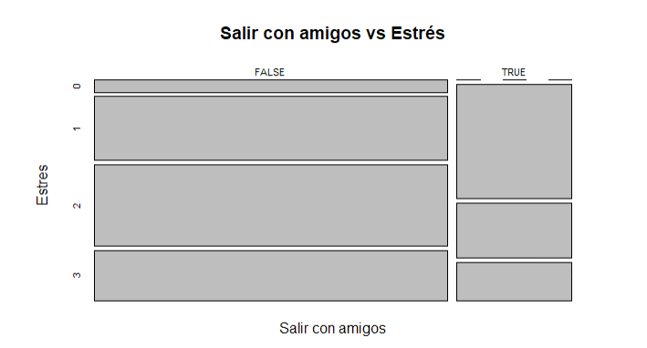

**Estadística y probabilidades**                                                 
<center> **Laboratorio**</center>  
<center>{width=500px}</center>  


```{r,echo=FALSE, include = FALSE}
library(readr)
library(dplyr)
library(ggplot2)
```

```{r,echo=FALSE, include=FALSE}
DT1 <- read_csv("final.csv")
```


# Introducción
## Relevancia
El análisis de la relación entre los hábitos, la gestión del estrés y el rendimiento académico en los estudiantes de UTEC en el ciclo académico 2022-2 es un tema de gran relevancia en el ámbito educativo actual. Los hábitos de estudio, la capacidad para manejar el estrés y el rendimiento académico son factores cruciales que pueden influir en el éxito y bienestar de los estudiantes. Comprender la relación entre estos aspectos es fundamental para identificar posibles áreas de mejora y diseñar estrategias efectivas de apoyo estudiantil. Además, este estudio podría proporcionar información valiosa a la comunidad académica y contribuir al desarrollo de programas de intervención y políticas educativas enfocadas en la mejora del rendimiento estudiantil.
Nuestro proyecto tiene los siguientes objetivos:


## Objetivos
**Objetivo general:**
  - Analizar la relación entre los hábitos de estudio y de vida de los estudiantes de UTEC durante el ciclo académico 2022-2, y cómo se correlacionan con el manejo del estrés y el rendimiento académico.

**Objetivos específicos:**
  - Identificar los hábitos de estudio y de vida más comunes entre los estudiantes de UTEC durante el período académico 2022-2.

  - Estudiar y comprender a través de gráficas las relaciones compartidas entre hábitos y gestión de estrés; hábitos y rendimiento académico; y estrés y rendimiento académico de los estudiantes de UTEC del período académico 2022-2.

  - Evaluar la fiabilidad y validez de los datos recopilados sobre los hábitos de estudio y la gestión de los estudiantes de UTEC durante el ciclo académico 2022-2, mediante la aplicación de pruebas estadísticas y técnicas de análisis de datos, como factores predictivos del rendimiento académico, es decir, que tienen influencia real sobre estos últimos.


## Contexto

El proyecto necesita comprender y analizar la relación existente entre los hábitos, la gestión del estrés y el rendimiento académico en los estudiantes universitarios. Para realizar la investigación del proyecto, es fundamental tener conocimientos sólidos sobre psicología educativa, psicología del aprendizaje, salud mental y técnicas de investigación en el ámbito educativo. Asimismo, se requiere comprender las teorías y modelos relacionados con los hábitos de estudio, el estrés académico y su impacto en el rendimiento académico. Además, es esencial familiarizarse con herramientas y metodologías para recopilar datos, como la encuesta que realizamos para tener una base de datos, y utilizar técnicas de análisis estadístico para examinar la relación entre las variables estudiadas. Este contexto de conocimiento proporciona la base necesaria para comprender y abordar de manera integral el análisis de la relación entre los hábitos, la gestión del estrés y el rendimiento académico en los estudiantes.

# Datos
## Recolección de datos
Realizamos la recolección de datos a través de un Formulario de Google (se puede acceder a él a través del siguiente enlace: https://forms.gle/1pV7ZPxskoUBCs1j8). Se decidió emplear este método por su facilidad para ser compartido, porque nos permite descargar los datos obtenidos a formato csv directamente y porque es bastante conocido por el público objetivo. Se llegó a la población a través de un contacto directo (amigos y conocidos).

## Población, muestra y muestreo
Nuestra población son los estudiantes de UTEC que cursaron el ciclo 2022-2, y las unidades muestrales, cada alumno encuestado.Se consiguieron 155 participaciones a través de un *muestreo a conveniencia* dada nuestra restricción de recursos.

## Variables
A continuación presentamos las variables analizadas, durante el procesamiento de la base de datos, se cambiaron los nombres a otros más sencillos y manejables (entre paréntesis).

* **Numéricas**

  + **continuas**: 
    - Promedio obtenido en el ciclo pasado (*Promedio*): Número no negativo con dos cifras decimales
    - Tiempo de viaje a la universidad (solo ida) (en minutos) (*Tiempo de viaje*): Número natural
    - mL de agua consumidos al día (*Agua*): Número natural
    - Edad (*Edad*): Número natural


  + **discretas**: 
    - Horas semanales de ejercicio físico / deporte (*Horas deporte*): Números no negativos en intervalos de 0.5
    - Horas dedicadas a estudiar por semana (*horas estudio*): Números no negativos en intervalos de 0.5
    - Tiempo promedio que duermen diariamente (*Horas sueño*): Números no negativos en intervalos de 0.5
    - Cantidad de cursos que llevó en el ciclo 2022-2 (*cantidad cursos*): Número natural
    - Tazas de café semanales (*Cafe*): Número natural

    

* **Categóricas** (se muestran las variables con sus respectivas opciones de respuestas):
  + **Cualitativas**:
    - Método de estudio: (*Métodos_estudio*)
       - Pomodoro
        - Feynman
        - Subrayar
        - Resumir y/o Mapa conceptual
        - Ningún método en particular
        - Spaced repetition
        - Método de Cornell
        - Mnemotecnias
        - SQ3R
        - Otro: (especificar)   
        
    - Material de estudio: (*Material*)
      - Usas material que entrega el profesor
      - Usas libros adicionales
      - Material audiovisual
      - Recursos en línea varios
    
    - Forma de lidiar con el estrés (*lid_estres*):
      - Escuchar música
      - Dormir / Tomarse un descanso
      - Jugar videojuegos
      - Salir / Llamar a amigos o familiares
      - Salir a caminar
    
    - Ciclo que cursa (*Ciclo*) (opciones: del ciclo 2 al ciclo 10) 
    
    - Carrera (*Carrera*) (opciones: Carreras de pregrado de UTEC)

    - ¿Medita o realizas alguna práctica de mindfulness? (Sí / No) (*Medita*)

    - Tiene un horario de estudio (tiempo dedicado al repaso de contenidos) (Sí / No) (*Tiene horario*)

    - Lugar donde estudia (*Lugar de estudio*):
      - Casa
      - Universidad
      - Otro (librería, café, etc.)

    - Asiste a asesorías (Sí / No) (*Asesorias*)
    
    - Practica algún deporte o hace ejercicio físico (Sí/No) (*si deporte*)

  + **Ordinales**
    - Nivel de estrés experimentado: (*Estres*)
      1. Nada estresado / Tranquilo
      2. Algo estresado
      3. Estresado
      4. Saquenme de UTEC (Alto nivel de estrés).

    - Veces que se han madrugado (quedado despiertos hasta la madrugada) por ciclo (*Desvelado*)
      1. Ninguna
      2. De 1 a 3 veces
      3. De 8 a 11 veces
      4. Más de 12 veces

    - Del 1 al 5, ¿cumpliste tus expectativas en cuanto a resultados académicos?: (*cumplio_exp*)
      1. 1 (No las cumplí)
      2. 2 (No las cumplí pero estuve cerca)
      3. 3 (Las cumplí)
      4. 4 (Las superé)
      5. 5 (Las superé por bastante)
      
    - Hace las tareas con tiempo (*tareas a tiempo*)
      1. no las entregaba
      2. todas las entregaba con retraso
      3. solía entregarlas a tiempo
      4. entregaba todas a tiempo


## Limpieza de base de datos
Una vez obtenidas las respuestas a la encuesta, se realizan distintos pasos para obtener una base de datos limpia y manejable. 
Listamos estos pasos a continuación:

  1. Cambiamos las observaciones de las variables de respuesta Sí/No (*Tiene Horario, Asesorias, Medita, si deporte*) a TRUE / FALSE, respectivamente. Por ejemplo, para la variable "*Tiene horario*", usamos el siguiente código:
```{r, eval=FALSE}
DT1 %>% mutate(`Tiene horario` =
        ifelse(`Tiene horario` =="Sí",TRUE,
        ifelse(`Tiene horario` == "No",FALSE, NA
               ))) -> DT1
```
  
  
  2. Empleando la función factor() y el argumento levels, ordenamos las variables ordinales (*Estres, cumplio_exp, Ciclo, Desvelado*).Por ejemplo, para la variable "*cumplio_exp*", usamos el siguiente código:
```{r, eval=FALSE}
DT1$cumplio_exp <- factor(DT1$cumplio_exp, levels = c("1 (No las cumplí)", "2 (No las cumplí pero estuve cerca)", "3 (Las cumplí)", "4 (Las superé)", "5 (Las superé por bastante)"), ordered = TRUE)
```
  
  
  3. Buscamos y transformamos a NA los valores anómalos de las variables numéricas (*Edad, Promedio, Agua, Horas de sueño, Horas deporte, Tiempo de viaje, Cafe, Horas de estudio*). Empleamos al función mutate() de la libreria dplyr; una función ifelse(); las funciones max() y min(); y plot() según el tipo de variable analizada, se usó gráficos de tipo boxplot e histograma.Por ejemplo, para la variable "*Horas de estudio*" se empleó el siguiente código:
  
```{r, warning=FALSE}
DT1 %>% mutate(`horas estudio` =
        ifelse(`horas estudio` > 60, NA, `horas estudio`)) -> DT1

DT1 %>% ggplot(., aes(`horas estudio`)) + geom_boxplot() + theme_classic()

max(DT1$`horas estudio`, na.rm = TRUE)
min(DT1$`horas estudio`, na.rm = TRUE)

```
  Con la información del gráfico, y de max() y min(), encontramos los valores que no son correctos. Luego, con las 2 primeras líneas de código los eliminamos cambiándolos por NA.
  
  4. Para las variables de opción múltiple, se crean nuevas variables. Cada una representa una de las opciones y tiene un valor de TRUE/FALSE, según el participante haya o no elegido tal opción. A continuación se muestran las variables a las que se aplicó este caso y las nuevas columnas resultantes:    
        * **lid_estres:**
          - Dormir
          - Musica
          - Videojuegos
          - Salir_amigos
          - Caminar
          - Otros
        - **Metodos_estudio:**
          - Pomodoro
          - Feynman
          - Resumen_mapa
          - Spaced_repetition
          - Método_de_Cornell
          - Mnemotecnias
          - SQ3R
          - Ninguno
        - **Material:**
          - Material_profesor
          - Libros
          - Material_audiovisual
          - Recursos_Linea
          - Apuntes
          - Material_Asesoria
          - Material_Mentorias    
  Esto se consiguió a través del siguiente código (ejemplo del código para *lid_estres*):
```{r, eval=FALSE}

DT1<-mutate(DT1,Dormir=grepl("Dormir",lid_estres),
            DT1,Musica=grepl("Escuchar música",lid_estres),
            DT1,Videojuegos=grepl("Jugar videojuegos",lid_estres),
            )
DT1<-mutate(DT1,Salir_Amigos=grepl("Salir / Llamar a amigos o familiares",lid_estres),
            DT1,Caminar=grepl("Salir a caminar",lid_estres),
            DT1,Otros=grepl("Otros",lid_estres),
)
```

  5. En cuanto al manejo de NAs, en la mayoría de las variables, se dejaron como tales, para no interferir con los cálculos de los descriptores. Sin embargo, se realizaron pruebas de porcentajes de NAs para determinar qué tanto afectan a los resultados del informe. La única variable para la cual se realizó un manejo especial de NAs es para *Horas deporte*.
  Esta variable es condicional de *si deporte*, si el encuestado respondió que no hace deporte, lo lógico es considerar que el valor adecuado para *Horas deporte* es 0. Se empleó el siguiente código.
  
```{r, eval = FALSE}
DT1 <- mutate(DT1, `Horas deporte` = ifelse(is.na(`Horas deporte`), 0, `Horas deporte`))

DT1 %>% select(`Horas deporte`)
```

  6. Finalmente, se renombraron las opciones de la variable estrés a números del 0 al 3. Esto sirve para que al momento de realizar gráficas no tengamos nombres tan largos que se sobrepongan. Para ello empleamos el siguiente código.

```{r, eval = FALSE}
DT1 %>% mutate(Estres = ifelse(Estres == "Nada estresado / Tranquilo", "0",
                               ifelse(Estres == "Algo estresado", "1", 
                                      ifelse(Estres == "Estresado", "2", ifelse(Estres=="Sáquenme de UTEC D: (alto nivel de estrés)", "3", NA)
                               )))) -> DT1
```

# 3. Análisis descriptivo.
## 3.1 Análisis univariado.

* **GRAFICA 1- Cantidad de estudiantes por carrera**

```{r,echo=FALSE}
ggplot(DT1,aes(x=Carrera))+geom_bar(fill="orange4")+coord_flip() + theme_classic()+labs(y="Cantidad")+ggtitle("Cantidad de estudiantes por carrera")+theme(axis.title.y = element_text(face="bold",vjust=0.5,color="red"))+theme(axis.title.x = element_text(face="bold",vjust=0.5,color="red"))

```

Del total de encuestados 48 estudiantes son de las carrera de ingeniería industrial, es la carrera que más se repite y es la moda de nuestra gráfica ***cantidad de estudiantes por carrera***, mientras que tuvimos menos participación de los estudiantes de la carrera de administración y negocios digitales, y de la carrera de Ing. de la Energía, puesto que solo fueron 3 encuestados en ambas carreras.


**GRÁFICA 2 - Edad de los estudiantes encuestados** 

```{r,echo=FALSE}
barplot(table(DT1$Edad),main="Edad de los estudiantes encuestados", ylab ="Edades",xlab="Cantidad de estudiantes ",xlim=c(0,60),col="red",horiz = T, cex.names = 0.8)
```

La edad de nuestros encuestados esta entre 17 y 26 años,pero la edad que mas se repite y es la moda de nuestra variable es de ***18*** años con 59 encuestados, las edades que poca participación tuvieron es de 25 y 26 años, ambos contando solo con 1 encuestado.


**GRÁFICA 3 - Preferencias para aliviar el estrés.**

```{r,echo=FALSE}
DT1 %>%  
  select(Dormir, Musica, Videojuegos, Salir_Amigos, Caminar, Otros) %>%
  summarise(Dormir = sum(Dormir == TRUE),
            Musica = sum(Musica == TRUE),
            Videojuegos = sum(Videojuegos == TRUE),
            Salir_Amigos = sum(Salir_Amigos == TRUE),
            Caminar = sum(Caminar == TRUE),
            Otros = sum(Otros == TRUE)) -> DG

colnames(DG) <- c("Dormir", "Musica", "Videojuegos", "Salir con amigos", "Caminar", "Otros")

``` 

```{r,echo=FALSE}
color = c("yellow","blue","green","purple","grey")
```

```{r,echo=FALSE}
as.matrix(DG) -> aqui
as.vector(names(DG)) -> c
nombres <- c("Dormir", "Musica", "Videojuegos", "Salir con amigos", "Caminar", "Otros")
barplot(aqui, cex.names = 0.7, col = 6, main = "Preferencias para aliviar el estrés", xlab = "Preferencias", ylab = "Cantidad", ylim = c(0, 120), names.arg = nombres)
```

* **JUSTIFICACIÓN**  

Durante el ciclo o periodo académico los estudiantes suelen estresarse por la carga académica, y buscan la mejor forma de aliviar con estos, es por ellos que en la gráfica les mostramos las preferencias que practican para lidiar con este problema(el estrés).  

* **ANÁLISIS.** 

-Según la gráfica que se muestra los estudiantes de la UTEC prefieren aliviar el estrés dormiendo y escuchando música, y lo que menos hacen es caminar, bueno algunos buscan otra manera de poder manejar el estrés.  
-La cantidad de estudiantes que prefieren aliviar el estrés durmiendo es de 110 y los que prefieren escuchar música son de  97 alumnos.    
-La moda en esta gráfica es "Dormir", puesto que es la preferencia mas votado y más utilizada para lidiar con el estrés.  


**GRÁFICA 4 - Métodos de estudio que utilizaron**  

```{r,echo=FALSE}
DT1 %>%  
  select(Pomodoro, Feynman, Subrayar, Resumen_Mapa, Spaced_repetition, Método_de_Cornell, Mnemotecnias, SQ3R, Ninguno) %>%
  summarise(Pomodoro = sum(Pomodoro == TRUE),
            Feynman = sum(Feynman == TRUE),
            Subrayar = sum(Subrayar == TRUE),
            Resumen_Mapa = sum(Resumen_Mapa == TRUE),
            Spaced_repetition = sum(Spaced_repetition == TRUE),
            Método_de_Cornell = sum(Método_de_Cornell == TRUE),
            Mnemotecnias = sum(Mnemotecnias == TRUE),
            SQ3R = sum(SQ3R == TRUE),
            Ninguno = sum(Ninguno == TRUE)) -> DG1

colnames(DG1) <- c("M. Pomodoro", "M. Feyman", "Subrayar", "Resumen de mapas", "Spaced Reception", "M. de Cornell", "Memotecnias", "M. SQ3R", "Ninguno")

```
```{r,echo=FALSE}
nombres <- c("M. Pomodoro", "M. Feyman", "Subrayar", "Resumen de mapas", "Spaced Reception", "M. de Cornell", "Memotecnias", "M. SQ3R", "Ninguno")
nombres_limpio <- gsub("-", " ", nombres)

barplot(t(t(DG1)), cex.names = 0.3, col = "yellow", main = "Método de estudio utilizado", xlab = "Métodos", ylab = "Cantidad", ylim = c(0, 70), names.arg = nombres_limpio)

```


* **JUSTIFICACIÓN**

-Esta gráfico de barras nos muestra los distintos métodos de estudio empleado por los estudiante de la UTEC durante el periodo académico 2022-2. 

* **ANÁLISIS.** 

-De esta gráfica de métodos de estudios utilizados, podemos apreciar que subrayar es el método más utilizado por los estudiantes, mientras que el método de SQ3R es el método menos utilizado. Asimismo, podemos apreciar que una cantidad de estudiantes no utilizan ningún método de estudio y es el tercero en cantidad.  
-La moda de Métodos de estudio utilizados es el método **_Subrayar_**, con una preferencia de 65 estudiantes. El segundo método que tuvo popularidad es **_Resumen de mapas_** con una presencia de 58 estudiantes.    
-Unos 44 alumnos no utilizan ningunos de los métodos propuestos.


**GRÁFICA 5 - Material empleado durante el ciclo**  

```{r,echo=FALSE}

DT1 %>%
  select(Material_Profesor, Libros, Material_audiovisual, Recursos_Linea, Apuntes, Material_Asesoria, Material_Mentorias) %>%
  summarise(Material_Profesor = sum(Material_Profesor == TRUE),
            Libros = sum(Libros == TRUE),
            Material_audiovisual = sum(Material_audiovisual == TRUE),
            Recursos_Linea = sum(Recursos_Linea == TRUE),
            Apuntes = sum(Apuntes == TRUE),
            Material_Asesoria = sum(Material_Asesoria == TRUE),
            Material_Mentorias = sum(Material_Mentorias == TRUE)) -> DG2

nombres <- c("Material Profesor", "Libros", "Material Audiovisual", "Recursos en Linea", "Apuntes", "Material Asesoria", "Material Mentorias")

barplot(t(t(DG2)), cex.names = 0.4, col = "blue", main = "Material empleado durante el ciclo", xlab = "Materiales de estudio", ylab = "Cantidad", ylim = c(0, 120), names.arg = nombres)

```


* **JUSTIFICACIÓN**

Uno como estudiante busca la mejor forma  de reforzar y fortalecer sus conocimientos aprendidos en aula, y para ello uno emplea distintos materiales de estudio. 

* **ANÁLISIS** 

-En esta tabla podemos apreciar que el material entregado por los profesores es el mayor utilizado y los apuntes son el método menos empleado por los estudiantes.   
-La moda en esta gráfica es **_Material Profesor_**, que son los materiales entregados en clase o subidas al Canvas por el docente del curso.  
-La cantidad de estudiantes que utilizan los materiales del profesor es de 105.  
-El material menos utilizado es **_Apuntes_**, ya que solo 27 alumnos lo utilizan.  

```{r,echo=FALSE}
#t <- table(DT1$Material)
#max<-which.max(t)
#moda_m <- names(t)[max]
#moda_m
```
+ _Podemos señalar que la mayor preferencia del material empleado durante el ciclo oscila entre el material entregado por el profesor, el material audiovisual y recursos en línea._ 

```{r,echo=FALSE}
#Grafícaremos la variable "Desvelado" que es una categórica nominal, este nos mostrara los días que un alumno se desveló en el ciclo anterior. 

#barplot(table(DT1$Desvelado),cex.names=0.7,ylim=c(0,50),col=color,main="Cantidad de desvelo por ciclo",width = c(0.05,0.05,0.05,0.05,0.05))
#- **ANÁLISIS**  
#-En la tabla de cantidad de desvelo por ciclo podemos apreciar que la mayoría de alumnos se ha develado en mayor cantidad de 4 a 7 veces, mientras que una minoría de alumnos se han desvelado alguna vez y mientras otros no.
```


**GRÁFICA 6 - Nivel de estrés durante el ciclo**

```{r,echo=FALSE}
DT1$Estres <- factor(DT1$Estres, levels = c("Nada estresado / Tranquilo", "Algo estresado", "Estresado", "Sáquenme de UTEC D: (alto nivel de estrés)"), ordered = TRUE)

tabla_estres <- table(DT1$Estres)
color <- c("blue", "green", "yellow", "red")
barplot(tabla_estres, cex.names = 0.5, ylim = c(0, 60), col = color, main = "Nivel de estrés durante el ciclo", xlab = "Nivel de estrés", ylab = "Cantidad")
```

- **ANÁLISIS**   
 
-En la gráfica de niveles de estrés durante el ciclo, podemos apreciar que el nivel de estrés de los estudiantes en su mayoría es estresado o algo estresado, además el nivel de estrés de una minoría  de estudiantes ha sido tranquilo.  
-La cantidad de estudiantes que estuvieron **_algo estresado_** de es 57, mientras que la cantidad de **_estresado_** es de 56.  
- Solo 7 alumnos del total de encuestados no sufrieron de ***Estrés***.  

+ **HISTOGRAMA - Promedio Ponderado**


```{r,echo=FALSE}
#Graficamos histograma de la variable numérica continua "Promedio Ponderado", este nos permitirá visualizar como están distribuidos los datos, en este caso el promedio de los alumnos en el periodo 2022-2. 
hist(DT1$Promedio, main = "Promedio Ponderado", ylab = "Frecuencia", xlab = "Promedio", col = "green", breaks = 20, las = 2, xlim = c(10, 20))
abline(v = median(DT1$Promedio, na.rm = TRUE), col = "red", lwd = 3)
abline(v = mean(DT1$Promedio, na.rm = TRUE), col = "purple", lwd = 3)
legend(100, 140,
       x = "topleft",
       legend = c("MEDIA", "MEDIANA"),
       col = c("purple", "red"),
       lwd = 2)
```

+ **ANÁLISIS**
 
* La gráfica muestra que el  promedio oscila entre 10.51 y  18.75, [10.51 - 18.75]. Podemos decir que el mínimo promedio ponderado es de 10.51 mientras que el máximo es de 18.75 durante el ciclo académico 2022-2.

```{r,echo=FALSE}
rango_promedio <- range(na.omit(DT1$Promedio[DT1$Promedio != 0]))
rango_promedio
```

* El valor central o mediana del  promedio ponderado de los alumnos es de  15.32.

```{r,echo=FALSE}
mediana_promedio <- median(na.omit(DT1$Promedio))
mediana_promedio

```

* El valor del promedio general o media aritmética de las notas es  15.24

```{r,echo=FALSE}
media_promedio <- mean(na.omit(DT1$Promedio))
round(media_promedio,2) 
```

_Al comparar la  mediana con la media aritmética del promedio Ponderado de los alumnos, podemos apreciar que la mediana es mayor que la media, lo cual nos indica que la distribución de los valores tiende a estar inclinada o sesgada hacia la izquierda_

### Porcentajes de N.A. de las variables
Para entender mejor los sesgos que puede tener nuestra investigación, realizamos un análisis de la cantidad de NAs de las variables:

Porcentaje de N.A de la variable "cantidad curso"
```{r, echo=FALSE}
100 * sum(is.na(DT1$`cantidad cursos`)) / (sum(is.na(DT1$`cantidad cursos`)) + sum(!is.na(DT1$`cantidad cursos`)))
```
Porcentaje de N.A de la variable "Horas sueño"
```{r, echo=FALSE}
100 * sum(is.na(DT1$`Horas sueno`)) / (sum(is.na(DT1$`Horas sueno`)) + sum(!is.na(DT1$`Horas sueno`)))

```
Porcentaje de N.A de la variable "Horas deporte"
```{r, echo=FALSE}
100 * sum(is.na(DT1$`Horas deporte`)) / (sum(is.na(DT1$`Horas deporte`)) + sum(!is.na(DT1$`Horas deporte`)))

```
Porcentaje de N.A de la variable "Cafe"
```{r, echo=FALSE}
100 * sum(is.na(DT1$`Cafe`)) / (sum(is.na(DT1$`Cafe`)) + sum(!is.na(DT1$`Cafe`)))
```
Porcentaje de N.A de la variable "horas estudio"
```{r, echo=FALSE}
100 * sum(is.na(DT1$`horas estudio`)) / (sum(is.na(DT1$`horas estudio`)) + sum(!is.na(DT1$`horas estudio`)))

```

Porcentaje de N.A de la variable "cumplio_expectativa"
```{r, echo=FALSE}
100 * sum(is.na(DT1$`cumplio_exp`)) / (sum(is.na(DT1$`cumplio_exp`)) + sum(!is.na(DT1$`cumplio_exp`)))
```
Porcentaje de N.A de la variable "Promedio"
```{r, echo=FALSE}
100 * sum(is.na(DT1$Promedio)) / (sum(is.na(DT1$Promedio)) + sum(!is.na(DT1$Promedio)))
```
Porcentaje de N.A de la variable "Agua"
```{r, echo=FALSE}
100 * sum(is.na(DT1$Agua)) / (sum(is.na(DT1$Agua)) + sum(!is.na(DT1$Agua)))
```

La variable que más porcentaje de  N.A tiene es "Horas deporte" con 34.84 (De 155 observaciones 54 son N.A), el cual para poder facilitar y tener un mejor análisis de dato se decidió reemplazarlo por el valor de cero(0), este representaría que el individuo no realiza ejercicios o deporte  durante la semana. 

Mientras que de las demás variables numéricas  restantes el porcentaje de N.A es mínimo a comparación con la variable anterior, el cual esta entre 7.74 y 0.65 porciento, es decir a lo mucho podemos encontrar 12 N.A  y a lo mínimo un 1 N.A de 155 observaciones, como son mínimas estas no tendrían mucha influencia o no afectarían en el análisis de datos por ellos se decidió omitirlas.

### Hábitos más comunes
Para concluir con el análisis univariado, presentamos los hábitos y carácterísticas más comunes entre la población encuestada, o, lo que es lo mismo, las características medias de los encuestados (usando las medias y modas de las variables.

Las características medias de los encuestados son:

  - Tiene 19 años
  - Estudia Ingeniería Industrial
  - Cumplió sus expectativas (sin superarlas ni quedar atrás)
  - Tiene un promedio de 15,24
  - Está en 3er ciclo
  - Toma 1327 mL de agua al día
  - Tiene un horario de estudio
  - Duerme 6 horas cada noche
  - Hace 2,6 h de deporte a la semana
  - Demora 45,77 minutos en llegar a la universidad
  - No medita
  - Toma 3,5 tazas de café a la semana
  - Lleva 6 cursos
  - Asiste a asesorías
  - Estudia 7 horas a la semana fuera de su horario de clases
  - Estudia en su casa mayormente
  - Se ha desvelado de 4 a 7 veces
  - Usa material entregado por el profesor, audiovisual y recursos en línea para estudiar
  - Duerme y escucha música para lidiar con el estrés
  - (No existe una tendencia marcada para los métodos de estudio que se emplean)
  
  
## 3.2 Análisis bivariado

**GRÁFICA - Comparación entre calificación de expectativas y horas de sueño** 

```{r, echo=FALSE}
variables <- c("Horas sueno")

for (variable in variables) {
  i <- match(variable, names(DT1))  
  
  if (!is.na(i)) {
    if (i %in% c(2, 5, 9, 11, 13, 14, 16, 17, 22)) {
      boxplot(DT1[[i]] ~ DT1$cumplio_exp, col = c("blue", "red", "green", "yellow"), horizontal = TRUE,
              xlab = variable, ylab = "Cumplió expectativas")
    } else {
      mosaicplot(DT1[[i]] ~ DT1$cumplio_exp, xlab = variable, ylab = "Cumplió expectativas")
    }
  }
}
```

* **JUSTIFICACIÓN**

El análisis se centra en comparar las horas de sueño con la percepción del cumplimiento de las expectativas académicas. Esta comparación puede ser relevante para evaluar si existe alguna relación entre las horas de sueño y la satisfacción con el grado en que las expectativas académicas son alcanzadas.

* **ANÁLISIS** 

El gráfico muestra la comparación entre las horas de sueño y la percepción del cumplimiento de las expectativas académicas.

Para evaluar la percepción sobre el cumplimiento de las expectativas, se utilizó una calificación que refleja el grado en que los estudiantes consideran que sus expectativas académicas han sido alcanzadas. Esta calificación puede interpretarse como la satisfacción subjetiva de los estudiantes con el cumplimiento de sus expectativas.

Se observa que aquellos encuestados que no cumplieron con sus expectativas académicas tuvieron una mayor cantidad de horas de sueño en comparación con los que sí cumplieron sus expectativas. Esta relación sugiere que existe una posible asociación entre el no cumplimiento de las expectativas académicas y un mayor tiempo dedicado al sueño. Sin embargo, es importante destacar que se necesita realizar un análisis más exhaustivo y considerar otros factores antes de establecer conclusiones definitivas.

**GRÁFICA - Comparación entre calificación de expectativas y tiempo de viaje**  

```{r, echo=FALSE}
variables <- c("Tiempo de viaje")

for (variable in variables) {
  i <- match(variable, names(DT1))  # Obtener el índice de la variable seleccionada
  
  if (!is.na(i)) {
    if (i %in% c(2, 5, 9, 11, 13, 14, 16, 17, 22)) {
      boxplot(DT1[[i]] ~ DT1$cumplio_exp, col = c("blue", "red", "green", "yellow"), horizontal = TRUE,
              xlab = variable, ylab = "Cumplió expectativas")
    } else {
      mosaicplot(DT1[[i]] ~ DT1$cumplio_exp, xlab = variable, ylab = "Cumplió expectativas")
    }
  }
}
```


* **JUSTIFICACIÓN**

El objetivo de este análisis es examinar la posible relación entre el tiempo de viaje de los alumnos y su percepción sobre el cumplimiento de sus expectativas académicas. El tiempo de viaje es un factor relevante en la vida de los estudiantes, y entender cómo puede influir en su satisfacción con el cumplimiento de las expectativas puede brindar información valiosa para mejorar la experiencia académica.

* **ANÁLISIS** 

La gráfica presenta una comparación entre el tiempo de viaje de los alumnos y su percepción sobre el cumplimiento de sus expectativas académicas.

Se observa que los alumnos que tuvieron un bajo cumplimiento de sus expectativas presentaron un tiempo de viaje por encima de los 60 minutos. Por otro lado, aquellos que calificaron su cumplimiento de expectativas con el nivel máximo (nivel 5) reportaron un tiempo de viaje inferior a 50 minutos.

El promedio de horas que los alumnos estudiaron fue de 45.77097. Los alumnos que calificaron sus expectativas con un nivel 5 presentaron un tiempo de viaje promedio de 33.41667, mientras que aquellos que calificaron con un nivel 2 tuvieron un tiempo de viaje promedio de 59.17857.

Podemos considerar que aquellos con un tiempo de viaje más corto tienden a sentir que sus expectativas son cumplidas en mayor medida, mientras que aquellos con un tiempo de viaje más largo pueden experimentar un menor cumplimiento de sus expectativas.

**GRÁFICA - Comparación entre calificación de expectativas y promedio ponderado**  

```{r, echo=FALSE}
boxplot(DT1$Promedio ~ DT1$cumplio_exp, col = c("blue", "red", "green", "yellow"), xlab = "Cumplió expectativas", ylab = "Promedio")
```


* **JUSTIFICACIÓN**

El análisis se centra en comparar el rendimiento académico promedio de los alumnos con su percepción sobre el cumplimiento de sus expectativas académicas. Esta comparación puede ser relevante para evaluar si existe alguna relación entre el rendimiento académico y la satisfacción con el grado en que las expectativas académicas son alcanzadas.

* **ANÁLISIS** 

La gráfica muestra la comparación entre el rendimiento académico promedio de los alumnos y su percepción sobre el cumplimiento de sus expectativas académicas.

Para evaluar la percepción sobre el cumplimiento de las expectativas, se utilizó una calificación que refleja el grado en que los estudiantes consideran que sus expectativas académicas han sido alcanzadas. Esta calificación puede interpretarse como la satisfacción subjetiva de los estudiantes con el cumplimiento de sus expectativas.

El rendimiento académico se representa mediante un promedio, que refleja el desempeño general de los estudiantes en términos de las calificaciones obtenidas en sus cursos.

Al comparar el rendimiento académico promedio con la calificación de la percepción de cumplimiento de expectativas, se busca explorar si existe alguna relación entre la satisfacción con el grado en que las expectativas son alcanzadas y el rendimiento académico. Por ejemplo, se podría analizar si los estudiantes que perciben un mayor cumplimiento de sus expectativas académicas también obtienen un rendimiento académico más alto.

**GRÁFICA - Comparación entre edades y promedio ponderado** 

```{r, echo=FALSE, eval=FALSE}

mosaicplot(DT1$Salir_Amigos ~ DT1$Estres, xlab = "Salir con amigos", ylab = "Estres", main= "Salir con amigos vs Estrés")

```


* **JUSTIFICACIÓN**

Este es un caso de análisis de 2 variables categóricas: El nivel de estrés experimentado y si el estudiante sale con amigos para lidiar con el estrés. Para realizar este tipo de comparación, se emplea un gráfico de mosaico. Recordemos que 0 representa poco estrés y 4, bastante.

* **ANÁLISIS** 

Los bloques de la derecha del gráfico representan los alumnos que sí salen con amigos para lidiar con el estrés. Este gráfico no muestra ninguna relación significativa entre las variables. En caso, por ejemplo, existiese una relación en la que salir con amigos disminuye el nivel del estrés, el gráfico se vería de una forma distinta. Los bloques de la derecha serían (los que sí salen con amigos), de arriba para abajo, de grandes a pequeños, y los de la izquierda (los que no salen con amigos) irían de pequeños a grandes.


**GRÁFICA - Comparación entre edades y promedio ponderado** 

```{r, echo=FALSE}
max_x <- max(DT1$`Horas sueno`, na.rm = TRUE, finite = TRUE)
max_y <- max(DT1$Promedio, na.rm = TRUE, finite = TRUE)
xlim <- c(4, max_x)
ylim <- c(4, max_y)

plot(DT1$`Horas sueno`, DT1$Promedio, abline(col = "red"), main = "Diagrama de dispersión de las horas de sueño vs el promedio", xlab = "Horas de sueño", ylab = "Promedio", col = c("blue", "green"), xlim = xlim, ylim = ylim)

```

* **JUSTIFICACIÓN**

Este es un caso de análisis de 2 variables numéricas: Las horas de sueño y el promedio de los alumnos. Para el análisis de este tipo de variables, se empleó un gráfico de dispersión. 

* **ANÁLISIS** 

Este gráfico muestra que no hay una relación significativa entre las variables. No muestran ninguna tendencia. En caso hubiese una, los puntos aparecerían aproximadamente alrededor de una diagonal. 

Cabe resaltar, que realizamos pruebas de r cuadrado para determinar las relaciones que pudiesen haber entre el promedio y todo el resto de variables numéricas (como, en este caso, horas de sueño). Todo los valores obtenidos fueron demasiado bajos como para considerar una relación real.


