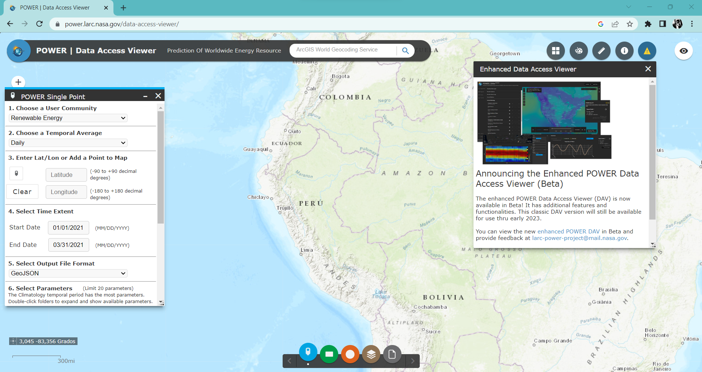
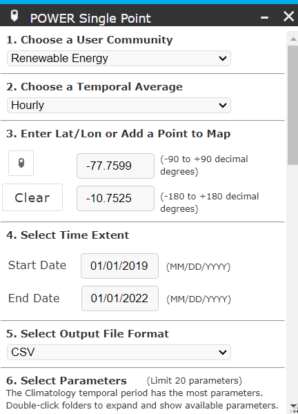
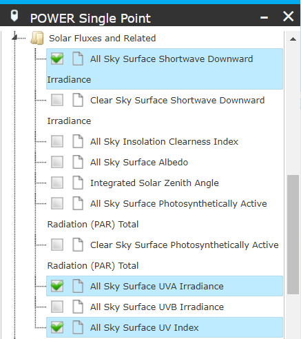
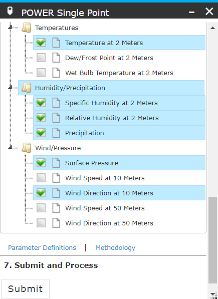

<div style="text-align: justify">

> ## Diagrama de Gantt

Instalamos las librerías necesarias para realizar el diagrama de Gantt y verificamos si es necesario instalar una librería de manera automática.

```{r, warning=FALSE, message=FALSE}
if(!require(readr)){install.packages('readr')}
library(readr)
if(!require(dplyr)){install.packages('dplyr')}
library(dplyr)
if(!require(funModeling)){install.packages('funModeling')}
library(funModeling)
if(!require(ggplot2)){install.packages('ggplot2')}
library(ggplot2)
if(!require(corrplot)){install.packages('corrplot')}
library(corrplot)
```

> # **1. Introducción**

> # 1.1. Relevancia

Nuestro proyecto se enfoca en conocer los valores de radiación solar, temperatura y de variables meteorológicas complementarias para identificar alguna relación existente. La radiación solar y el cambio de temperatura son dos variables fundamentales en el estudio del clima y el cambio climático. Comprender la relación entre estos dos factores en un área específica, como las provincias de Lima, puede proporcionar información valiosa sobre los patrones climáticos locales y el posible impacto en el medio ambiente y las actividades humanas. Otro aspecto relevante de este proyecto es el período de estudio abarcado, que comprende los años 2019 al 2021. Estudiar un período de tiempo relativamente reciente permite capturar los cambios y las tendencias más actuales en los patrones climáticos.

> # 1.2. Objetivos

+ Identificar tendencias de radiación solar y de temperatura en función del tiempo en las provincias de Lima.
+ Explicar la relación entre la radiación solar y el cambio de temperatura en las provincias de Lima de 2019 al 2021.
+ Evaluar la correlación de variables meteorológicas relevantes respecto a radiación solar y temperatura en las provincias de Lima de 2019 al 2021.

> # 1.3. Contexto

El proyecto aborda el conocimiento básico de _**variables meteorológicas**_ y estadística descriptiva básica para comprender la interpretación descriptiva y gráfica de las variables. Las variables meteorológicas relevantes para el estudio son: radiación UVA ($\frac{W}{m^2.h}$), índice de radiación UV, presión superficial (_**kPa**_), precipitación ($\frac{mm}{día}$), húmedad relativa (%), húmedad específica ($\frac{g}{kg}$) y velocidad de viento a 10 metros ($\frac{m}{s}$)

> # **2. Datos**

En esta sección se detallamos el proceso de recolección de datos; la definición y explicación la población, muestra, representatividad y el tipo de muestreo del proyecto; además de la definición de las variables de estudio; y explicar la limpieza de datos realizada.

> # 2.1. Recolección de datos

Nuestro estudio estadístico tendrá como base de datos: [NASA Prediction Of Worldwide Energy Resources](https://power.larc.nasa.gov/) a través del apartado [Data Access Viewer](https://power.larc.nasa.gov/data-access-viewer/). 



El proyecto proporciona conjuntos de datos solares y meteorológicos de la investigación de la NASA mediante una aplicación de mapeo web. La cual será utilizada para adquirir nuestra base de datos y posteriormente armarlas según nuestros requerimientos. Cuenta con 2 tipos de acceso a los datos, por zonas y por puntos específicos.

Pasaremos a describir el proceso de recolección de datos.

+ **Paso 1**: Iniciamos el proceso de recolección, ingresando a la página web y colocamos los datos del cuadro flotante de la parte izquierda de la siguiente manera:

    + Choose a User Community $\rightarrow$ Renewable Energy 
    + Choose a Temporal Average $\rightarrow$ Hourly
    + Enter Lat/Lon or Add a Point to Map $\rightarrow$ Ingresamos los valores de latitud y longitud de cada provincia en específico.
    + Select Time Extent $\rightarrow$ [01-01-2019] a [01-01-2022]
    + Select Output File Format $\rightarrow$ CSV

<center>

<div style="text-align: justify">

+ **Paso 2**: Ahora seleccionaremos los parámetros que vamos a utilizar.

<center> 

<center>

<div style="text-align: justify">

+ **Paso 3**: Seleccionamos **Submit** y aparecerá lo siguiente:

<center>

<div style="text-align: justify">

Seleccionamos el cuadro de texto **CSV** y se procederá a descargar la base de datos. 

**Nota:** La plataforma solo te deja escoger 5 parámetros para su descarga. En ese caso tuvimos que realizar dos interacciones de descarga para obtener todos los parámetros.

<div style="text-align: justify">

> # 2.2. Población, muestra y muestreo

+ **Población:** Nuestra población es el Territorio del Perú.
+ **Muestra:** La muestra escogida es la ciudad de Lima. El **tamaño de muestra** es de 289 306 observaciones.
+ **Unidad de muestreo:** Provincia de Lima en una determinada hora de una cierta fecha.
+ **Muestreo:** No probabilístico por conveniencia. La muestra es representativa, debido que al recopilar los datos a partir de valores de latitud y longitud, probando otros valores que simulen la misma zona, nuestra base de datos tenía los mismos valores. Es decir, una provincia de Lima esta delimitada por una cierta zona, y esta zona presenta muchos puntos de latitud y longitud, el programa de mapeo web proporcionó que cada punto de esta zona tiene los mismos valores registrados de las variables meteorológicas medidas.

> # 2.3. Variables

Nuestro proyecto esta conformado por una base de datos de 17 variables, donde 4 son de tipo categórica y 13 de carácter numérico.

> ## Base de datos

Del directorio de trabajo, asignamos la base de datos de nuestro proyecto a un dataframe **`DF`** mediante la función **read_csv**:

```{r}
DF <- read_csv("Dataframe_Final.csv")
```

Con la base de datos ya asignado en nuestro entorno de trabajo, mencionamos a **`DF`**:

```{r}
DF
```

Podemos observar que **`DF`** tiene 289306 observaciones de 16 variables. Cambiaremos de nombre algunas variables, por temas de estética.

```{r}
colnames(DF)[5] <- "RAD_UVA"
colnames(DF)[6] <- "RAD_SOL"
colnames(DF)[7] <- "IND_RAD_UV"
colnames(DF)[11] <- "PRECPT"
```

> ## Variables categóricas

Nuestra base de datos tiene 4 variables categóricas.

|Variable| Tipo | Nombre | Descripción |  Restricciones |
|:------| :------|:------| :------| :-----|
|`DATE` | Nominal |Fecha | Es la unión de las variables día, mes y año.| Fechas de 2019 al 2021
|`PROV` | Nominal |Provincia | Zonas geográficas delimitadas para el estudio. | Provincias de Lima |
|`SEASON` | Nominal |Estación | Periodos de tiempo regulares de acuerdo a sus condiciones climatologías. | Verano, Otoño, Invierno y Primavera |
|`LVL_URB` | Ordinal | Nivel de urbanización | Caracterización a las provincias por su nivel de urbanización. | Baja, Moderada y Alta |

> ## Variables numéricas

Nuestra base de datos tiene 13 variables numéricas.

> ### Variable numérica discreta

|Variable| Nombre | Descripción | Unidad | Restricciones |
|:------| :------| :------| :----:| :-----|
|`YEAR` | Año | Periodo de tiempo que regularmente tiene 365 días. | años | Número entero positivo de 2019 al 2021. |
|`MO` | Mes | Periodo de tiempo que regilarmente tiene 31 días. | meses | Número entero positivo del 1 al 12. |
|`DY` | Día | Periodo de tiempo que tiene 24 horas. | días | Número entero positivo del 1 al 31. |
|`HR` | Hora | Periodo de tiempo que contiene 60 minutos. | hrs | Número entero positivo del 0 al 23. |

> ### Variable numérica continua

|Variable| Nombre | Descripción | Unidad | Restricciones |
|:------| :------| :--------| :--:| :------|
|`RAD_UVA` | Radiación UVA | Radiación ultravioleta A (UVA 315nm-400nm) bajo todas las condiciones del cielo. | $\frac{W}{m^2}$  | ALLSKY_SFC_UVA $\geq$ 0 |
|`RAD_SOL` | Radiación Solar | Radiación solar total incidente (directa más difusa) en un plano horizontal en la superficie de la tierra bajo todas las condiciones del cielo. | $\frac{W}{m^2.h}$ | ALLSKY_SFC_SW_DWN $\geq$ 0 |
|`IND_RAD_UV` | Índice de Radiación UV | Índice de exposición a la radiación ultravioleta. | Adimensional | ALLSKY_SFC_UV_INDEX $\geq$ 0 |
|`T2M` | Temperatura a 2 metros | Temperatura promedio del aire (bulbo seco) a 2 metros sobre la superficie de la tierra. | $°C$ |  T2M $\in\mathbb{R}$ |
|`QV2M` | Húmedad Específica a 2 metros | Relación entre la masa de vapor de agua y la masa total de aire a 2 metros (kg de agua/kg de aire total) | $\frac{g}{kg}$ | QV2M $\geq$ 0 |
|`RH2M` | Húmedad Relativa a 2 metros | Relación entre la presión parcial real del vapor de agua y la presión parcial de saturación, expresada en porcentaje | % | 0 $\leq$ RH2M $\leq$ 100 |
|`PRECPT` | Precipitación corregida | Promedio corregido de sesgo de la precipitación total en la superficie de la tierra en masa de agua (incluye el contenido de agua en la nieve) | $\frac{mm}{día}$ | PRECTOTCORR $\geq$ 0 |
|`PS` | Presión superficial | Promedio de la presión superficial en la superficie de la tierra. | $kPa$ | PS $\geq$ 0 |
|`WS10M` | Velocidad del Viento a 10 metros | Promedio de la velocidad del viento a 10 metros sobre la superficie de la tierra. | $\frac{m}{s}$ | WS10M $\geq$ 0 |

Para visualizar nuestras variables, utilizaremos el comando **df_status** y así corroborar si las variables están correctamente clasificadas.

```{r}
df_status(DF)
```

Observamos que RStudio identifico de manera correcta la clasificación de nuestras variables.

> # 2.4. Limpieza de Datos

Ahora procederemos a revisar si nuestro **`DF`** está completo y si no es así, realizar una cuidadosa limpieza de datos.

```{r}
df_status(DF)
```

Podemos observar que existe una cantidad exorbitante de valores 0 en la variable **`RAD_UVA`**, **`RAD_SOL`**, **`IND_RAD_UV`** y **`PRECPT`**. 

```{r}
table(DF$HR[DF$RAD_UVA == 0])
table(DF$HR[DF$RAD_SOL == 0])
table(DF$HR[DF$IND_RAD_UV == 0])
table(DF$HR[DF$PRECPT == 0])
```

Podemos inferir mediante la visualización de las frecuencias obtenidas de las variables de radiación y precipitación, que el intervalo de tiempo donde se registra mayor cantidad de valores 0 son de [0 am. - 5 am.] y [6 pm. - 11 pm.]. A partir de esta deducción podemos filtrar nuestra base de datos para obtener resultados más interesantes en relación a nuestros objetivos de estudio. Según la página web [Datos Mundial](https://www.datosmundial.com/america/peru/puesta-del-sol.php), la hora de amanecer y atardecer del Perú es a las 6:19 a.m. y 5:51 p.m. Por lo tanto, procederemos a realizar lo siguiente:

```{r}
DFP <- DF %>% filter(HR >= 6 & HR < 18)
```

Filtramos **`DF`** en función al intervalo de tiempo 6 $\leq$ HR $\lt$ 18, y llamamos a nuestro nueva base de datos **`DFP`**. Ahora observaremos el estado de las variables con este nuevo filtro.

```{r}
df_status(DFP)
```

Podemos observar que la cantidad de ceros ha sido reducida en casi su totalidad en las variables afectadas anteriormente, pero **`PRECTOTCORR`** sigue sospechosamente con una cantidad de ceros exagerada, veremos luego por qué es así justificando su presencia de valores ceros en sus observaciones. 

```{r}
DFP
```
A partir de la limpieza realizada observamos en una reducción considerable de nuestras observaciones, con un **tamaño de muestra efectiva** de 144 634 observaciones.

> # **3. Análisis Descriptivo**

En este apartado presentaremos todos los descriptores utilizados para representar cada variable estudiada en nuestro proyecto. Los gráficos que se describen son apropiados e informativos para la variable que describimos.

```{r echo = FALSE}
cv <- function(x, na.rm=FALSE) {
  return (sd(x, na.rm=na.rm) / mean(x, na.rm=na.rm))
}
Moda <- function(x) {
  return (table(x)[which.max(table(x))])
}
moda <- function(x) {
  return (names(Moda(x)))
}
```

> # 3.1. Análisis Univariado

El análisis univariado es una técnica de análisis estadístico que se utiliza para examinar una sola variable a la vez. En este tipo de análisis, el enfoque se centra en comprender las características y propiedades de una variable en particular, sin considerar las posibles relaciones con otras variables. Por lo tanto, analizaremos las variables más relevantes de nuestro estudio para representar de manera correcta la variable mediante los descriptores gráficos.

> ### Análisis de **`RAD_SOL`** (Radiación Solar)

Como primer análisis, empezamos con una de nuestras variables base del estudio. A continuación, identificamos los descriptores de posición y de dispersión de la variable:

```{r echo=FALSE}
cat("Descriptores de posición:", "\n")
cat("Mínimo:", min(DFP$RAD_SOL), "\n")
cat("Máximo:", max(DFP$RAD_SOL), "\n")
cat("Media:", round(mean(DFP$RAD_SOL),2), "\n")
cat("Moda:", moda(DFP$RAD_SOL), "\n")
cat("Mediana:", median(DFP$RAD_SOL), "\n")
cat("\n")
cat("Descriptores de dispersión:", "\n")
cat("Varianza", round(var(DFP$RAD_SOL),2), "\n")
cat("Coeficiente de Variación:", round(cv(DFP$RAD_SOL),2), "\n")
cat("Desviación Estándar:", round(sd(DFP$RAD_SOL),2), "\n")
cat("Rango Intercuartil:", round(IQR(DFP$RAD_SOL),2), "\n")
```

Se puede notar que la **radiación solar promedio** es 434.22 $\frac{W}{m^2.h}$ lo cual esta por debajo de la **mediana** con valor de 435 $\frac{W}{m^2.h}$. Además se puede identificar que la **varianza** es un valor demasiado alto, esto quiere decir, que los datos están más dispersos alrededor de la **radiación solar promedio**.

Al ser `RAD_SOL` una variable numérica podemos utilizar un histograma para representar su distribución.

```{r echo = FALSE}
par(mfrow = c(1, 2))
modaRAD_SOL <- as.numeric(names(Moda(DFP$RAD_SOL)))
hist(DFP$RAD_SOL, col="skyblue", main="Histograma de Radiación Solar", xlab="Radiación Solar", ylab="Frecuencia")
abline(v=mean(DFP$RAD_SOL), col="red", lwd=2)
abline(v=median(DFP$RAD_SOL), col="blue", lwd=2, lty = "dashed")
abline(v=modaRAD_SOL, col="black", lwd=2, lty = "dashed")
legend("topright", legend=c("Media", "Mediana","Moda"), col=c("red", "blue","black"), lwd=2)
plot(density(DFP$RAD_SOL), main="Densidad de Radiación Solar")
par(mfrow = c(1, 1))
```

Se visualiza que el histograma no presenta uniformidad en la distribución de datos, por lo cual es una **distribución asimétrica** y se puede observar mediante el gráfico de densidad que es **multimodal**.

> ### Análisis de **`RAD_UVA`** (Radiación UVA)

Analicemos la variable numérica continua `RAD_UVA`.

```{r echo=FALSE}
cat("Descriptores de posición:", "\n")
cat("Mínimo:", min(DFP$RAD_UVA), "\n")
cat("Máximo:", max(DFP$RAD_UVA), "\n")
cat("Media:", round(mean(DFP$RAD_UVA),2), "\n")
cat("Moda:", moda(DFP$RAD_UVA), "\n")
cat("Mediana:", median(DFP$RAD_UVA), "\n")
cat("\n")
cat("Descriptores de dispersión:", "\n")
cat("Varianza", round(var(DFP$RAD_UVA),2), "\n")
cat("Coeficiente de Variación:", round(cv(DFP$RAD_UVA),2), "\n")
cat("Desviación Estándar:", round(sd(DFP$RAD_UVA),2), "\n")
cat("Rango Intercuartil:", round(IQR(DFP$RAD_UVA),2), "\n")
```

La radiación UV presenta una amplia variabilidad en sus valores, que van desde un **mínimo** de 0.16 $\frac{W}{m^2}$ hasta un **máximo** de 74.56 $\frac{W}{m^2}$. La **radiación UV promedio** es 27.36 $\frac{W}{m^2}$ y esta por encima de la **mediana** de valor 27.11 $\frac{W}{m^2}$. En relación a la dispersión de datos, se indica mediante la **varianza** que los datos están muy dispersos alrededor de la **radiación UV promedio**.

De manera similar a la anterior variable `RAD_SOL`, utilizaremos un histograma para describir a esta variable numérica.

```{r echo = FALSE}
par(mfrow = c(1, 2))
modaRAD_UVA <- as.numeric(names(Moda(DFP$RAD_UVA)))
hist(DFP$RAD_UVA, col="lightblue", main="Histograma de Radiación UV-A", xlab="Radiación UV-A (W/m^2)", ylab="Frecuencia")
abline(v=mean(DFP$RAD_UVA), col="red", lwd=2)
abline(v=median(DFP$RAD_UVA), col="blue", lwd=2, lty = "dashed")
abline(v=modaRAD_UVA, col="black", lwd=2, lty = "dashed")
legend("topright", legend=c("Media", "Mediana","Moda"), col=c("red", "blue","black"), lwd=2)
plot(density(DFP$RAD_UVA), main="Densidad de Radiación UV-A")
par(mfrow = c(1, 1))
```

Podemos visualizar la similitud de las variables `RAD_UVA` y `RAD_SOL` en relación a la distribución de los datos que se tienen. Por lo tanto, los registros de radiación UV tiene una **distribución asimétrica** y **multimodal**.

> ### Análisis de **`IND_RAD_UV`** (Índice de Radiación UV)

Analicemos la variable numérica continua `IND_RAD_UV`.

```{r echo=FALSE}
cat("Descriptores de posición:", "\n")
cat("Mínimo:", min(DFP$IND_RAD_UV), "\n")
cat("Máximo:", max(DFP$IND_RAD_UV), "\n")
cat("Media:", round(mean(DFP$IND_RAD_UV),2), "\n")
cat("Moda:", moda(DFP$IND_RAD_UV), "\n")
cat("Mediana:", median(DFP$IND_RAD_UV), "\n")
cat("\n")
cat("Descriptores de dispersión:", "\n")
cat("Varianza", round(var(DFP$IND_RAD_UV),2), "\n")
cat("Coeficiente de Variación:", round(cv(DFP$IND_RAD_UV),2), "\n")
cat("Desviación Estándar:", round(sd(DFP$IND_RAD_UV),2), "\n")
cat("Rango Intercuartil:", round(IQR(DFP$IND_RAD_UV),2), "\n")
```

El índice de Radiación UV es una medida de la intensidad de la radiación ultravioleta que llega a la superficie terrestre.  Un valor **mínimo** de 0 indica que en ciertos momentos o condiciones la radiación UV puede ser muy baja o incluso nula. El **máximo** de 19.25 sugiere que en algunos momentos se pueden alcanzar niveles de radiación UV bastante altos. El **índice promedio de radiación UV** es 4.65 indica un nivel promedio de radiación UV. Los valores que se presentan en los descriptores estadísticos indican la variabilidad mediante la **varianza** que tiene un valor alto, lo cual tienen una dispersión alta en relación al valor del índice promedio de radiación UV.

Al ser `IND_RAD_UV` una variable numérica, procedemos a utilizar un histograma y ubicamos los descriptores de posición mas relevantes.

```{r echo = FALSE}
par(mfrow = c(1, 2)) # Visualizar 2 gráficas en una vista.
modaIND_RAD_UV <- as.numeric(names(Moda(DFP$IND_RAD_UV)))
hist(DFP$IND_RAD_UV, col="orange3", main= "Histograma de Índice de\nRadiación UV", xlab="Índice de Radiación UV", ylab="Frecuencia")
abline(v=mean(DFP$IND_RAD_UV), col="red", lwd=2)
abline(v=median(DFP$IND_RAD_UV), col="blue", lwd=2, lty = "dashed")
abline(v=modaIND_RAD_UV, col="black", lwd=2, lty = "dashed")
legend("topright", legend=c("Media", "Mediana","Moda"), col=c("red", "blue","black"), lwd=2)
plot(density(DFP$IND_RAD_UV), main="Densidad de Índice de\nRadiación UV")
par(mfrow = c(1, 1)) # Visualizar 2 gráficas en una vista.
```

Según la ubicación del **índice promedio de radiación UV**, la **mediana** y la **moda** se concluye que la distribución es asimétrica sesgada a la derecha y mediante el diagrama de densidad se considera también una distribución **multimodal**.

> ### Análisis de **`T2M`** (Temperatura a 2 metros)

Analicemos la variable numérica continua `T2M`.

```{r echo=FALSE}
cat("Descriptores de posición:", "\n")
cat("Mínimo:", round(min(DFP$T2M)), "\n")
cat("Máximo:", round(max(DFP$T2M)), "\n")
cat("Media:", round(mean(DFP$T2M),2), "\n")
cat("Moda:", moda(DFP$T2M), "\n")
cat("Mediana:", round(median(DFP$T2M)), "\n")
cat("\n")
cat("Descriptores de dispersión:", "\n")
cat("Varianza", round(var(DFP$T2M),2), "\n")
cat("Coeficiente de Variación:", round(cv(DFP$T2M),2), "\n")
cat("Desviación Estándar:", round(sd(DFP$T2M),2), "\n")
cat("Rango Intercuartil:", round(IQR(DFP$T2M),2), "\n")
```

Según los descriptores, **la temperatura promedio a 2 metros** es igual a 17.72 $°C$ lo cual esta por debajo de la **mediana** de valor 19 $°C$. Además experimentó una amplia variabilidad, con valores que oscilaron entre un mínimo de -5 $°C$ y un **máximo** de 29 $°C$. Las mediciones son muy dispersas alrededor de la temperatura promedio, debido a que varianza es un valor 27.77, lo cual se considera alto. Sin embargo, el **coeficiente de variación** relativamente bajo 0.3 sugiere cierta estabilidad en la temperatura en relación con su media.

```{r echo = FALSE}
modaT2M <- as.numeric(names(Moda(DFP$T2M)))
boxplot(DFP$T2M, col="lightblue", main= "Boxplot de Temperatura a 2 metros", xlab="T2M (°C)", horizontal = TRUE)
abline(v=mean(DFP$T2M), col="blue", lwd=2, lty = "dashed")
abline(v=modaT2M, col = "red3", lwd=2, lty = "dashed")
legend("topright", legend=c("Media","Moda"), col=c("blue","red3"), lwd=2)
```

Mediante el boxplot podemos visualizar que la **distribución es asimétrica sesgada hacia la izquierda**, dado que la `T2M` promedio esta por encima del por debajo del 50% de datos registrados de temperatura. 

> ### Análisis de **`RH2M`** (Húmedad relativa)

Analicemos la variable numérica continua `RH2M`.

```{r echo=FALSE}
cat("Descriptores de posición:", "\n")
cat("Mínimo:", round(min(DFP$RH2M)), "\n")
cat("Máximo:", round(max(DFP$RH2M)), "\n")
cat("Media:", round(mean(DFP$RH2M),2), "\n")
cat("Mediana:", round(median(DFP$RH2M)), "\n")
cat("Moda:", moda(DFP$RH2M), "\n")
cat("\n")
cat("Descriptores de dispersión:", "\n")
cat("Varianza", round(var(DFP$RH2M),2), "\n")
cat("Coeficiente de Variación:", round(cv(DFP$RH2M),2), "\n")
cat("Desviación Estándar:", round(sd(DFP$RH2M),2), "\n")
cat("Rango Intercuartil:", round(IQR(DFP$RH2M),2), "\n")
```

En relación a los descriptores presentados, podemos identificar que la **húmedad relativa promedio** es de 54.62%, este valor se aproxima al 50% de observaciones con un valor 54 de **mediana** y que el **valor de húmedad relativa más registrado** fue 54.06%. Además podemos observar que la varianza posee un valor muy alto, lo cual indica mucha variabilidad en los datos respecto a la húmedad relativa promedio.

```{r echo = FALSE}
modaRH2M <- as.numeric(names(Moda(DFP$RH2M)))
hist(DFP$RH2M, col="skyblue", main= "Histograma de Húmedad \nRelativa", xlab="Húmedad relativa (%)", ylab="Frecuencia")
abline(v=mean(DFP$RH2M), col="red", lwd=2)
abline(v=median(DFP$RH2M), col="blue", lwd=2, lty = "dashed")
abline(v=modaRH2M, col="black", lwd=2)
legend("topright", legend=c("Media", "Mediana","Moda"), col=c("red", "blue","black"), lwd=2)
```

```{r}
plot(density(DFP$RH2M), main="Densidad de Húmedad \nRelativa")
```

Mediante el histograma y la ubicación de los descriptores de posición podemos identificar que la **distribución es simétrica** dado que los valores de húmedad relativa promedio, mediana y moda se aproximan en un solo valor.

> ### Análisis de **`PRECPT`** (Precipitación)

Analicemos la variable numérica continua `PRECPT`.

```{r echo=FALSE}
cat("Descriptores de posición:", "\n")
cat("Mínimo:", round(min(DFP$PRECPT)), "\n")
cat("Máximo:", round(max(DFP$PRECPT)), "\n")
cat("Media:", round(mean(DFP$PRECPT),2), "\n")
cat("Mediana:", round(median(DFP$PRECPT)), "\n")
cat("\n")
cat("Descriptores de dispersión:", "\n")
cat("Varianza", round(var(DFP$PRECPT),2), "\n")
cat("Coeficiente de Variación:", round(cv(DFP$PRECPT),2), "\n")
cat("Desviación Estándar:", round(sd(DFP$PRECPT),2), "\n")
cat("Rango Intercuartil:", round(IQR(DFP$PRECPT),2), "\n")
```

Con habíamos mencionado anteriormente en la sección 4.1. de la limpieza de datos, la variable presenta casi en todas sus observaciones el valor de cero. Procederemos a representar esta variable mediante un **diagrama de densidad**.

```{r echo = FALSE}
plot(density(DFP$PRECPT), main = "Densidad de Precipitación", xlab = "PRECPT")
```

Podemos observar que claramente en el diagrama de densidad, los valores se concentran en el 0, entonces se justifica que el comportamiento de la precipitación se da por que en la ciudad de Lima no hay presencia de lluvias a comparación de las otras ciudades. Además el gráfico nos presenta una **distribución** casi simétrica pero como los valores inician en 0, es **sesgada hacia la derecha** y es unimodal, por la cantidad inmesurable de valores 0 en las observaciones de `PRECPT`.


> ### Análisis de **`PS`** (Presión)

Analicemos la variable numérica continua `PS`.

```{r echo=FALSE}
cat("Descriptores de posición:", "\n")
cat("Mínimo:", round(min(DFP$PS)), "\n")
cat("Máximo:", round(max(DFP$PS)), "\n")
cat("Media:", round(mean(DFP$PS),2), "\n")
cat("Mediana:", round(median(DFP$PS)), "\n")
cat("\n")
cat("Descriptores de dispersión:", "\n")
cat("Varianza", round(var(DFP$PS),2), "\n")
cat("Coeficiente de Variación:", round(cv(DFP$PS),2), "\n")
cat("Desviación Estándar:", round(sd(DFP$PS),2), "\n")
cat("Rango Intercuartil:", round(IQR(DFP$PS),2), "\n")
```

La presión en las provincias de Lima durante el periodo de 2019 a 2021 tuvo una distribución con un **mínimo** de 61 kPa, un **máximo** de 99 kPa. Mediante las mediciones se obtuvo una **presión promedio** de 80.54 kPa, el cual es un valor por debajo de la **mediana** de 88 kPa. Además, se encontró que la varianza y la desviación estándar de 174.9 y 13.22 respectivamente, sugiere una dispersión altísima de la presión en las provincias.

```{r echo = FALSE}
modaPS <- as.numeric(names(Moda(DFP$PS)))
plot(density(DFP$PS), main="Densidad de Presión")
abline(v=mean(DFP$PS), col="red", lwd=2, lty = "dashed")
abline(v=median(DFP$PS), col="green3", lwd=2, lty = "dashed")
abline(v=modaPS, col = "blue3", lwd=2, lty = "dashed")
legend("topright", legend=c("Media", "Mediana", "Moda"), col=c("red", "green3","blue3"), lwd=2)
```

Mediante el gráfico podemos observar que existen rangos donde no se ha obtenido alguna medición

> ### Análisis de **`WS10M`** (Velocidad del Viento a 2 metros)

Analicemos la variable numérica continua `WS10M`.

```{r echo=FALSE}
cat("Descriptores de posición:", "\n")
cat("Mínimo:", round(min(DFP$WS10M)), "\n")
cat("Máximo:", round(max(DFP$WS10M)), "\n")
cat("Media:", round(mean(DFP$WS10M),2), "\n")
cat("Mediana:", round(median(DFP$WS10M)), "\n")
cat("\n")
cat("Descriptores de dispersión:", "\n")
cat("Varianza", round(var(DFP$WS10M),2), "\n")
cat("Coeficiente de Variación:", round(cv(DFP$WS10M),2), "\n")
cat("Desviación Estándar:", round(sd(DFP$WS10M),2), "\n")
cat("Rango Intercuartil:", round(IQR(DFP$WS10M),2), "\n")
```

Describiendo nuestra variable `WS10M`, conocemos que la velocidad del viento a 10 metros promedio es de 3.63 $\frac{m}{s}$ y esta por debajo de la mediana de valor 4 $\frac{m}{s}$. Aunque dichos descriptores mantienen una cercana distancia en la distribución por lo tanto, al utilizar un gráfico podríamos verlos superpuestos o separados por lo mínimo de 0.37 $\frac{m}{s}$. Para ello, utilizaremos un **histograma**.

```{r echo = FALSE}
modaWS10M <- as.numeric(names(Moda(DFP$WS10M)))
hist(DFP$WS10M, col="gray", main= "Histograma de Velocidad de\nViento a 10m", xlab="Velocidad de Viento a 10m (m/s)", ylab="Frecuencia")
abline(v=mean(DFP$WS10M), col="red", lwd=2, lty = "dashed")
abline(v=median(DFP$WS10M), col="green3", lwd=2, lty = "dashed")
abline(v=modaWS10M, col = "blue3", lwd=2, lty = "dashed")
legend("topright", legend=c("Media", "Mediana", "Moda"), col=c("red", "green3","blue3"), lwd=2)
```

A continuación, mediante el **diagrama de densidad** conoceremos la distribución de frecuencia que caracteriza a esta variable.

```{r echo = FALSE}
plot(density(DFP$WS10M), main="Densidad de Velocidad de\nViento a 10m")
abline(v=mean(DFP$WS10M), col="red", lwd=2, lty = "dashed")
abline(v=median(DFP$WS10M), col="green3", lwd=2, lty = "dashed")
abline(v=modaWS10M, col = "blue3", lwd=2, lty = "dashed")
legend("topright", legend=c("Media", "Mediana", "Moda"), col=c("red", "green3","blue3"), lwd=2)
```

Visualizando la ubicación de la `WS10M` promedio y la media se describe como una **distribución asimétrica sesgada hacia la derecha**. Entonces, decimos que la velocidad de viento en las provincias del Lima ha sido moderado en 2019 a 2021.

> ### Análisis de **`LVL_URB`** (Nivel de Urbanización)

Ahora conoceremos el nivel de urbanización de las provincias de Lima según la cantidad de observaciones realizadas. Para ello, utilizaremos un claro **gráfico de barras** para representar esta variable categórica ordinal.

```{r echo = FALSE}
barplot(table(DFP$LVL_URB), main = "Nivel de Urbanización", xlab = "Nivel de Urbanización", ylab = "Frecuencia", col=c("red4","blue3","green4"))
```

A continuación, identifiquemos un descriptor de posición relevante:

```{r}
Moda(DFP$LVL_URB)
```

La **gran parte** de las observaciones son registradas en zonas con bajo nivel de urbanización. 

Esta afirmación ya tenía antecedentes desde el inicio del estudio, dado que se definió a la mayoría de provincias de Lima en función a su densidad demográfica. Asimismo, conoceremos a la provincia que tienen esta característica:

```{r}
table(DFP$PROV[DFP$LVL_URB == "Baja"])
```

> ### Análisis de **`SEASON`** (Estación del año)

Para la creación de la variable `SEASON`, generamos límites para cada estación teniendo como referencia las fechas de inicio y fin de cada estación de la página web [Gobierno del Perú](www.gob.pe.com).

```{r}
fechas_limite <- c(as.Date(c("2022-03-20", "2022-06-20", "2022-09-22", "2022-12-21")),
                   as.Date(c("2021-03-20", "2021-06-20", "2021-09-22", "2021-12-21")),
                   as.Date(c("2020-03-19", "2020-06-20", "2020-09-22", "2020-12-21")),
                   as.Date(c("2019-03-20", "2019-06-21", "2019-09-23", "2019-12-21")),
                   as.Date(c("2018-03-20", "2018-06-21", "2018-09-22", "2018-12-21")))

estaciones <- c("Verano", "Otoño", "Invierno", "Primavera")

DFP$SEASON <- estaciones[cut(DFP$DATE, breaks = fechas_limite, labels = FALSE) %% 4 + 1]
```

Para la representación de la variable `SEASON` se puede utilizar un **gráfico de barras**, como se muestra a continuación:

```{r echo = FALSE}
barplot(table(DFP$SEASON), main = "Estaciones del año", xlab = "Estación", ylab = "Frecuencia", col=c("lightblue3","orange3","green3","yellow3"))
```

Ahora, identifiquemos un descriptor de posición relevante:

```{r}
Moda(DFP$SEASON)
```

Se puede notar que la **moda** es la estación "Invierno", con un total de 37210 observaciones en nuestra base de datos. Esto se debe a que en los años 2019, 2020 y 2021 se están registrando todas las observaciones en el periodo de tiempo de Invierno, caso contrario que en la estación "Verano" se está omitiendo valores registrados a periodos anteriores y posteriores a los años 2018 y 2022 respectivamente.

> # 3.2. Análisis Bivariado

Para realizar nuestro análisis bivariado correctamente, debemos abordar los objetivos propuestos para el proyecto, por lo cual, relacionaremos las variables necesarias para realizar las conclusiones en base a los objetivos.

> ## **Identificar tendencias de radiación solar y de temperatura en función del tiempo en las provincias de Lima.**

> ### Análisis de la relación entre `RAD_SOL` y `YEAR`

Para identificar las tendencias de radiación solar en función al tiempo, decidimos utilizar un gráfico de líneas donde agrupamos los **valores promedio de radiación solar** por mes en cada año. Para ello, necesitamos crear un dataframe que contenga solo los valores promedio de radiación solar por mes y año.

```{r echo = FALSE}
RAD_MEAN_MO_YEAR <- aggregate(DFP$RAD_SOL, by=list(DFP$YEAR, DFP$MO), FUN=mean)
colnames(RAD_MEAN_MO_YEAR)[1] <- "YEAR"
colnames(RAD_MEAN_MO_YEAR)[2] <- "MO"
colnames(RAD_MEAN_MO_YEAR)[3] <- "RAD_SOL_MEAN"
RAD_MEAN_MO_YEAR
ggplot(RAD_MEAN_MO_YEAR, aes(x = MO, y = RAD_SOL_MEAN, color = factor(YEAR))) + 
  geom_line() +
  labs(x = "Mes", y = "Radiación Solar Promedio", title = "Radiación solar promedio por mes y año") + 
  scale_x_continuous(breaks = 1:12) + 
  scale_color_discrete(name = "Año")
```

Visualizando el gráfico podemos identificar que en el año 2020 se identifico el mayor valor promedio de radiación solar  que se registro el mes 11 **(Noviembre)** de 2020 con un valor numérico de 531.9746 $\frac{W}{m^2.h}$. Además se puede identificar que en el mes 6 **(Junio)** se registra el menor valor de radiación solar en cada año, esto se puede interpretar por la llegada del invierno en Lima.

> ### Relación entre `T2M` y `YEAR`

De manera similar a la interpretación anterior, procederemos a analizar mediante un dataframe que solo contengan los valores de **temperatura promedio** por mes y año.

```{r echo = FALSE}
T2M_MEAN_MO_YEAR <- aggregate(DFP$T2M, by=list(DFP$YEAR, DFP$MO), FUN=mean)
colnames(T2M_MEAN_MO_YEAR)[1] <- "YEAR"
colnames(T2M_MEAN_MO_YEAR)[2] <- "MO"
colnames(T2M_MEAN_MO_YEAR)[3] <- "T2M_SOL_MEAN"
T2M_MEAN_MO_YEAR
ggplot(T2M_MEAN_MO_YEAR, aes(x = MO, y = T2M_SOL_MEAN, color = factor(YEAR))) + 
  geom_line() +
  labs(x = "Mes", y = "Temperatura", title = "Temperatura por mes y año") + 
  scale_x_continuous(breaks = 1:12) + 
  scale_color_discrete(name = "Año")
```

Identificamos que el mayor valor promedio de temperatura se registro en el mes 2 **(Febrero)**, este se deduce por que en Lima esta en la estación de verano. Además observamos que las temperaturas promedios del 2021 están debajo de la linea de tendencia del año 2019, esto significa que los valores de temperatura han ido disminuyendo.

> ### Relación entre `RAD_SOL` y `SEASON`

En esta relación, utilizaremos valores de radiación solar promedio por estación y año, y son variables de tipo numérica y categórica respectivamente, se puede utilizar un gráfico de puntos. Por ello, debemos crear un dataframe donde que solo contengan los valores promedio de radiación solar por estación y año.

```{r echo = FALSE}
RAD_MEAN_SEASON_YEAR <- aggregate(DFP$RAD_SOL, by=list(DFP$YEAR, DFP$SEASON), FUN=mean)
colnames(RAD_MEAN_SEASON_YEAR)[1] <- "YEAR"
colnames(RAD_MEAN_SEASON_YEAR)[2] <- "SEASON"
colnames(RAD_MEAN_SEASON_YEAR)[3] <- "RAD_SOL_MEAN"
RAD_MEAN_SEASON_YEAR
ggplot(RAD_MEAN_SEASON_YEAR, aes(x = SEASON, y = RAD_SOL_MEAN, color = factor(YEAR))) + 
  geom_point() +
  labs(x = "Estación", y = "Radiación Solar Promedio", title = "Radiación solar promedio por estación y año") + 
  scale_color_discrete(name = "Año")
```

En la primavera del 2020 se registro el máximo valor promedio de radiación solar. Se observa una diferencia entre el registro promedio de valores en invierno y otoño respecto a primavera y verano en los 3 años.

> ### Relación entre `T2M` y `SEASON`

De manera análoga, utilizaremos los valores de radiación promedio por estación y año en un gráfico de puntos.

```{r echo = FALSE}
T2M_MEAN_SEASON_YEAR <- aggregate(DFP$T2M, by=list(DFP$YEAR, DFP$SEASON), FUN=mean)
colnames(T2M_MEAN_SEASON_YEAR)[1] <- "YEAR"
colnames(T2M_MEAN_SEASON_YEAR)[2] <- "SEASON"
colnames(T2M_MEAN_SEASON_YEAR)[3] <- "T2M_MEAN"
T2M_MEAN_SEASON_YEAR
ggplot(T2M_MEAN_SEASON_YEAR, aes(x = SEASON, y = T2M_MEAN, color = factor(YEAR))) + 
  geom_point() +
  labs(x = "Estación", y = "Temperatura Promedio", title = "Temperatura promedio por estación y año") + 
  scale_color_discrete(name = "Año")
```

En el 2019 se registro el mayor valor de temperatura promedio en invierno y verano. Se observa que en el 2021 en todas las estaciones se registran menores temperaturas promedio en relación a los años anteriores.

> ## **Explicar la relación entre la radiación solar y el cambio de temperatura en las provincias de Lima de 2019 al 2021.**

> ### Relación entre `RAD_SOL` y `T2M`

Para finalizar nuestro análisis descriptivo y en relación al tercer objetivo propuesto para nuestro proyecto, identificaremos y explicaremos la relación entre la radiación solar y la temperatura en las provincias de Lima.

A continuación, analizaremos el valor de la covarianza.

```{r}
cov(DFP$T2M, DFP$RAD_SOL)
```

Notamos que la covarianza es positiva, por lo cual existe un relación positiva donde `RAD_SOL` y `T2M` pueden disminuir y aumentar de manera conjunta.

`RAD_SOL` y `T2M` son variables numéricas, por lo tanto, podríamos utilizar un diagrama de dispersión. En este caso utilizaremos un gráfico de (**`smoothScatter`**)para analizar la relación de estas variables y ademas con ayuda de la función (**`lm`**)obtener un expresión de regresión y luego calcular la correlación.

```{r echo = FALSE}
smoothScatter(DFP$RAD_SOL, DFP$T2M, 
     main = "Relación entre Radiación Solar y Temperatura", 
     xlab = "Radiación Solar (W/m^2.h)", ylab = "Temperatura (°C)")

# Ajustar línea de tendencia
fit <- lm(DFP$T2M ~ DFP$RAD_SOL)
abline(fit, col = "red")

# Calcular el coeficiente de correlación
cor <- round(cor(DFP$RAD_SOL, DFP$T2M, method="pearson"),2)

# Agregar la leyenda
legend("topleft", 
       legend = c(paste("Línea de tendencia: y = ", round(fit$coefficients[2],2), "*x + ", 
                        round(fit$coefficients[1],2), sep=""),
                  paste("Coeficiente de correlación: ", cor)),
       col=c("red","black"), lty=1, lwd=2, cex=0.8, bty="n")
```

Identificando las tonalidades, se observa que los datos se concentran por encima de 15 $°C$. Asimismo, al proponer la regresión, notamos una recta con pendiente positiva de coeficiente de variable dependiente `T2M` de valor 0.01 e intercepto de valor 14.04. Además, calculando el coeficiente de correlación obtenemos el valor de 0.44, por teoría este valor determina que las variables tienden a relacionarse de manera positiva. Lo cual confirmamos que existe una relación positiva moderada para estas variables. En conclusión, la radiación solar influye en el cambio de temperatura a 2 metros.

> ## **Evaluar la correlación de variables meteorológicas relevantes respecto a radiación solar y temperatura en las provincias de Lima de 2019 al 2021.**

Para analizar la correlación de variables meteorológicas relevantes en la radiación solar y temperatura, utilizaremos un diagrama de correlación (**`corrplot`**). Esta gráfico nos indicará el valor de correlación de cada relación de variables en una matriz y así representar mediante un indicador de color la intensidad de correlación de cada variable con la otra.

```{r echo = FALSE}
DFP_CORR <- DFP %>% select(RAD_SOL, RAD_UVA, IND_RAD_UV, T2M, RH2M, QV2M, PRECPT, PS, WS10M)
corrplot(cor(DFP_CORR), method = "square", tl.cex = 0.7, tl.srt = 90, tl.col = "black", addCoef.col = 1, addgrid.col = 1)
```

A partir del gráfico podemos interpretar lo siguiente:

+ En relación a **`RAD_SOL`**
    
    +  Las variables **`RAD_UVA`** y **`IND_RAD_UV`** poseen una correlación casi perfecta (cor $\approx$ 1). Esto se puede deducir a que las variables que miden la radiación de distinto enfoque, mantienen una relación positiva donde ambas aumentan o disminuyen en la misma proporción.
    + Posee una correlación negativa con **`RH2M`**, es decir que mientras mayor radiación solar entra a la superficie, la húmedad relativa tiende a dismunir.
    + **`PS`** no existe correlación alguna por lo tanto, el comportamiento de la radiación solar en la superficie no varía la presión.
    
+ En relación a **`T2M`**
    
    + Las variables **`RAD_UVA`** y **`IND_RAD_UV`** presentan una correlación similar por lo explicado en el objetivo 2, estas variables tienen una relación positiva donde si una aumenta la otra variable también.
    + A comparación de la radiación solar, **`PS`** con la temperatura si posee un grado de correlación alto, esto significa que la temperatura tiene influencia en el comportamiento de la presión superficial de las provincias de Lima.


<div/>