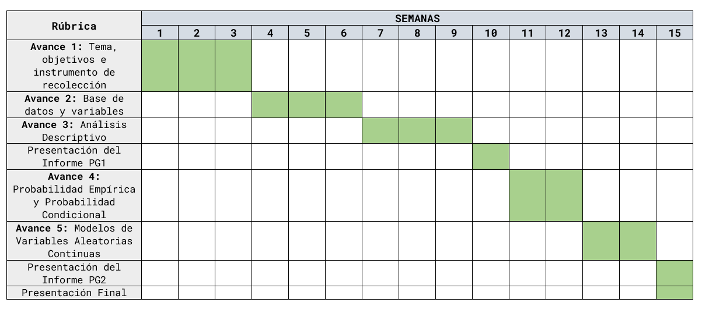
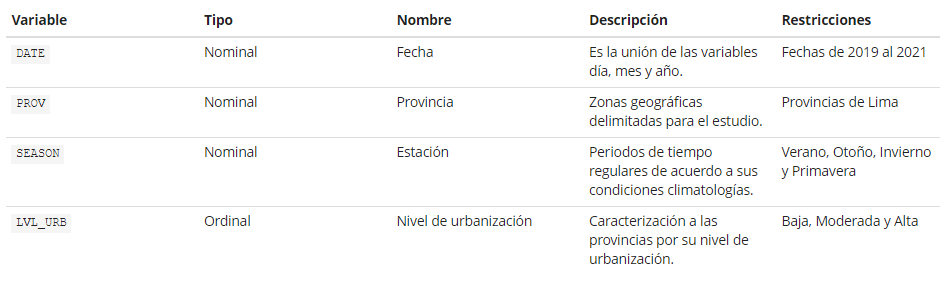
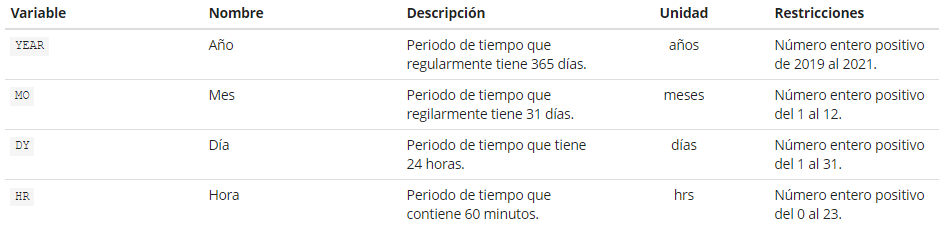
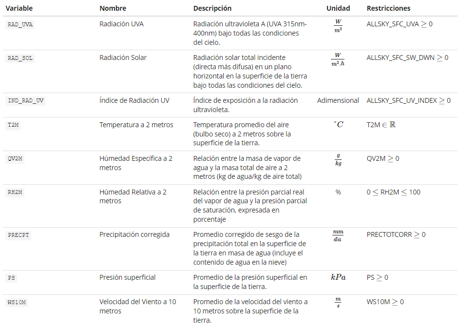
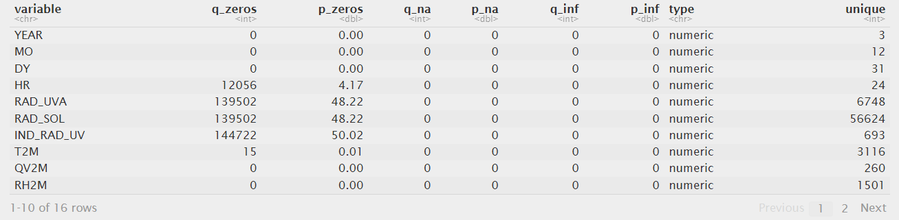
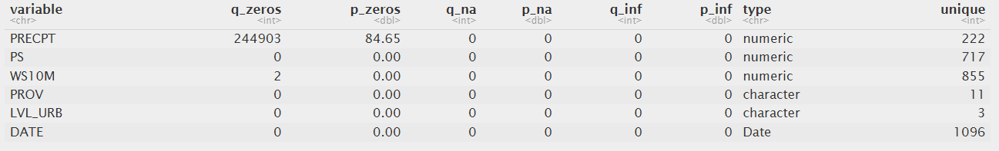
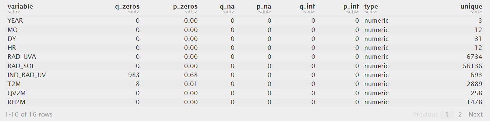
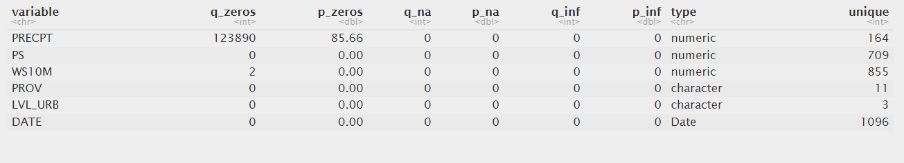
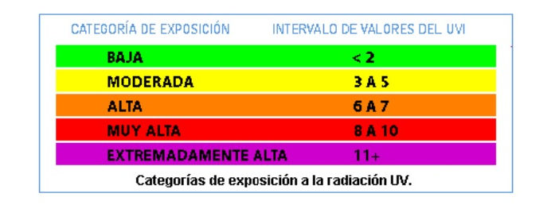

> ## Diagrama de Gantt

```{r echo = FALSE, warning=FALSE, message=FALSE}
if(!require(readr)){install.packages('readr')}
library(readr)
if(!require(dplyr)){install.packages('dplyr')}
library(dplyr)
if(!require(ggplot2)){install.packages('ggplot2')}
library(ggplot2)
if(!require(corrplot)){install.packages('corrplot')}
library(corrplot)
if(!require(fitdistrplus)){install.packages('fitdistrplus')}
library(fitdistrplus)
if(!require(car)){install.packages('car')}
library(car)
if(!require(latex2exp)){install.packages('latex2exp')}
library(latex2exp)
if(!require(ggthemes)){install.packages('ggthemes')}
library(ggthemes)
```

<center>

<div style="text-align: justify">

> # **1. Introducción**

> # 1.1. Relevancia

Nuestro proyecto se enfoca en conocer los valores de radiación solar, temperatura y de variables meteorológicas complementarias para identificar alguna relación existente. La radiación solar y el cambio de temperatura son dos variables fundamentales en el estudio del clima y el cambio climático. Comprender la relación entre estos dos factores en un área específica, como las provincias de Lima, puede proporcionar información valiosa sobre los patrones climáticos locales y el posible impacto en el medio ambiente y las actividades humanas. Otro aspecto relevante de este proyecto es el período de estudio abarcado, que comprende los años 2019 al 2021. Estudiar un período de tiempo relativamente reciente permite capturar los cambios y las tendencias más actuales en los patrones climáticos.

> # 1.2. Objetivos

+ Identificar tendencias de radiación solar y de temperatura en función del tiempo en las provincias de Lima.
+ Explicar la relación entre la radiación solar y el cambio de temperatura en las provincias de Lima de 2019 al 2021.
+ Evaluar la correlación de variables meteorológicas relevantes respecto a radiación solar y temperatura en las provincias de Lima de 2019 al 2021.

> # 1.3. Contexto

El proyecto aborda el conocimiento básico de _**variables meteorológicas**_ y estadística descriptiva básica para comprender la interpretación descriptiva y gráfica de las variables. Las variables meteorológicas relevantes para el estudio son: radiación UVA ($\frac{W}{m^2.h}$), índice de radiación UV, presión superficial (_**kPa**_), precipitación ($\frac{mm}{día}$), húmedad relativa (%), húmedad específica ($\frac{g}{kg}$) y velocidad de viento a 10 metros ($\frac{m}{s}$)

> # **2. Datos**

En esta sección se detallamos el proceso de recolección de datos; la definición y explicación la población, muestra, representatividad y el tipo de muestreo del proyecto; además de la definición de las variables de estudio; y explicar la limpieza de datos realizada.

> # 2.1. Población, muestra y muestreo

+ **Población:** Nuestra población es el Territorio del Perú.
+ **Muestra:** La muestra escogida es la ciudad de Lima. El **tamaño de muestra** es de 289 306 observaciones.
+ **Unidad de muestreo:** Provincia de Lima en una determinada hora de una cierta fecha.
+ **Muestreo:** Muestreo estratificado. Esto se debe a que el objetivo de estos estudios es recopilar datos representativos de las condiciones meteorológicas en una determinada área o región durante un período de tiempo específico.

> # 2.2. Variables

Nuestro proyecto esta conformado por una base de datos de 17 variables, donde 4 son de tipo categórica y 13 de carácter numérico.

> ## Base de datos

Del directorio de trabajo, asignamos la base de datos de nuestro proyecto a un dataframe **`DF`** mediante la función **read_csv**:

```{r}
DF <- read_csv("Dataframe_Final.csv")
```

Con la base de datos ya asignado en nuestro entorno de trabajo, mencionamos a **`DF`**:

```{r}
DF
```

Podemos observar que **`DF`** tiene 289306 observaciones de 16 variables. Cambiaremos de nombre algunas variables, por temas de estética.

```{r}
colnames(DF)[5] <- "RAD_UVA"
colnames(DF)[6] <- "RAD_SOL"
colnames(DF)[7] <- "IND_RAD_UV"
colnames(DF)[11] <- "PRECPT"
```

> ## Variables categóricas

Nuestra base de datos tiene 4 variables categóricas.

<center>

<div style="text-align: justify">

> ## Variables numéricas

Nuestra base de datos tiene 13 variables numéricas.

> ### Variable numérica discreta

<center>

<div style="text-align: justify">

> ### Variable numérica continua

<center>

<div style="text-align: justify">

Para visualizar nuestras variables, utilizaremos el comando **df_status** y así corroborar si las variables están correctamente clasificadas.

```{r}
spec(DF)
```

Observamos que RStudio identifico de manera correcta la clasificación de nuestras variables.

> # 2.3. Limpieza de Datos

Ahora procederemos a revisar si nuestro **`DF`** está completo y si no es así, realizar una cuidadosa limpieza de datos. Como se elimino la librería **funModeling** del repositorio CRAN, utilzaré capturas antiguas del resultado.

<center>

<div style="text-align: justify">

<center>

<div style="text-align: justify">

Podemos observar que existe una cantidad exorbitante de valores 0 en la variable **`RAD_UVA`**, **`RAD_SOL`**, **`IND_RAD_UV`** y **`PRECPT`**. 

```{r}
table(DF$HR[DF$RAD_UVA == 0])
table(DF$HR[DF$RAD_SOL == 0])
table(DF$HR[DF$IND_RAD_UV == 0])
table(DF$HR[DF$PRECPT == 0])
```

Podemos inferir mediante la visualización de las frecuencias obtenidas de las variables de radiación y precipitación, que el intervalo de tiempo donde se registra mayor cantidad de valores 0 son de [0 am. - 5 am.] y [6 pm. - 11 pm.]. A partir de esta deducción podemos filtrar nuestra base de datos para obtener resultados más interesantes en relación a nuestros objetivos de estudio. Según la página web [Datos Mundial](https://www.datosmundial.com/america/peru/puesta-del-sol.php), la hora de amanecer y atardecer del Perú es a las 6:19 a.m. y 5:51 p.m. Por lo tanto, procederemos a realizar lo siguiente:

```{r}
DFP <- DF %>% filter(HR >= 6 & HR < 18)
```

Filtramos **`DF`** en función al intervalo de tiempo 6 $\leq$ HR $\lt$ 18, y llamamos a nuestro nueva base de datos **`DFP`**. Ahora observaremos el estado de las variables con este nuevo filtro.

<div style="text-align: justify">

<center>

<center>

<div style="text-align: justify">

Podemos observar que la cantidad de ceros ha sido reducida en casi su totalidad en las variables afectadas anteriormente, pero **`PRECPT`** sigue sospechosamente con una cantidad de ceros exagerada, veremos luego por qué es así justificando su presencia de valores ceros en sus observaciones. 

```{r}
DFP
```
A partir de la limpieza realizada observamos en una reducción considerable de nuestras observaciones, con un **tamaño de muestra efectiva** de 144 634 observaciones.

> # **3. Análisis Descriptivo**

En este apartado presentaremos todos los descriptores utilizados para representar cada variable estudiada en nuestro proyecto. Los gráficos que se describen son apropiados e informativos para la variable que describimos.

```{r echo = FALSE}
cv <- function(x, na.rm=FALSE) {
  return (sd(x, na.rm=na.rm) / mean(x, na.rm=na.rm))
}
Moda <- function(x) {
  return (table(x)[which.max(table(x))])
}
moda <- function(x) {
  return (names(Moda(x)))
}
```

> # 3.1. Análisis Univariado

```{r echo = FALSE}
resumen_variable <- function(x){return
cat("Descriptores de posición:", "\n")
cat("Mínimo:", min(x), "\n")
cat("Máximo:", max(x), "\n")
cat("Media:", round(mean(x),2), "\n")
cat("Moda:", moda(x), "\n")
cat("Mediana:", median(x), "\n")
cat("\n")
cat("Descriptores de dispersión:", "\n")
cat("Varianza", round(var(x),2), "\n")
cat("Coeficiente de Variación:", round(cv(x),2), "\n")
cat("Desviación Estándar:", round(sd(x),2), "\n")
cat("Rango Intercuartil:", round(IQR(x),2), "\n")
}
```

> ### Análisis de **`RAD_SOL`** (Radiación Solar)

Como primer análisis, empezamos con una de nuestras variables base del estudio. A continuación, identificamos los descriptores de posición y de dispersión de la variable:

```{r}
resumen_variable(DFP$RAD_SOL)
```
+ **Análisis**

    + Se puede notar que la **radiación solar promedio** es 434.22 $\frac{W}{m^2.h}$ lo cual esta por debajo de la **mediana** con valor de 435 $\frac{W}{m^2.h}$. Además se puede identificar que la **varianza** es un valor demasiado alto, esto quiere decir, que los datos están más dispersos alrededor de la **radiación solar promedio**.

Al ser `RAD_SOL` una variable numérica podemos utilizar un histograma para representar su distribución.

```{r echo = FALSE}
par(mfrow = c(1, 2))
modaRAD_SOL <- as.numeric(names(Moda(DFP$RAD_SOL)))
hist(DFP$RAD_SOL, col="skyblue", main="Histograma de Radiación Solar", xlab="Radiación Solar (W/m^2.h)", ylab="Frecuencia")
abline(v=mean(DFP$RAD_SOL), col="red", lwd=2)
abline(v=median(DFP$RAD_SOL), col="blue", lwd=2, lty = "dashed")
abline(v=modaRAD_SOL, col="black", lwd=2, lty = "dashed")
legend("topright", legend=c("Media", "Mediana","Moda"), col=c("red", "blue","black"), lwd=2)
plot(density(DFP$RAD_SOL), main="Densidad de Radiación Solar")
par(mfrow = c(1, 1))
```

Se visualiza que el histograma no presenta uniformidad en la distribución de datos, por lo cual es una **distribución asimétrica** y se puede observar mediante el gráfico de densidad que es **multimodal**.

> ### Análisis de **`IND_RAD_UV`** (Índice de Radiación UV)

Analicemos la variable numérica continua `IND_RAD_UV`.

```{r}
resumen_variable(DFP$IND_RAD_UV)
```
+ **Análisis**

    + El índice de Radiación UV es una medida de la intensidad de la radiación ultravioleta que llega a la superficie terrestre.  Un valor **mínimo** de 0 indica que en ciertos momentos o condiciones la radiación UV puede ser muy baja o incluso nula. El **máximo** de 19.25 sugiere que en algunos momentos se pueden alcanzar niveles de radiación UV bastante altos. El **índice promedio de radiación UV** es 4.65 indica un nivel promedio de radiación UV. Los valores que se presentan en los descriptores estadísticos indican la variabilidad mediante la **varianza** que tiene un valor alto, lo cual tienen una dispersión alta en relación al valor del índice promedio de radiación UV.

Al ser `IND_RAD_UV` una variable numérica, procedemos a utilizar un histograma y ubicamos los descriptores de posición mas relevantes.

```{r echo = FALSE}
par(mfrow = c(1, 2))
modaIND_RAD_UV <- as.numeric(names(Moda(DFP$IND_RAD_UV)))
hist(DFP$IND_RAD_UV, col="orange3", main= "Histograma de Índice de\nRadiación UV", xlab="Índice de Radiación UV", ylab="Frecuencia")
abline(v=mean(DFP$IND_RAD_UV), col="red", lwd=2)
abline(v=median(DFP$IND_RAD_UV), col="blue", lwd=2, lty = "dashed")
abline(v=modaIND_RAD_UV, col="black", lwd=2, lty = "dashed")
legend("topright", legend=c("Media", "Mediana","Moda"), col=c("red", "blue","black"), lwd=2)
plot(density(DFP$IND_RAD_UV), main="Densidad de Índice de\nRadiación UV")
par(mfrow = c(1, 1))
```

Podemos visualizar la similitud de la variable `RAD_SOL` en relación a la distribución de los datos que se tienen. Por lo tanto, el índice de radiación UV tiene una **distribución asimétrica** y **multimodal**.

> ### Análisis de **`T2M`** (Temperatura a 2 metros)

Analicemos la variable numérica continua `T2M`.

```{r}
resumen_variable(DFP$T2M)
```
+ **Análisis**

    + Según los descriptores, **la temperatura promedio a 2 metros** es igual a 17.72 $°C$ lo cual esta por debajo de la **mediana** de valor 19 $°C$. Además experimentó una amplia variabilidad, con valores que oscilaron entre un mínimo de -5 $°C$ y un **máximo** de 29 $°C$. Las mediciones son muy dispersas alrededor de la temperatura promedio, debido a que varianza es un valor 27.77, lo cual se considera alto. Sin embargo, el **coeficiente de variación** relativamente bajo 0.3 sugiere cierta estabilidad en la temperatura en relación con su media.

```{r echo = FALSE}
modaT2M <- as.numeric(names(Moda(DFP$T2M)))
boxplot(DFP$T2M, col="lightblue", main= "Boxplot de Temperatura a 2 metros", xlab="T2M (°C)", horizontal = TRUE)
abline(v=mean(DFP$T2M), col="blue", lwd=2, lty = "dashed")
abline(v=modaT2M, col = "red3", lwd=2, lty = "dashed")
legend("topright", legend=c("Media","Moda"), col=c("blue","red3"), lwd=2)
```

Mediante el boxplot podemos visualizar que la **distribución es asimétrica sesgada hacia la izquierda**, dado que la `T2M` promedio esta por encima del por debajo del 50% de datos registrados de temperatura. 

> ### Análisis de **`RH2M`** (Húmedad relativa)

Analicemos la variable numérica continua `RH2M`.

```{r}
resumen_variable(DFP$RH2M)
```
+ **Análisis**

    + En relación a los descriptores presentados, podemos identificar que la **húmedad relativa promedio** es de 54.62%, este valor se aproxima al 50% de observaciones con un valor 54 de **mediana** y que el **valor de húmedad relativa más registrado** fue 54.06%. Además podemos observar que la varianza posee un valor muy alto, lo cual indica mucha variabilidad en los datos respecto a la húmedad relativa promedio.

```{r echo = FALSE}
modaRH2M <- as.numeric(names(Moda(DFP$RH2M)))
hist(DFP$RH2M, col="skyblue", main= "Histograma de Húmedad \nRelativa", xlab="Húmedad relativa (%)", ylab="Frecuencia")
abline(v=mean(DFP$RH2M), col="red", lwd=2)
abline(v=median(DFP$RH2M), col="blue", lwd=2, lty = "dashed")
abline(v=modaRH2M, col="black", lwd=2)
legend("topright", legend=c("Media", "Mediana","Moda"), col=c("red", "blue","black"), lwd=2)
```

```{r}
plot(density(DFP$RH2M), main="Densidad de Húmedad \nRelativa")
```

Mediante el histograma y la ubicación de los descriptores de posición podemos identificar que la **distribución es simétrica** dado que los valores de húmedad relativa promedio, mediana y moda se aproximan en un solo valor.

> ### Análisis de **`PRECPT`** (Precipitación)

Analicemos la variable numérica continua `PRECPT`.

```{r}
resumen_variable(DFP$PRECPT)
```

Con habíamos mencionado anteriormente en la sección 4.1. de la limpieza de datos, la variable presenta casi en todas sus observaciones el valor de cero. Procederemos a representar esta variable mediante un **diagrama de densidad**.

```{r echo = FALSE}
plot(density(DFP$PRECPT), main = "Densidad de Precipitación", xlab = "PRECPT")
```

+ **Análisis**

    + Podemos observar que claramente en el diagrama de densidad, los valores se concentran en el 0, entonces se justifica que el comportamiento de la precipitación se da por que en la ciudad de Lima no hay presencia de lluvias a comparación de las otras ciudades. Además el gráfico nos presenta una **distribución** casi simétrica pero como los valores inician en 0, es **sesgada hacia la derecha** y es unimodal, por la cantidad inmesurable de valores 0 en las observaciones de `PRECPT`.


> ### Análisis de **`PS`** (Presión)

Analicemos la variable numérica continua `PS`.

```{r}
resumen_variable(DFP$PS)
```
+ **Análisis**

    + La presión en las provincias de Lima durante el periodo de 2019 a 2021 tuvo una distribución con un **mínimo** de 61 kPa, un **máximo** de 99 kPa. Mediante las mediciones se obtuvo una **presión promedio** de 80.54 kPa, el cual es un valor por debajo de la **mediana** de 88 kPa. Además, se encontró que la varianza y la desviación estándar de 174.9 y 13.22 respectivamente, sugiere una dispersión altísima de la presión en las provincias.

```{r echo = FALSE}
modaPS <- as.numeric(names(Moda(DFP$PS)))
plot(density(DFP$PS), main="Densidad de Presión")
abline(v=mean(DFP$PS), col="red", lwd=2, lty = "dashed")
abline(v=median(DFP$PS), col="green3", lwd=2, lty = "dashed")
abline(v=modaPS, col = "blue3", lwd=2, lty = "dashed")
legend("topright", legend=c("Media", "Mediana", "Moda"), col=c("red", "green3","blue3"), lwd=2)
```

Mediante el gráfico podemos observar que existen rangos donde no se ha obtenido alguna medición

> ### Análisis de **`SEASON`** (Estación del año)

Para la creación de la variable `SEASON`, generamos límites para cada estación teniendo como referencia las fechas de inicio y fin de cada estación de la página web [Gobierno del Perú](www.gob.pe.com).

```{r}
fechas_limite <- c(as.Date(c("2022-03-20", "2022-06-20", "2022-09-22", "2022-12-21")),
                   as.Date(c("2021-03-20", "2021-06-20", "2021-09-22", "2021-12-21")),
                   as.Date(c("2020-03-19", "2020-06-20", "2020-09-22", "2020-12-21")),
                   as.Date(c("2019-03-20", "2019-06-21", "2019-09-23", "2019-12-21")),
                   as.Date(c("2018-03-20", "2018-06-21", "2018-09-22", "2018-12-21")))

estaciones <- c("Verano", "Otoño", "Invierno", "Primavera")

DFP$SEASON <- estaciones[cut(DFP$DATE, breaks = fechas_limite, labels = FALSE) %% 4 + 1]
```

Para la representación de la variable `SEASON` se puede utilizar un **gráfico de barras**, como se muestra a continuación:

```{r echo = FALSE}
barplot(table(DFP$SEASON), main = "Estaciones del año", xlab = "Estación", ylab = "Frecuencia", col=c("lightblue3","orange3","green3","yellow3"))
```

Ahora, identifiquemos un descriptor de posición relevante:

```{r}
Moda(DFP$SEASON)
```

Se puede notar que la moda es la estación "Invierno", con un total de 37210 observaciones en nuestra base de datos. Esto se debe a que en los años 2019, 2020 y 2021 se están registrando todas las observaciones en el periodo de tiempo de Invierno, caso contrario que en la estación "Verano" se está omitiendo valores registrados a periodos anteriores y posteriores a los años 2018 y 2022 respectivamente.

> # 3.2. Análisis Bivariado

Para realizar nuestro análisis bivariado correctamente, debemos abordar los objetivos propuestos para el proyecto, por lo cual, relacionaremos las variables necesarias para realizar las conclusiones en base a los objetivos.

> ## **Identificar tendencias de radiación solar y de temperatura en función del tiempo en las provincias de Lima.**

> ### Análisis de la relación entre `RAD_SOL` y `YEAR`

Para identificar las tendencias de radiación solar en función al tiempo, decidimos utilizar un gráfico de líneas donde agrupamos los **valores promedio de radiación solar** por mes en cada año. Para ello, necesitamos crear un dataframe que contenga solo los valores promedio de radiación solar por mes y año.

```{r echo = FALSE}
RAD_MEAN_MO_YEAR <- aggregate(DFP$RAD_SOL, by=list(DFP$YEAR, DFP$MO), FUN=mean)
colnames(RAD_MEAN_MO_YEAR)[1] <- "YEAR"
colnames(RAD_MEAN_MO_YEAR)[2] <- "MO"
colnames(RAD_MEAN_MO_YEAR)[3] <- "RAD_SOL_MEAN"
RAD_MEAN_MO_YEAR
ggplot(RAD_MEAN_MO_YEAR, aes(x = MO, y = RAD_SOL_MEAN, color = factor(YEAR))) + 
  geom_line() +
  labs(x = "Mes", y = "Radiación Solar Promedio", title = "Radiación solar promedio por mes y año") + 
  scale_x_continuous(breaks = 1:12) + 
  scale_color_discrete(name = "Año")
```

Visualizando el gráfico podemos identificar que en el año 2020 se identifico el mayor valor promedio de radiación solar  que se registro el mes 11 **(Noviembre)** de 2020 con un valor numérico de 531.9746 $\frac{W}{m^2.h}$. Además se puede identificar que en el mes 6 **(Junio)** se registra el menor valor de radiación solar en cada año, esto se puede interpretar por la llegada del invierno en Lima.

> ### Relación entre `T2M` y `SEASON`

De manera análoga, utilizaremos los valores de radiación promedio por estación y año en un gráfico de puntos.

```{r echo = FALSE}
T2M_MEAN_SEASON_YEAR <- aggregate(DFP$T2M, by=list(DFP$YEAR, DFP$SEASON), FUN=mean)
colnames(T2M_MEAN_SEASON_YEAR)[1] <- "YEAR"
colnames(T2M_MEAN_SEASON_YEAR)[2] <- "SEASON"
colnames(T2M_MEAN_SEASON_YEAR)[3] <- "T2M_MEAN"
T2M_MEAN_SEASON_YEAR
ggplot(T2M_MEAN_SEASON_YEAR, aes(x = SEASON, y = T2M_MEAN, color = factor(YEAR))) + 
  geom_point() +
  labs(x = "Estación", y = "Temperatura Promedio", title = "Temperatura promedio por estación y año") + 
  scale_color_discrete(name = "Año")
```

En el 2019 se registro el mayor valor de temperatura promedio en invierno y verano. Se observa que en el 2021 en todas las estaciones se registran menores temperaturas promedio en relación a los años anteriores.

> ## **Explicar la relación entre la radiación solar y el cambio de temperatura en las provincias de Lima de 2019 al 2021.**

> ### Relación entre `RAD_SOL` y `T2M`

Para finalizar nuestro análisis descriptivo y en relación al tercer objetivo propuesto para nuestro proyecto, identificaremos y explicaremos la relación entre la radiación solar y la temperatura en las provincias de Lima.

A continuación, analizaremos el valor de la covarianza.
    
```{r}
cov(DFP$T2M, DFP$RAD_SOL)
```
    
Notamos que la covarianza es positiva, por lo cual existe un relación positiva donde `RAD_SOL` y `T2M` pueden disminuir y aumentar de manera conjunta.

**`RAD_SOL`** y **`T2M`** son variables numéricas, por lo tanto, podríamos utilizar un diagrama de dispersión. En este caso utilizaremos un gráfico de (**`smoothScatter`**) para analizar la relación de estas variables y ademas con ayuda de la función (**`lm`**)obtener un expresión de regresión y luego calcular la correlación.

```{r echo = FALSE}
smoothScatter(DFP$RAD_SOL, DFP$T2M, 
     main = "Relación entre Radiación Solar y Temperatura", 
     xlab = "Radiación Solar (W/m^2.h)", ylab = "Temperatura (°C)")

# Ajustar línea de tendencia
fit <- lm(DFP$T2M ~ DFP$RAD_SOL)
abline(fit, col = "red")

# Calcular el coeficiente de correlación
cor <- round(cor(DFP$RAD_SOL, DFP$T2M, method="pearson"),2)

# Agregar la leyenda
legend("topleft", 
       legend = c(paste("Línea de tendencia: y = ", round(fit$coefficients[2],2), "*x + ", 
                        round(fit$coefficients[1],2), sep=""),
                  paste("Coeficiente de correlación: ", cor)),
       col=c("red","black"), lty=1, lwd=2, cex=0.8, bty="n")
```

+ **Análisis**

    + Identificando las tonalidades, se observa que los datos se concentran por encima de 15 °C. Asimismo, al proponer la regresión, notamos una recta con pendiente positiva de coeficiente de variable dependiente T2M de valor 0.01 e intercepto de valor 14.04. Además, calculando el coeficiente de correlación obtenemos el valor de 0.44, por teoría este valor determina que las variables tienden a relacionarse de manera positiva. Lo cual confirmamos que existe una relación positiva moderada para estas variables. En conclusión, la radiación solar influye en el cambio de temperatura a 2 metros.

> ## **Evaluar la correlación de variables meteorológicas relevantes respecto a radiación solar y temperatura en las provincias de Lima de 2019 al 2021.**

Para analizar la correlación de variables meteorológicas relevantes en la radiación solar y temperatura, utilizaremos un diagrama de correlación (**`corrplot`**). Esta gráfico nos indicará el valor de correlación de cada relación de variables en una matriz y así representar mediante un indicador de color la intensidad de correlación de cada variable con la otra.

```{r echo = FALSE}
DFP_CORR <- DFP[, c("RAD_SOL", "RAD_UVA", "IND_RAD_UV", "T2M", "RH2M", "QV2M", "PRECPT", "PS", "WS10M")]
corrplot(cor(DFP_CORR), method = "square", tl.cex = 0.7, tl.srt = 90, tl.col = "black", addCoef.col = 1, addgrid.col = 1)
```

A partir del gráfico podemos interpretar lo siguiente:

+ En relación a **`RAD_SOL`**
    
    +  Las variables **`RAD_UVA`** y **`IND_RAD_UV`** poseen una correlación casi perfecta (cor $\approx$ 1). Esto se puede deducir a que las variables que miden la radiación de distinto enfoque, mantienen una relación positiva donde ambas aumentan o disminuyen en la misma proporción.
    + Posee una correlación negativa con **`RH2M`**, es decir que mientras mayor radiación solar entra a la superficie, la húmedad relativa tiende a dismunir.
    + **`PS`** no existe correlación alguna por lo tanto, el comportamiento de la radiación solar en la superficie no varía la presión.
    
+ En relación a **`T2M`**
    
    + Las variables **`RAD_UVA`** y **`IND_RAD_UV`** presentan una correlación similar por lo explicado en el objetivo 2, estas variables tienen una relación positiva donde si una aumenta la otra variable también.
    + A comparación de la radiación solar, **`PS`** con la temperatura si posee un grado de correlación alto, esto significa que la temperatura tiene influencia en el comportamiento de la presión superficial de las provincias de Lima.

> # **4. Análisis Probabilístico**

> # 4.1. Probabilidad Empírica

> ## Índice de Radiación UV en el Perú

Según **SENAMHI**, la variable **`IND_RAD_UV`** se categoriza por rangos así como se muestra en la siguiente imagen:

<div style="text-align: justify">

<center>

<div style="text-align: justify">

De acuerdo a estas etiquetas, deberíamos categorizar nuestra variable numérica según los intervalos establecidos.

```{r echo = FALSE}
Categoria_IND_RAD_UV <-cut(DFP$IND_RAD_UV, breaks = c(0,3,6,8,11,20), labels = c("Baja","Moderada","Alta","Muy Alta","Extrema Alta"),include.lowest = TRUE)
EspacioM <- data.frame(DFP, Categoria_IND_RAD_UV)
```

Definimos el **experimento aleatorio:**

Se registra el índice de radiación UV en las provincia de Lima de 6 am a 6pm y se observa el resultado.

$$\Omega_1 = \text{{Baja, Moderada, Alta, Muy Alta, Extrema Alta}}$$
Definimos los eventos atómicos del espacio muestral $\Omega_1$.

+ B: El registro de índice de radiación UV es baja.

+ M: El registro de índice de radiación UV es moderada.

+ A: El registro de índice de radiación UV es alta.

+ MA: El registro de índice de radiación UV es muy alta.

+ EA: El registro de índice de radiación UV es extremadamente alta.

$$P(A_i) = \frac{\text {Casos de observaciones que cumple}}{\text {Casos total de observaciones}}$$
donde $A_i$ es el evento atómico.

```{r echo = FALSE}
# Variable IND_RAD_SOL

tabla_ind <- table(EspacioM$Categoria_IND_RAD_UV)
indice_rad_uv_baja <- as.numeric(tabla_ind["Baja"])
indice_rad_uv_moderada <- as.numeric(tabla_ind["Moderada"])
indice_rad_uv_alta <- as.numeric(tabla_ind["Alta"])
indice_rad_uv_malta <- as.numeric(tabla_ind["Muy Alta"])
indice_rad_uv_ealta <- as.numeric(tabla_ind["Extrema Alta"])

# Probabilidades de Indice Radiación UV

casos_totales <- length(EspacioM$Categoria_IND_RAD_UV)
prob_indice_rad_uv_baja <- round(indice_rad_uv_baja/casos_totales,2)
prob_indice_rad_uv_moderada <- round(indice_rad_uv_moderada/casos_totales,2)
prob_indice_rad_uv_alta <- round(indice_rad_uv_alta/casos_totales,2)
prob_indice_rad_uv_malta  <- round(indice_rad_uv_malta/casos_totales,2)
prob_indice_rad_uv_ealta <- round(indice_rad_uv_ealta/casos_totales,2)
tabla_ind
```

$$P(B) = \frac{\text {64301}}{\text {144634}} = 0.44$$

$$P(M) = \frac{\text {26101}}{\text {144634}} = 0.18$$

$$P(A) = \frac{\text {19380}}{\text {144634}} = 0.13$$

$$P(MA) = \frac{\text {24043}}{\text {144634}} = 0.17$$

$$P(EA) = \frac{\text {10809}}{\text {144634}} = 0.07$$
```{r}
cat("Probabilidad B:", round(prob_indice_rad_uv_baja,2), "\n")
cat("Probabilidad M:", round(prob_indice_rad_uv_moderada,2), "\n")
cat("Probabilidad A:", round(prob_indice_rad_uv_alta,2), "\n")
cat("Probabilidad MA:", round(prob_indice_rad_uv_malta,2), "\n")
cat("Probabilidad EA:", round(prob_indice_rad_uv_ealta,2), "\n")
```

> ## Temperaturas en Perú

Según **Weather Spark**, la variable **`T2M`** categoriza las temperaturas promedio por hora, por rangos como se muestra en la siguiente imagen:

<div style="text-align: justify">

<center>

<div style="text-align: justify">

```{r}
summary(DFP$T2M)
```

De acuerdo a estas etiquetas, deberíamos categorizar nuestra variable numérica según los intervalos establecidos establecidos.

```{r echo = FALSE}
Categoria_T2M <-cut(DFP$T2M, breaks = c(-9,0,7,13,18,24,29), labels = c("Helada","Muy fría","Fría","Fresca","Cómoda", "Caliente"),include.lowest = TRUE)
EspacioM2 <- data.frame(DFP$T2M, Categoria_T2M)
Categoria_RAD_SOL <-cut(DFP$RAD_SOL, breaks = c(0,200,430,Inf), labels = c("Bajo","Medio","Alto"),include.lowest = TRUE)
EspacioM <- data.frame(DFP, Categoria_IND_RAD_UV, Categoria_T2M, Categoria_RAD_SOL)
```

Definimos el **experimento aleatorio:**

Se registra T2M en las provincia de Lima de 6 am a 6pm y se observa el resultado.

$$\Omega_2 = \text{{Helada, Muy fría, Fría, Muy Fresca, Cómoda,  Caliente}}$$

Definimos los eventos atómicos del espacio muestral $\Omega_2$.

+ HE: El registro de temperatura es helada.

+ VC: El registro de temperatura es muy fría

+ F: El registro de temperatura es fría.

+ FE: El registro de temperatura es fresca.

+ C: El registro de temperatura es cómoda.

+ HT: El registro de temperatura es caliente.

$$P(A_i) = \frac{\text {Casos de observaciones que cumple}}{\text {Casos total de observaciones}}$$

donde $A_i$ es un evento atómico.

```{r echo = FALSE}
# Variable T2M
# EspacioM2
tabla_t2m <- table(EspacioM2$Categoria_T2M)
t2m_helada <- as.numeric(tabla_t2m["Helada"])
t2m_mfria <- as.numeric(tabla_t2m["Muy fría"])
t2m_fria <- as.numeric(tabla_t2m["Fría"])
t2m_fresca <- as.numeric(tabla_t2m["Fresca"])
t2m_comoda <- as.numeric(tabla_t2m["Cómoda"])
t2m_caliente <- as.numeric(tabla_t2m["Caliente"])

# Probabilidades de Indice Radiación UV

casos_totales <- length(EspacioM2$Categoria_T2M)
prob_t2m_helada <- t2m_helada/casos_totales
prob_t2m_mfria <- round(t2m_mfria/casos_totales,2)
prob_t2m_fria <- round(t2m_fria/casos_totales,2)
prob_t2m_fresca  <- round(t2m_fresca/casos_totales,2)
prob_t2m_comoda <- round(t2m_comoda/casos_totales,2)
prob_t2m_caliente <- round(t2m_caliente/casos_totales,2)
tabla_t2m
```

Hallando las probabilidades para cada evento atómico:

$$P(HE) = \frac{\text {312}}{\text {144634}} = 0.00215$$
$$P(VC) = \frac{\text {6568}}{\text {144634}} = 0.00215$$

$$P(F) = \frac{\text {19919}}{\text {144634}} = 0.05$$

$$P(FE) = \frac{\text {35599}}{\text {144634}} = 0.14$$

$$P(C) = \frac{\text {73526}}{\text {144634}} = 0.51$$

$$P(HT) = \frac{\text {8710}}{\text {144634}} = 0.06$$
```{r}
cat("Probabilidad HE:", prob_t2m_helada, "\n")
cat("Probabilidad VC:", round(prob_t2m_mfria,2), "\n")
cat("Probabilidad F:", round(prob_t2m_fria,2), "\n")
cat("Probabilidad FE:", round(prob_t2m_fresca,2), "\n")
cat("Probabilidad C:", round(prob_t2m_comoda,2), "\n")
cat("Probabilidad HT:", round(prob_t2m_caliente,2), "\n")
```

Como algo adicional, como se categorizaron estas variables **`T2M`** y **`IND_RAD_UV`**, veremos una gráfica de mosaico, para observar el comportamiento de estas variables.

```{r}
data <- data.frame(
  CategoriaA = EspacioM$Categoria_T2M,
  CategoriaB = EspacioM$Categoria_IND_RAD_UV)

# Crear el gráfico de mosaico con ggplot2
ggplot(data, aes(x = CategoriaA, fill = CategoriaB)) +
  geom_bar(position = "fill") + labs(x = "Categoría T2M", y = TeX("$h_i$"), title = "Gráfico de Mosaico", fill = "Categoría Indice de Radiación UV")
```

> # 4.2. Probabilidad Condicional

La expresión de la probabilidad condicional de dos eventos.

$$P(A / B) = \frac{P(A \cap B)}{P(B)}$$

Además:Recordar que para que dos eventos sean independientes:

$$P(A/B) = P(A)$$

$$P(B/A) = P(B)$$

**Experimento 3 ($E_3$):** Se realiza un estudio meteorológico en las provincias de Lima de 6am a 6pm y se registra valores de radiación solar y temperatura.

Definimos los eventos A y B:

+ A: se registra radiación baja.

+ B: se registra temperatura mayor a $\text{T}_{prom}$.

**¿Serán A y B eventos independientes?**

Mostramos la tabla de contigencia de los valores.

```{r}
Condicional1 <- data.frame(Var1 = EspacioM$Categoria_RAD_SOL, Var2 = EspacioM$T2M)
Temp_prom <- mean(Condicional1$Var2)
Condicional1 <- Condicional1 %>%
  mutate(Cumple_Condicion = ifelse(Var2 <= Temp_prom, "T <= T_prom", "T > T_prom"))
tabla_cruzada <- table(Condicional1$Cumple_Condicion, EspacioM$Categoria_RAD_SOL)
tabla_cruzada
```

$$P(A) = \frac {23743 + 13991}{144634} = 0.26 $$
$$P(B) = \frac {13991 + 19817 + 51137}{144634} = 0.587 $$
$$P(A \cap B) = \frac {13991}{144634} = 0.097$$
Veremos si cumple la condición de $P(A / B) = P(A)$.

$$P(A / B) = \frac{P(A \cap B)}{P(B)} = \frac {0.097}{0.587} = 0.17 \neq P(A) $$

```{r}
prob_A <- round((sum(Condicional1$Var1 == "Bajo")/casos_totales),2)
prob_B <- round((sum(Condicional1$Cumple_Condicion == "T > T_prom")/casos_totales),3)
prob_AcapB <- round((sum(Condicional1$Cumple_Condicion[Condicional1$Var1 == "Bajo"] == "T > T_prom"))/casos_totales,3)
prob_AconB <- round(prob_AcapB/prob_B,2)
cat('P(A):', prob_A, "\n")
cat('P(B):', prob_B, "\n")
cat('P(A ∩ B):', prob_AcapB, "\n")
cat('P(A/B):', prob_AconB, "\n")
```

Por lo tanto los eventos A y B:

```{r}
if(prob_AconB == prob_A)
  {
  print('Son eventos independientes')
} else {
  print('Son eventos dependientes')
  }
```

**Experimento 4 ($E_4$):** Se realiza un estudio meteorológico en las provincias de Lima de 6am a 6pm y se registra valores de radiación solar y presión superficial.

Definimos los eventos C y D:

+ C: se registra radiación media.

+ D: se registra presión superficial $\leq$ a la $\text{P}_{prom}$.

**¿Serán C y D eventos independientes?**

Mostramos la tabla de contigencia de los valores.

```{r}
Condicional2 <- data.frame(Var1 = EspacioM$Categoria_RAD_SOL, Var2 = EspacioM$PS)
PS_mean <- mean(Condicional2$Var2)
Condicional2 <- Condicional2 %>%
  mutate(Cumple_Condicion = ifelse(Var2 <= PS_mean, "P <= P_prom", "P > P_prom"))
tabla_cruzada2 <- table(Condicional2$Cumple_Condicion, EspacioM$Categoria_RAD_SOL)
tabla_cruzada2
```

$$P(C) = \frac {15239 + 18537}{144634} = 0.23 $$
$$P(D) = \frac {16579 + 15239 + 33938}{144634} = 0.455 $$
$$P(C \cap D) = \frac {15239}{144634} = 0.105$$
Veremos si cumple la condición de $P(C / D) = P(C)$.

$$P(C / B) = \frac{P(C \cap D)}{P(D)} = \frac {0.105}{0.455} = 0.23 = P(C) $$

```{r}
prob_C <- round((sum(Condicional2$Var1 == "Medio"))/casos_totales,2)
prob_D <- round((sum(Condicional2$Cumple_Condicion == "P <= P_prom"))/casos_totales,3)
prob_CcapD <- round((sum(Condicional2$Cumple_Condicion[Condicional2$Var1 == "Medio"] == "P <= P_prom"))/casos_totales,3)
prob_CconD <- round(prob_CcapD/prob_D,2)
cat('P(C):', prob_C, "\n")
cat('P(D):', prob_D, "\n")
cat('P(C ∩ D):', prob_CcapD, "\n")
cat('P(C/D):', prob_CconD, "\n")
```

Por lo tanto los eventos C y D:

```{r}
if(prob_CconD == prob_C)
  {
  print('Son eventos independientes')
} else {
  print('Son eventos dependientes')
  }
```

> # 4.3. Modelos con Variables Aleatorias Discretas

> ## Modelo de distribución Binomial

```{r echo = FALSE}
binom_sum <- function(size, prob, lb, ub, col = 4, lwd = 1, ...) {
    x <- 0:size
    
    if (missing(lb)) {
       lb <- min(x)
    }
    if (missing(ub)) {
        ub <- max(x)
    }
      
    plot(dbinom(x, size = size, prob = prob), type = "h", lwd = lwd, ...)
  
    if(lb == min(x) & ub == max(x)) {
        color <- col
    } else {
        color <- rep(1, length(x))
        color[(lb + 1):ub ] <- col
    }
    
    lines(dbinom(x, size = size, prob = prob), type = "h",
          col =  color, lwd = lwd, ...)
}
```


La distribución binomial es un modelo de probabilidad discreto que se utiliza para calcular la probabilidad de obtener un número específico de éxitos en un número fijo de ensayos independientes, donde cada ensayo tiene dos posibles resultados: éxito o fracaso. 

\[P(\mathbb{X} = k) = \binom{n}{x} \cdot p^x \cdot (1-p)^{n-x}\]

Donde:

+ \(P(\mathbb{X} = k)\) es la probabilidad de obtener exactamente k éxitos.

+ \(\binom{n}{x}\) es el coeficiente binomial, que se calcula como \(\binom{n}{k} = \frac{n!}{k!(n-k)!}\), donde \(n!\) es el factorial de n.

+ \(p^x\) es la probabilidad de tener k éxitos.

+ \((1-p)^{n-x}\) es la probabilidad de tener n-k fracasos.

> ### **Situación**

En esta ocasión trabajaremos con la variable **`PRECPT`**. Para este caso de modelo de distribución binomial, consideraremos un éxito cuando se registra precipitación ($PRECPT \geq 0$) y fracaso cuando no se registra precipitación ($PRECPT = 0$). Si nuestro equipo de trabajo registra 1000 observaciones. **¿Cuál es la probabilidad de que 150 o menos observaciones  registren precipitación?**

```{r echo = FALSE}
DFP_PRECPT <- subset(DFP, select=PRECPT)
DFP_PRECPT$PRECPT <- apply(DFP["PRECPT"], 1, function(x) ifelse(x==0, 0, 1))
```

```{r echo = FALSE}
cantidad_exito <- sum(DFP_PRECPT$PRECPT)
cantidad_fracaso <- length(DFP_PRECPT$PRECPT) - cantidad_exito
prob_exito <- cantidad_exito / length(DFP_PRECPT$PRECPT)
prob_fracaso <- cantidad_fracaso / length(DFP_PRECPT$PRECPT)
cat('Probabilidad de éxito:', prob_exito, "\n")
cat('Probabilidad de fracaso:', prob_fracaso)
```

$\mathbb{X}$: número de registros de precipitación en 1000 observaciones de 6am a 6pm en las provincias de Lima.

$$\mathbb{X} \sim \text {Bin(n, r)}$$

$$\mathbb{X} \sim \text {Bin(1000, 0.143)}$$
Observando la función de probabilidad binomial.

```{r echo = FALSE}
x <- 0:1000
plot(dbinom(x, size = 1000, prob = prob_exito), type = "h", lwd = 2,
     main = "Función de Probabilidad Binomial de X",
     ylab = "P(X = x)", xlab = "X")
```

Nos piden: 

$$
P(\mathbb{X} \leq 150)
$$

```{r echo = FALSE}
binom_sum(size = 1000, prob = prob_exito, ub = 150, lwd = 2,
          ylab = "P(X = x)", xlab = "X", main = "Función de Probabilidad Binomial de X")
```

```{r}
pPrep <- round(sum(dbinom(0:150, size = 1000, prob = prob_exito)),4)
cat('La probabilidad de que 150 o menos observaciones registren precipitación:', pPrep)
```

Según nuestros parámetros podemos hallar la esperanza, la varianza y la desviación estándar:

$$E(\mathbb{X}) = \mu = n*p = 143$$
$$Var(\mathbb{X}) = \sigma^2 = n*p*(1-p) = 122.551$$

$$sd(\mathbb{X}) = \sigma = 11.0702$$

> ## Modelo de Distribución Geométrica

```{r echo = FALSE}
geo_sum <- function(size, prob, lb, ub, col = 4, lwd = 1, ...) {
    x <- 0:size
    
    if (missing(lb)) {
       lb <- min(x)
    }
    if (missing(ub)) {
        ub <- max(x)
    }
      
    plot(dgeom(x, prob = prob), type = "h", lwd = lwd, ...)
  
    if(lb == min(x) & ub == max(x)) {
        color <- col
    } else {
        color <- rep(1, length(x))
        color[(lb + 1):ub ] <- col
    }
    
    lines(dgeom(x, prob = prob), type = "h",
          col =  color, lwd = lwd, ...)
}
```

La distribución geométrica es un modelo de probabilidad discreto que se utiliza para calcular la probabilidad de obtener un número de pruebas necesarias para obtener por primera vez un éxito. Consiste en "N" experimentos independientes. El proceso concluye con el primer éxito.

\[P(\mathbb{X} = x) = (1-p)^{x-1} \cdot p\]

Donde:

+ \(P(\mathbb{X} = x)\) es la probabilidad de obtener exactamente x pruebas necesarias.

+ \(p\) es la probabilidad de tener por primera vez un éxito.

+ \((1-p)^{n-1}\) es la probabilidad de tener n-1 fracasos.

> ## **Situación**

En este modelo utilizaremos nuestra variable **`T2M`**. Para este caso de modelo de distribución geométrica, consideraremos un éxito cuando se registra temperatura caliente y un fracaso cuando se registra otro tipo de temperatura en las provincias de Lima. Si nuestro equipo de trabajo registra 200 observaciones hasta obtener el primer registro de temperatura caliente. **¿Cuál es la probabilidad de que sea necesario registrar 60 o menos observaciones para obtener por primera vez temperatura caliente?**

Definimos nuestra la variable aleatoria discreta:

$\mathbb{X}$: número de observaciones necesarias para conseguir el primer registro temperatura caliente de 6am a 6pm en las provincias de Lima.

Conociendo la probabilidad de éxito:

```{r}
cat('Probabilidad de éxito:', prob_t2m_caliente, "\n")
```

$$\mathbb{X} \sim \text {Geom(p)}$$

$$\mathbb{X} \sim \text {Geom(0.06)}$$
Representando gráficamente la función de probabilidad geométrica de la variable aleatoria discreta $\mathbb{X}$.

```{r echo = FALSE}
x <- c(0:200)
plot(dgeom(x, prob = prob_t2m_caliente), type = "h", lwd = 2,
     main = "Función de Probabilidad Geométrica de X",
     ylab = "P(X = x)", xlab = "X")
```

La situación nos pide calcular la probabilidad de registrar 60 o menos observaciones de temperatura hasta obtener por primera vez temperatura caliente:

$$
P(\mathbb{X} \leq 60) = 1 - P(\mathbb{X} > 60)
$$

```{r echo = FALSE}
geo_sum(200, prob = prob_t2m_caliente, ub = 60, lwd = 2,
          ylab = "P(X = x)", xlab = "X",main = "Función de Probabilidad Geométrica de X")
```

```{r}
pT2m <- round(sum(pgeom(60, prob = prob_t2m_caliente)),4)
cat('La probabilidad de que sea necesario registrar 60 o menos observaciones para obtener por primera vez temperatura caliente es:', pT2m)
```

Según nuestros parámetros podemos hallar la esperanza, la varianza y la desviación estándar:

$$E(\mathbb{X}) = \frac{1-p}{p} = \frac{1-0.06}{0.06} = 15.67$$

$$Var(\mathbb{X}) = \sigma^2 = \frac{1}{p}*(\frac{1}{p}-1) = \frac{1}{0.06}*(\frac{1}{0.06}-1) = 261.11$$

$$sd(\mathbb{X}) = \sigma = 16.158$$

> # 4.4. Modelos con Variables Aleatorias Continuas

Observaremos la distribución de las variables de nuestro proyecto.

```{r echo = FALSE}
par(mfrow=c(3,3))
hist(DFP$RAD_UVA)
hist(DFP$RAD_SOL)
hist(DFP$IND_RAD_UV)
hist(DFP$T2M)
hist(DFP$QV2M)
hist(DFP$RH2M)
hist(DFP$PRECPT)
hist(DFP$PS)
hist(DFP$WS10M)
```

> ## Modelo de Distribución Normal

```{r echo = FALSE}
normal_area <- function(mean = 0, sd = 1, lb, ub, acolor = "lightgray", nameX ="X", nameY="Y", nameH="H", ...) {
    x <- seq(mean - 3 * sd, mean + 3 * sd, length = 100) 
    
    if (missing(lb)) {
       lb <- min(x)
    }
    if (missing(ub)) {
        ub <- max(x)
    }

    x2 <- seq(lb, ub, length = 100)    
    plot(x, dnorm(x, mean, sd), type = "n", xlab = nameX, ylab = nameY, main = nameH)
   
    y <- dnorm(x2, mean, sd)
    polygon(c(lb, x2, ub), c(0, y, 0), col = acolor)
    lines(x, dnorm(x, mean, sd), type = "l", ...)
}
```

Observando las distribuciones de las variables del proyecto, **`RH2M`** es la variable que más se acomoda al modelo normal.

```{r echo = FALSE}
hist(DFP$RH2M,breaks=20, freq=FALSE, main="Distribución de Humedad Relativa", xlab="Humedad Relativa (%)", col="lightblue")
lines(density(DFP$RH2M, na.rm=TRUE),col="red",lwd=3)

curve(dnorm(x, mean(DFP$RH2M,na.rm=TRUE), sd(DFP$RH2M,na.rm=TRUE)), lwd = 2, col = "blue", add = T)

legend("topleft", c("curva observada", "curva (normal) teórca"),
       lty = 1, lwd = 2, col = c("red", "blue"), bty = "n",
       cex = 0.8)
```

Estimamos los parámetros de media y desviación estándar con la función `fitdist`.

```{r message = FALSE}
parametros_normal <- fitdist(DFP$RH2M,"norm")
```

```{r}
parametros_normal$estimate
```
A partir de la estimación de los parámetros, considerando que nuestra variable **`RH2M`** se comporta como una distribución normal. Se obtienen los siguientes parámetros:

$\mu = 54.618$ 

$\sigma = 17.272$

```{r echo = FALSE}
mu <- 54.618
sigma <- 17.272
```

Definimos nuestra variable aleatoria:

$\mathbb{X}$: define el registro de la húmedad relativa por hora en los intervalos de 6am a 6pm en las provincias de Lima.

$$\mathbb{X} \sim \text{Normal}(\mu,\sigma)$$

$$\mathbb{X} \sim \text{Normal}(54.618,17.272)$$

Según nuestros parámetros podemos hallar la esperanza, la desviación estándar y la varianza:

$$E(\mathbb{X}) = \mu = 54.618$$

$$sd(\mathbb{X}) = \sigma = 17.272$$

$$Var(\mathbb{X}) = \sigma^2 = 298.321$$
Representando graficamente la variable aleatoria continua $\mathbb{X}$ de distribución normal.

```{r echo = FALSE}
x <- seq(-3, 3, length = 100) * sigma + mu
f <- dnorm(x, mu, sigma)
plot(x, f, type = "l", lwd = 2, col = "blue", xlab = "X" , ylab = "P(X=x)", main = "Distribución Normal de X")
abline(v = mu) # Línea vertical en la media
```


> ### **Situación**

La página web **Fisioterapia Respiratoria** (2019), menciona que mantener un nivel adecuado de humedad relativa permite mantener el confort térmico y reducir el riesgo de aparición de infecciones respiratorias y de alergias. Según diversos estudios, como el publicado en el **Environmental Health Perspectives**, los valores de humedad recomendables para interiores deben estar entre el 40% y 60% de humedad relativa. **¿Cuál es la probabilidad de que un hogar en las provincias de Lima mantenga una humedad relativa adecuada?**

$$
P(40 \leq \mathbb{X} \leq 60) = P(40 < \mathbb{X} < 60) = P(\mathbb{X} \leq 60) - P(\mathbb{X} \leq 40)
$$

Observemos el intervalo de la distribución normal.

```{r echo = FALSE}
mu <- 54.618
sigma <- 17.272
normal_area(mean = mu, sd = sigma, lb = 40, ub = 60, lwd = 2, acolor = "lightblue", nameX = "X",nameY = "P(X=x)",nameH = "Función de Distribución Normal de X")
text(50, 0.01, "42.36%", srt = 90)
```

```{r}
pH2M <- round(pnorm(60, mu, sigma) - pnorm(40, mu, sigma),4)
cat('La probabilidad de que probabilidad de que un hogar en las provincias de Lima mantenga una humedad relativa adecuada es:', pH2M)
```

> ## Modelo de distribución exponencial

```{r, echo=FALSE, warning=FALSE, include=FALSE}
exp_area <- function(rate = 1, lb, ub, nameX ="X", nameY="Y", nameH="H", acolor = "lightgray", ...) {
    x <- seq(0, 12/rate, 0.01) 
    
    if (missing(lb)) {
       lb <- min(x)
    }
    if (missing(ub)) {
        ub <- max(x)
    }

    x2 <- seq(lb, ub, length = 20)    
    plot(x, dexp(x, rate = rate), type = "n",xlim = c(0, 20), xlab = nameX, ylab = nameY, main = nameH)
   
    y <- dexp(x2, rate = rate)
    polygon(c(lb, x2, ub), c(0, y, 0), col = acolor)
    lines(x, dexp(x, rate = rate), type = "l", ...)
}
```

Observamos que una de nuestras variables tiene un posible tendencia exponencial. Así es, estamos hablando de la variable **`IND_RAD_UV`**. En este caso observaremos la provincia de Lima Metropolitana.

```{r echo = FALSE}
hist(DFP$IND_RAD_UV[DFP$PROV=="Lima"],breaks=15, freq=FALSE, main="Distribución de Índ. de Radiación UV en Lima Metropolitana", xlab="Índice de Radiación", col="gray")
```

Estimamos los parámetros de $\lambda$ con la función `fitdist`.

```{r message = FALSE}
parametros_exponencial <- fitdist(DFP$IND_RAD_UV[DFP$PROV=="Lima"],"exp")
parametros_exponencial
```

Notamos que el estimado de $\lambda = 0.2279$.

```{r echo = FALSE}
lambda <- 0.2279
```

Ahora creamos un curva exponencial a partir del valor hallado de $\lambda$, comparando la **curva teórica** con la **curva observada** de la función densidad de la variable **`IND_RAD_UV`** en Lima Metropolitana.

```{r echo = FALSE}
x <- seq(0, 16.48, 0.1)
hist(DFP$IND_RAD_UV[DFP$PROV=="Lima"], main="Distribución de Índ. de Radiación UV en Lima Metropolitana", xlab="Índice de Radiación",prob=TRUE,xlim = c(0, 20),ylim = c(0, 0.3), breaks = 11)
lines(density(DFP$IND_RAD_UV[DFP$PROV=="Lima"], na.rm=TRUE),col="red", lty = 2, lwd=2)
curve(dexp(x, rate = lambda), lwd = 2, col = "blue", add = T)
legend("topright", c("curva observada", "curva (exponencial) teórica"), lty = 1, lwd = 2, col = c("red", "blue"), bty = "n", cex = 0.8)
```


Después de comprobar que nuestra variable tiene la condición de adaptar el comportamiento del modelo de distribución exponencial, definimos nuestra variable aleatoria:

$\mathbb{X}$: denota el registro de índice de radiación UV por hora en los intervalos de 6am a 6pm en las provincias de Lima Metropolitana.

$$\mathbb{X} \sim \text {Exp} (\lambda)$$

$$\mathbb{X} \sim \text {Exp(0.2279)}$$
Según nuestros parámetros podemos hallar la esperanza, la desviación estándar y la varianza:

$$E(\mathbb{X}) = \frac{1}{\lambda} = \frac{1}{0.2279} = 4.388$$

$$Var(\mathbb{X}) = \frac{1}{\lambda^2} = \frac{1}{0.2279^2} = 19.254$$

$$sd(\mathbb{X}) = \sqrt{Var(\mathbb{X})} = 4.388$$

> ### **Situación**

En la provincia de Lima Metropolitana se han registrado índices de radiación UV muy altos, siento esto un gran condicionante para el bienestar de las personas. Según EPA (2023), un índice de radiación UV que se encuentra en 8 y 10, puede generar daños en la piel y los ojos sin protección adecuada. **¿Cuál es la probabilidad de que una persona en la provincia de Lima Metropolitana pueda sufrir algún daño en la piel?**

$$
P(8 \leq \mathbb{X} \leq 10) = P(8 < \mathbb{X} < 10) = P(\mathbb{X} \leq 10) - P(\mathbb{X} \leq 8)
$$

Observemos el intervalo de la distribución exponencial.

```{r, echo=FALSE, warning=FALSE}
x <- seq(0, 16.48, 0.1)
exp_area(rate =lambda, lb = 8, ub = 10, acolor = rgb(1, 0, 0, alpha = 0.5), nameX = "X",nameY = "P(X=x)",nameH = "Función de Probabilidad Exponencial de X")
text(9, 0.02, "6%", col = "black", cex = 0.7)
```

```{r}
pInd <- round(pexp(10, rate = lambda) - pexp(8, rate = lambda),2)
cat('La probabilidad de que una persona en la provincia de Lima Metropolitana sufra algún daño es:', pInd)
```

> # **5. Conclusiones**

+ Según nuestros objetivos planteados, llegamos a las siguientes conclusiones.

    + Se identificó que en el 2021, en todas las estaciones del año se registraron menores temperaturas promedio en relación a los años anteriores, lo significa una presencia moderada de radiación solar en la superficie de las provincias de Lima.

    + La relación entre radiación solar y la temperatura según el coeficiente de correlación es 0.44, sugiere que existe cierta relación positiva entre las variables, aunque no muy fuerte. Esto significa que a medida que una variable aumenta, la otra tiende a aumentar, pero la relación no es muy fuerte ni perfectamente lineal. Es importante tener en cuenta que el coeficiente de correlación no indica causalidad, es decir, no establece que una variable cause directamente cambios en la otra.

    + La evaluación de la correlación de las variables meteorológicas nos ayudó a comprender el comportamiento bivariado de las variables en función a su par. Además, influyó en la decisión de la **identificación del par de eventos independientes**.

> # **6. Bibliografía**

+ Arundel, A., Sterling, E., Biggin, J., & Sterling, T. D. (1986). _Indirect health effects of relative humidity in indoor environments_. Environmental Health Perspectives, 65, 351–361. https://doi.org/10.1289/ehp.8665351.

+ EPA. (2023, February 2). _Escala del índice UV_. https://espanol.epa.gov/espanol/escala-del-indice-uv.

+ SENAMHI - Perú. (n.d.). _Pronóstico de radiación UV máximo (cielo despejado y mediodía solar) a nivel nacional_. Retrieved July 3, 2023, from https://www.senamhi.gob.pe/?p=radiacion-uv.

+ Simón, B. (2019). _Cuál es la humedad relativa ideal en casa y cómo conseguirla_. Blog De La Fisioterapia Respiratoria. https://www.fisiorespiracion.es/blog/humedad-ideal-en-casa/.

+ Weather Spark. (n.d.). _El clima en Lima, el tiempo por mes, temperatura promedio (Perú)_ - Weather Spark. https://es.weatherspark.com/y/20441/Clima-promedio-en-Lima-Per%C3%BA-durante-todo-el-a%C3%B1o.

<div/>