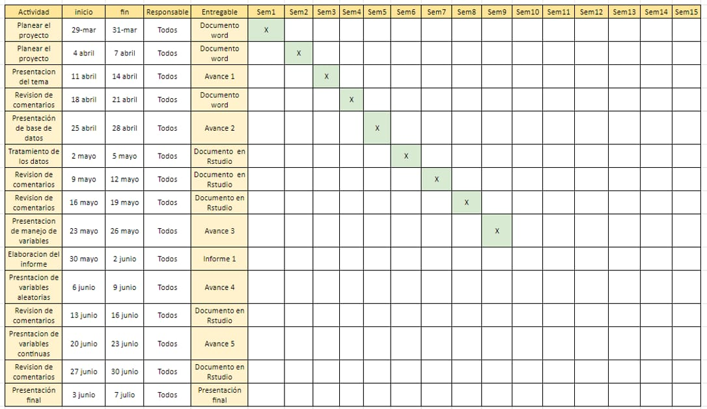

 
## Objetivos

-   Analizar las ciudades con mejor ranking (ELABORAMOS NUESTRO PROPIO RANKING)de experiencia de Airbnb en Europa del 2023.
-   Analizar las ciudades con mejor ranking de experiencia de Airbnb en Europa del 2023.

-   Describir las características de los alojamientos más caros y más económicos en ciudades de Europa del 2023.

-   Analizar la atracción de un Airbnb y su relación con su ubicación en ciudades de Europa del 2023.

## Contexto

Nuestro proyecto se centra realizar un análisis estadístico el servicio de un Airbnb, el cual se basa en que un propietario realiza un arrendamiento de corto plazo a cualquiera que busque alojamiento. Esta servicio puede ser contratado desde cualquier parte del mundo mediante una plataforma digital, en la cual los usuaarios podrán calificar, comentar en base a su experiencia sus niveles de satisfacción limpieza y etc.

## Planificación

En esta sección el equipo se presenta la planificación de todas la entregas hasta la semana 16 
@ -45,7 +49,7 @@ Para el proceso de recolección se realiza una búsqueda de base de datos de la

-   Unidad muestra

    La unidad muestra es cada airbnb (alojamiento) que se encuentra en funcionamiento en esas nueve ciudades en Europa. \## Muestreo El método de muestreo utilizado fue muestreo aleatorio simple.
    La unidad muestra es cada airbnb (alojamiento) que se encuentra en funcionamiento en esas nueve ciudades en Europa. Muestreo El método de muestreo utilizado fue muestreo aleatorio simple.

-   Tamaño de la muestra

@ -54,7 +58,7 @@ Para el proceso de recolección se realiza una búsqueda de base de datos de la
## Variables

| N°  |          Variable           |         Tipo         | Restricciones                                                                                                     |
|:---:|:---------------------------:|:--------------------:|-------------------------------------------------------------------------------------------------------------------|
|:-------------:|:-------------:|:-------------:|--------------------------|
|  1  |            City             | (Categórica nominal) | Debe ser una de las nueve ciudades (Amsterdam, Roma, Lisboa , Viena, Atenas, París, Barcelona, Berlín y Budapest) |
|  2  |     Cuándo lo reservan      | (Categórica nominal) | Debe ser weekday o weekend.                                                                                       |
|  3  |          Room Type          | (Categórica nominal) | Debe ser una de los dos tipos de alojamiento "Entire home/apartamento" o "Cuarto privado"                         |
@ -70,20 +74,1920 @@ Para el proceso de recolección se realiza una búsqueda de base de datos de la
| 13  |          Bedrooms           | (Numérica discreta)  | Debe ser un número entero no negativo.                                                                            |
| 14  |      City Center (km)       | (Numérica continua)  | Debe ser un número decimal no negativo en kilómetros.                                                             |
| 15  |     Metro Distance (km)     | (Numérica continua)  | Debe ser un número decimal no negativo en kilómetros.                                                             |
| 16  | Normalised attraction Index | (Numérica continua)  | Debe ser un número decimal no negativo.                                                                           |
| 17  | Normalised restaurant index | (Numérica continua)  | Debe ser un número decimal no negativo.                                                                           |
| 16  | Normalised attraction Index | (Numérica continua)  | Debe ser un número decimal no negativo entre 0-100..                                                              |
| 17  | Normalised restaurant index | (Numérica continua)  | Debe ser un número decimal no negativo entre 0-100.                                                               |

## Limpieza de datos

#### Verificar Variables booleanas
```{r}
library(readr)
library(dplyr)
library(ggplot2)
library(modeest)
library(foreign)
library(fitdistrplus)
D <- read_csv("Aemf1.csv") #EL ARCHIVO Aemf1 y datos.AIRBNB es lo mismo. 
coef_var <- function(x, na.rm = FALSE) {sd(x, na.rm=na.rm) / mean(x, na.rm=na.rm)}


roundF <- function(x){return(round(x,digits = 2))}

```

```{r}
# Número de Observaciones y Variables
nrow(D)
ncol(D)
```

-   Eliminamos la columna 18 y 16 (usamos sólo sus valores normalizados)

```{r}
View(D) 

D$`Attraction Index` <- NULL
D$`Restraunt Index` <- NULL

```

-   Re asignación de nombres :

```{r}
names(D)
```

```{r}
D %>% rename( Tipo = `Room Type` , Capacidad = `Person Capacity`, Oferta = Business, Habitaciones = Bedrooms, Ind.Atraccion = `Normalised Attraction Index`, Precio = Price, Share_Room = `Shared Room`, Limpieza = `Cleanliness Rating`, Ind.Restaurantes = `Normalised Restraunt Index`, Satisfaccion = `Guest Satisfaction`, Ciudad = City, Private_Room = `Private Room`, Distance_Center = `City Center (km)`, Distance_Metro = `Metro Distance (km)`) -> D2

View(D2)
```

```{r}
names(D2)
```

-   Búsqueda de NA y comprobación de casos completos

```{r}
Total_de_NAs <- sum(is.na(D))
print(paste("El total de NAs es :", Total_de_NAs)) 

Observaciones_completas <- sum(complete.cases(D2))
print(paste("Observaciones completas es : ",Observaciones_completas ))
Observaciones_incompletas <- sum(!complete.cases(D2))
print(paste("Observaciones incompletas es : ", Observaciones_incompletas))
```


```{r}
vec <- factor(D2$Oferta, labels = c('No','Sí'))
D2$Oferta <- vec
vec <- factor(D2$`Multiple Rooms`, labels = c('No','Sí'))
D2$`Multiple Rooms` <- vec
vec <- factor(D2$Share_Room, labels = c('No','Sí'))
D2$Share_Room <- vec
vec <- factor(D2$Private_Room, labels = c('No','Sí'))
D2$Private_Room <- vec
vec <- factor(D2$Superhost, labels = c('No','Sí'))
D2$Superhost <- vec
```

```{r}
D2$Habitaciones <- replace(D2$Habitaciones, D2$Habitaciones==0, NA)
```

# Análisis descriptivo

## Análisis Univariado

```{r}

#SATISFACCIÓN

table(D2$Satisfaccion)
```

```{r}
which.max(table(D2$Satisfaccion))
which.min(table(D2$Satisfaccion))
```

El mayor puntaje en satisfacción es de 100. El mínimo puntaje entre estas 9 ciudades es 54. En la tabla también se observa que, desde el valor de 88 hasta 100, más de 1000 personas marcaron cada uno de esos puntajes.

```{r}

## LIMPIEZA
table(D2$Limpieza)
```

```{r}
which.max(table(D2$Limpieza))
which.min(table(D2$Limpieza))
```

En el caso de la variable limpieza, se observa que los 3 valores más seleccionados son 8, 9 y 10; en ese orden. El valor menos seleccionado por los usuarios es el de 3.

```{r, echo=FALSE}
## ATRACCIÓN

mean_atraccion <- mean(D2$Ind.Atraccion)
median_atraccion <- median(D2$Ind.Atraccion)
par(mfrow=c(1,2)) #QUE HACE mfrow ?
boxplot(D2$Ind.Atraccion, main = "Atracción", xlab = "Índice de Atracción", ylab = "Frecuencia")
# Add mean as a red point
points(mean_atraccion, col = "red", pch = 16)
# Add median as a blue point
points(median_atraccion, col = "blue", pch = 16)
hist(D2$Ind.Atraccion, main = "Atracción", xlab = "Índice de Atracción", ylab = "Frecuencia")
# Add mean as a red dashed line
abline(v = mean_atraccion, col = "red", lwd = 2)
# Add median as a blue dashed line
abline(v = median_atraccion, col = "blue", lwd = 2)
```

```{r}
mean_atraccion
median_atraccion
IQR(D2$Ind.Atraccion)
quantile(D2$Ind.Atraccion) 
```

ANÁLISIS : El índice de atracción toma valores del 1 al 100. En las gráficas se puede observar que la mayoría de valores se encuentran por debajo de 20, y que la media y la mediana son valores cercanos a 10. En los valores obtenidos se aprecia que más del 50% de los datos es menor a 10 y el 75% de los datos son menores a 15.47. Con esta información, se puede afirmar que la mayoría de valores son bajos para el índice de atracción.Asimismo, la media es mayor a la mediana por lo que está sesgado a la derecha e indica que hay menos alojamientos con un índice de satisfacción alta entre 60 a 100.

```{r, echo=FALSE}
##Precio
mean_precio<- mean(D2$Precio)
median_precio <- median(D2$Precio)
par(mfrow=c(1,2))
boxplot(D2$Precio, main = "Precio de habitaciones en Airbnb", xlab = "Precio", ylab = "Frecuencia")
# Add mean as a red point
points(mean_precio, col = "red", pch = 16)
# Add median as a blue point
points(median_precio, col = "blue", pch = 16)
hist(D2$Precio, main = "Precio de habitaciones en Airbnb", xlab = "Precio", ylab = "Frecuencia")
# Add mean as a red dashed line
abline(v = mean_precio, col = "red", lwd = 2)
# Add median as a blue dashed line
abline(v = median_precio, col = "blue", lwd = 2)
```

```{r}
mean_precio
median_precio
IQR(D2$Precio)
quantile(D2$Precio) 
```

ANÁLISIS : La gráfica se puede observar de la siguiente manera porque la variable precio puede tomar valores entre 34.78 y 18454.45. Donde vemos que la mayoría de loa valores del precio está por debajo de 230.8. También, la media y mediana son 260 y 203.

```{r, echo=FALSE}
##Tipo

ggplot(data= D2, mapping=aes(x=Tipo))+ geom_bar()+ theme_grey()+ labs(title="Gráfica de tipos de habitaciones",x="Tipo",y="Frecuencias")


```

ANÁLISIS : El tipo de habitación que ofertan los airbnb son casas o apartamentos enteros, seguidos por las habitaciones privadas y en un menor porcentaje se ofertan habitaciones compartidas entre varios usuarios.

```{r, echo=FALSE}
#CAPACIDAD

mean_capacidad <- mean(D2$Capacidad)
median_capacidad <- median(D2$Capacidad)
par(mfrow=c(1,2)) 
boxplot(D2$Capacidad, main = "Capacidad", xlab = "Capacidad", ylab = "Frecuencia")
# Add mean as a red point
points(mean_capacidad, col = "red", pch = 16)
# Add median as a blue point
points(median_capacidad, col = "blue", pch = 16)
hist(D2$Capacidad, main = "Capacidad", xlab = "Capacidad", ylab = "Frecuencia")
# Add mean as a red dashed line
abline(v = mean_capacidad, col = "red", lwd = 2)
# Add median as a blue dashed line
abline(v = median_capacidad, col = "blue", lwd = 2)
```

```{r}
mean_capacidad
median_capacidad
IQR(D2$Capacidad)
quantile(D2$Capacidad) 
```

ANÁLISIS : Con respecto a la capacidad de las habitaciones reservadas, observamos que la capacidad más predominante en las habitaciones de Airbnb es de 2 personas y el que le sigue es una capacidad de 4 personas. Tanto del boxplot y del histograma podemos concluir que los datos no son muy dispersos.

```{r, echo=FALSE}
#MULTIPLE ROOM

ggplot(data= D2, mapping=aes(x=`Multiple Rooms`))+ geom_bar()+ theme_grey()+ labs(title="Gráfica de habitaciones múltiples",x="Tipo",y="Frecuencias")
```
ANÁLISIS: La gráfica nos informa que la mayoría personas que reservan una habitación en Airbnb prefieres no reservar habitaciones múltiples.

```{r, echo=FALSE}
##OFERTA
ggplot(data= D2, mapping=aes(x=Oferta))+ geom_bar()+ theme_grey()+ labs(title="Gráfica de Oferta",x="Ofertas",y="Frecuencias")
```
ANÁLISIS: Observamos del gráficos que la mayoría de personas que reservan habitación en Airbnb no lo hacen con oferta.

```{r, echo=FALSE}
##Habitaciones 
mean_habitaciones <- mean(D2$Habitaciones,na.rm = TRUE)
median_habitaciones <- median(D2$Habitaciones,na.rm=TRUE)
par(mfrow=c(1,2)) 
boxplot(D2$Habitaciones, main = "Número de habitaciones", xlab = "Habitaciones", ylab = "Frecuencia")
# Add mean as a red point
points(mean_habitaciones, col = "red", pch = 16)
# Add median as a blue point
points(median_habitaciones, col = "blue", pch = 16)
hist(D2$Habitaciones, main = "Número de habitaciones", xlab = "Habitaciones", ylab = "Frecuencia")
# Add mean as a red dashed line
abline(v = mean_habitaciones, col = "red", lwd = 2)
# Add median as a blue dashed line
abline(v = median_habitaciones, col = "blue", lwd = 2)
```

```{r}
mean_habitaciones
median_habitaciones
IQR(D2$Habitaciones, na.rm=TRUE)
quantile(D2$Habitaciones,na.rm=TRUE) 
```

ANÁLISIS : Tanto como en el histograma y en el boxplot se puede observar que hay muchos datos que están dispersos. En el histograma observamos que el número de habitaciones reservadas que es más frecuentado es solo 1, siendo este mayor o igual que el 75% de todos los datos, según los quartiles, y el que le sigue son 2 habitaciones. 

```{r, echo=FALSE}
##DISTANCE CENTER
mean_distC <- mean(D2$Distance_Center)
median_distC <- median(D2$Distance_Center)
par(mfrow=c(1,2)) 
boxplot(D2$Distance_Center, main = "Distance center", xlab = "Distance Center", ylab = "Frecuencia")
# Add mean as a red point
points(mean_distC, col = "red", pch = 16)
# Add median as a blue point
points(median_distC, col = "blue", pch = 16)
hist(D2$Distance_Center, main = "Distance Center", xlab = "Distance Center", ylab = "Frecuencia")
# Add mean as a red dashed line
abline(v = mean_distC, col = "red", lwd = 2)
# Add median as a blue dashed line
abline(v = median_distC, col = "blue", lwd = 2)
```

```{r}
mean_distC
median_distC
IQR(D2$Distance_Center)
quantile(D2$Distance_Center) 
```
Para el caso de distancia al centro, el mayor valor es 25.28km. Se observa que este valor se aleja bastante de la media, ya que el 75% de los valores es menor a 3.59 km. Como se puede observas en el histograma y en el boxplot, los valores altos de la tabla se encuentran dispersos. En el caso del histograma, las cantidades son casi imperceptibles después de los 15 km.

```{r, echo=FALSE}
##DISTANCE METRO

mean_distM <- mean(D2$Distance_Metro)
median_distM <- median(D2$Distance_Metro)
par(mfrow=c(1,2)) 
boxplot(D2$Distance_Metro, main = "Distance Metro", xlab = "Distance Metro", ylab = "Frecuencia")
# Add mean as a red point
points(mean_distM, col = "red", pch = 16)
# Add median as a blue point
points(median_distM, col = "blue", pch = 16)
hist(D2$Distance_Metro, main = "Distance Metro", xlab = "Distance Metro", ylab = "Frecuencia")
# Add mean as a red dashed line
abline(v = mean_distM, col = "red", lwd = 2)
# Add median as a blue dashed line
abline(v = median_distM, col = "blue", lwd = 2)
```

```{r}
mean_distM
median_distM
IQR(D2$Distance_Metro)
quantile(D2$Distance_Metro) 
```
Para el caso de distancia al metro, el mayor valor es 14.27km. Se observa que este valor se aleja bastante de la media, ya que el 75% de los valores es menor a 0.7 km. Como se puede observas en el histograma y en el boxplot, los valores altos de la tabla se encuentran dispersos y son pocos.


```{r, echo=FALSE}
##Índice de restaurantes
mean_Ind.Restaurant <- mean(D2$Ind.Restaurantes)
median_Ind.Restaurant <- median(D2$Ind.Restaurantes)
par(mfrow=c(1,2)) 
boxplot(D2$Ind.Restaurantes, main = "Índice de Restaurantes", xlab = "Índice de Restaurantes", ylab = "Frecuencia")
# Add mean as a red point
points(mean_Ind.Restaurant, col = "red", pch = 16)
# Add median as a blue point
points(median_Ind.Restaurant, col = "blue", pch = 16)
hist(D2$Ind.Restaurantes, main = "Índice de Restaurantes", xlab = "Índice de Restaurantes", ylab = "Frecuencia")
# Add mean as a red dashed line
abline(v = mean_Ind.Restaurant, col = "red", lwd = 2)
# Add median as a blue dashed line
abline(v = median_Ind.Restaurant, col = "blue", lwd = 2)
```

```{r}
mean_Ind.Restaurant
median_Ind.Restaurant
IQR(D2$Ind.Restaurantes)
quantile(D2$Ind.Restaurantes) 
```
Se observa que en el caso de la variable índice de restaurantes, el 50% de los valores se concentra entre 11.13 y 36.821. Como se observa en el histograma, la variable tiene una tendencia decreciente con después de la media (mientras más alto es el índice, menos son los airbnb con un índice de restaurantes en ese rango).

## Objetivos

### Objetivo 1 :Analizar las ciudades con mejor ranking de experiencia de Airbnb en Europa del 2023.

1.  Promedio de satisfacción, promedio de precio, número de superhost, número de airbnbs, promedio de índice de atracción por ciudad.

```{r}
D2 %>% 
  group_by(Ciudad) %>% 
  summarise(`Precio Promedio` = mean(Precio),
            `Número de Airbnb's` = n(),
            `Superhosts %` = prop.table(table(Superhost))["Sí"],
            `Índice de Atracción Promedio` = mean(Ind.Atraccion)) -> D_Ciudades
arrange(D_Ciudades)

```

En la tabla se puede observar que Amsterdam es el que tiene mayor precio promedio de todas las ciudades. El número de airbnb's en esta ciudad es el más bajo también, esto podría indicar algún tipo de correlación entre estas variables, por lo que se procederá a hacer el análisis respectivo. Sin embargo, el resultado no es muy significativo, ya que para el estudio solo se están analizando 9 ciudades, por lo que se tienen solamente 9 observaciones para comparar la correlación.

```{r}
cor(D_Ciudades$`Precio Promedio`, D_Ciudades$`Número de Airbnb's`)
```
So observa que la correlación no es alta. En la tabla anterior, también se aprecia que la cantidad de superhost por ciudad es menor al 0.5% en todos los casos; el porcentaje de superhost más alto se encuentra en Atenas, con un 0.43%. En el caso del índice de atracción normalizado (0-100), los valores promedio de las ciudades son menores a 20 en todos los casos. El más alto corresponde a Paris (18.20), mientras el más bajo corresponde a Atenas (5.74).

A continuación se mostrarán los precios por ciudad agrupados por rangos, esto brinda una idea de en qué rango se concentran los precios de los airbnb's en cada una de las ciudades. La línea roja representa la media en cada una de las ciudades, mientras que la azul representa la mediana. 

```{r}
D2 %>% filter(Ciudad =='Amsterdam') -> DAMS
D2 %>% filter(Ciudad =='Barcelona') -> DBAR
D2 %>% filter(Ciudad =='Athens') -> DATH
D2 %>% filter(Ciudad =='Berlin') -> DBER
D2 %>% filter(Ciudad =='Budapest') -> DBUD
D2 %>% filter(Ciudad =='Lisbon') -> DLIS
D2 %>% filter(Ciudad =='Paris') -> DPAR
D2 %>% filter(Ciudad =='Rome') -> DROM
D2 %>% filter(Ciudad =='Vienna') -> DVIE

```

```{r, echo=FALSE}

hist(DAMS$Precio, xlab = 'Precio', ylab = 'Frecuencia', main = 'Precios en Amsterdam')
# Add mean as a red dashed line
abline(v = mean(DAMS$Precio), col = "red", lwd = 2)
# Add median as a blue dashed line
abline(v = median(DAMS$Precio), col = "blue", lwd = 2)

hist(DBAR$Precio, main = "Precios en Barcelona", xlab = "Precio", ylab = "Frecuencia")
# Add mean as a red dashed line
abline(v = mean(DBAR$Precio), col = "red", lwd = 2)
# Add median as a blue dashed line
abline(v = median(DBAR$Precio), col = "blue", lwd = 2)

hist(DATH$Precio, main = "Precios en Atenas", xlab = "Precio", ylab = "Frecuencia")
# Add mean as a red dashed line
abline(v = mean(DATH$Precio), col = "red", lwd = 2)
# Add median as a blue dashed line
abline(v = median(DATH$Precio), col = "blue", lwd = 2)

hist(DBER$Precio, main = "Precios en Berlin", xlab = "Precio", ylab = "Frecuencia")
# Add mean as a red dashed line
abline(v = mean(DBER$Precio), col = "red", lwd = 2)
# Add median as a blue dashed line
abline(v = median(DBER$Precio), col = "blue", lwd = 2)

hist(DBUD$Precio, main = "Precios en Budapest", xlab = "Precio", ylab = "Frecuencia")
# Add mean as a red dashed line
abline(v = mean(DBUD$Precio), col = "red", lwd = 2)
# Add median as a blue dashed line
abline(v = median(DBUD$Precio), col = "blue", lwd = 2)

hist(DLIS$Precio, main = "Precios en Lisboa", xlab = "Precio", ylab = "Frecuencia")
# Add mean as a red dashed line
abline(v = mean(DLIS$Precio), col = "red", lwd = 2)
# Add median as a blue dashed line
abline(v = median(DLIS$Precio), col = "blue", lwd = 2)

hist(DPAR$Precio, main = "Precios en Paris", xlab = "Precio", ylab = "Frecuencia")
# Add mean as a red dashed line
abline(v = mean(DPAR$Precio), col = "red", lwd = 2)
# Add median as a blue dashed line
abline(v = median(DPAR$Precio), col = "blue", lwd = 2)

hist(DROM$Precio, main = "Precios en Roma", xlab = "Precio", ylab = "Frecuencia")
# Add mean as a red dashed line
abline(v = mean(DROM$Precio), col = "red", lwd = 2)
# Add median as a blue dashed line
abline(v = median(DROM$Precio), col = "blue", lwd = 2)

hist(DVIE$Precio, main = "Precios en Vienna", xlab = "Precio", ylab = "Frecuencia")
# Add mean as a red dashed line
abline(v = mean(DVIE$Precio), col = "red", lwd = 2)
# Add median as a blue dashed line
abline(v = median(DVIE$Precio), col = "blue", lwd = 2)
```

2.  Índice de satisfacción VS Precio

```{r, echo=FALSE}
plot(x = D2$Satisfaccion, y = D2$Precio, xlab = "Satisfacción" , ylab = "Precio", ylim= c(0,2500))
```

```{r}
cor(D2$Satisfaccion, D2$Precio)
```

Del gráfico se puede observar que la correlación entre ambas variables es muy baja. Después de hallar el valor de la correlación, se comprueba esta observación, ya que su valor es de 0.016.

3.  Gráfica de Atracción normalizada VS Precio

```{r, echo=FALSE}
plot(x = D2$Ind.Atraccion, y = D2$Precio, xlab = "Índice de Atracción" , ylab = "Precio", ylim= c(0,2500))
```

```{r}
cor(D2$Ind.Atraccion, D2$Precio)
```

Del gráfico se puede observar que la correlación entre ambas variables es baja. Después de hallar el valor de la correlación, se comprueba esta observación, ya que su valor es de 0.271.

4.  Gráfica de Ciudad VS Cuándo se reserva

```{r, echo=FALSE}
mosaicplot(table(D2$Ciudad, D2$Day), main = "Cuándo se reserva - Ciudad", xlab = "Ciudades", ylab = "Cuándo se Reserva", las = 0.7, )
```

La ciudad más concurrida es Roma, debido al número de reserva que se hace dentro de semanas y fines de semanas. Además que presentan equilibrio de reservas ROMA

### Objetivo 2 : Describir las características de los alojamientos más caros y más económicos en ciudades de Europa del 2023.

1.  Conocer el total de las ciudades que pertenecen a la base de datos

2.  Conocer el precio promedio de los alojamientos en las 9 ciudades

3.  Conocer la mediana del precio de los alojamientos

4.  Identificar cuáles son las observaciones que se encuentran por debajo de la mediana : "ECO"

5.  Identificar cuáles son las observaciones que se encuentran por arriba de la mediana : "CARO"

6.  De la mitad mayor a la mediana, identificar la moda de Superhost y Room Type

7.  Conocer el precio más económico y sus características

8.  Identificar el tipo de cuarto de las habitaciones más económicas

9.  Conocer el precio más caro e identificar sus características

10. Identificar el tipo de cuarto de las habitaciones más caras

11. Conocer el precio más caro e identificar sus características

12. Analizar por ciudades las características del alojamiento más caro y económico, analizar la relación precio y ubicación, analizar la relación precio e indice de restaurantes y atracción.

#### Desarrollo :

-   **Conocer el total de las ciudades que pertenecen a la base de datos**

```{r}

c <- table(D2$Ciudad)
sum(c)
barplot(c, main = "Ciudades en el Estudio", ylab = "Número de Observaciones" , las=2, ylim = c(0,10000), cex.names = 0.9, col=c("orange"))


```

*Análisis : La mayoría de los alojamientos se encuentra en Roma (porcentaje),seguido de París (porcentaje) y Lisboa (porcentaje).*

-   **El precio promedio en todas las ciudades de Europa:**

```{r}
s <-round(mean(D2$Precio),digits = 2)
s
```

*El precio de los alojamientos se encuentran alrededor de los 260.09 dólares.*

-   **Conocer la mediana del precio de los alojamientos**

    ```{r}
    mediana_precio <- median(D2$Precio)
    mediana_precio
    ```

*Se concluye que a la mitad de los alojamientos que superen este valor, se les considera cómo la mitad con precios más caros. La parte inferior se consideran cómo airbnb's económicos.*

*Al analizar estos 2 descriptores para la variable precio, se observa que la media es mayor a la mediana (sesgado a la derecha, quiere decir que el lado derecho tiene pocas observaciones , osea que los alojamiento con precios muy altos son pocos con respecto al total)*

-   **Identificar cuáles son las observaciones que se encuentran por arriba de la mediana : "CARO"**

*Tenemos un total de 20,855 airbnb's con precios mayores a los 203.8193 (mediana)*

```{r}
D2 %>% filter(Precio > mediana_precio) %>% arrange(desc(Precio)) -> CAROS
CAROS
nrow(CAROS) 


```

-   **Multiple Rooms, Shared Room, Private Room y Oferta :** En primer lugar, se observa que Multiple rooms tiene como valor mínimo 0 y como valor máximo 1; esto mismo ocurre en el caso de la variable Oferta. Procedemos a analizar qué valores se encuentran dentro de estas dos variables.
```{r}
c1 <- table(CAROS$Ciudad) #Del grupos de los Caros, Atenas es el que menos alojamientos tiene en el estudio (795). El de más apariciones es París (5,724)
c1
min(c1)
which.min(c1)

barplot(c1, main = "Ciudades con más alojamientos caros", ylab = "Número de Observaciones" , las=2, ylim = c(0,10000), cex.names = 0.9, col=c("green"))

```

*ANÁLISIS : Del grupo de los Caros, Atenas es el que menos alojamientos tiene en el estudio (795 airbnb´s). El de más apariciones es París (5,724), seguido por Roma y Lisboa. Se concluye que París es la ciudad con mayor cantidad de alojamiento con precios elevados.*

*Analizamos los 100 alojamientos más caros :*

```{r}
#Analizamos el lado de  los 100 alojamientos más caros : 

CAROS[1:100, ] -> CAROS100 
CAROS100

#Qué ciudad aparece más aquí en alojamientos caros : 
ciudades_100 <- table(CAROS100$Ciudad)
ciudades_100 
barplot(ciudades_100, main = "Ubicación de las 100 ciudades con precios más caros", col= c("skyblue"),, las=2, cex.names = 0.9)

superhost100 <- table(CAROS100$Superhost)
barplot(superhost100, main = 'Superhost', col =c( "#CCFF99","#9999FF" ))
legend("topright",legend=c("SÍ","NO"),
       fil=c("#9999FF","#CCFF99"))


#Los valores de Limpieza y Satisfacción son muy altos
"La calificación que le asignan a este tipo de alojaminetos es 9.5 en promedio en LIMPIEZA"
mean(CAROS100$Limpieza) 
"La Satisfacción del servicio es una notación alta, ya que tiene un 95.19 en promedio"
mean(CAROS100$Satisfaccion)
"Y lo mínimo en satisfacción es 60, lo que igual es alto"
min(CAROS100$Satisfaccion)


```

*ANÁLISIS :*

*En la primera gráfica se muestran las ciudades dónde están los TOP 100 Airbnb más caros. Se concluye que aquí el preio máximo lo hallarás en Amsterdam con un valor de 18545.450 dólares por toda una casa entera y en general esta ciudad tiene la mayoría de alojamientos más costosos con un total de 37 lugares. A esta ciudad le sigue París con 33 airbnb y el máximo de 16445.615 por una casa entera.*

*En la segunda gráfica, se concluye que no necesariamente en airbnb costoso tendrá cómo anfitrión a un Superhost, ya que la mayoría es NO.*

*Además, según la tabla de abajo, la limpieza y la satisfacción son muy buenas ya que ambas presentan altos valores*

```         


Amsterdam    Athens Barcelona    Berlin  Budapest     Paris      Rome    Vienna 
       37         1        10         6         4        33         6         3 
[1] "La calificación que le asignan a este tipo de alojamientos es 9.5 en promedio en LIMPIEZA, lo cual es muy alto"
[1] 9.5
[1] "La Satisfacción del servicio es una notación alta, ya que tiene un 95.19 en promedio"
[1] 95.19
[1] "Y lo mínimo en satisfacción es 60, lo que igual es alto"
[1] 60
```

```{r}

tipo_capacidad <- table(CAROS100$Tipo,CAROS100$Capacidad)

mosaicplot(tipo_capacidad, main = "Tipo de habitación TOP 100 y su Capacidad de personas", color = "green")
```

*ANÁLISIS : Analizamos el tipo de cuarto y su capacidad de personas : La mayoría es una Casa Entera para 6, y tiene sentido por un costo elevado.*

```{r}
"La cantidad promedio de habitaciones en este tipo de alojamientos es:"
roundF(mean(CAROS100$Habitaciones, na.rm = T))

day <- table(CAROS100$Day) # Y se suelen tomar los fines de semana
day
mosaicplot(day, main = "Cual es el día en que más se reserva este tipo de alojamientos", color = "skyblue")
legend("bottomleft",legend=c("Weekday = 49","Weekend = 51"))


```

*ANÁLISIS : Se concluye este tipo de airbnb top 100, los suelen reservar tanto en días de semana cómo en fines.La diferencia es mínima y la cantidad promedio en número de habitaciones en este tipo de alojamientos es 3*

-   **Identificar cuáles son las observaciones que se encuentran por debajo de la mediana : "ECO"**

```{r}
D2 %>% filter(Precio < mediana_precio) %>% arrange(Precio)-> ECO
ECO
nrow(ECO) 
barplot(table(ECO$Ciudad),main = "Los  Airbnb más económicos", ylab = "Número de Observaciones" , las=2, ylim = c(0,10000), cex.names = 0.9, col=c("skyblue"))
```

ANÁLISIS : *Es el total de Airbnb con precios menores a los 203.8193 (mediana) son 20,856 y el más económico tiene un costo de 34.77 dólares en Budapest, que consiste en una habitación privada para 2 personas. Este costo se podría asociar a que se encuentra a largas distancias del centro y del metro, además de un bajo índice de atracción.La relación entre estas variables se analiza en los siguientes puntos*

*Asimismo, se observa que Roma tiene una amplia oferta de precios, ya que puedes encontrar alojamientos de los más económicos, cómo también en los alojamientos caros. Sus precios están alrededor de los 205.39 dólares.*

```{r}
D2 %>%filter(D2$Ciudad == 'Rome') -> ROMA
A <- mean(ROMA$Precio)
A
```

*Los TOP 100 Económicos son los siguientes :*

```{r}
#Analizamos el lado de  los 100 alojamientos más Económicos : 

ECO[1:100, ] -> ECO100 
ECO100

#Qué ciudad aparece más aquí en alojamientos caros : 
ciudadeseco_100 <- table(ECO100$Ciudad)
barplot(ciudadeseco_100, col = "skyblue")

Esuperhost100 <- table(ECO100$Superhost)
barplot(Esuperhost100, main = "Superhost 100 más económicos", col = "skyblue")

#Los valores de Limpieza y Satisfacción son muy altos
"La calificación que le asignan a este tipo de alojaminetos es 8.9  en promedio en LIMPIEZA DEL 0-10"
mean(ECO100$Limpieza) 
"La Satisfacción del servicio es una notación alta, ya que tiene un 95.19 en promedio"
mean(ECO100$Satisfaccion)
"Y lo mínimo en satisfacción es 20, lo que igual es BAJO"
min(ECO100$Satisfaccion)


```

ANÁLISIS : *En la primera gráfica, se concluye que Athenas es una de las ciudades con precios más económicos en el estudio, ya que tiene la mayor proporción dentro de los 100 alojamientos más económicos de todos. A estos le siguen Budapest y Roma, la cual cuentan con una mayoría de NO superhost (no son anfitriones top) .*

*ADEMÁS : según la siguiente tabla :*

```         
"La calificación que le asignan a este tipo de alojaminetos es 8.9  en promedio en LIMPIEZA DEL 0-10"
[1] 8.91
[1] "La Satisfacción del servicio es una notación alta, ya que tiene un 89.88 en promedio"
[1] 89.88
[1] "Y lo mínimo en satisfacción es 20, lo que igual es BAJO"
[1]  20 
```

*Estos precios concuerdan con su puntaje de limpieza 2 (mala) y atracción de 2.9 (baja)* *Analizando el porqué de esta atracción tan baja, vemos que el airbnb es sólo una habitación está en Roma que no tiene un superhost y una limpieza muy mala de 2 puntos.*

```{r}
which.min(ECO100$Satisfaccion)
ECO100[20,1:17]
```

```{r}

tipo_capacidadECO <- table(ECO100$Tipo,ECO100$Capacidad)

mosaicplot(tipo_capacidadECO, col = "skyblue")
```

ANÁLISIS : *Analizamos el tipo de cuarto y cuando lo suelen tomar por alquilado : La mayoría es una Habitación privada, que son más económicos y con una capacidad para sólo 2 personas. Estos se suelen tomar tanto en día de semana cómo para fines.*

ANÁLISIS : *La cantidad promedio de habitaciones en este tipo de alojamientos es: 1 ,el espacio es reducido, lo que tiene sentido por los bajos costos*

```{r}

roundF(mean(ECO100$Habitaciones, na.rm = T))

dayeco <- table(ECO100$Day) # 
mosaicplot(dayeco)
```

-   *De los 100 económicos, identificar Superhost y Room Type*

ANÁLISIS : *Se contempla que la mayoría de dueños de airbnb´s de estos precios no tienen la clasificación de superhost*

````         
```{r}
S <- table(ECO100$Superhost)
S
barplot(S,col=c("orange","blue"),
        legend.text=c("Sí","No"),main="SUPERHOST")


```
````

-   Dónde se encuentra el Airbnb más caro y más económico de todos, y qué características tienen :

    El Alojamiento más caro se encuentra en Athenas con un precio de 18,545.45 mil dólares, lo que implica una "Casa entera", así mismo este tiene las máximas calificaciones tanto en limpeza (10) y satisfacción (100). Además la cercanía a las ciudades es buena (es cercano a ellas)

    ```{r}
    max(D2$Precio)
    a <- which.max(D2$Precio)
    D2[a,1:17]

    ```

    *El AIRBNB más económico es BUDAPEST con un precio de 34 dólares con una habitacipon privada para 2 y ubicado considerablemente lejos del centro y restaurantes :*

    ```{r}
    par(mfrow=c(1,2))
    round(min(D2$Precio),digits = 2)
    a2 <- which.min(D2$Precio)
    D2[a2,1:17]

    counts <- table(D2$`Multiple Rooms`)
    barplot(counts, main = "Multiple Rooms", ylab = "Número de Observaciones", xlab = "Valores" , ylim = c(0,35000))
    ```

# Análisis Descriptivo
#### Relación entre variables por ciudades :

Aquí se analiza por ciudades por separado y se ve la relación precio vs (ubicación al metro y centro, restaurantes)

```{r}
unique(D2$Ciudad)
```

#### Amsterdam

Aquí filtramos a todos los alojamientos ubicados en Amsterdam y analizamos si existe una relación de precio con respecto a su ubicación al metro, al centro de la ciudad y su índice de restaurantes:

```{r}
#Filtramos
D2 %>% filter(Ciudad =='Amsterdam') -> DAMSTERDAM
DAMSTERDAM

#El más caro
r1 <- which.max(DAMSTERDAM$Precio)
DAMSTERDAM[r1,1:17]


#El más económico
r2 <- which.min(DAMSTERDAM$Precio)
DAMSTERDAM[r2,1:17]
```


```{r, echo=FALSE}
#Relación precio vs metro(km)

plot(DAMSTERDAM$Precio ~ DAMSTERDAM$Distance_Metro, main = 'Variación del precio vs la distancia al metro', ylab = "Precio ($)", xlab = "Distancia al metro (km)")
abline(lm(DAMSTERDAM$Precio ~ DAMSTERDAM$Distance_Metro), col = "red", lwd = 3, lty = 2)
text(paste("Correlación:", round(cor(DAMSTERDAM$Distance_Metro, DAMSTERDAM$Precio), 2)), x = 4, y = 7000)

#Relación precio vs centro(km)
plot(DAMSTERDAM$Precio ~ DAMSTERDAM$Distance_Center, main = 'Variación del precio vs la distancia al centro', ylab = "Precio ($)", xlab = "Distancia al centro (km)" )
abline(lm(DAMSTERDAM$Precio ~ DAMSTERDAM$Distance_Center), col = "green", lwd = 3, lty = 2)
text(paste("Correlación:", round(cor(DAMSTERDAM$Distance_Center, DAMSTERDAM$Precio), 2)), x = 10, y = 7000)


#Relación precio vs indice de restaurantes
plot(DAMSTERDAM$Precio ~ DAMSTERDAM$Ind.Restaurantes, main = 'Variación del precio vs Índice de restaurantes', xlab = "Índice de restaurantes", ylab = "Precio($)" )
abline(lm(DAMSTERDAM$Precio ~ DAMSTERDAM$Ind.Restaurantes), col = "pink", lwd = 3, lty = 2)
text(paste("Correlación:", round(cor(DAMSTERDAM$Ind.Restaurantes, DAMSTERDAM$Precio), 2)), x = 80, y = 7000)
```

ANALISIS : La primera gráfica presenta un valor de correlación de -0.14, lo que indica que mientras más lejano se encuentre al metro el Airbnb tiene a disminuir su precio. Para la segunda gráfica, se evidencia que sí existe una relación entre precio y distancia al centro , buena pero no fuerte. Esta es una correlación negativa con un valor -0.26, lo que indica que a mayor distancia (km) del centro se encuentre el alojamiento tiende a disminuir el precio.

-   Relación precio distancia el centro , distancia al metro e índice de restaurantes

A continuación se procede a analizar la relación precio vs (distancia al metro y centro, ind.restaurantes) para cada país : La correlación está entre -1.....0.... 1 . Mientras más cerca al cero es que la correlación es baja.

Realizamos este análisis para el conjunto total de ciudades en el estudio así cómo para cada ciudad :

```{r, echo=FALSE}


#Relación precio vs metro(km)
plot(D2$Precio ~ D2$Distance_Metro, main = 'Variación del precio vs la distancia al metro')
abline(lm(D2$Precio ~ D2$Distance_Metro), col = "red", lwd = 3, lty = 2)
text(paste("Correlación:", round(cor(D2$Distance_Metro, D2$Precio), 2)), x = 11, y = 15000)

#Relación precio vs centro(km)
plot(D2$Precio ~ D2$Distance_Center, main = 'Variación del precio vs la distancia al centro')
abline(lm(D2$Precio ~ D2$Distance_Center), col = "green", lwd = 3, lty = 2)
text(paste("Correlación:", round(cor(D2$Distance_Center, D2$Precio), 2)), x = 20, y = 15000)

#Relación precio vs indice de restaurantes
plot(D2$Precio ~ D2$Ind.Restaurantes, main = 'Variación del precio vs Índice de restaurantes')
abline(lm(D2$Precio ~ D2$Ind.Restaurantes), col = "pink", lwd = 3, lty = 2)
text(paste("Correlación:", round(cor(D2$Ind.Restaurantes, D2$Precio), 2)), x = 80, y = 7000)

```

ANÁLISIS : Según el total de datos la variable precio sí presenta una correlación con distancia al metro, distancia al centro e índice de restaurantes. Las primeras dos se consideran una correlación no muy fuerte y negativa, lo que nos indica que mientras más alejado del centro y del metro se encuentre el airbnb, el precio tiende a disminuir. Caso contrario cuando se compara con el índice de restaurantes, aquí la correlación es buena y positiva e indica que a mayor cantidad de locales de comida el precio tiende a subir de manera ligera. \### Atenas

```{r}
#Filtramos
D2 %>% filter(Ciudad =='Athens') -> DATHENAS
DATHENAS


#El más caro
r1 <- which.max(DATHENAS$Precio)
DATHENAS[r1,1:17]


#El más económico
r2 <- which.min(DATHENAS$Precio)
DATHENAS[r2,1:17]

#Relación precio vs metro(km)
```


```{r, echo=FALSE}
plot(DATHENAS$Precio ~ DATHENAS$Distance_Metro, main = 'Variación del precio vs la distancia al metro')
abline(lm(DATHENAS$Precio ~ DATHENAS$Distance_Metro), col = "red", lwd = 3, lty = 2)
text(paste("Correlación:", round(cor(DATHENAS$Distance_Metro, DATHENAS$Precio), 2)), x = 1.5, y = 15000)

#Relación precio vs centro(km)
plot(DATHENAS$Precio ~ DATHENAS$Distance_Center, main = 'Variación del precio vs la distancia al centro')
abline(lm(DATHENAS$Precio ~ DATHENAS$Distance_Center), col = "green", lwd = 3, lty = 2)
text(paste("Correlación:", round(cor(DATHENAS$Distance_Center, DATHENAS$Precio), 2)), x = 5, y = 15000)

#Relación precio vs indice de restaurantes
plot(DATHENAS$Precio ~ DATHENAS$Ind.Restaurantes, main = 'Variación del precio vs Índice de restaurantes')
abline(lm(DATHENAS$Precio ~ DATHENAS$Ind.Restaurantes), col = "pink", lwd = 3, lty = 2)
text(paste("Correlación:", round(cor(DATHENAS$Ind.Restaurantes, DATHENAS$Precio), 2)), x = 80, y = 7000)


```

#### Barcelona

```{r}
#Filtramos
D2 %>% filter(Ciudad =='Barcelona') -> DBARCELONA
DBARCELONA


#El más caro
r1 <- which.max(DATHENAS$Precio)
DATHENAS[r1,1:17]


#El más económico
r2 <- which.min(DATHENAS$Precio)
DATHENAS[r2,1:17]
```


```{r, echo=FALSE}
#Relación precio vs metro(km)

plot(DATHENAS$Precio ~ DATHENAS$Distance_Metro, main = 'Variación del precio vs la distancia al metro')
abline(lm(DATHENAS$Precio ~ DATHENAS$Distance_Metro), col = "red", lwd = 3, lty = 2)
text(paste("Correlación:", round(cor(DATHENAS$Distance_Metro, DATHENAS$Precio), 2)), x = 1.5, y = 15000)

#Relación precio vs centro(km)
plot(DATHENAS$Precio ~ DATHENAS$Distance_Center, main = 'Variación del precio vs la distancia al centro')
abline(lm(DATHENAS$Precio ~ DATHENAS$Distance_Center), col = "green", lwd = 3, lty = 2)
text(paste("Correlación:", round(cor(DATHENAS$Distance_Center, DATHENAS$Precio), 2)), x = 5, y = 15000)

#Relación precio vs indice de restaurantes
plot(DATHENAS$Precio ~ DATHENAS$Ind.Restaurantes, main = 'Variación del precio vs Índice de restaurantes')
abline(lm(DATHENAS$Precio ~ DATHENAS$Ind.Restaurantes), col = "pink", lwd = 3, lty = 2)
text(paste("Correlación:", round(cor(DATHENAS$Ind.Restaurantes, DATHENAS$Precio), 2)), x = 80, y = 7000)

```

#### Berlín :

```{r}
### Berlín

#Filtramos
D2 %>% filter(Ciudad =='Berlin') -> DBERLIN
DBERLIN

#El más caro
r1 <- which.max(DBERLIN$Precio)
DBERLIN[r1,1:17]


#El más económico
r2 <- which.min(DBERLIN$Precio)
DBERLIN[r2,1:17]
```


```{r, echo=FALSE}
#Relación precio vs metro(km)

plot(DBERLIN$Precio ~ DBERLIN$Distance_Metro, main = 'Variación del precio vs la distancia al metro')
abline(lm(DBERLIN$Precio ~ DBERLIN$Distance_Metro), col = "red", lwd = 3, lty = 2)
text(paste("Correlación:", round(cor(DBERLIN$Distance_Metro, DBERLIN$Precio), 2)), x = 12, y = 4000)

#Relación precio vs centro(km)
plot(DBERLIN$Precio ~ DBERLIN$Distance_Center, main = 'Variación del precio vs la distancia al centro')
abline(lm(DBERLIN$Precio ~ DBERLIN$Distance_Center), col = "green", lwd = 3, lty = 2)
text(paste("Correlación:", round(cor(DBERLIN$Distance_Center, DBERLIN$Precio), 2)), x = 20, y = 4000)


#Relación precio vs indice de restaurantes
plot(DBERLIN$Precio ~ DBERLIN$Ind.Restaurantes, main = 'Variación del precio vs Índice de restaurantes')
abline(lm(DBERLIN$Precio ~ DBERLIN$Ind.Restaurantes), col = "pink", lwd = 3, lty = 2)
text(paste("Correlación:", round(cor(DBERLIN$Ind.Restaurantes, DBERLIN$Precio), 2)), x = 80, y = 4000)
```

#### Roma

```{r}
#Filtramos
D2 %>% filter(Ciudad =='Rome') -> DROMA
DROMA

#El más caro
r1 <- which.max(DROMA$Precio)
DROMA[r1,1:17]


#El más económico
r2 <- which.min(DROMA$Precio)
DROMA[r2,1:17]
```


```{r, echo=FALSE}
#Relación precio vs metro(km)

plot(DROMA$Precio ~DROMA$Distance_Metro, main = 'Variación del precio vs la distancia al metro')
abline(lm(DROMA$Precio ~ DROMA$Distance_Metro), col = "red", lwd = 3, lty = 2)
text(paste("Correlación:", round(cor(DROMA$Distance_Metro, DROMA$Precio), 2)), x = 3, y = 2000)

#Relación precio vs centro(km)
plot(DROMA$Precio ~ DROMA$Distance_Center, main = 'Variación del precio vs la distancia al centro')
abline(lm(DROMA$Precio ~ DROMA$Distance_Center), col = "green", lwd = 3, lty = 2)
text(paste("Correlación:", round(cor(DROMA$Distance_Center, DROMA$Precio), 2)), x = 8, y = 2000)


#Relación precio vs indice de restaurantes
plot(DROMA$Precio ~ DROMA$Ind.Restaurantes, main = 'Variación del precio vs Índice de restaurantes')
abline(lm(DROMA$Precio ~ DROMA$Ind.Restaurantes), col = "pink", lwd = 3, lty = 2)
text(paste("Correlación:", round(cor(DROMA$Ind.Restaurantes, DROMA$Precio), 2)), x = 80, y = 2000)

```

#### Budapest

```{r, echo=FALSE}
#Relación precio vs metro(km)

plot(DBUD$Precio ~ DBUD$Distance_Metro, main = 'Variación del precio vs la distancia al metro')
abline(lm(DBUD$Precio ~ DBUD$Distance_Metro), col = "red", lwd = 3, lty = 2)
text(paste("Correlación:", round(cor(DBUD$Distance_Metro, DBUD$Precio), 2)), x = 3, y = 2000)

#Relación precio vs centro(km)
plot(DBUD$Precio ~ DBUD$Distance_Center, main = 'Variación del precio vs la distancia al centro')
abline(lm(DBUD$Precio ~ DBUD$Distance_Center), col = "green", lwd = 3, lty = 2)
text(paste("Correlación:", round(cor(DBUD$Distance_Center, DBUD$Precio), 2)), x = 8, y = 2000)


#Relación precio vs indice de restaurantes
plot(DBUD$Precio ~ DBUD$Ind.Restaurantes, main = 'Variación del precio vs Índice de restaurantes')
abline(lm(DBUD$Precio ~ DBUD$Ind.Restaurantes), col = "pink", lwd = 3, lty = 2)
text(paste("Correlación:", round(cor(DBUD$Ind.Restaurantes, DBUD$Precio), 2)), x = 80, y = 2000)
```

#### Lisbon :

```{r}
#Filtramos
D2 %>% filter(Ciudad =='Lisbon') -> DLISBON

DLISBON

#El más caro

r1 <- which.max(DLISBON$Precio)
DLISBON[r1,1:17]


#El más económico

r2 <- which.min(DLISBON$Precio)
DLISBON[r2,1:17]
```


```{r, echo=FALSE}
#Relación precio vs metro(km)


plot(DLISBON$Precio ~ DLISBON$Distance_Metro, main = 'Variación del precio vs la distancia al metro')
abline(lm(DLISBON$Precio ~ DLISBON$Distance_Metro), col = "red", lwd = 3, lty = 2)
text(paste("Correlación:", round(cor(DLISBON$Distance_Metro, DLISBON$Precio), 2)), x = 3, y = 1500)

#Relación precio vs centro(km)

plot(DLISBON$Precio ~ DLISBON$Distance_Center, main = 'Variación del precio vs la distancia al centro')
abline(lm(DLISBON$Precio ~ DLISBON$Distance_Center), col = "green", lwd = 3, lty = 2)
text(paste("Correlación:", round(cor(DLISBON$Distance_Center, DLISBON$Precio), 2)), x = 8, y = 1500)


#Relación precio vs indice de restaurantes

plot(DLISBON$Precio ~ DLISBON$Ind.Restaurantes, main = 'Variación del precio vs Índice de restaurantes')
abline(lm(DLISBON$Precio ~ DLISBON$Ind.Restaurantes), col = "pink", lwd = 3, lty = 2)
text(paste("Correlación:", round(cor(DLISBON$Ind.Restaurantes, DLISBON$Precio), 2)), x = 80, y = 1500)
```

#### París

```{r}
#Filtramos
D2 %>% filter(Ciudad =='Paris') -> DPARIS
DPARIS

#El más caro
r1 <- which.max(DPARIS$Precio)
DPARIS[r1,1:17]


#El más económico
r2 <- which.min(DPARIS$Precio)
DPARIS[r2,1:17]
```


```{r, echo=FALSE}
#Relación precio vs metro(km)

plot(DPARIS$Precio ~ DPARIS$Distance_Metro, main = 'Variación del precio vs la distancia al metro')
abline(lm(DPARIS$Precio ~ DPARIS$Distance_Metro), col = "red", lwd = 3, lty = 2)
text(paste("Correlación:", round(cor(DPARIS$Distance_Metro, DPARIS$Precio), 2)), x = 0.8, y = 15000)

#Relación precio vs centro(km)
plot(DPARIS$Precio ~ DPARIS$Distance_Center, main = 'Variación del precio vs la distancia al centro')
abline(lm(DPARIS$Precio ~ DPARIS$Distance_Center), col = "green", lwd = 3, lty = 2)
text(paste("Correlación:", round(cor(DPARIS$Distance_Center, DPARIS$Precio), 2)), x = 6, y = 15000)


#Relación precio vs indice de restaurantes
plot(DPARIS$Precio ~ DPARIS$Ind.Restaurantes, main = 'Variación del precio vs Índice de restaurantes')
abline(lm(DPARIS$Precio ~ DPARIS$Ind.Restaurantes), col = "pink", lwd = 3, lty = 2)
text(paste("Correlación:", round(cor(DPARIS$Ind.Restaurantes, DPARIS$Precio), 2)), x = 80, y = 15000)
```

#### Vienna

```{r}
#Filtramos
D2 %>% filter(Ciudad =='Vienna') -> DVIENNA
DVIENNA

#El más caro
r1 <- which.max(DVIENNA$Precio)
DVIENNA[r1,1:17]


#El más económico
r2 <- which.min(DVIENNA$Precio)
DVIENNA[r2,1:17]
```


```{r, echo=FALSE}
#Relación precio vs metro(km)

plot(DPARIS$Precio ~ DPARIS$Distance_Metro, main = 'Variación del precio vs la distancia al metro')
abline(lm(DPARIS$Precio ~ DPARIS$Distance_Metro), col = "red", lwd = 3, lty = 2)
text(paste("Correlación:", round(cor(DPARIS$Distance_Metro, DPARIS$Precio), 2)), x = 0.8, y = 15000)

#Relación precio vs centro(km)
plot(DPARIS$Precio ~ DPARIS$Distance_Center, main = 'Variación del precio vs la distancia al centro')
abline(lm(DPARIS$Precio ~ DPARIS$Distance_Center), col = "green", lwd = 3, lty = 2)
text(paste("Correlación:", round(cor(DPARIS$Distance_Center, DPARIS$Precio), 2)), x = 6, y = 15000)


#Relación precio vs indice de restaurantes
plot(DPARIS$Precio ~ DPARIS$Ind.Restaurantes, main = 'Variación del precio vs Índice de restaurantes')
abline(lm(DPARIS$Precio ~ DPARIS$Ind.Restaurantes), col = "pink", lwd = 3, lty = 2)
text(paste("Correlación:", round(cor(DPARIS$Ind.Restaurantes, DPARIS$Precio), 2)), x = 80, y = 15000)
```

Análisis : Luego de haber realizado el análisis para cada ciudad, se conluye que la correlación entre Precio e

### Objetivo 3 : Analizar la atracción de un Airbnb y su relación con su ubicación en ciudades de Europa del 2023

-   Analizar las ciudades con mayor indice de atracción

HISTOGRAMA DE PRECIO

```{r, echo=FALSE}
D2 %>%
 filter(Precio >= 0L & Precio <= 2600L) %>%
 filter(Day %in% "Weekday") %>%
 ggplot() +
  aes(x = Precio) +
  geom_histogram(bins = 30L, fill = "#1F7A1F") +
  labs(
    x = "Frecuencia",
    y = "Precio",
    title = "Precio de un Airbnb dentro de semana"
  ) +
  theme_minimal()

D2 %>%
 filter(Precio >= 0L & Precio <= 2600L) %>%
 filter(Day %in% "Weekend") %>%
 ggplot() +
  aes(x = Precio) +
  geom_histogram(bins = 30L, fill = "#033D6D") +
  labs(
    x = "Frecuencia",
    y = "Precio en dólares",
    title = "Precio de un Airbnb en los fines de semana"
  ) +
  theme_minimal()
```

Histograma 1 (2600 datos de precio dentro de la semana): Precio vs frecuencia
Histograma 2 (2600 datos de precio en fin de semana):Precio vs frecuencia

Después de analizar los dos histogramas, se observa que ambos son similares solo con una mínima diferencia. Se puede concluir que la variable frecuencia no varía en relación al precio tanto si es en día de semana o fines de semana como sí ocurre con otras variables.

-   Analizar las ciudades con mayor indice de atracción (gráficas)

```{r}
"Hallamos el máximo y mínimo valor de indice de atracción"

max(D2$Ind.Atraccion) -> MAYOR
MAYOR 

roundF(min(D2$Ind.Atraccion)) -> MENOR 
MENOR


"Hallamos el valor promedio  :"
promedio_de_satisfaccion <- roundF(mean(D2$Ind.Atraccion))
promedio_de_satisfaccion 

```

```{r, echo=FALSE}

#ATRACCION MAYOR AL PROMEDIO
D2 %>% filter(D2$Ind.Atraccion > promedio_de_satisfaccion )%>% arrange(desc(Ind.Atraccion)) -> D_ATRACCION


# SELECIONAMOS A LOS 100 ALOJAMIENTOS CON MEJORES CALIFICACIONES DE SATISFACCIÓN : 
D_ATRACCION[1:100,1:17]  -> ATRACCION_100
ATRACCION_100


# LAS TOP 100 CIUDADES CON MAYOR INDICE DE ATRACCION 
t <- table(ATRACCION_100$Ciudad)
barplot(t, col=c("pink"),main="Top 100 ciudades con mejor Indice de satisfacción en todo el estudio", ylab = "Número de Observaciones", las = 2, cex.axis = 0.8, cex.names = 0.9, cex.lab = 0.7)
```

*SE PUEDE VISUALIZAR QUE BERLIN POSEE EL MAYOR INDICIDE DE CALIFICACIÓN*

-   Analizar las ciudades con menor indice de atracción (gráficas)

```{r}
#ATRACCION MENOR AL PROMEDIO
D2 %>% filter(D2$Ind.Atraccion < promedio_de_satisfaccion )%>% arrange(Ind.Atraccion) -> M_ATRACCION
```


```{r, echo=FALSE}
# SELECIONAMOS A LOS 100 ALOJAMIENTOS CON PEORES CALIFICACIONES DE SATISFACCIÓN : 
M_ATRACCION[1:100,1:17]  -> MATRACCION_100
MATRACCION_100


# LAS TOP 100 CIUDADES CON MENOR INDICE DE ATRACCION :
tM <- table(MATRACCION_100$Ciudad)
barplot(tM, col=c("pink"),main="Top 100 ciudades con menor Indice de satisfacción en todo el estudio", ylab = "Número de Observaciones", las = 2, cex.axis = 0.8, cex.names = 0.9, cex.lab = 0.7)
```

*Athenas es la ciudad con mayor cantidad de alojamientos que tienen un menor índice de atracción*

-   Identificar los alojamientos de mayor cercanía al metro y su comportamiento con el índice de atracción para cada ciudad

```{r}
cor(D2$Ind.Atraccion, D2$Distance_Metro)
plot(x = D2$Distance_Metro, y = D2$Ind.Atraccion,main = 'Variación del I.Atraccion vs la Distancia al metro' , ylab = "Índice de Atracción" , xlab = "Distancia al metro", ylim= c(0,100))
abline(lm(D2$Distance_Metro ~  D2$Ind.Atraccion), col = "orange", lwd = 3, lty = 5)
text(paste("Correlación:", round(cor( D2$Distance_Metro, D2$Ind.Atraccion), 3)), x = 85, y = 80,col="orange")
```

ANÁLISIS :Se observa que la correlación entre ambas variables es de -0.24, lo que significa que estas dos variables tienen buena correlación entre ellas, pero no fuerte. Al ser negativa nos indica que a mayor distancia del metro, alguno de los precios tienden a disminuir. A continuación se analizará si la correlación entre estas dos variables varía de acuerdo a las ciudades.

```{r}
#AMSTERDAM
cor(DAMS$Ind.Atraccion, DAMS$Distance_Metro)
```

```{r}
#ATHENAS
cor(DATH$Ind.Atraccion, DATH$Distance_Metro)
```

```{r}
#BARCELONA
cor(DBAR$Ind.Atraccion, DBAR$Distance_Metro)
```

```{r}
#BERLÍN
cor(DBER$Ind.Atraccion, DBER$Distance_Metro)
```

```{r}
#BUDAPEST
cor(DBUD$Ind.Atraccion, DBUD$Distance_Metro)
```

```{r}
#LISBOA
cor(DLIS$Ind.Atraccion, DLIS$Distance_Metro)
```

```{r}
#PARÍS
cor(DPAR$Ind.Atraccion, DPAR$Distance_Metro)
```

```{r}
#ROMA
cor(DROM$Ind.Atraccion, DROM$Distance_Metro)
```

```{r}
#VIENA
cor(DVIE$Ind.Atraccion, DVIE$Distance_Metro)
```

ANÁLISIS : Se observa que la correlación mas alta entre todas se encuentra en Amsterdam; a continuación se mostrará la gráfica de Índice de Atracción - Distancia al metro para Amsterdam.

```{r}
plot(x = DAMS$Distance_Center, y = DAMS$Ind.Atraccion, ylab = "Índice de Atracción en Amsterdam" , xlab = "Distancia al Centro", ylim= c(0,100))
```

-   Identificar los alojamientos de mayor cercanía al centro y su comportamiento con el índice de atracción para cada ciudad (ver si en una de ella hay correlación)

```{r, echo=FALSE}
plot(x = D2$Distance_Center, y = D2$Ind.Atraccion, ylab = "Índice de Atracción" , xlab = "Distancia al centro", ylim= c(0,100))
cor(D2$Ind.Atraccion, D2$Distance_Center)

abline(lm(D2$Distance_Center ~  D2$Ind.Atraccion), col = "orange", lwd = 3, lty = 5)
text(paste("Correlación:", round(cor( D2$Distance_Center, D2$Ind.Atraccion), 3)), x = 85, y = 80,col="orange")
```

ANÁLISIS : Se observa que la correlación entre ambas variables es de -0.32, lo que significa que estas dos variables tienen buena correlación entre ellas, pero no muy fuerte. A continuación se analizará si la correlación entre estas dos variables varía de acuerdo a las ciudades.

```{r}
cor(DAMS$Ind.Atraccion, DAMS$Distance_Center)
```

```{r}
cor(DATH$Ind.Atraccion, DATH$Distance_Center)
```

```{r}
cor(DBAR$Ind.Atraccion, DBAR$Distance_Center)
```

```{r}
cor(DBER$Ind.Atraccion, DBER$Distance_Center)
```

```{r}
cor(DBUD$Ind.Atraccion, DBUD$Distance_Center)
```

```{r}
cor(DLIS$Ind.Atraccion, DLIS$Distance_Center)
```

```{r}
cor(DPAR$Ind.Atraccion, DPAR$Distance_Center)
```

```{r}
cor(DROM$Ind.Atraccion, DROM$Distance_Center)
```

```{r}
cor(DVIE$Ind.Atraccion, DVIE$Distance_Center)
```

ANÁLISIS : A comparación de la correlación entre índice de atracción y y distancia al metro analizado anteriormente, podemos ver que aquí la correlación con distancia al centro de la ciudad toma mayor relevancia, ya que los valores aumentan y el valor mínimo de correlación aquí es de -0.46 aproximadamente y el de mayor valor es de -0.69 en la ciudad de Amsterdam. Esto nos indica que estos factores de ubicación toman mayor importancia en la calificación de índice de atracción.

-   Analizar la correlación entre índice de atracción e indice de restaurantes por ciudad

```{r}
cor(D2$Ind.Atraccion,D2$Ind.Restaurantes)
```


```{r, echo=FALSE}
#Relación  Ind.Atracción vs Ind.Restaurantes : 

plot(D2$Ind.Atraccion ~ D2$Ind.Restaurantes, main = 'Variación del I.Atraccion vs la I.Restaurantes', xlab = "índice de restaurantes" ,ylab = "índice de atracción" )
abline(lm(D2$Ind.Atraccion ~  D2$Ind.Restaurantes), col = "orange", lwd = 3, lty = 5)
text(paste("Correlación:", round(cor( D2$Ind.Restaurantes, D2$Ind.Atraccion), 3)), x = 85, y = 80,col="orange")
```

```{r}
cor(D2$Ind.Atraccion, D2$Ind.Restaurantes)
```

Se observa que la correlación entre ambas variables es de 0.70, lo que significa que estas dos variables tienen alta (es fuerte) correlación entre ellas. Lo que nos indica que un Airbnb se vuelve mucho más atractivo cuando tiene un mayor índice de restaurantes.A continuación se analizará si la correlación entre estas dos variables varía de acuerdo a las ciudades.

```{r}
cor(DAMS$Ind.Atraccion, DAMS$Ind.Restaurantes)
```

```{r}
cor(DATH$Ind.Atraccion, DATH$Ind.Restaurantes)
```

```{r}
cor(DBAR$Ind.Atraccion, DBAR$Ind.Restaurantes)
```

```{r}
cor(DBER$Ind.Atraccion, DBER$Ind.Restaurantes)
```

```{r}
cor(DBUD$Ind.Atraccion, DBUD$Ind.Restaurantes)
```

```{r}
cor(DLIS$Ind.Atraccion, DLIS$Ind.Restaurantes)
```

```{r}
cor(DPAR$Ind.Atraccion, DPAR$Ind.Restaurantes)
```

```{r}
cor(DROM$Ind.Atraccion, DROM$Ind.Restaurantes)
```

```{r}
cor(DVIE$Ind.Atraccion, DVIE$Ind.Restaurantes)
```

Se observa que la correlación mas fuerte lo tienen los alojamientos encontrados en Vienna, casi perfecta. Lo que nos indica que para esta ciudad un factor que influye mucho en el Indice de atracción efectivamente es la cercanía y cantidad de restaurantes.A continuación se mostrará la gráfica de Índice de Atracción - Índice de Restaurantes para Vienna.

```{r, echo=FALSE}
plot(x = DVIE$Distance_Center, y = DVIE$Ind.Atraccion, ylab = "Índice de Atracción en Vienna" , xlab = "Índice de Restaurantes en Vienna", ylim= c(0,100))
```

A través de este análisis se concluye efectivamente el índice de atracción de los alojamientos está relacionado con el índice de restaurantes. Asimismo, se observa cómo es que esta correlación varía dependiendo de la ciudad en la que se encuentre el alojamiento, ya que algunas eran mayores que otras. Además, se identifican que estan presentes una correlación negativa en todas las ciudades al analizar el Indice de atracción y distancia al metro y al centro. Caso contrario con la relación directa que tiene la atracción con el índice de restaurantes.

# Análisis de Probabilidades

## Probabilidad Empírica

Las variables que se analizarán en este caso son la ciudad y el precio. En el caso de la ciudad, se calculará la probabilidad empírica de que un airbnb se encuentre en una de las ciudades en específico. En el caso del precio, se dividirá el precio en 3 rangos y se calculará la probabilidad empírica de que el precio de un airbnb se encuentre dentro de uno de estos rangos.

Para ambos casos, el experimento es el mismo: seleccionar un airbnb al azar del dataset. En el primer caso, el resultado del experimento es la ciudad en la que el airbnb se encuentra; en el segundo caso, el resultado del experimento es el rango de precio del airbnb. Cada uno de los airbnb's en el dataset representa un evento átomico, este sería definido como el conjunto de eventos atómicos de nuestro dataset.A continuación analizaremos la probabilidad empírica para los dos casos mencionados.


### Probabilidad Empírica de las ciudades

El caso de estudio que se está analizando está limitado a 9 ciudades; esto significa que la variable ciudad puede tomar 9 valores distintos. Estos 9 valores corresponden al espacio de resultados teórico.

```{r}
unique(D2$Ciudad)
```
Una vez definido el espacio de resultados teórico, se calculará la probabilidad empírica de cada uno de los eventos para la variable Ciudad.

```{r}
city_freq <- table(D2$Ciudad)
city_prob <- city_freq / sum(city_freq)
print(city_prob)
```
Se puede observar que la probabilidad de seleccionar un airbnb ubicado en Roma es la mayor, mientras que la probabilidad de seleccionar uno que se encuentre en Amsterdam es la menor.

### Probabilidad Empírica de los rangos de precio

En primer lugar, los rangos se definieron en base a la página Champion Traveler que se encarga de recopilar información de personas que viajan alrededor del mundo. Según estos datos, un viajero  en promedio gasta menos de 76 USD en promedio y hasta 152 USD en un viaje familiar. Por este motivo, los rangos que se elegirán son 0-76, 76-152 y 152<. El espacio de resultados teórico, en este caso, son esos tres valores para el rango.

```{r}
D2$Price_Range <- cut(D2$Precio, breaks = c(0, 76, 152, Inf), labels = c("0-76", "76-152", "152<"), right = FALSE)
price_range_freq <- table(D2$Price_Range)
price_range_prob <- price_range_freq / sum(price_range_freq)
print(price_range_prob)
```

##Eventos independientes
Teniendo en cuenta:

$P(B∩A)=P(B)*P(A)$

Esta relación nos indica que la probabilidad de que ocurra el evento A y el evento B es igual al producto de las probabilidades de A y B, de manera separada. Si esto se cumple, significa que ambos eventos son independientes. Ahora, si queremos saber cómo corroborar esta igualdad, lo único que debemos de hacer es llevar al término izquierdo el producto de las probabilidades de A y B. Este al restarse con la probabilidad de la intersección de ambos eventos debe resultar cero. Sin embargo, resulta ser diferente de cero, entonces resultan ser eventos dependientes. También aplicaremos el Teorema de Bayes para cada uno de los pares de eventos que tendremos y lo explicaremos más adelante. 


###Primer par de eventos

Definamos los eventos:
A:Una persona califica a una sede de Airbnb con un puntaje de 10 en limpieza.
B:Una persona debe pagar un precio mayor al promedio del precio de Airbnb.

Calculamos el promedio del precio de los Airbnb's:
```{r}
PromedioPrecio<-mean(D2$Precio)
```


Calculamos la probabilidad de que un huésped califique al Airbnb con un puntaje de 10 en "Limpieza" (P(A)).

```{r}
ProbA <- nrow(filter(D2, Limpieza==10))/nrow(D2)
ProbA
```
Calculamos la probabilidad de que una persona pague un monto mayor al precio promedio de los Airbnb's (P(B)).
```{r}
ProbB <- sum(D2$Precio>PromedioPrecio) / nrow(D2)
ProbB
```
Usamos la fórmula de Probabilidad Condicional para poder hallar la probabilidad de haber pagado un monto mayor al promedio tras haber calificado al Airbnb con la puntuación máxima de limpieza P(B/A).

Primero calculamos la probabilidad en la que ocurren ambos al mismo tiempo (P(B∩A)), que el Airbnb rentado sea para un día de fin de semana y que el precio sea mayor al precio promedio.
    
```{r}
ProbAandB <- sum(D2$Precio>PromedioPrecio & D2$Limpieza>9) / nrow(D2)
ProbAandB
```
Teniendo al probabilidad de A, B y la intersección de ambos conjuntos, podemos obtener la probabilidad P(B/A) usando la definición de Probabilidad Condicional.
```{r}
ProbBresA=ProbAandB/ProbA
ProbBresA
```
Como recalcamos al inicio, al restar los valores de las probabilidades de la intersección de los eventos A y B con el producto de las probabilidades del evento A y del evento B, debe arrojar un valor igual a cero para que sean independientes.
```{r}
round(ProbAandB-ProbA*ProbB,2)
```
Observamos que la resta de las probabilidades que ocurran ambos eventos al mismo tiempo con el producto de ambos eventos es igual a cero, podemos decir que ambos eventos son independientes.

Para confirmar esto podemos usar el Teorema de Bayes:
Al igual que para hallar la probabilidad de P(B/A), hallamos P(A/B):

```{r}
ProbAresB=ProbAandB/ProbB
ProbAresB
```
Según el Teorema de Bayes:

$P(B/A)=(P(A/B)*P(B))/P(A)$
Si ambos eventos son totalmente independientes, el evento A no realiza ningún efecto sobre el evento B y viceversa. Por lo tanto, el evento B tampoco realiza un efecto sobre el evento A, por lo tanto P(A/B) = P(A). Como son iguales y se están dividiendo, debe resultar uno, esto nos debe arrojar P(B/A)=P(B). Confirmemos estas últimas dos sentencias.

```{r}
round(ProbBresA,2)
round(ProbB,2)

round(ProbAresB,2)
round(ProbA,2)
```
Acabamos de confirmar de que los valores de P(B/A) y P(B) son iguales como el de P(A/B) y P(A)


###Segundo par
Definamos los dos eventos:
A:Una persona escoge un Airbnb en el cual pague un precio mayor al precio promedio de todos los Airbnb's.
B:Una persona puntúe el Airbnb con un puntaje de satisfacción mayor a 90.
  
Calculamos la probabilidad de que una persona pague un precio mayor al promedio en un Airbnb.
```{r}
ProbA <- nrow(filter(D2, Precio>PromedioPrecio))/nrow(D2)
ProbA
```
Calculamos la probabilidad en la que una persona reserve un Airbnb y este coloque un puntaje de satisfacción mayor a 90.
```{r}
ProbB <- nrow(filter(D2,Satisfaccion>90)) / nrow(D2)
ProbB
```

Calculamos la probabilidad en la que ocurren ambos al mismo tiempo (P(B∩A)), que el Airbnb rentado sea calificado con un puntaje de satisfacción mayor a 90 y que se haya tenido que pagar un precio mayor al promedio.

```{r}
ProbAandB <- sum(D2$Precio>PromedioPrecio & D2$Satisfaccion>90) / nrow(D2)
ProbAandB
```
Usamos la fórmula de Probabilidad Condicional para poder hallar la probabilidad de haber calificado un puntaje de satisfacción mayor a  90 tras haber pagado un alquiler mayor al precio promedio P(B/A).
```{r}
ProbBresA=ProbAandB/ProbA
ProbBresA
```
Como recalcamos al inicio, al restar los valores de las probabilidades de la intersección de los eventos A y B con el producto de las probabilidades del evento A y del evento B, debe arrojar un valor muy similar a cero para que sean independientes.
```{r}
round(ProbAandB-ProbA*ProbB,2)
```
Observamos que la resta de las probabilidades que ocurran ambos eventos al mismo tiempo con el producto de ambos eventos es igual a cero, podemos decir que ambos eventos son independientes.

Para confirmar esto podemos usar el Teorema de Bayes:
Al igual que para hallar la probabilidad de P(B/A), hallamos P(A/B):
```{r}
ProbAresB=ProbAandB/ProbB
ProbAresB
```
Según el Teorema de Bayes:

$P(B/A)=(P(A/B)*P(B))/P(A)$
Si ambos eventos son totalmente independientes, el evento A no realiza ningún efecto sobre el evento B y viceversa. Por lo tanto, el evento B tampoco realiza un efecto sobre el evento A, por lo tanto P(A/B) = P(A). Como son iguales y se están dividiendo, debe resultar uno, esto nos debe arrojar P(B/A)=P(B). Confirmemos estas últimas dos sentencias.

```{r}
round(ProbBresA,2)
round(ProbB,2)

round(ProbAresB,2)
round(ProbA,2)
```
Acabamos de confirmar de que los valores de P(B/A) y P(B) son iguales como el de P(A/B) y P(A)


### Tercer par de eventos
A: Una persona  califique con un puntaje mayor a 9 respecto a Limpieza al Airbnb en el que se hospedó.
B: Una persona califica con un puntaje de satisfacción mayor a 90 al Airbnb en el que se hospedó.

Calculamos la probabilidad de que la persona que alquile un  Airbnb ponga una calificación mayor a 9 con respecto a Limpieza.
```{r}
ProbA <- nrow(filter(D2, Limpieza>9))/nrow(D2)
ProbA
```
Calculamos la probabilidad de que una persona que haya alquilado un Airbnb y que lo califique con un puntaje de satisfacción mayor a 90.
```{r}
ProbB <- nrow(filter(D2,Satisfaccion>90)) / nrow(D2)
ProbB
```

Calculamos la probabilidad en la que ocurren ambos al mismo tiempo (P(B∩A)), que el Airbnb rentado sea calificado con un puntaje de satisfacción mayor a 90 y que se haya tenido una calificación de limpieza mayor a 9.

```{r}
ProbAandB <- sum(D2$Limpieza>9 & D2$Satisfaccion>90) / nrow(D2)
ProbAandB
```
Usamos la fórmula de Probabilidad Condicional para poder hallar la probabilidad de haber calificado un puntaje de satisfacción mayor a  90 tras haber calificado el mismo Airbnb con un puntaje mayor a 90 respecto a limpieza P(B/A).
```{r}
ProbBresA=ProbAandB/ProbA
ProbBresA
```
Como recalcamos al inicio, al restar los valores de las probabilidades de la intersección de los eventos A y B con el producto de las probabilidades del evento A y del evento B, debe arrojar un valor muy similar a cero para que sean independientes.

```{r}
round(ProbAandB-ProbA*ProbB,2)
```

Caso contrario a los anteriores eventos, la resta resultó ser diferente a cero; por lo tanto, los consideramos como eventos dependientes.

Según el Teorema de Bayes:
$P(B/A)=(P(A/B)*P(B))/P(A)$

Si ambos eventos son totalmente independientes, el evento A no realiza ningún efecto sobre el evento B y viceversa. Por lo tanto, el evento B tampoco realiza un efecto sobre el evento A, por lo tanto P(A/B) = P(A). Como son iguales y se están dividiendo, debe resultar uno, esto nos debe arrojar P(B/A)=P(B).Caso contrario, los eventos son dependientes. Confirmemos esta última sentencia.

```{r}
ProbBresA
ProbB


ProbAresB
ProbA
```
Observamos que tanto P(B/A) y P(B) como P(A/B) y P(A) son diferentes entre sí; por lo tanto, son eventos dependientes.

###Cuarto par de eventos

Definamos los dos eventos:

A: De todas las sedes en la que Airbnb tiene esparcido alrededor del mundo, este esté en la ciudad de Amsterdam
B: Una persona que se hospede en un hotel de Airbnb tenga que pagar un precio mayor al precio promedio de todo Airbnb.

Calculamos el promedio del precio de los Airbnb's:
```{r}
PromedioPrecio<-mean(D2$Precio)
PromedioPrecio
```
Calculamos la probabilidad de que el precio a pagar por una persona sea mayor que el precio promedio (P(B)).

```{r}
ProbB <- nrow(filter(D2, Precio>PromedioPrecio))/nrow(D2)
ProbB
```
Calculamos la probabilidad de que una persona reserve un Airbnb en la ciudad de Amsterdam (P(A)).
```{r}
ProbA <- sum(D2$Ciudad == "Amsterdam") / nrow(D2)
ProbA
```
Usamos la fórmula de Probabilidad Condicional para poder hallar la probabilidad de haber pagado un monto mayor al promedio tras haber reservado en Amsterdam P(B/A)

Primero calculamos la probabilidad en la que ocurren ambos al mismo tiempo (P(B∩A)), que el Airbnb rentado sea de Amsterdam y que el precio sea mayor al precio promedio.
    
```{r}
ProbAandB <- sum(D2$Ciudad == "Amsterdam" & D2$Precio>PromedioPrecio) / nrow(D2)
ProbAandB
```
Teniendo al probabilidad de A, B y de la intersección de ambos conjuntos, podemos obtener la probabilidad P(B/A) usando la definición de Probabilidad Condicional.
```{r}
ProbBresA=ProbAandB/ProbA
ProbBresA
```
Como recalcamos al inicio, al restar los valores de las probabilidades de la intersección de los eventos A y B con el producto de las probabilidades del evento A y del evento B, debe arrojar un valor muy similar a cero para que sean independientes.
```{r}
round(ProbAandB-ProbA*ProbB,2)
```
Observamos que la resta de las probabilidades que ocurran ambos eventos al mismo tiempo con el producto de ambos eventos es diferente a cero, así que podemos asumir que ambos eventos son dependientes.

Para confirmar esto, podemos usar el Teorema de Bayes:
Al igual que para hallar la probabilidad de P(B/A), hallamos P(A/B):
```{r}
ProbAresB=ProbAandB/ProbB
ProbAresB
```

Según el Teorema de Bayes:
$P(B/A)=(P(A/B)*P(B))/P(A)$

Si ambos eventos son totalmente independientes, el evento A no realiza ningún efecto sobre el evento B y viceversa. Por lo tanto, el evento B tampoco realiza un efecto sobre el evento A, por lo tanto P(A/B) = P(A). Como son iguales y se están dividiendo, debe resultar uno, esto nos debe arrojar P(B/A)=P(B).Caso contrario, los eventos son dependientes. Confirmemos esta última sentencia.
```{r}
ProbBresA
ProbB


ProbAresB
ProbA
```
Observamos que tanto P(B/A) y P(B) como P(A/B) y P(A) son diferentes entre sí; por lo tanto, son eventos dependientes.


##Variables Aleatorias Discretas y Continuas

###Variable Aleatoria Discreta 1


La variable de nuestra base de datos que usaremos para la primera evaluación es "Satisfacción" que es numérica discreta. Usaremos el método binomial.

####Construimos la variable aleatoria
Siendo 'n' el número de observaciones y que el "éxito" de nuestro experimento es el número de personas que califican como muy bueno (90) en la evaluación de satisfacción en la ciudad de Amsterdam. Calculamos la probabilidad de "éxito".

```{r}
ProbE<-sum(D2$Satisfaccion==90 & D2$Ciudad=="Amsterdam")/sum(D2$Ciudad=="Amsterdam")
ProbE
```
Entonces:
X: La variable que cuenta el número de personas de Amsterdam que califican con "90" en el estudio de Airbnb

#### Identificamos los parámetros

$X~Bin(p,n)$

Donde: p es la probilidad del éxito E
       n es tamaño de la muestra
    
```{r}
n<-sum(D2$Ciudad=="Amsterdam")
```


##### Graficamos


```{r}
x<-0:n
dbinom(90,n, ProbE)

pmf<-dbinom(x,n, ProbE)

```
```{r}
barplot(pmf, names.arg = x, xlab = "Número de éxitos", ylab = "Probabilidad", main = "PMF - Distribución Binomial")
plot(x, pmf, type = "b", pch = 19, xlab = "Número de éxitos", ylab = "Probabilidad", main = "PMF - Distribución Binomial")
```


####Validamos las propiedades de la variable aleatoria discreta:

Calculamos la esperanza de la variable aleatoria discreta X: 


```{r}
EX<-n*ProbE
EX
a<-0:n
sum(a*dbinom(a ,n,ProbE)) #Otra manera, usando la definición de la Esperanza de una variable aleatoria discreta
```
En promedio, hay en promedio 87 personas que califican con 90 a los Airbnb's en Amsterdam.

####Construimos un ejemplo
Ejemplo: Los agentes de Airbnb necesitan saber la probabilidad de que 2500 huéspedes de Amsterdam califique con un puntaje igual a 90 para decidir si continuar o no con sus servicios con la misma calidad.


Calculamos la probabilidad pedida dbinom:

```{r}
dbinom(90,2500,ProbE)
```

###Variable Aleatoria Discreta 2
Para nuestro segundo análisis usaremos la variable "Day" de nuestra base de datos. Para esto usaremos el modelo de Bernoulli con parámetro p.

```{r}
p <- sum(D2$Day!="Weekday" & D2$Ciudad=="Amsterdam")/sum(D2$Ciudad=="Amsterdam")
p
```


####Construimos nuestra variable aleatoria discreta
    
####Identificamos los parámetros

$X~Bur(p)$

####Hallamos la esperanza

En este modelo, la esperanza es igual a la probabilidad de éxito; por lo tanto:
```{r}
EX2=p
```

Este método se puede complementar con el de binomial:
```{r}
x <- sum(D2$Day != "Weekday" & D2$Ciudad == "Amsterdam")  # Número de éxitos observados
n <- sum(D2$Ciudad == "Amsterdam")  # Número total de ensayos
```

```{r}
probabilidad <- dbinom(x, n, p)

```

Graficamos:

```{r}
pmf<-dbinom(0:n,n,p)
```

```{r}
barplot(pmf, names.arg = x, xlab = "Número de éxitos", ylab = "Probabilidad", main = "PMF - Distribución Binomial")
```
###Variable Aleatoria Continua 1

La variable de nuestra base de datos que usaremos para este análisis es la de "Distance_Center" que es numérica continua.

#### Construimos nuestra variable aleatoria

X: variable aleatoria que cuenta la cantidad de Airbnb's que está a una distancia mayor o igual a 5km de su centro en Amsterdam.

```{r}
NuevoObjetivo<-filter(D2, Ciudad=="Amsterdam")
nrow(NuevoObjetivo)

```
Usamos esto para crear una nueva base de datos con nombre "NuevoObjetivo" para solo enfocarno a los Airbnb's de Amsterdam.

#### Gráfica
Identificamos gráficamente la densidad de esta variable numérica continua con el siguiente código:

```{r}
hist(NuevoObjetivo$Distance_Center,breaks=10, freq=FALSE, main="Histograma de precio", xlab="Precio ($)", col="green")
lines(density(NuevoObjetivo$Distance_Center, na.rm=TRUE),col="red",lwd=3)
curve(dnorm(x, mean(NuevoObjetivo$Distance_Center,na.rm=TRUE), sd(NuevoObjetivo$Distance_Center,na.rm=TRUE)), lwd = 2, col = "blue", add = T)
legend("topleft", c("curva observada", "curva (normal) teórca"),
       lty = 1, lwd = 2, col = c("red", "blue"), bty = "n",
       cex = 0.8)
mu <- mean(NuevoObjetivo$Distance_Center,na.rm=TRUE)
mu
sigma <- sd(NuevoObjetivo$Distance_Center,na.rm=TRUE) 
sigma
median(NuevoObjetivo$Distance_Center,na.rm=TRUE)
```
#### Validamos su normalidad

Comparamos la media y la mediana
```{r}
mean(NuevoObjetivo$Distance_Center)
median(NuevoObjetivo$Distance_Center)
```
Para corroborar su supuesta normalidad identificamos que el valor de la media y la mediana son muy parecidas (una variación de casi 0.5) indicando que es, en parte, simétrica.

```{r}
# Definir la función de densidad de la variable aleatoria continua
densidad <- function(x) {
  # Definir aquí la función de densidad de tu variable aleatoria continua
  # Por ejemplo, para una distribución normal con media 0 y desviación estándar 1:
  dnorm(x, mu, sigma)
}

# Integramos
esperanza <- integrate(function(x) {x * densidad(x)}, lower = -Inf, upper = Inf)$value

# Integramos
varianza <- integrate(function(x) {(x - esperanza)^2 * densidad(x)}, lower = -Inf, upper = Inf)$value

# Calcular la desviación estándar
desviacion_estandar <- sqrt(varianza)
esperanza

```

Observamos que la media de la variable "Distance_Center" y la esperanza de nuestra variable aleatoria continua son iguales con un valor de 2.825052

Con estos dos casos validamos su normalidad.

####Escogemos los parámetros

$X~N(mu,sigma)$

####Ejemplo
Los agentes de Airbnb International requieren hallar la probabilidad de que las personas alquilen a una distancia mayor o igual de 5km para decidir si construir o no más hoteles cerca a estos.

Hallamos la probabilidad:
```{r}
Pxmayor5<-pnorm(5,mu,sigma, lower.tail=T)
Pxmayor5
```
Vemos que la probabilidad es muy alta; por lo tanto, es necesario construir más hoteles más cercanos al centro de Amsterdam.


###Variable Aleatoria Continua 2

La variable de nuestra base de datos que usaremos para este análisis es la de "Distance_Metro" que es numérica continua.

#### Construimos nuestra variable aleatoria

X: variable aleatoria que cuenta la cantidad de Airbnb que está a una distancia mayor o igual a 5km de su centro en Amsterdam.

#### Gráfica
Identificamos gráficamente la densidad de esta variable numérica continua con el siguiente código:

```{r}
hist(NuevoObjetivo$Distance_Metro,breaks=10, freq=FALSE, main="Histograma de precio", xlab="Precio ($)", col="green")
lines(density(NuevoObjetivo$Distance_Metro, na.rm=TRUE),col="red",lwd=3)
curve(dnorm(x, mean(NuevoObjetivo$Distance_Metro,na.rm=TRUE), sd(NuevoObjetivo$Distance_Metro,na.rm=TRUE)), lwd = 2, col = "blue", add = T)
legend("topleft", c("curva observada", "curva (normal) teórca"),
       lty = 1, lwd = 2, col = c("red", "blue"), bty = "n",
       cex = 0.8)
mu1 <- mean(NuevoObjetivo$Distance_Metro,na.rm=TRUE)
mu1
sigma1 <- sd(NuevoObjetivo$Distance_Metro,na.rm=TRUE) 
sigma1
median(NuevoObjetivo$Distance_Metro,na.rm=TRUE)
```
#### Validamos su normalidad

Comparamos la media y la mediana
```{r}
mean(NuevoObjetivo$Distance_Metro)
median(NuevoObjetivo$Distance_Metro)
```
Para corroborar su supuesta normalidad identificamos que el valor de la media y la mediana son muy parecidas (una variación menor a 0.2) indicando que es, en parte, simétrica.

```{r}
# Definir la función de densidad de la variable aleatoria continua
densidad <- function(x) {
  # Definir aquí la función de densidad de tu variable aleatoria continua
  # Por ejemplo, para una distribución normal con media 0 y desviación estándar 1:
  dnorm(x, mu1, sigma1)
}

# Integramos
esperanza <- integrate(function(x) {x * densidad(x)}, lower = -Inf, upper = Inf)$value

# Integramos
varianza <- integrate(function(x) {(x - esperanza)^2 * densidad(x)}, lower = -Inf, upper = Inf)$value

# Calcular la desviación estándar
desviacion_estandar <- sqrt(varianza)
esperanza

```


Observamos que la media de la variable "Distance_Metro" y la esperanza de nuestra variable aleatoria continua son iguales con un valor de 1.089367

Con estos dos casos validamos su normalidad.

####Escogemos los parámetros

$X~N(mu1,sigma1)$

####Ejemplo
Los agentes de Airbnb International, para facilitar la movilidad de sus clientes, requieren hallar la probabilidad de que las personas alquilen a una distancia mayor o igual de 2km del metro más cercano para decidir si construir o no más hoteles cerca a estos.

Hallamos la probabilidad:
```{r}
Pxmayor2<-pnorm(2,mu1,sigma1, lower.tail=T)
Pxmayor2
```
Vemos que la probabilidad es muy alta; por lo tanto, es necesario construir más hoteles más cercanos al metro de Amsterdam.