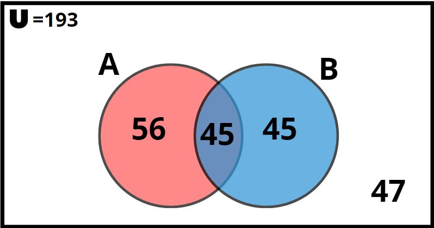
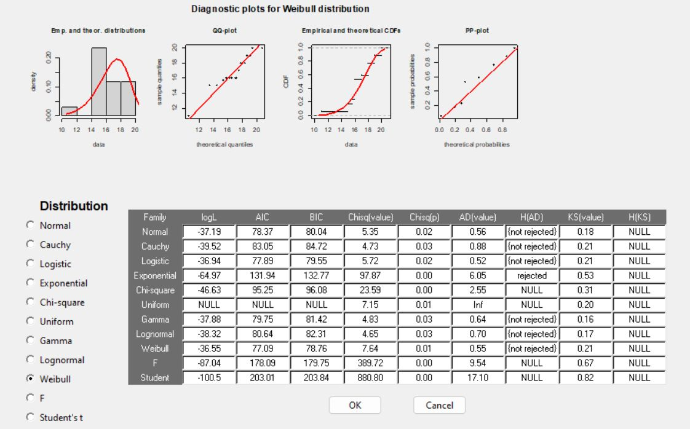
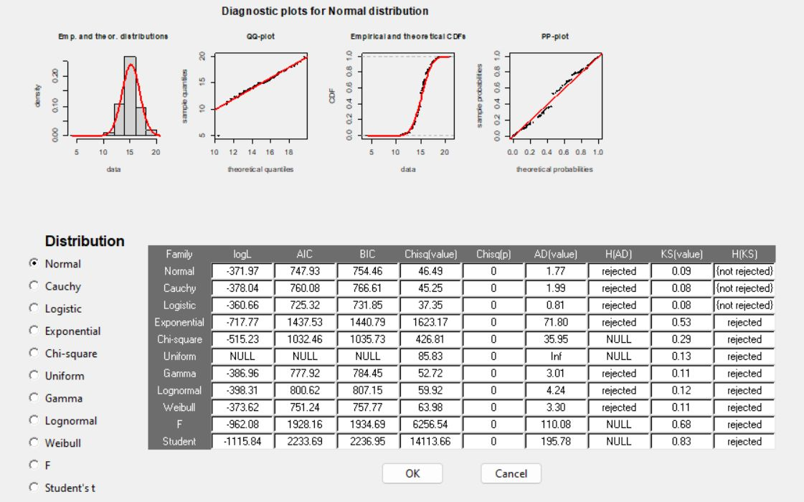

---
output:
  html_document:
    toc: true
    toc_float: true
    number_sections: no
  pdf_document:
    toc: yes
---

<center><span style="font-size: 25px;">**EL USO, PREFERENCIA DE DISPOSITIVOS ELECTRÓNICOS Y SU IMPACTO EN LA PRODUCTIVIDAD Y EL DESEMPEÑO ACADÉMICO SEGÚN EL PERFIL DE LOS ALUMNOS DE PREGRADO DE LA UNIVERSIDAD DE INGENIERÍA Y TECNOLOGÍA EN EL PERíODO 2023-I.**</span></center>

# **1 Introducción**

## **1.1 Importancia y Justificación**

El desempeño académico de los estudiantes universitarios puede verse influenciados por la preferencia y el uso de ciertos dispositivos electrónicos. Este estudio se centra en identificar y analizar el impacto que produce los dispositivos electrónicos en el desempeño académico, de esta manera recolectar información relevante para su correcto análisis.

## **1.2 Relevancia**

En los últimos años la presencia de los dispositivos electrónicos en el sector de la educación ha ido en aumento por lo que es crucial realizar un análisis sobre como su uso, preferencia e impacto de los dispositivos electrónicos se relaciona con la productividad y el desempeño académico de los estudiantes de la Universidad de Ingeniería y Tecnología. Este estudio proporcionara información relevante a la universidad ya sea para promover o mejor el correcto uso de estos dispositivos en el proceso de aprendizaje. De igual manera estos resultados podrán servir como base para el desarrollo de políticas y programas que promuevan el uso responsable y efectivo de los dispositivos electrónicos en alumnos de pregrado.

## **1.3 Objetivos**

### **1.3.1 Objetivo general**

Determinar el impacto del uso de dispositivos electrónicos en la productividad académica de los estudiantes de pregrado de la Universidad de Ingeniería y Tecnología.

### **1.3.2 Objetivo especifico**

-   Determinar las principales aplicaciones que utilizan los estudiantes según su perfil académico en la Universidad de Ingeniería y Tecnología y su relación con el desarrollo académico.

-   Comparar la frecuencia del uso de los dispositivos electrónicos con los promedios ponderados de los estudiantes de la Universidad de Ingeniería y Tecnología.

-   Verificar la influencia de la cantidad de dispositivos electrónicos en el desempeño académico en los estudiantes de la Universidad de Ingeniería y Tecnología.

-   Validar la satisfacción de los estudiantes al utilizar dispositivos electrónicos en las distintas áreas académicas y como se relaciona con las notas obtenidas.

-   Contrastar la relación entre la marca del dispositivo que usa con mayor frecuencia según el ciclo en el que se encuentra   con el costo de estos equipos en el desempeño académico.

| **Apellidos y nombres**                  | **Código** |
|:-----------------------------------------|:----------:|
| Pillaca Huaccachi, Marco Paul            | 202120444  |
| Huamani Gamboa, Josue Fernando           | 202020084  |
| Mallqui Durand, Jhon Deyver Max          | 202120341  |
| Mazzetti Valles, Eric Emmanuel           | 201910395  |
| Malqui Vicuña, Greysi Nataly **(líder)** | 202120342  |


<center>*Barranco, `r format(Sys.Date(), '%d de %B del año %Y')`*</center>

## **1.4 Contexto**

Vivimos en una era digital donde los dispositivos electrónicos desempeñan un papel fundamental en nuestra vida diaria, incluyendo el ámbito educativo. La tecnología se ha convertido en una herramienta omnipresente en la educación, y su uso adecuado puede tener un impacto significativo en el rendimiento académico de los estudiantes. En este contexto, es importante comprender cómo los estudiantes utilizan los dispositivos electrónicos, cuáles son sus preferencias y cómo estas elecciones pueden afectar su productividad y desempeño académico. El estudio se enmarca en este contexto tecnológico en constante evolución, donde se busca explorar las dinámicas y tendencias relacionadas con el uso de dispositivos electrónicos en el entorno universitario. Esto permitirá obtener información valiosa para adaptar las prácticas educativas y promover un uso efectivo de la tecnología en beneficio de los estudiantes de pregrado.

## **1.5 Base de datos** 

Para comenzar con la lectura de datos es necesario instalar y leer las siguientes librerías como: **readr**, **dplyr**, **car**, **DescTools**, **raster** y **ggplot2**, estas librerías nos servirán para realizar un mejor manejo de la base de datos, variables, gráficas, descriptores estadístico, descriptores gráficos y un mejor análisis probabilista. 

```{r,eval = FALSE, message = TRUE, include = FALSE}
install.packages("readr") 
install.packages("dplyr")
install.packages("car")
install.packages("DescTools")
install.packages("raster")
install.packages("ggplot2")
install.packages("tidyr")
install.packages("rriskDistributions")
install.packages("fastGraph")
```

```{r,echo = TRUE, message = TRUE, include = FALSE}
library("readr")
library("dplyr")
library("car")
library("DescTools")
library("raster")
library("ggplot2")
library("knitr")
library("tidyr")
library("tidyverse")
library("rriskDistributions")
library("MASS")
library("fastGraph")
```

Una vez instalada y ejecutas las librerías procedemos a leer nuestra base de datos, el cual se encuentra en un formato **csv**, asimismo lo guardamos con el nombre de **Datos** para fines prácticos con la manipulación e interacción de variables y observaciones. 

```{r, message = FALSE}
Datos <- read_csv("Base_de_datos_limpio.csv")
```

Luego de lo realizado anteriormente, verificamos la cantidad de datos completos e incompletos de nuestra base de datos:
```{r}
sum(is.na(Datos))
sum(!is.na(Datos))
```

Asimismo la cantidad de casos completos e incompletos:
```{r}
sum(complete.cases(Datos)) 
sum(!complete.cases(Datos))
```
# **2 Análisis descriptivo**

Análisis entre los aplicativos que se utiliza y como estos influyen en el promedio ponderado. 

```{r, echo = FALSE}

par(mar = c(7, 4, 4, 4) + 0.1)

boxplot(PROMEDIO ~ APLICACIONES, 
        data = Datos, 
        main = "Gráfico(2.1) 
        Relacion entre las aplicaciones y el promedio ponderado",
        xlab = "", 
        ylab = "Promedio ponderado",
        cex.axis = 0.6,
        las = 2,
        col = c("lightblue", "lightgreen", "lightyellow"))
title(xlab = "Aplicaciones", line = 5, adj = 0.5)
```


Análisis entre los minutos que se utilizan los dispositivos tecnológicos y el promedio pondera:

```{r,echo = FALSE}
regre<-plot(Datos$PROMEDIO~Datos$MINUTOS,pch=20,col=c("black","red"),main="Gráfica 2.2
            Promedio vs. Minutos",xlab="Minutos",ylab="Promedio")
abline(lm(Datos$PROMEDIO~Datos$MINUTOS),col="blue",lty=1)
```

La función de la regresión lineal seria la siguiente:

$$
y = 0.002202 x + 14.510415
$$
Finalmente se  concluye que el tiempo en los que se utilizan los dispositivos tecnológicos para fines educativos no influye en los promedios que un estudiante pueda obtener.

Relación entre la cantidad de aplicaciones que tiene un estudiante en su dispositivo tecnológico y el promedio ponderado

```{r,echo = FALSE}
ggplot(Datos, aes(x = ORDENM, y = CANTDISPOSITIVOS)) +
  geom_violin(fill = "lightblue", color = "black") +
  labs(title = "                                                           Gráfica(2.3) 
                  Relacion entre la cantidad de aplicaciones y el promedio ponderado",
       x = "Orden de Mérito",
       y = "Cantidad de Dispositivos")
```

La cantidad de dispositivo que utilizan los estudiantes no influye en el orden de merito que pueda alcanzar. Esto sugiere que no existe una relación entre la cantidad de dispositivos y el orden de mérito, es decir, que tener más o menos dispositivos no garantiza un mejor o peor promedio ponderado y, por tanto, no influye en el orden de mérito.

Relación entre Área académica donde frecuenta utilizar sus dispositivos tecnologicos y la mayor nota que obtuvo. 

```{r, echo=FALSE}
boxplot(MAXNOTA ~ ÁREA, 
        data = Datos, 
        main = "Gráfica 4.0
        Área académica en el que se obtuvo mayor nota",
        xlab = "Áreas académicas", 
        ylab = "Maxima nota obtenida",
        cex.axis = 0.6,
        las = 1,
        col = c("lightblue", "lightgreen", "lightyellow"))

```

A partir de la gráfica anterior podemos observar que la máxima nota obtenida en una área académica al utilizar dispositivos electrónicos son demasiadas altas, en conclusión los dispositivos electrónicos son de utilidad para obtener notas altas en las diferentes área académicas.

# **3 Análisis probabilista**

## **3.1 Probabilidades empíricas**

**Variables de análisis:**

- Dispositivos tecnológicos
- Promedio ponderado

### **3.1.1 Dispositivos tecnológicos**

**Cantidad de estudiantes que prefieren utilizar un dispositivo tecnológico para fines académicos.**

```{r,echo = FALSE, results = 'hide'}
(Total_casos <- sum(table(Datos$DISPOSITIVO)))
```

$$ U = 193 $$

**Tabla de frecuencia y la función de probabilidad sobre la preferencia de los estudiantes por un dispositivo tecnológico.**

```{r, echo=FALSE}
Cantidad <- table(Datos$DISPOSITIVO)
Probabilidad <- round(Cantidad/Total_casos,4)
cbind(Cantidad,Probabilidad)
```

**Eventos atómicos:**

L: Seleccionar un estudiante que utiliza una laptop para fines académicos de una muestra de 193.
  $$ L = 101 $$

S: Seleccionar un estudiante que utiliza un smartphone para fines académicos de una muestra de 193.
  $$ S = 82 $$

T: Seleccionar un estudiante que utiliza una tablet para fines académicos de una muestra de 193.
 $$ T = 10 $$
**Gráfica:**

<center>{width="300px"}</center>

A partir de la gráfica se puede observa que los sucesos son incompatibles debido a que si los estudiantes utilizan una laptop como dispositivo principal para fines académicos no pueden utilizar los smartphone o tablets.

**Probabilidad:**

- Determinar que tan probable es que un estudiante utilice una laptop para fines académico.
  $$ P(L) = 0.5233 $$

- Determinar que tan  probable es que un estudiante  utilice un smartphone para fines académicos
 $$ P(S) = 0.4249 $$

- Determinar que tan  probable es que un estudiante  utilice una tablet para fines académicos.
 $$ P(T) = 0.0518 $$

- Determinar que tan  probable es que un estudiante  utilice una laptop y un smartphone para fines académicos.

```{r,echo = FALSE, results = 'hide'}
evento_l_intersección_s <- sum(Datos$DISPOSITIVO == "Laptop" & Datos$DISPOSITIVO == "Smartphone")
(probabilida_evento_l_intersección_s <- round((evento_l_intersección_s/Total_casos),4))
```

 $$ P(L ∩ S)  = P(L) + P(S) - P(L ∪ S)  $$
$$ P(L ∩ S)  = 0.5233 + 0.4249 - 0.9482 $$
$$ P(L ∩ S)  = 0 $$

Se observa que la intersección es nula por lo que se corrobora que se trata de eventos incompatibles. 


- Determinar que tan  probable es que un estudiante  utilice una laptop o un smartphone para fines académicos.

```{r,echo = FALSE, results = 'hide'}
evento_l_union_s <- sum(Datos$DISPOSITIVO == "Laptop" | Datos$DISPOSITIVO == "Smartphone")
(probabilida_evento_l_union_s <- round((evento_l_union_s/Total_casos),4))
```
$$ P(L ∪ S)  = P(L) + P(S) $$
$$ P(L ∪ S)  = 0.5233 + 0.4249 $$
$$ P(L ∪ S)  = 0.9482 $$


- Determinar que tan  probable es que un estudiante **no** utilice una tablet para fines académicos.

```{r,echo = FALSE, results = 'hide'}
evento <- sum(Datos$DISPOSITIVO  == "Tablet")
(probabilida_evento <- round((evento/Total_casos),4))
evento_no_tablet <- sum(Datos$DISPOSITIVO  != "Tablet")
(probabilida_evento_no_tablet <- round((evento_no_tablet/Total_casos),4))
```

 $$ P(T') = 1 - P(T) $$
$$ P(T') = 1 -  0.0518 $$
$$ P(T') = 0.9482$$

### **3.1.2 Promedio ponderado**

Debido a que el promedio tiene una variación de datos, clasificamos el promedio ponderado según la escala de notas en el Perú utilizando **Excelente**, **Satisfactorio**, **Regular** y **Deficiente**.

| **Rango de notas** | **Clasificación** |
|:-------------------|:-----------------:|
|       [18:20]      |     Excelente     |
|       [14:17]      |    Satisfactorio  |
|       [11:13]      |     Regular       |
|       [0:10]       |    Deficiente     |


**Cantidad de estudiantes encuestados en UTEC:**

```{r,echo = FALSE, results = 'hide'}
(Total_casos <- sum(table(Datos$PROMEDIO))) 
```
$$ U = 193 $$
```{r,echo = FALSE, results = 'hide'}
Datos$ESCALA = recode(round(Datos$PROMEDIO)," 18:20 = 'Excelente' ; 14:17 = 'Satisfactorio' ; 11:13 = 'Regular' ; 0:10 = 'Deficiente' ")
```
**Tabla de frecuencia y la función de probabilidad sobre el promedio ponderado de los estudiantes de UTEC**

```{r,echo = FALSE}
Frecuencia <- table(Datos$ESCALA)
Probabilidad <- round((Frecuencia/Total_casos),4)
cbind(Frecuencia,Probabilidad)
```
**Eventos atómicos**

D: Seleccionar un estudiante que tenga una nota deficiente de una muestra de 193.
 $$ D = 1 $$
E: Seleccionar un estudiante que tenga una nota Excelente de una muestra de 193.
 $$ E = 15 $$
R: Seleccionar un estudiante que tenga una nota Regular de una muestra de 193.
 $$ R = 21 $$
S: Seleccionar un estudiante que tenga una nota Satisfactorio de una muestra de 193.
 $$ S = 156 $$
**Probabilidad**

- Determinar que tan probable es que un estudiante de UTEC tenga una nota Deficiente.
  $$ P(D) = 0.0052 $$

- Determinar que tan probable es que un estudiante de UTEC tenga una nota Excelente.
 $$ P(E) = 0.0777 $$

- Determinar que tan probable es que un estudiante de UTEC tenga una nota Regular.
 $$ P(R) = 0.1088 $$
- Determinar que tan probable es que un estudiante de UTEC tenga una nota Satisfactorio.
 $$ P(S) = 0.8083 $$

### **3.1.3 Análisis del promedio ponderado con el dispositivo que utiliza**

```{r,echo=FALSE}
addmargins(table(Datos$ESCALA,Datos$DISPOSITIVO))
```
- Determinar la probabilidad de que el estudiante tenga un nota Regular.

```{r,echo = FALSE, results = 'hide'}
round((21/193),4)
```
$$ P(A) = 0.1088$$
- Determinar la probabilidad de que el estudiante tenga un nota satisfactoria y utilice smarphone.

```{r,echo = FALSE, results = 'hide'}
round((63/193),4)
```
$$ P(A ∩ B ) = 0.3264$$
- Determinar la probabilidad de que el estudiante tenga un nota excelente o utilice laptop.

```{r,echo = FALSE, results = 'hide'}
round(((101+9)/193),4)
```
$$ P(A ∪ B ) = 0.5699$$

-  Determinar la probabilidad de que el estudiante no tenga una nota satisfactoria ni utilice tablet.
```{r,echo = FALSE, results = 'hide'}
round((((1+15+21)+(101-84)+(82-63))/193),4)
```

$$ P(A' U B') = 0.3782$$

## **3.2 Probabilidad condicional**

### **3.2.1 Eventos dependientes**

Se escogieron las siguientes variables de análisis: 

- Cantidad de dispositivos tecnológicos.
- Cantidad de minutos al día que utiliza el dispositivo tecnológico.

**Definimos nuestros eventos** 

A: Seleccionar un estudiante que utiliza mas de 320 minutos al día su dispositivo tecnológico para fines educativos de una muestra de 193 estudiantes.

```{r,echo = FALSE, results = 'hide'}
(evento_A <- sum(Datos$MINUTOS > 320))
```

 $$ A = 71 $$


B: Seleccionar un estudiante cuyo número de dispositivos tecnológicos que utiliza es menos a 3.

```{r,echo = FALSE, results = 'hide'}
(evento_B <- sum(Datos$CANTDISPOSITIVOS < 3))
```
 $$ B = 73 $$
 
**Gráficar un diagrama de Euler:**

```{r,echo = FALSE, results = 'hide'}
(evento_A_interseccion_B <- sum(Datos$MINUTOS > 320 & Datos$CANTDISPOSITIVOS < 3))
(total_eventos <- length(Datos$MINUTOS))
(a_menos_b <- evento_A - evento_A_interseccion_B) 
(b_menos_a <- evento_B - evento_A_interseccion_B)
```
 $$ A-B = 46 $$
$$ B-A = 48 $$
$$ P(A ∩ B ) = 25 $$
<center>{width="300px"}</center>
   
   
**Determinar las probabilidades de cada evento:**    

Probabilidad de seleccionar un estudiante que utiliza mas de 320 minutos al día su dispositivo tecnológico para fines educativo.

```{r,echo = FALSE, results = 'hide'}
P_evento_A <- evento_A / total_eventos
round(P_evento_A,4)
```
$$ P(A) = 0.3679 $$

Probabilidad de seleccionar un estudiante cuyo número de dispositivos tecnológicos que utiliza es menos a 3.

```{r,echo = FALSE, results = 'hide'}
P_evento_B <- evento_B / total_eventos
round(P_evento_B,4)
```
$$ P(B) = 0.3782 $$

Probabilidad de seleccionar un estudiante que utiliza mas de 320 minutos al día su dispositivo tecnológico para fines educativo y utiliza menos de 3 dispositivos.

```{r,echo = FALSE, results = 'hide'}
P_evento_A_interseccion_B <- evento_A_interseccion_B/total_eventos
round(P_evento_A_interseccion_B,4)
```
$$ P(B ∩ A ) = 0.1295 $$

**Verificamos el cumplimiento de independencia:**

Para el cumplimiento de independencia se debe de cumplir las siguientes condiciones:

- **Primera condición:**


$$P(A ∩ B) = P(A)*P(B)$$
$$ 0.1295 = 0.3679*0.3782$$
```{r,echo = FALSE, results = 'hide'}
round((P_evento_A * P_evento_B),4)
```

$$0.1295 ≠ 0.1391$$

- **Segunda condición:**

$$P(A/B) =  P(A)$$
```{r,echo = FALSE, results = 'hide'}
(P_A_dado_B <- round(P_evento_A_interseccion_B / P_evento_B, 4))
(round(P_evento_A,4))
```

$$0.3425 ≠  0.3679$$

- **Tercera condición:**


```{r,echo = FALSE, results = 'hide'}
(P_B_dado_A <- round(P_evento_A_interseccion_B / P_evento_A, 4))
(round(P_evento_B,4))
```
$$P(B/A) =  P(B)$$

$$0.3521 ≠ 0.3782$$

Se puede observar que los eventos son dependientes debido a que no cumplen ninguna de las relaciones anteriores.


### **3.2.2 Eventos dependiente**


Se escogieron las siguientes variables de análisis: 

- Dispositivo tecnológico que utilizan los estudiantes.
- Promedio ponderado de los estudiantes.

**Definimos nuestros eventos:**

A: Seleccionar un estudiante que utiliza una laptop como su dispositivo tecnológico para fines educativos de una muestra de 193 estudiantes.

```{r,echo = FALSE, results = 'hide'}
(evento_A <- sum(Datos$DISPOSITIVO == "Laptop"))
```
$$ A = 101 $$
B: Seleccionar un estudiante cuyo promedio ponderado sea mayor a 15 de una muestra de 193 estudiantes.

```{r,echo = FALSE, results = 'hide'}
(evento_B <- sum(Datos$PROMEDIO > 15))
```
$$ B = 90 $$
**Graficar un diagrama de Euler: **

```{r,echo = FALSE, results = 'hide'}
(evento_A_interseccion_B <- sum(Datos$DISPOSITIVO == "Laptop" & Datos$PROMEDIO > 15))
(total_eventos <- length(Datos$MINUTOS))
(a_menos_b <- evento_A - evento_A_interseccion_B) 
(b_menos_a <- evento_B - evento_A_interseccion_B)
```
$$ A-B = 56 $$
$$ B-A = 45 $$
$$ P(A ∩ B ) = 45 $$
<center>{width="300px"}</center>


**Determinar las probabilidades de cada evento:**   

Probabilidad de seleccionar un estudiante que utiliza una laptop como su dispositivo tecnológico para fines educativos: 

```{r,echo = FALSE, results = 'hide'}
P_evento_A <- evento_A / total_eventos
P_evento_A
```
$$ P(A) = 0.5233161$$

Probabilidad de seleccionar un estudiante cuyo promedio ponderado sea mayor a 15: 

```{r,echo = FALSE, results = 'hide'}
P_evento_B <- evento_B / total_eventos
P_evento_B
```
$$ P(B) = 0.4663212$$


Probabilidad de seleccionar un estudiante que utiliza una laptop como su dispositivo tecnológico para fines educativos y tena un promedio ponderado mayor a 15: 

```{r,echo = FALSE, results = 'hide'}
P_evento_A_interseccion_B <- evento_A_interseccion_B/total_eventos
P_evento_A_interseccion_B
```

$$ P(A ∩ B) = 0.2331606$$
**Verificamos el cumplimiento de independencia:**

Verificamos el cumplimiento de la siguiente formula para validar la independencia: 

$$P(A ∩ B) = P(A)*P(B)$$
$$0.2331606 = 0.5233161*0.4663212$$
```{r,echo = FALSE, results = 'hide'}
P_evento_A * P_evento_B
```

$$0.2331606 ≠ 0.2440334$$


Podemos afirmar que se tratan de eventos dependiente debido a que no cumple con la formula anteriormente mencionada porque ambos eventos depende uno del otro.

A partir de los dos resultados anteriores podemos darnos cuenta que nuestras probabilidades siempre dependen uno de otros. 


### **3.2.3 Teorema de Bayes y Morgan**

**Teorema de Bayes:**

La probabilidad de seleccionar un estudiante que utiliza laptop como su dispositivo principal para fines educativos:

```{r,echo = FALSE, results = 'hide'}
P_evento_A #P(A)
```
$$P(A) = 0.5233161$$

La probabilidad de seleccionar un estudiante que tengo un promedio mayor a 15 si utiliza laptop:

```{r,echo = FALSE, results = 'hide'}
(P_evento_B_si_evento_A <- (P_evento_A_interseccion_B/P_evento_A)) #P(A|B)
```

$$P(A|B) = P(A ∩ B)/P(B)$$

$$P(A|B) = 0.4455446$$


La probabilidad de seleccionar un estudiante que tengo un promedio mayor a 15 si utiliza otro dispositivo es:
 
```{r,echo = FALSE, results = 'hide'}
(P_evento_A_si_evento_B <- (P_evento_A_interseccion_B/P_evento_B)) #P(B|A)
```

$$P(B|A) = P(B ∩ A)/P(A)$$  
$$P(B|A) = 0.5$$ 
La probabilidad de seleccionar un estudiante que tengo un promedio mayor a 15:

```{r,echo = FALSE, results = 'hide'}
round(P_evento_B,4) #P(B) 
round((Probabilidad_B <- 0.5233161*0.4455446/0.5),4) #P(B)
```

$$P(A|B) = P(B|A)*P(A) / P(B)$$
$$P(B) = P(B|A)*P(A) / P(A|B)$$
$$P(B) = 0.4455446*0.5233161 / 0.5$$
$$P(B) = 0.4663$$
**Leyes de Morgan:**

La probabilidad de seleccionar un estudiante que no tenga un promedio mayor a 15 y no utilice laptop:

```{r,echo = FALSE, results = 'hide'}
1 - (sum(Datos$DISPOSITIVO == "Laptop" | Datos$PROMEDIO > 15))/Total_casos
```

$$ P(∼A ∩ ∼B) = 1 - P(A U B)$$
$$ P(∼A ∩ ∼B) = 0.2435233$$

## **3.3 Variable aleatoria discreta**

### **3.3.1 Cantidad de Aplicaciones**

**Construir nuestra tabla de frecuencia y probabilidades:**

```{r,echo = FALSE, results = 'hide'}
fi <- table(Datos$CANAPLI)
pi <- prop.table(fi)
cbind(fi,pi)
```

**Definir nuestro espacio muestral:**

X: Número de cursos donde los estudiantes hacen uso de sus dispositivos tecnológicos.

$$ Rx = {0,1,2,3,4,5,6,7,8} $$

**Definir nuestra función de probabilidad:**

```{r,echo = FALSE, results = 'hide'}
fi = table(Datos$CANAPLI)
(pi = round(prop.table(fi),4))
```

**Graficar nuestro diagrama de densidad:**

```{r,echo = FALSE, results = 'hide'}
hist(Datos$CANAPLI, col = "cyan", border = "black", main = " Gráfico 1
     Distribución de Aplicaciones", xlab = "Cantidad de aplicaciones", ylab = "Frecuencia")
```
Podemos observar que se pueda tratar de una distribución binomial debido a la concentración de datos centrados.

**Determinar nuestra esperanza y varianza:**

```{r,echo = FALSE, results = 'hide'}
X = c(0:8)
P = c(0.0155 ,0.0104 ,0.0725 ,0.1347 ,0.2435 ,0.2124 ,0.0933 ,0.0725 ,0.1451)

(E = sum(X*P))
(V = sum(X^2*P)-E^2)
```

$$E\left(X\right)\:=\:\sum _{i=1}^k\:\left(Xi\:.\:Pi\right)$$
$$E\left(X\right)\: =  4.82365 $$
$$V\left(X\right)\:=\:E\left(X^2\right)\:-\:\left(E\left(X\right)\right)^2$$

$$V\left(X\right)\:=3.649283$$
**Determinar el parámetro de nuestra distribución:**


$$ n\:=\:tamaño\:de\:la\:muestra $$
$$ p\:=\:probabilidad\:de\:exito $$

$$ n\:=\:193 $$

- A partir de la esperanza: 

$$E\left(X\right)\:=\:n\cdot p$$
$$4.82365=\:193\cdot p$$

```{r,echo = FALSE, results = 'hide'}
round((4.82365 / 193),4)
```

$$p=0.025$$
**Distribución de Binomial:**
```{r,echo = FALSE, results = 'hide'}
n = 193
p = 0.025
```

$$X\:∼\:B\left(193,0.025\right) $$
**Graficar nuestra distribución:**

```{r,echo = FALSE, results = 'hide'}
x <- 0:8

prob_condicion <- dbinom(x, 193, 0.025)

plot(x, prob_condicion, type = "h", xlab = "X", ylab = "P(X)", main = "Gráfico 2
     Función de la distribución binomial n=193, p=0.0155",lwd = 3,col = "orange")
```
En este caso asumimos que la gráfica se asemeja a una distribución Binomial, para efectos de aplicativos del trabajo se considerara a X con una Binomial.

**Planteamientos de ejercicios:**

a) Un programador de aplicativos educativos desea realizar un estudio para saber la probabilidad de la cantidad de estudiantes de UTEC, que tienen más de un aplicativo educativo instalado. Además, se sabe que realiza la encuesta a 193 alumnos.

$$P(X ≥ 2)$$

```{r,echo = FALSE, results = 'hide'}
round((1- pbinom(1, n, p)),4)
```

$$P(X ≥ 2) = 0.9551$$
b) La Universidad de Ingeniería y Tecnología desea saber la probabilidad de cuántos alumnos utilizan menos de 3 aplicativos educativo con la finalidad de buscar estrategias para incentivar a los alumnos a utilizar aplicaciones educativas. 

$$P(X < 3)$$

```{r,echo = FALSE, results = 'hide'}
round((pbinom(2, n, p)),4)
```
$$P(X < 3) = 0.1369 $$
c) El equipo de Bienestar Estudiantil está haciendo un recorrido por la universidad y está buscando a los alumnos que tiene instalados exactamente 4 aplicaciones.

$$P(X = 4)$$

```{r,echo = FALSE, results = 'hide'}
round((dbinom(3, n, p)),4)
```
$$P(X = 4) = 0.1501$$

### **3.4.2 Cantidad de cursos que lleva en el ciclo 2023-1**

**Construir nuestra tabla de frecuencia y probabilidades:**

```{r,echo = FALSE, results = 'hide'}
fi <- table(Datos$CURSOS)
pi <- prop.table(fi)
cbind(fi,pi)
```

**Definir nuestro espacio muestral:**

X: Número de cursos donde los estudiantes hacen uso de sus dispositivos tecnológicos.

$$ Rx = {1,2,3,4,5,6,7,8} $$

**Definir nuestra función de probabilidad:**

```{r,echo = FALSE, results = 'hide'}
fi = table(Datos$CURSOS)
(pi = round(prop.table(fi),4))
```

**Graficar nuestro diagrama de densidad:**

```{r,echo = FALSE, results = 'hide'}
hist(Datos$CURSOS, col = "steelblue", border = "black", main = "Gráfico 3
     Distribución de Cursos", xlab = "Cursos", ylab = "Frecuencia")
```
Podemos observar que se pueda trata de una distribución de Poisson debido a la concentración de datos en una parte de la gráfica, específicamente cuando los cursos son 6.

**Determinar nuestra esperanza y varianza:**

```{r,echo = FALSE, results = 'hide'}
X = c(1:8)
P = c(0.0207 ,0.0052, 0.0155 ,0.0674 ,0.2124 ,0.4611 ,0.2021 ,0.0155)

(E = sum(X*P))
(V = sum(X^2*P)-E^2)
```
$$E\left(X\right)\:=\:\sum _{i=1}^k\:\left(Xi\:.\:Pi\right)$$
$$E\left(X\right)\: = 5.7145 $$
$$V\left(X\right)\:=\:E\left(X^2\right)\:-\:\left(E\left(X\right)\right)^2$$

$$V\left(X\right)\:=1.40839$$

**Determinar el parámetro de nuestra distribución:**


$$V\left(X\right)\:=\:E\left(X\right)\:=\:λ$$
$$1.40839 ≠ 5.7145 = λ$$
Se puede observar que el parametro landa es diferente por lo que no es completamente una distribución de Poisson, pero para nuestro informe asumiremos que se trata de una distribución poisson. 

$$λ = 5.7145$$
Distribución de Poisson:

$$X\:∼\:P\left(5.7145\right)) $$


**Graficar nuestra distribución:**

```{r,echo=FALSE}
shadeDist(6,"dpois",5.7145, main = "Gráfico 4
          Distribución de Cursos", xlab = "Cantidad de aplicaciones")
```
En este caso asumimos que la gráfica se asemeja a una distribución Poisson, para efectos de aplicativos del trabajo se considerara a X con una Poisson.

**Planteamientos de ejercicios:**

- Determinar la probabilidad de que un estudiante lleve exactamente 3 cursos actualmente. 

$$P(X = 3)$$
```{r,echo = FALSE, results = 'hide'}
round(dpois(3,5.7145),4)
```

$$P(X = 3) = 0.1026$$
- Determinar la probabilidad de que un estudiante lleve al menos 5 cursos actualmente.

$$P(X >= 5)$$

```{r,echo = FALSE, results = 'hide'}
round(1-(ppois(4, 5.7145)),4)
```

$$P(X >= 5) = 0.6749$$
- Determinar la probabilidad de que un estudiante lleve menos de 3 cursos actualmente.

$$P(X < 3)$$

```{r,echo = FALSE, results = 'hide'}
round((ppois(2, 5.7145)),4)
```

$$P(X < 3) = 0.076$$

## **3.4 Variable aleatoria continua**

### **3.4.1 Máxima nota obtenida**

**Determinar nuestra variables aleatoria:**

**Máxima nota obtenida de los estudiantes de UTEC que tienen una frecuencia poca en el uso de dispositivos tecnológicos**

```{r,echo = FALSE, results = 'hide'}
notas_altas <- vector(mode = "numeric", length = 0)

for (i in 1:nrow(Datos)) {
  if (Datos$FRECUENCIA[i] == "Poco") {
    notas_altas <- c(notas_altas, Datos$MAXNOTA[i])
  }
}
```

**Verificamos a la distribución que se pueda asemejar:**

```{r, include=FALSE}
fit.cont(notas_altas)
```

<center>{width="300px"}</center>

*Definir la hipótesis nula y alterna*

$$H0\:=\:Hipótesis\:Nula$$

$$H1\:=\:Hipótesis\:alterna$$

H0: La distribución de la máxima nota obtenida de los estudiantes de UTEC que tienen una frecuencia poca en el uso de dispositivos tecnológicos se aproxima a una distribución de Weibull.

H1: La distribución de la máxima nota obtenida de los estudiantes de UTEC que tienen una frecuencia poca en el uso de dispositivos tecnológicos es diferente a una distribución de Weibull.

-Valor de AD(value) obtenida mediante Anderson-Darling

$$AD(value) = 0.56 $$
-Nivel de significancia
$$α = 0.5$$

$$AD(value)>α$$
Las pruebas realizadas demuestran que se pueda tratarse de distribuciones como  la normal, weibull, gamma, logistica y entre otros, pero al momento de realizar las comprobaciones de promedio y varianza el que mas acerco fue la de Weibull. Asimismo Se observa que AD(value) es mayor al nivel de significancia por lo tanto se puede garantizar que se trata de una distribución de Weibull.

**Realizamos el Gráfico de densidad:**

```{r,echo=FALSE}
densidad <- density(notas_altas)
plot(densidad, xlab = "Valores", ylab = "Densidad", main = "Gráfico 5 
     Cuadro de densidad sobre la maxima nota",col = "black", lwd = 4)

x <- densidad$x
y <- densidad$y
polygon(x, y, col = "orange")
```
Se puede observar observar a simple vista que se trata de una distribución de Weibull debido a que la mayor cantidad de la densidad se concentra en la parte derecha aproximadamente entre los rangos de 14 a 20 lo cual se podría determinar como Weibull asimétrica hacia la izquierda.  

**Realizamos la comprobación:**

-Mediante la Esperanza:

```{r,echo = FALSE, results = 'hide'}
fit <- fitdistr(notas_altas, "weibull")
(shape <- fit$estimate["shape"])
(scale <- fit$estimate["scale"])
```

```{r,echo = FALSE, results = 'hide'}
alpha = 9.428813
beta = 17.7124 

esperanza <- beta * gamma(1 + 1/alpha)
print(esperanza)
```

```{r,echo = FALSE, results = 'hide'}
(esperanza <- mean(notas_altas))
```
$$ E\left(\overline{X}\right)\:=\:E\left(X\right) $$
$$ 16.80794 ≈  16.80588 $$

-Mediante la variación:

```{r,echo = FALSE, results = 'hide'}
varianza <-beta^2 * (gamma(1 + (2/alpha)) - (gamma(1 + (1/alpha)))^2)
print(varianza)
```

```{r,echo = FALSE, results = 'hide'}
(varianza = (sd(notas_altas))^2)
```
$$ Var\left(\overline{X}\right)\:=\:Var\left(X\right) $$

$$ 4.568838 ≈  4.940588 $$

Podemos observa que tanto la esperanza como la varianza proporcionada por la distribución de Weibull son relativamente iguales con lo hallado a partir de nuestra variable por ende se concluye que se trata de una distribución de Weibull.

**Formulación de la distribución:**

$$ α = 9.428813$$

$$ β = 17.7124$$

$$ X ∼ W eibull(α, β)$$

$$ X ∼ W eibull(9.428813, 17.7124)$$
**Planteamientos de ejercicios:**

En un estudio realizado en la Universidad Tecnológica de UTEC, se recopilaron datos sobre la nota máxima que obtiene un estudiantes al utilizar los dispositivos tecnológicos con poca frecuencia. Se encontró la máxima nota obtenida que sigue una distribución de Weibull con parámetros α = 9.43 y β = 17.71.

- Determinar la media de la distribución de Weibull para nota máxima obtenida por estudiantes de UTEC al utilizar su dispositivo tecnológico con una poca frecuencia. 

```{r,echo = FALSE, results = 'hide'}
alpha <- 9.43
beta <- 17.71

round((beta * gamma(1 + 1/alpha)),4)
```
$$ E(X) = 16.8058 $$

- Determinar la probabilidad de que un estudiante obtenga una nota máxima menor o igual a 18

```{r,echo = FALSE, results = 'hide'}
round((pweibull(18,alpha,beta)),4)
```

$$ P(X ≤ 18)$$
$$ P(X) = 0.6882 $$
```{r,echo = FALSE, results = 'hide'}
shadeDist(18, "dweibull", alpha,beta, lower.tail=T)
```


- Determinar la probabilidad de que un estudiante obtenga una nota máxima mayor a 10

```{r,echo = FALSE, results = 'hide'}
round((1 - pweibull(10, alpha, beta)),4)
```
$$ P(X ≥ 10)$$

$$ P(X) = 0.9954 $$
```{r,echo = FALSE, results = 'hide'}
shadeDist(10, "dweibull", alpha,beta, lower.tail=F)
```

- Determinar el valor de la nota máxima tal que la probabilidad de obtener una nota menor o igual a ese valor sea 0.75

```{r,echo = FALSE, results = 'hide'}
round((qweibull(0.75,alpha,beta)),4)
```

$$ Percentil = 0.75 $$

$$ X = 18.3342 $$

### **3.5.2 Promedio ponderado**

**Determinar nuestra variables aleatoria:**

Promedio ponderado obtenido de los estudiantes de UTEC

**Verificamos a la distribución que se pueda asemejar:**

```{r, include=FALSE}
fit.cont(Datos$PROMEDIO)
```

<center>{width="300px"}</center>

*Definir la hipótesis nula y alterna*

$$H0\:=\:Hipótesis\:Nula$$

$$H1\:=\:Hipótesis\:alterna$$

H0: La distribución del promedio ponderado de los estudiantes de UTEC se aproxima a una distribución de Normal.

H1: La distribución del promedio ponderado de los estudiantes de UTEC es diferente a una distribución de Normal.

- Valor de H(KS) obtenida mediante kolmogorov-smirnov.

$$KS(value) = 0.09 $$
-Nivel de significancia

$$α = 0.05$$

$$KS(value)>α$$

Las pruebas realizadas demuestran que se pueda tratarse de distribuciones como  la normal, cauchy y logistica, pero al momento de realizar las comprobaciones de promedio y varianza el que mas acerco fue la normal. Asimismo Se observa que KS(value) es mayor al nivel de significancia por lo tanto se puede garantizar que se trata de una distribución de Normal.

**Realizamos el Grfico de densidad:**

```{r,echo=FALSE}
densidad <- density(Datos$PROMEDIO)
plot(densidad, xlab = "Promedios", ylab = "Densidad Estimada", main = "Gráfico 6
     Cuadro de densidad estimada  los promedios ponderados",col = "black", lwd = 5)

x <- densidad$x
y <- densidad$y
polygon(x, y, col = "cyan")
```
El gráfico tiene una curva similar a la de una campana debido a que es simétrica respecto a su media, ya que los promedios se concentran alrededor de un valor medio y que hay poca variabilidad entre ellos. Se puede observar  que puede tratarse de una distribución  normal o llamada también distribución de Gauss o distribución gaussiana.

**Realizamos la comprobación:**

- Mediante la media y mediana:

```{r,echo = FALSE, results = 'hide'}
mean(Datos$PROMEDIO)
median(Datos$PROMEDIO)
```
$$ E(X) ≈ Me $$


$$15.16502591 ≈ 15$$
- Mediante la esperanza:

```{r,echo = FALSE, results = 'hide'}
fitdistr(Datos$PROMEDIO,"normal")
```
```{r,echo = FALSE, results = 'hide'}
mean(Datos$PROMEDIO)
```
$$E\left(\overline{X}\right)\:=\:E\left(X\right)$$
$$15.16502591 ≈ 15.16503$$
-Mediante la variación:

```{r,echo = FALSE, results = 'hide'}
(varianza_grafico = 1.66253914^2)
(varianza = (sd(Datos$PROMEDIO))^2)
```

$$ Var\left(\overline{X}\right)\:=\:Var\left(X\right) $$
$$ 2.764036 ≈  2.778432 $$

**Formulación de la distribución:**

$$ X  ∼  N(15.17,1.66^2) $$

**Planteamientos de ejercicios:**

- Determinar la probabilidad de obtener un promedio de nota ponderada mayor o igual a 15

$$ P(X >= 15) $$
```{r,echo = FALSE, results = 'hide'}
u = 15.17
s = 1.66
1 - pnorm(15, u, s)
```
$$ P(X >= 15) = 0.5407842$$
```{r,echo = FALSE, results = 'hide'}
shadeDist(15, "dnorm", u, s, lower.tail=F)
```


- Determinar el percentil correspondiente a una nota de 10

$$ Percentil 10$$
```{r,echo = FALSE, results = 'hide'}
qnorm(0.10, u, s)
```
$$ Percentil 10 = 13.04262 $$
- Determinar la probabilidad de obtener una nota entre 14 y 18

```{r,echo = FALSE, results = 'hide'}
pnorm(18, u, s) - pnorm(14, u, s)
```
$$ P( 14 < X < 18)$$
$$ P( 14 < X < 18) = 0.7154246$$
```{r,echo = FALSE, results = 'hide'}
shadeDist(c(14,18) , "dnorm", u, s, lower.tail=F)
```


# 4 conclusiones finales: 


- A partir de nuestra investigación, se pudo concluir que no existe una relación directa entre las aplicaciones que utilizan los estudiantes y su promedio ponderado. Por lo tanto, el uso de aplicaciones no influye en las notas obtenidas durante la carrera universitaria.

- También se concluyó que el tiempo, la frecuencia y los días en los que se utilizan dispositivos tecnológicos para fines educativos no afectan los promedios académicos de los estudiantes.

- Se determinó que la cantidad de dispositivos que utilizan los estudiantes no está relacionada con su orden de mérito. Tener más o menos dispositivos no garantiza un mejor o peor promedio ponderado ni influye en el orden de mérito.

- Se encontró que los dispositivos electrónicos son útiles para obtener notas altas en ciertas áreas académicas, ya que se observaron calificaciones máximas significativamente altas en el uso de estos dispositivos.

- Al analizar los datos, se descubrió que existe una correlación entre la satisfacción al utilizar dispositivos electrónicos y el rendimiento académico en ciertas áreas. Los estudiantes que reportaron tener una alta satisfacción al utilizar estos dispositivos obtuvieron mejores notas en comparación con aquellos con niveles de satisfacción más bajos. 

- Se observó una correlación entre la marca de los dispositivos y el promedio ponderado de los alumnos. Los estudiantes que utilizan dispositivos de la marca HP tienen, en promedio, mejores resultados académicos en comparación con los estudiantes que utilizan otras marcas.

- Se reconoce la importancia de utilizar probabilidades para estimar ciertos sucesos y comprender mejor posibles acontecimientos que puedan ocurrir.

- Se determinó que la mayoría de los eventos estudiados son dependientes, lo que implica que si ocurre un evento, es probable que el otro se vea afectado.

- Se observó que las variables aleatorias discretas utilizadas en el estudio presentan un comportamiento alejado de la realidad, por lo que hacer estimaciones utilizando distribuciones conocidas no garantiza una precisión adecuada en las probabilidades

- Por otro lado, las variables aleatorias continuas, como el máximo de notas y el promedio ponderado, presentaron un comportamiento cercano a las distribuciones de Weibull y Normal, por lo que analizarlas de esta manera resulta adecuado. 

- Comprender la probabilidad del impacto de los dispositivos tecnológicos en los estudiantes universitarios es crucial para tomar decisiones informadas, diseñar estrategias educativas efectivas, promover habilidades digitales, evaluar y mitigar riesgos.
