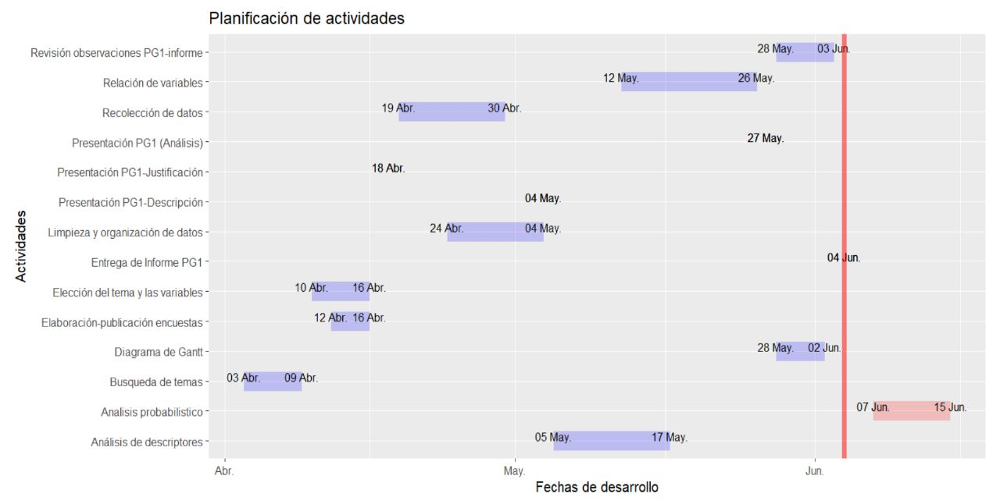

```{r echo=FALSE, results='hide', message = FALSE, warning=FALSE}

options(repos = "http://cran.rstudio.com/")
paquetes <- c("knitr", "xfun", "readr","ggplot2","dplyr", "prettydoc", "modeest", "tidyverse") 

for (paquete in paquetes) {
  if (!require(paquete, character.only = TRUE)) {
    install.packages(paquete)
    library(paquete, character.only = TRUE)
  }
}

```

# **Introducción**

El estrés es una realidad en la vida de los estudiantes universitarios, y su impacto no puede pasarse por alto. Diversos factores pueden influir, como la carga académica, las responsabilidades personales, el mal manejo de tiempo y una mala organización. Ante esta situación, UTEC han reconocido la importancia de abordar la salud mental de sus estudiantes y ha implementado programas de Salud Mental de Bienestar Estudiantil como una estrategia para solucionar esta problemática.

Este informe pretende evaluar el impacto del programa mencionado anteriormente durante el año 2022 en los niveles de estrés de los estudiantes. Para ello, se llevará a cabo un análisis estadístico exhaustivo, considerando variables relevantes que pueden influir en el estrés de los estudiantes, como la participación en el programa, la frecuencia de uso de los servicios de salud mental y otros factores socio económicos y académicos.

## **Relevancia**

La relevancia de este estudio radica en su potencial para generar conocimiento valioso sobre la efectividad del programa de Salud Mental de Bienestar Estudiantil y su impacto en el estrés de los estudiantes. Estos hallazgos permitirán que ellos adapten sus servicios y recursos en función de las necesidades específicas de los estudiantes, mejorando así la calidad de la atención brindada. Asimismo, se espera que este estudio genere conciencia sobre la importancia de la salud mental en diversos ámbitos entre la comunidad estudiantil.

## **Objetivos**

### ***Objetivo General***

El alcance del programa de Salud Mental de Bienestar Estudiantil y su impacto sobre los niveles de estrés en los estudiantes de UTEC durante el año 2022.

### ***Objetivos Específicos***

- Identificar los factores que influyeron para que los alumnos de UTEC no participaran del programa de Salud Mental de Bienestar Estudiantil durante el año 2022. 

- Comparar el promedio ponderado de los estudiantes que recibieron y no recibieron asistencia psicológica del programa Salud Mental de Bienestar Estudiantil durante el año 2022.

- Indicar las relación entre las horas de sueño y el promedio ponderado de los estudiantes que recibieron y no recibieron asistencia psicológica del programa Salud Mental de Bienestar Estudiantil durante el año 2022.

- Cotejar el número de horas de clases promedio y el número de horas libres entre los estudiantes que recibieron y no recibieron asistencia psicológica del programa Salud Mental de Bienestar Estudiantil durante el año 2022.

- Analizar la correlación entre el número de cursos matriculados y el número de cursos aprobados entre los estudiantes que recibieron y no recibieron asistencia psicológica del programa Salud Mental de Bienestar Estudiantil durante el año 2022. 

- Comparar el número de cursos aprobados entre los estudiantes que recibieron y no recibieron asistencia psicológica del programa Salud Mental de Bienestar Estudiantil durante el año 2022.

- Identificar las deficiencias del programa Salud Mental de Bienestar Estudiantil durante el año 2022.

- Determinar la relación que existe entre la cantidad de estudiantes que tuvieron y no tuvieron asistencia psicológica mediante los niveles de estrés durante el año 2022.

- Conocer qué tipo de medios ayudarían a incrementar el alcance del programa de salud mental de Bienestar Estudiantil.

## **Contexto**

El programa de Salud Mental de Bienestar Estudiantil de UTEC ofrece servicios de salud mental a los estudiantes para mejorar su bienestar emocional y psicológico. Los estudiantes pueden acceder a estos servicios de forma gratuita y confidencial. Durante el año 2022, el programa continuó brindando servicios a los estudiantes de UTEC y se espera que haya tenido un impacto positivo en los niveles de estrés de los estudiantes. Sin embargo, esto es algo que aun se debe determinar con el estudio a llevarse a cabo para analizar el verdadero impacto del programa en los estudiantes.

## **Justificación**

El estudio busca evaluar el impacto del programa de Salud Mental de Bienestar Estudiantil en los niveles de estrés de los estudiantes de UTEC durante el año 2022. Se analizarán factores como la participación en el programa, el rendimiento académico, los hábitos de sueño, el equilibrio entre el estudio, entre otras variables relevantes indicadas a lo largo del proyecto, asi como el alcance del programa para comprender en qué medida los alumnos están informados sobre las ayudas que brinda la universidad en materia de salud mental.

## **Planificación**

<div align="center">
  
</div>

# **Datos**

## **Proceso de recolección de datos**
- Se realizó una encuesta mediante la plataforma *Google forms* y se obtuvieron respuestas por 201 alumnos.

## **Población, muestra y muestreo**

- Población: Todos los alumnos de UTEC del tercer ciclo al décimo ciclo.

- Muestra: 201 alumnos de UTEC del tercer ciclo al décimo ciclo.

- Muestreo: Se utilizó muestreo no probabilístico por conveniencia, entrevistamos a la gente en persona en las instalaciones de UTEC. Además se considera a la muestra **representativa**, ya que no hemos considerado ningún otro criterio. 

## **Descripción de las variables de estudio**

Hemos tomado 29 variables, las cuales son:

### ***Variables cuantitativas discretas***

|   Variable      |      Descripción              | Restricciones  |
|:---------------:|:-----------------------------:|:--------------:|
|Asistencia|Número de asistencia a las sesiones de terapia.|Entero positivo|
|Sesiones_minimas|Número de sesiones como mínimo que deberían tener los estudiantes al mes.|Entero positivo|
|Cursos_2022_1|Números de cursos matriculados en el ciclo 2022-1.|Entero positivo|
|Cursos_2022_2|Números de cursos matriculados en el ciclo 2022-2.|Entero positivo|
|Cursos_aprobados_2022_1|Número de cursos aprobados en el ciclo 2022-1.|Entero positivo|
|Cursos_aprobados_2022_2|Número de cursos aprobados en el ciclo 2022-2.|Entero positivo|

### ***Variables cuantitativas continuas***

|   Variable      |      Descripción              | Restricciones  |
|:---------------:|:-----------------------------:|:--------------:|
|Promedio_2022_1|Promedio ponderado en el ciclo 2022-1.|Real positivo|
|Promedio_2022_2|Promedio ponderado en el ciclo 2022-1.|Real positivo|
|Tiempo_espera|Tiempo de espera promedio para recibir una cita.|Real positivo|
|Sueño_2022_1|Horas de sueño promedio durante el ciclo 2022-1.|Real positivo|
|Sueño_2022_2|Horas de sueño promedio durante el ciclo 2022-2.|Real positivo|
|Horas_libres_2022_1|Horas libres en promedio durante el ciclo 2022-1.|Real positivo|
|Horas_libres_2022_2|Horas libres en promedio durante el ciclo 2022-2.|Real positivo|
|Clases_promedio_2022_1|Horas de clases en promedio durante el ciclo 2022-1.|Real positivo|
|Clases_promedio_2022_2|Horas de clases en promedio durante el ciclo 2022-2.|Real positivo|

### ***Variables cualitativas nominales***

|   Variable      |      Descripción              | Restricciones  |
|:---------------:|:-----------------------------:|:--------------:|
|Conocimiento|Recepción de información acerca de los servicios ofrecidos.|Si, No|
|Debilidades|Fallas de los servicios ofrecidos.|AG (Agendas Llenas), WC (Página web con problemas), RT (Respuestas Tardías), MA (Mala actitud del personal)|
|Genero|Género del encuestado.|Masculino, Femenino, Otros|
|Modalidad|Preferencias de la realización de sesiones.|Virtuales), Presenciales|
|Carrera|Carrera que estudia el encuestado|AN (Administración), CD (Ciencia de Datos), CS (Ciencia de la Computación), BI (Bioingeniería), IA (Ambiental), IC (Civil), EN (Energía), EL (Electrónica), ID (Industrial), IM (Mecánica), IME (Mecatrónica), IQ (Química)|
|Uso|Uso de los servicios de psicología|Si, No|
|Ciclo_2022_2|Ciclo de estudios cursado en el 2022-2|(2-9) 'ciclo'|
|Razones_no_uso|Motivos de abstención del uso de los servicios de Bienestar Estudiantil|NE (No enterado), MR (Malas referencias), ST (Sin tiempo), HN (Horario no disponible), MI (Miedo), NN (No es necesario)|

### ***Variables cualitativas ordinales***

|   Variable      |      Descripción              | Restricciones  |
|:---------------:|:-----------------------------:|:--------------:|
|Estrés_2022_1|Nivel de estrés en el ciclo 2022-1.|Muy bajo, Bajo, Medio, Alto, Muy alto|
|Estrés_2022_2|Nivel de estrés en el ciclo 2022-2.|Muy bajo, Bajo, Medio, Alto, Muy alto|
|Satisfaccion|Nivel de satisfacción respecto al servicio de ayuda psicológica.|Muy insatisfecho, Insatisfecho, Neutro, Satisfecho, Muy satisfecho|
|Apoyo|Nivel de apoyo recibido.|Muy apoyado, Apoyado, Poco apoyado, Nada apoyado|
|Interés|Interés por recibir asistencia psicológica.|Muy interesado, Poco interesado, Nada interesado|
|Medios|Medios preferidos para recibir información sobre el servicio de psicología.|Redes Sociales, Correo electrónico, Volantes, charlas.|

## **Limpieza de datos**

En primer lugar, procedemos a declarar algunas funciones que serán utilizadas durante el proceso de limpieza de datos:

```{r echo=TRUE}
r <- function(n){
  round(n, 2)
}
```

A continuación, realizamos la importación de nuestra base de datos obtenida a través de la encuesta realizada:

```{r echo=TRUE}
DF <- read_csv("DATA.csv")
```
A continuación, procederemos a eliminar las columnas no relevantes que fueron agregadas automáticamente al descargar nuestra base de datos:

```{r echo=TRUE}
DF %>% select(-1) -> DF
DF %>% select(-26) -> DF
```

En aras de mantener la integridad de nuestra muestra, se ha decidido eliminar las filas 20 y 161 de nuestra base de datos, dado que contienen datos que no forman parte de nuestra muestra:

```{r echo=TRUE}
DF <- DF %>% slice(-20)
DF <- DF %>% slice(-161)
```

Ahora procedemos a visualizar los tipos de variables que se encuentran en nuestra base de datos, junto con sus nombres por defecto
```{r echo=TRUE}
str(DF)
```

Se propone llevar a cabo una re-asignación de nombres a las columnas de la tabla, que reflejen de manera precisa las variables a estudiar.

```{r echo=TRUE}
nombres_nuevos <- c("Genero", "Carrera", "Ciclo_2022_2","Cursos_2022_1","Cursos_2022_2","Sueño_2022_1","Sueño_2022_2", "Clases_promedio_2022_1", "Clases_promedio_2022_2","Promedio_2022_1", "Promedio_2022_2", "Cursos_aprobados_2022_1", "Cursos_aprobados_2022_2", "Horas_libres_2022_1", "Horas_libres_2022_2","Estrés_2022_1","Estrés_2022_2","Interes_2022_2","Conocimiento","Uso","Asistencia","Tiempo_espera","Debilidades","Apoyo","Satisfaccion","Razones_no_uso","Sesiones_minimas","Modalidad","Medios")

names(DF) <- nombres_nuevos
```

Realizamos una corrección en las variables `(Asistencia, Sesiones_minimas)` ya que "R" las considera como variables categóricas debido a la opción "4 o más". Reemplazaremos esta opción con el valor "5" y cambiaremos el tipo de variable a numérica:

```{r echo=TRUE}
DF %>% mutate(Asistencia =
  ifelse(Asistencia == "4 o más",5,Asistencia))-> DF

DF %>% mutate(Sesiones_minimas =
  ifelse(Sesiones_minimas == "4 o más",5,Sesiones_minimas))-> DF

DF$Asistencia= as.numeric(DF$Asistencia)
DF$Sesiones_minimas = as.numeric(DF$Sesiones_minimas)
```

Quitamos los valores NA y reemplazarlos por un espacio vacío en la variable `Razones_no_uso`.

```{r echo=TRUE}
DF$Razones_no_uso[is.na(DF$Razones_no_uso)] <- ''
```

Ahora procedemos a obtener un resumen de los datos:

```{r, echo=TRUE}
summary(DF)
```

A continuación, procedemos a revisar el número de datos incompletos por variable en nuestra base de datos.

```{r echo=TRUE}
sapply(DF, function(x) sum(is.na(x)))
```

En el caso de algunas variables numéricas continuas, llevamos a cabo el redondeo de sus valores a 2 decimales.

```{r echo=TRUE}
DF$Promedio_2022_1 <- r(DF$Promedio_2022_1)
DF$Promedio_2022_2 <- r(DF$Promedio_2022_2)
DF$Sueño_2022_1 <- r(DF$Sueño_2022_1)
DF$Sueño_2022_2 <- r(DF$Sueño_2022_2)
```

Visualizamos el número de columnas y filas en nuestra base de datos. Esto nos brindará una idea general de la estructura y dimensiones de nuestros datos.

```{r, echo=TRUE}
cat("Número de columnas:", ncol(DF),"\n")
cat("Número de filas:", nrow(DF))
```

Al mismo tiempo, Analizamos la cantidad de datos faltantes y su porcentaje con respecto al total de datos en nuestra base de datos.

```{r echo=TRUE}
cat("Total de datos incompletos: ",sum(is.na(DF)), "\n")
cat("Porcentaje respecto al total: ",r(100*sum(is.na(DF)) / (nrow(DF)*ncol(DF))))
```

Adicionalmente, realizamos un análisis del total de casos incompletos en comparación con el total de casos existentes. Este análisis nos proporcionará una visión más detallada de la proporción de datos.

```{r echo=TRUE}
cat("Casos incompletos: ", sum(!complete.cases(DF)), "\n")
cat("Porcentaje respecto al total de casos: ", r(100*sum(!complete.cases(DF))/nrow(DF)))
```

Dada la diferencia entre los casos completos e incompletos, y considerando el tipo de análisis que deseamos llevar a cabo, hemos decidido dividir nuestra base de datos en dos tablas distintas: `datos_completos` y `datos_faltantes`. La primera contiene a los que hicieron uso del servicio de psicología de BIenestar Estudiantil, y la segunda a los que no.

```{r echo=TRUE}
datos_completos <- DF[complete.cases(DF),]
datos_faltantes <- DF[!complete.cases(DF),]
```

Procedemos a eliminar las columnas vacías de ambas tablas, dado que no tienen ninguna relación con el análisis que se desea realizar para cada una de ellas. Y verificamos nuevamente si hay ausencia de datos.

```{r echo=TRUE}
datos_faltantes%>% select(-21) -> datos_faltantes
datos_faltantes%>% select(-21) -> datos_faltantes
datos_faltantes%>% select(-21) -> datos_faltantes
datos_faltantes%>% select(-21) -> datos_faltantes
datos_faltantes%>% select(-21) -> datos_faltantes
datos_completos%>% select(-26) -> datos_completos

cat("Datos incompletos en la tabla 'datos_completos': ",sum(is.na(datos_completos)), "\n")
cat("Datos incompletos en la tabla 'datos_faltantes': ",sum(is.na(datos_faltantes)))
```

La base de datos ha sido limpiada de forma exitosa y se encuentra lista para llevar a cabo los análisis descriptivos correspondientes.

# **Análisis descriptivo**

- **Identificar los factores que influyeron para que los alumnos de UTEC no participaran del programa de Salud Mental de Bienestar Estudiantil durante el año 2022.**

```{r echo=FALSE}
df_sep <- datos_faltantes %>% separate_rows(Razones_no_uso, sep = ", ") %>% mutate(Razones_no_uso = trimws(Razones_no_uso))

motivos_frecuencia <- df_sep%>%count(Razones_no_uso, sort = TRUE)

tabla_original <- motivos_frecuencia%>%kable(col.names = c("Motivo", "Frecuencia"))

tabla_original

motivos_frecuencia <- motivos_frecuencia %>%
  mutate(Razones_no_uso = case_when(
    Razones_no_uso == "No estaba enterado" ~ "NEE",
    Razones_no_uso == "No contaba con tiempo" ~ "NCT",
    Razones_no_uso == "No había horarios disponibles acorde a mi tiempo libre" ~ "NHH",
    Razones_no_uso == "Miedo y vergüenza" ~ "MyV",
    Razones_no_uso == "Considero que no lo necesito" ~ "CnN",
    Razones_no_uso == "No sabia" ~ "NEE",
    Razones_no_uso == "Malas referencias" ~ "MRF",
    Razones_no_uso == "Me olvidaba" ~ "MOL",
    Razones_no_uso == "Habían problemas con la página web" ~ "MPG",
    Razones_no_uso == "Cometí un error y no se reservo la cita" ~ "CRC",
    TRUE ~ Razones_no_uso
  ))

ggplot(motivos_frecuencia, aes(x = Razones_no_uso, y = n, fill = Razones_no_uso)) +
  geom_bar(stat = "identity") +
  xlab("Motivos") +
  ylab("Frecuencia") +
  ggtitle("Motivos de la falta de uso de los servicios psicológicos de Bienestar Estudiantil") +
  labs(fill = "Motivos") +
  theme(legend.position = "right") +
  scale_fill_discrete(labels = c("CnN: Considero que no lo necesito", "CRC: Cometí un error y no se reservo la cita", "MOL: Me olvidaba", "MPG: Habían problemas con la página web", "MRF: Malas referencias", "MyV: Miedo y vergüenza", "NCT: No contaba con tiempo", "NEE: No estaba enterado", "NHH: No había horarios disponibles acorde a mi tiempo"))
```

Se puede observar que uno de los principales motivos por los cuales gran parte de los estudiantes no participa en el programa de Bienestar Estudiantil es la **falta de tiempo**, representada por la moda. Otro grupo considerable no está enterado de la existencia de dicho programa, lo cual puede indicar un alcance limitado de Bienestar Estudiantil entre los estudiantes.

- **Comparar el promedio ponderado de los estudiantes que recibieron y no recibieron asistencia psicológica del programa Salud Mental de Bienestar Estudiantil durante el año 2022.**

```{r echo=FALSE}
promedio_1 <- round(mean(datos_completos$Promedio_2022_1),2)
promedio_2 <- round(mean(datos_faltantes$Promedio_2022_1),2)
tabla <- data.frame(Promedio_alumnos_asistieron_2022_1 = promedio_1, Promedio_alumnnos_no_asistieron_2022_1 = promedio_2)
print(tabla)

promedio_1 <- round(mean(datos_completos$Promedio_2022_2),2)
promedio_2 <- round(mean(datos_faltantes$Promedio_2022_2),2)
tabla <- data.frame(Promedio_alumnos_asistieron_2022_2 = promedio_1, Promedio_alumnnos_no_asistieron_2022_2 = promedio_2)
print(tabla)
```
  
Podemos observar que los promedios de todos los alumnos en general para ambos periodos estudiados, su promedio ponderado disminuyó del 2022-1 al 2022-2. Sin embargo, los alumnos que participaron del programa tuvieron una disminución de 0.11, en comparación de los alumnos que no participaron quienes bajaron 0.31. Podemos analizar esta variación mediante el siguiente gráfico:

```{r echo=FALSE}
densidad_1 <- density(datos_completos$Promedio_2022_1)
densidad_2 <- density(datos_completos$Promedio_2022_2)
plot(densidad_1, main = "PROMEDIOS DE LOS PERIODOS 2022_1 Y 2022_2 DE LOS ALUMNOS QUE ASISTIERON AL PROGRAMA", xlab = "Promedio", ylab = "Frecuencia", cex.main = 0.8)
lines(densidad_2, col = "red")
legend("topright", legend = c("Promedio_2022_1", "Promedio_2022_2"), fill = c("black", "red"))
legend("topleft", legend = c("Mediana promedio 2022-1", "Mediana promedio 2022-2"), fill = c("orange", "blue"))
abline(v = median(datos_completos$Promedio_2022_1, na.rm = T), col = "orange", lwd = 2)
abline(v = median(datos_completos$Promedio_2022_2, na.rm = T), col = "blue", lwd = 2)
```

A partir del gráfico de densidad, se puede observar que, en los periodos 2022-1 y 2022-2, el promedio de la mayoría de los estudiantes se encuentra entre 14 y 16, y la mediana para el periodo 2022-1 es de 14.69 y para el periodo 2022-2 es de 14.58, lo que representa una variación de -0.11.

```{r echo=FALSE}
densidad_1 <- density(datos_faltantes$Promedio_2022_1)
densidad_2 <- density(datos_faltantes$Promedio_2022_2)
plot(densidad_1, main = "PROMEDIOS DE LOS PERIODOS 2022_1 Y 2022_2 DE LOS ALUMNOS QUE NO ASISTIERON AL PROGRAMA", xlab = "Promedio", ylab = "Frecuencia",cex.main = 0.7)
lines(densidad_2, col = "red")
legend("topright", legend = c("Promedio_2022_1", "Promedio_2022_2"), fill = c("black", "red"))
legend("topleft", legend = c("Mediana promedio 2022-1", "Mediana promedio 2022-2"), fill = c("orange", "blue"))
abline(v = median(datos_faltantes$Promedio_2022_1, na.rm = T), col = "orange", lwd = 2)
abline(v = median(datos_faltantes$Promedio_2022_2, na.rm = T), col = "blue", lwd = 2)
```

Se muestra que los promedios de un gran número de estudiantes oscilan entre 14 y 16.5, y la mediana para el periodo académico 2022-1 es de 14.96 y para el periodo 2022-2 es de 14.65, lo que representa una variación de -0.31.

Por lo tanto, la variación del promedio general de los estudiantes que recibieron asistencia psicológica fue menor (positiva) en comparación con los que indicaron que no recibieron asistencia.

- **Indicar las relación entre las horas de sueño y el promedio ponderado de los estudiantes que recibieron y no recibieron asistencia psicológica del programa Salud Mental de Bienestar Estudiantil durante el año 2022.**

```{r echo=FALSE}
promedio_1 <- round(mean(datos_completos$Promedio_2022_1), 2)
promedio_2 <- round(mean(datos_completos$Sueño_2022_1), 2)
tabla <- data.frame(Promedio_Promedio_2022_1 = promedio_1, Promedio_Sueño_2022_1 = promedio_2)
print(tabla)

promedio_1 <- round(mean(datos_completos$Promedio_2022_2), 2)
promedio_2 <- round(mean(datos_completos$Sueño_2022_2), 2)
tabla <- data.frame(Promedio_Promedio_2022_2 = promedio_1, Promedio_Sueño_2022_2 = promedio_2)
print(tabla)
```

A partir de las dos tablas, se observa que en ambos casos el promedio ponderado en ambos periodos presenta un comportamiento lineal con pendiente positiva. Resumiendo, en el periodo 2022-1, el promedio ponderado fue mayor en comparación con el periodo 2022-2, al igual que el promedio de horas de sueño. De manera gráfica se obtiene lo siguiente:

```{r echo=FALSE}
X <- datos_completos$Promedio_2022_1
Y <- datos_completos$Sueño_2022_1

plot(Y ~ X, las = 2, xlim = c(0, 20), ylim=c(0,10), main="Promedio - Horas de sueño 2022-1",xlab = "Promedio", ylab = "Horas de sueño", sub = "(Asistieron)", pch = 20, col = rgb(0, 0, 0, 1))
legend("topleft", legend = c("Media horas sueño", "Media promedio ponderado"), fill = c("red", "blue"))
abline(h = mean(Y, na.rm = T), col = "red", lwd = 2)
abline(v = mean(X, na.rm = T), col = "blue", lwd = 2)

summary(lm(Y~X))
cor(Y,X)
```

A partir del diagrama de dispersión, se puede observar que la correlación es de 0.05817632, lo cual indica una posible correlación positiva casi nula. Además, el coeficiente de determinación $R^2$ es de 0.003384, lo que indica que nuestro modelo no es lineal y no existe una relación entre ambas variables. **Sin embargo, debido a la presencia de datos atípicos, los resultados obtenidos no son relevantes.**

```{r echo=FALSE}
X <- datos_completos$Promedio_2022_2
Y <- datos_completos$Sueño_2022_2

plot(Y ~ X, las = 2, xlim = c(0, 20), ylim=c(0,10), main="Promedio - Horas de sueño 2022-2",xlab = "Promedio", ylab = "Horas de sueño", sub = "(Asistieron)", pch = 20, col = rgb(0, 0, 0, 1))
legend("topleft", legend = c("Media horas sueño", "Media promedio ponderado"), fill = c("red", "blue"))
abline(h = mean(Y, na.rm = T), col = "red", lwd = 2)
abline(v = mean(X, na.rm = T), col = "blue", lwd = 2)

summary(lm(Y~X))
cor(Y,X)
```

A partir del diagrama de dispersión, se puede observar que la correlación es de 0.09926422, lo cual indica una correlación positiva casi nula. Además, el coeficiente de determinación $R^2$ es de 0.009853, Lo que refuerza esta afirmación previa. **Sin embargo, debido a la presencia de datos atípicos, los resultados obtenidos no son relevantes.**

- **Cotejar el número de horas de clases promedio y el número de horas libres entre los estudiantes que recibieron y no recibieron asistencia psicológica del programa Salud Mental de Bienestar Estudiantil durante el año 2022.**

```{r echo=FALSE}
promedio_1 <- round(mean(datos_completos$Clases_promedio_2022_1), 0)
promedio_2 <- round(mean(datos_completos$Clases_promedio_2022_2), 0)
tabla <- data.frame(Promedio_Horas_clase_2022_1 = promedio_1, Promedio_Horas_Clases_2022_2 = promedio_2)
print(tabla)

promedio_1 <- round(mean(datos_faltantes$Clases_promedio_2022_1), 0)
promedio_2 <- round(mean(datos_faltantes$Clases_promedio_2022_2), 0)
tabla <- data.frame(Promedio_Horas_clase_2022_1 = promedio_1, Promedio_Horas_Clases_2022_2 = promedio_2)
print(tabla)

```

Podemos observar la variación mediante los siguientes gráficos: 

```{r echo=FALSE}
densidad_1 <- density(datos_completos$Clases_promedio_2022_1)
densidad_2 <- density(datos_completos$Clases_promedio_2022_2)
plot(densidad_1, main = "HORAS DE CLASES PROMEDIO DEL PERIODO 2022 DE LOS ALUMNOS QUE ASISTIERON", xlab = "Horas de clases", ylab = "Frecuencia", cex.main = 0.8, ylim=c(0,0.47))
lines(densidad_2, col = "red")
legend("topright", legend = c("Horas de clase 2022-1", "Horas de clase 2022-2","Mediana clases 2022-1", "Mediana clases 2022-2"), fill = c("black", "red","orange", "blue"))

abline(v = median(datos_completos$Clases_promedio_2022_1, na.rm = T), col = "orange", lwd = 2)
abline(v = median(datos_completos$Clases_promedio_2022_2, na.rm = T), col = "blue", lwd = 2)
```

El gráfico y la tabla muestran que en el periodo 2022-1, la mayoría de los alumnos que asistieron a un programa tuvieron un promedio de 6 horas de clase. Sin embargo, en el periodo 2022-2, el promedio disminuyó a 5. Esto indica una reducción en la carga horaria para los alumnos que asistieron a un programa entre los dos periodos.

```{r echo=FALSE}
densidad_1 <- density(datos_faltantes$Clases_promedio_2022_1)
densidad_2 <- density(datos_faltantes$Clases_promedio_2022_2)
plot(densidad_1, main = "HORAS DE CLASES PROMEDIO DEL PERIODO 2022 DE LOS ALUMNOS QUE NO ASISTIERON", xlab = "Horas de clases", ylab = "Frecuencia", cex.main = 0.8, ylim=c(0,0.47))
lines(densidad_2, col = "red")
legend("topright", legend = c("Horas de clase 2022-1", "Horas de clase 2022-2"), fill = c("black", "red"))
legend("topleft", legend = c("Mediana clases 2022-1", "Mediana clases 2022-2"), fill = c("orange", "blue"))
abline(v = median(datos_faltantes$Clases_promedio_2022_1, na.rm = T), col = "orange", lwd = 2)
abline(v = median(datos_faltantes$Clases_promedio_2022_2, na.rm = T), col = "blue", lwd = 2)
```

El gráfico muestra que en el periodo 2022-1 la mayoría de los alumnos que no asistieron al programa de Bienestar Estudiantil tuvieron un promedio de 6 horas de clase. En cambio, para el periodo 2022-2, el promedio disminuyó a 5 para este mismo grupo de alumnos. Esto sugiere una disminución en la carga horaria de los alumnos que no asistieron a un programa entre los dos periodos.

Podemos observar la variación mediante los siguientes gráficos: 

```{r echo=FALSE}
densidad_1 <- density(datos_completos$Horas_libres_2022_1)
densidad_2 <- density(datos_completos$Horas_libres_2022_2)
plot(densidad_1, main = "HORAS LIBRES DEL PERIODO 2022 DE LOS ALUMNOS QUE ASISTIERON", xlab = "Horas libres", ylab = "Frecuencia", cex.main = 0.8, ylim=c(0,0.33))
lines(densidad_2, col = "red")
legend("topright", legend = c("Horas libres 2022-1", "Horas libres 2022-2","Mediana hr libres 2022-1", "Mediana hr libres 2022-2"), fill = c("black", "red","orange", "blue"))

abline(v = median(datos_completos$Horas_libres_2022_1, na.rm = T), col = "orange", lwd = 2)
abline(v = median(datos_completos$Horas_libres_2022_2, na.rm = T), col = "blue", lwd = 2)
```

Según el gráfico de densidad, durante el periodo 2022-1, la mayoría de los alumnos que asistieron al programa de bienestar estudiantil tuvieron en promedio 3.5 horas libres. En cambio, en el periodo 2022-2, tuvieron 4 horas libres. Esto indica un aumento en las horas de tiempo libre para los alumnos que asistieron al programa de bienestar estudiantil entre los dos periodos.

```{r echo=FALSE}
densidad_1 <- density(datos_faltantes$Horas_libres_2022_1)
densidad_2 <- density(datos_faltantes$Horas_libres_2022_2)
plot(densidad_1, main = "HORAS LIBRES DEL PERIODO 2022 DE LOS ALUMNOS QUE NO ASISTIERON", xlab = "Horas libres", ylab = "Frecuencia", cex.main = 0.8, ylim=c(0,0.37))
lines(densidad_2, col = "red")
legend("topright", legend = c("Horas libres 2022-1", "Horas libres 2022-2","Mediana hr libres 2022-1", "Mediana hr libres 2022-2"), fill = c("black", "red","orange", "blue"))

abline(v = median(datos_faltantes$Horas_libres_2022_1, na.rm = T), col = "orange", lwd = 2)
abline(v = median(datos_faltantes$Horas_libres_2022_2, na.rm = T), col = "blue", lwd = 2)
```

Según el gráfico de densidad, podemos observar que en el periodo 2022-1 y en el periodo 2022-2, la mayoría de los alumnos que no asistieron al programa de bienestar estudiantil tuvieron en promedio la misma cantidad de horas libres. Esto indica que no hubo un cambio significativo en el tiempo libre para los alumnos que no asistieron al programa de bienestar estudiantil entre los dos periodos.

- **Analizar la correlación entre el número de cursos matriculados y el número de cursos aprobados entre los estudiantes que recibieron asistencia psicológica del programa Salud Mental de Bienestar Estudiantil durante el año 2022.**

  Gráficamente observamos esta variación mediante los siguientes gráficos
```{r echo=FALSE}
X <- datos_completos$Cursos_2022_1
Y <- datos_completos$Cursos_aprobados_2022_1
 
plot(Y ~ X, las = 2, xlim = c(0, 8), ylim=c(0,9), main="Cursos matriculados - Cursos aprobados 2022-1",xlab = "Cursos", ylab = "Cursos aprobados", sub = "(Asistieron)", pch = 20, col = rgb(0, 0, 0, 1))
legend("topleft", legend = c("Media n° cursos", "Media n° cursos aprobados","Regresión lineal"), fill = c("red", "blue","purple"))

abline(h = mean(Y, na.rm = T), col = "red", lwd = 2)
abline(v = mean(X, na.rm = T), col = "blue", lwd = 2)
abline(lm(Y~X), col = "purple", lwd = 2)

```
  
```{r echo=FALSE}
summary(lm(Y~X))
cor(Y,X)
```

Se puede observar que, para el periodo 2022-1, la correlación es de 0.7149047, lo cual indica una correlación positiva fuerte. Además, el coeficiente de determinación $R^2$ es de 0.5111, lo que indica que nuestro modelo es lineal y, que este gráfico es un buen descriptor para esta correlación. **Sin embargo, debido a la presencia de datos atípicos, los resultados obtenidos no son relevantes.**

```{r echo=FALSE}
X <- datos_completos$Cursos_2022_2
Y <- datos_completos$Cursos_aprobados_2022_2
 
plot(Y ~ X, las = 2, xlim = c(0, 8), ylim=c(0,9),  main="Cursos matriculados - Cursos aprobados 2022-2",xlab = "Cursos", ylab = "Cursos aprobados", sub = "(Asistieron)", pch = 20,col = rgb(0, 0, 0, 1))
legend("topleft", legend = c("Media n° cursos", "Media n° cursos aprobados","Regresión lineal"), fill = c("red", "blue","purple"))

abline(h = mean(Y, na.rm = T), col = "red", lwd = 2)
abline(v = mean(X, na.rm = T), col = "blue", lwd = 2)
abline(lm(Y~X), col = "purple", lwd = 2)
```

```{r echo=FALSE}
summary(lm(Y~X))
cor(Y,X)
```

Para el periodo 2022-2, la correlación es de 0.6922412, lo cual indica una correlación positiva fuerte. Además, el coeficiente de determinación $R^2$ es de 0.4792, lo que indica que nuestro modelo es lineal y que este gráfico es un buen descriptor para esta correlación. **Sin embargo, debido a la presencia de datos atípicos, los resultados obtenidos no son relevantes**.

En conclusión, estos resultados sugieren que podría existir una asociación sólida entre la carga académica asumida por los estudiantes y su desempeño en términos de cursos aprobados en ambos periodos académicos, pero a causa de datos atípicos, esto queda indeterminado.

- **Comparar el número de cursos aprobados entre los estudiantes que recibieron y no recibieron asistencia psicológica del programa Salud Mental de Bienestar Estudiantil durante el año 2022.**

  Gráficamente observamos esta variación mediante los siguientes gráficos
```{r echo=FALSE}
densidad_1 <- density(datos_completos$Cursos_aprobados_2022_1)
densidad_2 <- density(datos_completos$Cursos_aprobados_2022_2)
plot(densidad_1, main = "CURSOS APROBADOS DEL PERIODO 2022 DE LOS ALUMNOS QUE ASISTIERON", xlab = "Cursos aprobados", ylab = "Frecuencia", cex.main = 0.8, ylim=c(0,0.65))
lines(densidad_2, col = "red")
legend("topleft", legend = c("Cursos aprobados 2022-1", "Cursos aprobados 2022-2","Mediana cursos aprobados 2022-1", "Mediana cursos aprobados 2022-2"), fill = c("black", "red","orange", "blue"))

abline(v = median(datos_completos$Cursos_aprobados_2022_1, na.rm = T), col = "orange", lwd = 2)
abline(v = median(datos_completos$Cursos_aprobados_2022_2, na.rm = T), col = "blue", lwd = 2)
```


Vemos que hay una concentración de datos entre 5 y 7 para ambos periodos, la mediana para el periodo académico 2022-1 es de 6 y para el periodo 2022-2 es de 5, lo que representa una variación de 1.

```{r echo=FALSE}
densidad_1 <- density(datos_faltantes$Cursos_aprobados_2022_1)
densidad_2 <- density(datos_faltantes$Cursos_aprobados_2022_2)
plot(densidad_1, main = "CURSOS APROBADOS DEL PERIODO 2022 DE LOS ALUMNOS QUE NO ASISTIERON", xlab = "Cursos aprobados", ylab = "Frecuencia", cex.main = 0.8, ylim=c(0,0.65))
lines(densidad_2, col = "red")
legend("topleft", legend = c("Cursos aprobados 2022-1", "Cursos aprobados 2022-2","Mediana cursos aprobados 2022-1", "Mediana cursos aprobados 2022-2"), fill = c("black", "red","orange", "blue"))

abline(v = median(datos_faltantes$Cursos_aprobados_2022_1, na.rm = T), col = "orange", lwd = 2)
abline(v = median(datos_faltantes$Cursos_aprobados_2022_2, na.rm = T), col = "blue", lwd = 2)
```


Vemos una concentración de datos entre 5 y 7 cursos aprobados, la mediana para el periodo académico 2022-1 es de 6 y para el periodo 2022-2 es de 5, lo que representa una variación de 1.

Por lo tanto, podemos concluir que la variación mediana del promedio general de los estudiantes que recibieron asistencia psicológica fue la misma en comparación con aquellos estudiantes que no recibieron asistencia por parte del programa de Salud Mental de Bienestar Estudiantil.


- **Identificar las deficiencias del programa Salud Mental de Bienestar Estudiantil durante el año 2022.**

  Gráficamente lo podemos observar de la siguiente manera
```{r echo=FALSE}
df_sep <- datos_completos %>% separate_rows(Debilidades, sep = ", ") %>% mutate(Debilidades = trimws(Debilidades))

motivos_frecuencia <- df_sep%>%count(Debilidades, sort = TRUE)

tabla_original <- motivos_frecuencia%>%kable(col.names = c("Motivo", "Frecuencia"))

tabla_original

motivos_frecuencia <- motivos_frecuencia %>%
  mutate(Debilidades = case_when(
    Debilidades == "La página Web “Registra tu cita” tiene problemas" ~ "PTP",
    Debilidades == "Las agendas de los psicólogos suelen estar llenas" ~ "APL",
    Debilidades == "Respuestas tardías" ~ "RPD",
    Debilidades == "Mala actitud del personal de servicio" ~ "MAP",
    Debilidades == "No diria mala actitud pero me ha tocado unos que me paraban reprogramando las citas por su mala organizacion" ~ "RPR",
    TRUE ~ Debilidades
  ))

ggplot(motivos_frecuencia, aes(x = Debilidades, y = n, fill = Debilidades)) +
  geom_bar(stat = "identity") +
  xlab("Deficiencias") +
  ylab("Frecuencia") +
  ggtitle("Deficiencias de los servicios psicológicos de Bienestar Estudiantil") +
  labs(fill = "Deficiencias") +
  theme(legend.position = "right") +
  scale_fill_discrete(labels = c("APL: Las agendas de los psicólogos suelen estar llenas", "MAP: Mala actitud del personal de servicio","PTP: La página Web “Registra tu cita” tiene problemas", "RPD: Respuestas tardías", "RPR: Reprogramación constante"))

```


A partir del gráfico, se observa que un gran número de estudiantes indicó que la mayor debilidad del programa de Salud Mental, representada por la moda, es que las agendas llenas de los psicólogos, lo cual permite inferir que tanto Bienestar Estudiantil como la universidad necesitan contar con más profesionales de la salud mental.

- **Determinar la relación que existe entre la cantidad de estudiantes que tuvieron y no tuvieron asistencia psicológica mediante los niveles de estrés durante el año 2022.**

  Gráficamente se demuestra de la siguiente manera
```{r echo=FALSE}
frecuencia <- table(datos_completos$Estrés_2022_1)

barplot(frecuencia, 
        xlab = "Nivel de estrés", ylab = "Frecuencia", 
        main = "NIVEL DE ESTRÉS DE LOS ALUMNOS QUE ASISTIERON 2022-1", ylim = c(0, 20),
        col = c("#9639FF", "#AD64FF", "red", "#D5B4FF", "#EDDEFF"))
legend("topleft", legend = c("Moda"), fill = c("red"))
```
  
  
Se observa que durante el periodo 2022-1 hubo una mayor concentración de alumnos en el nivel de estrés Medio. Este grupo representa la mayoría de los estudiantes que que asistieron al programa de Salud Mental de Bienestar Estudiantil. También se evidencia que una cantidad considerable de estudiantes se encontraban en el nivel de estrés Alto.  
  
```{r echo=FALSE}
frecuencia <- table(datos_completos$Estrés_2022_2)

barplot(frecuencia, 
        xlab = "Nivel de estrés", ylab = "Frecuencia", 
        main = "NIVEL DE ESTRÉS DE LOS ALUMNOS QUE ASISTIERON 2022-2", ylim = c(0, 20),
        col = c("red", "#AD64FF", "#BD88FF", "#D5B4FF", "#EDDEFF"))
legend("topleft", legend = c("Moda"), fill = c("red"))
```

Al analizar el gráfico de barras correspondiente al periodo 2022-2, se destaca que la mayor cantidad de alumnos que asistieron al programa se encontraba en el nivel Alto de estrés. Además, se puede observar que, aunque en menor proporción, también había una cantidad considerable de estudiantes en el nivel Medio de estrés.

```{r echo=FALSE}
frecuencia <- table(datos_faltantes$Estrés_2022_1)

barplot(frecuencia, 
        xlab = "Nivel de estrés", ylab = "Frecuencia", 
        main = "NIVEL DE ESTRÉS DE LOS ALUMNOS QUE NO ASISTIERON 2022-1", ylim = c(0, 80),
        col = c("#9639FF", "#AD64FF", "red", "#D5B4FF", "#EDDEFF"))
legend("topleft", legend = c("Moda"), fill = c("red"))
```

Durante el periodo 2022-1, la mayoría de los estudiantes que no asistieron al programa presentaban un nivel Medio de estrés. Además, un número significativo de alumnos se encontraba en el nivel Alto de estrés, aunque en menor proporción que aquellos en el nivel Medio.

```{r echo=FALSE}
frecuencia <- table(datos_faltantes$Estrés_2022_2)

barplot(frecuencia, 
        xlab = "Nivel de estrés", ylab = "Frecuencia", 
        main = "NIVEL DE ESTRÉS DE LOS ALUMNOS QUE NO ASISTIERON 2022-2", ylim = c(0, 80),
        col = c("red", "#AD64FF", "#BD88FF", "#D5B4FF", "#EDDEFF"))
legend("topleft", legend = c("Moda"), fill = c("red"))
```

En el periodo 2022-2 se observa un aumento en la cantidad de alumnos con un nivel de estrés alto en comparación con el periodo 2022-1. Además, se evidencia que una proporción similar de estudiantes que no asistieron al programa se encontraba en los niveles Alto y Medio de estrés. 

Para conocer los medios que ayudarían a incrementar el alcance del programa de salud mental, obtenemos el siguiente gráfico: 

```{r echo=FALSE}

df_sep <- DF %>% separate_rows(Medios, sep = ", ") %>% mutate(Medios = trimws(Medios))

motivos_frecuencia <- df_sep%>%count(Medios, sort = TRUE)

tabla_original <- motivos_frecuencia%>%kable(col.names = c("Motivo", "Frecuencia"))

tabla_original

motivos_frecuencia <- motivos_frecuencia %>%
  mutate(Medios = case_when(
    Medios == "Correo Institucional" ~ "CRI",
    Medios == "Redes sociales" ~ "RDS",
    Medios == "Volantes en la universidad" ~ "VeU",
    Medios == "CHARLAS" ~ "CHL",
    Medios == "Charlas" ~ "CHL",
    Medios == "Anuncios del Canvas" ~ "ACN",
    Medios == "Todos los medios posibles para hacer llegar la importancia del programa" ~ "TLM",
    TRUE ~ Medios
  ))

ggplot(motivos_frecuencia, aes(x = Medios, y = n, fill = Medios)) +
  geom_bar(stat = "identity") +
  xlab("Medios") +
  ylab("Frecuencia") +
  ggtitle("Medios de preferencia por los estudiantes para conocer más sobre los servicios psicológicos de Bienestar Estudiantil") +
  labs(fill = "Medios") +
  theme(legend.position = "right") +
  scale_fill_discrete(labels = c("ACN: Anuncios del Canvas","CHL: Charlas", "CRI: Correo Institucional", "RDS: Redes sociales", "TLM: Todos los medios posibles", "VeU: Volantes en la universidad"))
```
  
El gráfico de barras muestra que los estudiantes prefieren principalmente dos medios de comunicación, "Correo Institucional" y "Redes Sociales", para informarse sobre los servicios de Bienestar Estudiantil. Estos medios tienen una cantidad similar de votos, mientras que "Anuncios en Canvas" y "Todos los medios" son los menos utilizados.  Estos resultados revelan patrones claros en las preferencias de comunicación de los estudiantes.

