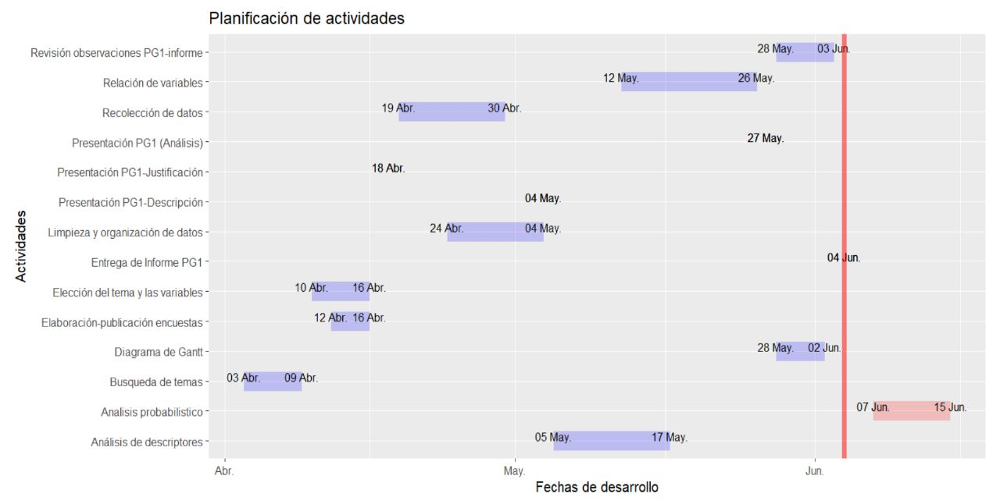

```{r echo=FALSE, results='hide', message = FALSE, warning=FALSE}

options(repos = "http://cran.rstudio.com/")
paquetes <- c("knitr", "xfun", "readr","ggplot2","dplyr", "prettydoc", "modeest", "tidyverse", "DiagrammeR","DiagrammeRsvg","Lock5Data", "rriskDistributions", "eulerr", "fastGraph", "fitdistrplus", "ADGofTest") 

for (paquete in paquetes) {
  if (!require(paquete, character.only = TRUE)) {
    install.packages(paquete)
    library(paquete, character.only = TRUE)
  }
}

```

# **Introducción**

El estrés es una realidad en la vida de los estudiantes universitarios, y su impacto no puede pasarse por alto. Diversos factores pueden influir, como la carga académica, las responsabilidades personales, el mal manejo de tiempo y una mala organización. Ante esta situación, UTEC han reconocido la importancia de abordar la salud mental de sus estudiantes y ha implementado programas de Salud Mental de Bienestar Estudiantil como una estrategia para solucionar esta problemática.

Este informe pretende evaluar el impacto del programa mencionado anteriormente durante el año 2022 en los niveles de estrés de los estudiantes. Para ello, se llevará a cabo un análisis estadístico exhaustivo, considerando variables relevantes que pueden influir en el estrés de los estudiantes, como la participación en el programa, la frecuencia de uso de los servicios de salud mental y otros factores socio económicos y académicos.

## **Relevancia**

La relevancia de este estudio radica en su potencial para generar conocimiento valioso sobre la efectividad del programa de Salud Mental de Bienestar Estudiantil y su impacto en el estrés de los estudiantes. Estos hallazgos permitirán que ellos adapten sus servicios y recursos en función de las necesidades específicas de los estudiantes, mejorando así la calidad de la atención brindada. Asimismo, se espera que este estudio genere conciencia sobre la importancia de la salud mental en diversos ámbitos entre la comunidad estudiantil.

## **Objetivos**

### ***Objetivo General***

El alcance del programa de Salud Mental de Bienestar Estudiantil y su impacto sobre los niveles de estrés en los estudiantes de UTEC durante el año 2022.

### ***Objetivos Específicos***

1.	Identificar el factor principal que influyó en la falta de participación de los alumnos de UTEC en el programa de Salud Mental de Bienestar Estudiantil durante el año 2022.
2.	Analizar la relación existente entre el número de cursos aprobados por los alumnos que asistieron y los que no asistieron al programa de Salud Mental de Bienestar Estudiantil durante el año 2022.
3.	Comparar los promedios ponderados de los estudiantes que recibieron y no recibieron asistencia psicológica del programa Salud Mental de Bienestar Estudiantil durante el año 2022.
4.	Identificar las principales deficiencias manifestadas por los estudiantes que hicieron uso del programa Salud Mental de Bienestar Estudiantil durante el año 2022.
5.	Determinar la relación existente entre el nivel de estrés de los alumnos de UTEC y su promedio ponderado durante el año 2022.
6.	Determinar la relación entre la cantidad de cursos aprobados y la asistencia al programa de Salud Mental de Bienestar Estudiantil durante el año 2022.
7.	Analizar la distribución que modela los cursos aprobados y promedios ponderados durante el año 2022.

## **Contexto**

El programa de Salud Mental de Bienestar Estudiantil de UTEC ofrece servicios de salud mental a los estudiantes para mejorar su bienestar emocional y psicológico. Los estudiantes pueden acceder a estos servicios de forma gratuita y confidencial. Durante el año 2022, el programa continuó brindando servicios a los estudiantes de UTEC y se espera que haya tenido un impacto positivo en los niveles de estrés de los estudiantes. Sin embargo, esto es algo que aun se debe determinar con el estudio a llevarse a cabo para analizar el verdadero impacto del programa en los estudiantes.

## **Justificación**

La investigación busca evaluar el impacto del programa de Salud Mental de Bienestar Estudiantil en los niveles de estrés de los estudiantes de UTEC durante 2022. Esto es crucial para el rendimiento académico y la calidad de vida de los estudiantes. Se analizarán factores relacionados con el estrés y se identificarán deficiencias del programa. Los resultados podrán optimizar el alcance y la calidad del programa, mejorando el bienestar de los estudiantes de UTEC.

## **Planificación**


<div align="center">
  
</div>

```{r echo=FALSE, message=FALSE, warning=FALSE}
r <- function(n){
  round(n, 2)
}
DF <- read_csv("DATA.csv")
datos_completos <- read_csv("DATOS_COMPLETOS.csv")
datos_faltantes <- read_csv("DATOS_FALTANTES.CSV")
```

# **Análisis probabilístico**

## **PROBABILIDADES**

### ***a) Primer par de eventos - dependientes***

1. Se escogieron el siguiente par de variables:

- Número de cursos aprobados en el ciclo 2022-2
- Uso del programa de psicología Bienestar Estudiantil 

2. Definimos los siguientes experimentos aleatorios:

- **Experimento a:** Se tomó un estudiante, del tercer ciclo en adelante de UTEC, de manera forma aleatoria, se encuestó acerca del número de cursos aprobados durante el ciclo 2022-2 y si hizo uso del programa de psicología Bienestar Estudiantil. 

3. Definimos los siguientes eventos:

**E:** El estudiante tiene un número de cursos aprobados mayor o igual a 4.
**A:** El estudiante hizo uso de los servicios de psicología

4. Elaboramos una tabla cruzada de probabilidades:

```{r echo=FALSE}
Total_eventos = length(DF$Interes_2022_2)

cond_E = DF$Cursos_2022_2 >= 4
cond_A = DF$Uso %in% c("Si")

total_e <- sum(cond_E)
total_a <- sum(cond_A)

total_interseccion <- sum(cond_E & cond_A)

Evento_E <- ifelse(cond_E, "E", "E'")

Promedio <- DF$Promedio_2022_2
Evento_A <- ifelse(cond_A, "A", "A'")

tabla_contingencia <- table(Evento_E, Evento_A)
prob_tabla_contingencia <- prop.table(tabla_contingencia)

kable(addmargins(tabla_contingencia), format = "html", caption = "Tabla de contingencia")


kable(addmargins(prob_tabla_contingencia), format = "html", caption = "Tabla de probabilidades")


euler <- euler(c("Evento E" = total_e,
                 "Evento A" = total_a,
                 "Evento E&Evento A" = total_interseccion))

plot(euler, counts = TRUE, quantities = TRUE,main="Relación entre los eventos E y A")
```


5. Determinamos la probabilidad del Evento E:
$P(E) = 0.980100$
```{r echo=FALSE}
Prob_E = round(total_e/Total_eventos,6)
Prob_E
```

6. Determinamos la probabilidad del Evento A:
$P(A) = 0.223881$
```{r echo=FALSE}
Prob_A = round(total_a/Total_eventos,6)
Prob_A
```

7. Hallamos la probabilidad de la intersección entre el evento A y el evento E:
$P(A ∩ E) = 0.218905$
```{r echo=FALSE}
prob_interseccion_A_E = round(total_interseccion/Total_eventos,6)
prob_interseccion_A_E

euler <- euler(c("Evento E" = Prob_E,
                 "Evento A" = Prob_A,
                 "Evento E&Evento A" = prob_interseccion_A_E))

plot(euler, counts = TRUE, quantities = TRUE,main="Relación de probabilidades entre los eventos E y A")
```

8. Comprobamos si los eventos A y el evento B son independientes:

$P(A ∩ E) = P(A)*P(E)$
```{r echo=FALSE}
prob_A_por_prob_E = round(Prob_A*Prob_E,6)

cat("P(A)*P(E) =",prob_A_por_prob_E, "\n")
cat("P(A ∩ E) =",prob_interseccion_A_E)
```
9. Calculamos la probabilidad condicional de A dado E:
$P(A|E) = P(A ∩ E) / P(E) = 0.223350$ 
```{r echo=FALSE}
Prob_condicional_A_E = round(prob_interseccion_A_E/Prob_E,6)
cat("P(A|E) =",Prob_condicional_A_E, "\n")
cat("P(A) =",Prob_A)
```
Debido a que ninguna de las dos igualdades se cumple, verificamos entonces que los eventos A y E no son independientes, sino dependientes.


10. Calculamos la probabilidad condicional de E dado A mediante el ***Teorema de Bayes*** y el ***Teorema de probabilidad total***:
$P(E|A) = P(A/E)*P(E)/P(A) = 0.977778$

$P(A) = P(A/E)*P(E) + P(A/E')*P(E')$
```{r echo=FALSE}
evento_interseccion_A_CE = sum(!cond_E & cond_A)
Total_eventos_CE = sum(!cond_E)
prob_condicional_A_CE = (evento_interseccion_A_CE/Total_eventos_CE)

Prob_CE = (Total_eventos_CE/Total_eventos)

Prob_condicional_E_A = round((Prob_condicional_A_E * Prob_E)/(Prob_condicional_A_E * Prob_E + prob_condicional_A_CE*Prob_CE),6)

cat('P(E|A) =', Prob_condicional_E_A, '\n')
cat('P(A ∩ E) =', prob_interseccion_A_E)

```
* La probabilidad de que un estudiante de UTEC seleccionado al azar tenga 4 o más cursos aprobados, considerando su asistencia al programa de psicología, en el periodo 2022-2 es de 0.223350

* La probabilidad de que un estudiante de UTEC seleccionado al azar cuente con menos de 4 cursos aprobados en el periodo 2022-2 es de 0.223881

* La probabilidad de que un estudiante de UTEC seleccionado al azar haya asistido al programa de bienestar, considerando que tenga 4 o más cursos aprobados, en el periodo 2022-2 es de 0.977778

* La probabilidad de que un estudiante de UTEC seleccionado al azar tenga 4 o más cursos aprobados y haya hecho uso de los servicios de bienestar en el periodo 2022-2 es de 0.218905.


### ***b) Segundo par de eventos - dependientes***

1. Se escogieron el siguiente par de variables:

- Nivel de estrés 2022-2
- Promedio 2022-2 

2. Definimos los siguientes experimentos aleatorios:

- **Experimento b:** Se tomó un estudiante, del tercer ciclo en adelante de UTEC, de manera forma aleatoria, se encuestó acerca de su nivel de estrés y su promedio ponderado durante el periodo 2022-2.

3. Definimos los siguientes eventos:

**E:** El estudiante tiene niveles de estrés de "medio", "Alto" o "Muy alto".
**D:** El estudiante tiene un promedio ponderado mayor o igual a 14.

4. Elaboramos una tabla cruzada de probabilidades:

```{r echo=FALSE}
Nivel_Estres <- DF$Estrés_2022_2
Evento_E <- ifelse(Nivel_Estres %in% c("Medio", "Alto", "Muy alto"), "E", "E'")

Promedio <- DF$Promedio_2022_2
Evento_D <- ifelse(Promedio >= 14, "D", "D'")

total_e <- sum(Nivel_Estres %in% c("Medio", "Alto", "Muy alto"))
total_a <- sum(Promedio >= 14)

total_interseccion <- sum(DF$Estrés_2022_2 %in% c("Medio", "Alto", "Muy alto") & DF$Promedio_2022_2  >= 14)

tabla_contingencia <- table(Evento_E, Evento_D)
prob_tabla_contingencia <- prop.table(tabla_contingencia)


kable(addmargins(tabla_contingencia), format = "html", caption = "Tabla de contingencia")


kable(addmargins(prob_tabla_contingencia), format = "html", caption = "Tabla de probabilidades")

euler <- euler(c("Evento E" = total_e,
                 "Evento D" = total_a,
                 "Evento E&Evento D" = total_interseccion))

plot(euler, counts = TRUE, quantities = TRUE,main="Relacion entre los eventos E y D")
```

5. Determinamos la probabilidad del Evento E:
$P(E) = 0.910448$
```{r echo=FALSE}
evento_E = sum(DF$Estrés_2022_2 %in% c("Medio", "Alto", "Muy alto"))
Total_eventos = length(DF$Estrés_2022_2)

Prob_E = round(evento_E/Total_eventos,6)
Prob_E
```

6. Determinamos la probabilidad del Evento D:
$P(D) = 0.706468$
```{r echo=FALSE}
evento_D = sum(DF$Promedio_2022_2 >= 14)
Total_eventos = length(DF$Promedio_2022_2)

Prob_D = round(evento_D/Total_eventos,6)
Prob_D
```

7. Hallamos la probabilidad de la intersección entre el evento D y el evento E:
$P(D ∩ E) = 0.636816$
```{r echo=FALSE}
evento_interseccion_D_E = sum(DF$Estrés_2022_2 %in% c("Medio", "Alto", "Muy alto") & DF$Promedio_2022_2 >= 14)
prob_interseccion_D_E = round(evento_interseccion_D_E/Total_eventos,6)
prob_interseccion_D_E

euler <- euler(c("Evento E" = Prob_E,
                 "Evento D" = Prob_D,
                 "Evento E&Evento D" = prob_interseccion_D_E))

plot(euler, counts = TRUE, quantities = TRUE,main="Relación de probabilidades entre los eventos E y D")
```

8. Comprobamos si los eventos D y el evento E son independientes:

$P(D ∩ E) = P(D)*P(E)$
```{r echo=FALSE}
prob_D_por_prob_E = round(Prob_D*Prob_E,6)

prob_D_por_prob_E
prob_interseccion_D_E
```


Debido a que ninguna de las dos igualdades se cumple, verificamos entonces que los eventos D y E no son independientes, sino dependientes.


9. Calculamos la probabilidad condicional de D dado E:
$P(D/E) = P(D ∩ E) / P(E) = 0.699453$ 
```{r echo=FALSE}
Prob_condicional_D_E = round(prob_interseccion_D_E/Prob_E,6)
Prob_condicional_D_E
```

10. Calculamos la probabilidad condicional de E dado D mediante el ***Teorema de Bayes*** y el ***Teorema de probabilidad total***:
$P(E/D) = P(D/E)*P(E)/P(D) = 0.901408$

$P(D) = P(D/E)*P(E) + P(D/E')*P(E')$
```{r echo=FALSE}
evento_interseccion_D_CE = sum(DF$Estrés_2022_2 %in% c("Bajo", "Muy bajo") & DF$Promedio_2022_2 >= 14)
Total_eventos_CE = sum(DF$Estrés_2022_2 %in% c("Bajo", "Muy bajo"))
prob_condicional_D_CE = (evento_interseccion_D_CE/Total_eventos_CE)

Prob_CE = (Total_eventos_CE/Total_eventos)

Prob_condicional_E_D = round((Prob_condicional_D_E * Prob_E)/(Prob_condicional_D_E * Prob_E + prob_condicional_D_CE*Prob_CE),6)

Prob_condicional_E_D
```
* La probabilidad de que un estudiante de UTEC seleccionado al azar tenga un promedio ponderado mayor o igual a 14, considerando su nivel de estrés "medio", "alto" o "muy alto", en el periodo 2022-2 es de 0.699453.

* La probabilidad de que un estudiante de UTEC seleccionado al azar cuente con un nivel de estrés "bajo" o "muy bajo" en el periodo 2022-2 es de 0.089552.

* La probabilidad de que un estudiante de UTEC seleccionado al azar cuente con un nivel de estrés "medio", "alto" o "muy alto", considerando que tenga un promedio ponderado mayor o igual a 14, en el periodo 2022-2 es de 0.901408.

* La probabilidad de que un estudiante de UTEC seleccionado al azar tenga un promedio ponderado mayor o igual a 14 y cuente con un nivel de estrés "medio", "alto" o "muy alto" en el periodo 2022-2 es de 0.636816.

## **DISTRIBUCIONES**

### ***VARIABLES ALEATORIAS DISCRETAS***

#### ***Variable 1 - Cursos_aprobados_2022_1***

```{r echo=FALSE}
boxplot(DF$Cursos_aprobados_2022_1, horizontal = TRUE)
boxplot.stats(DF$Cursos_aprobados_2022_1)
```

- Eliminamos sus valores atípicos.
```{r echo=FALSE}
cursos_sin_out <- DF$Cursos_aprobados_2022_1[DF$Cursos_aprobados_2022_1<8]
cursos_aprobados <- cursos_sin_out[cursos_sin_out>3]
boxplot(cursos_aprobados,horizontal =TRUE)
boxplot.stats(cursos_aprobados)
```

- Elaboramos una tabla de distribución.
```{r echo=FALSE}
tabla_contingencia <- table(cursos_aprobados)
prob_tabla_contingencia <- prop.table(tabla_contingencia)

kable(addmargins(tabla_contingencia), format = "html", caption = "Tabla de contingencia")

kable(addmargins(prob_tabla_contingencia), format = "html", caption = "Tabla de probabilidades")
```

X : Número cursos aprobados por un alumno en UTEC durante el periodo 2022-1.

RX = {4,5,6,7}

- Hallamos la función de probabilidad
```{r echo=FALSE}
fi = table(cursos_aprobados)
pi = addmargins(round(prop.table(fi),6))
pi
```
- Graficamos la distribución de probabilidad
```{r echo=FALSE}
plot(prob_tabla_contingencia, las = 2, ylim = c(0, 0.5), col = 2:7, ylab = "", main="DISTRIBUCIÓN DE PROBABILIDAD DE LA VARIABLE X", xlab="N° de cursos aprobados (2022-1)")
```

- Supondremos debido a la gráfica que tendrá una distribución Poisson.
  * Encontraremos nuestro valor esperado, cv y varianza de la variable X.

```{r echo=FALSE}
X = c(4:7)
P = c(0.130435, 0.217391, 0.445652, 0.206522)
E = sum(X*P)              #Valor esperado de la variable X

V = sum(X^2*P) - E^2      #Varianza de la variable X
C = (sd(cursos_aprobados)/E)*100  #Coeficiente de variación de la variable Y

E
V
C
```
  * Usamos nuestra libreria **FastGraph** para comparar la gráfica con una Poisson.
```{r}
shadeDist(6,"dpois", 5.728261,xlab="N° de cursos aprobados (2022-1)",main="DISTRIBUCIÓN DE PROBABILIDAD POISSON", sub="La probabilidad es 0.6499")
```
  
  * Analizando el gráfico y principios teóricos, el **valor esperado** y la **varianza** no son iguales, concluimos que la variable Y, NO se ajusta a una distribución Poisson, sino; a una distribución discreta simple.
  *Determina la probabilidad de un alumno de UTEC de obtener entre 4 y 6 cursos aprobados en el periodo 2022-1.
  $$Y~P( 5.728261)$$
  
```{r echo=FALSE}
ppois(5, 5.728261) - ppois(4, 5.728261)
```
  
  La probabilidad de un estudiante de UTEC de obtener entre 4 y 6 cursos aprobados en el periodo 2022-1 es 0.1671786.

  *Determinar la probabilidad de un alumno de UTEC de obtener 7 cursos aprobados en el periodo 2022-1.
  $$Y~P(5.728261)$$
  
```{r echo=FALSE}
dpois(7,5.728261)
```
  
  La probabilidad de un estudiante de UTEC de obtener 7 cursos aprobados en el periodo 2022-1 es 0.1306101.

#### ***Variable 2 - Cursos_aprobados_2022_2***

```{r echo=FALSE}
boxplot(DF$Cursos_aprobados_2022_2, horizontal = TRUE)
boxplot.stats(DF$Cursos_aprobados_2022_2)
```

- Eliminamos sus valores atípicos.
```{r echo=FALSE}
cursos_sin_out<- DF$Cursos_aprobados_2022_2[DF$Cursos_aprobados_2022_2<8]
cursos_aprobados <- cursos_sin_out[cursos_sin_out>3]
boxplot(cursos_aprobados,horizontal =TRUE)
boxplot.stats(cursos_aprobados)
```

- Elaboramos una tabla de distribución.
```{r echo=FALSE}
tabla_contingencia <- table(cursos_aprobados)
prob_tabla_contingencia <- prop.table(tabla_contingencia)

kable(addmargins(tabla_contingencia), format = "html", caption = "Tabla de contingencia")

kable(addmargins(prob_tabla_contingencia), format = "html", caption = "Tabla de probabilidades")
```

Y : Número cursos aprobados por un alumno en UTEC durante el periodo 2022-2.

RY = {4,5,6,7}

- Hallamos la función de probabilidad
```{r echo=FALSE}
fi = table(cursos_aprobados)
pi = addmargins(round(prop.table(fi),6))
pi
```

- Graficamos la distribución de probabilidad

```{r echo=FALSE}
plot(prob_tabla_contingencia, las = 2, ylim = c(0, 0.5), col = 2:7, ylab = "", xlab="N° de cursos aprobados (2022-2)", main="DISTRIBUCIÓN DE PROBABILIDAD DE LA VARIABLE Y")
```

- Supondremos debido a la gráfica que tendrá una distribución Poisson.
  * Encontraremos nuestro valor esperado, cv y varianza de la variable X.

```{r echo=FALSE}
X = c(4:7)
P = c(0.180328, 0.306011, 0.426230, 0.087432)
E = sum(X*P)              #Valor esperado de la variable Y

V = sum(X^2*P) - E^2      #Varianza de la variable Y

C = (sd(cursos_aprobados)/E)*100  #Coeficiente de variación de la variable Y
E
V
C
```
 
  * Usamos **FastGraph** para comparar la gráfica con una Poisson.
  
```{r}
shadeDist(6,"dpois",5.420771, xlab="N° de cursos aprobados (2022-2)", sub="La probabilidad es 0.6984", main="DISTRIBUCIÓN DE PROBABILIDAD POISSON")
```

* Analizando el gráfico y principios teóricos, el **valor esperado** y la **varianza** no son iguales, concluimos que la variable Y, NO se ajusta a una distribución Poisson, sino; a una distribución discreta simple.


  *Determina la probabilidad de un alumno de UTEC de obtener 5 cursos aprobados en el periodo 2022-2.
  $$Y~P(5.420771)$$
  
```{r echo=FALSE}
#P(Y = 5)
dpois(5,5.420771)
```
  
  La probabilidad de un estudiante de UTEC de obtener 5 cursos aprobados en el periodo 2022-2 es 0.1725493.

  *Determinar la probabilidad de un alumno de UTEC de obtener 6 o más cursos aprobados en el periodo 2022-2
  $$Y~P(5.420771)$$
  
```{r echo=FALSE}
#P(Y >= 6)
1 - ppois(5,5.420771)
```
  
  La probabilidad de un estudiante de UTEC de obtener 6 o más cursos aprobados en el periodo 2022-2 es  0.4574548.
  
### ***VARIABLES ALEATORIAS CONTINUAS***

Para el estudio del tema, consideramos importante analizar la variable de interés **Promedio**. Inicialmente, la dividimos en dos variables de estudio: 

- Promedio_2022_1.
- Promedio_2022_2.

Dado que uno de los enfoques de nuestro proyecto es comparar si hay una mejora en las calificaciones de los estudiantes (promedio ponderado) en UTEC al recibir orientación psicológica por parte de Bienestar Estudiantil, consideramos importante analizar esta variable en los periodos 2022-1 y 2022-2.

#### ***DISTRIBUCIÓN NORMAL - Promedio_2022_2***

```{r echo=FALSE}
densidad <- density(DF$Promedio_2022_2)
plot(densidad, main = "Gráfico de densidad de Promedios 2022-2", xlab = "Promedios", col = "yellow")

x <- densidad$x
y <- densidad$y
polygon(c(x, rev(x)), c(y, rep(0, length(y))), col = "yellow")

hist(DF$Promedio_2022_2, main = "Histograma de Promedios 2022-2", xlab = "Promedios", col = "yellow")
```

**a) Se aplica un filtro para incluir solo un rango de datos específicos (5,18.9) con los que vamos a trabajar para analizar la distribución que más se ajusta a nuestra variable.**

```{r echo=FALSE}

Promedio <- DF %>% 
  filter(!is.na(Promedio_2022_2) & Promedio_2022_2 >= 5.0 & Promedio_2022_2 <= 18.9) %>% 
  pull(Promedio_2022_2)

range(Promedio)
```

**b) Realizaremos una prueba de hipótesis**

$H_0$: La distribución de la variable "Promedio_2022_2" de los estudiantes de UTEC en el periodo 2022-2, seleccionados aleatoriamente, se aproxima a una distribución normal.

$H_1$: La distribución de la variable "Promedio_2022_2" de los estudiantes de UTEC en el periodo 2022-2, seleccionados aleatoriamente, es diferente de una distribución normal.

Para ello, tomaremos el siguiente valor para el **nivel de confianza**:
$$1-α = 0.95$$
Por tanto, el valor del **nivel de significancia** será:
$$α = 0.05$$

**c) Usaremos la función 'fit.cont' para realizar el analisis acerca de la distribución/ones que mejor modelan a la variable continua.**

Antes, realizaremos 

```{r echo=FALSE}
fit.cont(Promedio)
```

Con los resultados de la tabla, tenemos que:

- Prueba Anderson-Darling (AD):
$$Pvalue = 0.70$$
Por tanto, tenemos que $Pvalue = 0.70 > α = 0.05$ y por la **regla general** no se rechaza $H_0$ $(RH_O)$.

- Prueba de Kolmogórov-Smirnov (KS):
$$Pvalue = 0.07$$
Por tanto, tenemos que $Pvalue = 0.07 > α = 0.05$ y por la **regla general** no se rechaza $H_0$ $(RH_O)$.

Según los resultados que nos revelaron las pruebas anteriores, Anderson-Darling (AD) y Kolmogórov-Smirnov (KS), tenemos que la variable tiene una distribución que se aproxima a una Normal.

3. Para afirmar que se acerca a una distribución **normal**, calculamos sus parámetros:

Estimamos los parámetros de la distribución usando la función fitdist

```{r echo=FALSE}
fitdist(Promedio, distr = "norm")
```


$$  X ∼ N(µ, σ^2) $$
X: Promedio ponderado del periodo 2022-2 de los estudiantes de UTEC encuestados al azar.

$$ E ∼ N(14.634826, 1.860036^2) $$
Para evaluar si nuestra variable se aproxima a una distribución normal, hemos ajustado una distribución normal a nuestros datos utilizando la función *fitdist* del paquete *fitdistrplus* en R. Los parámetros estimados para la distribución logística son *mean* = 14.634826 y *sd* = 1.860036.

Ademas para evaluar la bondad del ajuste de la distribución normal a nuestros datos, hemos realizado pruebas de bondad de ajuste, como la prueba de Kolmogorov-Smirnov y la prueba de Anderson-Darling. Los resultados de estas pruebas indican que no hay evidencia suficiente para rechazar la hipótesis nula de que nuestros datos provienen de una distribución normal.

En resumen, tanto los resultados de las pruebas de bondad de ajuste como la inspección visual de los gráficos indican que nuestra variable se aproxima a una distribución normal."


#### Realizamos 2 ejemplos

Como parte del estudio, se encuestó a 201 estudiantes de manera aleatoria para recopilar información sobre sus promedios ponderados en el periodo academico 2022-2, con el objetivo de conocer el porcentaje de estudiantes que aprobaron ese periodo.

i) ¿Cuál es la probabilidad de que los estudiantes (en general) hayan obtenido un promedio ponderado mayor o igual a 10.5?

$$P(X >= 10.5)$$ 

Donde: 
X: Promedio ponderado del periodo 2022-2 de los estudiantes de UTEC encuestados al azar.

$$P(X >= 10.5) = 1 - pnorm(10,5, mu, sd)$$ 
$$P(X >= 10.5)= 0.99$$


```{r echo=FALSE}
mu <- 14.634826
sd <- 1.860036
probabilidad <- 1 - pnorm(10.5, mu, sd )
probabilidad
```

ii) ¿Cuál es la probabilidad de que los estudiantes (en general) hayan obtenido un promedio ponderado menor a 10.5?

$$P(X < 10.5)$$ 

Donde: 
X: Promedio ponderado del periodo 2022-2 de los estudiantes de UTEC encuestados al azar.

$$P(X < 10.5) = pnorm(10,5, mu, sd)$$ 
$$P(X < 10.5)= 0.01$$
```{r echo=FALSE}
mu <- 14.634826
sd <- 1.860036
probabilidad <- pnorm(10.5, mu, sd )
probabilidad
```

Según los datos del estudio realizado en UTEC, se encontró una alta probabilidad (aproximadamente del 98.67%) de que un estudiante seleccionado al azar de entre los encuestados tenga un promedio de calificaciones igual o superior a 10.5. Además, se observó una probabilidad muy baja (aproximadamente 0.01) de que un estudiante entrevistado tenga un promedio inferior a 10.5. En otras palabras, se espera que la gran mayoría de los estudiantes encuestados hayan aprobado en el periodo 2022-1, independientemente de si han asistido o no a una sesión de apoyo psicológico.


#### ***DISTRIBUCIÓN LOGÍSTICA - Promedio_2022_1***

La distribución logística es una distribución de probabilidad continua que se utiliza para modelar situaciones en las que hay un crecimiento o decrecimiento rápido al principio y luego se estabiliza. Esta distribución es similar a la distribución normal, pero tiene colas más pesadas, lo que significa que es más probable observar valores extremos.


1. Identificación gráficamente:

Utilizaremos nuestra variable *Promedio_2022_1*

```{r}
densidad <- density(DF$Promedio_2022_1)
plot(densidad, main = "Gráfico de densidad de Promedios 2022-1", xlab = "Promedios", col = "red")

x <- densidad$x
y <- densidad$y
polygon(c(x, rev(x)), c(y, rep(0, length(y))), col = "red")

hist(DF$Promedio_2022_1, main = "Histograma de Promedios 2022-1", xlab = "Promedios", col = "red")
```

2. Hipótesis:

Hipótesis nula (H0): La variable promedio_2022_1 se aproxima a una distribución logística.

Hipótesis alternativa (H1): La variable promedio_2022_1 es diferente a una distribución logística.

Se hará uso de la función fit.cont para analizar la variable e identificar las distribuciones que mejor se aproximan a la densidad de esta.

```{r echo=FALSE, message=FALSE}
fit.cont(DF$Promedio_2022_1)
```
Según los resultados, la variable se aproxima mejor a una distribución **logistica**.


- Prueba Anderson-Darling (AD):
$$Pvalue = 0.60$$
Por tanto, tenemos que $Pvalue = 0.60 > α = 0.05$ y por la **regla general** no se rechaza $H_0$ $(RH_O)$.

- Prueba de Kolmogórov-Smirnov (KS):
$$Pvalue = 0.06$$
Por tanto, tenemos que $Pvalue = 0.06 > α = 0.05$ y por la **regla general** no se rechaza $H_0$ $(RH_O)$.

3. Para afirmar que se acerca a una distribución **logistica**, calculamos sus parámetros:

Estimamos los parámetros de la distribución usando la función fitdist

```{r echo=FALSE}
fitdist(DF$Promedio_2022_1, distr = "logis")
```

Por lo tanto se determino que:

La función de densidad de probabilidad (PDF) es la distribución logística y se puede escribir como:

$$
f(x) = \frac{e^{-(x-location)/scale}}{scale(1+e^{-(x-location)/scale})^2}
$$

Una variable aleatoria `X` que sigue una distribución logística con parámetros `location` y `scale` se puede escribir como:

$$
X \sim \text{Logística}(\text{location}, \text{scale})
$$
donde:
location: Parámetro de ubicación
scale: Parámetro de escala, scale > 0

Una variable aleatoria `X` que sigue una distribución logística con parámetros `location = 14.9361635` y `scale = 0.9672709` se puede escribir como:

$$
X \sim \text{Logística}(14.9361635, 0.9672709)
$$
Para evaluar si nuestra variable se aproxima a una distribución logística, hemos ajustado una distribución logística a nuestros datos utilizando la función *fitdist* del paquete *fitdistrplus* en R. Los parámetros estimados para la distribución logística son *location* = 14.9361635 y *scale* = 0.9672709.

Ademas para evaluar la bondad del ajuste de la distribución logística a nuestros datos, hemos realizado pruebas de bondad de ajuste, como la prueba de Kolmogorov-Smirnov y la prueba de Anderson-Darling. Los resultados de estas pruebas indican que no hay evidencia suficiente para rechazar la hipótesis nula de que nuestros datos provienen de una distribución logística.

En resumen, tanto los resultados de las pruebas de bondad de ajuste como la inspección visual de los gráficos indican que nuestra variable se aproxima a una distribución logística."

4. Ejemplo:

- Calcular la probabilidad de que el promedio de los estudiantes de la UTEC del 2022_1 sea
mayor o igual a 10.5.

$$P(X >= 10.5)$$ 

Donde: 
X: Promedio ponderado del periodo 2022-1 de los estudiantes de UTEC encuestados al azar.

$$P(X >= 10.5) = 1 - plogis(10.5, location, scale)$$ 
$$P(X >= 10.5)= 0.99$$

```{r echo=FALSE}
location <- 14.9361635
scale <- 0.9672709
prob <- 1 - plogis(10.5, location, scale)
prob
```
Obtenemos un resultado de 0.989912, lo que significa que existe una probabilidad del 98.99% de que el promedio de los estudiantes de la UTEC en el semestre 2022_1 sea mayor o igual a 10.5.


- Calcular la probabilidad de que el promedio de los estudiantes de la UTEC del 2022_1 sea menor o igual a 10.5.

$$P(X <= 10.5)$$ 

Donde: 
X: Promedio ponderado del periodo 2022-1 de los estudiantes de UTEC encuestados al azar.

$$P(X <= 10.5) = plogis(10.5, location, scale)$$ 
$$P(X <= 10.5)= 0.01$$

```{r echo=FALSE}
location <- 14.9361635
scale <- 0.9672709
prob <- plogis(10.5, location, scale)
prob

```
Obtenemos un resultado de 0.01008802, lo que significa que existe una probabilidad del 1% de que el promedio de los estudiantes de la UTEC en el semestre 2022_1 sea menor o igual a 10.5.

# **CONCLUSIONES**

- Según los resultados de la encuesta, el factor principal que influyó en la falta de participación de los alumnos de UTEC en el programa de Salud Mental de Bienestar Estudiantil fue la falta de tiempo. Si bien la falta de conocimiento también fue un factor identificado, fue notablemente menos frecuente que la falta de tiempo. Por lo tanto, para mejorar la participación en el programa, es importante considerar soluciones que permitan a los estudiantes contar con un mayor tiempo disponible para participar en las actividades de Salud Mental ofrecidas por Bienestar Estudiantil.

-	Luego de analizar los datos obtenidos durante el año 2022, se concluyó que la mediana de la variación en el promedio general de los estudiantes que recibieron asistencia psicológica fue igual a la de aquellos estudiantes que no recibieron asistencia del programa de Salud Mental de Bienestar Estudiantil. Estos hallazgos sugieren que la asistencia psicológica brindada a través del programa podría no estar impactando significativamente en el rendimiento académico de los estudiantes.

-	Durante el año 2022, se evidenció que los estudiantes que recibieron asistencia psicológica en el programa de Salud Mental de Bienestar Estudiantil tuvieron una variación menor en su promedio general en comparación con aquellos que no recibieron tal asistencia. Sin embargo, estos hallazgos no sugieren un impacto significativo de la asistencia en el rendimiento académico de los estudiantes. Por lo tanto, podrían explorarse otras alternativas para mejorar la atención y el apoyo a los estudiantes en el futuro.

-	Según los resultados de la encuesta, se identificaron diversas deficiencias en el servicio del programa de Salud Mental ofrecido por Bienestar Estudiantil durante el año 2022. La deficiencia más predominante reportada fue la falta de disponibilidad de citas debido a que las agendas de los psicólogos suelen estar llenas. También se identificaron problemas con la página web "Registra tu cita" y un número menor de respuestas tardías. Estos hallazgos resaltan la necesidad de mejorar la gestión de citas para los estudiantes, así como la optimización de la página web para hacerla más accesible y funcional.

-	Se puede concluir que existe una relación entre el nivel de estrés reportado por los alumnos de UTEC y su promedio ponderado durante el año 2022. La evidencia de que se trata de eventos dependientes sugiere que hay una probabilidad significativa de que los estudiantes que informan niveles más altos de estrés también tengan promedios más altos. Estos hallazgos resaltan la importancia de tener en cuenta el bienestar emocional y el manejo del estrés de los estudiantes para mejorar su rendimiento académico.

-	Se determinó que existe una relación entre la cantidad de cursos aprobados y la asistencia al programa de Salud Mental de Bienestar Estudiantil. Esto se demostró al observar que son eventos dependientes y que existe una mayor probabilidad de que los estudiantes que asisten al programa obtengan una mayor cantidad de cursos aprobados. En consecuencia, se sugiere que el programa de Salud Mental de Bienestar Estudiantil puede tener un impacto positivo en el rendimiento académico de los estudiantes.

- Durante el año 2022, el número de cursos aprobados obtenido por los estudiantes de la UTEC no sigue ninguna distribución, sino una distribución discreta simple. Sin embargo, en el periodo 2022-1 se observa una mayor probabilidad de obtener 6 cursos aprobados en comparación con el periodo 2022-2.

- Al utilizar la función fit.cont de una librería trabajada en clase, se determinaron las distribuciones que mejor se ajustan a las variables Promedio_2022_1 y Promedio_2022_2 para un análisis más preciso. Se encontró que la primera variable se aproxima mejor a una distribución Logística, mientras que la segunda variable continua se ajusta mejor a una distribución Normal. Al analizar ambas variables, se buscó detectar alguna mejora en las calificaciones de los estudiantes encuestados en ambos periodos académicos. Los resultados de ambas gráficas muestran que no hay una diferencia significativa en los promedios ponderados de los estudiantes encuestados en ambos periodos.
