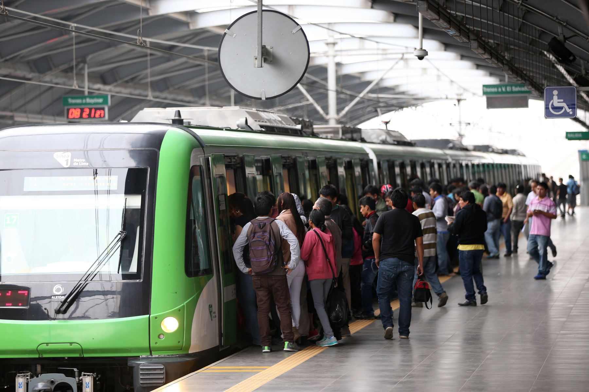

```{r, include = FALSE}
if(!require(ggplot2)){install.packages('ggplot2')}
```

```{r, include = FALSE}
library(ggplot2)
library(plotly)
```

# **Introducción**


Referencia: El Peruano. (2018). ATU generará transporte ordenado y eficiente en Lima. [Figura]. Recuperado de https://elperuano.pe/noticia/71084-atu-generara-transporte-ordenado-y-eficiente-en-lima

## **Relevancia**

Es relevante el estudio del transporte y tráfico de pasajeros en las características de la Línea 1 del Metro de Lima Metropolitana en el año 2022, permitirá a las autoridades y operadores del transporte público identificar los factores que afectan la demanda del servicio, lo que a su vez, puede utilizarse para planificar mejor el transporte en el futuro.

De igual forma, si se descubre que hay estaciones específicas con un alto tráfico de pasajeros, esto podría utilizarse para mejorar la capacidad y frecuencia de los trenes en esas estaciones, así como para planificar mejor las rutas de transporte en las áreas circundantes.

En general, el estudio del transporte y tráfico de pasajeros en la Línea 1 del Metro de Lima Metropolitana en el año 2022 es crucial para poder ofrecer un servicio de transporte público más eficiente, sostenible y cómodo para los usuarios, de la mismo forma, puede contribuir a mejorar la calidad de vida en la ciudad y reducir los problemas asociados al tráfico y la contaminación.

## **Objetivos**

### **Generales**

Analizar el tráfico de pasajeros en términos del tiempo y lugar en la Línea 1 del Metro de Lima en el año 2022.

### **Específicos**

-   Identificar los horarios con mayor tráfico de pasajeros con tipo de pase normal en la Línea 1 del Metro de Lima.
-   Analizar de la cantidad de pasajeros por mes durante el Covid-19 (enero - abril) y Pos-Covid-19 (mayo - diciembre) del servicio de la Línea 1 del Metro de Lima.
-   Determinar la estación más concurrida de la Línea 1 del Metro de Lima.
-   Analizar la relación entre el tipo de pase y la cantidad de pasajeros del servicio de la Línea 1 del Metro de Lima.
-   Analizar de la variabilidad de los ingresos brutos por cada mes del servicio de la Línea 1 del Metro de Lima.

## **Contexto**

Hoy en día el transporte y la movilidad son aspectos muy importantes y fundamentales en cualquier ciudad.<br></br> En este contexto, la Línea 1 del Metro de Lima Metropolitana se ha convertido en una de las principales opciones de transporte,lo que genera un gran interés en el estudio de su uso y el tráfico de pasajeros. Por ello decidimos analizar el número de personas que utilizan este transporte público, además, examinar los aspectos como el horario de mayor flujo de usuarios y los diferentes tipos de pases, así mismo, las estaciones con mayor cantidad de pasajeros.

## **Planificación-Gantt**

```{r, include = FALSE}
planificación <- data.frame(PROCESOS = c('Búsqueda de temas relevantes', 'Elección del tema a tratar', 'Planeamiento de objetivos e identificación del tipo de variables', 
'Presentación de PG1-Oral', 'Limpieza de la base de datos','Realizar el informe para la primera entrega del proyecto', 
'Presentación del primer informe','Correción del informe respecto al Feedback recibido', 'Análisis de la entrega final del proyecto', 'Entrega final del proyecto'),
RESPONSABLE = c('TODOS', 'TODOS','TODOS', 'TODOS', 'TODOS', 'TODOS', 'TODOS', 'TODOS', 'TODOS', 'TODOS'),
INICIO = c('29/03/2023', '07/04/2023', '10/04/2023', '21/04/2023', '28/04/2023', '12/05/2023', '26/05/2023', '02/06/2023', '23/06/2023', '30/06/2023'),
FIN = c('07/04/2023', '10/04/2023', '21/04/2023', '28/04/2023', '12/05/2023', '26/05/2023', '04/06/2023', '23/06/2023', '30/06/2023', '07/07/2023'),
PROGRESO = c('100%','100%','100%','100%','100%','100%','100%','100%','50%', '70%')
)
```

```{r,echo=FALSE,warning=FALSE}
ggplot(planificación, aes(x=INICIO, xend=FIN, y=PROCESOS, yend=PROCESOS, color=PROGRESO)) +
  theme_bw()+
  geom_segment(size=5) +
  labs(title='Gráfico 1\n Planificación', x='Tiempo(dd/mm/yyyy)', y='Procesos')+
   theme(axis.text.x = element_text(angle = 90, hjust = 1))
```

# **Datos**
## **Proceso de recolección de datos**
Los datos para este estudio fueron obtenidos del sitio web de la **OSITRAN** (Organismo Supervisor de la Inversión en Infraestructura de Transporte de Uso Público), específicamente de su sección de **"Portal de Datos Abiertos"** de [Tráfico de pasajeros](https://serviciosdigitales.ositran.gob.pe:8443/PortalDatosOsitran/reporte.jsp?code=22). Los datos fueron recolectados desde enero del año 2019 hasta el mes de marzo del año 2023. Es importante mencionar que estos datos fueron obtenidos de **fuentes oficiales**.


## **Población, muestra y muestreo**

Población: Todos los pasajeros de la Línea 1 del Metro de Lima  en desde enero del año 2019 hasta el mes de marzo del año 2023.

Muestra: Los pasajeros de la Línea 1 del Metro de Lima  en el año 2022.

Muestreo: Muestreo censado.

## **Variables**

### **Tipos de variable**

| Nombre de la variable | Clasificación de la variable |
|:----------------------|:----------------------------:|
| Mes                   |    Cualitativa ordinal       |           
| Fecha                 |    Cualitativa ordinal       |           
| Día calendario        |    Cualitativa ordinal       |           
| Rango de horario      |    Cualitativa ordinal       |
| Estación              |     Cualitativa nominal      |             
| Tipo de tarifa        |     Cualitativa nominal      |            
| Número de pasajeros   |    Cuantitativa discreta     |
| Tipo de pase          |     Cualitativa nominal      |            
| Ingreso Bruto         |    Cuantitativa continua     |            
| Tipo de pasajero      |     Cualitativa nominal      |    
| Persona Promedio Minuto| Cuantitativa discreta       |
| Ingreso Bruto Minuto  |    Cuantitativa continua     |


#### **Diccionario de variables**

- **Mes:** Variable cualitativa ordinal, representa los 12 meses del año ordenados.

- **Fecha:** Variable cualitativa ordinal que indica la fecha de ocurrencia del registro de la subida de pasajeros en la Línea 1 del Metro de Lima. Se almacena en formato “DD/MM/YYYY”

- **Rango de horario:** Variable cualitativa ordinal que registra el intervalo de tiempo específico en horas en el que se registró la subida de pasajeros en la Línea 1 del Metro de Lima.  La variable toma los siguientes valores: "5-6h", "6-7h", "7-8h", "8-9h", "9-10h", "10-11h", "11-12h", "12-13h", "13-14h", "14-15h", "15-16h", "16-17h", "17-18h", "18-19h", "19-20h", "20-21h", "21-22h" y "22-23h".

- **Estación:** Variable cualitativa nominal, que indica el nombre de cada estación que hay en el la Línea 1 del Metro de Lima. La variable toma los siguientes valores: "GAMARRA", "BAYOVAR", ""LA CULTURA", "MIGUEL GRAU", "VILLA EL SALVADOR", "ANGAMOS", "CAJA DE AGUA", "VILLA MARIA", "ATOCONGO", "NICOLÁS ARRIOLA", "LOS JARDINES", "LOS CABITOS", "MARÍA AUXILIADORA", " SANTA ROSA", "SAN CARLOS", "SAN MARTIN", "SAN JUAN", "LOS POSTES", "PIRÁMIDE DEL SOL", "PUMACAHUA", "SAN BORJA SUR", "AYACUCHO", "PARQUE INDUSTRIAL", "JORGE CHÁVEZ", "PRESBÍTERO MAESTRO" y "EL ÁNGEL".

- **Tipo de tarifa:** Variable cualitativa nominal que representa el tipo de tarifa que pagaron los pasajeros antes de subir a la Línea 1 del Metro de Lima. La variable toma valores: "Adulto", "Universitario" y "Exonerado".

- **Número de pasajeros:** Variable cuantitativa discreta que indica la cantidad de pasajeros que subió a la Línea 1 del Metro de Lima y su restricción es que sea un número entero no negativo.

- **Tipo de pase:** Variable cualitativa nominal que representa el tipo de pase que fue usado por los pasajeros para subir a la Línea 1 del Metro de Lima. La variable toma los siguientes valores: "Normal", "PNP", "BVP", "Concesionario", "Limp", "AVP", "Proved", "Cliente" y "Personas con discapacidad severa (Conadis)".

- **Tipo de pasajero:** Variable cualitativa nominal que representa la clasificación de los pasajeros que subieron a la Línea 1 del Metro de Lima. La variable toma los siguientes valores: "NORMAL" y "PASE LIBRE".

- **Ingreso Bruto:** Variable cuantitativa continua que representa la cantidad de dinero en soles que percibió la empresa operadora del Metro debido al pago de pasajes por parte de los pasajeros que subieron a la Línea 1 del Metro de Lima y su restricción es que sea un número real no negativo.

- **Persona Promedio Minuto:** Variable cuantitativa discreta que representa la cantidad de pasajeros promedio que subieron a la Línea 1 del Metro de Lima en el intervalo de tiempo de un minuto y su restricción es que sea un número entero no negativo.

- **Ingreso Bruto Minuto:** Variable cuantitativa continua que representa la cantidad de dinero en soles que percibió la empresa operadora del Metro en el intervalo de tiempo de un minuto debido al pago de pasajes por parte de los usuarios que subieron a la Línea 1 del Metro de Lima y su restricción es que sea un número real no negativo.

## **Limpieza de datos**

**Función creada para poder verificar si las librerías necesarias no están instaladas en su ordenador**

```{r}
check_packages <- function(packages) {
  for(p in packages) {
    if(!require(p, character.only = TRUE)) {
      install.packages(p, dependencies = TRUE)
      library(p, character.only = TRUE)
      cat("Package", p, "installed and loaded\n")
    } else {
      cat("Package", p, "already installed and loaded\n")
    }
  }
}
```

**Instalación y carga de las librerías para la lectura y gráfica**

```{r ,eval = FALSE}
check_packages(c("readr","dplyr","car","ggplot2","tidyr","timeDate"))
```

**Lectura de la data "2022.csv"**

```{r ,eval = FALSE}
data <- read.csv("2022.csv")
metro <- data 
```

**Verificamos la data**

```{r ,eval = FALSE}
datos_faltantes <- sum(is.na(data))
casos_incompletos <- sum(!complete.cases(data))
variable_data_incompleta <- sum(is.na(data$Rango.Horario))
```

- **Cantidad de valores faltantes**: 75920

- **Cantidad de observaciones incompletas**: 75920

- **Cantidad de valores faltantes Rango.Horario**: 75920

Obtuvimos datos faltantes y al verificar con la data original corregimos el valor correspondiente. Los datos faltantes corresponden a la variable **Rango de horario**.

**Seleccionamos los datos a usar**

```{r ,eval = FALSE}
metro <- subset(metro, select = c(Mes,Estación,Fecha,Rango.Horario,Tipo.Pasajero,Tipo.Tarifa,Tipo.Pase,Número.de.Pasajeros))
```

**Quitamos la enumeración a las estaciones**

```{r ,eval = FALSE}
metro$Estación <- sapply(metro$Estación,function(x) sub("^\\d+\\.\\- ", "", x))
```

**Modificamos el rango de horario de la data a una forma comprensible**

```{r ,eval = FALSE}
metro <- metro %>% replace_na(list(Rango.Horario = "5-23 h"))
metro$Rango.Horario <- as.factor(metro$Rango.Horario)
metro$Fecha <- as.factor(metro$Fecha)
```

**Modificamos los valores de las tarifas a una forma comprensible**

```{r ,eval = FALSE}
metro$Tipo.Tarifa <- ifelse(metro$Tipo.Tarifa=="Intervalos en tarifa Adulto",
                            "Tarifa adulto",
                     ifelse(metro$Tipo.Tarifa=="Intervalos en tarifa Universitario / Medio",
                            "Tarifa Universitario / Medio",
                            "Pases libres y exonerados"))
```

**Quitamos la enumeración a los tipos de pase**

```{r ,eval = FALSE}
metro$Tipo.Pase <- sapply(metro$Tipo.Pase,function(x) sub("^\\d+ ", "", x))
```

**Agregamos los días calendario obtenidos por medio de la fecha**

```{r ,eval = FALSE}
metro<-metro %>% mutate(Dia_Calendario = weekdays(as.Date(metro$Fecha))) %>% 
      select(
        Mes,
        Estación,
        Fecha,
        Dia_Calendario,
        Rango.Horario,
        Tipo.Pasajero,
        Tipo.Tarifa,
        Tipo.Pase,
        Número.de.Pasajeros)
metro$Dia_Calendario<-as.factor(metro$Dia_Calendario)
```

**Agregamos el ingreso bruto obtenido por medio de la cantidad de pasajeros**

```{r ,eval = FALSE}
metro$Número.de.Pasajeros<-gsub(",", "", metro$Número.de.Pasajeros)
metro$Número.de.Pasajeros<-as.integer(metro$Número.de.Pasajeros)
metro$Ingreso_Bruto <-metro$Número.de.Pasajeros * ifelse(metro$Tipo.Tarifa == "Tarifa adulto", 1.50,
                             ifelse(metro$Tipo.Tarifa == "Tarifa Universitario / Medio", 0.75, 0))
```

**Agregamos el ingreso promedio de pasajeros por minuto**

```{r ,eval = FALSE}
metro$Persona_Promedio_Min<-round(metro$Número.de.Pasajeros/60)
metro$Persona_Promedio_Min<-as.integer(metro$Persona_Promedio_Min)
```

**Agregamos el ingreso bruto por minuto**

```{r,eval = FALSE}
metro$IngresoBruto_Minuto<-metro$Ingreso_Bruto/60
metro$IngresoBruto_Minuto<-as.numeric(metro$IngresoBruto_Minuto)
write.csv(metro, "Metro de lima.csv", row.names = FALSE)
```

```{r ,include = FALSE}
metro<-read.csv("Metro de Lima.csv")
```

# **Análisis descriptivo**

## **Gráficos**

### **Análisis de la cantidad de pasajeros de pase normal en los rangos de horario**
```{r ,include = FALSE}
pasajeros_horarios<-as.data.frame(aggregate(Número.de.Pasajeros~Rango.Horario,data=metro,FUN=sum))
pasajeros_horarios<-pasajeros_horarios[c(15:19,1:13,14),]
pasajeros_horarios$Rango.Horario <- factor(pasajeros_horarios$Rango.Horario,levels = c("5-6 h", 
                                                                                       "6-7 h", 
                                                                                       "7-8 h", 
                                                                                       "8-9 h",
                                                                                       "9-10 h",
                                                                                       "10-11 h",
                                                                                       "11-12 h",
                                                                                       "12-13 h",
                                                                                       "13-14 h",
                                                                                       "14-15 h",
                                                                                       "15-16 h",
                                                                                       "16-17 h",
                                                                                       "17-18 h",
                                                                                       "18-19 h",
                                                                                       "19-20 h",
                                                                                       "20-21 h",
                                                                                       "21-22 h",
                                                                                       "22-23 h"))
```

```{r ,echo=FALSE,warning=FALSE}
fig <- plot_ly(pasajeros_horarios, x = ~Rango.Horario, y = ~Número.de.Pasajeros,ylab="Número de pasajeros" ,type = 'scatter', mode = 'lines')%>%
  layout(
    margin = list(
      l = 10,  
      r = 10,  
      t = 65, 
      b = 15   
    )
  )
fig <- add_trace(fig, x = ~Rango.Horario, y = ~Número.de.Pasajeros, type = 'scatter', mode = 'markers')
fig <- fig %>% layout(title = 'Gráfico 2 \nNúmero de pasajeros por rango de horario')
fig <- fig %>% layout(yaxis = list(title = 'Número de pasajeros'))
fig <- fig %>% layout(xaxis = list(title = 'Rango de horario'))
fig
```

- A partir del gráfico interpretamos que  el rango de horario con mayor tráfico de pasajeros en el año 2022 fue en el intervalo de 18-19 horas, el cual tiene el mayor número de tráfico de pasajeros con 11.22042 millones.

- El rango de 7-8 horas es el segundo en tener el mayor número de tráfico de pasajeros, con aproximadamente 10.74265 millones de usuarios, valor que no difiere mucho con el primer lugar. 

- El rango de 22-23 horas fue tuvo el menor número de tráfico de pasajeros en el año 2022 con 951,936 mil usuarios.

- El resultado es  acertado y esperado, debido a que estos horarios son generalmente de ingreso (7-8 horas) y de salida (18-19 horas) de muchos estudiantes y trabajadores. Estos horarios también llamados "hora punta" son reconocidos por su congestión y tráfico vehícular muy alto, debido a la gran cantidad de pasajeros que acuden a la Linea 1 del Metro de Lima que cuenta con 44 trenes, cada uno cuenta con seis coches, los cuales tienen una capacidad de 1200 personas por viaje.

### **Análisis de la cantidad de pasajeros durante Covid-19 (enero - abril) y Pos-Covid-19 (mayo - diciembre)**

```{r, echo=FALSE}
# Agrupar y resumir la cantidad de pasajeros por mes
agrupacion_mes <- metro %>% 
  group_by(Mes) %>% 
  summarise(Numero_pasajero = sum(Número.de.Pasajeros))

# Convertir la columna "Mes" en un factor ordenado
agrupacion_mes$Mes <- ordered(agrupacion_mes$Mes, levels = c('Enero', 'Febrero', 'Marzo', 'Abril', 'Mayo', 'Junio', 'Julio', 'Agosto', 'Setiembre', 'Octubre', 'Noviembre', 'Diciembre'))

# Definir la paleta de colores degradados en azul
colores <- colorRamp(c("lightblue", "darkblue"))

# Crear la gráfica con los colores degradados utilizando plot_ly
fig <- plot_ly(agrupacion_mes, x = ~Mes, y = ~Numero_pasajero, type = 'bar', color = ~Mes, colors = colores) %>%
  layout(
    margin = list(
      l = 10,
      r = 10,
      t = 80,
      b = 15
    ),
    title = 'Gráfico 3 \n Cantidad de pasajeros por mes',
    yaxis = list(title = 'Número de pasajeros'),
    showlegend = FALSE  # Quitar la leyenda
  )

fig

```
Durante la etapa del Covid-19 (enero - abril), hubo un crecimiento gradual en el número de pasajeros mensuales. En enero se registraron 7.6 millones de pasajeros, y en febrero aumentó a 7.7 millones. En abril, la cifra llegó a 8.9 millones. En total, hubo un aumento de 1.4 millones de pasajeros durante esta etapa. Además, hubo un incremento notable de 2 millones de pasajeros entre abril y mayo.

Después del Covid-19 (mayo - diciembre), se observó un crecimiento continuo en el número de pasajeros. En diciembre se alcanzó el valor máximo de 14 millones de pasajeros, mientras que en enero se registró el valor mínimo de 7.6 millones. En total, hubo un aumento de 3.1 millones de pasajeros durante este periodo.

En conclusión, el comportamiento de la gráfica Pos-Covid-19 tiene un incremento mayor a comparación de la etapa Covid-19, esto sucede debido a que durante los primeros meses del año 2022 aún existían ciertas restricciones en el uso y aforo de la Línea 1 del Metro de Lima y con el paso de los meses dejaron de estar vigentes hasta volver a la normalidad.

###  **Determinar la estación más concurrida de la Línea 1 del Metro de Lima**


```{r, echo=FALSE}

metro%>% group_by(Estación) %>% summarise(Número_pasajero = sum(Número.de.Pasajeros)) -> ConcurrEstaci
ConcurrEstaci <- ConcurrEstaci[order(-ConcurrEstaci$Número_pasajero), ] #Ordena el data frame "ConcurrEstaci" en orden descendente según la columna "Número_pasajero".

ConcurrEstaci$Estación <- factor(ConcurrEstaci$Estación, levels = ConcurrEstaci$Estación[order(-ConcurrEstaci$Número_pasajero)]) # Esta linea de código utiliza la función "factor()" para establecer el orden de las estaciones en el factor "Estación". Al proporcionar el argumento "levels" con el orden descendente de las estaciones según el número de pasajeros, garantizando que la gráfica muestre las estaciones en ese orden.
```

 
```{r, echo=FALSE}
# Ordenar el data frame "ConcurrEstaci" en orden descendente según la columna "Número_pasajero"
ConcurrEstaci <- ConcurrEstaci[order(-ConcurrEstaci$Número_pasajero), ]

# Crear una secuencia de colores en tonos de verde
n <- length(ConcurrEstaci$Estación)
colores <- colorRampPalette(c("darkgreen", "lightgreen"))(n)

# Crear la gráfica de barras con el degradado de color verde y el eje x invertido
fig <- plot_ly(ConcurrEstaci, x = ~reorder(Estación, -Número_pasajero), y = ~Número_pasajero, type = 'bar', marker = list(color = colores)) %>%
  layout(
    margin = list(
      l = 10,
      r = 10,
      t = 80,
      b = 15
    ),
    title = 'Gráfico 4 \n Número de pasajeros por estación',
    yaxis = list(title = 'Número de pasajeros'),
    xaxis = list(title = 'Estación'),
    showlegend = FALSE
  )

fig

```


- A partir del gráfico interpretamos que la estación con mayor tráfico de pasajeros con un total de 12.526 millones en el 2022 fue la estación GAMARRA, la cual tiene el mayor número de pasajeros a comparación de las otras estaciones. El resultado es correcto y se puede respaldar, debido a que esta estación se encuentra cerca al mayor emporio comercial del Perú. Además, en este lugar hay una gran cantidad de trabajadores y personas, por lo cual, es un punto de comercio muy importante en el país.

- Se puede deducir que las 3 estaciones que cuentan con mayor afluencia de pasajeros son GAMARRA, BAYOVAR y LA CULTURA, esto debido a que son distritos con una gran densidad demográfica, sumado a ello, BAYOVAR es la última estación, se encuentra en el distrito de San Juan de Lurigancho, distrito más poblado de Lima y del Perú, así mismo, la estación LA CULTURA, que se encuentra ubicada en la intersección de la avenida Aviación con la avenida Javier Prado, en el distrito de San Borja, una zona comercial y cultural.

### **Análisis de la relación entre la cantidad de pasajeros y el tipo de pase**

```{r,echo=FALSE}

metro%>% group_by(Tipo.Pase) %>% summarise(Numero_pasajero = sum(Número.de.Pasajeros)) -> tabla.pase.pasajero
total<-sum(tabla.pase.pasajero$Numero_pasajero)
tabla.pase.pasajero <-tabla.pase.pasajero[order(tabla.pase.pasajero$Numero_pasajero,na.last=F,decreasing=T),]
fig <- plot_ly(
  type = 'table',
  header = list(
    values = c("<b>Orden</b>", '<b>Tipo de pase</b>','<b>Número de pasajeros (Frecuencia absoluta)</b>','<b>Frecuencia relativa</b>'),
  align = c('left', rep('center', ncol(tabla.pase.pasajero))),
  line = list(width = 1, color = 'black'),
  fill = list(color = 'rgb(100, 100, 230)'),
  font = list(family = "Arial", size = 14, color = "white")
  ),
  cells = list(
    values = rbind(
      rownames(tabla.pase.pasajero), 
      t(as.matrix(unname(tabla.pase.pasajero))),paste(round(((tabla.pase.pasajero$Numero_pasajero/total)*100),2),'%')
    ),
    align = c('left', rep('center', ncol(tabla.pase.pasajero))),
    line = list(color = "black", width = 1),
    fill = list(color = c('rgb(235, 193, 238)', 'rgba(228, 222, 249, 0.65)')),
    font = list(family = "Arial", size = 12, color = c("black"))
  ))  %>%
  layout(
    margin = list(
      l = 10,  
      r = 10,  
      t = 80, 
      b = 0.4   
    )
  )
fig <- fig %>% layout(title = 'Tabla 1 \n Número de pasajeros por tipo de pase')
fig
```

- A partir del gráfico interpretamos que  el tipo de pase con mayor uso de los pasajeros en el 2022 fue el pase Normal, el cual tiene el mayor número de pasajeros con 128,782,653 en el año 2022.

- El tipo de pase PNP es el segundo en tener el mayor número de tráfico de pasajeros, con aproximadamente 1,309,549  de usuarios, valor que difiere mucho con el pase Normal en el año 2022.

- El tipo de pase Cliente fue tuvo el menor número de tráfico de pasajeros en el año 2022 con 3 usuarios.

- El resultado es acertado y esperado debido a que el tipo de pase Normal es el más común y de uso general, a comparación de los otros tipos de pase que son exclusivos para personas que pertenecen a ciertas organizaciones o padecen de alguna discapacidad.

## **Medidas de resumen**

### **Ingreso promedio de personas por minuto en las estaciones más concurridas**

```{r,include=FALSE}
metro %>% group_by(Estación,Fecha) %>% summarise(Cantidad.personas.promedio.por.minuto = sum(Persona_Promedio_Min)) -> persona
gamarra<-filter(persona,Estación=='GAMARRA' | Estación=='BAYOVAR' | Estación=='LA CULTURA')
```

```{r,echo=FALSE}
fig <- plot_ly(gamarra, x = ~Estación, y = ~Cantidad.personas.promedio.por.minuto, type = 'box') %>%
  layout(
    margin = list(
      l = 10,  
      r = 10,  
      t = 80, 
      b = 15   
    )
  )
fig <- fig%>% layout(title='Gráfico 5 \n Ingreso promedio de personas por minuto en las estaciones\n GAMARRA, BAYOVAR y LA CULTURA')
fig <- fig %>% layout(yaxis = list(title = 'Cantidad promedio de personas por minuto'))
fig
```

Para este análisis se escogió a las 3 estaciones que cuentan con mayor ingreso de número de personas, estas son GAMARRA, BAYOVAR y LA CULTURA, y se obtuvieron los siguientes resultados:

- Máximo: El valor máximo de la cantidad de personas promedio por minuto en la estación GAMARRA es 1032, mientras que para las otras estaciones (BAYOVAR y LA CULTURA) son 806 y 697 respectivamente. Esto indica que en algún momento registrado en la base de datos, la Estación GAMARRA experimentó el mayor flujo de pasajeros promedio en un minuto en comparación con las otras estaciones. 

- Mediana: En el caso de la estación GAMARRA, la mediana es 621, lo que significa que la mitad de los valores de la cantidad de personas promedio por minuto en esa estación son iguales o menores a 621. Esto indica que, en promedio, la cantidad de personas que suben al metro por minuto en la estación GAMARRA es relativamente alta en comparación con las otras dos estaciones.

- Tercer cuartil(Q3): Representa el valor por encima del cual se encuentra el 75% de los datos. En el caso de la estación GAMARRA, Q3 es 671, lo que indica que el 75% de los valores de la cantidad de personas promedio por minuto en esa estación son iguales o menores a 671. Esto refuerza la idea de que la estación GAMARRA tiene una mayor afluencia de pasajeros en comparación con las otras estaciones.

En conclusión, la estación GAMARRA es la que presenta mayor mediana, tercer cuartil y máximo debido a que se encuentra en el centro del emporio comercial, donde hay una densidad muy alta de personas.

### **Análisis de la variabilidad de los ingresos brutos por cada mes**

```{r ,include = FALSE}
metro %>% group_by(Mes,Fecha) %>% summarise(Cantidad_Mes = sum(Ingreso_Bruto)) -> ingreso_x_mes
ingreso_x_mes$Mes<-factor(ingreso_x_mes$Mes, levels = c('Enero',
                                                      'Febrero',
                                                      'Marzo',
                                                      'Abril',
                                                      'Mayo',
                                                      'Junio',
                                                      'Julio',
                                                      'Agosto',
                                                      'Setiembre',
                                                      'Octubre',
                                                      'Noviembre',
                                                      'Diciembre'))
```

```{r ,echo=FALSE}
fig <- plot_ly(ingreso_x_mes, x = ~Mes, y = ~Cantidad_Mes, type = 'box')%>%
  layout(
    margin = list(
      l = 10,  
      r = 10,  
      t = 80, 
      b = 15   
    )
  )
fig <- fig %>% layout(xaxis = list(title = "Mes"), yaxis = list(title = "Ingreso bruto"),
                      title = "Gráfico 6 \n Ingreso bruto por mes")
fig
```

Para tener una mejor vista de la variabilidad de los ingresos por cada mes 
```{r,echo=FALSE}
for (v in c(levels(ingreso_x_mes$Mes))){
   cat('IQR del mes de',v,': ',round(IQR(filter(ingreso_x_mes,Mes==v)$Cantidad_Mes),2),'\n')
}
```
- En los meses como abril, julio y diciembre destacan por tener IQR significativamente altos. Esto indica que en esos meses la variabilidad de los ingresos fue más amplia, es decir, hubo una mayor dispersión en los ingresos brutos mensuales. 
 
- Por otro lado, los meses como marzo, febrero y noviembre tienen IQR relativamente bajos. Esto sugiere que durante esos meses hubo una menor variabilidad en los ingresos brutos mensuales.

- Los meses restantes tienen IQR moderados, lo que indica una variabilidad promedio en los ingresos brutos mensuales. No presentan una dispersión extremadamente alta o baja, a comparación de otros meses.

A medida que se fue levantando gradualmente la restricción de capacidad de aforo en la Línea 1 del Metro de Lima y se permitió un mayor número de pasajeros, es posible que se haya observado un aumento en la afluencia de personas y, por ende, en los ingresos brutos mensuales. Este incremento gradual en el aforo podría haber generado una mayor variabilidad en los ingresos, ya que la demanda de viajes pudo haber fluctuado a medida que las personas se adaptaban a las nuevas reglas y condiciones.

Analizaremos la mediana para obtener una estimación del valor medio de los ingresos
```{r,echo=FALSE}
for (v in c(levels(ingreso_x_mes$Mes))){
   cat('Mediana del mes de',v,': ',median(filter(ingreso_x_mes,Mes==v)$Cantidad_Mes),'\n')
}
```

- Existe una variación en los ingresos a lo largo del año. Podemos observar que los meses de setiembre, noviembre y diciembre tienen las medianas más altas, lo que indica que durante estos meses el ingreso bruto es considerablemente mayor a comparación de otros meses. Esto puede indicar que durante las festividades de fin de año los ingresos aumentan significativamente.

- Los meses de enero, febrero y marzo tienen las medianas más bajas, lo que sugiere una posible disminución en la demanda de viajes durante esos meses. Esto sucede debido a que durante los primeros meses del año 2022 aún existían ciertas restricciones debido al Covid-19 en el uso y aforo de la Línea 1 del Metro de Lima.

- Los meses como marzo, abril, mayo y junio, muestran medianas cercanas o ligeramente por encima del promedio. Esto sugiere cierta estabilidad en los ingresos generados durante esos meses, sin grandes fluctuaciones.

De los datos se muestra una tendencia creciente en los ingresos brutos mensuales en la Línea 1 del Metro de Lima a medida que transcurre los meses del año 2022.

## **Correlación**

### **Correlación entre el número de pasajeros e ingreso bruto**

```{r,echo=FALSE}
plot( x=metro$Número.de.Pasajeros,y=metro$Ingreso_Bruto,xlab="Número de pasajeros",ylab="Ingreso bruto",main="Gráfico 7 \n Número de pasajeros vs. ingreso bruto")
```

```{r,echo=FALSE}
cat('Correlación: ',cor(metro$Número.de.Pasajeros,metro$Ingreso_Bruto)) #Correlación -> función cor()
```

```{r,echo=FALSE}
summary(lm(metro$Ingreso_Bruto~metro$Número.de.Pasajeros)) #Ajustar un modelo de regresión lineal para poder analizar la variable dependiente "Ingreso bruto" y la variable independiente "Número de pasajeros" en el dataframe metro.csv
```
**Modelo de regresión lineal:**

$$Y= -18.13 + 1.508X$$

- La correlación entre el número de pasajeros y el ingreso bruto en el dataframe "metro" es de 0.9986685. Esto indica una correlación positiva muy fuerte y cercana a 1, lo que sugiere que hay una relación lineal positiva entre estas dos variables. En otras palabras, a medida que aumenta el número de pasajeros, se espera que el ingreso bruto también aumente.

- El modelo de regresión lineal muestra que el número de pasajeros tiene un efecto significativo en el ingreso bruto de la empresa operadora de la Línea 1 del Metro de Lima. El coeficiente estimado para la variable "Número de pasajeros" es de 1.508e+00, lo que indica que, en promedio, cada incremento unitario en el número de pasajeros se asocia con un aumento de 1.508 unidades en el ingreso bruto.

- El valor p asociado al coeficiente de la variable "Número de pasajeros" es <2e-16, lo cual es extremadamente pequeño. Esto indica que el coeficiente es altamente significativo, reforzando la evidencia de que existe una relación lineal positiva entre el número de pasajeros y el ingreso bruto.

- El coeficiente de determinación (R-cuadrado) del modelo es 0.9973, lo cual indica que aproximadamente el 99.73% de la variabilidad en el ingreso bruto puede ser explicada por la variable "Número de pasajeros". Esto indica un ajuste muy bueno del modelo.

Finalmente, los resultados indican que hay una fuerte correlación y una relación lineal positiva entre el número de pasajeros y el ingreso bruto en la Línea 1 del Metro de Lima. 
A medida que aumenta el número de pasajeros, se espera que el ingreso bruto también aumente, y el modelo de regresión lineal confirma esta relación.

# **Referencias**

OSITRAN. (2022). Dec. Estadistica Metro de Lima, Tráfico de pasajeros. Recuperado de https://serviciosdigitales.ositran.gob.pe:8443/PortalDatosOsitran/reporte.jsp?code=22


```{=html}
<style>
.title {
  text-align: center;
  margin-top: 1em;
  margin-bottom: 1em;
  font-weight: 550;
}

</style>
```
