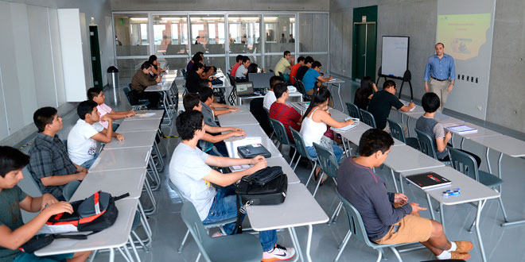

```{r}
library(htmltools)
```
<b style = 'color : darkblue; font-size : 25px '>***"Universidad de Ingeniería y Tecnología"***</b>


## Contenido 

-   ’1. Introducción’
-   ’2. Relevancia’
-   ’2. Objetivos’
-   ’2. Contexto’
-   ’2. Datos’
-   ’2. Recolección de datos’
-   ’2. Población, muestra y muestreo’
-   ’2. Variables’
-   ’2. Limpieza de base de datos’
-   ’2. Análisis descriptivo’

<b style = 'color : red; font-size : 25px ; font-family : Amasis MT Pro Black'>***Preferencias de los estudiantes de UTEC para estudiar posgrado ***</b>

Obtención de datos mediante encuesta  [Aquí](https://docs.google.com/forms/d/13vfyWL8injovxnEG2jghNKMo0cZBDxG8uDG2dp5DjGI/edit?ts=644138a6
- Proveniencia de los datos : **Encuestas de los estudiantes de pregrado de la Universidad de Ingenería y Tecnología** 


> ## **1. Tema**
<b style = 'color : dark; font-size : 25px ; font-family : Amasis MT Pro Black'>***"PROYECCIÓN DE LOS ESTUDIANTES DE LA UNIVERSIDAD DE INGENIERIA Y TECNOLOGIA PARA REALIZAR ESTUDIOS DE POSGRADO EN UNIVERSIDADES DENTRO Y FUERA DEL PERÚ DURANTE EL AÑO 2023."***</b>

- Título corto: <b style = 'color : dark; font-size : 20px ; font-family : Amasis MT Pro Black'>***"Universidades preferidas de los estudiantes de UTEC para estudiar Posgrado"***</b>



# 1. INTRODUCCION

> ## **1.1 Relevancia**

Los estudiantes de UTEC que desean estudiar posgrado, pueden aprovechar la reputación y las conexiones de la universidad para estudiar en otras universidades dentro y fuera del Perú, ampliando sus perspectivas académicas y profesionales. La UTEC tiene alianzas con universidades prestigiosas en todo el mundo, brindando oportunidades de contactos internacionales.
La demanda de profesionales capacitados en ingeniería y tecnología sigue en aumento, lo que ofrece buenas perspectivas de empleo para los estudiantes de posgrado de la UTEC, tanto dentro como fuera del Perú. La UTEC se adapta a las demandas del mercado laboral y ofrece programas relevantes y actualizados para las necesidades empresariales.
Hacer un posgrado en Perú puede ser beneficioso por la familiaridad con la universidad y la economía en comparación con estudiar en el extranjero. Además, permite mantenerse cerca de amigos, familiares y redes de contacto establecidas.
Sin embargo, hacer un posgrado en el extranjero brinda una valiosa experiencia internacional, expandiendo la perspectiva y las habilidades interculturales del estudiante. También ofrece la oportunidad de establecer contactos internacionales y desarrollar habilidades de networking útiles para futuros proyectos empresariales.
En resumen, la elección de hacer un posgrado en Perú o en el extranjero depende de los objetivos, preferencias y circunstancias financieras del estudiante. Ambas opciones tienen ventajas y desventajas, y es importante considerar cuidadosamente todas las opciones y tomar una decisión informada para el futuro.


> ## **1.2 Objetivos**
> ### **1.2.1 Objetivos General:**

  Investigar las universidades más preferidas por los estudiantes de todas las carreras de la Universidad de Ingeniería y Tecnología para continuar sus estudios de pregrado, tanto en el país como en el extranjero durante el año 2023.

> ### **1.2.2 Objetivos Específicos:**

1) Cuantificar la cantidad de estudiantes de la Universidad de Ingeniería y Tecnología según su carrera y año de ingreso, que planean o no continuar sus estudios de posgrado  en el país y en el extranjero  durante el año 2023.

2) Identificar y analizar los factores personales, académicos y económicos que influyen directa e indirectamente en la decisión de los estudiantes de la Universidad de Ingeniería y Tecnología de continuar sus estudios de posgrado durante el año 2023.

3) Examinar las preferencias de los estudiantes de la Universidad de Ingeniería y Tecnología por universidades nacionales y extranjeras según carrera que están estudiando para continuar sus estudios de posgrado durante el año 2023.

4) Evaluar el nivel de conocimiento y comprensión de los estudiantes de la Universidad de Ingeniería y Tecnología sobre los procesos necesarios para continuar sus estudios de posgrado.

> ## **1.2 CONTEXTO**
El panorama educativo ha experimentado una evolución significativa en los últimos años, impulsado por la creciente demanda de educación de posgrado como una forma de mejorar las habilidades y el conocimiento especializado. En este contexto, la Universidad de Ingeniería y Tecnología (UTEC) se ha establecido como una institución líder en la formación de profesionales altamente capacitados y reconocidos en el ámbito académico y laboral.

# 2. Datos
> ## **2.1 RECOLECCION DE DATOS**

Para este estudio, recolectamos datos mediante una encuesta aleatoria en el campus universitario. Durante los primeros días de la recolección, visitamos las áreas de esparcimiento de la universidad, donde era más probable encontrar estudiantes desocupados o descansando. Elegimos este lugar y momento para no interrumpir otras actividades que los entrevistados podrían estar realizando.

![Imagen para la recoleccion de datos]
A continuación adjunto el enlace de la encuesta.
[Link de a encuesta](https://docs.google.com/forms/d/13vfyWL8injovxnEG2jghNKMo0cZBDxG8uDG2dp5DjGI/edit?ts=644138a6)

> ## **2.2 POBLACION**

Nuestra población de estudios fueron todos los estudiantes de la UTEC matriculados en el ciclo 2023-1

> ## **2.3 MUESTRA**

La muestra de toda la población fue de un total de 214 entrevistadosde todos los estudiantes de la UTEC.

> ## **2.4 UNIDAD MUESTRAL**

La unidad muestral fue cada estudiante de la UTEC matriculado en el ciclo 2023-1

> ## **2.5 MUESTREO**

Se utilizo un muestreo aleatorio simple a cualquier estudiante que se encuentre en la UTEC

> ## **2.6 VARIABLES**

MOSTRAMOS LAS VARIABLE DE NUESTRA BASE DE DATOS EN UNA TABLA 

<b style = 'color : red; font-size : 25px ; font-family : Amasis MT Pro Black'>***Variables
del proyecto:***</b>

| Variable                 |    Tipo de Varible    |             Restricciones             |
|:-------------------------|:---------------------:|:-------------------------------------:|
| Carrera                  |  Cualitativa nominal  |          Nombre de su carera          |
| Genero                   |  Cualitativa nominal  |         Masculino / Femenino          |
| Edad                     | Cuantitaviva discreta |        Entero Positivo(15-40)         |
| Ciclo                    |  Cuantitativa discreta|        Entero positivo (1-10)         |
| O_merito                 |  Cualitaviva ordinal  |  Medio,Tercio,Quinto,Decimo,Primeros  |
| Cachimbo                 |  Cualitativa ordinal  |    ciclo(20- 18/19/20/21/22/23)       |
| Promedio                 | Cuantitativa continua |     Cualquier valor entre (0-20)      |
| Condi_socio              |  Cualitativa ordinal  | Alto/Medio Alto/Medio Bajo/Medio/Bajo |
| Ingreso_mensualITO       | Cuantitativa discreta |     Entero positivo(1200-6000\<)      |
| Realiza_Posgrado         |  Cualitativa nominal  |                Si / No                |
| Peru_o\_extranjero       |  Cualitativa nominal  |           Perú / Extranjero           |
| U_del_Peru               |  Cualitativa nominal  |   Nombre de su Universidad Peruana    |
| Modalidad_ExtrangeroS    |  Cualitativa nominal  | Con una beca/Yo solventaré los gastos |
| gastos_mensuales_soles   |  Cualitativa ordinal  |  soles(0 a 5000:de 1000 en 1000)      |
| U_del_Extran             |  Cualitativa nominal  |  Nombre de su Universidad Extranjera  |
| gastos_mensuales_dolares |  Cualitativa ordinal  |Valores Dolares(0 a 5000:1000 en 1000) |
| gastos_viaje             |  Cualitativa nominal  |                Si / NO                |
| Modalidad_peru           |  Cualitativa nominal  | Con una beca/Yo solventaré los gastos |
| Conoce_procesos          |  Cualitativa nominal  |           Si/ No / Un poco            |
>

#### Importar las librerias


> ## **2.7 Limpieza de datos**


```{r}
library(readr)
library(dplyr)
library(DescTools)
library(raster)


```

## Leyendo el archivo

```{r}
ZZ <- read_csv("LuneraU.csv")
ZZ
```


```{r}
library(dplyr)
```

**Eliminamos las variables que no nos sirven para mi estudio estadistico ** 
```{r}
ZZ <- ZZ[, c(3, 5:23)]
```

### A CONTINUACION VAMOS A CORREGIR EL NOMBRE DE LAS VARIABLES  A UNOS NOMBRES MAS MANEJABLES

**CARRERA** 
```{r}
ZZ <- rename(ZZ,Carrera = '¿Qué carrera estudias?')
```


**GENERO** 
```{r}
ZZ <- rename(ZZ, Genero = 'Género :')
```
**EDAD** 
```{r}
ZZ<- rename(ZZ,Edad = 'Edad :')
```
**CICLO** 
```{r}
ZZ <- rename(ZZ, Ciclo = '¿Ciclo que cursas?')
```


**ORDEN DDE MERITO** 
```{r}
ZZ <- rename(ZZ, O_merito = 'Orden de mérito de tu carrera')
```

**AÑO DE INGRESO** 
```{r}
ZZ <- rename(ZZ, Cachimbo = 'Año que ingresaste a UTEC:')
```
**PROMEDIO PONDERADO** 
```{r}
ZZ <- rename(ZZ,Promedio = 'Promedio ponderado obtenido en tu último ciclo regular:')
```
**CONDICION SOCIOECONOMICA** 
```{r}
ZZ <- rename(ZZ, Condi_socio = 'Condición socioeconómica')
```
**INGRESO MENSUAL** 
```{r}
ZZ <- rename(ZZ,Ingreso_mensualITO = 'Ingreso mensual aproximado que percibe tu familia:' )
```


**¿REALIZA POSGRADO?** 
´
```{r}
ZZ <- rename(ZZ, Realiza_Posgrado = '¿Realizarás estudios de postgrado al terminar tu carrera?')

```
**PERU O EXTRANJERO** 

```{r}
ZZ <- rename(ZZ, Peru_o_extrangero = '¿Dónde realizarás tu postgrado?')

```
**UNNIVERSIDAD DEL PERU** 

```{r}
ZZ <- rename(ZZ, U_del_Peru = '¿En que Universidad del Perú pretendes estudiar tu postgrado?')
```

**MODADLIDAD DEL PERU** 
```{r}
ZZ <- rename(ZZ, Modalidad_peru = 'Modalidad de estudio de Posgrado...16')

```
**GASTO MENSUAL EN SOLES** 

```{r}
ZZ <- rename(ZZ, gastos_mensuales_soles = '¿Cuánto crees que gastarás en tus estudios de postgrado mensualmente?(en soles)')
```


**UNIVERSIDAD DEL EXTRANJERO** 
```{r}
ZZ <- rename(ZZ, U_del_Extran = '¿En que universidad del extranjero pretendes estudiar tu postgrado?')
```
**MODALIDAD EN EL EXTRANJERO** 
```{r}
ZZ <- rename(ZZ, Modalidad_ExtrangeroS = 'Modalidad de estudio de Posgrado...21')
```

**GASTOS MENSUALES EN SOLES** 
```{r}
ZZ <- rename(ZZ, gastos_mensuales_dolares = '¿Cuánto crees que gastarás en tus estudios de postgrado mensualmente?(cifra en dólares)')
```
**GASTOS DEL VIAJE** 
```{r}
ZZ <- rename(ZZ, gastos_viaje = '¿Sabes cuánto aproximadamente gastarías en un viaje a la universidad que pretendes estudiar posgrado? Incluyendo boletos de avión, alojamiento, transporte local, alimentación y otros gastos imprevistos.')
```


**CONOCE SOBRE LOS PROCESOS** 
```{r}
ZZ <- rename(ZZ, Conoce_procesos = 'Conoces sobre los procesos que se siguen para realizar estudio de posgrado?')

```


```{r}
names(ZZ)
```
**VERIFICANDO LOS DATOS ATIPICOS PARA LUEGO CORREGIRLOS** 
```{r}
str(ZZ)
```

**PASANDO A NUMERICA LA VARIABLE PROMEDIO** 
```{r}
ZZ$Promedio <- as.numeric(ZZ$Promedio)


```
**ELIMINANDO LOS DATOS ATIPICOS DE LA VARIABLE PROMEDIO** 
```{r}
# Obtener las posiciones de los valores deseados
posiciones <- which(ZZ$Promedio == 1.00 | ZZ$Promedio == 0.00 | is.na(ZZ$Promedio))
posiciones


#A continuacion eliminamos las variables de esa posicion

ZZ <- ZZ[-c(posiciones), ]

```


**VAMOS CON LA VARIABLE CARRERA** 

```{r}
ZZ$Carrera  #ESTA VARIABLE NO TIENE  DATOS ATIPICOS PORQUE ERA PARA SELECCIONAR
```

```{r}
ZZ$Genero #NO PRESENTA DATOS ATIPICOS NI NA
```

```{r}
ZZ$Edad #NO HAY DATOS ATIPICOS
```
```{r}
ZZ$Ciclo #LA VARIABLE CICLO ESTA LIMPIA
```

```{r}
ZZ$O_merito #LIMPIA
```
```{r}
ZZ$Cachimbo #NO HAY  DATOS ATIPICOS
unique(ZZ$Cachimbo)
```
```{r}
ZZ$Promedio #LIMPIA
```


```{r}
ZZ$Condi_socio #ESTA VARIABLE ERA PARA SELECIONAR NO HAY ERRORES NI DATOS ATIPICOS NI NA PORQUE ERA OBLIGATORIO RESPONDER PARA EL ENCUUESTADO
unique(ZZ$Condi_socio)
```
```{r}
ZZ$Ingreso_mensualITO #SIN NA'S ERA PARA SELECCIONAR
unique(ZZ$Ingreso_mensualITO)
```
```{r}
ZZ$Realiza_Posgrado  

unique(ZZ$Realiza_Posgrado)
#Contemos la cantidad de personas 
table(ZZ$Realiza_Posgrado)
```
```{r}
ZZ$Condi_socio # VARIABLE LIMPIA ERA PARA SELECCIONAR
unique(ZZ$Condi_socio)
```

```{r}
ZZ$Ingreso_mensualITO # ERA PARA SELECCIONAR NO TIENE ERRORES DE TIPEO
unique(ZZ$Ingreso_mensualITO)
```
```{r}
ZZ$Realiza_Posgrado# SIN ERRROES 
unique(ZZ$Realiza_Posgrado)
#Contemos la cantiadad de personas que van a realizar posgrado y las que no van a realizar posgrado
table(ZZ$Realiza_Posgrado)
```

**AHORA ANALICEMOS LA VARIABLE UNIVERSIDADES DEL PERU** 
```{r}
ZZ$U_del_Peru

cantidad_na <- sum(!is.na(ZZ$U_del_Peru))
cantidad_na
#VEMOS QUE HAY 63NA's esto no debe asustarnos ni preucuparnos pues esa cantidad representa a la otra variable que es las universidad elegidas por los encuestados pero en el extrangero y para los que no realizaran estudios de posgrado

#VEAMOS TODAS LAS RESPUESTAS 
unique(ZZ$U_del_Peru)
#Por temas practicos y para una mejor presentacion vamos a clonar a la variable U_del_Peru de tal forma que solo nos muestre a las universidades elegidas sin los NA's


variable_sin_na <- na.omit(ZZ$U_del_Peru)

# Clonando la base de datos 
U_del_Peru2.0 <- data.frame(variable_sin_na)
U_del_Peru2.0
table(U_del_Peru2.0)

```


**AHORA ANALIZEMOS LA MODADLIDAD CON LA QUE SE ESTUDIARA EN EL PERU**
```{r}
ZZ$Modalidad_peru

cantidad_na <- sum(!is.na(ZZ$Modalidad_peru))
cantidad_na


unique(ZZ$Modalidad_peru)
#Por temas practicos y para una mejor presentacion vamos a clonar a la variable Modalidad_peru de tal forma que solo nos muestre a las la modadilidad de estudios en el Peru sin los NA's


variable_sin_na <- na.omit(ZZ$Modalidad_peru)

# Clonando la base de datos 
Modalidad_peru2.0 <- data.frame(variable_sin_na)
Modalidad_peru2.0

```
**CANTIDAD DE PERSONAS CON BECA Y LOS QUE COSTEARAN SUS ESTUDIOS** 
```{r}
table(ZZ$Modalidad_peru)
```


**LIMPIANDO LA VARIABLE GASTOS MENSUALES ** 
```{r}
ZZ$gastos_mensuales_soles
table(ZZ$gastos_mensuales_soles)

unique(ZZ$gastos_mensuales_soles)


variable_sin_na <- na.omit(ZZ$gastos_mensuales_soles)

# Clonando la base de datos 
gastos_mensuales_soles2.0 <- data.frame(variable_sin_na)
gastos_mensuales_soles2.0

```
**AHORA ANALIZEMOS LAS UNIVERSIDADES ELEGIDAS PERO EN EL EXTRANJERO**

```{r}
ZZ$U_del_Extran
table(ZZ$U_del_Extran)

unique(ZZ$U_del_Extran)

#Del mismo modo clonamos las variables 
variable_sin_na <- na.omit(ZZ$gastos_mensuales_soles)

# Clonando la base de datos 
U_del_Extran2.0 <- data.frame(variable_sin_na)
U_del_Extran2.0

```

```{r}
table(ZZ$U_del_Extran)
```


**AHORA ANALICEMOS LA MODALIDAD CON LA QUE SE ESTUDIARA EN EL EXTRANjERO**
```{r}
ZZ$Modalidad_ExtrangeroS
table(ZZ$Modalidad_ExtrangeroS)

unique(ZZ$Modalidad_ExtrangeroS)


variable_sin_na <- na.omit(ZZ$Modalidad_ExtrangeroS)

# Clonando la base de datos 
Modalidad_ExtrangeroS2.0 <- data.frame(variable_sin_na)
Modalidad_ExtrangeroS2.0
```
```{r}
table(ZZ$Modalidad_ExtrangeroS)
```


AHORA ANALICEMOS LOS GASTOS MENSUALES EN DOLARES
```{r}
ZZ$gastos_mensuales_dolares
table(ZZ$gastos_mensuales_dolares)

unique(ZZ$gastos_mensuales_dolares)


variable_sin_na <- na.omit(ZZ$gastos_mensuales_dolares)

# Clonando la base de datos 
gastos_mensuales_dolares2.0 <- data.frame(variable_sin_na)
gastos_mensuales_dolares2.0

```
```{r}
table(ZZ$gastos_mensuales_dolares)
```


**CONOCE SOBRE LOS GASTOS DE VIAJE** 

```{r}
ZZ$gastos_viaje
unique(ZZ$gastos_viaje)
table(ZZ$gastos_viaje)
```
**CONOCE SOBRE LOS PROCESOS** 


```{r}
ZZ$Conoce_procesos
table(ZZ$Conoce_procesos)
```
```{r}
ZZ <- ZZ %>%
  mutate_if(is.numeric, as.integer)
```

```{r}
str(ZZ)
```


# 2. ANALISIS DESCRIPTIVO

Bien ahora con los datos limpios vamos con los descriptores

```{r}
library(dplyr)
``` 

**DESCRIPTOR ESTADISTICO PARA LA VARIABLE CARRERA** 
```{r}
carrera_descriptivos <- ZZ %>%
  summarise(
    cantidad_carreras = n_distinct(Carrera),
    carreras_mas_comunes = toString(sort(table(Carrera), decreasing = TRUE)[1:3])
  )

```
```{r}
print(carrera_descriptivos)
```
```{r}

# Descriptores estadísticos para la variable 'Genero' (chr), es una categorica ordinal 
genero_descriptivos <- ZZ %>%
  summarise(
    cantidad_generos = n_distinct(Genero),
    genero_mas_comun = names(sort(table(Genero), decreasing = TRUE))[1]
  )

print(genero_descriptivos)
```
```{r}
# Descriptores estadísticos para la variable 'Edad' (int)
edad_descriptivos <- ZZ %>%
  summarise(
    edad_minima = min(Edad),
    edad_maxima = max(Edad),
    edad_promedio = mean(Edad),
    edad_mediana = median(Edad),
    edad_desviacion = sd(Edad)
  )
```
```{r}
print(edad_descriptivos)
```


**VARIABLE AÑO DE INGRESO**

```{r}
# Calcular tabla de frecuencias para la variable "Cachimbo"
tabla <- table(ZZ$Cachimbo)

# Mostrar la tabla de frecuencias
print(tabla)

```


```{r}
library(ggplot2)
# Gráfico de barras para la variable "Cachimbo"
ggplot(ZZ) +
  aes(x = Cachimbo) +
  geom_histogram(bins = 15L, fill = "#578DED") +
  labs(
    x = "Año",
    y = "Cantidad de alumnos",
    title = "Distribución de ingreso por año"
  ) +
  theme_bw() +
  theme(
    plot.title = element_text(size = 18L,
    face = "bold",
    hjust = 0.5),
    axis.title.y = element_text(size = 15L),
    axis.title.x = element_text(size = 15L)
  )
```

SEGUN EL GRAFICO PODEMOS NOTAR QUE LA MAYORIA DE LOS ENTREVISTADOS SON ESTUDOOANTES QUE INGRESARON EL AÑO 2021 CON 112 ENTREVISTADOS SEGUIDOS DE EL AÑO 2022 CON 51 ENTREVISTADOS LOS MINIMOS SON DEL AÑO 2023 Y 2017 CON 2 Y 7 ENTREVISTADOS**
```{r}
moda <- function(x) {
  tbl <- table(x)
  moda_valores <- tbl[tbl == max(tbl)]
  return(as.numeric(names(moda_valores)))
}
moda <- moda(ZZ$Cachimbo)
moda
```


**PROMEDIO PONDERADO**

```{r}
library(ggplot2)

tabla <- table(ZZ$Promedio)


# Gráfico de barras para la variable "Promedio Ponderado"
library(ggplot2)
ggplot(ZZ) +
  aes(x = Promedio) +
  geom_histogram(bins = 80L, fill = "#578DED") +
  labs(
    x = "Notas",
    y = "Número de alumnos",
    title = "Grafica de la variable Promedio"
  ) +
  theme_minimal() +
  theme(
    plot.title = element_text(size = 21L,
    face = "bold",
    hjust = 0.5),
    axis.title.y = element_text(size = 18L),
    axis.title.x = element_text(size = 18L)
  )
```
Se puede visualizar que la mayor cantidad de alumnos se encuentran en un rango de 12 a 17 de nota de promedio, mientras un cierto grupo reducido se encuentran en los extremos (extremo mínimo=10 estremo máxino=20)
Observamos que más de la mitad de las observaciones son clasificadas como ***Intensidad de investigación muy alta***. Esto tiene sentido puesto que siendo universidades del top mundial tienen grandes aportes de conocimiento  *científico mundial*.

Para observar mejor la cantidad que representa la categoría ***Muy Alta***, podemos elaborar una tabla de probabilidades:


**CONDICION SOCIOECONOMICA**
```{r}
ZZ %>%
 filter(!is.na(Condi_socio)) %>%
 ggplot() +
  aes(x = Condi_socio) +
  geom_bar(position = "dodge", fill = "#578DED") +
  labs(
    x = "Condición socioeconómica",
    y = "Cantidad de alumnos",
    title = "Distribución de la Condición socioeconómica"
  ) +
  theme_minimal() +
  theme(
    plot.title = element_text(size = 20L,
    face = "bold",
    hjust = 0.5),
    axis.title.y = element_text(size = 15L),
    axis.title.x = element_text(size = 15L)
  )
```

**INGRESOS MENSUALES**

```{r}
# Descriptores estadísticos para la variable 'Ingreso_mensualito' (int)
ingreso_mensual_descriptivos <- ZZ %>%
  summarise(
    Ingreso_minima = min(Ingreso_mensualITO),
    Ingreso_maxima = max(Ingreso_mensualITO),
    El_Ingreso_promedio = mean(Ingreso_mensualITO),
    La_mediana_del_ingreso = median(Ingreso_mensualITO),
    Ingreso_desviacion = sd(Ingreso_mensualITO)
  )

print(ingreso_mensual_descriptivos)

#Incluso puedo hacer un grafico

# Calcular tabla de frecuencias para la variable "Ingreso_mensual"
tabla <- table(ZZ$Ingreso_mensualITO)

# Mostrar la tabla de frecuencias
print(tabla)

# Gráfico de barras para la variable "Cachimbo"
ggplot(ZZ) +
  aes(x = Ingreso_mensualITO) +
  geom_histogram(bins = 30L, fill = "#356FD6") +
  labs(
    x = "Cantidad de ingreso mensual (soles)",
    y = "Cantidad de alumnos",
    title = "Distribución por ingreso mensual"
  ) +
  coord_flip() +
  theme_bw() +
  theme(plot.title = element_text(face = "bold", hjust = 0.5))

```

**AHORA ANALIZEMOS DE TODA LA POBLACION ENTREVISTADA LOS QUE VAN A REALIZAR POSGADO Y LOS QUE NO VAN A REALIZAR POSGRADO**


```{r}
# Calcular la tabla de frecuencias para la variable "Realiza_Posgrado"
tabla <- table(ZZ$Realiza_Posgrado)

# Calcular el porcentaje de cada categoría
porcentaje_SI <- (tabla["Sí"] / sum(tabla)) * 100
porcentaje_NO <- (tabla["No"] / sum(tabla)) * 100

# Mostrar los resultados
print(paste("Porcentaje de 'Si':", porcentaje_SI, "%"))
print(paste("Porcentaje de 'No':", porcentaje_NO, "%"))

# Crear una tabla de frecuencias de la variable Realiza_Posgrado
tabla <- table(ZZ$Realiza_Posgrado)

# Calcular los porcentajes de cada categoría
porcentajes <- round(prop.table(tabla) * 100, 2)

# Etiquetas de las categorías
etiquetas <- names(tabla)

# Crear el gráfico circular
pie(tabla, labels = paste(etiquetas, porcentajes, "%", sep = " "), 
    col = rainbow(length(etiquetas)), main = "Gráfico Circular - Realiza Posgrado")

```


**AHORA ANALICEMOS LA  VARIABLE, que indica el lugar en el que va a realizar posgrado ya sea en el peru o en el extranjero**
```{r}
# Gráfico de barras para la variable "Cachimbo"
tabla <- table(ZZ$Peru_o_extrangero)

# Calcular los porcentajes de cada categoría
porcentajes <- round(prop.table(tabla) * 100, 2)

# Etiquetas de las categorías
etiquetas <- names(tabla)

# Crear el gráfico circular
pie(tabla, labels = paste(etiquetas, porcentajes, "%", sep = " "), 
    col = rainbow(length(etiquetas)), main = "Gráfico Circular - Realiza Posgrado")

```


**GRAFICA DE LAS UNIVERSIDADES DEL PERÚ**


```{r}

ZZ %>%
 filter(!(U_del_Peru %in% "PUPC") & !is.na(U_del_Peru)) %>%
 ggplot() +
  aes(x = U_del_Peru) +
  geom_bar(fill = "#A43D2E") +
  labs(
    x = "Universidades del Perú",
    y = "Cantidad de alumnos",
    title = "Distribución de universidades más preferidas en el Perú"
  ) +
  theme_bw() +
  theme(
    plot.title = element_text(size = 15L,
    face = "bold",
    hjust = 0.5)
  )
```


**GRAFICA DE UNIVERSIDADES DEL EXTRANJERO**
```{r}

library(dplyr)
library(ggplot2)

ZZ %>%
 filter(!is.na(U_del_Extran)) %>%
 ggplot() +
 aes(x = U_del_Extran) +
 geom_bar(fill = "#21846B") +
 labs(x = "Universidades del extranjero", 
 y = "Cantidad de alumnos", title = "Distribución de Universidades del Extranjero") +
 coord_flip() +
 theme_bw() +
 theme(plot.title = element_text(size = 15L, face = "bold", hjust = 0.5))

```


```{r}

ZZ %>%
 filter(!is.na(gastos_viaje)) %>%
 ggplot() +
  aes(x = gastos_viaje) +
  geom_bar(fill = "#087769") +
  labs(
    x = "Conoce gastos de viaje",
    y = "Cantidad de alumnos",
    title = "Distribución para Gastos de Viaje"
  ) +
  theme_bw()
```
**modalidad en el Perù**

```{r}


# Gráfico de barras para la variable "Cachimbo"
ZZ %>%
 filter(!is.na(Modalidad_peru)) %>%
 ggplot() +
  aes(x = Modalidad_peru) +
  geom_bar(fill = "#A43D2E") +
  labs(
    x = "Modalidad en Perú",
    y = "Cantidad de alumnos",
    title = "Distribución para la Modalidad en el Perú"
  ) +
  theme_bw() +
  theme(plot.title = element_text(size = 15L, face = "bold"))
```


**Variable Extranjero**

```{r}


# Gráfico de barras para la variable "Cachimbo"
ZZ %>%
 filter(!is.na(Modalidad_ExtrangeroS)) %>%
 ggplot() +
  aes(x = Modalidad_ExtrangeroS) +
  geom_bar(fill = "#087769") +
  labs(
    x = "Modalidad de los extranjeros",
    y = "Cantidad de alumnos",
    title = "Distribución para la Modalidad del Extranjero"
  ) +
  theme_minimal()
```


**GASTOS EN SOLES **


```{r}


# Gráfico de barras para la variable "Cachimbo"
ggplot(ZZ) +
  aes(x = gastos_mensuales_soles) +
  geom_histogram(bins = 30L, fill = "#A74E1F") +
  labs(
    x = "Gastos mensuales en soles",
    y = "Cantidad de alumnos",
    title = "Distribución de Gastos mensuales en soles"
  ) +
  theme_bw()
```


```{r}


# Gráfico de barras para la variable "Cachimbo"
ggplot(ZZ) +
  aes(x = gastos_mensuales_dolares) +
  geom_histogram(bins = 18L, fill = "#087769") +
  labs(
    x = "Gastos mensuales en Dólares",
    y = "Cantidad de alumnos",
    title = "Distribución para Gastos mensuales en el Extranjero"
  ) +
  theme_minimal() +
  theme(plot.title = element_text(face = "bold"))
```


```{r}
library(ggplot2)
```

**VARIABLE CONOCE SOBRE LOS PROCESOS**
```{r}

# Gráfico de barras para la variable "Conoce_procesos"
library(dplyr)
library(ggplot2)

ZZ %>%
 filter(!is.na(Conoce_procesos)) %>%
 ggplot() +
 aes(x = Conoce_procesos) +
 geom_bar(fill = "#087769") +
 labs(x = "Conocimento del proceso", 
 y = "Cantidad de alumnos", title = "Districbución del 
 Conocimiento del Proceso") +
 theme_bw() +
 theme(plot.title = element_text(size = 14L, 
 face = "bold", hjust = 0.5))
```


**1 OBJETIVO**
Para cuantificar la cantidad de estudiantes según desean estudiar o no sus estudios de posgrado, con las carreras que estudian: analizaremos las variables "Carrera" y "Realiza_Posgrado".


```{r}
ZZ %>%
 filter(!(Carrera %in% c("Ingenieria Electronica", "Ingenieria Mecatronica"))) %>%
 ggplot() +
  aes(x = Carrera, fill = Realiza_Posgrado) +
  geom_bar(position = "dodge") +
  scale_fill_hue(direction = 1) +
  labs(
    y = "Cantidad de alumnos",
    title = "Cuadro comparativo de Realización de Posgrado por Carrera", fill = "Realiza Posgrado"
  ) +
  coord_flip() +
  theme_bw() +
  theme(
    plot.title = element_text(size = 15L,
    face = "bold",
    hjust = 0.5),
    axis.title.y = element_text(size = 15L),
    axis.title.x = element_text(size = 15L)
  )

```

De acuerdo a la gráfica de barras “Realización de posgrado por carrera”, se puede interpretar que estudiantes de Ingeniería Civil e Industrial  predominan en nuestra encuesta. Esto nos sirve para conocer mejor a nuestra población y no tiene una mayor relevancia para nuestro estudio.
Además,  respecto a la variable  cualitativa nominal (Realiza_Posgrado)podemos observar que  todos los  estudiantes  de las carreras Ciencia de Datos y Administración y Negocios Digitales no realizarán posgrado, sin embargo, el 100% de los estudiantes de Ingeniería de la Energía , sí realizarán posgrado.

```{r}

library(ggplot2)

ggplot(ZZ) +
 aes(x = Cachimbo, fill = Realiza_Posgrado) +
 geom_histogram(bins = 13L, position = "dodge") +
 scale_fill_manual(values = c(No = "#35F916", Sí = "#618AFF")) +
 labs(y = "Cantidad de estudiantes", 
 title = "Cuadro comparativo Realización de Pogrado por Año de ingreso", fill = "Realiza Posgrado") +
 coord_flip() +
 theme_bw() +
 theme(axis.title.x = element_text(size = 13L))

```
De acuerdo a la gráfica de barras “Realización de posgrado por Año de ingreso”, se puede interpretar que estudiantes con año de ingreso  a la UTEC  2021 y 2022   predominan en nuestra encuesta. Siendo también los estudiantes con año de ingreso 2023 y 2017 los menos predominantes en la encuesta

Además,  respecto a la variable  cualitativa nominal (Realiza_Posgrado) podemos observar que  todos los  estudiantes  con Año de ingreso 2017  realizarán posgrado,no obstante , los estudiantes con Año de ingreso 2023  representan un 50% que sí realizarán posgrados y otro 50% que no realizará posgrado.

De todos los Ciclos de ingreso restantes podemos apreciar que la mayoría  de los estudiantes sí prefieren realizar posgrado , en comparación con los que no prefieren realizar posgrado, esta brecha amplia se puede constatar en el Año de ingreso 2021 donde el 88,288 % de los estudiantes realizarán posgrado en contraste con el 11,711 que no realizarán posgrado.


```{r}
ggplot(ZZ) +
  aes(x = Genero, fill = Realiza_Posgrado) +
  geom_bar(position = "dodge") +
  scale_fill_manual(
    values = c(No = "#87807F",
    Sí = "#2B9B6A")
  ) +
  labs(
    x = "Género",
    y = "Cantidad de alumnos",
    title = "Cuadro comparativo de Género y Realización de Posgrado",
    fill = "Realiza Posgrado"
  ) +
  coord_flip() +
  theme_minimal() +
  theme(plot.title = element_text(face = "bold"))
```
De acuerdo al cuadro comparativo “Realización de posgrado por género”, podemos interpretar lo siguiente: Tenemos 134  estudiantes del sexo masculino  que representan el 62,6 del total de nuestra población encuestada y 83 estudiantes del sexo femenino que representan el 37,4 de total de nuestra población encuestada, esto tiene relevancia para conocer a nuestra población de estudio.
Además,  respecto a la variable(Género )podemos observar que ambos sexos(Masculino y Femenino) planean realizar posgrado es decir, más  del 50 % de los estudiantes  encuestados de ambos sexos optan por realizar posgrado con respecto a los que no desean realizar posgrado. 


**2DO OBJETIVO**
 Identificar y analizar los factores personales, académicos y económicos que influyen directa e indirectamente en la decisión de los estudiantes de la Universidad de Ingeniería y Tecnología de continuar sus estudios de posgrado durante el año 2023.
 
 
 
```{r}
ZZ %>%
 filter(Promedio >= 10 & Promedio <= 19.9) %>%
 ggplot() +
  aes(x = Promedio, fill = Realiza_Posgrado) +
  geom_histogram(bins = 90L) +
  scale_fill_hue(direction = 1) +
  labs(
    y = "Cantidad de estudiantes",
    title = "Cuadro comparativo de Promedio y Realización de posgrado",
    fill = "Realiza posgrado"
  ) +
  theme_minimal() +
  theme(plot.title = element_text(size = 15L, face = "bold"))
```

La gráfica de barras muestra claramente que la mayoría de los encuestados que respondieron afirmativamente a la pregunta sobre si planean realizar estudios de postgrado tienen un buen promedio ponderado académico. Esto implica una relación positiva entre el rendimiento académico y la intención de continuar con estudios de postgrado.
Por otro lado, esta gráfica de barras muestra una correlación y no necesariamente implica una relación causal directa.
Si bien tener un buen promedio académico puede ser un factor importante en la decisión de continuar con estudios de posgrado, existen otros factores económicos,políticos ,sociales  y profesionales que también pueden influir en esta toma de decisión.
 
 
```{r}
ggplot(ZZ) +
  aes(x = Ingreso_mensualITO, fill = Realiza_Posgrado) +
  geom_histogram(bins = 30L) +
  scale_fill_manual(
    values = c(No = "#C26E09",
    Sí = "#B6D2CC")
  ) +
  labs(
    x = "Ingreso Mensual",
    y = "Cantidad de alumnos",
    title = "Cuadro comparativo del Ingreso Económico con los que realizan Posgrado",
    fill = "Realiza Posgrado"
  ) +
  coord_flip() +
  theme_minimal() +
  theme(plot.title = element_text(face = "bold"))
```
La gráfica de barras muestra que la mayoría de los encuestados que planean realizar estudios de posgrado tienen un ingreso mensual con un monto entre 1,000 y 1,200(soles) y tienen una presencia máxima entre los encuestados, seguido de aquellos con un ingreso mensual de 2,500. Por otro lado, se observa que los niveles de ingreso mensual superiores tienen una presencia mínima entre los encuestados.

Los resultados en la gráfica infieren que el nivel de ingreso mensual puede influir en la decisión de continuar con estudios de posgrado, pero no es un factor determinante. Aunque es común asumir que un mayor nivel de ingreso proporciona más oportunidades para invertir en educación y cubrir los costos asociados con los estudios de posgrado, esta gráfica muestra que los encuestados con ingresos más bajos también tienen la intención de continuar con sus estudios de posgrado.

Hay varios factores que podrían explicar esta tendencia. Entre ellos tenemos:  el acceso a becas, préstamos estudiantiles y ayudas financieras , puede nivelar las diferencias económicas y permitir que estudiantes con ingresos más bajos continúen con sus estudios de posgrado.

```{r}
ZZ %>%
 filter(!is.na(Condi_socio)) %>%
 ggplot() +
  aes(x = Condi_socio, fill = Realiza_Posgrado) +
  geom_bar() +
  scale_fill_manual(
    values = c(No = "#ED4236",
    Sí = "#569EED")
  ) +
  labs(
    x = "Condición socieconómica",
    y = "Cantidad de estudiantes",
    title = "Cuadro comparativo de Condición Socioeconómica y 
    la Realización de Posgrado",
    fill = "Realiza Posgrado"
  ) +
  theme_minimal() +
  theme(
    legend.position = "bottom",
    plot.title = element_text(size = 14L,
    face = "bold")
  )
```
La gráfica de barras muestra que la mayoría de los encuestados que planean realizar estudios de posgrado tienen un nivel socioeconómico medio. Sin embargo, se observa que hay una mínima diferencia entre los niveles socioeconómicos Medio bajo y Bajo en términos de intención de realizar estudios de posgrado.

Este hallazgo sugiere que el nivel socioeconómico no es necesariamente un factor determinante en la decisión de continuar con estudios de posgrado. Aunque es común asumir que los estudiantes de niveles socioeconómicos más altos tienen más acceso a recursos y oportunidades educativas, esta gráfica muestra que la intención de realizar estudios de posgrado no está fuertemente asociada con el nivel socioeconómico.

Existen varios factores que podrían explicar esta mínima diferencia entre los niveles socioeconómicos medio bajo y bajo en términos de intención de realizar estudios de posgrado. Además, los programas de becas y ayudas financieras pueden ser una opción para estudiantes de niveles socioeconómicos medio bajo  y bajo, lo que podría eliminar o reducir la barrera económica para continuar con estudios de posgrado.


 
**3 OBJETIVO**
 Examinar las preferencias de los estudiantes de la Universidad de Ingeniería y Tecnología por universidades nacionales y extranjeras según carreras que están estudiando para continuar sus estudios de posgrado durante el año 2023.

```{r}

```


```{r}

library(dplyr)
library(ggplot2)

ZZ %>%
 filter(!(Carrera %in% c("Ingenieria Electronica", "Ingenieria Mecatronica"))) %>%
 filter(!is.na(U_del_Extran)) %>%
 ggplot() +
 aes(x = Carrera, fill = U_del_Extran) +
 geom_bar() +
 scale_fill_hue(direction = 1) +
 labs(y = "Cantidad de alumnos", 
 title = "Universidades del extranjero preferidas
 según las carreras", fill = "Universidades
 del 
 extranjero") +
 coord_flip() +
 theme_bw() +
 theme(legend.position = "bottom", plot.title = element_text(face = "bold"))


```

**COPLEMENTANDO CON UN MAPA DE CALOR**

```{r}
# Cargar el paquete "gplots"
library(gplots)


# Crear una tabla de contingencia
tabla_contingencia <- table(ZZ$Carrera, ZZ$U_del_Extran)

# Generar el mapa de calor con heatmap.2()
heatmap.2(as.matrix(tabla_contingencia),
          trace = "none",
          col = colorRampPalette(c("white", "blue"))(100),
          xlab = "Carrera",
          ylab = "Universidades del Peru ",
          main = "Mapa de calor: Universidades del Extrangero vs Carrera",
          key = TRUE,
          key.title = "Frecuencia",
          key.xlab = "",
          key.ylab = "",
          cexCol = 0.8,  # Tamaño de las etiquetas de las columnas
          cexRow = 0.4  # Tamaño de las etiquetas de las filas
)
```


```{r}
fi=table(ZZ$Carrera)
pi=round(prop.table(fi)*100,2)
cbind(fi,pi)
```
A partir del gráfico de barras denominado "Preferencia de Estudiantes para Estudios de Postgrado en el Extranjero", podemos examinar la elección de los estudiantes en relación a las universidades extranjeras. Consideraremos este fenómeno como una variable aleatoria discreta con diversos resultados posibles que reflejan las preferencias hacia distintas universidades en el extranjero. Este evento implica que los estudiantes opten por continuar sus estudios en universidades extranjeras. Es importante destacar que, según la encuesta, los estudiantes de la carrera de Ing. Energía e Ing. Industrial mostraron un mayor interés por las universidades HU(Harvard University) y ITESM(Instituto tecnológico Superiores de Monterrey) como opciones para realizar estudios de postgrado en el extranjero.


```{r}

ZZ %>%
 filter(!(Carrera %in% c("Ingenieria Electronica", "Ingenieria Mecatronica"))) %>%
 filter(!(U_del_Peru %in% 
 "PUPC") & !is.na(U_del_Peru)) %>%
 ggplot() +
  aes(x = Carrera, fill = U_del_Peru) +
  geom_bar() +
  scale_fill_manual(
    values = c(ESAN = "#F8766D",
    PUCP = "#D78E0C",
    PUPC = "#7F08FB",
    UDEP = "#209B15",
    UL = "#0CE08A",
    UNI = "#F6B90A",
    UNMSM = "#00E6C0",
    UNT = "#C7FF05",
    UPC = "#ED5656",
    UTEC = "#07B3EF")
  ) +
  labs(
    y = "Cantidad de alumnos",
    title = "Universidades peruanas preferidas según la carrera",
    fill = "Universidaes peruanas"
  ) +
  coord_flip() +
  theme_minimal() +
  theme(
    legend.position = "top",
    plot.title = element_text(face = "bold")
  )

```

**COMPLEMENTANDO CON UN GRAFICO DE CALOR**
```{r}
# Cargar el paquete "gplots"
library(gplots)


# Crear una tabla de contingencia
tabla_contingencia <- table(ZZ$Carrera, ZZ$U_del_Peru)

# Generar el mapa de calor con heatmap.2()
heatmap.2(as.matrix(tabla_contingencia),
          trace = "none",
          col = colorRampPalette(c("white", "blue"))(100),
          xlab = "Carrera",
          ylab = "Universidades del Peru ",
          main = "Mapa de calor: Universidades del Peru vs Carrera",
          key = TRUE,
          key.title = "Frecuencia",
          key.xlab = "",
          key.ylab = "",
          cexCol = 0.8,  # Tamaño de las etiquetas de las columnas
          cexRow = 0.4  # Tamaño de las etiquetas de las filas
)
```

El análisis del gráfico de barras titulado "Universidades peruanas de postgrado" nos permite examinar las preferencias de los estudiantes por las universidades nacionales como una variable aleatoria discreta, con los siguientes posibles resultados: "preferencia por universidades nacionales".
En relación a las carreras que los estudiantes están estudiando, este evento implica identificar las diversas opciones ofrecidas por la Universidad de Ingeniería y Tecnología. Podemos considerar esta variable como una variable aleatoria discreta con múltiples resultados posibles. Es importante destacar que la elección de las universidades peruanas para estudios de posgrado sigue una jerarquía específica. En primer lugar, la Universidad más preferida por los estudiantes encuestados es UTEC, seguida de PUCP y UNI. Esta preferencia se debe a aspectos como herramientas de trabajo de calidad (laboratorios), prestigio de la universidad, infraestructura, entre otros. Por otro lado, las universidades menos preferidas por los encuestados son UL, UPC y UDEP, y esto puede deberse a diversas razones como especialización, oferta de carreras, disponibilidad de herramientas de trabajo, entre otros factores.


**4TO OBJETIVO**

Evaluar el nivel de conocimiento y comprensión de los estudiantes de la Universidad de Ingeniería y Tecnología sobre los procesos necesarios para continuar sus estudios de posgrado.


```{r}

library(dplyr)
library(ggplot2)

ZZ %>%
 filter(!is.na(Conoce_procesos)) %>%
 ggplot() +
 aes(x = Conoce_procesos) +
 geom_bar(fill = "#0CA4B7") +
 labs(x = "Conocimento del proceso", 
 y = "Cantidad de alumnos", title = "Districbución del 
 Conocimiento del Proceso") +
 theme_bw() +
 theme(plot.title = element_text(size = 14L, 
 face = "bold", hjust = 0.5))

```
De acuerdo al gráfico de barras “Conoces Procesos” se puede interpretar que existen más estudiantes que conocen los procesos que se deben  realizar para  estudios de posgrado ,al contrario con  los que no conocen esta información.Siendo también los estudiantes que saben “Un poco” los menos predominantes en la encuesta.
Podemos afirmar que el 50.9% de estudiantes conocen los procesos que se realizan, un  41.44 % no conocen los procesos que se realizan para el estudio de posgrado y finalmente un 7.66% conoce un poco, del total de encuestados.

```{r}

library(dplyr)
library(ggplot2)

ZZ %>%
 filter(!(Carrera %in% c("Ingenieria Electronica", "Ingenieria Mecatronica"))) %>%
 filter(!is.na(Conoce_procesos)) %>%
 ggplot() +
 aes(x = Carrera, fill = Conoce_procesos) +
 geom_bar() +
 scale_fill_manual(values = c(No = "#1A7058", 
Si = "#93A09B", `Un Poco` = "#2AD5DD")) +
 labs(x = "Cantidad de alumnos", y = "Carrera", title = "Cuadro comparativo de los que conoces 
      el proceso dependiendo la carreara", 
 fill = "Conoce el proceso") +
 coord_flip() +
 theme_bw() +
 theme(legend.position = "top", plot.title = element_text(size = 14L, 
 face = "bold"))


```
Al observar el cuadro comparativo, podemos notar que los alumnos tienen cierto conocimiento sobre el proceso, ya sea en el ámbito extranjero o en Perú. En el caso de la carrera de Ingeniería Civil, la mitad de los alumnos tiene conocimiento al respecto, mientras que la otra mitad no. Por otro lado, en la carrera de Ingeniería Industrial, más de la mitad de los alumnos está familiarizada con el proceso. Sin embargo, en el caso de la Ingeniería de la Energía, la mayoría de los estudiantes desconoce dicho proceso.

```{r}
ZZ %>%
 filter(!is.na(U_del_Extran)) %>%
 ggplot() +
  aes(x = Cachimbo, fill = U_del_Extran) +
  geom_histogram(bins = 14L) +
  scale_fill_hue(direction = 1) +
  labs(
    x = "Cantidad de alumnos",
    title = "Cuadro comparativo de año de 
    ingreso con las Universidades del extranjero",
    fill = "Universidades 
    del extranjero"
  ) +
  coord_flip() +
  theme_minimal() +
  theme(plot.title = element_text(face = "bold"))
```

**GRAFICO DE MAPA DE CALOR**

```{r}


# Cargar el paquete "gplots"
library(gplots)


# Crear una tabla de contingencia
tabla_contingencia <- table(ZZ$Genero, ZZ$Carrera)

# Generar el mapa de calor con heatmap.2()
heatmap.2(as.matrix(tabla_contingencia),
          trace = "none",
          col = colorRampPalette(c("white", "blue"))(100),
          xlab = "Carrera",
          ylab = "Género",
          main = "Mapa de calor: Género vs Carrera",
          key = TRUE,
          key.title = "Frecuencia",
          key.xlab = "",
          key.ylab = "",
          cexCol = 0.8,  # Tamaño de las etiquetas de las columnas
          cexRow = 0.4  # Tamaño de las etiquetas de las filas
)


```


**INTERPRETACION** 
Podemos notar que la mayoria de estudiantes varones que van estudiar porgrado estan en las carreras de Electronica, Mecatronica y Civil y justo enn estas carreras mas las carreas de Energia y Mecanica hay menos mujeres


**GRAFICO DE LINEAS**
```{r}
ggplot(ZZ) +
  aes(x = Edad, y = Cachimbo) +
  geom_line(colour = "#0B480B") +
  labs(y = "Año de ingreso", title = "Edad vs Año de ingreso") +
  theme_bw() +
  theme(
    plot.title = element_text(face = "bold",
    hjust = 0.5),
    axis.title.y = element_text(size = 12L),
    axis.title.x = element_text(size = 12L)
  )
```
Si se analiza una gráfica de líneas que muestra la relación entre la edad y el año de ingreso de los estudiantes, y se observa que en el año 2018 la mayoría de los ingresantes tenían edades entre 15 y 20 años, en comparación con los demás años.


