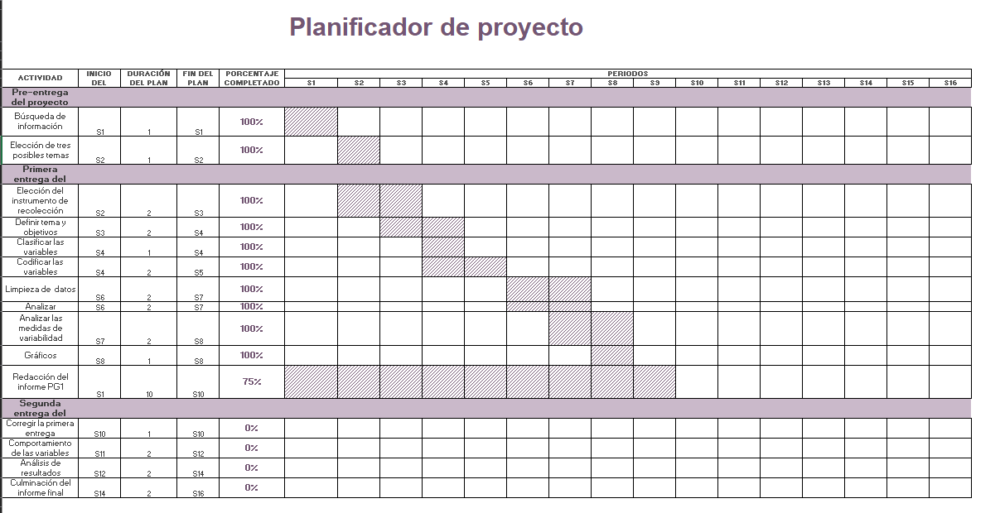

# **1. Estudio**

## 1.1. Introducción

> El Perú es uno de los principales países exportadores de minerales en el mundo, tuvo como años fructíferos **2021 y 2022** en la exportación de **cobre** ,ese hecho fue comunicado por el **MINEN(Ministerio de Energía y Minas)**, por lo que vimos conveniente obtener datos acerca de estas exportaciones formando de esa manera los siguientes objetivos para este proyecto.

## 1.2.Relevancia

> Este enfoque se centra en el análisis específico de las exportaciones de cobre, que es uno de los productos más importantes del sector minero peruano. Además, el enfoque en el análisis de las exportaciones permite explorarlos patrones y tendencias en la venta de cobre al extranjero durante los dos años en cuestión.

## 1.3. Objetivos {.tabset}

### 1.3.1. Objetivo General

> -   Analizar las exportaciones de cobre del sector minero peruano en los años 2021 y 2022"

### 1.3.2. Objetivos específicos:

> -   Comparar el número de exportaciones del sector minero con respecto a otros sectores económicos
> -   Determinar a qué países de destino vendemos más cobre y qué cantidad.
> -   Comparar la cantidad de cobre que se exporta con respecto a otros minerales.
> -   Comparar la variación de números de registros de exportación del cobre durante los años 2021 y 2022 respectivamente.
> -   Identificar qué empresa exportadora de cobre genera mayores ingresos de divisas al Perú.
> -   Comparar el precio del cobre promedio mensual por toneladas entre los años 2021 y 2022.
> -   Analizar las variables discretas y continuas.
> -   Identificar y clasificar los eventos dependientes o independientes.
> -   Plantear, analizar y resolver las probabilidades de tipo empíricas y condicionales.
> -   Identificar y analizar el tipo de distribución de las variables discretas y continuas.


## 1.4. Planificación

-   Para poder cumplir con los objetivos del estudio es necesario organizar las actividades a través de algún gráfico, en este caso empleamos el gráfico de Gantt para poder organizar las actividades a desempeñar para la entrega PG1 del ciclo 2023-1.



```{r,echo=FALSE,message=TRUE}
data <- data.frame(name = c('Alejandra', 'Anayeli','Brigitte y Diego',' Yoman y Anayeli','Diego y Alejandra'), 
start = c(10,11,12,12,13),
end = c(11,12,14,14,15),
Actividades = c('Análisis de variables', 'Planteamiento de probabilidades','Clasificación de probabilidades','Análisis de distribuciones','Planteamiento y resolución de distribuciones')
)
```

## 1.5. Elaboración del informe

```{r}
if (!require("ggplot2", character.only = TRUE)) {
  install.packages("ggplot2")
}
if (!require("ggthemes", character.only = TRUE)) {
  install.packages("ggthemes")
}
```

```{r}
ggplot(data, aes(x=start, xend=end, 
                 y=name, yend=name, color= Actividades)) +
  theme_bw()+
  geom_segment(size=8) +
  labs(title='Elaboración del informe PG2', x='Semanas', y='Responsables') +
  theme_economist() + 
  theme_update(plot.title = element_text(hjust = 0.5), axis.title = element_text(hjust=0.5))

```

```{r,echo=FALSE,include=FALSE}
if (!require("readr", character.only = TRUE)) {
  install.packages("readr")
}
if (!require("readxl", character.only = TRUE)) {
  install.packages("readxl")
}
if (!require("dplyr", character.only = TRUE)) {
  install.packages("dplyr")
}
if (!require("stringr", character.only = TRUE)) {
  install.packages("stringr")
}
if (!require("plotrix", character.only = TRUE)) {
  install.packages("plotrix")
}
if (!require("scales", character.only = TRUE)) {
  install.packages("scales")
}
if (!require("ggplot2", character.only = TRUE)) {
  install.packages("ggplot2")
}
if (!require("ggthemes", character.only = TRUE)) {
  install.packages("ggthemes")
}
if (!require("mvtnorm", character.only = TRUE)) {
  install.packages("mvtnorm")
}
if (!require("rriskDistributions", character.only = TRUE)) {
  install.packages("rriskDistributions")
}
if (!require("fastGraph", character.only = TRUE)) {
  install.packages("fastGraph")
}
```
```{r,echo=FALSE,include=FALSE}

library(dplyr);
library(readr);
library(readxl);
library(stringr);
library(plotrix);
library(scales);
library(ggplot2);
library(ggthemes);
library(mvtnorm)
library(rriskDistributions)
library(fastGraph)
```

```{r,echo=FALSE,include=FALSE}
export <- read_excel("export.xlsx")
items <- read_excel("items.xlsx")
minerales <- read_excel("minerales.xlsx")
sector <- read_excel("sector.xlsx")
paises<- read.csv2("destino31.csv",header =T,sep =';')
```
```{r,echo=FALSE,include=FALSE}
sector = sector[-c(1), ] #Borro el NA que estobarba de sector
```
```{r,echo=FALSE,include=FALSE}
paises = paises[-c(260:993), ] #Borro las filas que quedaron en NA

paises = select(paises,País.Destino,Año,Meses,Total.registros,Total.KG,US.KG,US)
```

```{r,echo=FALSE,include=FALSE}
paises = rename(paises,Pais_Destino = "País.Destino",Anio = "Año",Total_Registros = "Total.registros",Total_KG = "Total.KG",US_Dolar = "US",US_KG = "US.KG")

paises = select(paises,Pais_Destino,Anio,Meses,Total_Registros,Total_KG,US_KG,US_Dolar)
```
```{r,echo=FALSE,include=FALSE}
paises$Total_Registros = as.integer(paises$Total_Registros)
paises$Total_KG = as.numeric(paises$Total_KG)
paises$US_KG = as.numeric(paises$US_KG)
paises$US_Dolar = as.numeric(paises$US_Dolar)
```
```{r,echo=FALSE,include=FALSE}
paises <- mutate(paises, `Total_Registros`= as.integer(`Total_Registros`))
```
```{r,echo=FALSE,include=FALSE}
export = rename(export,Anio = "AÑO",Total_Registros = "Total registros",Total_KG = "Total KG",US_KG = "US$ / KG",US_Dolar = "US$")
```
```{r,echo=FALSE,include=FALSE}
export <- mutate(export,`Total_Registros` = as.integer(`Total_Registros`),`Anio` = as.integer(`Anio`))
```
```{r,echo=FALSE,include=FALSE}
minerales = rename(minerales,US_Dolar = "US $", Anio = "Año");
```
```{r,echo=FALSE,include=FALSE}
minerales$Anio = as.integer(minerales$Anio);
```
```{r,echo=FALSE,include=FALSE}
items = rename(items,Descrip_Part_Aduanera = "Descripción Partida Aduanera",
               Anio = "Año",
               Total_Registros = "Total registros",
               Total_KG = "Total KG",
               US_KG = "US$ / KG",
               US_Dolar = "US$")
```
```{r,echo=FALSE,include=FALSE}
items$Anio = as.integer(items$Anio)
items$Total_Registros = as.integer(items$Total_Registros)
```

```{r,echo=FALSE,include=FALSE}
#2021
export %>% filter(Anio == 2021 )%>%group_by(Exportador) %>% summarise(TotalDolaresFull = sum(US_Dolar)) -> comparacionexport2021
#2022
export %>% filter(Anio == 2022 )%>%group_by(Exportador) %>% summarise(TotalDolaresFull = sum(US_Dolar)) -> comparacionexport2022
```
```{r,echo=FALSE,include=FALSE}
comparacionexport2021$newDollarsMillion = round(comparacionexport2021$TotalDolaresFull/1000000 , 4)
comparacionexport2022$newDollarsMillion = round(comparacionexport2022$TotalDolaresFull/1000000 , 4)
```
```{r,echo=FALSE,include=FALSE}
export %>% filter(Anio == 2021) %>% group_by(Exportador) %>% summarise(TotalRegistrosFull = sum(Total_Registros)) ->exportRegistrosFull2021
```
```{r,echo=FALSE,include=FALSE}
export %>% filter(Anio == 2022) %>% group_by(Exportador) %>% summarise(TotalRegistrosFull = sum(Total_Registros)) -> exportRegistrosFull2022
```
```{r,echo=FALSE,include=FALSE}
export %>% filter(Anio == 2022) %>% group_by(Exportador) %>% summarise(registerFull = sum(Total_Registros),DolaresFull =  sum(US_Dolar),DolaresMillion = round(sum(US_Dolar)/100000,3)) %>% arrange(desc(DolaresMillion)) -> exportDolarRegisFull2022
export %>% filter(Anio == 2021) %>% group_by(Exportador) %>% summarise(registerFull = sum(Total_Registros),DolaresFull =  sum(US_Dolar),DolaresMillion = round(sum(US_Dolar)/100000,3)) %>% arrange(desc(DolaresMillion)) -> exportDolarRegisFull2021
```
```{r,echo=FALSE,include=FALSE}
subset(export,Meses == "Diciembre" & Anio == 2022)-> empresas_diciembre2022
```
```{r,echo=FALSE,include=FALSE}
paises %>% filter(Anio == 2021) %>% group_by(Pais_Destino) %>% summarise(newKgTon = round(sum(Total_KG)/1000000,4)) %>% arrange(desc(newKgTon)) -> paises_KgTon2021
```
```{r,echo=FALSE,include=FALSE}
paises %>% filter(Anio == 2021) %>% distinct(Pais_Destino,Meses) %>% group_by(Pais_Destino) %>% summarise(numMeses = n())->contaMesesPais2021
```
```{r,echo=FALSE,include=FALSE}
paises %>% filter(Anio == 2022) %>% distinct(Pais_Destino,Meses) %>% group_by(Pais_Destino) %>% summarise(numMeses = n())->contaMesesPais2022
```

# Análisis Probabílistico

Una variable interesante  el número  de empresas exportadoras peruanas de cobre y sus ventas en el mercado internacional.De acuerdo a la data obtenido de la Sunat y Veritream, se observó el incremento del año 2022 y 2021 de empresas dedicadas a este rubro . Por lo que podemos colegir que este sector genera rentables ganancias.
Variable: Empresas exportadoras 2021 y 2022.

## **Probabilidades Empíricas**

Por intersección:

### Problema 1:
Algunas empresas exportadoras se mantienen dentro del mercado internacional durante los años 2021 y 2022, debido a los beneficios que la da la Sunat, por ejemplo, están exentas al pago de aranceles e IGV y tienen derecho al saldo a favor del exportador.Por ello, se desea saber,¿cual es la probabilidad que las empresas ofertaron el cobre 2021 esten presentes en el 2022?


$$\\A = \{Empresas\ exportadoras\ del\ año\ 2021\ pero\ que\ no\ esten\ en\ 2022\}$$
$$\\N(A) = 21$$
```{r}
(length(comparacionexport2021$Exportador) - length(intersect(comparacionexport2021$Exportador,comparacionexport2022$Exportador)))
```
$$\\P(A) = \frac{N(A)}{N(\Omega)} = \frac{21}{71} = 0.2957746$$
```{r}
(length(comparacionexport2021$Exportador) - length(intersect(comparacionexport2021$Exportador,comparacionexport2022$Exportador)))/length(union(comparacionexport2021$Exportador,comparacionexport2022$Exportador))
```

$$\\B = \{Empresas\ exportadoras\ del\ año\ 2022\ pero\ que\ no\ estan\ en\ 2021\}$$
$$\\N(B) = 24$$
```{r}
(length(comparacionexport2022$Exportador) - length(intersect(comparacionexport2021$Exportador,comparacionexport2022$Exportador)))
```
$$\\P(B) = \frac{N(B)}{N(\Omega)} = \frac{24}{71} = 0.3380282$$
```{r}
(length(comparacionexport2022$Exportador) - length(intersect(comparacionexport2021$Exportador,comparacionexport2022$Exportador)))/length(union(comparacionexport2021$Exportador,comparacionexport2022$Exportador))
```

$$\\A\cap B = \{Empresas\ presentes\ en\ el\ año\ 2021\ y\ 2022\}$$
$$\\N(A\cap B) = 26$$
```{r}
length(intersect(comparacionexport2021$Exportador,comparacionexport2022$Exportador))
```
$$\\P(A\cap B) = \frac{N(A\cap B)}{N(\Omega)} = \frac{26}{71} = 0.3661972$$
```{r}
length(intersect(comparacionexport2021$Exportador,comparacionexport2022$Exportador))/length(union(comparacionexport2021$Exportador,comparacionexport2022$Exportador))
```

$$\\\Omega = \{ Empresas\ del\ año\ 2021\ y\ 2022\}$$
$$\\N(\Omega) = 71$$
```{r}
length(union(comparacionexport2021$Exportador,comparacionexport2022$Exportador))
```
$$\\P(\Omega) = P(A\cap B) + P(A) +P(B) = 1 = 0.3661972 + 0.2957746 +0.3380282 $$
```{r}
0.3661972 + 0.2957746 +0.3380282
```

$$\\Analizando:$$
$$\\Número\ de\ empresas\ del\ 2021\ y\ 2022:71$$
$$\\Número\ de\ empresas\ presentes\ en\ el\ 2021\ y\ 2022:26$$
$$\\La\ probabilidad\ que\ representa\ la\ empresas\ presentes\ en\ el\ año\ 2021\ y\ 2022:0.37$$
```{r}
print("La probabilidad que representa el numero de empresas exportadoras esten presentes en 2021 y 2022 es:")
round(length(intersect(comparacionexport2021$Exportador,comparacionexport2022$Exportador))/length(union(comparacionexport2021$Exportador,comparacionexport2022$Exportador)),2)
```
$\\P(A\cap B)=\frac{N(A\cap B)}{N(\Omega)}= \frac{26}{71} =0.37$

- Por intersección

### Problema 2:

¿Cuál es la probabilidad que las empresas exportadoras tengan mayor de un registro durante el año 2021 y 2022 respectivamente?

#### Análisis 2021
```{r}
export %>% filter(Anio == 2021) %>% group_by(Exportador) %>% summarise(TotalRegistrosFull = sum(Total_Registros)) ->exportRegistrosFull2021
```

Resolución:
$$\\\Omega = \{Empresas\ del\ 2021\}$$
$$\\N(\Omega) =47 $$
```{r}
nrow(exportRegistrosFull2021)
```


$$\\A = \{Empresas\ que\ su\ numero\ de\ registros\ es\ mayor\ a\ 1\}$$
$$\\N(A) = 32$$
```{r}
nrow(exportRegistrosFull2021 %>% filter(TotalRegistrosFull > 1))
```
$$\\A^{c} = \{Empresas\ que\ su\ numero\ de\ registros\ es\ menor\ o\ igual\ a\ 1\}$$ 
$$\\N(A^{c}) = 15$$ 
```{r}
nrow(exportRegistrosFull2021 %>% filter(TotalRegistrosFull <= 1))
```
$$\\P(A^{c}) = \frac{N(A^{c})}{N(\Omega)} = \frac{15}{47} = $$ 


$$\\P(A) = \frac{N(A)}{N(\Omega)} = \frac{32}{47} = 0.6808511$$
```{r}
32/47
```

$$\\La\ probabilidad\ de\ que\ las\ empresas\ tengan\ un\ numero\ mayor\ a\ 1\ es\ 0.6808511$$

```{r}
round(nrow(exportRegistrosFull2021 %>% filter(TotalRegistrosFull > 1))/nrow(exportRegistrosFull2021),2)
```

#### Análisis 2022

Resolución:
$\Omega = \{Empresas\ del\ 2022\}$
$A = \{Cantidad\ de\ empresas\ que\ su\ número\ de\ registro\ es\ mayor\ a\ 1 \} \\ P(A) = \frac{N(A)}{N(\Omega)}$

```{r}
export %>% filter(Anio == 2022) %>% group_by(Exportador) %>% summarise(TotalRegistrosFull = sum(Total_Registros)) -> exportRegistrosFull2022
```

Resolución:
$$\\\Omega = \{Empresas\ del\ 2022\}$$
$$\\N(\Omega) =50 $$
```{r}
nrow(exportRegistrosFull2022)
```

$$\\A = \{Empresas\ que\ su\ numero\ de\ registros\ es\ mayor\ a\ 1\}$$
$$\\N(A) = 35$$
```{r}
nrow(exportRegistrosFull2022 %>% filter(TotalRegistrosFull > 1))
```
$$\\A^{c} = \{Empresas\ que\ su\ numero\ de\ registros\ es\ menor\ o\ igual\ a\ 1\}$$ 
$$\\N(A^{c}) = 15$$ 
```{r}
nrow(exportRegistrosFull2022 %>% filter(TotalRegistrosFull <= 1))
```

$$\\P(A^{c}) = \frac{N(A^{c})}{N(\Omega)} = \frac{15}{50} =  0.3$$ 
```{r}
15/50
```

$$\\P(A) = \frac{N(A)}{N(\Omega)} = \frac{35}{50} = 0.7$$
```{r}
35/50
```


$$\\La\ probabilidad\ de\ que\ las\ empresas\ tengan\ un\ numero\ mayor\ a\ 1\ es\ 0.7$$

```{r}
round(nrow(exportRegistrosFull2022 %>% filter(TotalRegistrosFull > 1))/nrow(exportRegistrosFull2022),2)
```

### Problema 3
Analizar los datos financieros de los años 2021 y 2022 de la cantidad de ingresos recaudados por las empresas exportadoras es muy interesante, sobre todo debemos estar observando a las empresas que tienen una cantidad de ingresos menor a la media para ver su progreso durante los siguientes años.
$Analisis\ 2021$
####Analisis 2021
¿Cuál es la probabilidad de que las empresas exportadoras hallan generado una cantidad de dinero menor a la media de la cantidad de millones de dolares recaudados en 2021?

Resolución:

$$\\Media\ de\ ingresos\ en\ millones\ de\ dolares = 377.0193$$
```{r}
mean(comparacionexport2021$newDollarsMillion)
```

$$\\A = \{Empresas\ que\ tuvieron\ ingreso\ menor\ a\ la\ media\ en\ 2021\}$$
$$\\N(A) = 37$$
```{r}
nrow(comparacionexport2021 %>% filter(newDollarsMillion < mean(newDollarsMillion)))
```
$$\\N(A^{c}) = 11$$
```{r}
abs(nrow(comparacionexport2021 %>% filter(newDollarsMillion < mean(newDollarsMillion)))- nrow(comparacionexport2021))
```
$$\\P(A^{c}) = \frac{10}{47} = \frac{N(A^{c})}{N(\Omega)} = 0.212766$$
```{r}
abs(nrow(comparacionexport2021 %>% filter(newDollarsMillion < mean(newDollarsMillion)))- nrow(comparacionexport2021))/nrow(comparacionexport2021)
```


$$\\\Omega = \{Empresas\ de\ 2021\}$$
$$\\N(\Omega) = 47$$
```{r}
nrow(comparacionexport2021)
```

$$\\P(A) = \frac{37}{47} = \frac{N(A)}{N(\Omega)} =0.787234 $$
```{r}
nrow(comparacionexport2021 %>% filter(newDollarsMillion< mean(newDollarsMillion)))/nrow(comparacionexport2021)
```
```{r}
round(nrow(comparacionexport2021 %>% filter(newDollarsMillion< mean(newDollarsMillion)))/nrow(comparacionexport2021),2)
```
$$\\La\ probabilidad\ del\ evento\ atomico\ A\ que\ las\ empresas\ del\ año\ hayan\ tenido\ ingresos\ menores\ a\ la\ media\ es\ 0.787234$$

#### Analisis 2022
¿Cuál es la probabilidad de que las empresas exportadoras hallan generado una cantidad de dinero menor a la media de la cantidad de millones de dolares recaudados en 2022?

Resolución:

$$\\Media\ de\ ingresos\ en\ millones\ de\ dolares = 303.0325$$
```{r}
mean(comparacionexport2022$newDollarsMillion)
```

$$\\A = \{Empresas\ que\ tuvieron\ ingreso\ menor\ a\ la\ media\ en\ 2022\}$$
$$\\N(A) = 39$$
```{r}
nrow(comparacionexport2022 %>% filter(newDollarsMillion < mean(newDollarsMillion)))
```
$$\\N(A^{c}) = 11$$
```{r}
abs(nrow(comparacionexport2022 %>% filter(newDollarsMillion < mean(newDollarsMillion)))- nrow(comparacionexport2022))
```
$$\\P(A^{c}) = \frac{11}{50} = \frac{N(A^{c})}{N(\Omega)} = 0.22$$
```{r}
abs(nrow(comparacionexport2022 %>% filter(newDollarsMillion < mean(newDollarsMillion)))- nrow(comparacionexport2022))/nrow(comparacionexport2022)
```


$$\\\Omega = \{Empresas\ de\ 2022\}$$
$$\\N(\Omega) = 50$$
```{r}
nrow(comparacionexport2022)
```

$$\\P(A) = \frac{39}{50} = \frac{N(A)}{N(\Omega)} =0.78 $$
```{r}
nrow(comparacionexport2022 %>% filter(newDollarsMillion< mean(newDollarsMillion)))/nrow(comparacionexport2022)
```
```{r}
round(nrow(comparacionexport2022 %>% filter(newDollarsMillion<mean(newDollarsMillion)))/nrow(comparacionexport2022),2)
```
$$\\La\ probabilidad\ del\ evento\ atomico\ A\ que\ las\ empresas\ del\ año\ hayan\ tenido\ ingresos\ menores\ a\ la\ media\ es\ 0.78$$

## **Probabilidades Condicionales**


### Problema 1:
Las empresas exportadoras suelen recibir solicitudes por parte de empresas importadoras por lo que alguna de ellas tienen un numero de registros elevado al compararse con otra por lo general podemos considerar un numero de registro elevado a partir del 90,además de ello es muy interesante saber cuales de ellas superan por encima de la media la cantidad de millones de dolares recaudados.Entonces,si sabe que las empresas que tienen una cantidad de dolares por encima de la media ¿Cual es la probabilidad de que las empresas hayan tenido un numero mayor o igual de 90 registros?

##### Analisis 2021
$$\\A = \{Empresas\ que\ tienen\ un\ numero\ de\ registro\ mayor\ o\ igual\ a\ 90\}$$
$$\\B = \{Empresas\ que\ tienen\ una\ cantidad\ de\ millones\ de\ dolares\ mayor\ a\ la\ media\}$$

Los eventos que hemos usado son dependientes y a continuación la demostración:
$$\\A = \{Empresas\ que\ tienen\ un\ numero\ de\ registro\ mayor\ o\ igual\ a\ 90\}$$
$$\\B = \{Empresas\ que\ tienen\ una\ cantidad\ de\ millones\ de\ dolares\ mayor\ a\ la\ media\}$$

$$\\P(A) =0.1489362$$
```{r}
nrow(exportDolarRegisFull2021 %>% filter(registerFull >= 90))/nrow(exportDolarRegisFull2021)
```
$$\\P(B) =0.212766$$
```{r}
nrow(exportDolarRegisFull2021 %>% filter(DolaresMillion > mean(DolaresMillion)))/nrow(exportDolarRegisFull2021)
```
Si los eventos fueran independientes cumplirian esto:
$$\\P(A/B) = P(A)$$ 
$$\\P(B/A) = P(B)$$
$$\\P(A\cap B) = P(A)\times P(B)$$
Sabiendo que:
$$\\P(A/B) = \frac{P(B/A)\times P(A)}{P(B)} = \frac{P(A\cap B)}{P(B)}$$
$$\\P(B/A) = \frac{P(B/A)\times P(B)}{P(A)} = \frac{P(B\cap A)}{P(A)}$$

$$\\P(A\cap B) = 0.06382979 = P(B\cap A)$$
```{r}
nrow(exportDolarRegisFull2021%>%filter(registerFull>=90)%>% filter(DolaresMillion > mean(DolaresMillion)))/nrow(exportDolarRegisFull2021)
```

$$P(A/B) = P(A)$$
$$\\\frac{0.06382979}{0.212766} \neq 0.1489362$$
$$\\ 0.3 \neq 0.1489362$$
```{r}
0.06382979/0.212766 == 0.1489362
```

$$\\P(B/A) = P(B)$$
$$\\\frac{0.06382979}{0.1489362} \neq 0.212766$$ 
$$\\0.4285714 \neq 0.212766$$
```{r}
0.06382979/0.1489362
```
$$\\P(A\cap B) = P(B)\times P(A)$$ 
$$\\0.06382979 \neq 0.212766\times0.1489362$$ 
$$\\0.06382979 \neq 0.03168856$$

```{r}
0.1489362*0.212766 == 0.06382979
```
$$Evento\ Atomico\ A\ y\ B\ son\ eventos\ dependientes$$


Resolviendo la pregunta de nuestro problema:
1. Analizamos cual es la media de millones de dolares
```{r}
mean(exportDolarRegisFull2021$DolaresMillion)
```
2. Analizamos cual es la probabilidad total de que las empresas tenga un numero de dolares recaudados mayor a la media

2.1 Hallamos la probabilidad de P(B/A)

$$\\P(B/A)=\frac{P(B\cap A)}{P(A)} = 0.4285714 =\frac{3}{7}$$
```{r}
nrow(exportDolarRegisFull2021 %>% filter(registerFull >= 90) %>% filter(DolaresMillion > mean(DolaresMillion)))/nrow(exportDolarRegisFull2021 %>% filter(registerFull >= 90))
```
2.2 Hallamos la probabilidad de que las empresas tenga un numero menor a 90 de registros y su cantidad de dolares sea mayor a la media

Probabilidad P(B/Ac):
$$\\P(B/A^{c})=\frac{P(B\cap A^{c})}{P(A^{c})} = 0.175 =\frac{7}{40}$$
```{r}
nrow(exportDolarRegisFull2021 %>% filter(registerFull < 90) %>% filter(DolaresMillion > mean(DolaresMillion)))/ (nrow(exportDolarRegisFull2021 %>% filter(registerFull < 90)))
```

2.3 Sumamos esas 2 probabilidad anteriores y multiplicadas por sus correspondientes eventos A P(B/Ac)* P(Ac) + P(B/A)*P(A)

Calculando la probabilidad de A(P(A))
$$\\P(A)= \frac{N(A)}{N(\Omega)} = 0.1489362 =\frac{7}{47}$$
```{r}
nrow(exportDolarRegisFull2021 %>% filter(registerFull >= 90))/nrow(exportDolarRegisFull2021)
```
Calculando la probabilidad de Ac P(Ac)
$$\\P(A^{c})= \frac{N(A^{c})}{N(\Omega)} = 0.8510638 =\frac{40}{47}$$
```{r}
nrow(exportDolarRegisFull2021 %>% filter(registerFull < 90))/nrow(exportDolarRegisFull2021)
nrow(exportDolarRegisFull2021 %>% filter(registerFull < 90))
```
La probabilidad total de que las empresas tengan una cantidad de dolares por encima de la media P(B)
```{r}
(0.4285714*0.1489362 +  0.175 *0.8510638)
```

$$\\A = \{Empresas\ que\ tienen\ un\ numero\ de\ registro\ mayor\ o\ igual\ a\ 90\}$$
$$\\B = \{Empresas\ que\ tienen\ una\ cantidad\ de\ millones\ de\ dolares\ mayor\ a\ la\ media\}$$
$$\\P(A/B) = \frac{P(B/A)\times P(A)}{P(B)}$$

2.5 Aplicamos el teorema de Bayes hallamos la probabilidad de que las empresas tenga un numero mayor o igual a 90 registros sabiendo que superaban a la media d es:
$$P(A/B) = \frac{P(B/A)\times P(A)}{P(B)} = \frac{0.4285714*0.1489362}{0.212766} = 0.3$$
```{r}
(0.4285714*0.1489362)/0.212766
```
$$La\ probabilidad\ de\ que\ las\ empresas\ tengan\ un\ numero\ de\ registros\ mayor\ o\ igual\ a\ 90\\ dado\ que\ se\ sabia\ que\ superaban\ la\ media\ de\ millones\ de\ dolares$$

##### Analisis 2022
$$\\A = \{Empresas\ que\ tienen\ un\ numero\ de\ registro\ mayor\ o\ igual\ a\ 90\}$$
$$\\B = \{Empresas\ que\ tienen\ una\ cantidad\ de\ millones\ de\ dolares\ mayor\ a\ la\ media\}$$

```{r}
export %>% filter(Anio == 2022) %>% group_by(Exportador) %>% summarise(registerFull = sum(Total_Registros),DolaresFull =  sum(US_Dolar),DolaresMillion = round(sum(US_Dolar)/100000,3)) %>% arrange(desc(DolaresMillion)) -> exportDolarRegisFull2022
```

Resolviendo la pregunta de nuestro problema:
1. Analizamos cual es la media de millones de dolares
```{r}
mean(exportDolarRegisFull2022$DolaresMillion)
```
2. Analizamos cual es la probabilidad total de que las empresas tenga un numero de dolares recaudados mayor a la media

2.1 Hallamos la probabilidad de P(B/A)
$$\\P(B/A)=  \frac{P(B\cap A)}{P(A)} = 0.4 =\frac{2}{5}$$
```{r}
nrow(exportDolarRegisFull2022 %>% filter(registerFull >= 90) %>% filter(DolaresMillion > mean(DolaresMillion)))/nrow(exportDolarRegisFull2022 %>% filter(registerFull >= 90))
```

2.2 Hallamos la probabilidad de P(B/Ac)

Probabilidad P(B/Ac):
$$\\P(B/A^{c})=  \frac{P(A^{c}\cap B)}{P(A^{c})} = 0.2222222 =\frac{10}{45}$$
```{r}
nrow(exportDolarRegisFull2022 %>% filter(registerFull < 90) %>% filter(DolaresMillion > mean(DolaresMillion)))/ (nrow(exportDolarRegisFull2022 %>% filter(registerFull < 90)))
```

2.3 Sumamos esas 2 probabilidad anteriores y multiplicadas por sus correspondientes eventos A P(B/Ac)* P(Ac) + P(B/A)*P(A)

Calculando la probabilidad de A (P(A))
$$\\P(A) = 0.1 = \frac{5}{50}$$
```{r}
nrow(exportDolarRegisFull2022 %>% filter(registerFull >= 90))/nrow(exportDolarRegisFull2022)
nrow(exportDolarRegisFull2022 %>% filter(registerFull >= 90))
```
Calculando la probabilidad de Ac P(Ac)
$$\\P(A^{c}) = 0.9 = \frac{45}{50}$$

```{r}
nrow(exportDolarRegisFull2022 %>% filter(registerFull < 90))/nrow(exportDolarRegisFull2022)
nrow(exportDolarRegisFull2022 %>% filter(registerFull < 90))
```
La probabilidad total de que las empresas tengan una cantidad de dolares por encima de la media P(B) = (B/A)*P(A) + P(B/Ac)
$$\\P(B) = P(B/A)*P(A) + P(B/A^{c})*P(A^{c})$$$
```{r}
(0.1*0.4)+(0.9*0.2222222)
```
2.4 Analizando el problema
$$\\A = \{Empresas\ que\ tienen\ un\ numero\ de\ registro\ mayor\ o\ igual\ a\ 90\}$$
$$\\B = \{Empresas\ que\ tienen\ una\ cantidad\ de\ millones\ de\ dolares\ mayor\ a\ la\ media\}$$
$$\\P(A/B) = \frac{P(B/A)\times P(A)}{P(B)}$$

2.5 Aplicamos el teorema de Bayes hallamos la probabilidad de que las empresas tenga un numero mayor o igual a 90 registros sabiendo que superaban a la media es:
$$\\P(A/B) = \frac{P(B/A)\times P(A)}{P(B)}$$
```{r}
(0.1*0.4)/(0.24)
```

###Problema 2
####Analisis 2022
```{r}
subset(export,Meses == "Diciembre" & Anio == 2022)-> empresas_diciembre2022
```

$$\\\Omega = Empresas\ del\ mes\ de\ diciembre\ de\ 2022$$
$$\\N(\Omega) = Numero\ de\ empresas\ del\ mes\ de\ diciembre\ de\ 2022=25$$
```{r}
nrow(empresas_diciembre2022)
```
$$\\A = \{Empresas\ con\ más\ de\ 2\ registros\ en\ el\ mes\ de\ Diciembre\}$$
$$\\B = \{Empresas\ que\ exportaron\ más\ de\ 10433357.50 kg \ de\ cobre\}$$
$$\\P(A) = \frac{11}{25} = \frac{N(A)}{N(\Omega)}=0.44$$
```{r}
nrow(empresas_diciembre2022 %>% filter(Total_Registros > 2))/nrow(empresas_diciembre2022)
```
$$\\P(B) = \frac{10}{25} = \frac{N(B)}{N(\Omega)}=0.4$$
```{r}
nrow(empresas_diciembre2022 %>% filter(Total_KG > 10433357.50))/nrow(empresas_diciembre2022)
```
Vamos a ferificar que nuestros eventos son dependientes:

Si los eventos fueran independientes cumplirian esto:
$$\\P(A/B) = P(A)\\ P(B/A) = P(B)\\P(A\cap B) = P(A)\times P(B)$$
Sabiendo que:
$$\\P(A/B) = \frac{P(B/A)\times P(A)}{P(B)} = \frac{P(A\cap B)}{P(B)}$$
$$\\\\P(B/A) = \frac{P(B/A)\times P(B)}{P(A)} = \frac{P(B\cap A)}{P(A)}$$
$$\\P(A/B) = \frac{P(A\cap B)}{P(B)} = 0.7$$
```{r}
nrow(empresas_diciembre2022 %>% filter(Total_Registros > 2 & Total_KG >10433357.50))/nrow(empresas_diciembre2022 %>% filter(Total_KG >10433357.50))
```
```{r}
0.28/0.4
```

$$\\P(B/A) = \frac{P(B\cap A)}{P(A)} = 0.6363636$$
```{r}
nrow(empresas_diciembre2022 %>% filter(Total_Registros > 2 & Total_KG >10433357.50))/nrow(empresas_diciembre2022 %>% filter(Total_Registros > 2))
```
```{r}
nrow(empresas_diciembre2022 %>% filter(Total_Registros > 2 & Total_KG >10433357.50))/nrow(empresas_diciembre2022)
```
```{r}
0.28/0.44
```


$$\\P(A) = \frac{N(A)}{N(\Omega)} = 0.44$$
```{r}
nrow(empresas_diciembre2022%>%filter(Total_Registros > 2))/nrow(empresas_diciembre2022)
```
$$\\P(B) = \frac{N(B)}{N(\Omega)} = 0.4$$
```{r}
nrow(empresas_diciembre2022%>%filter(Total_KG >10433357.50))/nrow(empresas_diciembre2022)
```
$$\\P(A\cap B) = \frac{N(A\cap B)}{N(\Omega)} = 0.28$$
```{r}
nrow(empresas_diciembre2022 %>% filter(Total_Registros > 2 & Total_KG >10433357.50))/nrow(empresas_diciembre2022)
```

Comprobando: 
$$P(A/B) = P(A) \\ 0.7 \neq 0.44$$
```{r}
0.7 == 0.44
```
$$ P(B/A) = P(B) \\  0.6363636\neq 0.4$$
```{r}
0.6363636 == 0.4
```
$$ P(A\cap B) = P(B)\times P(A)$$ 
$$\\0.28\neq 0.4\times0.44$$
$$\\0.28 \neq 0.176$$
```{r}
0.28 == 0.176
```
$$ Evento\ Atomico\ A\ y\ B\ son\ dependientes\ porque\ no\ cumplen\ las\ condiciones\ para\ ser\ independientes$$
Planteando el problema:
Es muy interesante saber que tal fue la exportación de cobre durante el ultimo mes del año 2022 , sobre todo la cantidad de cobre que fue exportada por arriba de los 10433357.50Kg y verificar que su numero de registro es mayor a 2. Por lo que debemos preguntarnos ahora ¿Cual es la probabilidad de que las empresas tengan un numero mayor a 2 registros ,si sabemos que esta tiene una cantidad de kilogramos por encima de los 10433357.50Kg?


```{r}
nrow(empresas_diciembre2022%>% filter(Total_Registros > 2))
nrow(empresas_diciembre2022%>% filter(Total_Registros <= 2))
nrow(empresas_diciembre2022)
```
$$\\A = \{Empresas\ con\ más\ de\ 2\ registros\ en\ el\ mes\ de\ Diciembre\}$$
$$\\B = \{Empresas\ que\ exportaron\ más\ de\ 10433357.50 kg \ de\ cobre\}$$
Hallamos la probabilidad total de que las empresas exportaron más de 10433357.50kg de cobre
$$\\P(A^{c}) = \frac{N(A^{c})}{N(\Omega)} = 0.56$$
```{r}
nrow(empresas_diciembre2022 %>% filter(Total_Registros <= 2))/nrow(empresas_diciembre2022)
```

$$\\P(A^{c}\cap B) =0.12$$
```{r}
nrow(empresas_diciembre2022 %>% filter(Total_Registros <= 2 & Total_KG > 10433357.50))/nrow(empresas_diciembre2022)
```
$$\\P(A\cap B) =0.28$$
```{r}
nrow(empresas_diciembre2022 %>% filter(Total_Registros > 2 & Total_KG > 10433357.50))/nrow(empresas_diciembre2022)
```


$$\\Teorema\ de\ la\ probabilidad\ total:$$
$$\\P(B) = P(B/A)*P(A) + P(B/A^{c})*P(A^{c})$$
$$\\P(B/A^{c}) = \frac{P(A^{c}\cap B)}{P(A^{c})} = \frac{0.12}{0.56} = 0.2142857$$
```{r}
nrow(empresas_diciembre2022 %>% filter(Total_Registros <= 2 & Total_KG > 10433357.50))/nrow(empresas_diciembre2022)
```
```{r}
0.12/0.56
```


$$\\P(B) = (0.6363636 * 0.44) + (0.2142857*0.56) =0.4$$
```{r}
(0.6363636 * 0.44) + (0.2142857*0.56)
```
$$\\Teorema\ de\ Bayes$$
$$\\P(A/B) = \frac{P(A\cap B)}{P(B)} = \frac{0.28}{0.4} = 0.7$$
```{r}
0.28/0.4
```
$$La\ probabilidad\ de\ que\ las\ empresas\ sean\ de\ un\ número\ de\ registro\ mayor\ a\ 2\ dado\ que\ la\ cantidad\\ que\ exporto\ en\ el\ mes\ de\ diciembre\ fue\ mayor\ a\ 10433357.50\ es\ 0.7 $$


###Problema 3 
####Analisis 2021

```{r}
paises %>% filter(Anio == 2021) %>% group_by(Pais_Destino) %>% summarise(newKgTon = round(sum(Total_KG)/1000000,4)) %>% arrange(desc(newKgTon)) -> paises_KgTon2021
```

```{r}
paises_KgTon2021
```
```{r}
mean(paises_KgTon2021$newKgTon)
```


$$\\A = \{Empresas\ que\ pertencen\ a\ Asia\}$$
$$\\B = \{Empresas\ con\ cantidad\ de\ cobre\ exportado\ en paises\ mayor\ a\ la\ media\ de\ 370.3966\ Tm\}$$
$$\\P(A) = \frac{N(A)}{N(\Omega)} = \frac{7}{21} =0.3333333$$
```{r}
nrow(paises_KgTon2021 %>% filter(Pais_Destino %in% c("TAIWÁN", "INDIA","FILIPINAS","CHINA", "JAPÓN","COREA DEL SUR","MALASIA")))/nrow(paises_KgTon2021)
```
$$\\P(B) = \frac{N(B)}{N(\Omega)} = \frac{3}{21} =0.1428571$$
```{r}
nrow(paises_KgTon2021 %>% filter(newKgTon > mean(newKgTon)))/nrow(paises_KgTon2021)
```
Si los eventos fueran independientes cumplirian esto:
$$\\P(A/B) = P(A)$$ 
$$\\P(B/A) = P(B)$$ 
$$\\P(A\cap B) = P(A)\times P(B)$$
Sabiendo que:
$$\\P(A/B) = \frac{P(B/A)\times P(A)}{P(B)} = \frac{P(A\cap B)}{P(B)}$$
$$\\P(B/A) = \frac{P(B/A)\times P(B)}{P(A)} = \frac{P(B\cap A)}{P(A)}$$
$$\\P(A\cap B) = \frac{3}{21} = \frac{N(A\cap B)}{N(\Omega)} = 0.1428571  = P(B\cap A)$$

```{r}
nrow(paises_KgTon2021 %>% filter(newKgTon > mean(newKgTon) & Pais_Destino %in% c("TAIWÁN", "INDIA","FILIPINAS","CHINA", "JAPÓN","COREA DEL SUR","MALASIA")))/nrow(paises_KgTon2021)
```
$$\\P(A/B) = \frac{0.1428571}{0.1428571} = 1$$
$$\\P(A/B) = P(A)\\ 1\neq 0.3333333$$
```{r}
1== 0.3333333
```

$$\\P(B/A) = \frac{0.1428571}{0.3333333} = \frac{P(B\cap A)}{P(A)} = 0.4285713$$
```{r}
0.1428571/0.3333333
```
$$\\P(B/A) = P(B)\\ 0.4285713\neq 0.1428571$$
```{r}
0.4285713==0.1428571
```
$$\\P(A\cap B) = P(B) * P(A)$$ 
$$\\0.1428571\neq 0.1428571 * 0.3333333$$
$$\\0.1428571\neq0.04761903$$
```{r}
0.1428571 * 0.3333333
```
$$Los\ atomicos\ A\ y\ B\ son\ dependientes\ porque\ no\ cumple\ ninguna\ de\ las\ propiedades\ para\ ser\ independientes$$
Planteando el problema:
La mayoria de las exportaciones de cobre son gracias a los paises asiaticos debido a su gran afluencia en el mercado del comercio minero,se tiene un reporte sobre los paises del año 2021 y la cantidad de Tm de cobre que importaron con el fin de saber quienes superaron la media de ese año¿Cuál es la probabilidad de que la empresa pertenezca a un pais asiatico si la cantidad que importo durante ese año es mayor a la media?

$$\\A = \{Paises\ destino\ de\ Asia\ a\ los\ que\ que\ se\ exporto\ cobre\}$$
$$\\B = \{ Paises\ que\ exportaron\ una\ cantidad\ mayor\ a\ la\ media\ de\ Tm\ de\ cobre\}$$

$$\\Media\ de\ Tm\ de\ cobre = 370.3966$$
```{r}
mean(paises_KgTon2021$newKgTon)
```
$$\\P(B/A^{c}) = \frac{P(A^{c}\cap B)}{P(A^{c})} = \frac{0}{0.6666667} = 0$$
$$\\P(A^{c}\cap B) = \frac{0}{21} = \frac{N(A^{c}\cap B)}{N(\Omega)} = 0$$
```{r}
nrow(paises_KgTon2021 %>% filter(newKgTon > mean(newKgTon) & !(Pais_Destino %in% c("TAIWÁN", "INDIA","FILIPINAS","CHINA", "JAPÓN","COREA DEL SUR","MALASIA"))))/nrow(paises_KgTon2021)
```
$$\\P(A^{c}) = \frac{14}{21} = 0.6666667$$
```{r}
nrow(paises_KgTon2021 %>% filter(!(Pais_Destino %in% c("TAIWÁN", "INDIA","FILIPINAS","CHINA", "JAPÓN","COREA DEL SUR","MALASIA"))))/nrow(paises_KgTon2021)
```

$$\\Teorema\ de\ la\ probabilidad\ total$$
$$\\P(B) = P(B/A)*P(A) + P(B/A^{c})*P(A^{c})$$ 
$$\\P(B)=0.4285713*0.3333333+0*0.6666667$$
$$\\P(B) = 0.1428571$$
```{r}
0.4285713*0.3333333
```
$$\\Teorema\ de\ Bayes$$
$$\\P(A/B) = \frac{P(A\cap B)}{P(B)} = \frac{0.1428571}{0.1428571} = 1$$
```{r}
 0.1428571/0.1428571
```
$$La\ probabilidad\ de\ que\ el\ pais\ sea\ asiatico\ dado\ que\ su\ Tm\ importadas\ superan\ a\ la\ media\ es\ 1\ es\ decir\ un\ evento\ seguro$$
#### **Distribución de Bernoulli**

Determinar la probabilidad que al país destino que se exporte no sea china


$$X:Número\ de\ países\ destino\ que\ no\ son\ China$$  

$$Solucion:\\ X = \left\lbrace\begin{array}{c} 1\ si\ el\ importador\ no\ es\ China\\ 0\ si\ el\ importador\ si\ es\ China\end{array}\right.$$

Paso 1: Cálculo de la frecuencia de China como país importador


```{r}
fi=table(paises$Pais_Destino[paises$Anio == 2021])
pi=round(prop.table(fi),7)
cbind(fi,pi)
sum(fi)
```

```{r}
data.frame(table(paises$Pais_Destino[paises$Anio == 2021 & (paises$Pais_Destino != "China" | paises$Pais_Destino != "CHINA")]))
print("Cantidad de Frecuencia de No aparición de China")
sum(data.frame(table(paises$Pais_Destino[paises$Anio == 2021 & (paises$Pais_Destino != "China" | paises$Pais_Destino != "CHINA")]))$Freq)

print("Cantidad de Frecuencia de aparición de China")
sum(data.frame(table(paises$Pais_Destino[paises$Anio == 2021 & (paises$Pais_Destino == "China" | paises$Pais_Destino == "CHINA")]))$Freq)
```


Paso 2: Cálculo de la probabilidad de que el país importador sea China
Donde:
$$\\A = \{El\ país\ importador\ es\ China \}$$
$$\\N(A) = \{Número\ de\ veces\ que\ el\ país\ importador\ es\ China \}$$
$$\\\Omega= \{Frecuencia\ totales\ de\ los\ paises\ destinos\}$$
$$\\N(\Omega)= \{Número\ de\ frecuencia\ totales\ de\ los\ paises\ destinos\}$$


$$\\P(A) = \frac{12}{132} = \frac{N(A)}{N(\Omega)} = 0.09090909$$
```{r}
12/132
```
$$A^\complement= 1- 0.09090909= 0.9090909$$
```{r}
Ac= 1 - 0.09090909
Ac
```

 
$$La \ probabilidad \ que \ al \ país \  destino \ que \ se \ exporte \  no \ sea\  China \ es\ 0.9090909$$

$$Distribución\ de\ Bernoulli$$

$$P(X = x=1) = \left\lbrace\begin{array}{c} 0.9090909^{1}~(1-0.9090909)^{0}, x= 0.9090909 \\ 0, otro\ caso \end{array}\right.\\$$
$$Donde:\ E(X) =0.9090909\ y\ V(X) = 0.9090909(0.09090909) = 0.08264463$$
```{r}
0.9090909*(0.09090909)
```


##### Grafico 24: Bernoulli

```{r} 
barplot(c(0.9090909, 1 - 0.9090909), names.arg = nombres <- c("1", "0"), xlab = "Exito                                                       Fracaso",ylab = "Probabilidad", main = "GR24: Gráfico Bernoulli de los países destinos excepto China en 2021",ylim = c(0:1))
```


Interpretación

En este caso específico, se están graficando las probabilidades de éxito y fracaso para los países destinos, excluyendo a China, en el año 2021. La probabilidad de éxito es de aproximadamente 0.9090909 (o alrededor de 0.91), mientras que la probabilidad de fracaso es la complementaria, es decir, 1 - 0.9090909, lo que resulta aproximadamente en 0.0909091 (o cerca de 0.09).

En resumen, el gráfico de barras muestra la distribución de probabilidad de éxito y fracaso para los países destinos (excepto China) en el año 2021, donde la probabilidad de éxito es mayor y la probabilidad de fracaso es menor.

#### **Distribución Binomial**

Se sabe  el 31.91% de empresas tienen 1 registro de exportación en el 2021. Asumiendo que la elección de las  empresas es aleatoria con reemplazo y al azar, donde cada empresa es independiente de presentar un registro o no de expotación ¿Cuál es la probabilidad de que entre 10 empresas elegidas al azar,  a lo más halla 3 empresas que tengan solo un registro?

$$X: Número\ de\ empresas\ que\ tienen\ 1\ registro$$
$$X \sim B(n, p)$$


```{r}
sum(data.frame(table(exportDolarRegisFull2021$registerFull))$Freq)
data.frame(table(exportDolarRegisFull2021$registerFull))
round(15/sum(data.frame(table(exportDolarRegisFull2021$registerFull))$Freq),2)
(15/sum(data.frame(table(exportDolarRegisFull2021$registerFull))$Freq))
```
$$ Sea \ X \sim B(n = 10, p = 0.319149) $$
$$P(X ≥ 3)$$
```{r}
pbinom(3,10, 0.3191489) 
```

 $$La \  probabilidad \ de \ encontrar \ 3 \ empresas \  que \ solo \  tienen \ un \ registro \  dentro \ de \ 10 \  empresas \ es \ 0.597953$$


##### Grafico 25: Binomial
```{r}
barplot(pbinom(c(0:3),10,0.3191489), names.arg = c(0:3), xlab = "Número de éxitos", ylab = "Probabilidad acumulativa", main = "GR25:  Distribución Binomial de empresas con 1 registro",ylim = c(0:1),width = 0.2)
```
Interpretación

La gráfica binomial muestra la distribución de probabilidad acumulada de la variable aleatoria X, que representa el número de empresas que tienen solo un registro de exportación entre 10 empresas elegidas al azar y con reemplazo la probabilidad de encontrar 3 empresas con un registro es de 0.597953.

## **Distribución de Variables Continua**

### Problema 1

#### Análisis de tipo de distribución de la variable cobre(TM)

```{r}
export %>% filter(Anio == 2021) %>% group_by(Exportador) %>% summarise(new_Ton = sum(Total_KG)) -> exportEmpresasTonFull2021
exportEmpresasTonFull2021$new_Ton = round(exportEmpresasTonFull2021$new_Ton/1000000,4)
exportEmpresasTonFull2021 = exportEmpresasTonFull2021[order(exportEmpresasTonFull2021$new_Ton, decreasing = TRUE),]
```

```{r,echo=FALSE,include=FALSE}
fit.cont(exportEmpresasTonFull2021$new_Ton)
```


#### Distribución Weibull 
  
La cantidad de cobre (en TM) sigue una distribución Weibull con parámetros α= 0.2628042 y β=16.2228289.¿Cuál es la probabilidad  de que la cantidad de cobre exportado supere las 500 TM en el año 2021?

X: Cantidad de cobre  exportados al año por cada empresa expresado TM
x~ Weibull 

$$P(X > 500) = 1 - P(X \leqslant 500) = 1 - F(500)$$

```{r}
1 - pweibull(500, 0.2628042, 16.2228289)
```

#### Gráfico 26: 
```{r}
shadeDist((1-pweibull(500, 0.2628042, 16.2228289)),"dweibull",0.2628042, 16.2228289)
```
#### Interpretación

El gráfico generado mostrará la distribución Weibull con los parámetros proporcionados y resaltará el área sombreada correspondiente a la probabilidad calculada de que la cantidad de cobre exportado supere las 500 TM en el año 2021

### Problema 2

#### Análisis de la distribución de la variable continua millones de dólares

```{r,echo=FALSE,include=FALSE}
fit.cont(comparacionexport2021$newDollarsMillion)
```


#### Distribución Weibull 

Las cantidades de  millones dólares que generan anualmente las empresas exportadoras en el año 2021 siguen una distribución Weibull con parámetros α=  0.2334531 y β=25.9837624. ¿Cuál es la probabilidad que la cantidad de millones de dolares sea mayor a 400, pero menor a 800 ?


$$X: Número\ de\ millones\ de\ dolares\ generados\ por\ las\ empresas\ exportadoras\ en\ el\ año\ 2021$$
 x~ Weibull 

$$P(400 \leqslant X \leqslant 800)$$

```{r}
pweibull(800,0.2334531,25.9837624) - pweibull(400,0.2334531,25.9837624)
```


#### Grafico 27: 

```{r}
shadeDist (c(400,800),"dweibull",0.2334531,25.9837624)
```
####Interpretación

El gráfico generado muestra la distribución Weibull con los parámetros proporcionados y resalta el área sombreada correspondiente a la probabilidad calculada de que la cantidad de millones de dólares generados esté entre 400 y 800 en el año 2021.

##Conclusiones

En el  presente estudio probabilístico se hizo el uso de las probabilidades discretas nos permitió analizar las variables discretas mediante probabilidades condicionales, empíricas. Asimismo, esto nos proporcionó saber sobre la dependencia de nuestras variables y sobre como se comportaron en el año 2021 y 2022. Por otro lado, las probabilidades continuas nos permitieron analizar el comportamiento de nuestras variables

Como pudimos ver en el análisis y búsqueda de distribución de variables discretas, vimos que con los datos que tenemos para nuestro estudio, no pudimos encontrar una distribución que se adecue a los modelos estudiados en clase, es necesario utilizar técnicas de modelado más avanzadas para tal vez poder encontrar un modelo adecuado para las variables estudiadas.