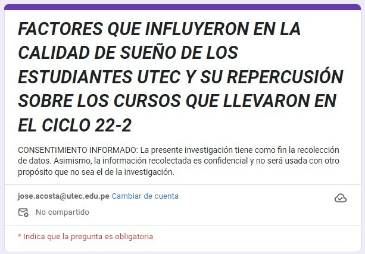

# [INTRODUCCIÓN]{style="color:deepskyblue"}

### RELEVANCIA

Como todos sabemos, el sueño es un aspecto fundamental para el bienestar
y el rendimiento académico de los estudiantes, ya que está estrechamente
relacionado con el funcionamiento cognitivo, la concentración y la
capacidad de aprendizaje. Por ello, el presente informe se centra en
analizar los factores que influyeron en la calidad de sueño de los
estudiantes de la Universidad Tecnológica del Perú (UTEC) durante el
ciclo `2022-2`, y cómo dicha calidad tuvo **repercusiones** en los
cursos que llevaron.

### OBJETIVOS

#### OBJETIVO GENERAL

Analizar los factores que influyeron en la calidad de sueño de los
estudiantes de la Universidad de Tecnología e Ingeniería (UTEC) durante el
ciclo `22-2`, y evaluar su repercusión en el desempeño académico de los
cursos que llevaron.

#### OBJETIVOS ESPECÍFICOS

1.  Determinar la relación entre el número de cursos y la calidad del
    sueño de los estudiantes de UTEC durante el ciclo 22-2.

2.  Determinar las repercusiones de la mala calidad de sueño en el
    desempeño académico de los estudiantes durante el ciclo 22-2.

3.  Analizar los niveles de estrés que influyeron negativamente en la
    calidad de sueño de los estudiantes durante el ciclo 22-2.

4.  Determinar si existe alguna relación entre el género y el promedio
    de notas en el Ciclo 2022-2.

5.  Identificar los factores académicos que afectaron la calidad de
    sueño de los estudiantes de UTEC durante el ciclo 22-2.

6.  Proponer recomendaciones y estrategias para mejorar la calidad de
    sueño de los estudiantes y su rendimiento académico en futuros
    ciclos.

### CONTEXTO

Durante el ciclo académico `2022-2` en UTEC, se observó un patrón
preocupante en la calidad del sueño de los estudiantes. Se identificaron
diversos factores que influyeron negativamente en la calidad de sueño de
los estudiantes, lo que a su vez afectó su desempeño en los cursos que
cursaron durante dicho ciclo. Estos factores pueden clasificarse en tres
categorías principales: académicos, personales y de sueño. Además, la
falta de sueño adecuado se tradujo en dificultades para concentrarse en
clase, menor retención de información, disminución de la productividad
y, en última instancia, resultados académicos subóptimos.

# [DATOS]{style="color:deepskyblue"}

### RECOLECCIÓN DE DATOS

La recolección de datos se efectuó a través de un **muestro aleatorio
simple**, empleando como instrumento la **encuesta** realizada de manera
electrónica mediante el sistema **Google Forms**. Se consideraron **11
variables** dirigidas **exclusivamente a estudiantes de la UTEC**, las
preguntas fueron diseñadas de modo que sean de fácil comprensión y
respuesta por parte de los encuestados, así mismo, se implementaron
mecanismos de control de calidad para minimizar errores en las
respuestas. La encuesta se difundió a través de redes sociales.

{fig-alt="Encuesta realizada a través de Google forms"
fig-align="center"}

### TABLA DE POBLACIÓN, MUESTRA Y MUESTREO

|                            Población                             |                    Muestra                     |     Muestreo     |
|:-------------------------------:|:----------------------:|:--------------:|
| Estudiantes de pregrado en UTEC que cursaron el semestre 2022-2. | El tamaño de la muestra es de 311 encuestados. | Aleatorio Simple |

### VARIABLES

#### NUMÉRICAS :

|                      Nombre CSV                      |       Tipo        | Nombre en R studio |               Restricción                |
|:-----------------------:|:-------------:|:-------------:|:-----------------:|
|                         Edad                         | Numérica discreta |        Edad        |            Entre 16 a 30 años            |
| Cursos que ha llevado el estudiante del ciclo 2022-2 | Numérica discreta |       Cursos       |             De 3 a 8 cursos              |
|         Promedio ponderado del ciclo 2022-2          | Numérica continua |      Promedio      | Máximo 19 el promedio en el ciclo 2022-2 |
|  Promedio de horas de sueño durante el ciclo 2022-2  | Numérica discreta |     HorasSueño     |            Entre 2 a 12 horas            |
|        Horas de ocio durante el ciclo 2022-2         | Numérica discreta |        Ocio        |              Máximo 9 horas              |

#### CATEGÓRICAS :

|                           Nombre CSV                           |        Tipo        | Nombre en R studio |                           Restricción                            |
|:--------------------:|:------------:|:------------:|:---------------------:|
|                             Género                             | Categórica nominal |       Género       | Únicamente 3 opciones: masculino, femenino y prefiero no decirlo |
|           Calidad del sueño durante el ciclo 2022-2            | Categórica ordinal |      Calidad       |                   Desde pésima hasta excelente                   |
|            Nivel de estrés durante el ciclo 2022-2             | Categórica ordinal |       Estres       |                      Desde bajo hasta alto                       |
|                 Faltas durante el ciclo 2022-2                 | Categórica ordinal |       Faltas       |                  Desde nunca hasta regularmente                  |
|         Tiempo requerido para llegar a la universidad          | Categórica ordinal |   Tiempollegada    |          Desde menos de 30 minutos hasta más de 3 horas          |
| Dificultad con el tipo de evaluaciones durante el ciclo 2022-2 | Categórica nominal |    Evaluaciones    |                         Opción múltiple                          |

### CARGA BASE DE DATOS

Delimitamos librerías y directorio de trabajo.

```{r Librerias, echo=FALSE, message=FALSE}
if (!require (ggplot2)) {install.packages ('plotly')}
if (!require (ggplot2)) {install.packages ('ggplot2')}
if(!require(readr)){install.packages('readr')}
if(!require(plyr)){install.packages('plyr')}
if(!require(dplyr)){install.packages('dplyr')}
if(!require(readr)){install.packages('readr')}
if(!require(ggplot2)){install.packages('ggplot2')}
if(!require(plotrix)){install.packages('plotrix')}
if(!require(calendR)){install.packages('calendR')}
if(!require(graphics)){install.packages('graphics')}
if(!require(Matrix)){install.packages('Matrix')}
```

```{r,echo=TRUE,message=FALSE}
library(plotly)
library(readr)
library(plyr)
library(dplyr)
library(ggplot2)
library(plotrix)
library(calendR)
library(graphics)
library(Matrix)
```

Trabajaremos con los Datos limpios:

```{r,echo=TRUE,message=FALSE}
DatosL <- read_csv("Datos2.csv")
```

# [Análisis probabilístico]{style="color:blue"}

# [Probabilidad empírica]{style="color:deepskyblue"}

## E1: Seleccionar a un estudiante de UTEC y observar la cantidad de horas promedio de sueño que tuvieron en el ciclo 2022-2.

### Espacio muestral :

```{r}
table(DatosL$HorasSueño)
Omega_1<-c(2, 3, 4, 5, 6, 7, 8, 9,12)
```

$\Omega_1=\{2, 3, 4, 5, 6, 7, 8, 9,12\}$

### **Eventos atómicos:**

Definimos el evento atómico $A_i$

$$A_i=\text{El alumno selecionado duerma n horas en promedio}$$

### **Probabilidad asociada a cada evento atómico:**

$$\mathbb{P}(A_i)=\frac{\text{Alumnos que duermen n horas en promedio}}{\text{Total de Alumnos}}$$

```{r}

A_i <- data.frame(table(DatosL$HorasSueño)) 
colnames(A_i)=c("Horasdesueño","cantidad")
A_i$FracEmpi<- paste(table(DatosL$HorasSueño), "/", nrow(DatosL), sep = "")
A_i$ProbEmpi <- round(table(DatosL$HorasSueño)/nrow(DatosL),digits=4)*100
A_i
```

```{r}
porcentajes1 <- A_i$ProbEmpi

text(x = barplot(A_i$ProbEmpi, names.arg = Omega_1, col="lightblue", main = "Probabilidad de que los estudiantes duerman determinadas horas", xlab = "Horas de Sueño", ylab = "% probabilidad", ylim = c(0, 50)),
     y = porcentajes1 + 1, labels = paste0(porcentajes1, "%"), pos = 3)
legend("topright", legend = c("Probabilidad Empírica"), fill = "lightblue")
```

Analizando las probabilidades de los eventos atómicos se llega a la
conclusión de que es más probable que un alumno que cursó el ciclo
2022-2 duerma en promedio 6 horas diarias.

## E2: Seleccionar a un estudiante de UTEC y observar el nivel de estrés que tuvieron en el ciclo 2022-2.

### Espacio muestral :

```{r}
table(DatosL$Estres)
Omega_2<-c("Alto","Medio","Bajo")
```

$\Omega_2=\{\text{Bajo}, \text{Medio}, \text{Alto}\}$

### Eventos atómicos:

Definimos el evento atómico $B_i$

$$B_1=\text{El alumno seleccionado tuvo un nivel de estrés Alto en el ciclo 2022-2}$$

$$B_2=\text{El alumno seleccionado tuvo un nivel de estrés Medio en el ciclo 2022-2}$$
$$B_3=\text{El alumno seleccionado tuvo un nivel de estrés Bajo en el ciclo 2022-2}$$

**Probabilidad asociada a cada evento atómico:**

$$\mathbb{P}(B_i)=\frac{\text{Alumnos que tiene "x" nivel de estrés}}{\text{Total de Alumnos}}$$

```{r}
B_i <- data.frame(table(DatosL$Estres)) 
colnames(B_i)=c("NiveldeEstres","cantidad")
B_i$FracEmpi<- paste(table(DatosL$Estres), "/", nrow(DatosL), sep = "")
B_i$ProbEmpi <- round(table(DatosL$Estres)/nrow(DatosL),digits=4)*100
B_i
#B_i$NiveldeEstres <- factor(B_i$NiveldeEstres, levels =Omega_2)
#B_i <- B_i[order(B_i$NiveldeEstres), ]
#B_i
```

Con esta tabla se puede ver que hubo demasiado estrés en los alumnos del
ciclo 2022-2.

$\mathbb{P}(B_1) = \frac{120}{297}> \mathbb{P}(B_3) = \frac{33}{297}$

```{r}
porcentajes2 <- B_i$ProbEmpi

text(x = barplot(B_i$ProbEmpi, names.arg = Omega_2, col="#2CDF29", main = "Probabilidad de que los estudiantes duerman determinadas horas", xlab = "Nivel de estrés", ylab = "% probabilidad", ylim = c(0, 70)),
     y = porcentajes2 + 1, labels = paste0(porcentajes2, "%"), pos = 3)
legend("topright", legend = c("Probabilidad Empírica"), fill = "#2CDF29")
```

Por lo observado en la gráfica, los alumnos que cursaron el ciclo 2022-2
tuvieron un nivel de estrés considerable, ya que solo el 11.11% del
total de encuestados llevaron el ciclo 2022-2 con un bajo nivel de
estrés.

# [Probabilidad condicional]{style="color:deepskyblue"}

**Caso número 1:**

Par de eventos:

$$A=\text{El alumno selecionado duerma más de 6 horas en promedio}$$

$$B=\text{El alumno selecionado tiene una calidad de sueño mala}$$

Procederemos a armar una tabla con las probabilidades pedidas para poder
corroborar la independencia:

```{r}
# Tabla de "Horas de Sueño" con "Calidad de Sueño":
orden_categorias <- c("Excelente", "Buena", "Regular", "Mala", "Pésima")
table(DatosL$HorasSueño, factor(DatosL$Calidad, levels = orden_categorias))
C1<-as.data.frame.matrix(table(DatosL$HorasSueño, factor(DatosL$Calidad, levels = orden_categorias)))

# Armando la tabla de probabilidades:
A<-data.frame("EVENTOS"=c("B","B°","Total"),"A"=c(sum(C1[6:9,4]),sum(C1[6:9,1]+C1[6:9,2]+C1[6:9,3]+C1[6:9,5]),sum(C1[6:9,])),"A°"=c(sum(C1[1:5,4]),sum(C1[1:5,1]+C1[1:5,2]+C1[1:5,3]+C1[1:5,5]),sum(C1[1:5,])))
A$Total<-(A$A+A$A.)
A
```

Para comprobar si el par de eventos en dependiente o independiente
usaremos el Teorema de la Independencia de Eventos. Que establece que
dos eventos A y B son independientes si la probabilidad conjunta de que
ambos eventos ocurran es igual al producto de las probabilidades
individuales de cada evento.
$$\mathbb{P}(A \cap B)=\mathbb{P}(A)*\mathbb{P}(B)$$ No obstante, si la
diferencia de estos valores es menor a 0.01 también se consideraría que
son independientes, ya que su diferencia es mínima:
$$\mathbb{P}(A \cap B)-\mathbb{P}(A)*\mathbb{P}(B)<0.01$$

Además, utilizaremos el Teorema de Independencia Condicional. Que nos
indica que si el par de eventos es independiente la probabilidad del
evento A dado que ocurrió el evento B es igual a la probabilidad del
evento A: $$\mathbb{P}(A|B)=\mathbb{P}(A)$$

## Aplicando el Teorema de Bayes:

El teorema de Bayes expresa la probabilidad condicional de un evento
aleatorio A dado B en términos de la distribución de la probabilidad
condicional del evento B dado A y la distribución de probabilidad
marginal de sólo A. Además tiene una relevancia puesto que vincula la
probabilidad de A dado B con la probabilidad de B dado A.
$$\mathbb{P}(A|B)=\frac{\mathbb{P}(A \cap B)}{\mathbb{P}(B)}$$ Entonces
igualamos ambas expresiones y consideramos el mismo porcentaje de error
del anterior teorema:
$$\mathbb{P}(A)-\frac{\mathbb{P}(A \cap B)}{\mathbb{P}(B)}<0.01$$

Ahora sacaremos los valores de la tabla, hallaremos la probabilidad de
cada evento por separado junto con su intersección y validaremos ambos
teoremas explicados anteriormente:

```{r}
prob_evento_A <- A[3,2]/A[3,4]
prob_evento_B <- A[1,4]/A[3,4]
prob_inter <- A[1,2]/A[3,4]

# Verificar si los eventos A y B son dependientes o independientes:
if (abs((prob_inter - prob_evento_A * prob_evento_B))<(0.01) & abs(prob_evento_A-(prob_inter/prob_evento_B))<(0.01)){
  print("Los eventos son independientes")
} else {
  print("Los eventos son dependientes")
}
```

Verificando para cada teorema:

Independencia: $$\frac{25}{297}-\frac{107}{297}*\frac{87}{297}<0.01$$
$$0.0213583...<0.01$$ No se cumple la relación.

Condicional y Bayes:
$$\frac{107}{297}-\frac{\frac{25}{297}}{\frac{87}{297}}<0.01$$
$$0.07291303...<0.01$$ No se cumple la relación.

Como se ve, al no cumplirse la igualdad, los eventos A y B no son
independientes, sino que son dependientes. Entonces podemos concluir que
la ocurrencia de uno de estos eventos afecta a la probabilidad del otro.
Lo cual tiene sentido, ya que si tenemos más horas de sueño, la calidad
mejora notablemente y con ello nuestra energía a lo largo del día.

**Caso número 2:**

Par de eventos:

$$A=\text{El alumno selecionado sea de género femenino}$$

$$B=\text{El alumno selecionado falte regularmente}$$

Procederemos a armar una tabla con las probabilidades pedidas para poder
corroborar la independencia:

```{r}
# Tabla de "Horas de Sueño" con "Calidad de Sueño":
orden_categorias <- c("Femenino", "Masculino", "Prefiero no decirlo")
table(DatosL$Faltas,DatosL$Genero)
C1<-as.data.frame.matrix(table(DatosL$Faltas,factor(DatosL$Genero, levels = orden_categorias)))

# Armando la tabla de probabilidades:
A<-data.frame("EVENTOS"=c("B","B°","Total"),"A"=c(sum(C1[4,1]),sum(C1[4,2]+C1[4,3]),sum(C1[4,])),"A°"=c(sum(C1[1:3,1]),sum(C1[1:3,3]+C1[1:3,2]),sum(C1[1:3,])))
A$Total<-(A$A+A$A.)
A
```

Para comprobar si el par de eventos en dependiente o independiente
usaremos el Teorema de la Independencia de Eventos. Que establece que
dos eventos A y B son independientes si la probabilidad conjunta de que
ambos eventos ocurran es igual al producto de las probabilidades
individuales de cada evento.
$$\mathbb{P}(A \cap B)=\mathbb{P}(A)*\mathbb{P}(B)$$ No obstante, si la
diferencia de estos valores es menor a 0.01 también se consideraría que
son independientes, ya que su diferencia es mínima:
$$\mathbb{P}(A \cap B)-\mathbb{P}(A)*\mathbb{P}(B)<0.01$$

Además, utilizaremos el Teorema de Independencia Condicional. Que nos
indica que si el par de eventos es independiente la probabilidad del
evento A dado que ocurrió el evento B es igual a la probabilidad del
evento A: $$\mathbb{P}(A|B)=\mathbb{P}(A)$$

## Aplicando el Teorema de Bayes:

El teorema de Bayes expresa la probabilidad condicional de un evento
aleatorio A dado B en términos de la distribución de la probabilidad
condicional del evento B dado A y la distribución de probabilidad
marginal de sólo A. Además tiene una relevancia puesto que vincula la
probabilidad de A dado B con la probabilidad de B dado A.
$$\mathbb{P}(A|B)=\frac{\mathbb{P}(A \cap B)}{\mathbb{P}(B)}$$ Entonces
igualamos ambas expresiones y consideramos el mismo porcentaje de error
del anterior teorema:
$$\mathbb{P}(A)-\frac{\mathbb{P}(A \cap B)}{\mathbb{P}(B)}<0.01$$

Ahora sacaremos los valores de la tabla, hallaremos la probabilidad de
cada evento por separado junto con su intersección y validaremos ambos
teoremas explicados anteriormente:

```{r}
prob_evento_A <- A[3,2]/A[3,4]
prob_evento_B <- A[1,4]/A[3,4]
prob_inter <- A[1,2]/A[3,4]

# Verificar si los eventos A y B son dependientes o independientes:
if (abs((prob_inter - prob_evento_A * prob_evento_B))<(0.01) & abs(prob_evento_A-(prob_inter/prob_evento_B))<(0.01)){
  print("Los eventos son independientes")
} else {
  print("Los eventos son dependientes")
}
```

Verificando para cada teorema:

Independencia: $$\frac{9}{297}-\frac{23}{297}*\frac{119}{297}<0.01$$
$$0.0007255495...<0.01$$ Si se cumple la relación.

Condicional y Bayes:
$$\frac{23}{297}-\frac{\frac{9}{297}}{\frac{119}{297}}<0.01$$
$$0.001810825...<0.01$$ Si se cumple la relación.

Como se ve los eventos A y B son independientes. Entonces podemos
concluir que la ocurrencia de uno de estos eventos **no** afecta a la
probabilidad del otro. Lo cual tiene sentido, debido a que la frecuencia
con la que faltas a la universidad no tiene que ver con tu género, sino
con condiciones como: el tiempo que te toma llegar a la UTEC, la
importancia del curso, el horario, el medio de transporte con el que te
movilizas, entre otros.

## [VARIABLES ALEATORIAS DISCRETAS]{style="color:deepskyblue"}

### [Distribución Binomial]{style="color:#7AFE05"}

Primero hacemos una tabla sobre la variable Horas de Sueño para poder
comprobar cuantas personas llevan `7 cursos`

```{r}
table(DatosL$HorasSueño)
```

A través de la tabla podemos darnos cuenta que solo `56` personas de un
total de `297` datos limpios llevaron `7 cursos` en el Ciclo 2022-2,
calculamos la probabilidad de que un alumno duerma `7 horas` y nos da un
resultado de `0.1885552` (Dato importarte para la solución del problema)

```{r}
D7 <- 56/297
c(D7)
```

***PLANTEAMIENTO DE PROBLEMA-EJEMPLO:***

Se han recolectado `297 dato`s sobre las horas de sueño que tiene cada
estudiante de Utec en el ciclo 2022-2. Se sabe ademas que la
probabilidad de que un alumno duerma `7 horas` es de `0.1885`. Para
comprobar que un alumno duerma correctamente las 7 horas como mínimo
recomendadas por los médicos. Se hace una experimento en la cual se
seleccionan `10 alumnos al azar`: ¿Cuál es la probabilidad de que al
menos 5 de estos alumnos duerman 7 horas?

**SOLUCION:**

`Exito`= Un alumno duerma 7 horas

`x` = (0,1,2,3,4,5,6,7,8,9,10) Cantidad de alumnos que duermen 7 horas
de una muestra de 10 personas

$$X = Binom(n=10, p=0.1885)$$

Donde `P` es la probabilidad de éxito que un alumno duerma 7horas.

Donde `n` es el tamaño de la muestra.

Usando `dbinom` podemos hallar la probabilidad para que suceda este
caso, usamos este comando porque nos pide la probabilidad de un solo
número.

```{r}
dbinom(5,10,0.1885)
```

La probabilidad de que 5 alumnos de en total de 10 personas duerman 7
horas es de 0.0211. En otras palabras es un poco difícil que un alumno
pueda dormir sus 7 horas correctamente.

```{r}
coloresbarra <-colores <- c(rep("red",2), 'blue')
barplot(dbinom(0:10,size = 10,prob = 0.1885),names.arg=c(0:10),main="Función de masa de probabilidad de la variable X", ylab="Probabilidad", xlab="Cantidad de alumnos duerman 7 horas ",col=coloresbarra)
```

**VALIDAR PROPIEDADES:**

`Valor esperado o media`

$$
E(X)= Σ.Xif(Xi)
$$

$$μ = E(x) = np$$

```{r}
10*0.1885
```

`Varianza` $$Var(x) = E(x^2)-µ^2x$$

$$σ2 = np(1-p)
$$

```{r}
10*0.1885*(1-0.1885)
```

### [Distribución Geométrica]{style="color:#7AFE05"}

Bueno en este caso vamos generar una tabla para ver el número de
personas que llevan `7 y 8 cursos`

```{r}
table(DatosL$Cursos)
```

Como nos podemos dar cuenta, 102 personas llevan `7 cursos` y solo 8
personas llevan `8 cursos` de los 297 alumnos entrevistados, calculamos
la probabilidad

```{r}
cur7 <- 102/297
cur8 <- 8/297
c(cur7,cur8)
```

Y nos de un resultado de que el `0.3434` de los alumnos llevan 7 cursos
(Dato importarte para la solución del problema)

**PLANTEAMIENTO DE PROBLEMA-EJEMPLO:**

Se han recolectado 297 datos de alumnos que han estudiado en el ciclo
2022-2. La Utec ofrece a sus alumnos como maximo un numero de 8 cursos
por ciclo, sin embargo hay una probabilidad de `0.3434` de que los
alumnos solo lleven 7 cursos. Si se elige al azar a una persona de los
297 entrevistados.

Determine la probabilidad de que el 8vo alumno lleve 7 cursos.

**SOLUCION:**

`Éxito`= Encontrar al alumno que lleve 7 cursos.

`x`= Cantidad de fracasos hasta alcanzar el alumno que lleve 7 cursos =

$$x = Geom(p)$$

Donde `p` es= 0.3434 (probabilidad de éxito)

Usando `dgeom` podemos hallar la probabilidad para que suceda este caso

```{r}
dgeom(x=7, prob = 0.3434)
```

Nos da un resultado que la probabilidad de que el 8vo alumno lleve 7
cursos es de 0.01806785

`Hacemos un gráfica para poder analizar gráficamente el resultado, a simple vista nos podemos dar cuenta que la mayoría de personas llevan entre (1 a 5)`

```{r}
prob_exito <- 0.3434
x <- 1:7
probabilidades <- dgeom(x = x, prob = prob_exito)

# Gráfica de la distribución geométrica
plot(x, probabilidades, type = "h", lwd = 2, col = "blue",
     main = "Distribución Geométrica para la variable X",
     xlab = "Número de fracasos antes del éxito",
     ylab = "Probabilidad",
     ylim = c(0, max(probabilidades) * 1.2))

abline(v = 7, lty = 2, col = "red")
abline(h = dgeom(7, prob = prob_exito), lty = 2, col = "red")
text(7, dgeom(7, prob = prob_exito),"P(x=7)", pos = 1)
for (i in 1:length(x)) {
  text(x[i], probabilidades[i], round(probabilidades[i], 3), pos = 3)
}

```

**VALIDAR PROPIEDADES:**

`Valor esperado o media`

$$
E(X)= Σ.Xif(Xi)
$$

$$μ = E(x) = 1/p$$

```{r}
1/0.3434
```

`Varianza`

$$Var(x) = E(x^2)-µ^2x$$

$$σ2 = (1-p)/p2$$

```{r}
(1-0.3434)/(0.3434^2)
```

## [VARIABLES ALEATORIAS CONTINUAS]{style="color:deepskyblue"}

### [Distribución Uniforme]{style="color:#7AFE05"}

En este caso vamos generar una tabla para ver el número de horas de ocio
de un estudiante UTEC

```{r}
table(DatosL$Ocio)
```

**PLANTEAMIENTO DE PROBLEMA-EJEMPLO:**

EN UN CASO IDEAL. Al estudiar las horas de ocio de los estudiantes Utec
del ciclo 2022-2, nos dimos cuenta de que los estudiantes tienden a
tener pocas horas de ocio durante un ciclo universitario. Por ello se
seleccionó los datos mas comunes en la variable horas de ocio para
realizar el análisis, según los datos suponemos que las horas entre 5 y
9 se puede tener una distribución uniforme. ¿Calcule la probabilidad de
que un alumno tenga menos de 7 horas de ocio?

**SOLUCION:**

$$x = Unif(∝,β)$$ `x`: Horas de ocio de los alumnos UTEC

`∝` = 5

`β` = 9

Usando `punif` podemos hallar la probabilidad para que suceda este caso

```{r}
HH <- punif(q=7, min = 5, max = 9)
c(HH)
```

La probabilidad a través de una distribución Uniforme de que un alumno
tenga menos de 7 horas de ocio es de 0.5

`Realizamos una grafica para analizarlo mejor`

```{r}
#GRAFICA DE DISTRIBUCION UNIFORME
hist(HH, breaks = 5, probability =TRUE, ylim=c(0, 0.5), xlab = "X", ylab = "Densidad", main = "Aproximación con el modelo uniforme", cex.axis = 0.95)
curve(dunif(x, min = 5, max = 9),add = TRUE,col=c("red"),lwd=3)
grid(nx = NA, ny = NULL, lwd = 1, lty = 1, col = "grey")
legend("topright",legend = c("Dis. Uniforme"),fill = c("red"))
```

**VALIDAR PROPIEDADES**

`Valor esperado o Medio`

$$ E(X) = ∫X*(1/β-α)dx $$

$$μ = E(X) = (α+β)/2$$

```{r}
(5+9)/2
```

`Varianza` $$ Var(X) = E(X^2)-µ^2x$$

$$σ2 = (β-α)2/12$$

```{r}
(9-5)^2/12
```

`NOTA`

Bueno como nos pudimos dar cuenta, solo podríamos usar esta distribución
si se trata de una recolección de datos IDEAL, sin embargo como sabemos
esto no ocurre en un caso real, por lo que nos damos cuenta de que
podríamos usar la distribución exponencial.

### [Distribución Exponencial]{style="color:#7AFE05"}

Al estudiar las horas de ocio de los estudiantes Utec del ciclo 2022-2 a
través de una distribución uniforme pero nos dimos cuenta de que los
estudiantes tienden a tener pocas horas de ocio durante un ciclo
universitario. Por ello se seleccionó los datos mas comunes en la
variable horas de ocio para realizar el análisis, según los datos
suponemos que las horas entre 4 y 9 se puede tener una distribución
uniforme. ¿Calcule la probabilidad de que un alumno tenga mas de 5 horas
de ocio?

```{r}
ex <- DatosL$Ocio[DatosL$Ocio>=4 & DatosL$Ocio<=9]
# Calcular la media muestral
media_muestral <- mean(ex)

# Calcular el parámetro lambda
lambda <- 1 / media_muestral

# Imprimir el valor de lambda
print(lambda)
```

¿Calcule la probabilidad de que un alumno tenga mas de 5 horas de ocio?

**SOLUCION**

$$x = exp(λ)$$

`x`: Horas de ocio de los alumnos UTEC

**`λ` =** 0.2110727

```{r}
H <-1 - pexp(q=5, rate = 0.2110727)
c(H)
```

```{r}
x <- seq(from=0, to=24, by=0.0001)
fx <-dexp(x, rate = 0.1713287)
plot(x,fx, cex=0.1,col = "blue",
     xlab = "Horas de ocio", ylab = "Densidad de probabilidad",
      main = "Gráfico de Distribución Exponencial")
```

**VALIDAR PROPIEDADES:**

`Valor Esperado o Media`

$$μ = E(x) = 1/λ$$

```{r}
1/0.171328
```

`Varianza` $$ Var(X) = E(X^2)-µ^2x$$

$$σ2 = 1/λ2$$

### [Distribución Normal]{style="color:#7AFE05"}

Calculamos el `promedio medio` de los alumnos Utec en el ciclo 22-2
(dato que se usará para la solución del problema)

```{r}
muestra <- DatosL$Promedio
# Calcular la media de la muestra
media <- mean(muestra)

# Imprimir la media
print(media)
```

Calculamos la desviación estándar (dato que se usará para la solución
del problema):

```{r}
D <- DatosL$Promedio
# Calcular la media
media <- mean(D)

# Calcular las diferencias respecto a la media
diferencias <- D - media

# Elevar al cuadrado las diferencias
diferencias_cuadrado <- diferencias^2

# Calcular la varianza muestral
varianza <- mean(diferencias_cuadrado)

# Calcular la desviación estándar muestral
desviacion_estandar <- sqrt(varianza)

# Imprimir la desviación estándar muestral
print(desviacion_estandar)
```

**PLANTEAMIENTO DE PROBLEMA - EJEMPLO:**

La nota promedio de los estudiantes universitarios del Ciclo 2022-2 está
normalmente distribuida con una media de 14.24478 y desviación estándar
de 1.939102.

Si un estudiante es seleccionado al azar dentro de todos ¿Cuál es la
probabilidad de que un alumno saque 16 de nota?

**SOLUCION:**

$$X ∼ N (µ, σ)$$

`x:` La nota de los estudiantes

**`µ`** = 14.24478

**`σ`** = 1.9391

```{r}
pnorm(q=16, mean = 14.24478, sd = 1.9391)
```

Bueno la probabilidad de que un alumno saque 16 de nota es de = 0.817313

```{r}
densidad <- function(x) dnorm(x, mean = 14.24478, sd = 1.9391)

# Crear un gráfico de la distribución normal
curve(densidad, from = 0, to = 20,col = "blue", 
      xlab = "Notas", ylab = "Densidad de probabilidad",
      main = "Gráfico de Distribución Normal")
```

**VALIDAR PROPIEDADES**

`Valor Esperado o Media`

$$
E(x)=µ
$$

```{r}
muestra <- DatosL$Promedio
# Calcular la media de la muestra
media <- mean(muestra)

# Imprimir la media
print(media)
```

`Varianza`

$$ Var(x)=σ2$$

```{r}
# Calcular la varianza muestral
varianza_muestral <- var(DatosL$Promedio)

# Imprimir la varianza muestral
print(varianza_muestral)
```

## [CONCLUSIONES]{style="color:deepskyblue"}

Con respecto a los resultados, gráficas y probabilidades obtenidas,
hemos logrado abordar de manera significativa los objetivos iniciales de
proporcionar información sobre la calidad del sueño de los estudiantes y
su impacto en los cursos que tomaron durante el periodo 2022-2.

-   La probabilidad de que 5 alumnos de un total de 10 personas duerman
    7 horas es de 0.0211. Por lo tanto, podemos llegar a la conclusión
    de que la mayoría de los alumnos del periodo 2022-2 durmieron un
    promedio de 6 horas diarias, lo cual indica que la mayoría de ellos
    cumple con las recomendaciones médicas en cuanto al tiempo de sueño.

-   Se ha identificado una relación significativa entre las horas de
    sueño de un alumno y la calidad del mismo. A medida que aumentan las
    horas de sueño, se observa un incremento considerable en la calidad
    del sueño experimentada por el estudiante, esto también se puede
    relacionar a que los alumnos en la mayoría de los casos tienen muy
    pocas horas de ocio (entre 2 a 3 horas a lo mucho), algo que también
    tendría como consecuencia en su calidad de sueño.

-   No se ha encontrado una correlación entre el género de los alumnos y
    la frecuencia de ausencias en la universidad. Esto sugiere que las
    faltas de asistencia de un alumno dependen de otros factores más
    relevantes, como el tiempo necesario para desplazarse a la UTEC, la
    importancia del curso, el horario de clases y el medio de transporte
    utilizado, entre otros.

-   Además, podemos concluir de que de las 297 personas entrevistadas,
    casi ninguna tuvo una nota de promedio des aprobatoria, ya que la
    nota promedio de los estudiantes universitarios del Ciclo 2022-2
    está normalmente distribuida con una media de 14.24478, y también
    pudimos comprobar a través de una distribución normal que la
    probabilidad un alumno saque 16 de nota es de = 0.817313, por lo que
    nos da una idea de que no necesariamente si tus horas de sueño no
    son mayores a 6 también puedes sacar muy buenas notas.

-   Podemos concluir también que los alumnos Utec que llevaron algún
    curso en el ciclo 2022-2, la mayoría de estos tienen muy pocas
    probabilidades de llevar 8 cursos en ciclo, siendo esta de tan solo
    0.02693603 respectivamente, por lo tanto, esto también nos da otra
    conclusión de que los alumnos prefieren llevar menos cursos, para
    poder realizar otras actividades relacionadas con el ocio, o poder
    dormir un poco más de horas o simplemente no tener un nivel de
    estrés tan elevado.
