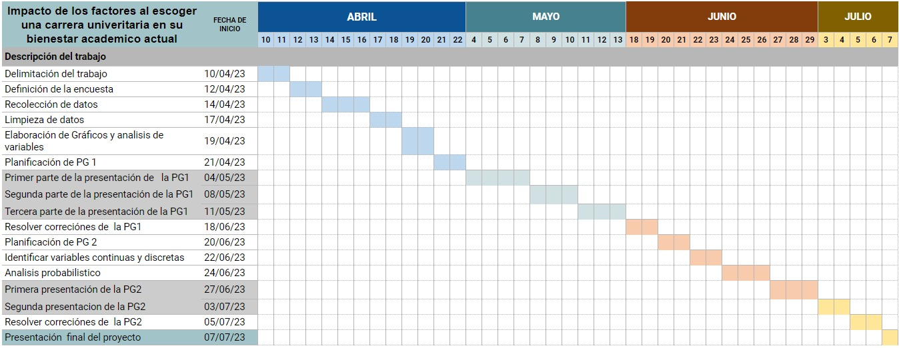

> TEMA : **FACTORES AL MOMENTO DE ELEGIR UNA CARRERA UNIVERSITARIA Y SU IMPACTO EN EL BIENESTAR ACADÉMICO DE ALUMNOS UTEC DEL SEGUNDO AL DÉCIMO CICLO**

## **1.INTRODUCCIÓN**

### 1.1 RELEVANCIA

La elección de una carrera universitaria es una de las decisiones más importantes y a la vez difíciles de la vida de cualquier persona. De esta decisión depende la satisfacción profesional y personal, la estabilidad económica y sobre todo el tipo de impacto y contribución que se le puede brindar a la sociedad. 

Asimismo, al ser una decisión que se toma a una edad relativamente temprana, los factores que se consideran, muchas veces, no responden a la visión propia de la persona, si no que, dependen de la situación y contexto de cada una. Analizar cómo estos factores que influyen en la elección de una carrera se relacionan con el bienestar del estudiante, nos permite indagar y reconocer cuales de ellos, probablemente, son los más adecuados y correctos de tomar en cuenta para tener una elección satisfactoria. De esa manera, se busca compartir esta información con el fin de que los estudiantes, próximos a tomar esta decisión, puedan tener una guía de que factores serían los más adecuados de considerar en la elección de su carrera universitaria.

### 1.2 OBJETIVOS

**General**

- Determinar cuáles son los principales factores que influyen al escoger una carrera en los estudiantes utecsinos a partir del segundo ciclo.

**Específicos**

*Análisis descriptivo*

- Determinar  el impacto del tiempo tomado para ingresar a la universidad con relación al  nivel de satisfacción en los           estudiantes de UTEC. 

- Relacionar si algunas razones al elegir una carrera tienen mayor influencia negativa en el desarrollo del alumno.

- Determinar la importancia de recibir orientación vocacional para una elección satisfactoria de la carrera.

- Identificar el porcentaje de alumnos que estudian una carrera universitaria en UTEC por vocación.

*Análisis Probabilístico*

- Determinar la probabilidad empírica de las variables nivel de satisfacción y orientación vocacional.

- Determinar que distribuciones de probabilidad continua se ajusta a las variables de nuestro estudio. 

- Utilizar las distribuciones con el fin de determinar las probabilidades para variables discretas.

- Corroborar la dependencia e independencia de eventos a partir de la regla de la multiplicación de la probabilidad , la probabilidad condicional  y el teorema de Bayes.


### 1.3 PLANIFICACIÓN

**Diagrama de Gantt**



### 1.4 VARIABLES

**Variables Continuas**

- Tiempo de estudio

- Salario esperado

- Promedio ponderado


**Variables Discretas**

- Edad

- Año de egreso del Colegio


**Variables Nominales**

- Género

- Ciclo de ingreso

- Ciclo actual

- Carrera

- Orientación Vocacional

- Influencia

- Riesgo académico

- Retiro de carrera

- Oportunidad 


**Variables Ordinales**

- Satisfacción

- Salud mental


## **2.ANÁLISIS DE PROBABILÍSTICO**

- En análisis probabilístico, trabajaremos con nuestra base de datos limpia obtenida de nuestro primer informe. Esta data limpia la llamaremos DC.

```{r}
library(readr)
library(dplyr)
library(readxl)
DC <- read_excel("Data_limpia.xlsx")
View(DC)
```


### 2.1.PROBABILIDAD EMPÍRICA

- **SATISFACCIÓN CON RESPECTO A SU CARRERA**

Considerando los siguientes parámetros para agrupar el nivel de satisfacción:

- De 1 a 2: muy insatisfecho con su carrera (MINS)

- De 3 a 4: insatisfecho con su carrera (INS)

- De 5 a 6: neutral (N)

- De 7 a 8: satisfecho con su carrera (ST)

- De 9 a 10: muy satisfecho con su carrera (MST)

```{r}
DG<- DC
```

```{r}
DG %>% mutate(Satisfaccion =
        ifelse(Satisfaccion %in% c("1", "2"), "MUY INSATISFECHO",
        ifelse(Satisfaccion %in% c("3", "4"), "INSATISFECHO",
        ifelse(Satisfaccion %in% c("5", "6"), "NEUTRO",
        ifelse(Satisfaccion %in% c("7", "8"), "SATISFECHO",
        ifelse(Satisfaccion %in% c("9","10"),"MUY SATISFECHO", Satisfaccion))))))-> DG
DG %>% count(Satisfaccion)
```

```{r}
niveles_Satisfacción = c("MUY INSATISFECHO", "INSATISFECHO","NEUTRO","SATISFECHO", "MUY SATISFECHO")
labels_Satisfacción = c("MUY INSATISFECHO", "INSATISFECHO","NEUTRO","SATISFECHO", "MUY SATISFECHO")
DG$Satisfaccion = factor(DG$Satisfaccion, ordered = TRUE, levels = niveles_Satisfacción, labels = labels_Satisfacción)
```

**EXPERIMENTO 1** 

Seleccionar un estudiante de UTEC al azar,del segundo al décimo ciclo, y observar su nivel de satisfacción con respecto a su carrera. 

**VARIABLE 1: Nivel de satisfacción**

**ESPACIO MUESTRAL**

- Calculamos cuantos elementos tendrá el espacio muestral en nuestro experimento aleatorio 1:

```{r}
length(unique(DG$Satisfaccion))
```

- Espacio muestral para el experimento 1:

```{r}
unique(DG$Satisfaccion)
```

- **MI**: Muy Insatisfecho 
- **I**: Insatisfecho
- **N**: Neutro
- **S**: Satisfecho
- **MS**: Muy Satisfecho

**ESPACIO MUESTRAL**

$$\Omega=\left\{Muy\:insatisfecho,Insatisfecho,Neutro,Satisfecho, Muy\:satisfecho\right\}$$

**EVENTOS ATÓMICOS**

Definimos los eventos: 

- **E1**: Seleccionar un estudiante de UTEC de segundo a décimo ciclo que presente un nivel de satisfacción igual a MUY INSATISFECHO

- **E2**: Seleccionar un estudiante de UTEC de segundo a décimo ciclo que presente un nivel de satisfacción igual a INSATISFECHO

- **E3**: Seleccionar un estudiante de UTEC de segundo a décimo ciclo que presente un nivel de satisfacción igual a NEUTRO

- **E4**: Seleccionar un estudiante de UTEC de segundo a décimo ciclo que presente un nivel de satisfacción igual a SATISFECHO

- **E5**: Seleccionar un estudiante de UTEC de segundo a décimo ciclo que presente un nivel de satisfacción igual a MUY SATISFECHO


**PROBABILIDAD DE EVENTOS ATÓMICOS**

- Calculamos la función de probabilidad para cada evento atómico utilizando la siguiente fórmula establecida:

$$P\left(A\right)=\frac{Casos\:a\:favor\:}{Casos\:totales}= \frac{n(A)}{n(\Omega)}$$

```{r}
FI = table(DG$Satisfaccion) #CONTEO DE ESTUDIANTES PARA CADA NIVEL DE SATISFACCIÓN
HI = round(prop.table(FI)*100,2) #PORCENTAJE DE ESTUDIANTES PARA CADA NIVEL DE SATISFACCIÓN
cbind(FI,HI)
sum(table(DG$Satisfaccion))
```

- P(E1)
```{r}
2/159
```

- P(E2)
```{r}
3/159
```

- P(E3)
```{r}
20/159
```

- P(E4)
```{r}
67/159
```

- P(E5)
```{r}
67/159
```

**CONCLUSIONES** 

El 42.1% de estudiantes encuestados se sienten SATISFECHOS, por lo que la propabilidad de que al elegir al azar un estudiante de UTEC, de segundo a décimo ciclo, este se encuentre SATISFECHO con su carrera es de 0.421. De la misma manera, el 42.1% de estudiantes encuestados se sienten MUY SATISFECHOS, por lo que la propabilidad de que al elegir al azar un estudiante de UTEC, de segundo a décimo ciclo, este se ecnuentre MUY SATISFECHO con su carrera es de 0.421. Asimismo, el 12.6% de estudiantes encuestados se sienten NEUTROS con respecto a su carrera, por lo que la propabilidad de que al elegir al azar un estudiante de UTEC, de segundo a décimo ciclo, este se encuentre MUY SATISFECHO con su carrera es de 0.126. Además, el 1.9% de estudiantes encuestados se sienten INSATISFECHOS con respecto a su carrera, por lo que la propabilidad de que al elegir al azar un estudiante de UTEC, de segundo a décimo ciclo, este se encuentre MUY SATISFECHO con su carrera es de 0.019 y el 1.3% de estudiantes encuestados se sienten MUY INSATISFECHOS con respecto a su carrera, por lo que la propabilidad de que al elegir al azar un estudiante de UTEC, de segundo a décimo ciclo, este se ecnuentre MUY SATISFECHO con su carrera es de 0.013.

De esta manera, podemos  observar que es mucho más probable que nos encontremos con un estudiante de UTEC que se encuentre SATISFECHO y MUY SATISFECHO, a que nos encontremos con un estudiante de UTEC que se encuentre NEUTRO, y es mucho más probable de que nos encontremos con un estudiante de UTEC que se encuentro NEUTRO con respecto a su carrera, a que nos encontremos con un estudiante de UTEC que se encuentre INSATISFECHO Y MUY INSATISFECHO con su carrera.


**EXPERIMENTO 2**

Seleccionar un estudiante de UTEC al azar,del segundo al decimo ciclo, y observar si recibió o no orientación vocacional

VARIABLE 2: Orientación vocacional 

**ESPACIO MUESTRAL**

- Calculamos cuantos elementos tendrá nuestro espacio muestral en nuestro experimento aleatorio 2:

```{r}
length(unique(DG$OrientacionVoc))
```

- Espacio muestral para el experimento 2:

```{r}
unique(DG$OrientacionVoc)
```

**ESPACIO MUESTRAL**

$$\Omega =\left\{No, Si\right\}$$

**EVENTOS ATÓMICOS**

Definimos los eventos atómicos:

- **F1**: Seleccionar un estudiante de UTEC de segundo a décimo ciclo que NO haya recibido orientación vocacional

- **F2**: Seleccionar un estudiante de UTEC de segundo a décimo ciclo que SI haya recibido orientación vocacional


**PROBABILIDAD DE EVENTOS ATÓMICOS**

- Calculamos la función de probabilidad para cada evento atómico utilizando la siguiente fórmula establecida:

$$P\left(A\right)=\frac{Casos\:a\:favor\:}{Casos\:totales}= \frac{n(A)}{n(\Omega)}$$

```{r}
FI1 = table(DC$OrientacionVoc) #CONTEO DE ESTUDIANTES QUE RECIBIERON Y NO ORIENTACIÓN VOCACIONAL
HI1 = round(prop.table(FI1)*100,2) #PORCENTAJE DE ESTUDIANTES QUE RECIBIERON Y NO ORIENTACIÓN VOCACIONAL
cbind(FI1,HI1)
sum(table(DG$OrientacionVoc))
```

- **P(F1)**
```{r}
55/159
```


- **P(F2)**
```{r}
104/159
```

**CONCLUSIONES** 

El 34.6% de estudiantes encuestados NO recibieron orientación vocacional, por lo que la propabilidad de que al elegir al azar un estudiante de UTEC, de segundo a décimo ciclo, este NO haya recibido orientación vocacional es de 0.35. De la misma manera, el 65.4% de estudiantes encuestados SI recibieron orientación vocacional, por lo que la propabilidad de que al elegir al azar un estudiante de UTEC, de segundo a décimo ciclo, este SI haya recibido orientación vocacional de 0.65. 

De esta manera, podemos  observar que al seleccionar un estudiante de UTEC, de segundo a décimo ciclo, es mucho más probable que nos encontremos con un estudiante que SI haya recibido orientación vocacional, a que nos encontremos con un estudiante de NO haya recibido vocacional.


### 2.2.PROBABILIDAD CONDICIONAL

#### **2.2.1. Eventos Dependientes**

**EXPERIMENTO 1**

**Selección de eventos:**

- Evento A: Seleccionar una persona que marco como factor influyente el interés en la carrera

- Evento B: Seleccionar a una persona que respondió que obtuvo un promedio ponderado mayor igual a 16

**Tabla de contingencia** 

Esta tabla nos servirá para poder observar la frecuencia de cada evento y la intersección de ambas.

- Para ello primero hallamos la frecuencia de alumnos que marcaron como factor influyente el interés en la carrera y tienen promedio ponderado mayor igual a 16  
A ∩ B
```{r}
AB <- filter(DC, grepl("Intereses", Influencia, ignore.case = TRUE)& PromedioPonderado >= 16)
nrow(AB)
```

- Luego hallamos la frecuencia de alumnos que marcaron como factor influyente el interés en la carrera pero tienen un promedio ponderado menor a 16  
A ∩ B' 
```{r}
ABcom <-filter(DC, grepl("Intereses", Influencia, ignore.case = TRUE)& PromedioPonderado < 16)
nrow(ABcom)
```

- Como siguiente paso hallamos la frecuencia de alumnos que marcaron como factor influyente cualidades distintas al interés y tienen un promedio ponderado mayor igual a 16 
A' ∩ B
```{r}
AcomB <- filter(DC, !grepl("Intereses", Influencia, ignore.case = TRUE)& PromedioPonderado >= 16)
nrow(AcomB)
```

- Por ultimo hallamos la frecuencia de alumnos que marcaron como factor influyente cualidades distintas al interés y tienen un promedio ponderado menor a 16 
A' ∩ B'
```{r}
AcomBcom <- filter(DC, !grepl("Intereses", Influencia, ignore.case = TRUE)& PromedioPonderado < 16)
nrow(AcomBcom)
```

- Armamos la tabla con lo obtenido
**TABLA DE CONTINGENCIA I**
```{r}
tabla <- rbind(c(26, 11, 37), c(85, 37, 122), c(111,48,159))
rownames(tabla) <- c("B","B'","Total")
colnames(tabla) <- c("A","A'","Total")
tabla
```

**Corroboramos la dependencia o independencia de los eventos A y B**

Si los eventos presentados son independientes o dependientes deben de cumplir con el siguiente planteamiento de formulas.
En caso de independencia:

$$P\left(A∩B\right)\:=\:P\left(A\right)P\left(B\right)$$

$$P\left(A|B\right)\:=\:P\left(A\right)$$

En caso de dependencia:

$$P\left(A|B\right)\:=\:P\left(A∩B\right)/P\left(B\right)$$

Teorema de Bayes: Se cumple en caso los eventos son dependientes:

$$P\left(B|A\right)\:=\:\frac{P\left(A|B\right)P\left(B\right)}{P\left(A\right)}$$
$$P(A)=P\left(A|B\right)P\left(B\right)\:+\:P\left(A|\overline{B}\right)P\left(\overline{B}\right)$$

En base a la tabla de contingencia y sabiendo que el evento A es seleccionar una persona que marco como factor influyente el interés en la carrera y el evento B es seleccionar a una persona que respondió que obtuvo un promedio ponderado mayor igual a 16: 

        A A' Total
B      26 11    37
B'     85 37   122
Total 111 48   159

- Probabilidad de seleccionar a una persona que marco como factor influyente para elegir su carrera el interés: 
P(A)
```{r}
111/159
```

- Probabilidad de seleccionar a una persona que respondió que obtuvo un promedio ponderado mayor igual a 16: 
P(B)
```{r}
37/159
```

- Probabilidad de seleccionar a una persona que marco como factor influyente para elegir su carrera opciones diferentes al interés: 
P(A')
```{r}
48/159
```

- Probabilidad de seleccionar a una persona que respondió que obtuvo un promedio ponderado menor a 16: 
P(B')
```{r}
122/159
```

- Probabilidad de seleccionar al azar una persona que halla marcado el interés en la carrera como factor influyente y obtuvo un promedio ponderado mayor igual a 16: 
P(A ∩ B) 
```{r}
26/159
```

- Probabilidad de seleccionar al azar una persona que halla marcado el interés en la carrera como factor influyente y obtuvo un promedio ponderado menor a 16:
P(A ∩ B') 
```{r}
85/159
```

- Probabilidad de seleccionar al azar una persona que halla marcado opciones diferentes al interés en la carrera como factor influyente y obtuvo un promedio ponderado mayor igual a 16: 
P(A'∩ B) 
```{r}
11/159
```

- Probabilidad de seleccionar al azar una persona que halla marcado opciones diferentes al interés en la carrera como factor influyente y obtuvo un promedio ponderado menor a 16: 
P(A'∩ B') 
```{r}
37/159
```

- Probabilidad de que una persona seleccionada al azar halla marcado como factor influyente el interés en la carrera dado que tenga un promedio ponderado mayor igual a 16: P(A|B)
```{r}
26/37
```

- Probabilidad de que una persona seleccionada al azar halla marcado como factor influyente el interés en la carrera dado que tenga un promedio ponderado menor a 16: P(A|B')
```{r}
85/122
```

- Probabilidad de que una persona seleccionada al azar tenga un promedio ponderado mayor igual a 16 dado que ha marcado como factor influyente el interés en la carrera: P(B|A)
```{r}
26/111
```


- Verificamos si cumple o no  -> P(A∩B) = P(A)P(B)

26/159 = (111/159)*(37/159)

```{r}
26/159
```
```{r}
(111/159)*(37/159)
```
0.163522 = 0.162454 -> No cumple exactamente la igualdad por lo que seria dependiente

- Comprobamos ahora con 
P(A|B) = P(A)
26/37 = 111/159

```{r}
26/37
```

```{r}
111/159
```

0.7027027 = 0.6981132

No cumple por lo tanto es dependiente

-----------------------------------------------------------------------------

Comprobamos ahora la dependencia de acuerdo a que se cumpla: 

P(A|B) = P(A∩B)/P(B)
26/37 = (26/159)/(37/159)
```{r}
26/37
```
```{r}
(26/159)/(37/159)
```
Por lo tanto: 

             0.7027027 = 0.7027027

Con esto determinamos la dependencia de los eventos

- Usando teorema de Bayes

P(B|A) = P(A|B)P(B) / P(A)
 
P(A) = P(A|B)P(B) + P(A|B')P(B')

Por lo tanto: 

26/111 = ((26/37)x(37/159))/((26/37)x(37/159)) + ((85/122)x(122/159))

```{r}
26/111
```

```{r}
((26/37)*(37/159))/(((26/37)*(37/159)) + ((85/122)*(122/159)))
```

Entonces: 
P(B|A) = P(A|B)P(B) / P(A)

0.2342342 = 0.2342342

- El evento A y B tienen una relación dependiente 


#### **2.2.2. Eventos Independientes**

**EXPERIMENTO 2**

**SELECCIONAMOS VARIABLES:**

- Orientación Vocacional
- Satisfacción

**PLANTEAMOS EVENTOS**

- EVENTO A: Seleccionar a un estudiante de utec a partir del segundo ciclo que sí tomó orientación vocacional.
- EVENTO B: Seleccionar a un estudiante de utec a partir del segundo ciclo que tiene un nivel de satisfacción de la carrera menor a 10

**HALLAMOS VALORES PARA TABLA DE CONTINGENCIA**

Esta tabla nos servirá para poder observar la frecuencia de cada evento y la intersección de ambas.

- A ∩ B -> La frecuencia de los estudiantes que tomaron orientación vocacional y tienen un nivel de satisfacción menor a 10.
```{r}
BC<-filter(DC,OrientacionVoc=="Si" & !Satisfaccion==10)
nrow(BC)
```

- A ∩ B'-> La frecuencia de los estudiantes que tomaron orientación vocacional y tienen un nivel de satisfacción igual a 10.

```{r}
BD<-filter(DC,OrientacionVoc=="Si" & Satisfaccion==10)
nrow(BD)
```

- A' ∩ B -> La frecuencia de los estudiantes que no tomaron orientación vocacional y tienen un nivel de satisfacción ¿menor a 10

```{r}
DE<-filter(DC,OrientacionVoc=="No" & !Satisfaccion==10)
nrow(DE)
```

- A' ∩ B' -> La frecuencia de los estudiantes que no tomaron orientación vocacional y tienen un nivel de satisfacción igual a 10

```{r}
BF<-filter(DC,OrientacionVoc=="No" & Satisfaccion==10)
nrow(BF)
```

**ARMAMOS LA TABLA DE LO OBTENIDO**
**TABLA DE CONTINGENCIA II**
```{r}
tabla <- rbind(c(79,43,122), c(25, 12, 37), c(104,55,159))
rownames(tabla) <- c("B","B'","Total")
colnames(tabla) <- c("A","A'","Total")
tabla
```

**COMPROBAMOS QUE LOS EVENTOS SEAN INDEPENDIENTES**

**Primera fórmula**

$$P(A ∩ B)= P(A)*P(B)$$

- Hallamos P(A), P(B) y P(A ∩ B)

```{r}
(104/159) -> PA
(122/159) -> PB
(79/159) -> PAB
PAB # P(A ∩ B)
PA*PB #P(A)*P(B)

```

- Como podemos observar la multiplicación  P(A) y P(B) no es exactamente igual a la intersección de A con B. Por lo tanto, no son eventos independientes. Lo que confirma que son eventos dependientes.

**Segunda fórmula**

$$P(A|B)=P(A)$$
- Hallamos P(A|B)

```{r}
(79/122) -> AB
AB #P(A|B)
PA #Hallado en la primera fórmula
```

- Comprobamos que P(A|B) y P(A) no son exactamente iguales. Por lo tanto, confirmamos nuevamente que son eventos dependientes.

**EXPERIMENTO 3**

**SELECCIONAMOS OTRAS VARIABLES**

Como obtuvimos eventos dependientes, reelegimos variables y eventos para hallar los ***eventos independientes***.

- Género
- Salario esperado  

**PLANTEAMOS EVENTOS**

- EVENTO A: Seleccionar un estudiante Femenino de UTEC a partir de segundo ciclo.
- EVENTO B: Seleccionar estudiantes de UTEC a partir de segundo ciclo que esperan un salario esperado mayor a 4500. 

**HALLAMOS VALORES PARA TABLA DE CONTINGENCIA**

Esta tabla nos servirá para poder observar la frecuencia de cada evento y la intersección de ambas.

- A ∩ B -> La frecuencia de los estudiantes que son de género femenino y esperan un salario mayor a 4500

```{r}
CA<-filter(DC,Genero== "Femenino"   & SalarioEsperado >4500)
nrow(CA)
```

- A ∩ B' -> La frecuencia de los estudiantes que son de género femenino y esperan un salario menor o igual a 4500

```{r}
CB<-filter(DC,Genero== "Femenino"   & !SalarioEsperado >4500)
nrow(CB)
```

- A' ∩ B -> La frecuencia de los estudiantes que no son de género femenino y esperan un salario mayor a 4500

```{r}
CD<-filter(DC,!Genero=="Femenino"  & SalarioEsperado >4500)
nrow(CD)
```
- A' ∩ B' -> La frecuencia de los estudiantes que no son de género femenino y esperan un salario menor o igual a 4500

```{r}
CF<-filter(DC,!Genero=="Femenino"  & !SalarioEsperado >4500)
nrow(CF)
```

**ARMAMOS LA TABLA**
**TABLA DE CONTINGENCIA III** 
```{r}
tabla <- rbind(c(25, 47, 72), c(35, 52, 87), c(60,99,159))
rownames(tabla) <- c("A","A'","Total")
colnames(tabla) <- c("B","B'","Total")
tabla
```

**COMPROBAMOS QUE LOS EVENTOS SEAN INDEPENDIENTES**

**Primera fórmula**

$$P(A ∩ B)= P(A)*P(B)$$

- **Hallamos P(A), P(B) y P(A ∩ B)**

```{r}
(60/159) -> PA2
(72/159) -> PB2
(25/159) -> PAB2
PAB2 #P(A ∩ B)
PA2*PB2 #P(A)*P(B)
```

- Nuevamente la multiplicación  P(A) y P(B) no es exactamente igual a la intersección de A con B. Por lo tanto, no son eventos independientes.

**Segunda fórmula**

$$P(A|B)=P(A)$$

- **Hallamos P(A|B)**

```{r}
(25/72) -> AB2
AB2 #P(A|B)
PA2 #Hallado en la primera fórmula
```

- Observamos que P(A|B) y P(A) no son exactamente iguales. Por lo tanto, son eventos dependientes.


### 2.3.VARIABLES DISCRETAS

**I. PRIMERA VARIABLE: EDAD** 

**Definimos la distribución que se usará**

```{r}
fi = table(DC$Edad)
hi = prop.table(fi)
cbind(fi,hi)
```

**Definimos nuestro éxito como los alumnos de la universidad de ingeniería y tecnología del segundo al décimo ciclo y que tienen hasta 18 años**

```{r}
Cantidad_exitos <- nrow(filter(DC,Edad<=18))
Total <- nrow(DC)
Cantidad_exitos
Total
```

**Hallamos la probabilidad de éxito**

$$P(x ≤ 18) = 0.3459119 $$

- Para este caso vamos a tratar la variable aleatorio discreta con la distribución binomial

**Definimos nuestra variable aleatorio discreta** 

**x** = La cantidad de alumnos del segundo al décimo ciclo de la UTEC que tiene por lo mucho 18 años, en una muestra de 50 encuestados con reposición que cumplen las mismas características de la nuestra total.

**Rango de la variable aleatoria**

$$
Rango\:=\left\{0;1;2;3...;50\right\}
$$

Esta muestra antes mencionada de 50 alumnos tienen las misma caracteristicas que la muestra total de 150 alumnos

**Identificamos parámetros de la distribución binomial**

$$
p= Probabilidad \ de\ exito\\ n = Tamaño \ de \ la \ muestra\
$$

- Distribución binomial 

$$
X ∼ B(n = 50, p = 0.3459119)
$$

- Propiedad de la distribución binomial 

```{r}
n = 50
p = 0.3459119
```

**1. Esperanza** 

$$ E(X) = np = 17.29559$$

**2. Varianza** 

$$ Var(X) = npq = np(1 − p) = 11.31284 $$

**Hallamos probabilidades**

**1)  Determinamos la probabilidad de que al volver a entrevistar a 50 alumnos, 10 de ellos sean de segundo al décimo ciclo de UTEC y tengan hasta 18 años**

X ∼ B(n = 50, p = 0.3459119)

P(X = 10)

```{r}
dbinom(10,50,0.3459119)
```

```{r}
plot(dbinom(1:10,50,0.3459119),type="h",xlab="k",ylab="P(X=k)",main="Gráfico 1 : Función de Probabilidad B(50,0.3459119)")
```

En la gráfica se visualiza la probabilidad de obtener exactamente k
éxitos, es decir k alumnos de UTEC del segundo al décimo ciclo que 
tengan por lo mucho 18 años en una muestra de 50 estudiantes, tomando en cuenta la
probabilidad de 0.3459119 por éxito.

**2) Determinamos la probabilidad de que al volver a entrevistar a 50 alumnos, a lo máximo 17 alumnos sean de segundo al décimo ciclo de UTEC y que tengan hasta 18 años** 

P(X ≤ 17)

```{r}
pbinom(17,50,0.3459119)
```

```{r}
plot(pbinom(1:17,50,0.3459119),type="h",xlab="k",ylab="P(X=k)",main="Gráfico 2: Función de Probabilidad B(50,0.3459119)")
```

En la gráfica se visualiza la probabilidad de obtener como máximo k
éxitos, es decir k alumnos de UTEC del segundo al décimo ciclo que
tienen igual o menos de 18 años de una muestra de 50 estudiantes, tomando en cuenta la probabilidad de 0.3459119 por éxito.


**II. SEGUNDA VARIABLE: AÑO DE EGRESO DEL COLEGIO** 

**Definimos que distribución se usará**

En este caso usaremos una distribución geométrica 

X ~ G(p)

**Identifico parámetros**

**X** -> Número alumnos encuestados antes de encontrar una persona que egresó del colegio en el año 2018.

**p** -> Probabilidad de elegir una persona que egresó del colegio en el año 2018.

**Estimar la probabilidad de éxito**

- Éxito:

```{r}
E<-filter(DC,EColegio=="2018")
nrow(E)
```

$$E=15$$

- Casos totales:

```{r}
N <- length(DC$Edad)
N
```

- Por lo tanto:
$$P(E)=\frac{15}{159}=0.09433962$$

**Hallamos las probabilidades**

Se quiere calcular: 

**1) La probabilidad de que al volver a realizar una encuesta el alumno número 15 haya egresado del colegio en el año 2018.**

X ~ G(0.09433962)

P(X = 15)

```{r}
dgeom(15-1,0.09433962)
```

```{r}
plot(dgeom(1:15-1,0.09433962),type="h",xlab="k",ylab="P(X=k)",main="Gráfico 3: Función de Probabilidad G(0.09433962)")
```


**2) La probabilidad de que al volver a realizar una encuesta encontremos dentro de los primeros 15 alumnos encuestados uno que haya egresado del colegio en el año 2018.** 

X ~ G(0.09433962)

P(X ≤ 15) 
```{r}
pgeom(15-1,0.09433962)
```

```{r}
plot(pgeom(1:15-1,0.09433962),type="h",xlab="k",ylab="P(X=k)",main="Gráfico 4: Función de Probabilidad G(0.09433962)")
```


### 2.4.VARIABLES CONTINUAS

En nuestro estudio tenemos tres variables continuas:

- Tiempo de estudio
- Salario esperado
- Promedio Ponderado

**Instalamos los paquetes y librerias correspondientes**
```{r}
#install.packages("rriskDistributions")
#install.packages("fastGraph")
library(fastGraph)
library(rriskDistributions)
```


**1. Analizamos la variable Tiempo de Estudio**

- Aplicamos rrisk

```{r}
fit.cont(DC$TiempoEstudio)
```

- Según el análisis de distribuciones realizado , Kolmogorov-Smirnov y Anderson nos indican que nuestra variable continua, tiempo de estudio, no se ajusta a ninguna distribución continua. Debido a esto, no podremos establecer probabilidades para esta variable


**2. Analizamos la variable Salario Esperado**

- Aplicamos rrisk

```{r}
fit.cont(DC$SalarioEsperado)
```

- Según el análisis de distribuciones realizado , Kolmogorov-Smirnov y Anderson nos indican que nuestra variable continua, salario esperado, no se ajusta a ninguna distribución continua. Debido a esto, no podremos establecer probabilidades para esta variable.

**3. Analizamos la variable Promedio Ponderado**

- Aplicamos rrisk

```{r}
fit.cont(DC$PromedioPonderado)
```

- Según el análisis de distribuciones realizado mediante la prueba Anderson, se concluye que nuestra variable continua, denominada promedio ponderado, muestra una aproximación a una distribución logística. Mientras que, la prueba Kolmogorov-Smirnov  a una distribución logística, normal y cauchy. Sin embargo, debido a que la distribución normal ha sido abordada en el curso, se optará por utilizar la distribución recomendada por Kolmogorov-Smirnov que sería la districución normal.

**IDENTIFICAMOS PARÁMETROS**

**Y**: Promedio ponderado de estudiantes de UTEC de segundo a décimo ciclo(nota)

Y~N(14.696792;1.994395^2)

```{r}
mean(DC$PromedioPonderado)
var(DC$PromedioPonderado)
sd(DC$PromedioPonderado)
```

**Planteamos ejemplos de Probabilidad para una Distribución Normal**

a) Determinar la probabilidad de seleccionar a un estudiante de UTEC al azar que tenga un promedio ponderado mayor a 17
P(x>17)
```{r}
1-pnorm(17,14.69679,2.000697)
```

Graficamos la probabilidad

```{r}
shadeDist(17,"dnorm",14.69679,2.000697,F, main="Gráfico 5: P(x>17)", xlab="Promedio ponderado")
```

b) Determinar la probabilidad de seleccionar a un estudiante de UTEC al azar que tenga un promedio ponderado menor a 15
P(x<15)
```{r}
pnorm(15,14.69679,2.000697)
```

Graficamos la probabilidad

```{r}
shadeDist(15,"dnorm",14.69679,2.000697, main="Gráfico 6: P(x<15)", xlab="Promedio ponderado")
```

c) Determinar la probabilidad de seleccionar a un estudiante de UTEC al azar que tenga un promedio ponderado menor a 10
P(x<10)

```{r}
pnorm(10,14.69679,2.000697)
```

Graficamos la probabilidad

```{r}
shadeDist(10,"dnorm",14.69679,2.000697, main="Gráfico 7: P(x<10)", xlab="Promedio ponderado")
```

d) Determinar la probabilidad de seleccionar a un estudiante de UTEC al azar que tenga un promedio ponderado mayor a 12.5
P(x>12.5)

```{r}
1-pnorm(12.5,14.69679,2.000697)
```

Graficamos la probabilidad

```{r}
shadeDist(12.5,"dnorm",14.69679,2.000697,F,main="Gráfico 8: P(x>12.5)", xlab="Promedio ponderado")
```

## **3.CONCLUSIONES**

- Al analizar diferentes eventos con distintas variables, comprobamos que en nuestro estudio de investigación no habrán eventos independientes, ya que, lo determinamos con las fórmulas mostradas en clase y se visualiza en los cálculos realizados que no son exactamente iguales.Por lo cual, vendrían a ser eventos dependientes.

- Al utilizar las distribuciones binomial y geométrica, hemos determinado las probabilidades asociadas a las variables discretas de edad y año de egreso del colegio. Esto nos permite comprender y utilizar de manera efectiva la información probabilística relacionada con estos eventos específicos.

- Al analizar las distribuciones mediante las pruebas de Anderson y Kolmogorov-Smirnov, determinamos las probabilidades asociadas a las variables continuas que en nuestro caso fue promedio ponderado. Esto, nos ayudó a comprender de manera clara la información probabilística de nuestro estudio.

- Al hallar las probabilidades de las variables nivel de satisfacción y orientación vocacional, determinamos que es más probable encontrar un estudiante de UTEC, del segundo al décimo ciclo, que esté SATISFECHO o MUY SATISFECHO con su carrera. De la misma manera, determinamos que es más probable encontrar un estudiante que SI haya recibido orientación vocacional.


