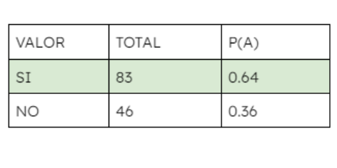
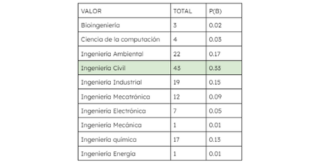
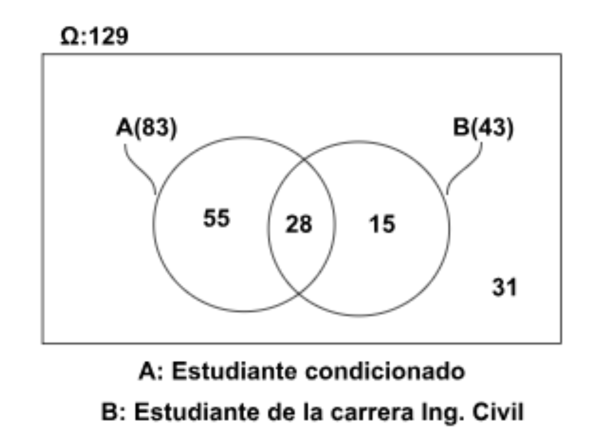
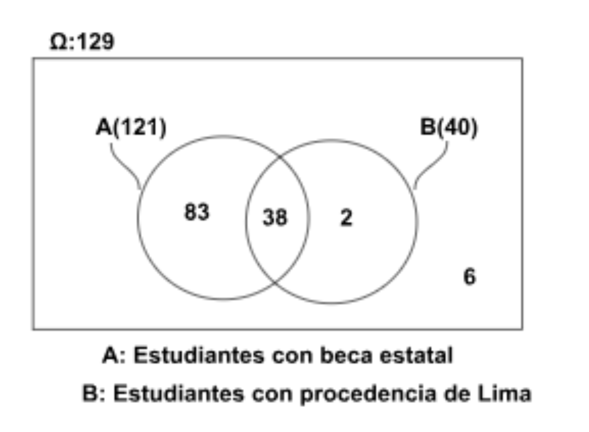

{center=TRUE,width='200px'}

# 1. INTRODUCCIÓN

## 1.1 Objetivos

### 1.1.1 Objetivo General

> Analizar el aprovechamiento académico de los estudiantes becados y como estos se han venido desenvolviendo a lo largo de su carrera.

### 1.1.2 Objetivos Específicos

> + Determinar la región que cuenta con el mejor perfil de estudiantes becados en base a su avance académico
+ Conocer los factores que más influyen en el aprovechamiento de la beca otorgada al estudiante
+ Identificar la carrera con mayor demanda por los becarios según la influencia que tuvo la beca al momento de elegirla
+ Comparar y determinar el aprovechamiento de las becas entre becarios por entidades privadas y becarios por entidades estatales


# 2. DATOS
## 2.1 Procesos de recolección de datos
## 2.2 Población, muestra y muestreo
+ **Población** 

> La población investigada será los estudiantes de UTEC ingresados desde el año 2020 hasta el primer semestre del 2023 (ciclo 2023-1).

+ **Muestra**

> La muestra que se obtuvo fue de 173 alumnos becados de UTEC tanto de becas privadas como con becas subvencionadas así como de alumnos que no son becados por Pronabec  de desde segundo ciclo hasta quinto ciclo .

+ **Muestreo**  

> El tipo de muestreo que hemos utilizado para esta investigación es el“muestreo por conveniencia ”. Esto se debe a que la población de la universidad(UTEC) es extensa, lo que dificulta la realización de que el muestreo sea aleatorio debido al tiempo que se requiere para ello. En su lugar, seleccionamos como muestra a jóvenes que estén cerca de los investigadores, es decir, personas con las que compartimos clases, amistades, participantes en actividades extracurriculares y estudiantes que frecuentan los mismos lugares que nosotros.

## 2.3 Varibles

```{r,echo=FALSE,results='asis'}
library(knitr)
``` 
```{r,echo=FALSE}
N=c(1,2,3,4,5,6,7,8,9,10,11,12,13,14,15,16,17,18,19,20)
Variable=c("Becado","Sexo","Tipo de beca","Carrera","Región de procedencia","Distrito de residencia actual","Influencia de la beca en la elección de la carrera","Espacio adecuado de estudio",
"Actividad física","
Alimentación adecuada",
"Ciclo actual","Código",
"Cantidad de minutos de transporte",
"Cantidad de cursos matriculados actualmente",
"Cantidad de cursos matriculados el último ciclo de estudio",
"Cantidad de cursos reprobados
","Cantidad de horas de estudio por semana
","Promedio ponderado del primer ciclo","
Promedio ponderado del último ciclo 
","Subvención")
Tipo=c("Categórica Nominal","
Categórica Nominal","
Categórica Nominal","
Categórica Nominal","
Categórica Nominal","
Categórica Nominal","
Categórica Nominal","
Categórica Nominal","
Categórica Nominal","
Categórica Nominal","
Categórica Ordinal","
Categórica Ordinal","
Numérica Discreta","
Numérica Discreta","
Numérica Discreta","
Numérica Discreta","
Numérica Discreta","
Numérica Continua","
Numérica Continua","
Numérica Continua"

)
var=data.frame(N,Variable,Tipo)
kable(var)
``` 

## 2.4 Limpieza de datos
 Se inicia cargando nuestra base de datos denominada **_respuesta_** con ayuda de la librería **_readr_** y el comando **_read_csv_**
 
```{r include=FALSE, echo=FALSE}
library("readr")
library("dplyr")
```

```{r results='hide',echo=TRUE}
DF<-read_csv("respuesta.csv")
```
```{r results='hide',echo=FALSE}
DF=rename(DF,Tiempo = `Marca temporal` )
```

```{r,include=FALSE,echo=FALSE}
DF=rename(DF,CantCursosAnt = `Cantidad de cursos que llevaste el ciclo anterior` )
DF=rename(DF,Correo = `Dirección de correo electrónico` )
DF=rename(DF,Becado = `¿Eres estudiante becado?` )
DF=rename(DF, Codigo = `Ingresa tu código` )
DF=rename(DF,Sexo = `Seleccione su sexo` )
DF=rename(DF,TipoBeca = `Seleccione su tipo de beca` )
DF=rename(DF,Carrera = `Selecciona la carrera a que perteneces` )
DF=rename(DF, Promedio1ciclo = `¿Cuál fue tú promedio ponderado del primer ciclo?\nSi no sabes como visualizar tu promedio sigues los pasos descritos en la imagen\nNOTA: Tomar el promedio ponderado por periodo no el acumulado\nAqui puedes ingresar a tu sistema académico` )
DF=rename(DF,PromedioUltimociclo= `¿Cuál fue tú promedio ponderado general en el último ciclo?\nPuedes guiarte de la imagen de la pregunta anterior para responder esta pregunta\nAqui puedes ingresar a tu sistema académico  \nNOTA: Tomar el promedio ponderado por periodo no el acumulado.` )
DF=rename(DF,LugardeEstudio = `¿Cuentas con espacios adecuados de estudio?` )
DF=rename(DF,Alimentacion = `¿Consideras que llevas una alimentación adecuada?` )
DF=rename(DF,Deporte = `¿Realizas alguna actividad física ?` )
DF=rename(DF,TiempoEstudio = `¿Cuántas horas al día estudias? a parte de las clases de la universidad` )
DF=rename(DF,Subvencion = `Ingresa la cantidad en soles de tu subvención` )
DF=rename(DF,CursosReprobados = `Selecciona la cantidad cursos reprobados hasta el momento`)
DF=rename(DF,CursosActuales = `Selecciona la cantidad de cursos que llevas actualmente` )
DF=rename(DF,TiempoTransporte = `Ingrese la cantidad de minutos que demoras en llegar a la universidad`)
DF=rename(DF, Vivienda = `Selecciona el distrito de Lima donde reside actualmente` )
DF=rename(DF,Condicionado = `¿Tu puntaje al momento de obtener la beca te condicionó a la elección de tu carrera?`)
DF=rename(DF,Procedencia = `Seleccione su región de procedencia\nNota: Al momento de postular a la beca`)
DF=rename(DF,CicloActual = `Selecione su ciclo actual` )

```

```{r echo=FALSE,include=FALSE}
str(DF)
```
Eliminación de columnas por defecto
```{r}
DF <-select(DF,-2)
DF <-select(DF,-1)
```
Se define correctamente el tipo a las variable 

```{r echo=TRUE, results='hide'}

as.character(DF$Codigo)
as.integer(DF$CantCursosAnt)
as.integer(DF$CursosActuales)
as.integer(DF$CursosReprobados)
as.integer(DF$Subvencion)
as.integer(DF$TiempoTransporte)
```

Asimismo, se conoce:

+ Total de datos vacíos

```{r}
sum(is.na(DF))
```
+ Total de casos completos
```{r}
sum( complete.cases(DF))
```
+ Total de casos incompletos
```{r}
sum(! complete.cases(DF))
```

Debido al diseño de la encuesta solo los casos completos pertenecen a las unidades muestrales a estudiar(alumnos becados). Es por ello que se eliminan los casos incompletos(alumnos no becados)

```{r}
DF<-DF[complete.cases(DF),]
```

**Tener en cuenta:**

Las siguientes variables no requieren de una limpieza de datos, esto se debe la ausencia de datos vacíos y al diseño de la encuesta ya que se presento opciones a marcar debido ya que eran variables categóricas.

+ Alimentacion
+ Carrera
+ Condicionado
+ Deporte
+ LugardeEstudio
+ Procedencia
+ CicloActual
+ Sexo
+ Vivienda
+ TipoBeca

Por ende, las únicas variables a limpiar serian:

+ CursosActuales
+ CantCurosAnt
+ CursosReprobados
+ Promedio1ciclo
+ PromedioUltimociclo
+ Subvencion
+ TiempoEstudio
+ TiempoTransporte
+ Codigo


> **Limpieza de la variable CursosActuales**

Con ayuda de la librería **dplyr** se aprecia un total de 7 opciones elegidas de toda nuestras observaciones
```{r}
n_distinct(DF$CursosActuales)
```
Con el comando **unique** podemos ver aquellos valores que ses han seleccionado, donde se aprecia alumnos becados matriculados como máximo en 8 curso, lo cual es posible.

```{r}
unique(DF$CursosActuales)
```
Asimismo, se utiliza un diagrama de puntos para observar aquellos datos atípicos 

```{r}
plot(DF$CursosActuales,ylab="Cursos Actuales",xlab="Número de observación",xlim=c(0,150),ylim=c(0,9))
```

Se aprecia que existe un estudiante becado que solo se ha matriculado en un curso. Esta observación es posible si es de algún ciclo superior o si este estudiante posee una beca subvencionada por una entidad privada.Para ello se corroborará.

Con ayuda del comando **filter** accedemos a la observación, se aprecia que dicho estudiante es subvencionada por Pronabec.


```{r}
filter(DF, CursosActuales==1)
```

Al acceder a toda la unidad muestral, se aprecia que es una estudiante que se encuentra cursando el segundo ciclo de su carrera, esto se argumenta debido a los 5 primeros dígitos de su código. Asimismo, se aprecia que reprobó 6 cursos en su primer ciclo; sin embargo, tal cantidad e cursos reprobados no cuadra con el promedio ponderado de 16.9. Es por ello, que se puede plantear diferentes hipótesis, tales como: 

+ Se confundió al marcar cursos actuales con cursos reprobados
+ Marco cualquier opción solo por completar la encuesta

Es por ello, que se decide **eliminar** la observación. Antes a ello se visualiza la cantidad de unidades muestrales antes de la eliminación.
```{r}
nrow(DF)
```
Tal observación se encuentra en la fila 111 y la columna 11
```{r echo=TRUE,results='hide'}
DF$CursosActuales
names(DF)
```

```{r echo=TRUE,results='hide'}
fila_eliminar<- c(111)
DF<-DF[-fila_eliminar ,]
```
Corroboramos si la observación se eliminó correctamente
```{r}
nrow(DF)
```
En efecto la variable se encuentra **limpia**

> **Limpieza de la variable CantCursosAnt**

Con el comando *n_distinct* y el comando *unique* se logra conocer la cantidad de valores únicos de la variable analizada.
```{r}
n_distinct(DF$CantCursosAnt)
```
```{r}
unique(DF$CantCursosAnt)
```
Con el diagrama de caja se puede visualizar si se tiene algún dato atípico. 
```{r}
boxplot(DF$CantCursosAnt,ylab="Cursos del ciclo pasado")
```
Se observa datos que no se encuentran dentro de la caja. Estos si bien se pueden considerar outliers, en este caso existe la posibilidad de haberse matriculado a esa cantidad de cursos.Por lo cual se conservan esas observaciones.

> **Limpieza de la variable CursosReprobados**

Con el comando *n_distinct* se logra conocer la cantidad de valores únicos de la variable analizada.
```{r}
n_distinct(DF$CursosReprobados)
```
Con el comando*unique* se observa que se tiene observaciones que han reprobado como máximo 7 cursos. Este escenario si es posible ya que, en caso de ser becario Pronabec,un estudiante becado pierde su beca si este reprueba el curso por más de dos veces o al reprobar todos los cursos matriculados en un ciclo
```{r}
unique(DF$CursosReprobados)
```
Con el diagrama de caja se puede visualizar si se tiene algún dato atípico. 
```{r}
boxplot(DF$CursosReprobados,ylab="Cursos reprobados")
```
Se observa que el 50% de los estudiantes becados no han reprobado más de dos cursos hasta el ciclo actual.

```{r}
filter(DF,CursosReprobados>=6)
```
Sin embargo, también se observa que existen becados que han reprobado 6 y 7 cursos, como se mencionó lineas más arriba esto si es posible. Por lo cual, estos datos se conservan.


> **Limpieza de la variable Promedio1ciclo**


Para poder verificar que no se tiene datos atípicos usamos el descriptor gráfico de caja, más conocido como boxplot. 
```{r}
boxplot(DF$Promedio1ciclo, main="Promedio del Primer ciclo", ylab="Promedio")
```
Se aprecia una distribución simétrica sin ningún sesgo ni datos atípicos.


> **Limpieza de la variable PromedioUltimociclo**

Se optó por usar el diagrama de caja, ya que nos muestra aquellos datos que se pueden considerar atípicos u outliers. Sin embargo, al visualizar el gráfico se observa, que si bien existen notas fuera de los cuartiles. Estos no son atípicos, esto debido a la posibilidad de jalar cursos en la universidad.
```{r}
boxplot(DF$PromedioUltimociclo, main="Promedio del último ciclo cursado")
```
Se observa la existencia de datos atípicos. Para visualizarlo mejor se utiliza un diagrama de puntos
```{r}
plot(DF$PromedioUltimociclo,xlab="Número de observación",ylab="Promedio último ciclo cursado")
```
Se tienen dos estudiantes con un promedio de cercano a 10. En caso de ser estudiantes becados por Pronabec es posible tener ese tipo de promedio. Con la finalidad de constatar tal escenario, se utiliza el comando *filter* 
```{r}
min(DF$PromedioUltimociclo)
```
```{r}
filter(DF,TipoBeca=="Beca subvencionada por el Estado (Pronabec)",PromedioUltimociclo<11)
```

En efecto tal promedio es posible ya que pertenece a un estudiante becado por Pronabec por lo tanto, la observación se conserva.


> **Limpieza de la variable Codigo**

De esta variable lo único que nos interesa son los **5** primeros dígitos ya que estos representan al año de ingreso a la universidad.
```{r}
A191<-(filter(DF,Codigo<20200000))
```

Estudiantes que ingresaron en el ciclo 2020-1
```{r}
A20201<-sum(filter(DF,Codigo>=20201000 & Codigo <= 20201999))
```
Estudiantes que ingresaron en el ciclo 2020-2
```{r}
A20202<-sum(filter(DF,Codigo>=20202000 & Codigo <= 20202999))
```
Estudiantes que ingresaron en el ciclo 2021-1
```{r}
A20211<-sum(filter(DF,Codigo>=20211000 & Codigo <= 20211999))
```
Estudiantes que ingresaron en el ciclo 2021-2
```{r}
A20212<-sum(filter(DF,Codigo>=20212000 & Codigo <= 20212999))
```

Estudiantes que ingresaron en el ciclo 2022-1
```{r}
A20221<-sum(filter(DF,Codigo>=20221000 & Codigo <= 20221999))
```

Estudiantes que ingresaron en el ciclo 2022-2
```{r}
A20222<-sum(filter(DF,Codigo>=20222000 & Codigo <= 20222999))
```

Estudiantes que ingresaron en el ciclo 2023-1
```{r}
A20231<-sum(filter(DF,Codigo>=20231000 & Codigo <= 20231999))
A20231
```

> **Limpieza de la variable TiempoTransporte**

Al realizar el boxplot no se observa datos atípicos
```{r}
DF$TiempoTransporte
```


```{r}
boxplot(DF$TiempoTransporte,ylab="Tiempo(minutos)" )
```
```{r}
filter(DF,TiempoTransporte==0)
```

No se ven datos atípicos 

> **Limpieza de la variable TiempoEstudio**

Se realiza un boxplot para encontrar datos atípicos
```{r}
boxplot(DF$TiempoEstudio,ylab="Tiempo(horas)")
```
Con un diagrama de puntos se observa tres datos atipicos
```{r}
plot(DF$TiempoEstudio,ylab="Tiempo(horas)",xlab="Número de observación")
```
Se filtra tales observaciones para eliminarlos ya que no es posible que una persona 24 horas adicionales a las clases que la universidad brinda.
```{r}
filter(DF,TiempoEstudio >= 15)
```

```{r}
DF$TiempoEstudio
```
Tal observación se encuentra en la fila 57,90, 122
```{r}
f1<- c(57)
DF<-DF[-f1 ,]
```
Corroboramos si la observación se eliminó correctamente
```{r}
nrow(DF)
```
Eliminando el segundo dato atípico
```{r}
f2<- c(90)
DF<-DF[-f2 ,]
```
Corroboramos si la observación se eliminó correctamente
```{r}
nrow(DF)
```
Eliminando el tercer y ultimo dato atípico
```{r}
f3<- c(122)
DF<-DF[-f3 ,]
```
Corroboramos si la observación se eliminó correctamente
```{r}
nrow(DF)
```
En efecto la variable se encuentra limpia

> **Limpieza de la variable Subvencion**

Al realizar un boxplot podemos distinguir ciertos datos fuera de lo bigotes, es por ello que se grafico un diagrama de puntos para poder conocer la cantidad de datos atípicos a los que nos estamos enfrentando

```{r}
boxplot(DF$Subvencion,main="Variable Subvencion",ylab="Cantidad en soles")
```

```{r}
plot(DF$Subvencion)
```

Del diagrama de puntos se percibe subvenciones cerca a cero para ello se corrobora con el comando *filter*

```{r echo=TRUE, results='hide'}
filter(DF,Subvencion<50 & Subvencion >0 )
```

En efecto, se tiene tres datos muy atípicos ya que al ser estudiantes becados por una entidad privada no es posible esas cantidades. Oportunamente tales personas se comunicaron con nosotros debido a una inconsistencia con nuestra encuesta haciéndonos saber que no todas las becas brindan una subvención y que al no haber la opción de **0** marcaron un numero bajo. Al haber contactado y corroborado con tales encuestados se procede a cambiar el valor de dichas variables y mantener tales observaciones.

```{r echo=TRUE, results='hide'}
DF$Subvencion
```
Estos se encuentran en la observación 46,55,66

```{r echo=TRUE,results='hide'}
DF[46,20] <- 0
DF[46,20]
```

```{r echo=TRUE, results='hide'}
DF[55,20] <- 0
DF[55,20]
```

```{r echo=TRUE, results='hide'}
DF[66,20] <- 0
DF[66,20]
```


```{r}
table(DF$CursosReprobados)
```
```{r}
table(DF$Carrera)
```
```{r}
round(0.64*0.33,2)
```
```{r}
table(DF$Condicionado,DF$Carrera)
```


# 3. ANÁLISIS DESCRIPTIVO

```{r}
library(ggplot2)
```


**Objetivo específico 01**
Determinar la región que cuenta con el mejor perfil de estudiantes becados en base a su avance académico


```{r}
ggplot(DF,aes(PromedioUltimociclo,Procedencia))+geom_boxplot()
```

**Objetivo específico 02**
Conocer los factores que más influyen en el aprovechamiento de la beca otorgada al estudiante

*Deporte Vs Promedio*
```{r}
boxplot(DF$PromedioUltimociclo~DF$Deporte,col=c("orange","orange4","grey"),main="Deporte Vs. Promedio",ylab="Promedio",xlab="Deporte",names=c("si","no","Aveces"))

```
 **Interpretación**  
Tenemos más becarios que no realizan deporte (56) , pero según observamos su tercer cuartil presenta el menor valor en comparación con los que sí realizan deporte que representa el 21.88% de la muestra  , por otro lado los que a veces hacen deporte representa el 34.38% de la muestra y notamos que que su tercer cuartil representa el mayor valor en comparación con los demás.
 
```{r}
boxplot(DF$PromedioUltimociclo~DF$Alimentacion,col=c("orange","orange4","grey"),main="Alimentacion Vs. Promedio", ylab="Promedio",xlab="Alimentacion",names=c("si","no","aveces"))
```
 **Interpretación**
Observamos que hay más becarios que no saben si se alimentan de la mejor manera y según su tercer cuartil  tendrían el promedio más alto, pero si vemos a los que sí se alimentan mejor solo es por 3 la diferencia y estos tienen un promedio mayor bien su tercer cuartil en comparación con los que no se alimentan bien el cual tiene un promedio menor de los demás. 

```{r}
boxplot(DF$PromedioUltimociclo~DF$LugardeEstudio,col=c("orange","orange4"),main="Lugar de estudio Vs. Promedio", ylab="Promedio",xlab="Lugar de estudio",names=c("si","no"))
```
**Interpretación**

Vemos que el 91% de becarios tienen un lugar adecuado para estudiar, pero su tercer cuartil en comparación con los que no  cuentan con un lugar adecuado es de menor valor respecto a los que sí tienen un lugar adecuado.


```{r}
boxplot(DF$PromedioUltimociclo~DF$Condicionado,col=c("orange","orange4"),main="Condicion Vs. Promedio",ylab="Promedio",xlab="Condicionado",names=c("si","no"))
```
**Interpretación**

Al observar la gráfica vemos que el 64% de estudiantes si fueron condicionados al elegir su carrera, es decir fueron influenciados para elegir su carrera, pero vemos que el valor de su tercer cuartil el mayor a los que no fueron influenciados.

```{r}
ggplot(DF,aes(x=Carrera))+geom_bar(aes(fill=Sexo))+coord_flip()+facet_wrap(~ Condicionado,nrow=1)
```


**Objetivo específico 03**

Identificar la carrera con mayor demanda por los becarios

```{r}
ggplot(DF,aes(x=Carrera))+geom_bar(aes(fill=Sexo))+coord_flip()
```
Se aprecia de la gráfica de barras que la carrera más solicitada por todos los becarios es **Ingeniería civil** tanto para hombres y mujeres.


## **Objetivo específico 04**

Comparar y determinar el aprovechamiento de las becas entre becarios por entidades privadas y becarios por entidades estatales

```{r}
E<-DF[DF$TipoBeca=="Beca subvencionada por el Estado (Pronabec)",]
P<-DF[DF$TipoBeca=="Beca subvencionada por una entidad privada",]
```

Para poder comparar a estos dos grupos es importante tener en cuenta que hay una diferencia apreciable entre los becados privados y los estatales.Sin embargo como desde un principio se ha tomado solo aquellos que se encuentran dentro de la malla 2021 podemos apalar el grado de dificultad para todos.

```{r}
ggplot(DF,aes(DF$TipoBeca))+geom_bar(aes(fill=CicloActual))+coord_flip()+ylab("Cantidad de estudiantes")+xlab("Tipo de beca")
```


**Tipo de beca vs Promedio primer ciclo**
```{r}
boxplot(DF$PromedioUltimociclo~DF$TipoBeca,col=c("yellow4","green4"),main="Tipo de beca vs. Promedio del primer ciclo ",xlab="Tipo de beca",ylab="Promedio ponderado", names=c("Estatal","Privado"))
abline(h=mean(E$Promedio1ciclo),col="yellow3",lwd=2)
abline(h=mean(P$Promedio1ciclo),col="green3",lwd=2)
axis(2, at = seq(min(DF$Promedio1ciclo), max(DF$Promedio1ciclo), 1))
```

Se observa una distribución asimétrica y hay sesgos debido a que la media y la mediana son muy similares.
Con este gráfico queremos mostrar el desempeño académico que han tenido los estudiantes becados por el estado y por entidades privadas. Hemos señalado su media para poder compararlo con su mediana y de esa forma ver el tipo de distribución. En este caso se aprecia una distribución simétrica. Esto se corrobora en la siguiente tabla.

```{r}
Promedio.Becados.Estado.Primer<-round(mean(E$Promedio1ciclo),2)
Promedio.Becados.Privada.Primer<-round(mean(P$Promedio1ciclo),2)
Mediana.Becados.Estado.Primer<-round(median(E$Promedio1ciclo),2)
Mediana.Becados.Privada.Primer<-round(median(P$Promedio1ciclo),2)
data.frame(Tipo.Beca=c("Estado","Privado"),Media=c(Promedio.Becados.Estado.Primer,Promedio.Becados.Privada.Primer),Mediana=c(Mediana.Becados.Estado.Primer,Mediana.Becados.Privada.Primer))
```
Por lo tanto no se tienen sesgos ni a la derecha ni a la izquierda y nuestros datos sn cetrados y simétricos.

Asimismo, quisimos conocer los cuartiles donde se encontraban nuestros datos, eso se aprecia en el siguiente data.frame

```{r}
data.frame(Cuartil=c("Q1","Q2","Q3"),Notas.Estado=c(round(quantile(E$Promedio1ciclo,c(0.25,0.5,0.75)),2)),Notas.Privados=c(round(quantile(P$Promedio1ciclo,c(0.25,0.5,0.75)),2)))
```

A continuación se quizo conocer cual de los tipos de becas presentaban una mayor dispersión de datos. Para ello, usamos el rango intercuartil

```{r}
IQE<-round(IQR(E$Promedio1ciclo),2)
IQP<-round(IQR(P$Promedio1ciclo),2)
data.frame(Tipo.Beca=c("Estado","Privado"),IQR=c(IQE,IQP))
```
Se aprecia que el rango intercuartil de los becados por el estado es mayor al de los becados por entidades privadas. Esto significa que las notas de los privados se encuentran menos dispersos.


**Tipo de beca vs Promedioúltimo ciclo cursado**

```{r}
boxplot(DF$PromedioUltimociclo~DF$TipoBeca,col=c("yellow4","green4"),main="Tipo de beca vs. Promedio del último ciclo cursado",xlab="Tipo de beca",ylab="Promedio ponderado", names=c("Estatal","Privado"))
abline(h=mean(E$PromedioUltimociclo),col="yellow3",lwd=2)
abline(h=mean(P$PromedioUltimociclo),col="green3",lwd=2)
axis(2, at = seq(min(DF$PromedioUltimociclo), max(DF$PromedioUltimociclo), 1))
```
*Interpretación de la gráfica boxplot Tipo de beca Estatal vs Promedio ponderado del ultimo ciclo cursado*
Con este gráfico queremos mostrar el desempeño académico que han tenido los estudiantes becados por el estado y por entidades privadas. Hemos señalado su media para poder compararlo con su mediana y de esa forma ver el tipo de distribución. En este caso se aprecia una distribución simétrica. Esto se corrobora en la siguiente tabla.

```{r}
Promedio.Becados.Estado<-round(mean(E$PromedioUltimociclo),2)
Promedio.Becados.Privada<-round(mean(P$PromedioUltimociclo),2)
Mediana.Becados.Estado<-round(median(E$PromedioUltimociclo),2)
Mediana.Becados.Privada<-round(median(P$PromedioUltimociclo),2)
data.frame(Tipo.Beca=c("Estado","Privado"),Media=c(Promedio.Becados.Estado,Promedio.Becados.Privada),Mediana=c(Mediana.Becados.Estado,Mediana.Becados.Privada))
```
Por lo tanto no se tienen sesgos ni a la derecha ni a la izquierda y nuestros datos sn cetrados y simétricos.

Asimismo, quisimos conocer los cuartiles donde se encontraban nuestros datos, eso se aprecia en el siguiente data.frame

```{r}
data.frame(Cuartil=c("Q1","Q2","Q3"),Notas.Estado=c(round(quantile(E$PromedioUltimociclo,c(0.25,0.5,0.75)),2)),Notas.Privados=c(round(quantile(P$PromedioUltimociclo,c(0.25,0.5,0.75)),2)))
```

A continuación se quizo conocer cual de los tipos de becas presentaban una mayor dispersión de datos. Para ello, usamos el rango intercuartil

```{r}
IQE<-round(IQR(E$PromedioUltimociclo),2)
IQP<-round(IQR(P$PromedioUltimociclo),2)
data.frame(Tipo.Beca=c("Estado","Privado"),IQR=c(IQE,IQP))
```
Se aprecia que el rango intercuartil de los becados por entidades privadas es mayor al de los becados por el estado. Esto significa que las notas de los privados se encuentran mas dispersos.

Para poder comparar las notas utilizamos la mediana ya que esta es más robusta.
```{r}
Com<-data.frame(Tipo.Beca=c("Estado","Privado"),Primer.Ciclo=c(Mediana.Becados.Estado.Primer,Mediana.Becados.Privada.Primer),Ultimo.Ciclo=c(Mediana.Becados.Estado,Mediana.Becados.Privada))
Com
```

# 4. ANÁLISIS PROBABILISTICO


## 4.1 **Probabilidad condicional**

**Eventos Dependientes**

Para esta sección se tomará las variables :  Condicionado y Carrera 

Definiendo eventos:
A: Seleccionar un estudiante que ha sido condicionado por el puntaje al momento de obtener la beca
B: Seleccionar a un estudiante de la carrera de Ingeniería Civil

Probabilidades empíricas:

**Variable Condicionado**

```{r}
table(DF$Condicionado)
```
Probabilidad empirica de seleccionar un estudiante becado condicionado
```{r}
con<-83/129
round(con,2)
```

{width=30%}

**Variable Carrera** 
```{r}
table(DF$Carrera)
```
Probabilidad empírica de seleccionar un estudiante becado que estudie Ingenieria Civil

```{r}
civil<-43/129
round(civil,2)
```
{width=30%}

{width=30%}


```{r}
table(DF$Condicionado,DF$Carrera)
```

De acuerdo a nuestra base de datos, se puede conocer lo siguiente en base al gráfico expuesto:

P(A-B)=55/129=0.44
```{r}
SA<-55/129
round(SA,2)
```

P(B-A)=15/129=0.12

```{r}
SB<-15/129
round(SB,2)
```
**Intersección**
Probabilidad de seleccionar un estudiante becado condicionado y que estudie la carrera de Ingeniería civil

P(A intersección B)=28/129=0.22
```{r}
AIB<-28/129
round(AIB,2)
```
Se aprecia que ambos eventos no son independientes. Es por ello que se calcula su probabilidad condicional.

Seleccionar a un estudiante condicionado dado que estudia ingeniería civil, teniendo en cuenta que P(A intersección B)=0.22 y  P(B)=0.33
P(A|B)=P(A intersección B)*P(B)
P(A|B)=0.22*0.33
P(A|B)=0.07

```{r}
P1<-AIB*civil
round(P1,2)
```

Seleccionar a un estudiante que estudia ingeniería civil dado que fue condicionado, teniendo en cuenta que P(AIB)=0.22 y  P(A)=0.64

P(B|A)=P(B intersección A)*P(A)
P(B|A)=0.22*0.64
P(B|A)=0.14

Asimismo, no se cumple las condiciones para ser eventos independientes tales como:
P(A|B)=P(A)
0.07!= 0.64

P(B|A)=P(B)
0.14 !=  0.33

P(AIB)=P(A)P(B)
0.22 != 0.064*0.33
0.22 != 0.21
```{r}
0.64*0.33
```

**Eventos Independientes**

Para esta sección se tomará las variables :  Procedencia y Tipo de Beca 
Definiendo eventos:

A: Seleccionar a un estudiante subvencionado por la entidad estatal Pronabec
B: Seleccionar un estudiante que provenga de la ciudad de Lima

Probabilidades empíricas:

**Variable Tipo de Beca**
```{r}
table(DF$TipoBeca)
```
Probabilidad empírica de seleccionar un estudiante becado por una entidad privada
```{r}
priv<-121/129
round(priv,2)
```
**Variable Procedencia**
```{r}
table(DF$Procedencia)
```
Probabilidad empírica de seleccionar un estudiante becado por una entidad privada
```{r}
lima<-40/129
round(priv,2)
```

{width=30%}


De acuerdo a nuestra base de datos, se puede conocer lo siguiente en base al gráfico expuesto:
P(A-B)=83/129=0.64
```{r}
sa<-83/129
round(sa,2)
```

P(B-A)=2/129=0.02
```{r}
sb<-2/129
round(sb,2)
```
P(AinB)=38/129=0.29
```{r}
aib<-38/129
round(aib,2)
```
Seleccionar a un estudiante que su procedencia sea Lima dado que posee una beca subvencionada por el estado, teniendo en cuenta que yP(AB)=0.29 y  P(B)=0.31 
P(A|B)=P(AinB)P(B)
P(A|B)=0.29*0.31
P(A|B)=0.94


Seleccionar a un estudiante que es subvencionado por una entidad estatal dado que proviene del Lima, teniendo en cuenta que P(AinB)=0.29 y  P(A)=0.94

P(B|A)=P(BinA)P(A)
P(B|A)=0.29*0.94
P(B|A)=0.31

Asimismo, se cumple las condiciones para ser eventos independientes tales como:
P(A|B)=P(A)
0.94=0.94

P(B|A)=P(B)
0.31=0.31

P(AinB)=P(A)P(B)
0.29=0.94*0.31
0.29=0.29 

## 4.2 **Variables Discretas**

### 4.2.1 **_Modelo Binomial_**

#### **Variable: Tipo de Beca**

**Construcción de la variable aleatoria**

Variable aleatoria Bernoulli base
X: Cuenta si un estudiante becado reprobó dos materias o no a lo largo de su desarrollo académico (éxito=reprobó 2 materias / fracaso=no reprobó 2 materias)
$$
\mathbb{X}:\text{Estudiante becado con 2 cursos reprobados.}\\[0.5cm]
\mathbb{X}\sim \mathsf{Ber}(p=0.22)
$$
Calculando su probabilidad empírica de la Bernoulli

```{r}
table(DF$CursosReprobados)
```

**Probabilidad empírica**
```{r}
round(28/129,2)
```
**Construcción de la densidad**

```{r}
plot(0:129,dbinom(0:129,129,28/129), main='Distribución de probabilidades de la variable X',xlab="Cantidad de estudiantes becados",ylab="Probabilidad",type="h", xlim = c(0,129),col=("blue"),lwd=2)

# Establecer intervalo de eje x en incrementos de 10
new_ticks <- seq(0, 129, by = 10)
axis(side = 1, at = new_ticks, labels = new_ticks)
```

$$
P(\mathbb{X}=x)={n \choose x}p^x(1-p)^{n-x}~~~~~~~~~~x=1,2,3,\dots,n
$$

#### **Validación de propiedades**

**Esperanza**
```{r}
round(129*28/129,2)
```

**Varianza**

```{r}
round(129*(28/129)*(1-(28/129)),2)
```
**Desviación estándar**
```{r}
round(sqrt(129*(28/129)*(1-(28/129))),2)
```

#### **Contexto**
Cual es la probabilidad de encontrar 30 estudiantes que solo hayan reprobado 2 cursos a lo largo de su vida académica

$$
P(\mathbb{X}=30)={129 \choose 30}(\frac{28}{129})^{30}(1-\frac{28}{129})^{129-30}~~~~~~~~~~x=1,2,3,\dots,n
$$

**Función de probabilidad para X=30**  

Utilizando la fórmula
```{r}
round((choose(129,30))*((28/129)^30)*((1-(28/129))^(129-30)),2)
```
Utilizando comando de R
```{r}
round(dbinom(30,129,28/129),2)
```


### 4.2.2 **_Modelo Hipergeométrico_**

#### **Variable: Tipo de Beca**


¿Cuál es la probabilidad de seleccionar 6 estudiantes becados por una entidad privada de una base de datos de 129 estudiantes becados en total, donde 121 estudiantes son subvencionados por una entidad estatal y el resto por una entidad privada, al seleccionar aleatoriamente una muestra de 50 alumnos?

Construcción de la variable aleatoria
X: Cantidad de alumnos becados por una entidad privada seleccionados de un total de 129 estudiantes.

$$
\mathbb{X}_1:\text{cantidad de alumnos becados privados seleccionados.}\\[0.5cm]
\mathbb{X}_1\sim \mathsf{Hiper}(N=129,n=8,k=50)
$$
donde:
N: La cantidad total de estudiantes becados
n: Cantidad de alumnos becados por una entidad privada
k: Cantidad de estudiantes seleccionados al azar

Rango X={0,1,2,3,4,5,6,7,8}

**Construcción de la densidad**

```{r}
plot(0:8,dhyper(0:8,8,121,50), main='Distribución de probabilidades de la variable X',xlab="Estudiantes becados por una entidad privada",ylab="Probabilidad",type="h", xlim = c(0,8),col=("blue"),lwd=5)

# Establecer intervalo de eje x en incrementos de 10
new_ticks <- seq(0, 8, by = 1)
axis(side = 1, at = new_ticks, labels = new_ticks)
```


**Función de probabilidad**

$$
P[\mathbb{X}_1=6]=\frac{\binom{8}{6}\binom{129-8}{50-6}}{\binom{129}{50}}
$$
 Reemplazando la fórmula
```{r}
round(choose(8,6)*choose(129-8,50-6)/choose(129,50),2)
```
Usando la función de distribución
```{r}
round(dhyper(x = 6,m = 8,n = 129-8, k = 50),2)
# x=número de estudiantes a seleccionar; m=número estudiantes becados por una entidad privada; 
# n=número de estudiantes NO becados por una entidad privada; k= número de estudiantes seleccionados
```

#### **Validación de propiedades**  

**Esperanza**
```{r}
round(8*50/129,2)
```
**Varianza**
```{r}
var<-(8*50/129)*(1-(50/129))*((129-8)/(129-1))
round(var,2)
```
**Desviación estándar**

```{r}
sd<- sqrt(var)
round(sd,2)
```

## 4.3 **Variables Continuas**


```{r}
range(DF$Subvencion, na.rm = T)
```

### Intervalo

```{r}
hist(DF$Subvencion)
```

```{r}
# 500 <= Subvencion <= 1500
Subvencion_prima <- DF %>% filter(Subvencion != is.na(Subvencion) & Subvencion >= 500 & Subvencion <= 1500) %>% select(Subvencion) %>% pull

range(Subvencion_prima)
```

### Parámetros teóricos

```{r}
median(Subvencion_prima)
mean(Subvencion_prima)
```

```{r}
mu <- mean(Subvencion_prima)
sd <- sd(Subvencion_prima)
```

```{r}
boxplot(Subvencion_prima, horizontal = T)
abline(v = mu, col = "red", lwd = 1)
```


```{r}
density(Subvencion_prima)
```

```{r}
hist(Subvencion_prima, xlim = c(495, 1510), breaks = 10, ylim = c(0, 0.01), las = 2, ylab = "", prob = T)
# Curva Real
lines(density(Subvencion_prima), col = "blue", lwd = 2)
# Valor máximo Real
abline(h = 4.977e-02, col = "black", lwd = 2)
```

### Parámetros reales

```{r}
seq(1, 10, by = 0.01)
```
```{r}
pi = 3.1415
max_teorico <- (1/(sd * sqrt(2*pi)))
max_teorico
```


```{r}
Xs <- seq(500, 1500, by = 0.01)
Ys <- dnorm(Xs, mean = mu, sd = sd)

hist(Subvencion_prima, xlim = c(495, 1510), breaks = 10, ylim = c(0, 0.01), las = 2, ylab = "", prob = T)
# Curva Teorica
lines(Xs, Ys, col = "red", lwd = 2)
# Valor máximo Teórico
abline(h = max_teorico, col = "black", lwd = 2)
```
$$f(mu) = \frac{1}{(sd*sqrt(2*pi))}$$


### Comparar parámetros

```{r}
hist(Subvencion_prima, xlim = c(495, 1500), breaks = 10, ylim = c(0, 0.01), las = 2, ylab = "", prob = T)
# Curva Real
lines(density(Subvencion_prima), col = "blue", lwd = 2)
# Valor máximo Real
abline(h = 4.977e-02, col = "black", lwd = 0.5)
# Curva Teorica
lines(Xs, Ys, col = "red", lwd = 2)
# Valor máximo Teórico
abline(h = max_teorico, col = "black", lwd = 0.5)
```


#### **Variable: Promedio Ultimo ciclo** 

```{r}
plot(density(DF$PromedioUltimociclo),xlim=c(5,20),ylab="Densidad",main="Variable: Promedio del Ultimo Ciclo",col="blue",lwd=3,xlab = "Promedio Ponderado")
# Establecer intervalo de eje x en incrementos de 1
new_ticks <- seq(5,20, by = 1)
#axis(side = 1, at = new_ticks, labels = new_ticks)
```

**Validando Propiedades**

+ Media se aproxima a la mediana
```{r}
mean(DF$PromedioUltimociclo)
median(DF$PromedioUltimociclo)
```


# 5.CONCLUSIONES  

## 5.1 Respecto al análisis
Con base en los datos analizados, se pueden identificar muchos factores que influyen en la utilización de las becas. Los beneficiarios de becas privadas obtienen una puntuación más alta en promedio que los beneficiarios de becas estatales, pero la muestra limitada de beneficiarios de becas privadas dificulta sacar conclusiones firmes. Sin embargo, encontramos que el ejercicio, la dieta adecuada, el lugar de estudio adecuado y la influencia en la elección de carrera parecían ser factores positivos que contribuyen a una mejor utilización de los subsidios. Estos hallazgos subrayan la importancia de considerar aspectos más allá de la categoría de becas y la relevancia de promover estilos de vida saludables y entornos propicios para la investigación dentro de las becas.
+ Primera conclusión  

Los factores que influyen a que un becario que realmente aprovecha la beca son que realizan deporte dia en dia, se alimenta adecuadamente, es indiferente el espacio adecuado de estudio y por último el hecho de que haya su nota en el examen de ingreso haya influenciado para escoger su carrera no influye en el buen rendimiento académico.  

+ Tercera conclusión 
Los estudiantes que pertenecen a las becas privadas son los que mejor aprovechan los beneficios de la beca a comparación de los becarios del Pronabec, esto se demuestra con el promedio de sus notas obtenidas en el primer ciclo y de la misma forma en el último ciclo cursado. Siendo un promedio mayor de los becarios de la entidad privada

+ Cuarta conclusión

La influencia externa en la elección de la carrera puede tener un impacto en el rendimiento académico. Aunque la mayoría de los becarios informan haber sido condicionados al elegir su carrera, aquellos que fueron influenciados muestran un promedio más alto en comparación con los que tomaron la decisión de manera independiente. Esto sugiere que el apoyo y la orientación de figuras significativas en la elección de la carrera pueden desempeñar un papel positivo en el éxito académico de los becarios.


