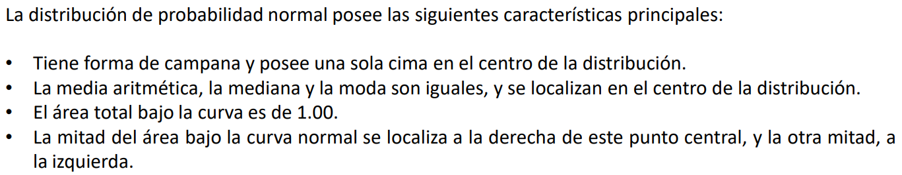

```{r configuracion, include=FALSE}
# knitr::opts_chunk$set(echo = FALSE, message = FALSE, results = "hide")
knitr::opts_chunk$set(echo = TRUE,message = FALSE,warning = FALSE)
```

```{r, include=FALSE}
# Librerias a cargar
if (!require(dplyr)){install.packages(dplyr)}
if (!require(readr)){install.packages(readr)}
if (!require(modeest)){install.packages(modeest)}
if (!require(ggplot2)){install.packages(ggplot2)}
if (!require(plotrix)){install.packages(plotrix)}

```

> # ***Introducción***

La moda es una industria global en constante evolución y uno de los mayores impulsores del comercio internacional. Los consumidores buscan constantemente nuevas tendencias y estilos únicos, lo que hace que la industria de la moda sea altamente competitiva. Para ayudar a los minoristas a mantenerse al día con las últimas tendencias y preferencias de los consumidores, se están desarrollando nuevas herramientas de análisis de datos y motores de búsqueda para la moda.

> ### ***Relevancia y Justificación:***

En este contexto, el desarrollo de un gestor de motor de búsqueda para la elaboración de recomendaciones sobre las preferencias de la ropa de moda en la India se vuelve crucial para mejorar la capacidad de las empresas de este sector, ya que permite ofrecer productos más acordes a las necesidades y gustos de los consumidores. Además, este tipo de herramientas tecnológicas permiten recopilar grandes cantidades de datos sobre las preferencias de los consumidores de manera eficiente, lo que es vital para mejorar la eficacia y eficiencia de la toma de decisiones empresariales.

> # ***Objetivos:***
> ### **Objetivo Principal:**

Nuestro objetivo de este trabajo es presentar un gestor de motor de búsqueda para elaborar recomendaciones sobre las preferencias de la ropa de moda en la India. Para ello, se analizará una base de datos, [MYNTRA](BaseDatos), que incluye información sobre los *gustos y preferencias de los consumidores* en cuanto a diferentes tipos de prendas y estilos de moda.

> ### ***Objetivos Secundarios***

A partir de esta información, se desarrollará un modelo de recomendación que permita a las empresas del sector ofrecer productos más acordes a las necesidades y gustos de los consumidores, contribuyendo así a mejorar su competitividad y su capacidad de satisfacer las demandas del mercado.

+ Identificar los productos más caros
+ Identificar los colores más repetidos que llevan el aumento de precio
+ Identificar que productos que prefiere la población, su precio, color y para que géneros
+ Analizar qué productos en el mercado de la India son más caros y para qué género
+ Identificar los colores preferidos de la población con relación a su género

> # ***Datos***
> ### ***Recolección de datos***

Se ha seleccionado la data de una base de datos de Kaggle con el nombre [“Fashion Clothing Products Dataset”](BaseDatos) el cual presenta una población de 10000 valores. La base de datos se origina en Myntra.com, Myntra es una importante empresa india de comercio electrónico de moda con sede en Bengaluru, Karnataka, India. La empresa se fundó en 2007 para vender artículos de regalo personalizados. En mayo de 2014 , FlipKart adquirió Myntra.com.

Empezaremos cargando nuestra base de datos
```{r}
library(readr)
library(dplyr)
library(modeest)
library(ggplot2)
library(plotrix)

dataframe<-read_csv("myntra_products_catalog.csv")
dataframe
```

> ### ***Población Objetivo***

Seleccionaremos una muestra de 1000 variables para poder cumplir nuestros objetivos y poder responder de manera adecuada cada pregunta usando los análisis y limpieza de los datos que hemos aprendido a lo largo de este curso.

A continuación seleccionaremos nuestra muestra
```{r}
dataMuestra<-dataframe[1:1000,]
dataMuestra
```
y continuaremos con nuestro estudio en base a esta

> # ***Variables de estudio iniciales***

Para la base de datos presentamos las siguientes variables:

|**Nombre de variable**| **Tipo de variable** | **Descripción**|
|:--------------------:|:--------------------:|:--------------:|
|**ProductoId**|***cualitativa***|Es nuestra llave primaria para cada producto, única en toda la base de datos|
|**NombreProducto**|***cualitativa***|El nombre del producto |
|**MarcaProducto**|***cualitativa***|La marca que fabrica el producto|
|**Género**|***cualitativa***|El género el cual esta destinado para el producto|
|**PrecioUSD**|***cuantitativa***|El precio en Rupias(INR) convertido a dolares estadounidenses(USD)|
|**NumImagenes**|***cuantitativa***|Cantidad de imágenes que hay para el producto|
|**Descripción**|***cualitativa***|Una pequeña descripción sobre el producto|
|**ColorPrimario**|***cualitativa***|Color del producto|

Actualizamos el nombre de nuestras columnas para una mejor visualización de nuestro estudio.

```{r}
colnames(dataMuestra)
colnames(dataMuestra)<-c("ProductoId","NombreProducto","MarcaProducto","Genero","PrecioUSD","NumImagenes","Descripción","ColorPrimario")
```

***Ahora nuestras columnas se llamaran***

```{r}
colnames(dataMuestra)
```

***Control de los Na en las variables***

```{r}
any(is.na(dataMuestra$ProductoId))
any(is.na(dataMuestra$NombreProducto))
any(is.na(dataMuestra$MarcaProducto))
any(is.na(dataMuestra$Genero))
any(is.na(dataMuestra$PrecioUSD))
any(is.na(dataMuestra$NumImagenes))
any(is.na(dataMuestra$Descripción))
any(is.na(dataMuestra$ColorPrimario))
```

Detectamos que color primario cuenta con valores Na entonces procedemos a corregirlo

```{r}
dataMuestra$ColorPrimario[is.na(dataMuestra$ColorPrimario)]<-"No color"
any(is.na(dataMuestra$ColorPrimario))
```

Convertimos la rupia del Precio del producto a dolares estadounidenses

```{r}
dataMuestra$PrecioUSD<-dataMuestra$PrecioUSD*0.012
dataMuestra$PrecioUSD[1:10]
```


> # ***Análisis descriptivo***

***La moda de los productos: ***

```{r}
getmode <- function(mod) {
   uniqv <- unique(mod)
   uniqv[which.max(tabulate(match(mod, uniqv)))]
}
modNombreProducto <- dataMuestra$NombreProducto
result <- getmode(modNombreProducto)
print(result)

#OTRA FORMA
mfv(dataMuestra$NombreProducto,method="mlv")
```

A partir de esta función, podemos determinar e producto que más se repite, es decir, el que  posee mayor demanda por los consumidores. En este caso es "Parx Men Blue Slim Fit Checked Casual Shirt".

```{r warning=FALSE}
tablaNombreProducto<-table(modNombreProducto)

maxNombreProducto<-max(tablaNombreProducto)
print(maxNombreProducto)
# Convertir la tabla en un dataframe
tabla_df <- as.data.frame(tablaNombreProducto)
# Acceder al conteo
conteo <- tabla_df$Freq
# Definir el valor umbral para cambiar el color de la barra
ggplot(tabla_df,aes(x=tabla_df$modNombreProducto,y=tabla_df$Freq)) +
  geom_bar(stat = "identity", fill = ifelse(conteo == maxNombreProducto, "green", "blue")) +
  labs(x = "Nombre Producto", y = "Cant. Apariciones") +
  ggtitle("Gráfico de barras - NombreProducto") +
  theme_minimal()

ProductosPreferidos<-dataMuestra %>%
  filter(dataMuestra$NombreProducto==result)

precios<- as.data.frame(table(ProductosPreferidos$PrecioUSD))
colores<-as.data.frame(table(ProductosPreferidos$ColorPrimario))
sexos<-as.data.frame(table(ProductosPreferidos$Genero))
```

> ## ***EXPLICACIÓN:***

Podemos observar en mediante este gráfico de barras que el nombre que más pedido en MYNTRA es "Parx Men Blue Slim Fit Checked Casual Shirt" con un total de 16 veces pedido. Además de que su rango de precios es entre:

```{r}
range(as.double(as.character(precios$Var1)))
print(colores$Var1)
print(sexos$Var1)
```

Podemos concluir que los hombres, que compran "Parx Men Blue Slim Fit Checked Casual Shirt" a un precio entre 8.148 y 11.268 les gusta el color azul, además de que tambien es el producto.


***La moda de la marca del producto:***

```{r}
getmode <- function(mod) {
   uniqv <- unique(mod)
   uniqv[which.max(tabulate(match(mod, uniqv)))]
}

mod <- dataMuestra$MarcaProducto

result <- getmode(mod)
print(result)
```

A partir de esta función, podemos determinar que la marca del producto que más se repite, es decir, la marca de preferencia por la población muestrada es "Parx".

```{r warning=FALSE}
tablaMarca<-table(dataMuestra$MarcaProducto)

maxMarca<-max(table(dataMuestra$MarcaProducto))
print(maxMarca)
# Convertir la tabla en un dataframe
tabla_df <- as.data.frame(tablaMarca)
# Acceder al conteo
conteo <- tabla_df$Freq
# Definir el valor umbral para cambiar el color de la barra
ggplot(tabla_df,aes(x=tabla_df$Var1,y=tabla_df$Freq)) +
  geom_bar(stat = "identity", fill = ifelse(conteo == maxMarca, "green", "blue")) +
  labs(x = "Marca Producto", y = "Cant. Apariciones") +
  #ggline(promedioMarca ~range())
  ggtitle("Gráfico de barras - MarcaProducto") +
  theme_minimal()

MarcaPreferida<-dataMuestra%>%
  filter(dataMuestra$MarcaProducto==result)
precio<-as.data.frame(table(MarcaPreferida$PrecioUSD))
color<-as.data.frame(table(MarcaPreferida$ColorPrimario))
sexos<-as.data.frame(table(MarcaPreferida$Genero))
```
> ## ***EXPLICACIÓN:***

Podemos observar en mediante este gráfico de barras la marca "Parx" en MYNTRA es la preferida de los clientes siendo un total de 112 veces pedido

```{r}
range(as.double(as.character(precio$Var1)))
print(color)
print(sexos)
```

Podemos concluir que los hombres que prefieren la marca "Parx", compran sus productos a precios entre 4.188 y 11.748, a la mayoría de dicha población les gusta el azul, pero que también escogen una gran variedad de colores.


***La moda del género:***

```{r}
result <- mlv(dataMuestra$Genero,method="mfv")
print(result)
```

Podemos observar que la variable "Genero" es bimodal, ya que posee como a "Men" y "Women" como resultado de su moda.

```{r warning=FALSE}
tablaGenero<-table(dataMuestra$Genero)
maxGenero<-max(table(dataMuestra$Genero))

# Convertir la tabla en un dataframe
tabla_df <- as.data.frame(tablaGenero)
# Acceder al conteo
conteo <- tabla_df$Freq

# Definir el valor umbral para cambiar el color de la barra
ggplot(tabla_df,aes(x=tabla_df$Var1,y=tabla_df$Freq)) +
  geom_bar(stat = "identity", fill = ifelse(conteo == maxGenero, "green", "blue")) +
  labs(x = "Genero", y = "Cant. Apariciones") +
  ggtitle("Gráfico de barras-Genero") +
  theme_minimal()
```

> ## ***EXPLICACIÓN:***

Con este diagrama de barras se puede observar con mejor detenimiento como es que se distribuye la variable "Genero", también podemos observar que la menor variable de apariciones es "Girls".
Por lo que podemos concluir que los productos en MYNTRA son más aprovachos por "Men" y "Woman", además de que "Girls" no son clientes frecuentes en temas de "ropa de moda".

***La media de precios de la empresa en USD:***

```{r}
mean(dataMuestra$PrecioUSD)
```
La variable "PrecioUSD" tiene un promedio de 20.80039, pero esta información no puede ser muy confiable ya que existen formas de dar falsa información.


***La mediana de precios de la empresa en USD:***

```{r}
MedianaPrecio<-median(dataMuestra$PrecioUSD)
print(MedianaPrecio)
```
Podemos observar que la tendencia central en la variable "PrecioUSD" es de 10.788 dolares.

***La moda de precios de la empresa en USD:***

```{r}
getmode <- function(mod) {
   uniqv <- unique(mod)
   uniqv[which.max(tabulate(match(mod, uniqv)))]
}
mod <- dataMuestra$PrecioUSD
result <- getmode(mod)
print(result)
cantResult=max(table(mod))
print(cantResult)
```

Podemos observar que el precio 8.388 dolares en la variable "PrecioUSD" es el que más se repite, siendo un total de 63 veces, por lo que podemos concluir que el precio ideal para los productos es 8.388 dolares.

```{r warning=FALSE}
tablaPrecio<-table(dataMuestra$PrecioUSD)
tabla_df <- as.data.frame(tablaPrecio)
maxCantPrecio<-max(tablaPrecio)
conteo<-tabla_df$Freq
# Acceder al conteo
plot(tabla_df,aes(x=tabla_df$Var1,y=tabla_df$Freq),main="Rango de los precios",col="red",xlab="PreciosUSD",ylab="Cant. Apariciones")+
geom_line(stat = "identity", fill = ifelse(conteo == maxCantPrecio, "green", "blue"))
```

> ## **EXPLICACIÓN:**

Podemos observar de mejor manera como se distribuyen los precios respecto a sus apariciones, notando de que la cantidad de más apariciones es del precio 8.38 con un total de 63 veces además de que los precios menos 25 dolares son la preferencia de los clientes ya que tienen una mayor cantidad de apariciones.


***El rango de los precios:***

```{r}
rango<-range(dataMuestra$PrecioUSD)
print("inicia en:")
print(rango[1])
print("termina en:")
print(rango[2])
```
Los valores en la variable "PrecioUSD" están en un rango entre 3.108 y 373.2.  


```{r}
hist(dataMuestra$PrecioUSD,col=c("red","blue","yellow","pink"),main="Histograma de precios",xlab="Precios en USD", ylab= "Cantidad")
```

> ## ***EXPLICACIÓN:***

Se puede observar de mejor manera como la mayor cantidad de apariciones en los precios son inferiores a los 50 dolares aproximadamente, y que los precios con menos apariciones son mayores a 100 dolares proximadamente.
Concluyendo que los clientes prefieren los productos más baratos a 50 dolares.


***El rango intercuartil de precios:***

```{r warning=FALSE}
Q1=quantile(dataMuestra$PrecioUSD,0.25)#Q1
Q3=quantile(dataMuestra$PrecioUSD,0.75)#Q1
Q3-Q1
#segunda forma
IQR(dataMuestra$PrecioUSD)
boxplot(dataMuestra$PrecioUSD,col=c('yellow'),horizontal = T,main="Rango de precios USD")
```

> ## ***EXPLICACIÓN:***

En esta boxplot podemos observar que es sesgado a la derecha con valores menores a 50 dolares, con n datos atípicos y que su su mediana está alrededor de los 25 dolares aproximadamente.
Podemos concluir que la parte más corta es inferior a la mediana, y la media es mayor a la mediana.


***La desviación estándar:***

```{r}
sd(dataMuestra$PrecioUSD)#cuanto se dispersa el precio con respecto al promedio
```
A partir de esta función la variación o dispersión en la que el precio de los productos en USD difieren de la media.
 
***La varianza del precio:***

```{r}
var(dataMuestra$PrecioUSD)
```
Podemos determinar que a mayor varianza del precio, mayor dispersión.

***El coeficiente de variación del precio:***
```{r}
coef_var <- function(cv, na.rm = TRUE) {
  sd(cv, na.rm=na.rm) / mean(cv, na.rm=na.rm)
}
cv <- dataMuestra$PrecioUSD
print(coef_var(cv))
```
Es el análisis de las desviaciones del precio con respecto a la media y al mismo tiempo las dispersiones que tienen los datos dispersos entre sí.

***La moda de las imágenes***

```{r warning=FALSE}
getmode <- function(mod) {
   uniqv <- unique(mod)
   uniqv[which.max(tabulate(match(mod, uniqv)))]
}

mod <- dataMuestra$NumImagenes
result <- getmode(mod)
print(result)

boxplot(dataMuestra$NumImagenes,horizontal = T,col="skyblue",main="Numero de Img")
print("Promedio:")
mean(dataMuestra$NumImagenes)
print("Mediana:")
median(dataMuestra$NumImagenes)


```

> ## ***EXPLICACIÓN:***

Podemos observar que tambien presenta datos atípicos, pero algo curioso pasa en este boxplot, podemos ver que la mediana, media y la moda es aproximadamente 5, es decir podemos concluir que la distribución es simétrica.

```{r warning=FALSE}
tablaImagenes<-table(mod)
barplot(tablaImagenes,col=c('red','blue','pink','yellow','brown','skyblue','lightgreen'),main="Diagra de barras de Num. Imagenes")
```
> ## ***EXPLICACIÓN:***

De una mejor manera podemos observar como es que las cantidades de los precios es que se encuentran. 
Con ello podemos concluir que las empresas con mayor éxito solo necesitan 5 imágenes para captar la atención del cliente.


***Identificar el producto más caro:***

```{r}
max(dataMuestra$PrecioUSD)
productoCaro<-dataMuestra%>%
  filter(dataMuestra$PrecioUSD==max(dataMuestra$PrecioUSD))
productoCaro
unique(productoCaro$MarcaProducto)
unique(productoCaro$Genero)
unique(productoCaro$ColorPrimario)
```
El producto más caro es de la marca "DKNY" para los generos de "Unisex" con un precio de 373.2 dolares con los colores Purple y Black.
 
***Identificar los colores más repetidos que llevan el aumento de precio: ***

```{r warning=FALSE}

Modcolor<-getmode(dataMuestra$ColorPrimario)
print(Modcolor)
preguntaColor<-dataMuestra %>%
  filter(dataMuestra$ColorPrimario==Modcolor)
ModPrecioColor<-getmode(preguntaColor$PrecioUSD)
print(ModPrecioColor)
cantResultColor<-max(table(preguntaColor$PrecioUSD))

barplot(table(preguntaColor$PrecioUSD), col= ifelse(table(preguntaColor$PrecioUSD)==cantResultColor,"red","green"), main="Diagrama de barras de los precios para los colores preferidos")

range(preguntaColor$PrecioUSD)
MasCaro<-preguntaColor%>%
  filter(preguntaColor$PrecioUSD==max(preguntaColor$PrecioUSD))
print(MasCaro)
```

> ## ***EXPLICACIÓN:*** 

Podemos observar que el color azul es el más preferido de las empresas, también que su precio más repetido es de 8.388, y se encuentra en un rango entre 3.192 y 67.188, además de que observamos de que el producto más caro  con un precio de 67.188, que es destinado a los hombre, de la marca Raymond.

Con lo que podemos concluir que al alza de precio para los colores más caros, depende de la "Marca" y para el género "Cliente".


***Cuáles son los precios más caros para los Varones:***

```{r}
table(dataMuestra$Genero) 
preguntaBoys<- dataMuestra %>%
  filter(dataMuestra$Genero=='Boys')

MaxBoys=max(preguntaBoys$PrecioUSD)
print("Marcas: ")
unique(preguntaBoys$MarcaProducto)
print('Precio maximo para Boys:')
print(MaxBoys)

preguntaMen<- dataMuestra %>%
  filter(dataMuestra$Genero=='Men')
MaxMens=max(preguntaMen$PrecioUSD)
print("Marcas: ")
unique(preguntaMen$MarcaProducto)
print('Precio maximo para Men:')
print(MaxMens)

TotalVarones=MaxBoys+MaxMens
print('Precio total:')
print(TotalVarones)
```

> ## ***EXPLICACIÓN:*** 

Podemos observar que los clientes más frecuentes son los Mens que los Boys, como se dijo en la moda de "Genero", pero tambien podemos obervar que los precios al menos uno de los más caros se encuentran en los Mens, con un valor de 79.788 dolares.
Dándonos un total de los maximos precios para Mens y Boys con un precio de 100.176 dolares.


***Cuáles son los precios más caros para las Damas:***

```{r}
table(dataMuestra$Genero) 
preguntaGirls<- dataMuestra %>%
  filter(dataMuestra$Genero=='Girls')
print("Marcas: ")
unique(preguntaGirls$MarcaProducto)
MaxGirls=max(preguntaGirls$PrecioUSD)
print('Precio maximo para Girls:')
print(MaxGirls)

preguntaWomen<- dataMuestra %>%
  filter(dataMuestra$Genero=='Women')
print("Marcas: ")
unique(preguntaWomen$MarcaProducto)
MaxWomen=max(preguntaWomen$PrecioUSD)
print('Precio maximo para Women: ')
print(MaxWomen)
TotalDamas=MaxGirls+MaxWomen
print('Precio total: ')
print(TotalDamas)
```

> ## ***EXPLICACIÓN:*** 

Podemos observar que los clientes más frecuentes son las Women que las Girls, como se dijo en la moda de "Genero", pero también podemos obervar que los precios al menos uno de los más caros se encuentran en las Women, con un valor de 133.644 dolares.
Dándonos un total de los maximos precios para Women y Girls con un precio de 179.244 dolares.

```{r}
if (TotalDamas>TotalVarones){
  print("Las Damas tienen precio más caro con una diferencia de ")
  print(TotalDamas-TotalVarones)
  print("Datos de la compra")
  tablaResult<-preguntaWomen %>%
    filter(preguntaWomen$PrecioUSD==MaxWomen)
  tablaResult
}else{
  print("Los Varones tienen precio más caro con una diferencia de ")
  print(TotalVarones-TotalDamas)
}
```

Podemos concluir que las damas han comprado los productos más caros y que son de la marca "ahilya", llamado "ahilya Gold-Plated Sterling Silver Jhumka Earrings" y que es de color "Gold".


***El rango de los precios según el genero de la ropa:***

```{r warning=FALSE}
ggplot(data = dataMuestra, aes(x = dataMuestra$Genero, y = dataMuestra$PrecioUSD, fill = dataMuestra$Genero)) +
  geom_boxplot() +
  labs(title = "Relación entre el Precio y el Género de la Ropa",
       x = "Género",
       y = "Precio",
       fill = "Género") +
  theme_minimal()
```

> ## ***EXPLICACIÓN:*** 

Podemos apreciar que este gráfico nos da una relación entre el precio de la ropa y el género al que va destinado, por lo que, podemos concluir que la ropa unisex es de las mas costosas, superando los 300 dolares, seguido por la ropa para mujeres y finalmete la ropa para hombres. Además, la ropa para niños es la más económica, con un precio por debajo de los 50 dolares.


***La cantidad de ropa Unisex que saca cada marca***

```{r warning=FALSE}
dataHombres <- dataMuestra %>% filter(Genero == "Unisex")
ggplot(data = dataHombres, aes(x = dataHombres$MarcaProducto, fill = dataHombres$Genero)) +
  geom_bar(position="dodge") +
  labs(title = "Relación entre la Marca y el Género de la Ropa",
       x = "Marca",
       y = "Conteo",
       fill = "Género") +
  theme_minimal() +
  theme(axis.text.x = element_text(angle = 90)) 
```

> ## ***EXPLICACIÓN:*** 

Podemos apreciar, mediante un gráfico de barras que cada marca tienen una preferencia en cuanto al genero de ropa Unisex en variación a los demás géneros. De esta forma, se puede visualizar rápidamente que marcas en el conjunto de datos dataMuestra producen una mayor cantidad de ropa unisex.

> # **Conclusiones**

1. El producto preferido de los clientes es **"Parx Men Blue Slim Fit Checked Casual Shirt"**, mayormente comprado por hombres, con el color azul y sus precios rondan entre 8.148 y 11.268 dolares.

2. La marca preferida de los clientes es **"Parx"**, mayormente comprada por hombres, con colores muy variados pero con una preferencia del azul y sus precios rondan entre 4.188 y 11.748 dolares.

3. Nuestros mayores clientes son *Men* y *Women* (hombres y mujeres), luego el género Unisex, continuando con Boys y el cliente menos común Girls.

4. Nuestros precios están en un rango entre ***3.108 y 373.2 dolares***, el precio con el que los clientes prefieren comprar es de 8.388 dolares, además de que también en el gráfico de puntos, podemos observar que los **precios menores a 50 también son más frecuentes** entre los clientes por sus cantidades de apariciones.

5. Como hemos observado en las conclusiones 1 y 2 el color azul es el que mayormente aparece, con un rango de precios entre **3.192 y 67.188 dolares**, y que el alza de precio por el color se debe ala Marca y al género del cliente.

6. Analizando el precio entre los géneros, no hemos tomado en cuenta el género "Unisex" por que entraría en los dos casos y se terminaran restando, luego analizamos a todo el género **"Masculino" (Men y Boys)** y a todo el género **"Femenino" (Women y Girls)**, luego los sumamos todos sus precios para luego restar esos dos géneros, entonces podemos ver que el género "Femenino" es el que tiene el precio más caro (133.644 dólares) de ***la marca "ahilya" con el producto "ahilya Gold-Plated Sterling Silver Jhumka Earrings" de color dorado.***


> # ***Parte 2***

> ## ***Probabilidad Empírica***

Analizaremos 3 variables interesantes que influirían en la compra de un cliente, las cuales son Marca, Género (para el destinatario), ColorPrimario (color de la prenda).


***Probabilidades de Marca***

Comprobamos como es que están distribuidos con su nombre y su cantidad de apariciones.
```{r}
table(dataMuestra$MarcaProducto)
tablaMarcaProducto<-table(dataMuestra$MarcaProducto)
tabla_df <- as.data.frame(tablaMarcaProducto)
tabla_df
```

Obtenemos el total y lo dividimos usando P'(A)=n(A)/n
```{r}
print("total de casos")
sum(tabla_df$Freq)
```

PROBABILIDADES DE LAS MARCAS:
```{r}
ProbMarcas<-data.frame(
  "Marcas"=c(tabla_df$Var1),
  "Probabilidad"=c(tabla_df$Freq/sum(tabla_df$Freq))
)
ProbMarcas  
```

COMPROBAMOS QUE ESTÉ BIEN DISTRIBUIDO
```{r}
sum(ProbMarcas$Probabilidad)
```
Marca más probable
```{r}
ProbMarcas$Marcas[ProbMarcas$Probabilidad==max(ProbMarcas$Probabilidad)]
```
Marca menos probable
```{r}
ProbMarcas$Marcas[ProbMarcas$Probabilidad==min(ProbMarcas$Probabilidad)]
```

Experimento 1:
Calcular la probabilidad de entrevistar a uno de los clientes que haya comprado la 2da Marca más comprada.

Entonces como nos piden la 2da marca más comprada debemos tener el conteo de apariciones de las marcas.
```{r}
exp1<-as.data.frame(sort(table(dataMuestra$MarcaProducto),decreasing = T))
exp1
```

Observamos que la 2da marca es "Gini and Jony" con una aparición de 66. Entonces para encontrar la probabilidad debemos dividirlo con el total de la muestra(100)
```{r}
exp1$Freq[2]/sum(exp1$Freq)
```
Comprobamos si la tabla ProbMarca usada anteriormente está bien calculada
```{r}
ProbMarcas$Probabilidad[ProbMarcas=="Gini and Jony"]
```


***Probabilidades de Género***

Comprobamos como es que están distribuidos los generos y su cantidad de apariciones.

```{r}
table(dataMuestra$Genero)
tablaGenero<-table(dataMuestra$Genero)
tabla_df <- as.data.frame(tablaGenero)
tabla_df
```
Obtenemos el total y lo dividimos usando P'(A)=n(A)/n
```{r}
print("total de casos")
sum(tabla_df$Freq)
```
PROBABILIDADES DE LOS GÉNEROS:
```{r}
ProbGenero<-data.frame(
  "Genero"=c(tabla_df$Var1),
  "Probabilidad"=c(tabla_df$Freq/sum(tabla_df$Freq))
)
ProbGenero
```

COMPROBAMOS QUE ESTÉ BIEN DISTRIBUIDO
```{r}
sum(ProbMarcas$Probabilidad)
```

Género más probable
```{r}
ProbGenero$Genero[ProbGenero$Probabilidad==max(ProbGenero$Probabilidad)]
```
Género menos probable
```{r}
ProbGenero$Genero[ProbGenero$Probabilidad==min(ProbGenero$Probabilidad)]
```

Experimento

**Calcular la probabilidad de entrevistar a un varón**

En este caso, ignoraremos al género UNISEX por que solo nos centraremos en los varones. Así que calcularemos las frecuencias de los varones

```{r}
exp2<-data.frame(table(dataMuestra$Genero))
exp2
```
Luego sumaremos la frecuencia de los Niños(Boys) y los Hombre(Men)
```{r}
TotalSuma<-sum(exp2$Freq[exp2$Var1=="Boys" | exp2$Var1=="Men"])
TotalSuma
```
Después al total lo dividimos al total de la muestra (1000) y con ello hallaremos la probabilidad
```{r}
TotalSuma/1000
```
Para una segunda forma usaremos la tabla ProbGenero mencionada anteriormente para corroborar que esté bien.
```{r}
sum(ProbGenero$Probabilidad[ProbGenero$Genero=="Boys" |ProbGenero$Genero=="Men" ])
```
***Probabilidades de color***

Comprobamos como es que están distribuidos los Colores y su cantidad de apariciones.
```{r}
table(dataMuestra$ColorPrimario)

tablaColor<-table(dataMuestra$ColorPrimario)
tabla_df <- as.data.frame(tablaColor)
tabla_df
```
Obtenemos el total y lo dividimos usando P'(A)=n(A)/n
```{r}
print("total de casos")
sum(tabla_df$Freq)
```
PROBABILIDADES DE LOS COLORES:
```{r}
ProbColores<-data.frame(
  "Color"=c(tabla_df$Var1),
  "Probabilidad"=c(tabla_df$Freq/sum(tabla_df$Freq))
)
ProbColores  
```

COMPROBAMOS QUE ESTÉ BIEN DISTRIBUIDO
```{r}
sum(ProbMarcas$Probabilidad)
```
Color más probable
```{r}
ProbColores$Color[ProbColores$Probabilidad==max(ProbColores$Probabilidad)]
```
Color menos probable
```{r}
ProbColores$Color[ProbColores$Probabilidad==min(ProbColores$Probabilidad)]
```
Experimento

**Calcular la probabilidad de encontrar una prenda de color Pink**


```{r}
exp3<-as.data.frame(table(dataMuestra$ColorPrimario))
```
Obtendremos la frecuencia de Pink y lo dividiremos con el total de la muestra(1000)
```{r}
TotalPink<-exp3$Freq[exp3$Var1=="Pink"]
TotalPink
TotalPink/1000
```
Comprobamos que la tabla ProbColores esté bien calculado la probabilidad de Pink
```{r}
ProbColores$Probabilidad[ProbColores$Color=="Pink"]
```


> ## ***Probabilidad Condicional***

*Evento Independiente*

Evento A=seleccionar una prenda de color gold

Evento B=seleccionar que sea una mujer

Armamos nuestro cuadro de probabilidades

```{r}
eventoA=ProbColores$Probabilidad[ProbColores$Color=="Gold"]
eventoAC=1-eventoA

eventoB=ProbGenero$Probabilidad[ProbGenero$Genero=="Women"]
eventoBC=1-eventoB

a11=eventoA * eventoB
a12=eventoAC * eventoB
a21=eventoA * eventoBC
a22=eventoAC * eventoBC
TA1=a11+a21
TA2=a12+a22
TB1=a11+a12
TB2=a21+a22
Tprob=a11+a22+a21+a12
c<-data.frame(
  'evento A'=c(a11,a21, TA1),
  'evento A Comp.'=c(a12,a22, TA2),
  'Totales B'= c(TB1,TB2,Tprob)
)
row.names(c)<-c('Evento B', 'Evento B Comp.', 'Totales A')
c
```
Validamos Independencia
```{r}
AnB= eventoA*eventoB
AnB
#2da forma
a11/Tprob
(TA1/Tprob)*(TB1/Tprob)

A_B=AnB/eventoB
A_B
eventoA
# 2da forma
a11 / TB1
TA1 / Tprob
```
Calcular la probabilidad condicional por la formula de Bayes
```{r}
B_A=A_B * eventoB/ eventoA
B_A
```
Probabilidad total
```{r}
A_BC=eventoA*eventoBC /  eventoBC
eventoA
A_B*eventoB+A_BC*eventoBC
```


Eventos 2

Evento A=seleccionar a una prenda de color blue
Evento B=seleccionar a un hombre que compró al menos una vez la marca "HIGHLANDER"

```{r}
eventoA=ProbColores$Probabilidad[ProbColores$Color=="Blue"]
eventoA
eventoAC=1-eventoA
eventoAC

eventoB=ProbMarcas$Probabilidad[ProbMarcas$Marcas=="HIGHLANDER"]
eventoB
eventoBC=1-eventoB
eventoBC

a11=eventoA * eventoB
a12=eventoAC * eventoB
a21=eventoA * eventoBC
a22=eventoAC * eventoBC
TA1=a11+a21
TA2=a12+a22
TB1=a11+a12
TB2=a21+a22
Tprob=a11+a22+a21+a12
c<-data.frame(
  'evento A'=c(a11,a21, TA1),
  'evento A Comp.'=c(a12,a22, TA2),
  'Totales B'= c(TB1,TB2,Tprob)
)
row.names(c)<-c('Evento B', 'Evento B Comp.', 'Totales A')
c
```
Validamos Independencia
```{r}
AnB= eventoA*eventoB
AnB
#2da forma
a11/Tprob
(TA1/Tprob)*(TB1/Tprob)

A_B=AnB/eventoB
A_B
eventoA
# 2da forma
a11 / TB1
TA1 / Tprob
```
Calcular la probabilidad condicional por la formula de Bayes
```{r}
B_A=A_B * eventoB/ eventoA
B_A
```
Probabilidad total
```{r}
A_BC=eventoA*eventoBC /  eventoBC
eventoA
A_B*eventoB+A_BC*eventoBC
```

Variables Dependientes
Como hemos observado sino afectamos a nuestra base de datos de alguna forma como eliminar productos, reducir o aumentar su tamaño, entonces nuestras variables estudiadas serán independientes, comprobado con las probabilidades de la intersección de las variables.
Por lo que podemos concluir que si queremos variables dependientes debemos de afectar de alguna forma a nuestras variables.

> ## ***Variable Aleatoria Discreta:***

Definimos nuestra distribuciones a utilizar

.***Binomio***

Queremos usar la distribución Binomial para poder ver los resultados de la marcas, un experimento que se repita "n" veces, para todos los "n" deben tener los dos mismos resultados posibles y la probabilidad de estos resultados debe ser siempre constante. y esta dada por la función.

.***Binomial negativa***

Un experimento donde "k" representa el numero de pruebas, "p" es la probabilidad de exito dentro de esta y esta dada por la funcion dnbinom(k-r, r, p).

.***Distribucion geometrica***

Un experimento donde "k" representa el numero de pruebas antes de obtener el exito, "p" es la probabilidad de extito en cada "k" y esta dada por la funcion dgeom(k, p).

### ***Identificar los parametros***
Para cada caso es necesario identicar los parametros tanto como hasta donde pensamos llegar, cual es la probabilidad de exito que buscamos, o sobre que circunstacias buscamos el exito o el fracaso o que limites tenemos dentro de cada uno.
  
### .***Construir VA***

**Binomial**

Probabilidad que en un día aleatorio, de 15 compradores hombres, 2 compren una prenda de la marca "Parx".

```{r, eval = TRUE, message = FALSE, warning = FALSE}
TotalParx= length(dataMuestra$MarcaProducto[dataMuestra$MarcaProducto=="Parx"])
caso_1 <- 1:15

plot(dbinom(caso_1, size = 15, 15/TotalParx), type = "h", lwd = 2, main = "Hombres que compren Parx", ylab ="P(X = x)", xlab = "Número de éxitos", col = "blue")
```
 
##  

**Geométrica**

Probabilidad de encontrar al primer cliente, después de haber encuestado a 23 compradores que se retiran de la tienda que compren una prenda Homesake.
```{r, eval = TRUE, message = FALSE, warning = FALSE}
TotalHomesake= length(dataMuestra$MarcaProducto[dataMuestra$MarcaProducto=="Homesake"])

caso_2 <- 24
plot(dgeom(caso_2,TotalHomesake/nrow(dataMuestra)), type = "h", lwd = 2, main = "Primer cliente Homesake ", ylab ="P(X = x)", xlab = "Número de éxitos", col = "blue")
``` 


**Binomial Negativa**

Probabilidad de encontrar al quinto cliente de la tienda con capacidad de 67 clientes que compre un producto Michael Kors.

```{r, echo=FALSE}
TotalHomesake= length(dataMuestra$MarcaProducto[dataMuestra$MarcaProducto=="Michael Kors"])
Caso_7 <- 67
  
plot(dnbinom(Caso_7,5,5/67),type = "h", lwd = 2, main = "5to Cliente Michael Kors", col = "blue", xlab = "Número de éxitos", ylab = "Probabilidad de éxito")
```

> ## ***Variable Aleatoria Continua:***

Definimos nuestra distribuciones a utilizar

### ***Distribución normal:***


. ***Validar Propiedades***

Escogemos la variable Imágenes por cumplir las propiedades requeridas

```{r}
mean(dataMuestra$NumImagenes)
median(dataMuestra$NumImagenes)
mode(dataMuestra$NumImagenes)

boxplot(dataMuestra$NumImagenes,horizontal = TRUE)

```

. ***Construir un ejemplo***

Cual es la probabilidad de escoger un número de images que esten en un rango de entre 3 y 6
```{r}
media = median(dataMuestra$NumImagenes)
desviacion= sd(dataMuestra$NumImagenes)
( (0.5-pnorm(6,media,desviacion,lower.tail = FALSE)) + (0.5-pnorm(3,media,desviacion)) )
```


. **Distribución Gamma**

Cual es la probabilidad de escoger un cliente que haya comprado un producto mayor de 9 dolares.

Para empezar, vamos a analizar la variable **PrecioUSD** siendo esta una variable numérica continua.

```{r}
vector = dataMuestra$PrecioUSD
boxplot(vector, horizontal = TRUE, xlab = "Precio en USD", main = "Grafico de Caja", col="yellow" )
```
Como podemos apreciar, el gráfico de caja nos muestra un sesgo a la derecha, por lo que recomendamos usar una distribución Gamma. La distribución Gamma es útil para el estudio de variables con esta característica que ademas sean unicamente positivos.

Ahora, tenemos que construir la distribución, para ello necesitamos obtener la **Forma** y la **Escala**. Estos datos los podemos obtener con la siguiente formula:

```{r}
# Estimar los parámetros de la distribución gamma
forma_estimada <- mean(vector)^2 / var(vector)
escala_estimada <- var(vector) / mean(vector)
```

Ahora solo necesitamos ejecutar el comando. Para una mejor comprensión utilizaremos un gráfico de curva. Con este podremos apreciar de mejor manera el área bajo esta.

```{r}
# Calcular la probabilidad relativa utilizando dgamma()
curve(dgamma(x, forma_estimada, scale=escala_estimada), xlab = "Precio en USD", ylab = "Probabilidad Relativa", 0, 100, col = "red",lwd = 6, main = "Gráfico distribución D Gamma")

y_interseccion <- dgamma(9, forma_estimada, scale = escala_estimada)

# Trazar la línea vertical desde el eje x hasta la intersección con la curva
abline(v = 9, lty = 2, col = "red")

# Resaltar el valor x = 9 con un punto en la intersección
points(9, y_interseccion, col = "red", pch = 16)

# Definir los puntos para el polígono que representa el área bajo la curva hasta x = 9
x_values <- seq(9, 100, length.out = 100) # Valores de x desde 0 hasta 9
y_values <- dgamma(x_values, forma_estimada, scale = escala_estimada) # Valores correspondientes de la función de densidad

# Agregar los puntos finales para cerrar el polígono
x_values <- c(x_values, 100, 9)
y_values <- c(y_values, 0, 0)

# Colorear el área bajo la curva hasta x = 9
polygon(x_values, y_values, col = "lightblue", border = NA)

```
Con la distribución **D Gamma** podemos hallar la probabilidad para un evento en concreto, por lo que si colocamos **dgamma(9, shape, scale)** obtendremos la probabilidad de escoger una prenda con un costo de 9 dólares. (Mostramos este gráfico con motivo de estudio)

Nuestro objetivo es hallar la suma de todas las probabilidades desde X = 9 hasta X = 100, lo que representaria el área coloreada de azul. 

Si nosotros queremos obtener la probabilidad de escoger una prenda con un valor mayor a 9 dolares tenemos que usar la distribución **P Gamma**. Esta obtiene la sumatoria de las probabilidades hasta el evento que tu escojas, por ejemplo **pgamma(9, shape, scale)** nos devuelve la sumatoria de las probabilidades de escoger una prenda con un valor de 9 dolares o inferior.

Como la pregunta es **¿Cual es la probabilidad de escoger una prenda de ropa que tenga un costo mayor o igual a 9?** lo que tenemos que hacer es restar la probabilidad total con el valor obtenido por **pgamma(9, shape, scale)**.

Para ello, graficaremos la siguiente curva con los datos obtenidos de **P Gamma**.

```{r}
# Calcular la probabilidad acumulada utilizando pgamma()
curve(pgamma(x, forma_estimada, scale=escala_estimada), xlab = "Precio en USD", ylab = "Probabilidad Acumulada", 0, 100, col = 6,lwd = 6, main = "Gráfico distribución P Gamma")

y_interseccion <- pgamma(9, forma_estimada, scale = escala_estimada)

# Trazar la línea vertical desde el eje x hasta la intersección con la curva
abline(v = 9, lty = 2, col = "red")

# Resaltar el valor x = 9 con un punto en la intersección
points(9, y_interseccion, col = "red", pch = 16)

# Definir los puntos para el polígono que representa el área bajo la curva hasta x = 9
x_values <- seq(0, 9, length.out = 100) # Valores de x desde 0 hasta 9
y_values <- pgamma(x_values, forma_estimada, scale = escala_estimada) # Valores correspondientes de la función de densidad

# Agregar los puntos finales para cerrar el polígono
x_values <- c(x_values, 9, 0)
y_values <- c(y_values, 0, 0)

# Colorear el área bajo la curva hasta x = 9
polygon(x_values, y_values, col = "lightblue", border = NA)
```
¿Que representa **P Gamma**? Este comando representa la sumatoria acumulada de probabilidades, por lo que el área bajo la curva expresa esta sumatoria. Como aclaramos anteriormente, necesitamos obtener **pgamma(9, shape, scale)**, lo cual esta coloreado de azul. (La linea roja representa el eje Y(x=9))

Con los graficos hechos, solo faltaria realizar el código para obtener la probabilidad acumulada de elegir una prenda de ropa menor a 9 dólares.

```{r}
pgamma(9, forma_estimada, scale=escala_estimada)
```

Ahora, solo tenemos que restar el total con lo obtenido anteriormente, para poder hallar la probabilidad acumulada de elegir una prenda de ropa con un costo mayor a 9 dólares.
```{r}
resultado = pgamma(9, forma_estimada, scale=escala_estimada)

1-resultado
```
```{r}
# Calcular la probabilidad acumulada utilizando pgamma()
curve(pgamma(x, forma_estimada, scale=escala_estimada), xlab = "Precio en USD", ylab = "Probabilidad Acumulada", 0, 100, col = 6,lwd = 6, main = "Gráfico distribución P Gamma")

y_interseccion <- pgamma(9, forma_estimada, scale = escala_estimada)

# Trazar la línea vertical desde el eje x hasta la intersección con la curva
abline(v = 9, lty = 2, col = "red")

# Resaltar el valor x = 9 con un punto en la intersección
points(9, y_interseccion, col = "red", pch = 16)

# Definir los puntos para el polígono que representa el área bajo la curva hasta x = 9
x_values <- seq(9, 100, length.out = 100) # Valores de x desde 0 hasta 9
y_values <- pgamma(x_values, forma_estimada, scale = escala_estimada) # Valores correspondientes de la función de densidad

# Agregar los puntos finales para cerrar el polígono
x_values <- c(x_values, 100, 9)
y_values <- c(y_values, 0, 0)

# Colorear el área bajo la curva hasta x = 9
polygon(x_values, y_values, col = "lightblue", border = NA)
```
Por lo que, la probabilidad de obtener una prenda con un costo mayor a 9 dolares es del **44.55%.**

> ## ***CONCLUSIONES:***

1. Podemos observar que los productos con más posibilidades de aparecer son el Azul con un precio de alrededor de $8  dolares por lo que podemos concluir que el aumento del precio en nuestro primer objetivo tiene que ver una relación la marca y para el Género en el que está destinado

2. Observamos que la mayoria de nuestra población que puede aparecer en el estudio es Hombre y Mujer con su preferencia de marca Parx, además que mencionado anteriormente es de color azul y de alrededor de $8 dolares, por lo que si quisieramos entrevistar a está población para poder idenrificar la calidad del producto sería de una forma muy simple ya que está es la gran mayoria de nuestro estudio

3. Concluimos que gracias a las probabilidades del estudio podemos corroborar lo anterior mencionado en la parte 1 dodne confirmamos nuestras sospechas sobre, La marca preferida, El género del cliente más frecuente, El precio ideal y el color preferido gracias a las frecuencias y comparaciones de estas.


[link1]:https://cita.utec.edu.pe/assets/uploads/2019/05/logo_utec.png {width='400px'}
[BaseDatos]: https://www.kaggle.com/datasets/shivamb/fashion-clothing-products-catalog
  