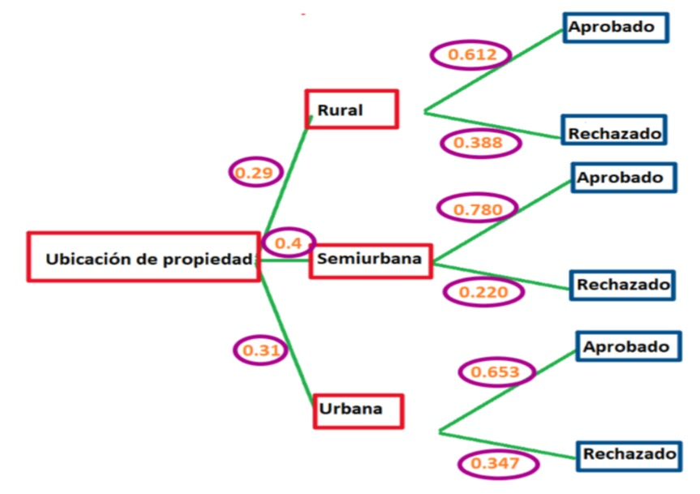

---
output:
  html_document:
    toc: yes
    df_print: paged
  html_notebook:
    toc: yes
    toc_float:
      collapsed: no
      smooth_scroll: yes
    number_sections: yes
---

```{r echo = FALSE, warning=FALSE, message=FALSE}
if(!require(readr)){install.packages('readr')}
library(readr)
if(!require(dplyr)){install.packages('dplyr')}
library(dplyr)
if(!require(ggplot2)){install.packages('ggplot')}
library(ggplot2)
if(!require(rriskDistributions)){install.packages('rriskDistributions')}
library(rriskDistributions)
if(!require(knitr)){install.packages("knitr")}
library(knitr)
if(!require(car)){install.packages("car")}
library(car)
if(!require(DescTools)){install.packages("DescTools")}
library(DescTools)
if(!require(kableExtra)){install.packages("kableExtra")}
library(kableExtra)
if(!require(remotes)){install.packages("remotes")}
library(remotes)
if(!require(tidyverse)){install.packages("tidyverse")}
library(tidyverse)
if(!require(MASS)){install.packages("MASS")}
library(MASS)
```

# <b style = 'color : black;'><FONT FACE="roman">Introdución</FONT></b>


## Relevancia

El perfil crediticio de una persona postulante a un monto de préstamo hipotecario es un elemento fundamental  para las entidades financieras prestamistas  ya que esta les permite evaluar si la solicitud de su préstamo debe o no ser aprobada. Realizar el análisis de la información contenida en el perfil crediticio nos permite tener un mejor entendimiento de las relaciones entre sus correspondientes variables y en consecuencia, de la manera en como las entidades bancarias procesan dicha información antes de elegir a sus clientes.

## Objetivos

❖ Evaluar los rangos de préstamos hipotecarios de acuerdo a la
ubicación de la vivienda del cliente.

❖ Determinar cómo influye el estado civil y la carga familiar en la
aprobación del préstamo hipotecario solicitado.

❖ Conocer el alcance del financiamiento hipotecario conforme al grado
educativo e ingreso económico del cliente.

❖ Identificar lel grado de aprobación de un crédito hipotecario en
base al historial crediticio del cliente.

❖ Evaluar y hallar la probabilidad empírica y condicional, y de los eventos de Ubicación de propiedad y Estado de préstamo para comprender la dependencia entres ambos eventos.

## Contexto

Una compañía financiera otorga préstamos hipotecarios a los solicitantes luego de realizar una minuciosa evaluación de su perfil crediticio y  determinar si califican o no para ser acreedores del monto solicitado. Los solicitantes son personas naturales como también entidades dedicadas al rubro inmobiliario con el fin de comprar, edificar, ampliar o remodelar  sus viviendas e invertir en el desarrollo y crecimiento de sus negocios respectivamente. Una característica del préstamo hipotecario es que la garantía es la misma vivienda financiada o una propiedad con semejante valor económico. En cuanto a la devolución del préstamo desembolsado, la entidad establece que este será devuelto en una cantidad de cuotas mensuales  que dependerá del volumen del préstamo recibido por el cliente. Generalmente el préstamo corresponde al 85% del valor de la vivienda a financiar. En caso de que no se cumpla con la devolución total del monto estipulado (más intereses), la compañía financiera realiza el cobro de la garantía.

A partir de la situación expuesta, se plantea la idea de realizar el análisis del perfil crediticio de los ciudadanos de la India que logran acceder a un préstamo hipotecario, en otras palabras se estudia la información de los clientes de la compañía mediante el análisis de las relaciones entre determinadas variables que describen las características principales de los solicitantes a un préstamo hipotecario tales como ingreso económico, carga familiar e historial crediticio.


```{r, echo =  FALSE}
DF <- read_csv("DATA.csv")
```

```{r, echo =  FALSE}
DF2 <- DF
```

```{r, echo =  FALSE}
colnames(DF2) <- c("ID", "Género", "Estado_civil","Carga_familiar", "Grado_Académico","Trabajador_independiente", "Ingreso_del_solicitante", "Ingresos_del_cosolicitante","Monto_de_préstamo", "Periodo_crediticio", "Historial_crediticio", "Ubicaión_de_propiedad", "Estado_de_préstamo")
```

```{r, echo =  FALSE}
DF2 %>% mutate(Género = 
        ifelse( Género == "Male", "Masculino",
        ifelse( Género == "Female", "Femenino", Género
        ))) -> DF2
```

```{r, echo =  FALSE}
DF2 %>% mutate(Estado_civil = 
        ifelse( Estado_civil == "Yes", "Casado",
        ifelse( Estado_civil == "No", "Soltero", Estado_civil
        ))) -> DF2
```

```{r, echo =  FALSE}
DF2 %>% mutate(Grado_Académico = 
        ifelse(Grado_Académico == "Graduate", "Graduado",
        ifelse(Grado_Académico == "Not Graduate", "No Graduado",Grado_Académico
        ))) -> DF2
```

```{r, echo =  FALSE}
DF2 %>% mutate(Trabajador_independiente = 
        ifelse(Trabajador_independiente == "Yes", "Si",
        ifelse(Trabajador_independiente== "No", "No", Trabajador_independiente
        ))) -> DF2
```

```{r, echo =  FALSE}
DF2 %>% mutate(Historial_crediticio = 
        ifelse(Historial_crediticio == "0", "Malo",
        ifelse(Historial_crediticio == "1", "Bueno",Historial_crediticio
        ))) -> DF2
```

```{r, echo =  FALSE}
DF2 %>% mutate(Ubicaión_de_propiedad = 
        ifelse(Ubicaión_de_propiedad == "Rural", "Rural",
        ifelse(Ubicaión_de_propiedad == "Semiurban", "Semiurbano",
        ifelse(Ubicaión_de_propiedad == "Urban", "Urbano", Ubicaión_de_propiedad
        )))) -> DF2
```

```{r, echo =  FALSE}
DF2 %>% mutate(Estado_de_préstamo = 
        ifelse(Estado_de_préstamo == "Y", "Aprobado",
        ifelse(Estado_de_préstamo == "N", "Rechazado", Estado_de_préstamo
        ))) -> DF2
```

```{r, echo =  FALSE}
r <- function(x,na.rm=T){
  return(round(x,digits =2))
}
```


```{r, echo =  FALSE}
cv = function(data) {
  sd(data)/mean(data)
}
```


```{r, echo =  FALSE}
mode <- function(x) {
  freq_table <- table(x)
  mode <- as.numeric(names(freq_table)[freq_table == max(freq_table)])
  return(mode)
}

```

## Variables
* Definiendo cada Variable y identificamos el tipo.

```{r, echo=FALSE}

Variables <- read_delim("Variables.csv", 
    delim = ",", escape_double = FALSE, trim_ws = TRUE)
```
```{r, echo=FALSE}

require(knitr)
kable_styling(kable(head(Variables,13),
                    booktabs = TRUE,
                    digits = 3, 
                    label = TRUE,
                    row.names = FALSE, align = "l"),
              latex_options = c("striped", "condensed"),
              position = "center",
              full_width = FALSE) %>%
  row_spec(0, bold = T, color = "white", background = "red") %>%
  column_spec(1, bold = T, color = "blue")
```

```{r, echo =  FALSE}
DF2 <- na.omit(DF2)
```

# <b style = 'color : black;'><FONT FACE="roman">Análisis descriptivo</FONT></b>

## Descriptores numéricos

Se analiza los descriptores numéricos para cada variable.

```{r, echo=FALSE}
Descriptores <- read_delim("Descriptores numericos.csv", 
    delim = ",", escape_double = FALSE, trim_ws = TRUE)
```
```{r, echo=FALSE}
require(knitr)
kable_styling(kable(head(Descriptores,8),
                    booktabs = TRUE,
                    digits = 3, 
                    label = TRUE,
                    row.names = FALSE, align = "l"),
              latex_options = c("striped", "condensed"),
              position = "center",
              full_width = FALSE) %>%
  row_spec(0, bold = T, color = "black", background = "lightblue") %>%
  column_spec(1, bold = T, color = "blue")
```

## Descriptores gráficos

**Análisis de rangos de ingresos económicos totales**
```{r, echo=FALSE}

monto_prestamo <- DF2%>% filter(DF2$Estado_de_préstamo== "Aprobado")
datos2 <- monto_prestamo %>% mutate(Ingreso_Total = Ingreso_del_solicitante + Ingresos_del_cosolicitante)

hist(datos2$Ingreso_Total,breaks=30,col=  "#DCD0FF" ,main="Ingreso Total",ylab="densidad",xlab="Monto de ingreso ($)",prob=TRUE)
abline(v=median(datos2$Ingreso_Total),col="red",lwd=2) 
abline(v=mean(datos2$Ingreso_Total),col="blue",lwd=2) 
legend(30000,0.00020,legend=c("Mediana","Media"),lwd=2,col=c("red","blue"))

```
* En la gráfica podemos apreciar el monto total de ingreso que es la suma de los ingresos del solicitante y cosolicitante. Por otro lado, el promedio de los ingresos totales del solicitantes osila entre 6000 y 7000 dólares, esto nos indica que la mayoría de personas solicitantes tiene el ingreso de los montos mencionados. Por otro lado, al analizar la gráfica la mediana es menor a la media, esto quiere decir que está segada a la derecha, por lo cual hay mayor cantidad de datos atípicos a partir de los 20000 dólares. Además, la densidad representa la cantidad de datos que se encuentran en cada intervalo con respecto al tamaño del rango.


**Análisis de rangos de préstamos hipotecarios**
```{r, echo=FALSE}
monto_prestamo <- DF2%>% filter(DF2$Estado_de_préstamo== "Aprobado")
hist(monto_prestamo$Monto_de_préstamo,breaks=30,col=amarillo_suave <- "#DCD0FF"
 ,main="Monto de préstamo hipotecario",ylab="densidad",xlab="Monto de préstamo (miles de  $)",prob=TRUE)
abline(v=median(monto_prestamo$Monto_de_préstamo),col="red",lwd=2) 
abline(v=mean(monto_prestamo$Monto_de_préstamo),col="blue",lwd=2) 
legend(400,0.009,legend=c("Mediana","Media"),lwd=2,col=c("red","blue"))
```
* Al analizar la gráfica, podemos observar que la compañía Dream Housing Finance otorga un promedio de préstamos hipotecarios que oscila entre los 130 mil y 150 mil dólares. Además, se puede apreciar que la distribución de los datos está sesgada hacia la derecha, ya que la mediana es menor que la media. A partir de esta observación, se puede concluir que los préstamos superiores a los 300 mil dólares son poco frecuentes, ya que los datos muestran una dispersión mayor en esa área.


**Análisis de los rangos de préstamos hipotecarios según ubicaión de la vivienda**
```{r, echo=FALSE}
library(dplyr)

datos1 <- DF2 %>% 
  filter(Estado_de_préstamo == "Aprobado")

boxplot(Monto_de_préstamo ~ Ubicaión_de_propiedad, data = datos1, 
        xlab = "Ubicación de la vivienda", ylab = "Monto del préstamo (miles de $)", 
        main = "Rangos de préstamos hipotecarios según su ubicación", col = c("#B2D8E5", "#FFFACD", "#FA8072"))


```

* En el siguiente gráfico podemos observar  que las personas que viven en zonas rurales el monto de préstamo es mucho menor con un rango aproximado de [100, 170] que el semiurbano, sin embargo las personas que viven en sectores semiurbano y urbano tienen la posibilidad de adquirir montos de préstamos mayores.

**Análisis de la aprobación de crédito hipotecario según su ubicación**
```{r, echo=FALSE}

mosaicplot(table(DF2$Ubicaión_de_propiedad, DF2$Estado_de_préstamo), shade = FALSE, main = " Aprobación de crédito hipotecario según la ubicación de la propiedad",
           xlab = "Ubicación de propiedad", ylab = "Aprobación de crédito", col = c("#C8E6C9","#FA8072"))
```
* Al interpretar la gráfica, se evidencia que las personas que viven en una zona semiurbana tienen una mayor oportunidad para la aprobación del crédito hipotecario; sin embargo, las personas que pertenecen a las zonas rurales y urbanas tienen casi la misma oportunidad de aprobación del crédito hipotecario. Con respecto al rechazo, las personas solicitantes que pertenecen a la zona rural y urbana la proporción es mayor a comparación a las personas que pertenecen a la zona semiurbana.

**Tabla de proporcionalidad de estado civil y estado de préstamo**
```{r, echo=FALSE}
prop.table(table(DF2 %>% filter(Carga_familiar == "0") %>% dplyr::select(Estado_civil, Estado_de_préstamo)), margin = 1)

prop.table(table(DF2 %>% filter(Carga_familiar == "1") %>% dplyr::select(Estado_civil, Estado_de_préstamo)), margin = 1)

prop.table(table(DF2 %>% filter(Carga_familiar == "2") %>% dplyr::select(Estado_civil, Estado_de_préstamo)), margin = 1)

prop.table(table(DF2 %>% filter(Carga_familiar == "3+") %>% dplyr::select(Estado_civil, Estado_de_préstamo)), margin = 1)

```

**Análisis de la proporción entre estado civil, carga familiar y aprobación de crédito**
```{r, echo=FALSE}
# Crear los datos
Estado_civil <- c("Soltero", "Casado")
Carga_familiar <- c("0", "1", "2","3+")

# Proporciones de aprobación de préstamos hipotecarios
prop_aprobacion <- matrix(c(0.6363636, 0.5714286,0.7328244,0.7820513,
                           0.4666667,0.7500000,0.6923077,0.6756757), nrow = 2, ncol = 4, byrow = T)

# Crear un dataframe con los datos
datos <- data.frame(Estado_civil = rep(Estado_civil, each = 4),
                    Carga_familiar = rep(Carga_familiar, times = 2),
                    prop_aprobacion = c(prop_aprobacion))


# Crear el gráfico de heatmap
ggplot(datos, aes(x = Estado_civil, y = Carga_familiar, fill = prop_aprobacion)) +
  geom_tile() +
  scale_fill_gradient(low = "lightblue", high = "darkblue") +
  labs(title = "Influencia del estado civil y carga familiar en la aprobación de préstamos hipotecarios",
       x = "Estado civil", y = "Carga familiar", fill = "Proporción de aprobación") +
  theme_minimal()

```

* Nos permite mostrar la relación de 3 variables, en base a la proporcionalidad de la variable carga familiar con las otras. Las personas casadas tienen mayor aceptación, y las que tiene cargas familiar 1-3 también.

**Análisis de rangos de préstamos hipotecarios según el grado académico**
```{r, echo=FALSE}
datos10 <- DF2%>% filter (DF2$Estado_de_préstamo == "Aprobado") %>% dplyr::select(Grado_Académico,Monto_de_préstamo)


boxplot(Monto_de_préstamo ~ Grado_Académico, data = datos10, 
        xlab = "Grado académico", ylab = "Monto de préstamo (miles de $)", 
        main = "Rangos de préstamos hipotecarios según grado académico", col = c("#C8E6C9","#FA8072" ) )
```
* Se observa que para la mayoría de las observaciones, el monto de préstamo al cual pueden acceder los solicitantes graduados es mayor respecto a los solicitantes no graduados. Adicionalmente, se puede apreciar que hay más valores atípicos  en los solicitantes graduados, en comparación a los no graduados.

**Análisis del financiamiento hipotecario según el grado educativo e ingreso económico**
```{r, echo=FALSE}
# Crear el data frame
datos<- DF2%>% filter (DF2$Estado_de_préstamo == "Aprobado") %>% dplyr::select(Grado_Académico, Ingreso_del_solicitante,Ingresos_del_cosolicitante,Monto_de_préstamo)
datos <- datos %>% mutate(Ingreso_Total = Ingreso_del_solicitante + Ingresos_del_cosolicitante)


# Crear el gráfico de dispersión
ggplot(datos, aes(x =datos$Ingreso_Total , y = datos$Monto_de_préstamo, color = datos$Grado_Académico)) +
  geom_point() +
  xlab("Ingreso económico total ($)") +
  ylab("Monto del préstamo hipotecario (miles de $)") +
  ggtitle("Alcance del financiamiento hipotecario según grado educativo e ingreso económico") +
  theme_minimal()
```

* La gráfica contiene únicamente a los solicitantes cuyos préstamos han sido aprobados, es notable que la cantidad de personas graduadas supera significativamente a la cantidad de personas no graduadas. Por otro lado, se observa la tendencia de que a mayores ingresos económicos, mayor es el monto de préstamo al que los solicitantes pueden acceder.


**Análisis del la influencia del historial crediticio en la aprobación del crédito hipotecario**
```{r, echo=FALSE}

# Crear el dataframe
datos3 <- data.frame(DF2$Historial_crediticio, DF2$Estado_de_préstamo)
# Crear el gráfico de mosaico
mosaicplot(table(DF2$Historial_crediticio, DF2$Estado_de_préstamo), shade = FALSE, main = " Aprobación de crédito hipotecario según historial crediticio",
           xlab = "Historial crediticio", ylab = "Aprobación de crédito", col = c("#B7E4C7","#FA8072" ))
```
* A partir de la gráfica, se puede concluir de manera significativa que el historial crediticio ejerce una influencia determinante en la aprobación de un crédito hipotecario. Si el solicitante posee un buen historial crediticio, tiene una alta tasa de aprobación  en comparación con aquellos solicitantes cuyo historial crediticio no cumple con los estándares deseados y, en consecuencia, ven sus solicitudes rechazadas.

# <b style = 'color : black;'><FONT FACE="roman">Análisis probabilístico</FONT></b>

## Probabilidad empírica

* EXPERIMENTO 1: Seleccionar a un solicitante de la India y observar su ubicación de vivienda. 
* EXPERIMENTO 2: Seleccionar a un solicitante de la India y observar su estado de préstamo.

Las variables que tomaremos en cuenta son:

-   ***Ubicación de vivienda***

    -   Rural
    -   Semiurbano
    -   Urbano

-   ***Estado de préstamo***

    -   NO
    -   SÍ

**Probabilidad para los eventos atómicos**

La función de probabilidad para cada valor se calcularía de la siguiente manera:
$$P(A_i) = \frac{\text {Casos favorables}}{\text {Casos totales}}$$
* Para la variable ***Ubicación de propiedad***:

Se establece el espacio muestral de la variable ubicación de propiedad establecido por la compañia "Dream Housing Finance”..

$$\Omega = \text{{Rural, Semiurbano, Urbano}}$$
Hallaremos el Espacio Muestral (o también llamado Espacio de resultados).

```{r}
table(DF2$Ubicaión_de_propiedad)
```

Probabilidad de que el solicitante tenga su propiedad ubicada en la zona rural :                  
```{r}

caso_rural <- DF2%>% filter (DF2$Ubicaión_de_propiedad == "Rural")
caso_rural = nrow(caso_rural)
prob_rural <- round(caso_rural/nrow(DF2),2)
prob_rural

```

Probabilidad de que el solicitante tenga su propiedad ubicada en la zona Semiurbano:
```{r}

caso_semiurbano <- DF2%>% filter (DF2$Ubicaión_de_propiedad == "Semiurbano")
caso_semiurbano = nrow(caso_semiurbano)
prob_semiurbano <- round(caso_semiurbano/nrow(DF2),2)
prob_semiurbano

```

Probabilidad de que el solicitante tenga su propiedad ubicada en la zona Urbano:               
```{r}
caso_urbano <- DF2%>% filter (DF2$Ubicaión_de_propiedad == "Urbano")
caso_urbano = nrow(caso_urbano)
prob_urbano <- round(caso_urbano/nrow(DF2),2)
prob_urbano

```

*   Para la variable ***Estado de préstamo***:

Se establece el espacio muestral del estado de préstamo hipotecario de acuerdo a la compañia "Dream Housing Finance”.

$$\Omega = \text{{Aprobado, Desaprobado}}$$
Hallaremos el Espacio Muestral (o también llamado Espacio de resultados).

```{r}
table(DF2$Estado_de_préstamo)
```

Probabilidad de que la persona elegida, tiene el prestamo ***"aprobado"***:                  
```{r}
caso_total = nrow(DF2)
aprobado <- DF2%>% filter (DF2$Estado_de_préstamo == "Aprobado")
caso_aprobado = nrow(aprobado)
prob_aprobado  <- round(caso_aprobado/caso_total,2)
prob_aprobado
```

Probabilidad de que la persona elegida, tiene el prestamo ***"Rechazado"***:              
```{r}
caso_total = nrow(DF2)
rechazado <- DF2%>% filter (DF2$Estado_de_préstamo == "Rechazado")
caso_rechazado = nrow(rechazado)
prob_rechazado  <- round(caso_rechazado/caso_total,2)
prob_rechazado
```

## Probabilidad condicional
```{r,echo=FALSE}
# Calcular la tabla de contingencia y las proporciones
tabla_contingencia_2 <- table(DF2$Ubicaión_de_propiedad,DF2$Estado_de_préstamo)
# tabla_contingencia : Representa una tabla del total de aprobados y desaprobados clasificado por ubicacion
proporciones_2 <- prop.table(tabla_contingencia_2, margin = 1)
# proporciones : Representa la probabilidad


# Crear el gráfico de barras apiladas
barplot(proporciones_2, col = c("lightblue", "lightgreen","pink"), 
        main = "Estado de Préstamo y Ubicación de Vivienda",
        xlab = "Estado de prestamo",
        legend = c("Rural", "Semiurbano","Urbano"),
        args.legend = list(x = "topright", bty = "n"))
```

*Interpretación*: Nos permite tener una idea más clara acerca del estudio de las variables Estado de préstamo y Ubicación de vivienda.


<FONT FACE="impact" SIZE=5 COLOR="skyblue"> DIAGRAMA DE ÁRBOL:    </FONT>

{width='500px'}

### Evento 1:

A: Solicitante que tiene su propiedad ubicado en el entorno semiurbano.
B: Solicitante con el estado de préstamo aprobado.

**Probabilidad del evento A**
```{r}
A <- DF2%>%filter (DF2$Ubicaión_de_propiedad == "Semiurbano") %>% dplyr::select("Ubicaión_de_propiedad","Estado_de_préstamo")

PA= nrow(A)/nrow(DF2)
r(PA)
```

**Probabilidad del evento B**
```{r}
B <- DF2%>%filter (DF2$Estado_de_préstamo == "Aprobado") %>% dplyr::select("Ubicaión_de_propiedad","Estado_de_préstamo")
PB= nrow(B)/nrow(DF2)
r(PB)
```

**Comprobando si se cumple: **

$$P(A ∩ B)=P(A)*P(B)$$


**P(A ∩ B)**
```{r}
AinterseccionB <- DF2%>%filter ( Estado_de_préstamo == "Aprobado"& Ubicaión_de_propiedad == "Semiurbano") %>% dplyr::select("Ubicaión_de_propiedad","Estado_de_préstamo")
PAinterseccionB=nrow(AinterseccionB)/nrow(DF2)
r(PAinterseccionB)
```

**P(A)xP(B)**
```{r}
Probabilidad=PA*PB
r(Probabilidad)
```

**A partir del resultado obtenido se puede decir que los eventos son dependientes por lo tanto se cumple que: ** 

$$P(A/B)= P(A∩B)/P(B)$$
```{r}
PAB= PAinterseccionB/PB
r(PAB)
```

**Procedemos a aplicar el teorema de Bayes**

$$P(B/A)= P(A/B)*P(B)/P(A)$$
```{r}
PBA=(PAB*PB)/PA
r(PBA)
```

Conclusiones:

-   La probabilidad de seleccionar a un solicitante que su propiedad este ubicado en el entorno semiurbano es 0.40.

-   La probabilidad de seleccionar a un solicitante que su propiedad no este ubicado en el entorno semiurbano, por complemento, es 0.60.

-   La probabilidad de que un solicitante tenga el estado de préstamo aprobado si su propiedad esta ubicado en el entorno semiurbano es 0.78.

-   La probabilidad de que un solicitante tenga el estado de préstamo aprobado si su propiedad no esta ubicado en un entorno semiurbano es 0.63.
 
 
**Por lo tanto cumple lo siguiente**

$$P(B)= 0.40*0.78 +0.60*0.63$$
```{r}
PB1= 0.40* 0.78 +0.60*0.63
r(PB1)
r(PB)
```


### Evento 2:

A: Solicitante que tiene su propiedad ubicado en el entorno rural.
B: Solicitante con el estado de préstamo rechazado.

**Probabilidad del evento A**
```{r}
A <- DF2%>%filter (DF2$Ubicaión_de_propiedad == "Rural") %>% dplyr::select("Ubicaión_de_propiedad","Estado_de_préstamo")

PA= nrow(A)/nrow(DF2)
r(PA)
```

**Probabilidad del evento B**
```{r}
B <- DF2%>%filter (DF2$Estado_de_préstamo == "Rechazado") %>% dplyr::select("Ubicaión_de_propiedad","Estado_de_préstamo")
PB= nrow(B)/nrow(DF2)
r(PB)
```

**Comprobando si se cumple: **

$$P(A ∩ B)=P(A)*P(B)$$
**P(A ∩ B)**
```{r}
AinterseccionB <- DF2%>%filter ( Estado_de_préstamo == "Rechazado" & Ubicaión_de_propiedad == "Rural") %>% dplyr::select("Ubicaión_de_propiedad","Estado_de_préstamo")
PAinterseccionB=nrow(AinterseccionB)/nrow(DF2)
r(PAinterseccionB)
```
**P(A)xP(B)**
```{r}
Probabilidad=PA*PB
r(Probabilidad)
```

**A partir del resultado obtenido se puede decir que los eventos son dependientes por lo tanto se cumple que:**

$$P(A/B)= P(A∩B)/P(B)$$
```{r}
PAB= PAinterseccionB/PB
r(PAB)
```

**Procedemos a aplicar el teorema de Bayes**

$$P(B/A)= P(A/B)*P(B)/P(A)$$
```{r}
PBA=(PAB*PB)/PA
r(PBA)
```

Conclusiones:

-   La probabilidad de seleccionar a un solicitante que su propiedad este ubicado en el zona rural es 0.29. 

-   La probabilidad de seleccionar a un solicitante que su propiedad no este ubicado en la zona rural, por complemento, es 0.71.

-   La probabilidad de que un solicitante tenga el estado de préstamo rechazo si su propiedad esta ubicado en la zona rural es 0.39.

-   La probabilidad de que un solicitante tenga el estado de préstamo rechazado si su propiedad no esta ubicado en la zona rural es 0.28.
 
**Por lo tanto cumple lo siguiente**

$$P(B)= 0.29*0.39 +0.71*0.28$$

```{r}
PB1= 0.29*0.39 +0.71*0.28
r(PB1)
r(PB)
```


### Evento 3

 Se escogió estas dos variables de grado académico y estado civil del solicitante puesto que no se encontró la independencia en los eventos de las variables anteriores.

Evento A: Seleccionar un solicitante de la India y grado académico graduado
Evento B : Seleccionar un solicitante con estado civil casado

**Probabilidad del evento A**
```{r}
table(DF2$Grado_Académico)
 PA = 383/480
 r(PA)
```

**Probabilidad del evento B**
```{r}
table(DF2$Estado_civil)
 PB = 311/480
 r(PB)
```
**Comprobando si se cumple: **

$$P(A ∩ B)=P(A)*P(B)$$

**P(A ∩ B)**
```{r}
AinterseccionB <- DF2%>%filter (Grado_Académico == "Graduado"& Estado_civil == "Casado") %>% dplyr::select("Estado_civil","Grado_Académico")
PAinterseccionB=nrow(AinterseccionB)/nrow(DF2)
r(PAinterseccionB)
```

**P(A)*P(B)**
```{r}
Probabilidad=PA*PB
r(Probabilidad)
```
- Se puede decir que son independientes debido a que según la comprobación la P(A ∩ B) es igual a  P(A)*P(B)
 

## Análisis de las variables aleatorias discretas

### .- Distribución binomial

**Definición de la variable y distribución**

  *- La variable que se va a escoger es Estado de préstamo y se usará la distribución binomial aplicada a variables aleatorias discretas*

$$Estado-de-préstamo$$

Es una variable categórica nominal, no necesariamente tiene que ser una variable numérica discreta, ya que se creará la variable aleatoria discreta y en base a ella se trabajará

**Construcción de la variable aleatoria**

  *- Para definir la variable aleatoria discreta con una distribución binomial, se tiene que definir:*

*- x = Cantidad de éxitos*

*- n = Cantidad de Observaciones*

  - Definimos el éxito: 

*Cantidad de personas que tienen el estado de préstamo aprobado*

  - La probabilidad de éxito es aquella persona que tiene el estado de préstamo aprobado dentro del total de los solicitantes.
 
```{r}
total = nrow(DF2)
eaprob <- DF2%>% filter (DF2$Estado_de_préstamo == "Aprobado")
aprobados = nrow(eaprob)
prob_aprob  <- round(aprobados/total,2)
prob_aprob
```
$$Probabilidad-de-éxito=0.69$$

  - La variable aleatoria es:

*V.A. Discreta : Número de solicitantes de la India que son aprobados en el conjunto de 480 solicitantes para un crédito financiero*

**Identificación de parámetros**

$$X~BINOMIAL(n,p)---dbinom(x,n,p)/pbinom(x,n,p)/qbinom(x,n,p)/rbinom(x,n,p)$$
Donde:

 - *P(E) = p = Probabilidad de éxito; Seleccionar un solicitante con el estado de préstamo aprobado.*

 - *n = Representa la cantidad o tamaño de la población, que es 480.*
  

**Construcción de la densidad gráfica**

 - *Gráfica de barras para representar la probabilidad de cada solicitante*
```{r, echo = FALSE}

# Parámetros de la distribución binomial
n <- 480   # Número de ensayos
p <- 0.69  # Probabilidad de éxito

# Valores para los cuales se calcularán las probabilidades
x <- 0:n

# Calcular las probabilidades de cada valor
probabilidades <- dbinom(x, size = n, prob = p)

# Graficar la distribución binomial con barras
barplot(probabilidades, names.arg = x, xlab = "Cantidad de solicitantes", ylab = "Probabilidad", col = "honeydew",
        main = "Distribución Binomial")
```
- En dbinom cada barra de solicitantes, representa esa única probabilidad. Por otro lado pbinom el valor es la suma de cada barra hasta llegar al x solicitante. Además esta gráfica contiene 480 solicitantes es por ello no se aprecian mucho las barras, sin embargo podemos apreciar las barras cuando disminuímos la cantidad de ensayos a 20*

```{r, echo = FALSE}
# Parámetros de la distribución binomial
n <- 20   # Número de ensayos
p <- 0.69  # Probabilidad de éxito

# Valores para los cuales se calcularán las probabilidades
x <- 0:n

# Calcular las probabilidades de cada valor
probabilidades <- dbinom(x, size = n, prob = p)

# Graficar la distribución binomial con barras
barplot(probabilidades, names.arg = x, xlab = "Cantidad de solicitantes", ylab = "Probabilidad",
        main = "Distribución Binomial", col = "honeydew")

```


**Validación de propiedades**

 *- Calculamos la Esperanza:*

$$µ = E(X) = n*p$$

**Calcular la esperanza**
```{r, echo = FALSE}
#cantidad de solicitantes
n <- 480
# Probabilidad de éxito
p <- 0.69
esperanza <- n * p
esperanza
 
```
 - Por lo tanto, la esperanza (o valor esperado) de nuestra variable aleatoria sería aproximadamente 331.2. Esto significa que, en promedio, se esperaría que alrededor de 331 solicitantes sean aprobados en el conjunto de 480 solicitantes, considerando la probabilidad de éxito de 0.69.

  *- Calculamos la varianza:*

$$σ² =Var(X) = n*p*(1-p)$$
 
```{r, echo = FALSE}
# Cantidad de solicitantes
n <- 480
# Probabilidad de éxito
p <- 0.69
# Calcular la varianza
varianza <- n * p *(1-p)
varianza
```
- Podemos decir que encontramos la varianza de la variable aleatoria discreta = 102.672


  *- Calculamos la desviación estandar:*

$$σ=√Var(X).$$
```{r, echo = FALSE}
des_est = varianza^(1/2)
des_est
des_est = sqrt(varianza)
des_est
```
- Podemos decir que encontramos la desviación estandar de la variable aleatoria discreta = 10.13272

  *- Calculamos el coeficiente de varaición:*

$$Coeficiente-de-variación=Desviación-estandar(X) / Media(X)$$

    -  Donde: X es la variable aleatoria discreta
 
```{r}
cof_var = des_est/esperanza
cof_var
 
```
- Podemos decir que el coeficiente de variación de la variable aleatoria discreta es 0.03059396 o 3.06%


**Constrcucción de casos probabilísticos**

*Caso probabilístico 1:*

**A una reunión de solicitantes por la apertura de un nuevo local de un banco asisten un total de 480 solicitantes, cada solicitante tiene una probabilidad de 0.69 de tener su estado de préstamo aprobado.Calcular la probabilidad de encontrar más de 335 solicitantes están con el estado de préstamo aprobado.**

Solución:

Observamos que se aplica la distribución "pbinom" debido a que nos pide más de 335 solicitantes y eso representa una sumatoria comenzando desde el 336 hasta el 480, que es el máximo de solicitantes presentes.

Se aplica un lower.tail=F; debido a que no pide la probabilidad desde el inicio hasta el 335, sino que pide la probabilidad de más de 335 solicitantes con estado de préstamo aprobado.

Primero se encuentran los parámetros

- Cantidad de solicitantes: 480

- Éxito: Más de 335 solicitantes

- probabilidad de éxito = p = 0.69

```{r}
pbinom(335,480,0.69,lower.tail = F)
```
- Podemos decir que la probabilidad de encontrar más de 335 solicitantes que estén con el estado de préstamo aprobado es 0.3375475 o 33.75475%

*Caso probabilístico 2:*

**A una charla de crédito financiero acuden 88 solicitantes de crédito financiero, para poder instruirse mejor en préstamos financieros, cada solicitante tiene una probabilidad de 0.69 de tener su estado de préstamo aprobado.Calcular la probabilidad de encontrar exactamente 25 solicitantes que están con el estado de préstamo aprobado.**

Solución:

Observamos que se aplica la distribución con "dbinom" debido a que nos pide exactamente 60 solicitantes, NO HAY SUMATORIA. 

No se aplica un lower.tail=F, debido a que solo es una cantidad exacta y pide la probabilidad ...con estado de préstamo aprobado exactamente en 60 solicitantes.

Primero se encuentran los parámetros

- Cantidad de solicitantes: 88

- Éxito: 60 solicitantes

- probabilidad de éxito = p = 0.69

 
```{r}
dbinom(60,88,0.69)
```
- Podemos decir que la probabilidad de encontrar 60 solicitantes que exactamente estén con el estado de préstamo aprobado es 0.08975538 o 8.975538%


### .- Distribución Hipergeométrica

**Variable y distribución**

- La variable que se va a escoger es Historial_crediticio y se usará la distribución hipergeométrica aplicada a variables aleatorias discretas.


$$Historial-crediticio$$

- Es una variable categórica nominal, no necesariamente tiene que ser una variable numérica discreta, ya que se creará la variable aleatoria discreta y en base a ella se trabajará

**Construcción de la variable aleatoria discreta**

- Para definir la variable aleatoria discreta con una distribución hipergeometrica, se tiene que definir:


- N es el tamaño de la Población.
- M es la cantidad de elementos de la Población que poseen la característica de interés.
- n es el tamaño de la muestra.
- x es la cantidad de elementos de la muestra que presentarían la característica de interes.
- dhyper(x, M, N-M, n) representa la probabilidad de que exactamente “x”  elementos de la muestra presenten la característica. 


**Definimos las característica de interés:**

- Cantidad de personas que cuentan con un buen historial crediticio (BUENO)

- Por lo tanto mi probabilidad de éxito son aquellas personas que están calificadas con un historial crediticio bueno dentro del total de los solicitantes


```{r}
p = dhyper(8,20,7,10)
r(p)
round(p,2)
```
- Por tanto, hay un 31% de probabilidad de que al elegir 15 solicitantes de la muestra aleatoria,5 presenten la calificación de Bueno en su historial crediticio.

 *- Calculamos la Esperanza:*

$$µ = E(X) = n* (k/N)$$

- Esperanza y varianza de los solicitantes con buen historial crediticio

donde:

- n = tamaño de la muestra = 27
- K = solicitantes con la característica de interés.
- N = tamaño total de la población.


```{r}
#muestra
N = nrow(DF2)
table(DF2$Historial_crediticio)
#Bueno=410 ; Malo=70
Prob_bueno=410/N
round(Prob_bueno,2)
#k
k <-410
n <- 27
```


**Calculamos la esperanza para diferentes tamaños de muestra**
```{r}
esperanza <- n * (k/N)
esperanza
round(esperanza,2) #23.06
# probamos con otros valores de n
#si n_=50
```
Tamaño de la muestra (n = 50)
```{r}
n1=50
esperanza_2 <- n1 * (k/N)
esperanza_2
```
Tamaño de la muestra (n = 250)
```{r}
n2=250
esperanza_3<- n2* (k/N)
esperanza_3
```
- La esperanza (o valor esperado) de nuestra de la variable aleatoria sería 23. Esto significa que, en promedio, se esperaría que en una muestra de 27 solicitantes tomados aleatoriamente del total(480), 23 tengan un buen historial crediticio, considerando una probabilidad de éxito de 85%.

teniendo en cuenta:
$$r=k/N$$
 *- Calculamos la Esperanza:*

$$σ² =Var(X) = n*r*(1-r)*((N-n)/(N-1))$$

**Cantidad de solicitantes con buen historial**

- **Calcular la varianza**
```{r}
n <- 27
# r
r <- 410/480
varianza <- (n*r)*(1-r)*((N-n)/(N-1))
(varianza)
```

- **Calcular la desviación estándar**
```{r}
desv_est = (varianza)**(0.5)
desv = round(desv_est,2)
desv
```

**Parámetros de la distribución hipergeométrica**
```{r, echo = FALSE}
N <- 480   # Tamaño de la población
K <- 410   # Número de elementos de interés en la población
n <- 27   # Tamaño de la muestra

# Calcular las probabilidades de la distribución hipergeométrica
x <- 0:n   # Valores posibles de la variable aleatoria
prob <- dhyper(x, m = K, n = N - K, k = n)   # Cálculo de las probabilidades


# Graficar la distribución hipergeométrica
barplot(prob, names.arg = x, xlab = "X", ylab = "Probabilidad", main = "Distribución Hipergeométrica", col = "lavender")
```

Representa la probabilidad de que cada solicitante de la muestra de tamaño 27, tenga un historial crediticio bueno sabiendo que de los 480 solicitantes, 410 presentan dicha característica y 70 no.


**Caso probabilístico 1:**
```{r}
n<-27
variable=DF2$Historial_crediticio
table(variable)
muestra<- sample(variable,size=n,replace=FALSE)
muestra
table(muestra)
```

- Dada una población de N = 20 + 7 = 27 personas solicitantes, donde 20 presentan la
característica de interés y 7 NO la presentan. Se toma una muestra de 15
solicitantes. dhyper(5,20,7,15) representa la probabilidad de que en la muestra haya
exactamente 5 elementos que presenten la característica de interés.  

```{r}
p = dhyper(8,20,7,10)
round(p,2)
```
- Por tanto, hay un 31% de probabilidad de que al elegir 15 solicitantes de la muestra aleatoria,5 presenten la calificación de Bueno en su historial crediticio.


## Análisis de las variables aleatorias contínuas

### .- Distribución normal

- La variable aleatoria que vamos a estudiar es el monto de préstamo solicitado a la compañía Dream Housing Finance
```{r, echo = FALSE}
hist(DF2$Monto_de_préstamo,breaks=10, freq=FALSE, main="Histograma monto de préstamo", xlab="Monto de préstamo", col="lightblue")
lines(density(DF2$Monto_de_préstamo, na.rm=TRUE),col="red",lwd=3)
curve(dnorm(x, mean(DF2$Monto_de_préstamo,na.rm=TRUE), sd(DF2$Monto_de_préstamo,na.rm=TRUE)), lwd = 2, col = "blue", add = T)
legend("topleft", c("curva observada", "curva (normal) teórica"),
       lty = 1, lwd = 2, col = c("red", "blue"), bty = "n",
       cex = 0.5)

```

- Al realizar la validación vemos que no cumple que es una distribución normal, por ello separamos el monto de préstamo solicitado de acuerdo al grado académico del solicitante (Graduado y no graduado).

- Calcular la mediana y la media respectivamente
```{r}
mediana <- median(DF2$Monto_de_préstamo)
mediana
mean(DF2$Monto_de_préstamo) 
```

- Calculamos la varianza
```{r}
(varianza_grafico = 80.424258 ^2)
(varianza = (sd(DF2$Monto_de_préstamo))^2)
```


**Graduado**

```{r, echo = FALSE}
DF1<- DF2%>%filter (DF2$Grado_Académico == "Graduado") %>% dplyr::select("Monto_de_préstamo")

hist(DF1$Monto_de_préstamo,breaks=10, freq=FALSE, main="Histograma monto de préstamo", xlab="Monto de préstamo", col="linen")

lines(density(DF1$Monto_de_préstamo, na.rm=TRUE),col="red",lwd=3)
curve(dnorm(x, mean(DF1$Monto_de_préstamo,na.rm=TRUE), sd(DF1$Monto_de_préstamo,na.rm=TRUE)), lwd = 2, col = "blue", add = T)

legend("topleft", c("curva observada", "curva (normal) teórica"),
       lty = 1, lwd = 2, col = c("red", "blue"), bty = "n",
       cex = 0.8)

```

- A partir de análisis vemos que no cumple para que sea una distribución normal.

- Calcular la mediana y la media respectivamente
```{r}
mediana <- median(DF1$Monto_de_préstamo)
mediana
mean(DF1$Monto_de_préstamo) 
```

Calculamos la varianza
```{r}
(varianza_grafico =  86.118107 ^2)
(varianza = (sd(DF1$Monto_de_préstamo))^2)
```


- A partir de análisis vemos que no cumple para que sea una distribución normal.

**No graduado**

```{r, echo = FALSE}
DF3<- DF2%>%filter (DF2$Grado_Académico == "No Graduado") %>% dplyr::select("Monto_de_préstamo")

hist(DF3$Monto_de_préstamo,breaks=10, freq=FALSE, main="Histograma monto de préstamo", xlab="Monto de préstamo", col="mediumaquamarine" )

lines(density(DF3$Monto_de_préstamo, na.rm=TRUE),col="red",lwd=3)
curve(dnorm(x, mean(DF3$Monto_de_préstamo,na.rm=TRUE), sd(DF3$Monto_de_préstamo,na.rm=TRUE)), lwd = 2, col = "blue", add = T)

legend("topleft", c("curva observada", "curva (normal) teórica"),
       lty = 1, lwd = 2, col = c("red", "blue"), bty = "n",
       cex = 0.8)

```
- Suponiendo que se aproxima a una distribución normal, podemos concluir que la variable aleatoria de monto de préstamo realizado por un solicitando no graduado se distribuye como una normal.

Calcular la mediana y la media respectivamente
```{r}
mediana <- median(DF3$Monto_de_préstamo)
mediana
mean(DF3$Monto_de_préstamo) 
```
Calculamos la varianza
```{r}
(varianza_grafico = 42.052068^2)
(varianza = (sd(DF3$Monto_de_préstamo))^2)
```

$$ µ = 117.12$$
$$σ = 42.05$$

$$ X  -  N(17.12,42.05)$$

- **Ejemplo:**

Se desea saber la probabilidad de que una persona no graduada realice la solicitud de un préstamo hipotecario mayor a $150.

```{r}
pnorm(150,117.12,42.05,F)
```
- La probabilidad que una persona no graduada realice la solicitud de un préstamo mayor a $150 es de 0.2171 es decir el 21.71% de las personas no graduadas.


### .- Distribución Exponencial

- La variable aleatoria que vamos a estudiar es el ingreso económico del solicitante de la compañía Dream Housing Finance.

```{r, echo = FALSE}
hist(DF2$Ingreso_del_solicitante, breaks = 10, freq = FALSE, main = "Histograma de ingreso del solicitante", xlab = "Ingreso del solicitante", col = "honeydew")

# Estimar la función de densidad de probabilidad (PDF) de los datos observados
lines(density(DF2$Ingreso_del_solicitante),col="red",lwd=3)

# Ajustar una distribución exponencial a los datos observados
fit_exp <- fitdistr(DF2$Ingreso_del_solicitante, "exponential")
lambda <- fit_exp$estimate


# Calcular la función de densidad de probabilidad (PDF) de la distribución exponencial
x <- seq(0, max(DF2$Ingreso_del_solicitante), length.out = 1000)
pdf_exp <- dexp(x, rate = lambda)

# Graficar la curva teórica de la distribución exponencial
lines(x, pdf_exp, col = "blue", lwd = 2)

# Mostrar leyenda
legend(x = "topright", y = max(densidad_obs$y), c("histograma", "curva observada", "curva (exponencial) teórica"),
       lty = 1, lwd = c(0, 3, 2), col = c("honeydew", "red", "blue"), bty = "n",
       cex = 0.6)
```

- Al ver la gráfica, se puede decir que se aproxima a una distribución exponencial, podemos concluir que la variable aleatoria de ingreso del solicitante se distribuye como una exponencial.
 
$$ λ  = 0.00018642 $$


$$ X  -  Exp(0.00018642)$$

- **Ejemplo:**

Se desea saber la probabilidad de que la persona solicitante tenga un ingreso mayor a $ 15000.
```{r}
pexp(15000,0.00018642,F)
```
- La probabilidad que una persona tenga un ingreso mayor a los $15000  es de 0.061 es decir el 6.1% de las personas solicitantes.


# <b style = 'color : black;'><FONT FACE="roman">Conclusiones</FONT></b>

- Determinamos los parámetros clave como la media, la varianza y la desviación        estándar, que ayudan a caracterizar las distribuciones y proporcionar una            comprensión numérica de los datos.
  
- Interpretación de los resultados obtenidos, incluyendo la probabilidad de         eventos específicos, la predicción de ocurrencias futuras y la evaluación            del comportamiento de la variable aleatoria discreta.

- Evaluación de los beneficios y limitaciones de cada tipo de variable aleatoria en términos de modelado estadístico y toma de decisiones.

- Se ha podido determinar que el evento de Estado de préstamo aprobado sí           depende del evento de la Ubicación de propiedad en el entorno semiurbano.

- Después de realizar el análisis, se puede concluir que la ubicación de la         propiedad juega un papel muy importante en la determinación del rango de préstamos  hipotecarios disponibles. Las propiedades en zonas urbanas suelen contar con         un rango más amplio, mientras que las ubicadas en zonas rurales y semiurbanas       tienen rangos más limitados.


