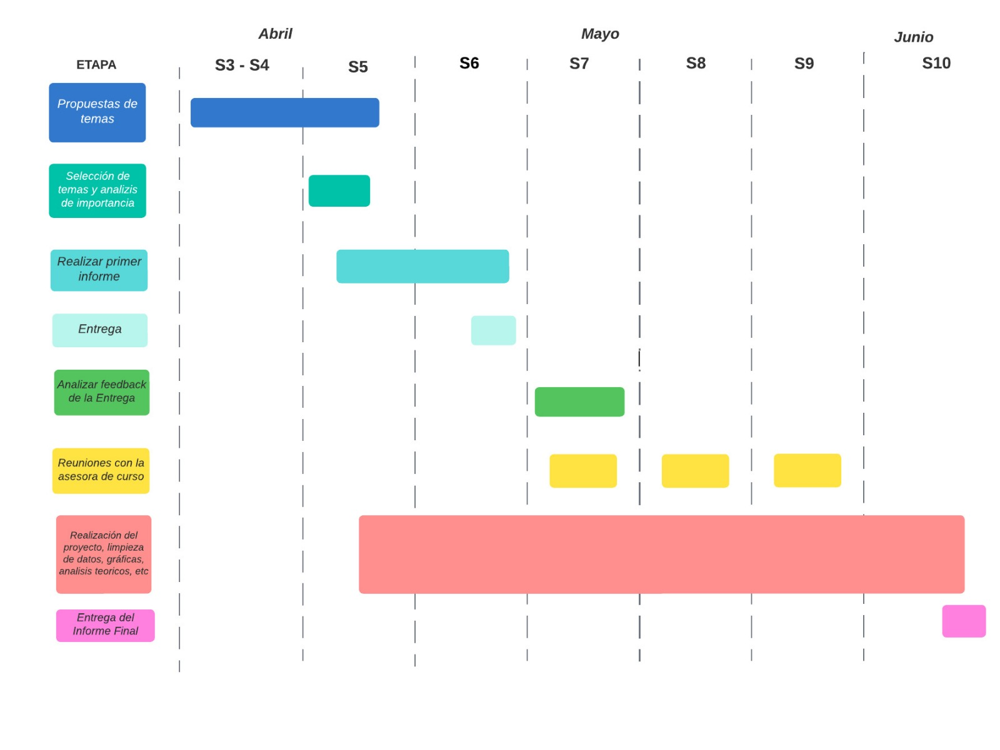

# **1. Introducción** 
En el mundo de los videojuegos, la calidad y el éxito de un juego tienen un impacto significativo en su recepción por parte de los jugadores y en el rendimiento financiero de las empresas desarrolladoras. Por lo tanto, comprender los factores que influyen en la calificación y el rendimiento de los juegos se vuelve fundamental. En este proyecto de investigación, nos centraremos en analizar la distribución de las calificaciones de los juegos en Metacritic, una reconocida plataforma de revisión y puntuación de videojuegos.

## 1.1 Relevancia
Este proyecto se enfoca en realizar un análisis estadístico exhaustivo de la relación existente entre las calificaciones de Metacritic y el éxito comercial de los juegos, con el objetivo de explorar las variables clave en la industria de los videojuegos. Mediante un enfoque riguroso y basado en datos, se buscará comprender cómo las calificaciones de los juegos en Metacritic influyen en su desempeño en términos de popularidad.

## 1.2 Planificación
### 1.2.1 Diagrama de Gantt


## 1.2 Objetivos
Los objetivos de esta investigación tienen como finalidad principal presentar de forma clara y precisa los propósitos del tema de estudio, así como llevar a cabo un análisis detallado del proceso de investigación basado en los parámetros seleccionados. Estos objetivos buscan establecer las metas específicas que se pretenden alcanzar durante el proceso de investigación y guiar de manera sistemática el análisis de estudio.

  * Analizar la distribución de las calificaciones de los juegos en Metacritic y determinar si hay algún sesgo o patrón en las calificaciones.
  
  * Identificar los juegos que tienen las calificaciones más altas y bajas en Metacritic y comparar sus precios.

  * Comparar el éxito de los juegos con sus calificaciones en Metacritic y recomendaciones. Y determinar si hay alguna relación
  
  * Indentificar la relación que hay entre la calidad de un juego (Metacritic) con su precio 
  
## 1.3 Contexto
Para entender completamente el análisis que se llevará es necesario saber que Metacritic es una reconocida plataforma de reseñas de videojuegos que recoge y promedias puntuaciones de críticos y usuarios para ofrecer una calificación general de cada videojuego el cual se muestra como un puntaje que puede variar del 0 a 100. También es importante entender que los videojuegos en metacritic son separados por géneros lo cual podría tener un efecto en su éxito o popularidad. Metacritic también proporciona el número de reseñas de cada videojuego, lo cual suele indicar la popularidad de estos. Al no tomar puntuaciones solo de críticos sino también del público general metracritic crea una calificación con menos sesgo que otras páginas por lo cual existe un nivel de confianza en el público, por esto es que la calificación de metacritic si puede tener una influencia en el interés de los consumidores o la percepción del éxito de un videojuego en el mercado.

# **2. Datos**
## 2.1 Proceso de recoleción de datos
Los Datos utilizados a lo largo del presente trabajo fueron obtenidos por medio del sitio web Kaggle. El cual obtuvo los datos por medio de Steam API (Interfaz de programación de aplicaciones), la cual fue desarrollada por Valve Corporation, mismos desarrolladores de la plataforma digital de distribución de videojuegos “Steam”. 
Steam API permite que los desarrolladores de software interactúen con la plataforma de Steam y puedan acceder a diferentes datos relacionados con juegos y las cuentas de los usuarios, incluyendo las calificaciones, recomendaciones y la metacrítica de todos los juegos disponibles en su plataforma.

## 2.2 Población, muestra y muestreo 


  * **Población:** Se ha trabajado con la población de la "Comunidad de Videojuegos de Steam". Esta población se refiere al conjunto completo de juegos de Steam que se encuentran disponibles en la plataforma y que forman parte de la base de datos utilizada en el estudio. La comunidad de videojuegos de Steam abarca una amplia gama de títulos, cubriendo una variedad de géneros y categorías.

  * **Muestra:** La muestra representa una selección más pequeña pero representativa de los juegos de Steam y su Metacritic. Esta muestra se ha extraído de la base de datos proporcionada por Metacritic, que contiene información sobre las puntuaciones de los juegos.

  * **Muestreo:** El muestreo aleatorio de videojuegos de Steam y sus puntuaciones en Metacritic se utilizó para realizar análisis estadísticos, como calcular medidas de tendencia central y dispersión, explorar correlaciones entre la puntuación de Metacritic y el precio de los juegos, y evaluar la distribución de las recomendaciones de los juegos. La muestra proporciona una visión representativa de la población más amplia, permitiendo obtener información y conclusiones relevantes sobre la comunidad de videojuegos de Steam en general


## 2.3 Variables
Todas aquellas características o factores que se están estudiando y que pueden variar entre los diferentes elementos o casos en nuestro análisis. Es importante identificarlas y definirlas claramente en este informe para garantizar la precisión y la interpretación adecuada de los resultados.

### 2.3.1 Variables categóricas 

| Tabla 1: Variables categóricas |
| :-|:-|:-|
| **Nombre de Variable** | **Tipo de Variable** | **Descripción** |
| Nombre | Categórica Nominal | Nombre del Juego |
| Fecha | Categórica Ordinal | Fecha del lanzamiento del juego |
| Es gratuito | Categórica Nominal | Menciona si el juego es gratuito o es de paga |
| No es un juego | Categórica Nominal | Menciona si el producto es un juego o no |
| Indie | Categórica Nominal | Menciona si el juego es del genero Indie |
| Acción | Categórica Nominal | Menciona si el juego es del género de Acción |
| Aventura | Categórica Nominal | Menciona si el juego es del género de Aventura |
| Casual | Categórica Nominal | Menciona si el juego es del género casual |
| Estrategia | Categórica Nominal | Menciona si el juego es del género de Estrategia |
| RPG | Categórica Nominal | Menciona si el juego es del género RPG (role playing game) |
| Simulación | Categórica Nominal | Menciona si el juego es del género de simulación |
| Temprano | Categórica Nominal | Menciona si el juego que tiene acceso temprano |
| Gratis | Categórica Nominal | Menciona si el juego es gratuito |
| Deportes | Categórica Nominal | Menciona si el juego es de deportes |
| Carreras | Categórica Nominal | Menciona si el juego es de carreras |
| Masivo | Categórica Nominal | Menciona si el juego es un multijugador masivo |
| :-|:-|:-|

### 2.3.2 Variables numéricas 

| Tabla 1: Variables numéricas |
| :-|:-|:-|
| **Nombre de Variable** | **Tipo de Variable** | **Descripción** |
| Metacritic | Numérica Continua | Puntuación/Calificación media basada en las críticas de varias fuente |
| Recomendaciones | Numérica Discreta | Cuantas recomendaciones tiene el juego |
| Precio | Numérica Continua | Menciona el precio inicial del producto |
| :-|:-|:-|

## 2.4 Limpieza de datos 

Realizamos la descarga de las librerias a utilizar 
```{r}
lista.paquetes <- c("readr", "dplyr", "knitr", "corrplot", "stringr", "ggplot2","tidyverse","modeest")
nuevos.paquetes <- lista.paquetes[!(lista.paquetes %in% installed.packages()[,"Package"])]
if(length(nuevos.paquetes)) install.packages(nuevos.paquetes)
```

Antes de empezar la limpieza de datos, realizamos el llamado de las librerias que vamos a utilizar
```{r}
library(readr)
library(ggplot2)
library(dplyr)
library(reshape2)
library(polycor)
```

Establecemos el directorio de trabajo
```{r}
setwd("D:/UTEC/Estadistica y probabilidades/S6 Calificación de Metacritic y el éxito comercial de los juegos")
```

Leemos la base de datos
```{r}
Totaldata = read.csv("games.csv")
```

Leemos los nombres de las variables
```{r}
names(Totaldata)
```

Cambiamos los nombres a las variables
```{r}
colnames(Totaldata)<-c("Nombre","Fecha","Metacritic","Recomendaciones","Es_gratuito","No_es_un_juego","Indie","Acción","Aventura","Casual","Estrategia","RPG","Simulación","Acceso temprano","Gratis","Deportes","Carreras","Masivo","Precio")
```

En nuestra base de datos tenemos mucho ceros (0) que perjudicarán la investigación, ya que distorcionarán el promedio, la moda, entre otros. Todos esos datos atípicos los reemplazamos por **NA** para posteriormente borrarlos y obtener una base de datos limpia. Identificamos las variables numéricas de caracter **int** y **num**

Ver tipo de variables (char o numerica) y cantidad de observaciones y variables
```{r}
str(Totaldata)
```

Remplazamos todos los ceros (0) por NA en las variables numéricas
```{r}
Totaldata$Metacritic[Totaldata$Metacritic == 0] <- NA
```

```{r}
Totaldata$Recomendaciones[Totaldata$Recomendaciones == 0] <- NA
```

```{r}
Totaldata$Precio[Totaldata$Precio == 0.00] <- NA
```

Ahora identificamos el número de valores faltantes **NA** de la base de datos para verificar si se realizó el cambio esperado.
```{r}
colSums(is.na(Totaldata))
```

Calculamos el total de datos
```{r}
Total = ncol(Totaldata) * nrow(Totaldata)
Total
```

Calculamos el total de datos faltantes 
```{r}
Datos_faltantes = sum(is.na(Totaldata))
Datos_faltantes
```

Porcentaje datos faltantes
```{r}
Porciento_faltantes = round(100*(Datos_faltantes/Total),2)
Porciento_faltantes
```

Calculamos datos no faltantes
```{r}
Porcientonofaltantes = (100 - Porciento_faltantes)
Porcientonofaltantes
```

### 2.4.1 Eliminación de datos **NA** (Not Available)

En esta sección eliminaremos los datos que son innecesarios para nuestra investigación, de tal manera que consegimos la base de datos limpia
```{r}
Totaldata <- na.omit(Totaldata)
```

Ahora verificamos si funciono la limpieza de datos. 
```{r}
colSums(is.na(Totaldata))
```

Como podemos observar, la limpieza de datos es todo un exito.
```{r}
nrow(Totaldata)
```
Pues ahora tenemos **1746** observaciones limpias.

# **3. Análisis descriptivo**

## 3.1 Descriptores numéricos

### 3.1.1 Descriptores de la variable Metacritic:
```{r}
cat('Media:',round(mean(Totaldata$Metacritic),2),'\n') #calcula el promedio de metacritic

cat('Mediana:',round(median(Totaldata$Metacritic),2),'\n') #calcula la mediana de metacritic

cat('Desviación Estándar:',round(sd(Totaldata$Metacritic),2),'\n') #calcula la desviación estándar de metacritic

cat('Rango:',round(range(Totaldata$Metacritic),2),'\n') #calcula el rango de metacritic

cat('Rango Intercuartílico:',round(IQR(Totaldata$Metacritic),2),'\n') #calcula el rango intercuartílico de metacritic

cat('Coeficiente de Variación:', round((sd(Totaldata$Metacritic)/mean(Totaldata$Metacritic))*100,2),'\n')#calcula el coeficiente de variación de metacritic

cat('Minimo:',min(Totaldata$Metacritic),'\n')

cat('Maximo:',max(Totaldata$Metacritic),'\n')

```

### 3.1.2 Descriptores de la variable Recomendaciones:

```{r}
cat('Media:',round(mean(Totaldata$Recomendaciones),2),'\n') #calcula el promedio de metacritic

cat('Mediana:',round(median(Totaldata$Recomendaciones),2),'\n') #calcula la mediana de metacritic

cat('Desviación Estándar:',round(sd(Totaldata$Recomendaciones),2),'\n') #calcula la desviación estándar de metacritic

cat('Rango:',round(range(Totaldata$Recomendaciones),2),'\n') #calcula el rango de metacritic

cat('Rango Intercuartílico:',round(IQR(Totaldata$Recomendaciones),2),'\n') #calcula el rango intercuartílico de metacritic

cat('Coeficiente de Variación:', round((sd(Totaldata$Recomendaciones)/mean(Totaldata$Recomendaciones))*100,2),'\n')#calcula el coeficiente de variación de metacritic

cat('Minimo:',min(Totaldata$Recomendaciones),'\n')

cat('Maximo:',max(Totaldata$Recomendaciones),'\n')
```

### 3.1.3 Descriptores de la variable Precio:

```{r}
cat('Media:',round(mean(Totaldata$Precio),2),'\n') #calcula el promedio de metacritic

cat('Mediana:',round(median(Totaldata$Precio),2),'\n') #calcula la mediana de metacritic

cat('Desviación Estándar:',round(sd(Totaldata$Precio),2),'\n') #calcula la desviación estándar de metacritic

cat('Rango:',round(range(Totaldata$Precio),2),'\n') #calcula el rango de metacritic

cat('Rango Intercuartílico:',round(IQR(Totaldata$Precio),2),'\n') #calcula el rango intercuartílico de metacritic

cat('Coeficiente de Variación:', round((sd(Totaldata$Precio)/mean(Totaldata$Precio))*100,2),'\n')#calcula el coeficiente de variación de metacritic

cat('Minimo:',min(Totaldata$Precio),'\n')

cat('Maximo:',max(Totaldata$Precio),'\n')

```

## 3.2 Descriptores gráficos

### 3.2.1 Descriptor gráfico de la variable Metacritic:
```{r}
tabla_metacritic=table(Totaldata$Metacritic)
barplot(tabla_metacritic,col = 'pink', main = "Distribución de la variable Metacritic", xlab = "Metacritic", ylab = "Frecuencia")
```

En el anterior gráfico de barras se evidencian barras de mayor tamaño entre 70 y 85 de la variable continua "Metacritic" aproximadamente, esto indica que hay una concentración de valores en ese rango en tus datos. Las barras más altas representan una mayor frecuencia de ocurrencia de esos valores de Metacritic en tus datos. Con una distribución sesgada a la izquierda.
Podemos interpretar el comportamiento de los usarios a la hora de evaluar los videojuegos bastante favorable, puesto que la mayoría de los picos se situa en una Metacrítica alta.

### 3.2.2 Descriptor gráfico de la variable Precio:
```{r}
tabla_precios=table(Totaldata$Precio)
barplot(tabla_precios,col = 'skyblue', main = "Distribución de la variable precio", xlab = "Precio", ylab = "Frecuencia")
```

En esta gráfica se muestra la distribución del precio de cada videojuego respecto a la frecuencia. Los juegos que hemos considerado rondan entre los 0.99 dolares hasta los 99.99 dolares. Podemos observar picos con cambios bruscos de la frecuencia en cada precio debido a que estos no mantienen una relación líneal. Interpretamos que la moda de precio es la de 10.99 dólares, y que más de la mitad de precios de los videojuegos se reparten entre 4.99, 10.99, 15 y 18.99. Siendo así las tendencias marcadas de la variable continua precio.

### 3.2.3 Mapa de calor de las variables Metacritic, Recomendaciones y Precio
```{r}
# Calcular la matriz de correlación
cor_matrix <- cor(Totaldata[, c("Metacritic", "Recomendaciones", "Precio")])

# Convertir la matriz en formato de datos largos
cor_matrix_long <- reshape2::melt(cor_matrix)

# Crear el mapa de calor
ggplot(cor_matrix_long, aes(x = Var1, y = Var2, fill = value)) +
  geom_tile() +
  scale_fill_gradient(low = "white", high = "red") +
  xlab("Variables") +
  ylab("Variables") +
  ggtitle("Mapa de calor de la matriz de correlación") +
  theme_minimal() +
  theme(axis.text.x = element_text(angle = 45, hjust = 1))
```

El gráfico de calor nos ayuda a identificar patrones y relaciones entre las variables estudiadas. Por ejemplo, en la         parte central las celdas trasnversales de colores más oscuros en el gráfico, indican una correlación positiva fuerte         entre esas variables. Siendo estas Metacritic-Metacritic, Recomendaciones-Recomendaciones y Precio-Precio. Por el            contrario, las celdas de colores más claros indican una correlación débil y las celdas de color blanco indican una           correlación nula. Siendo las mas claras Recomendaciones-Precio.

### 3.2.4 Diagrama de dispersión Metacritic y Precio 
```{r}
coef_punto_biserial <- polyserial(Totaldata$Metacritic, as.numeric(Totaldata$Precio))
print(coef_punto_biserial)
ggplot(Totaldata, aes(Metacritic, Precio)) + geom_point() + geom_smooth(method = "lm", colour = "red")
```

En esta gráfica se muestra la comparación entre Precio y la Metacrítica del videojuego respectivo. Para analizar de mejor manera su comportamiento hemos analizado el coeficiente de correlación de Pearson. Este para determinar la relación cuantitativa entre el precio y la Metacrítica. Una correlación positiva indica que a medida que aumenta el precio, también tiende a aumentar la puntuación de Metacrítica, mientras que una correlación negativa indica una relación inversa. En este caso tiende a ser inversa, puesto que la mayor concentración de casos se da en precios bajos, y alta metacrítica. Un modelo usual en los mercados, los clientes buscaran mejor calidad a menor precio.

# **4. Gráficos para responder a los objetivos**
## 4.1 Gráfico de distribución de Metacritic con abline (media, mediana, moda)

Responde al objetivo 1: Analizar la distribución de las calificaciones de los juegos en Metacritic y determinar si hay algún sesgo o patrón en las calificaciones.

Para el análisis de la distribución de las calificaciones de los juegos en Metacritic y determinar si hay algún sesgo o patrón, se utilizó el siguiente código para generar un gráfico que representa dicha distribución:


```{r}
# Calcular la media, mediana y moda de las calificaciones
media <- mean(Totaldata$Metacritic)
mediana <- median(Totaldata$Metacritic)
moda <- as.numeric(names(table(Totaldata$Metacritic))[table(Totaldata$Metacritic) == max(table(Totaldata$Metacritic))])

# Crear el gráfico de la distribución de calificaciones y agregar las líneas verticales
ggplot(Totaldata, aes(x = Metacritic)) +
  geom_histogram(binwidth = 1, fill = "steelblue", color = "black") +
  labs(x = "Calificación de Metacritic", y = "Frecuencia",
       title = "Distribución de Calificaciones en Metacritic") +
  geom_vline(aes(xintercept = media, color = "Media"), linetype = "dashed", size = 1) +
  geom_vline(aes(xintercept = mediana, color = "Mediana"), linetype = "dashed", size = 1) +
  geom_vline(aes(xintercept = moda, color = "Moda"), linetype = "dashed", size = 1) +
  scale_color_manual(values = c("red", "yellow", "green"),
                     labels = c("Media", "Mediana", "Moda")) +
  guides(color = guide_legend(title = "Líneas")) 

```

El gráfico generado muestra la distribución de las calificaciones de Metacritic, representada mediante un histograma con barras de ancho 1. Además, se agregaron líneas verticales para indicar la posición de la media (en color rojo), mediana (en color amarillo) y moda (en color verde).

Al analizar el gráfico, se observa que la media (representada por la línea roja) está a la izquierda de la mediana (línea amarilla). Esto sugiere que hay valores más bajos o extremos en el extremo izquierdo de la distribución. Además, la cola de la distribución parece ser más larga en el lado izquierdo.

Este patrón en la distribución podría indicar la presencia de juegos con calificaciones más bajas o menos populares que arrastran la media hacia abajo, mientras que la mediana se mantiene en un nivel relativamente más alto. Esta diferencia entre la media y la mediana podría ser un indicio de un posible sesgo en las calificaciones.


## 4.2 Gráfico de barras de la variable Juego, Metacritic y Precio 

Para cumplir con el objetivo 2 de identificar los juegos con las calificaciones más altas y bajas en Metacritic y comparar sus precios, se utilizó el siguiente código para generar los gráficos correspondientes:

**Juegos con las calificaciones más altas en Metacritic:**

```{r}
# Ordenar el dataframe por la variable "Metacritic" en orden descendente
Totaldata_ordenado <- Totaldata %>% arrange(desc(Metacritic))

# Seleccionar los primeros 20 juegos con las puntuaciones más altas de Metacritic
datos_seleccionados <- Totaldata_ordenado %>% top_n(20, Metacritic)

# Crear el gráfico de barras
ggplot(datos_seleccionados, aes(x = Nombre, y = Metacritic, fill = Precio)) +
  geom_bar(position = "dodge", stat = "identity") +
  coord_flip() +
  theme_minimal()

```

En el gráfico generado, se muestran los 20 juegos con las calificaciones más altas de Metacritic. Cada barra representa un juego, y la altura de la barra indica la calificación en Metacritic. Además, el color de cada barra indica el precio del juego.

**Juegos con las calificaciones más bajas en Metacritic:**

```{r}
# Ordenar el dataframe por la variable "Metacritic" en orden ascendente
Totaldata_ordenado <- Totaldata %>% arrange(Metacritic)

# Seleccionar los primeros 20 juegos con las puntuaciones más bajas de Metacritic
datos_seleccionados <- Totaldata_ordenado %>% top_n(20, -Metacritic)

# Crear el gráfico de barras
ggplot(datos_seleccionados, aes(x = Nombre, y = Metacritic, fill = Precio)) +
  geom_bar(position = "dodge", stat = "identity") +
  coord_flip() +
  theme_minimal()

```

En el gráfico generado, se presentan los 20 juegos con las calificaciones más bajas de Metacritic. Al igual que en el gráfico anterior, cada barra representa un juego, la altura de la barra indica la calificación en Metacritic y el color de la barra indica el precio del juego.

Al analizar los juegos con las calificaciones más altas en Metacritic, se puede observar que existen juegos tanto con precios altos como bajos. Esto sugiere que el precio no está necesariamente vinculado a la calificación en Metacritic. Algunos juegos con calificaciones altas pueden tener precios más altos debido a su popularidad, características especiales o ediciones especiales, mientras que otros pueden tener precios más bajos debido a promociones, ventas o ser títulos más antiguos.

De manera similar, al examinar los juegos con las calificaciones más bajas en Metacritic, se puede apreciar que hay juegos con precios tanto altos como bajos. Esto demuestra nuevamente que la calificación en Metacritic no es un indicador determinante del precio de un juego.

## 4.3 Diagrama de dispersión metacritic, Recomendaciones y Precio

Para cumplir con el objetivo 3 de comparar el éxito de los juegos con sus calificaciones en Metacritic y recomendaciones, y determinar si hay alguna relación, se utilizó el siguiente código para generar un gráfico de dispersión con líneas de tendencia:

```{r}
ggplot(Totaldata, aes(Metacritic, Recomendaciones, colour = Precio)) + geom_point() + geom_smooth(method = "lm", colour = "red")
```

El gráfico de dispersión con línea de tendencia muestra una mayor acumulación de datos en dirección creciente hacía ambos ejes positivos. Indicando así una tendencia positiva en la relación entre las variables representadas en el eje x (Metacritic) y el eje y (Recomendaciones). Esto significa que a medida que aumenta el valor de Metacritic, generalmente se observa un aumento en las Recomendaciones.

En términos más generales, cuando los puntos se agrupan hacia la derecha y hacia arriba, sugiere una asociación positiva entre las dos variables. Esto indica que hay una tendencia a medida que una variable aumenta, la otra también tiende a aumentar.

Sin embargo, también se destaca la presencia de un punto atípico que se encuentra alejado del grupo principal de puntos en el gráfico. Este punto atípico representa un juego con un número excepcionalmente alto de recomendaciones (1427633 recomendaciones) y una buena puntuación en Metacritic. La presencia de este punto atípico puede influir significativamente en la línea de tendencia y en la interpretación de la relación entre las variables. 

## 4.4 Gráfico de barras Nombre, Metacritic y precio

Para cumplir con el objetivo 4 de identificar la relación entre la calidad de un juego y su precio, se utilizó el siguiente código para generar un gráfico de barras:

```{r}
# Seleccionar solo las primeras 20 filas de datos
datos_seleccionados <- Totaldata %>% sample_n(.,20)

# Crear el gráfico de barras
ggplot(datos_seleccionados, aes(x = Nombre, y = Metacritic, fill = Precio)) +
  geom_bar(position = "dodge", stat = "identity") +
  coord_flip() +
  theme_minimal()
```

El gráfico de barras muestra la relación entre la calidad de un juego, representada por las calificaciones de Metacritic (eje y), y su precio (representado por el color de las barras).

Al seleccionar aleatoriamente las primeras 20 filas de datos, se muestra una muestra de juegos para visualizar su calidad y precio. Las barras en el gráfico representan los juegos seleccionados, donde la altura de cada barra indica la calidad del juego (mayor calificación de Metacritic corresponde a mayor calidad) y el color de cada barra representa el precio del juego.

A partir de los datos analizados, se puede concluir que no hay una relación directa entre la calidad de un juego, medida por su puntuación en Metacritic, y su precio. Se observa que juegos con puntuaciones altas en Metacritic pueden tener precios tanto altos como bajos, lo que indica que otros factores influyen en la determinación del precio de un juego más allá de su calidad percibida.

Esto sugiere que la fijación de precios de los juegos puede depender de múltiples variables, como la demanda del mercado, los costos de producción, la popularidad de la franquicia, la exclusividad de la plataforma y otras consideraciones comerciales. La calidad de un juego, aunque importante, no es el único factor determinante en su precio. 

# **5. Otros gráficos que ayudan al análisis.**

## 5.1 Gráfico de barras apiladas de Metacritic y todos los tipos de juego 
```{r}
# Reorganizar el dataframe en formato de datos largos (long format)
Totaldata_tipos_juegos <- tidyr::pivot_longer(Totaldata, cols = c(Indie, Acción, Aventura, Casual, Estrategia, RPG, Simulación))

# Crear el gráfico de barras apiladas
ggplot(Totaldata_tipos_juegos, aes(x = Metacritic, fill = name)) +
  geom_bar() +
  xlab("Metacritic") +
  ylab("Cantidad de observaciones") +
  ggtitle("Relación entre Metacritic y otras variables") +
  theme_minimal()

```

En el gráfico de barras apiladas, la altura de cada barra representa la frecuencia o el recuento de los valores de "Metacritic". Cada barra se divide en segmentos de colores diferentes, correspondientes a las variables adicionales (Indie, Acción, Aventura, Casual, Estrategia, RPG, Simulación). El recuento en el eje "y" indica cuántas observaciones tienen cada valor específico de "Metacritic".

Por lo tanto, el gráfico de barras apiladas muestra cómo se distribuyen las observaciones en diferentes categorías de "Metacritic" y cómo se relaciona cada categoría con las variables adicionales.

## 5.2 Gráfico de líneas múltiples de Metacritic y Precio
```{r}
# Crear el gráfico de líneas múltiples utilizando ggplot2
ggplot(Totaldata, aes(x = 1:length(Metacritic))) +
  geom_line(aes(y = Metacritic, color = "Metacritic")) +
  geom_line(aes(y = Precio, color = "Precio")) +
  labs(x = "Observación", y = "Valor", title = "Comparación de Variables") +
  scale_color_manual(values = c("Metacritic" = "blue", "Precio" = "green"))
```

En el gráfico proporcionado, las líneas múltiples representan la evolución de las variables "Metacritic" y "Precio" a lo largo de las observaciones, lo cual puede ser útil para analizar las tendencias y los cambios en estas variables a medida que aumenta el número de observaciones.

El gráfico de líneas muestra la tendencia o cambio de estas dos variables a lo largo de las observaciones. En el eje x, se representa el número de observación, mientras que en el eje y se muestra el valor de cada variable.

La línea de color azul representa la variable "Metacritic" y la línea de color verde representa la variable "Precio". Cada línea conecta los puntos correspondientes a los valores de las variables en cada observación.

## 5.3 Gráfico de barras apiladas de Precio y todos los tipos de juego 
```{r}
# Reorganizar el dataframe en formato de datos largos (long format)
Totaldata_tipos_juegos <- tidyr::pivot_longer(Totaldata, cols = c(Indie, Acción, Aventura, Casual, Estrategia, RPG, Simulación))

# Crear el gráfico de cajas y bigotes
ggplot(Totaldata_tipos_juegos, aes(x = name, y = Precio, fill = name)) +
  geom_boxplot() +
  xlab("Variables") +
  ylab("Precio") +
  ggtitle("Relación entre Precio y otras variables") +
  theme_minimal()
```

En el caso del gráfico de cajas y bigotes se está representando la variable "Precio" en función de las variables adicionales (Indie, Acción, Aventura, Casual, Estrategia, RPG, Simulación). 

  * Caja: La caja en el gráfico de cajas y bigotes representa el rango intercuartil (IQR) de la variable "Precio" para cada    variable adicional. La línea que divide la caja en dos partes representa la mediana (valor central) de la distribución.

  * Bigotes: Los bigotes en el gráfico de cajas y bigotes representan la variabilidad de los datos. Los extremos de los        bigotes están determinados por los valores mínimo y máximo dentro de un rango determinado, que suele ser un múltiplo del     IQR. Los valores que se encuentran más allá de los bigotes se consideran valores atípicos y se representan como puntos o     asteriscos.

  * Valores atípicos: Los valores atípicos en el gráfico de cajas y bigotes son aquellos que se encuentran más allá de los     bigotes. Estos valores pueden ser indicativos de observaciones inusuales o anómalas en relación con el resto de los datos.
  
En resumen, el gráfico de cajas y bigotes permite visualizar la distribución de los valores de "Precio" para cada variable adicional mediante la caja y los bigotes, y también identificar valores atípicos que se encuentren fuera de los bigotes.

# **6. Conclusiones**

A lo largo de este trabajo hemos analizado e interpretado datos recopilados de diferentes videojuegos, analizando de forma clara y precisa la relación entre las calificaciones de Metacritic y el éxito que diferentes juegos tuvieron desde su lanzamiento.

Tras el análisis de los datos y la interpretación de los resultados obtenidos, pudimos responder a los objetivos propuestos al inicio del presente trabajo. Donde se pudo presenciar que no existe un patrón entre la distribución de las calificaciones de los juegos en metacritic. Al igual que esto se pudo presenciar que no existe una relación entre los puntajes en metacritic y los precios de los juegos ya que dentro del conjunto de puntaje alto de metacrítica se encuentran juegos de costos variados, desde gratuitos, hasta 60 o más dólares.

También se pudo analizar que los juegos que tienen más puntuación de metacrítica tienen un mayor número de recomendaciones. Donde pudimos determinar que efectivamente la cantidad de puntaje de metacrítica afecta la cantidad de recomendaciones que un juego tiene y a causa de estas recomendaciones los juegos presentan un mayor éxito.


