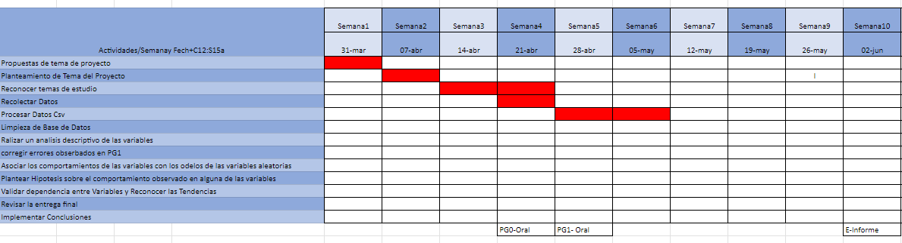

## Introducción
El presente estudio se centra en el análisis estadístico del perfil de los bomberos en Lima Centro, con el objetivo de comprender y evaluar diversos aspectos relacionados con su capacidad de respuesta, recursos disponibles y condiciones laborales. Lima Centro, como una de las zonas urbanas más densamente pobladas de Perú, enfrenta desafíos específicos en materia de seguridad y emergencias.

Este estudio abordará diferentes aspectos, como la formación académica y experiencia de los bomberos, su distribución demográfica, el equipamiento y recursos disponibles, así como las condiciones laborales y satisfacción en el ejercicio de su profesión. A través de un enfoque estadístico riguroso, se recopilarán y analizarán datos relevantes que permitirán tomar decisiones informadas para el mejoramiento de la gestión y operatividad del cuerpo de bomberos en Lima Centro.

### Relevancia

Realizar un proyecto de análisis estadístico sobre el perfil de los bomberos, y su relación con el rendimiento físico y seguridad laboral es relevante debido a varias razones fundamentadas. En primer lugar, los bomberos desempeñan un papel crucial en la protección de vidas y propiedades durante emergencias, lo que destaca la importancia de comprender su preparación y recursos. Además, el análisis estadístico proporciona información valiosa sobre la formación, experiencia y habilidades de los bomberos, lo que mejora la gestión de recursos humanos y financieros. Asimismo, evaluar las necesidades y brechas existentes en el cuerpo de bomberos permite identificar áreas que requieren mejoras, orientando la asignación de recursos y la implementación de políticas. Por otra parte, el proyecto facilita la planificación estratégica a largo plazo al identificar tendencias y necesidades emergentes en el campo de los bomberos. Por último, este análisis contribuye a la investigación y desarrollo en la seguridad y prevención de incendios, fomentando el conocimiento científico y mejorando las políticas públicas. En resumen, el proyecto de análisis estadístico del perfil de los bomberos en Lima Centro es relevante para mejorar la gestión de recursos, evaluar necesidades, planificar estratégicamente y contribuir al desarrollo de conocimientos en el ámbito de la seguridad y prevención de incendios en Perú.

### Contexto

En Perú, la diversidad geográfica y cultural plantea diferentes riesgos y necesidades de protección contra incendios. Lima, la capital y centro urbano más poblado del país, concentra infraestructuras críticas y una densidad de población significativa. Es fundamental contar con un cuerpo de bomberos capacitado y equipado en Lima Centro para responder eficazmente a situaciones de emergencia.
Además, Perú es propenso a desastres naturales, lo que requiere preparación por parte de los bomberos para coordinar operaciones de búsqueda y rescate. El análisis del perfil de los bomberos en Lima Centro permitirá evaluar su capacidad de respuesta y tomar medidas preventivas.
Es importante considerar la infraestructura, recursos y limitaciones específicas del cuerpo de bomberos en Lima Centro, así como el contexto socioeconómico que puede influir en su disponibilidad y condiciones laborales.

En resumen, el análisis estadístico del perfil de los bomberos en Lima Centro es crucial para abordar los riesgos geográficos y socioeconómicos del país, garantizar una respuesta eficiente a emergencias y mejorar las condiciones laborales de los bomberos para proteger a la población.

### Objetivos

**Objetivo general**

Analizar el perfil promedio de los bomberos en Lima Centro basado en su experiencia, edad, ubicación de centro laboral para medir su preparación y rendimiento, mediante encuestas y gráficos estadísticos.


**Objetivo secundarios**

-   Relacionar variables categóricas, como el rango, compañía a la que pertenece y la sensación de preparación, con variables numéricas relacionadas, como el tiempo dedicado a ser bombero, rendimiento físico y edad. Esto se realiza con el fin de identificar posibles patrones o tendencias.

-   Evaluar la efectividad de políticas, las medidas de formación en seguridad y capacitación de prevención de riesgos, en función a la percepción de preparación del bombero mediante variables cualitativas (sensaciones y cantidad de lesiones) y discretas (años de experiencia y de voluntariado).

-   Proponer recomendaciones de seguridad y preparación en base a los resultados estadísticos que se obtendrán en el análisis de la data recolectada. Con esto se busca que el bombero sufra la menor cantidad posible de lesiones al atender una emergencia.


### Planificación

Creamos una planificación utilizando Google Sheets para poder determinar las fechas de realización de cada actividad necesarias para completar el proyecto planteado.

{height="height," width="width"}

<center>

*Link:* <https://docs.google.com/spreadsheets/d/1679hNM2sF5uZY0z_5HE5W1QwkCdTB0Hw0aFT_CP8iLU/edit?usp=sharing>

**Instrumento de recolección**

Utilizamos como instrumento de recolección una encuesta virtual el cual puede difundirse de manera rápida y eficiente. Nuestra muestra poblacional son los bomberos en Lima Centro. Para ello, difundimos en compañías de bomberos que pertenezcan en este sector geográfico y apoyaron para recaudar suficientes respuestas.

```{r include=FALSE}
# LIBRARIES
library(readr)
library(dplyr)
if(!require(wordcloud)){install.packages('wordcloud')}
if(!require(tm)){install.packages('tm')}
library("wordcloud")
library("tm")
if(!require(ggplot2)){install.packages('ggplot2')}
library('ggplot2')
```

```{r echo=FALSE}
DB_Firefighters<-read_csv("DATA-BOMBEROS.csv", show_col_types = FALSE)

DB_Firefighters=DB_Firefighters[,-c(1)]

names (DB_Firefighters)<- c("Correo Electronico","Genero","Rango","Compañia","Distrito","Edad","Años de trabajo","Horas voluntarias","Lesiones sufridas","MEDIA FISICA 1-5","Minutos corriendo sin pausa","Planchas-1 min","Donde realiza su entrenamiento","Formacion Brindada","Lugar de mayor riesgo","Emergencia que no se siente preparado")
```

## Datos

### Recolección de datos

Para la recolección de datos se envió un formulario a las distintas compañías de bomberos de Lima Centro.

### Población, muestra y muestreo

-   **Población:** Comunidad de Bomberos de Lima

-   **Muestra:** Bomberos activos de Lima Centro

-   **Unidad muestral:** Bomberos

-   **Tamaño de la muestra:** 182 Bomberos

-   **Representatividad de la muestra:** 167 BOMBEROS

-   **Tipo de muestreo:** Bola de nieve

### Variables

| Variable | Descripción | Tipo | Restricción |
| :--- |  :---: |  :---: |  :---: |
| Género | Género con el que se identifica | <span style="color:red">Categórica</span> nominal | No hay |
| Compañía | Compañía a la que pertenece el bombero | <span style="color:red">Categórica</span> nominal | Compañías $\in$ {Lima-Centro} |
| Lugar_ entrenamiento | Lugar donde realiza entrenamiento físico | <span style="color:red">Categórica</span> nominal | Lugar $\in$ {compañía, en casa, gimnasio, compañía y casa, ninguno} |
| Distrito | Lugares donde trabajan los bomberos encuestados | <span style="color:red">Categórica</span> nominal | Distritos en Lima-Centro |
| Emergencia_no_preparado | Emergencias en el que el bombero no se siente completamente preparado para atender | <span style="color:red">Categórica</span> nominal | Emergencia_no_preparado $\in$ {Fuga de gas, Incendio de estructuras elevadas, Incendio en sótanos, Accidente automovilístico, Emergencia médica, Rescate con lote de cuerdas, Ninguna alternativa. 100% prepadado, Ninguno, Si me siento preparado} |
| Rango | Rango del bombero | <span style="color:red">Categórica</span> ordinal | Rango $\in$ {Capitan, Teniente, Teniente brigadier, Subteniente, Seccionario, Brigadier} |
| Cantidad_lesiones | Cantidad de lesiones que ha sufrido el bombero en los últimos 12 meses | <span style="color:red">Categórica</span> ordinal | Cantidad_lesiones $\in$ {0,1,2,3}
| Sensación_preparación | Cuán preparado físicamente se siente el bombero | <span style="color:red">Categórica</span> ordinal | Sensación_preparación $\in$ {1,2,3,4,5} |
| Seguridad_prevención | Medida en la que el bombero considera su preparación en seguridad y prevención | <span style="color:red">Categórica</span> ordinal | Seguridad_prevención $\in$ {1,2,3,4,5} |
| Riesgo_emergencia | Sensación de riesgo ante una emergencia | <span style="color:red">Categórica</span> ordinal | Riesgo_emergencia $\in$ {Fuga de gas, Incendio de estructuras elevadas, Incendio en sótanos, Accidente automovilístico, Emergencia médica, Rescate con lote de cuerdas, Rescate en estructuras colapsadas, Emergencias hazmat o rescate en espacios confinados, Todas las anteriores, -} |
| Edad | Edad del bombero | <span style="color:blue">Numérica</span> discreta | No hay |
| Años_bombero | Años trabajando como bombero | <span style="color:blue">Numérica</span> discreta | No hay |
| Horas_trimestre | Horas de voluntariado por trimestre | <span style="color:blue">Numérica</span> discreta | No hay |
| Minutos_corriendo | Tiempo en el que puede correr sin detenerse | <span style="color:blue">Numérica</span> discreta | No hay |
| Cantidad_planchas | Cantidad de planchas que puede realizar en 1 minuto | <span style="color:blue">Numérica</span> discreta | No hay |

### Limpieza de base de datos

```{r}

DB_Firefighters$`Lesiones sufridas`[DB_Firefighters$`Lesiones sufridas` == "3 o más"]<- 3
DB_Firefighters[DB_Firefighters == "-"]<- NA
DB_Firefighters$Compañia<-as.numeric(DB_Firefighters$Compañia)
DB_Firefighters$Edad<-as.numeric(DB_Firefighters$Edad)
DB_Firefighters$`Años de trabajo`<-as.numeric(DB_Firefighters$`Años de trabajo`)
DB_Firefighters$`Horas voluntarias`<-as.numeric(DB_Firefighters$`Horas voluntarias`)
DB_Firefighters$`Lesiones sufridas`<-as.numeric(DB_Firefighters$`Lesiones sufridas`)
DB_Firefighters$`MEDIA FISICA 1-5`<-as.numeric(DB_Firefighters$`MEDIA FISICA 1-5`)
DB_Firefighters$`Formacion Brindada`<-as.numeric(DB_Firefighters$`Formacion Brindada`)
DB_Firefighters$`Minutos corriendo sin pausa`<-as.numeric(DB_Firefighters$`Minutos corriendo sin pausa`)
DB_Firefighters$Edad[DB_Firefighters$Edad>99]<- NA
DB_Firefighters$`Planchas-1 min`<-as.numeric(DB_Firefighters$`Planchas-1 min`)
DB_Firefighters<-na.omit(DB_Firefighters)
DB_Firefighters$Distrito[DB_Firefighters$Distrito == "SAN JUAN DE LURIGANCHO"]<-"SAN JL"
DB_Firefighters$Distrito[DB_Firefighters$Distrito == "CERCADO DE LIMA"]<-"CENTRO L"
DB_Firefighters$Distrito[DB_Firefighters$Distrito == "JESUS MARIA"]<-"JESUS M"
DB_Firefighters$Distrito[DB_Firefighters$Distrito == "LA VICTORIA"]<-"VICTORIA"
DB_Firefighters$Distrito[DB_Firefighters$Distrito == "SANTA ANITA"]<-"SANTA A"
DB_Firefighters$Distrito[DB_Firefighters$Distrito == "EL AGUSTINO"]<-"AGUSTINO"
DB_Firefighters$`Emergencia que no se siente preparado`[DB_Firefighters$`Emergencia que no se siente preparado` != "Ninguno. Me siento 100% preparado en todo"]<-"No Preparado"
DB_Firefighters$`Emergencia que no se siente preparado`[DB_Firefighters$`Emergencia que no se siente preparado` == "Ninguno. Me siento 100% preparado en todo"]<-"Preparado"
DB_Firefighters$`Lugar de mayor riesgo`[DB_Firefighters$`Lugar de mayor riesgo` == "Rescate en estructuras colapsadas"]<-"RESCATES"
DB_Firefighters$`Lugar de mayor riesgo`[DB_Firefighters$`Lugar de mayor riesgo` == "Emergencia médica"]<-"EMERGENCIAS"
DB_Firefighters$`Lugar de mayor riesgo`[DB_Firefighters$`Lugar de mayor riesgo` == "Emergencias hazmat, rescate en espacios confinados"]<-"EMERGENCIAS"
DB_Firefighters$`Lugar de mayor riesgo`[DB_Firefighters$`Lugar de mayor riesgo` == "Incendio en estructuras elevadas"]<-"INCENDIO"
DB_Firefighters$`Lugar de mayor riesgo`[DB_Firefighters$`Lugar de mayor riesgo` == "Incendio en sotanos"]<-"INCENDIO"
DB_Firefighters$`Lugar de mayor riesgo`[DB_Firefighters$`Lugar de mayor riesgo` == "Rescate con lote de cuerdas"]<-"RESCATES"
DB_Firefighters$`Lugar de mayor riesgo`[DB_Firefighters$`Lugar de mayor riesgo` == "Fuga de Gas"]<-"EMANACIONES"
DB_Firefighters$`Lugar de mayor riesgo`[DB_Firefighters$`Lugar de mayor riesgo` == "En realidad en todas las presentadas"]<-"TODAS"
```

## Análisis descriptivo

### Descriptores numéricos y gráficos de la variables del estudio

```{r echo=FALSE}
# VALORES Y TABLAS

edad <- DB_Firefighters$Edad
genero <- DB_Firefighters$Genero 
Compañia=DB_Firefighters$Compañia 
distrito <- DB_Firefighters$Distrito
mayor_riesgo <- DB_Firefighters$`Lugar de mayor riesgo`
horas <- DB_Firefighters$`Horas voluntarias`
rango <- DB_Firefighters$Rango
preparado <- DB_Firefighters$`MEDIA FISICA 1-5` # Variable categórica ordinal
minutos_corriendo <- DB_Firefighters$`Minutos corriendo sin pausa`
planchas_minuto <- DB_Firefighters$`Planchas-1 min`
lugar_ejercita <- DB_Firefighters$`Donde realiza su entrenamiento`
emergencias_no_preparado <- DB_Firefighters$`Emergencia que no se siente preparado`
formacion <- DB_Firefighters$`Formacion Brindada`

table_Distrito <- table(distrito)

```

**Observaciones de la muestra poblacional**

### 1) Muestra poblacional entre hombre y mujeres

**Descriptor Gráfico**

```{r echo=FALSE, warning=FALSE}
ggplot(DB_Firefighters, aes(x = Distrito, y = ..count.., fill = Genero)) +
  geom_bar(after_stat = "count", position = "dodge") +
  labs(title = "Número de personas por distrito y género",
       x = "Distrito",
       y = "Cantidad de personas",
       fill = "Género") +
  scale_fill_manual(values = c("#ADD8E6", "#FFB6C1"),
                    labels = c("Masculino", "Femenino")) +
  coord_flip() +
  theme_minimal()
```

-   **Interpretación:** En este gráfico, se observa una predominancia del género masculino en la muestra de la población encuestada. Además, se puede apreciar que el distrito de San Juan de Lurigancho tiene la mayor representación en términos de participantes, lo que indica que fue el distrito con mayor presencia en la muestra. Por otro lado, el distrito de Ate tuvo la menor participación en la muestra, aunque se observa una distribución equitativa de género en este distrito. Además, los distritos de Jesús María, Chosica y el Centro de Lima también presentaron una proporción significativa de participantes en nuestra muestra, lo que indica que fueron focos importantes dentro de nuestra investigación.

### 2) Descriptores en edades

**Primer gráfico o histograma de edades**

```{r, echo=FALSE, warning=FALSE}
ggplot(DB_Firefighters, aes(x = Edad)) +
  geom_histogram(binwidth = 5, fill = "#FF7800", color = "black") +
  labs(title = "Cantidad de Personas por Edades",
       x = "Edad",
       y = "Cantidad de Personas") +
  theme_minimal()
```

-   **Interpretación:** El gráfico de barras proporciona información sobre las edades de la muestra de bomberos voluntarios. Se observa que la edad mínima registrada fue de 15 años y la edad máxima registrada fue de 65 años. La distribución de edades muestra que las edades más comunes se encuentran en el rango de 23 a 32 años, lo que sugiere una mayor presencia de personas en ese grupo de edad en la muestra. Esto podría estar relacionado con el perfil típico de los bomberos voluntarios, ya que es posible que muchos se unan a esta labor en esa etapa de sus vidas.

    También se observa una importante respuesta por parte de personas con edades entre 33 y 42 años, lo cual podría indicar una acumulación de experiencia y tiempo en el servicio como bomberos voluntarios. Es probable que muchos de ellos hayan iniciado su servicio en un rango de edad similar y continúen involucrados en esa labor.

    En contraste, las personas de 55 años en adelante tienen una representación limitada en la muestra. Esto puede deberse a una menor participación en el voluntariado de bomberos en edades más avanzadas o a una menor disposición a participar en la encuesta por parte de este grupo de edad.

```{r, echo=FALSE}
mean_edad <- round(mean(DB_Firefighters$Edad, na.rm = TRUE),2)
print(paste("Mean:", mean_edad))
IQR_age <- round(IQR(DB_Firefighters$Edad, na.rm = TRUE),2)
print(paste("IQR:", IQR_age))
sd_edad <- round(sd(DB_Firefighters$Edad,na.rm = TRUE),2)
print(paste("Standard Deviation: ", sd_edad))
moda <- as.numeric(names(table(DB_Firefighters$Edad))[which.max(table(DB_Firefighters$Edad))])

```
*Descriptores numéricos*

 -**Media:** 31.84

 -**IQR:** 13

 -**Desviación estándar:** 9.68

 -**Moda:** 28 

```{r, echo=FALSE}
boxplot(DB_Firefighters$Edad,horizontal = T, main = "Gráfica de cajas de edades", xlab= "Edad", col = "aquamarine")
```

**Segundo gráfico de edades pero detallado por género**

```{r,echo=FALSE, warning=FALSE}
ggplot(DB_Firefighters, aes(x = Edad, fill = Genero)) +
  geom_histogram(binwidth = 5, position = "stack", alpha = 0.7, color = "black") +
  labs(title = "Cantidad de Personas por Edades y Género",
       x = "Edad",
       y = "Cantidad de Personas",
       fill = "Género") +
  scale_fill_manual(values = c("#ADD8E6", "#FFB6C1"),
                    labels = c("Masculino", "Femenino")) +
  theme_minimal()
```

-   **Interpretación:** El análisis de género y edad en el gráfico revela un contraste interesante. En promedio, las personas de género femenino tienen alrededor de 25 a 30 años, lo que indica que hay una concentración de mujeres jóvenes en el grupo de bomberas voluntarias. Sin embargo, se observa una disminución en la participación de bomberas voluntarias a partir de los 40 años, lo que implica una menor presencia de mujeres en edades más avanzadas en este voluntariado.

    Por otro lado, se destaca que el género masculino, en su mayoría, se encuentra en el rango de 25 a 30 años. Esto sugiere una concentración de hombres jóvenes en el grupo de bomberos voluntarios. Sin embargo, a diferencia del género femenino, se observa una mayor participación de hombres a partir de los 40 años. Esto indica que los hombres tienen una presencia más equilibrada.

    Además, es importante señalar que tanto la edad mínima como la edad máxima de la muestra corresponden a hombres, lo que indica que la participación de los hombres en el voluntariado de bomberos se da en diferentes momentos de sus vidas.


```{r, include=FALSE}
#Para Hombres
solo_varones<- DB_Firefighters$Edad[DB_Firefighters$Genero == "Hombre"]
mean(DB_Firefighters$Edad[DB_Firefighters$Genero == "Hombre"])
IQR(DB_Firefighters$Edad[DB_Firefighters$Genero == "Hombre"])
sd(DB_Firefighters$Edad[DB_Firefighters$Genero == "Hombre"])
moda <- as.numeric(names(table(DB_Firefighters$Edad[DB_Firefighters$Genero == "Hombre"]))[which.max(table(DB_Firefighters$Edad))])
#para Mujeres
solo_Mujeres<- DB_Firefighters$Edad[DB_Firefighters$Genero == "Mujer"]
mean(DB_Firefighters$Edad[DB_Firefighters$Genero == "Mujer"])
IQR(DB_Firefighters$Edad[DB_Firefighters$Genero == "Mujer"])
sd(DB_Firefighters$Edad[DB_Firefighters$Genero == "Mujer"])
moda <- as.numeric(names(table(DB_Firefighters$Edad[DB_Firefighters$Genero == "Mujer"]))[which.max(table(DB_Firefighters$Edad))])

```

**Descriptor numérico para Hombres**

-**Media:** 32.56

-**IQR:** 12.5

-**Desviación estándar:** 10.01

-**Moda:** 28


**Descriptor numérico para Mujeres**

-**Media:** 29.82

-**IQR:** 10

-**Desviación estándar:** 8.46

-**Moda:** 32


### 3) Número de personas por rangos

```{r,echo=FALSE, warning=FALSE}
ggplot(DB_Firefighters, aes(x = "", fill = Rango)) +
  geom_bar(position = "stack", color = "black") +
  labs(title = "Número de Personas por Nivel de Preparación y Rango",
       x = "",
       y = "Número de Personas",
       fill = "Rango") +
  scale_x_discrete(limits = "") +
  theme_minimal()
```

-   **Interpretación:** En el análisis numérico de personas por rango en nuestro foco poblacional, se puede observar que la moda, es decir, el rango más frecuente, es el de seccionario. Esto indica que la mayoría de las personas encuestadas tienen un nivel de preparación más bajo en comparación con otros rangos.

    Por otro lado, se puede notar que la cantidad de subtenientes y tenientes es equitativa, lo que sugiere una distribución similar de personas en estos rangos.

    En contraste, los rangos de brigadier y teniente brigadier presentan una menor cantidad de personas en nuestra muestra. Esto puede deberse a varios factores, como la edad de los participantes o requisitos específicos para alcanzar estos rangos más altos.

```{r,echo=FALSE, warning=FALSE, message=FALSE}
ggplot(DB_Firefighters, aes(x = Rango, y = horas, fill = Rango)) +
  geom_boxplot() +
  labs(title = "Distribución de Horas de Voluntariado por Rango",
       x = "Rango",
       y = "Horas de Voluntariado") 
  #theme_minimal()
```

-   **Interpretación:** Este análisis nos permite demostrar que a medida que se asciende en el rango de bombero, las horas de voluntariado tienden a disminuir, ya que se tienen otras responsabilidades y actividades más específicas. Sin embargo, es importante considerar los datos atípicos que pueden existir y que indican que algunas personas en rangos específicos pueden realizar un mayor número de horas de voluntariado de manera excepcional.

### 4) Número de horas voluntarias por rango y género

**Descriptor gráfico**

```{r,echo=FALSE, warning=FALSE}
ggplot(DB_Firefighters, aes(x = Rango, y = horas, fill = Genero)) +
  stat_summary(fun = "mean", geom = "bar", position = "dodge", color = "black") +
  labs(title = "Promedio de Horas Voluntarias por Rango y Género",
       x = "Rango",
       y = "Promedio de Horas Voluntarias",
       fill = "Género") +
  scale_fill_manual(values = c("#ADD8E6", "#FFB6C1"),
                    labels = c("Masculino", "Femenino")) +
  theme_minimal()
```

-   **Interpretación:** El análisis estadístico muestra que hay una mayor presencia del género masculino en los rangos más altos del cuerpo de bomberos, pero también se observa una representación significativa de mujeres en los rangos de seccionario y capitán. La distribución de género en los rangos puede estar influenciada por diversos factores sociales y organizacionales, y es importante evitar generalizaciones o estereotipos infundados al interpretar estos resultados.


**Observaciones sobre su preparación y entrenamiento respecto a otras variables**

```{r echo=FALSE, warning=FALSE}
ggplot(DB_Firefighters, aes(x = DB_Firefighters$`Años de trabajo`, y = DB_Firefighters$`Horas voluntarias`)) +
  geom_point(color = "#006699", size = 3) +
  labs(title = "Horas de Voluntariado respecto a Años de Experiencia",
       x = "Años de Experiencia",
       y = "Horas de Voluntariado")
```

-   **Interpretación:** En este análisis basado en el diagrama de dispersión, se observa una relación estrecha entre las horas de voluntariado y los años de experiencia de los bomberos. Se evidencia que a medida que aumentan los años de experiencia, las horas de voluntariado tienden a disminuir. Esto sugiere que los bomberos con mayor experiencia pueden tener asignadas tareas y responsabilidades adicionales, lo que podría resultar en una menor dedicación de horas al voluntariado.

    Además, al examinar la dispersión de los puntos en el diagrama, se nota una concentración en las edades más jóvenes de la muestra. Esto implica que los bomberos con menos años de experiencia tienden a cumplir con un mayor número de horas de voluntariado. Esto puede atribuirse a varios factores, como el deseo de adquirir más experiencia y habilidades, así como la búsqueda de oportunidades para ascender a rangos superiores en el cuerpo de bomberos.

### 5) Gráficos y descriptores de lugar de entrenamiento

*Variable categórica nominal*

*La forma mas común de entrenar es en la compañía y en casa*

```{r, echo=FALSE}
colEntrenamiento <- table(lugar_ejercita)
colEntrenamiento
barplot(table(lugar_ejercita),
        main = "Grafico de lugares de entrenamiento",
        col = 7:11, las=2)
legend(x=50,
       rownames(colEntrenamiento),
       cex = 0.7,
       fill = 7:11
       )
```

-   **Interpretación:** El análisis estadístico de los lugares de entrenamiento muestra que los bomberos realizan su formación en diferentes espacios, siendo los más comunes la compañía y el hogar. Además, se observa una diversidad de respuestas que indican experiencias individuales en los mismos u otros lugares. Esta información resalta la importancia de considerar múltiples entornos para la formación y preparación de los bomberos, con el fin de fortalecer sus conocimientos y habilidades en su labor.

```{r, echo=FALSE}
colEntrenamiento <- DB_Firefighters$`Donde realiza su entrenamiento`
tablaColEntrenamiento <- table(colEntrenamiento)
Otros <- length(tablaColEntrenamiento[tablaColEntrenamiento == 1])
tablaColEntrenamiento <- table(colEntrenamiento)

for (i in 1:Otros){
  colEntrenamiento <- c(colEntrenamiento, "Otros")
}
tablaColEntrenamiento <- table(colEntrenamiento)
colEntrenamiento_filtrado <- tablaColEntrenamiento[tablaColEntrenamiento != 1]

barplot(colEntrenamiento_filtrado,
        main = "Grafico de la variable donde entrena",
        col = 5:7, las=2)
legend(x="topright",
       rownames(colEntrenamiento_filtrado),
       cex = 0.8,
       fill = 5:7
       )
```

-   **Interpretación:** El análisis estadístico revela que la mayoría de los bomberos voluntarios encuestados prefieren entrenar tanto en su compañía como en casa, lo que sugiere una búsqueda de un entrenamiento completo y riguroso. Sin embargo, también se identifican otros enfoques, como aquellos que se centran únicamente en el entrenamiento proporcionado por la compañía o que buscan alternativas fuera de los lugares mencionados. Estos resultados resaltan la importancia de considerar las preferencias individuales y las diversas opciones disponibles en el entrenamiento de los bomberos voluntarios.

### 6) Planchas en 1 minuto

**Descriptor gráfico**

```{r, echo=FALSE}
hist(DB_Firefighters$`Planchas-1 min`, breaks=15, main = "Histograma de la variable Planchas en 1 min", xlab= "Planchas 1-min",ylab= "Frecuencia", col = "aquamarine") #Histograma

grid(nx=NA,ny=NULL,lty= 2, col = "gray")
y<-0.025
d<-0.025
points(c(mean(DB_Firefighters$`Planchas-1 min`,na.rm=T)),c(y-2*d),pch=17, col= "red")
points(c(median(DB_Firefighters$`Planchas-1 min`,na.rm=T)),c(y-2*d),pch=17, col= "blue") 

```

-   **Interpretación:** El análisis estadístico del histograma revela que en promedio los bomberos voluntarios realizan alrededor de 35 planchas por minuto. Existen variaciones significativas en la cantidad de planchas realizadas por cada individuo, con una proporción considerable que se sitúa por debajo del promedio. Cabe destacar que existen datos atípicos que pueden atribuirse a factores como el género, la experiencia y las horas de entrenamiento, que influyen en el rendimiento de las personas en la actividad de las planchas.

**Descriptores numéricos**
```{r  echo=FALSE}
mean(DB_Firefighters$`Planchas-1 min`,na.rm = TRUE)
IQR(DB_Firefighters$`Planchas-1 min`,na.rm = TRUE)
sd(DB_Firefighters$`Planchas-1 min`,na.rm = TRUE)


```

-**Media:** 30.41

-**IQR:** 20

-**Desviación estándar:** 14.05

```{r echo=FALSE}
# Calcular el promedio de planchas_por_minuto por género
promedio_por_genero <- aggregate(`Planchas-1 min` ~ Genero, data = DB_Firefighters, FUN = mean)

# Crear el gráfico de barras
barplot(promedio_por_genero$`Planchas-1 min`, names.arg = promedio_por_genero$Genero,
        main = "Promedio de Planchas por Minuto por Género",
        xlab = "Género", ylab = "Promedio de Planchas por Minuto",
        col = c("lightblue", "lightpink", "yellow"),
        legend.text = TRUE)
# Crear el gráfico de puntos
```

-   **Interpretación:** El análisis estadístico revela que en promedio los hombres realizan más planchas por minuto que las mujeres. Sin embargo, se debe tener en cuenta el tamaño desigual de la muestra por género, así como otros factores como el rango, el tiempo de preparación y la edad, que pueden influir en los resultados. Los datos atípicos pueden jugar un papel importante en esta comparación y deben ser considerados al interpretar los resultados.


```{r, include=FALSE}
#Para Hombres
solo_varones<- DB_Firefighters$`Planchas-1 min`[DB_Firefighters$Genero == "Hombre"]
mean(DB_Firefighters$`Planchas-1 min`[DB_Firefighters$Genero == "Hombre"])
IQR(DB_Firefighters$`Planchas-1 min`[DB_Firefighters$Genero == "Hombre"])
sd(DB_Firefighters$`Planchas-1 min`[DB_Firefighters$Genero == "Hombre"])

#para Mujeres
solo_Mujeres<- DB_Firefighters$`Planchas-1 min`[DB_Firefighters$Genero == "Mujer"]
mean(DB_Firefighters$`Planchas-1 min`[DB_Firefighters$Genero == "Mujer"])
IQR(DB_Firefighters$`Planchas-1 min`[DB_Firefighters$Genero == "Mujer"])
sd(DB_Firefighters$`Planchas-1 min`[DB_Firefighters$Genero == "Mujer"])


```
**Descriptor numérico para Hombres**

-**Media:** 31.94

-**IQR:** 20

-**Desviación estándar:** 14.44


**Descriptor numérico para Mujeres**


-**Media:** 26.11

-**IQR:** 20

-**Desviación estándar:** 12.04


```{r echo=FALSE}
# Gráfico de barras
ggplot(data = DB_Firefighters, aes(x = edad, y = planchas_minuto, fill = genero)) +
  geom_bar(stat = "identity", position = "dodge") +
  labs(x = "Edad", y = "Planchas", fill = "Género") +
  ggtitle("Comparación de Planchas por Edad y Género") +
  scale_fill_manual(values = c("#ADD8E6", "#FFB6C1"))


```

-   **Interpretación:** El gráfico revela que, en general, los hombres en el rango de edad de 20 a 30 años pueden hacer más planchas que las mujeres en la misma franja etaria. Sin embargo, se observan casos excepcionales de personas que superan estas diferencias y logran un mayor número de planchas, sin importar su género y edad. Estos resultados sugieren que hay factores individuales, como la dedicación al entrenamiento y las habilidades personales, que influyen en la capacidad de realizar planchas. Asimismo, vemos como los hombres son los que mayor condición física tienen pudiendo hacer hasta 65 planchas.

```{r echo=FALSE}
#####################Grafito de planchas por edades##########
# Calcular el promedio de planchas_por_minuto por edad
promedio_por_edad <- aggregate(`Planchas-1 min` ~ Edad, data = DB_Firefighters, FUN = mean)

# Crear el gráfico de barras
barplot(promedio_por_edad$`Planchas-1 min`, names.arg = promedio_por_edad$Edad,
        main = "Promedio de Planchas por Minuto por Edad",
        xlab = "Edad", ylab = "Promedio de Planchas por Minuto",
        col = "lightblue")
```

-   **Interpretación:** El análisis nos muestra que la cantidad de planchas realizadas por minuto tiende a disminuir a medida que aumenta la edad de los bomberos voluntarios. El rango de edad de 19 a 24 años se destaca por tener un alto rendimiento, posiblemente debido a una combinación de experiencia y preparación física. A partir de los 50 años, se observa una disminución general en la capacidad física, aunque existen casos excepcionales de bomberos voluntarios mayores que mantienen un rendimiento destacado.

```{r echo=FALSE}
plot(DB_Firefighters$Edad, DB_Firefighters$`Planchas-1 min`,
     main = "Dispersion de planclas por Minuto Por Edad",
     xlab = "Edad", ylab = "Planchas por Minuto",
     col = "lightblue", pch = 16)
```

-   **Interpretación:** Al observar el gráfico de dispersión, podemos identificar una tendencia descendente. Esto significa que a medida que aumenta la edad de los bomberos voluntarios, la cantidad de planchas que pueden hacer por minuto tiende a disminuir. Esta relación negativa entre la edad y el rendimiento en las planchas es evidenciada por la trayectoria descendente de los puntos en el gráfico. El rango de edad de 19 a 24 años se destaca por presentar un alto rendimiento en las planchas, lo cual sugiere un equilibrio entre la experiencia y la preparación física. A partir de los 50 años, la capacidad física comienza a disminuir en promedio, aunque se observan casos excepcionales de bomberos voluntarios mayores con un rendimiento destacado en las planchas.

```{r echo=FALSE}
# Calcular el promedio de planchas_por_minuto por rango
promedio_por_rango <- aggregate( `Planchas-1 min`~ Rango, data = DB_Firefighters, FUN = mean)

# Crear el gráfico de barras
barplot(promedio_por_rango$`Planchas-1 min`, names.arg = promedio_por_rango$Rango,
        main = "Promedio de Planchas por Minuto por Rango",
        xlab = "  ", ylab = "Promedio de Planchas por Minuto",
        col = "lightblue",las = 2)
title(xlab = "Rango", line = 0, font.lab = 2)
#gracfico de puntos
#plot(DB_Firefighters$Rango, DB_Firefighters$`Planchas-1 min`)
```

-   **Interpretación:** Al interpretar el gráfico de barras, podemos concluir que los seccionarios y subtenientes muestran una mayor destreza en cuanto al ejercicio de las planchas, mientras que el rango de brigadier tiene un promedio más bajo. Los rangos restantes (teniente, teniente brigadier y capitán) tienen promedios similares entre sí, lo que sugiere una preparación física similar en cuanto a las planchas por minuto. Estos hallazgos brindan información estadística sobre el desempeño en el ejercicio de las planchas según el rango de los bomberos voluntarios.


```{r, echo=FALSE}
boxplot(DB_Firefighters$`Planchas-1 min`,horizontal = T, main = "Gráfica de cajas del numero de Planchas 1-min", xlab= "Planchas 1(Minuto)", col = "aquamarine")
```

-   **Interpretación:** Al observar la gráfica de caja, podemos notar que la caja se extiende desde aproximadamente 20 hasta 40 planchas por minuto. Esto nos indica que la mediana de los promedios de planchas se encuentra alrededor de ese rango, lo que sugiere que la mayoría de los bomberos voluntarios tienen un promedio de planchas por minuto dentro de esa franja.

    Además, la caja representa el rango intercuartílico, es decir, el rango que abarca el 50% central de los datos. Esto nos indica que la mitad de los promedios de planchas se encuentran dentro de ese rango, lo que proporciona una medida de dispersión de los datos.

    Los "bigotes" en la gráfica de caja representan los valores mínimos y máximos de los promedios de planchas, excluyendo los valores atípicos.

```{r, echo=FALSE}
summary(DB_Firefighters$`Planchas-1 min`)
```

```{r, echo=FALSE}
mean_planchas <- round(mean(DB_Firefighters$`Planchas-1 min`,na.rm = TRUE),2)
print(paste("Mean: ", mean_planchas))
IQR_planchas <- round(IQR(DB_Firefighters$`Planchas-1 min`,na.rm = TRUE),2)
print(paste("IQR: ", IQR_planchas))
sd_planchas <- round(sd(DB_Firefighters$`Planchas-1 min`,na.rm = TRUE),2)
print(paste("Standard Deviation: ", sd_planchas))
```
**Descriptores numéricos**

* **Media:** 30.40719

* **IQR:** 20

* **Desviación estándar:** 14.05032


### 7) Minutos corriendo sin pausa

**Descriptor gráfico**

```{r echo=FALSE}
# Calcular el promedio de planchas_por_minuto por género
promedio_por_genero <- aggregate(`Minutos corriendo sin pausa` ~ Genero, data = DB_Firefighters, FUN = mean)

# Crear el gráfico de barras
barplot(promedio_por_genero$`Minutos corriendo sin pausa`, names.arg = promedio_por_genero$Genero,
        main = "Promedio de Minutos corriendo sin pausa por Género",
        xlab = "Género", ylab = "Promedio de Minutos corriendo sin pausa",
        col = c("turquoise", "pink", "yellow"),
        legend.text = TRUE)
# Crear el gráfico de puntos
```

-   **Interpretación:** En este análisis basado en el gráfico de barras, se observa el promedio de minutos de carrera continua sin pausa para hombres y mujeres. Se aprecia que, en promedio, los hombres pueden correr más de 25 minutos sin detenerse, mientras que las mujeres alcanzan un máximo de aproximadamente 23 minutos.

    Estas diferencias en la capacidad de carrera continua pueden atribuirse a varios factores, como la edad y la preparación física. Es conocido que existen diferencias biológicas entre hombres y mujeres en términos de composición corporal, distribución de masa muscular y respuesta cardiovascular, lo cual puede influir en la resistencia y el rendimiento en actividades físicas intensas como la carrera.

    Además, es importante tener en cuenta que la preparación física y el entrenamiento específico para el desempeño bomberil pueden variar entre hombres y mujeres, y también pueden influir en los resultados observados en el gráfico.
```{r, include=FALSE}
#Para Hombres
solo_varones<- DB_Firefighters$`Minutos corriendo sin pausa`[DB_Firefighters$Genero == "Hombre"]
mean(DB_Firefighters$`Minutos corriendo sin pausa`[DB_Firefighters$Genero == "Hombre"])
IQR(DB_Firefighters$`Minutos corriendo sin pausa`[DB_Firefighters$Genero == "Hombre"])
sd(DB_Firefighters$`Minutos corriendo sin pausa`[DB_Firefighters$Genero == "Hombre"])

#para Mujeres
solo_Mujeres<- DB_Firefighters$`Minutos corriendo sin pausa`[DB_Firefighters$Genero == "Mujer"]
mean(DB_Firefighters$`Minutos corriendo sin pausa`[DB_Firefighters$Genero == "Mujer"])
IQR(DB_Firefighters$`Minutos corriendo sin pausa`[DB_Firefighters$Genero == "Mujer"])
sd(DB_Firefighters$`Minutos corriendo sin pausa`[DB_Firefighters$Genero == "Mujer"])


```
**Descriptor numérico para Hombres**

-**Media:** 27.28

-**IQR:** 20

-**Desviación estándar:** 14.25


**Descriptor numérico para Mujeres**

-**Media:** 23.82

-**IQR:** 16.25

-**Desviación estándar:** 13.89

```{r echo=FALSE}
# Minutos corriendo y planchas contra edad y generó

# Crear un data frame con las variables de interés
data <- data.frame(minutos_corriendo, planchas_minuto, edad, genero)

# Gráfico de dispersión
ggplot(data, aes(x = edad, y = minutos_corriendo, color = genero)) +
  geom_point() +
  labs(x = "Edad", y = "Minutos Corriendo", color = "Género") +
  ggtitle("Relación entre Edad, Minutos Corriendo y Género") +
  scale_color_manual(values = c("#ADD8E6", "#FFB6C1"))

```

-   **Interpretación:** En este gráfico de dispersión que analiza la relación entre la edad, el género y los minutos de carrera, se observa una clara asociación entre estos factores. Se puede apreciar que los hombres en el rango de edad de 20 a 30 años tienen una mayor capacidad para correr durante más minutos en comparación con las mujeres de la misma franja etaria. Esta diferencia puede deberse a factores biológicos y fisiológicos, como la composición corporal y las características musculares, que generalmente favorecen a los hombres en términos de resistencia y rendimiento atlético.

    Sin embargo, también se evidencia la existencia de individuos que rompen con esta tendencia general. Estas personas, independientemente de su género y edad, demuestran una capacidad excepcional para correr durante más tiempo. Estos datos atípicos pueden estar influenciados por factores individuales como la genética, el entrenamiento físico, la motivación y otros aspectos que pueden influir en el rendimiento atlético.

```{r echo=FALSE}
# Gráfico de planchas por edades
# Calcular el promedio de Minutos corriendo sin pausa por edad
promedio_por_edad <- aggregate(`Minutos corriendo sin pausa` ~ Edad, data = DB_Firefighters, FUN = mean)

# Crear el gráfico de barras
barplot(promedio_por_edad$`Minutos corriendo sin pausa`, names.arg = promedio_por_edad$Edad,
        main = "Promedio de Minutos corriendo sin pausa por Edad",
        xlab = "Edad", ylab = "Promedio de Minutos corriendo sin pausa",
        col = "turquoise")
```

-   **Interpretación:** El análisis estadístico muestra una relación inversa entre la edad de los bomberos voluntarios y su capacidad para correr sin pausa. A medida que aumenta la edad, los minutos de carrera continua tienden a disminuir. Sin embargo, el grupo de edad de 19 a 24 años se destaca por tener un alto rendimiento, posiblemente debido a la juventud y la dedicación a la preparación física. A partir de los 50 años, se observa una disminución general en la capacidad física, aunque hay casos excepcionales de bomberos mayores que mantienen un rendimiento destacado.

```{r echo=FALSE}
plot(DB_Firefighters$Edad, DB_Firefighters$`Minutos corriendo sin pausa`,
     main = "Dispersión de Minutos corriendo sin pausa Por Edad",
     xlab = "Edad", ylab = "Minutos corriendo sin pausa",
     col = "turquoise", pch = 16)

# Gráfico de Planchas por rango
# Calcular el promedio de Minutos corriendo sin pausa por rango
promedio_por_rango <- aggregate( `Minutos corriendo sin pausa`~ Rango, data = DB_Firefighters, FUN = mean)
```

-   **Interpretación:** El diagrama de dispersión confirma la relación negativa entre la edad y los minutos de carrera continua en los bomberos voluntarios. A medida que los bomberos envejecen, es probable que experimenten una disminución en su capacidad física para correr sin pausa. Sin embargo, se debe tener en cuenta que existen casos excepcionales de bomberos mayores que mantienen un alto rendimiento, lo que destaca la importancia de la dedicación al entrenamiento y la condición física individual.

```{r echo=FALSE}
# Crear el gráfico de barras
barplot(promedio_por_rango$`Minutos corriendo sin pausa`, names.arg = promedio_por_rango$Rango,
        main = "Promedio de Minutos corriendo sin pausa por Rango",
        xlab = "  ", ylab = "Promedio de Minutos corriendo sin pausa",
        col = "turquoise",las = 2)
title(xlab = "Rango", line = 0, font.lab = 2)

```

-   **Interpretación:** Al analizar el gráfico de barras que representa los minutos de carrera continua por rango de los bomberos voluntarios, se observa que los tenientes, seccionarios y subtenientes tienen un mayor promedio de minutos, lo que indica una mayor destreza en términos de resistencia física. Los rangos de brigadier y capitán tienen promedios similares entre sí, lo que sugiere una preparación física similar en cuanto a los minutos corriendo sin pausa. Estos resultados proporcionan información estadística sobre el desempeño físico según el rango de los bomberos voluntarios, aunque es importante considerar otros factores que pueden influir en el rendimiento físico individual.

**Gráfico de barras del promedio de minutos corriendo sin pausa por género**

El promedio de minutos corriendo sin pausa es mayor en hombres en comparación con mujeres y otros. Los hombres tienden a tener una mayor capacidad para correr mas sin pausa en comparación con las mujeres y otros.

**Gráfico de barras del promedio de minutos corriendo sin pausa por edad**

No hay una clara tendencia en el tiempo que puede correr un bombero en relación con su edad. No se puede inferir una relación directa entre la edad y la capacidad para correr sin detenerse.

**Gráfico de barras del promedio de minutos corriendo sin pausa por rango:**

El promedio de minutos corriendo sin pausa es mayor de seccionario, subteniente, y teniente a diferencia de los rangos capitán, teniente brigadier y brigadier. Según la gráfica los rangos inferiores son los que tiene una mayor capacidad para poder cierto tiempo sin detenerse.


```{r, echo=FALSE}
boxplot(DB_Firefighters$`Minutos corriendo sin pausa`,horizontal = T, main = "Gráfica de cajas de los minutos corriendo sin pausa", xlab= "Minutos corriendo sin pausa", col = "aquamarine")
```

-   **Interpretación:** Al observar la gráfica de caja, podemos notar que la caja se extiende desde aproximadamente 15 hasta 30 minutos corriendo. Esto nos indica que la mediana de los promedios de minutos corriendo sin pausa se encuentra alrededor de ese rango, lo que sugiere que la mayoría de los bomberos voluntarios tienen un promedio de minutos corriendo sin pausa dentro de esa franja.

    Los "bigotes" en la gráfica de caja representan los valores mínimos y máximos de los promedios de minutos corriendo, incluyendo los valores atípicos 60 y 90 minutos.

**Descriptores numéricos**

```{r, include=FALSE}
mean(DB_Firefighters$`Minutos corriendo sin pausa`,na.rm = TRUE)
IQR(DB_Firefighters$`Minutos corriendo sin pausa`,na.rm = TRUE)
sd(DB_Firefighters$`Minutos corriendo sin pausa`,na.rm = TRUE)
```

```{r, echo=FALSE}
summary(DB_Firefighters$`Minutos corriendo sin pausa`)
```
* **Media:** 26.37

* **IQR:** 15

* **Desviación estándar:** 14.19


```{r, echo=FALSE}
mean_corriendo <- round(mean(DB_Firefighters$`Minutos corriendo sin pausa`,na.rm = TRUE),2)
print(paste("Mean: ", mean_corriendo))
IQR_corriendo <- round(IQR(DB_Firefighters$`Minutos corriendo sin pausa`,na.rm = TRUE),2)
print(paste("IQR: ", IQR_corriendo))
sd_corriendo <- round(sd(DB_Firefighters$`Minutos corriendo sin pausa`,na.rm = TRUE),2)
print(paste("Standard Deviation: ", sd_corriendo))
```

### 8) Preparación como bombero

**Descriptor gráfico de nivel de preparación respecto a distritos**

```{r,echo=FALSE}
ggplot(DB_Firefighters, aes(x = Distrito, fill = factor(preparado))) +
  geom_bar() +
  labs(title = "Distribución de Preparación por Distrito",
       x = "Distrito",
       y = "Cantidad de personas",
       fill = "Preparación") +
  scale_fill_manual(values = c("#FF0000", "#FE6464", "#FC8749", "#FCC349", "#B5FF2B")) +
  theme_minimal() +
  theme(axis.text.y = element_text(hjust = 0.5, vjust = 0.5, size = 8, color = "black")) +
  coord_flip()
```

-   **Interpretación:** Este análisis de la distribución de preparación por distrito muestra variaciones en la percepción de preparación entre los diferentes distritos. Mientras que algunos distritos tienen una distribución más equilibrada de respuestas que abarcan diferentes niveles de preparación (San juan de Lurigancho, Jesús María, Chosica), otros distritos muestran una mayor falta de confianza en su preparación (Ate, centro de Lima, Lince) . Además, algunos distritos se destacan por tener una mayor proporción de respuestas indicando una preparación total, lo que sugiere una mayor confianza en sus habilidades y conocimientos.

**Preparación respecto a rangos**

```{r,echo=FALSE}
ggplot(DB_Firefighters, aes(x = `MEDIA FISICA 1-5`, fill = Rango)) +
  geom_bar(position = "dodge", color = "black") +
  labs(title = "Número de Personas por Nivel de Preparación y Rango",
       x = "Nivel de Preparación",
       y = "Número de Personas",
       fill = "Rango") +
  theme_minimal()
```

-   **Interpretación:** Al analizar la preparación de los bomberos voluntarios en relación con sus rangos, se observa que la mayoría de los seccionarios y otros rangos superiores muestran una preparación satisfactoria, con calificaciones en la escala de 3 o más. Esto indica que se sienten preparados para desempeñar su labor. Estos resultados sugieren que, en general, existe un nivel aceptable de preparación entre los bomberos voluntarios en los rangos estudiados. Sin embargo, es importante considerar que estos resultados se basan en una muestra específica y que otros factores, como la calidad de los programas de capacitación, pueden influir en la percepción de preparación.

**Preparación respecto a edades**

```{r,echo=FALSE}
ggplot(DB_Firefighters, aes(x = Edad, fill = factor(`MEDIA FISICA 1-5`))) +
  geom_bar() +
  labs(title = "Nivel de Preparación respecto a las Edades",
       x = "Edad",
       y = "Número de Personas",
       fill = "Nivel de Preparación") +
  scale_fill_manual(values = c("#FF0000", "#FE6464", "#FC8749", "#FCC349", "#B5FF2B")) +
  theme_minimal()
```

-   **Interpretación:** Al analizar la preparación de los bomberos voluntarios en relación con sus edades, se observa que aquellos en el rango de 20 a 40 años muestran un alto nivel de satisfacción con su preparación, mientras que los bomberos de 50 años en adelante no se sienten completamente conformes con la información impartida en las compañías. Estos resultados indican que existe una diferencia significativa en la percepción de preparación entre los diferentes grupos de edad en el cuerpo de bomberos voluntarios. Los bomberos más jóvenes están más satisfechos con la calidad de la formación recibida, mientras que los bomberos de mayor edad pueden experimentar cierta insatisfacción en este aspecto.

**Preparación respecto al género**

```{r, echo=FALSE}
ggplot(DB_Firefighters, aes(x = factor(`MEDIA FISICA 1-5`), fill = Genero)) +
  geom_bar(position = "stack", color = "black") +
  labs(title = "Nivel de Preparación respecto al Género",
       x = "Nivel de Preparación",
       y = "Número de Personas",
       fill = "Género") +
  scale_x_discrete(labels = c("1", "2", "3", "4", "5"),
                   limits = c("1", "2", "3", "4", "5")) +
  scale_fill_manual(values = c("#ADD8E6", "#FFB6C1"),
                    labels = c("Masculino", "Femenino")) +
  theme_minimal()
```

-   **Interpretación:** Al analizar el gráfico que compara el género y el nivel de preparación de los bomberos voluntarios, se observa que la mayoría de las mujeres se sienten preparadas en un nivel de 3 o superior, mientras que entre los hombres hay una mayor diversidad de respuestas, abarcando desde el nivel 1 hasta el nivel 5. Estos resultados sugieren que las mujeres tienen una percepción más homogénea de su preparación, mientras que entre los hombres existen opiniones más divergentes.

**Preparación respecto a las horas de voluntariado**

```{r,echo=FALSE}
ggplot(DB_Firefighters, aes(x = `MEDIA FISICA 1-5`, y = horas, fill = factor(`MEDIA FISICA 1-5`))) +
  geom_boxplot() +
  labs(title = "Preparación respecto a Horas Voluntarias",
       x = "Nivel de Preparación",
       y = "Horas Voluntarias",
       fill = "Nivel de Preparación") +
  theme_minimal()
```

-   **Interpretación:** Se observa que existe una relación positiva entre las horas de voluntariado y el nivel de preparación de los bomberos voluntarios. A medida que aumentan las horas de voluntariado, se aprecia un mayor nivel de preparación en general. Esto indica que aquellos bomberos que dedican más tiempo al voluntariado tienden a sentirse más preparados en su labor. Además, se identificaron datos atípicos en el diagrama de cajas, lo cual indica la existencia de bomberos que realizan un número significativamente mayor de horas voluntarias, lo que contribuye a su mayor nivel de preparación.

**Descriptor numérico**

```{r echo=FALSE}
summary(DB_Firefighters$`Horas voluntarias`)
sd(DB_Firefighters$`Horas voluntarias`,na.rm = TRUE)

summary(DB_Firefighters$`MEDIA FISICA 1-5`)
sd(DB_Firefighters$`MEDIA FISICA 1-5`,na.rm = TRUE)

```
**Media de horas voluntarias:** 180

**IQR horas voluntarias:** 85

**Desviación estándar de horas voluntarias:** 120.61


**Media del nivel de preparación:** 4

**IQR de nivel de preparación:** 3

**Desviación estándar del nivel de preparación:** 0.84


**Apreciación del bombero respecto a la formación de seguridad**

```{r echo=FALSE}
# gráfica de la apreciación de la escala 1-5 sobre la formación de seguridad como bomberos respecto al distrito

ggplot(DB_Firefighters, aes(x = `Formacion Brindada`, fill = distrito)) +
  geom_bar(position = "dodge", color = "black") +
  labs(title = "Número de Personas por Nivel de Formación de seguridad por Distrito",
       x = "Nivel de Formación",
       y = "Número de Personas",
       fill = "Distrito") +
  theme_minimal()

```

-   **Interpretación:** Este análisis de número de personas por nivel de formación por distrito revela disparidades en la percepción de preparación entre los distintos distritos. Mientras que algunos distritos muestran una distribución más uniforme de respuestas abarcando diferentes niveles de preparación (San Juan de Lurigancho, Jesús María, Chosica), otros distritos exhiben una mayor falta de confianza en su preparación (Ate, Centro de Lima, Lince). Además, se observa que algunos distritos se destacan por tener una proporción significativamente mayor de respuestas indicando una preparación total, lo que sugiere una mayor confianza en las habilidades y conocimientos adquiridos.

```{r, echo=FALSE}
mosaicplot(~DB_Firefighters$`Lesiones sufridas` + rango,
           main= "Mosaico de las variables Lesiones sufridas y Rango",
           xlab= "Lesiones sufridas",
           ylab= "Rango",
           color = 2:7,  
           las = 1) 
```

-   **Interpretación:** Este mosaico estadístico que relaciona las lesiones sufridas con el rango de los bomberos voluntarios revela patrones interesantes. Observamos que los rangos de brigadieres, capitanes, seccionarios y teniente brigadieres muestran una mayor incidencia de lesiones en comparación con el promedio general. Estos bomberos parecen estar más expuestos a lesiones en su rutina diaria. Por otro lado, los subtenientes presentan un registro notablemente bajo de lesiones en comparación con el promedio. Esta discrepancia puede deberse a diversos factores, como diferencias en las tareas asignadas, niveles de experiencia, adherencia a las normas de seguridad u otros aspectos específicos de cada rango.

```{r echo=FALSE}
# Distritos vs emergencias que no se sienten tan preparados

mosaicplot(table(emergencias_no_preparado, distrito), las = 1, color = 1:13,
           main="Tabla de emergencias que no se sientes preparados por distrito")

```

```{r echo=FALSE}
# Distritos y emergencias que tienen mayor riesgo para ellos
mosaicplot(table(distrito,mayor_riesgo), 
           las=2,
           main = "Mosaico de emergencias de mayor riesgo por distrito",
           color=5:10)
```

-   **Interpretación:** Al analizar el mosaico de emergencias de mayor riesgo por distrito, se observa una tendencia común en la mayoría de los distritos: los incidentes de incendio y rescate son considerados los de mayor riesgo. Estas situaciones implican un mayor peligro para los bomberos voluntarios que respondieron a la encuesta. Por otro lado, los incidentes de emanaciones y emergencias son percibidos como menos peligrosos en comparación.

    Sin embargo, es interesante destacar que una proporción significativa de los encuestados indicó que todas las emergencias son igualmente riesgosas. Esto puede sugerir que estos bomberos tienen una mentalidad de estar siempre preparados para enfrentar cualquier tipo de emergencia, sin importar la naturaleza específica de la situación.

**Mayor riesgo respecto a rangos**

```{r,echo=FALSE}
ggplot(DB_Firefighters, aes(x = Rango, fill = mayor_riesgo)) +
  geom_bar() +
  labs(title = "Variable de Mayor Riesgo respecto a los Rangos",
       x = "Rango",
       y = "Proporción",
       fill = "Mayor Riesgo")
```

-   **Interpretación:** Al analizar el gráfico de mayor riesgo respecto a los rangos de los bomberos voluntarios, se evidencia una tendencia común en todos los rangos: los incendios son percibidos como el incidente de mayor riesgo. Esta percepción se mantiene consistente en todos los niveles jerárquicos, lo que indica la gravedad y peligro que representan los incendios para los bomberos voluntarios, sin importar su rango.

    Además, se observa que las emergencias y emanaciones también son consideradas como incidentes de riesgo en los rangos de seccionario, subteniente y capitán. Esto sugiere que estas situaciones son igualmente significativas en términos de riesgo para estos rangos específicos de bomberos voluntarios.

## Recomendaciones destinadas a la minimización de lesiones que puedan tener los bomberos.

-   Reforzar la capacitación en combate de incendios: Dado que los incendios son identificados como el incidente de mayor riesgo en todos los rangos, es fundamental brindar una capacitación exhaustiva y actualizada en técnicas de combate de incendios. Esto incluye el manejo adecuado de equipos de protección personal, el uso de extintores y otras herramientas de extinción, así como la comprensión de las dinámicas del fuego y la evaluación de riesgos.

-   Promover la formación en respuesta a emergencias específicas: Si bien los incendios son una preocupación común en todos los rangos, es importante identificar y abordar las necesidades específicas de preparación para otros tipos de emergencias, como rescates y emanaciones. Se deben desarrollar programas de formación especializados y actualizados para garantizar que los bomberos estén preparados para enfrentar estos escenarios de alto riesgo.

-   Fomentar la preparación física y el cuidado de la salud: Los resultados estadísticos revelan una relación entre la edad, el rendimiento físico y la sensación de preparación. Es fundamental promover una preparación física adecuada para todos los rangos, incluyendo actividades de acondicionamiento, entrenamiento cardiovascular y fortalecimiento muscular. Además, se deben implementar programas de bienestar y salud mental para garantizar el bienestar integral de los bomberos.

-   Continuar evaluando y actualizando las políticas de seguridad: Es esencial realizar evaluaciones periódicas de las políticas de seguridad existentes y adaptarlas en función de los resultados estadísticos y las necesidades identificadas. Esto incluye revisar los protocolos de seguridad en las diferentes etapas de respuesta a emergencias, así como asegurarse de que los equipos de protección personal estén en óptimas condiciones y se utilicen correctamente.

-   Fomentar el intercambio de mejores prácticas y lecciones aprendidas: Establecer espacios de intercambio y colaboración entre las compañías y los rangos, esto puede ayudar a identificar y compartir mejores prácticas y lecciones aprendidas en materia de seguridad y preparación. Esto puede realizarse a través de reuniones regulares, talleres de capacitación conjuntos y plataformas digitales para compartir información y experiencias.
