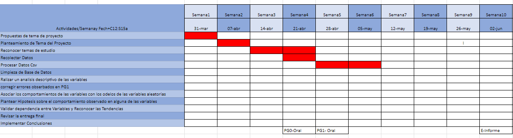

## Introducción
El presente estudio se centra en el análisis estadístico del perfil de los bomberos en Lima Centro, con el objetivo de comprender y evaluar diversos aspectos relacionados con su capacidad de respuesta, recursos disponibles y condiciones laborales. Lima Centro, como una de las zonas urbanas más densamente pobladas de Perú, enfrenta desafíos específicos en materia de seguridad y emergencias.

Este estudio abordará diferentes aspectos, como la formación académica y experiencia de los bomberos, su distribución demográfica, el equipamiento y recursos disponibles, así como las condiciones laborales y satisfacción en el ejercicio de su profesión. A través de un enfoque estadístico riguroso, se recopilarán y analizarán datos relevantes que permitirán tomar decisiones informadas para el mejoramiento de la gestión y operatividad del cuerpo de bomberos en Lima Centro.

### Relevancia

Realizar un proyecto de análisis estadístico sobre el perfil de los bomberos, y su relación con el rendimiento físico y seguridad laboral es relevante debido a varias razones fundamentadas. En primer lugar, los bomberos desempeñan un papel crucial en la protección de vidas y propiedades durante emergencias, lo que destaca la importancia de comprender su preparación y recursos. Además, el análisis estadístico proporciona información valiosa sobre la formación, experiencia y habilidades de los bomberos, lo que mejora la gestión de recursos humanos y financieros. Asimismo, evaluar las necesidades y brechas existentes en el cuerpo de bomberos permite identificar áreas que requieren mejoras, orientando la asignación de recursos y la implementación de políticas. Por otra parte, el proyecto facilita la planificación estratégica a largo plazo al identificar tendencias y necesidades emergentes en el campo de los bomberos. Por último, este análisis contribuye a la investigación y desarrollo en la seguridad y prevención de incendios, fomentando el conocimiento científico y mejorando las políticas públicas. En resumen, el proyecto de análisis estadístico del perfil de los bomberos en Lima Centro es relevante para mejorar la gestión de recursos, evaluar necesidades, planificar estratégicamente y contribuir al desarrollo de conocimientos en el ámbito de la seguridad y prevención de incendios en Perú.

### Contexto

En Perú, la diversidad geográfica y cultural plantea diferentes riesgos y necesidades de protección contra incendios. Lima, la capital y centro urbano más poblado del país, concentra infraestructuras críticas y una densidad de población significativa. Es fundamental contar con un cuerpo de bomberos capacitado y equipado en Lima Centro para responder eficazmente a situaciones de emergencia.
Además, Perú es propenso a desastres naturales, lo que requiere preparación por parte de los bomberos para coordinar operaciones de búsqueda y rescate. El análisis del perfil de los bomberos en Lima Centro permitirá evaluar su capacidad de respuesta y tomar medidas preventivas.
Es importante considerar la infraestructura, recursos y limitaciones específicas del cuerpo de bomberos en Lima Centro, así como el contexto socioeconómico que puede influir en su disponibilidad y condiciones laborales.

En resumen, el análisis estadístico del perfil de los bomberos en Lima Centro es crucial para abordar los riesgos geográficos y socioeconómicos del país, garantizar una respuesta eficiente a emergencias y mejorar las condiciones laborales de los bomberos para proteger a la población.

### Objetivos

**Objetivo general**

Analizar el perfil promedio de los bomberos en Lima Centro basado en su experiencia, edad, ubicación de centro laboral para medir su preparación y rendimiento, mediante encuestas y gráficos estadísticos.


**Objetivo secundarios**

-   Relacionar variables categóricas, como el rango, compañía a la que pertenece y la sensación de preparación, con variables numéricas relacionadas, como el tiempo dedicado a ser bombero, rendimiento físico y edad. Esto se realiza con el fin de identificar posibles patrones o tendencias.

-   Evaluar la efectividad de políticas, las medidas de formación en seguridad y capacitación de prevención de riesgos, en función a la percepción de preparación del bombero mediante variables cualitativas (sensaciones y cantidad de lesiones) y discretas (años de experiencia y de voluntariado).

-   Proponer recomendaciones de seguridad y preparación en base a los resultados estadísticos que se obtendrán en el análisis de la data recolectada. Con esto se busca que el bombero sufra la menor cantidad posible de lesiones al atender una emergencia.


### Planificación

Creamos una planificación utilizando Google Sheets para poder determinar las fechas de realización de cada actividad necesarias para completar el proyecto planteado.

{height="height," width="width"}

<center>

*Link:* <https://docs.google.com/spreadsheets/d/1679hNM2sF5uZY0z_5HE5W1QwkCdTB0Hw0aFT_CP8iLU/edit?usp=sharing>

**Instrumento de recolección**

Utilizamos como instrumento de recolección una encuesta virtual el cual puede difundirse de manera rápida y eficiente. Nuestra muestra poblacional son los bomberos en Lima Centro. Para ello, difundimos en compañías de bomberos que pertenezcan en este sector geográfico y apoyaron para recaudar suficientes respuestas.

```{r, include=FALSE}
# LIBRARIES
library(readr)
library(dplyr)
if(!require(wordcloud)){install.packages('wordcloud')}
if(!require(tm)){install.packages('tm')}
library("wordcloud")
library("tm")
if(!require(ggplot2)){install.packages('ggplot2')}
library('ggplot2')
if(!require(ggthemes)){install.packages('ggthemes')}
library(ggthemes)
if(!require(fitdistrplus)){install.packages('fitdistrplus')}
library(fitdistrplus)
if(!require(stringr)){install.packages('stringr')}
library(stringr)
```

```{r echo=FALSE}
DB_Firefighters<-read_csv("DATA-BOMBEROS.csv", show_col_types = FALSE)

DB_Firefighters=DB_Firefighters[,-c(1)]

names (DB_Firefighters)<- c("Correo Electronico","Genero","Rango","Compañia","Distrito","Edad","Años de trabajo","Horas voluntarias","Lesiones sufridas","MEDIA FISICA 1-5","Minutos corriendo sin pausa","Planchas-1 min","Donde realiza su entrenamiento","Formacion Brindada","Lugar de mayor riesgo","Emergencia que no se siente preparado")
```

## Datos

### Recolección de datos

Para la recolección de datos se envió un formulario a las distintas compañías de bomberos de Lima Centro.

### Población, muestra y muestreo

-   **Población:** Comunidad de Bomberos de Lima

-   **Muestra:** Bomberos activos de Lima Centro

-   **Unidad muestral:** Bomberos

-   **Tamaño de la muestra:** 182 Bomberos

-   **Representatividad de la muestra:** 167 BOMBEROS

-   **Tipo de muestreo:** Bola de nieve

### Variables

| Variable | Descripción | Tipo | Restricción |
| :--- |  :---: |  :---: |  :---: |
| Género | Género con el que se identifica | <span style="color:red">Categórica</span> nominal | No hay |
| Compañía | Compañía a la que pertenece el bombero | <span style="color:red">Categórica</span> nominal | Compañías $\in$ {Lima-Centro} |
| Lugar_ entrenamiento | Lugar donde realiza entrenamiento físico | <span style="color:red">Categórica</span> nominal | Lugar $\in$ {compañía, en casa, gimnasio, compañía y casa, ninguno} |
| Distrito | Lugares donde trabajan los bomberos encuestados | <span style="color:red">Categórica</span> nominal | Distritos en Lima-Centro |
| Emergencia_no_preparado | Emergencias en el que el bombero no se siente completamente preparado para atender | <span style="color:red">Categórica</span> nominal | Emergencia_no_preparado $\in$ {Fuga de gas, Incendio de estructuras elevadas, Incendio en sótanos, Accidente automovilístico, Emergencia médica, Rescate con lote de cuerdas, Ninguna alternativa. 100% prepadado, Ninguno, Si me siento preparado} |
| Rango | Rango del bombero | <span style="color:red">Categórica</span> ordinal | Rango $\in$ {Capitan, Teniente, Teniente brigadier, Subteniente, Seccionario, Brigadier} |
| Cantidad_lesiones | Cantidad de lesiones que ha sufrido el bombero en los últimos 12 meses | <span style="color:red">Categórica</span> ordinal | Cantidad_lesiones $\in$ {0,1,2,3}
| Sensación_preparación | Cuán preparado físicamente se siente el bombero | <span style="color:red">Categórica</span> ordinal | Sensación_preparación $\in$ {1,2,3,4,5} |
| Seguridad_prevención | Medida en la que el bombero considera su preparación en seguridad y prevención | <span style="color:red">Categórica</span> ordinal | Seguridad_prevención $\in$ {1,2,3,4,5} |
| Riesgo_emergencia | Sensación de riesgo ante una emergencia | <span style="color:red">Categórica</span> ordinal | Riesgo_emergencia $\in$ {Fuga de gas, Incendio de estructuras elevadas, Incendio en sótanos, Accidente automovilístico, Emergencia médica, Rescate con lote de cuerdas, Rescate en estructuras colapsadas, Emergencias hazmat o rescate en espacios confinados, Todas las anteriores, -} |
| Edad | Edad del bombero | <span style="color:blue">Numérica</span> discreta | No hay |
| Años_bombero | Años trabajando como bombero | <span style="color:blue">Numérica</span> discreta | No hay |
| Horas_trimestre | Horas de voluntariado por trimestre | <span style="color:blue">Numérica</span> discreta | No hay |
| Minutos_corriendo | Tiempo en el que puede correr sin detenerse | <span style="color:blue">Numérica</span> discreta | No hay |
| Cantidad_planchas | Cantidad de planchas que puede realizar en 1 minuto | <span style="color:blue">Numérica</span> discreta | No hay |

### Limpieza de base de datos

```{r}

DB_Firefighters$`Lesiones sufridas`[DB_Firefighters$`Lesiones sufridas` == "3 o más"]<- 3
DB_Firefighters[DB_Firefighters == "-"]<- NA
DB_Firefighters$Compañia<-as.numeric(DB_Firefighters$Compañia)
DB_Firefighters$Edad<-as.numeric(DB_Firefighters$Edad)
DB_Firefighters$`Años de trabajo`<-as.numeric(DB_Firefighters$`Años de trabajo`)
DB_Firefighters$`Horas voluntarias`<-as.numeric(DB_Firefighters$`Horas voluntarias`)
DB_Firefighters$`Lesiones sufridas`<-as.numeric(DB_Firefighters$`Lesiones sufridas`)
DB_Firefighters$`MEDIA FISICA 1-5`<-as.numeric(DB_Firefighters$`MEDIA FISICA 1-5`)
DB_Firefighters$`Formacion Brindada`<-as.numeric(DB_Firefighters$`Formacion Brindada`)
DB_Firefighters$`Minutos corriendo sin pausa`<-as.numeric(DB_Firefighters$`Minutos corriendo sin pausa`)
DB_Firefighters$Edad[DB_Firefighters$Edad>99]<- NA
DB_Firefighters$`Planchas-1 min`<-as.numeric(DB_Firefighters$`Planchas-1 min`)
DB_Firefighters<-na.omit(DB_Firefighters)
DB_Firefighters$Distrito[DB_Firefighters$Distrito == "SAN JUAN DE LURIGANCHO"]<-"SAN JL"
DB_Firefighters$Distrito[DB_Firefighters$Distrito == "CERCADO DE LIMA"]<-"CENTRO L"
DB_Firefighters$Distrito[DB_Firefighters$Distrito == "JESUS MARIA"]<-"JESUS M"
DB_Firefighters$Distrito[DB_Firefighters$Distrito == "LA VICTORIA"]<-"VICTORIA"
DB_Firefighters$Distrito[DB_Firefighters$Distrito == "SANTA ANITA"]<-"SANTA A"
DB_Firefighters$Distrito[DB_Firefighters$Distrito == "EL AGUSTINO"]<-"AGUSTINO"
DB_Firefighters$`Emergencia que no se siente preparado`[DB_Firefighters$`Emergencia que no se siente preparado` != "Ninguno. Me siento 100% preparado en todo"]<-"No Preparado"
DB_Firefighters$`Emergencia que no se siente preparado`[DB_Firefighters$`Emergencia que no se siente preparado` == "Ninguno. Me siento 100% preparado en todo"]<-"Preparado"
DB_Firefighters$`Lugar de mayor riesgo`[DB_Firefighters$`Lugar de mayor riesgo` == "Rescate en estructuras colapsadas"]<-"RESCATES"
DB_Firefighters$`Lugar de mayor riesgo`[DB_Firefighters$`Lugar de mayor riesgo` == "Emergencia médica"]<-"EMERGENCIAS"
DB_Firefighters$`Lugar de mayor riesgo`[DB_Firefighters$`Lugar de mayor riesgo` == "Emergencias hazmat, rescate en espacios confinados"]<-"EMERGENCIAS"
DB_Firefighters$`Lugar de mayor riesgo`[DB_Firefighters$`Lugar de mayor riesgo` == "Incendio en estructuras elevadas"]<-"INCENDIO"
DB_Firefighters$`Lugar de mayor riesgo`[DB_Firefighters$`Lugar de mayor riesgo` == "Incendio en sotanos"]<-"INCENDIO"
DB_Firefighters$`Lugar de mayor riesgo`[DB_Firefighters$`Lugar de mayor riesgo` == "Rescate con lote de cuerdas"]<-"RESCATES"
DB_Firefighters$`Lugar de mayor riesgo`[DB_Firefighters$`Lugar de mayor riesgo` == "Fuga de Gas"]<-"EMANACIONES"
DB_Firefighters$`Lugar de mayor riesgo`[DB_Firefighters$`Lugar de mayor riesgo` == "En realidad en todas las presentadas"]<-"TODAS"
```

## Análisis descriptivo

### Descriptores numéricos y gráficos de la variables del estudio

```{r echo=FALSE}
# VALORES Y TABLAS

edad <- DB_Firefighters$Edad
genero <- DB_Firefighters$Genero 
Compañia=DB_Firefighters$Compañia 
distrito <- DB_Firefighters$Distrito
mayor_riesgo <- DB_Firefighters$`Lugar de mayor riesgo`
horas <- DB_Firefighters$`Horas voluntarias`
rango <- DB_Firefighters$Rango
preparado <- DB_Firefighters$`MEDIA FISICA 1-5` # Variable categórica ordinal
minutos_corriendo <- DB_Firefighters$`Minutos corriendo sin pausa`
planchas_minuto <- DB_Firefighters$`Planchas-1 min`
lugar_ejercita <- DB_Firefighters$`Donde realiza su entrenamiento`
emergencias_no_preparado <- DB_Firefighters$`Emergencia que no se siente preparado`
formacion <- DB_Firefighters$`Formacion Brindada`

table_Distrito <- table(distrito)

```


# Análisis probabilístico

## Probabilidad empírica

#Experimento 1:
Seleccionar a un bombero al azar de una base de datos de 167 bomberos de Lima - Centro y observar a que compañia pertenece.

1) Hallamos el numero de observaciones
```{r}
n_muestra <- nrow(DB_Firefighters) # Tamaño de la muestra
print("Espacio muestral:") 
n_muestra
```

El siguiente paso a seguir es hallar nuestro espacio muestral

Cantidad de distritos en nuestra muestra:
- San Juan Lurigancho
- Huachipa
- Centro de Lima
- Magdalena
- Rimac
- Ate
- Chosica
- Jesus Maria
- Agustino
- Santa Anita
- La Victoria
- Lince
- Breña

2) Verificamos las compañias de bomberos que tenemos en nuestra base con el siguiente código:
```{r}
unique(DB_Firefighters$Distrito)
```

3)Seleccionamos nuestros eventos atómicos
#Eventos atomicos: 
Evento 1: Seleccionar a un bombero al azar que sea parte de la compañia de bomberos de San Juan de Lurigancho entre una muestra de 167 bomberos.

Evento 2: Seleccionar a un bombero al azar que sea parte de la compañia de bomberos de Huachipa entre una muestra de 167 bomberos.

Evento 3: Seleccionar a un bombero al azar que sea parte de la compañia de bomberos de Centro de Lima entre una muestra de 167 bomberos.

Evento 4: Seleccionar a un bombero al azar que sea parte de la compañia de bomberos de Magdalena entre una muestra de 167 bomberos.

Evento 5: Seleccionar a un bombero al azar que sea parte de la compañia de bomberos de Rimac entre una muestra de 167 bomberos.

Evento 6: Seleccionar a un bombero al azar que sea parte de la compañia de bomberos de Ate entre una muestra de 167 bomberos.

Evento 7: Seleccionar a un bombero al azar que sea parte de la compañia de bomberos de Chosica entre una muestra de 167 bomberos.

Evento 8: Seleccionar a un bombero al azar que sea parte de la compañia de bomberos de Jesús Maria entre una muestra de 167 bomberos.

Evento 9: Seleccionar a un bombero al azar que sea parte de la compañia de bomberos del Agustino entre una muestra de 167 bomberos.

Evento 10: Seleccionar a un bombero al azar que sea parte de la compañia de bomberos de Santa Anita entre una muestra de 167 bomberos.

Evento 11: Seleccionar a un bombero al azar que sea parte de la compañia de bomberos de la Victoria entre una muestra de 167 bomberos.

Evento 12: Seleccionar a un bombero al azar que sea parte de la compañia de bomberos de Lince entre una muestra de 167 bomberos.

Evento 13: Seleccionar a un bombero al azar que sea parte de la compañia de bomberos de Breña entre una muestra de 167 bomberos.


#Obtendremos las probabilidades de cada evento e interpreraciones

**Probabilidad SJL:**
```{r}
p_SJL 	<- nrow(filter(DB_Firefighters,DB_Firefighters$Distrito=="SAN JL"))/n_muestra
p_SJL
round(p_SJL*100,1)
```
La probabilidad de que seleccionar de manera al azar a un bombero de la compañia de bomberos de San Juan de Lurigancho entre las 13 compañias de nuestra base de datos es de 32%

```{r}
p_HUACHIPA	<- nrow(filter(DB_Firefighters,DB_Firefighters$Distrito=="HUACHIPA"))/n_muestra
p_HUACHIPA
round(p_HUACHIPA*100,1)
```
La probabilidad de que seleccionar de manera al azar a un bombero de la compañia de bomberos de Huachipa entre las 13 compañias de nuestra base de datos es de 4.8%

```{r}
p_CENTROL	<- nrow(filter(DB_Firefighters,DB_Firefighters$Distrito=="CENTRO L"))/n_muestra		
p_CENTROL
round(p_CENTROL*100,1)
```
La probabilidad de que seleccionar de manera al azar a un bombero de la compañia de bomberos deL Centro de Lima entre las 13 compañias de nuestra base de datos es de 9%

```{r}
p_MAGDALENA		<- nrow(filter(DB_Firefighters,DB_Firefighters$Distrito=="MAGDALENA"))/n_muestra	
p_MAGDALENA
round(p_MAGDALENA*100,1)
```
La probabilidad de que seleccionar de manera al azar a un bombero de la compañia de bomberos de Magdalena entre las 13 compañias de nuestra base de datos es de 4.2%

```{r}
p_RIMAC	<- nrow(filter(DB_Firefighters,DB_Firefighters$Distrito=="RIMAC"))/n_muestra	
p_RIMAC
round(p_RIMAC*100,1)
```
La probabilidad de que seleccionar de manera al azar a un bombero de la compañia de bomberos del Rimac entre las 13 compañias de nuestra base de datos es de 10.2%

```{r}
p_ATE			<- nrow(filter(DB_Firefighters,DB_Firefighters$Distrito=="ATE"))/n_muestra	
p_ATE	
round(p_ATE*100,1)
```
La probabilidad de que seleccionar de manera al azar a un bombero de la compañia de bomberos de Ate entre las 13 compañias de nuestra base de datos es de 1.2%

```{r}
p_CHOSICA		<- nrow(filter(DB_Firefighters,DB_Firefighters$Distrito=="CHOSICA"))/n_muestra
p_CHOSICA
round(p_CHOSICA*100,1)
```
La probabilidad de que seleccionar de manera al azar a un bombero de la compañia de bomberos de Chosica entre las 13 compañias de nuestra base de datos es de 12.6%


```{r}
p_JESUS_M		<- nrow(filter(DB_Firefighters,DB_Firefighters$Distrito=="JESUS M"))/n_muestra	
p_JESUS_M
round(p_JESUS_M*100,1)
```
La probabilidad de que seleccionar de manera al azar a un bombero de la compañia de bomberos de Jesus de Maria entre las 13 compañias de nuestra base de datos es de 12%

```{r}
p_AGUSTINO	<- nrow(filter(DB_Firefighters,DB_Firefighters$Distrito=="AGUSTINO"))/n_muestra	
p_AGUSTINO
round(p_AGUSTINO*100,1)
```
La probabilidad de que seleccionar de manera al azar a un bombero de la compañia de bomberos del Agustino entre las 13 compañias de nuestra base de datos es de 4.2%

```{r}
p_SANTA_A <- nrow(filter(DB_Firefighters,DB_Firefighters$Distrito=="SANTA A"))/n_muestra
p_SANTA_A
round(p_SANTA_A*100,1)
```
La probabilidad de que seleccionar de manera al azar a un bombero de la compañia de bomberos de Santa Anita entre las 13 compañias de nuestra base de datos es de 1.2%

```{r}
p_VICTORIA  <- nrow(filter(DB_Firefighters,DB_Firefighters$Distrito=="VICTORIA"))/n_muestra	
p_VICTORIA
round(p_VICTORIA*100,1)
```
La probabilidad de que seleccionar de manera al azar a un bombero de la compañia de bomberos de Huachipa entre las 13 compañias de nuestra base de datos es de 3.6%

```{r}
p_LINCE		<- nrow(filter(DB_Firefighters,DB_Firefighters$Distrito=="LINCE"))/n_muestra		
p_LINCE
round(p_LINCE*100,1)
```
La probabilidad de que seleccionar de manera al azar a un bombero de la compañia de bomberos de Lince entre las 13 compañias de nuestra base de datos es de 2.4%

```{r}
p_BREÑA  <- nrow(filter(DB_Firefighters,DB_Firefighters$Distrito=="BREÑA"))/n_muestra
p_BREÑA
round(p_BREÑA*100,1)
```
La probabilidad de que seleccionar de manera al azar a un bombero de la compañia de bomberos de Breña entre las 13 compañias de nuestra base de datos es de 1.8%

#Comprobamos que la sumatoria de estos debe darnos un 100% (1)
```{r}
p_totalDistrito <- p_SJL+p_HUACHIPA+p_CENTROL+p_MAGDALENA+p_RIMAC+p_ATE+p_CHOSICA+p_JESUS_M+p_AGUSTINO+p_SANTA_A+p_VICTORIA+p_LINCE+p_BREÑA

p_totalDistrito
```

Armamos un pequeño cuadro donde observamos de manera mas clara las probabilidades obtenidas de cada distrito
```{r}
# Crear dataframe de resultados
resultados <- data.frame(
  Distrito = c("SAN JL", "HUACHIPA", "CENTRO L", "MAGDALENA", "RIMAC", "ATE", "CHOSICA", "JESUS M", "AGUSTINO", "SANTA A", "VICTORIA", "LINCE", "BREÑA"),
  Porcentaje = round(c(p_SJL, p_HUACHIPA, p_CENTROL, p_MAGDALENA, p_RIMAC, p_ATE, p_CHOSICA, p_JESUS_M, p_AGUSTINO, p_SANTA_A, p_VICTORIA, p_LINCE, p_BREÑA)*100,1)
)
resultados$Porcentaje <- paste0(resultados$Porcentaje, "  %")

# Mostrar resultados en forma de cuadro
resultados
```
*interpretacion1.-*
EXPERIMENTO 1                                                                                                                                                En nuestro análisis, hemos calculado las probabilidades empíricas de seleccionar al azar un bombero de diferentes compañías de bomberos de Lima - Centro, utilizando una base de datos de 167 bomberos. Hemos identificado 13 eventos atómicos, donde cada evento representa la selección de un bombero de una compañía específica.

Luego, hemos calculado las probabilidades de cada evento dividiendo el número de bomberos en cada compañía entre el total de bomberos en la base de datos. Por ejemplo, la probabilidad de seleccionar al azar un bombero de la compañía de bomberos de San Juan de Lurigancho es del 32%, mientras que la probabilidad de seleccionar un bombero de Huachipa es del 4.8%.

Estas probabilidades empíricas se basan en los datos disponibles en tu base de datos y representan estimaciones de las frecuencias relativas observadas en la muestra. Es importante tener en cuenta que estas probabilidades pueden variar si se obtiene una muestra diferente o si se actualiza la base de datos.


#Experimento 2:
Seleccionar a un bombero al azar de una base de datos de 167 bomberos de Lima - Centro y observar a si se siente preparado o no, consideramos esta variable de la limpieza de datos realizada considerando que quienes estan PREPARADOS es porque enfrentan todo tipo de emergencias en nuestras opciones y NO PREPARADOS quien tiene al menos presenta una emergencia que no se siente 100% preparado.

1) Hallaremos el número de observaciones
```{r}
n_muestra <- nrow(DB_Firefighters)
```

2)Verificamos la preparación entre nuestra base de datos
```{r}
unique(DB_Firefighters$`Emergencia que no se siente preparado`)
```
3)Seleccionamos nuestros eventos atómicos
El evento atómico 1 asociado a se siente Preparado sería: "Seleccionar una persona preparada en una muestra de tamaño 167".

El evento atómico 2 asociado a se siente No preparado sería: "Seleccionar una persona no preparada en una muestra de tamaño 167".

**Probabilidad de bomberos preparados**
```{r}
p_Preparado <- nrow(filter(DB_Firefighters,DB_Firefighters$`Emergencia que no se siente preparado`=="Preparado"))/n_muestra
p_Preparado
```
La probabilidad de bombero Preparados es 24.5%

**Probabilidad de bomberos No preparados**
```{r}
p_NoPreparado <- nrow(filter(DB_Firefighters,DB_Firefighters$`Emergencia que no se siente preparado`=="No Preparado"))/n_muestra
p_NoPreparado
```
La probabilidad de bombero Preparados es 75.4%


#Verificamos que la sumatoria de estas dos probabilidades debe darnos 100% (1)
```{r}
p_preparacionTotal <- p_Preparado+p_NoPreparado
p_preparacionTotal
```


## Probabilidad condicional

##Eventos dependientes
Escogemos las variables de "RANGO", especificamente el rango de seccionario puesto que hemos tenido mas respuestas de bomberos de este rango y podriamos tener mas variedad. Tambien esocgimos la variable de "GÉNERO" entre hombre y mujer.


**Establecemos nuestras variables y eventos**
Evento A: Escoger un bombero al azar de nuestra base de datos de 167 bomberos que tenga rango seccionario 
Evento B: Escoger un bombero al azar de nuestra base de datos de 167 bomberos que sea mujer
```{r}
#Tamaño muestral
cantidad_bomberos <- nrow(DB_Firefighters)

#variables
seccionarios <- nrow(filter(DB_Firefighters,DB_Firefighters$Rango=="Seccionario"))
no_seccionarios <- nrow(filter(DB_Firefighters,DB_Firefighters$Rango!="Seccionario"))

mujeres <- nrow(filter(DB_Firefighters,DB_Firefighters$Genero=="Mujer"))
hombres <- nrow(filter(DB_Firefighters,DB_Firefighters$Genero=="Hombre"))


seccionarios
no_seccionarios
mujeres
hombres
```


A continuacion obtenemos nuestras variables que cumplen con la condicion de seccionarios y ser mujer. Al mismo tiempo su complemente de quienes no lo cumplen tanto para el evento A y evento B
```{r}
secc_mujer <- nrow(filter(DB_Firefighters,DB_Firefighters$Rango=="Seccionario" & DB_Firefighters$Genero=="Mujer"))
secc_mujer

secc_hombre <- nrow(filter(DB_Firefighters,DB_Firefighters$Rango=="Seccionario" & DB_Firefighters$Genero=="Hombre"))
secc_hombre


No_secc_mujer <- nrow(filter(DB_Firefighters,DB_Firefighters$Rango!="Seccionario" & DB_Firefighters$Genero=="Mujer"))
No_secc_mujer

No_secc_hombre <- nrow(filter(DB_Firefighters,DB_Firefighters$Rango!="Seccionario" & DB_Firefighters$Genero=="Hombre"))
No_secc_hombre

```

Creamos un cuadro donde apreciamos mejor nuestras variables
```{r}
cat("\n")
cat("                  Mujer      Hombre    total \n")
cat("   Seccionario      ", secc_mujer, "       ",secc_hombre,"    ", seccionarios, "\n")
cat("   No seccionarios  ", No_secc_mujer , "       ", No_secc_hombre,"    ", No_secc_hombre+No_secc_mujer, "\n")
cat("   Total            ",  mujeres, "      ", hombres, "    ", cantidad_bomberos, "\n")

```

Debemos de verificar si se cumple que P(A n B) = P(A)P(B). Si no se cumple, entonces es dependiente, por lo cual P(A|B) = P(A n B) /P(B). Si fuera independiente, es fácil darse cuenta de que se cumple P(A|B) = P(A).


$$\mathbb{P( a∩b)}=\mathbb{P( a)*P(b)}\hspace{0.1cm}$$

Obtendremos **P(a)** y **P(b)**
```{r}
P_a <- nrow(filter(DB_Firefighters,DB_Firefighters$Rango=="Seccionario"))/cantidad_bomberos
P_b <- nrow(filter(DB_Firefighters,DB_Firefighters$Genero=="Mujer"))/cantidad_bomberos

P_a
P_b
```
Probabilidad del evento A: La probabilidad de seleccionar al azar a un bombero de nuestra muestra de datos y que sea del rango seccionario es de 62.2%

Probabilidad del evento B: La probabilidad de seleccionar al azar a un bombero de nuestra muestra de datos y que sea mujer es de 26.3%


Calculamos **P(a∩b)**
```{r}
P_AyB <- secc_mujer/cantidad_bomberos
P_AyB
```
La probabilidad de que un bombero sea seleccionado al azar que sea seccionario y mujer es de 19.1%

Multiplicamos nuestra probabilidad de P(a) y P(b)
```{r}
P_aXb <- P_a*P_b
P_aXb

```

Por ultimo vamos a verificar la dependencia de estos factores puesto que deberia darnos cero
```{r}
P =   P_AyB - P_aXb
P
``` 
Como nuestro resultado sale distinto a cero, decimos que no va a haber dependencia
#Seguimos con el siguiente punto de calcular la probabilidad condicional

$$\mathbb{P( a/b)}=\frac{\mathbb{P(a∩b)}}{\mathbb{P(b)}}\hspace{0.1cm}$$

```{r}
Prob_A_si_B <- P_AyB/P_b
Prob_A_si_B
```

Ahora hallamos la probabilidad condicional total con buyers

$$\mathbb{P( a)}={\mathbb{P(a/b)*P(b)+P(a/b')*P(b')}}\hspace{0.1cm}$$

donde utilizaremos el complementario deñ evento B, los que no son seccionarios

Calculamos el P(a/b')
```{r}
Prob_A_si_Bb <- (P_a - P_AyB) / (1-P_b)
Prob_A_si_Bb
```
Calculemos el P(b')
```{r}
Prob_Bb <- 1-P_b
Prob_Bb
```
```{r}
P_A_Bb <- Prob_A_si_B*P_b + Prob_A_si_Bb*Prob_Bb
P_A_Bb
```
Obtenemos que la Probabilidad del evento A (un bombero que sea seccionario en nuestra base datos), es de 62.2% el cual es el mismo que obtuvimos en un primer instante y esto verifica que nuestras probabilidades cocinciden y estan correcto


*Interpretacion*
En este experimento, analizamos la probabilidad condicional entre dos variables: el rango seccionario y el género de los bomberos. Seleccionamos al azar bomberos de una base de datos de 167 individuos.

Establecimos dos eventos:

- Evento A: Seleccionar un bombero al azar que tenga el rango seccionario.
- Evento B: Seleccionar un bombero al azar que sea mujer.

Luego, calculamos las probabilidades de cada evento:

- Probabilidad del evento A (bombero con rango seccionario): 62.2%
- Probabilidad del evento B (bombero mujer): 26.3%
- Probabilidad de que un bombero seleccionado al azar tenga rango seccionario y sea mujer: 19.1%

Además, verificamos la dependencia entre estas dos variables. Observamos que la probabilidad del evento A se mantiene en 62.2% cuando consideramos solo los bomberos que son mujeres. Esto indica que estas dos variables no son independientes y existe una relación entre el rango seccionario y el género de los bomberos en nuestra base de datos.


Caso 2
##Eventos dependientes
Escogemos las variables de "HORAS VOLUNTARIAS", especificamente el rango de seccionario puesto que hemos tenido mas respuestas de bomberos de este rango y podriamos tener mas variedad. Tambien esocgimos la variable de "NUMERO DE LESIONES" entre hombre y mujer.

**Establecemos nuestras variables y eventos**
Evento A: Escoger un bombero al azar de nuestra base de datos de 167 bomberos que tenga minimo una lesion causada en su ultimo año. 
Evento B: Escoger un bombero al azar de nuestra base de datos de 167 bomberos que cumpla minimo 150horas voluntarias 

**Nota: ** escogemos ese rango de horas puesto que ese minimo de horas se le pide a un bombero promedio para cumplir con su labor.

Entonces, debemos de verificar si se cumple que P(A n B) = P(A)P(B). Si no se cumple, entonces es dependiente, por lo cual P(A|B) = P(A n B) /P(B). Si fuera independiente, es fácil darse cuenta de que se cumple P(A|B) = P(A).

Por otro lado, usando Bayes, se verifica entonces P(B|A) = P(A|B)P(B) / P(A). Donde P(A) puede ser caracterizada por la probabilidad total.

```{r}
#DEFINIREMOS  CANTIDADES 
cantidad_bomberos <- nrow(DB_Firefighters)

lesiones_0_horas_cumplidas <- nrow(filter(DB_Firefighters,DB_Firefighters$`Lesiones sufridas`==0 & DB_Firefighters$`Horas voluntarias`>=150))
lesiones_0_horas_cumplidas

lesiones_0_horas_Nocumplidas <- nrow(filter(DB_Firefighters,DB_Firefighters$`Lesiones sufridas`==0 & DB_Firefighters$`Horas voluntarias`<150))
lesiones_0_horas_Nocumplidas

```

```{r}
lesion_1_horas_cumplidas <- nrow(filter(DB_Firefighters,DB_Firefighters$`Lesiones sufridas`!=0 & DB_Firefighters$`Horas voluntarias`>=150))
lesion_1_horas_cumplidas

lesiones_1_horas_Nocumplidas <- nrow(filter(DB_Firefighters,DB_Firefighters$`Lesiones sufridas`!=0 & DB_Firefighters$`Horas voluntarias`<150))
lesiones_1_horas_Nocumplidas
```

Armamos un cuadro con nuestros datos para guiarnos mejor
```{r}
cat("\n")
cat("                              Ninguna lesion     Con lesiones       total \n")
cat("   Mayor o igual 150 horas     ", lesiones_0_horas_cumplidas, "                  ",lesion_1_horas_cumplidas,"          ", lesion_1_horas_cumplidas+lesiones_0_horas_cumplidas, "\n")
cat("   Menor a 150 horas           ", lesiones_0_horas_Nocumplidas , "                  ", lesiones_1_horas_Nocumplidas,"          ", lesiones_0_horas_Nocumplidas+lesiones_1_horas_Nocumplidas, "\n")
cat("   Total                       ", lesiones_0_horas_cumplidas+lesiones_0_horas_Nocumplidas, "                 ", lesion_1_horas_cumplidas+lesiones_1_horas_Nocumplidas, "          ", cantidad_bomberos, "\n")
```

Debemos de verificar si se cumple que P(A n B) = P(A)P(B). Si no se cumple, entonces es dependiente, por lo cual P(A|B) = P(A n B) /P(B). Si fuera independiente, es fácil darse cuenta de que se cumple P(A|B) = P(A).


$$\mathbb{P( a∩b)}=\mathbb{P( a)*P(b)}\hspace{0.1cm}$$

Obtendremos **P(a)** y **P(b)**
```{r}
P_a1 <- nrow(filter(DB_Firefighters,DB_Firefighters$`Lesiones sufridas`!=0))/nrow(DB_Firefighters)
P_b2 <- nrow(filter(DB_Firefighters,DB_Firefighters$`Horas voluntarias`>=150))/nrow(DB_Firefighters)

P_a1
P_b2
```
Probabilidad del evento A: La probabilidad de seleccionar al azar a un bombero de nuestra muestra de datos y que tenga minimo una lesion es de 23.9%

Probabilidad del evento B: La probabilidad de seleccionar al azar a un bombero de nuestra muestra de datos y que cumpla sus 150 horas voluntarias como minimo 55.6%


Calculamos **P(a∩b)**
```{r}
P_A1_B2 <- lesion_1_horas_cumplidas/cantidad_bomberos
P_A1_B2
```
La probabilidad de que un bombero sea seleccionado al azar que sea seccionario y mujer es de 16.7%

Multiplicamos nuestra probabilidad de P(a) y P(b)
```{r}
P_A_x_B <- P_a*P_b
P_A_x_B

```

Por ultimo vamos a verificar la dependencia de estos factores puesto que deberia darnos cero
```{r}
P =  P_A1_B2 -P_A_x_B
P
``` 
Como nuestro resultado sale distinto a cero, decimos que no va a haber dependencia
#Seguimos con el siguiente punto de calcular la probabilidad condicional

$$\mathbb{P( a/b)}=\frac{\mathbb{P(a∩b)}}{\mathbb{P(b)}}\hspace{0.1cm}$$
```{r}
P_A1_si_B2 <- P_A1_B2/P_b2
P_A1_si_B2
```

## *4.2 Variables aleatorias discretas:*


#### **4.2.1 ESTAS PREPRADO O NO LO ESTAS PREPARADO:**

```{r echo=false}
table(DB_Firefighters$`Emergencia que no se siente preparado`)
PREPRADO<-126/length(DB_Firefighters$`Emergencia que no se siente preparado`)
"Probabilidad de que se siente preprado"
PREPRADO
"Probabilidad de que no se  siente preprado"
1-PREPRADO
```

+DENOTAMOS QUE PRACTICAMENTE 0.25 O 25% DE LOS BOMBEROS ENCUESTADOS NO SE SIENTE 
PREPARADO PARA CUBRIR CUALQUIER EVENTO DE RIESGO EN LOS QUE SE VEN ENVUELTOS.

```{r echo=FALSE}
hist(DB_Firefighters$`Horas voluntarias` , main="Histograma de lesiones sufridas",col = "skyblue")
```

#### **4.2.2 Lesiones Sufridas:**

```{r echo=FALSE}
intervalos <- c(0,1,2, 3)
hist(DB_Firefighters$`Lesiones sufridas`,breaks = intervalos , main="Histograma de lesiones sufridas",col = "skyblue")
```
+Apartir de este grafico podemos denotar que la grafica parece una binomial negativa
+Comprobemos
```{r echo=FALSE}
descdist(DB_Firefighters$`Lesiones sufridas`, discrete = TRUE )
```
+Efectivamente es una binomial negativa
```{r}
table(DB_Firefighters$`Lesiones sufridas`)
Lesiones_0<-length(DB_Firefighters$`Lesiones sufridas`[DB_Firefighters$`Lesiones sufridas` == "0"])
Lesiones_1<-length(DB_Firefighters$`Lesiones sufridas`[DB_Firefighters$`Lesiones sufridas` == "1"])
Lesiones_2<-length(DB_Firefighters$`Lesiones sufridas`[DB_Firefighters$`Lesiones sufridas` == "2"])
Lesiones_3<-length(DB_Firefighters$`Lesiones sufridas`[DB_Firefighters$`Lesiones sufridas` == "3"])
```
+DENOTAMOS QUE LA MAS REPRESENTATIVA E INTERESANTE PARA NUESTRO ANALISIS ES DE 0
VECES AUN SUFRIDO UNA LESION.

```{r echo=FALSE}
probablida_de_no_tener_niguna_lesion<-Lesiones_0/length(DB_Firefighters$`Lesiones sufridas`)
"Probabililidad de no tener niguna lesion en los encuestados"
probablida_de_no_tener_niguna_lesion
```
```{r}
"Distribucion Binomial en R- para hallar lo anteriormente mencionado"
pbinom(127,167,0.76)
dbinom(0:167,167,0.76)
lesion_dinom_0<-(dbinom(0:167,167,0.76))
sum(dbinom(0:46,167,0.275))
```
```{r}
plot(lesion_dinom_0,main="GRAFICA")
barplot(lesion_dinom_0)
"Hallando la esperanza"
esperanza <- mean(lesion_dinom_0)
print(esperanza)
"Hallando la varianza"
varianza <- var(lesion_dinom_0)
print(varianza)
"Hallando el coeficiente de variacion"
desviacion <- sd(lesion_dinom_0)
media <- mean(lesion_dinom_0)
coef_variacion <- (desviacion / media) *100
coef_variacion
```
#### **4.2.4 PLANCHAS:**

```{r echo=FALSE}
hist(DB_Firefighters$`Planchas-1 min`, main="Histograma de las planchas en 1 min",ylab = "Cantidad de personas que hacen las planchas", xlab = "Planchas por minuto",col = "skyblue")
```
VEREMOS LA GRAFICA SE COMPORTA COMO UNA BINOMIAL NEGATIVA. CONFIRMEMOS

```{r echo=FALSE}
descdist(DB_Firefighters$`Planchas-1 min`, discrete = TRUE )
```
+ Podemos observar que efectivamente su comportamiento es más cercano a una de distribucion de Poisson.
Debido a que nuestra variable para la grafica se han asumido dentro de rangos, de intervalos de 10 en 10 en base a que nuestra investigacion es de analisis de bomberos, llegamos a la conclusion de que sera interesante saber que de todos nuestros datos de planchas por minuto cual es la mas representativa bajo ello al analizar la grafica anterior priorizamos como la más representativa la de intervalos de 20 a 29 planchas por minuto.

#### **HALLANDO LA PROBABILIDAD DE EXITO PARA EL INTERVALO DE 21 A 30**
```{r echo=FALSE}
table(DB_Firefighters$`Planchas-1 min`)
interval_plancha30<-length(DB_Firefighters$`Planchas-1 min`[DB_Firefighters$`Planchas-1 min` == "30"])
interval_plancha21<-length(DB_Firefighters$`Planchas-1 min`[DB_Firefighters$`Planchas-1 min` == "21"])
interval_plancha22<-length(DB_Firefighters$`Planchas-1 min`[DB_Firefighters$`Planchas-1 min` == "22"])
interval_plancha23<-length(DB_Firefighters$`Planchas-1 min`[DB_Firefighters$`Planchas-1 min` == "23"])
interval_plancha24<-length(DB_Firefighters$`Planchas-1 min`[DB_Firefighters$`Planchas-1 min` == "24"])
interval_plancha25<-length(DB_Firefighters$`Planchas-1 min`[DB_Firefighters$`Planchas-1 min` == "25"])
interval_plancha26<-length(DB_Firefighters$`Planchas-1 min`[DB_Firefighters$`Planchas-1 min` == "26"])
interval_plancha27<-length(DB_Firefighters$`Planchas-1 min`[DB_Firefighters$`Planchas-1 min` == "27"])
interval_plancha28<-length(DB_Firefighters$`Planchas-1 min`[DB_Firefighters$`Planchas-1 min` == "28"])
interval_plancha29<-length(DB_Firefighters$`Planchas-1 min`[DB_Firefighters$`Planchas-1 min` == "29"])
total_21_a_30<-sum(interval_plancha30+interval_plancha21+interval_plancha22+interval_plancha23+interval_plancha24+interval_plancha25+interval_plancha26+interval_plancha27+interval_plancha28+interval_plancha29)
total_21_a_30
length(DB_Firefighters$`Planchas-1 min`)
PLANCHIMETRO<-total_21_a_30 /length(DB_Firefighters$`Planchas-1 min`)
"Probabililidad que se haga de 21 a 30 planchas por minuto-probabilidad de exito-mas interesante"
PLANCHIMETRO
```

```{r}
"Distribucion Binomial en R- para hallar lo anteriormente mencionado"
pbinom(46,167,0.275)
dbinom(0:167,167,0.275)
plnach<-(dbinom(0:167,167,0.275))
sum(dbinom(0:46,167,0.275))
```
```{r}
plot(plnach, col = "blue",main="GRAFICA")
barplot(plnach)
"Hallando la esperanza"
esperanza <- mean(plnach)
print(esperanza)
"Hallando la varianza"
varianza <- var(plnach)
print(varianza)
"Hallando el coeficiente de variacion"
desviacion <- sd(plnach)
media <- mean(plnach)
coef_variacion <- (desviacion / media) *100
coef_variacion
```


#### **4.2.4 GENERO:**

```{r}
table(DB_Firefighters$`Genero`)
Total_mujer<-length(DB_Firefighters$`Genero`[DB_Firefighters$`Genero` == "Mujer"])
Total_mujer
Total_hombre<-length(DB_Firefighters$`Genero`[DB_Firefighters$`Genero` == "Hombre"])
Total_hombre
total_encuestados<-length(DB_Firefighters$Genero)
total_encuestados
"PROBABILIDAD DE LAS MUJERES ESTEN EN LAS COMPAÑIAS DE BOMBEROS"
probabilida_mujer<-Total_mujer/total_encuestados
probabilida_mujer
```

```{r}
"Distribucion Binomial en R- para hallar lo anteriormente mencionado"
pbinom(44,167,0.263)
dbinom(0:167,167,0.263)
data<-dbinom(0:167,167,0.263)
sum(dbinom(0:44,167,0.263))

```


Realizando histogramas

```{r}
plot(data, col = "blue",main="GRAFICA")
barplot(data)
"Hallando la esperanza"
esperanza <- mean(data)
print(esperanza)
"Hallando la varianza"
varianza <- var(data)
print(varianza)
"Hallando el coeficiente de variacion"
desviacion <- sd(data)
media <- mean(data)
coef_variacion <- (desviacion / media) *100
coef_variacion
```


*Variables Aleatorias Continuas*


##1- Distribución

Se tomara la Variable edad como una varia
```{r}

library(modeest)
Minutos= DB_Firefighters$Edad
#hallaremos la densidad de minutos
d = density(Minutos)
d$y = d$y * nrow(DB_Firefighters)
hist(Minutos, breaks=15, main="Edad ", xlab="Edad", ylab="Frecuencia", col="#FFEFDB")
lines(d, col="red",lwd=2)
abline(v=mean(Minutos), col="blue", lwd=2)

```
Validar:
```{r}
summary(Minutos)
beta=1/(mean(Minutos))# beta=1/lamda
beta
beta2=sqrt(1/mean(Minutos)^2)  
beta2
sd(Minutos)
```
-Se comprueba que beta debe se positivo  ya que la variable aleatoria puede tomar solo valores positivos
-Se aprecia que la Media ≈ a la Mediana-->31.84≈30.00
-Suponiendo que no se trata de una aproximación mas sino de un acercamiento  entonces  
mu=media
sigma=desviación estándar
mu=31.84
sd=9.68


```{r}
Minutos= DB_Firefighters$Edad
#hallaremos la desidad de minutos(edad)
d = density(Minutos)
d$y = d$y * nrow(DB_Firefighters)
hist(Minutos, breaks=15, main="Edad ", xlab="Edad", ylab="Frecuencia", col="#FFEFDB")
lines(d, col="red",lwd=2)
# creamos la vertical  de media " color Azul" y mediana "color verde"
abline(v=mean(Minutos), col="blue", lwd=2)
abline(v=median(Minutos), col="purple", lwd=2)
#crear la leyenda de media y Mediana
legend("topright", legend = c(paste("media: ", round(mean(Minutos),2) ),  paste("mediana: ", round(median(Minutos),2) )), lwd = 3, col = c("blue", "purple"))
sd(Minutos)
```

Ejemplo:
En cierta emergencia de incendio en centro de Lima,  asistieron diversas  compañías, La edad  de los bomberos asistentes sigue una distribución normal con media de 31.84 años  y una desviación estándar  de 9.68 años  .calcule la probabilidad  de elegir de forma  aleatoria a un personal Bombero  cuya edad  sea mayor de 25 años 
```{r}
1-pnorm(25,31.84,9.68)
```
*interpretacion*
Dentro del contexto de nuestro estudio sobre los bomberos de Lima Centro, si consideramos la variable continua de las edades de los bomberos, podemos realizar una interpretación significativa. Al tener la información sobre las edades de los bomberos en nuestra muestra de datos, podemos obtener una comprensión más detallada de la distribución de edades en este grupo.

Vemos que, tenemos mayor porcentaje de bomberos entre las edades de 20-25 años. Esto debido a que, tenemos un gran porcentaje de seccionarios en nuestra muestra. Asimismo, vemos que los bomberos voluntarios que cuentan con una edad mayor a 40 años, poseen un mayor rango, esto debido a factores como los años de experiencia, preparación física y mental,etc.


#Distribución Normal 

##Gráfico

```{r}
corre_db <- DB_Firefighters %>% filter(DB_Firefighters$`Minutos corriendo sin pausa` < 60)
dc = density(DB_Firefighters$`Minutos corriendo sin pausa`)
intervals <- cut(corre_db$`Minutos corriendo sin pausa`, breaks = seq(0, max(corre_db$`Minutos corriendo sin pausa`), by = 10))
corre_table <- table(intervals)
corre_table

corre_df <- as.data.frame(corre_table)

ggplot(corre_df, aes(x = intervals, y = Freq)) +
  geom_bar(stat = "identity", fill = "turquoise") +
  labs(x = "En intervalos de 10 minutos", y = "Cantidad de bomberos") +
  ggtitle("Distribución de Minutos corriendo sin pausa") +
  theme_minimal()
  


```


```{r}
P <- corre_db$`Minutos corriendo sin pausa`
Mu <- mean(P) # media muestral
Mu
Sigma <- sd(P) # desviación estándar
Sigma
```

```{r}
summary(corre_db)
Mediana<-median(P)
Mediana # Mediana
Var<-Sigma^2 # varianza
Var
```

```{r}
f <- function(x) 1/(sqrt(2*pi*(Sigma**2)))*exp(-(x-Mu)**2/(2*Sigma**2))
f_2 <- function(x) x/(sqrt(2*pi*(Sigma**2)))*exp(-(x-Mu)**2/(2*Sigma**2))
f_3 <- function(x) x^2/(sqrt(2*pi*(Sigma**2)))*exp(-(x-Mu)**2/(2*Sigma**2))
integrate(f,Mu,Sigma)
integrate(f_2,Mu,Sigma)
integrate(f_3,Mu,Sigma)
Var
```
  
Observamos que la media y la mediana se aproximan. Como también el y la varianza. Por lo que es una distribución Normal ya que cumple la mayoría de las condiciones.

*Ejemplo:*    

X: cantidad de bomberos que corren más de 30 minutos.
X= sigue una distribución normal con parámetros mu(media) y sigma(desviación estándar).

Con los datos de los bomberos recolectado, sobre la capacidad en minutos que pueden correr con una media de 26.37 y una desviación estándar de 14.19. Se quiere calcular al elegir un bombero de forma aleatoria la probabilidad de que el bombero pueda correr más de 30 minutos.

Usamos el modelo normal: X∼N(30, 26.36527, 14.19374) y determinamos P(X>30).
```{r}
1-pnorm(30, 26.36527, 14.19374)
```
La probabilidad de elegir un bombero que pueda correr más de 30 minutos es de 39.89%.  


#Bibliografia
- DeGroot, M. H., & Schervish, M. J. (2011). Probability and Statistics (4th Edition). Pearson.

- Walpole, R. E., Myers, R. H., Myers, S. L., & Ye, K. (2011). Probability & Statistics for Engineers & Scientists (9th Edition). Pearson.

- Ross, S. M. (2019). Introduction to Probability Models (12th Edition). Academic Press.
