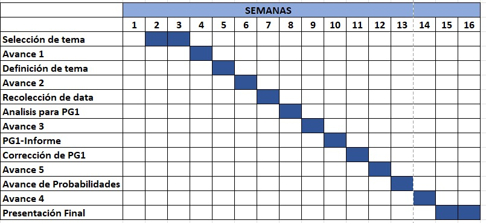
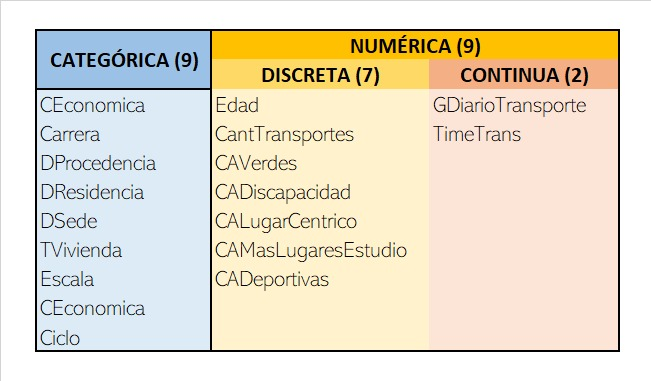

```{r, include=FALSE}
packages <- c(
    "knitr",
    "stringr",
    "ggthemes",
    "dplyr",
    "readr",
    "tidyverse",
    "corrplot",
    "modeest",
    "ggplot2",
    "car",
    "fitdistrplus",
    "tidyr"
    
)

missing.packages = packages[!(packages %in% rownames(installed.packages()))]

if (length(missing.packages) > 0) {
    install.packages(missing.packages)
}
lapply(packages, library, character.only = TRUE)
```

```{r}
datos <- read_csv("DataLimpia.csv")
```

# Introducción

## Relevancia

La construcción de una nueva sede para la universidad es una solución
para expandir su capacidad y permitir un crecimiento futuro. Además,
puede ser una oportunidad para establecer objetivos en la construcción
de espacios de aprendizaje innovadores y accesibles para todos. Una
nueva sede moderna y atractiva también puede mejorar la visibilidad y
reputación de la universidad, atrayendo a más estudiantes y profesores
talentosos y consolidándose como una de las mejores opciones educativas
en la región.

## Objetivos

1.  Determinar entre los 3 distritos más votados donde se podría
    construir una nueva sede de la UTEC.
2.  Identificar cuales serian los beneficios de la nueva sede y como
    afectaria a los alumnos.
3.  Identificar las estructuras o areas que podría tener la nueva sede
    para los alumnos, para sus acividades diarias.

## Planificación

Según lo expresado, el proyecto fue diseñado teniendo en cuenta el plan
de estudios y las instrucciones proporcionadas en clase. Esto sugiere
que se siguió un enfoque estructurado y organizado para desarrollar el
proyecto.



# Datos

## Proceso de recoleccion de datos

En la
[encuesta](https://docs.google.com/forms/d/e/1FAIpQLSfkRdQ-RcGIb_UFy9kyGnpayPxAZ46nk-ktNSo_JDov-0c8HQ/viewform)
realizada se utilizaron métodos digitales y presenciales para difundir
la encuesta y se logró recolectar un total de 157 respuestas. Esto se
logró compartiendo el enlace directo y el código QR de la encuesta, así
como difundiendo la encuesta por medios digitales y en persona con los
encuestados dentro del campus.\

## Población, muestra y muestreo

**Población:** La población objetivo de este estudio son todos los
estudiantes de pregrado que se encuentran actualmente matriculados en el
semestre 2023-1 en "UTEC".

**Muestra:** La muestra obtenida para este estudio consta de 157
alumnos, lo que indica que se ha obtenido una muestra representativa y
adecuada para lograr el análisis de los datos con un buen nivel de
precisión y confiabilidad

**Muestreo:** El muestreo es de tipo aleatorio simple.

## Variables

{width="444"}

# Análisis descriptivo

## Exploración de variables:

### **1. Variables numéricas:**

Usamos medidas de tendencia central y dispersión.

```{r}
# Medidas de tendencia central y dispersión para las variables numéricas
print("summary(datos$Edad)")
summary(datos$Edad)
print("summary(datos$GDiarioTransporte)")
summary(datos$GDiarioTransporte)
print("summary(datos$CantTransportes)")
summary(datos$CantTransportes)
print("summary(datos$CantTransportes)")
summary(datos$TimeTrans)
```

-   Para analizar las calificación por los espacios la nueva sede.

```{r}
#Calificación de los espacios de áreas verdes y para discapacitados:
## Calificación promedio de los espacios de áreas verdes
mean(datos$CAVerdes)

# Calificación promedio de los espacios para discapacitados
mean(datos$CADiscapacidad)

# Tabla de frecuencia de la preferencia de ubicación de los estudiantes según la calificación de los espacios de áreas verdes
table(datos$DSede, datos$CAVerdes)

# Tabla de frecuencia de la preferencia de ubicación de los estudiantes según la calificación de los espacios para discapacitados
table(datos$DSede, datos$CADiscapacidad)

### Calificacion lugara centrico y lugares de estudio
# Calificación promedio de la ubicación céntrica
mean(datos$CALugarCentrico)

# Calificación promedio de los lugares de estudio
mean(datos$CAMasLugaresEstudio)
```

-   Tabla de frecuencia de la preferencia de ubicación de los
    estudiantes según la calificación de la ubicación céntrica.

```{r}
table(datos$DSede, datos$CALugarCentrico)
```

-   Tabla de frecuencia de la preferencia de ubicación de los
    estudiantes según la calificación de los lugares de estudio.

```{r}
table(datos$DSede, datos$CAMasLugaresEstudio)
```

[**Interpretación:**]{.underline}

-   **Edad:** La edad mínima es 16 años, la edad media es 19.37 años y
    la edad máxima es 25 años.

-   **GDiario:** El gasto diario en transporte tiene una media de 3.793
    soles y una desviación estándar elevada, lo que indica que hay una
    gran variabilidad en los datos.

-   **CantTransportes:** La cantidad de transportes utilizados por día
    tiene una media de 1.613, lo que sugiere que la mayoría de los
    estudiantes utiliza uno o dos transportes por día.

-   **TimeTrans**: El tiempo promedio de transporte es de 77.27 minutos,
    pero la desviación estándar es alta, lo que sugiere que hay una gran
    variabilidad en los datos.

-   **CAVerde, CADiscapacidad, CAMasLugaresEstudio y CALugarCentrico:**
    Los estudiantes consideran importante contar con espacios de áreas
    verdes y para discapacitados de buena calidad en la nueva sede.
    Además, una ubicación céntrica y una buena cantidad de lugares de
    estudio son aspectos relevantes.

-   Las dos tablas de frecuencia muestran la preferencia de ubicación de
    los estudiantes según la calificación de la ubicación céntrica y los
    lugares de estudio. En la primera tabla, se puede observar que la
    mayoría de los estudiantes encuestados prefieren las sedes ubicadas
    en los distritos de San Isidro y Barranco, que obtuvieron las
    calificaciones más altas en cuanto a ubicación céntrica. En la
    segunda tabla, se observa una preferencia similar por las sedes
    ubicadas en San Borja y San Isidro, que obtuvieron las
    calificaciones más altas en cuanto a lugares de estudio.

### **2. Variables categoricas:**

Usamos tablas de frecuencia.

```{r}
# Tablas de frecuencia para las variables categóricas
table(datos$Carrera)
table(datos$Ciclo)
table(datos$DProcedencia)
table(datos$DSede)
table(datos$DResidencia)
```

**Interpretación:**

-   **Carrera**: Hay un número diferente de estudiantes en cada carrera,
    con Ingeniería Industrial siendo la carrera con mayor cantidad de
    estudiantes (30).

-   **Ciclo**: La mayoria de los alumnos encuestados son de ciclos
    medios (2do, 3ero y 4to).

-   **DProcedencia:** La mayoría de los estudiantes encuestados (109)
    provienen de Lima Metropolitana o Callao, mientras que 41 provienen
    de provincias.

-   **DSede:** La tabla de frecuencia muestra que la mayoría de los
    estudiantes encuestados prefieren que la nueva sede de UTEC se
    ubique en San Isidro (51), seguido por San Borja (37), Jesús María

    (17) y Miraflores (15), entre otros distritos.

-   **DResidencia:** Los estudiantes encuestados residen en diversos
    distritos de Lima Metropolitana y Callao, siendo San Isidro y
    Barranco los distritos con mayor cantidad de estudiantes encuestados
    (ambos con 17), seguidos por Santiago de Surco (19) y Jesús María
    (4).

## Visualización de datos:

```{r}
# Gráficos para visualizar la distribución de los datos
hist(datos$Edad)
boxplot(datos$Ciclo)
hist(datos$GDiarioTransporte)
boxplot(datos$CantTransportes)
hist(datos$TimeTrans)
barplot(table(datos$Carrera))
barplot(table(datos$DProcedencia))
barplot(table(datos$DSede))
barplot(table(datos$DResidencia))
```

En general, estos resultados nos dan una idea de las características
generales del grupo de estudiantes y pueden ser útiles para tomar
nuestro estudio.

# Análisis probabilistico

```{r}
# Cargando los datos
data <- read.csv("DataLimpia.csv")
```

## Probabilidad empirica:

Las probabilidades empíricas son una forma de estimar la probabilidad de
que algo suceda basándose en datos que se han observado. Sin embargo,
estas estimaciones pueden no ser exactas y pueden variar dependiendo de
la información que se tenga disponible. Es importante tener en cuenta
que siempre existe cierta incertidumbre en cualquier predicción o
estimación de probabilidad.

Se eligieron dos variables (**DSede y DProcedencia**) porque ambas son
discretas y categóricas, lo que permite determinar fácilmente el espacio
de resultados teórico y calcular las probabilidades empíricas de cada
evento atómico.

Se eligieron estas dos variables porque son fáciles de analizar y pueden
proporcionar información útil sobre la composición de la población
encuestada.

Además, estas variables pueden ser interesantes para analizar la
composición de la población encuestada y cómo se distribuyen estas
características entre los encuestados.

### Analisis de la variable "DSede"

```{r}
# Espacio de resultados teórico para la DSede
espacio_Dsede <- unique(data$DSede)
# Probabilidades empíricas para la carrera
prob_empirica_DSede <- table(data$DSede)/length(data$DSede)
```

Al analizar la variable DSede, podemos determinar cuál es la carrera más
común entre los encuestados y cómo se distribuyen las diferentes
carreras en la población encuestada.

```{r}
# Imprimiendo los resultados
espacio_Dsede
prob_empirica_DSede
```

### Analisis de la variable "DProcedencia"

```{r}
# Espacio de resultados teórico para el lugar de procedencia
espacio_procedencia <- unique(data$DProcedencia)

# Probabilidades empíricas para el lugar de procedencia
prob_empirica_procedencia <- table(data$DProcedencia)/length(data$DProcedencia)
```

Al analizar la variable lugar de procedencia, podemos determinar de
dónde provienen la mayoría de los encuestados y cómo se distribuyen los
diferentes lugares de procedencia en la población encuestada.

```{r}
# Imprimiendo los resultados
espacio_procedencia
prob_empirica_procedencia
```

### Analisis general

Probabilidad empírica: Para calcular la probabilidad empírica de dos
variables, primero se necesita contar la frecuencia de cada combinación
de variables y luego dividirla por el número total de observaciones.

-   Contar frecuencias

    ```{r}
    tabla <- table(data$DSede, data$DProcedencia)
    tabla
    ```

-   Calcular probabilidad empírica

    ```{r}
    prob_empirica <- tabla / sum(tabla)
    prob_empirica
    ```

### Aplicación

Para presentar ejemplos de análisis de probabilidad empírica, se podría
calcular:

-   La probabilidad de que un estudiante sea de "Lima Metropolitana o
    Callao" y prefiera el distrito de "San Isidro" como nueva sede de
    UTEC.

    ```{r}
    # Probabilidad de que un estudiante sea de "Lima Metropolitana o Callao" y prefiera "San Isidro"
    prob_lima_sanisidro <- prob_empirica["san isidro", "Lima Metropolitana o Callao"]
    prob_lima_sanisidro
    ```

-   La probabilidad de que un estudiante sea de provincia y prefiera el
    distrito de "ate" como nueva sede de UTEC.

    ```{r}
    # Probabilidad de que un estudiante sea de provincia y prefiera Ate
    prob_provincia_ate <- prob_empirica["ate", "Provincia"]
    prob_provincia_ate
    ```

## Probabilidad condicional:

La probabilidad condicional es la probabilidad de que suceda un evento
A, sabiendo que ya ha ocurrido el evento B. Se calcula dividiendo la
probabilidad conjunta de los eventos A y B por la probabilidad del
evento B. Es decir, P(A\|B) = P(A y B) / P(B).

### Eventos dependientes e independientes

#### 1. Eventos dependientes

Un par de eventos que parece ser dependiente es la **cantidad de
transportes** que usa el encuestado para llegar a UTEC y el **gasto
aproximado diario en transporte**. Es probable que los encuestados que
usan más transportes para llegar a UTEC también tengan un gasto diario
más alto en transporte, lo que sugiere una relación entre los dos
eventos.

##### 1.1. Analisis de verificación de dependencia

Calculando la probabilidad condicional de la cantidad de transportes
dados los gastos diarios en transporte.

Se utiliza la función aggregate para calcular las probabilidades
condicionales y conjuntas correspondientes. Luego, compara la
probabilidad conjunta con el producto de las probabilidades individuales
para determinar si los pares de eventos son dependientes o
independientes.

```{r}
prob_condicional <- aggregate(data$CantTransportes, by = list(data$GDiarioTransporte), FUN = function(x) table(x)/length(x))

```

##### 1.2. Aplicación

Para el par de eventos dependientes, la cantidad de transportes que usa
el encuestado para llegar a UTEC y el gasto aproximado diario en
transporte:

\- La probabilidad de que el encuestado use 2 transportes dado que tiene
un gasto diario de transporte de S/10 es del 0.41.

\- La probabilidad de que el encuestado use 3 transportes dado que tiene
un gasto diario de transporte de S/10 es del 0.35.

\- La probabilidad de que el encuestado use 4 transportes dado que tiene
un gasto diario de transporte de S/10 es del 0.12.

```{r}
# Calcular probabilidades condicionales
prob_2_transportes <- data %>% 
  filter(GDiarioTransporte == 10) %>% 
  summarize(prob = mean(CantTransportes == 2))

prob_3_transportes <- data %>% 
  filter(GDiarioTransporte == 10) %>% 
  summarize(prob = mean(CantTransportes == 3))

prob_4_transportes <- data %>% 
  filter(GDiarioTransporte == 10) %>% 
  summarize(prob = mean(CantTransportes == 4))

# Imprimir resultados
prob_2_transportes$prob
prob_3_transportes$prob
prob_4_transportes$prob
```

##### 1.3. Conclusión

Estos resultados sugieren que hay una relación entre la cantidad de
transportes que usa el encuestado para llegar a UTEC y el gasto
aproximado diario en transporte, lo que indica que estos eventos son
dependientes.

#### 2. Eventos independientes

Un par de eventos que parecen ser independientes es la **carrera** a la
que pertenece el encuestado y el **lugar de donde procede**. No hay una
relación clara entre estos dos eventos, ya que los estudiantes de
cualquier carrera pueden proceder de Lima o de provincia.

##### 2.1. Analisis de eventos independientes

-   Calculando la probabilidad conjunta de la carrera y el lugar de
    procedencia

    ```{r}
    # Calculando la probabilidad conjunta de la carrera y el lugar de procedencia
    prob_conjunta <- aggregate(data$Carrera, by = list(data$DProcedencia), FUN = function(x) table(x)/length(x))
    ```

-   Probabilidad individual para la variable "Carrera"

    ```{r}
    prob_individual_carrera <- table(data$Carrera)/length(data$Carrera)
    prob_individual_carrera
    ```

-   Probabilidad individual para la variable "DProcedencia"

    ```{r}
    prob_individual_procedencia <- table(data$DProcedencia)/length(data$DProcedencia)
    prob_individual_procedencia
    ```

-   Probabilidad conjunta del productos de probabilidades individuales
    de las variable "Carrera" y "DProcedencia"

    ```{r}
    prob_conjunta_producto <- outer(prob_individual_carrera,prob_individual_procedencia)
    prob_conjunta_producto
    ```

Comparando la **probabilidad conjunta** con el **producto de las
probabilidades individuales**

```{r}
# Comparando la probabilidad conjunta con el producto de las probabilidades individuales
all.equal(prob_conjunta, prob_conjunta_producto)
```

##### 2.2. Aplicación

Para el par de eventos independientes, la carrera a la que pertenece el
encuestado y el lugar de donde procede, se encontro que:

-   La probabilidad conjunta de que el encuestado pertenezca a la
    carrera de Ingeniería Civil y proceda de Lima es del 0.06

-   La probabilidad individual de que el encuestado pertenezca a la
    carrera de Ingeniería Civil es del 0.113.

-   La probabilidad individual de que el encuestado proceda de Lima es
    del 0.726.

```{r}
# Calcular probabilidad conjunta
prob_conjunta <- data %>% 
  summarize(prob = mean(Carrera == "Ing. Civil" & DProcedencia == "Lima Metropolitana o Callao"))

# Calcular probabilidades individuales
prob_carrera <- data %>% 
  summarize(prob = mean(Carrera == "Ing. Civil"))

prob_procedencia <- data %>% 
  summarize(prob = mean(DProcedencia == "Lima Metropolitana o Callao"))

# Imprimir resultados
prob_conjunta$prob
prob_carrera$prob
prob_procedencia$prob
```

```{r}
prob_conjunta_productos <- outer(prob_carrera$prob,prob_procedencia$prob)
prob_conjunta_productos
```

Los resultados indican que la probabilidad conjunta de que el encuestado
pertenezca a la carrera de Ingeniería Civil y proceda de Lima es del
0.06, la probabilidad individual de que el encuestado pertenezca a la
carrera de Ingeniería Civil es del 0.113, y la probabilidad individual
de que el encuestado proceda de Lima es del 0.726. En comparación, el
producto de las probabilidades individuales es del 0.082, lo que sugiere
que no hay una relación clara entre estos dos eventos y que son eventos
independientes.

##### 2.3. Conclusión:

La comparación entre la probabilidad conjunta y el producto de las
probabilidades individuales sugiere que no hay una relación clara entre
estos dos eventos, lo que indica que son eventos independientes.

## Variables discretas:

Aqui podemos encontrar algunas variables discretas como lo son en el
estudio la variable edad y la variable cantidad de transportes.

1.  Variable Edad

[Construccion del ejemplo.]{.underline}

Se llega a un hipotético caso de que los padres de los menores de edad
son los que van a tomar las desiciones de la economía del hogar y
determinarán si les conviene seguir pagando los mismos pasajes. Por ende
se La edad puede proporcionar información sobre las necesidades y
requisitos de las personas en diferentes etapas de la vida. Por ejemplo,
los alumnos mayores pueden tener requisitos de accesibilidad o
comodidades específicas, mientras que los jóvenes pueden tener
necesidades relacionadas con la tecnología o el entretenimiento.
Comprender la edad de la población objetivo puede ayudar a diseñar la
nueva sede para satisfacer esas necesidades específicas. Se sabe que Los
alumnos más adultos[20 años - adelante] prefieren zonas con más
comodidad mientras que los estudiantes jóvenes [16 años -19 años] gustan
áreas más lúdicas o con relación con la tecnología.:

```{r}
XD <- data.frame(table(datos$Edad))
```

a)  Definir el tipo de distribución que se usará:

Determinamos que la cantidad de alumnos jóvenes son de 85 personas. por
el cual 85 son menores de edad y 65 son mayores de edad.

```{r}
CME <- XD[1,2] + XD[2,2] + XD[3,2] + XD[4,2]
print("Alumnos jóvenes")
CME
print("Alumnos adultos")
CAA <- sum(XD$Freq) - CME
CAA
```

Ubicamos su porcentaje de edad

```{r}
TOT <- sum(XD$Freq)
p_jovenes <- CME/TOT
print("Probabilidad de que sean alumnos jóvenes") 
p_jovenes
p_alum_mayores <- 1 - (p_jovenes)
print("Probabilidad de que sean alumnos adultos") 
p_alum_mayores
```

b)  Construccion de la densidad con la distribución binomial.

Se termina hallando que el 4.65% se inclinan mas por las comodidades que
por las tecnologías y viceversa.

```{r}
dbinom(70,TOT,p_alum_mayores)
dbinom(80,TOT,p_jovenes)
```

c)  Contrucción del grafico en función a la densidad.

```{r}
# Definir nuestros parámetros
k <- 0:100

# Calcular las probabilidades para cada valor de k utilizando dbinom
prob_alum_mayores <- dbinom(k, size = TOT, prob = p_alum_mayores)
prob_jovenes <- dbinom(k, size = TOT, prob = p_jovenes)

# Crear el gráfico de densidad
plot(k, prob_alum_mayores, type = "l", xlab = "Variable Aleatoria", ylab = "Densidad",
     main = "Gráfico de Densidad - Distribución Binomial", lwd = 2)
lines(k, prob_jovenes, col = "red", lwd = 2)
legend("topright", legend = c("Alumnos Mayores", "Alumnos Jóvenes"), col = c("black", "red"), lwd = 2)
```

2.  Variable "CantTransportes"

    [Construccion del ejemplo:]{.underline}

    Se debe realizar un estudio de cuánto es la probabilidad de que se
    haga uso de 15 o más transportes para llegar a UTEC semanalmente.

<!-- -->

a)  Hallar el promedio diario de uso de transportes.

```{r}
prom_trans <- mean(data$CantTransportes)
print(round(prom_trans))
```

Se hace una regla de 3 simple para poder identificar el valor promedio
de transportes usados en una semana. cant.horas prom.cantidad trans.\
24 \<-----------\> 2

24\**7 = 168 \<-----------\> x*

*x = (168\**2)/24

"x" ha sido identificada como la variable "SM" ("promedio de uso de
transportes por semana")

```{r}
SM <- round((168*round(prom_trans))/24)
SM
```

b)  Aplicación de distribución de Poisson

Se aplicó una distribución de Poisson, ya que se requiere contar el
número de veces que se produce dicho suceso aleatorio durante un periodo
determinado de tiempo, por lo que se decidió buscar La probabilidad de
uso de 15 o más transportes semanales.

```{r}
#La probabilidad de que usen 15 o más cantidad de transportes es de un 43%
prob <- round(ppois(14,SM,lower.tail=F),3) 
prob
```

```{r}
#El porcentaje resulta la variable prob * 100%
PP <- prob * 100
PP
```

Por lo tanto, la probabilidad de que de que usen 15 o más transportes es
de 43%. Por consiguiente se realiza el siguiente gráfico

```{r}
library(ggplot2)
# Se establece unos parámetros para ubicar mis variables
x <- 0:30
# Calculamos la densidad de probabilidad utilizando la función dpois
densidad <- dpois(x, SM)
# Establecemos un data frame con los valores de x y la densidad de probabilidad
df <- data.frame(x = x, densidad = densidad)
# Creamos el gráfico de densidad utilizando ggplot2
ggplot(df, aes(x, densidad)) +
  geom_line(color = "blue", size = 1) +
  geom_vline(xintercept = 15, linetype = "dashed", color = "red") +
  labs(x = "Cantidad de transportes", y = "Densidad de probabilidad") +
  ggtitle("Distribución de Poisson - Uso de transportes semanales") +
  theme_minimal()
```
En conclusión: Luego de dichos análisis se tiene una densidad considerable de alumnos jóvenes que prefieren las comodidades que brinda la nueva sede como, las zonas de recreación como las áreas verdes, áreas deportivas, etc. Por consiguiente se tiene una distribución de Poisson para controlar la probabilidad de que se usen más de 15 transportes semanalmente es de 14.6% dentro del estudio realizado con el fin de verificar y controlar el total de gastos diarios o semanales que se manejan para proceder con una reducción de gasto.


## Variables continuas:

Para el estudio de las variables continuas "GDiarioTransporte" y
"TimeTrans".

1.  Calcularemos la esperanza y la variación con la distribución normal.

```{r}
# Calcular la Esperanza(E) y la Varianza(V) para GDiarioTransporte 
   
    # 1) GDiarioTransporte
    Media1 <- mean(data$GDiarioTransporte)
    Desviación1 <- sd(data$GDiarioTransporte)
    maximo1 <- max(data$GDiarioTransporte)
    minimo1 <- min(data$GDiarioTransporte)
    
    #Esperanza
    EGD <- Media1
    EGD
    
    #Variación
    VGD <- (Desviación1)^2
    VGD
```

```{r}
# Calcular la Esperanza(E) y la Varianza(V) para  TimeTrans    
    # 2)TimeTrans
    Media2 <- mean(data$TimeTrans)
    Desviacion2 <- sd(data$TimeTrans)
    maximo2 <- max(data$TimeTrans)
    minimo2 <- min(data$TimeTrans)
    
    #Esperanza
    ETT <- Media2
    ETT
    
    #Variación
    VTT <- (Desviacion2)^2
    VTT
```

2.  Implementar un ejemplo para cada variable

```{r}
 # 1) Ejemplo para GDiarioTrans

  #Para el GDiarioTrans indicaremos cual es la probabilidad de que las personas gasten más de 50 soles.
  probabilidad1 <- (pnorm(50,Media1,Desviación1,lower.tail=F))
  probabilidad1*100
  
```

```{r}
# 2) Ejemplo para TimeTrans

  #Para el TimeTras indicaremos cual es la probabilidad de que las personas se demoran más 60 minutos en llegar a la Utec.
  probabilidad2 <- (pnorm(60,Media2,Desviacion2,lower.tail=F))
  probabilidad2*100
```

3.  Implemetar el grafico de la densidad de la distribución normal

-   Grafico de la densidad de la distribucion normal de GDiarioTrans

    ```{r}
      # 1) Calcular la densidad de las variables.
      # 2) Crear una Grafica de la densidad de la distribucion normal 

        # Densidad de GDiariTrans
        x1 <- seq(-maximo1,maximo1,length.out = 150)
        densidad1 <- dnorm(x1,Media1,Desviación1)
      
        #Grafico de la densidad de la distribucion normal de GDiarioTrans
        
        df <- data.frame(x = x1, densidad = densidad1)
        ggplot(df, aes(x = x, y = densidad)) +
          geom_line() +
          labs(title = "Densidad de la Distribución Normal de GDiarioTrans",
               x = "Variable Aleatoria",
               y = "Densidad") +
          theme_minimal()
    ```

-   Grafico de la densidad de la distribucion normal de TimeTrans

    ```{r}
      # 1) Calcular la densidad de las variables.
      # 2) Crear una Grafica de la densidad de la distribucion normal 
        # Densidad de TimeTrans
        x2 <- seq(-maximo2,maximo2,length.out = 150)
        densidad2 <- dnorm(x2,Media2,Desviacion2)
     
        #Grafico de la densidad de la distribucion normal de TimeTrans
        
        df <- data.frame(x = x2, densidad = densidad2)
        ggplot(df, aes(x = x, y = densidad)) +
          geom_line() +
          labs(title = "Densidad de la Distribución Normal de TimeTrans",
               x = "Variable aleatoria",
               y = "Densidad") +
          theme_minimal()
    ```

En clusión, para el caso de las variables continuas, para la variable de GDiarioTrans se puede afirmar que al calcular la probabilidad se define que el 0.147% gasta más de 50 soles. Para el caso de la variable Time Trans que al calcular la probabilidad se define que más del 65% se demora más de 60 minutos

# Conlusiones generales:

La encuesta realizada proporcionó información valiosa sobre las
características de los estudiantes encuestados y sus preferencias en
cuanto a la ubicación y las características de los espacios en la nueva
sede de la universidad.

En cuanto a las variables de transporte, se encontró que la mayoría de
los estudiantes utiliza uno o dos transportes por día, y que el tiempo
promedio de transporte es de 77.27 minutos, aunque hay una gran
variabilidad en los datos. Además, se encontró que el gasto diario en
transporte varía ampliamente entre los estudiantes encuestados.

En cuanto a las preferencias de ubicación, se encontró que la mayoría de
los estudiantes prefieren una ubicación céntrica para la nueva sede de
la universidad. En cuanto a las características de los espacios verdes y
para discapacitados, se encontró que los estudiantes otorgan una
calificación promedio alta a ambos tipos de espacios.

Para determinar los distritos más votados donde se podría construir una
nueva sede de la UTEC, se encontró que los distritos de San Borja y San
Isidro fueron los más preferidos por los estudiantes encuestados en
cuanto a la calidad de los espacios de áreas verdes y para
discapacitados. Además, en cuanto a la ubicación céntrica y los lugares
de estudio, los estudiantes también prefirieron las sedes ubicadas en
San Isidro y Barranco.

Para identificar los beneficios de la nueva sede y cómo afectaría a los
alumnos, se puede considerar que la ubicación en un distrito con alta
calidad de espacios verdes y para discapacitados puede mejorar la
calidad de vida y el bienestar de los estudiantes. Además, la ubicación
céntrica y cercana a lugares de estudio puede facilitar el acceso y el
desplazamiento de los estudiantes.

Para identificar las estructuras o áreas que podría tener la nueva sede
para los alumnos, para sus actividades diarias, se puede considerar que
se deben incluir espacios verdes y para discapacitados de alta calidad,
así como áreas comunes y espacios de aprendizaje innovadores y
accesibles. Además, se debe tener en cuenta la ubicación céntrica y
cercana a lugares de estudio para facilitar el acceso y el
desplazamiento de los estudiantes.

En conclusión, el análisis descriptivo y probabilístico realizado
proporciona información valiosa sobre las características de los
estudiantes encuestados y sus preferencias en cuanto a la ubicación y
las características de los espacios en la nueva sede. Los resultados
muestran que los estudiantes prefieren una ubicación céntrica y otorgan
una calificación alta a los espacios de áreas verdes y para
discapacitados. Además, se identificó que los distritos de San Borja y
San Isidro son los más preferidos por los estudiantes para la ubicación
de la nueva sede. Estos resultados pueden ser útiles para guiar futuras
investigaciones y planes de desarrollo, y para tomar decisiones
informadas sobre la ubicación y las características de la nueva sede de
la universidad.
