TEMA:**"ANÁLISIS ESTADÍSTICO DEL VALOR NUTRICIONAL DE LAS COMIDAS QUE OFRECEN LOS RESTAURANTES CON FRANQUICIAS DE COMIDA RÁPIDA"**

{width=50%}

# INTRODUCCIÓN

**Objetivos:**
 -  Analizar el aporte nutricional que contienen los menús de 8 restaurantes de comida rápida (Mcdonalds, Chick ,Fil-A, Sonic, Arbys, Burger King, Dairy Queen, Subway y Taco Bell)con el fin de determinar la cantidad de nutrientes que se ofrecen a los clientes, mediante el  análisis estadístico de la información nutricional de los menús.
 
>Identificar el restaurante con mayor contenido calórico    en sus platillos.
> Identificar el restaurante ( o restaurantes) que  sus platillos sobrepasen los valores saludables de grasa saturadas, grasas trans y sodio (octógonoos).
>Comparar los resultados del aporte de colesterol que se presentan en los platos de cada restaurante, para determinar qué restaurante brinda alimentos con menos presencia de colesterol.
  
**Relevancia**
- El estudio nutricional de las comidas rápidas es un tema de interés común porque su consumo es muy frecuente en las personas, incluyendo a los estudiantes universitarios de la UTEC. En este sentido buscamos evaluar el aporte calórico y energético que brindan las comidas instantáneas en los 8 restaurantes más conocidos y así categorizarlos de acuerdo a su aporte nutricional.


# ANÁLISIS DESCRIPTIVO


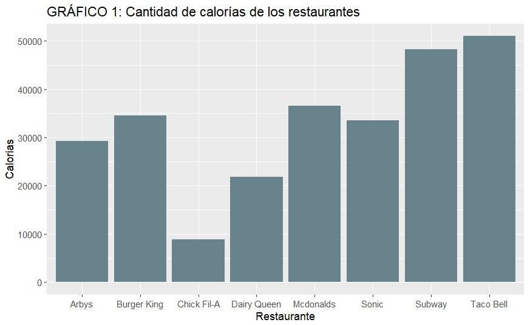{width=50%}
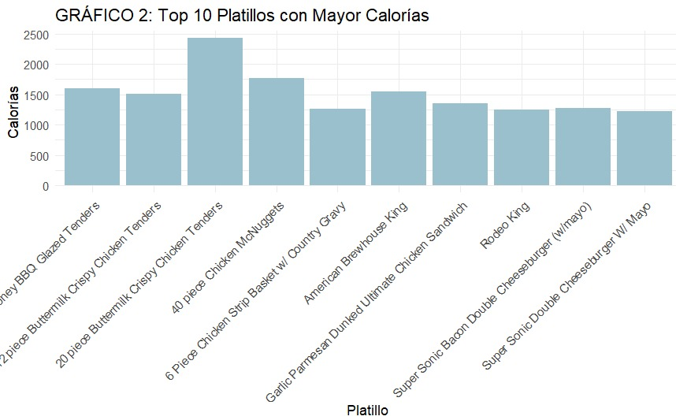{width=50%}


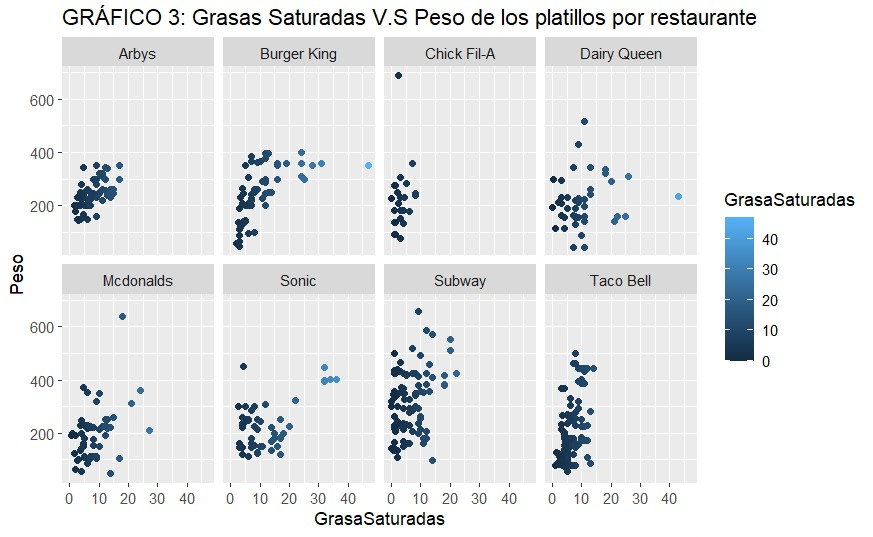{width=50%}
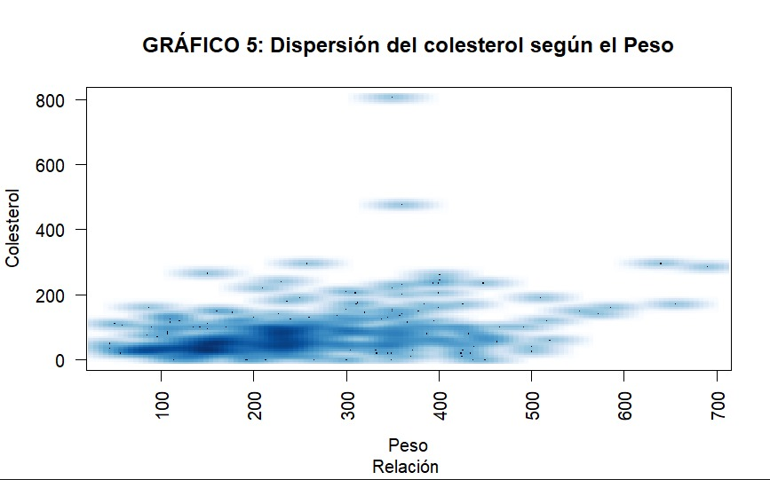{width=50%}

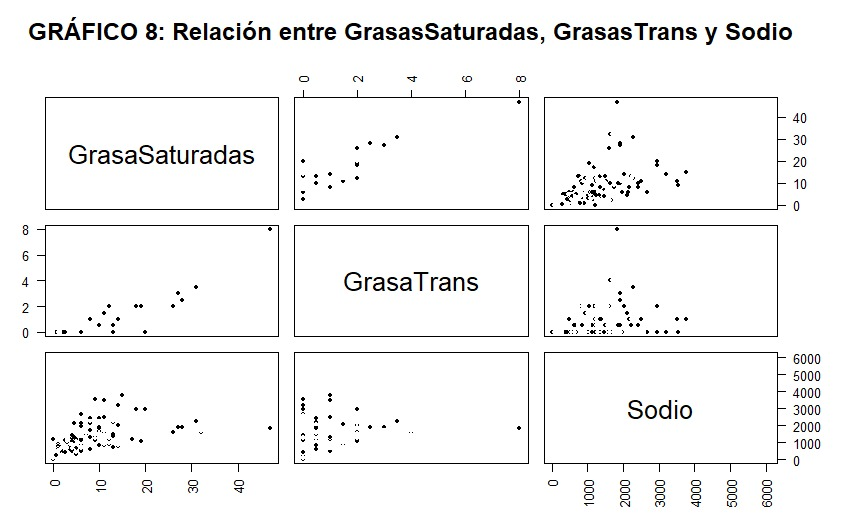{width=50%}

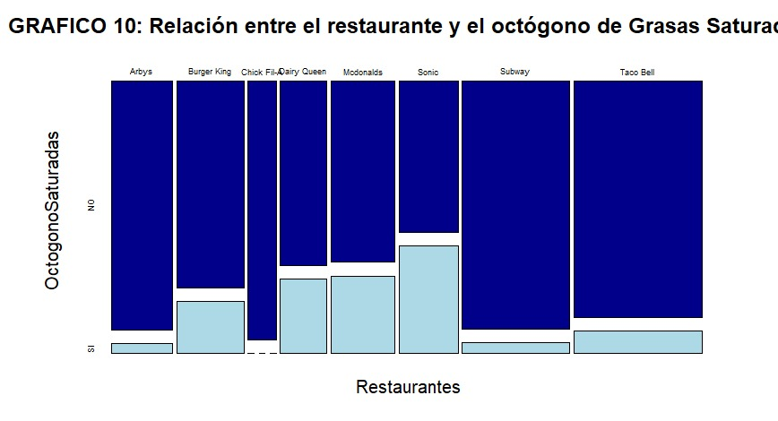{width=50%}

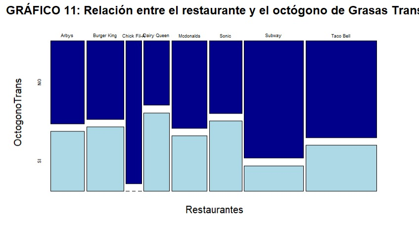{width=50%}
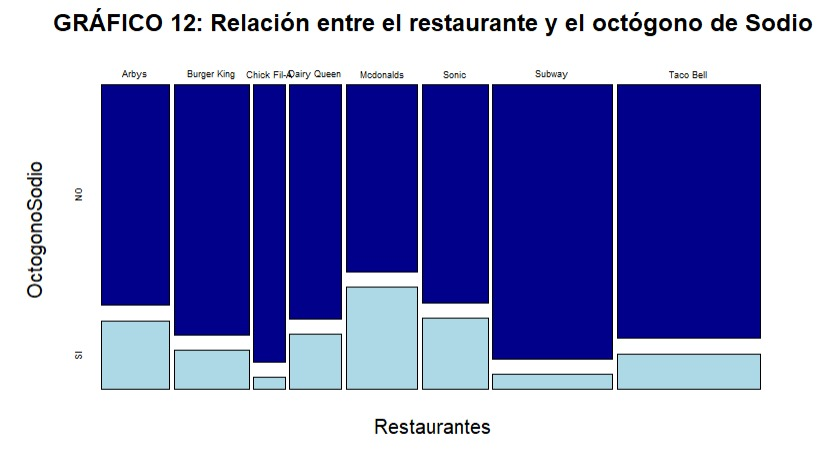{width=50%}


# PROBABILIDAD EMPÍRICA

Analizamos las variables de SODIO y RESTAURANTES
```{r}
#                                                   SODIO 
#De acuerdo al **INACAL** un producto se conisdera alto en sodio cunado es igual o soprepasa los 800mg por cada 100 gramo de producto sólido.

# EXPERIMENTO ALEATORIO: Sacar al azar un platillo de la muestra total coyo valor nutricional en Sodio sobrepase los valores reocmenados( valor saludable)

# ESPACIO MUESTRAL:
#        Ω = [SI, NO]
#SI:La cantidad de unidades muestrales que pasan los gramos de sodio de manera saludable (tienen más de 800mg de sodio por cada 100gm de producto)
#NO: La cantidad de unidades muestrales que no pasan los gramos de sodio de manera saludable(tienen menos de 800gm de sodio por cada 100gm de producto)

#LA FUNCIÓN DE PROBABILIDAD DE LOS EVENTOS ATÓMICOS:
#             P(A)=Casos~Favorables/Casos Totales


#¿cual es la probalidad que se si escogemos un platillo alzar contenga una cantidad de sodio que sobrepase lo saluables?
#0.163

#¿cual es la probalidad que se si escogemos un platillo alzar contenga una cantidad de sodio que no sobrepase lo saluables?
# 0.837

```

```{r}
#                                                   GRASAS SATURADAS 
#De acuerdo al **INACAL** un producto se conisdera alto en sodio cunado es igual o soprepasa los 800mg por cada 100 gramo de producto sólido.

# EXPERIMENTO ALEATORIO: Sacar al azar un platillo de la muestra total coyo valor nutricional en Sodio sobrepase los valores reocmenados( valor saludable)

# ESPACIO MUESTRAL:
#       Ω = [Arbys, Burger King, Chick Fil-A, Dairy Queen, Mcdonalds, Sonic, Subway, Taco Bel]

# A: Son los platos del Restaurante Arbys para el Análisis
# B: Son los platos del Restaurante Burger King para el Análisis
# C: Son los platos del Restaurante Chick Fil-A para el Análisis
# D: Son los platos del Restaurante Dairy Queen para el Análisis
# C: Son los platos del Restaurante Mcdonalds para el Análisis
# S: Son los platos del Restaurante Sonic para el Análisis
# W: Son los platos del Restaurante Subway para el Análisis
# t: Son los platos del Restaurante Taco Bell para el Análisis

#LA FUNCIÓN DE PROBABILIDAD DE LOS EVENTOS ATÓMICOS:
#             P(A)=Casos~Favorables/Casos Totales


# ¿cual es la probalidad de sacar un platillo al azar y que este pertenezca al restaurante de Mcdonals?
# 0.1133201


```


# PROBABILIDAD CONDICIONAL:

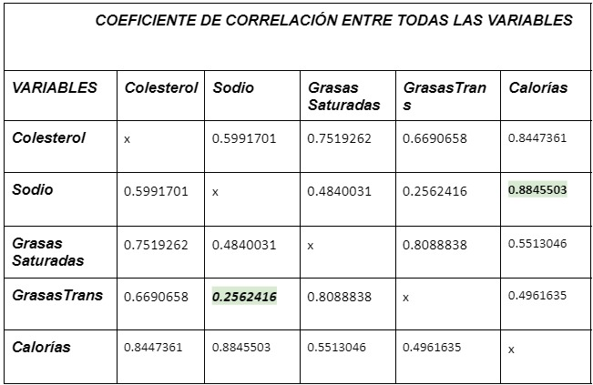{width=40%}


Escojimos Sodio y Calorias por su alta correlacion de 0.8845503

```{r}
#                                           EVENTOS DEPENDIENTES
 
# Evento A =  Seleccionar un platillo de comida cuyo número de calorías es mayor o igual a 275
# Evento B =  Seleccionar un platillo de comida que tenga  un octógono en sodio..

#Fórmula 
#                    P(A ∩ B) = P(A)P(B)

#Intersección

#P(A ∩ D) = 0.1451292

#P(A) = 0.3001988

#P(B) = 0.1630219

#P(A)*P(B) =  0.04893897

#con la fórmula     P(A ∩ D) ≠ P(A)*P(B) 

#  La fórmula no se cumple por lo tanto los eventos son Dependientes.
```

_Escojimos Sodio y Grasa Trans por baja correlacion de 0.256
```{r}
#                                          EVENTOS INDEPENDIENTES

#Verificamos con la propiedad para independencia de eventos*
 
#Evento A =  Seleccionar un platillo de comida que tenga un octógono en Grasas Trans.
#Evento B =  Seleccionar un platillo de comida que tenga un octógono en Sodio.

#Fórmula 
#               P(A ∩ B) = P(A)P(B)

#Intersección

#P(A ∩ D) = 0.08349901

#P(A) = 0.3002

#P(B) = 0.163

#P(A)*P(B) = 0.0489326

#P(A ∩ D) ≠ P(A)*P(B)

#La fórmula no se cumple, pero la variación es muy pequeña  por lo tanto los eventos son Independientes.
```


# ANÁLISIS DE VARIABLES CONTINUAS

**descripción para la variable Grasas saturadas**

_Definir la distribución a usar:


 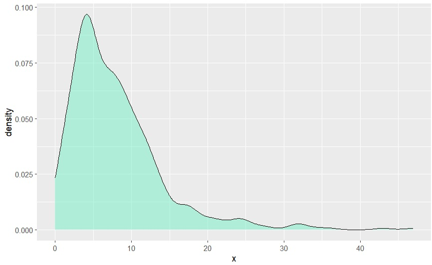{width=40%}

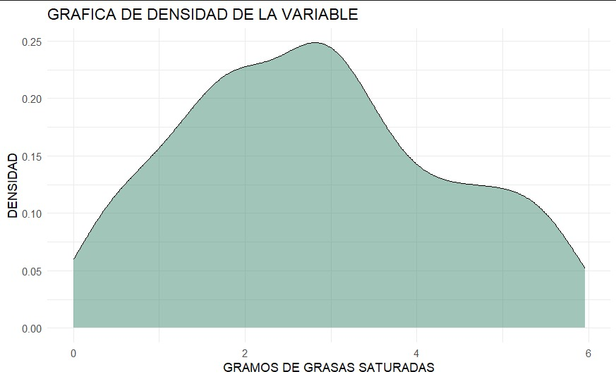{width=40%}

 **Distribución normal**
 
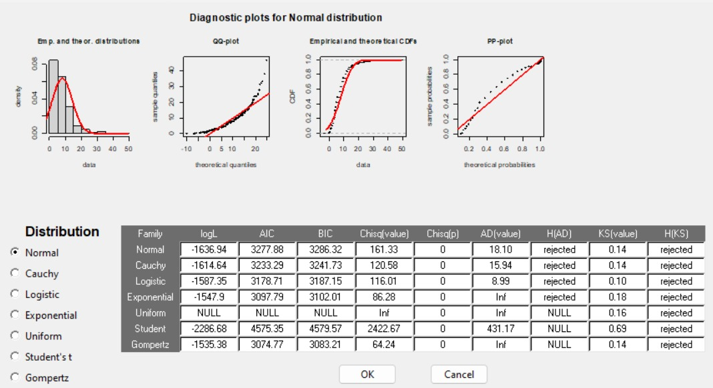{width=40%} 


```{r}
# **X --> Cantidad de grasas saturadas con un contenido menor igual a 6g**
# validamos las propiedades:
# Media(X)    =    Mediana(X)
# 2.806005       2.749145
# var(X)         =   sd^2
# 2.312302       2.312302
# E(X)        =   Media
# 2.806005       2.806005
# Parámetros: µ-> media aritmética 2.8     ;    σ^2--> desviación estándar:1.51
# **X** ~ N(μ.=2.81,σ=1.51)
```
**ejemplo**
```{r}
#Suponga que la cantidad saludable de grasas saturadas en un platillo de comida rápida se #distribuye normalmente con una media de 2.81 y una desviación stándar de 1.51.

#a) qué probabilidad hay de que la cantidad saludable de grasas saturadas presentes en un #platillo de comida rápida supere los 2gramos de presencia en un mes.
```

```{r}
1-pnorm(2,2.81,1.51)
```

#
 **descripción para la variable Grasas Trans**
 
 
 
 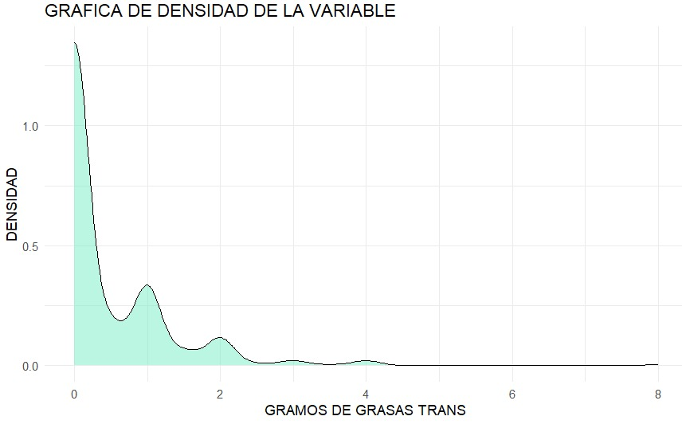{width=40%}
 
 
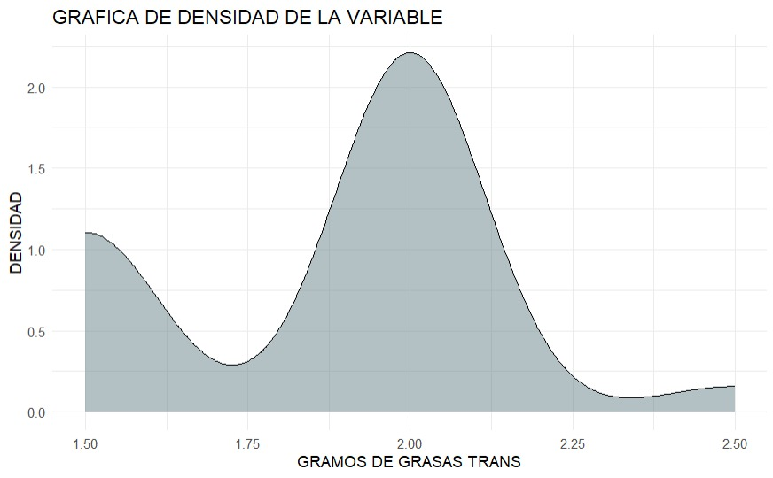{width=40%}


```{r}
# **X --> **X --> Cantidad de grasas trans en un rango de [1.3:2.5]**
# validamos las propiedades:
# Media(X)    =    Mediana(X)
#  1.86               2
# var(X)      =     sd^2
#  0.07              0.07
# E(X)        =    Media
#  1.86             1.86  
# Parámetros: µ-> media aritmética 1.86     ;    σ^2--> desviación estándar:0.27
# > **X** ~ N(μ.=1.86,σ=0.27)> 
```
**ejemplo**
```{r}
#La presencia de grasas trans de entre 1.3 a 2.5 gramos que se pueden encontarr  en un platillo de comida rápida se distribuye normalmente con una media de 1.86 y una desviación stándar de 0.27.

#a) qué probabilidad hay de que la cantidad de presencia de grasas trans en un platillo de comida rápida supere 1g de presencia en un mes.
```

```{r,echo = FALSE}
1-pnorm(1,1.86,0.27)
pnorm(1,1.86,0.27, lower.tail=F)

```


# ANÁLISIS DE VARIABLES DISCRETAS


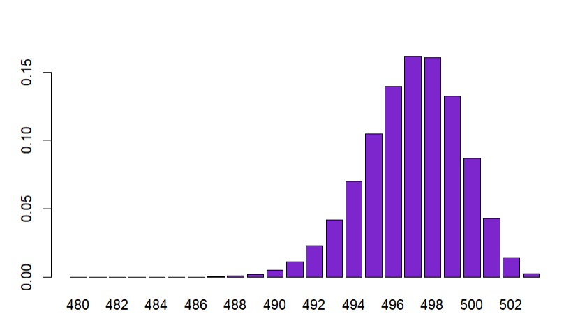{width=40%}


```{r}
#                           VARIABLE ALTO en COLESTEROL
#FALSE  TRUE 
#0.99  0.01


# **Identificar Parametros**
#X ~ Ber(P(e)); Donde P(e) representa la probabilidad de que sea un plato tenga alto colesterol (>160g)
#Entonces nuestra distribucion bernulli es la siguiente:

#                          Ber(0.01)

# **Validar Propiedades**
#Esperanza de bernulli
# Matematicamente es : E(X) = np ; donde n = # platillos; p = #

#round(pBER,2)                                             Rpta:  0.01
#round(mean(rbinom(10000,1,pBER)),2)                       Rpta:  0.01
#
# **Varianza de bernulli**

#round(pBER*(1-pBER),2)                                    Rpta:  0.01
#round(var(rbinom(10000,1,pBER)),2)                        Rpta:  0.01

# **Ejemplo**
# Cual es la probabilidad de que un plato no sea alto en colesterol?

#dbinom(0,1,0.01)                                          Rpta: 0.99

```


# Conclusiones

- Dado el estudio de correlación de las variables más importantes GrasasSaturadas, GrasasTrans, Sodio y Colesterol podemos decir que con una alta correlación tienden a ser dependientes. Además se identificaron que la presencia de calorías en un platillo, aseguran en un 89% una alta presencia de Sidio, así como también una alta presencia de Colesterol.

- Al analizar las variables numéricas continuas se puede ver que grasas trans tiene una asimetría positiva y su mayor concentración esta  entre el rango de 0 y 3g, por lo que podemos  concluir que la mayoría de los platillos se encuentran en ese rango. Asimismo para la variable grasas saturadas la mayor concentración se encuentra entre 0 y 25 gramos del máximo valor que es 47 g, se llega a la conclusión que la mayoría de platillos sobrepasan los valores saludables recomendados que es menor o igual a 6 gramos.

- Analizando la Variable discreta colesterol nos podemos dar cuenta que solo 1% de los platillos cuentan con el alto colesterol por lo que se llega a concluir que el 99% de los platos ofrecidos en los 5 restaurantes de comida rapida cuentan con un colesterol saludable.


