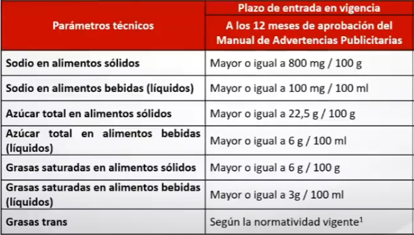
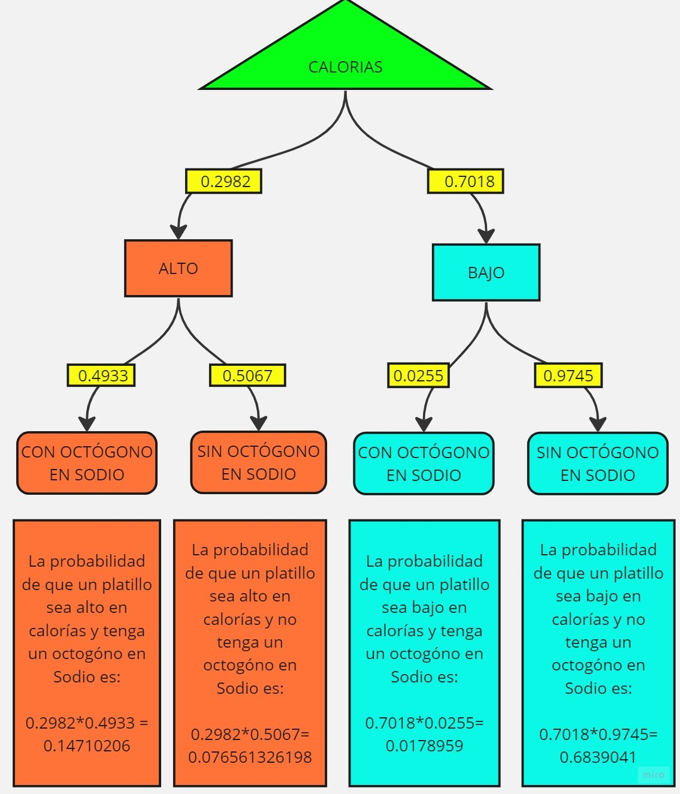
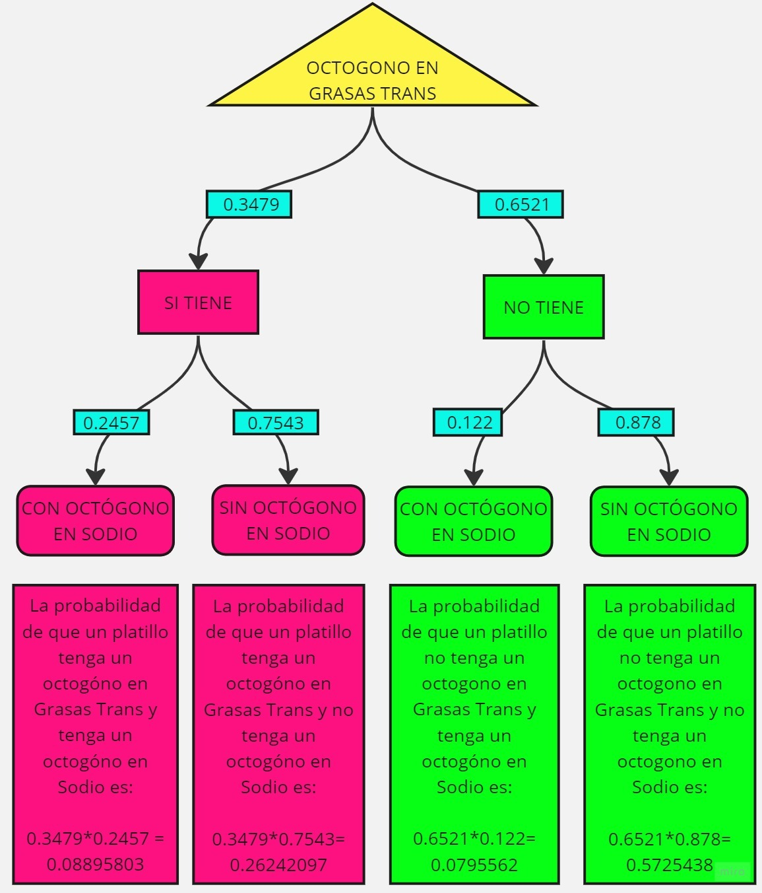

>
>
>
> ### **INDICE**
>
> - _**Introduccón:**_ 
>     - Relevancia del tema escogido
>     - Objetivos
>     - Factibilidad
>     - Contexto
> - _**Datos:**_
>     - Población, muestra y muestreo
>     - Definición de las Variables
> - _**Análisis descriptivo**_
> - _**Probabilidad Empírica**_
> - _**Probabilidad Condicional**_
> - _**Estudio de variables Discretas**_
> - _**Estudio de variables Continuas**_
> - _**Conclusión**_ 
> - _**Bibliografía**_
>_______________________________________________________________________________
>
>
>
>
> ### **1. INTRODUCCIÓN: **
>
> #### _**1.1 RELEVANCIA**_
>
>-   El estudio nutricional de las comidas rápidas es un tema de interés común porque su consumo es muy frecuente en las personas, incluyendo a los estudiantes universitarios de la UTEC. En este sentido buscamos evaluar el aporte calórico y energético que brindan las comidas instantáneas en los 8 restaurantes más conocidos y así categorizarlos de acuerdo a su aporte nutricional.
>
> #### _**1.2 OBJETIVOS**_
>
> #####  OBJETIVO GENERAL
>    -  Analizar el aporte nutricional que contienen los menús de 8 restaurantes de comida rápida (Mcdonalds, Chick Fil-A, Sonic, Arbys, Burger King, Dairy Queen, Subway y Taco Bell)con el fin de determinar la cantidad de  nutrientes que se ofrecen a los clientes, mediante el  análisis estadístico de la información nutricional de  los menús.
>    
> ##### OBJETIVOS ESPECÍFICOS
>
>    - Identificar el restaurante con mayor contenido calórico  en sus platillos.
>
>    - Identificar a los 10 platillos con mayor aporte  calórico
>  
>    - Identificar el restaurante ( o restaurantes) que  sus platillos sobrepasen los valores saludables de grasa saturadas, grasas trans y sodio (octógonoos).
>  
>    - Comparar los resultados del aporte de colesterol que se presentan en los platos de cada restaurante, para determinar qué restaurante brinda alimentos con menos presencia de colesterol.
>   
>    
>
>
> #### _**1.3 FACTIBILIDAD**_
>
>-   Un estudio realizado por INNOVARE revista de Ciencia y Tecnología a cargo de Alexandra María Cáceres Aguilar muestra cómo la insdustrialización alimentaria ha generado un desequilibrio en la ingesta calórica [INNOVARE](https://www.camjol.info/index.php/INNOVARE/article/view/11406). Bajo este estudio, se busca evaluar a 8 conocidos restaurantes de comida rápida.
>
>
> #### _**1.4 CONTEXTO**_
>-   La comida rápida es popular y ampliamente consumida debido a su conveniencia, precio accesible y sabor atractivo. Sin embargo, suele tener una alta densidad calórica, grasas saturadas, sodio y azúcares añadidos, y baja calidad nutricional en general. Los datos anteriormente mencionados son parte de la dieta diaria y cada uno aporta un valor nutricional que ayuda a un perfecto funcionamiento de nuestro organismo, siempre y cuando sean consumidos respetando una cantidad recomendada saludable para nuestro organismo.
>Por su impacto en la salud, se investiga y evalúa la composición nutricional de la comida rápida de algunos restarantes que ofrecen estas comidas, analizando sus nutrientes como calorías, grasas, proteínas, carbohidratos,etc.
Estos estudios informan sobre los riesgos del consumo excesivo de comida rápida, y proporcionan datos para políticas de salud pública y regulaciones alimentarias.
>
> ### **2. DATOS: **
>
> ##### _**2.1 RECOLECCIÓN DE DATOS**_
>A diferencia de la mayoría de los grupos nosotros nos dedicamos a buscar una base de datos, en lugar de encuestar, y tuvimos la suerte de poder encontrar una base de datos bastante completa en la página web kagle con 515 observaciones y 17 variables. Pero tuvimos que agregar una variable más, por lo cual estuvimos investigando el peso de cada plato de comida que finalmente se incorporó en rstudio
>
> ##### _**2.2 POBLACIÓN. MUESTRA Y MUESTREO**_
>La ventaja de obtener una base de datos es que se puede identificar fácilmente la población y muestra. En nuestro la población viene a ser todos los restaurantes de comida rápida, y de esta cogimos una muestra de 8 restaurantes, los cuales vienen a ser los más comunes a la hora de comer comida rápida. Esta muestra nos presenta los 8 restaurantes y cada uno de los platos de comida junto con sus valores nutricionales de los cuales planeamos usar el grasas saturadas, sodio, grasas trans y peso. Por lo que hemos usado un muestreo deliberado para poder eliminar las comidas que no poseen valores en alguna de estas 3 variables ya mencionadas.
>
> ##### **2.3 DEFINICIÓN DE LAS VARIABLES**
> 
> ###### _**2.3.1. VARIABLES NUMÉRICAS**_ 
> 
>
>+------------------------+--------------+--------------------+------------------------------------------------------+
>| **Variable**           | **Tipo**     |**Restricción**     | **Descripción**                                      |
>+------------------------+--------------+--------------------+------------------------------------------------------+
>|                        |              |                    | La cantidad de calorias contenidas por platillo      |
>| calorías               | Discreta     | Entero positivo    | medido en calorias(cal).                             |
>|                        |              |                    |                                                      |
>+------------------------+--------------+--------------------+------------------------------------------------------+
>|                        |              |                    | La cantidad de calorias de grasa contenidas por      |
>| CaloriasDEgrasas       | Discreta     | Entero positivo    | platillo, medido en calorias(cal).                   |
>|                        |              |                    |                                                      |
>+------------------------+--------------+--------------------+------------------------------------------------------+
>|                        |              |                    | La cantidad de grasa total contenidas por presente   |
>| GrasaTotal             | Discreta     | Entero positivo    |en cada platillo, y está medido en gramos(gm).        |
>|                        |              |                    |                                                      |
>+------------------------+--------------+--------------------+------------------------------------------------------+
>|                        |              |                    | La cantidad de grasas saturadas que tiene un         |
>| GrasaSaturadas         | Continua     | Natural positivo   | platillo, medido en gramos (gm).                     |
>|                        |              |                    |                                                      |
>+------------------------+--------------+--------------------+------------------------------------------------------+
>|                        |              |                    | La cantidad de grasas tras que tiene un platillo     |
>| Grasa trans            | Continua     | Natural positivo   | medido en gramos (gm).                               |
>|                        |              |                    |                                                      |
>+------------------------+--------------+--------------------+------------------------------------------------------+
>|                        |              |                    | La cantidad colesterol que tiene un cada platillo    |
>| Colesterol             | Discreta     | Entero positivo    | que ofrecen los restaurantes,medido en miligramos(mm)|
>|                        |              |                    |                                                      |
>+------------------------+--------------+--------------------+------------------------------------------------------+
>|                        |              |                    | La cantidad de sodio presente en cada uno de los     |
>|Sodio                   | Discreta     | Entero positivo    | los platillos y está medido en miligramos (mm).      |
>|                        |              |                    |                                                      |
>+------------------------+--------------+--------------------+------------------------------------------------------+
>|                        |              |                    | La cantidad de carbohidratos presentes en cada       |
>| CarbohidratosTotales   | Discreta     | Entero positivo    | platillo, medido en gramos (gm).                     |
>|                        |              |                    |                                                      |
>+------------------------+--------------+--------------------+------------------------------------------------------+
>|                        |              |                    | La cantidad de fibra que contiene cada platillo      |
>| Fibra                  | Discreta     | Entero positivo    | medido en gramos (gm).                               |
>|                        |              |                    |                                                      |
>+------------------------+--------------+--------------------+------------------------------------------------------+
>|                        |              |                    | La cantidad de azúcar que contiene cada platillo     |
>| Azucar                 | Discreta     | Entero positivo    | que ofrecen los restaurantes,medido en miligramos(gm)|
>|                        |              |                    |                                                      |
>+------------------------+--------------+--------------------+------------------------------------------------------+
>|                        |              |                    | La cantidad de Proteina presente  en cada uno de los |
>| Proteina               | Discreta     | Entero positivo    | los platillos y está medido en miligramos (gm).      |
>|                        |              |                    |                                                      |
>+------------------------+--------------+--------------------+------------------------------------------------------+
>|                        |              |                    | Representa el peso aproximado de cauno de los        |
>| Peso                   | Discreta     | Entero positivo    | platillos que ofrecen los restaurantes y está medido |
>|                        |              |                    | en gramos (gm).                                      |
>+------------------------+--------------+--------------------+------------------------------------------------------+
> 
> ###### _**2.3.2. VARIABLES CATEGÓRICAS**_ 
> 
>
>+------------------------+--------------+--------------------+------------------------------------------------------+
>| **Variable**           | **Tipo**     |**Restricción**     |**Descripción**                                       |
>+------------------------+--------------+--------------------+------------------------------------------------------+
>| Restaurante            | Nominal      |Tipo carácter       | Nombre de los restaurentes                           |
>+------------------------+--------------+--------------------+------------------------------------------------------+
>| Platillo               | Nominal      |Tipo carácter       | Nombre de los platillos que ofrecen los restaurantes |
>+------------------------+--------------+--------------------+------------------------------------------------------+
>|                        |              |                    | Representa un octógono de grasas saturadas de "alto" |
>|OctogonoSaturadas       | Ordinal      |"alto, moderado"    | o "moderado" de cada platillo.                       |
>|                        |              |                    |                                                      |
>+------------------------+--------------+--------------------+------------------------------------------------------+
>|                        |              |                    | Representa un octógono de grasas trans de "tiene" o  |
>|OctogonoTrans           | Ordinal      |"Tiene, No tiene"   | "no tiene" grasas tras cada platillo.                |
>|                        |              |                    |                                                      |
>+------------------------+--------------+--------------------+------------------------------------------------------+
>|                        |              |                    | Representa un octógono sodio de "alto" o "moderado"  |
>|OctogonoSodio           | Ordinal      |"alto, moderado"    | de cada platillo.                                    |
>|                        |              |                    |                                                      |
>+------------------------+--------------+--------------------+------------------------------------------------------+


```{r}
#install.packages("rriskDistributions")
```

```{r, echo = FALSE, results = 'hide'}
library(readr)
library(car)
library(dplyr)
library(stringr)
library(DescTools)
library(modeest)
library(tidyr)
library(ggpubr)
library(ggplot2)
library(graphics)
library(readxl)
library(rriskDistributions)
```

```{r, echo = FALSE, results = 'hide'}
rd <- function(x){
    round(x,4) 
}
```
```{r, echo = FALSE, results = 'hide'}
cv <- function(X){
  return(sd(X, na.rm = T) / mean(X, na.rm = T))
}
```

```{r, echo = FALSE, results = 'hide'}
FF <- read_excel("FF.xlsx")
```

> ### **3. ANÁLISIS DESCRIPTIVO **
> ### **1. INTRODUCCIÓN: **
>######## _**3.1. CALORÍAS :**_
>######### _**3.1.1. Descriptores numéricos**_

```{r,echo = FALSE}
mincal    <- rd(min(FF$Calorias))   
maxcal    <- rd(max(FF$Calorias))    
meancal   <- rd(mean(FF$Calorias))   
mediancal <- rd(median(FF$Calorias)) 
sdcal     <- rd(sd(FF$Calorias))     
 CV       <- rd(sd(FF$Calorias, na.rm = TRUE)/mean(FF$Calorias, na.rm = TRUE))*100    
cat('el valor minimo y maximo de calorias es', mincal,'y',maxcal,'respectivamente','. La media, mediana y desvición estándar son', meancal, ',',mediancal,',', sdcal, 'y', CV)
```

>El 50 % del valor calórico de los platillos de los 8 restaurantes se encuentran por debajo de 480 calorías,y el otro 50% por encima de 480 calorías, esto se concluye al analizar la mediana.
>
>######### _**3.1.2. Descriptores gráficos**_

```{r, echo = FALSE}
ggplot(FF, aes(x = Restaurante, y = Calorias,)) + geom_bar(stat = "identity", fill = "lightblue4") + ggtitle("GRÁFICO 1: Cantidad de calorías de los restaurantes")
```

>mediante este grafico podemos los niveles de calorías de cada restaurante en general y de esta manera podemos ver los restaurantes que tienen la mayor cantidad de calorías y los restaurantes que tienen la menor cantidad de calorías

```{r, echo = FALSE}
datos_ordenados <- FF[order(-FF$Calorias), ]
top_10_observaciones <- head(datos_ordenados, 10)
data_top_10 <- data.frame(Platillo = top_10_observaciones$Platillo,
                          Calorias = top_10_observaciones$Calorias)
ggplot(data_top_10, aes(x = Platillo, y = Calorias)) +
  geom_bar(stat = "identity", fill = "lightblue3") +
  labs(x = "Platillo", y = "Calorías") +
  ggtitle("GRÁFICO 2: Top 10 Platillos con Mayor Calorías") +
  theme_minimal() +
  theme(axis.text.x = element_text(angle = 45, hjust = 1))
```


>######## _**3.2. GRASAS TOTALES: **_
>######### _**3.2.1. Descriptores numéricos**_

```{r, echo = FALSE}
min   <- rd(min(FF$GrasaTotal))             
max    <- rd(max(FF$GrasaTotal))              
mean   <- rd(mean(FF$GrasaTotal))                
median <- rd(median(FF$GrasaTotal))           
sd     <- rd(sd(FF$GrasaTotal))    
 CV       <- rd(sd(FF$GrasaTotal, na.rm = TRUE)/mean(FF$GrasaTotal, na.rm = TRUE))*100    
 
cat('el valor minimo y maximo de Grasas Total es', min,'y',max,'respectivamente','. La media, mediana y desvición estándar son', mean, ',',median,',', sd, 'y', CV)
```

>######## _**3.3.GRASAS SATURADAS: **_
>######### _**3.3.1.Descriptores numéricos**_

```{r, echo = FALSE}
minGS    <- rd(min(FF$GrasaSaturadas))    
maxGS    <- rd(max(FF$GrasaSaturadas))    
meanGS   <- rd(mean(FF$GrasaSaturadas))   
medianGS <- rd(median(FF$GrasaSaturadas)) 
sdGS     <- rd(sd(FF$GrasaSaturadas)) 

cat('el valor minimo y maximo de Grasas saturadas es', minGS,'y',maxGS,'. La media, mediana y desvición estándar son', meanGS, ',',medianGS,'y', sdGS, 'Respectivamente')
```

>######### _**3.3.2.Descriptores gráficos**_


```{r, echo = FALSE}
p<- ggplot(FF, aes(x=GrasaSaturadas, y=Peso, colour = GrasaSaturadas))+ geom_point()+
facet_wrap(Restaurante~ ., ncol=4)+
  ggtitle("GRÁFICO 3: Grasas Saturadas V.S Peso de los platillos por restaurante ")
p
```

>Los restaurantes de Subway y Macdonals tienen un contenido de grasas saturadas entre los [0:25] y [0:30] respectivamente. 
>
>Mientras que Dairy Queen, Sonic y Burger King son los restaurantes que contienen más presencia de grasas trans en sus platillos. llegando hasta 50gm por platillo.
>
>######## _**3.4.) GRASAS TRANS**_
>######### _**3.4.1.Descriptores numéricos**_


```{r, echo = FALSE}
minGt    <- rd(min(FF$GrasaTrans))   
maxGt    <- rd(max(FF$GrasaTrans))    
meanGt   <- rd(mean(FF$GrasaTrans))   
medianGt <- rd(median(FF$GrasaTrans))
sdGt     <- rd(sd(FF$GrasaTrans))   
cat('el valor minimo y maximo de Grasas trans es', minGt,'y',maxGt,'. La media, mediana y desvición estándar son', meanGt, ',',medianGt,'y', sdGt)
```

>######## _**3.4.2.Descriptores gráficos**_


```{r, echo = FALSE}
p<- ggplot(FF, aes(x=GrasaTrans, y=Peso, color=GrasaTrans))+ geom_point()+
facet_wrap(Restaurante~ ., ncol=4)+
  ggtitle("GRÁFICO 4: Grasas Trans V.S Peso de los platillos por restaurante ")
p
```

>De los 8 restaurantes de acuerdo a su peso se puede afirmar que el restaurante que contiene 0 Grasas Trans en sus platillos es Chick Fil-A, esto significa que este restaurante busca proporcionar opciones más saludables y contribuir a una alimentación más equilibrada para sus clientes. Chick Fil-A es una gran opción para pedir un plaitillo sin presencia de grasas trans
>
>######## _**3.5.COLESTEROL:**_
>######### _**3.5.1.Descriptores numéricos**_

```{r, echo = FALSE}
minCol    <- rd(min(FF$Colesterol))  
maxCol    <- rd(max(FF$Colesterol))    
meanCol   <- rd(mean(FF$Colesterol))   
medianCol <- rd(median(FF$Colesterol))
sdCol    <- rd(sd(FF$Colesterol))     
CV       <- rd(sd(FF$Colesterol, na.rm = TRUE)/mean(FF$Colesterol, na.rm = TRUE))*100

cat('el valor minimo y maximo de Grasas saturadas es', minCol,'y',maxCol,'. La media, mediana,desvición estándar y Coeficiente de variacion son', meanCol, ',',medianCol,',', sdCol,'y', CV)

```
>Al analizar el valor mínimo de la variable colesterol nos damos cuenta que su valor es 0, lo que significa que de los 8 restaurantes hay platillos que no contienen colesterol y en promedio la concentración de colesterol en los platillo es de 71.12 mm
>.
>
>######### _**3.5.2.Descriptores gráficos**_

```{r, echo = FALSE}
Peso <- FF$Peso
Colesterol <- FF$Colesterol
```

```{r, echo = FALSE}
smoothScatter(Colesterol ~ Peso, las = 2, xlab = "Peso", ylab = "Colesterol", sub = "Relación ", main = "GRÁFICO 5: Dispersión del colesterol según el Peso")
```

>Podemos darnos cuenta que la cantidad de colesterol en las porciones es independientemente al peso, ya que el hecho de que tenga porción de un platillo no significa que va a tener más presencia de colesterol. 

```{r, echo = FALSE}
ggplot(FF, aes(x = Restaurante, y = Colesterol)) + geom_bar(stat = "identity", fill = "lightblue4")+
  ggtitle("GRÁFICO 6:Cantidad de colesterol en los platillos de los restaurantes ")
```

>Usamos un descriptor gráfico que nos ayude a identificar la cantidad de colesterol que tienen los platillos presentados por los 8 restaurantes.

```{r, echo = FALSE}
datos2 <- FF[order(-FF$Colesterol), ]
top_10 <- head(datos2, 10)
data_top_10 <- data.frame(Platillo = top_10$Platillo,
                          Colesterol = top_10$Colesterol)
ggplot(data_top_10, aes(x = Platillo, y = Colesterol)) +
  geom_bar(stat = "identity", fill = "blue4") +
  labs(x = "Platillo", y = "Colesterol") +
  ggtitle("GRAFICO 7: Top 10 Platillos con Mayor Colesterol") +
  theme_minimal() +
  theme(axis.text.x = element_text(angle = 45, hjust = 1))
```

>La gráfica muestra a los 10 platillos con mayor aporte de colesterol de los restaurantes analizados.
>
> ######## _**3.6.OctogonoSaturadas, OctogonoTrans y OctogonoSodio:**_

```{r, echo = FALSE}
plot(select(FF, GrasaSaturadas,GrasaTrans, Sodio), las = 2, pch = 20, col= c(0,0,1,0.75), main = "GRÁFICO 8: Relación entre GrasasSaturadas, GrasasTrans y Sodio")
```

>Según la gráfica las Grasas saturadas y las grasas trans tienen una pequeña relación lineal. entre grasas saturadas y Sidio nmo hay tanta relación, los datos no están muy relacionados. Entre las grasas Trans y Sodio no se sencuentra ninguna relación.
>
> ######### _**3.6.1.OctogonoSaturadas**_

```{r, echo = FALSE}
mosaicplot(table(FF$Restaurante ,FF$OctogonoSaturadas ),
           col=c("blue4","lightblue"),
           main="GRAFICO 10: Relación entre el restaurante y el octógono de Grasas Saturadas",cex.axis = 0.45, xlab="Restaurantes",ylab="OctogonoSaturadas",off=5)
```

> ######### _**3.6.2.OctogonoTrans**_

```{r, echo = FALSE}
mosaicplot(table(FF$Restaurante ,FF$OctogonoTrans ),
           col=c("blue4","lightblue"),
           main="GRÁFICO 11: Relación entre el restaurante y el octógono de Grasas Trans",cex.axis = 0.45, xlab="Restaurantes",ylab="OctogonoTrans",off=5)
```

> ######### _**3.6.3.OctogonoSodio**_

```{r, echo = FALSE}
mosaicplot(table(FF$Restaurante ,FF$OctogonoSodio ),
           col=c("blue4","lightblue"),
           main="GRÁFICO 12: Relación entre el restaurante y el octógono de Sodio",cex.axis = 0.45, xlab="Restaurantes",ylab="OctogonoSodio",off=5)
```

> ### **4.PROBABILIDAD EMPÍRICA**
>
> ####  _**4.1Descripción para la variable SODIO**_
>Según el Instituro Nacional de Calidad del Perú (INACAL)
> <div style="text-align: justify">
> <center>{width="400" height="400"}
> <div style="text-align: justify">
> De acuerdo al **INACAL** un producto se conisdera alto en sodio cunado es igual o soprepasa los 800mg por cada 100 gramo de producto sólido.
>
> - _**Nuestros experimento aleatorio:**_ Sacar al azar un platillo de la muestra total coyo valor nutricional en Sodio sobrepase los valores reocmenados( valor saludable)


$$
 Ω = {
 {SI, NO}
 }
$$

>
> - _**SI:**_ La cantidad de unidades muestrales que pasan los gramos de sodio de manera saludable (tienen más de 800mg de sodio por cada 100gm de producto)
> - _**NO:**_ La cantidad de unidades muestrales que no pasan los gramos de sodio de manera saludable(tienen menos de 800gm de sodio por cada 100gm de producto)
>
> _**LA FUNCIÓN DE PROBABILIDAD DE LOS EVENTOS ATÓMICOS**_

$$
P(A)=\frac{
~Casos~Favorables}{Casos~ 
Totales~~}
$$
```{r, echo = FALSE}
n<- nrow(FF)                                   
ONS <- nrow(filter(FF, OctogonoSodio == "SI"))
ONN <- nrow(filter(FF, OctogonoSodio == "NO"))  
```
<cente>*¿cual es la probalidad que se si escogemos un platillo alzar contenga una cantidad de sodio que sobrepase lo saluables?*
```{r, echo = FALSE}
rd(ONS/n)
```

<cente>*¿cual es la probalidad que se si escogemos un platillo alzar contenga una cantidad de sodio que no sobrepase lo saluables?*
```{r, echo = FALSE}
rd(ONN/n)
```

> ####  _**4.2Descripción para la variable Descripción para la variable RESTAURANTE**_

$$
 Ω = {
 [Arbys, Burger King, Chick Fil-A, Dairy Queen, Mcdonalds, Sonic, Subway, Taco Bell]
 }
$$
>
> - **A :** Son los platos del Restaurante Arbys para el Análisis
> - **B :** Son los platos del Restaurante Burger King para el Análisis
> - **C :** Son los platos del Restaurante Chick Fil-A para el Análisis
> - **D :** Son los platos del Restaurante Dairy Queen para el Análisis
> - **M :** Son los platos del Restaurante Mcdonalds para el Análisis
> - **S :** Son los platos del Restaurante Sonic para el Análisis
> - **W :** Son los platos del Restaurante Subway para el Análisis
> - **t :** Son los platos del Restaurante Taco Bell para el Análisis
>
>*Fórmula para la probabilidad de un evento atómico*:

$$
P(A)=\frac{
~Casos~Favorables}{Casos~ 
Totales~~}
$$
```{r, echo = FALSE, results = 'hide'}
A <- nrow(filter(FF,Restaurante == "Arbys"))
A/n
B <- nrow(filter(FF,Restaurante == "Burger King"))
B/n
C <- nrow(filter(FF,Restaurante == "Chick Fil-A"))
C/n
D <- nrow(filter(FF,Restaurante == "Dairy Queen"))
D/n
M <- nrow(filter(FF,Restaurante == "Mcdonalds"))
M/n
S <- nrow(filter(FF,Restaurante == "Sonic"))
S/n
W <- nrow(filter(FF,Restaurante == "Subway"))
W/n
t <- nrow(filter(FF,Restaurante == "Taco Bell"))
t /n
```

<cente>*¿cual es la probalidad de sacar un platillo al azar y que este pertenezca al restaurante de Mcdonals?*
```{r, echo = FALSE}
M/n
```


> ### _**5.PROBABILIDAD CONDICIONAL**_

_**COEFICIENTE DE CORRELACION ENTRE TODAS LAS VARIABLES**_
>+------------------------+--------------+----------------+------------------------+-----------------+--------------+
>|**Variable**            |**Colesterol**|**Sodio**       |**Grasas Saturadas**    |**Grasas Trans** | **Calorias** |             
>+------------------------+--------------+----------------+------------------------+-----------------+--------------+
>|                        |              |                |                        |                 |              |
>| Colesterol             |     X        |    0.5991701   |    0.7519262           |  0.6690658      |0.8447361     |
>|                        |              |                |                        |                 |              |
>+------------------------+--------------+----------------+------------------------+-----------------+--------------+
>|                        |              |                |                        |                 |              |
>| Sodio                  | 0.5991701    |            X   |    0.4840031           |0.2562416        |0.8845503     |
>|                        |              |                |                        |                 |              |
>+------------------------+--------------+----------------+------------------------+-----------------+--------------+
>|                        |              |                |                        |                 |              |
>| Grasas Saturadas       | 0.7519262    | 0.4840031      |  x                     |0.8088838        |0.5513046     |
>|                        |              |                |                        |                 |              |
>+------------------------+--------------+----------------+------------------------+-----------------+--------------+
>|                        |              |                |   0.8088838            |                 |              |
>| Grasa trans            | 0.6690658    | 0.2562416      |                        |   x             |0.4961635     |
>|                        |              |                |                        |                 |              |
>+------------------------+--------------+----------------+------------------------+-----------------+--------------+
>|                        |              |                |                        |                 |              |
>| Caloria                | 0.8447361    | 0.8845503      | 0.5513046              | 0.4961635       |    x         |
>|                        |              |                |                        |                 |              |  
>+------------------------+--------------+----------------+------------------------+-----------------+--------------+
> ####  _**5.1ANÁLISIS DE LAS VARIABLES SODIO Y CALORÍAS**_
>
>Seleccionamos **sodio** y **calorías** como dependientes por su alta correlación de dependencia de 0.8215375 y trabajamos con estas variables por que al **Sodio** lo podemos categorizar por Octognos de Sodio ya que se las hemos separado y a **Calorias** se puede categorizar por  su valores de ">=275kcal" para Alto en calorias y "<275kcal para Bajo en calorias.
>
> _**Definimos los Eventos**_
> - _**Evento A:**_ Seleccionar un platillo de comida cuyo número de calorías es mayor o igual a 275.
> - _**Evento B:**_ Seleccionar un platillo de comida que tenga  un octógono en sodio.

```{r, echo = FALSE}
CNA <- nrow(filter(FF, Cal == "Alto")) 
SNS <- nrow(filter(FF, OctogonoSodio == "SI"))
cat("P(A)=",CNA/n, "  ") 
cat("P(B)=",SNS/n)
```
>
> _**Validadmos la dependencia**_
> Para que 2 eventos sean independientes debe de cumplirse lo siguiente:

$$P(A Ω B) = P(A)P(B)$$
>Hallamos la probabilidad de la intersección

$$P(A Ω B)$$
```{r, echo = FALSE}
Interseccion <- nrow(filter(FF, OctogonoSodio == "SI" & Cal=="Alto"))

cat("P(A Ω B)=",Interseccion/n)
```

>Aplicamos la ecuación

```{r, echo = FALSE}
cat("P(A)P(B)=",rd(SNS/n)*rd(CNA/n),"  ","P(A Ω B)=",Interseccion/n) 
```

```{r, echo = FALSE}
cat("P(A)P(B)=!P(A Ω B)=","  ", "-> Los eventos son independientes")
```

> Dado que los eventos A y B son dependientes, usamos la siguiente expresion:

$$
 P(A | B) = \frac{P(A ∩ B)}{P(B)} 
$$
>
><cente>*¿cual es la probalidad que un platillos se considere alto en calorías, Si tiene un octógono en grasas satutadas?*

```{r, echo = FALSE}
rd(rd(Interseccion/n)/rd(SNS/n))
```

>##### _**5.1.1.GRÁFICA DEL ARBOL DE LA VARIBLE CALORIAS CON EL SODIO**_

 {width="500" height="500"}
 
 
> ####  _**5.2ANÁLISIS DE LAS VARIABLES SODIO Y GRASAS TRANS**_
>Seleccionamos **sodio** y **calorías** como independientes por su poca correlación de dependencia de 0.8215375 y trabajamos con estas variables por que al **Sodio** lo podemos categorizar por Octognos de Sodio ya que se las hemos separado y a **GrasasTrans** se puede categorizar por  sus valores en un Octógono de grasas trans.
>
> _**Definimos los Eventos**_
> - _**Evento C:**_ Seleccionar un platillo de comida que tenga un octogono en Grasas Trans.
> - _**Evento D:**_ Seleccionar un platillo de comida que tenga un octgono en Sodio.

```{r, echo = FALSE}
GTS <- nrow(filter(FF, OctogonoTrans == "SI")) 
SNS <- nrow(filter(FF, OctogonoSodio == "SI"))
cat("P(C)=",GTS/n, "  ") 
cat("P(D)=",SNS/n)
```
>
> _**Validadmos la dependencia**_
> Para que 2 eventos sean independientes debe de cumplirse lo siguiente:

$$P(C Ω D) = P(C)P(D)$$
>Hallamos la probabilidad de la intersección

$$P(C Ω D)$$
```{r, echo = FALSE}
Interseccion <- nrow(filter(FF, OctogonoSodio == "SI" &  OctogonoTrans == "SI"))

cat("P(C Ω D)=",Interseccion/n)
```

>Aplicamos la ecuación

```{r, echo = FALSE}
cat("P(A)P(B)=",rd(SNS/n)*rd(GTS/n),"  ","P(A Ω B)=",Interseccion/n) 
```

```{r, echo = FALSE}
cat("P(C)P(C)=!P(C Ω D)=","  ", "-> Los eventos son independientes")
```

> Dado que los eventos C y D son Independientes, usamos la siguiente expresion:

$$
 P(A | B) = \frac{P(A ∩ B)}{P(B)} 
$$
>
><cente>*¿cual es la probalidad que un platillos se considere alto en calorías, Si tiene un octógono en grasas satutadas?*

```{r, echo = FALSE}
cat("la probabilidad de que un platillos se considere alto en calorías, Si tiene un octógono en grasas satutadas es de  ",rd(rd(Interseccion/n)/rd(SNS/n)), "%" )
```

>#### _**5.2.1.GRÁFICA DEL ARBOL DE LA VARIBLE GRASAS TRANS CON EL SODIO**_

 {width="500" height="500"}

-------------------------------------------------------------

>##PG2
>
> ### **6.ESTUDIO DE VARIABLES DISCRETAS**
>
> #### **6.1.VARIABLE COLESTEROL**
>Definimos a un platillo alto en colesterol cuando pasan los 160g por cada 100g de producto sólido
>
> ##### _**6.1.1VARIABLE ALTO en COLESTEROL**_

```{r, echo = FALSE}
altocolesterol<- filter(FF, Cc > 160)
round(table(FF$Cc>160)/503,2)
pBER<-nrow(altocolesterol)/nrow(FF)
```

>
>  _**Identificar Parametros**_
> X ~ Ber(P(e)); Donde P(e) representa la probabilidad de que sea un plato tenga alto colesterol (>160g)
> Entonces nuestra distribucion bernulli es la siguiente:

$$
Ber(0.01)
$$
>
>  _**Construcción de la densidad**_

```{r, echo = FALSE}
barplot(round(table(FF$Cc>160)/503,2), col = "purple3")
```
>
>  _**Validar Propiedades**_
> **Esperanza de bernulli**
> Matematicamente es : E(X) = np ; donde n = # platillos; p = #

```{r, echo = FALSE}
round(pBER,2)
round(mean(rbinom(10000,1,pBER)),2)
```

>
> **Varianza de bernulli**

```{r, echo = FALSE}
round(pBER*(1-pBER),2)
round(var(rbinom(10000,1,pBER)),2)
```

> **Ejemplo**
> Cual es la probabilidad de que un plato no sea alto en colesterol?

$$
P\left(X=0\right) 
$$

```{r, echo = FALSE}
dbinom(0,1,0.01)
```

> ##### _**6.1.2VARIABLE BAJO en COLESTEROL**_
>
>x sera igual al numero de platos que tienen el colesterol menor a 130g en el menu de los restaurantes de comida rapida 

```{r, echo = FALSE}
bajocolesterol<- filter(FF, Cc < 130)
table(FF$Cc<130)
pBIN<-nrow(bajocolesterol)/nrow(FF)
```
>
>  _**Identificar Parametros**_
>
> X ~ Bin(P(e),n); Donde P(e) representa el exito cuando se encuentra un plato que contenga menos de 130 g de colesterol y n todos los platillos que contengan colesterol mientras que X cuenta el # de platos que tienen menos de 130g de colesterol 
 >Entonces nuestra distribucion binomial es la siguiente:
 
$$
Bin(0.988,503)
$$
>
>  _**Construcción de la densidad**_

```{r, echo = FALSE}
barplot(dbinom(480:503,503,0.988),names.arg = c(480:503), col = "purple3")
```

>
>  _**Validar Propiedades**_
> **Esperanza de bernulli**
>Matematicamente es : E(X) = np ; donde n = # platillos; p = #

```{r, echo = FALSE}
503*pBIN

x <- 0:n
probs_BIN <- dbinom(x, 503, pBIN)
sum(x*probs_BIN)
```

>
> **Varianza de bernulli**

```{r, echo = FALSE}
503*pBIN*(1-pBIN)
sum((x-497)^2*probs_BIN)
```

> **Ejemplo**
> En un restaurante en la Av Marina 143 hay 150 personas y cada una cuenta con 2 platos de comida diferentes, cual es la probabilidad de que mas de la mitad de estos platos tenga bajo colesterol (<130g)?

$$
P\left(X\le 150\right) 
$$
```{r, echo = FALSE}
pbinom(150,300,pBIN,lower.tail = F)
```


>
> ### **7.ESTUDIO DE VARIABLES CONTINUAS**

```{r,echo = FALSE}
#fit.cont(FF$GrasaTrans)
```


> ##### _**7.1.1VARIABLE GRASAS SATURADAS**_

```{r,echo = FALSE}
SIsaturadas <- filter(FF, Ss >= 6)
NOsaturadas <- filter(FF, Ss < 6)
```

```{r,echo = FALSE}
ggplot(data.frame(x = FF$GrasaTrans), aes(x)) +
  geom_density(fill= "aquamarine2", alpha=0.5)+
  labs(x="GRAMOS DE GRASAS SATURADAS", y="DENSIDAD", title = "GRAFICA DE DENSIDAD DE LA VARIABLE")+
  theme_minimal()
```
```{r,echo = FALSE}
ggplot(data.frame(x = FF$GrasaSaturadas), aes(x)) +
  geom_density(fill= "aquamarine2", alpha=0.5)
```
```{r,echo = FALSE}
ggplot(data.frame(x = SIsaturadas$Ss), aes(x)) +
  geom_density()
```
```{r,echo = FALSE}
median(SIsaturadas$Ss)
mean(SIsaturadas$Ss)
median(FF$GrasaSaturadas)
mean(FF$GrasaSaturadas)
```

```{r,echo = FALSE}
ggplot(data.frame(x = NOsaturadas$Ss), aes(x)) +
   geom_density(fill= "gold", alpha=0.5)+
  labs(x="GRAMOS DE GRASAS SATURADAS", y="DENSIDAD", title = "GRAFICA DE DENSIDAD DE LA VARIABLE")+
  theme_minimal()

hist(NOsaturadas$Ss,col=c("green"))
abline(v=mean(NOsaturadas$Ss, na.rm = T), col="red",lwd=5)
abline(v=median(NOsaturadas$Ss, na.rm = T), col="blue",lwd=5)
```

>
> _**Validar**_

$$
 X = Me
$$

```{r,echo = FALSE}
median(NOsaturadas$Ss)
mean(NOsaturadas$Ss)
```


$$
 V(X) = sd^2(Varible)
$$

```{r,echo = FALSE}
sd(NOsaturadas$Ss)^2
var(NOsaturadas$Ss)
```

$$
 E(X)=X
$$

```{r,echo = FALSE}
mean(NOsaturadas$Ss)
mean(rnorm(NOsaturadas$Ss,2.80736, 2.269866))
mean(NOsaturadas$Ss)
```

>
> _**Calcular los parámetros**_
>
> **X --> Cantidad de grasas saturadas con un contenido menor igual a 6g**
>
>parámetros:
>  
>media aritmética :

```{r,echo = FALSE}
mean(NOsaturadas$Ss)
```

>desviación estándar :

```{r,echo = FALSE}
sd(NOsaturadas$Ss)
```

>distribución normal 
>
> **X** ~ N(μ.=2.81,σ=1.51)
> 
> 
> _**Hacer un ejemplo con la variable**_
>
>
>Suponga que la cantidad saludable de grasas saturadas en un platillo de comida rápida se distribuye normalmente con una media de 2.81 y una desviación stándar de 1.51.
>
>a) qué probabilidad hay de que la cantidad saludable de grasas saturadas presentes en un platillo de comida rápida supere los 2gramos de presencia en un mes.
>
>
> - X ~ la cantidad saludable de grasas saturadas en un platillo de comida rápida

$$
X->N(μ.=2.81,σ^2=1.51^2)
$$

>
>Nos pide:

$$
P(X>2)
$$
>
>Estandarizando:

$$
P(X>2) =1-P(X<=2)
$$

$$
1-[\frac{P(x-2.81)}{1.51} <=\frac{P(2-2.81)}{1.51} ]
 
$$

$$
1-P[Z<= -0.536]
$$

```{r,echo = FALSE}
Mm <- nrow(filter(NOsaturadas, Ss <= -0.536))
Mm
```

```{r,echo = FALSE}
1-pnorm(2,2.81,1.51)
pnorm(2,2.81,1.51, lower.tail=F)

```
>
> _*La probabilidad de que la cantidad saludable de grasas saturadas presentes en un platillo de comida rápida supere los 2gramos es de **0.70** *_


-----------------------------

> SEGUNDA VARIABLE GRASAS TRANS

> _**Identificamos y hacemos una gráfica de densidad para la viable de Grasas Trans**_

```{r,echo = FALSE}
ggplot(data.frame(x = FF$GrasaTrans), aes(x)) +
   geom_density(fill= "aquamarine2", alpha=0.5)+
  labs(x="GRAMOS DE GRASAS TRANS", y="DENSIDAD", title = "GRAFICA DE DENSIDAD DE LA VARIABLE")+
  theme_minimal()
```


```{r,echo = FALSE}
Onetrans <- filter(FF,  GrasaTrans >=1.3 & GrasaTrans <=2.5)
```

```{r,echo = FALSE}
ggplot(data.frame(x =Onetrans$GrasaTrans), aes(x)) +
  geom_density(fill= "lightblue4", alpha=0.5)+
  labs(x="GRAMOS DE GRASAS TRANS", y="DENSIDAD", title = "GRAFICA DE DENSIDAD DE LA VARIABLE")+
  theme_minimal()

hist(Onetrans$GrasaTrans)
abline(v=mean(Onetrans$GrasaTrans, na.rm = T), col="red")
abline(v=median(Onetrans$GrasaTrans, na.rm = T), col="blue")
```

>
> _**Validar**_

$$
 X = Me
$$

```{r,echo = FALSE}
median(Onetrans$GrasaTrans)
mean(Onetrans$GrasaTrans)
```


$$
 V(X) = sd^2(Varible)
$$

```{r,echo = FALSE}
sd(Onetrans$GrasaTrans)^2
var(Onetrans$GrasaTrans)
```

$$
 E(X)=X
$$

```{r,echo = FALSE}
mean(Onetrans$GrasaTrans)
mean(rnorm(Onetrans$GrasaTrans,1.863636, 0.07399577))
mean(Onetrans$GrasaTrans)
```

>
> _**Calcular los parámetros**_
>
>**X --> Cantidad de grasas trans en un rango de [1.3:2.5]**
>
>parámetros:
>  
>media aritmética :

```{r,echo = FALSE}
mean(Onetrans$GrasaTrans)
```

>desviación estándar :

```{r,echo = FALSE}
sd(Onetrans$GrasaTrans)
```

>distribución normal 
>
> **X** ~ N(μ.=1.86,σ=0.27)
> 
> 
> _**Hacer un ejemplo con la variable**_
>
>
>La presencia de grasas trans de entre 1.3 a 2.5 gramos que se pueden encontarr  en un platillo de comida rápida se distribuye normalmente con una media de 1.86 y una desviación stándar de 0.27.
>
>a) qué probabilidad hay de que la cantidad de presencia de grasas trans en un platillo de comida rápida supere 1g de presencia en un mes.
>
>
> X ~ la cantidad de grasas trans en un platillo de comida rápida

$$
 X ~ N(μ.=1.86,σ=0.27)
$$

>
>Nos pide:

$$
P(X>1)
$$

>
>Estandarizando:

$$
P(X>1) =1-P(X<=1)
$$

$$
1-[\frac{P(x-1.86)}{0.27} <=\frac{P(1-1.86)}{0.27} ]
 
$$

$$
1-P[Z<= -5.88]
$$
```{r,echo = FALSE}
Mm <- nrow(filter(NOsaturadas, Ss <= -0.536))
Mm
```

```{r,echo = FALSE}
1-pnorm(1,1.86,0.27)
pnorm(1,1.86,0.27, lower.tail=F)

```
>
> _**La probabilidad de que la cantidad de presencia de grasas trans en un platillo de comida rápida supere 1g es de **0.99** **_
>
>
>
>#### **CONCLUSIÓN**
>
> - _**PG1:**_ Con la información obtenida después de todo el análisis podemos decir que la industria de la comida rápida se ha asociado tradicionalmente con alimentos altos en calorías, grasas saturadas, grasas totales, grasas trans, sodio entre otros, que con frecuencia son los causantes de mucho de los malestares que nos aquejan día a día.
De los 8 restaurantes analizados podemos decir que los platillos de comida rápida tienen un alto contenido calórico, llegando a tener hasta un máximo de 2430g de calorías además de 141g de grasas totales por plato. Según los datos Tacos Bell y Subway son los restaurantes con alta presencia de calorías en los platos que ofrecen en su menú. Con respecto a las grasas saturadas y las grasas trans nos dimos cuenta de que el Restaurante de Chick Fil-A tiene la menor concentración de estos en sus platillos. También se puede concluir que hay más concentración de grasas saturadas en platillos que no presentan grasas trans.
Con lo que respecta a los octógonos de grasas saturadas, grasas trans y sodio los restaurantes que se determinan a sus platillos con octógonos son Sonic, Dairy Queen y Macdonal respectivamente. A lo largo del Análisis, el restaurante Chick Fil-A presente la mínima presencia de estos octógonos. 
Según lo analizado si deseas comprar una porción de comida rápida lo recomendable sería hacerlo del restaurante Chick Fil-A.
>
> - _**PG2:**_ Analizamos las probabilidades empíricas de 2 variables así como las probabilidades condicionales de conjuntos. Podemos decir que las variable que tengan una mayor correlación tienden a ser variables dependientes y las que tienen poca correlación tienden a ser variables independientes. Por ejemplo las variables calorias y sodio son dependientes debido a su alta correlacion de 0.8845503.


> -Dado el estudio de correlación de las variables más importantes GrasasSaturadas, GrasasTrans, Sodio y Colesterol podemos decir que con una alta correlación tienden a ser dependientes. Además se identificaron que la presencia de calorías en un platillo, aseguran en un 89% una alta presencia de Sidio, así como también una alta presencia de Colesterol.

- Al analizar las variables numéricas continuas se puede ver que grasas trans tiene una asimetría positiva y su mayor concentración esta  entre el rango de 0 y 3g, por lo que podemos  concluir que la mayoría de los platillos se encuentran en ese rango. Asimismo para la variable grasas saturadas la mayor concentración se encuentra entre 0 y 25 gramos del máximo valor que es 47 g, se llega a la conclusión que la mayoría de platillos sobrepasan los valores saludables recomendados que es menor o igual a 6 gramos.

- Analizando la Variable discreta colesterol nos podemos dar cuenta que solo 1% de los platillos cuentan con el alto colesterol por lo que se llega a concluir que el 99% de los platos ofrecidos en los 5 restaurantes de comida rapida cuentan con un colesterol saludable.


-**BIBLIOGRAFÍA:**

Pedersen, U.(2023). Fast Food Nutrition | kaggle. Fast Food Nutrition. Recuperado de 

[https://www.kaggle.com/datasets/ulrikthygepedersen/fastfood-nutrition?resource=download](https://www.kaggle.com/datasets/ulrikthygepedersen/fastfood-nutrition?resource=download)

Subway Veggie Delite (footlong) Nutrition Facts & Calories (2023). Subway Veggie Delite (footlong). inlivo. Recuperado de 
[https://www.inlivo.com/nutrition/bread/bread-whole-wheat/subway-veggie-delite-footlong-](https://www.inlivo.com/nutrition/bread/bread-whole-wheat/subway-veggie-delite-footlong-)

Black Forest Ham Salad (344 gr) Calories, Carbs & Nutrition Facts | MyFitnessPal(2023). Black Forest Ham Salad (344 gr). myfitnesspal. Recuperado de 
[https://www.myfitnesspal.com/food/calories/subway-ham-salad-black-forest-878925 ](https://www.myfitnesspal.com/food/calories/subway-ham-salad-black-forest-878925 )

Fast Food Nutrition Facts(2023). Fast Food Nutrition. Fast Food Nutrition. Recuperado de https://fastfoodnutrition.org/
[https://fastfoodnutrition.org/](https://fastfoodnutrition.org/)


Menu -  order Online | Taco bell®(2023). TACO BELL® MENU. SEARCH OUR FOOD MENU. Recuperado de 
[https://fastfoodnutrition.org/](https://fastfoodnutrition.org/)

Un Delicioso Paquete De Sabor: El Peso Del Burrito Beefy De 5 Capas - Mexicali Blue(2023). Un Delicioso Paquete De Sabor: El Peso Del Burrito Beefy De 5 Capas. Mexicali Blue. Recuperado de 
[https://www.mexicali-blue.com/a-luscious-package-of-flavor-the-weight-of-the-beefy-5-layer-burrito/](https://www.mexicali-blue.com/a-luscious-package-of-flavor-the-weight-of-the-beefy-5-layer-burrito/)

Review: Taco Bell - Beefy Fritos Burrito | Brand Eating(2014). Review: Taco Bell - Beefy Fritos Burrito. Brand eating. Recuperado de 

[https://www.brandeating.com/2014/08/review-taco-bell-beefy-fritos-burrito.html](https://www.brandeating.com/2014/08/review-taco-bell-beefy-fritos-burrito.html)