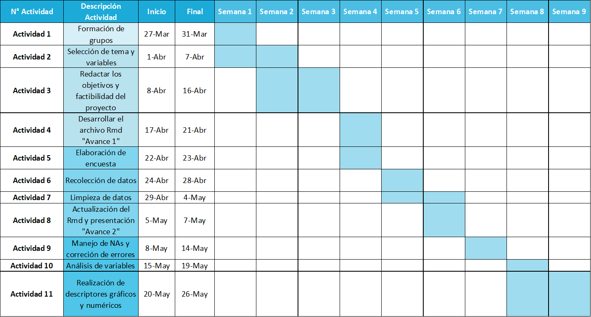

***
# <span style="color: #005DAA;">**Introducción**</span>
***
<p style="text-align: justify;">Nuestro proyecto busca estudiar la percepción de los estudiantes de la Universidad de Ingeniería y Tecnología (UTEC) respecto al nivel de seguridad en el desplazo desde su domicilio hasta el campus de UTEC y viceversa. </p>  

## **Contexto**

<p style="text-align: justify;"> El traslado a la universidad es un hecho continuo para todos los estudiantes. Desde que se acabó la modalidad virtual, los estudiantes se han visto obligados a exponerse de nuevo a la inseguridad de las calles. Bajo este contexto, se busca determinar qué tan inseguro es realmente el traslado diario para un estudiante. Nuestro grupo, conformado por estudiantes universitarios, quiere visualizar el panorama de la inseguridad por medio de análisis de datos, obteniendo la verdadera cara del traslado, o al menos, acercarnos un poco. Todo este análisis servirá para que en caso hayan problemas de inseguridad en el traslado, se puedan tener etiquetadas las causas más problemáticas y tomar las medidas correspondientes a cada una. </p>

<p style="text-align: justify;"> Entonces, para nuestra investigación se debe tener lo siguiente en cuenta:</p>

-   **Diferencias entre los estudiantes:** Dentro de nuestra lista
    tenemos que hacer una diferenciación entre los agentes encuestados,
    puesto que cada uno presenta propiedades diferentes; propiedades que
    afectan dentro del análisis de datos.Como las diferencias entre rutas de 
    cada estudiante, tiempo que les toma llegar a la universidad, sistemas vehiculares a
    usar durante su transporte, nivel de seguridad o importancia moral y
    económica de las cosas robadas.

-   **Factores vinculados al nivel de riesgo:** Se puede explicar como
    factores ajenos a las decisiones del estudiante. Por ejemplo, la ubicación de la universidad 
    o el nivel de riesgo de cada método de transporte.

-   **Aporte de la universidad:** Se relaciona a las acciones que toma
    la universidad para aportar a la seguridad del estudiante. 


## **Planificación**
<p align="center">{width=width height=height align="center"}</p>

## **Relevancia**

<p style="text-align: justify;"> 
Este trabajo de investigación es relevante para describir el panorama
actual que viven los estudiantes de UTEC concernientes a la seguridad
durante el transporte. Es así como determinar la percepción de seguridad
en un estudiante que se traslada continuamente a la universidad y cuál
es el nivel de riesgo al que se pueden llegar a exponer, para así en
base a la información obtenida existan propuestas que contribuyan a
mejorar la experiencia universitaria respecto al transporte. 
</p>

## **Objetivo general**

-   Describir el panorama de seguridad durante el traslado
    Domicilio-UTEC en estudiantes de la Universidad de Ingeniería y
    Tecnología (UTEC) matriculados en el 2023-1.

## **Objetivos específicos**

-   Determinar qué tan inseguro es el traslado a la universidad en
    estudiantes de UTEC actualmente matriculados.
-   Identificar los factores personales que afectan al nivel de
    seguridad de los estudiantes UTEC actualmente matriculados durante
    el traslado.
-   Determinar qué medios de transporte son los más riesgosos al momento
    de desplazarse para los estudiantes de UTEC matriculados en el
    2023-1.
-   Determinar la parte del día en la que es más riesgoso trasladarse
    para un estudiante UTEC actualmente matriculado.
-   Observar patrones específicos en la experiencia de traslado dictados
    por variables demográficas como edad y ciclo en estudiantes UTEC
    actualmente matriculados.
-   Contribuir con una retroalimentación acerca de cómo UTEC
    puede contribuir en la mejora de la percepción de seguridad de los
    estudiantes de UTEC actualmente matriculados.


***
# <span style="color: #005DAA;">**Datos**</span>

***


## **Herramienta de recolección de datos**

[Encuesta: La percepción de los estudiantes de UTEC matriculados en el
ciclo 2023-1 respecto a la seguridad en el traslado Domicilio - Campus
UTEC](https://forms.gle/NokCWu7QBkT4UkUG9)

**¿Cómo se obtuvieron los datos?**

-   Los datos se obtuvieron por medio de una encuesta virtual en Google
    Forms, de la cual obtuvimos un código QR para facilitar la difusión
    de nuestro cuestionario. Motivamos a nuestros compañeros repartiendo
    marshmallows "Olé Olé", de ese modo recolectamos en 2 semanas la
    cantidad de encuestas solicitadas.

**¿Por qué se hizo la recolección de datos de esa manera?**

-   Porque es una manera más versátil de llegar a todos los alumnos y en
    cuanto a la herramienta escogida, esta permite que los datos
    obtenidos sean mejor manejados porque nos da la posibilidad de
    descargar directamente la data en formato **.csv**, listo para
    trabajarlo en RStudio.

**¿Cuáles fueron las condiciones para realizar la recolección?**

-   La única condición que tuvimos al momento de la recolección fue que
    el individuo estudie actualmente en UTEC.

**¿Qué estrategias consideramos para llegar a la población?**

-   Compartimos las encuestas con amigos cercanos y grupos de estudios
    UTEC.
-   La publicación del link del cuestionario en nuestras redes sociales.
-   Para evitar participación externa restringimos el acceso para que
    solo la pueda responder la comunidad UTEC.
-   En forma de de recompensa regalamos dulces por llenar nuestras
    encuestas.

## **Población**

<p style="text-align: justify;">

Nuestra población será los estudiantes que se trasladan hacia la
Universidad de Ingeniería y Tecnología (UTEC).
</p>

**Unidad Muestral** 

-   La unidad muestral es cada estudiante de las distintas provincias de
    Lima :

| .                      | .                       | .                 |
|:-----------------------|:------------------------|:------------------|
| Ate Vitarte            | Barranco                | Carabayllo        |
| Chaclacayo             | Chorrillos              | Cieneguilla       |
| Comas                  | El Agustino             | Independencia     |
| Jesús María            | La Molina               | La Victoria       |
| Lima                   | Lince                   | Los Olivos        |
| Lurín                  | Magdalena del Mar       | Miraflores        |
| Pachacamac             | Pueblo Libre            | Puente Piedra     |
| Punta Hermosa          | Rímac                   | San Borja         |
| San Juan De Miraflores | San Juan Del Lurigancho | San Luis          |
| San Martin De Porres   | San Miguel              | Santa Anita       |
| Santiago De Surco      | Surquillo               | Villa El Salvador |


### **Tamaño de la muestra**

-   Se obtuvieron 218 observaciones en el estudio del proyecto.

### **Tipo de muestreo**

-   El tipo ideal del muestreo es **probabilístico sistemático**,sin
    embargo, una parte de nuestros resultados fueron inconscientemente
    por **muestreo por conveniencia**, dado que un porcentaje de nuestros
    encuestados fueron conocidos nuestros por temas de accesibilidad y
    disponibilidad.

## **Variables**

```{r echo=FALSE}
#installed.packages("readxl")
library(readxl)
tabla <-read_excel("Tabla de variables.xlsx")
tabla
```

## **Limpieza de base de datos**

### **Librerías a utilizar**

```{r message=FALSE}
librerias <- c("readr", "plyr", "dplyr","ggplot2","modeest","nortest","tidyverse","stringr","tm","wordcloud")

# Comprueba si cada librería está instalada, si no lo está, la instala
for (libreria in librerias) {
  if (!require(libreria, character.only = TRUE)) {
    install.packages(libreria)
  }
  library(libreria, character.only = TRUE)
}
```

### **Base de datos general**

```{r echo=FALSE}
DT<- read_csv("Respuestas.csv")
View(DT)
DT
```

**Nombres de nuestras variables**

```{r echo=FALSE}
names(DT)
```

**Eliminamos la variables que no utilizaremos**

```{r}
DT$`Marca temporal` <- NULL
DT$`Dirección de correo electrónico` <- NULL 
DT$`¿Cuánto recuperaste del segundo robo?` <- NULL
```

**Cambiamos nombres a las variables de nuestra base de datos y mostramos
los nuevos nombres:**

```{r echo=FALSE}
DT %>% rename(Edad =`¿Cuál es su edad?`, Sexo = `¿Cuál es su sexo?`, Carrera = `¿Qué carrera esta estudiando?`, Ciclo = `¿En qué ciclo se encuentra actualmente?`, Distrito = `¿En qué distrito reside actualmente?`, DistanciaKM = `¿Cuál es la distancia entre UTEC y tu domicilio?  Use Google Maps para mayor precisión  https://www.google.com/maps (en km con decimales y escoge la ruta que normalmente eliges)`, Movilidad = `¿Qué tipo de transportes utilizas usualmente para movilizarte a la universidad?`, Distanciamin = `Aproximadamente ¿Cuánto tiempo demoras en trasladarte de la universidad a tu casa? (minutos)`, Numvehiculos = `¿Cuántos vehículos de transporte usas para llegar a tu destino? (Transbordos)`, Sentimientoseguridad = `¿Qué tan seguro te sientes durante el traslado a la universidad?`, Seguro = `¿En que parte del día te sientes más seguro durante el traslado a la universidad?`, Inseguro = `¿En que parte del día te sientes más inseguro durante el traslado a la universidad?`, VictimaRobo = `¿Has sido víctima de un robo en tu traslado a la universidad?`, Universidad = `¿Crees que la universidad podría ayudar a mejorar el nivel de seguridad de sus estudiantes?`, Manera = `¿De qué manera?`, Ideas = `¿Tienes alguna idea de que otro método se puede instaurar para reducir los riesgos en el traslado?`, PrimerRobo = `Primer robo`, SegundoRobo = `Segundo robo`, DinRoboUno = `¿Cuánto recuperaste del primer robo?`,  NumRobo = `¿Cuántas veces te ha sucedido esto? (número entero)`, MomentoRobo = `¿En qué momento del día fue?`, HoraRobo = `¿A qué hora sucedio? (en formato de 00:00 a 24:00)`, RecuperasteAlgo = `¿Recuperaste una parte o todo el dinero robado?`,TrasporteRobo = `¿Qué medio de transporte usabas cuando se dio este hecho?`, Factores = `¿Qué factores crees que llevaron a este hecho?`) -> DT

names(DT)
```

```{r include=FALSE}
conteo_na_antes <- sum(is.na(DT))
```

#### **Correcciones en la base de datos**

**Observación duplicada**

Un encuestado rellenó la encuesta dos veces, por lo que eliminaremos su primera respuesta:

```{r message=FALSE}
DT[-c(1), ] -> DT
```

**DistanciaKM**

Algunas distancias que no concuerdan con el distrito señalado del
encuestado, así que decidimos tomar esos valores como NA, para evitar el
sesgo y asegurar una buena interpretación de la data.

```{r message=FALSE}
DT$DistanciaKM[DT$DistanciaKM == "70"] <- NA
DT$DistanciaKM[DT$DistanciaKM == "100"] <- NA
DT$DistanciaKM[DT$DistanciaKM == "120"] <- NA
DT$DistanciaKM[DT$DistanciaKM == "597"] <- NA
```

La clase de la variable DistanciaKM esta errada, pues es interpretada
como:

```{r echo=FALSE}
c("character")
```

Entonces, la convertimos a:

```{r echo=FALSE}
DT$DistanciaKM = as.numeric(DT$DistanciaKM)
class(DT$DistanciaKM)
```

**Movilidad:**

En la encuesta se permitió que los encuestados seleccionaran más de una
movilidad. Esto puede resultar en un problema al momento de estudiar la
variable, así que creamos una tabla para la variable **Transporte** que
contendrá el tipo de transporte y su frecuencia.

```{r echo=FALSE}
Transporte <- data.frame(
  Tipo_Transporte = c("Metropolitano", "Corredor", "Tren", "Bus", "Colectivo", "Taxi", "Mototaxi", "Auto propio", "Caminando", "Bicicleta", "Otro"),
  Cantidad = c(89, 35, 16, 101, 19, 53, 8, 38, 49, 15, 5)
)
Transporte
```


**Distanciamin:** 

En nuestra base de datos hay algunos datos mal
escritos, así que procedemos a hacer la interpretación de los mismos.

```{r message=FALSE}
DT$Distanciamin[DT$Distanciamin == "15 minutos"] <- "15"
DT$Distanciamin[DT$Distanciamin == "2 horas y media"] <- "150"
DT$Distanciamin[DT$Distanciamin == "1hr "] <- "60"
DT$Distanciamin[DT$Distanciamin == "3 horas"] <- "180"
DT$Distanciamin[DT$Distanciamin == "2 horas"] <- "120"
DT$Distanciamin[DT$Distanciamin == "30m"] <- "30"
DT$Distanciamin[DT$Distanciamin == "1h 50 min"] <- "110"
DT$Distanciamin[DT$Distanciamin == "30 minutos "] <- "30"
DT$Distanciamin[DT$Distanciamin == "8 minutos"] <- "8"
DT$Distanciamin[DT$Distanciamin == "90 min"] <- "90"
DT$Distanciamin[DT$Distanciamin == "120minutos"] <- "120"
DT$Distanciamin[DT$Distanciamin == "80 minutos"] <- "80"
DT$Distanciamin[DT$Distanciamin == " 60 minutos"] <- "60"
DT$Distanciamin[DT$Distanciamin == "5 minutos"] <- "5"
DT$Distanciamin[DT$Distanciamin == "1 hora 10 minutos"] <- "70"
DT$Distanciamin[DT$Distanciamin == "15 min"] <- "15"
DT$Distanciamin[DT$Distanciamin == "30 min"] <- "30"
DT$Distanciamin[DT$Distanciamin == "60 minutos"] <- "60"
DT$Distanciamin[DT$Distanciamin == "1 hora con 30 minutos"] <- "90"
DT$Distanciamin[DT$Distanciamin == "1:30horas"] <- "90"
DT$Distanciamin[DT$Distanciamin == "30 minutos"] <- "30"
DT$Distanciamin[DT$Distanciamin == "2-3 horas"] <- "150"
DT$Distanciamin[DT$Distanciamin == "30/40"] <- "35"
DT$Distanciamin[DT$Distanciamin == "90min -120min"] <- "105"
DT$Distanciamin[DT$Distanciamin == "1:30"] <- "90"
DT$Distanciamin[DT$Distanciamin == "1hr"] <- "60"
DT$Distanciamin[DT$Distanciamin == " 0.7"] <- "42"
DT$Distanciamin[DT$Distanciamin == "0.8"] <- "48"
DT$Distanciamin[DT$Distanciamin == "1.3"] <- "78"
DT$Distanciamin[DT$Distanciamin == "1.40"] <- "84"
DT$Distanciamin[DT$Distanciamin == "0.7"] <- "42"
```

La clase también esta errada:

```{r echo=FALSE}
class(DT$Distanciamin)
```

La corregimos a:

```{r echo=FALSE}
DT$Distanciamin = as.numeric(DT$Distanciamin)
class(DT$Distanciamin) 
```

**Sentimientoseguridad:**

En la encuesta esta variable se encontraba en el rango de 1 a 5.
Convertimos los números a letras siguiendo las siguientes descripciones.

1 = "Vulnerable": Extremadamente inseguro.

2 = "Preocupado": Bastante inseguro.

3 = "Cauteloso": Moderadamente seguro, pero aún con cierta
preocupación por un posible robo.

4 = "Seguro": Bastante seguro.

5 = "Protegido": Completamente seguro.

```{r message=FALSE}
DT$Sentimientoseguridad[DT$Sentimientoseguridad == "1"] <- "Vulnerable"
DT$Sentimientoseguridad[DT$Sentimientoseguridad == "2"] <- "Preocupado"
DT$Sentimientoseguridad[DT$Sentimientoseguridad == "3"] <- "Cauteloso"
DT$Sentimientoseguridad[DT$Sentimientoseguridad == "4"] <- "Seguro"
DT$Sentimientoseguridad[DT$Sentimientoseguridad == "5"] <- "Protegido"
```

**Universidad:**

La variable **Universidad** representa la opinión de los estudiantes
respecto a la ayuda que podría ofrecer la universidad para aumentar el
nivel de seguridad de los estudiantes. En los inicios de la encuesta se
planteó una opción que decía "Lo intenta", luego nos dimos cuenta que no
habría una correcta interpretación para ella, así que la quitamos.

```{r message=FALSE}
DT$Universidad[DT$Universidad == "Lo intenta"] <- NA
```

```{r echo=FALSE, message=FALSE}
DT$Universidad = as.numeric(DT$Universidad)
```

**Manera:**

Esta variable nos ayuda a conocer la opinión de los estudiantes respecto
a alternativas en las que la universidad podría contribuir a aumentar el
nivel de seguridad de los estudiantes. Le creamos su propia tabla de
frecuencias pues al igual que la variable **Movilidad** también era de opción
múltiple.

```{r echo=FALSE,message=FALSE}
Manera <- data.frame(
  Ayuda = c("Más lockers en la universidad", "Promoviendo horarios virtuales para cursos nocturnos", "Medio de transporte privado (bus universitario)"),
  Cantidad = c(107,144,145)
)
Manera
```


### **Base de robos**

Creamos otra base de datos, que solo contendrá a las personas que han
sido asaltadas.

```{r echo=FALSE}
DR <- subset(DT, VictimaRobo == "Sí")
DR[-c(1), ] -> DR
DR
```

#### **Correcciones en la base de robos**

```{r echo=FALSE}
conteo_na_dr_antes <- sum(is.na(DR))
```

**PrimerRobo:** 

Cambiamos la clase de **PrimerRobo** de categórica a
numérica.

```{r echo=FALSE}
DR$PrimerRobo = as.numeric(DR$PrimerRobo)
class(DR$PrimerRobo)
```

**DinRoboUno:** 

Esta variable nos indica si es que el estudiante ha
recuperado algo de lo que perdió en el robo. Cambiamos la opción "Nada"
por 0.

```{r}
DR$DinRoboUno[DR$DinRoboUno == "Nada"] <- "0"
```

También hacemos un cambio de clase.

```{r echo=FALSE}
class(DR$DinRoboUno)
```

Se convierte a numérica.

```{r echo=FALSE}
DR$DinRoboUno = as.numeric(DR$DinRoboUno)
class(DR$DinRoboUno)
```

**Factores:** 

Esta variable es de opción múltiple y debido a ello le
crearemos una tabla de frecuencias para un mejor manejo de la
información.

```{r echo=FALSE}
Factores <- data.frame(
  Factores = c("Llevaba muchas cosas en mi mochila", "Salí muy tarde de la universidad", "La inseguridad de las calles", "Me distraje", "La inseguridad del transporte"),
  Frecuencia = c(9, 7, 9, 7, 4)
)
Factores
```

### **Base de datos general limpia (DT)**

```{r echo=FALSE}
DT
```

### **Base de robos limpia (DR)**

```{r echo=FALSE}
DR
```

### **Cantidad de NA's antes y después de la limpieza**

El número de los NA's manejados permanece igual en la base de datos de
robos (DR) y disminuye en 8 en la base de datos principal (DT). Parte de la
limpieza nos llevó a tener que introducir valores nulos y eliminar una observación duplicada. Así mismo, habían valores    que no podían ser interpretados apropiadamente o cuya interpretación era
muy subjetiva. Los NA's en su mayoría no afectan a nuestra investigación, al 
momento de realizar las gráficas los filtramos y podemos trabajar con normalidad. 
La mayoría de estos provienen de las variables que tienen que ver con robos, 
las preguntas de las que vienen estas variables en la encuesta eran opcionales 
y solo las contestaban aquellos que habían sufrido un robo.

```{r echo=FALSE}
conteo_na_dr_despues <-sum(is.na(DR))
conteo_na_despues <- sum(is.na(DT))
cat("Número de NA's  en base de datos principal antes de limpieza: ", conteo_na_antes, "\n",
    "Número de NA's  en base de datos principal después de limpieza: ", conteo_na_despues, "\n",
    "Número de NA's en base de datos de robo antes de limpieza: ", conteo_na_dr_antes, "\n",
    "Número de NA's en base de datos de robo después de limpieza: ", conteo_na_dr_despues, "\n", sep="")
```


------------------------------------------------------------------------

# [**Análisis descriptivo**]{style="color: #005DAA;"}

------------------------------------------------------------------------

En esta sección abarcaremos el análisis y búsqueda de patrones entre
nuestras variables del estudio. Se buscará responder los objetivos
propuestos al principio del proyecto usando las variables obtenidas en
la encuesta.

### **Análisis de nuestra base de datos**

Identificaremos nuestra muestra y con ayuda de descriptores hallaremos
las características de nuestra base de datos general (DT).

**Edad**

- Al menos la mitad de nuestros encuestados tiene 19 años.

- Usando el coeficiente de asimetría de Pearson, obtenemos que la 
muestra esta muy ligeramente sesgada a la derecha (0.03).

- La edad máxima de un encuestado es 24 y la mínima es 16.

```{r echo=FALSE,warning=FALSE}
ggplot(DT) +
 aes(x = "", y = Edad) +
 geom_boxplot(fill = "skyblue") +
 labs(x = "", y = "Edad de los encuestados", 
 title = "Boxplot de las edades de los estudiantes") +
 coord_flip() +
 theme_bw() +
 theme(plot.title = element_text(face = "bold", 
 hjust = 0.5), axis.title.x = element_text(size = 9L, face = "bold"))
```

```{r echo=FALSE,warning=FALSE}
par(mfrow = c(1, 2))
hist(DT$Edad,  
     breaks = 10, 
     col = "skyblue", 
     freq = FALSE, 
     main = "Histograma de edades",
     xlab = "Edades",
     ylab = "Frecuencia")
lines(density(DT$Edad), 
      lwd = 2, 
      col = "red")

```

Mediana

```{r echo=FALSE,warning=FALSE}
median(DT$Edad)
```


Coeficiente de asimetría de Pearson: 

```{r echo=FALSE,warning=FALSE}
round(3*(mean(DT$Edad)-median(DT$Edad))/sd(DT$Edad),2)
```

Valores máximos y mínimos de las edades:

```{r echo=FALSE,warning=FALSE}
range(DT$Edad,na.rm=T)
```


**Carrera**

- La carrera más popular entre los encuestados es Bioingeniería. Seguida por Ingeniería Industrial e Ingeniería Mecatrónica.

```{r echo=FALSE,warning=FALSE}
ggplot(DT) +
 aes(x = Carrera) +
 geom_bar(fill = "skyblue") +
 labs(x = "Encuestados", y = "Carrera", title = "Carreras de los encuestados") +
 coord_flip() +
 theme_bw() +
 theme(plot.title = element_text(face = "bold", hjust = 0.5), axis.title.y = element_text(size = 9L, 
 face = "bold"), axis.title.x = element_text(size = 9L, face = "bold"))
```

Carrera más popular:

```{r echo=FALSE,warning=FALSE}
mfv(DT$Carrera)
```

**Sexo**

- La encuesta contiene más estudiantes masculinos que femeninos.

- En nuestra encuesta hay 144 hombres, 73 mujeres y 1 que no se identifica con ninguno de los dos.

```{r echo=FALSE,warning=FALSE}
ggplot(DT) +
 aes(x = Sexo) +
 geom_bar(fill = "skyblue") +
 labs(x = "Sexo", y = "Encuestados", title = "Sexo de los encuestados") +
 theme_bw() +
 theme(plot.title = element_text(face = "bold", hjust = 0.5), axis.title.y = element_text(size = 9L, 
 face = "bold"), axis.title.x = element_text(size = 9L, face = "bold"))
```

```{r echo=FALSE,warning=FALSE}
table(DT$Sexo)
```

**Ciclo**

- La mayor parte de nuestros encuestados es del tercer ciclo.

- En base a la gráfica, podemos visualizar que la distribución de los datos 
tiene cierta "cola" a la derecha.

- En nuestro análisis no tomamos mucho en cuenta la variable ciclo, así que este
sesgo no será perjudicial. 

```{r echo=FALSE,warning=FALSE}
ggplot(DT) +
 aes(x = Ciclo) +
 geom_histogram(bins = 30L, fill = "skyblue") +
 labs(x = "Ciclo", y = "Encuestados", 
 title = "Ciclo de los encuestados") +
 theme_bw() +
 theme(plot.title = element_text(face = "bold", 
 hjust = 0.5), axis.title.y = element_text(size = 9L, face = "bold"), axis.title.x = element_text(size = 9L, 
 face = "bold"))
```

Frecuencia de los ciclos

```{r echo=FALSE,warning=FALSE}
table(DT$Ciclo)
```

**PrimerRobo**

- Tomamos solo los datos superiores a pérdidas de 50 nuevos soles.

- En promedio, un estudiante pierde alrededor de 1014.17 nuevos soles en un asalto.

- Los valores varían bastante, siendo el monto mínimo asaltado de 70 nuevos soles y el máximo de 5000 nuevos soles.

```{r echo=FALSE}
DR$PrimerRobo[DR$PrimerRobo == 0] <- NA
DR$PrimerRobo[DR$PrimerRobo == 1] <- NA
DR$PrimerRobo[DR$PrimerRobo == 2] <- NA
DR$PrimerRobo[DR$PrimerRobo == 10] <- NA
DR$PrimerRobo[DR$PrimerRobo == 30] <- NA
DR$PrimerRobo[DR$PrimerRobo == 27] <- NA
```

```{r echo=FALSE, warning=FALSE}
DR %>%
 filter(PrimerRobo >= 92L & PrimerRobo <= 5000L) %>%
 ggplot() +
 aes(x = PrimerRobo) +
 geom_histogram(bins = 20L, fill = "skyblue") +
 labs(x = "Monto perdido", 
 y = "Encuestados", title = "Monto de robo perdido para los estudiantes") +
 theme_bw() +
 theme(plot.title = element_text(face = "bold", 
 hjust = 0.5), axis.title.y = element_text(size = 9L, face = "bold"), axis.title.x = element_text(size = 9L, 
 face = "bold"))

```

Promedio de monto perdido en el primer robo

```{r echo=FALSE}
round(mean(DR$PrimerRobo,na.rm=T),2)
```

Valores máximos y mínimos de un robo

```{r echo=FALSE}
range(DR$PrimerRobo,na.rm=T)
```

**RecuperasteAlgo**

- De los encuestados asaltados, solo el 11% asegura haber recuperado algo del dinero perdido.

- Del dinero recuperado, las cantidades son de 50 y 200 nuevos soles, cantidades bastante pequeñas en comparación a los datos de robo obtenidos previamente.

```{r echo=FALSE, warning=FALSE}
ggplot(DR) +
 aes(x = RecuperasteAlgo) +
 geom_bar(fill = "skyblue") +
 labs(x = "", y = "Encuestados", 
 title = "Recuperación del monto robado") +
 theme_bw() +
 theme(plot.title = element_text(face = "bold", 
 hjust = 0.5), axis.title.y = element_text(face = "bold"))
```

```{r echo=FALSE, warning=FALSE}
DR %>%
 filter(DinRoboUno >= 1L & DinRoboUno <= 200L | is.na(DinRoboUno)) %>%
 ggplot() +
 aes(x = DinRoboUno) +
 geom_histogram(bins = 30L, fill = "skyblue") +
 labs(x = "Monto recuperado", 
 y = "Encuestados", title = "Dinero recuperado") +
 theme_bw() +
 theme(plot.title = element_text(face = "bold", 
 hjust = 0.5), axis.title.y = element_text(size = 9L, face = "bold"), axis.title.x = element_text(size = 9L, 
 face = "bold"))
```

Ahora pasaremos a la resolución de nuestros objetivos.

### **Objetivo 1**

Se busca determinar que tan inseguro es el traslado a la universidad.
Esto lo podemos resolver mediante el análisis de nuestra variable
"VictimaRobo", en esta se guarda la información de aquellos estudiantes
que confirman haber sido asaltados en su traslado a la universidad.

Como se aprecia, de las 217 observaciones, solo 19 han sido asaltados,
lo que da un porcentaje de aproximadamente **9% de estudiantes
afectados**, un resultado bastante pequeño y optimista, con el que
podríamos empezar a concluir que el traslado a la universidad es muy
seguro para los estudiantes

```{r echo=FALSE}
ggplot(DT) +
 aes(x = VictimaRobo) +
 geom_bar(fill = "skyblue") +
 labs(x = "Victima de robo", y = "Encuestados", 
 title = "Diagrama de barras de los estudiantes que sufrieron un robo") +
 theme_bw() +
 theme(plot.title = element_text(face = "bold", 
 hjust = 0.5), axis.title.y = element_text(size = 9L, face = "bold"), axis.title.x = element_text(size = 9L, 
 face = "bold"))
```

```{r echo=FALSE}
table(DT$VictimaRobo)
```

### **Objetivo 2**

Para este objetivo, se tratará de identificar que factores personales
pudieron haber llevado a un asalto en los estudiantes, esto lo
responderemos con ayuda las variables "Sexo", "Distrito", "DistanciaKM",
"Momentorobo" y "Factores", realizando el respecto análisis bivariado o
univariado según corresponda.

**Sexo** 

-  Los hombres han sido los más asaltados. 

-  Las mujeres han sido las menos asaltadas. 

-  Hay un mayor número de hombres que de mujeres en nuestra base de datos, 
   así que no se puede concluir que un hombre sea más propenso a sufrir un robo 
   que una mujer.

```{r echo=FALSE}
library(stats)
mosaicplot(~Sexo + VictimaRobo, # Las variables a cruzar 
           data = DT, 
           color = 3:10, 
           las = 1,
           main="Sexo vs Victima de robo",
           xlab = "Sexo",
           ylab = "Victima de robo") 
```

```{r echo=FALSE}
table(DT$Sexo)
```

**Distrito**

-   Se utiliza la tabla DR para hallar si hay algún distrito que
    contenga más victimas de robos que otros.

-   Al contrario de lo que la intuición diría, el distrito en el que se
    localiza la universidad (Barranco) tiene más victimas de robo que
    los demás. Le siguen a este análisis los distritos de Chorrillos,
    Comas y San Juan de Miraflores.

```{r echo=FALSE}
ggplot(DR) +
 aes(x = Distrito) +
 geom_bar(fill = "skyblue") +
 labs(x="",y = "Victimas de robo", title = "Distrito de residencia de las victimas de robo") +
 theme_bw() +
 coord_flip() +
 theme(plot.title = element_text(face = "bold", hjust = 0.5), axis.title.y = element_text(size = 9L, 
 face = "bold"), axis.title.x = element_text(size = 9L, face = "bold"))
```

```{r echo=FALSE}
table(DR$Distrito)
```

**DistanciaKM**

-   No aparece ninguna tendencia para las distancias de las victimas de
    robo, contrario a lo que se esperaba, una tendencia que haría que
    los encuestados que tuvieran una mayor distancia sean los más
    propensos a ser asaltados.

-   Las distancias recorridas por las personas afectadas varían
    bastante, y están en un rango de **0.5 km** - **40 km.**.

-   El promedio de distancias para las victimas de robo es de **12.52
    km**.

-   Las distancias para las victimas de robo varían bastante entre
    ellas, esto se demuestra gracias al coeficiente de variación elevado entre 
    las distancias de las víctimas de robo (0.92).

```{r echo=FALSE, warning=FALSE}

ggplot(DT) +
  aes(x = DistanciaKM, fill = VictimaRobo) +
  geom_histogram(bins = 30L) +
  scale_fill_manual(values = c(No = "skyblue", 
  Sí = "#C5CED1")) +
  labs(
    x = "Distancia (km)",
    y = "Encuestados",
    title = "Gráfico de barras distancia (km) vs víctima de robo"
  ) +
  theme_bw() +
  theme(
    plot.title = element_text(size = 11L,
    face = "bold",
    hjust = 0.5),
    axis.title.y = element_text(size = 9L,
    face = "bold"),
    axis.title.x = element_text(size = 9L,
    face = "bold")
  )

```

```{r echo=FALSE, warning=FALSE}
ggplot(DR) +
 aes(x = DistanciaKM, y = VictimaRobo) +
 geom_boxplot(fill = "skyblue") +
 labs(title = "Boxplot de distancia (km) vs víctima de robo") +
 theme_bw() +
 theme(plot.title = element_text(face = "bold", hjust = 0.5), axis.title.y = element_text(face = "bold"), 
 axis.title.x = element_text(size = 12L, face = "bold"))
```

Máximo y menor valor:

```{r echo=FALSE}
range(DR$DistanciaKM,na.rm=T) #Máximo y menor valor
```

Promedio:

```{r echo=FALSE}
round(mean(DR$DistanciaKM,na.rm=T),2) #Promedio
```

Coeficiente de variación para las distancias de víctima de robo:

```{r echo=FALSE}
round(sd(DR$DistanciaKM,na.rm=T)/mean(DR$DistanciaKM,na.rm=T),2) #Coeficiente de variación
```

**Momento robo**

-   La mayoría de las víctimas de robo han sido asaltadas en la noche.

-   El momento del día en el que hubo menos robos fue en la mañana.

-   Esto fundamenta el sentir de los estudiantes, que según las
    variables "Seguro" e "Inseguro" dictan que el momento del día más
    seguro es en la mañana, mientras que la noche es más peligroso.

-   Más del **65%** de los encuestados esta de acuerdo con que el
    momento del día más seguro para el traslado es en la mañana.

-   Al menos el **89%** de los encuestados cree que el momento más
    inseguro para trasladarse es en la noche.

```{r echo=FALSE}
ggplot(DT) +
 aes(x = Seguro) +
 geom_bar(fill = "skyblue") +
 labs(x = "Momento del día", 
 y = "Encuestados", title = "Momento del día más seguro (según los encuestados)") +
 theme_bw() +
 theme(plot.title = element_text(size = 13L, face = "bold", hjust = 0.5), axis.title.y = element_text(size = 9L, 
 face = "bold"), axis.title.x = element_text(size = 9L, face = "bold"))
```

```{r echo=FALSE}
DT %>%
 filter(Inseguro %in% c("Mañana","Tarde", "Noche", "Todo el día")) %>%
 ggplot() +
 aes(x = Inseguro) +
 geom_bar(fill = "skyblue") +
 labs(x = "Momento del día", y = "Encuestados", 
 title = "Momento del día más inseguro (según los encuestados)") +
 theme_bw() +
 theme(plot.title = element_text(size = 13L, face = "bold", hjust = 0.5), axis.title.y = element_text(size = 9L, 
 face = "bold"), axis.title.x = element_text(size = 9L, face = "bold"))

```

```{r echo=FALSE}
DR %>%
filter(!is.na(MomentoRobo)) %>%
 ggplot() +
 aes(x = MomentoRobo) +
 geom_bar(fill = "skyblue") +
 labs(x = "Momento robo", y = "Encuestados", 
 title = "Momento del día en el que se dio el robo") +
 theme_bw() +
 theme(plot.title = element_text(hjust = 0.5,,face="bold"), 
 axis.title.y = element_text(size = 9L, face = "bold"), axis.title.x = element_text(size = 9L, face = "bold"))

```

**Factores**

-   El factor al que menos se le echa la culpa es la "inseguridad del
    transporte".

-   Los factores "llevaba muchas cosas en mi mochila" y "la inseguridad
    de las calles" son los que llevaron a que el asalto se de a cabo,
    según los estudiantes.

```{r echo=FALSE}

ggplot(Factores) +
 aes(x = Factores, y = Frecuencia) +
 geom_col(fill = "skyblue") +
 labs(x = "Factores", 
 y = "Encuestados", title = "Factores que llevaron a cabo el asalto (según los estudiantes)") +
 coord_flip() +
 theme_bw() +
 theme(plot.title = element_text(face = "bold", hjust = 0.5, size=11L), axis.title.y = element_text(size = 9L, 
 face = "bold"), axis.title.x = element_text(size = 9L, face = "bold"))
```

------------------------------------------------------------------------

Gracias al estudio de estas variables, podemos concluir que los factores
personales que **más afectan** al momento del robo son el **medio de
transporte** y el **momento del día** en el que se traslade un
estudiante.

### **Objetivo 3**

Se determinará que medios de transporte son los más riesgosos al momento
de desplazarse para los estudiantes. Esto lo haremos mediante el
análisis de las variables "Numvehiculos" y "Transporterobo".

**Numero de vehículos**

-   El estudiante promedio requiere de un solo vehículo para
    transportarse.

-   Los estudiantes que han sido asaltados usaron entre 1 y 2 vehículos
    en su transporte diario.

-   No aparece una gran diferencia entre el número de vehículos de las
    personas asaltadas contra las que no fueron asaltadas.

```{r echo=FALSE}
ggplot(DT) +
  aes(x = Numvehiculos) +
  geom_histogram(bins = 15L, fill = "Sky blue") +
  labs(
    x = "Numero de vehiculos",
    y = "Encuestados",
    title = "Número de vehículos (personas totales)"
  ) +
  theme_bw() +
  
 theme(plot.title = element_text(face = "bold", 
 hjust = 0.5), axis.title.y = element_text(size = 9L, face = "bold"), axis.title.x = element_text(size = 9L, 
 face = "bold"))
```

```{r echo=FALSE}
ggplot(DR) +
  aes(x = Numvehiculos) +
  geom_histogram(bins = 5L, fill = "Sky blue") +
  labs(
    x = "Numero de vehiculos",
    y = "Encuestados",
    title = "Número de vehículos (personas asaltadas)"
  ) +
  theme_bw() +
  
 theme(plot.title = element_text(face = "bold", 
 hjust = 0.5), axis.title.y = element_text(size = 9L, face = "bold"), axis.title.x = element_text(size = 9L, 
 face = "bold"))
```

Moda de número de vehículos para el total de encuestados

```{r echo=FALSE}
mfv(DT$Numvehiculos) # Moda de número de vehículos para el total de encuestados
```

Moda de número de vehículos para personas asaltadas

```{r echo=FALSE}
mfv(DR$Numvehiculos) # Moda de número de vehículos para personas asaltadas
```

**Transporte robo**

-   En el global, el medio de transporte más usado es el bus,
    siguiéndole el metropolitano, taxi y auto propio.

-   En el caso de las personas asaltadas, el transporte en el que
    ocurrió el hecho fue el metropolitano o mientras caminaban.

```{r echo=FALSE}
ggplot(Transporte) +
 aes(x = Tipo_Transporte, y = Cantidad) +
 geom_col(fill = "skyblue") +
 labs(x = "Encuestados", 
 y = "Transporte", title = "Transporte") +
 coord_flip() +
 theme_bw() +
 theme(plot.title = element_text(face = "bold", hjust = 0.5), axis.title.y = element_text(size = 9L, 
 face = "bold"), axis.title.x = element_text(size = 9L, face = "bold"))
```

```{r echo=FALSE}
DR %>%
filter(!is.na(TrasporteRobo)) %>%
 ggplot() +
 aes(x = TrasporteRobo) +
 geom_bar(fill = "skyblue") +
 labs(x = "Transporte", y = "Encuestados", 
 title = "Transporte usado en el momento de robo") +
 theme_bw() +
 theme(plot.title = element_text(face = "bold", 
 hjust = 0.5), axis.title.y = element_text(size = 9L, face = "bold"), axis.title.x = element_text(size = 9L, 
 face = "bold"))
```

Medio de transporte más usado.

```{r echo=FALSE}
Transporte$Tipo_Transporte[which.max(Transporte$Cantidad)]
```

Medio de transporte usado en el momento de robo.

```{r echo=FALSE}
c("Metropolitano", "Caminando")
```

Debido a los pocos datos de robo obtenido, es difícil sacar una
conclusión definitiva en la que se obtenga el transporte más inseguro en
el traslado. Aún así, podemos notar que el segundo medio de transporte
más utilizado por los estudiantes de UTEC, el Metropolitano, es a su vez
uno de los medios de transporte en el que los estudiantes sufrieron más
robos. Estos datos resaltan la importancia de implementar medidas de
seguridad adicionales en estos contextos, como aumentar la vigilancia en
las paradas de autobús, mejorar la iluminación en áreas de alto tráfico
peatonal y proporcionar información y recursos de seguridad a los
estudiantes que utilizan el metropolitano.

### **Objetivo 4**

Determinar la parte del día en la que es más riesgoso el traslado para
un estudiante de la Universidad de Ingeniería y Tecnología (UTEC)
matriculados en el 2023-1. Esto se hará con las variables "Momento robo"
y "Hora robo".

**Momento robo**

-   Ya se hizo un análisis a esta variable, en el que se obtuvo que el
    **65%** de los encuestados se sienten más seguros en la mañana y más
    del **89%** se siente más inseguro en la noche.

-   Los datos de robo sustentan este sentir, pues la gran mayoría de
    estudiantes asaltados informaron que el robo sucedió en la
    **noche**.

-   La hora más tarde en la que algún estudiante sufrió un robo fue las
    21:00.

-   La hora más temprana en la que algún estudiante sufrió un robo fue a
    las 4:00.

-   En promedio, la hora a la que han asaltado a algún estudiante es a
    las 17:15, aunque hay bastante variación entre los datos.

```{r echo=FALSE}
ggplot(DT) +
 aes(x = Seguro) +
 geom_bar(fill = "skyblue") +
 labs(x = "Momento del día", 
 y = "Encuestados", title = "Momento del día más seguro (según los encuestados)") +
 theme_bw() +
 theme(plot.title = element_text(size = 13L, face = "bold", hjust = 0.5), axis.title.y = element_text(size = 9L, 
 face = "bold"), axis.title.x = element_text(size = 9L, face = "bold"))
```

```{r echo=FALSE}
DT %>%
 filter(Inseguro %in% c("Mañana","Tarde", "Noche", "Todo el día")) %>%
 ggplot() +
 aes(x = Inseguro) +
 geom_bar(fill = "skyblue") +
 labs(x = "Momento del día", y = "Encuestados", 
 title = "Momento del día más inseguro (según los encuestados)") +
 theme_bw() +
 theme(plot.title = element_text(size = 13L, face = "bold", hjust = 0.5), axis.title.y = element_text(size = 9L, 
 face = "bold"), axis.title.x = element_text(size = 9L, face = "bold"))

```

```{r echo=FALSE}
DR %>%
filter(!is.na(MomentoRobo)) %>%
 ggplot() +
 aes(x = MomentoRobo) +
 geom_bar(fill = "skyblue") +
 labs(x = "Momento robo", y = "Encuestados", 
 title = "Momento del día en el que se dio el robo") +
 theme_bw() +
 theme(plot.title = element_text(hjust = 0.5,,face="bold"), 
 axis.title.y = element_text(size = 9L, face = "bold"), axis.title.x = element_text(size = 9L, face = "bold"))

```

```{r echo=FALSE}
horas_objeto<- strptime(DR$HoraRobo, format = "%H:%M:%S")
horas_numericas <- as.numeric(horas_objeto)
promedio <- mean(horas_numericas, na.rm=T)
promedio_hora <- as.POSIXlt(promedio, origin = "1970-01-01", tz = "UTC")
promedio_hora_formateada <- format(promedio_hora, format = "%H:%M:%S")
promedio_hora_formateada

table(DR$HoraRobo)
```

Estos resultados resaltan la importancia de tomar medidas de seguridad
adicionales durante los momentos del día tarde y noche y aumentar el
nivel de seguridad de los estudiantes.

### **Objetivo 5**

Observaremos e identificaremos patrones específicos en la experiencia de
traslado, dictados por variables demográficas como edad, sexo y ciclo.

**¿Qué patrones se observan entre edad y la percepción de seguridad?**

-   Se evidencia que de los más de 200 encuestados, la mayor parte
    pertenecen a las edades entre 18-20 años.
-   En la mayoría de edades, el sentimiento de seguridad **más común**
    en el traslado es **cauteloso**.
-   En la mayoría de edades, el sentimiento de seguridad el tras **menos
    común** es **vulnerable**.

```{r echo=FALSE}
DT %>%
filter(!is.na(Sentimientoseguridad)) %>%
 ggplot() +
 aes(x = Edad, fill = Sentimientoseguridad) +
 geom_histogram(bins = 20L) +
 scale_fill_hue(direction = 1) +
 labs(x = "Edad", y = "Sentimiento seguridad", title = "Sentimiento de seguridad respecto a la edad") +
 theme_bw() +
 theme(plot.title = element_text(size = 12L, face = "bold", hjust = 0.5), axis.title.y = element_text(size = 9L, 
 face = "bold"), axis.title.x = element_text(size = 9L, face = "bold"))
```

```{r echo=FALSE}
ggplot(DT) +
 aes(x = Edad, fill = Seguro) +
 geom_histogram(bins = 20L) +
 scale_fill_hue(direction = 1) +
 labs(x = "Edad", y = "Encuestados", title = "Momento del día seguro respecto a la edad") +
 theme_bw() +
 theme(plot.title = element_text(face = "bold", hjust = 0.5), axis.title.y = element_text(face = "bold"), 
 axis.title.x = element_text(size = 9L, face = "bold"))
```

```{r echo=FALSE}
DT %>%
filter(!is.na(Inseguro)) %>%
ggplot() +
 aes(x = Edad, fill = Inseguro) +
 geom_histogram(bins = 20L) +
 scale_fill_hue(direction = 1) +
 labs(x = "Edad", y = "Encuestados", title = "Momento del día inseguro respecto a la edad") +
 theme_bw() +
 theme(plot.title = element_text(face = "bold", hjust = 0.5), axis.title.y = element_text(face = "bold"), 
 axis.title.x = element_text(size = 9L, face = "bold"))
```

Además de observar que la mayoría son alumnos de 18 años en la muestra,
podemos inferir que la edad no necesariamente influye mucho en la
percepción particular de seguridad de acuerdo a la encuesta planteada.
La mayoría, de manera prominente, se siente seguro en la mañana e
inseguro en la noche.

**¿Qué patrones se observan entre el sexo y la percepción de
seguridad?**

-   Se puede observar que existen frecuencias similares para las
    métricas de seguridad en ambos sexos (obviando el dato "otro" por
    ser un dato único). Es importante tomar en cuenta que nuestra
    muestra presenta mayor cantidad de personas de sexo masculino. Aún
    así queda claro que ambos sexos se sienten más seguros en la mañana
    e inseguros en la noche. Esto no quiere decir que ambos sexos
    sientan el mismo tipo de inseguridad, recordemos el tipo de
    variable. Sin embargo si es un indicador de que es algo que se hace
    presente.

```{r echo=FALSE}
ggplot(DT) +
 aes(x = Sexo, fill = Seguro) +
 geom_bar() +
 scale_fill_hue(direction = 1) +
 labs(x = "Sexo", 
 y = ".", title = "Momento del día seguro respecto al sexo") +
 theme_bw() +
 theme(plot.title = element_text(face = "bold", hjust = 0.5), 
 axis.title.x = element_text(size = 10L, face = "bold"))
```

```{r echo=FALSE}
DT %>%
filter(!is.na(Inseguro)) %>%
ggplot() +
 aes(x = Sexo, fill = Inseguro) +
 geom_bar() +
 scale_fill_hue(direction = 1) +
 labs(x = "Sexo", 
 y = ".", title = "Momento del día seguro respecto al sexo") +
 theme_bw() +
 theme(plot.title = element_text(face = "bold", hjust = 0.5), 
 axis.title.x = element_text(size = 10L, face = "bold"))
```

**¿Qué patrones se observan entre el ciclo y la percepción de
seguridad?**

-   Quizá se podría decir como caso que los estudiantes de quinto ciclo
    se sienten mas inseguros durante la noche si tomamos en cuenta que
    existen mas de tercer ciclo los cuales tienen una frecuencia
    similar. Sin embargo se repite el patron de que independientemente
    del ciclo, el estudiante se siente mas seguro en la mañana que en la
    noche.

```{r echo=FALSE}
ggplot(DT) +
 aes(x = Ciclo, fill = Seguro) +
 geom_histogram(bins = 30L) +
 scale_fill_hue(direction = 1) +
 labs(x = "Ciclo", y = "Encuestados", title = "Momento del día seguro respecto al ciclo") +
 theme_bw() +
 theme(plot.title = element_text(face = "bold", hjust = 0.5), axis.title.y = element_text(size = 9L, 
 face = "bold"), axis.title.x = element_text(size = 9L, face = "bold"))
```

```{r echo=FALSE}
DT %>%
filter(!is.na(Inseguro)) %>%
ggplot() +
 aes(x = Ciclo, fill = Inseguro) +
 geom_histogram(bins = 30L) +
 scale_fill_hue(direction = 1) +
 labs(x = "Ciclo", y = "Encuestados", title = "Momento del día inseguro respecto al ciclo") +
 theme_bw() +
 theme(plot.title = element_text(face = "bold", hjust = 0.5), axis.title.y = element_text(size = 9L, 
 face = "bold"), axis.title.x = element_text(size = 9L, face = "bold"))

```

### **Objetivo 6**

Contribuiremos con una retroalimentación acerca de cómo la universidad
puede contribuir en la mejora de la percepción de seguridad de los
estudiantes. Esto lo haremos mediante un código que busca palabras
claves en las respuestas que los alumnos nos dejaron en la encuesta.
Estas respuestas están almacenadas en la variable **Ideas**, la cuál era 
una pregunta abierta en los que los estudiantes daban sus distintas ideas 
acerca de cómo podría la universidad apoyar a la seguridad de los estudiantes
en el traslado. Además, mostraremos las principales maneras en las que los
estudiantes piensan que la universidad puede ayudar en mejorar su nivel de 
seguridad.

```{r warning=FALSE}

variable_values <- DT$Ideas[!is.na(DT$Ideas)]
corpus <- Corpus(VectorSource(variable_values))

corpus <- tm_map(corpus, content_transformer(tolower))
corpus <- tm_map(corpus, removePunctuation)
corpus <- tm_map(corpus, removeNumbers)
corpus <- tm_map(corpus, removeWords, stopwords("spanish"))

dtm <- DocumentTermMatrix(corpus)

freq_matrix <- as.matrix(dtm)
word_freq <- colSums(freq_matrix)

wordcloud(names(word_freq), word_freq, random.order = FALSE)
```

```{r echo=FALSE,warning=FALSE}
ggplot(Manera) +
 aes(x = Ayuda, y = Cantidad) +
 geom_col(fill = "skyblue") +
 labs(x = "", y = "Encuestados", 
 title = "Ayuda de la universidad") +
  coord_flip() +
 theme_bw() +
 theme(plot.title = element_text(face = "bold", hjust = 0.5), axis.title.y = element_text(size = 9L, 
 face = "bold"), axis.title.x = element_text(size = 9L, face = "bold"))
```


Los alumnos nos dieron su punto de vista y usando una nube de palabras
podemos obtener un feedback en conjunto con nuestro análisis. Los
estudiantes se sentirían beneficiados si es que las clases nocturnas
optan por una modalidad virtual. Además mejor transporte y mejorar los
horarios fueron sugerencias de peso. Es importante, según el análisis
previo, también tomar en cuenta la inseguridad percibida por los
estudiantes en la noche, esto sobretodo tomando en cuenta que parte
significativa de la muestra no vive cerca a la universidad. Con esto no
se dice que es más probable que estén expuestos a inseguridad, no
podemos hacer esa afirmación con la data. Pero si podemos respaldar que
existe un sentimiento de inseguridad que esta ahí y es sensible buscar
soluciones a ello.
