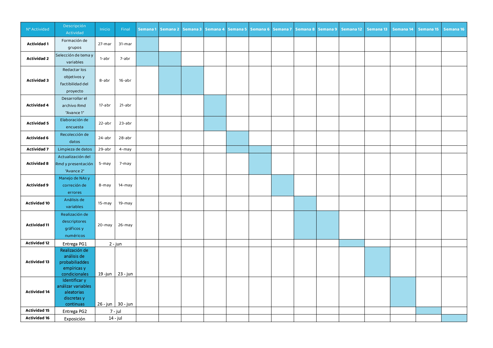

***
# <span style="color: #005DAA;">**Introducción**</span>
***
<p style="text-align: justify;">Nuestro proyecto busca estudiar la percepción de los estudiantes de la Universidad de Ingeniería y Tecnología (UTEC) respecto al nivel de seguridad en el desplazo desde su domicilio hasta el campus de UTEC y viceversa.</p>  

## **Contexto**

<p style="text-align: justify;">El traslado a la universidad es un hecho continuo para todos los estudiantes. Desde que se acabó la modalidad virtual, los estudiantes se han visto obligados a exponerse de nuevo a la inseguridad de las calles. Bajo este contexto, se busca determinar qué tan inseguro es realmente el traslado diario para un estudiante. Nuestro grupo, conformado por estudiantes universitarios, quiere visualizar el panorama de la inseguridad mediante el análisis de datos.</p>

<p style="text-align: justify;">Para ello tuvimos en cuenta:</p>

-   **Diferencias entre los estudiantes:** Puesto que cada uno presenta propiedades diferentes que afectan dentro del análisis de datos, como las diferencias entre rutas, tiempo de llegada a la universidad, sistemas vehiculares a usar durante su transporte, nivel de seguridad o importancia moral y económica de las cosas robadas.

-   **Factores vinculados al nivel de riesgo:** Se pueden explicar como factores ajenos a las decisiones del estudiante. Por ejemplo, la ubicación de la universidad o el nivel de riesgo de cada método de transporte.

-   **Aporte de la universidad:** Se relaciona con las acciones que toma la universidad para aportar a la seguridad del estudiante.


## **Planificación**
<p align="center">{width=width height=height align="center"}</p>

## **Relevancia**

<p style="text-align: justify;">Este trabajo de investigación es relevante para describir el panorama actualque viven los estudiantes de UTEC en cuanto a la seguridad durante el transporte. Así, se busca determinar la percepción de seguridad en un estudiante que se traslada continuamente a la universidad y cuál es el nivel de riesgo al que pueden llegar a exponerse. Con base en la información obtenida, se proponen medidas para mejorar la experiencia universitaria en cuanto al transporte.

## **Objetivo general**

-   Describir el panorama de seguridad durante el traslado Domicilio-UTEC en estudiantes de la Universidad de Ingeniería y Tecnología (UTEC) matriculados en el 2023-1.

## **Objetivos específicos**

- Evaluar la percepción de inseguridad en el traslado de los estudiantes actualmente matriculados en UTEC.
- Identificar los factores personales que influyen en la sensación de seguridad durante el traslado de los estudiantes de UTEC.
- Analizar la incidencia de diferentes medios de transporte en la seguridad durante el desplazamiento de los estudiantes matriculados en UTEC en el período 2023-1.
- Determinar los horarios del día con mayor riesgo para el traslado de los estudiantes matriculados en UTEC.
- Investigar posibles patrones en la experiencia de traslado relacionados con variables demográficas, como edad y ciclo, en los estudiantes de UTEC actualmente matriculados.
- Contribuir con retroalimentación acerca de cómo UTEC puede mejorar la percepción de seguridad de los estudiantes matriculados actualmente.

***
# <span style="color: #005DAA;">**Datos**</span>

***


## **Herramienta de recolección de datos**

[Encuesta: La percepción de los estudiantes de UTEC matriculados en el
ciclo 2023-1 respecto a la seguridad en el traslado Domicilio - Campus
UTEC](https://forms.gle/NokCWu7QBkT4UkUG9)


## **Población**

<p style="text-align: justify;">Nuestra población será los estudiantes que se trasladan hacia la
Universidad de Ingeniería y Tecnología (UTEC).</p>

### **Tamaño de la muestra**

-   Se obtuvieron 218 observaciones en el estudio del proyecto.

```{r , echo=FALSE, message=FALSE}

librerias <- c("readr", "plyr", "dplyr","ggplot2","modeest","nortest","tidyverse","stringr","tm","wordcloud","Rlab","survival")

# Comprueba si cada librería está instalada, si no lo está, la instala
for (libreria in librerias) {
  if (!require(libreria, character.only = TRUE)) {
    install.packages(libreria)
  }
  library(libreria, character.only = TRUE)
}
DT<- read_csv("DT_Limpia.csv")
DR<- read_csv("DR_Limpia.csv")
```
### **Tipo de muestreo**

-   El tipo ideal del muestreo es **probabilístico sistemático**,sin
    embargo, una parte de nuestros resultados fueron inconscientemente
    por **muestreo por conveniencia**, dado que un porcentaje de nuestros
    encuestados fueron conocidos nuestros por temas de accesibilidad y
    disponibilidad.
    
## **Variables**

```{r echo=FALSE}
#installed.packages("readxl")
library(readxl)
tabla <-read_excel("Tabla de variables.xlsx")
tabla
```

------------------------------------------------------------------------

# [**Análisis descriptivo**]{style="color: #005DAA;"}

------------------------------------------------------------------------

En esta sección abarcaremos el análisis y búsqueda de patrones entre
nuestras variables del estudio.

### **Análisis de nuestra base de datos**


**Sexo**

- La encuesta contiene más estudiantes masculinos que femeninos.

- En nuestra encuesta hay 144 hombres, 73 mujeres y 1 que no se identifica con ninguno de los dos.

```{r echo=FALSE,warning=FALSE}

ggplot(DT) +
 aes(x = Sexo) +
 geom_bar(fill = "skyblue") +
 labs(x = "Sexo", y = "Encuestados", title = "Sexo de los encuestados") +
 theme_bw() +
 theme(plot.title = element_text(face = "bold", hjust = 0.5), axis.title.y = element_text(size = 9L, 
 face = "bold"), axis.title.x = element_text(size = 9L, face = "bold"))
```

```{r echo=FALSE,warning=FALSE}
table(DT$Sexo)
```


### **Objetivo 1**

Se busca determinar que tan inseguro es el traslado a la universidad.

Como se aprecia, de las 217 observaciones, solo 19 han sido asaltados,
lo que da un porcentaje de aproximadamente **9% de estudiantes
afectados**, un resultado bastante pequeño y optimista, con el que
podríamos empezar a concluir que el traslado a la universidad es muy
seguro para los estudiantes

```{r echo=FALSE}
ggplot(DT) +
 aes(x = VictimaRobo) +
 geom_bar(fill = "skyblue") +
 labs(x = "Victima de robo", y = "Encuestados", 
 title = "Diagrama de barras de los estudiantes que sufrieron un robo") +
 theme_bw() +
 theme(plot.title = element_text(face = "bold", 
 hjust = 0.5), axis.title.y = element_text(size = 9L, face = "bold"), axis.title.x = element_text(size = 9L, 
 face = "bold"))
```

```{r echo=FALSE}
table(DT$VictimaRobo)
```

### **Objetivo 2**

Para este objetivo, se tratará de identificar que factores personales
pudieron haber llevado a un asalto en los estudiantes.

**Sexo** 

-  Los hombres han sido los más asaltados. 

-  Las mujeres han sido las menos asaltadas. 

-  Hay un mayor número de hombres que de mujeres en nuestra base de datos, 
   así que no se puede concluir que un hombre sea más propenso a sufrir un robo 
   que una mujer.

```{r echo=FALSE}
library(stats)
mosaicplot(~Sexo + VictimaRobo, # Las variables a cruzar 
           data = DT, 
           color = 3:10, 
           las = 1,
           main="Sexo vs Victima de robo",
           xlab = "Sexo",
           ylab = "Victima de robo") 
```

```{r echo=FALSE}
table(DT$Sexo)
```

**DistanciaKM**

-   No aparece ninguna tendencia para las distancias de las victimas de
    robo, contrario a lo que se esperaba, una tendencia que haría que
    los encuestados que tuvieran una mayor distancia sean los más
    propensos a ser asaltados.

-   Las distancias recorridas por las personas afectadas varían
    bastante, y están en un rango de **0.5 km** - **40 km.**.

-   El promedio de distancias para las victimas de robo es de **12.52 km**.

-   Las distancias para las victimas de robo varían bastante entre
    ellas, esto se demuestra gracias al coeficiente de variación elevado entre 
    las distancias de las víctimas de robo (0.92).

```{r echo=FALSE, warning=FALSE}

ggplot(DT) +
  aes(x = DistanciaKM, fill = VictimaRobo) +
  geom_histogram(bins = 30L) +
  scale_fill_manual(values = c(No = "skyblue", 
  Sí = "#C5CED1")) +
  labs(
    x = "Distancia (km)",
    y = "Encuestados",
    title = "Gráfico de barras distancia (km) vs víctima de robo"
  ) +
  theme_bw() +
  theme(
    plot.title = element_text(size = 11L,
    face = "bold",
    hjust = 0.5),
    axis.title.y = element_text(size = 9L,
    face = "bold"),
    axis.title.x = element_text(size = 9L,
    face = "bold")
  )

```

```{r echo=FALSE, warning=FALSE}
ggplot(DR) +
 aes(x = DistanciaKM, y = VictimaRobo) +
 geom_boxplot(fill = "skyblue") +
 labs(title = "Boxplot de distancia (km) vs víctima de robo") +
 theme_bw() +
 theme(plot.title = element_text(face = "bold", hjust = 0.5), axis.title.y = element_text(face = "bold"), 
 axis.title.x = element_text(size = 12L, face = "bold"))
```

Máximo y menor valor:

```{r echo=FALSE}
range(DR$DistanciaKM,na.rm=T) #Máximo y menor valor
```

Promedio:

```{r echo=FALSE}
round(mean(DR$DistanciaKM,na.rm=T),2) #Promedio
```

Coeficiente de variación para las distancias de víctima de robo:

```{r echo=FALSE}
round(sd(DR$DistanciaKM,na.rm=T)/mean(DR$DistanciaKM,na.rm=T),2) #Coeficiente de variación
```

### **Objetivo 3**

Se determinará que medios de transporte son los más riesgosos al momento
de desplazarse para los estudiantes. 

**Numero de vehículos**

-   El estudiante promedio requiere de un solo vehículo para
    transportarse.

-   Los estudiantes que han sido asaltados usaron entre 1 y 2 vehículos
    en su transporte diario.

-   No aparece una gran diferencia entre el número de vehículos de las
    personas asaltadas contra las que no fueron asaltadas.

```{r echo=FALSE}
ggplot(DT) +
  aes(x = Numvehiculos) +
  geom_histogram(bins = 15L, fill = "Sky blue") +
  labs(
    x = "Numero de vehiculos",
    y = "Encuestados",
    title = "Número de vehículos (personas totales)"
  ) +
  theme_bw() +
  
 theme(plot.title = element_text(face = "bold", 
 hjust = 0.5), axis.title.y = element_text(size = 9L, face = "bold"), axis.title.x = element_text(size = 9L, 
 face = "bold"))
```

```{r echo=FALSE}
ggplot(DR) +
  aes(x = Numvehiculos) +
  geom_histogram(bins = 5L, fill = "Sky blue") +
  labs(
    x = "Numero de vehiculos",
    y = "Encuestados",
    title = "Número de vehículos (personas asaltadas)"
  ) +
  theme_bw() +
  
 theme(plot.title = element_text(face = "bold", 
 hjust = 0.5), axis.title.y = element_text(size = 9L, face = "bold"), axis.title.x = element_text(size = 9L, 
 face = "bold"))
```

Moda de número de vehículos para el total de encuestados

```{r echo=FALSE}
mfv(DT$Numvehiculos) # Moda de número de vehículos para el total de encuestados
```

Moda de número de vehículos para personas asaltadas

```{r echo=FALSE}
mfv(DR$Numvehiculos) # Moda de número de vehículos para personas asaltadas
```

**Transporte robo**

-   En el global, el medio de transporte más usado es el bus,
    siguiéndole el metropolitano, taxi y auto propio.

-   En el caso de las personas asaltadas, el transporte en el que
    ocurrió el hecho fue el metropolitano o mientras caminaban.

```{r echo=FALSE}
Transporte <- data.frame(
  Tipo_Transporte = c("Metropolitano", "Corredor", "Tren", "Bus", "Colectivo", "Taxi", "Mototaxi", "Auto propio", "Caminando", "Bicicleta", "Otro"),
  Cantidad = c(89, 35, 16, 101, 19, 53, 8, 38, 49, 15, 5)
)
ggplot(Transporte) +
 aes(x = Tipo_Transporte, y = Cantidad) +
 geom_col(fill = "skyblue") +
 labs(x = "Encuestados", 
 y = "Transporte", title = "Transporte") +
 coord_flip() +
 theme_bw() +
 theme(plot.title = element_text(face = "bold", hjust = 0.5), axis.title.y = element_text(size = 9L, 
 face = "bold"), axis.title.x = element_text(size = 9L, face = "bold"))
```

```{r echo=FALSE}
DR %>%
filter(!is.na(TrasporteRobo)) %>%
 ggplot() +
 aes(x = TrasporteRobo) +
 geom_bar(fill = "skyblue") +
 labs(x = "Transporte", y = "Encuestados", 
 title = "Transporte usado en el momento de robo") +
 theme_bw() +
 theme(plot.title = element_text(face = "bold", 
 hjust = 0.5), axis.title.y = element_text(size = 9L, face = "bold"), axis.title.x = element_text(size = 9L, 
 face = "bold"))
```

Medio de transporte más usado.

```{r echo=FALSE}
Transporte$Tipo_Transporte[which.max(Transporte$Cantidad)]
```

Medio de transporte usado en el momento de robo.

```{r echo=FALSE}
c("Metropolitano", "Caminando")
```

Debido a los pocos datos de robo obtenido, es difícil sacar una
conclusión definitiva en la que se obtenga el transporte más inseguro en
el traslado. Aún así, podemos notar que el segundo medio de transporte
más utilizado por los estudiantes de UTEC, el Metropolitano, es a su vez
uno de los medios de transporte en el que los estudiantes sufrieron más
robos. Estos datos resaltan la importancia de implementar medidas de
seguridad adicionales en estos contextos, como aumentar la vigilancia en
las paradas de autobús, mejorar la iluminación en áreas de alto tráfico
peatonal y proporcionar información y recursos de seguridad a los
estudiantes que utilizan el metropolitano.

### **Objetivo 4**

Determinar la parte del día en la que es más riesgoso el traslado para
un estudiante de la Universidad de Ingeniería y Tecnología (UTEC)
matriculados en el 2023-1. Esto se hará con las variables "Momento robo"
y "Hora robo".

**Momento robo**

-   Ya se hizo un análisis a esta variable, en el que se obtuvo que el
    **65%** de los encuestados se sienten más seguros en la mañana y más
    del **89%** se siente más inseguro en la noche.

-   Los datos de robo sustentan este sentir, pues la gran mayoría de
    estudiantes asaltados informaron que el robo sucedió en la
    **noche**.

-   La hora más tarde en la que algún estudiante sufrió un robo fue las
    21:00.

-   La hora más temprana en la que algún estudiante sufrió un robo fue a
    las 4:00.

-   En promedio, la hora a la que han asaltado a algún estudiante es a
    las 17:15, aunque hay bastante variación entre los datos.

```{r echo=FALSE}
ggplot(DT) +
 aes(x = Seguro) +
 geom_bar(fill = "skyblue") +
 labs(x = "Momento del día", 
 y = "Encuestados", title = "Momento del día más seguro (según los encuestados)") +
 theme_bw() +
 theme(plot.title = element_text(size = 13L, face = "bold", hjust = 0.5), axis.title.y = element_text(size = 9L, 
 face = "bold"), axis.title.x = element_text(size = 9L, face = "bold"))
```

```{r echo=FALSE}
DT %>%
 filter(Inseguro %in% c("Mañana","Tarde", "Noche", "Todo el día")) %>%
 ggplot() +
 aes(x = Inseguro) +
 geom_bar(fill = "skyblue") +
 labs(x = "Momento del día", y = "Encuestados", 
 title = "Momento del día más inseguro (según los encuestados)") +
 theme_bw() +
 theme(plot.title = element_text(size = 13L, face = "bold", hjust = 0.5), axis.title.y = element_text(size = 9L, 
 face = "bold"), axis.title.x = element_text(size = 9L, face = "bold"))

```

```{r echo=FALSE}
DR %>%
filter(!is.na(MomentoRobo)) %>%
 ggplot() +
 aes(x = MomentoRobo) +
 geom_bar(fill = "skyblue") +
 labs(x = "Momento robo", y = "Encuestados", 
 title = "Momento del día en el que se dio el robo") +
 theme_bw() +
 theme(plot.title = element_text(hjust = 0.5,,face="bold"), 
 axis.title.y = element_text(size = 9L, face = "bold"), axis.title.x = element_text(size = 9L, face = "bold"))

```

```{r echo=FALSE}
horas_objeto<- strptime(DR$HoraRobo, format = "%H:%M:%S")
horas_numericas <- as.numeric(horas_objeto)
promedio <- mean(horas_numericas, na.rm=T)
promedio_hora <- as.POSIXlt(promedio, origin = "1970-01-01", tz = "UTC")
promedio_hora_formateada <- format(promedio_hora, format = "%H:%M:%S")
promedio_hora_formateada

table(DR$HoraRobo)
```

Estos resultados resaltan la importancia de tomar medidas de seguridad
adicionales durante los momentos del día tarde y noche y aumentar el
nivel de seguridad de los estudiantes.

### **Objetivo 5**

Observaremos e identificaremos patrones específicos en la experiencia de
traslado, dictados por variables demográficas.

**¿Qué patrones se observan entre el sexo y la percepción de
seguridad?**

-   Se puede observar que existen frecuencias similares para las
    métricas de seguridad en ambos sexos (obviando el dato "otro" por
    ser un dato único). Es importante tomar en cuenta que nuestra
    muestra presenta mayor cantidad de personas de sexo masculino. Aún
    así queda claro que ambos sexos se sienten más seguros en la mañana
    e inseguros en la noche. Esto no quiere decir que ambos sexos
    sientan el mismo tipo de inseguridad, recordemos el tipo de
    variable. Sin embargo si es un indicador de que es algo que se hace
    presente.

```{r echo=FALSE}
ggplot(DT) +
 aes(x = Sexo, fill = Seguro) +
 geom_bar() +
 scale_fill_hue(direction = 1) +
 labs(x = "Sexo", 
 y = ".", title = "Momento del día seguro respecto al sexo") +
 theme_bw() +
 theme(plot.title = element_text(face = "bold", hjust = 0.5), 
 axis.title.x = element_text(size = 10L, face = "bold"))
```

```{r echo=FALSE}
DT %>%
filter(!is.na(Inseguro)) %>%
ggplot() +
 aes(x = Sexo, fill = Inseguro) +
 geom_bar() +
 scale_fill_hue(direction = 1) +
 labs(x = "Sexo", 
 y = ".", title = "Momento del día seguro respecto al sexo") +
 theme_bw() +
 theme(plot.title = element_text(face = "bold", hjust = 0.5), 
 axis.title.x = element_text(size = 10L, face = "bold"))
```

### **Objetivo 6**

Contribuiremos con una retroalimentación acerca de cómo la universidad
puede contribuir en la mejora de la percepción de seguridad de los
estudiantes. Con las palabras claves en las respuestas que los alumnos nos dejaron en la encuesta. Además, mostraremos las principales maneras en las que los
estudiantes piensan que la universidad puede ayudar en mejorar su nivel de 
seguridad.

```{r warning=FALSE}

variable_values <- DT$Ideas[!is.na(DT$Ideas)]
corpus <- Corpus(VectorSource(variable_values))

corpus <- tm_map(corpus, content_transformer(tolower))
corpus <- tm_map(corpus, removePunctuation)
corpus <- tm_map(corpus, removeNumbers)
corpus <- tm_map(corpus, removeWords, stopwords("spanish"))

dtm <- DocumentTermMatrix(corpus)

freq_matrix <- as.matrix(dtm)
word_freq <- colSums(freq_matrix)

wordcloud(names(word_freq), word_freq, random.order = FALSE)
```

```{r echo=FALSE,warning=FALSE}
Manera <- data.frame(
  Ayuda = c("Más lockers en la universidad", "Promoviendo horarios virtuales para cursos nocturnos", "Medio de transporte privado (bus universitario)"),
  Cantidad = c(107,144,145)
)

ggplot(Manera) +
 aes(x = Ayuda, y = Cantidad) +
 geom_col(fill = "skyblue") +
 labs(x = "", y = "Encuestados", 
 title = "Ayuda de la universidad") +
  coord_flip() +
 theme_bw() +
 theme(plot.title = element_text(face = "bold", hjust = 0.5), axis.title.y = element_text(size = 9L, 
 face = "bold"), axis.title.x = element_text(size = 9L, face = "bold"))
```

Los estudiantes se sentirían beneficiados si es que las clases nocturnas
optan por una modalidad virtual. Además mejor transporte y mejorar los
horarios fueron sugerencias de peso. Es importante, según el análisis
previo, también tomar en cuenta la inseguridad percibida por los
estudiantes en la noche, esto sobretodo tomando en cuenta que parte
significativa de la muestra no vive cerca a la universidad. 

------------------------------------------------------------------------

# [**Análisis probabilístico**]{style="color: #005DAA;"}

------------------------------------------------------------------------

En esta sección abarcaremos el análisis de probabilidades de ciertas variables 
importantes para el estudio. 

## **Probabilidad empírica**

Identificaremos dos variables interesante para el estudio y determinaremos la 
probabilidad empírica de todos los eventos atómicos de ambas variables.

### **Sentimiento Seguridad**

- **Experimento aleatorio :** 

Seleccionar una persona estudiante de UTEC matriculada en el 2023-1 y observar 
el nivel de seguridad que perciben en su traslado domicilio-UTEC. 

- **Espacio muestral :**

Los resultados del experimento aleatorio son 5 y fueron definidos en la encuesta
realizada a los estudiantes como valores de 1 al 5 que luego convertimos a 
palabras para un mejor manejo de la información.

1 = "Vulnerable": Extremadamente inseguro.

2 = "Preocupado": Bastante inseguro.

3 = "Cauteloso": Moderadamente seguro, pero aún con cierta
preocupación por un posible robo.

4 = "Seguro": Bastante seguro.

5 = "Protegido": Completamente seguro.

$$\Omega = \{\text{Vulnerable}, \text{ Preocupado}, \text{ Cauteloso}, \text{ Seguro}, \text{ Protegido}\}$$

- **Eventos atómicos :**

$S_1 =$ Seleccionar una persona cuya percepción de nivel de seguridad sea $Vulnerable$

$S_2 =$ Seleccionar una persona cuya percepción de nivel de seguridad sea $Preocupado$

$S_3 =$ Seleccionar una persona cuya percepción de nivel de seguridad sea $Cauteloso$

$S_4 =$ Seleccionar una persona cuya percepción de nivel de seguridad sea $Seguro$

$S_5 =$ Seleccionar una persona cuya percepción de nivel de seguridad sea $Protegido$


- **Probabilidades empíricas de cada evento atómico**

```{r echo=FALSE}
n <- length(DT$Sentimientoseguridad)
vulnerables <- sum(DT$Sentimientoseguridad == "Vulnerable")
preocupados <- sum(DT$Sentimientoseguridad == "Preocupado")
cautelosos <- sum(DT$Sentimientoseguridad == "Cauteloso")
seguros <- sum(DT$Sentimientoseguridad == "Seguro")
protegidos <- sum(DT$Sentimientoseguridad == "Protegido")
```

Probabilidad de $P(S_1)$

```{r echo=FALSE}
round(vulnerables/n,2)
```
Probabilidad de $P(S_2)$

```{r echo=FALSE}
round(preocupados/n,2)
```

Probabilidad de $P(S_3)$

```{r echo=FALSE}
round(cautelosos/n,2)
```

Probabilidad de $P(S_4)$

```{r echo=FALSE}
round(seguros/n,2)
```

Probabilidad de $P(S_5)$

```{r echo=FALSE}
round(protegidos/n,2)
```

Hay un **45%** de probabilidades que un estudiante elegido al azar se sienta 
"Cauteloso", un porcentaje alto que indica que la mayoría de alumnos no se 
siente ni muy seguro o inseguro en su traslado.

### **Víctima robo**

- **Experimento aleatorio :** 

Seleccionar una persona estudiante de UTEC matriculada en el 2023-1 y observar 
si ha sido víctima de robo durante su traslado. 

- **Espacio muestral :**

Los resultados del experimento aleatorio son 2.

$$\Omega = \{\text{Sí, No}\}$$

- **Eventos atómicos :**

$V_1 =$ Seleccionar una persona al azar de nuestro estudio que haya sido víctima de robo.

$V_2 =$ Seleccionar una persona al azar de nuestro estudio que no haya sido víctima de robo.

- **Probabilidades empíricas de cada evento atómico**

```{r echo=FALSE}
n <- length(DT$VictimaRobo)
victimas <- sum(DT$VictimaRobo == "Sí")
no_victimas <- sum(DT$VictimaRobo == "No")
```

Probabilidad de $P(V_1)$

```{r echo=FALSE}
round(victimas/n,2)
```

Probabilidad de $P(V_2)$

```{r echo=FALSE}
round(no_victimas/n,2)
```

Si seleccionamos un estudiante al azar, hay un **91%** de probabilidades que este no
haya sido víctima de robo en su traslado a la universidad.


## **Probabilidad condicional**

### **Primer par de eventos**

$V =$ Seleccionar una persona al azar de nuestro estudio que haya sido víctima de robo.

$H =$ Seleccionar una persona al azar de nuestro estudio que sea hombre.

```{r echo=FALSE, message=FALSE}
hv<-sum(DT$VictimaRobo == "Sí" & DT$Sexo == "Masculino")/216
hnv<-sum(DT$VictimaRobo == "No"& DT$Sexo == "Masculino")/216
mv<-sum(DT$VictimaRobo == "Sí"& DT$Sexo == "Femenino")/216
mnv<-sum(DT$VictimaRobo == "No"& DT$Sexo == "Femenino")/216


hombre_victima <- round(hv,3)
hombre_no_victima <- round(hnv,3)
mujer_victima <- round(mv,3)
mujer_no_victima <- round(mnv,3)

```

- **Tabla de contingencia**


```{r echo=FALSE, message=FALSE}
V <- c(hombre_victima,mujer_victima,hombre_victima+mujer_victima)
Vc <- c(hombre_no_victima,mujer_no_victima,hombre_no_victima+mujer_no_victima)
Total <- c(hombre_victima+hombre_no_victima,mujer_victima+mujer_no_victima,1)
tabla1<-data.frame(V,Vc,Total)
colnames(tabla1) <- c("Víctima","No víctima","Total")
rownames(tabla1) <- c("Hombre","No hombre","Total")

tabla1
```


- **Validar dependencia o independencia**

Para nosotros, los eventos V y H son dependientes, pero lo comprobaremos a 
partir de las fórmulas de probabilidad condicional. Si se cumplen nuestros 
eventos serán independientes, y si no, dependientes.

$$P(V∩H)=P(V).P(H)$$
$$P(V│H)=P(V)$$

Para la primera, hallamos que:

$P(V∩H)= 0.06$

$P(V)= 0.083$

$P(H)= 0.662$

```{r}
0.06==0.083*0.662
```
Para la segunda, hallamos que:

$P(V│H)= \frac{P(V∩H)}{P(H)}$

$P(V) = 0.083$

```{r}
0.06/0.662==0.083
```
Con esto, comprobamos la **dependencia** de nuestros eventos.

- **Probabilidad Condicional**

La probabilidad condicional es:

$$P(A│B)= \frac{P(A∩B)}{P(B)} $$

Nos plantearemos algunas preguntas en esta sección para usarla, por ejemplo:

1. Se selecciona una persona de la encuesta al azar, ¿cuál es la probabilidad de 
que no sea hombre, dado que fue víctima de robo?

$$P(Hc│V)= \frac{P(Hc∩V)}{P(V)}  $$

$P(Hc∩V) = 0.023$

$P(V) = 0.083$

```{r}
round(0.023/0.083,2)
```
La probabilidad es del **28%**.


2. Si elegimos al azar a una persona de nuestro estudio, ¿cuál es la probabilidad de 
que haya sido víctima de robo, dado que es hombre?

$$P(V│H)= \frac{P(V∩H)}{P(H)}  $$

$P(V∩H) = 0.06$

$P(H) = 0.662$

```{r}
round(0.06/0.662,2)
```
La probabilidad es del **9%**.

- **Teorema de Bayes**

Este es el teorema:

$$P(A│B)= \frac{P(B│A) . P(A)}{P(B)} $$
$$P(B)=P(A).P(B│A)+P(Ac).P(B│Ac) $$

Nos plantearemos una pregunta más para usarlo.

1. La cantidad de mujeres en el estudio aumenta en casi un 30%, con el 50% de 
ellas siendo víctimas de robo. Luego de la actualización de la base de datos, 
se elige a una persona al azar y resulto ser víctima de robo. 
¿Cuál es la probabilidad de que también sea mujer?

```{r echo =FALSE, message=FALSE}
hombres <- sum(DT$Sexo=="Masculino")
hombres
mujeres <- round(sum(DT$Sexo=="Femenino")*130/100)
mujeres
mujeres_asaltadas <- round(sum(DT$Sexo=="Femenino")*30/100/2)
mujeres_asaltadas
victimas_robo <- sum(DT$VictimaRobo=="Sí") + mujeres_asaltadas-1
victimas_robo
total <- hombres+mujeres
total
```

Calculamos nuevo número de mujeres.

```{r echo=FALSE}
mujeres
```

Calculamos nuevo número de víctimas de robo.

```{r echo=FALSE}
victimas_robo
```

Calculamos nuevo número de personas totales en el estudio.

```{r echo=FALSE}
total
```

```{r echo=FALSE, message=FALSE}
hv<-sum(DT$VictimaRobo == "Sí" & DT$Sexo == "Masculino")/238
hnv<-sum(DT$VictimaRobo == "No"& DT$Sexo == "Masculino")/238
mv<-(sum(DT$VictimaRobo == "Sí"& DT$Sexo == "Femenino") + mujeres_asaltadas)/238
mnv<-(sum(DT$VictimaRobo == "No"& DT$Sexo == "Femenino") + mujeres_asaltadas)/238


hombre_victima <- round(hv,3)
hombre_no_victima <- round(hnv,3)
mujer_victima <- round(mv,3)
mujer_no_victima <- round(mnv,3)

```

- **Tabla de contingencia**

```{r echo=FALSE, message=FALSE}
V <- c(hombre_victima,mujer_victima,hombre_victima+mujer_victima)
Vc <- c(hombre_no_victima,mujer_no_victima,hombre_no_victima+mujer_no_victima)
Total <- c(hombre_victima+hombre_no_victima,mujer_victima+mujer_no_victima,1)
tabla1<-data.frame(V,Vc,Total)
colnames(tabla1) <- c("Víctima","No víctima","Total")
rownames(tabla1) <- c("Hombre","No hombre","Total")

tabla1
```

$$P(Hc│V)= \frac{P(V│Hc) . P(Hc)}{P(V)} $$
$$P(V)=P(H).P(V│H)+P(Hc).P(V│Hc) $$

$P(V│H)=\frac{P(V∩H)}{P(H)}$

```{r}
0.055/0.601
```

$P(V│Hc)=\frac{P(V∩Hc)}{P(Hc)}$

```{r}
0.067/0.399
```

$P(V)=P(H).P(V│H)+P(Hc).P(V│Hc)$

```{r}
0.601*0.055/0.601+0.399*0.067/0.399
```
$$P(Hc│V)= \frac{0.168 . 0.399}{0.122} $$
$$P(Hc│V)= 0.549 $$

La probabilidad es de casi el **55%**.

### **Segundo par de eventos**

Definimos los eventos

$V =$ Seleccionar una persona al azar de nuestro estudio que haya sido víctima de robo. 

$N =$ Seleccionar una persona al azar que use más de dos vehículos para llegar a su destino.

```{r echo=FALSE, message=FALSE}
#DT$DistanciaKM[73]<- 0  
#DT$DistanciaKM[180]<- 0  
#DT$DistanciaKM[214]<- 0
#DT$DistanciaKM[216]<- 0

vn <- sum(DT$VictimaRobo=="Sí" & DT$Numvehiculos>="2")
vc_n <- sum(DT$VictimaRobo=="No" & DT$Numvehiculos>="2")
v_nc <- sum(DT$VictimaRobo=="Sí" & DT$Numvehiculos<"2")
vc_nc <- sum(DT$VictimaRobo=="No" & DT$Numvehiculos<"2")

victima_2 <- round(vn/217,2)
novictima_2 <- round(vc_n/217,2)
victima_no2 <- round(v_nc/217,2)
novictima_no2 <- round(vc_nc/217,2)
```


- **Tabla de contingencia**


```{r echo=FALSE, message=FALSE}
V<- c(victima_2,victima_no2,victima_2+victima_no2)
Vc <- c(novictima_2,novictima_no2,novictima_2+novictima_no2)
total <- c(victima_2+novictima_2,victima_no2+novictima_no2,1)
tabla2<-data.frame(V,Vc,total)
colnames(tabla2) <- c("Víctima de robo","No víctima de robo","Total")
rownames(tabla2) <- c("Más de 2 vehículos","Menos de 2 vehículos","Total")

tabla2
```


- **Validar dependencia o independencia**

Para nosotros, los eventos I y E son independientes, pero lo comprobaremos a 
partir de las fórmulas de probabilidad condicional. 

$$P(V∩N)=P(V).P(N)$$
$$P(V│N)=P(V)$$

Para la primera, hallamos que:

$P(V∩N)= 0.04$

$P(V)= 0.09$

$P(N)= 0.47$

```{r}
0.04==round(0.09*0.47,2)
```
Para la segunda, hallamos que:

$P(V│N)= \frac{P(V∩N)}{P(N)}$

$P(V) = 0.09$

```{r}
0.09==round(0.04/0.47,2)
```

Con esto, comprobamos la **independencia** de nuestros eventos.


- **Probabilidad Condicional**

La probabilidad condicional es:

$$P(A│B)= \frac{P(A∩B)}{P(B)}$$

Pero al ser eventos independientes se cumple que:

$$P(A│B)= P(A)$$

Plantearemos un ejemplo

1. Se selecciona una persona de la encuesta al azar, ¿cuál es la probabilidad de 
que use más de dos vehículos para su traslado, dado que la persona ha sido 
víctima de robo?

$$P(N│V) = P(N)$$

$P(N) = 0.47$


```{r}
0.47
```
La probabilidad es de aproximadamente el **47%**.

- **Teorema de Bayes**

Al ser dos eventos independientes no hay mucho sentido en seguir calculando 
probabilidades entre ambos, pues no dependen el uno al otro.

## **Variables Aleatorias Discretas**

### **Movilidad**

- **Modelo probabilístico a usar**

La variable movilidad nos da la cantidad de personas que usan un determinado 
transporte en su traslado domicilio-UTEC.Usaremos la **distribución binomial** para 
modelar nuestra variable aleatoria. 

Nuestro **éxito** estará definido por la cantidad de personas que usan el 
metropolitano.

$Exito =$ Seleccionar una persona que use el Metropolitano como movilidad en 
su traslado domicilio-UTEC.

$$P(Exito)=\frac{f(Metropolitano)}{n}$$

```{r}
p <- 89/217 #Sacado de la tabla Transporte
round(p,2)
```

- **Variable aleatoria**

$X :$ Número de personas estudiantes de UTEC matriculadas en el semestre 2023-1 
que usan el Metropolitano como movilidad dentro del estudio de 217 personas.

$${ X  ∼  Bin (\ 0.41, \  217)}$$

Donde 0.41 es la probabilidad de éxito $P(E)$ y 217 es el número de personas en el estudio.

- **Función de masa de probabilidad (PMF) de nuestra variable aleatoria**

```{r echo=FALSE}
plot(dbinom(0:217,217,0.41), xlab = "Número de personas en la encuesta", ylab="Probabilidad")
```

- **Validación de propiedades**

Estas relaciones nos dan la esperanza y varianza de nuestra variable aleatoria.

$$E(x)= n.p \ \ \ \ \ \ , \ \ \ \sigma^{2} = n.p.(1-p)$$

Para $E(x)$ tenemos

```{r}
round(p*217,2)
```
Para $\sigma^{2}$ tenemos

```{r}
round(217*p*(1-p),2)
```
El coeficiente de variación $(\sigma)$ se obtiene sacándole raiz cuadrada a la variación estándar $(\sigma^{2})$.

```{r}
round(sqrt(217*p*(1-p)),2)
```
- **Ejemplo ilustrativo**

1. Halla probabilidad de que más del 40% de los encuestados no use el Metropolitano.

Armamos nuestra función de probabilidad

$$f(x)=\binom{217}{x}.0.41^x(1-0.41)^{217-x}$$

La probabilidad de que más de 87 personas no usen el metropolitano es los mismo que buscar
la probabilidad que 87 personas o menos usen el metropolitano.

$$f(X ≤ 87)$$

Esto lo calculamos con la función acumulada.

```{r}
pbinom(87,217,0.41)
```

La probabilidad es del **42%**.

### **Sentimiento Seguridad**

- **Modelo probabilístico a usar**

La variable Sentimiento Seguridad nos da el sentir de una persona.Usaremos la 
**distribución hipergeométrica** para modelar nuestra variable aleatoria. 

Nuestro **éxito** estará definido por la cantidad de personas que se sientan 
en el nivel "Seguro" en el traslado domicilio-UTEC.

$Exito =$ Seleccionar una persona que se sienta segura en su su traslado 
domicilio-UTEC.

$$P(Exito)=\frac{f(Seguro)}{n}$$

```{r}
p <- seguros/217 #Sacado de la tabla Transporte
round(p,2)
```

- **Variable aleatoria**

$Y :$ Número de estudiantes de UTEC de la muestra de 100 personas que se
sienten "Seguras" en su traslado en el estudio de 217 estudiantes.

$n:$ Tamaño de la muestra sacada de la población, escogeremos un tamaño de 100.

$${ Y  ∼  Hiperg(217, \ 59, \  100)}$$

Donde 217 es el tamaño de nuestra población $(N)$ y 59 es el número de personas que se sienten seguras en el estudio, es la **cantidad de éxitos** en nuestra población.

- **Función de masa de probabilidad (PMF) de nuestra variable aleatoria**

```{r echo=FALSE}
plot(dhyper(0:100,59,158,100), xlab = "Número de personas en la muestra extraída", ylab="Probabilidad" )
```

- **Validación de propiedades**

Estas relaciones nos dan la esperanza y varianza de nuestra variable aleatoria.

$$E(y)= \frac{n.r}{N} \ \ \ \ \ \ , \ \ \ \sigma^{2} = n.(\frac{r}{N}).(\frac{N-r}{N}).(\frac{N-n}{N-1})$$

Para la $E(y)$ tenemos

```{r}
round(100*59/217,2)
```

Para la $\sigma^{2}$ tenemos

```{r}
var <- 100*59/217*(217-59)/217*(217-100)/216
var
```

Para el coeficiente de variación $(\sigma)$

```{r}
cov <- sqrt(var)
cov
```


- **Ejemplo ilustrativo**

1. ¿Cuál es la probabilidad de que de la muestra escogida de tamaño 100 tenga al 
menos 30 personas que se sientan seguras en su traslado?

Armamos nuestra función de probabilidad

$$f(y)=\frac{\binom{59}{y}.\binom{158}{100-y}}{\binom{217}{100}}$$

$$f(y≥30) = 1 - f(y≤29)$$

Calculamos la función acumulada

```{r}
phyper(29,59,158,100,lower.tail = F) 
```

La probabilidad es de casi el **24%**.


-------------------------------------------------------------------------------------------------

## **Variables Aleatorias Continuas**

### **Distancia en kilómetros**

- **Modelo probabilístico a usar**

La variable "DistanciaKM" nos da la distancia en kilómetros del domicilio de un estudiante UTEC hasta el campus. 

Por lo que se puede identificar en la gráfica de densidad, su tendencia de distribución se comporta como una supuesta normal, entonces usaremos la distribución normal para modelar nuestra variable aleatoria.  

```{r echo=FALSE}
# Probando la normalidad gráficamente comparando la normal con la densidad
plot(density(na.omit(DT$DistanciaKM)), main = "Gráfico de Densidad", xlab = "Distancia (Km)", ylab = "Densidad",lwd = 2, col="red")
# normal


curve(dnorm(x, mean(DT$DistanciaKM,na.rm=TRUE), sd(DT$DistanciaKM,na.rm=TRUE)), lwd = 2, col = "blue", add = T)
legend("topright", c("curva observada", "curva (normal) teórica"),
       lty = 1, lwd = 2, col = c("red", "blue"), bty = "n",
       cex = 0.8)
```
- **Validación** 

Criterio 1: x=µ
```{r echo=FALSE}
x <- round(mean(na.omit(DT$DistanciaKM)))
u <- median(na.omit(DT$DistanciaKM))
mensaje <- paste(x, "es la media y",u," es la mediana")
print(mensaje)
x == u
```

Criterio 2: Var(x)=σ^2
``` {r echo=FALSE}
o <- round(sd(na.omit(DT$DistanciaKM))^2,4)
var <- round(var(na.omit(DT$DistanciaKM)),4)
mensaje <- paste(var, "es la varianza y",o," es la desviación estándar al cuadrado")
print(mensaje)
o == var
```
Criterio 3: Prueba de normalidad - Shapiro test

```{r}
#El nivel de significancia es de 0.05%
sign <- 0.0005
normalidad <- shapiro.test(na.omit(DT$DistanciaKM))
sign > normalidad[2]
```

Por lo tanto no podemos validar la distribución. Entonces vamos a limitarlo a dicha variable pero en mujeres, así tendríamos: 

```{r}
DT_W <- subset(DT,Sexo == "Femenino")

# Probando la normalidad gráficamente comparando la normal con la densidad
plot(density(na.omit(DT_W$DistanciaKM)), main = "Gráfico de Densidad", xlab = "Distancia (Km)", ylab = "Densidad",lwd = 2, col="red")
# normal


curve(dnorm(x, mean(DT_W$DistanciaKM,na.rm=TRUE), sd(DT_W$DistanciaKM,na.rm=TRUE)), lwd = 2, col = "blue", add = T)
legend("topright", c("curva observada", "curva (normal) teórica"),
       lty = 1, lwd = 2, col = c("red", "blue"), bty = "n",
       cex = 0.8)
```
- **Validación** 

Criterio 1: x=µ
```{r echo=FALSE}
x <- round(mean(na.omit(DT_W$DistanciaKM)))
u <- median(na.omit(DT_W$DistanciaKM))
mensaje <- paste(x, "es la media y",u," es la mediana ***Como son valores cercanos en nuestro contexto de kilómetros con determinado rango se puede considerar un TRUE")
print(mensaje)
```

Criterio 2: Var(x)=σ^2
``` {r echo=FALSE}
o <- round(sd(na.omit(DT_W$DistanciaKM))^2,4)
var <- round(var(na.omit(DT_W$DistanciaKM)),4)
mensaje <- paste(var, "es la varianza y",o," es la desviación estándar al cuadrado")
print(mensaje)
o == var
```
Criterio 3: Prueba de normalidad - Shapiro test

```{r}
#El nivel de significancia es de 0.05%
sign <- 0.0005
normalidad <- shapiro.test(na.omit(DT_W$DistanciaKM))
sign > normalidad[2]
```

**Variable aleatoria**
X: Distancia recorrrida en kilómetros por estudiantes mujeres de UTEC matriculadas en el semestre 2023-1 dentro del estudio de 217 personas.

- **Parámetros**

```{r}
promedio <- mean(DT_W$DistanciaKM,na.rm = T)
desv_est <- sd(DT_W$DistanciaKM,na.rm = T)
```

$${ X  ∼  Norm(μ≈13.47,σ≈11.28)}$$

- **Ejemplo**
Si una estudiante de UTEC matriculada en el ciclo 2023-1 es seleccionada al azar ¿Cuál es la probabilidad de que la distancia que recorra en la ruta casa-campus sea mayor a 15 Km?
$$P(x≥15)$$
```{r}
round(pnorm(15, promedio, desv_est, lower.tail=FALSE) ,4)*100
```

La probabilidad es del **44.6%**


### **Tiempo en horas**
- **Modelo probabilístico a usar**

La variable "Distanciamin" nos da el tiempo del trayecto en minutos del domicilio de un estudiante UTEC hasta el campus. Para usarlo como variable continua la convertiremos a horas

Por lo que se puede identificar en la gráfica de densidad, su tendencia de distribución se comporta como una supuesta normal, entonces usaremos la distribución normal para modelar nuestra variable aleatoria.  

```{r echo=FALSE}
# Probando la normalidad gráficamente comparando la normal con la densidad
datos_horas = na.omit(DT$Distanciamin/60)
plot(density(datos_horas), main = "Gráfico de Densidad", xlab = "Tiempo (min)", ylab = "Densidad",lwd = 2, col="red")
# normal


curve(dnorm(x, mean(datos_horas), sd(datos_horas)), lwd = 2, col = "blue", add = T)
legend("topright", c("curva observada", "curva (normal) teórica"),
       lty = 1, lwd = 2, col = c("red", "blue"), bty = "n",
       cex = 0.8)
```
- **Validación** 

Criterio 1: x=µ
```{r echo=FALSE}
x <- round(mean(datos_horas))
u <- round(median(datos_horas))
mensaje <- paste(x, "es la media y",u," es la mediana")
print(mensaje)
x == u
```

Criterio 2: Var(x)=σ^2
``` {r echo=FALSE}
o <- round(sd(datos_horas)^2,4)
var <- round(var(datos_horas),4)
mensaje <- paste(var, "es la varianza y",o," es la desviación estándar al cuadrado")
print(mensaje)
o == var
```
Criterio 3: Prueba de normalidad - Shapiro test

```{r}
#El nivel de significancia es de 0.05%
sign <- 0.0005
normalidad <- shapiro.test(na.omit(DT_W$DistanciaKM))
sign > normalidad[2]
```

**Variable aleatoria**
X: Tiempo de trayecto en horas por estudiantes de UTEC en el semestre 2023-1 dentro del estudio de 217 personas.

- **Parámetros**

```{r}
promedio1 <- mean(datos_horas)
desv_est1 <- sd(datos_horas)
```

$${ X  ∼  Norm(μ≈0.905,σ≈0.621)}$$
- **Ejemplo**
Si un estudiante es seleccionado al azar ¿Cuál es la probabilidad de que el tiempo de recorrido casa-campus de un estudiante UTEC sea mayor a 1 hora?
$$P(x≥1)$$
```{r}
round(pnorm(1, promedio1, desv_est1, lower.tail=FALSE),4)*100
```

La probabilidad es de 43.9%

***
# <span style="color: #005DAA;">**Conclusiones**</span>
***

* <p style="text-align: justify;"> El nivel de seguridad que perciben los encuestados durante su traslado domicilio-UTEC es de nivel 3, al que llamamos "Cauteloso". Loes estudiantes no se sienten ni muy seguros ni muy inseguros y en lo general podemos observar un comportamiento casi indiferente por parte de ellos. En lo que sí coinciden varios es que el momento del día más inseguro es en la noche, pensamiento con sustento pues la mayor parte de los encuestados asaltados se vieron afectados en ese momento del día.</p>
* <p style="text-align: justify;"> Se logró visualizar una relación entre el sentimiento de seguridad de los estudiantes y el nivel de peligro al que son realmente expuestos. Es una relación balanceada, los estudiantes no sienten que están siendo expuestos al peligro, y el ratio de víctimas es bajo, 19 de los 217 encuestados totales han sido asaltados, lo que supone aproximadamente un 9% del total. Hay que tomar en cuenta que la mayoría de nuestros encuestados son de tercer ciclo, por lo tanto recién están volviendo a las calles y al desplazamiento diario. Aún con todo esto, los resultados son optimistas, y se puede concluir que actualmente el traslado domicilio-UTEC es seguro para un estudiante promedio, independientemente de la distancia a la que viva.</p>
* <p style="text-align: justify;"> La universidad puede mejorar la percepción de los estudiantes respecto a su seguridad. La indiferencia de los estudiantes respecto a su seguridad no es completamente buena, es casi como si se sintieran abandonados a su suerte, confiando que nada les sucederá. Para mejorar esto, la universidad podría impartir las clases nocturnas de manera completamente virtual. Es una de las alternativas más populares y menos costosas, en comparación de las otras como medio de transporte privado o instalar más lockers. Creemos que mejorando la percepción que tiene un estudiante respecto a su nivel de seguridad se sentirá mejor y estará más concentrado en sus estudios, teniendo un mejor desempeño en sus actividades universitarias.</p>

