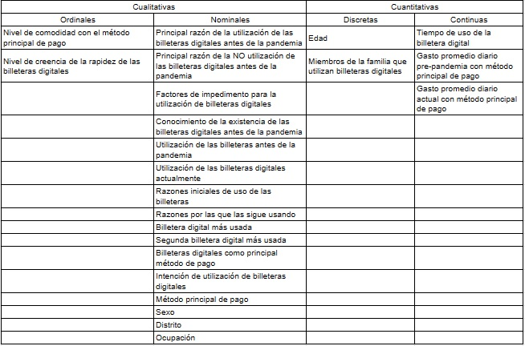

```{r, include = FALSE}
librerias <- c("dplyr", 
               "funModeling", 
               "modeest", 
               "readr", 
               "reshape", 
               "stringr")

# Comprobación de librerías
for (libreria in librerias) {
  if (!require(libreria, character.only = TRUE)) {
    install.packages(libreria)
  }
  library(libreria, character.only = TRUE)
}

DF <- read_csv("Encuesta.csv", show_col_types = FALSE)
```

## **1. Introducción**

Durante la pandemia del COVID-19, muchos ciudadanos consideraron riesgoso el contacto con otras personas u objetos, debido al temor de ser contagiados. En particular, la acción de dar o recibir dinero se percibía como peligrosa para la salud, ya que no se sabía si la otra persona estaba contagiada o no. A través de este intercambio de dinero, existía la posibilidad de contagio hacia el receptor. Como resultado, surgió la necesidad de encontrar una forma de realizar pagos sin tener que utilizar efectivo, además de ser de fácil uso y accesible para toda la población. Así es como se popularizó el uso de las billeteras digitales, ofreciendo una alternativa acorde a las necesidades que ameritaba el estado de emergencia.

Debido a esta situación, se ha generado la importancia de comprender el impacto de la pandemia en el uso de las billeteras digitales. Su adopción continúa en aumento y se decidió realizar un estudio en Lima Metropolitana para obtener una mayor variedad de distritos y recopilar diversas opiniones al respecto.

### 1.1. Relevancia

Este estudio nos permitirá analizar las razones de por qué las billeteras digitales se volvieron de uso cotidiano en la población de Lima Metropolitana, puesto que las billeteras digitales ahora son parte de nuestro día a día y se utilizan tanto para transferencias como para pagos de servicios. De esta manera, se podrá saber más sobre ello y ver como ha ido evolucionando en el lapso de tiempo de la pandemia.

### 1.2. Objetivos

-   Determinar las razones de por qué las personas no usaban las billeteras digitales antes de la pandemia en Lima Metropolitana, mayo de 2023.

-   Identificar las razones del cambio a las billeteras digitales durante o tras la pandemia en Lima Metropolitana, mayo de 2023.

-   Evaluar los factores predominantes que influyen en la permanencia en el uso de billeteras virtuales tras el término de la pandemia en Lima Metropolitana, mayo de 2023.

### 1.3. Contexto

A inicios de 2020 empezó una pandemia mundial, aislando a la población entera en sus hogares y evitando, en la medida de lo posible, el contacto entre las personas. Esta pandemia empezó a terminar a finales de 2022 y con ello empezó la popularidad de las billeteras digitales que ganaron terreno como medio de pago más usado con respecto al efectivo debido a que este se quedaba obsoleto frente a lo que las billeteras digitales ofrecían a la población.

## **2. Datos**

### 2.1. Recolección de datos

-   La recolección de datos se trabajo mediante una encuesta virtual, con preguntas de opción múltiple, cerradas, abiertas, cortas y condicionales, por lo que, el estudio constará de varios datos faltantes por la forma en la que se planteó la encuesta. Aún así, algunos datos faltantes se pueden deber por la omisión de las preguntas.

-   La encuesta digital nos permitió construir una base de datos y tener control total de los datos obtenidos y su manipulación (limpieza), además de ahorrar tiempo al solucionar algún inconveniente adicional que se presente.

-   Se optó por compartir la encuesta mediante redes sociales (WhatsApp, Facebook, Telegram), además de familiares y conocidos para que también la difundan.

### 2.2. Población, muestra y muestreo

-   Población: La población de Lima Metropolitana.

-   Muestra: 170 residentes del total de la población de Lima Metropolitana.

-   Muestreo: Se realizó usando un muestreo aleatorio simple.

### 2.3. Variables

Las variables de este estudio son las siguientes:

<center></center>

## **3. Limpieza de la base de datos**

La limpieza de datos se realizó para lograr obtener un análisis óptimo que refleje de la mejor manera los datos recolectados. Cada parte de este proceso está detallada con su respectiva modificación y/o manipulación.

### 3.1. Re-asignación y eliminación de variables

Debido a que se utilizó Google Forms, esta herramienta guarda las respuestas (variables) con el nombre de la pregunta que aparecía en la encuesta que llenaron los participantes. Por esta razón, es importante renombrarlas para facilitar la manipulación.

Por otro lado, Google Forms crea una variable ("Marca temporal"), que registra la fecha en que fue llenada la encuesta. Dado que esta información no es relevante para el estudio, es oportuna eliminarla

-   Nombres pre-asignación y eliminación

```{r, echo=TRUE}
names(DF)
```

```{r, include=FALSE, echo=TRUE}
Nombres_de_columnas<-c("Edad", "Sexo", "Distrito", "Ocupación","Conocimiento de la existencia de las billeteras digitales antes de la pandemia", "Utilización de las billeteras digitales antes de la pandemia", "Principal razón de la utilización de las billeteras digitales antes de la pandemia", "Principal razón de la NO utilización de las billeteras digitales antes de la pandemia", "Utilización de las billeteras digitales actualmente", "Billetera digital más usada", "Segunda billetera digital más usada", "Tiempo de utilización de la billetera digital", "Razones iniciales de uso", "Razones actuales de uso", "Billeteras digitales como principal método de pago", "Intención de utilización de billeteras digitales", "Método principal de pago", "Factores de impedimento para la utilización de billeteras digitales", "Gasto promedio diario pre-pandemia con método principal de pago", "Gasto promedio diario actual con método principal de pago", "Nivel de comodidad con el método principal de pago", "Nivel de creencia de la rapidez de las billeteras digitales", "Miembros de la familia que utilizan billeteras digitales")

DD <- select(DF, -'Marca temporal')
names(DD) = Nombres_de_columnas
```

-   Nombres post-asignación y eliminación

```{r, echo=TRUE}
names(DD)
```

### 3.2. Reclasificación de variables

Algunas de las variables, al importarlas a RStudio, no son reconocidas como deberían. Por este motivo, es importante clasificarlas de manera manual.

-   Identificación de las clases de las variables

```{r, echo=TRUE}
glimpse(DD) # Nota: La clase de la variable se muestra a la derecha de su nombre
```

Como se aprecia, las variables "Nivel de comodidad con el método principal de pago" y "Nivel de creencia de la rapidez de las billeteras digitales" son detectadas como *double* (numéricas), cuando, en realidad, deberían ser *chr* (categóricas), ya que corresponden a escalas.

Realización del cambio y verificación:

```{r, echo=TRUE}
DD$`Nivel de comodidad con el método principal de pago` <- as.character(DD$`Nivel de comodidad con el método principal de pago`)

DD$`Nivel de creencia de la rapidez de las billeteras digitales`  <- as.character(DD$`Nivel de creencia de la rapidez de las billeteras digitales`)


glimpse(DD)
```

Ahora las variables "Nivel de comodidad con el método principal de pago" y "Nivel de creencia de la rapidez de las billeteras digitales" están clasificadas correctamente.

### 3.3. Corrección de datos

Dentro de la encuesta, habían campos donde el usuario debía especificar, en caso no encuentre dentro de una lista de opciones, las billeteras digitales que usaba.

Para este caso, es importante contabilizar las respuestas y verificar que todas sean únicas.

```{r, echo=TRUE}
table(DD$`Billetera digital más usada`) # Contabilización de la billetera digital usada en primera instancia

table(DD$`Segunda billetera digital más usada`) # Contabilización de la billetera digital usada en segunda instancia (ej: Transacciones que no le permita la primera.)
```

Como se visualiza en el recuento, hay opciones que se contabilizan de manera separada, aunque sean lo mismo (debido a la forma en cómo han sido escritas). Por otro lado, por uniformidad y mejor visualización, las opciones serán reescritas como nombres (primera letra mayúscula).

Realización del cambio y verificación:

```{r, echo=TRUE}
DD$`Billetera digital más usada` <- replace(DD$`Billetera digital más usada`, DD$`Billetera digital más usada` == "APPLE WALLET", "Apple Wallet")

DD$`Segunda billetera digital más usada` <- replace(DD$`Segunda billetera digital más usada`, DD$`Segunda billetera digital más usada` == "Apple pay", "Apple Pay")


table(DD$`Billetera digital más usada`)

table(DD$`Segunda billetera digital más usada`)
```

### 3.4. Eliminación de observaciones

El criterio para la eliminación de observaciones se basó en descartar aquellas respuestas que hayan colocado como gasto promedio diario con ciertas billeteras digitales montos que no son posibles con estas (debido a restricciones propias de las aplicaciones).

```{r, echo=TRUE}
Billeteras_con_límite <- c("Yape", "Tunki", "Plin", "Agora Pay")

Montos_límite <- c(950, 500, 1500, 1500)

for (i in range(length(Billeteras_con_límite))){
  DD <- DD[!(DD$`Utilización de las billeteras digitales actualmente` == "Sí" & DD$`Billeteras digitales como principal método de pago` == "Sí" & DD$`Billetera digital más usada` == Billeteras_con_límite[i] & DD$`Gasto promedio diario actual con método principal de pago` > Montos_límite[i]), ]
} 
```

No hubo ninguna observación que cumpla con dichas condiciones, pero era importante la codificación ya que la presencia de este tipo de datos alteraría el análisis de datos.

#### 3.5. Manejo de NA's

A pesar que la encuesta fue construida de tal manera que no haya NA's en datos que tenían que estar obligatoriamente llenados (preguntas para todos los encuestados, independientemente de ciertas condiciones), es importante corroborar que no se hayan generado por algún error al extraer la base de datos.

```{r, echo=TRUE}
df_status(DD, FALSE) # De esta manera, vemos el resumen de NA's. El dato es dado por q_na.
```

Una vez visualizada la tabla, se codifican las condiciones para verificar que no haya NA's no deseados. Además, se imprimirá un mensaje de confirmación.

```{r, echo=TRUE}
if ( length(grep("No", DD$`Conocimiento de la existencia de las billeteras digitales antes de la pandemia`)) == sum(is.na(DD$`Utilización de las billeteras digitales antes de la pandemia`)) ) {
  print("No hay NA's a considerar: Las personas que no conocían las billeteras digitales prepandemia no respondieron la pregunta sobre el uso en el mismo periodo.")
}

if ( ( (dim(DD)[1] - length(grep("Sí", DD$`Utilización de las billeteras digitales antes de la pandemia`))) == sum(is.na(DD$`Principal razón de la utilización de las billeteras digitales antes de la pandemia`)))
     & (dim(DD)[1] - (length(grep("No", DD$`Utilización de las billeteras digitales antes de la pandemia`))) ==  sum(is.na(DD$`Principal razón de la NO utilización de las billeteras digitales antes de la pandemia`))) ) {
  print("No hay NA's a considerar: Tanto la gente que usaba las billeteras digitales prepandemia es la misma que la que explicó su razón. Quienes no usaron, explicaron la suya.")
}

Uso_actual_de_bd_comp <- c(
  length(grep("Sí", DD$`Utilización de las billeteras digitales actualmente`)), 
  dim(DD)[1] - sum(is.na(DD$`Billetera digital más usada`)), 
  dim(DD)[1] - sum(is.na(DD$`Segunda billetera digital más usada`)),
  dim(DD)[1] - sum(is.na(DD$`Tiempo de utilización de la billetera digital`)),
  dim(DD)[1] - sum(is.na(DD$`Razones iniciales de uso`)),
  dim(DD)[1] - sum(is.na(DD$`Razones actuales de uso`)),
  dim(DD)[1] - sum(is.na(DD$`Billeteras digitales como principal método de pago`)))

if ( length(unique(Uso_actual_de_bd_comp)) == 1){
  print("No hay NA's a considerar: No hay datos faltantes en las preguntas derivadas del uso actual de billeteras digitales.")
}

if ( length(grep("No", DD$`Utilización de las billeteras digitales actualmente`)) == (dim(DD)[1] - sum(is.na(DD$`Intención de utilización de billeteras digitales`))) ){
  print("No hay NA's a considerar: Las personas que no usan billeteras digitales han respondido la pregunta acerca de su intención de uso.")
}

if ( (dim(DD)[1] - sum(is.na(DD$`Método principal de pago`))) ==  (dim(DD)[1] - sum(is.na(DD$`Factores de impedimento para la utilización de billeteras digitales`)))){
  print("No hay NA's a considerar: Quienes usan un método de pago diferente han contestado la pregunta acerca del porqué no usan una billetera digital como principal.")
}
```

## **4. Análisis descriptivo**

### 4.1. Tiempo de uso de las billeteras digitales

```{r, include = FALSE}
attach(DD)
```

#### 4.1.1. Diagrama de densidad
```{r, echo=FALSE}
T1 <- filter(DD, is.na(DD$`Tiempo de utilización de la billetera digital`) == FALSE)

G1 <- plot(density(T1$`Tiempo de utilización de la billetera digital`), 
     
     col = "#E84855", 
     main = "Gráfico 1: Tiempo de utilización de las billeteras digitales",
     
     xlab = "Meses de uso",
     ylab = "Densidad")
```

**Análisis de la gráfica 1: Una gran mayoría de los encuestados que usan este método de pago tienen un tiempo de uso menor a 30 meses, aproximadamente. En otras palabras, comenzaron a usarlo a finales de la pandemia. Además se puede observar una distribución sesgada hacía la derecha.**

#### 4.1.2. Descriptores de posición Y de dispersión
```{r, echo=FALSE}
V1 <- mfv(DD$`Tiempo de utilización de la billetera digital`, na_rm = TRUE)
V2 <- round(sd(DD$`Tiempo de utilización de la billetera digital`, na.rm = TRUE), 2)

coef_var <- function(x, na.rm = FALSE) {
  sd(x, na.rm = na.rm) / mean(x, na.rm = na.rm)
}

V3 <- round(coef_var(DD$`Tiempo de utilización de la billetera digital`, na.rm = TRUE), 2)
```

```{r, echo=TRUE}
summary(DD$`Tiempo de utilización de la billetera digital`)
sprintf("La moda es: %d", V1)
sprintf("La desviación estándar es: %f", V2)
sprintf("El coeficiente de variación es: %f", V3)
```

**Análisis: La mayoría de los encuestados tiene un uso de las billeteras digitales de 24 meses, es decir, la utilización de las billeteras digitales empezaron en la finalización de la pandemia ratificando el gráfico 1.**


#### 4.1.3. Boxplot

------------------------------------------------------------------------

Debido a que el coeficiente de variación es alto, la mediana es la que mejor representaría a la población y para un mejor análisis de la variable se utilizaría un boxplot.

------------------------------------------------------------------------

```{r, echo=FALSE}
G2 <- boxplot(DD$`Tiempo de utilización de la billetera digital`,
        
        # Configuración del título
        main = "Gráfico 2.1: Tiempo de utilización de las billeteras digitales",
        
        # Configuración de los ejes
        ylab = "Tiempo de uso (meses)",
        
        # Configuración de los bloques
          col = "#E84855")
```

------------------------------------------------------------------------

Como la variable posee valores extremos que nos impiden observar y analizar detalladamente el boxplot, entonces se procederá a eliminar aquellos datos extremos del gráfico.

------------------------------------------------------------------------

```{r, echo=FALSE}
iqtiempo <- IQR(DD$`Tiempo de utilización de la billetera digital`, na.rm=TRUE)

maxtiempo <- quantile(DD$`Tiempo de utilización de la billetera digital`,0.75,na.rm=TRUE)+1.5*iqtiempo
  
DT <- filter(DD, DD$`Tiempo de utilización de la billetera digital` < maxtiempo)
G2 <- boxplot(DT$`Tiempo de utilización de la billetera digital`,
        
        # Configuración del título
        main = "Gráfico 2.2: Tiempo de utilización de las billeteras digitales",
        
        # Configuración de los ejes
        ylab = "Tiempo de uso (meses)",
        
        # Configuración de los bloques
          col = "#E84855")
```

**Análisis de la gráfica 2.2: El tiempo de uso de billeteras digitales en la mitad de sus usuarios oscila entre 8 y 24 meses, ratificando que una gran parte de los encuestados empezaron a usar las billeteras digitales en las fechas de la finalización de la pandemia. Además, existe una mayor variación de respuestas en el rango de 24-48 meses, correspondiente a las fechas en las que había pandemia de por medio.**

### 4.2. Comparación entre el conocimiento de la existencia de las billeteras digitales y su utilización (prepandemia)

```{r, echo=FALSE}
DD1 <- data.frame(`Conocimiento de la existencia de las billeteras digitales antes de la pandemia`, `Utilización de las billeteras digitales antes de la pandemia`)

DD1[is.na(DD1)] <- "No"

T3 <- table(DD1)

G3 <- mosaicplot(T3,
           
           # Configuración del título
           main = "Gráfico 3: Comparación entre el conocimiento de la existencia de las \nbilleteras digitales y su utilización (prepandemia)",
           
           # Configuración de los bloques
           col = c("#E84855", "#0091AD"),
           
           # Configuración de los ejes
           xlab = "Conocimiento",
           ylab = "Utilización",)
```

**Analisis de la gráfica 3: La falta de conocimiento sobre las billeteras digitales fue el factor clave que impedía su adopción en el pasado, antes de que la pandemia tuviera lugar.**

### 4.3. Contabilización de la principal razón de la no utilización de billeteras digitales en usuarios que conocían de la existencia de este método de pago (prepandemia)

------------------------------------------------------------------------

Para analizar mejor a aquellos que sí tenían conocimiento de las billeteras digitales antes de la pandemia y las principales razones por las que no utilizaban este medio de pago antes de la pandemia se hará uso de un gráfico de barras.

------------------------------------------------------------------------

```{r, echo=FALSE}
T4 <- table(`Principal razón de la NO utilización de las billeteras digitales antes de la pandemia`)

G4 <- barplot(T4, 
        
        # Configuración del título
        main = "Gráfico 4: Principal razón de la NO utilización de billeteras digitales \nprepandemia (usuarios que conocían el método de pago)",
        cex.main = 1.1,
        font.main = 2,
        
        
        # Configuración de los ejes
        ylim = c(0, 25),
        ylab = "Cant. personas",
        cex.lab = 0.95,
        font.lab = 1,
        
        # Barras
        col = c("#403F4C", "#E84855", "#F9DC5C", "#0091AD"),
        names.arg = FALSE)

legend(x = "bottom",
       legend = rownames(T4), 
       fill = c("#403F4C", "#E84855", "#F9DC5C", "#0091AD"), 
       cex = 0.75,
       inset = c(0, -0.3),
       xpd = TRUE)

grid(nx = NA, ny = NULL, lwd = 1, lty = 1, col = "gray")

text(G4, T4 + 1.5, labels = T4)
```

**Análisis de la gráfica 4: La poca/nula necesidad de las personas para el uso de esta billetera digital prepandemia es la principal razón por la que este medio de pago no era tomado en cuenta para los que no usaban este medio de pago**

### 4.4. Contabilización de los usuarios de billeteras digitales a partir de sus razones iniciales de uso

```{r, echo = FALSE}
T5 <- table(str_split_fixed(DD$`Razones iniciales de uso`, ", ", 4))[2:6]

G5 <- barplot(T5,
              
        # Configuración del título
        main = "Gráfico 5: Razones iniciales de uso de billeteras digitales",
        cex.main = 1.1,
        font.main = 2,
        
        # Configuración de los ejes
        ylim = c(0, 100),
        ylab = "Cant. personas",
        cex.lab = 0.95,
        font.lab = 1,
        
        # Barras
        col = c("#403F4C", "#E84855", "#F9DC5C", "#0091AD", "#55D6BE"),
        names.arg = FALSE)

legend(x = "bottom",
       legend = rownames(T5), 
       fill = c("#403F4C", "#E84855", "#F9DC5C", "#0091AD", "#55D6BE"), 
       cex = 0.75,
       inset = c(0, -0.338),
       xpd = TRUE)

grid(nx = NA, ny = NULL, lwd = 1, lty = 1, col = "gray")

text(G5, T5 + 7, labels = T5)
```

**Análisis de la gráfica 5: La comodidad y necesidad se presentan como los factores más importantes al momento de empezar a usar las billeteras digitales, además a pesar de la existencia del COVID-19 se puede observar una limitada cantidad de personas que eligieron esta opción como una de las razones por la cual empezaron a usar este medio de pago.**

### 4.5. Factores predominantes que influyen en la permanencia en el uso de billeteras virtuales tras el término de la pandemia en Lima Metropolitana

```{r, echo = FALSE}
T6 <- table(str_split_fixed(DD$`Razones actuales de uso`, ", ", 4))[2:5]

G6 <- barplot(T6,
              
        # Configuración del título
        main = "Gráfico 6: Razones actuales de uso de billeteras digitales",
        cex.main = 1.1,
        font.main = 2,
        
        # Configuración de los ejes
        ylim = c(0, 100),
        ylab = "Cant. personas",
        cex.lab = 0.95,
        font.lab = 1,
        
        # Barras
        col = c("#403F4C", "#E84855", "#F9DC5C", "#0091AD", "#55D6BE"),
        names.arg = FALSE)

legend(x = "bottom",
       legend = rownames(T6), 
       fill = c("#403F4C", "#E84855", "#F9DC5C", "#0091AD", "#55D6BE"), 
       cex = 0.75,
       inset = c(0, -0.3),
       xpd = TRUE)

grid(nx = NA, ny = NULL, lwd = 1, lty = 1, col = "gray")

text(G6, T6 + 5.5, labels = T6)
```

**Análisis del gráfico 5: La comodidad y la necesidad son las principales razones para la permanencia en el uso de billeteras, es decir, las personas priorizaron un fácil acceso a su dinero y estar adaptados a su entorno antes que otras razones como seguridad y costumbre para seguir usando este medio de pago.**

------------------------------------------------------------------------

- De los gráficos 5 y 6, se puede concluir que el uso de las billeteras digitales se debe a una cuestión de comodidad para el usuario y facilidad para pagar debido a una necesidad de que el entorno del usuario también use en su mayoría las billeteras digitales.

------------------------------------------------------------------------

### 4.6. Comparación entre la comodidad de los encuestados con su método principal de pago y su método principal de pago

```{r, echo=FALSE}
DD2 <- data.frame(`Nivel de comodidad con el método principal de pago`, `Método principal de pago`)

DD2[is.na(DD2)] <- "Billetera digital"

T7 <- table(DD2)

G7 <- mosaicplot(T7, 
           
           # Configuración del título
           main = "Gráfico 7: Comodidad de los encuestados con su método principal \nde pago",
           
           # Configuración de los ejes
           xlab = "Nivel de comodidad",
           ylab = "Método principal de pago",
           
           # Configuración de los bloques
           color = c("#403F4C", "#E84855", "#F9DC5C", "#0091AD", "#55D6BE"),
           las = 1)
```

**Análisis: La billetera digital en su mayoría ofrece un nivel de comodidad alto (4-5) en comparación de otros métodos de pago, confirmando que para los usuarios de billeteras digitales la comodidad es la principal razón de su uso. El efectivo por su parte presenta una mayor variación con respecto al nivel de comodidad, se observa incremento de usuarios a los cuales les parece que este medio de pago ofrece un nivel de comodidad bajo (1-3).**

### 4.7. Comparación del gasto prepandemia y postpandemia con la billeteras digital más usadas para los usuarios que no las usaban prepandemia

#### 4.7.1. Diagrama de dispersión

```{r, echo=FALSE}
iqpre <- IQR(DD$`Gasto promedio diario pre-pandemia con método principal de pago`, na.rm=TRUE)
iqpost <- IQR(DD$`Gasto promedio diario actual con método principal de pago`, na.rm=TRUE)

maxpre <- quantile(DD$`Gasto promedio diario pre-pandemia con método principal de pago`,0.75,na.rm=TRUE)+3*iqpre
maxpost <- quantile(DD$`Gasto promedio diario actual con método principal de pago`,0.75, na.rm=TRUE)+3*iqpost
  
DD3 <- filter(DD, DD$`Gasto promedio diario actual con método principal de pago` < maxpost)
DD3 <- filter(DD3, DD3$`Gasto promedio diario pre-pandemia con método principal de pago` < maxpost)


DD4 <- filter(DD3, (DD3$`Utilización de las billeteras digitales antes de la pandemia`== "No") | (DD3$`Conocimiento de la existencia de las billeteras digitales antes de la pandemia` == "No"))

ColoresG8 = c("#403F4C", "#E84855")

G8 <- plot(x = DD4$`Gasto promedio diario actual con método principal de pago`, 
     y = DD4$`Gasto promedio diario pre-pandemia con método principal de pago`, 
     pch = 20,
     
     # Configuración del título
     main = "Gráfico 8: Pre vs postpandemia del promedio del gasto diario de los que usuarios \nactuales de billeteras digitales", 
     cex.main = 1,
     
     # Configuración del subtitulo
     sub = "* Nota: Usuarios que, prepandemia, no usaban billeteras digitales",
     cex.sub = 0.8,
     
     # Configuración de los ejes
     xlab = "Postpandemia", 
     ylab = "Prepandemia",
     
     col = ColoresG8[factor(DD4$`Billetera digital más usada`)])

legend(x = "topleft", legend = levels(factor(DD4$`Billetera digital más usada`)), fill = ColoresG8, title = "Billetera digital \n a la que migraron")

```

**Análisis: La mayoría de usuarios que han migrado durante o tras la pandemia manejan cantidades de dinero baja con las billeteras digitales (hasta S/50) y usan aplicativos que son conocidos para transferencias de ese tipo (Yape y Plin). Además, se refleja cierto aumento en la cantidad gastada postpandemia con respecto a la prepandemia.**

#### 4.7.2. Relación lineal

```{r, echo = FALSE}
DD4P <- filter(DD4, DD4$`Billetera digital más usada`=="Plin")
DD4Y <- filter(DD4, DD4$`Billetera digital más usada`=="Yape")
corrP1 <- cor(DD4P$`Gasto promedio diario actual con método principal de pago`, DD4P$`Gasto promedio diario pre-pandemia con método principal de pago`)
corrY1 <- cor(DD4Y$`Gasto promedio diario actual con método principal de pago`, DD4Y$`Gasto promedio diario pre-pandemia con método principal de pago`)
```

```{r}
sprintf("La covarianza de ambas variables para los usuarios de Plin es: %f", corrP1)
sprintf("La covarianza de ambas variables para los usuarios de Yape es: %f", corrY1)
```

**Análisis: Tanto para los usuarios de Yape como de Plin actuales que no usaban las billeteras digitales prepandemia se puede afirmar que el gasto postpandemia y gasto prepandemia están relacionados directamente, es decir, para un gasto mayor postpandemia se va a encontrar un gasto mayor prepandemia y viceversa. Además, los usuarios de Yape son los que tienen una mayor tendencia en esta relación que los usuarios de Plin.**

------------------------------------------------------------------------

- Como el gasto postpandemia es mayor que el prepandemia, se puede afirmar que en su mayoría existirá que hay un mayor gasto postpandemia que prepandemia, por lo que, las billeteras digitales implican un gasto diario mayor.

------------------------------------------------------------------------

### 4.8. Comparación del gasto prepandemia y postpandemia con la billeteras digital más usadas para los usuarios que sí las usaban prepandemia

#### 4.8.1. Diagrama de dispersión

```{r, echo = FALSE}

DD5 <- filter(DD3, DD3$`Billeteras digitales como principal método de pago` == "Sí")
DD5 <- filter(DD5, DD5$`Utilización de las billeteras digitales antes de la pandemia`== "Sí")

ColoresG9 = c("#403F4C", "#E84855", "#F9DC5C", "#0091AD", "#55D6BE")

G9 <- plot(x = DD5$`Gasto promedio diario actual con método principal de pago`, 
     y = DD5$`Gasto promedio diario pre-pandemia con método principal de pago`, 
     pch = 20, 
     
     # Configuración del título
     main = "Gráfico 9: Pre vs postpandemia del promedio del gasto diario de los que usuarios \nactuales de billeteras digitales", 
     cex.main = 1,
     
     # Configuración del subtitulo
     sub = "* Nota: Usuarios que, prepandemia, usaban billeteras digitales",
     cex.sub = 0.8,
     
     # Configuración de los ejes
     xlab = "Postpandemia", 
     ylab = "Prepandemia",
     
     col = ColoresG9[factor(DD5$`Billetera digital más usada`)])

legend(x = "topleft", legend = levels(factor(DD5$`Billetera digital más usada`)), fill = ColoresG9, title = "Principal billetera \n digital usada")
```

**Análisis: La mayoría de los usuarios que usaban billeteras digitales prepandemia tienen un gasto por encima de 50 soles diarios postpandemia y las billeteras digitales más usadas son las que más populares (Yape y Plin). Además, se refleja un aumento considerable en el gasto diario postpandemia con respecto a la prepandemia.**

------------------------------------------------------------------------

- De las gráficas 8 y 9, se puede concluir que el gasto de dinero postpandemia tuvo un incremento con respecto a la prepandemia para los usuarios que actualmente usan billeteras digitales tanto para los que no las usaban prepandemia como para los que las usaban prepandemia.

------------------------------------------------------------------------

#### 4.8.2. Relación lineal

```{r, echo = FALSE}
DD5Y <- filter(DD5, DD5$`Billetera digital más usada`=="Yape")
corrV <- cor(DD5$`Gasto promedio diario actual con método principal de pago`, DD5$`Gasto promedio diario pre-pandemia con método principal de pago`)
corrY2 <- cor(DD5Y$`Gasto promedio diario actual con método principal de pago`, DD5Y$`Gasto promedio diario pre-pandemia con método principal de pago`)
```


------------------------------------------------------------------------

Debido a que para las billeteras digitales Apple Wallet y Apple Pay solo constan de 1 usuario y los usuarios de Plin son solo 3, se va a realizar el análisis de relación lineal con los usuarios de Yape y con todas las billeteras digitales en conjunto.

------------------------------------------------------------------------

```{r}
sprintf("La covarianza de ambas variables para los usuarios de Yape es: %f", corrY2)
sprintf("La covarianza de ambas variables para todos los usuarios: %f", corrV)
```

**Análisis: Tanto para los usuarios de Yape como de billeteras digitales en general que usaban las billeteras digitales prepandemia se puede afirmar que el gasto postpandemia y gasto prepandemia están relacionados directamente, es decir, para un gasto mayor postpandemia se va a encontrar un gasto mayor prepandemia y viceversa. Además, los usuarios de Yape son los que tienen una relación más directa.**

------------------------------------------------------------------------

- Como el gasto postpandemia es mayor que el prepandemia, se puede afirmar que en su mayoría existirá que hay un mayor gasto postpandemia que prepandemia, por lo que, la pandemia tuvo un efecto de mayor consumo en los usuarios de billeteras digitales y por consecuencia un mayor uso de estas para los que anteriormente usaban las billeteras digitales.

------------------------------------------------------------------------
