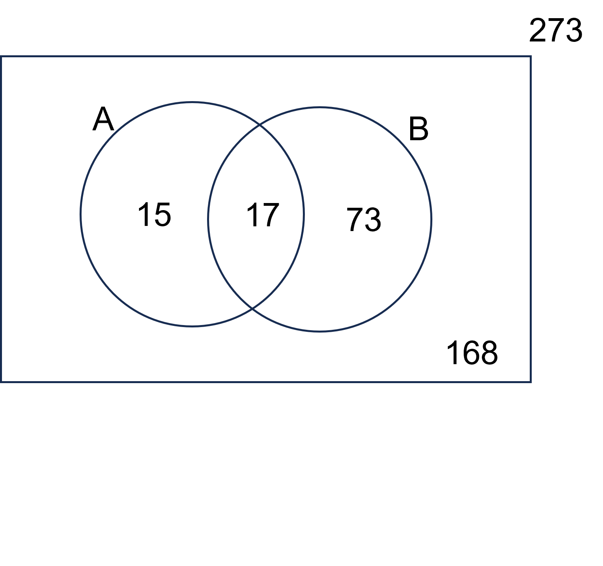
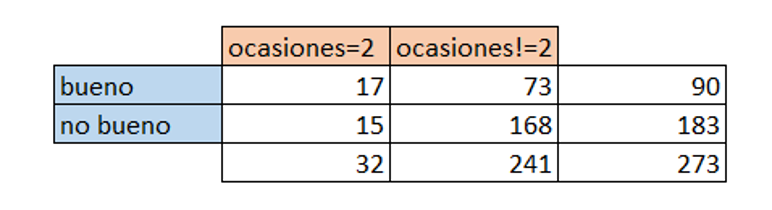
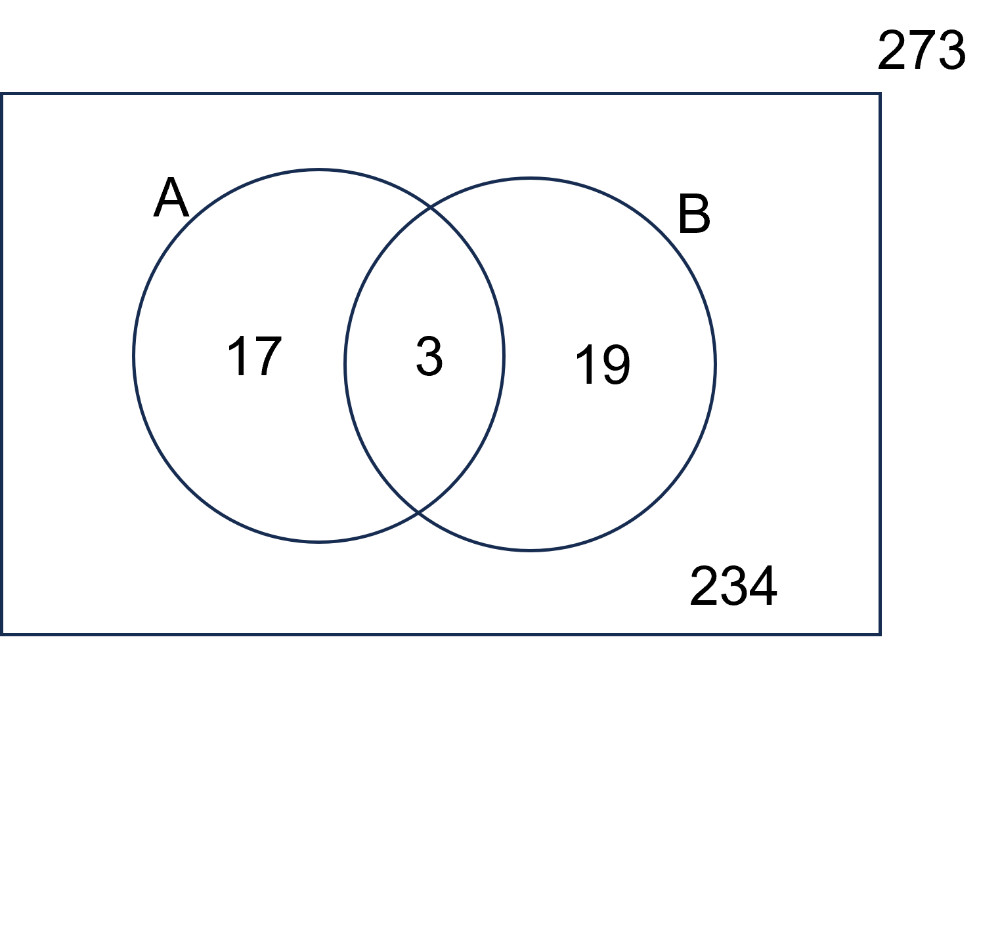
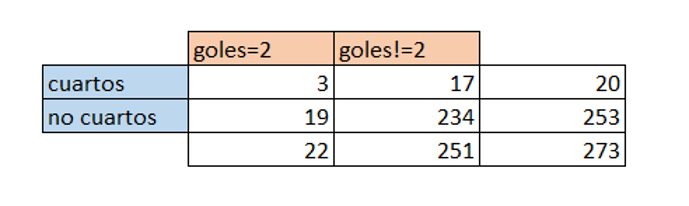

# **Tema: Rendimiento de equipos sudamericanos**
Análisis del rendimiento de equipos sudamericanos en la Copa Sudamericana en los últimos 5 años   


## **Introducción**

<div style="text-align: justify"> El fútbol, es el deporte más popular de América latina, dentro de ello existen competiciones importantes, así como lo es "La Copa Conmebol Sudamericana", la segunda competición más importante y prestigiosa a nivel de clubes de América del sur, el cual está organizado por la Confederación Sudamericana de Fútbol (CONMEBOL).

## **Relevancia**

<div style="text-align: justify"> La Copa Conmebol Sudamericana es un atrayente de que sirve como generador de éxito, prestigio y dinero, pues el ganador obtiene 3,5 millones de euros aproximadamente, además levantar la copa y también habilitar la opción hacia dos títulos internacionales más: La "Conmebol Recopa" en el que enfrenta contra el campeón de la Copa Conmbebol Libertadores y "La Suruga Bank" (hasta el año 2019), el cual es un torneo jugado en Japón, en el que se enfrenta contra el ganador de dicho país asiático(actualmente no se han seguido realizando esta competencia).

<div style="text-align: justify"> El modelo de la Copa Conmebol Sudamericana es uno de los más complicados, debido a que inicia con partidos de eliminación directa entre equipos de zona sur y zona norte, las normas de dicho campeonato están en constante modificación debido a que no logran representar de manera equitativa a los equipos de todos los países en todas las etapas de la competencia. 

## **Objetivo general:**  
<div style="text-align: justify"> Realizar un análisis del rendimiento de los clubes de los países sudamericanos en la Copa Conmbebol Sudamericana durante los últimos 5 años, con el objetivo de identificar los patrones de desempeño de los equipos y su evolución a lo largo del tiempo, así como también proponer posibles mejoras en la competición.   

## **Objetivos específicos:**
Objetivos:
1) Realizar un análisis del rendimiento de los clubes de los países sudamericanos en la Copa Conmbebol Sudamericana durante los últimos 5 años, con el objetivo de identificar los patrones de desempeño de los equipos y su evolución a lo largo del tiempo, así como también proponer posibles mejoras en la competición.   
2) Analizar el rendimiento de los equipos sudamericanos en términos de número de ocasiones claras de gol y ocasiones claras de gol falladas, así como también la cantidad de goles anotados y recibidos.
3) Identificar el país con los equipos más exitosos en la Copa Sudamericana durante los últimos 5 años en relación a la etapa en la que fueron eliminados.

# **Datos**

## Recolección de datos
+ POBLACIÓN: Los equipos Sudamericanos que participaron en la Copa.
+ MUESTRA:  Cada equipo que participa al menos en un partido en la Copa Sudamericana en los años 2018 - 2022
+ TAMAÑO DE LA MUESTRA: El número de equipos a analizar es 149 (total de equipos) y la muestra es representativa de la población total.
+ TIPO DE MUESTREO: El tipo de muestreo es un censo, ya que se seleccionaron a todos los equipos que participaron en la copa Sudamericana desde el año 2018 - 2022.


## Analisis de variables:  
Las variables de la base de datos se clasifican en numérica discreta (7), numérica continua (4), categórica nominal (2) y categórica ordinal (2), ademas con su respectiva restricción como se ve en la siguiente tabla:  


| **Variable**                            | **Tipo**              | **Restricción**       |  
|-----------------------------------------|-----------------------|-----------------------|  
| Año                                     | Numérica   Discreta   | Entero no negativo    |  
| Equipo                                  | Categórica Nominal    | Valores repetitivos   |  
| Edad_promedio                           | Numérica   Continua   | Cantidad muy variable |  
| Pais                                    | Categórica Nominal    | Valores repetitivos   |  
| Eliminación                             | Categórica Ordinal    | Orden inalterable     |  
| Goles                                   | Numérica   Discreta   | Entero no negativo    |  
| Rojas                                   | Numérica   Discreta   | Entero no negativo    |  
| Amarillas                               | Numérica   Discreta   | Entero no negativo    |  
| Posesion_balon                          | Numérica   Continua   | Cantidad muy variable |  
| Faltas                                  | Numérica   Continua   | Cantidad muy variable |  
| Partidos                                | Numérica   Discreta   | Entero no negativo    |  
| Prescicion_goles                        | Categórica Ordinal    | Orden inalterable     |  
| ocaciones.claras.falladas               | Numérica   Discreta   | Entero no negativo    |  
| ocaciones.claras                        | Numérica   Discreta   | Entero no negativo    |  
| rendimiento.de.ocaciones.claras         | Numérica   Continua   | Cantidad muy variable |


```{r}
libreria<-c("stringr","readr","plyr","dplyr","ggplot2")
for(i in libreria){
  if(!require(i,character.only = TRUE)){
    install.packages(i)
    library(i)
  }
}


```

```{r}
# Llamamos la base de datos limpia
datos2<-read_csv("DatosLimpios.csv",show_col_types = FALSE)
datos2
```

### Segundo gráfico
HACIENDO REFERENCIA AL OBJETIVO 2: Analizar el rendimiento de los equipos sudamericanos en términos de número de ocasiones claras de gol y ocasiones claras de gol falladas, así como también la cantidad de goles anotados.


```{r}
plot(datos2$`ocaciones claras`, datos2$Goles,
     xlab = "Numero de ocaciones claras",
     ylab = "Cantidad de Goles Anotados",
     main = "Rendimiento de los equipos sudamericanos")
abline(a = 0, b = 0.577, col = "red")
```

**ANALISIS DESCRIPTIVO:**

Línea Vertical: Número de ocasiones Claras Falladas
Línea Horizontal:Número de ocasiones Claras
Línea Diagonal: Representa el Rendimiento 
Punto en el gráfico: Representa a cada equipo


Equipo con gran cantidad de ocasiones claras de gol y alta cantidad de goles anotados: alto rendimiento; Mayor eficacia en generar goles y definición.

Equipo con gran cantidad de ocasiones claras de gol, pero menor cantidad de goles anotados: Bajo rendimiento, indicativo de problemas en definición.

Equipo con baja cantidad de ocasiones claras de gol pero alta cantidad de goles anotados: Alto rendimiento en aprovechar las ocasiones, con indicativo negativo en generar situaciones de gol.

Equipo con baja cantidades de ocasiones claras y baja cantidad de goles anotados: Bajo nivel de Rendimiento; menor eficaz en generar goles y definición

Conclusión: En general el rendimiento de un equipo se dará conforme se va alejando del cero de manera diagonal; es decir lo equipos que están cerca al cero de manera diagonal tienen menor rendimiento que los equipos que están al otro extremo diagonal del gráfico.

```{r}
lm(datos2$`ocaciones claras`~datos2$Goles,data=datos2)
```
Formulando la ecuación  de Regresión para el diagrama de dispersión:
$$B_0=1.84$$
$$B_1=1.18$$
Ecuación de regresión
$$y=1.84+1.18x$$


### Tercer y cuarto gráfico

HACIENDO REFERENCIA AL OBJETIVO 3. Identificar el país con los equipos más exitosos en la Copa Sudamericana durante los últimos 5 años en relación a la etapa en la que fueron eliminados.


- Cargamos el archivo de la base de datos y filtramos el año, país y eliminación, de las muestras para manipularlos
```{r, echo=FALSE} 
daton <- read.csv("DatosLimpios.csv")
daton
da<-filter(daton,Eliminación != "previa" )
```


- Modificamos algunos valores de País para que sea fácil su lectura, posteriormente establecemos el orden de nuestros valores a la hora de mostrar las gráficas
```{r}
daton$Pais<-str_replace(daton$Pais,"Perú","Pe")
daton$Pais<-str_replace(daton$Pais,"Bolivia","Bo")
daton$Pais<-str_replace(daton$Pais,"Argentina","Ar")
daton$Pais<-str_replace(daton$Pais,"Chile","Ch")
daton$Pais<-str_replace(daton$Pais,"Uruguay","Uy")
daton$Pais<-str_replace(daton$Pais,"Paraguay","Py")
daton$Pais<-str_replace(daton$Pais,"Brasil","Br")
daton$Pais<-str_replace(daton$Pais,"Ecuador","Ec")
daton$Pais<-str_replace(daton$Pais,"Colombia","Co")
daton$Pais<-str_replace(daton$Pais,"Venezuela","Ve")

```


```{r}
daton$Eliminación<-str_replace(daton$Eliminación,"campeon","final")
daton$Eliminación<-factor(daton$Eliminación, levels = c("final", "semis", "cuartos", "octavos"))
daton$Pais<-factor(daton$Pais, levels = c("Br", "Ar","Co","Ec","Uy","Ve","Py","Pe","Bo"))
da<-filter(daton,Eliminación != "previa" )

datos<-select(da,Año,Pais,Eliminación)
datos
```


- Vamos a establecer primero la cantidad de equipos participantes de en los ultimos 5 años de cada pais

```{r}
barplot(table(datos$Pais), col = c("green", "skyblue","yellow","purple","blue","brown","pink","orange","red","lightgreen"), main = "Cantidad de equipos participantes",cex.axis = 0.8, cex.names = 0.7)

```
- Luego estableceremos un mosaico de hasta que posciciones llegaron los equipos de cada pais en los 5 años:


**Copa Sudamericana 2018 - 2022**
```{r}
mosaicplot(table(da$Pais,da$Eliminación), col = c("yellow", "skyblue","orange","purple",""),cex.axis = 0.6,main="Tabla de equipos vs eliminacion")
```
**ANÁLISIS DESCRIPTIVO:**

En cuanto a la primera gráfica de cantidad de equipos participantes de cada país a partir de octavos de final en los últimos 5 años, podemos ver que los países que tienen más equipos en las competiciones son Argentina y Brasil, por el otro lado el país que tiene menos cupos es Bolivia, ahora veremos si la cantidad de cupos afecta al desempeño de los equipos de los países.

El índice de dificultad ósea de mayor mérito es esta: final>semis>cuartos>octavos
En la siguiente gráfica se muestra el porcentaje de instancias alcanzadas en cada país, además de que la anchura de la columna representa la cantidad de equipos participantes.
Para el análisis, en teoría mientras más equipos haya en un país, el porcentaje de las instancias más altas debe ser estar mejor distribuidas.

Como se ven en la gráfica la afirmación se cumple en casi todos los equipos, a excepción de Ecuador, pero la relación respecto a los otros países si se cumple.

Podemos decir que la cantidad de equipos guarda una gran relación con la cantidad de instancias llegadas en cada país.


```{r}
D<-read_csv("DatosLimpios.csv")
D
```


# Probabilidad empirica

En mi base de datos hay 276 registros y los valores en la columna "Año de campeonato" son los siguientes:  
Valor 2018 54 veces  
Valor 2019: 54 veces  
Valor 2020: 54 veces  
Valor 2021: 56 veces  
Valor 2022: 56 veces  
El evento atómico asociado a 2018 años sería: "Seleccionar un año de campeonato como el 2018 en una muestra de tamaño 276".
La función de probabilidad para cada valor se calcularía de la siguiente manera:  
Probabilidad del valor 25: 54/276 = 0.196  
Probabilidad del valor 26: 54/276 = 0.196  
Probabilidad del valor 30: 54/276 = 0.196  
Probabilidad del valor 31: 56/276 = 0.202  
Probabilidad del valor 32: 56/276 = 0.202  

## Ideas para la PG2: Modelos probabilísticos  

Año de competición - Promedio de Edad  

“año de los 5 años” - “promedio de edad mayos o menor de 26 años”  


"promedio de edad" le asignamos dos valores: ">=26" y "<26":  
 “año de campeonato”: “2018,2019,2020,2021,2022”  
 
Definimos el evento  
-A: "Selecciona un equipo cuyo promedio de edad sea >=26"  
-B: "Selecciona un equipo en el año 2018/año de campeonato"  
  
Por ejemplo, si definimos lo siguiente:  
* La probabilidad de seleccionar el año 2018 en la muestra es 0.196.  
* La probabilidad de seleccionar a un año que no sea 2018 en la muestra, por complemento, es 0.804.  
* La probabilidad de que un equipo tenga de promedio de edad >=26 años en el 2018/año de campeonato es 0.159  
* La probabilidad de que un equipo tenga de promedio de edad >=26 años en todos los años que no sea 2018 es 0.424  
  
Por lo tanto P(A) = 0.196* 0.159+0.806 * 0.424 


# Probabilidad condicional para ocaciones claras y presición de goles

```{r,echo=FALSE}
dato2<-data.frame(O_claras=D$`ocaciones claras`,presicion=D$Prescicion_goles)
```

```{r,echo=FALSE}

daton<-filter(dato2,dato2$O_claras==2 & dato2$presicion=="bueno")
daton2<-filter(dato2,dato2$O_claras==2)
daton3<-filter( dato2,dato2$presicion=="bueno")

```
```{r}
A<-table(daton2$O_claras)
B<-table(daton3$presicion)
p8=0
p=0
for (i in A){
    p8=p8+(i/273)
    }
print(p8)  
print(" ")
for (i in B){
  p=p+(i/273)
}
print(p)
print(p*p8)
print(17/273)
```

A: seleccionar un equipo cuyo numero de ocasiones claras sea =2
B: seleccionar un equipo con precisión buena

p(A)=0.1172161
p(B)=0.3296703
p(A ∩ B)=0.06227106
p(A)x p(B)=0.03864268





ANALISIS DE DEPENDENCIA

1) PRODUCTO E INTERSECCION DE EVENTOS
$$P(A ∩ B)=P(A)*P(B)$$
$$0.06227106= 0.1172161*0.3296703$$
$$0.06227106≠0.03864267$$

2) PROBABILIDAD DE A DADO B

$$P(A|B)=P(A ∩ B)/P(B)$$
$$P(A|B)=0.06227106/0.3296703$$

$$P(A|B)=0.1888889$$
$$P(A|B)≠P(A)$$
$$0.1888888996≠0.1172161$$

3)PROBABILIDAD DE B DADO A (usando teorema de Bayes)

$$P(B|A)=(P(A|B)*P(B))/P(A)$$
$$P(B|A)=(0.1888889*0.3296703)/0.1172161$$

$$P(B|A)=0.5312501$$
$$P(B|A)≠P(B)$$
$$0.53121501102≠0.3296703$$
Nota: teniendo en cuenta que P(B|A)≠P(A)*P(B) así como también que la intersección de la la probabilidad de los eventos es diferente al producto de la probabilidad de cada uno de los eventos, entonces se puede afirmar que ambos eventos son dependientes.


#PROBABILIDAD CONDICIONAL PARA ELIMINACIÓN Y GOLES
```{r, echo=FALSE}
dato3<-data.frame(eliminación=D$Eliminación,goles=D$Goles)

```
```{r}

d1<-filter(dato3,dato3$eliminación=="cuartos")
d2<-filter( dato3,dato3$goles==4)
d3<-filter( dato3,dato3$goles==4 & dato3$eliminación=="cuartos")

```
```{r}
A2<-table(d2$goles)
B2<-table(d1$eliminación)
A2
B2
```
```{r}
pa=0
pb=0
for (i in A2){
    pa=pa+(i/273)
    
    }
print(pa)  
print(" ")
for (i in B2){
  pb=pb+(i/273)
}
print(pb)
print(pa*pb)
print(3/273)
```

A: seleccionar un equipo con una cantidad de goles= 2
B: seleccionar un equipo cuya eliminación sea en cuartos


p(A)=0.08058608
p(B)=0.07326007
p(A ∩ B)=0.01098901
p(A)x p(B)=0.005903742
1)1) PRODUCTO E INTERSECCION DE EVENTOS
$$P(A ∩ B)=P(A)*P(B)$$
$$0.01098901= 0.08058608*0.07326007$$
$$0.06227106≠ 0.005903742$$


2)PROBABILIDAD DE A DADO B

$$P(A|B)=P(A ∩ B)/P(B)$$
$$P(A|B)=0.01098901/0.07326007$$
```{r}
0.01098901/0.07326007
```

$$P(A|B)=0.15$$
$$P(A|B)≠ P(A)$$
$$0.15≠0.08058608$$
Nota: Como P(A|B)≠ P(A)*P(B) entonces podemos llegar a la conclusión de que los eventos son dependientes


3) PROBABILIDAD DE B DADO A (usando teorema de Bayes)
$$P(B|A)=(P(A|B)*P(B))/P(A)$$
$$P(B|A)=(0.15*0.07326007)/0.08058608$$
$$P(B|A)=0.1363636$$
$$P(B|A)≠P(B)$$
$$0.1363636≠0.07326007$$
Nota: teniendo en cuenta que P(B|A)≠P(A)*P(B) así como también que la intersección de la la probabilidad de los eventos es diferente al producto de la probabilidad de cada uno de los eventos, entonces se puede afirmar que ambos eventos son dependientes.


## MODELOS PROBABILISTICOS- VARIABLES DISCRETAS

+ **MODELO DE DISTRIBUCION BINOMIAL CON LA VARIABLE CANTIDAD DE GOLES**

Experimento: Se realiza una selección de un total de 273 equipos.Se desea elegir a algún equipo que tenga un total de goles igual a 2.

+ **DEFINICION DE VARIBALE ALEATORIA**

x => numero de equipos que hayan marcado un total de 2 goles durante el campeonato en un conjunto de n=273.

+ **IDENTIFICACION DE PARAMETROS**

X~Bin(p,n); donde { p=p(e); éxito es definido como encontrar un equipo que tenga numero de goles = 2, n => tamaño de muestra de la población.} 

+ **HALLAMOS LA PROBABILIDAD DE ÉXITO **

```{r, include=FALSE}
library(readr)
D<-read_csv("DatosLimpios.csv")
D
DU<-D$Goles
table(DU)
```
Teniendo en cuenta que hay 44 equipos que tuvieron un total de 2 goles la probabilidad de éxito seria:
$$p(exito)=44/273$$

+ **EJEMPLO DE CASO**

Se desea saber la probabilidad de que más de 50 equipos hayan metido 2 goles. Cabe recalcar que se tiene un total de 273 equipos.
A partir del enunciado se tiene:


-x~Bin(44/273,273) =>P(X>=50)

Calculamos P(X>=50)

```{r}
pbinom(50,273,44/273,lower.tail = FALSE)
```
P(X>=50) =0.1427734 =14.58%

+ **ANALISIS DE ESPERANZA Y VARIANZA**
```{r, include=FALSE}
esperanza<- 50*(44/273)
esperanza
varianza<-50*(44/273)*(1-44/273)
varianza
```
Esperanza: 8.058608

Varianza:  6.759785


#MODELO DE DISTRIBUCIÓN HIPERGEOMETRICA
Para usar este tipo de modelo probabilista se formulara la siguiente pregunta: ¿Cual es la probabilidad de que al escoger 10 equipos, sin reposicion, de manera aleatoria que tengan precisión buena, al menos 1 haya obtenido 5 tarjetas amarillas?
```{r}
hist(D$Amarillas, freq = FALSE, main = "Densidad de la tarjetas rojas",
     ylab = "Densidad",
     xlab = "Tarjetas",
     col = "skyblue")

dx <- density(D$Amarillas)

lines(dx, lwd = 2, col = "black")
```
Para llevar a cabo el caso de eventos se tomara en cuenta aquellos equipos que tengan un total de tarjetas amarillas equivalentes a  a 5.
```{r}
i<-i <- filter(D, D$Prescicion_goles == "bueno")
nrow(i)
nrow(filter(i, Amarillas==5))
```
Teniendo en cuenta que el valor de k=10,m=9,n=90 se tiene
```{r}
1 - phyper(q = 1, m = 9, n = 81, k = 10)
```
Nota: en conclusión la probabilidad de que al escoger un total de 10 equipos con presionen buena y que dentro de ellos encuentre  al menos 1 equipo que tenga 5 tarjetas amarillas es 0.2612052 o 26.12%.


#MODELOS PARA VARIABLES CONTINUAS

1) DISTRIBUCION NORMAL PARA POSESION DE BALON

```{r, echo=FALSE}
library(nortest) # IMPORTANTE INSTALAR ESA LIBRERIA

data<-read_csv("DatosLimpios.csv",show_col_types = FALSE )
```


Dado la grafica de posesion de balon, este guarda similitud con un modelo de distribucion normal.  
Con este modelo de distribucion normal contestar la siguiente pregunta: ¿Cual es la probabilidad de que un equipo llegue a instancias finales en la copa   sudamerica(octavos,cuartos,semis,final y campeon) teniendo una posesion promedio del balon mayor a 50%?  


GRAFICA EN GENERAL  
```{r}
hist(data$`Posesion_balon`, freq = FALSE, main = "Densidad de posesion",
     ylab = "Promedio de Posesion",
     xlab = "Posesion en %",
     col = "lightblue")
dx <- density(data$`Posesion_balon`)
lines(dx, lwd = 2,col = "black")
```

Para hallar la probabilidad en instacias altas, tengo que hallar la desviacion estandar y la media de la variable Posesion_balon en cada una de las instancias:  
```{r}
mean(data$Posesion_balon)
sd(data$`Posesion_balon`)
```
```{r}
val<-1-pnorm(q = 50, mean = 50.36337, sd = 8.306339)
val
```

Con toda la muestra se evidencia que el valor de posesion_balon esta cerca del 50%  

#### Calculo de la probilidad a partir de octavos:  
```{r}
x <- filter(data,Eliminación == "octavos" |Eliminación == "cuartos" |Eliminación == "semis" | Eliminación == "final" | Eliminación == "campeon")

mean(x$Posesion_balon)
sd(x$`Posesion_balon`)
```

```{r}
val<-1-pnorm(q = 50, mean = 50.765, sd = 6.540296)
val
```


#### Calculo de la probilidad a partir de cuartos:  
```{r}
x <- filter(data,Eliminación == "cuartos" |Eliminación == "semis" | Eliminación == "final" | Eliminación == "campeon")

mean(x$Posesion_balon)
sd(x$`Posesion_balon`)
```
```{r}
val<-1-pnorm(q = 50, mean = 52.2975, sd = 5.862636)
val
```
#### Calculo de la probilidad a partir de semis:  
```{r}
x <- filter(data,Eliminación == "semis" | Eliminación == "final" | Eliminación == "campeon")

mean(x$Posesion_balon)
sd(x$`Posesion_balon`)
```


```{r}
val<-1-pnorm(q = 50, mean = 51.3, sd = 5.560954)
val
```

#### Calculo de la probilidad a partir de final y campeon:  
```{r}
x <- filter(data,Eliminación == "final" | Eliminación == "campeon")

mean(x$Posesion_balon)
sd(x$`Posesion_balon`)
```

```{r}
val<-1-pnorm(q = 50, mean = 52.37, sd = 5.874625)
val
```

La probabilidad de posesion a partir de las instancias son:  
General:        51.74%  
Octavos:        54.66%  
Cuartos:        65.24%  
Semis:          59.24%  
Final y Campeon:65.67%  
Recolectando los valores de cada una de la instancias, se puede inferir que la posesión de balón es un factor determinante a la hora de llegar a instancias mas altas. Conforme a mayores instancias la media de la posesión del balón aumenta relativamente.


2) DISTRIBUCION NORMAL PARA PROMEDIO DE EDADES

```{r, echo=TRUE}
library(nortest) # IMPORTANTE INSTALAR ESA LIBRERIA

data<-read_csv("DatosLimpios.csv",show_col_types = FALSE )
```


Dado la gráfica de edad promedio del equipo, este guarda similitud con un modelo de distribución normal.  
Con este modelo de distribución normal contestar la siguiente pregunta: ¿Cuál es la probabilidad de que un equipo llegue a instancias de eliminación en la copa   sudamericana teniendo un promedio de edad entre 24.5 a 25.5 años?  


GRAFICA EN GENERAL DE LA MUESTRA  

```{r}
hist(data$`Edad_promedio`, freq = FALSE, main = "Densidad de edad",
     ylab = "Promedio de edad",
     xlab = "Edad en años",
     col = "lightblue")
dx <- density(data$`Edad_promedio`)
lines(dx, col = "black")
```

Para hallar la probabilidad en instancias altas, tengo que hallar la desviación estándar y la media de la variable edad_promedio en cada una de las instancias:  
```{r}
mean(data$Edad_promedio)
median(data$Edad_promedio)
sd(data$`Edad_promedio`)
pnorm(q = 25.5, mean = 26.49927, sd = 2.038472)-pnorm(q = 24.5, mean = 26.49927, sd = 2.038472)
```
Con toda la muestra se evidencia que el media y mediana son casi iguales.  


#### Cálculo de la probabilidad a partir de octavos:   

```{r}
x <- filter(data,Eliminación == "octavos" |Eliminación == "cuartos" |Eliminación == "semis" | Eliminación == "final" | Eliminación == "campeon")

mean(x$Edad_promedio)
median(x$Edad_promedio)
sd(x$`Edad_promedio`)
pnorm(q = 25.5, mean = 26.225, sd = 2.087728)-pnorm(q = 24.5, mean = 26.225, sd = 2.087728)

```

#### Cálculo de la probabilidad a partir de cuartos:  

```{r}
x <- filter(data,Eliminación == "cuartos" |Eliminación == "semis" | Eliminación == "final" | Eliminación == "campeon")

mean(x$Edad_promedio)
median(x$Edad_promedio)
sd(x$`Edad_promedio`)
pnorm(q = 25.5, mean = 26.045, sd = 2.088915)-pnorm(q = 24.5, mean = 26.045, sd = 2.088915)
```

#### Cálculo de la probabilidad a partir de semis:  

```{r}
x <- filter(data,Eliminación == "semis" | Eliminación == "final" | Eliminación == "campeon")

mean(x$Edad_promedio)
median(x$Edad_promedio)
sd(x$`Edad_promedio`)
pnorm(q = 25.5, mean = 25.535, sd = 1.941588)-pnorm(q = 24.5, mean = 25.535, sd = 1.941588)

```

#### Cálculo de la probabilidad a partir de final y campeon:  
```{r}
x <- filter(data,Eliminación == "final" | Eliminación == "campeon")

mean(x$Edad_promedio)
median(x$Edad_promedio)
sd(x$`Edad_promedio`)
pnorm(q = 25.5, mean = 24.99, sd = 1.831484)-pnorm(q = 24.5, mean = 24.99, sd = 1.831484)

```
Porcentaje del promedio_edad entre 24.5 a 25.5 en todas las instancias son:  
General:        14.864%  
Octavos:        15.987%  
Cuartos:        16.732%  
Semis:          19.582%  
Final y campeón: 21.515%  
Se concluye que aumenta la probabilidad de que un equipo con edad promedio 25 años llegue a instancias decisivas.
Recolectando los valores de cada una de las instancias, se puede inferir que la media de edad_promedio es un factor relevante en las instancias más altas. Conforme a mayores instancias la media de la baja relativamente además de que la desviación estándar disminuye.  

#CONCLUSIONES

+ En rendimiento de equipos en función de ocasiones claras y goles anotados: Hemos notado que a partir del análisis realizado del rendimiento de los equipos sudamericanos en términos de número de ocasiones claras de gol y goles anotados, se pudo observar que existe una relación entre ambas variables. Además los equipos con un alto rendimiento son aquellos que tienen una alta cantidad de ocasiones claras de gol y una alta cantidad de goles anotados, lo que indica una mayor eficacia en la generación y definición de jugadas. Por otro lado, los equipos con bajo rendimiento son aquellos que tienen una alta cantidad de ocasiones claras de gol, pero una baja cantidad de goles anotados, lo que indica problemas en la definición. Además, se identificó que los equipos que están cerca del origen del gráfico tienen menor rendimiento que los equipos ubicados en el extremo opuesto.

+ Por otro lado, en el desempeño de los equipos sudamericanos en relación a la etapa de eliminación: Se analizó el desempeño de los equipos sudamericanos en la Copa Sudamericana en los últimos 5 años en relación a la etapa en la que fueron eliminados. Se observó que los países con más equipos participantes en la competencia fueron Argentina y Brasil, mientras que Bolivia tuvo menos representación. Se concluyó que la cantidad de equipos de cada país guarda una relación con el desempeño en las etapas finales de la competencia. Además, se analizó la probabilidad condicional de que un equipo llegue a instancias finales en relación a la posesión promedio del balón, encontrando que esta variable tiene un impacto en el desempeño de los equipos en las etapas avanzadas.

+ Se concluye que aumenta la probabilidad de que un equipo con edad promedio entre 24.5 a 25.5 años llegue a instancias decisivas.Recolectando los valores de cada una de las instancias, se puede inferir que la media de edad_promedio es un factor relevante en las instancias más altas. Conforme a mayores instancias la media de la baja relativamente además de que la desviación estándar disminuye.

+ Por último se hizo el análisis de probabilidad condicional: Se realizaron análisis de probabilidad condicional para evaluar la dependencia entre variables en el contexto de la Copa Sudamericana. Se analizó la probabilidad de que un equipo tenga 2 goles en un partido en función del total de goles anotados en la competencia, y se concluyó que los eventos son dependientes. También se evaluó la probabilidad de que un equipo haya recibido 5 tarjetas amarillas en función de tener una precisión de goles buena, y se concluyó que los eventos son dependientes. Estos análisis permiten entender mejor las relaciones entre las variables y su impacto en el rendimiento de los equipos.

