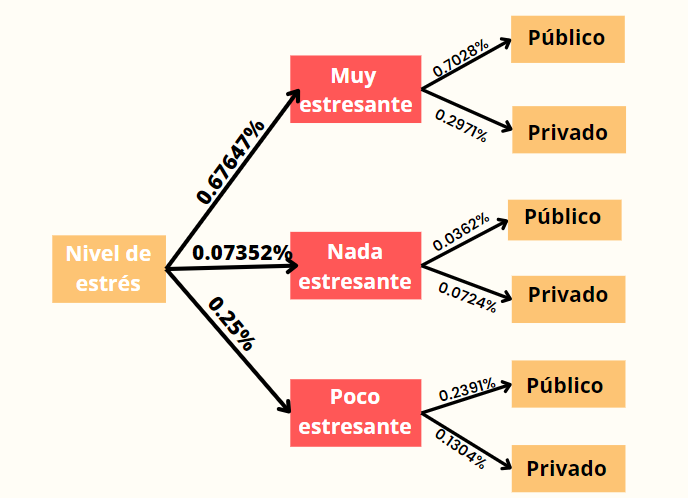

```{r include=FALSE, warning =FALSE}
lista.paquetes <- c("readr", "dplyr", "modeest","ggplot2","MASS","survival","gapminder","fitdistrplus") 
nuevos.paquetes <- lista.paquetes[!(lista.paquetes %in% installed.packages()[,"Package"])] 
if(length(nuevos.paquetes)) install.packages(nuevos.paquetes, repos = 'http://cran.us.r-project.org') 
```

# [**Introducción**]{style="color:dodgerblue"}

## Relevancia

Este proyecto tiene relevancia social al abordar la relación entre la congestión vehicular y el estrés en los estudiantes universitarios. El estrés es un problema común en esta población debido a las presiones académicas y personales. Al analizar esta relación, se pueden obtener resultados significativos que aumenten la conciencia pública sobre la importancia de abordar el problema del tráfico. Esto respaldaría la implementación de medidas y políticas para mejorar la infraestructura vial.

## Objetivo

### Objetivo general
Evaluar cómo la congestión vehicular en Lima afecta el nivel de estrés y el rendimiento académico de los estudiantes universitarios. 

### Objetivos específicos
- Analizar el impacto de la congestión vehicular en las calificaciones y el rendimiento académico de los estudiantes universitarios, tomando en cuenta factores como las tardanzas y el estrés.   
- Analizar la experiencia de los estudiantes considerando su medio de transporte y su tiempo de viaje  para proponer posibles soluciones.   
- Establecer la relación entre el tiempo que los estudiantes universitarios pasan en el tráfico de Lima y su nivel de estrés, teniendo en cuenta factores como distancia recorrida, tiempo de viaje y tardanzas en clases.


## Contexto 

Este análisis busca entender cómo la congestión vehicular afecta el estrés, la calidad de vida y el bienestar emocional de los estudiantes universitarios. A través de técnicas estadísticas y recopilación de datos, se busca arrojar luz sobre esta relación compleja. Los resultados obtenidos podrían ayudar a comprender los desafíos diarios de los estudiantes y brindar información valiosa para la toma de decisiones en políticas de transporte y bienestar estudiantil.


Lectura de base de datos: 
```{r echo=TRUE,message=FALSE}
library(readr)
library(modeest)
library(stringr)
library(dplyr)
library(ggplot2)
ES<-read_csv("Estres.csv")
ES
```

```{r echo=FALSE}
ES$`Marca temporal`<-NULL
```

Cambio de nombres de las variables:

```{r echo=FALSE}
colnames(ES)<- c('Edad','Género', 'Distrito_vive', 'Universidad','Distrito_U','KM', 'CalidadT', 'MedioT', 'TiempoMT', 'NivelE','DiasA', 'Promedio','DiasT','Porcentaje','ProCambio' )
```
Corregiremos los tipos de datos : 
```{r echo=FALSE}
ES$TiempoMT<-as.integer(ES$TiempoMT)
ES$DiasA<-as.integer(ES$DiasA)
ES$DiasT<-as.integer(ES$DiasT)
```

```{r echo=FALSE}
ESC<- ES
```

Corregimos el promedio de 147
```{r echo=FALSE}
for(i in 1:200){
  if(ESC$Promedio[i]==147.00){
    ESC$Promedio[i]<-ESC$Promedio[i]/10
  }
}
```

Limpiamos la variable `Distrito_vive`.

```{r echo=FALSE}
ESC$Distrito_vive <- str_trim(ESC$Distrito_vive,side = "both") 
```

Modificaremos la escritura 

```{r echo=FALSE}
ESC<-mutate(ESC,DistrC=case_when( Distrito_vive=='San Martín de Porres'~'San Martín de Porres',Distrito_vive=='SMP'~'San Martín de Porres',Distrito_vive=='Barranco'~'Barranco',Distrito_vive=='Cercado de lima'~'Cercado de lima', Distrito_vive=='Jesús María'~'Jesús María', Distrito_vive=='Lima'~'Inválido',Distrito_vive=='Lince'~'Lince', Distrito_vive=='Lurin'~'Lurín',Distrito_vive=='Lurín'~'Lurín',Distrito_vive=='San isidro'~'San Isidro', Distrito_vive=='San Isidro'~'San Isidro', Distrito_vive=='San Miguel'~'San Miguel',Distrito_vive=='Bellavista'~'Bellavista',Distrito_vive=='Chorrillos'~'Chorrilos',Distrito_vive=='La molina'~'La molina', Distrito_vive=='Los olivod'~'Los Olivos',Distrito_vive=='Los olivos'~'Los Olivos',Distrito_vive=='Los Olivos'~'Los Olivos', Distrito_vive=='Ventanilla'~'Ventanilla',Distrito_vive=='Miraflores'~'Miraflores',Distrito_vive=='Villa el Salvador'~'Villa el Salvador',Distrito_vive=='San Juan de Miraflores'~'San Juan de Miraflores',Distrito_vive=='San Antonio'~'Inválido',Distrito_vive=='Pueblo Libre'~'Pueblo Libre', Distrito_vive=='Huancayo'~'Inválido',Distrito_vive=='Comas'~'Comas',Distrito_vive=='Breña'~'Breña',Distrito_vive=='Santa Anita'~'Santa Anita',Distrito_vive=='Carabayllo'~'Carabayllo',Distrito_vive=='Huancayo'~'Inválido',Distrito_vive=='Puente piedra'~'Puente Piedra',Distrito_vive=='Puente Piedra'~'Puente Piedra', Distrito_vive=='Surco'~'Santiago de Surco',Distrito_vive=='surco'~'Santiago de Surco', Distrito_vive=='Santiago de Surco'~'Santiago de Surco', Distrito_vive=='Salamanca Ate'~'Ate', Distrito_vive=='Ate'~'Ate', Distrito_vive=='Surquillo'~'Surquillo', Distrito_vive=='Cercado de Lima'~'Cercado de Lima', Distrito_vive=='Lurigancho'~'San Juan de Lurigancho', Distrito_vive=='San Juan de Lurigancho'~'San Juan de Lurigancho',Distrito_vive=='Independencia'~'Independencia', Distrito_vive=='San Borja'~'San Borja', Distrito_vive=='La victoria'~'La Victoria', Distrito_vive=='La Victoria'~'La Victoria',Distrito_vive=='Ventanilla'~'Ventanilla', Distrito_vive=='Breña'~'Breña', Distrito_vive=='Rímac'~'Rímac',Distrito_vive=='La Perla-Callao'~'La Perla' ))
```

Limpiaremos la variable `Universidad` 

```{r echo=FALSE}
ESC$Universidad<-toupper(ESC$Universidad)
ESC$Universidad <- str_trim(ESC$Universidad,side = "both") 
```

Modificaremos la escritura de la variable `Universidad`:
```{r echo=FALSE}
ESC<-mutate(ESC,UniversidadCo = case_when(Universidad =='UTEC'~'UTEC',Universidad == 'UTEC '~'Utec',Universidad =='UCV'~'UCV',Universidad == 'UNIVERSIDAD CÉSAR VALLEJO'~'UCV',Universidad == 'SAN MARTIN DE PORRES'~'UNIVERSIDAD SAN MARTIN DE PORRES',Universidad == 'SAN MARTIN'~'UNIVERSIDAD SAN MARTIN DE PORRES',Universidad == 'UNIVERSIDAD SAN MARTIN DE PORRES'~'UNIVERSIDAD SAN MARTIN DE PORRES',Universidad == 'UNIVERSIDAD NACIONAL MAYOR DE SAN MARCOS '~'UNMSM',Universidad == 'UNMSM' ~ 'UNMSM', Universidad == 'SAN MARCOS' ~ 'UNMSM', Universidad == 'UCSUR'~'UCSUR', Universidad == 'CIENTÍFICA DEL SUR'~ 'UCSUR', Universidad == 'UPC' ~ 'UPC', Universidad == 'UNIVERSIDAD PERUANA DE CIENCIAS APLICADAS'~'UPC',Universidad == 'U DE LIMA'~'U DE LIMA',Universidad == 'UPN'~'UPN', Universidad == 'NORBERT WIENER'~'NORBERT WIENER',Universidad == 'UNIVERSIDAD DEL PACÍFICO'~'UNIVERSIDAD DEL PACÍFICO',Universidad == 'PUCP'~'PUCP', Universidad == 'UNI'~'UNI',Universidad == 'UNIVERSIDAD NACIONAL MAYOR DE SAN MARCOS'~'UNMSM'))

```

```{r echo=FALSE}
ESC$Universidad <- NULL
```
Modificamos la escritura de la variable Distrito U
```{r echo=FALSE}
ESC$Distrito_U<- str_trim(ESC$Distrito_U,side = "both") 
```

Modificamos la escritura de la variable Universidad
```{r echo=FALSE}
ESC<-mutate(ESC,Distrito_UCO= case_when(Distrito_U =='BARRANCO'~'BARRANCO',Distrito_U=='BARRAANCO'~'BARRANCO',Distrito_U=='LIMA'~'CERCADO DE LIMA',Distrito_U=='COMAS'~'COMAS',Distrito_U==' OLIVOS'~'LOS OLIVOS',Distrito_U=='LOS OLIVOS'~'LOS OLIVOS',Distrito_U=='MONTERRICO'~'MONTERRICO',Distrito_U=='CERCADO DE LIMA'~'CERCADO DE LIMA',Distrito_U==' CALLAO'~'CALLAO',Distrito_U=='ATE'~'ATE',Distrito_U=='SAN MIGUEL'~'SAN MIGUEL',Distrito_U=='SAN MIGUELL'~'SAN MIGUEL',Distrito_U==' CHORRILLOSS'~'CHORRILLOS',Distrito_U=='CHORRILLOS'~'CHORRILLOS',Distrito_U=='SAN ISIDRO'~'SAN ISIDRO', Distrito_U=='SURQUILLO'~'SURQUILLO',Distrito_U=='RIMAC'~'RÍMAC',Distrito_U=='RÍMAC'~'RÍMAC', Distrito_U=='JESÚS MARÍA'~'JESÚS MARÍA',Distrito_U=='SURCO'~'SURCO', Distrito_U =='BARRANNCO'~'BARRANCO', Distrito_U =='VILLA EL SALVADOR'~'VILLA EL SALVADOR',  Distrito_U =='SAN MARTIN DE PORRES'~'SAN MARTIN DE PORRES', Distrito_U =='CHORRILLOSS'~'CHORRILLOS',Distrito_U =='CHORRILLO'~'CHORRILLOS', Distrito_U =='CALLAO'~'CALLAO',Distrito_U=='BARRANCO'~'BARRANCO'))
```

```{r echo=FALSE}
ESC$Distrito_U<- NULL
ESC
```


# [**Análisis descriptivo**]{style="color:dodgerblue"}

## Descriptores numéricos

### Variable Promedio

Gráfico de la variable  `Promedio `
```{r echo=FALSE}
n <- length(ESC$Promedio)
bins <- round(1 + log2(n))
hist(ESC$Promedio, main = "Histograma del Promedio de cada estudiante",col.main = "darkgreen", xlab = "Promedio", 
     ylab = "Densidad de frecuencia", breaks = bins, col ="azure2", freq = FALSE)
lines(density(ESC$Promedio, na.rm = TRUE), col = "darkgoldenrod1", lwd = 2)
abline(v = c(mean(ESC$Promedio, na.rm  = TRUE), median(ESC$Promedio, na.rm= TRUE)),
       col = c("blue1", "coral3"), lwd=3)
legend("topleft", legend = c("media", "mediana", "densidad"), col = c("blue1", "coral3", "darkgoldenrod1"), lty=1, lwd=2)

```

En este gráfico podemos apreciar cómo la media y la mediana del Promedio de notas de los estudiantes de nuestra muestra, están sesgadas hacia la derecha; lo que nos indica que la mayoría tiene promedio alto.


### Variable Medio de transporte

Gráfico de la variable medio de transporte

```{r echo=FALSE}
# Crear tabla de frecuencias relativas
freq_rel <- prop.table(table(ESC$MedioT))

# Crear vector de colores y etiquetas
colores <- c("blue","red","green","orange","pink","turquoise2")
etiquetas <- c("Auto\nparticular", "Bicicleta", "Caminando", "Motocicleta","Taxi","Transporte\npúblico")

# Crear gráfico de barras
barplot(freq_rel, main = "Medio de transporte",col.main = "darkgreen", 
        ylab = "Frecuencia relativa", ylim = c(0.00,0.7), col= colores, 
        names.arg = etiquetas, las=2, cex.names=0.8)

# Agregar leyenda
legend("topleft", legend = etiquetas, col = colores, lty=1, lwd=2, cex=0.7, box.lty=0, bg='transparent')

```

Con esta gráfica podemos observar que el medio de transporte más utilizado por los estudiantes universitarios es el transporte público.


### Variable Kilómetro

Histograma de la variable Kilómetro

```{r echo=FALSE}
hist(ESC$KM, main = "Histograma de KM",col.main = "darkgreen", breaks = 30, freq = FALSE,
     xlab = "KM recorridos\n(Distrito universitario - Providencia)",
     ylab = "Frecuencia relativa", col = "#00C5CD")
```


De  nuestra unidad muestral, la mayoría de estudiantes vive entre 0 a 30 km de su universidad, dejando como datos atípicos a los estudiantes que viven lejos de su centro de estudio.

## Descriptores gráficos

### Medio de transporte VS Promedio

```{r echo=FALSE}
ggplot(data = ESC, aes(x = MedioT, y = Promedio, color = MedioT)) +
  geom_point() +
  stat_summary(fun=mean, geom="point", shape=18, size=5, color="black") +
  theme(axis.text.x = element_text(angle = 45, hjust = 1)) +
  labs(x = "Medio de Transporte", y = "Promedio Académico", color = "Medio de Transporte",
  title = "Gráfico de dispersión del promedio académico por medio de transporte")+
  theme(plot.title = element_text(color = "darkgreen"))
```


Este gráfico nos muestra como el rango de alcance del promedio de notas de los alumnos que utilizan transporte público es el único que abarca desde la nota más baja hasta la más alta. Podemos apreciar como ningún alumno que utiliza transporte público tiene promedio desaprobado.


### Promedio VS Nivel de estrés

¿Afectará el nivel de estres en el promedio ponderado?
```{r echo=FALSE}
ESC_temp <- ESC[complete.cases(ESC$Promedio, ESC$NivelE), ]
# Crea un vector de colores
colores <- c("blue", "red", "green")

# Crea un diagrama de caja para cada nivel de estrés
boxplot(ESC_temp$Promedio ~ ESC_temp$NivelE, col = colores,
        main = "Distribución del promedio ponderado del estudiante por nivel de estrés",col.main = "darkgreen",
        xlab = "Nivel de estrés",
        ylab = "Promedio ponderado del estudiante")

# Añade una leyenda en la esquina inferior derecha
legend("bottomright", legend = unique(ESC_temp$NivelE), fill = colores, bty = "n")

```

Se aprecia que el promedio en los tres grupos esta muy parejo.Además, los estudiantes que opinan que se encuentran a un nivel " muy estresante " de estrés, presentan en su 50% central  mayor variación que los estudiantes que opinan que tienen un nivel "nada estresante".En conclusión el promedio ponderado de las personas que presentan "nivel de estrés muy estresante" es muy variable a comparación de las demás que son menos variables.


### Km VS Ponderado 

¿ Tendrán menor promedio los estudiantes que viven más lejos de sus universidades?

```{r echo=FALSE}
plot(ESC$KM, ESC$Promedio, main = "Relación entre la distancia en km y el promedio del estudiante",col.main = "darkgreen", 
     xlab = "Distancia desde la residencia hasta la universidad (km)", 
     ylab = "Promedio del estudiante", 
     col = "blue2")
model <- lm(ESC$Promedio ~ ESC$KM)
abline(model, col = "red")
legend("topright", legend = "Línea de regresión", col = "red", lty = 1)
```

Con este gráfico podemos observar que la distancia entre la universidad del estudiante y el distrito donde vive no tiene influencia en su promedio ponderado. Además, podemos saber que no existe relación entre ambas variables .Para corroborarlo,utilizaremos la correlación. Si la correlación es cerca a 1, significaría que existe una relación directamente proporcional.

```{r echo=FALSE}
round(cor(ESC$Promedio,ESC$KM),2)
```
Obtenemos que la correlación es -0.05, el cual es un valor muy alejado a 1, por lo que no existe una relación directamente proporcional entre ambas variables.


# [**Análisis probabilístico**]{style="color:dodgerblue"}

## PROBABILIDAD EMPÍRICA
Esta es una aproximación de la probabilidad de un evento basada en la observación de datos empíricos. 

### Caso 1:
Seleccionar estudiantes del "Estudio del nivel de estrés causado por la congestión vehicular en Lima, mediante el análisis estadístico recolectado por encuestas a estudiantes universitarios" y analizar el tiempo que se llevan en el transporte desde su hogar hasta su institución educativa.

```{r echo=FALSE}
#Espacio
valores_unicos_T <- unique(ESC$TiempoMT)
valores_unicos_T
```
$$Ωexp1 = {30, 50,90, 120}$$
Cada uno es un evento atómico
Ea1 : Escogemos a un estudiante de nuestro estudio que tarde 30 minutos en transporte.
Ea2 : Escogemos a un estudiante de nuestro estudio que tarde 50 minutos en transporte.
Ea3 : Escogemos a un estudiante de nuestro estudio que tarde 90 minutos en transporte.
Ea4 : Escogemos a un estudiante de nuestro estudio que tarde 120 minutos en transporte.

 
Probabilidad de estos eventos
```{r echo=FALSE}
cat("Ea1", sum(ESC$TiempoMT == 30)/204, "\n")
cat("Ea2", sum(ESC$TiempoMT ==50)/204, "\n")
cat("Ea3", sum(ESC$TiempoMT == 90)/204, "\n")
cat("Ea4", sum(ESC$TiempoMT == 120)/204, "\n")

```
La suma debería darnos 1. 

```{r echo=FALSE}
 0.2352941 + 0.1911765 + 0.2794118 +  0.2941176
```

- Comentario:

Observamos que la probabilidad de que los estudiantes universitarios de nuestra muestre tarden el tiempo máximo de 2 horas en el transporte es de 0.29%, la más alta de todas, por lo que consideramos frecuente casos en los que el estudiante viva lejos de su institución educativa.

### Caso 2
```{r echo=FALSE}
#Espacio 

valores_unicos_N <- unique(ESC$NivelE)
valores_unicos_N
```
$$Ωexp4 = {"Muy \ estresante","Poco  \ estresante","Nada \ estresante"}$$
Cada uno es un evento atómico
Ea1 : Escogemos a un estudiante de nuestro estudio que considere "Muy estresante" la congestión vehicular
Ea2 : Escogemos a un estudiante de nuestro estudio que considere "Poco estresante" la congestión vehicular
Ea3 : Escogemos a un estudiante de nuestro estudio que considere "Nada estresante" la congestión vehicular
 
 Probabilidad de estos eventos
```{r}
cat("Ea1", sum(ESC$NivelE == "Muy estresante")/204, "\n")
cat("Ea2", sum(ESC$NivelE == "Poco estresante")/204, "\n")
cat("Ea3", sum(ESC$NivelE == "Nada estresante")/204, "\n")
```
La suma debería darnos 1. 

```{r echo=FALSE}
0.6764706 +  0.25 + 0.07352941 
```

- Comentario 

Observamos que la probabilidad de que el nivel de estrés causado por el transporte sea MUY ESTRESANTE es de 0.67%, también la probabilidad más alta de todas, por lo que concluimos que el estrés que presentan los estudiantes universitarios es altamente provocado por la congestión vehicular.

## PROBABILIDAD CONDICIONAL 
La probabilidad condicional nos permitirá analizar cómo se afectan mutuamente dos eventos y cómo la información sobre la ocurrencia de uno de ellos afecta la probabilidad del otro. 

<br><center>$$\mathbb{P}(A|B)=\frac{\mathbb{P}(A \cap B)}{\mathbb{P}(B)}$$</center><br>

### Eventos Independientes

##### [**Caso 1 **]{style="color:firebrick"}

Agrupamos nuestros datos de Tipo de Medio de transporte en Público y Privado.
```{r echo=FALSE}
ESC <- ESC %>% 
  mutate(Transportes2 = ifelse(MedioT %in% c("Auto particular", "Bicicleta o scooter.", "Taxi","Motocicleta","Me traslado caminando"), "Privado",
                              ifelse(MedioT %in% c("Transporte público"), "Público", MedioT)))
ESC <- ESC %>% 
  mutate(Transportes2 = ifelse(Transportes2 %in% c("Privado", "Público"), Transportes2))

ESC %>% count(Transportes2)
```

Tabla de las variables Transportes2 y NivelE.  
```{r echo=FALSE}
tabla1 <- table( ESC$Transportes2,ESC$NivelE)

tabla1df <- as.data.frame.matrix(tabla1)

tabla1df$Total <- rowSums(tabla1df)  

tabla1df <- rbind(tabla1df, colSums(tabla1df)) 

row.names(tabla1df)[nrow(tabla1df)] <- "Total"
tabla1df
```

Definimos nuestro evento

- A: Seleccionar una persona con un nivel de estrés " Muy estresante "
- B: Seleccionar una persona que utiliza medio de transporte público


**Validar independencia** 

- *Paso 1*

<br><center>$$\mathbb{P}(A \cap B) = \mathbb{P}(A)*\mathbb{P}(B) $$</center><br>


- P(Muy estresante ∩ Público)

```{r echo=FALSE}
round((97/204),2)
```
- P(Muy estresante)*P(Público)
```{r echo=FALSE}
round((135/204)*(138/204),2)
```
Como podemos observar, P(A ∩ B) ≈ P(A) * P(B), por lo tanto, podemos concluir que los eventos "Muy estresante" y "Público" son independientes.

- *Paso 2*

<br><center>$$\mathbb{P}(A|B)={\mathbb{P}(A)}$$</center><br>

P(Muy estresante|Público)
```{r echo=FALSE}
round((97/135),2)
```
P(Muy estresante)
```{r echo=FALSE}
round((138/204),2)
```
Observamos que P(A|B) ≈ P(A), lo que indica que en este caso particular, la probabilidad de tener un nivel de estrés "Muy estresante" es aproximadamente la misma tanto si es que  utiliza medio de transporte privado como si no utiliza. 


A)

$$P(Muy \ estresante|Público)=\frac{ P(Muy \ estresante \cap Público)}{P(Público)}$$

- P(Muy estresante ∩ Público)/P(Público)
```{r echo=FALSE}
round((97/204)/(135/204),3)
```
B) Utilizamos el teorema de Bayes

$$P(Público| Muy\ estresante)=\frac{ P(Muy \ estresante|Público) * P(Público)}{P(Muy \ estresante)}$$

Para hallar la P(Muy estresante) utilizamos la probabilidad total 

- P(Muy estresante) = P(Muy estresante|Público)* P(Público) + P(Muy estresante| Privado) * P(Privado)

```{r echo=FALSE}
round(((97/135) * (135/204)) + ((41/69)*(69/204)),2)
```
- P(Público|Muy estresante)

```{r echo=FALSE}
round(((0.719*(138/204))/0.68),2)

```

- La probabilidad de seleccionar a una persona que utiliza transporte público dado que tiene un nivel de estrés "Muy estresante" es de aproximadamente 0.72. Esto significa que hay una alta probabilidad de que una persona con un nivel de estrés considerado como "Muy estresante" utilice transporte público.

##### [**Caso 2 **]{style="color:firebrick"}

Agrupamos nuestros datos de la variable Promedio en mayor  y menor:
```{r echo=FALSE}
ESC$Clasi_promedio <- 0
```

```{r echo=FALSE}
ESC %>% mutate(Clasi_promedio = 
                 ifelse(Promedio < 14, "Menor promedio",
                 ifelse(Promedio >= 14 , "Mayor promedio",Clasi_promedio))) -> DF
```


Tabla de Transportes2 y Clasi_promedio
```{r echo=FALSE}
tabla2 <- table( ESC$Transportes2,DF$Clasi_promedio)

tabla2df <- as.data.frame.matrix(tabla2)

tabla2df$Total <- rowSums(tabla2df)  

tabla2df <- rbind(tabla2df, colSums(tabla2df)) 

row.names(tabla2df)[nrow(tabla2df)] <- "Total"
tabla2df
```
Definimos nuestros eventos:

A: Seleccionar una persona con un promedio mayor
B: Seleccionar una persona que utiliza medio de transporte privado

**Validar independencia**

- *Paso 1*

<br><center>$$\mathbb{P}(A \cap B) = \mathbb{P}(A)*\mathbb{P}(B) $$</center><br>


P(Promedio_Mayor ∩ Transporte_Privado)
```{r echo=FALSE}
round((47/204),2)
```
P(Promedio_Mayor)*P(Transporte_privado)
```{r echo=FALSE}
round((149/204)*(69/204),2)
```
Como podemos observar, P(A ∩ B) ≈ P(A) * P(B), por lo tanto, podemos concluir que los eventos "Promedio_Mayor" y "Privado" son independientes.

- *Paso 2*

<br><center>$$\mathbb{P}(A|B)={\mathbb{P}(A)}$$</center><br>

P(Promedio Mayor |Transporte privado)
```{r echo=FALSE}
round((47/69),2)
```
P(Promedio mayor)
```{r echo=FALSE}
round((149/204),2)
```
Observamos que P(A|B) ≈ P(A), lo que indica que en este caso particular, la probabilidad de tener un promedio mayor es aproximadamente la misma tanto si se utiliza medio de transporte privado como si no. 


A)

$$P(Mayor\ promedio | Privado)=\frac{ P(Mayor\ promedio \cap Privado)}{P(Privado)}$$

- P(Mayor_promedio ∩ Privado)/P(Privado)
```{r echo=FALSE}
round((47/204)/(69/204),3)
```

B) Utilizamos fórmula de Bayes 

$$P(Privado|Mayor\ promedio)=\frac{ P(Mayor\ promedio|Privado) * P(Privado)}{P(Mayor\ promedio)}$$
Hallamos P(Mayor promedio) con Probabilidad total
 
- P(Mayor promedio) = P(Mayor promedio|Privado)* P(Privado) + P(Mayor promedio | Público) * P(Público)


```{r echo=FALSE}
round(((47/69) * (69/204)) + ((102/135)*(135/204)),2)
```
- P(Privado|Mayor promedio)

```{r echo=FALSE}
round(((0.681*(69/204))/0.73),2)

```
La probabilidad de seleccionar a una persona que utiliza transporte privado dado que tiene un promedio mayor es de aproximadamente 0.32. Esto significa que el medio de transporte y posiblemente la distancia no influye en el promedio del alumno.

### Eventos Dependientes 

##### [**Caso 1 **]{style="color:firebrick"}

- Agrupamos la variable Km 

```{r echo=FALSE}
ESC$km_nuevo <- 0

```

```{r echo=FALSE}
ESC %>% mutate(km_nuevo = 
                 ifelse(KM < 12, "Menor KM",
                 ifelse(KM >= 12 , "Mayor KM",km_nuevo))) -> KF
```

- Agrupamos la variable tiempo

```{r echo=FALSE}
ESC$tiempo_nuevo<- 0
```

```{r echo=FALSE}
ESC %>% mutate(tiempo_nuevo = 
                 ifelse(TiempoMT < 50, "Tiempo menor",
                 ifelse(TiempoMT >= 50 , "Tiempo mayor",tiempo_nuevo))) -> TF
```

-Tabla entre la variable Km y Tiempo
```{r echo=FALSE}
tabla3 <- table( KF$km_nuevo,TF$tiempo_nuevo)

tabla3df <- as.data.frame.matrix(tabla3)

tabla3df$Total <- rowSums(tabla3df)  

tabla3df <- rbind(tabla3df, colSums(tabla3df)) 

row.names(tabla3df)[nrow(tabla3df)] <- "Total"
tabla3df
```

Definimos nuestros eventos
A: Seleccionar una persona con un tiempo mayor de viaje
B: Seleccionar una persona con mayor KM recorrido

**Validar independencia** 

- *Paso 1*

<br><center>$$\mathbb{P}(A \cap B) = \mathbb{P}(A)*\mathbb{P}(B) $$</center><br>


 P(Tiempo mayor ∩ mayor Km)
```{r echo=FALSE}
round((103/204),3)
```
 P(Tiempo mayor)*P(Mayor Km)
```{r echo=FALSE}
round((156/204)*(108/204),3)
```
Como podemos observar, P(A ∩ B) ≠ P(A) * P(B), por lo tanto, podemos concluir que los eventos "Tiempo mayor" y "Menor KM" son dependientes.

- *Paso 2*

<br><center>$$\mathbb{P}(A|B)={\mathbb{P}(A)}$$</center><br>

P(Tiempo mayor |Mayor Km)
```{r echo=FALSE}
round((103/108),3)
```
P(Tiempo mayor)
```{r echo=FALSE}
round((156/204),3)
```
Observamos que P(A|B) ≠ P(A).  Por lo que concluimos que son dependientes.

- *Paso 3* 

Para asegurarnos que son dependientes utilizaremos la siguiente fórmula: 

P(A|B)=P(A ∩ B)/ P(B)

P(A|B)
```{r echo=FALSE}
round((103/108),3)
```
P(A ∩ B)/ P(B)
```{r echo=FALSE}
round((103/204)/(108/204),3)
```

Con esto confirmamos, se trata de eventos dependientes.

A)

$$P(Tiempo\ mayor|MayorKm)=\frac{ P(Tiempo\ mayor \cap MayorKm)}{P(MayorKM)}$$

- P(Tiempo_mayor ∩ MayorKm)/P(MayorKm)
```{r echo=FALSE}
round((103/204)/(108/204),3)
```

B) Utilizamos fórmula de Bayes

$$P(MayorKm|Tiempo\ mayor)=\frac{ P(Tiempo\ mayor|MayorKm) * P(MayorKm)}{P(Tiempo\ mayor)}$$
Hallamos P(Tiempo mayor) con Probabilidad total
 
P(Tiempo mayor) = P(Tiempo Mayor|MayorKm)* P(MayorKm) + P(Tiempo Mayor |MayorKm) * P(MayorKm)


```{r echo=FALSE}
round(((103/108) * (108/204)) + ((53/96)*(96/204)),3)
```
P(MayorKm|Tiempo Mayor)

```{r echo=FALSE}
round(((0.954*(108/204))/0.765),3)

```

La probabilidad de seleccionar a una persona con un tiempo mayor de viaje dado que ha recorrido una mayor distancia en kilómetros es de aproximadamente 0.954. Esto indica que hay una probabilidad alta de que una persona que ha recorrido una mayor distancia en kilómetros tenga también un tiempo de viaje mayor.

##### [**Caso 2 **]{style="color:firebrick"}

Agrupamos "días de tardanza" en una tabla

```{r echo=FALSE}
ESC$Tar_nuevo <- 0

```

```{r echo=FALSE}
ESC %>% mutate(Tar_nuevo = 
                 ifelse(DiasT < 3, "Menor tardanza",
                 ifelse(DiasT >= 3 , "Mayor tardanza",Tar_nuevo))) -> TN
```


Tabla entre días_tardanza y Km_recorrido
```{r echo=FALSE}
tabla4 <- table( KF$km_nuevo,TN$Tar_nuevo)

tabla4df <- as.data.frame.matrix(tabla4)

tabla4df$Total <- rowSums(tabla4df)  

tabla4df <- rbind(tabla4df, colSums(tabla4df)) 

row.names(tabla4df)[nrow(tabla4df)] <- "Total"
tabla4df
```


Creamos nuestros eventos
A: Seleccionar una persona con mayor número de tardanza
B: Seleccionar una persona con mayor KM recorrido

 **Validar independencia** 

- *Paso 1*

<br><center>$$\mathbb{P}(A \cap B) = \mathbb{P}(A)*\mathbb{P}(B) $$</center><br> 


- P(Mayor tardanza ∩ mayor Km)
```{r echo=FALSE}
round((80/204),1)
```
- P(Mayor tardanza)*P(Mayor Km)
```{r echo=FALSE}
round((132/204)*(108/204),1)
```
Como podemos observar, P(A ∩ B) ≠ P(A) * P(B), por lo tanto, podemos concluir que los eventos "Mayor tardanza" y "Menor KM" son dependientes.

- *Paso 2*

<br><center>$$\mathbb{P}(A|B)={\mathbb{P}(A)}$$</center><br>

- P(Mayor tardanza |Mayor Km)
```{r echo=FALSE}
round((80/108),3)
```
- P(Mayor tardanza)
```{r echo=FALSE}
round((132/204),3)
```
Observamos que P(A|B) ≠ P(A).  Por lo que concluimos que son dependientes.

- *Paso3*
Para asegurarnos que son dependientes utilizaremos la siguiente fórmula: 

- P(A|B)=P(A ∩ B)/ P(B)

P(A|B)
```{r echo=FALSE}
round((80/108),3)
```
P(A ∩ B)/ P(B)
```{r echo=FALSE}
round((80/204)/(108/204),3)
```

Con esto confirmamos, se trata de eventos dependientes.

A)

$$P(Mayor\ tardanza|MayorKm)=\frac{ P(Mayor\ tardanza \cap MayorKm)}{P(MayorKM)}$$

- P(Mayor tardanza ∩ Mayorkm)/P(MayorKM)
```{r echo=FALSE}
round((80/204)/(108/204),3)
```

B)Utilizamos fórmula de Bayes

$$P(MayorKm|Mayor\ tardanza)=\frac{ P(Mayor\ tardanza|MayorKm) * P(MayorKm)}{P(Mayor\ tardanza)}$$
Hallamos P(Mayor tardanza) con Probabilidad total
 
- P(Mayor tardanza) = P(Mayor tardanza |MayorKm)* P(MayorKm) + P(Mayor tardanza |MayorKm) * P(MayorKm)


```{r echo=FALSE}
round(((80/108) * (108/204)) + ((52/96)*(96/204)),3)
```
- P(MayorKm|Mayor tardanza)

```{r echo=FALSE}
round(((0.741*(108/204))/ 0.647),3)

```
La probabilidad de seleccionar a una persona con mayor número de tardanzas dado que ha recorrido una mayor distancia en kilómetros es de aproximadamente 0.741. 

- Conclusión:

Los resultados sugieren una asociación estadística entre el número de tardanzas y la distancia recorrida en kilómetros. Es probable que una persona con un mayor número de tardanzas haya recorrido una mayor distancia. 

 **Ejemplos con condicional** 

El nivel de estrés de los estudiantes ha sido clasificado en 3 tipos. Se sabe que las probabilidades con respecto al medio de transporte son las siguientes


{height=1200, width=500} 

A) ¿Cúal es la probabilidad de que el medio de transporte público tenga influencia en los 3 niveles de estres?

P(Público) 
```{r echo=FALSE}
(0.67647*0.7028)+(0.07352*0.0362)+(0.25*0.2391)
```
- La probabilidad de que el medio de transporte público tenga influencia en los 3 niveles de estrés es 0.5378595%


B) Si el transporte público tiene más de 50% de influencia en los 3 niveles .¿Cuál es la probabilidad de que presente mayor influencia en nivel de estrés "muy estresante"?
$$P(Muy.estresante/Público)=\frac{ P(Muy.estresante \cap Público)}{P(Público)}$$
```{r echo=FALSE}
round((0.67647*0.7028)/0.5378595,2)
```
- La probabilidad de que presente mayor influencia en nivel de estrés "muy estresante" es de 0.88%.


# [**Variable aleatorias**]{style="color:dodgerblue"}

## Variable Aleatorias Discreta

### [**Caso 1 **]{style="color:firebrick"}

Nos inclinamos por una ditribución BINOMIAL para la variable DIAST
$$X = ~Bin(P,n)$$
Conteo de la cantidad de éxitos en 'n' observaciones
Definimos qué es el +exito para nuestro estudio con esta variable:
*Caso de éxito:*

X = Estudiante universitario de nuestra muestra de 204 observaciones llega tarde a sus clases de 3 a más días por semana, debido a la congestión vehicular (DiasT >=3)

```{r echo=FALSE}
frec_diast <-table(ESC$DiasT)
frec_diast
#Objetivo : 41+ 64 + 27
```
$$P(E) = 132 /204 = 0.647$$
Identificamos los parámetros

$$X = ~Bin(0.647,204)$$
Construimos la densidad
```{r echo=FALSE}
prob_cumulativa <- dbinom(0:204, 204,0.647)
```

Graficamos la densidad
```{r echo=FALSE}
#De 100 a 160, ya que los otros tramos de nuestra muestra no reflejan barras, son casos de fracaso.
x <- 100:160
prob_condicion <- dbinom(x, 204, 0.647)

barplot(prob_condicion, names.arg = x, xlab = "Cantidad de estudiantes universitarios", ylab = "Probabilidad", main = "Probabilidad DiasT >= 3", width = 1, las = 2)
```

Calculamos la esperanza, coeficiente de variación y varianza
```{r echo=FALSE}
esp <- 10 * 0.647
cat("esperanza : ", esp, "\n")

vari <- 10*0.647*(1-0.647)
cat("varianza : ", vari, "\n")

desv <-sqrt(vari)
coef_vari<-(desv/esp)*100
cat("coeficiente de variación : ", coef_vari, "\n")

```

Ejemplo 

¿Cuál es la probabilidad de que más de 150 estudiantes lleguen más de 3 veces tarde a sus clases, por semana, debido a la congestión vehicular? 
```{r echo=FALSE}
pbinom(149,204,0.647,lower.tail=T)

```
### [**Caso 2 **]{style="color:firebrick"}
- Construyendo la variable aleatoria.   

X: Número de personas encuestadas con nivel de estrés "nada estresado", en un conjunto de 204 personas.  

- Identificando los parámetros.  
n: Tamaño de personas encuestadas  que respondieron a la pregunta a la pregunta sobre el nivel de estrés. 
```{r echo=FALSE}
n<-length(ESC$NivelE)
n
```

P: Probabilidad de éxito : Con esta variable consideramos éxito al lado opuesto de nuestro estudio, que es que el alumno universitario presente "Nada estresante" como nivel de estrés causado por la congestión vehicular.


 $$P(E) = \frac{F}{n}$$
```{r echo=FALSE}
Frecuencias<-table(ESC$NivelE)
```
```{r echo=FALSE}
F<-Frecuencias[2]
F

```
```{r echo=FALSE}
P<-(F/n)
P
```
Construyendo la densidad .  

```{r echo=FALSE}
D<-dbinom(0:n,n,P)
```

```{r echo=FALSE}
Categorías<-(0:n)
barplot(D,names.arg = Categorías, main = "Densidad de probabilidad",col.main = "darkgreen", xlab = "n", ylab = "Probabilidad")
```


 ***Validando las Propiedades*** 

Esperanza: $$E(X)=n.P$$
```{r echo=FALSE}
E<-n*P
E
```


Varianza: $$V(X)=n.P.q$$
```{r echo=FALSE}
V<-n*P*(1-P)
V
```
Ejemplo  

En la UTEC se desea saber la probabilidad de que por lo mucho el 5% de los estudiantes, se encuentran en el nivel de estrés "Nada estresado", si los encuestados fueron 400 estudiantes.  
```{r echo=FALSE}
Probabilidad<-pbinom(25,400,P, lower.tri(T))
Probabilidad
```

## Variable Aleatorias Continuas


### [**Caso 1 **]{style="color:firebrick"}

Gráfico de densidad de la variable KM.

```{r echo=FALSE}
hist(ESC$KM, breaks = 30, freq = FALSE, main = "KM Recorrido: Distribucion normal", xlab = "KM recorrido", col = "lightgoldenrod1")
lines(density(ESC$KM, na.rm = TRUE), col = "red", lwd = 2)
curve(dnorm(x, mean(ESC$KM, na.rm = TRUE), sd(ESC$KM, na.rm = TRUE)), lwd = 2, col = "blue", add = TRUE)
legend("topright", c("curva hallada", "curva teórica"), lty = 1, lwd = 2, col = c("red", "blue"), bty = "n", cex = 0.8)

```

Podemos observar con la gráfica no se trata de una distribución normal 

**Validar**

- *Paso 1*

Hallamos media
```{r echo=FALSE}
round(mean(ESC$KM),1)

```
Hallamos mediana
```{r echo=FALSE}
round(median(ESC$KM),1)
```
Como podemos ver para que sea una distribucción normal la media tiene que ser aproximadamente igual a la mediana. 

- *Paso 2*

Hallamos varianza
```{r echo=FALSE}
var(ESC$KM,na.rm = T)
```
Hallamos desviación estándar^2
```{r echo=FALSE}
(sd(ESC$KM,na.rm=TRUE))^2
```

Como podemos ver se aproxima a una distribucción normal, por lo que podríamos asumirlo. 

1. Se ha entrevistado a un total de 204 universitarios, de lo cuál se sabe que un 0.72% de estos ha reportado sentir un nivel de estrés alto, por lo que queremos saber que tan lejos de sus universidades viven. 

Desviación estándar
```{r echo=FALSE}
round(sd(ESC$KM, na.rm = T),2)
```

Sea X la variable aleatoria que presenta una distribución normal:

$$ X \sim N(15.22,10.34)$$
a. ¿Cuál es la probabilidad de que un universitario viva a una distancia mayor a 13 km?

```{r echo=FALSE}
round(pnorm(13, mean = 15.22, sd = 10.34, lower.tail = F),2)
```
Esto quiere decir que el 42% de estudiantes universitarios viven a una distancia mayor a 13 km , lo que nos muestra que gran parte de universitarios vive lejos de su universidad por lo cual muchas veces llegan tarde a clases.

### [**Caso 2 **]{style="color:firebrick"}


Agrupamos el promedio ponderado de los universitarios por zonas (norte, sur ,este y centro)

```{r echo=FALSE}
ESC2<-mutate(ESC,DistrCa=case_when( Distrito_vive=='San Martín de Porres'~'Lima Norte',Distrito_vive=='SMP'~'Lima Norte',Distrito_vive=='Barranco'~'Lima Centro',Distrito_vive=='Cercado de lima'~'Lima Centro', Distrito_vive=='Jesús María'~'Lima Centro', Distrito_vive=='Lima'~'Inválido',Distrito_vive=='Lince'~'Lima Centro', Distrito_vive=='Lurin'~'Lima Sur',Distrito_vive=='Lurín'~'Lima Sur',Distrito_vive=='San isidro'~'Lima Centro', Distrito_vive=='San Isidro'~'Lima Centro', Distrito_vive=='San Miguel'~'Lima Centro',Distrito_vive=='Bellavista'~'Lima Norte',Distrito_vive=='Chorrillos'~'Lima Sur',Distrito_vive=='La molina'~'Lima Este', Distrito_vive=='Los olivod'~'Lima Norte',Distrito_vive=='Los olivos'~'Lima Norte',Distrito_vive=='Los Olivos'~'Lima Norte', Distrito_vive=='Ventanilla'~'Lima Norte',Distrito_vive=='Miraflores'~'Lima Centro',Distrito_vive=='Villa el Salvador'~'Lima Sur',Distrito_vive=='San Juan de Miraflores'~'Lima Sur',Distrito_vive=='San Antonio'~'Inválido',Distrito_vive=='Pueblo Libre'~'Lima Centro', Distrito_vive=='Huancayo'~'Inválido',Distrito_vive=='Comas'~'Lima Norte',Distrito_vive=='Breña'~'Lima Centro',Distrito_vive=='Santa Anita'~'Lima Este',Distrito_vive=='Carabayllo'~'Lima Norte',Distrito_vive=='Huancayo'~'Inválido',Distrito_vive=='Puente piedra'~'Lima Norte',Distrito_vive=='Puente Piedra'~'Lima Norte', Distrito_vive=='Surco'~'Lima Centro',Distrito_vive=='surco'~'Lima Centro', Distrito_vive=='Santiago de Surco'~'Lima Centro', Distrito_vive=='Salamanca Ate'~'Lima Este', Distrito_vive=='Ate'~'Lima Este', Distrito_vive=='Surquillo'~'Lima Centro', Distrito_vive=='Cercado de Lima'~'Lima Centro', Distrito_vive=='Lurigancho'~'Lima Este', Distrito_vive=='San Juan de Lurigancho'~'Lima Este',Distrito_vive=='Independencia'~'Lima Norte', Distrito_vive=='San Borja'~'Lima Centro', Distrito_vive=='La victoria'~'Lima Centro', Distrito_vive=='La Victoria'~'Lima Centro',Distrito_vive=='Ventanilla'~'Lima Norte', Distrito_vive=='Breña'~'Lima Centro', Distrito_vive=='Rímac'~'Lima Centro',Distrito_vive=='La Perla-Callao'~'Lima Centro' ))


```

Filtramos solo para alumnos de UTEC
```{r echo=FALSE}
ESC2 <- ESC2[!(ESC$UniversidadCo%in% c("UNIVERSIDAD SAN MARTIN DE PORRES", "UPC","UCV","UNI", "U DE LIMA", "NORBERT WIENER", "UCSUR", "PUCP", "UNMSM","UPN","UNIVERSIDAD DEL PACÍFICO")), ]
ESC2

```


***Zona Norte***

```{r echo=FALSE}
ESC3 <- ESC2[!(ESC2$DistrCa %in% c("Lima Centro","Lima Sur","Lima Este")), ]

```


Diagrama de densidad

```{r echo=FALSE}
hist(ESC3$Promedio, breaks = 10,freq = FALSE, main = "Promedio de estudiantes univeristarios: Zona Norte", xlab = "Promedio", col = "lightgoldenrod1")
lines(density(ESC$Promedio, na.rm = TRUE), col = "red", lwd = 2)
curve(dnorm(x,mean(ESC3$Promedio, na.rm = TRUE), sd(ESC3$Promedio, na.rm = TRUE)),lwd = 2, col = "blue", add = T)
legend("topleft", c("curva calculada", "curva teórica"),lty = 1, lwd = 2, col = c("red", "blue"), bty = "n", cex = 0.8)
```

**Validar**

- *Paso 1*

Hallamos  media
```{r echo=FALSE}
round(mean(ESC3$Promedio),1)
```
Hallamos  mediana
```{r echo=FALSE}
round(median(ESC3$Promedio),1)
```

Como podemos observar la media se aproxima a la mediana por lo que se podría aproximar a una distribucción normal.

- *Paso 2*

Hallamos varianza


```{r echo=FALSE}
var(ESC3$Promedio,na.rm = T)
```
Hallamos la desviación estádar
```{r echo=FALSE}
(sd(ESC3$Promedio,na.rm=TRUE))^2
```

Desviación estándar
```{r echo=FALSE}
round(sd(ESC3$Promedio, na.rm = T),2)
```
Como podemos observar la varianza se aproxima a la desviación estándar por lo que se podría aproximar a una distribucción normal.

Después de realizar los criterios asumimos que es una distribucción normal.

Sea X la variable aleatoria que presenta una distribución normal:

$$ X \sim N(14.9,1.83)$$

a. ¿Cuál es la probabilidad de que un universitario de zona norte tenga un promedio mayor a 13?


```{r echo=FALSE}
round(pnorm(13, mean = 14.9, sd = 1.83, lower.tail = TRUE),3)

```

Esto quiere decir que el 15% de estudiantes universitarios que viven en zona norte tienen un promedio mayor a 14

**Zona Centro**

```{r echo=FALSE}
ESC4 <- ESC2[!(ESC2$DistrCa %in% c("Lima Norte","Lima Sur","Lima Este")), ]
```

Diagrama de densidad

```{r echo=FALSE}
hist(ESC4$Promedio, breaks = 20,freq = FALSE, main = "Promedio de estudiantes univeristarios: Zona centro", xlab = "Promedio", col = "lightgoldenrod1")
lines(density(ESC$Promedio, na.rm = TRUE), col = "red", lwd = 2)
curve(dnorm(x,mean(ESC4$Promedio, na.rm = TRUE), sd(ESC4$Promedio, na.rm = TRUE)),lwd = 2, col = "blue", add = T)
legend("topleft", c("curva observada", "curva normal teórica"),lty = 1, lwd = 2, col = c("red", "blue"), bty = "n", cex = 0.8)
```

***Validar***

- *Paso 1*


Hallamos  media
```{r echo=FALSE}
round(mean(ESC4$Promedio),1)

```
Hallamos  mediana
```{r echo=FALSE}
round(median(ESC4$Promedio),1)
```

Como podemos observar la media se aproxima a la desviación estándar por lo que se trata de una distribucción normal.


Desviación estándar
```{r echo=FALSE}
round(sd(ESC4$Promedio, na.rm = T),2)
```

Sea X la variable aleatoria que presenta una distribución normal:

$$ X \sim N(14.9,1.7)$$

a. ¿Cuál es la probabilidad de que un universitario de zona centro tenga un promedio mayor a 13?


```{r echo=FALSE}
round(pnorm(13, mean = 14.9, sd = 1.7, lower.tail = F),4)

```

Esto quiere decir que el 13% de estudiantes universitarios que viven en zona centro tienen un promedio mayor a 14

***Zona Sur***

```{r echo=FALSE}
ESC5 <- ESC2[!(ESC2$DistrCa %in% c("Lima Norte","Lima Centro","Lima Este")), ]

```

Diagrama de densidad

```{r echo=FALSE}
hist(ESC5$Promedio, breaks = 15,freq = FALSE, main = "Promedio de estudiantes univeristarios: Zona sur", xlab = "Promedio", col = "lightgoldenrod1")
lines(density(ESC$Promedio, na.rm = TRUE), col = "red", lwd = 2)
curve(dnorm(x,mean(ESC$Promedio, na.rm = TRUE), sd(ESC$Promedio, na.rm = TRUE)),lwd = 2, col = "blue", add = T)
legend("topleft", c("curva hallada", "curva teórica"),lty = 1, lwd = 2, col = c("red", "blue"), bty = "n", cex = 0.8)
```

**Validar**

- Paso 1


Hallamos  media
```{r echo=FALSE}
round(mean(ESC5$Promedio),1)

```
Hallamos mediana
```{r echo=FALSE}
round(median(ESC5$Promedio),1)
```

Como podemos observar la media se aproxima a la desviación estándar por lo que se trata de una distribucción normal.

Desviación estándar
```{r echo=FALSE}
round(sd(ESC5$Promedio, na.rm = T),3)
```

Sea X la variable aleatoria que presenta una distribución normal:

$$ X \sim N(14.9,1.7)$$

a. ¿Cuál es la probabilidad de que un universitario de zona sur tenga un promedio mayor a 13?

```{r echo=FALSE}
round(pnorm(13, mean = 15.5, sd = 1.66, lower.tail = TRUE),2)

```

Esto quiere decir que el 7% de estudiantes universitarios que viven en zona sur tienen un promedio mayor a 13.

 ***Zona Este***

```{r echo=FALSE}
ESC5 <- ESC2[!(ESC2$DistrCa %in% c("Lima Norte","Lima Sur","Lima Centro")), ]
```


Diagrama de densidad 

```{r echo=FALSE}
hist(ESC5$Promedio, breaks = 10,freq = FALSE, main = "Promedio de estudiantes univeristarios:Zona Este", xlab = "Promedio", col = "lightgoldenrod1")
lines(density(ESC$Promedio, na.rm = TRUE), col = "red", lwd = 2)
curve(dnorm(x,mean(ESC$Promedio, na.rm = TRUE), sd(ESC$Promedio, na.rm = TRUE)),lwd = 2, col = "blue", add = T)
legend("topleft", c("curva hallada", "curva teórica"),lty = 1, lwd = 2, col = c("red", "blue"), bty = "n", cex = 0.8)
```

**Valida**

- *Paso 1*

Hallamos  media
```{r echo=FALSE}
round(mean(ESC5$Promedio),1)

```
Hallamos mediana
```{r echo=FALSE}
round(median(ESC5$Promedio),1)
```

Como podemos observar la media se aproxima a la desviación estándar por lo que se trata de una distribucción normal.

Desviación estándar
```{r echo=FALSE}
round(sd(ESC5$Promedio, na.rm = T),3)
```

Sea X la variable aleatoria que presenta una distribución normal:

$$ X \sim N(14.9,1.37)$$

a. ¿Cuál es la probabilidad de que un universitario de zona este tenga un promedio mayor a 14?


```{r echo=FALSE}
round(pnorm(13, mean = 14.9, sd = 1.37, lower.tail = F),2)

```

Esto quiere decir que el 8% de estudiantes universitarios que viven en zona este tienen un promedio mayor a 15


Conclusiones :

Conclusión 1: En conclusión, se descarta la probabilidad de que la zona de residencia influya en el rendimiento académico de un estudiante, con respecto a los alumnos de la universidad UTEC.


Conclusión 2: El estudio muestra una asociación fuerte entre el uso del transporte público y niveles de estrés "Muy estresante". Las personas que dependen del transporte público tienen una alta probabilidad de experimentar altos niveles de estrés. Esto destaca la necesidad de abordar el estrés asociado al uso del transporte público y mejorar la experiencia de los usuarios.

Conclusión 3: Existe una relación entre el tiempo de viaje y la distancia recorrida en kilómetros, indicando que aquellos con mayor tiempo de viaje probablemente hayan recorrido una mayor distancia. Sin embargo, esta relación no es muy fuerte, lo que sugiere que otros factores también influyen en el tiempo que las personas pasan en el tráfico. Para abordar los desafíos de movilidad y reducir los tiempos de viaje de los estudiantes universitarios, es crucial considerar aspectos adicionales como la eficiencia de las rutas y el flujo del tráfico.


