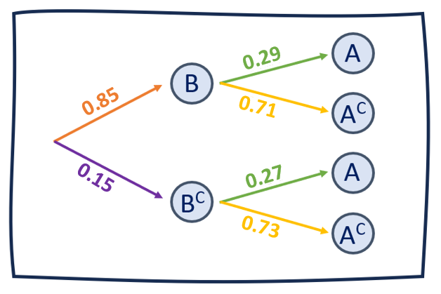
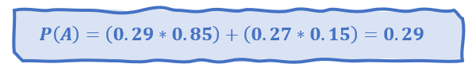
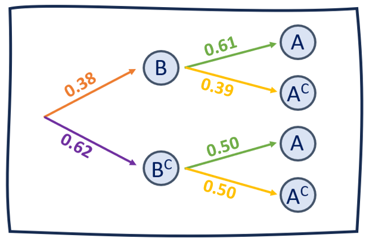

```{r echo=FALSE,eval=TRUE, warning=FALSE, message=FALSE}
library(knitr)
library(dplyr)
library(readr)
library(Hmisc)
library(ggplot2)
library(EnvStats)
library(modeest)
library(janitor)
library(plotrix)

```

```{r include=F}
DF1<- read_csv("BaseDatosLimpio.csv",col_types="ccnnnnnnccccccccccnccn") 
DF <- DF1
```

# ***Introducción***

El Análisis de la relación entre las asesorías con respecto al estrés y el rendimiento académico es de suma importancia para reconocer factores en los que se vea involucrados el estrés en la vida universitaria, por tal motivo nuestro objetivo principal es analizar la relación de las asesorías con el nivel de estrés académico en los estudiantes de la UTEC en el periodo 2022-II. El presente análisis  se enfoca en examinar las distribuciones discretas y continuas relacionadas con el nivel de estrés académico y las asesorías que se brindan como medida de ayuda en la UTEC. La finalidad es comprender cómo estas asesorías pueden influir en la reducción del nivel de estrés y mejorar el rendimiento académico de los estudiantes de la UTEC.


## *Relevancia*

> Estudiar la relación de las asesorías con el estrés y con el rendimiento académico de los alumnos de UTEC en periodo 2022-2 es sumamente relevante, ya que como estudiantes podemos conocer los desafíos y presiones que pueden
 causar las distintas asignaturas en nuestra vida diaria. Es cierto que el estrés puede afectar nuestra salud mental y/o física, así como nuestra capacidad para concentrarnos y aprender de manera eficiente. Por ello, el estudiar está problemática nos permitirá encontrar formas de apoyar y promover el bienestar de los estudiantes, como también encontrar los factores que lo generan, para así implementar estrategias del manejo de estrés, mejorando los recursos de apoyo creando entornos educativos más saludables y equilibrados.  

## *Objetivos*

>Este análisis estadístico tiene como objetivo explorar las distribuciones discretas y continuas relacionadas con el nivel estrés académico, las asesorías brindadas a los estudiantes, ayuda en las asesorías y satisfacción de asesorías. Al comprender mejor estas distribuciones, se podrán identificar patrones, tendencias y relaciones que permitan establecer estrategias efectivas para reducir el nivel estrés y mejorar el rendimiento académico. Los resultados obtenidos proporcionarán una base sólida para la toma de decisiones informadas y la implementación de intervenciones más efectivas en el ámbito de la UTEC.  

## *Contexto*
>Durante el periodo académico 2022-2, se presentaron cifras del nivel de estrés académico significativas en los estudiantes de la UTEC que atentan directamente en el rendimiento académico. Este análisis busca la relación entre las asesorías académicas brindadas por la UTEC y el nivel de estrés de los estudiantes durante el periodo 2022-2.  

# ***Análisis descriptivo***  
A continuación realizaremos el análisis descriptivo de las 4 variables fundamentales de las cuales nos basaremos en nuestro estudio probabilístico, las cuales son:  

1. Variables numéricas continuas:  

> Valor estrés 

> Tiempo de ocio

> Promedio ponderado

2. Variable numéricas discretas:  

> Horas_asesorías

3. Variable categórica jerárquica:

> Ayuda asesorias

## Variable "VALOR DE ESTRÉS"

La presentación de este gráfico es la representación de los "Valor de estrés obtenido de cada alumno en el ciclo 2022-2".

Datos importantes que podemos extraer de la variable promedio:

```{r echo=FALSE}
kable(DF %>% summarise(Variable = "Valor_estres"
                ,Tamaño = length(Valor_estres)
                ,Min=min(Valor_estres)
                ,Max=max(Valor_estres)
                ,Media=round(mean(Valor_estres),2)
                ,Dif_Rango=diff(range(Valor_estres))
                ,Des_EST = round(sd(Valor_estres),2)
                ,Varianza= round(var(Valor_estres),2)
                ,Rang_IntQ=IQR(Valor_estres)
                ,Moda = round(mfv1(DF$Valor_estres),2)
                ,Mediana = round(median(Valor_estres),2)))

```


Para comparar los datos propocionados por nuestro comando podemos realizar la siguiente gráfica:


```{r echo=FALSE}
hist(DF1$Valor_estres,main = "ÍNDICE DE ESTRÉS DE LOS ESTUDIANTES DE UTEC\nDURANTE EL PERIODO 2022-2")
abline(v= mean(DF1$Valor_estres),col="red3",lwd=3)
abline(v= median(DF1$Valor_estres),col="blue3",lwd=3)
abline(v= mfv(DF1$Valor_estres),col="yellow",lwd=5)
abline(v= quantile(DF1$Valor_estres,0.25),col="turquoise",lwd=2)
abline(v= quantile(DF1$Valor_estres,0.75),col="chartreuse1",lwd=2)
legend("topleft",legend=c("Media","Mediana","Moda","Percentil 25","Percentil 75"),col=c("red3","blue3","yellow","turquoise","chartreuse1"),lwd=4,cex=1)
```  

En el estudio probabilístico que estamos realizando, esta variable presenta gran peso en la resolución de nuestro análisis, de los descriptores numéricos obtenidos tomaremos en cuenta principalmente la media aritmética, la varianza y la desviación estándar, pues utilizaremos para demostrar propiedades de distribución en variables aleatorias.  

## Variable "HORAS ASESORIAS"  

La presentación de este gráfico es la representación de las "Horas de asesorías que un estudiante universitario de UTEC presentó durante el ciclo 2022-2". De este gráfico, los descriptores más importantes que podemos recopilar son los siguientes:  

```{r echo=FALSE}
kable(DF %>% summarise(variable = "Horas_asesorias"
                ,Tamaño = length(Horas_asesorias)
                ,Min=min(Horas_asesorias)
                ,Max=max(Horas_asesorias)
                ,Media=round(mean(Horas_asesorias),2)
                ,Dif_Rango=diff(range(Horas_asesorias))
                ,Des_EST = round(sd(Horas_asesorias),2)
                ,Varianza= round(var(Horas_asesorias),2)
                ,Rang_IntQ=IQR(Horas_asesorias)
                ,Moda = round(mfv1(DF$Horas_asesorias),2)
                ,Mediana = round(median(Horas_asesorias),2)),align = "ccccccccccc")
```

Para comparar y expresar gráficamente los datos proporcionados anteriormente, se realiza la siguiente gráfica:  

```{r echo=FALSE}
tabla1<-table(DF$Horas_asesorias)
barras<-barplot(tabla1,main = "HORAS DE ASESORIAS ASISTIDAS EN EL PERIODO 2022-2", ylim =c(0,90),xlab = "Horas asistidas a asesorias", ylab = "Numero de estudiantes (Frecuencia)",col = "lightblue", )
grid(nx = NA, ny = NULL, lty = 2, col = "gray", lwd = 1)
text(x=barras, y=tabla1, pos=3, cex=1, col="red3", label=tabla1)

```

En el estudio probabilístico que estamos realizando, esta variable presenta gran peso en la resolución de nuestro análisis, pues utilizaremos la data recopilada para demostrar propiedades de probabilidad empírica y condicional, además de independencia de eventos.  

## Variable "OCIO"

La presentación de este gráfico es la representación del "Tiempo de ocio" de cada alumno en el ciclo 2022-2".  

Descriptores importantes que podemos extraer de la variable "Tiempo de ocio":

```{r echo=FALSE}
kable(DF %>% summarise(variable = "Ocio"
                ,Tamaño = length(Ocio)
                ,Min=min(Ocio)
                ,Max=max(Ocio)
                ,Media=round(mean(Ocio),2)
                ,Dif_Rango=diff(range(Ocio))
                ,Des_EST = round(sd(Ocio),2)
                ,Varianza= round(var(Ocio),2)
                ,Rang_IntQ=IQR(Ocio)
                ,Moda = round(mfv1(DF$Ocio),2)
                ,Mediana = round(median(Ocio),2)),align = "ccccccccccc")
```

Para comparar y expresar gráficamente los datos proporcionados anteriormente, se realiza la siguiente gráfica:  

```{r echo=FALSE}
hist(DF$Ocio,main = "TIEMPO DE OCIO DE LOS ENCUESTADOS DE UTEC\nDURANTE EL PERIODO 2022-2",xlim = c(0,10), ylim =c(0,70),xlab = "Tiempo de ocio durante el periodo 2022-2 (horas)", ylab = "Numero de estudiantes (Frecuencia)")
grid(nx = NA, ny = NULL, lty = 2, col = "gray", lwd = 1)
hist(DF$Ocio, add=TRUE, col = "thistle1")
abline(v= mean(DF$Ocio),col="red3",lwd=5)
abline(v= median(DF$Ocio),col="blue3",lwd=6)
abline(v= mfv(DF$Ocio),col="yellow",lwd=3)
abline(v= quantile(DF$Ocio,0.25),col="turquoise",lwd=3)
abline(v= quantile(DF$Ocio,0.75),col="chartreuse1",lwd=2)
legend("topright",legend=c("Promedio","Mediana","Moda","Percentil 25","Percentil 75"),col=c("red3","blue3","yellow","turquoise","chartreuse1"),lwd=4,cex=1)
```

En el estudio probabilístico que estamos realizando, esta variable presenta gran peso en la resolución de nuestro análisis, pues utilizaremos data recopilada para demostrar propiedades de distribución de variables aleatorias discretas y obtener información de ellas.  

## Variable "PROMEDIO PONDERADO"

La presentación de este gráfico es la representación de los "Promedios de los alumnos en el ciclo 2022-2".

Descriptores importantes que podemos extraer de la variable promedio:

```{r echo=FALSE}
kable(DF %>% summarise(Variable = "Promedio"
                ,Tamaño = length(Promedio)
                ,Min=min(Promedio)
                ,Max=max(Promedio)
                ,Media=round(mean(Promedio),2)
                ,Dif_Rango=diff(range(Promedio))
                ,Des_EST = round(sd(Promedio),2)
                ,Varianza= round(var(Promedio),2)
                ,Rang_IntQ=IQR(Promedio)
                ,Moda = round(mfv1(DF1$Promedio),2)
                ,Mediana = round(median(Promedio),2)))
```

Para comparar los datos propocionados por nuestro comando podemos realizar la siguiente gráfica:

```{r echo=FALSE}
hist(DF$Promedio,main = "PROMEDIO PONDERADO DE LOS ENCUESTADOS DE UTEC\nDURANTE EL PERIODO 2022-2",xlim=c(10,20), ylim =c(0,50),xlab = "Promedio Ponderado 2022-2", ylab = "Numero de estudiantes (Frecuencia)")
grid(nx = NA, ny = NULL, lty = 2, col = "gray", lwd = 1)
hist(DF$Promedio, add=TRUE, col = "plum1")
abline(v= mean(DF$Promedio),col="red3",lwd=5)
abline(v= median(DF$Promedio),col="blue3",lwd=5)
abline(v= mfv(DF$Promedio),col="yellow",lwd=3)
abline(v= quantile(DF$Promedio,0.25),col="turquoise",lwd=4)
abline(v= quantile(DF$Promedio,0.75),col="chartreuse1",lwd=4)
legend("topright",legend=c("Media","Mediana","Moda","Percentil 25","Percentil 75"),col=c("red3","blue3","yellow","turquoise","chartreuse1"),lwd=4,cex=1)

```

En el estudio probabilístico que estamos realizando, de los descriptores numéricos obtenidos tomaremos en cuenta principalmente la media aritmética, la varianza y la desviación estándar, pues utilizaremos para demostrar propiedades de distribución en variables aleatorias.  

### Variable "AYUDA ASESORIAS"

```{r, echo=FALSE, warning=FALSE,message=FALSE}
niveles = c("No asistí a asesorías","Poco","Regular","Muchisimo")
etiquetas = c("No asistió","Poco","Regular","Muchisimo")

Variable_ordenado = factor(DF1$Ayuda_asesorias, ordered = TRUE, levels = niveles, labels = etiquetas)
P <- barplot(table(Variable_ordenado),ylim=c(0,110),main = "PERCEPCIÓN DE LOS ENCUESTADOS ACERCA EFECTO DE LAS\nASESORIAS EN LA REDUCCIÓN DEL ESTRES Y LA ANSIEDAD DURANTE EL PERIODO 2022-2",cex.main=0.9,sub = "SEGÚN ENCUESTA REALIZADA A ESTUDIANTES DE UTEC", ylab = "Frecuencia", cex.sub = 1.25,las=1,col = c("peachpuff2","palegreen","lightslateblue","tan1"))
text(x=P, y=table(Variable_ordenado), pos=3, cex=1.25, col="black",label = table(Variable_ordenado))
```

Por último consideramos a la variable que representa a la satisfacción de los estudiantes con respecto a las asesorías para poder analizar si a los alumnos UTEC 2022-2 les fue de ayuda o no, para un posterior análisis probabilístico respecto a que si puede influir con respecto a otra variable o no.  

# ***Análisis probabilístico***  

Con la base de datos obtenida de la encuesta realizada, es posible determinar las tazas de probabilidad que puede tener determinados experimentos realizados en función a los datos de la muestra representativa del estudio estadístico realizado.  

## *Análisis empírico*
Antes de analizar las variables mediante su relación de dependencia o independencia, analizaremos probabilidad empírica de las variables seleccionadas de nuestro estudio:

### **Experimento 1 (Variable "Horas_asesorias"):**  
***Seleccionar un estudiante de UTEC al azar, y observar las horas dedicadas a asesorías durante el periodo académico 2022-2.***

#### ***Espacio muestral***
  
Teniendo en cuenta el estudio estadístico realizado, obtenemos el siguiente espacio muestral:  

**Ω = { 0 ; 1 ; 2 ; 3 ; 4 ; 5 ; 6 ; 7 ; 8 ; 10 }** 
  

#### ***Eventos atómicos***  
Se menciona más detalladamente cada uno de los eventos atómicos presentes en nuestro espacio muestral:  

```{r echo=F}
Eventos<-data.frame(Eventos=c("A","B","C","D","E","F","G","H","I","J"),hora=c(0,1,2,3,4,5,6,7,8,10))
```
```{r echo=F,results='asis'}
for(i in 1:10){
cat(i,". **Evento",Eventos[[i,1]],":** Seleccionar un estudiante de UTEC que haya **dedicado ",Eventos[[i,2]]," horas** a asesorías.  ",fill=T)}
```


#### ***Probabilidad eventos atómicos***  
Ahora analizaremos la taza de probabilidad existente para cada elemento atómico seleccionado. Para ello usaremos la siguiente fórmula establecida para hallar su probabilidad respectiva:  

$$P(A)=\frac{Casos\ \  a\ \ favor}{Casos\ \ totales}= \frac{n(A)}{n(Ω)}$$
  
  

```{r include = FALSE}
aa<-DF %>% count(Horas_asesorias)
bb<-aa%>%mutate(Eventos_atómicos=c("Evento A (0 horas)","Evento B (1 horas)","Evento C (2 horas)","Evento D (3 horas)","Evento E (4 horas)","Evento F (5 horas)","Evento G (6 horas)","Evento H (7 horas)","Evento I (8 horas)","Evento J (10 horas)"))
bb<-bb[,-1]
bb<-bb[,c("Eventos_atómicos","n")]
bb<-bb%>%mutate(Probabilidad_del_evento_atómico=n/199)
bb<-bb%>%mutate(Redondeo_Probabilidades=round(Probabilidad_del_evento_atómico,4))
bb<- rbind(bb,c("TOTAL", sum(bb$n),sum(bb$Probabilidad_del_evento_atómico),sum(bb$Probabilidad_del_evento_atómico)))
```
```{r echo=FALSE}
kable(bb,align ="ccc",col.names =c("Eventos atómicos","Casos favorables","Probabilidad del evento atómico","Redondeo a 4 decimales"))
```


### **Experimento 2 (Variable "valor_estrés"):**  
***Seleccionar un estudiante de UTEC al azar, y observar el valor de estrés que presentó durante el periodo 2022-2.***

#### ***Espacio muestral***  
Teniendo en cuenta el estudio estadístico realizado, obtenemos el siguiente espacio muestral:  

**Ω = { 0.20 ; 0.37 ; 0.40 ; 0.43 ; 0.46 ; 0.49 ; 0.51 ; 0.54 ; 0.57 ; 0.60 ;** 
        **0.63 ; 0.66 ; 0.69 ; 0.71 ; 0.74 ; 0.77 ; 0.80 ; 0.83 ; 0.86 ; 0.89 ;** 
        **0.91 ; 0.94 ; 0.97 ; 1.00 }**  

#### ***Eventos atómicos***  
Se menciona más detalladamente cada uno de los eventos atómicos presentes en nuestro espacio muestral:  

```{r echo=F}
Eventos<-data.frame(Eventos=c("A","B","C","D","E","F","G","H","I","J","K","L","M","N","O","P","Q","R","S","T","U","V","W","X"),hora=c(0.20,0.37,0.40,0.43,0.46,0.49,0.51,0.54,0.57,0.60,0.63,0.66,0.69,0.71,0.74,0.77,0.80,0.83,0.86,0.89,0.91,0.94,0.97,1.00 ))
```
```{r echo=F,results='asis'}
for(i in 1:24){
cat(i,". **Evento",Eventos[[i,1]],":** Seleccionar un estudiante de UTEC que haya **presentado un valor de estrés de",Eventos[[i,2]],".**  ",fill=T)}
```

#### ***Probabilidad de los eventos atómicos***  
Ahora analizaremos la taza de probabilidad existente para cada elemento atómico seleccionado. Para ello usaremos la siguiente fórmula establecida para hallar su probabilidad respectiva:  

$$P(A)=\frac{Casos\ \  a\ \ favor}{Casos\ \ totales}= \frac{n(A)}{n(Ω)}$$
  
```{r include = FALSE}
aa<-DF %>% count(Valor_estres)
bb<-aa%>%mutate(Eventos_atómicos=c("Evento A (0.20)","Evento B (0.37)","Evento C (0.40)","Evento D (0.43)","Evento E (0.46)","Evento F (0.49)","Evento G (0.51)","Evento H (0.54)","Evento I (0.57)","Evento J (0.60)","Evento K (0.63)","Evento L (0.66)","Evento M (0.69)","Evento N (0.71)","Evento O (0.74)","Evento P (0.77)","Evento Q (0.80)","Evento R (0.83)","Evento S (0.86)","Evento T (0.89)","Evento U (0.91)","Evento V (0.94)","Evento w (0.97)","Evento X (1.00)"))
bb<-bb[,-1]
bb<-bb[,c("Eventos_atómicos","n")]
bb<-bb%>%mutate(Probabilidad_del_evento_atómico=n/199)
bb<-bb%>%mutate(Redondeo_Probabilidades=round(Probabilidad_del_evento_atómico,4))
bb<- rbind(bb,c("TOTAL", sum(bb$n),sum(bb$Probabilidad_del_evento_atómico),sum(bb$Probabilidad_del_evento_atómico)))
```
```{r echo=FALSE}
kable(bb,align ="ccc",col.names =c("Eventos atómicos","Casos favorables","Probabilidad del evento atómico","Redondeo a 4 decimales"))
```

En nuestro estudio estadístico, hemos analizado estadísticamente una muestra significativa de estudiantes UTEC, dado que se deseaba indagar acerca de la relación existente entre el nivel de estrés registrado y la concurrencia a asesorías durante el periodo académico 2022-2. En ese sentido, hemos decidido analizar esta relación con uso de las probabilidades. Para ello, visualizaremos de manera detallada relación mencionada anteriormente.  

```{r echo=FALSE}
kable(table(round(DF$Valor_estres,2),DF$Horas_asesorias))
```

## *Eventos independientes*  
### ***Selección de eventos:***  
1. **Evento A:** Seleccionar un estudiante UTEC de manera aleatoria que haya presentado un valor de estrés superior a 0.8 durante el periodo académico 2022-2.
2. **Evento B:** Seleccionar un estudiante UTEC de manera aleatoria que haya asistido menos de 5 horas a asesorías durante el periodo académico 2022-2

### ***Tabla de contingencia de los eventos***
```{r echo=F}
datos_interseccion_A_B <- subset(DF, Valor_estres > 0.8 & Horas_asesorias < 5)
datos_interseccion_A_Bc <- subset(DF, Valor_estres > 0.8 & Horas_asesorias >= 5)
datos_interseccion_Ac_B <- subset(DF, Valor_estres <= 0.8 & Horas_asesorias < 5)
datos_interseccion_Ac_Bc <- subset(DF, Valor_estres <= 0.8 & Horas_asesorias >= 5)
Contingencia <- data.frame("EVENTOS"=c("B","B complemento"),"A"=c(nrow(datos_interseccion_A_B),nrow(datos_interseccion_A_Bc)),"A complemento"=c(nrow(datos_interseccion_Ac_B),nrow(datos_interseccion_Ac_Bc)),"TOTAL"=c(nrow(datos_interseccion_A_B)+nrow(datos_interseccion_Ac_B),nrow(datos_interseccion_Ac_Bc)+nrow(datos_interseccion_A_Bc)))

Contingencia<- rbind(Contingencia,c("TOTAL", sum(Contingencia$A),sum(Contingencia$A.complemento),sum(Contingencia$A.complemento)+sum(Contingencia$A)))

kable(Contingencia,align = "cccc")
```

### ***Corroboramos independencia de los eventos:***  
Comprobaremos si los eventos presentados son dependientes o independientes. Para ello emplearemos la siguiente fórmula de verificación de independencia:
$$P\ (A ∩ B)\ =\ P\ (A)\ *\ P\ (B)$$
```{r echo=FALSE,message = FALSE,results = 'asis'}
datos_interseccion_A_B <- subset(DF, Valor_estres > 0.8 & Horas_asesorias < 5)
datos_A <- subset(DF,Valor_estres>0.8)
datos_B <- subset(DF,Horas_asesorias < 5) 
P_AINTERB <- round(nrow(datos_interseccion_A_B)/nrow(DF),2)
cat('**La probabilidad de la intersección de los eventos A y B es: **',P_AINTERB)
```
  
```{r echo=FALSE,message = FALSE,results = 'asis'}
P_a <- round(nrow(datos_A)/nrow(DF),2)
cat('**La probabilidad del evento A es: **',P_a)
```
  
```{r echo=FALSE,message = FALSE,results = 'asis'}
P_b <- round(nrow(datos_B)/nrow(DF),2)
cat('**La probabilidad del evento B es: **',P_b)
```

Con las probabilidades halladas, hacemos uso de la fórmula planteada anteriormente:  

$$P\ (A ∩ B)\ =\ P\ (A)\ *\ P\ (B)$$  

```{r echo=FALSE,message = FALSE,results = 'asis'}
# Verificación de la independencia

if (P_AINTERB == round(P_a * P_b,2)) {
  cat('$$',round(P_AINTERB,2),'\ \ = \ \ ', round(P_a * P_b,2),'$$')
  
} else {
  cat('$$',round(P_AINTERB,2),'\ \ ≠  \ \ ', round(P_a * P_b,2),'$$')

}
```

> Como cumple con la condición, se comprueba que son eventos independientes.  

Ejemplificaremos situaciones en los cuales podamos emplear los eventos para cálculo de probabilidades, además de confirmar propiedades respecto a eventos independientes:  

### ***Enunciado 1***  
***¿Cual es la probabilidad de seleccionar un estudiante de UTEC al azar que haya presentado un nivel de estrés superior a 0.8 dado que dedicó menos de 5 horas a asesorías durante el periodo académico 2022-2?***  
Para calcular la probabilidad requerida por el enunciado, debemos hacer uso de la fórmula de probabilidad condicional, para eventos independientes se cumple que:
$$P\ (\ A\ |\ B\ )\ =\ \frac{P\ (\ A\ ∩\ B\ )}{P\ (\ B\ )}=\frac{P\ (\ A\ )\ *\ P\ (\ B\ )}{P\ (\ B\ )}=P\ (\ A\ )$$
**DATOS: **  
  
```{r echo=FALSE,message = FALSE,results = 'asis'}
cat('**1. La probabilidad de la intersección de los eventos A y B es: **',P_AINTERB)
```
  
```{r echo=FALSE,message = FALSE,results = 'asis'}
cat('**2. La probabilidad del evento B es: **',P_b)
```
  
**CALCULAMOS P(A|B):**  
  
```{r echo=FALSE,message = FALSE,results = 'asis'}
P_ADADOB <- round(P_AINTERB/P_b,2)
cat('**La probabilidad del evento A dado el evento B es: **',P_AINTERB,' / ',P_b,' = ',P_ADADOB)
```

### ***Enunciado 2:***
***¿Cual es la probabilidad de seleccionar un estudiante de UTEC al azar que dedicó menos de 5 horas a asesorías durante el periodo académico 2022-2 dado que haya presentado un nivel de estrés superior a 0.8?***  

Para calcular la probabilidad requerida por el enunciado, debemos hacer uso del teorema de Bayes, para eventos independientes se cumple que:
$$P\ (\ B\ |\ A\ )\ =\ \frac{P\ (\ B\ )\ *\ P\ (\ A\ |\ B\ )}{P\ (\ A\ )}=\frac{P\ (\ B\ )\ *\ P\ (\ A\ )}{P\ (\ A\ )}=P\ (\ B\ )$$
**Diagrama de Bayes**  
  
  

**DATOS: **  

```{r echo=FALSE,message = FALSE,results = 'asis'}
cat('**1. La probabilidad del evento A dado que se realizó el evento B es: **',P_ADADOB)
```
  
```{r echo=FALSE,message = FALSE,results = 'asis'}
cat('**2. La probabilidad del evento A es: **',P_a)
```
  
```{r echo=FALSE,message = FALSE,results = 'asis'}
cat('**3. La probabilidad del evento B es: **',P_b)
```
  
  
**CALCULAMOS P(B|A):**  
  
```{r echo=FALSE,message = FALSE,results = 'asis'}

P_BDADOA <- round((P_ADADOB*P_b)/P_a,2)
cat('**La probabilidad del evento B dado el evento A es: ** ( ',P_ADADOB,' * ',P_b,' ) / ',P_a,' = ',P_BDADOA)
```
  
## *Eventos dependientes*
### ***Selección de eventos:***  
1. **Evento A:** Seleccionar un estudiante UTEC de manera aleatoria que haya presentado un valor de estrés que se encuentre en el rango de valores de 0.6 y 0.8 durante el periodo académico 2022-2.
2. **Evento B:** Seleccionar un estudiante UTEC de manera aleatoria que haya asistido exactamente 4 horas a asesorías durante el periodo académico 2022-2

### ***Tabla de contingencia de los eventos***
```{r echo=F}
datos_interseccion_A_B <- subset(DF, Valor_estres <= 0.8 & Valor_estres >= 0.6  & Horas_asesorias == 4)
datos_interseccion_A_Bc <- subset(DF, Valor_estres <= 0.8 & Valor_estres >= 0.6  & Horas_asesorias != 4)
datos_interseccion_Ac_B <- subset(DF, (Valor_estres > 0.8 | Valor_estres < 0.6)  & Horas_asesorias == 4)
datos_interseccion_Ac_Bc <- subset(DF, (Valor_estres > 0.8 | Valor_estres < 0.6)  & Horas_asesorias != 4)
Contingencia <- data.frame("EVENTOS"=c("B","B complemento"),"A"=c(nrow(datos_interseccion_A_B),nrow(datos_interseccion_A_Bc)),"A complemento"=c(nrow(datos_interseccion_Ac_B),nrow(datos_interseccion_Ac_Bc)),"TOTAL"=c(nrow(datos_interseccion_A_B)+nrow(datos_interseccion_Ac_B),nrow(datos_interseccion_Ac_Bc)+nrow(datos_interseccion_A_Bc)))

Contingencia<- rbind(Contingencia,c("TOTAL", sum(Contingencia$A),sum(Contingencia$A.complemento),sum(Contingencia$A.complemento)+sum(Contingencia$A)))

kable(Contingencia,align = "cccc")
```

### ***Corroboramos la dependencia de los eventos:***  
Comprobaremos si los eventos presentados son dependientes o independientes. Para ello emplearemos la siguiente fórmula de verificación de independencia:
$$P\ (A ∩ B)\ =\ P\ (A)\ *\ P\ (B)$$  
```{r echo=FALSE,message = FALSE,results = 'asis'}
datos_interseccion_A_B <- subset(DF, Valor_estres <= 0.8 & Valor_estres >= 0.6  & Horas_asesorias == 4)
datos_A <- subset(DF,Valor_estres <= 0.8 & Valor_estres >= 0.6)
datos_B <- subset(DF,Horas_asesorias == 4) 
P_AINTERB <- round(nrow(datos_interseccion_A_B)/nrow(DF),2)
cat('**La probabilidad de la intersección de los eventos A y B es: **',P_AINTERB)
```
  
```{r echo=FALSE,message = FALSE,results = 'asis'}
P_a <- nrow(datos_A)/nrow(DF)
cat('**La probabilidad del evento A es: **',round(P_a,2))
```
  
```{r echo=FALSE,message = FALSE,results = 'asis'}
P_b <- nrow(datos_B)/nrow(DF)
cat('**La probabilidad del evento B es: **',round(P_b,2))
```

Con las probabilidades halladas, hacemos uso de la fórmula planteada anteriormente:{
  
  
$$P\ (A ∩ B)\ =\ P\ (A)\ *\ P\ (B)$$  

```{r echo=FALSE,message = FALSE,results = 'asis'}
# Verificación de la independencia

if (P_AINTERB == round(P_a * P_b,2)) {
  cat('$$',round(P_AINTERB,2),'\ \ = \ \ ', round(P_a * P_b,2),'$$')
  
} else {
  cat('$$',round(P_AINTERB,2),'\ \ ≠  \ \ ', round(P_a * P_b,2),'$$')

}
```

> Como la igualdad no se cumple, podemos afirmar que son eventos dependientes.

Ejemplificaremos situaciones en los cuales podamos emplear los eventos para cálculo de probabilidades, además de confirmar propiedades respecto a eventos dependientes:  

### ***Enunciado 1***  
***¿Cual es la probabilidad de seleccionar un estudiante de UTEC al azar que haya presentado un nivel  de estrés entre 0.6 y 0.8 dado que dedicó exactamente 4 horas a asesorías durante el periodo académico 2022-2?***  
Para calcular la probabilidad requerida por el enunciado, debemos hacer uso de la fórmula de probabilidad condicional, para eventos dependientes se cumple que:  
$$P\ (\ A\ |\ B\ )\ =\ \frac{P\ (\ A\ ∩\ B\ )}{P\ (\ B\ )}$$  
**DATOS: **  
  
```{r echo=FALSE,message = FALSE,results = 'asis'}
cat('**1. La probabilidad de la intersección de los eventos A y B es: **',P_AINTERB)
```
  
```{r echo=FALSE,message = FALSE,results = 'asis'}
cat('**2. La probabilidad del evento B es: **',round(P_b,2))
```
  
**CALCULAMOS P(A|B):**  
  
```{r echo=FALSE,message = FALSE,results = 'asis'}
P_ADADOB <- round(P_AINTERB/P_b,2)
cat('**La probabilidad del evento A dado el evento B es: **',P_AINTERB,' / ',round(P_b,2),' = ',P_ADADOB)
```
  
### ***Enunciado 2:***
***¿Cual es la probabilidad de seleccionar un estudiante de UTEC al azar que dedicó exactamente 4 horas a asesorías durante el periodo académico 2022-2 dado que haya presentado un nivel de estrés mayor igual a 0.6 y menor igual a 0.8?***  

Para calcular la probabilidad requerida por el enunciado, debemos hacer uso del teorema de Bayes, para eventos dependientes se cumple que:
$$P\ (\ B\ |\ A\ )\ =\ \frac{P\ (\ B\ )\ *\ P\ (\ A\ |\ B\ )}{P\ (\ A\ )}$$ 

**Diagrama de Bayes**  
  
  


**DATOS: **  

```{r echo=FALSE,message = FALSE,results = 'asis'}
cat('**1. La probabilidad del evento A dado que se realizó el evento B es: **',P_ADADOB)
```
  
```{r echo=FALSE,message = FALSE,results = 'asis'}
cat('**2. La probabilidad del evento A es: **',round(P_a,2))
```
  
```{r echo=FALSE,message = FALSE,results = 'asis'}
cat('**3. La probabilidad del evento B es: **',round(P_b,2))
```
  
  
**CALCULAMOS P(B|A):**  
  
```{r echo=FALSE,message = FALSE,results = 'asis'}

P_BDADOA <- round((P_ADADOB*P_b)/P_a,2)
cat('**La probabilidad del evento B dado el evento A es: ** ( ',P_ADADOB,' * ',round(P_b,2),' ) / ',round(P_a,2),' = ',P_BDADOA)
```

## **Variables discretas**  

###  ___Distribución binomial___ 

 $$ X \frac{~}\ {Bin(p,n)}$$  

Variable del estudio ___Tiempo predestinado al ocio___

> Ω = { 1 ; 1.5 ; 2 ; 2.5 ; 3 ; 4 ; 5 ; 6 ; 7 ; 8 ; 9 }

#### ___Probabilidad de éxito___
  
  La probabilidad del éxito en nuestra base de datos se hallará al contabilizar los estudiantes que hayan predestinado el tiempo al ocio menor igual a 4 horas entre el total de encuestados en el estudio. 

$$P(E)=\frac{n(E<=4)}{199}$$
```{r echo=F, eval=TRUE,results = 'asis'}
n <- subset(DF, Ocio<=4)
P_n <- nrow(n)/nrow(DF)
cat('La probabilidad del éxito en la base de datos es de: ',round(P_n,2))
```

#### ___Definición de la variable aleatoria___

  X ~ Número de estudiantes del periodo 2022_II de la UTEC que llevan una vida libre de vicios, enfocados en su formación académica considerados aquellos que tienen un tiempo de ocio menor igual a 4, en un muestra de 20 estudiantes de la universidad de ingeniería y tecnología. 
  

#### ___Identificación de parametros___

> ___X~Bin(p,n)___

donde:

+ > ___p___ es la probabilidad de éxito y este es la selección al azar de un alumno que lleva una vida libre de vicio

+ > ___n___ es la tamaño de la muestra en este caso 20 estudiantes

#### ___Función de masa de probabilidad___
La función de probabilidad en rstudio se realiza de la siguiente manera:

$$P(X)=dbinom(0:n , n, p)$$

```{r echo=FALSE,eval=TRUE}
X <- c(0:20) 

grafica <- dbinom(X,20,0.77)

barplot(grafica, col = "blue", border = "orange", names.arg = c(0:20), cex.names = 0.7) 


tabla <- data.frame( X,  grafica, round(grafica,2))

kable(tabla, names = c("X ", " P(X) ", "REDONDEO A 2 DECIMALES"))
```

#### ___Validación de propiedades___

+ ___Esperanza E(X)___


          Método global para hallar la esperanza la variable aleatoria discreta (Teoría)

$$ μ(X) = E(X) =\sum X * P(X) $$ 

```{r echo=F, eval=TRUE,results = 'asis'}
esperanza <- (X*grafica)
kable(t(data.frame( "X"=X,  "P(X)"=grafica, "E(X)"=esperanza)))
cat('La esperanza de la variable aleatoria X es de: ',round(sum(esperanza),2))
```

          Método para hallar la esperanza de la variable aleatoria en una distribución binomial (Formula)
$$  μ(X) = E(X) = n*p$$

> n = 20

> p = 0.77

```{r echo=F, eval=TRUE,results = 'asis'}
n <- length(X)-1
p <- 0.77
esperanza <- (n*p)
cat('La esperanza de la variable aleatoria X es de: ',esperanza)
```

+ ___Varianza E(X)___

          Método global para hallar la varianza la variable aleatoria discreta (Teoría)

$$ σ^2 = V(X) = E(X^2) - E(X)^2 $$
```{r echo=F, eval=TRUE,results = 'asis'}
e2 <- (X^2*grafica)
varianza <- sum(e2)-sum(esperanza)^2
kable(t(data.frame( "X"=X,  "P(X)"=grafica, "E(X)"=esperanza ,"E(X^2)"= e2)))
cat('La varianza de la variable aleatoria X es de: ',round((varianza),2))
```


          Método para hallar la varianza de la variable aleatoria en una distribución binomial (Formula)

$$ σ^2 = V(X) = n * p * q $$

> n = 20

> p = 0.77

> q = 0.23

```{r echo=F, eval=TRUE,results = 'asis'}
var <- n*p*(1-p)
cat('La varianza de la variable aleatoria X es de: ',round((var),2))
```


+ ___Coeficiente de variación___

$$ CV = \frac{desviación\ estándar}{media\ aritmética} * 100 = \frac{\sqrt{V}}{E}*100 $$
```{r echo=F, eval=TRUE,results = 'asis'}
cv <- sqrt(var)/sum(esperanza)*100
cat('La coeficiente de variación de la variable aleatoria X es de: ',round((cv),2),"%")
```

#### EJEMPLO 1:

El 77% de los alumnos que asisten a cierta universidad llevan una vida libre de vicios y enfocados en su formación académica. Se tiene una muestra de 25 alumnos. ¿Cuál es la probabilidad que exactamente el 80% de los alumnos lleven una vida libres de vicios y enfocados en su formación académica ?

+ ___Formula teórica___

$$ P(X) = 
\begin{vmatrix}
n \\
x\\
\end{vmatrix} * p ^x * q^{n-x}$$ 


          Planteamiento del problema
          
> X = 80% * 25 = 20

> n = 25

> p = 0.77

> q = 0.23

$$ P(X = 20) = 
\begin{vmatrix}
25 \\
20\\
\end{vmatrix} * 0.77 ^{20} * 0.23^{5}$$ 

```{r echo=F, eval=TRUE,results = 'asis'}
pr <- dbinom(20,25,0.77)
cat('La probabilidad que exactamente 20 alumnos lleven una vida libre de vicios y enfocados en su formación académica es de: ',round((pr),2))
```


+ ___Hallando en el comando de rstudio___

```{r echo=TRUE,eval=FALSE}
dbinom(20,25,0.77)
```

```{r echo=F, eval=TRUE,results = 'asis'}
pr <- dbinom(20,25,0.77)
cat('La probabilidad que exactamente 20 alumnos lleven una vida libre de vicios y enfocados en su formación académica es de: ',round((pr),2))
```


#### EJEMPLO 2:

El 77% de los alumnos que asisten a cierta universidad llevan una vida libre de vicios y enfocados en su formación académica. Se tiene una muestra de 25 alumnos. ¿Cuál es la probabilidad que más de 20 de los alumnos lleven una vida libres de vicios y enfocados en su formación académica ?

+ ___Formula teórica___

$$ P(X) = 
\begin{vmatrix}
n \\
x\\
\end{vmatrix} * p ^x * q^{n-x}$$ 


          Planteamiento del problema
          
> X > 20

> n = 25

> p = 0.77

> q = 0.23

$$ P(X > 20) = 
\begin{vmatrix}
25 \\
21\\
\end{vmatrix} * 0.77 ^{21} * 0.23^{4} + \begin{vmatrix}
25 \\
22\\
\end{vmatrix} * 0.77 ^{22} * 0.23^{3} + \begin{vmatrix}
25 \\
23\\
\end{vmatrix} * 0.77 ^{23} * 0.23^{2} +\begin{vmatrix}
25 \\
24\\
\end{vmatrix} * 0.77 ^{24} * 0.23^{1} +\begin{vmatrix}
25 \\
25\\
\end{vmatrix} * 0.77 ^{25} * 0.23^{0} $$ 

<center> ___ó___ </center> 

$$ P(X > 20) = 1 - P(X <= 20)$$ 

```{r echo=F, eval=TRUE,results = 'asis'}
pr <- 1- pbinom(20,25,0.77)
cat('La probabilidad que exactamente 20 alumnos lleven una vida libre de vicios y enfocados en su formación académica es de: ',round((pr),2))
```


+ ___Hallando en el comando de rstudio___

```{r echo=TRUE,eval=FALSE}
1- pbinom(20,25,0.77)
```

```{r echo=F, eval=TRUE,results = 'asis'}
pr <- 1- pbinom(20,25,0.77)
cat('La probabilidad que exactamente 20 alumnos lleven una vida libre de vicios y enfocados en su formación académica es de: ',round((pr),2))
```

### ___Distribución geométrica___ 

 $$ X \frac{~}\ {Geom(p)}$$

Variable del estudio ___Ayudas de asesorias___


>Ω = {  Poco ; Regular ; Muchisimo ; No asistí a asesorías}

#### ___Definición de la variable aleatoria___

  X ~  Número de encuestas realizadas hasta encontrar un alumno cuya opinion con respecto a la ayuda otorgada por parte de las asesorias sea "Regular".
  

#### ___Probabilidad de éxito___
  
  La probabilidad de éxito en el contexto mencionado es el porcentaje el cual el n-esimo intento se logre encontrar un alumno cuya con respecto a la ayuda recibida por parte de las asesoria sea regular.

$$P(E)=\frac{n(E==Regular)}{199}$$

```{r echo=F, eval=TRUE,results = 'asis'}
a <- subset(DF, Ayuda_asesorias=="Regular")

Pn <- nrow(a)/nrow(DF)
cat('La probabilidad del éxito en la base de datos es de: ',round(Pn,2))
```

#### ___Identificación de parametros___

> ___X~Geom(p)___

donde:

+ > ___p___ es la probabilidad de éxito y este es la selección al azar de un alumno que tenga como opinion "Regular" la ayuda brindadas por parte de las asesorias. 

+ > ___x___ la cantidad de intentos predeterminados hasta lograr el éxito

#### ___Función de masa de probabilidad___
La función de probabilidad en rstudio se realiza de la siguiente manera:

$$P(X)=dgeom(0:x , p)$$


```{r echo=F, eval=TRUE,results = 'asis'}

prob_exito <- 0.47

# Crear un vector con los valores de la distribución geométrica
x <- 0:6

# Calcular las probabilidades de la distribución geométrica
probabilidades <- dgeom(x, prob = prob_exito)

# Crear un data frame con los valores de x y sus probabilidades correspondientes
df <- data.frame(x = x, probabilidades = probabilidades)

# Crear el gráfico de barras de la distribución geométrica
ggplot(df, aes(x = as.factor(x), y = probabilidades)) +
  geom_bar(stat = "identity", fill = "skyblue", color = "black") +
  xlab("Número de intentos") +
  ylab("Probabilidad") +
  ggtitle("Distribución Geométrica") +
  theme_minimal()


kable(df, names = c("X ", " P(X) ", "REDONDEO A 2 DECIMALES"))
```


#### ___Validación de propiedades___

+ ___Esperanza E(X)___

          Método global para hallar la esperanza la variable aleatoria discreta (Teoría)
          

$$ μ(X) = E(X) =\sum X * P(X) $$ 

```{r echo=F, eval=TRUE,results = 'asis'}
X<-c(1:94)
grafica <- dgeom(X-1,0.47)

esperanza <- (X*grafica)
kable(t(data.frame( "X"=X,  "P(X)"=grafica, "E(X)"=esperanza)))
cat('La esperanza de la variable aleatoria X es de: ',round(sum(esperanza),2))
```


            Método para hallar la esperanza de la variable aleatoria en una distribución binomial (Formula)
    
$$  μ(X) = E(X) = 1/p$$

> p = 0.47


```{r echo=F, eval=TRUE,results = 'asis'}
p <- 0.47
esperanza <- (1/p)
cat('La esperanza de la variable aleatoria X es de: ',round(esperanza,2))
```

+ ___Varianza E(X)___

          Método global para hallar la varianza la variable aleatoria discreta (Teoría)

$$ σ^2 = V(X) = E(X^2) - E(X)^2 $$


```{r echo=F, eval=TRUE,results = 'asis'}
e3 <- (X^2*grafica)
varianza <- sum(e3)-sum(esperanza)^2
kable(t(data.frame( "X"=X,  "P(X)"=grafica, "E(X)"=esperanza ,"E(X^2)"= e3)))
cat('La varianza de la variable aleatoria X es de: ',round((varianza),2))
```

#### EJEMPLO 1:

Los profesores de la UTEC estan preocupados por las notas de los alumnos por lo cual realizan una encuesta para saber si las asesorias estan resultando como deben ser teniendo como resultado que el 47% de los estudiantes encuestados tienen como opinion que la ayuda brindada por parte de las asesorias es regular.Sabiedo esto. ¿Cuál es la probabilidad de tener un exito en el cuarto encuestado tenga una respuesta igual?


+ ___Formula teórica___

$$ P(X=x) =  (1-p)^{x-1} * p$$ 
Planteamiento del problema
          
> X = 4

> p = 0.47


$$ P(X = 4) = (1-0.4)^{4-1} * 0.4 $$ 
```{r echo=F, eval=TRUE,results = 'asis'}
pr <- dgeom(3,0.47)
cat('La probabilidad que exactamente el cuarto alumno encuestado tenga una opinion regular con respecto a las asesorias es: ',round((pr),2))
```

## **Variables continuas**  
Antes de continuar con nuestro análisis, extraeremos las variables continuas presentes en nuestro estudio estadístico. Dichas variables son las siguientes:  
1. _Valor del estrés._    
2. _Promedio ponderado._    
3. _Tiempo de llegar a la universidad._

De estas rescataremos las variables más relevantes en función a los objetivos planteados en nuestro estudio estadístico.  

### ***VARIABLE "VALOR DE ESTRÉS"***  


#### *ANÁLISIS GRÁFICO DE LA VARIABLE*  

Visualizaremos y analizaremos el gráfico de densidad que presenta la variable "valor de estrés", la cual es una variable continua cuyo rango de valores oscila entre 0 a 10.

```{r echo=F,eval=TRUE}
DF$Valor_estres<-DF$Valor_estres*10
plot(density(DF$Valor_estres),main='GRÁFICA DE DENSIDAD DE VARIABLE "VALOR DE ESTRÉS"',ylab="f(x)",xlab=" ",lwd=2,col = "blue",col.axis = "lightblue4",col.main="red4",type='l')
abline(v= mean(DF$Valor_estres),col="red3",lwd=5)
abline(v= median(DF$Valor_estres),col="black",lwd=5)
minor.tick(nx = 3, ny = 3, tick.ratio = 0.5)

```

Podemos visualizar la presencia de una **"supuesta normalidad"** en la variable analizada, esto debido a que la gráfica presenta una forma parecida a la de una campana, pero para comprobar que se trata de una distribución normal, lo validaremos a continuación:  

#### *VALIDACIÓN DE DISTRIBUCIÓN NORMAL*  

Para ello emplearemos conceptos acerca de los parámetros de una variable continua de distribución normal.  

Para ello, para toda variable continua de distribución normal denotada por:
$$X ∼ N (\ µ\ ,\ σ\ )$$
$Se\ cumple\ que:$  
  
  
  
$$1)\ \overline{X} \cong Me$$
```{r echo=F,eval=TRUE,results = 'asis'}
Media = mean(DF$Valor_estres)
Mediana = median(DF$Valor_estres)
```
```{r echo=F,eval=TRUE,results = 'asis'}
cat("1. La media aritmética es igual a ", Media)
```
  
```{r echo=F,eval=TRUE,results = 'asis'}
cat("2. La mediana (Me) es igual a ", Mediana)
```
  
```{r echo=F,results='asis'}
cat("> Por lo tanto:")
```  
```{r echo=F,eval=TRUE,results = 'asis'}
cat("$$",Media,"\ ≅\ ",Mediana,"$$")
```
  
  
  
$$2) \   V\ (\ X\ )\  \cong\   {σ^2(\ BD)}\  \cong \ desviación\ estandar_{\ \ \   (base\ datos)}^2   $$  
Recordemos que:  
$$ V(X) = \int_{\ - \infty}^{\infty} {(X-E[X]}\ )^2 \ * \ f(X) \, dx  $$

```{r echo=F,eval=TRUE,results = 'asis'}
Varianza <-integrate(function(x)
  (1/(sqrt(2*pi)*sd(DF$Valor_estres)))*exp((-1*((x-mean(DF$Valor_estres))^2))/(2*(sd(DF$Valor_estres)^2)))*(x-mean(DF$Valor_estres))^2,lower=-Inf,upper=Inf)
Desviacióne = sd(DF$Valor_estres)
```
```{r echo=F,eval=TRUE,results = 'asis'}
cat("1. La Varianza presente en la variable continua es igual a ", Varianza[[1]])
```
  
```{r echo=F,eval=TRUE,results = 'asis'}
cat("2. La desviación estándar presente en la variable continua es igual a ", Desviacióne)
```
  
```{r echo=F,eval=TRUE,results = 'asis'}
cat("3. La desviación estándar al cuadrado presente en la variable continua es igual a ", Desviacióne^2)
```
  
```{r echo=F,results='asis'}
cat("> Por lo tanto:")
```
```{r echo=F,eval=TRUE,results = 'asis'}
cat("$$",Varianza[[1]],"\ =\ ",Desviacióne^2,"$$")
```
  
  
    
$$3) \   E\ (\ X\ )\  \cong\ \overline{X} $$  
Recordemos que:
$$ E(X) =\int_{\ - \infty}^{\infty} \ X \ * P[X] \, dx $$

```{r include=F}
fun <- function(x) {
  (1/(sqrt(2*pi)*sd(DF$Valor_estres)))*exp((-1*((x-mean(DF$Valor_estres))^2))/(2*(sd(DF$Valor_estres)^2)))  
}
```

```{r include=F}
curve(fun,from = 0,to=12)
```
```{r echo=F}
Esperanza <-integrate(function(x) (1/(sqrt(2*pi)*sd(DF$Valor_estres)))*exp((-1*((x-mean(DF$Valor_estres))^2))/(2*(sd(DF$Valor_estres)^2)))*(x),lower=-Inf,upper=Inf)
Media <- mean(DF$Valor_estres)
```
```{r echo=F,results='asis'}
cat("1. La esperanza registrada es ", Esperanza[[1]])
```
  
```{r echo=F,results='asis'}
cat("2. La media aritmética registrada es ", Media)
```
  
```{r echo=F,results='asis'}
cat("> Por lo tanto:")
```
```{r echo=F,eval=TRUE,results = 'asis'}
cat("$$",Esperanza[[1]],"\ =\ ",Media,"$$")
```
  
#### *Parámetros de la variable continua con distribución normal*
Luego de haber corroborado que nuestra variable continua posee distribución normal, procederemos a  calcular los parámetros:  
```{r echo=F}
media <- mean(DF$Valor_estres)
desvie <- sd(DF$Valor_estres)
```

```{r echo=F,results='asis'}
cat("> μ = ",Media)
```
  
```{r echo=F,results='asis'}
cat("> σ = ",Desviacióne)
```
  
#### *EJEMPLO:*  
Actualmente existe una inmensa preocupación de parte de los docentes de UTEC en relación de la salud física y mental de sus estudiantes universitarios durante el periodo académico 2022-2. En torno a ello, el estrés es un factor importante que puede perjudicar severamente a los estudiantes, por ello, teniendo en cuenta nuestro estudio estadístico realizado **se requiere conocer la probabilidad de que un estudiante de UTEC presente un estrés severo**, lo cual podría llegar a afectar su salud. Donde es posible considerar un **"estrés severo"** a los estudiantes que registraron un **valor de estrés mayor o igual a 8 puntos**, el cual fue calculado en base al test realizado en el estudio estadístico.  

Lo que solicita el enunciado es lo siguiente:
$$P\ (\ X\ ≥ \ 8\ )\ =\ P\ (\ X\ > \ 8\ )$$
```{r echo=F,results='asis'}
Prob1 <- pnorm(q=8,mean=Media,sd=Desviacióne,lower.tail = FALSE)
cat("> La probabilidad de encontrar un estudiante universitario UTEC, que presente un estrés severo es igual a ", Prob1)
```
  
### ***VARIABLE "PROMEDIO PONDERADO (CON VALOR DE ESTRÉS ≥ 8)"***  

#### *ANÁLISIS GRÁFICO DE LA VARIABLE*  

Visualizaremos y analizaremos el gráfico de densidad que presenta el "promedio ponderado" de los universitarios de UTEC.  
```{r echo=F}
DF3 <- DF%>%filter(Valor_estres>=8)
plot(density(DF3$Promedio),main='GRÁFICA DE DENSIDAD DEL PROMEDIO PONDERADO EN UTEC\nDE ESTUDIANTES CON "ESTRÉS SEVERO"',ylab="f(x)",xlab=" ",lwd=2,col = "blue",col.axis = "lightblue4",col.main="red4")
minor.tick(nx = 3, ny = 3, tick.ratio = 0.5)
abline(v= mean(DF3$Promedio),col="red3",lwd=5)
abline(v= median(DF3$Promedio),col="black",lwd=5)
```

Podemos visualizar la presencia de una **"supuesta normalidad"** en la variable analizada, esto debido a que la gráfica presenta una forma parecida a la de una campana, pero para comprobar que se trata de una distribución normal, lo validaremos a continuación:  

#### *VALIDACIÓN DE DISTRIBUCIÓN NORMAL*  

Para ello emplearemos conceptos acerca de los parámetros de una variable continua de distribución normal.  

Para ello, para toda variable continua de distribución normal denotada por:
$$X ∼ N (\ µ\ ,\ σ\ )$$
$Se\ cumple\ que:$  
  
  
  
$$1)\ \overline{X} \cong Me$$
```{r echo=F,eval=TRUE,results = 'asis'}
Media = mean(DF3$Promedio)
Mediana = median(DF3$Promedio)
```
```{r echo=F,eval=TRUE,results = 'asis'}
cat("1. La media aritmética es igual a ", Media)
```
  
```{r echo=F,eval=TRUE,results = 'asis'}
cat("2. La mediana (Me) es igual a ", Mediana)
```
  
```{r echo=F,results='asis'}
cat("> Por lo tanto:")
```
```{r echo=F,eval=TRUE,results = 'asis'}
cat("$$",Media,"\ ≅\ ",Mediana,"$$")
```
  
  $\ $
  
$$2) \   V\ (\ X\ )\  \cong\   {σ^2(\ BD)}\  \cong \ desviación\ estandar_{\ \ \   (base\ datos)}^2   $$  
Recordemos que:  
$$ V(X) = \int_{\ - \infty}^{\infty} {(X-E[X]}\ )^2 \ * \ f(X) \, dx  $$
```{r echo=F,eval=TRUE,results = 'asis'}
Varianza <-integrate(function(x) (1/(sqrt(2*pi)*sd(DF3$Promedio)))*exp((-1*((x-mean(DF3$Promedio))^2))/(2*(sd(DF3$Promedio)^2)))*(x-mean(DF3$Promedio))^2,lower=-Inf,upper=Inf)
Desviacióne = sd(DF3$Promedio)
```
```{r echo=F,eval=TRUE,results = 'asis'}
cat("1. La Varianza presente en la variable continua es igual a ", Varianza[[1]])
```
  
```{r echo=F,eval=TRUE,results = 'asis'}
cat("2. La desviación estándar presente en la variable continua es igual a ", Desviacióne)
```
  
```{r echo=F,eval=TRUE,results = 'asis'}
cat("3. La desviación estándar al cuadrado presente en la variable continua es igual a ", Desviacióne^2)
```
  
```{r echo=F,results='asis'}
cat("> Por lo tanto:")
```
```{r echo=F,eval=TRUE,results = 'asis'}
cat("$$",Varianza[[1]],"\ =\ ",Desviacióne^2,"$$")
```
  
  $\ $
    
$$3) \   E\ (\ X\ )\  \cong\ \overline{X} $$  
Recordemos que:
$$ E(X) =\int_{\ - \infty}^{\infty} \ X \ * P[X] \, dx $$
```{r include=F}
fun <- function(x) {
  (1/(sqrt(2*pi)*sd(DF3$Promedio)))*exp((-1*((x-mean(DF3$Promedio))^2))/(2*(sd(DF3$Promedio)^2)))  
}
```

```{r include=F}
curve(fun,from = 9,to=22)
```
```{r echo=F}
Esperanza <-integrate(function(x) (1/(sqrt(2*pi)*sd(DF3$Promedio)))*exp((-1*((x-mean(DF3$Promedio))^2))/(2*(sd(DF3$Promedio)^2)))*(x),lower=-Inf,upper=Inf)
Media <- mean(DF3$Promedio)
```
```{r echo=F,results='asis'}
cat("1. La esperanza registrada es ", Esperanza[[1]])
```
  
```{r echo=F,results='asis'}
cat("2. La media aritmética registrada es ", Media)
```
  
```{r echo=F,results='asis'}
cat("> Por lo tanto:")
```
```{r echo=F,eval=TRUE,results = 'asis'}
cat("$$",Esperanza[[1]],"\ =\ ",Media,"$$")
```
  
#### *Parámetros de la variable continua con distribución normal*
Luego de haber corroborado que nuestra variable continua posee distribución normal, procederemos a  calcular los parámetros:  
```{r echo=F}
media <- mean(DF3$Promedio)
desvie <- sd(DF3$Promedio)
```

```{r echo=F,results='asis'}
cat("> μ = ",Media)
```
  
```{r echo=F,results='asis'}
cat("> σ = ",Desviacióne)
```
  
#### *EJEMPLO*  
Los docentes de UTEC desean conocer el grado de afección de un estrés severo en las calificaciones de sus estudiantes durante el periodo académico 2022-2.Por ello, teniendo en cuenta nuestro estudio estadístico realizado **se requiere conocer la probabilidad de que un estudiante de UTEC que presente un estrés severo haya obtenido un promedio ponderado menor igual a 14**. Recordar que se considera un estudiante con "estrés severo" cuando su *valor de estrés es mayor o igual a 8 puntos*.   

Lo que solicita el enunciado es lo siguiente:
$$P\ (\ X\ ≤  \ 14\ )\ =\ P\ (\ X\ <\ 14\ )$$

```{r echo=F,results='asis'}
Prob1 <- pnorm(q=14,mean=Media,sd=Desviacióne)
cat("> La probabilidad de encontrar un estudiante universitario UTEC con estrés severo, que haya obtenido un promedio ponderado menor o igual a 14 es", Prob1)
```
  

# ***Conclusiones***  

Con el uso de probabilidades y sus conceptos:

> Hemos comprendido la tendencia presentada anteriormente por los estudiantes de UTEC, en torno a la asistencia a las asesorías y como su influencia en los índices de estrés, donde como resultados hemos obtenido que existe una relación de dependencia entre ellas, con ello, es posible conlcuir que mediante las asesorías académicas es posible influenciar (positivamente) a los estudiantes de UTEC en la reducción del índice de estrés que pueden llegar a presentar. 

> Hemos determinado la tendencia que presentan los estudiantes de UTEC en diversos entornos que se desarrollan durante su vida académica durante el ciclo 2022-2. Por ejemplo hemos calculado la probabilidad que un estudiante UTEC haya presentado altos índices de estrés durante este periodo académico, de lo cual obtuvimos un resultado preocupante pues existe una probabilidad de 0.31198 de que se presente, por ello resulta importante plantearnos el establecer estrategias para evitar que el estrés continue afectando a los estudiantes durante su vida universitaria.  

> Hemos obtenido diversos hallazgos que respaldan la importancia de equilibrar adecuadamente el tiempo de ocio y la participación en asesorías para optimizar el rendimiento académico. Los estudiantes que encuentran un equilibrio saludable entre estas variables pueden tener un mayor rendimiento promedio ponderado.