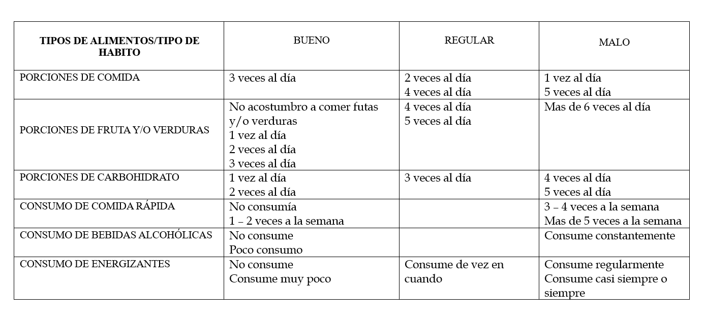
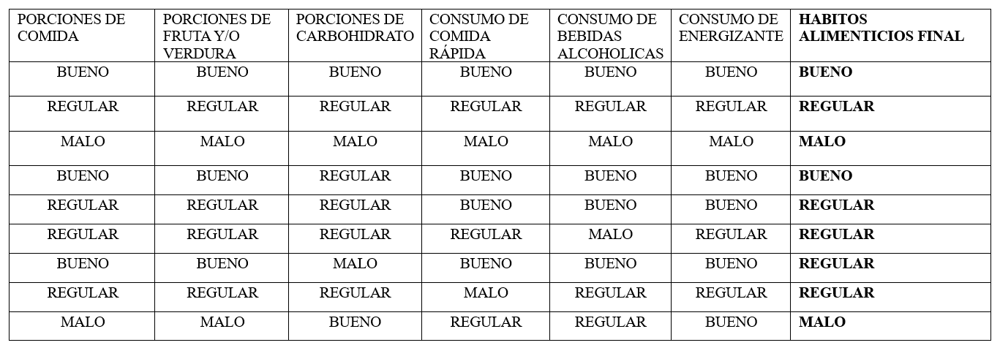

```{r echo=FALSE,message=FALSE}
if(!require(readr)){install.packages('readr')}
if(!require(dplyr)){install.packages('dplyr')}
if(!require(tidyverse)){install.packages('tidyverse')}
if(!require(knitr)){install.packages('knitr')}
```

```{r echo=FALSE,message=FALSE}
library("readr")
library("dplyr")
library("tidyverse")
library("knitr")
```

# **Introducción**

## _Relevancia_

De acuerdo a la organización de las Naciones Unidas para la Alimentación y la Agricultura, la alimentación humana se define como un proceso voluntario, consistente y educable. El cual involucra una alimentación adecuada, cubrir las necesidades nutricionales y consumir alimentos sanos o en pocas palabras, tener un buen hábito alimenticio. Según la OMS,“son comportamientos conscientes, colectivos y repetitivos, que conducen a las personas a seleccionar, consumir y utilizar determinados alimentos o dietas”.

La salud de los individuos se ve determinada por factores personales, socioculturales, económicos y ambientales, los cuales que a su vez, impactan en el estado homeostático de cada uno de estos. La alimentación es fundamental para el desarrollo
y conservación de nuestras capacidades, tanto físicas como cognitivas. Esta se ve influenciada por los hábitos alimenticios, los cuales se van adquiriendo desde la infancia, para más tarde consolidarse en la adolescencia y juventud. 


## _Objetivos_

### Generales
Identificar y determinar la relación entre los hábitos alimenticios y el
estado físico, fisiológico y académico que presentaron los alumnos de
UTEC durante los ciclos 2022-1 y 2022-2.

### Específico

-   Determinar la relación entre el rendimiento académico y los hábitos 
    alimenticios de los estudiantes de la Universidad de Ingeniería y
    Tecnología en los ciclos 2022-1 y 2022-2.

-   Analizar la relación entre el IMC y las horas promedio de sueño de
    los estudiantes de la Universidad de Ingeniería y Tecnología en los
    ciclos 2022-1 y 2022-2.

-   Analizar la relación entre las horas de actividad física y los
    hábitos alimenticios que presentaron los estudiantes de la
    Universidad de Ingeniería y Tecnología en los ciclos 2022-1 y 2022-2.

-   Comparar el IMC que presentaron los estudiantes de la Universidad de
    Ingeniería y Tecnología entre los ciclos 2022-1 y 2022-2.

-   Analizar la relación entre las horas promedio de sueño y el
    rendimiento académico de los estudiantes de la Universidad de
    Ingeniería y Tecnología en los ciclos 2022-1 y 2022-2.

-   Determinar la relación entre las horas de sueño y los hábitos
    alimenticios que presentaron los estudiantes de la Universidad de
    Ingeniería y Tecnología en los ciclos 2022-1 y 2022-2.


## _Contexto_
En muchos casos, la vida universitaria trae consigo un desorden de los
hábitos alimenticios, como lo son la omisión del desayuno, horarios de
comida irregulares, abuso de comidas rápidas y alimentación poco
diversificada(Leyton, 2022, p.1). En el actual informe identificamos y
determinamos qué relación tienen los hábitos alimenticios con el estado
físico, fisiológico y académico que presentan los alumnos de UTEC durante
los ciclos 2022 - 1 y 2022 - 2 usando las herramientas estadísticas que
nos ofrece RStudio. Este  programa nos brinda desde gráficos que nos
ayudarán a entender con mayor facilidad nuestros datos, hasta funciones
que nos permiten tratar y obtener información útil para la interpretación
correcta de nuestros datos.


# **DATOS**
## _Proceso de recolección de datos_
  Para recolectar los datos necesarios para nuestro estudio, se empleó la herramienta de Google forms mediante el cual realizamos una encuesta en el que se recolectó todos los datos necesarios de cada individuo a través de una serie de preguntas en torno a nuestro estudio. En primer lugar, la estrategia que utilizamos fue enviar nuestra encuesta por medio de Whatsapp a diversos grupos de mentorías académicas, pero solo recibimos una pequeña cantidad de encuestas respondidas. Entonces, la siguiente estrategia fue realizar la encuesta presencialmente y hacer algunos intercambios (responder una encuesta por cambio de nuestra encuesta) el cual fue muy efectivo al momento de completar la cantidad necesaria de encuestas.

## _Población, muestra y muestreo_
  - **Población**:  Estudiantes de la Universidad de Ingeniería y Tecnología.
  - **Muestra**:  Alumnos de la Universidad de Ingeniería y Tecnología que están entre el ciclo 3 y 10.
  - **Unidad muestral**: Un alumno que está entre el ciclo 3 y 10 de la Universidad de Ingeniería y Tecnología.
  - **Tamaño de Muestra**: 163 estudiantes de la Universidad de Ingeniería y Tecnología. 
  - **Muestreo**: Muestreo aleatorio estratificado. Dividiremos en estratos a los estudiantes que se encuentran dentro del ciclo 3 al ciclo 10 y escogeremos aleatoriamente a nuestra unidad muestral.

## _Variables_
- **Género**: Es una variable **categórica nominal** y su restricción es que solo se presenta dos opciones.

- **Edad**: Es una variable **numérica discreta** y su restricción es que no sea negativo ni menor a 17.

- **Carrera**: Es una variable **categórica nominal** y su restricción es que solo se presentan opciones con las carreras presentadas en UTEC.

- **Ciclo**: Es una variable **categórica ordinal** y su restricción es que pertenezca del tercer ciclo al décimo ciclo.

- **Promedio en el ciclo 2022-1 y 2022-2**: En ambos ciclos son variables **numéricas continuas** y su restricción es que no sea un número negativo, sea mayor a cero y menor a veinte.

- **Peso en el ciclo 2022-1 y 2022-2**: En ambos ciclos son variables **numéricas continuas** y su restricción es que no sea un número decimal negativo y se encuentre en un rango de 50 kg a 95 kg.

- **Talla en el ciclo 2022-1 y 2022-2**: En ambos ciclos son variables **numéricas continuas** y su restricción es que no sea un número decimal negativo y se encuentre en un rango de 1.5 m a 2 m.


- **Hábitos en el ciclo 2022-1 y 2022-2**: En ambos ciclos son variables **categóricas ordinales** y su restricción es que solo se presentan opciones.

- **Veces que comía durante el día el ciclo 2022-1 y 2022-2**: En ambos ciclos son variables **categóricas ordinales** y su restricción es que solo se presentan opciones.

- **Porciones de fruta en el ciclo 2022-1 y 2022-2**: En ambos ciclos son variables **categóricas ordinales** y su restricción es que solo se presentan opciones.

- **Porciones de carbohidratos en el ciclo 2022-1 y 2022-2**:En ambos ciclos son variables **categóricas ordinales** y su restricción es que solo se presentan opciones.

- **Consumo de bebidas alcohólicas**: Es una variable **categórica ordinal** y su restricción es que se presentan opciones.

- **Consumo de energizantes**: Es una variable **categórica ordinal** y su restricción es que se presentan opciones.

- **Consumo de comida rápida en el ciclo 2022-1 y 2022-2**: En ambos ciclos son variables **categóricas ordinales** y su restricción es que solo se presentan opciones.

- **Horas promedio de actividad física en el ciclo 2022-1 y 2022-2**: En ambos ciclos son variables **numéricas continuas** y su restricción es que no sea un número decimal negativo y sea menor que 8 horas.

- **Horas promedio que dormía en el ciclo 2022-1 y 2022-2**: En ambos ciclos son variables **numéricas continuas** y su restricción es que sea mayor a 4 horas y menor a 9 horas.

## _Limpieza de base de datos_

### *Limpieza*

A continuación abrimos el archivo en el que se encuentra los datos recolectados a través de nuestra encuesta y los clasificamos en numéricas y categóricas según lo anterior descrito.

```{r}
AB<-read_csv("Datos_antes_de_limpiar.csv", col_types="ccnccnnnnnnccccccccccccnnnn");
```

Primero, vemos la cantidad de datos faltantes que faltan en nuestra base de datos.
```{r}
sum(is.na(AB))
```

Como vemos, la cantidad de datos faltantes es igual a cero, por lo que podríamos decir que todos respondieron a cada pregunta estipulada en nuestra encuesta.

Segundo, se eliminará las columnas que no influyen en el estudio de nuestra muestra. En este caso eliminaremos la columna que contiene ala variable marca temporal.
```{r}
AB<-AB[,-1]
AB
```

Tercero, vamos a renombrar cada una de nuestras variables obtenidas por nombres más cortos con la finalidad de que sea más práctico trabajar con nuestra base de datos y para que no nos genere dificultades al momento de escribir cada una de ellas.

```{r results='hide'}
colnames(AB)[1:26]<-c("Genero","Edad","Carrera","Ciclo","Promedio1","Promedio2","Peso1","Peso2","Talla1","Talla2","Habitos1","Habitos2","Comida1","Comida2","Frutas1","Frutas2","Carbo1","Carbo2","BA","Ener","Comrapi1","Comrapi2","Actifis1","Actifis2","Sueño1","Sueño2")
```


Cuarto, se analizará cada variable para ver si algún dato no cumple con las condiciones en las que está hecha nuestro estudio, y si se detecta que ello, se pasara a eliminar esa unidad muestral debido a que no cumple con lo estipulado.

En nuestro base de datos, decidimos eliminar los datos que no cumplen las restricciones que consideramos para nuestro estudio, ya que solo identificamos un total de 7 unidades muestrales que no van con nuestras restricciones dadas. El cual solo representa un 0,04% de toda nuestra muestra obtenida.

- En las opciones de marcado múltiple no se tuvo que revisar cada variable debido a que está condicionado según lo que queremos conseguir en nuestro estudio. Por lo que solo revisaremos las otras variables en las que fueron de respuesta libre.

- En la variable **edad** no se hizo ningún cambio, ya que las edades son coherentes con el estudio.
```{r}
(AB$Edad)
```
- En la variable **ciclo** se tuvo que eliminar 3 unidades muestrales, los cuales contenían a alumnos menores al ciclo 3. Hicimos ello debido a que en nuestro estudio solo consideramos a estudiantes entre el ciclo 3 y 10.

```{r}
AB$Ciclo
AB<-AB[-2,]
AB<-AB[-11,]
AB<-AB[-151,]
``` 
- En las variables **peso**, **talla** y **promedio ponderado** presentado en ambos ciclos respectivamente. No se eliminó ningún dato debido a que no se encontraron datos atípicos, además, cada dato es coherente a nuestro estudio realizado.

```{r}
AB$Promedio1
```

```{r}
AB$Promedio2
```


```{r }
(AB$Peso1)
```
```{r}
(AB$Peso2)
```


```{r}
(AB$Talla1)
```


```{r}
(AB$Talla2)
```

- En la variable **horas de actividad física (Actifis)** presentada en cada ciclo respectivamente, eliminamos los datos en el que puso mayores a 8 horas de actividad física, ya que dentro de nuestro estudio no se considerará ello.
```{r results='hide'}
which((AB$Actifis1)>8);
which((AB$Actifis2)>8)
AB<-AB[-151,];
AB<-AB[-151,];
```
- En la variable **horas promedio de sueño a la semana (sueño)** presentada en cada ciclo, respectivamente, pasamos a eliminar los datos en el que se obtuvo menores a 4 horas debido a que es ilógico que una persona en un ciclo duerma menos de 4 horas en promedio.
```{r results='hide'}
which(AB$Sueño1<4);
which(AB$Sueño2<4);
AB<-AB[-4,];
AB<-AB[-18,];
```

### *Creación de variables*

Después de limpiar los datos que no cumplían las restricciones dadas, crearemos cuatro nuevas variables, las cuales van a ser **IMC1**, **IMC2**, **HabitosAlimenticios**, **HabitosAlimenticios2**-. Estos representarán el IMC y el tipo de hábito que cada estudiante presento en cada ciclo correspondiente.

Para calcular el IMC de cada estudiante utilizamos la siguiente fórmula:

$IMC= peso/talla^{2}$

```{r }
AB$IMC1=round((AB$Peso1)/((AB$Talla1)*(AB$Talla1)),digit=2)
```

```{r}
AB$IMC2=round((AB$Peso2)/((AB$Talla2)*(AB$Talla2)),digit=2)
```


Para poder obtener los **Hábitos Alimenticios** en cada ciclo correspondiente por cada estudiante, primero hicimos un cuadro en el que se observa de qué manera se clasificó las respuestas obtenidas por cada estudiante según las porciones de fruta que consumieron, las porciones de carbohidrato, las veces que comían al día, etc. Cada respuesta obtenida se clasificó en hábito bueno, malo y regular, el cual nos servirá para definir el hábito alimenticio final. 



Para poder determinar si el hábito alimenticio final presentado en cada ciclo es bueno, regular o malo, nos basaremos en la siguiente tabla donde nos muestra que si todo hábito es bueno, entonces su hábito alimenticio será bueno. Si presenta puros hábitos regulares, su hábito alimenticio será regular y si presenta puros hábitos malos, el hábito alimenticio será malo. Pero si sucede casos en el que presenta solo un hábito regular y lo demás es bueno, su hábito alimenticio será bueno, lo mismo si solo presenta uno malo y lo demás es bueno, su hábito alimenticio será regular. En cambio, si llega a presentar más de dos hábitos regulares o malos, su hábito será ello respectivamente.



### *Explicación*
Nuestra base de datos al final tuvo una reducción de 7 unidades muestrales, tal como mencionamos anteriormente, se redujo debido a que no se ingresó las respuestas adecuadas o que algunos respondieron inadecuadamente. Entonces, nuestra base está limpia, ya que cada variable tiene una respuesta adecuada y coherente con la realidad y con nuestro estudio. Por otro lado, hablamos de estudiantes universitarios, por lo que las respuestas obtenidas nos ayudarán a determinar los objetivos planteados en un inicio y decir que tanto se cumplieron cada uno de ellos.


```{r echo=FALSE}
MN<-read_csv("proyectolimpio.csv",col_types = "cnccnnnnnnccccccccccccnnnnnncc")
```


# **ANÁLISIS DESCRIPTIVO UNIVARIADO**

## _VARIABLES CUANTITATIVAS_

Para poder entender mejor el estudio que estamos realizando, iremos detallando el comportamiento de las variables basándonos en los datos recogidos en nuestra encuesta. Para ello haremos uso de descriptores numéricos y gráficos, los cuales nos permitirán entender mejor dicho comportamiento.

### EDAD  

A continuación presentamos un gráfico de "Cantidad de estudiantes" por "Edad". Este gráfico nos facilita la comprensión del comportamiento de las edades en base a la cantidad de estudiantes, sucediendo que a mayor edad tienden a haber menos estudiantes.

```{r echo=FALSE}
hist(MN$Edad, main = "Edad de los estudiantes de UTEC", xlab = "Edad", ylab = "Cantidad de estudiantes", col = "yellow")
abline(v=mean(MN$Edad),col="red",lwd=4)
abline(v=median(MN$Edad),col="steelblue",lwd=3)
abline(v=mean(MN$Edad)-1*sd(MN$Edad),col="dimgray",lwd=4)
abline(v=mean(MN$Edad)+1*sd(MN$Edad),col="dimgray",lwd=4)
abline(v=quantile(MN$Edad,0.25,type=3),col="tan4",lwd=4)
abline(v=quantile(MN$Edad,0.75,type=3),col="orchid2",lwd=4)
legend("topright",legend=c("media","mediana","Una desviación de la media","Cuantil(0.25)","Cuantil(0.75)"),col=c("red","steelblue","dimgray","tan4","orchid2"),lwd=2,cex=0.75)
```
**Descriptores numéricos:**
```{r echo=FALSE}
kable(MN %>% 
  summarize(Media=round(mean(Edad)), Mediana=round(median(Edad)),Mínimo=min(Edad),Máximo=max(Edad),Desv_std=round(sd(Edad),2),Q1=round(quantile(Edad,0.25,type=3)),Q3=round(quantile(Edad,0.75,type=3))))
```
Según la gráfica, los jóvenes universitarios que cursaron los ciclos de 2022-1 y 2022-2 en UTEC, tienen un promedio de 19 años y la gran mayoría de nuestros encuestados se encuentra entre 18 y 20 años. En la muestra obtenida, el rango de edad en el que se encuentran los jóvenes universitarios oscila entra 17 años y 24 años, la mayor cantidad de estudiantes tiene 18 años.


### PESO

```{r echo=FALSE}
par(mfrow=c(1,2))
hist(MN$Peso1, main = "Peso de los estudiantes en el ciclo 2022 - 1", xlab = "Peso", ylab = "Frecuencia", col = "seagreen1",cex.main=0.9)
abline(v=mean(MN$Peso1),col="red",lwd=3)
abline(v=median(MN$Peso1),col="steelblue",lwd=3)
abline(v=quantile(MN$Peso1,0.25,type=3),col="tan4",lwd=3)
abline(v=quantile(MN$Peso1,0.75,type=3),col="orchid2",lwd=3)
legend(x=75,y=35,legend=c("media","mediana","Quantile(0.25)","Quantile(0.75)"),col=c("red","steelblue","tan4","orchid2"),lwd=2,cex=0.5)
hist(MN$Peso2, main = "Peso de los estudiantes en el ciclo 2022 - 2", xlab = "Peso", ylab = "Frecuencia", col = "lightcyan2",cex.main=0.9)
abline(v=mean(MN$Peso2),col="red",lwd=3)
abline(v=median(MN$Peso2),col="steelblue",lwd=3)
abline(v=quantile(MN$Peso2,0.25,type=3),col="tan4",lwd=3)
abline(v=quantile(MN$Peso2,0.75,type=3),col="orchid2",lwd=3)
legend(x=75,y=30,legend=c("media","mediana","Quantile(0.25)","Quantile(0.75)"),col=c("red","steelblue","tan4","orchid2"),lwd=2,cex=0.5)
```
**Descriptores numéricos:**

**Ciclo 2022-1:**
```{r echo=FALSE}
kable(MN %>% 
  summarize(Media = round(mean(Peso1),2), Mediana = round(median(Peso1),2),Min=min(Peso1),Max=max(Peso1), DE= round(sd(Peso1),2), Q1 = round(quantile(Peso1,0.25,type = 3),2), Q3 = round(quantile(Peso1,0.75,type = 3),2)))
```

**Ciclo 2022-2:**
```{r echo=FALSE}
kable(MN %>% 
  summarize(Media = round(mean(Peso2),2), Mediana = round(median(Peso2),2),MIn=min(Peso2),Max=max(Peso2), DE = round(sd(Peso2),2), Q1 = round(quantile(Peso2,0.25,type = 3),2), Q3 = round(quantile(Peso2,0.75,type = 3),2)))
```
Según las gráficas obtenidas, podemos afirmar que no hubo una variabilidad alta en los datos obtenidos. No hubo mucha diferencia en los descriptores numéricos como se puede apreciar en la tabla ya mostrada. Por ejemplo: los descriptores como la desviación estándar (DE) o la media no varían mucho en los ciclos 2022-1 y 2022-2.


### TALLA
```{r echo=FALSE}
par(mfrow=c(1,2))
boxplot(MN$Talla1,main="Talla de los estudiantes en el ciclo 2022 - 1",cex.main=0.8,col="yellow")
abline(h=mean(MN$Talla1),col="red",lwd=2)
abline(h=quantile(MN$Talla1,0.25,type=3),col="tan4",lwd=2)
abline(h=quantile(MN$Talla1,0.75,type=3),col="orchid2",lwd=2)
legend("bottomright",legend=c("media","Quantile(0.25)","Quantile(0.75)"),col=c("red","blue","tan4","orchid2"),lwd=2,cex=0.5)
boxplot(MN$Talla2,main="Talla de los estudiantes en el ciclo 2022 - 2",col = "peachpuff1",cex.main=0.8)
abline(h=mean(MN$Talla2),col="red",lwd=2)
abline(h=quantile(MN$Talla2,0.25,type=3),col="tan4",lwd=2)
abline(h=quantile(MN$Talla2,0.75,type=3),col="orchid2",lwd=2)
legend("bottomright",legend=c("media","Quantile(0.25)","Quantile(0.75)"),col=c("red","blue","tan4","orchid2"),lwd=2,cex=0.5)
```

**Descriptores numéricos:**

**Ciclo 2022-1:**
```{r echo=FALSE}
kable(MN %>% 
  summarize(Media = round(mean(Talla1),2), Mediana = round(median(Talla1),2),Mínimo=min(Talla1),Máximo=max(Talla1), Desv_std = round(sd(Talla1),2), Q1 = round(quantile(Talla1,0.25,type = 3),2), Q3 = round(quantile(Talla1,0.75,type = 3),2)))
```

**Ciclo 2022-2:**
```{r echo=FALSE}
kable(MN %>% 
  summarize(Media = round(mean(Talla2),2), Mediana = round(median(Talla2),2),Mínimo=min(Talla2),Máximo=max(Talla2), Desv_std = round(sd(Talla2),2), Q1 = round(quantile(Talla2,0.25,type = 3),2), Q3 = round(quantile(Talla2,0.75,type = 3),2)))
```

Según las gráficas, se puede apreciar nuevamente que no hay una variabilidad notoria en los datos, sus descriptores numéricos no varían y por ende ambas gráficas son similares. Podemos resaltar que el promedio en la talla de los estudiantes fue de 1.66 m y en ambos ciclos la desviación estándar fue de 0.05, esto nos indica que los promedios de los alumnos tienden a la media obtenida, es decir, hay más cantidad de alumnos que tienen una talla cercana a la de la media. 

### Rendimiento académico

```{r echo=FALSE}
par(mfrow=c(1,2))

boxplot(MN$Promedio1,main="Promedio ponderado  de los estudiates en el ciclo 2022-1",col = "turquoise",cex.main=0.6)
abline(h=mean(MN$Promedio1),col="red",lwd=3)
abline(h=quantile(MN$Promedio1,0.25,type=3),col="tan4",lwd=2)
abline(h=quantile(MN$Promedio1,0.75,type=3),col="orchid2",lwd=2)
legend("bottomright",legend=c("media","Quantile(0.25)","Quantile(0.75)"),col=c("red","tan4","orchid2"),lwd=2,cex=0.5)
boxplot(MN$Promedio2,main="Promedio ponderado  de los estudiates en el ciclo 2022-2",col = "peachpuff1",cex.main=0.6)
abline(h=mean(MN$Promedio2),col="red",lwd=3)
abline(h=quantile(MN$Promedio2,0.25,type=3),col="tan4",lwd=2)
abline(h=quantile(MN$Promedio2,0.75,type=3),col="orchid2",lwd=2)
legend("bottomright",legend=c("media","Quantile(0.25)","Quantile(0.75)"),col=c("red","tan4","orchid2"),lwd=2,cex=0.5)
```

**Descriptores numéricos:**

**Ciclo 2022-1:**
```{r echo=FALSE}
kable(MN %>% 
  summarize(Media = round(mean(Promedio1),2), Mediana = round(median(Promedio1),2),Mínimo=min(Promedio1),Máximo=max(Promedio1), Desv_std = round(sd(Promedio1),2), Q1 = round(quantile(Promedio1,0.25,type = 3),2), Q3 = round(quantile(Promedio1,0.75,type = 3),2)))
```

**Ciclo 2022-2**
```{r echo=FALSE}
kable(MN %>% 
  summarize(Media = round(mean(Promedio2),2), Mediana = round(median(Promedio2),2),Mínimo=min(Promedio2),Máximo=max(Promedio2), Desv_std = round(sd(Promedio2),2), Q1 = round(quantile(Promedio2,0.25,type = 3),2), Q3 = round(quantile(Promedio2,0.75,type = 3),2)))
```

Según las gráficas, podemos afirmar que los promedios ponderados de los estudiantes en ambos ciclos no ha variado significativamente. Además, el rango intercuartílico en ambos ciclos nos indica que alrededor del 50% de los datos centrales se encuentran entre 14 y 16 aproximadamente. Por último, mencionar que debido a la desviación estándar en ambos casos nos muestra que los promedios de los alumnos tienden a la media obtenida.


### Actividad Física

```{r echo=FALSE}
par(mfrow=c(1,2))
hist(MN$Actifis1, main = "Horas de actividad fisica en promedio a la semana en el ciclo 2022-1", xlab = "Horas de ejercicio", ylab = "Frecuencia", col = "palegreen",cex.main=0.6)
abline(v=mean(MN$Actifis1),col="red",lwd=3)
abline(v=median(MN$Actifis1),col="blue",lwd=4)
abline(v=quantile(MN$Actifis1,0.25,type=3),col="yellow",lwd=2)
abline(v=quantile(MN$Actifis1,0.75,type=3),col="orchid2",lwd=3)
legend("topright",legend=c("media","mediana","Quantile(0.25)","Quantile(0.75)"),col=c("red","blue","yellow","orchid2"),lwd=2,cex=0.5)
hist(MN$Actifis2, main = "Horas de actividad fisica en promedio a la semana en el ciclo 2022-2", xlab = "Horas de ejercicio", ylab = "Frecuencia", col = "palegreen",cex.main=0.6)
abline(v=mean(MN$Actifis2),col="red",lwd=3)
abline(v=median(MN$Actifis2),col="steelblue",lwd=3)
abline(v=quantile(MN$Actifis2,0.25,type=3),col="tan4",lwd=3)
abline(v=quantile(MN$Actifis2,0.75,type=3),col="orchid2",lwd=3)
legend("topright",legend=c("media","mediana","Quantile(0.25)","Quantile(0.75)"),col=c("red","steelblue","tan4","orchid2"),lwd=2,cex=0.5)
```

**Descriptores numéricos:**

**Ciclo 2022-1:**
```{r echo=FALSE}
kable(MN %>% 
  summarize(Media = round(mean(Actifis1),2), Mediana = round(median(Actifis1),2),Mínimo=min(Actifis1),Máximo=max(Actifis1), Desv_std = round(sd(Actifis1),2), Q1 = round(quantile(Actifis1,0.25,type = 3),2), Q3 = round(quantile(Actifis1,0.75,type = 3),2)))
```

**Ciclo 2022-2:**
```{r echo=FALSE}
kable(MN %>% 
  summarize(Media = round(mean(Actifis2),2), Mediana = round(median(Actifis2),2),Mínimo=min(Actifis2),Máximo=max(Actifis2), Desv_std = round(sd(Actifis2),2), Q1 = round(quantile(Actifis2,0.25,type = 3),2), Q3 = round(quantile(Actifis2,0.75,type = 3),2)))
```
Respecto a estas dos gráficas podemos concluir lo siguiente: en comparación al ciclo 2022-1, hubo un incremento en los estudiantes que sí realizan ejercicio físico en el ciclo 2022-2 y disminuyó el número de estudiantes que no hacían actividad física. Una de las muchas formas de comprobar esto es en la cantidad de horas promedio de ejercicio, en el caso del ciclo 2022-1 fue de 1.02, mientras que en el 2022-2 este número aumentó a 1.42.

### Horas de Sueño

```{r echo=FALSE}
par(mfrow=c(1,2))
boxplot(MN$Sueño1,main="Horas promedio de sueño a la semana en el ciclo 2022-1",col = "lightcyan2",cex.main=0.5)
abline(h=mean(MN$Sueño1),col="red",lwd=3)
abline(h=quantile(MN$Sueño1,0.25,type=3),col="tan4",lwd=2)
abline(h=quantile(MN$Sueño1,0.75,type=3),col="orchid2",lwd=2)
legend("bottomright",legend=c("media","Quantile(0.25)","Quantile(0.75)"),col=c("red","tan4","orchid2"),lwd=2,cex=0.5)
boxplot(MN$Sueño2,main="Horas promedio de sueño a la semana en el ciclo 2022 - 2",col = "peachpuff1",cex.main=0.5)
abline(h=mean(MN$Sueño2),col="red",lwd=3)
abline(h=quantile(MN$Sueño2,0.25,type=3),col="blue",lwd=2)
abline(h=quantile(MN$Sueño2,0.75,type=3),col="orchid2",lwd=2)
legend("bottomright",legend=c("media","Quantile(0.25)","Quantile(0.75)"),col=c("red","blue","orchid2"),lwd=2,cex=0.5)
```
**Descriptores numéricos:**

**Ciclo 2022-1:**
```{r echo=FALSE}
kable(MN %>% 
  summarize(Media = round(mean(Sueño1),2), Mediana = round(median(Sueño1),2),Mínimo=min(Sueño1),Máximo=max(Sueño1), Desv_std = round(sd(Sueño1),2), Q1 = round(quantile(Sueño1,0.25,type = 3),2), Q3 = round(quantile(Sueño1,0.75,type = 3),2)))
```

**Ciclo 2022-2:**
```{r echo=FALSE}
kable(MN %>% 
  summarize(Media = round(mean(Sueño2),2), Mediana = round(median(Sueño2),2),Mínimo=min(Sueño2),Máximo=max(Sueño2), Desv_std = round(sd(Sueño2),2), Q1 = round(quantile(Sueño2,0.25,type = 3),2), Q3 = round(quantile(Sueño2,0.75,type = 3),2)))
```


Sobre las gráficas mostradas podemos concluir lo siguiente: la cantidad mínima es de 4 horas de sueño aproximadamente, mientras que la máxima es de 9 horas. En ambos ciclos hubo una poca variabilidad de datos. También, podemos afirmar con exactitud que en ciclo 2022-2 hubo 39 estudiantes que durmieron en promedio por lo menos 7 horas, por ende, tuvieron un descanso adecuado. El número de estudiantes que tuvieron un descanso adecuado en 2022-2 se ha reducido en 10 respecto al ciclo 2022-1 (49).

### IMC

```{r echo=FALSE}
par(mfrow=c(1,2))
hist(MN$IMC1, main = "IMC de los estudiantes de UTEC en el ciclo 2022-1", xlab = "IMC", ylab = "Frecuencia", col = "seagreen1",cex.main=0.8)
abline(v=mean(MN$IMC1),col="red",lwd=4)
abline(v=median(MN$IMC1),col="steelblue",lwd=3)
abline(v=quantile(MN$IMC1,0.25,type=3),col="tan4",lwd=3)
abline(v=quantile(MN$IMC1,0.75,type=3),col="orchid2",lwd=3)
legend("topright",legend=c("media","mediana","Quantile(0.25)","Quantile(0.75)"),col=c("red","steelblue","tan4","orchid2"),lwd=2,cex=0.6)

hist(MN$IMC2, main = "IMC de los estudiantes de UTEC en el ciclo 2022-2", xlab = "IMC", ylab = "Frecuencia", col = "lightcyan",cex.main=0.8)
abline(v=mean(MN$IMC2),col="red",lwd=4)
abline(v=median(MN$IMC2),col="steelblue",lwd=3)
abline(v=quantile(MN$IMC2,0.25,type=3),col="tan4",lwd=3)
abline(v=quantile(MN$IMC2,0.75,type=3),col="orchid2",lwd=3)
legend("topright",legend=c("media","mediana","Quantile(0.25)","Quantile(0.75)"),col=c("red","steelblue","tan4","orchid2"),lwd=2,cex=0.6)
```

**Descriptores numéricos:**

**Ciclo 2022-1:**
```{r echo=FALSE}
kable(MN %>% 
  summarize(Media = round(mean(IMC1),2), Mediana = round(median(IMC1),2),Mínimo=min(IMC1),Máximo=max(IMC1), Desv_std = round(sd(IMC1),2), Q1 = round(quantile(IMC1,0.25,type = 3),2), Q3 = round(quantile(IMC1,0.75,type = 3),2)))
```

**Ciclo 2022-2:**
```{r echo=FALSE}
kable(MN %>% 
  summarize(Media = round(mean(IMC2),2), Mediana = round(median(IMC2),2),Mínimo=min(IMC2),Máximo=max(IMC2), Desv_std = round(sd(IMC2),2), Q1 = round(quantile(IMC2,0.25,type = 3),2), Q3 = round(quantile(IMC2,0.75,type = 3),2)))
```

Sobre el IMC de los estudiantes en los ciclos 2022-1 y 2022-1 podemos afirmar que según la gráfica el promedio de IMC en ambos ciclos ha variado ligeramente. Comparando ambas gráfica y realizando un análisis de los datos, podemos concluir que en comparación al ciclo 2022-1, el número de alumnos con un IMC saludable aumentó de 98 a 104 en 2022-2. 

## _VARIABLE CUALITATIVA_

Una vez ya explicada de forma gráfica y textual de como va nuestras variables cuantitativas, ahora te explicaremos mas a detalle las variables cualitativas de nuestro estudio.

### Género

```{r echo=FALSE}
TABLA<-table(MN$Genero)
bp<-barplot(TABLA, main = "Género de los estudiantes de UTEC",
     xlab = "Género", ylab = "Frecuencia", 
     col = c("peachpuff1","lightblue"))
text(x=bp, y=TABLA, pos=1, cex=2, col="black", label=TABLA)
```
```{r echo=FALSE}
kable(MN %>% 
  summarize(Quantile_75 = quantile(Genero,0.75,type=3)))
```
Los alumnos pertenecientes a nuestro estudio, en su mayoría, según la gráfica presentada, fueron del género Masculino, ya que representa casi un 50% más que el género Femenino. Esto podemos corroborarlo con un descriptor, si le sacamos el percentil 0.75 a nuestra población obtenemos como resultado el género Masculino. Esto quiere decir que el 75% de alumnos pertenecientes a nuestro estudio fue del género Masculino.

### Carrera Universitaria de los estudiantes de UTEC


```{r echo=FALSE}
TABLA<-table(MN$Carrera)

bp<-barplot(sort(TABLA), main = "Carrera de los estudiantes de UTEC",xaxt="n",
     xlab = "Carrera", ylab = "Frecuencia", 
     col = c("peachpuff1","coral2","turquoise3","orange","seagreen4","khaki","orchid","coral4","hotpink4","lightblue","seagreen","slateblue1"))
text(x=bp, y=sort(TABLA), pos=1, cex=1, col="black", label=sort(TABLA))
```
```{r echo=FALSE}
plot.new()
legend('top',legend=names(TABLA),bty='n',fill=c("peachpuff1","coral2","turquoise3","orange","seagreen4","khaki","orchid","coral4","hotpink4","lightblue","seagreen","slateblue1"),cex = 1)
```


En las muestras obtenidas del estudio realizado a los estudiantes de UTEC, según la gráfica mostrada, se puede visualizar que hay más estudiantes de la carrera de Ingeniería Industrial, con un total de 21 alumnos y solo 3 alumnos son pertenecientes a la carrera de Administración y Negocios Digitales. De esta forma podemos ir viendo el gráfico con la leyenda para ver cuantos alumnos por carrera respondieron a nuestra encuesta.


### HÁBITOS ALIMENTICIOS

```{r echo=FALSE}
AK<-table(MN$Habitosalimenticios)
MK<-table(MN$Habitosalimenticios2)
```

```{r echo=FALSE}
par(mfrow=c(1,2))
barras<-barplot(sort(AK),cex.names=0.7,col=c("red","yellow","chartreuse1"),main="Habitos Alimenticios en el ciclo 2022 - 1",xlab="Habitos",ylab="frecuencia",cex.main=0.8)
text(x=barras, y=sort(AK), pos=1, cex=1, col="black", label=sort(AK))
barplot(sort(MK),cex.names=0.7,col=c("red","yellow","chartreuse1"),main="Habitos Alimenticios en el ciclo 2022 - 2",xlab="Habitos",ylab="frecuencia",cex.main=0.8)
text(x=barras, y=sort(MK), pos=1, cex=1, col="black", label=sort(MK))
```
**Ciclo 2022-1:**
```{r echo=FALSE}
kable(MN %>% 
  summarize(Quantile_64= quantile(Habitosalimenticios,0.64,type=3)))
```
**Ciclo 2022-2:**
```{r echo=FALSE}
kable(MN %>% 
  summarize(Quantile_66= quantile(Habitosalimenticios2,0.66,type=3)))
```


Si comparamos ambas gráficas se puede ver que hubo un ligero cambio en la cantidad de alumnos según los hábitos. Según los percentiles presentado, se puede observar que hubo un cambio de un 2% en los hábitos alimenticios bueno y regular. En otras palabras, en el ciclo 2022-2, un 66% de alumnos tuvo un hábito bueno y en el ciclo 2022-1 un 64%.


# **ANÁLISIS DESCRIPTIVO BIVARIADO**

- Una vez ya descrita cada variable y tener un concepto más detallado sobre lo que vamos a tratar, a continuación haremos una serie de análisis y para poder abarcar los objetivos presentados al inicio de todo nuestro proyecto.

### Objetivo 1

Mediante gráficas determinaremos si existe una relación entre el rendimiento académico y los hábitos alimenticios presentados por los estudiantes que estudiaron en el ciclo 2022 - 1 y 2022 - 2 en UTEC.


```{r echo=FALSE}
par(mfrow=c(1,2))
boxplot(MN$Promedio1 ~ MN$Habitosalimenticios,col=rainbow(3),
        main = "P. Ponderado vs H. Alimenticios 2022 - 1", xlab="Tipo de Hábito", ylab="Promedio",cex.main=1)

stripchart(MN$Promedio1 ~ MN$Habitosalimenticios, vertical = TRUE, method = "jitter",
           pch = 19, add = TRUE, col = c("mediumpurple"))
boxplot(MN$Promedio2 ~ MN$Habitosalimenticios2,col=rainbow(5),
        main = "P. Ponderado vs H. Alimenticios 2022 - 2", xlab="Tipo de Hábito", ylab="Promedio",cex.main=1)

stripchart(MN$Promedio2 ~ MN$Habitosalimenticios2, vertical = TRUE, method = "jitter",
           pch = 19, add = TRUE, col = c("firebrick"))
```


_*Para llegar a una conclusión, compararemos la gráfica 2022 - 2 respecto a la gráfica 2022 - 1. En el hábito alimenticio bueno, disminuyó la mediana de los promedios ponderados, por lo que podemos inferir que hubo alumnos que al mejorar sus hábitos bajaron su promedio ponderado o de que hubo alumnos que tuvieron buen promedio ponderado, pero sus hábitos alimenticios cambiaron a regular o malo y como consecuencia bajo la mediana de promedios ponderados en el hábito alimenticio bueno. En el hábito alimenticio regular, se puede ver claramente que la mediana aumentó, por lo que se infiere que hubo alumnos que al cambiar sus hábitos alimenticios a regular mantuvieron o mejoraron sus promedios ponderados. En el hábito alimenticio malo, se puede ver claramente que su mediana es baja, por lo que se infiere que al tener un mal hábito alimenticio bajaron su promedio ponderado final.*_ 
_*En conclusión, existe una ligera relación entre los hábitos alimenticios y los promedios ponderados que los estudiantes de UTEC presentaron en nuestro estudio.*_


### Objetivo 2

Determinaremos si hay relación entre el IMC y las horas promedio de sueño de los estudiantes de UTEC que estudiaron en los ciclos 2022 - 1 y 2022 - 2.

```{r echo=FALSE}
par(mfrow=c(1,2))

plot(MN$IMC1 ~ MN$Sueño1, main="IMC vs Horas de sueño 2022 - 1", pch = 19, col = "red",xlab="Horas de sueño",ylab="IMC")
abline(lm(MN$IMC1~MN$Sueño1),col="yellow4",lwd=2)
plot(MN$IMC2 ~ MN$Sueño2,main="IMC vs Horas de sueño 2022 - 2", pch = 19, col = "darkblue",xlab="Horas de sueño",ylab="IMC")
abline(lm(MN$IMC2~MN$Sueño2),col="firebrick",lwd=2)
```
```{r echo=FALSE}
kable(MN %>% 
  summarize(Correlación_2022_1 = round(cor(IMC1,Sueño1),2),Correlación_2022_2=round(cor(IMC2,Sueño2),2)))
```

_*Las horas de sueño que los estudiantes presentaron en el ciclo 2022 - 1 y 2022 - 2 no depende del IMC que cada uno presento. Ya que, como se puede observar en ambas gráficas, los puntos no guardan proporción alguna con el IMC  y la correlación entre ambos es muy baja (<0.5) el cual nos indica que el IMC no tiene mucha relación con las horas de sueño. En otras palabras, solo en algunos estudiantes la cantidad de horas que descanso tuvo como resultado un cambio en su IMC.*_


### Objetivo 3

Determinaremos si existe alguna relación entre las horas de actividad física y los hábitos alimenticios de los estudiantes de UTEC que estudiaron en los ciclos 2022 - 1 y 2022 - 2.

```{r echo=FALSE}
par(mfrow=c(1,2))
boxplot(MN$Actifis1 ~ MN$Habitosalimenticios,col=rainbow(10),
        main="A. Física vs H. Alimenticios (2022-1)",xlab="Tipo de Hábito", ylab="Horas de actividad física",cex.main=1)

stripchart(MN$Actifis1 ~ MN$Habitosalimenticios, vertical = TRUE, method = "jitter",
           pch = 19, add = TRUE, col = c("firebrick"))

boxplot(MN$Actifis2 ~ MN$Habitosalimenticios2,col=rainbow(10),
        main="A. Física vs H. Alimenticios (2022-2)",xlab="Tipo de Hábito", ylab="Horas de actividad física",cex.main=1)

stripchart(MN$Actifis2 ~ MN$Habitosalimenticios2, vertical = TRUE, method = "jitter",
           pch = 19, add = TRUE, col = c("palegreen4"))
```

_*Para poder llegar a una conclusión, compararemos la gráfica "A. Física vs H. Alimenticios (2022-2)", respecto a la gráfica "A. Física vs H. Alimenticios (2022-2)". Puedes observar que los alumnos que presentaron un hábito alimenticio malo llegaron a incrementar mas sus horas de actividad física respecto a los alumnos que presentaron un hábito alimenticio regular y bueno. Al final, los alumnos que tuvieron un hábito alimenticio regular presentaron una mediana, obtenida de las horas que los alumnos hicieron alguna actividad física, mayor a los alumnos que presentaron un hábito alimenticio bueno. Respecto a lo descrito, los hábitos alimenticios si tienen una alta relación con las horas promedio de actividad física, ya que mientras mas bajo sea su hábito alimenticio, mas horas de actividad física realizaron.*_


### Objetivo 4

Para explicar el objetivo propuesto, a continuación haremos una comparación entre el IMC que cada estudiante presento en cada ciclo respectivamente.

```{r echo=FALSE}
plot(MN$IMC1,MN$IMC2, xlab="IMC - Ciclo 2022 - 1",ylab="IMC - Ciclo 2022 - 2",pch=c(1,2),col=c("red","blue"),fg="orange",lwd=2)
abline(lm(MN$IMC1~MN$IMC2),col="purple",lwd=2)
title(main="IMC EN EL CICLO 2022 - 1 VS IMC EN EL CICLO 2022 - 2")
legend("bottomright",legend=c("IMC 1","IMC 2"),col=c("red","blue"),pch=c(1,2),cex=1)
```
```{r echo=FALSE}
kable(MN %>% 
  summarize(Correlación= round(cor(IMC1,IMC2),2)))
```
_*Como se puede observar en la gráfica, los IMC presentados en ambos ciclos respectivamente, no variaron demasiado, ya que  crecen en misma proporción y en su mayoría no están dispersos. Esto es posible, debido a que nuestra muestra tuvo como unidad muestral a alumnos universitarios que tienen casi la misma edad, por ende su IMC no varía demasiado.*_

### Objetivo 5

Para explicar el objetivo propuesto, compararemos dos gráficas en las cuales determinaremos si existe una relación entre las variables presentadas.

```{r echo=FALSE}
par(mfrow=c(1,2))
plot(MN$Sueño1 ~ MN$Promedio1, pch = 19, col = "red",main="Horas de Sueño vs P. Ponderado 2022-1",xlab="H. Sueño",ylab="P.Poderado",cex.main=0.9)
abline(lm(MN$Sueño1~MN$Promedio1),col="yellow4",lwd=2)
plot(MN$Sueño2 ~ MN$Promedio2, pch = 19, col = "darkblue",main="Horas de Sueño vs P. Ponderado 2022-2",xlab="H. Sueño",ylab="P.Poderado",cex.main=0.9)
abline(lm(MN$Sueño2~MN$Promedio2),col="firebrick",lwd=2)
```

```{r echo=FALSE}
kable(MN %>% 
  summarize(Correlación_2022_1 = round(cor(Sueño1,Promedio1),2),Correlación_2022_2=round(cor(Sueño2,Promedio2),2)))
```

_*Los promedios ponderados que los alumnos pertenecientes a nuestra muestra presentaron en el ciclo 2022 - 1 y 2022 - 2 tienen una relación demasiado baja positiva con las horas de sueño que cada uno de ellos presento respectivamente. Ya que como se puede observar en ambas gráfica, los puntos no guardan proporción alguna con los ponderados y su correlación en ambos es muy baja (<0.5)el cual nos indica las horas de sueño no tiene mucha relación con los promedios ponderados que cada estudiante presento. En otras palabras, solo en algunos estudiantes las horas que descansaron tuvo como resultado un buen ponderado.*_

### Objetivo 6

Para poder llegar a una conclusión, primero verás dos gráficas en las que se determinara si existe alguna relación entre las dos variables presentadas.
```{r echo=FALSE}
par(mfrow=c(1,2))
boxplot(MN$Sueño1 ~ MN$Habitosalimenticios,col=rainbow(10),
        main="Horas de Sueño vs H. Alimenticios 2022 - 1",xlab="Horas de Sueño",ylab="H. Alimenticios",cex.main=0.9)

stripchart(MN$Sueño1 ~ MN$Habitosalimenticios, vertical = TRUE, method = "jitter",
           pch = 19, add = TRUE, col = c("firebrick"))

boxplot(MN$Sueño2 ~ MN$Habitosalimenticios2,col=rainbow(10),
        main="Horas de Sueño vs H. Alimenticios 2022 - 2",xlab="Horas de Sueño",ylab="H. Alimenticios",cex.main=0.9)

stripchart(MN$Sueño2 ~ MN$Habitosalimenticios2, vertical = TRUE, method = "jitter",
           pch = 19, add = TRUE, col = c("palegreen4"))
```


_*Para llegar a una conclusión acerca del objetivo planteado, compararemos ambas gráficas. Puede observar que la mediana de las horas promedio de sueño presentado en cada ciclo respectivamente por cada tipo de hábito no cambio, pero si se observa que el rango intercuartílico de horas de sueño es menor en el ciclo 2022 - 2 de lo que se infiere que durmieron mas en ese ciclo. En conclusión, los hábitos alimenticios no tienen relación alguna con las horas promedio de sueño que presento cada estudiante.*_