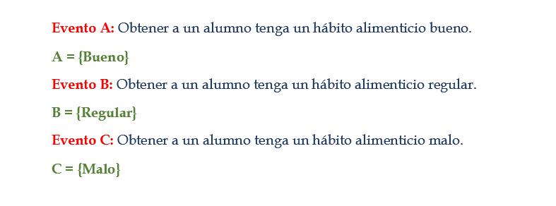
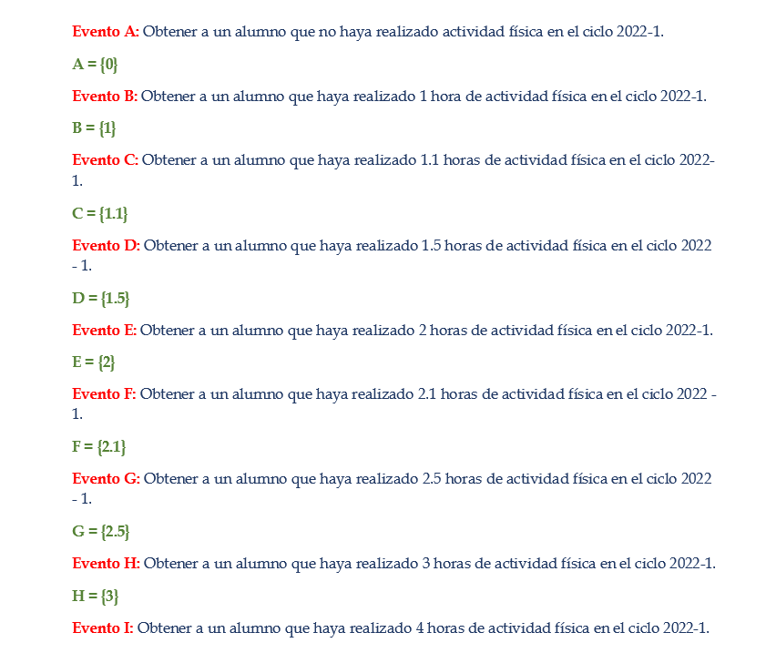
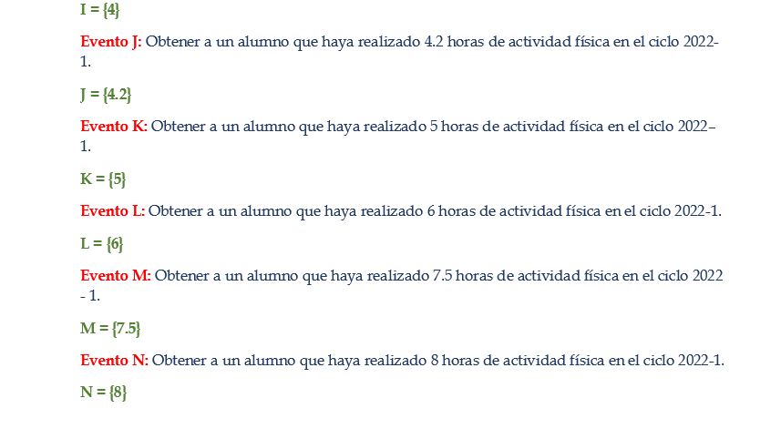
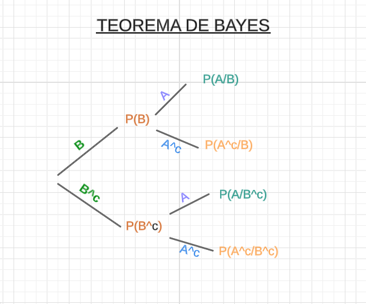

```{r echo=FALSE,message=FALSE,warning=FALSE}
if(!require(readr)){install.packages('readr')}
if(!require(dplyr)){install.packages('dplyr')}
if(!require(tidyverse)){install.packages('tidyverse')}
if(!require(knitr)){install.packages('knitr')}
if(!require(latex2exp)){install.packages('latex2exp')}
if(!require(ggplot2)){install.packages('ggplot2')}
if(!require(ggthemes)){install.packages('ggthemes')}
```

```{r echo=FALSE,message=FALSE,warning=FALSE}
library("latex2exp")
library("readr")
library("dplyr")
library("ggplot2")
library("ggthemes")
library("knitr")
library("tidyverse")
```

```{r echo=FALSE}
MN<-read_csv("proyectolimpio.csv",col_types = "cnccnnnnnnccnnccnnccccnnnnnncc")
```

# **INTRODUCCIÓN**

## _Relevancia_

De acuerdo  a la FAO, la alimentación humana se define como un proceso voluntario, consistente y educable. El cual involucra una alimentación adecuada en el que se debe cubrir las necesidades nutricionales y consumir alimentos sanos. En otras palabras, se busca tener un buen hábito alimenticio. Según la OMS,“son comportamientos conscientes, colectivos y repetitivos, que conducen a las personas a seleccionar, consumir y utilizar determinados alimentos o dietas”.

## _Objetivos_

### Generales

Identificar y determinar la relación entre los hábitos alimenticios y el estado físico, fisiológico y académico que presentaron los alumnos de UTEC durante los ciclos 2022-1 y 2022-2.

### Específico

- Determinar la relación entre el rendimiento académico y los hábitos alimenticios de los estudiantes de UTEC en los ciclos 2022-1 y 2022-2.

- Analizar la relación entre el IMC y las horas promedio de sueño de los estudiantes de UTEC en los ciclos 2022-1 y 2022-2.

- Analizar la relación entre las horas de actividad física y los hábitos alimenticios que presentaron los estudiantes de UTEC en los ciclos 2022-1 y 2022-2.

- Comparar el IMC que presentaron los estudiantes de UTEC entre los ciclos 2022-1 y 2022-2.

- Analizar la relación entre las horas promedio de sueño y el rendimiento académico de los estudiantes de la UTEC en los ciclos 2022-1 y 2022-2.

-   Determinar la relación entre las horas de sueño y los hábitos alimenticios que presentaron los estudiantes de UTEC en los ciclos 2022-1 y 2022-2.

## _Contexto_

En muchos casos, la vida universitaria trae consigo un desorden de los hábitos alimenticios, como lo son la omisión del desayuno, horarios de comida irregulares, abuso de comidas rápidas y alimentación poco diversificada. En el actual informe identificamos y determinamos qué relación tienen los hábitos alimenticios con el estado físico, fisiológico y académico que presentan los alumnos de UTEC que estudiaron en los ciclos 2022 - 1 y 2022 - 2 usando el programa RStudio. Mediante este programa se realizará un análisis descriptivo y probabilístico de los datos recopilados en la encuesta realizada.


# **ANÁLISIS DESCRIPTIVO UNIVARIADO**

## _VARIABLES CUANTITATIVAS_

### _RENDIMIENTO ACADÉMICO_

```{r echo=FALSE}
par(mfrow=c(1,2))

boxplot(MN$Promedio1,main="Promedio ponderado en el ciclo 2022-1",col = "turquoise",cex.main=0.6)
abline(h=mean(MN$Promedio1),col="red",lwd=3)
abline(h=quantile(MN$Promedio1,0.25,type=3),col="tan4",lwd=2)
abline(h=quantile(MN$Promedio1,0.75,type=3),col="orchid2",lwd=2)
legend("bottomright",legend=c("media","Quantile(0.25)","Quantile(0.75)"),col=c("red","tan4","orchid2"),lwd=2,cex=0.5)
boxplot(MN$Promedio2,main="Promedio ponderado en el ciclo 2022-2",col = "peachpuff1",cex.main=0.6)
abline(h=mean(MN$Promedio2),col="red",lwd=3)
abline(h=quantile(MN$Promedio2,0.25,type=3),col="tan4",lwd=2)
abline(h=quantile(MN$Promedio2,0.75,type=3),col="orchid2",lwd=2)
legend("bottomright",legend=c("media","Quantile(0.25)","Quantile(0.75)"),col=c("red","tan4","orchid2"),lwd=2,cex=0.5)
```

**Descriptores numéricos:**

**Ciclo 2022-1 y 2022-2:**
```{r echo=FALSE}
kable(MN %>% 
  summarize(Media = round(mean(Promedio1),2), Mediana = round(median(Promedio1),2),Mínimo=min(Promedio1),Máximo=max(Promedio1), Desv_std = round(sd(Promedio1),2), Q1 = round(quantile(Promedio1,0.25,type = 3),2), Q3 = round(quantile(Promedio1,0.75,type = 3),2)))
```
```{r echo=FALSE}
kable(MN %>% 
  summarize(Media = round(mean(Promedio2),2), Mediana = round(median(Promedio2),2),Mínimo=min(Promedio2),Máximo=max(Promedio2), Desv_std = round(sd(Promedio2),2), Q1 = round(quantile(Promedio2,0.25,type = 3),2), Q3 = round(quantile(Promedio2,0.75,type = 3),2)))
```

Según las gráficas, podemos afirmar que los promedios ponderados de los estudiantes en ambos ciclos no ha variado significativamente. Además, el rango intercuartílico en ambos ciclos nos indica que alrededor del 50% de los datos centrales se encuentran entre 14 y 16 aproximadamente. Por último, mencionar que debido a la desviación estándar en ambos casos nos muestra que los promedios de los alumnos tienden a la media obtenida.


### _ACTIVIDAD FÍSICA_

```{r echo=FALSE}
par(mfrow=c(1,2))
hist(MN$Actifis1, main = "Horas de actividad fisica en promedio a la semana en el ciclo 2022-1", xlab = "Horas de ejercicio", ylab = "Frecuencia", col = "palegreen",cex.main=0.6)
abline(v=mean(MN$Actifis1),col="red",lwd=3)
abline(v=median(MN$Actifis1),col="blue",lwd=4)
abline(v=quantile(MN$Actifis1,0.25,type=3),col="yellow",lwd=2)
abline(v=quantile(MN$Actifis1,0.75,type=3),col="orchid2",lwd=3)
legend("topright",legend=c("media","mediana","Quantile(0.25)","Quantile(0.75)"),col=c("red","blue","yellow","orchid2"),lwd=2,cex=0.5)
hist(MN$Actifis2, main = "Horas de actividad fisica en promedio a la semana en el ciclo 2022-2", xlab = "Horas de ejercicio", ylab = "Frecuencia", col = "palegreen",cex.main=0.6)
abline(v=mean(MN$Actifis2),col="red",lwd=3)
abline(v=median(MN$Actifis2),col="steelblue",lwd=3)
abline(v=quantile(MN$Actifis2,0.25,type=3),col="tan4",lwd=3)
abline(v=quantile(MN$Actifis2,0.75,type=3),col="orchid2",lwd=3)
legend("topright",legend=c("media","mediana","Quantile(0.25)","Quantile(0.75)"),col=c("red","steelblue","tan4","orchid2"),lwd=2,cex=0.5)
```

**Descriptores numéricos:**

**Ciclo 2022-1 y 2022-2:**
```{r echo=FALSE}
kable(MN %>% 
  summarize(Media = round(mean(Actifis1),2), Mediana = round(median(Actifis1),2),Mínimo=min(Actifis1),Máximo=max(Actifis1), Desv_std = round(sd(Actifis1),2), Q1 = round(quantile(Actifis1,0.25,type = 3),2), Q3 = round(quantile(Actifis1,0.75,type = 3),2)))
```
```{r echo=FALSE}
kable(MN %>% 
  summarize(Media = round(mean(Actifis2),2), Mediana = round(median(Actifis2),2),Mínimo=min(Actifis2),Máximo=max(Actifis2), Desv_std = round(sd(Actifis2),2), Q1 = round(quantile(Actifis2,0.25,type = 3),2), Q3 = round(quantile(Actifis2,0.75,type = 3),2)))
```
Respecto a estas dos gráficas podemos concluir lo siguiente: en comparación al ciclo 2022-1, hubo un incremento en los estudiantes que sí realizan ejercicio físico en el ciclo 2022-2 y disminuyó el número de estudiantes que no hacían actividad física. Una de las muchas formas de comprobar esto es en la cantidad de horas promedio de ejercicio, en el caso del ciclo 2022-1 fue de 1.02, mientras que en el 2022-2 este número aumentó a 1.42.

### _HORAS DE SUEÑO_

```{r echo=FALSE}
par(mfrow=c(1,2))
boxplot(MN$Sueño1,main="Horas promedio de sueño a la semana en el ciclo 2022-1",col = "lightcyan2",cex.main=0.5)
abline(h=mean(MN$Sueño1),col="red",lwd=3)
abline(h=quantile(MN$Sueño1,0.25,type=3),col="tan4",lwd=2)
abline(h=quantile(MN$Sueño1,0.75,type=3),col="orchid2",lwd=2)
legend("bottomright",legend=c("media","Quantile(0.25)","Quantile(0.75)"),col=c("red","tan4","orchid2"),lwd=2,cex=0.5)
boxplot(MN$Sueño2,main="Horas promedio de sueño a la semana en el ciclo 2022 - 2",col = "peachpuff1",cex.main=0.5)
abline(h=mean(MN$Sueño2),col="red",lwd=3)
abline(h=quantile(MN$Sueño2,0.25,type=3),col="blue",lwd=2)
abline(h=quantile(MN$Sueño2,0.75,type=3),col="orchid2",lwd=2)
legend("bottomright",legend=c("media","Quantile(0.25)","Quantile(0.75)"),col=c("red","blue","orchid2"),lwd=2,cex=0.5)
```
**Descriptores numéricos:**

**Ciclo 2022-1 y 2022-2:**
```{r echo=FALSE}
kable(MN %>% 
  summarize(Media = round(mean(Sueño1),2), Mediana = round(median(Sueño1),2),Mínimo=min(Sueño1),Máximo=max(Sueño1), Desv_std = round(sd(Sueño1),2), Q1 = round(quantile(Sueño1,0.25,type = 3),2), Q3 = round(quantile(Sueño1,0.75,type = 3),2)))
```
```{r echo=FALSE}
kable(MN %>% 
  summarize(Media = round(mean(Sueño2),2), Mediana = round(median(Sueño2),2),Mínimo=min(Sueño2),Máximo=max(Sueño2), Desv_std = round(sd(Sueño2),2), Q1 = round(quantile(Sueño2,0.25,type = 3),2), Q3 = round(quantile(Sueño2,0.75,type = 3),2)))
```


Sobre las gráficas mostradas podemos concluir lo siguiente: la cantidad mínima es de 4 horas de sueño aproximadamente, mientras que la máxima es de 9 horas. En ambos ciclos hubo una poca variabilidad de datos. También, podemos afirmar con exactitud que en ciclo 2022-2 hubo 39 estudiantes que durmieron en promedio por lo menos 7 horas, por ende, tuvieron un descanso adecuado. El número de estudiantes que tuvieron un descanso adecuado en 2022-2 se ha reducido en 10 respecto al ciclo 2022-1 (49).

### _IMC_

```{r echo=FALSE}
par(mfrow=c(1,2))
hist(MN$IMC1, main = "IMC de los estudiantes de UTEC en el ciclo 2022-1", xlab = "IMC", ylab = "Frecuencia", col = "seagreen1",cex.main=0.8)
abline(v=mean(MN$IMC1),col="red",lwd=4)
abline(v=median(MN$IMC1),col="steelblue",lwd=3)
abline(v=quantile(MN$IMC1,0.25,type=3),col="tan4",lwd=3)
abline(v=quantile(MN$IMC1,0.75,type=3),col="orchid2",lwd=3)
legend("topright",legend=c("media","mediana","Quantile(0.25)","Quantile(0.75)"),col=c("red","steelblue","tan4","orchid2"),lwd=2,cex=0.6)

hist(MN$IMC2, main = "IMC de los estudiantes de UTEC en el ciclo 2022-2", xlab = "IMC", ylab = "Frecuencia", col = "lightcyan",cex.main=0.8)
abline(v=mean(MN$IMC2),col="red",lwd=4)
abline(v=median(MN$IMC2),col="steelblue",lwd=3)
abline(v=quantile(MN$IMC2,0.25,type=3),col="tan4",lwd=3)
abline(v=quantile(MN$IMC2,0.75,type=3),col="orchid2",lwd=3)
legend("topright",legend=c("media","mediana","Quantile(0.25)","Quantile(0.75)"),col=c("red","steelblue","tan4","orchid2"),lwd=2,cex=0.6)
```

**Descriptores numéricos:**

**Ciclo 2022-1 y 2022-2:**
```{r echo=FALSE}
kable(MN %>% 
  summarize(Media = round(mean(IMC1),2), Mediana = round(median(IMC1),2),Mínimo=min(IMC1),Máximo=max(IMC1), Desv_std = round(sd(IMC1),2), Q1 = round(quantile(IMC1,0.25,type = 3),2), Q3 = round(quantile(IMC1,0.75,type = 3),2)))
```

```{r echo=FALSE}
kable(MN %>% 
  summarize(Media = round(mean(IMC2),2), Mediana = round(median(IMC2),2),Mínimo=min(IMC2),Máximo=max(IMC2), Desv_std = round(sd(IMC2),2), Q1 = round(quantile(IMC2,0.25,type = 3),2), Q3 = round(quantile(IMC2,0.75,type = 3),2)))
```

Sobre el IMC de los estudiantes podemos afirmar que según la gráfica el promedio de IMC en ambos ciclos ha variado ligeramente. Comparando ambas gráfica y realizando un análisis de los datos, podemos concluir que en comparación al ciclo 2022-1, el número de alumnos con un IMC saludable aumentó de 98 a 104 en 2022-2. 

## _VARIABLE CUALITATIVA_

### _HÁBITOS ALIMENTICIOS_

```{r echo=FALSE}
AK<-table(MN$Habitosalimenticios)
MK<-table(MN$Habitosalimenticios2)
```

```{r echo=FALSE}
par(mfrow=c(1,2))
barras<-barplot(sort(AK),cex.names=0.7,col=c("red","yellow","chartreuse1"),main="Habitos Alimenticios en el ciclo 2022 - 1",xlab="Habitos",ylab="frecuencia",cex.main=0.8)
text(x=barras, y=sort(AK), pos=1, cex=1, col="black", label=sort(AK))
barplot(sort(MK),cex.names=0.7,col=c("red","yellow","chartreuse1"),main="Habitos Alimenticios en el ciclo 2022 - 2",xlab="Habitos",ylab="frecuencia",cex.main=0.8)
text(x=barras, y=sort(MK), pos=1, cex=1, col="black", label=sort(MK))
```
**Ciclo 2022-1 y 2022-2:**
```{r echo=FALSE}
kable(MN %>% 
  summarize(Quantile_64= quantile(Habitosalimenticios,0.64,type=3)))
```
```{r echo=FALSE}
kable(MN %>% 
  summarize(Quantile_66= quantile(Habitosalimenticios2,0.66,type=3)))
```

**Si comparamos ambas gráficas se puede ver que hubo un ligero cambio en la cantidad de alumnos según los hábitos. En los percentiles presentados, se puede observar que hubo un cambio de un 2% en los hábitos alimenticios bueno y regular. En otras palabras, en el ciclo 2022-2, un 66% de alumnos tuvo un hábito bueno y en el ciclo 2022-1 un 64%.**

# **ANÁLISIS DESCRIPTIVO BIVARIADO**

### _Objetivo 1_


```{r echo=FALSE}
par(mfrow=c(1,2))
boxplot(MN$Promedio1 ~ MN$Habitosalimenticios,col=rainbow(3),
        main = "P. Ponderado vs H. Alimenticios 2022 - 1", xlab="Tipo de Hábito", ylab="Promedio",cex.main=1)

stripchart(MN$Promedio1 ~ MN$Habitosalimenticios, vertical = TRUE, method = "jitter",
           pch = 19, add = TRUE, col = c("mediumpurple"))
boxplot(MN$Promedio2 ~ MN$Habitosalimenticios2,col=rainbow(5),
        main = "P. Ponderado vs H. Alimenticios 2022 - 2", xlab="Tipo de Hábito", ylab="Promedio",cex.main=1)

stripchart(MN$Promedio2 ~ MN$Habitosalimenticios2, vertical = TRUE, method = "jitter",
           pch = 19, add = TRUE, col = c("firebrick"))
```


_*Para llegar a una conclusión, compararemos ambas gráficas. En el hábito alimenticio bueno, disminuyó la mediana de los promedios ponderados, por lo que podemos inferir que hubo alumnos que al mejorar sus hábitos bajaron su promedio ponderado o de que hubo alumnos que tuvieron buen promedio ponderado, pero sus hábitos alimenticios cambiaron a regular o malo y como consecuencia bajo la mediana de promedios ponderados en el hábito alimenticio bueno. En el hábito alimenticio regular, se puede ver claramente que la mediana aumentó, por lo que se infiere que hubo alumnos que al cambiar sus hábitos alimenticios a regular mantuvieron o mejoraron sus promedios ponderados. En el hábito alimenticio malo, se puede ver claramente que su mediana es baja, por lo que se infiere que al tener un mal hábito alimenticio bajaron su promedio ponderado final.*_ 
_*En conclusión, existe una ligera relación entre los hábitos alimenticios y los promedios ponderados que los estudiantes de UTEC presentaron en nuestro estudio.*_


### _Objetivo 3_


```{r echo=FALSE}
par(mfrow=c(1,2))
boxplot(MN$Actifis1 ~ MN$Habitosalimenticios,col=rainbow(10),
        main="A. Física vs H. Alimenticios (2022-1)",xlab="Tipo de Hábito", ylab="Horas de actividad física",cex.main=1)

stripchart(MN$Actifis1 ~ MN$Habitosalimenticios, vertical = TRUE, method = "jitter",
           pch = 19, add = TRUE, col = c("firebrick"))

boxplot(MN$Actifis2 ~ MN$Habitosalimenticios2,col=rainbow(10),
        main="A. Física vs H. Alimenticios (2022-2)",xlab="Tipo de Hábito", ylab="Horas de actividad física",cex.main=1)

stripchart(MN$Actifis2 ~ MN$Habitosalimenticios2, vertical = TRUE, method = "jitter",
           pch = 19, add = TRUE, col = c("palegreen4"))
```

_*Para poder llegar a una conclusión, compararemos ambas gráficas. Puedes observar que los alumnos que presentaron un hábito alimenticio malo llegaron a incrementar más sus horas de actividad física respecto a los alumnos que presentaron un hábito alimenticio regular y bueno. Al final, los alumnos que tuvieron un hábito alimenticio regular presentaron una mediana, obtenida, de las horas que los alumnos hicieron alguna actividad física, mayor a los alumnos que presentaron un hábito alimenticio bueno. Respecto a lo descrito, los hábitos alimenticios sí tienen una alta relación con las horas promedio de actividad física, ya que mientras más bajo sea su hábito alimenticio, más horas de actividad física realizaron.*_


### _Objetivo 6_

```{r echo=FALSE}
par(mfrow=c(1,2))
boxplot(MN$Sueño1 ~ MN$Habitosalimenticios,col=rainbow(10),
        main="Horas de Sueño vs H. Alimenticios 2022 - 1",xlab="Horas de Sueño",ylab="H. Alimenticios",cex.main=0.9)

stripchart(MN$Sueño1 ~ MN$Habitosalimenticios, vertical = TRUE, method = "jitter",
           pch = 19, add = TRUE, col = c("firebrick"))

boxplot(MN$Sueño2 ~ MN$Habitosalimenticios2,col=rainbow(10),
        main="Horas de Sueño vs H. Alimenticios 2022 - 2",xlab="Horas de Sueño",ylab="H. Alimenticios",cex.main=0.9)

stripchart(MN$Sueño2 ~ MN$Habitosalimenticios2, vertical = TRUE, method = "jitter",
           pch = 19, add = TRUE, col = c("palegreen4"))
```


_*Para llegar a una conclusión acerca del objetivo planteado, compararemos ambas gráficas. Puede observar que la mediana de las horas promedio de sueño presentado en cada ciclo respectivamente por cada tipo de hábito no cambio, pero si se observa que el rango intercuartílico de horas de sueño es menor en el ciclo 2022-2 de lo que se infiere que durmieron más en ese ciclo._

# **ANÁLISIS PROBABILÍSTICO**

**TABLA 1**

La siguiente tabla representa la cantidad de alumnos que hizo actividad física de acuerdo al hábito alimenticio que presento en el ciclo 2022-1.

```{r echo=F}
kable(table(MN$Habitosalimenticios,MN$Actifis1))
```

## **PROBABILIDAD EMPÍRICA**

### _HÁBITOS ALIMENTICIOS_

**Experimento:**  Seleccionar al azar a un estudiante y observar el tipo de hábito alimenticio que tuvo dentro de nuestro estudio que tiene un total de 156 muestras.

**Ω = { Bueno, Regular, Malo } **

Se definen los siguientes eventos atómicos:


**EJEMPLO:**

- ¿Cuál es la probabilidad de que un alumno de UTEC tenga un hábito alimenticio bueno?

  <center>$$\mathbb{P}(A)=\frac{n(A)}{n(Ω)}$$<center>

```{r echo=F,results='asis'}
k<-round(sum(MN$Habitosalimenticios=="Bueno")/nrow(MN),2)
cat('La probabilidad de que un alumno de UTEC tenga un hábito alimenticio bueno es de',k)
```

- ¿Cuál es la probabilidad de que un alumno de UTEC tenga un hábito alimenticio regular?

  <center>$$\mathbb{P}(B)=\frac{n(B)}{n(Ω)}$$<center>

```{r echo=F,results='asis'}
k<-round(sum(MN$Habitosalimenticios=="Regular")/nrow(MN),2)
cat('La probabilidad de que un alumno de UTEC tenga un hábito alimenticio regular es de',k)
```

- ¿Cuál es la probabilidad de que un alumno de UTEC tenga un hábito alimenticio malo?

  <center>$$\mathbb{P}(C)=\frac{n(C)}{n(Ω)}$$<center>


```{r echo=F,results='asis'}
k<-round(sum(MN$Habitosalimenticios=="Malo")/nrow(MN),2)
cat('La probabilidad de que un alumno de UTEC tenga un hábito alimenticio malo es de',k,'.')
```


### _HORAS PROMEDIO DE ACTIVIDAD FÍSICA_

**Experimento: ** Seleccionar al azar a un estudiante y observar la cantidad de horas de actividad física que realizaron los estudiantes dentro de nuestro estudio el cual tiene un total de 156 muestras.

**Ω = { 0, 1, 1.1, 1.5, 2, 2.1, 2.5, 3, 4, 4.2, 5, 6, 7.5, 8 } **

Se definen los siguientes eventos atómicos: 



**EJEMPLO**

- ¿Cuál es la probabilidad de que un alumno de UTEC no haya hecho ninguna actividad física?
  <center>$$\mathbb{P}(A)=\frac{n(A)}{n(Ω)}$$<center>

```{r echo=F,results='asis'}
k<-round(sum(MN$Actifis1==0)/nrow(MN),2)
cat('La probabilidad de que un alumno de UTEC no haya hecho ninguna actividad física es de',k,'.')
```

- ¿Cuál es la probabilidad de que un alumno de UTEC haya hecho una hora de actividad física?

  <center>$$\mathbb{P}(B)=\frac{n(B)}{n(Ω)}$$<center>

```{r echo=F,results='asis'}
k<-round(sum(MN$Actifis1==1)/nrow(MN),2)
cat('La probabilidad de que un alumno de UTEC haya hecho una hora de ecatividad física es de',k,'.')
```

- ¿Cuál es la probabilidad de que un alumno de UTEC haya hecho tres horas de actividad física?

  <center>$$\mathbb{P}(H)=\frac{n(H)}{n(Ω)}$$<center>

```{r echo=F,results='asis'}
k<-round(sum(MN$Actifis1==3)/nrow(MN),2)
cat('La probabilidad de que un alumno de UTEC haya hecho tres horas de actividad física es de',k,'.')
```

## **PROBABILIDAD CONDICIONAL**
### _PROBABILIDAD 1_

Los universitarios hoy en día, en su mayoría, descuidamos nuestra alimentación por el poco tiempo que tenemos o por las diferentes actividades que realizamos. Ya sea ir al gimnasio, realizar ciertas actividades de la casa, etc. 
Entonces, ¿cuál es la probabilidad de que un alumno de UTEC tenga un hábito alimenticio malo dado que no realice actividad física?

Se definen los eventos:

**A: **Seleccionar a un alumno con hábito alimenticio malo.

**B: **Seleccionar a un alumno que no realizo actividad física.

- Primero, se determinará si los eventos *A* y  *B* son dependientes o independientes.
<center>$$\mathbb{P}(A \cap B)=\mathbb{P}(A) * \mathbb{P}(B)$$</center>

$\mathbb{P}(A \cap B)$

```{r echo=F}
round((sum((MN$Habitosalimenticios=="Malo")&(MN$Actifis1==0)))/nrow(MN),3)
```

$\mathbb{P}(A) * \mathbb{P}(B)$
```{r echo=F}
round((sum(MN$Habitosalimenticios=="Malo")/nrow(MN))*(sum(MN$Actifis1==0)/nrow(MN)),3)
```

Según los resultados obtenidos se puede observar que ambos eventos son independientes. Es decir, la probabilidad de que un alumno de UTEC tenga un hábito alimenticio malo no está influenciada por la probabilidad de que no realicé alguna actividad física.

- Segundo, respondemos a la pregunta haciendo uso de la probabilidad condicional.

<center>$$\mathbb{P}(A/B)=\frac{\mathbb{P}(A\cap B)}{\mathbb{P}(B)}$$</center>

```{r echo=F,results='asis'}
probAB<-round((sum((MN$Habitosalimenticios=="Malo")&(MN$Actifis1==0))/nrow(MN))/(sum(MN$Actifis1==0)/nrow(MN)),2)
cat('La probabilidad de que un alumno de UTEC tenga un hábito alimenticio malo dado que no realice ninguna actividad física es de',probAB,'.')
```
Como los eventos son independientes, se cumple que P(A/B)=P(A). Si revisamos en la parte de probabilidad empírica, la probabilidad de que un alumno tenga un hábito alimenticio malo es igual a la hallada aquí. Por lo que se puede determinar que ambos eventos son independientes.

- Tercero, mediante el teorema de Bayes para hallar la probabilidad de que un alumno no haya hecho ningún tipo de actividad física dado que tenga un hábito alimenticio malo (${P}(B/A)$).

<center>$$\mathbb{P}(B|A)=\frac{{P}(B)*P(A|B)}{P(A)}$$</center><br>



  Eventos: 

  _**A:**_ Obtener un alumno con hábito alimenticio malo.

  _**B:**_ Obtener un alumno que no haya hecho ningún tipo de actividad física.
  
- Probabilidad total.

<center>$$\mathbb{P}(A)={P}(B)*P(A/B) + {P}(B^c)*P(A/B^c)$$</center><br>


```{r echo=F,results='asis'}
probabilidadB <- sum(MN$Actifis1==0)/nrow(MN)
probabilidadBcomplemento <- 1 - probabilidadB
probabilidadtotalA<-(sum((MN$Habitosalimenticios=="Malo")&(MN$Actifis1==0))/nrow(MN))
probabilidadAdadoB<-probabilidadtotalA/probabilidadB
probabilidadtotalAcomplemento<-(sum((MN$Habitosalimenticios=="Malo")&(MN$Actifis1>0))/nrow(MN))
probabilidadAdadoBcomplemento<-probabilidadtotalAcomplemento/probabilidadBcomplemento
total<-round(probabilidadB*probabilidadAdadoB+probabilidadBcomplemento*probabilidadAdadoBcomplemento,2)
cat('La probabilidad total(P(A)) es:',total)
```

- Resultado.

```{r echo=F,results='asis'}
resultado<-round(((probabilidadB*probAB)/total),2)
cat('La probabilidad de que un alumno de UTEC no realice ninguna actividad física dado que su hábito alimenticio sea malo es de',resultado,'.')
```
Como los eventos son independientes, se cumple que P(B/A)=P(B). Si revisamos en la parte de probabilidad empírica, la probabilidad de que un alumno no realicé actividad física es igual a la hallada aquí. Por lo que se puede determinar que ambos eventos son independientes.

### _PROBABILIDAD 2_

**¿Cuál es la probabilidad de que un alumno tenga un buen hábito alimenticio dado que hizo actividad física como máximo 2 horas?**

Eventos:

_**A:**_ Obtener a un alumno con hábito alimenticio bueno.

_**B:**_ Obtener a un alumno que haya hecho como máximo 2 horas de actividad física.

- Primero se determinara si los eventos presentados son dependientes o independientes.

$\mathbb{P}(A \cap B)$

```{r echo=F}
round((sum((MN$Habitosalimenticios=="Bueno")&(MN$Actifis1<=2)))/nrow(MN),3)
```

$\mathbb{P}(A) * \mathbb{P}(B)$

```{r echo=F}
round((sum(MN$Habitosalimenticios=="Bueno")/nrow(MN))*(sum(MN$Actifis1<=2)/nrow(MN)),3)
```
  
Según los resultados obtenidos, se puede observar que ambos resultados son diferentes y por ende son dependientes. En otras palabras, la probabilidad de que un alumno tenga un buen hábito alimenticio bueno influye en la probabilidad de que haga hecho ejercicio como máximo 2 horas.

- Segundo, respondemos a la pregunta haciendo uso de la probabilidad condicional.

<center>$$\mathbb{P}(A/B)=\frac{\mathbb{P}(A\cap B)}{\mathbb{P}(B)}$$</center>

```{r echo=F,results='asis'}
prob2A_B<-round((sum((MN$Habitosalimenticios=="Bueno")&(MN$Actifis1<=2))/nrow(MN))/(sum(MN$Actifis1<=2)/nrow(MN)),2)
cat('La probabilidad de que un alumno tenga un buen hábito alimenticio y haya hecho como máximo 2 horas de actividad física es de',prob2A_B)
```

- Tercero, mediante el teorema de Bayes en el que se hallará la probabilidad de que un alumno haya realizado como máximo 2 horas de actividad física dado que tuvo un hábito alimenticio bueno.

<center>$$\mathbb{P}(B|A)=\frac{{P}(B)*P(A|B)}{P(A)}$$</center><br>


_**A:**_ Obtener un alumno con hábito alimenticio bueno.

_**B:**_ Obtener un alumno que haya hecho como máximo dos horas de actividad física.

- Probabilidad total: 

<center>$$\mathbb{P}(A)={P}(B)*P(A/B) + {P}(B^c)*P(A/B^c)$$</center><br>


```{r echo=F}
probmenor2 <- sum(MN$Actifis1<=2)/nrow(MN)
probmenor2comple <- 1 - probmenor2
prob_B_menor<-(sum((MN$Habitosalimenticios=="Bueno")&(MN$Actifis1<=2))/nrow(MN))/probmenor2
prob_B_complemenor<-(sum((MN$Habitosalimenticios=="Bueno")&(MN$Actifis1>2))/nrow(MN))/probmenor2comple
probtotal<-round(probmenor2*prob_B_menor+probmenor2comple*prob_B_complemenor,2)
cat('La probabilidad total(P(A)) es:',probtotal)
```

- Resultado.

```{r echo=F,results='asis'}
probafinal<-round((probmenor2*prob_B_menor)/probtotal,2)
cat('La probabilidad de que un alumno realizado como máximo dos horas de actividad física y dado que tenga un buen hábito alimenticio es de:',probafinal)
```

## **VARIABLES ALEATORIAS DISCRETAS** 

El siguiente análisis se hará en función a las variables que fueron presentadas a lo largo de nuestro proyecto, en esta parte utilizaremos algunas de ellas para analizar la posibilidad de ocurrencia de cada evento que se va a plantear. A raíz de ello, utilizaremos la distribución binomial y la distribución geométrica.

### *Distribución Binomial*

El experimento binomial estará hecho en base a la variable Hábitos Alimenticios.

```{r echo=F}
probabilidad_hábitos <- prop.table(table(MN$Habitosalimenticios))
barras <- barplot(probabilidad_hábitos,cex.names=0.8,col=c("red","yellow","chartreuse1"),ylim=c(0,1),main="Probabilidad de pertenecer a cada Hábito Alimenticio",font.axis=4,las=1)
text(barras,probabilidad_hábitos + 0.05, labels = round(probabilidad_hábitos,2))
```

**Éxito: ** Encontrar a los estudiantes con hábito alimenticio **Bueno**.

_VARIABLE ALEATORIA DISCRETA: _

**X:** Número de alumnos de UTEC que tienen un hábito alimenticio **Bueno** dentro del estudio que se realizo a 156 estudiantes.

_PARÁMETROS de X~Bin(n,p):_

**p:** Probabilidad de éxito**(P(E))**.

**n:** Número total de alumnos de nuestro estudio realizado.

#### **Gráfica**

```{r echo=F}
n=nrow(MN)
k=sum(MN$Habitosalimenticios=="Bueno")/156
colores<- c(rep("orchid2",157), 'red')
barplot(dbinom(0:n, size = nrow(MN), prob = k), names.arg = c(0:n), main = "Distribución Binomial de la variable X", ylab = "Densidad", xlab = "Número de estudiantes", col = colores,
     cex.axis=0.9, cex.names=0.9, cex.lab=0.9, cex.main=1, space = FALSE)
```

#### *PROPIEDADES: *

**ESPERANZA(E(x))**

```{r echo=F}
cat('Valor esperado es:', n*k)
```
**Varianza(Var(x))**

```{r echo=F}
cat('La varianza es:', round((n*k)*(1-k),2))
```

**DESVIACIÓN ESTÁNDAR**

```{r echo=F}
cat('La desviación es:', round(((n*k)*(1-k))^0.5,2))
```
#### *PROBLEMA*

UTEC realiza una reunión general acerca de como tener una vida saludable. A la reunión acuden un total de 156 estudiantes con diferentes tipos de hábitos alimenticios cada uno. Un nutricionista que observaba de lejos, quiere conocer la probabilidad de que por lo menos 100 alumnos tengan un hábito alimenticio bueno.

**X : ** Número de alumnos de la Universidad de Ingeniería y Tecnología que tienen un hábito alimenticio **Bueno** dentro del estudio que se realizo a 156 estudiantes.

_RESULTADO_

**P(X>=100):** 

```{r echo=F}
cat('La probabilidad de que por lo menos 100 alumnos de la reunión tengan un hábito alimenticio bueno es de: ',round(1-pbinom(q=99,size = 156,prob = 0.64),2))
```

```{r echo=F}
n=nrow(MN)
k=sum(MN$Habitosalimenticios=="Bueno")/156
colores<- c(rep("orchid2",157), 'red')
barplot(1-pbinom(0:n, size = nrow(MN), prob = k), names.arg = c(0:n), main = "Distribución Binomial de la variable X", ylab = "Probabilidad Acumulada", xlab = "Número de estudiantes", col = colores,
     cex.axis=0.9, cex.names=0.9, cex.lab=0.9, cex.main=1, space = FALSE)
abline(v = 100, lwd = 2, col = "red")
```


### *Distribución Geométrica*

El experimento Geométrico estará hecho en base a la variable cantidad de veces que comía en el día **(Comida1)**. 

```{r echo=F}
probabilidad_veces_que_comio <- prop.table(table(MN$Comida1))
barras <- barplot(probabilidad_veces_que_comio,cex.names=0.8,col=rainbow(4),ylim=c(0,1),main="Probabilidad",font.axis=4,las=1)
text(barras,probabilidad_veces_que_comio + 0.05, labels = round(probabilidad_veces_que_comio,2))
legend("topright",title="Veces que comio",legend=c("2 veces","3 veces","4 veces","5 veces"),col=rainbow(4),lwd=5,cex=1)
```

**Éxito: ** Encontrar a un estudiante que comió 4 veces al día.

**Fracaso: **Encontrar a un estudiante que no haya comido 4 veces al día.

_VARIABLE ALEATORIA DISCRETA:_

**X: **Número de encuestas realizadas hasta encontrar a un estudiante que haya comido 4 veces al día dentro de una muestra de 156 observaciones pertenecientes a UTEC.

_Parámetros de X~Geom(p): _

**p:** Probabilidad de éxito**(P(E))**.

#### *Gráfica*

```{r echo=F}
n=156
k=sum(MN$Comida1==4)/156
colores<- c(rep("orange",157), 'red')
barplot(dgeom(0:n, prob = k), names.arg = c(0:n), main = "Distribución Geométrica de la variable X", ylab = "Densidad", xlab = "Número de estudiantes", col = colores,
     cex.axis=0.9, cex.names=0.9, cex.lab=0.9, cex.main=1, space = FALSE)
```


#### *PROPIEDADES: *

**ESPERANZA(E(x))**

```{r echo=F}
cat('Valor esperado es:', round(1/k,2))
```
**Varianza(Var(x))**

```{r echo=F}
cat('La varianza es:', round((1-k)/k^2,2))
```

**DESVIACIÓN ESTÁNDAR**

```{r echo=F}
cat('La desviación estándar es:', round(((1-k)/k^2)^0.5,2))
```

#### *PROBLEMA *

En una base datos que está compuesta por un total de 156 observaciones pertenecientes a un estudio del curso de estadística y probabilidades de UTEC, un investigador identifico de que una de las variables de dicha base trataba sobre la cantidad de veces que un alumno comía al día. Este se preguntó, así mismo, que probabilidad habría si de las 156 observaciones tomamos 20 y la observación 20 sea un estudiante que haya comido 4 veces al día.

**X: **Número de estudiantes que no hayan comido 4 veces al día hasta encontrar al estudiante que si comió 4 veces al día dentro de una muestra de 156 observaciones pertenecientes a UTEC.

_RESULTADO_

**P(X=19)**

```{r echo=F}
cat('La probabilidad de que si de las 20 observaciones escogidas, la observación 20 sea de un alumno que haya comido 4 veces al día es de: ',round(dgeom(19,prob = k),4))
```
```{r echo=F}
n=20
k=sum(MN$Comida1==4)/156
colores<- c(rep("orange",157), 'red')
barplot(dgeom(0:n, prob = k), names.arg = c(0:n), main = "Distribución Geométrica de la variable X", ylab = "Probabilidad Acumulada", xlab = "Número de estudiantes", col = colores,
     cex.axis=0.9, cex.names=0.9, cex.lab=0.9, cex.main=1, space = FALSE)
abline(v = 20, lwd = 2, col = "skyblue")
```


## **VARIABLES ALEATORIAS CONTINUAS**

### *DISTRIBUCIÓN NORMAL*
En este caso trabajaremos con el Índice de masa corporal de los estudiantes en el ciclo 2022-1 **(IMC1)**.

```{r echo=FALSE}
hist(MN$IMC1,breaks=25, freq=FALSE, main="Histograma IMC", xlab="IMC", col="turquoise",ylim = c(0,0.25))
lines(density(MN$IMC1, na.rm=TRUE),col="red",lwd=3)

curve(dnorm(x, mean(MN$IMC1,na.rm=TRUE), sd(MN$IMC1,na.rm=TRUE)), lwd = 2, col = "blue", add = T)
legend("topleft", c("curva observada", "curva teórica"),lty = 1, lwd = 2, col = c("red", "blue"), bty = "n",cex = 0.8)
```

Como podemos ver en el siguiente gráfico de densidad, aparenta tener una densidad normal pero eso lo comprobaremos al comparar la media con la mediana.

#### *PROPIEDADES*

_Media: _
```{r echo=FALSE}
cat('La media es:',round(mean(MN$IMC1),2))
```
_Mediana: _
```{r echo=FALSE}
cat('La mediana es:',round(median(MN$IMC1),2))
```

Como se pueda observar, ambos valores obtenidos son aproximadamente iguales **(Media ≈ Mediana)** por lo que se puede decir que la distribución normal es simétrica.

En segundo lugar, vamos a evaluar la varianza**(Var)** y su desviación estándar**(Sd)**, para ello utilizaremos la siguiente notación: $V=S^2$

_VARIANZA: _                                        
```{r echo=FALSE}
cat('La varianza es: ',round(var(MN$IMC1),4))
```
_DESVIACIÓN ESTÁNDAR: _
```{r echo=FALSE}
cat('La desviación estándar es:',round(sd(MN$IMC1)^2,4))
```
Como se puede apreciar, ambos resultados son iguales por lo que se puede concluir de que la distribución hecha a la variable **IMC1** esta bien planteada.

_ESPERANZA: _
```{r echo=FALSE}
esperanza<-mean(MN$IMC1)
cat('La esperanza obtenida es:',round(esperanza,2))
```

#### _Parámetros de X~N(µ,σ):_

**µ:** Promedio promedio de nuestra variable elegida**(IMC1)**

**σ:** Desviación estándar de nuestra variable elegida**(IMC1)** 

#### **EJEMPLO**

En una encuesta realizada a 156 estudiantes, se recopiló el peso y la talla con el fin de que un investigador pueda determinar si su peso y su talla se encuentren correctamente equilibrados. Para ello, el investigador calcula el IMC de cada estudiante y decide empezar a elegir al azar a los estudiantes presentes ahí. Entonces, ¿cuál es la probabilidad de que al elegir a un estudiante este tenga un IMC alto? **(IMC mayor a 25)**? 

_VARIABLE ALEATORIA CONTINUA: _

**X: **El IMC de los estudiantes que realizaron la encuesta.

```{r, echo=FALSE, warning=FALSE, message = FALSE}
sec_IMC <- seq(-4, 4, length = 100) * sd(MN$IMC1) + mean(MN$IMC1)
normal_IMC <- dnorm(sec_IMC, mean(MN$IMC1), sd(MN$IMC1))
normal_IMC %>% 
  as.data.frame() %>% 
  rename(valor = ".") %>% 
  ggplot() +
  aes(sec_IMC, valor) +
  geom_line() +
  theme(axis.text.y = element_blank()) +
  xlab("IMC") +
  ylab("") +
  ggtitle("Distribución normal") +
  geom_area(aes(x = ifelse(sec_IMC >25, sec_IMC, 0)), fill = "red") +
  xlim(min(sec_IMC), max(sec_IMC)) +
  labs(subtitle = paste("P(X>25) =",1-pnorm(25,mean(MN$IMC1),sd(MN$IMC1))))
```


**Resultado:** La probabilidad de que el investigador elija al azar a un estudiante con IMC alto es de 0.32, esto significaría (en este caso) que sería un IMC que significa el investigador estaría buscando estudiantes con sobrepeso u obesidad.

### *DISTRIBUCIÓN EXPONENCIAL*

En este caso trabajaremos con la cantidad de horas de actividad física que los estudiantes hicieron en el ciclo 2022-1 **(Actifis1)**.

```{r echo=F}
mu <- mean(MN$Actifis1)
lambda <- 1/mu
```

```{r, echo=FALSE, warning=FALSE}
x <- seq(0, 40, 0.001)
hist(MN$Actifis1,col="cyan",main="Distribución de horas de Actividad Física",ylab="densidad",xlab="Horas",prob=TRUE,xlim = c(0, 8),ylim = c(0, 0.6))
lines(x, dexp(x, rate = lambda), col = "red", lty = 1, lwd = 3)
```


#### *PROPIEDADES*
_ESPERANZA-FORMULA: _
```{r echo=F}
cat('El valor esperado es: ',round(mean(MN$Actifis1),2))
```
_ESPERANZA-TEÓRICA_
```{r echo=F}
cat('El valor esperado es: ',round(1/lambda,2))
```

_VARIANZA-FORMULA: _
```{r echo=F}
cat('La varianza es: ',round(var(MN$Actifis1),2))
```
_VARIANZA-TEÓRICA_
```{r echo=F}
cat('La varianza es: ',round(1/lambda^2,2))
```
Según los resultados obtenidos al aplicar las propiedades, se puede observar que la esperanza es igual, pero difieren en su varianza. Se considera que es una distribución exponencial por el hecho de que a mayor cantidad de horas menos cantidad de personas se encuentra en la distribución. Además, cumple el estándar de ser positivo y tener forma exponencial.


#### *Parámetros de X~exp(λ)*

**λ:** Es la tasa promedio, de nuestra variable aleatoria continua en el que ocurre el evento.

#### *EJEMPLO*

A un gimnasio acuden todos los días diversos estudiantes de la ciudad de Lima. El dueño del gimnasio, también es profesor de cálculo I, se da cuenta de que las horas de actividad física que hace cada estudiante lo puede expresar mediante una función exponencial donde el promedio de horas es de 1.02. Él intenta saber que tanta probabilidad existe de que un estudiante que vaya al gimnasio, haga más de 3 horas de actividad física.

**X: **Cantidad de horas de actividad física.

$$
P(X>3)
$$
```{r echo=F}
exp_area <- function(rate = lambda, lb, ub, acolor = "lightgray", ...) {
    x <- seq(0, 8/rate, 0.1) 
    
    if (missing(lb)) {
       lb <- min(x)
    }
    if (missing(ub)) {
        ub <- max(x)
    }

    x2 <- seq(lb, ub, length = 100)    
    plot(x, dexp(x, rate = rate), type = "n", ylab = "")
   
    y <- dexp(x2, rate = rate)
    polygon(c(lb, x2, ub), c(0, y, 0), col = acolor)
    lines(x, dexp(x, rate = rate), type = "l", ...)
}
```

```{r echo=F}
exp_area(rate=lambda, lb = 3, ub=8,acolor = rgb(1, 1, 0),xlab="Horas",ylab = "Densidad",col="red")
arrows(4, 0.4, 4, 0.05, length = 0.1, lwd = 2,col="blue")
text(4, 0.45, "X > 3", cex = 1.2,col="blue")
```


```{r echo=F, results='asis'}
cat('La probabilidad de que un estudiante que vaya al gimnasio y haga mas de 3 horas de ejericicio es de',round(pexp(q=3, rate = lambda, lower.tail = FALSE),2))
```
# **CONCLUSIONES**


Para entender mejor nuestro objetivo, el estado fisiológico lo relacionamos con la cantidad de horas de sueño que cada estudiante presento respecto a cada ciclo, el estado físico lo relacionamos con la cantidad de horas que realizaron alguna actividad física cada estudiante respecto a cada ciclo y el estado académico lo relacionamos con los promedios ponderados presentados por cada alumno respecto a cada ciclo.

+ Se llegó a la primera conclusión de que los hábitos alimenticios tiene una ligera relación con el estado fisiológico presentado, ya que las horas que duerme cada alumno no depende necesariamente de los hábitos alimenticios que podamos tener o el tipo de alimentación que tengamos cada uno. Para enmarcar mejor ello entremos en torno a la población de nuestro estudio, bien se sabe que nuestra población fue dirigido a estudiantes universitarios, por lo que se puede inferir que cada estudiante llego a dormir esa cantidad de horas por los trabajos o actividades dados por la universidad, o porque realizaron otras actividades extracurriculares el cual hizo que lleguen a tener menos tiempo y dormir esa cantidad de horas presentadas en ambos ciclos.

+ Se llegó a una segunda conclusión de que los hábitos alimenticios tienen una alta relación con el estado físico que presento cada estudiante en cada ciclo respectivo, por lo que se determinó que ambos son dependientes. En otras palabras, se observó en los estudiantes que mientras más malo eran su hábito alimenticio, más horas de actividad física realizaban
en ambos ciclos respectivamente. Para enmarcar mejor ello, como ya mencionamos antes, nuestra población son estudiantes universitarios de los que en su mayoría tienen una edad de 18 a 20 años. Entonces, debido a que en la actualidad existen estereotipos de físico y belleza, la mayoría de los jóvenes tienden a tener presente dichos estereotipos, por lo que se infiere que cuando se tiene un mal hábito se llega a subir de peso y para que no se note ello, la mayoría realiza ejercicios. Por este motivo es que se llegó a dicha conclusión.

+ Se llegó a una tercera conclusión de que los hábitos alimenticios tienen una ligera relación con el estado académico que presentaron los estudiantes en cada ciclo respectivamente, de lo que se determinó que el estado académico no depende de los hábitos alimenticios que se llegue a tener. Esto sucede porque en la vida universitaria existen factores internos o externos que alteran nuestro proceso educativo, uno de ellos puede ser que no se llegue a comprender bien el tema o el curso, por lo que la mayoría de estudiantes pasan con un promedio bajo. Por otro lado, también se puede considerar de que existen alumnos que trabajan y estudian, por lo que no tienen el tiempo suficiente para poder mantener un buen promedio. En fin, hay varios factores que pueden llegar a influir en ello, por lo que en nuestra investigación se llegó a dicha conclusión según los datos obtenidos.