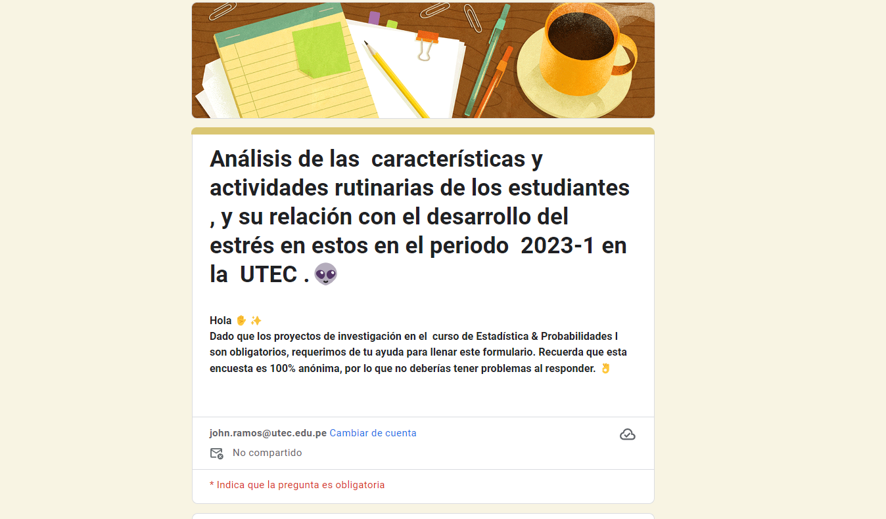
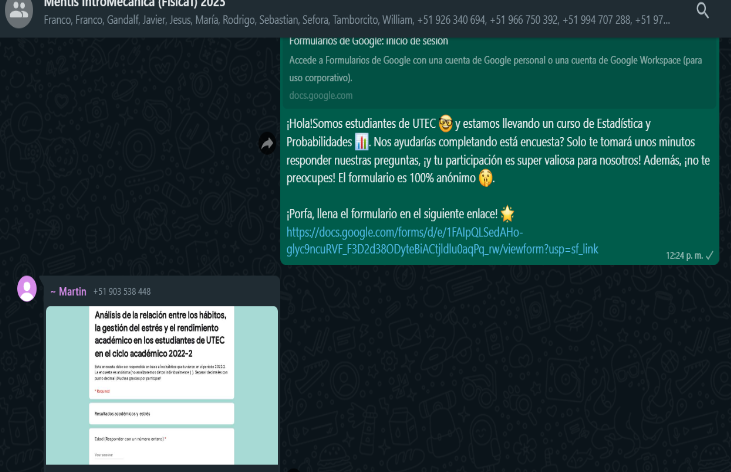

## **Título del trabajo**

  Análisis de los factores y actividades  propias de la vida universitaria, y su relación con el desarrollo del estrés en los estudiantes de la UTEC durante el periodo  2023-1.

## **Introducción**


La vida universitaria es un período lleno de desafíos y oportunidades para el crecimiento personal y académico de los estudiantes. Durante esta etapa, los estudiantes se enfrentan a diversas situaciones, actividades y factores que pueden influir en su bienestar emocional y físico. En particular, el estrés es un fenómeno ampliamente reconocido como una consecuencia común de la vida universitaria, que puede afectar negativamente la salud y el rendimiento académico de los estudiantes.

El objetivo principal de este estudio es analizar los factores y actividades propias de la vida universitaria y su relación con el desarrollo del estrés en los estudiantes de la UTEC durante el periodo 2023-1. La UTEC, como una institución educativa privada peruana de renombre y enfoque especializada en ingeniería, proporciona un entorno único y desafiante para la investigación de esta temática en particular.

La investigación se centrará en comprender y exponer la relación entre diversas situaciones, actividades y factores que son propias y características de la vida universitaria, es decir que estan presentes en mayor o menor medida en la vida de todos los estudiantes universitarios, y los niveles de estrés que estos pueden llegar a experimentar. Estos factores incluyen, entre otros, la carga académica y la presión por obtener buenas calificaciones, la dedicación de varias horas al estudio, la falta de tiempo para actividades recreativas y de descanso, las exigencias de transporte y desplazamiento, y la conciliación de responsabilidades personales y académicas.

Es importante destacar que este estudio no pretende generalizar los resultados a todas las instituciones educativas o a todos los estudiantes universitarios en el Perú. Sin embargo, al enfocarnos en la UTEC, buscamos obtener datos y análisis más precisos y contextualizados, que permitan comprender la dinámica específica de esta institución, conocida nacionalmente por su alta exigencia y carga académica, y su impacto en el estrés de los estudiantes. Cabe mencionar que de buscar usar los datos obtenidos en este estudio como base para alguna investigación, los resultados serán próximos a los del estudios siempre y cuando se repliquen las características principales de la UTEC, como lo son la alta exigencia académica, enfoque peculiar en la evaluación de los cursos, intensidad de carga académica, contexto cultura, social y académico centrado en la ingeniería, etc.

Para llevar a cabo esta investigación, se utilizará un enfoque mixto que combina métodos cuantitativos y cualitativos. Se recopilarán datos a través de encuestas, entrevistas y registros académicos, con el objetivo de obtener una visión completa y enriquecedora de los diversos aspectos relacionados con el estrés en los estudiantes de la UTEC.

Los resultados de este estudio no solo contribuirán al conocimiento académico en el campo de la psicología y la salud estudiantil, sino que también servirán como base para el desarrollo de estrategias y programas de intervención orientados a mejorar el bienestar y la calidad de vida de los estudiantes universitarios. La UTEC, como institución comprometida con el éxito y el desarrollo integral de sus estudiantes, se beneficiará de los hallazgos de esta investigación para implementar medidas efectivas que ayuden a mitigar el estrés y promover un entorno de aprendizaje mas saludable.


#### **Relevancia**

La relevancia de este estudio radica en su capacidad para arrojar luz sobre un tema de gran importancia en el contexto universitario. El estrés es una preocupación cada vez más presente en la vida de los estudiantes, y comprender los factores y actividades propias de la vida universitaria que están relacionados con su desarrollo es fundamental para abordar este problema de manera efectiva.

Al investigar la relación entre situaciones, actividades y factores específicos de la vida universitaria y los niveles de estrés en los estudiantes de la UTEC, este estudio proporcionará información valiosa para el diseño de estrategias de intervención y políticas institucionales que promuevan el bienestar estudiantil.

Los hallazgos de este estudio permitirán identificar áreas clave en las que se debe prestar atención y tomar medidas para reducir el estrés y mejorar la calidad de vida de los estudiantes. Estas medidas pueden incluir la implementación de programas de apoyo psicológico y emocional, la promoción de un equilibrio saludable entre el estudio y las actividades recreativas, la mejora de la gestión del tiempo y la creación de espacios de descanso adecuados en el campus universitario.

Además, este estudio contribuirá al cuerpo de conocimiento existente en el campo de la psicología y la salud estudiantil, llenando un vacío de investigación en el contexto específico de la UTEC. Los resultados obtenidos podrán ser utilizados tanto a nivel académico como institucional, proporcionando una base sólida para futuras investigaciones y ayudando a otras instituciones educativas a comprender y abordar los desafíos relacionados con el estrés en sus propios entornos universitarios.

En última instancia, la relevancia de este estudio radica en su potencial para generar un impacto positivo en la vida de los estudiantes universitarios de la UTEC y en la comunidad académica en general. Al abordar de manera integral el tema del estrés en el contexto universitario, se sentarán las bases para el desarrollo de estrategias efectivas que fomenten un ambiente propicio para el aprendizaje, el crecimiento personal y el bienestar general de los estudiantes.
    
  
    
#### **Objetivos**


* Describir e identificar las situaciones, actividades y características propias de la vida universitaria , para así, relacionarlas con el estrés estudiantil.

* Relacionar los factores comunes  entre los estudiantes que reporten mayores o menores niveles de estrés, y así, comparar y determinar el nivel en que las distintas variables están generando estrés en ellos. 

* Comprender las características de los estudiantes que presentan niveles bajos y altos de estrés. 


#### **Contexto**

La vida universitaria es una etapa crucial en el desarrollo personal y académico de los estudiantes. Durante este periodo, los estudiantes se enfrentan a una serie de retos y experiencias que los moldean como profesionales y seres humanos. La vida universitaria se caracteriza por una carga académica exigente, la necesidad de gestionar el tiempo de manera eficiente, la participación en actividades extracurriculares, el establecimiento de relaciones sociales y la búsqueda de equilibrio entre el estudio y el disfrute de la vida estudiantil.

En el caso específico de la Universidad de Ingeniería y Tecnología (UTEC), ubicada en el distrito de Barranco, Perú, la vida universitaria adquiere una dimensión única. Esta institución de renombre se destaca por su enfoque en la formación de ingenieros altamente capacitados y su metodología educativa innovadora. Los estudiantes de UTEC se encuentran inmersos en un entorno académico riguroso, donde se les desafía a desarrollar habilidades técnicas y científicas de vanguardia.

Además, la ubicación de UTEC frente al malecón de la ciudad brinda un entorno inspirador y estimulante para los estudiantes. El escenario costero ofrece un espacio ideal para el intercambio de ideas, la creatividad y el desarrollo de proyectos innovadores. Sin embargo, también implica que muchos de los estudiantes enfrenten el desafío de vivir a cierta distancia de la universidad, teniendo que enfrentarse al tráfico y planificar su tiempo de manera eficiente para cumplir con sus responsabilidades académicas y personales.

La vida universitaria en UTEC se caracteriza por una alta intensidad y exigencia, pero también por la oportunidad de formar parte de una comunidad académica vibrante y diversa. Los estudiantes tienen acceso a instalaciones modernas y tecnológicas, así como a programas y actividades extracurriculares que fomentan su desarrollo integral. Además, la metodología única de UTEC promueve el aprendizaje práctico y la aplicación de los conocimientos adquiridos en situaciones reales, preparando a los estudiantes para enfrentar los desafíos del mundo laboral.


## **Datos**

### **Recolección de datos**

Como instrumento de recolección decidimos  utilizar una encuesta con muestreo por conveniencia. Después de largas sesiones  grupales, determinamos cuáles eran las preguntas que nos ayudarían a obtener los datos necesarios para concluir de manera satisfactoria nuestro estudio. Las preguntas las realizamos de tal manera que cubrimos cada una de las variables propuestas y que cumplieran con darnos insights importantes dentro de las rutinas universitarias, para poder establecer una relación entre una determinada acción/situación con el desarrollo del estrés en un estudiante. Una vez determinadas las preguntas a utilizar, creamos un google forms, donde colocamos las preguntas en una progresión simple que mantuviera coherencia con el tema en específico del cual se intenta obtener información. 

A continuación se puede observar las preguntas realizadas por nuestro estudio y su distribución en el google forms:


### -


{width='300px' height='200px'} 

### -

{width='300px' height='200px'} 

### -


{width='500px' height='200px'} 

### -

{width='300px' height='200px'} 


Ya con la encuesta lista, el método de distribución fue principalmente virtual. Cada integrante del grupo se encargó de pedirle a cada uno de sus contactos que por favor rellenará la encuesta y la compartiera para llegar a más personas. De igual forma, se compartió el link de la encuesta en diversos grupos de estudiantes de UTEC, y se difundió masivamente a través de los correos académicos. 

Para conseguir resultados de forma más rápida, se recurre también a compartir la encuesta presencialmente con ayuda de ciertos incentivos, sean estos caramelos,chocolates,galletas,etc; los cuales regalamos a cada persona que escanee el código QR de nuestra encuesta y la complete.

### -

{width="30%"}


### **Población, muestra y muestreo**
  
Para esta parte del proyecto el muestreo de nuestro que utilizaremos es probabilístico por conveniencia, se usará una fuente primaria que en este caso vendría a ser la encuesta antes mencionada. Por ende, se ha creado un documento forms con las variables y observaciones necesarias para el estudio del tema ( 250 observaciones )

* Fuente primaria: Estudiantes de UTEC de diferentes carreras y ciclos.
* Forma  de difusión: Mensajes que contienen el link del formulario.

### -
{width='300px' height='200px'} 

### -

{width='300px' height='200px'} 

### -

{width='300px' height='200px'} 

### -


Nuestra encuesta es totalmente anónima. Las encuestas también se compartirán en persona, como también compartir por correo, whatsapp y telegram (solo el grupo del curso de estadística) o redes sociales relacionadas con la universidad para así obtener más información y se le solicitará al encuestado que la comparta con otros estudiantes de ser posible.


Link de la encuesta:

https://docs.google.com/forms/d/e/1FAIpQLSedAHo-glyc9ncuRVF_F3D2d38ODyteBiACtjldlu0aqPq_rw/viewform?usp=sf_link


### **Variables**


#### *__*Cuantitativas*__*

##### *__*Variable Cuantitativas Discretas*__*

* Cantidad de cursos.
* Horas de sueño.
* Horas de ocio.
* Edad.
		
##### *__*Variable Cuantitativas Continuas*__*

* Tiempo de traslado entre su domicilio y la UTEC.
* Tiempo de estudio fuera de clases.
* Distancia en km entre su domicilio y la UTEC.

#### *__*Categóricas *__*

##### *__*Variable Categóricas Nominales*__*

* Sexo.
* Modo de transporte.
* Personalidad.
* Hobbies.
* Carrera Universitaria.
* Zona de vivienda.


##### *__*Variable Categóricas Ordinales*__*

* Calidad de educación previa.
* Intensidad de los cursos. dificultad de los cursos.
* Escala actual de la matrícula.
* Nivel de estrés.
* Ciclo Académico.


### **Limpieza de base de datos**

```{r}
# CARGAR EL install.packages("readr") si faltara un libreria externa.

# En comentario, dado que no es necesario cargarlo constantemente. 
# install.packages("readr")
library(readr)
library(dplyr)
library(stringi)
library(car)
```

```{r}
DF <- read_csv("Respuestas.csv")
DF

```


Al principio, no nos habíamos percatado de que una de las preguntas de nuestro forms, no estaba configurada como obligatoria. Por lo tanto,
hubo un encuestado que se salto aquella interrogante. 

Dado que nos dimos cuenta de inmediato, pudimos modificarla y no volver a tener ni un otro dato NA. Sin embargo, al pasarlo al RStudio,
el dataframe de nuestro trabajo, nos hizo eliminar aquella fila en la que habia ese unico dato faltante. A continuacion el código empleado.


```{r}

DF[13,]

filas_inservibles <- which(rowSums(is.na(DF)) >= 1)
filas_inservibles
DF[-filas_inservibles,] -> DF

DF
```


```{r}
edad  <- DF$`¿Cuántos años tienes?`

horas_de_estudio_por_persona_al_dia <- DF$`Horas de estudio fuera de clases.  ¿ Cuanto tiempo le dedicas a las tareas, repasos e investigación ?

Nota:  
-  1.5 horas  =  1 hora y 30 minutos
-  2.5 horas  =  2 horas y 30 minutos
                      ...
-  8.5 horas  =  8 horas y 30 minutos.`
                      
                      
nivel_de_estres_a_escala <-  DF$`Nivel de estrés. De la escala del 1 al 10 ¿ Cuál consideras que es tu nivel de estrés promedio durante un ciclo universitario  ?`

promedio_de_cant_cursos <- mean(DF$`Numero de cursos. ¿ Cuántos cursos estas llevando ?`, na.rm=TRUE)
                       
                      
                      
horas_de_sueño <- DF$`Horas de sueño. ¿ Cuántas horas sueles dormir al día en una semana de clases ?

Nota:  
-  2.5 horas  =  2 hora y 30 minutos
-  3.5 horas  =  3 horas y 30 minutos
                      ...
-  8.5 horas  =  8 horas y 30 minutos.`
                      
                      
horas_de_ocio <-  DF$`Horas de ocio.  ¿ Cuántas  horas al día  realizas otras cosas externas al estudio y relacionadas al entretenimiento ?

Nota:  
-  1.5 horas  =  1 hora y 30 minutos
-  2.5 horas  =  2 horas y 30 minutos
                      ...
-  8.5 horas  =  8 horas y 30 minutos.`
                      
                                      

intensidad_de_los_cursos <-  DF$`De la escala del 1 al 5, ¿ qué tan dificiles consideras los cursos que te encuentras llevando  durante este ciclo ?`
                      
ciclo_academico <-  DF$`Ciclo académico. ¿En que ciclo te encuentras ahora?`


                      
cantidad_De_cursos <-  DF$`Numero de cursos. ¿ Cuántos cursos estas llevando ?`


Distancia_UTEC_entre_CASA <- DF$`Distancia entre tu casa y la universidad. ¿  A cuántos kilómetros aproximadamente se encuentra tu casa a la universidad ?

Nota: 
- Ingrese su respuesta en decimales, empleando el  punto "."`


tiempo_de_traslado_entre_casa_y_utec <-  DF$`Tiempo de traslado entre su domicilio y UTEC.  ¿ Cuánto tiempo (en minutos) te demoras en trasladarte de tu domicilio a la universidad ?

Nota: 

- 60 minutos = 1 hora

- 90 minutos = 1 hora y 30 minutos

- 120  minutos = 2 horas

- 150 minutos = 2 horas y 30 minutos

- 160 minutos = 3 horas`


calidad_de_educacion_previa <-  DF$`Calidad de educación previa. ¿ Qué tipo de educación previa consideras tener ?`

medio_de_trasporte <- DF$`Tipo de trasporte. ¿ Qué medio de transporte usas a menudo o como te movilizas hacia la universidad ?`
```


## **Análisis descriptivo**


#### *__*Media y Mediana*__*

La media es un valor que nos ayuda a encontrar un punto de referencia en un conjunto de datos. En si es la suma de todos los valores dividida por la cantidad total de valores, mientras que la mediana es el valor central en un conjunto de datos ordenados. La media es útil para obtener un valor promedio y la mediana nos brinda una representación del valor central del conjunto de datos.

Tanto la media como la mediana de la cantidad de horas de estudio al día para los estudiantes en este conjunto de datos específico es de 5 horas la media y la mediana. Esto nos indica que en promedio un estudiante estudia 5 horas al día sus cursos. Estas medidas nos ayudan a tener una idea de la tendencia central y la distribución de las horas de estudio en este grupo de estudiantes.

```{r}

round(mean(horas_de_estudio_por_persona_al_dia))
median(horas_de_estudio_por_persona_al_dia)

```


#### *__*Desviacion estandar*__*

Se calculará la desviación estándar de variables como las horas de estudio, para analizar la dispersión de los datos. Esto nos permitirá comprender qué tan diferentes pueden ser los valores en relación con el promedio y evaluar la precisión de los datos.

Por ejemplo, podemos comparar qué tan diferentes son las horas de estudio de los estudiantes. Así podremos saber su precisión, si hay mucha diferencia entre ellos o si son más similares.

Al calcular la Desviación Estándar nos indica qué tan dispersas están las horas de estudio al día en relación con la media. Si la desviación estándar es baja, significa que las horas de estudio tienden a agruparse cerca de la media. Por el contrario, una desviación estándar alta indica que las horas de estudio están más dispersas y varían considerablemente.


```{r}

sd(horas_de_estudio_por_persona_al_dia)

```


#### *__*Histograma*__*

Un histograma puede ser útil para visualizar la distribución de variables cuantitativas como la cantidad de tiempo de estudio fuera de clases. Al representar la frecuencia de los valores en diferentes rangos, el histograma proporciona una visión general de cómo se distribuyen los datos y si hay alguna tendencia o patrón. 


Al calcular el histograma del nivel de estrés nos permite visualizar la distribución de los niveles de estrés de los estudiantes universitarios y observar si hay algún patrón o tendencia. Podemos identificar intervalos donde se concentran más o menos estudiantes, lo que nos da una idea de los niveles de estrés predominantes. El histograma si es una herramienta útil para analizar y comprender la distribución de los niveles de estrés en los estudiantes universitarios.

```{r}

hist(nivel_de_estres_a_escala, main = "Frecuencia de nivel de estrés", xlab="Nivel de estrés",         
        ylab="Frecuencia",col = "purple")

```


#### *__*Media*__*


Calcular la media de la cantidad de cursos que los alumnos están tomando en nuestra encuesta sobre el estrés nos proporciona una medida central que indica el promedio de cursos que cada alumno ha tomado. Esto nos es útil para comprender la carga académica promedio de los alumnos, identificar tendencias o patrones en la cantidad de cursos y comparar diferentes grupos de alumnos.


```{r}

round(promedio_de_cant_cursos)

```

#### *__*Correlación*__*

Hallar la correlación y la covarianza entre las horas de sueño y las horas de estudio en nuestra encuesta sobre el estrés universitario es importante para comprender la relación entre ambos factores, evaluar su impacto en el estrés de los estudiantes, identificar patrones de comportamiento y diseñar estrategias de intervención efectivas.

Al realizar los calculos podemos observar que la correlación y la covarianza entre las horas de sueño y las horas de estudio resultan ser iguales, significa que la relación entre estas dos variables es lineal y directa. Sin embargo, es importante tener en cuenta que la igualdad de la correlación y la covarianza no nos dice nada sobre la causalidad de la relación. No podemos concluir que el sueño causa el aumento en las horas de estudio o viceversa, ya que la correlación y la covarianza solo miden la asociación entre las variables, no la relación causal. Para determinar una relación causal, se necesitarían investigaciones adicionales y un diseño de estudio adecuado.

```{r}
cor(horas_de_sueño,horas_de_estudio_por_persona_al_dia)
cor(horas_de_estudio_por_persona_al_dia,horas_de_sueño)
cov(horas_de_sueño,horas_de_estudio_por_persona_al_dia)/(sd(horas_de_sueño)*sd(horas_de_estudio_por_persona_al_dia))
```


#### *__*Gráficos  de cajas y bigotes*__*

Gráfico de cajas y bigotes (boxplot): El gráfico de cajas y bigotes es útil para representar la distribución de variables cuantitativas y compararlas entre diferentes categorías de variables categóricas ordinales, como la calidad de educación previa, intensidad de los cursos, escala actual de la matrícula, nivel de estrés y ciclo académico. El boxplot muestra la mediana, los cuartiles y los valores atípicos, lo que permite comparar fácilmente la distribución de las variables en diferentes categorías.


El boxplot nos permite visualizar y comparar la intensidad de los cursos en relación al ciclo académico. Podemos identificar que hay patrones o tendencias en la intensidad de los cursos a medida que los estudiantes avanzan en el ciclo académico. Además, el boxplot nos ayuda a identificar valores atípicos que podrían requerir una atención especial o un análisis más detallado. En resumen, el boxplot es una herramienta útil para analizar la relación entre el ciclo académico y la intensidad de los cursos en un conjunto de datos.

```{r}

boxplot( ciclo_academico ~ intensidad_de_los_cursos, data = DF, main = "Gráfico de cajas", xlab = "Intensidad de cursos", ylab = "Ciclo académico")

```


#### *__*Histograma*__*

Un histograma puede ser útil para visualizar la distribución de variables cuantitativas comola cantidad de tiempo de estudio fuera de clases. Al representar la frecuencia de los valores en diferentes rangos, el histograma proporciona una visión general de cómo se distribuyen los datos y si hay alguna tendencia o patrón.


El histograma es una herramienta útil para analizar la distribución de las horas de estudio al día de los alumnos, lo que nos proporciona información importante sobre los hábitos de estudio en un grupo determinado. Esto nos ayuda a comprender mejor cómo se distribuyen las horas de estudio y a identificar posibles áreas de mejora o enfoque en el estudio de los alumnos. En este podemos observar como hay una tendencia mayor por parte de los estudiantes a estudiar mas de 4 horas sus cursos.

```{r}


hist(horas_de_estudio_por_persona_al_dia, breaks = "Sturges", main = "Histograma", xlab = "Horas de estudio", ylab = "Cantidad de estudiantes")


```

#### *__*Diagrama de dispersión*__*

Un diagrama de dispersión puede ser útil para visualizar la relación entre dos variables cuantitativas, como la cantidad de cursos y las horas de sueño. Cada punto en el gráfico representa una observación y su ubicación en los ejes x e y muestra los valores de las dos variables. Esto te permitirá identificar si existe alguna relación o patrón entre las variables.

El diagrama de dispercion es una herramienta útil para analizar la relación entre la cantidad de cursos y las horas de sueño de los alumnos. Nos proporciona una representación gráfica que nos permite identificar posibles relaciones y patrones entre estas variables, lo que puede ser útil para el estudio y la comprensión de los hábitos de estudio y descanso de los alumnos.


```{r}

plot(cantidad_De_cursos,  horas_de_sueño, main = "Diagrama de dispersión", xlab = "Cantidad de cursos", ylab = "Horas de Sueño")
plot(horas_de_estudio_por_persona_al_dia, horas_de_sueño,, xlab="Horas de estudio",         
        ylab="Horas de sueño", main = " Horas de sueño - horas de estudio ",col="blue")

```


#### *__*Boxplot*__*

En el siguiente gráfico analizaremos la relación entre el nivel de estrés y las horas de sueño, pues consideramos que un cuerpo bien descansado podría significar que el estudiante se encuentre mas relajado.
  
```{r}
  boxplot(nivel_de_estres_a_escala ~ horas_de_sueño,main = "Nivel de estres- Horas de sueño", ylab = "nivel de estres", xlab = "Horas de sueño", col = "violet" )
```

Según la gráfica encontramos que en efecto, el nivel de estrés suele bajar a medida que las horas de sueño aumentan, especialmente para las 8 horas de sueño y a excepción de algunos datos atípicos.

Entonces usaremos correlación o diagrama de dispersión / de puntos  y regresión lineal para encontrar que causas podrían estar causando las faltas de sueño en los estudiantes.


#### *__*Diagrama de dispersión*__*

En el gráfico podemos observar que existe una correlación negativa pero débil entre la horas de sueño y las horas de estudio entre los estudiantes, por ello es que la linea que se forma es bastante ancha. Su débil correlación se podría atribuir a que el estudio no es la única actividad que toma tiempo de las horas de sueño. Por ejemplo con el siguiente gráfico con las horas de ocio.

```{r}

cor(horas_de_sueño,horas_de_estudio_por_persona_al_dia)
cor(horas_de_estudio_por_persona_al_dia,horas_de_sueño)
cov(horas_de_sueño,horas_de_estudio_por_persona_al_dia)/(sd(horas_de_sueño)*sd(horas_de_estudio_por_persona_al_dia))
  


plot(horas_de_estudio_por_persona_al_dia, horas_de_sueño,, xlab="Horas de estudio",         
        ylab="Horas de sueño", main = " Horas de sueño - horas de estudio ",col="blue")


```


Sin embargo, averiaguamos sorpresivamente que la correlación es positiva e incluso mas debil que las horas de estudio con respecto a las horas de sueño. Asi que este no parece ser un factor de mayor relevancia en cuanto a las horas de sueño. Asi que seguimos buscando otros factores que influyan en las horas de sueño.


En el tiempo de traslado tambien encontramos una correlacion negativa, esto puede esperarse debido a los alumnos que deben de levantarse temprano para poder llegar a tiempo a sus clases. Sin enbargo la correlacion sigue siendo debil tambien.


```{r}

tiempo_de_traslado_entre_casa_y_utec <-  DF$`Tiempo de traslado entre su domicilio y UTEC.  ¿ Cuánto tiempo (en minutos) te demoras en trasladarte de tu domicilio a la universidad ?

Nota: 

- 60 minutos = 1 hora

- 90 minutos = 1 hora y 30 minutos

- 120  minutos = 2 horas

- 150 minutos = 2 horas y 30 minutos

- 160 minutos = 3 horas`


cor(horas_de_sueño, tiempo_de_traslado_entre_casa_y_utec)
cor(tiempo_de_traslado_entre_casa_y_utec,horas_de_sueño)
cov(horas_de_sueño,tiempo_de_traslado_entre_casa_y_utec)/(sd(horas_de_sueño)*sd(tiempo_de_traslado_entre_casa_y_utec))
plot(tiempo_de_traslado_entre_casa_y_utec, horas_de_sueño,, xlab="tiempo de traslado entre casa y utec",         
        ylab="Horas de sueño", main = " Horas de sueño - tiempo de traslado entre casa y utec ",col="red")

```


#### *__*Barplot*__*


```{r}


barplot( table(DF$`Nivel de estrés. De la escala del 1 al 10 ¿ Cuál consideras que es tu nivel de estrés promedio durante un ciclo universitario  ?`),main = "Nivel de estrés", col = "Green")


```

Determinamos el valor intermedio del tiempo dedicado al ocio o relajación entre los estudiantes. Esto nos proporcionará información sobre el tiempo promedio que los estudiantes dedican a actividades de recreación fuera de sus responsabilidades académicas y cómo afectan estos valores a sus niveles de estrés

Como vemos, la mediana de las horas de ocio es 3.5 horas, lo cual nos quiere decir que los estudiantes de la utec generalmente dedican un tiempo moderado para relajarse, a excepcion de la persona que se toma 8,5 horas al dia para descansar lo cual es mas del doble.


```{r}

# Valor intermedio de las horas de Ocio.


boxplot(horas_de_ocio, main = " Horas de ocio - boxplot ",col="YELLOW",horizontal = TRUE)
boxplot.stats(horas_de_ocio)
median(horas_de_ocio)

```


#### *__*Barplot 1.1 *__*
 
En este boxplot múltiple, podemos observar la relación entre el nivel de estres y la cantidad de cursos que lleva un estudiante de la utec mediante un ciclo. Los estudiantes que mas cursos llevan son lo que generalmente presentan mas niveles de estres, sim embargo hay algunas observaciones que notar.

Los que llevan 5 cursos tienen una media de estres mas alta que aquellos que llevan 5 cursos, pero sus cuartiles son similares.

Los que llevan 2 cursos extrañamente son los que presentan un nivel de estres muy alto, con rangos intercuartiles muy bajos mientras los que llevan 7 y 8 cursos presentas niveles de estres altos mas esperables.


```{r}
#Nivel de estres y cantidad de cursos

boxplot(nivel_de_estres_a_escala ~ cantidad_De_cursos ,main = "Nivel de estres - Cantidad de cursos",ylab = "Nivel de estres", xlab = "Cantidad de cursos",col="purple")

```

#### *__*Barplot 1.2 *__*

Indagando mas a fondo a estos fenomenos, vemos que la intensidad de los cursos y su cantidad tienen una realcion similar a la anterior. Podria ser el caso debido a que un estudiante suele estar mas estresado a medida que toma mas cursos y por ende los percibe mas intensos.

Nota aparte, las pecurialidades de las personas que llevan de 1 a 3 cursos probablemente se deban a sus pocas observacione, ya que solo 2, 3 y 2 personas llevan 1 curso, 2 cursos y 3 cursos respectivamente.


Despues  Analizaremos la intensidad de los cursos y el nivel de estres para seguir explorando estas relaciones.

```{r}
table(cantidad_De_cursos)
barplot(table(cantidad_De_cursos),col="green", main = "Frecuencia de la cantidad de cursos")

boxplot(intensidad_de_los_cursos~cantidad_De_cursos,col="red",main = "Intensidad de cursos - Cantidad de cursos",ylab = "Intensidad de los cursos", xlab = "Cantidad de cursos") 
```


#### *__*Mosaico *__*

Utilizaremos gráficos de barras para describir cómo varía la intensidad de los cursos en cada ciclo académico. Además, investigaremos cuáles son los ciclos más y menos difíciles en términos de carga académica

```{r}
# Intensidad de los cursos y Nivel de estrés

mosaicplot(table(intensidad_de_los_cursos,nivel_de_estres_a_escala),xlab="Intensidad de los cursos ", ylab="Nivel de estres ",main = "Intensidad de los cursos - el nivel de estrés ",color = 5:8)


```

#### *__*Mosaico 1.1*__*

Para poder visualizar los datos de una manera entendible, se crean 4 mosaicos cada uno cubriendo 3 ciclos a excepcion del 4to que cubre solo 1 pero repite al 9 para propositos de comparacion. Podemos observar que la intensidad de los cursos se mantiene mayoritariamente en 3 O  4 casi independientemente del ciclo a exepcion del 9no ciclo donde se percibe una intensidad menor y el 10mo ciclo percibe la mayor de 5.


```{r}

#  Intensidad de los cursos vs el ciclo académico: mosaico


# MOSAICO
tabla1 <- table(intensidad_de_los_cursos[ciclo_academico <= 3],ciclo_academico[ciclo_academico <= 3])

tabla2 <- table(intensidad_de_los_cursos[ciclo_academico <= 6  & ciclo_academico  >= 4],ciclo_academico[ciclo_academico <= 6 & ciclo_academico  >= 4 ])

tabla3 <-table(intensidad_de_los_cursos[ciclo_academico <= 9  & ciclo_academico  >= 7],ciclo_academico[ciclo_academico <= 9  & ciclo_academico  >= 7 ])

tabla4 <- table(intensidad_de_los_cursos[ciclo_academico >= 9],ciclo_academico[ciclo_academico >= 9])


mosaicplot(tabla1,   xlab="Intensidad de los cursos",         
        ylab="ciclo académico", main ="Intensidad de los cursos - ciclo académico (1-3) ",color = 3:6)

mosaicplot(tabla2,   xlab="Intensidad de los cursos",         
        ylab="ciclo académico", main ="Intensidad de los cursos - ciclo académico (4-6)",color = 5:8)

mosaicplot(tabla3,   xlab="Intensidad de los cursos",         
        ylab="ciclo académico", main ="Intensidad de los cursos - ciclo académico (7-9)",color = 9:11)

mosaicplot(tabla4,   xlab="Intensidad de los cursos",         
        ylab="ciclo académico", main ="Intensidad de los cursos - ciclo académico (10)",color = 12:13)


```


#### *__*Barplot & variabilidad*__*

Variabilidad en el tiempo de estudio: Promedio

diagrama de barras de promedios - barplot
Calcularemos la variabilidad en el tiempo dedicado al estudio fuera de clases entre los estudiantes de la UTEC. Esto nos ayudará a comprender cómo difieren los estudiantes en términos de dedicación al estudio y sus niveles de estrés.


```{r}

# Variabilidad en el tiempo de estudio
tiempo_de_estudio = table(horas_de_estudio_por_persona_al_dia)


barplot(tiempo_de_estudio,                       #B) Se aplica barplot a esa tabla
        main="Tiempo de estudio fuera de clases - Diagrama de barras",      #C) Título principal     
        xlab="HORAS DE ESTUDIO",         
        ylab="Frecuencia",             #E) Título del eje Y
        ylim = c(0, 30),      #G) Ajustar límites en eje Y
        col=c("yellow","brown")         #H) Colorear las barras
        )                               #I) No olvidar cerrar el paréntesis
```

#### *__*Barplot*__*

Como se observa, los estudiantes de la utec dedican principalmente 6 horas de estudio al dia, pero no demasiado lejos de 3, 7 u 8 horas de estudio. En general, se puede decir que los estudiantes de la utec son bastantes aplicados. 

Sin embargo, toca visualizar como se relaciona con el estres.

```{r}
boxplot(nivel_de_estres_a_escala ~ horas_de_estudio_por_persona_al_dia, ylab = "Nivel de estres", xlab = "Horas de estudio al dia", col = "yellow", main = "Nivel de estres - Horas de estudio")
```


Como vemos, las horas de estudio conllevan un aumento de niveles de estres desde una hora hasta las 5.5 horas, teniendo una bajas a las 7.5 horas para volver a subir. De 2 a 4 horas es mas o menos constante. Los estudiantes del la utec mas aplicados y con exitos academicos podrian ser los datos atipicos con bajos niveles de estres puesto que a pesar de sus largas jornada de estudio, presentan niveles de estres bajos. Pero, en general, los estudiantes de la utec se encuentran con un nivel de estres moderado o alto. 


#### *__*Table*__*


Usando el comando table podemos ver que el valor o en este caso el valor de la escala que mas se repite es el 7 con 31. Sin embargo tabien podemos ver que la escala 8 con 30 respuestas muestra una frecuencia cercana a la escala 8 de un total de 152 observaciones.Asi mismo es importante ver los datos con un enfoque mayor como  y por ello se usa un histograma. 
**niveles de estres del 1 al 10**

```{r}
#Variable nivel de estres
#Frecuencia de nivel de estres 
table(nivel_de_estres_a_escala)
nrow(DF)##total de observaciones
```


```{r}
X <- nivel_de_estres_a_escala 
```


#### *__*Histograma*__*


El histograma nos permite ver la distribucion de la variable nivel de estres. Esto con ayuda de una frecuencia relativa para ver los resultados en terminos de porcentaje, en el grafico se puede ver que hay mucha variabilidad, ya que el centrado de los datos se aleja a la derecha, por lo tanto la distribucion no es equitativa y notoriamente hay mas encuentados que sientes un estres de  7 y 8.

Tomando en cuenta la frecuencia relativa, se puede ver que las respuestas de los niveles de estres  7 y 8 representan entre 40 y 50 porciento del total de las observaciones o encuestados, y por lo tanto casi mas de la mitad de los encuestados presentan estos niveles de estres .


```{r}
hist(X, breaks = 15, xlim = c(0, 10), ylim = c(0, 0.5), main = "Frecuencia del nivel de estres", xlab = "Niveles de estres", ylab = "Frecuencia", probability = T)
# Función de Densidad Real con density()
lines(density(X), lwd = 1.5, col = "red")
```

#### *__*Histograma + *__*


```{r}
table(ciclo_academico)
```

Se puede ver que dentro de las observaciones 46 encuestados con de tercer, ciclo que a comparacion de los demas muestra una cantidad grande.

```{r}
r<-table(ciclo_academico)

round(prop.table(r),2)#porcentaje como fracciones decimales
```

Se puede ver que de los encuestados  de segundo, tercer y cuarto ciclo forman casi el 60 % de observaciones.

```{r}
# Variable Dificultad de los cursos
table(intensidad_de_los_cursos)
```

Se puede observar como hay mayor cantidad de respuesta con respecto a la dificultad de curso de una escala del 1 al 5 el 4 es el que tiene mayor respuesta.

```{r}
y <- intensidad_de_los_cursos
```

```{r}
r<-table(intensidad_de_los_cursos)

round(prop.table(r),2)
```


El histograma nos permite ver la distribucion de la variable nivel de dificultad del curso. Esto con aydua de una frecuencia relativa para ver los resultados en terminos de porcentaje, el grafico se puede ver que hay una variabilidad notable,por parte de las escalas 3 y 4.Entonces la mayoria de los estudiantes siente que los cursos que ellos llevan tiene un adificultad de 4 o 3.

Tomando en cuenta la frecuencia relativa, se puede ver que la dificultad de lso cursos de escala 4 y 3 es notablemente, este es mayor que las demas escalas y representan casi un 80 porciento de las respuestas del total de las observaciones o encuestados, por ello la mayoria siente que los cursos en los cuales estan matriculados son conciderados por ellos dificiles.


```{r}
hist(y, breaks = 6, xlim = c(1, 5), ylim = c(0, 1), main = "Frecuencia de dificultad de los cursos", xlab = "Dificultad de Cursos ", ylab = "Frecuencia", probability = T)


```

#### *__*Barplot*__*

Del grafico se puede expresar a simple vista  que hay como minimo 4 valores atipicos en el nivel de estres 2 ,4,5 y 10. Por otro lado se ve que en los niveles 7 , 8 y 9 se dan los valores los valores  mas altos para  el tiempo , ya que estos estan dentro de 150 y 200 min. Asi mismo se ve que hay mayor cantidad de respuestas de los que presentan un nivel 8 de estres, y de estos  almenoso el 25% de estudiantes tarda entre 60 y 100 min en llegar a la universidad, asi tambien como casi el 75% de estudiantes necesita de entre 40 a 150 min, para llegar de casa a la universidad todos los dias .

En cuanto a los que presentan un nivel 9 de estres, el 50% tarda entre 50 a 100 min en trasladarse de sus casas a la universidad, aunque la cantidad de respuestas recolectadas para este dato son menores que las del nivel 8, estos resultados muestran que la mayoria se encuentra en los niveles de estres 8 y 9, y que entos necesitan de entre 50 a 100 min par allegar a la universidad. Este análisis no permite ver que exite una relacion entre el tiempo de traslado de la casa a universidad, este es un hecho que se ve en la vida cotidiana de todos los estudiantes.

```{r}
  # Tiempo de traslado entre su domicilio y la UTEC, en relación al estrés autopercibido


boxplot(tiempo_de_traslado_entre_casa_y_utec~nivel_de_estres_a_escala , main = " Nivel de estres - Tiempo de traslado ( Casa a UTEC) ",xlab="Nivel de estres ", ylab="Tiempo de traslado(min) ( Casa a UTEC ) ", ylim = c(0,200),   DF = DF , frame = FALSE, col = c("#999999" ,"#E69F00", "#56b4E9"))


```

#### *__*Barplot*__*

```{r}
#Variable tiempo de estudio fuera de clases y cantidad de cursos.  

X<- cantidad_De_cursos 
Y<- horas_de_estudio_por_persona_al_dia  

```

```{r}
regresion <- lm(X ~ Y)
# Calcular la correlación entre las dos variables 
correlation <- cor(X, Y)

# Imprimir el resultado
print((correlation))
```

```{r}
plot(Y ~ X, las = 2, xlab = "N° cursos", ylab = "Horas de estudio")

abline(regresion, col = "red", lwd = 2)
```

En el grafico observamos una distribucion variada de los resultados, ya que no se muestran absolutamente las 153 observaciones, suponemos que algunas DE estas supepuestas.De ello podemos decir que probablemnete la cantidad d ecursos que lleva es 6  se lleven 6 cursos.


```{r}
table(cantidad_De_cursos )
```

En efectivo 67 personas estan matriculados para este periodo academico.En cuanto a la correlacion lineal de las variables, con el comando cor, muuestra que la correlacion lineal es de 0.28, que quiere decir que hay una relacion positiva.De  recta de regrecion lineal podemos influir que se genera una especie de dependendencia , ya que a mas cantidad de cursos los estudiantes emplean ligaramente mayor cantida de horas de estudio fuera de su horario academico dependiendo de la cantidad cursos.


Entonces de ello podemos mencionar que una caracteristica que une a los estudiantes e sque la mayoria de ellos lleva 6, por ende emplean mayor cantidad de tiempo en realizar tareas y trabajos adicionales.


```{r}
#Variable horas de sueño y distancia en km entre su domicilio y la UTEC

X<- horas_de_sueño
Y<- Distancia_UTEC_entre_CASA 
```

```{r}
regresion <- lm(X ~ Y)
# Calcular la correlación entre las dos variables 
correlation <- cor(X, Y)

# Imprimir el resultado
print((correlation))
```
```{r}
plot(Y ~ X, las = 2, xlab = "Horas de sueño ", ylab = "Distancia entre casa y Utec(Km)")

abline(regresion, col = "blue", lwd = 2)
```


Según el coeficiente de correlación, este muestra que es negativo y que se acerca al 0, por lo tanto la correlación de estas dos variables es poca. Sin embargo podemos ver que hay varias observaciones que  usualmente tienen de 5 ha 7 horas de sueño y que la mayoría de ellos la distancia de su casa a la universidad es menor.

Entonces esta es una de las situaciones, que se vive todos los días, y que como resultado hallamos de que las variables no guardan relación y de que no se afectan o influyen simultáneamente.


```{r}

# Valor promedio de horas de sueño.
round(mean(horas_de_sueño),2)


```

Asimismo, podemos ver que en promedio los estudiantes duermen 6.17 horas, a diferencia de algunos que solo duermen 2, este dato podría conciderarse alarmante, ya que la falta de sueño en las personas ocaciona problemas de salud severas.


